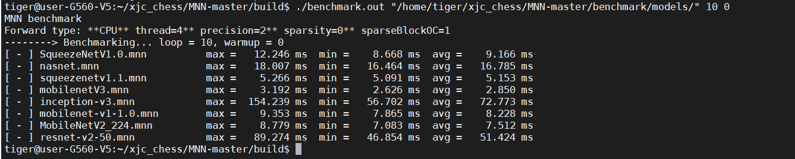
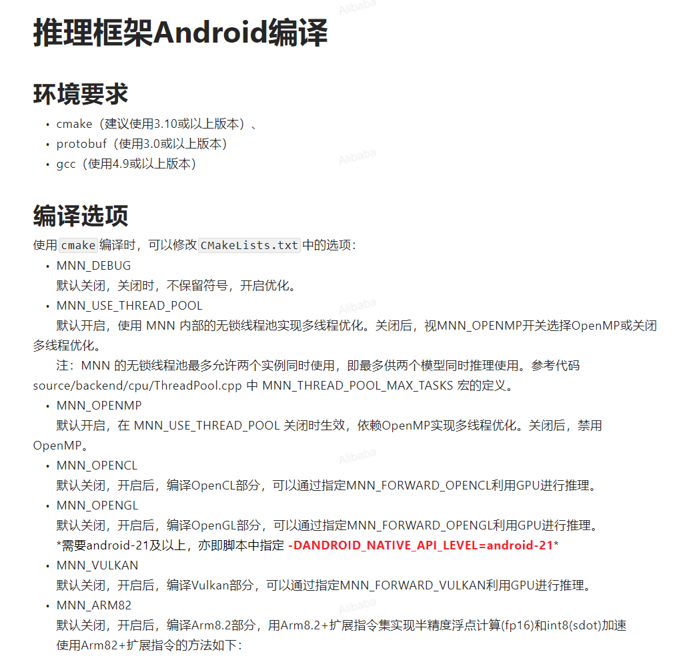
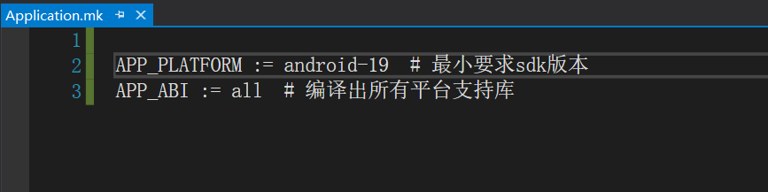
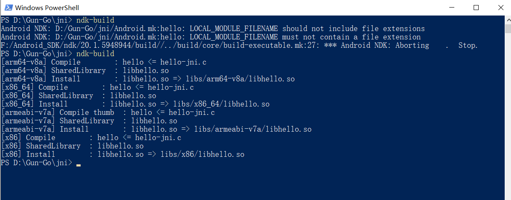

# 2021-10-11

## MNN

### 使用教程

[使用教程 - 《MNN - 深度神经网络推理引擎》 - 书栈网 · BookStack](https://www.bookstack.cn/read/MNN-zh/doc-Tutorial_CN.md)


Frontends：前端负责把别的架构转换为MNN结构

Graph optimize：通过算子融合、算子替代。布局调整来优化计算图

Engine：负责模型加载、计算u的调度

Backends：计算设备的内存分配、op算子实现


## **使用MNN进行机器学习的工作流程**


在端侧应用MNN，大致可以分为三个阶段：


- 训练

在训练框架上，根据训练数据训练出模型的阶段。虽然当前MNN也提供了训练模型的能力，但主要用于端侧训练或模型调优。在数据量较大时，依然建议使用成熟的训练框架，如TensorFlow、PyTorch等。除了自行训练外，也可以直接利用开源的预训练模型。

- 转换

将其他训练框架模型转换为MNN模型的阶段。MNN当前支持Tensorflow(Lite)、Caffe和ONNX的模型转换。模型转换工具可以参考[编译文档](cvrt_linux)和[使用说明](model_convert)。支持转换的算子，可以参考[算子列表文档](../en/ops)；在遇到不支持的算子时，可以尝试[自定义算子](customize_op)，或在Github上给我们[提交issue](https://github.com/alibaba/MNN/issues/74)。

此外，[模型打印工具](model_dump)可以用于输出模型结构，辅助调试。

除模型转换外，MNN也提供了[模型量化工具](tool_quantize)，可以对浮点模型进行量化压缩。

- 推理

在端侧加载MNN模型进行推理的阶段。端侧运行库的编译请参考各平台的编译文档：[iOS](build_ios)、[Android](build_android)、[Linux/macOS/Ubuntu](build_linux)、[Windows](build_windows)。我们提供了[API接口文档](https://github.com/alibaba/MNN/tree/master/doc/API)，也详细说明了[会话创建](create_session)、[数据输入](input)、[执行推理](run_session)、[数据输出](output)相关的接口和参数。demo/exec 下提供了使用示例，如图像识别 demo/exec/pictureRecognition.cpp ，图像实例分割（人像分割）demo/exec/segment.cpp

此外，[测试工具](tool_test)和[benchmark工具](tool_benchmark)也可以用于问题定位。


windows10编译报错：

nmake : 无法将“nmake”项识别为 cmdlet、函数、脚本文件或可运行程序的名称。请检查名称的拼写，如果包括路径，请确保路径正
确，然后再试一次。
所在位置 行:1 字符: 1

+ nmake
+ ~~~~~
    + CategoryInfo          : ObjectNotFound: (nmake:String) [], CommandNotFoundException
    + FullyQualifiedErrorId : CommandNotFoundException
    ~~~~~


## 在Linux / macOS环境下编译出转换工具

（编译出后面用来转换各种不同模型文件所需的转换工具tools）

参考：

[模型转换 · 语雀 (yuque.com)](https://www.yuque.com/mnn/cn/model_convert)

### 配置环境

UNIX-Like的操作系统(例如Linux的各个发行版/*BSD/macOS)下的编译步骤及依赖大体相同，如下所示

### 基础依赖

这些依赖是无关编译选项的基础编译依赖

- cmake（3.10 以上）
- protobuf (3.0 以上)

- - 指protobuf库以及protobuf编译器。版本号使用 `protoc --version` 打印出来。
  - 在某些Linux发行版上这两个包是分开发布的，需要手动安装

- - Ubuntu需要分别安装 `libprotobuf-dev` 以及 `protobuf-compiler` 两个包
  - Mac OS 上使用 `brew install protobuf` 进行安装

- C++编译器

- - GCC或Clang皆可 (macOS无需另外安装，Xcode自带)

- - - GCC推荐版本4.9以上

- - - - 在某些发行版上GCC (GNU C编译器)和G++(GNU C++编译器是分开安装的)。
      - 同样以Ubuntu为例，需要分别安装 `gcc` 和 `g++` 

- - - Clang 推荐版本3.9以上

- zlib

- - MacOS在指定MNN_BUILD_SHARED_LIBS=OFF时编MNNConvert需要zlib静态库，MacOS上默认的zlib只有动态库，所以需要

```shell
brew install zlib
# 自行安装的zlib库如果想被pkg-config工具找到，需要设置PKG_CONFIG_PATH环境变量
# 可以在当前shell内临时修改PKG_CONFIG_PATH
export PKG_CONFIG_PATH="/usr/local/Cellar/zlib/{version}/lib/pkgconfig:$PKG_CONFIG_PATH"
# 或者修改~/.bash_profile使得其他shell也生效
echo "export PKG_CONFIG_PATH=/usr/local/Cellar/zlib/{version}/lib/pkgconfig:\$PKG_CONFIG_PATH" >> ~/.bash_profile
```

### 编译选项相关依赖

- OpenCL

- - macOS下CMake会自动检测，但Apple已经在10.15 Catalina中彻底移除OpenCL支持
  - Linux下你需要`ocl-icd-opencl-dev`以及特定厂商的ICD包

- - - Nvidia: `nvidia-opencl-dev `
    - AMD:  `amd-opencl-dev`

- Vulkan

- - `libvulkan-dev `

- OpenGL

- - Linux下不支持


### 具体步骤

```bash
cd MNN/
./schema/generate.sh
mkdir build
cd build
cmake .. -DMNN_BUILD_CONVERTER=true && make -j4
```


编译产物包含模型转换工具`MNNConvert`和模型输出工具`MNNDump2Json.out`。


### 查看转换工具的版本

就在build目录下执行  ./MNNConvert --version

### 模型转换

一个成功案例

#### TensorFlow -> MNN

在build目录下执行转换命令

./MNNConvert -f TF --modelFile XXX.pb --MNNModel XXX.mnn --bizCode biz

XXX.pb： 一定一定要注意该原始模型文件的路径，不然就包找不到文件，不行就把模型文件放大build目录下，不要放入子文件目录


#### **模型打印**

##### MNN-dump-JSON

将MNN模型bin文件 dump 成可读的类json格式文件，以方便对比原始模型参数。

./MNNDump2Json xxx.mnn output.json

./MNNDump2Json(基本脚本)   xxx.mnn（待转mnn模型，注意文件路径，最好在build当前路径） output.json（输出.json，名字自拟）


##### JSON参数查看

cat output.json 

拉到最后，看网络信息


### 常见问题

在Linux环境下编译执行  gengerate.sh脚本可能没有执行权限，需要添加权限  sudo chmod + X generate.sh


### win10安装Cmake

1、官网下载cmake包

2、解压包

3、添加环境变量无须安装，直接添加Cmake的bin目录


4、验证安装成功


# 2021-10-12

## 早

## MNN工具

### 测试工具

使用cmake编译时，build目录下的产物也包含测试使用的工具集，下面逐项说明。

#### MNNV2Basic.out 

功能

测试性能、输出结果，可检查与Caffe / Tensorflow的预期结果是否匹配。

**注意：对非CPU后端来说，只有总耗时是准确的，单个op耗时和op耗时占比都是不准确的**


参数

```bash
./MNNV2Basic.out temp.mnn 10 0 0 4 1x3x224x224
```


- 第一个参数指定 待测试模型的二进制文件。
- 第二个参数指定 性能测试的循环次数，10就表示循环推理10次。

- 第三个参数指定 是否输出推理中间结果，0为不输出，1为只输出每个算子的输出结果（{op_name}.txt），2为输出每个算子的输入（Input_{op_name}.txt）和输出（{op_name}.txt）结果； 默认输出当前目录的output目录下（使用工具之前要自己建好output目录）。
- 第四个参数指定 执行推理的计算设备，有效值为 0（CPU）、1（Metal）、2（CUDA）、3（OpenCL）、6（OpenGL），7(Vulkan) ，9 (TensorRT)

- 第五个参数为线程数，默认为4，仅对CPU有效
- 第六个参数指定 输入tensor的大小，一般不需要指定。

- 其他

实例


默认输入与输出

只支持单一输入、单一输出。输入为运行目录下的input_0.txt；输出为推理完成后的第一个输出tensor，转换为文本后，输出到output.txt中。


#### checkFile.out

功能

**检查两个tensor文本文件是否一致。**


参数

```bash
./checkFile.out XXX.txt YYY.txt 0.1
```


- 0.1 表示绝对阈值，不输入则为 0.0001
- 比对值超过绝对阈值时，会直接输出到控制台


#### checkDir.out

功能

比对两个文件夹下同名文件是否一致。


参数

```bash
./checkDir.out output android_output 1
```


- 1 表示绝对阈值，不输入则为 0.0001
- 比对值超过绝对阈值时，会直接输出到控制台


#### timeProfile.out

功能

Op 总耗时统计工具和模型运算量估计。

**注意：*不要用这个工具测非CPU后端的性能*，需要的话请用MNNV2Basic工具**


参数

```bash
./timeProfile.out temp.mnn 10 0 1x3x448x448 4
```


- 第一个参数 指定模型文件名
- 第二个参数 指定运行次数，默认 100

- 第三个参数 指定 执行推理的计算设备，有效值为 0（浮点 CPU）、1（Metal）、3（浮点OpenCL）、6（OpenGL），7(Vulkan)。（当执行推理的计算设备不为 CPU 时，Op 平均耗时和耗时占比可能不准）
- 第四个参数 指定输入大小，可不设

- 第五个参数 指定线程数，可不设，默认为 4


输出

- 第一列为 Op类型
- 第二列为 平均耗时

- 第三列为 耗时占比
- 示例:

```plain
Node Type Op类型          Avg(ms)平均耗时  %耗时占比    Called times
Softmax                  0.018100      0.022775      1.000000
Pooling                  0.080800      0.101671      1.000000
ConvolutionDepthwise     14.968399     18.834826     13.000000
Convolution              64.404617     81.040726     15.000000
total time : 79.471924 ms, total mflops : 2271.889404
```


#### backendTest.out

功能

这个工具可以对比指定计算设备和CPU执行推理的结果。


参数

```bash
./backendTest.out temp.mnn 3 0.15 1
```


- 该工具默认读取当前目录下的 input_0.txt 作为输入
- 第一个参数：模型文件

- 第二个参数：执行推理的计算设备
- 第三个参数：误差容忍率

- 第四个参数：精度，0 表示 normal ，1 为high，2 为low


#### Android 中使用

先编译相关的库和可执行文件，然后 push 到 Android 手机上，用 adb 执行命令，参考 project/android/testCommon.sh 

参考方式：

1、cd project/android

2、mkdir build_64

3、cd build_64 && ../build_64.sh

4、../updateTest.sh

5、../testCommon.sh ./backendTest.out temp.mnn 3 0.15 1


### Benchmark基准数据工具

#### Linux / macOS / Ubuntu环境下编译

首先完成编译：

```bash
# 在MNN根目录下
mkdir build
cd build
cmake .. -DMNN_BUILD_BENCHMARK=true && make -j4
```


然后执行如下命令:

```bash
./benchmark.out models_folder loop_count warm_up_count forwardtype
```


选项如下:

- models_folder: benchmark models文件夹，benchmark models[在此](https://github.com/alibaba/MNN/tree/master/benchmark/models)。 mnn工程下，mnn/benchmark/model ,模型的路径一定要对
- loop_count: 可选，默认是10

- warm_up_count: 预热次数
- forwardtype: 可选，默认是0，即CPU，forwardtype有0->CPU，1->Metal，3->OpenCL，6->OpenGL，7->Vulkan

##### 实例：测试同输入，不同网络下的性能差异



#### Android

在[benchmark目录](https://github.com/alibaba/MNN/tree/master/benchmark)下直接执行脚本`bench_android.sh`，默认编译armv7，加参数-64编译armv8，参数-p将[benchmarkModels](https://github.com/alibaba/MNN/tree/master/benchmark/models) push到机器上。

脚本执行完成在[benchmark目录](https://github.com/alibaba/MNN/tree/master/benchmark)下得到测试结果`benchmark.txt`


#### iOS

1. 先准备模型文件，进入tools/script目录下执行脚本`get_model.sh`；
2. 打开demo/iOS目录下的demo工程，点击benchmark；可通过底部工具栏切换模型、推理类型、线程数。


#### 基于表达式构建模型的Benchmark

```bash
cd /path/to/MNN && mkdir build && cd build
cmake -DMNN_BUILD_BENCHMARK=true .. make -j8
```

运行以下命令查看帮助：

```bash
 ./benchmarkExprModels.out help
```

示例：

```bash
 ./benchmarkExprModels.out MobileNetV1_100_1.0_224 10 0 4 
 ./benchmarkExprModels.out MobileNetV2_100 10 0 4 
 ./benchmarkExprModels.out ResNet_100_18 10 0 4 
 ./benchmarkExprModels.out GoogLeNet_100 10 0 4 
 ./benchmarkExprModels.out SqueezeNet_100 10 0 4 
 ./benchmarkExprModels.out ShuffleNet_100_4 10 0 4
```

相应模型的paper链接附在头文件里，如`benchmark/exprModels/MobileNetExpr.hpp`


### 模型量化工具

***注意：本工具为“离线量化”工具，即训练之后的量化。 带训练量化请看\***[***这里\***](https://www.yuque.com/mnn/cn/bhz5eu)***。\***


***由于MNN训练框架不太成熟，如果你的模型用MNN训练框架训练不起来，可以试试\***[***MNNPythonOfflineQuant\***](https://github.com/alibaba/MNN/tree/master/tools/MNNPythonOfflineQuant)***工具\***


#### 量化的作用

量化将网络中主要算子（卷积）由原先的浮点计算转成低精度的Int8计算，减少模型大小并提升性能

本文介绍离线无训练量化工具，对于精度有进一步要求请使用训练量化方式：

https://www.yuque.com/mnn/cn/bhz5eu

#### 编译

##### 编译宏

**<u>编译MNN时开启</u>**`MNN_BUILD_QUANTOOLS`宏，即开启量化工具的编译，也就是说在编译转换工具那个步骤的时候，加上该选项


在后期在使用cmake .. -DMNN_BUILD_QUANTOOLS=on来获取quantized.out 会报错，所以在编译转换工具时一并编译，或者后期编译时重新全部编译

```bash
cmake .. -DMNN_BUILD_QUANTOOLS=on
```

 cmake .. -DMNN_BUILD_CONVERTER=true -DMNN_BUILD_QUANTOOLS=on && make -j32


##### 编译产物

量化模型的工具： `quantized.out`


#### 量化工具的使用

##### 命令

```bash
./quantized.out origin.mnn quan.mnn imageInputConfig.json
```


第一个参数为原始模型文件路径，即待量化的浮点模

第二个参数为目标模型文件路径，即量化后的模型

第三个参数为预处理的配置项，参考[imageInputConfig.json](https://github.com/alibaba/MNN/blob/master/tools/quantization/imageInputConfig.json)


##### Json 配置

**format**

图片统一按RGBA读取，然后转换到`format`指定格式

可选："RGB", "BGR", "RGBA", "GRAY"


**mean, normal**

同 ImageProcess 的配置

dst = (src - mean) * normal


width, height

模型输入的宽高


**path**

存放校正特征量化系数的图片目录


**used_image_num**

用于指定使用上述目录下多少张图片进行校正，默认使用`path`下全部图片


**注意：请确保图片经过上述步骤处理之后的数据是输入到模型input接口的数据**


**feature_quantize_method**

指定计算特征量化系数的方法

可选：

1. "KL": 使用KL散度进行特征量化系数的校正，一般需要100 ~ 1000张图片(若发现精度损失严重，可以适当增减样本数量，特别是检测/对齐等回归任务模型，样本建议适当减少)
2. "ADMM": 使用ADMM（Alternating Direction Method of Multipliers）方法进行特征量化系数的校正，一般需要一个batch的数据

1. "EMA"：使用指数滑动平均来计算特征量化参数，这个方法会对特征进行非对称量化，精度可能比上面两种更好。这个方法也是[MNNPythonOfflineQuant](https://github.com/alibaba/MNN/tree/master/tools/MNNPythonOfflineQuant)的底层方法，建议使用这个方法量化时，保留你pb或onnx模型中的BatchNorm，并使用 --forTraining 将你的模型转到MNN，然后基于此带BatchNorm的模型使用EMA方法量化。另外，使用这个方法时batch size应设置为和训练时差不多最好。


默认："KL"


**weight_quantize_method**

指定权值量化方法

可选：

1. "MAX_ABS": 使用权值的绝对值的最大值进行对称量化
2. "ADMM": 使用ADMM方法进行权值量化

默认："MAX_ABS"

上述特征量化方法和权值量化方法可进行多次测试，择优使用

**feature_clamp_value**

特征的量化范围，默认为127，即[-127, 127]对称量化，有时，量化之后溢出会很多，造成误差较大，可适当减小此范围，如减小至120，但范围减小太多会导致分辨率下降，使用时需测试

**weight_clamp_value**

权值的量化范围，默认127，作用同feature_clamp_value，由于权值精度模型效果影响较大，建议调整feature_clamp_value即可

**skip_quant_op_names**

跳过不量化的op的卷积op名字，因为有些层，如第一层卷积层，对模型精度影响较大，可以选择跳过不量化，可用netron可视化模型，找到相关op名字

**batch_size**

EMA方法中指定batch size，应该和模型训练时差不多

**debug**

是否输出debug信息，true或者false，输出的debug信息包含原始模型和量化模型各层输入输出的余弦距离和溢出率


##### 量化模型的使用

和浮点模型同样使用方法，输入输出仍然为浮点类型

##### 参考资料

Extremely Low Bit Neural Network: Squeeze the Last Bit Out with ADMM https://www.aaai.org/ocs/index.php/AAAI/AAAI18/paper/viewFile/16767/16728


##### Json 配置格式

| {    |                                                              |
| ---- | ------------------------------------------------------------ |
|      | "format":"RGB",  # 图像颜色通道格式                          |
|      | "mean":[  # 各通道色值均值                                   |
|      | 127.5,                                                       |
|      | 127.5,                                                       |
|      | 127.5                                                        |
|      | ],   #  通过mean、normal指定均值归一化  [输入数据 · 语雀 (yuque.com)](https://www.yuque.com/mnn/cn/input) |
|      | "normal":[  # 各通道色值归一化系数                           |
|      | 0.00784314,                                                  |
|      | 0.00784314,                                                  |
|      | 0.00784314                                                   |
|      | ],                                                           |
|      | "center_crop_h":0.875,                                       |
|      | "center_crop_w":0.875,                                       |
|      | "width":224,  # 宽                                           |
|      | "height":224, # 高                                           |
|      | "path":"path/to/images",  # 存放校正特征量化系数的图片目录   |
|      | "used_sample_num":500,  # 用于指定使用上述目录下多少张图片进行校正，默认使用`path`下全部图片 |
|      | "feature_quantize_method":"EMA",  # 指定计算特征量化系数的方法 |
|      | "weight_quantize_method":"MAX_ABS",  # 指定权值量化方法      |
|      | "feature_clamp_value":127,  # 特征的量化范围，默认为127，即[-127, 127]对称量化 |
|      | "weight_clamp_value":127,  # 权值的量化范围，默认127         |
|      | "batch_size":32,  # EMA方法中指定batch size，应该和模型训练时差不多 |
|      | "quant_bits":8,  # 量化大小                                  |
|      | "skip_quant_op_names":[  # 跳过不量化的op的卷积op名字        |
|      | "skip_quant_op_name1", "skip_quant_op_name2"                 |
|      | ],                                                           |
|      | "input_type":"image",  # 输入数据类型                        |
|      | "debug":false  # 是否输出debug信息，true或者false            |
|      | }                                                            |


## **Python API 使用文档**

MNN在C++的基础上，增加了Python扩展。扩展单元包括两个部分 —— MNN和MNNTools。MNN负责推理和训练；MNNTools则提供了一系列的工具集。扩展包含mnn、mnnconvert、mnnquant、mnnvisual。其中，mnn列出所有支持的命令；mnnconvert负责将其他模型转化为mnn模型文件；mnnquant则对mnn模型文件提供了量化能力；mnnvisual对mnn文件模型结构进行可视化操作，将图拓扑结构保存成图片。

### 依赖库安装

Linux下使用下列脚本：

apt-get install graphviz

pip install MNN  安装MNN环境

或者：

**pip install -U pip**

**pip install -U MNN**

1. 问题：

当pip install MNN  时，出现如下：

Cannot uninstall 'certifi'. It is a distutils installed project and thus we cannot accurately determine which files belong to it which would lead to only a partial uninstall.

​	2.解决方案：

pip install MNN  --ignore-installed


### MNN中Python接口pymnn源码编译

[(19条消息) MNN中Python接口pymnn源码编译_大山的专栏-CSDN博客](https://blog.csdn.net/wuqingshan2010/article/details/105733011)

## MNN编译  编译生成各平台MNN库

## 下午

### 编译选项

[编译用CMake参数总览 · 语雀 (yuque.com)](https://www.yuque.com/mnn/cn/cmake_opts)

使用`cmake`编译时，可以修改`CMakeLists.txt`中的选项：

MNN_DEBUG

默认关闭，关闭时，不保留符号，开启优化。

MNN_OPENMP

默认开启，关闭后，禁用openmp多线程优化，仅限Android/Linux上开启。

MNN_OPENCL

默认关闭，开启后，编译OpenCL部分，可以通过指定MNN_FORWARD_OPENCL利用GPU进行推理。

MNN_OPENGL

默认关闭，开启后，编译OpenGL部分，可以通过指定MNN_FORWARD_OPENGL利用GPU进行推理。

MNN_VULKAN

默认关闭，开启后，编译Vulkan部分，可以通过指定MNN_FORWARD_VULKAN利用GPU进行推理。

MNN_METAL

默认关闭，开启后，编译Metal部分，可以通过指定MNN_FORWARD_METAL利用GPU进行推理，仅限iOS或macOS上开启。


#### 配置一些编译支持：

cmake .. -DMNN_OPENCL=on -DMNN_OPENGL=on -DMNN_VULKAN=on  && make -j48

步骤如下：

Ubuntu下的编译：

1. 安装cmake（建议使用3.10或以上版本）
2. `cd /path/to/MNN`
3. `./schema/generate.sh`
4. `./tools/script/get_model.sh`（可选，模型仅demo工程需要）
5. `mkdir build && cd build && cmake .. && make -j4`
6. 第五步可以加上前面的配置选项
7. mkdir build && cd build && cmake .. -DMNN_OPENCL=on -DMNN_OPENGL=on -DMNN_VULKAN=on  && make -j48

编译完成后本地出现MNN的动态库。


#### 编译出Android动态库：（在Ubuntu下编译）



步骤如下:

1. 安装cmake（建议使用3.10或以上版本） cmake  --version 查看版本
2. 在`https://developer.android.com/ndk/downloads/`下载安装NDK，最好不要超过r17、r18及之后的ndk版本（否则，无法使用gcc编译，且clang在编译32位的so时有bug）  
3. 在 .bashrc 或者 .bash_profile 中设置 NDK 环境变量， export ANDROID_NDK=/Users/username/path/to/android-ndk-r14b,  查看系统环境变量  export   或者 env
4. 在把 ANDROID_NDK添加到环境变量后要使其生效    执行**source /etc/profile**  生效
5. `cd /path/to/MNN`
6. `./schema/generate.sh`
7. `./tools/script/get_model.sh`（可选，模型仅demo工程需要）
8. `cd project/android`
9. 编译armv7动态库：`sudo mkdir build_32 && cd build_32 && ../build_32.sh`    要改build_32.sh添加可执行权限


10.编译armv8动态库：`sudo mkdir build_64 && cd build_64 && ../build_64.sh`  要改build_64.sh添加可执行权限


#### Android 编译脚本 build_32.sh

#!/bin/bash
cmake ../../../ \
-DCMAKE_TOOLCHAIN_FILE=$ANDROID_NDK/build/cmake/android.toolchain.cmake \
-DCMAKE_BUILD_TYPE=Release \
-DANDROID_ABI="armeabi-v7a" \  架构
-DANDROID_STL=c++_static \
-DCMAKE_BUILD_TYPE=Release \
-DANDROID_NATIVE_API_LEVEL=android-14  \   api支持最低级别
-DANDROID_TOOLCHAIN=clang \
-DMNN_USE_LOGCAT=false \
-DMNN_USE_SSE=OFF \
-DMNN_SUPPORT_BF16=OFF \
-DMNN_BUILD_TEST=ON \
-DMNN_BUILD_FOR_ANDROID_COMMAND=true \
-DNATIVE_LIBRARY_OUTPUT=. -DNATIVE_INCLUDE_OUTPUT=. $1 $2 $3

make -j4


**为了添加 opencl  opengl等支持，在 build_32.sh添加编译支持**

 -DMNN_OPENCL=ON \

 -DMNN_OPENGL=ON \

 -DMNN_VULKAN=ON \

在75%编译报错，但能有部分库

问题：Android api 版本过低

解决：改成 高版本  -DANDROID_NATIVE_API_LEVEL=android-21    也可能高于21


完美编译：


#### Android 编译脚本 build_64.sh

**为了添加 opencl  opengl等支持，在 build_64.sh添加编译支持**


### Android工程下使用动态库

#### 添加MNN so库

**app/libs**

将编译好的MNN相关so库和头文件加到工程中，Demo中已经包含编译好的armeabi-v7a、arm64-v8a两种架构下的CPU、GPU、OpenCL、Vulkan的so库，我们将它们添加到libs目录下：


然后创建CMakeLists.txt构建脚本，将您的原生源代码构建到库中，关联预构建的MNN so库（见上文工具编译）：

[创建 CMake 构建脚本](https://developer.android.com/studio/projects/add-native-code.html#create-cmake-script)

**CMakeLists.txt**

app/CMakeLitsts.txt

1. `cmake_minimum_required(VERSION 3.4.1)`
2. ``
3. `set(lib_DIR ${CMAKE_SOURCE_DIR}/libs)`
4. `include_directories(${lib_DIR}/includes)`
5. ``
6. `set(CMAKE_C_FLAGS "${CMAKE_C_FLAGS} -fopenmp")`
7. `set(CMAKE_CXX_FLAGS "${CMAKE_CXX_FLAGS} -fopenmp")`
8. ``
9. `set(CMAKE_C_FLAGS "${CMAKE_C_FLAGS} -std=gnu99 -fvisibility=hidden -fomit-frame-pointer -fstrict-aliasing -ffunction-sections -fdata-sections -ffast-math -flax-vector-conversions")`
10. `set(CMAKE_CXX_FLAGS "${CMAKE_CXX_FLAGS} -std=c++11 -fvisibility=hidden -fvisibility-inlines-hidden -fomit-frame-pointer -fstrict-aliasing -ffunction-sections -fdata-sections -ffast-math -fno-rtti -fno-exceptions -flax-vector-conversions")`
11. `set(CMAKE_LINKER_FLAGS "${CMAKE_LINKER_FLAGS} -Wl,--gc-sections")`
12. ``
13. `add_library( MNN SHARED IMPORTED )`
14. `set_target_properties(`
15. `                MNN`
16. `                PROPERTIES IMPORTED_LOCATION`
17. `                ${lib_DIR}/${ANDROID_ABI}/libMNN.so`
18. `)`
19. `...`


然后配置模块级的gradle，指定CMakeLists路径和jniLibs的路径

Gradle 使用构建脚本将源代码导入您的 Android Studio 项目并将原生库（SO 文件）打包到 APK 中。

**build.gradle**

app模块下的，不是整个工程的

1. `android {`
2. `...`
3. `    externalNativeBuild {`
4. `        cmake {`
5. `            path "CMakeLists.txt"`
6. `}`
7. `}`
8. ``
9. `    sourceSets {`
10. `        main {`
11. `            jniLibs.srcDirs =['libs']`
12. `}`
13. `}`
14. `...`
15. `}`

#### 加载MNN so库

并非所有的so都要加载，根据需要选择要加载哪些so。示例中加载了CPU、GPU、OpenCL、Vulkan四个so库。

**app\src\main\java\com\taobao\android\mnn\XXX.java**


**static {**
    **System.loadLibrary("MNN");**
    **try {**
        **System.loadLibrary("MNN_CL");**
        **System.loadLibrary("MNN_GL");**
        **System.loadLibrary("MNN_Vulkan");**
    **} catch (Throwable ce) {**
        **Log.w(Common.TAG, "load MNN GPU so exception=%s", ce);**
    **}**
    **...**
**}**

#### 封装native接口

配置完项目后，您可以使用 [JNI 框架](http://docs.oracle.com/javase/7/docs/technotes/guides/jni/spec/jniTOC.html)从 Java 代码中访问您的原生函数

接下来就可以封装native方法来调用MNN C++接口了，因为直接调用层在java，涉及到参数传递和转换的一些处理，没有直接使用C++接口那么方便。在上层也并不需要而且很难实现和C++接口一一对应的调用粒度，所以我们一般都是构建一个自己的原生库，在其中按照MNN的调用过程封装了一系列方便上层调用的接口。

[Demo](https://www.bookstack.cn/read/MNN-zh/$demo)中展示了一个封装的最佳实践：mnnnetnative.cpp封装了MNN C++接口，CMake会打包成libMNNcore.so；为了方便Java层的调用，我们封装了三个类：


- MNNNetNative：仅提供native方法声明，和MNNnetnative.cpp的接口一一对应
- MNNNetInstance：提供网络创建、输入、推理、输出、销毁过程用到的接口
- MNNImageProcess：提供图像处理相关的接口

你可以直接将他们复制到你的工程中使用，避免封装的麻烦（推荐）。当然，如果您对MNN C++接口和jni都很熟悉，也可以按照自己的方式来封装。


#### 开发指南

##### 基本过程

无论在什么环境下上层如何封装，底层都是调用MNN C++接口，只要保证调用的基本步骤正确即可。MNN的基本调用过程如下图：


##### 代码示例

###### Android

以下我们使用Demo中MNNNetInstance封装的接口来示例调用的过程：

// create net instance 实例化

// MNN 网络实例

//创建Interpreter  通过磁盘文件创建

MNNNetInstance instance = MNNNetInstance.createFromFile(MainActivity.this, modelFilePath);
// create session

//实例MNN网络配置

MNNNetInstance.Config config= new MNNNetInstance.Config();
config.numThread = 4;

config.forwardType = MNNForwardType.FORWARD_CPU.type;
//config.saveTensors = new String[]{"layer name"};

//创建Session

MNNNetInstance.Session session = instance.createSession(config);
// get input tensor

//获取数据张量数据

MNNNetInstance.Session.Tensor inputTensor = session.getInput(null);
/*

 * convert data to input tensor

 * **数据处理**

 * 1. 归一化处理 2.格式转换 3.图像变换(裁剪、旋转、缩放) 4.数据输入tensor
    */
   MNNImageProcess.Config config = new MNNImageProcess.Config();
   // normalization params  归一化系数
   config.mean = ...
   config.normal = ...
   // input data format convert

   //  输入的设备的图像数据格式 

   config.source = MNNImageProcess.Format.YUV_NV21;

   // 通过图像处理API处理后所需的图像格式

   config.dest = MNNImageProcess.Format.BGR;
   // transform
   Matrix matrix = new Matrix();
   matrix.postTranslate((bmpWidth - TestWidth) / 2, (bmpHeight- TestHeight) / 2);// translate
   matrix.postScale(2 ,2);// scale   比例
   matrix.postRotate(90);// rotate  旋转角度
   matrix.invert(matrix);
   // bitmap input

   // 把输入的bitmap图像数据转换到网络输入所需的tensor张量数据

   MNNImageProcess.convertBitmap(orgBmp, inputTensor, config, matrix);

   // 把输入的buffer图像数据转换到网络输入所需的tensor张量数据


    // bubufferut  
    
    //MNNImageProcess.convertBitmap(buffer, inputTensor, config, matrix);
    // **inference   执行推理**
    
    session.run();
    //session.runWithCallback(new String[]{"layer name"})
    // **get output tensor  获取网络推理结果**
    MNNNetInstance.Session.Tensor output = session.getOutput(null);
    // get results
    float[] result = output.getFloatData();// float results
    //int[] result = output.getIntData();// int results
    //byte[] result = output.getUINT8Data();// uint8 results
    ...
    // instance release
    
    **// 释放MNN网络**  **减少内存占用**
    
    instance.release();


##### API for Android

以下按照调用顺序介绍使用的接口（以Demo中MNNNetInstance、MNNImageProcess封装为例）

###### **1. 创建MNNNetInstance**   MNN网络实例化

```
publicstaticMNNNetInstance createFromFile(Context context,String fileName)
```

参数说明

- context：上下文
- fileName：模型存放的本地路径

返回值：

MNNNetInstance对象

###### 2. 创建session  会话实例化

```
publicSession createSession(Config config);
```

参数说明

- config：MNNImageProcess.Config对象，其中可指定forwardType、numThread、saveTensors

返回值：

session对象

> 注意：saveTensors为需要保存中间输出结果而指定的层的名称，可以指定多个。中间层的Tensor可以在推理后直接通过getOutput(“layer name”)取出。

###### 3. 获取输入的tensor

```
publicTensor getInput(String name)
```

参数说明

- name：指定获取输入层的名字，如果默认传null

返回值：

输入的Tensor对象

###### 4. Resize input tensors、session

这一步不是必须的，如需要，则先resize所有输入tensor，然后再resize session。

Resize Tensor

```
publicvoid reshape(int[] dims);
```

参数说明

- dims：维度信息。

Resize Session

```
publicvoid reshape()
```

所有的input tensor完成resize之后，调用session的resize。

###### 5. tensor输入数据

**这一步是把模型的输入，如图像的 rgb 或视频 yuv 数据，转换成模型需要的输入格式，并提供缩放、旋转、裁剪等通用操作，然后写入到输入的tensor中。**

1）byte数组作为输入

**MNNImageProcess.java**

```
publicstaticboolean convertBuffer(byte[] buffer,int width,int height,MNNNetInstance.Session.Tensor tensor,Config config,Matrix matrix)
```

参数说明

- buffer：byte数组
- width：buffer宽
- height：buffer高
- tensor：输入的tensor
- config：配置信息。配置中可指定数据源格式、目标格式（如BGR）、归一化参数等。详见MNNImageProcess.Config
- matrix：用于图像平移、缩放、旋转的矩阵。可参考Android的Matrix的用法

返回值：

成功/失败，bool值

2）图像**Bitmap**作为输入

**MNNImageProcess.java**

```
publicstaticboolean convertBitmap(Bitmap sourceBitmap,Tensor tensor,MNNImageProcess.Config config,Matrix matrix);
```

参数说明

- sourceBitmap：图像bitmap对象
- tensor：输入的tensor
- config：配置信息。配置中可指定目标格式（如BGR，源不需要指定）、归一化参数等。详见MNNImageProcess.Config
- matrix：用于图像平移、缩放、旋转的矩阵。可参考Android的Matrix的用法

返回值：

成功/失败，bool值

###### 6. 推理

1）推理

```
publicvoid run()
```

2）推理+保存中间输出

```
publicTensor[] runWithCallback(String[] names)
```

参数说明

- names：中间层的名称

返回值：

返回对应中间层输出的Tensor数组

###### 7. 获取输出的tensor

```
publicTensor getOutput(String name);
```

参数说明

- name：指定获取输出层的名字，如果默认传null

返回值：

输出的Tensor对象

###### 8. 结果提取

从tensor中获取float类型结果，结果会全部取完

```
publicfloat[] getFloatData()
```

从tensor中获取int类型结果，结果会全部取完

```
publicint[] getIntData()
```

从tensor中获取UINT8类型结果，结果会全部取完

```
publicbyte[] getUINT8Data()
```

###### 9. MNNNetInstance销毁

```
publicvoid release();
```

网络不使用了需要及时销毁，以释放native内存。

###### MNN图像处理

当我们用视频或图片作为输入源的时经常需要做一些裁剪、旋转、缩放操作，或者需要转换成模型要的输入格式，如果在上层处理效率太低，MNN提供了图像处理模块来处理这些常用操作，使用方便且速度较快，其主要提供的能力有：

- 数据格式转换（RGBA/RGB/BGR/GRAY/BGRA/YUV420/NV21）
- 归一化操作
- 图像的裁剪、旋转、缩放处理

tensor输入数据时调用convertBuffer或convertBitmap接口，使用了MNNImageProcess.Config config和Matrix matrix这两个参数： 其中，MNNImageProcess.Config用来配置源数据格式和目标格式（如果是图片输入不需要指定源格式），并且可配置归一化参数； Matrix就是用来对图像做仿射变换用的，需要注意的是，这里的matrix参数是指从目标图像到源图像的变换矩阵。如果不好理解，可以按源图像变换到目标图像后再取逆。

> 注意：Matrix参数是指从目标图像到源图像的变换矩阵

我们举个例子：Android Camera输出视频NV21数据作为输入，模型的输入格式需要BGR。同时，由于安卓摄像头的正向问题，需要把视频顺时针旋转90度；模型要求输入为224*224大小，并且数值在0-1之间。

**参考示例**
**Android**
MNNImageProcess.Config config = new MNNImageProcess.Config();
// normalization  归一化
config.mean=new float[]{0.0f,0.0f,0.0f};
config.normal=new float[]{1.0f,1.0f,1.0f};
// nv21 to bgr   图像格式转换
config.source=MNNImageProcess.Format.YUV_NV21;// input source format    Android Camera输出视频NV21数据作为输入
config.dest=MNNImageProcess.Format.BGR;       // input data format  模型的输入格式需要BGR
// matrix transform: dst to src

// 这里的matrix参数是指从目标图像到源图像的变换矩阵

Matrix matrix=new Matrix();
matrix.postRotate(90);
matrix.preTranslate(-imageWidth/2,-imageHeight/2);
matrix.postTranslate(imageWidth/2,imageHeight/2);
matrix.postScale(224/imageWidth,224/imageHeight);
matrix.invert(matrix);// 因为是目标变换到源的矩阵，需要取逆
MNNImageProcess.convertBuffer(data, imageWidth, imageHeight, inputTensor,config,matrix);


## 晚上

### Android CmakeLists.txt

```
cmake_minimum_required(VERSION 3.10.2)
project("tengmnn")

# set(): 设置变量值
set(CMAKE_CXX_FLAGS "${CMAKE_CXX_FLAGS} -fopenmp")  # 设置变量CMAKE_CXX_FLAGS = ${CMAKE_CXX_FLAGS} -fopenmp

set(CMAKE_C_FLAGS "${CMAKE_C_FLAGS} -fopenmp")
if (DEFINED ANDROID_NDK_MAJOR AND ${ANDROID_NDK_MAJOR} GREATER 20)
    set(CMAKE_SHARED_LINKER_FLAGS "${CMAKE_SHARED_LINKER_FLAGS} -static-openmp")
endif ()

#查找目录中的所有源文件。  aux_source_directory(<dir> <variable>)
# 收集指定目录中所有源文件的名称，并将列表存储在<variable>提供的目录中
aux_source_directory(. SRC_LIST)  # 当前路径下的所有文件名，存放在变量SRC_LIST中

# 添加库
#使用指定的源文件向项目添加库。
#add_library(<name> [静态 | 共享 | 模块]
#        [EXCLUDE_FROM_ALL]
#        来源 1 [来源 2 ...])


add_library( # Sets the name of the library.
        tengmnn  # 要从命令调用中列出的源文件创建的库目标

        # Sets the library as a shared library.
        SHARED  # 指定要创建的库的类型

        # Provides a relative path to your source file(s).
        ${SRC_LIST})  # 创建库tengmnn所需要用到的源文件


#查找库 find_library（名称1 [path1 path2 …]）
find_library( # Sets the name of the path variable.
        log-lib

        # Specifies the name of the NDK library that
        # you want CMake to locate.
        log)
#寻找 第三方库
# find_library (<VAR> name1 [path1 path2 ...])
find_library(android-lib android)
find_library(jnigraphics-lib jnigraphics)

# opencv
# 包含哪些文件，添加文件的路径
include_directories(
        ${CMAKE_SOURCE_DIR}/opencv/include/
)

# 导入外部库：导入静态库
#这种用法直接导入已经生成的库，cmake不会给这类library添加编译规则。这种用法的关键在于添加变量IMPORTED。
add_library(libopencv_java4 STATIC IMPORTED)

set_target_properties(
        libopencv_java4 # 目标
        PROPERTIES IMPORTED_LOCATION  # 关键字  属性名：导入本地
        ${CMAKE_SOURCE_DIR}/opencv/${ANDROID_ABI}/libopencv_java4.so   # 属性值
)

# mnn
# 添加目录
include_directories(${CMAKE_SOURCE_DIR}/mnn/include/)
include_directories(${CMAKE_SOURCE_DIR}/mnn/include/expr/)

# 添加库
add_library(libMNN STATIC IMPORTED)
add_library(libMNN_CL STATIC IMPORTED)
add_library(libMNN_Express STATIC IMPORTED)

# 在这里添加进来各个.so库
# set_target_properties():设置目标可以具有影响其构建方式的属性

#set_target_properties(target1 target2 ...
#        PROPERTIES prop1 value1
#        prop2 value2 ...)

set_target_properties(
        libMNN  # 目标1
        libMNN_CL  # 目标2
        libMNN_Express  # 目标3
        PROPERTIES IMPORTED_LOCATION  # PROPERTIES ：关键字属性   IMPORTED_LOCATION：具体的属性   IMPORTED_LOCATION：导入本地
#        CMAKE_SOURCE_DIR就是当前所在路劲  ，CMAKE_SOURCE_DIR=  .../main/cpp/

        # 下面是属性值
        ${CMAKE_SOURCE_DIR}/mnn/${ANDROID_ABI}/libMNN.so
        # .../main/cpp/mnn/arm64-v8a/
        # .../main/cpp/mnn/armeabi-v7a/
        ${CMAKE_SOURCE_DIR}/mnn/${ANDROID_ABI}/libMNN_CL.so
        ${CMAKE_SOURCE_DIR}/mnn/${ANDROID_ABI}/libMNN_Express.so
)


#target_link_libraries(<target> ... <item> ... ...)
#指定链接给定目标和/或其依赖项时要使用的库或标志
target_link_libraries( # Specifies the target library.
        tengmnn  # 目标

        # Links the target library to the log library
        # included in the NDK.
        # 依赖项，依赖什么内容，
        ${log-lib}
        ${android-lib}
        ${jnigraphics-lib}
        libopencv_java4
        libMNN libMNN_CL libMNN_Express)
```

#### 1. add_library

该指令的主要作用就是将指定的源文件生成链接文件，然后添加到工程中去。该指令常用的语法如下：

```
add_library(<name> [STATIC | SHARED | MODULE]
            [EXCLUDE_FROM_ALL]
            [source1] [source2] [...])
```

其中<name>表示库文件的名字，该库文件会根据命令里列出的源文件来创建。而STATIC、SHARED和MODULE的作用是指定生成的库文件的类型。STATIC库是目标文件的归档文件，在链接其它目标的时候使用。SHARED库会被动态链接（动态链接库），在运行时会被加载。MODULE库是一种不会被链接到其它目标中的插件，但是可能会在运行时使用dlopen-系列的函数。默认状态下，库文件将会在于源文件目录树的构建目录树的位置被创建，该命令也会在这里被调用。

而语法中的source1 source2分别表示各个源文件。


```
#        构建脚本中指定“tengmnn”作为共享库的名称，CMake 将创建一个名称为 tengmnn.so 的文件。
#        在 Java 代码中加载此库时使用 static { System.loadLibrary("tengmnn");} 来加载该库
```


使用 `add_library()` 向您的 CMake 构建脚本添加源文件或库时，Android Studio 还会在您同步项目后在 **Project** 视图下显示关联的标头文件。不过，为了确保 CMake 可以在编译时定位您的标头文件，您需要将 [`include_directories()`](https://cmake.org/cmake/help/latest/command/include_directories.html)命令添加到 CMake 构建脚本中并指定标头的路径：


告诉编译规则，在native-lib.cpp源码中所用到的.h头文件放在哪里


**Android中如果想使用.so库**的话，首先得先加载，加载现在主要有两种方法，一种是直接System.loadLibrary方法加载工程中的libs目录下的默认so文件，这里的加载文件名是xxx，而整个so的文件名为：libxxx.so。还有一种是加载指定目录下的so文件，使用System.load方法，这里需要加载的文件名是全路径，比如：xxx/xxx/libxxx.so。

 上面的两种加载方式，在大部分场景中用到的都是第一种方式，而第二种方式用的比较多的就是在插件中加载so文件了。

 不管是第一种方式还是第二种方式，其实到最后都是调用了Runtime.java类的加载方法doLoad：


#### **2.ADD_SUBDIRECTORY命令**

**语法：** `ADD_SUBDIRECTORY(source_dir [binary_dir] [EXCLUDE_FROM_ALL])`
 该命令告诉CMake去**子目录**中查看可用的CMakeLists.txt文件

`EXCLUDE_FROM_ALL` 参数的含义是将这个目录从编译过程中排除


#### **4.ADD_EXECUTABLE命令**

告诉工程生成一个可执行文件。该命令定义了工程最终生成的可执行文件的文件名以及参与编译的头文件和cpp文件。
如果想指定生成的可执行文件的存放路径，可以设置cmake中预定义变量EXECUTABLE_OUTPUT_PATH 的值。例如，将生成的可执行文件放置在cmake编译路径的bin文件夹下可用：SET(EXECUTABLE_OUTPUT_PATH ${PROJECT_BINARY_DIR}/bin)

#### **4.SET命令——用于设置变量，相当于为变量取别名**


#### 5、find_package（）

https://blog.csdn.net/sen873591769/article/details/90183015


# 2021-10-13

## 早

## 向Android的项目添加 C 和 C++ 代码

参考：https://www.cnblogs.com/roger-jc/p/11144705.html

[向您的项目添加 C 和 C++ 代码  | Android 开发者  | Android Developers](https://developer.android.com/studio/projects/add-native-code)

**下面的博客特别用参考价值**


### 1、下载 NDK 和构建工具

要为您的应用编译和调试原生代码，您需要以下组件：

- *[Android 原生开发工具包 (NDK)](https://developer.android.com/ndk/index.html)*：这套工具集允许您为 Android 使用 C 和 C++ 代码，并提供众多平台库，让您可以管理原生 Activity 和访问物理设备组件，例如传感器和触摸输入。
- *[CMake](https://cmake.org/)*：一款外部构建工具，可与 Gradle 搭配使用来构建原生库。如果您只计划使用 ndk-build，则不需要此组件。
- *[LLDB](http://lldb.llvm.org/)*：一种调试程序，Android Studio 使用它来[调试原生代码](https://developer.android.com/studio/debug/index.html)。

您可以[使用 SDK 管理器](https://developer.android.com/studio/intro/update.html#sdk-manager)安装这些组件：

　　1.在打开的项目中，从菜单栏选择 **Tools > Android > SDK Manager**。

　　2.点击 **SDK Tools** 标签。

　　3.选中 **LLDB**、**CMake** 和 **NDK** 旁的复选框，如图 1 所示

　　　　　　　　　　　　　　　　

　　　　　　　　　　　　　　　　　　　　**图 1.** 从 SDK 管理器中安装 LLDB、CMake 和 NDK。

　　4.点击 **Apply**，然后在弹出式对话框中点击 **OK**。

　　5.安装完成后，点击 **Finish**，然后点击 **OK**。


### 2、创建支持 C/C++ 的新项目 

创建支持原生代码的项目与[创建任何其他 Android Studio 项目](https://developer.android.com/studio/projects/create-project.html)类似，不过前者还需要额外几个步骤：

1. 在向导的 **Configure your new project** 部分，选中 **Include C++ Support** 复选框。

2. 点击 **Next**。

3. 正常填写所有其他字段并完成向导接下来的几个部分。

4. 在向导的 

   Customize C++ Support

    部分，您可以使用下列选项自定义项目：

   - **C++ Standard**：使用下拉列表选择您希望使用哪种 C++ 标准。选择 **Toolchain Default** 会使用默认的 CMake 设置。
   - **Exceptions Support**：如果您希望启用对 C++ 异常处理的支持，请选中此复选框。如果启用此复选框，Android Studio 会将 `-fexceptions` 标志添加到模块级 `build.gradle` 文件的 `cppFlags` 中，Gradle 会将其传递到 CMake。
   - **Runtime Type Information Support**：如果您希望支持 RTTI，请选中此复选框。如果启用此复选框，Android Studio 会将 `-frtti` 标志添加到模块级 `build.gradle` 文件的 `cppFlags` 中，Gradle 会将其传递到 CMake。

5. 点击 **Finish**。

在 Android Studio 完成新项目的创建后，请从 IDE 左侧打开 **Project** 窗格并选择 **Android** 视图。如图 2 中所示，Android Studio 将添加 **cpp** 和 **External Build Files** 组：


 

1. **图 2.** 您的原生源文件和外部构建脚本的 Android 视图组。

   **注**：此视图无法反映磁盘上的实际文件层次结构，而是将相似文件分到一组中，简化项目导航。

   1. 在 **cpp** 组中，您可以找到属于项目的所有原生源文件、标头和预构建库。对于新项目，Android Studio 会创建一个示例 C++ 源文件 `native-lib.cpp`，并将其置于应用模块的 `src/main/cpp/` 目录中。本示例代码提供了一个简单的 C++ 函数 `stringFromJNI()`，此函数可以返回字符串“Hello from C++”。要了解如何向项目添加其他源文件，请参阅介绍如何[创建新的原生源文件](https://developer.android.com/studio/projects/add-native-code.html#create-sources)的部分。
   2. 在 **External Build Files** 组中，您可以找到 CMake 或 ndk-build 的构建脚本。与 `build.gradle` 文件指示 Gradle 如何构建应用一样，CMake 和 ndk-build 需要一个构建脚本来了解如何构建您的原生库。对于新项目，Android Studio 会创建一个 CMake 构建脚本 `CMakeLists.txt`，并将其置于模块的根目录中。要详细了解此构建脚本的内容，请参阅介绍如何[创建 Cmake 构建脚本](https://developer.android.com/studio/projects/add-native-code.html#create-cmake-script)的部分。

   **构建和运行示例应用** 

   点击 **Run**  后，Android Studio 将在您的 Android 设备或者模拟器上构建并启动一个显示文字“Hello from C++”的应用。下面的概览介绍了构建和运行示例应用时会发生的事件：

   1. Gradle 调用您的外部构建脚本 `CMakeLists.txt`。
   2. CMake 按照构建脚本中的命令将 C++ 源文件 `native-lib.cpp` 编译到共享的对象库中，并命名为 `libnative-lib.so`，Gradle 随后会将其打包到 APK 中。
   3. 运行时，应用的 `MainActivity` 会使用 [`System.loadLibrary()`](https://developer.android.com/reference/java/lang/System.html#loadLibrary(java.lang.String)) 加载原生库。现在，应用可以使用库的原生函数 `stringFromJNI()`。
   4. `MainActivity.onCreate()` 调用 `stringFromJNI()`，这将返回“Hello from C++”并使用这些文字更新 [`TextView`](https://developer.android.com/reference/android/widget/TextView.html)。

   **注**：[Instant Run](https://developer.android.com/studio/run/index.html#instant-run) 与使用原生代码的项目不兼容。Android Studio 会自动停用此功能。

   如果您想要验证 Gradle 是否已将原生库打包到 APK 中，可以使用 **[APK 分析器](https://developer.android.com/studio/build/apk-analyzer.html)：**

   #### APK分析器

   　　1.选择 **Build > Analyze APK**。

   　　2.从 `app/build/outputs/apk/` 目录中选择 APK 并点击 **OK**。

   　　3.如图 3 中所示，您会在 APK 分析器窗口的 `lib/<ABI>/` 下看到 `libnative-lib.so`　

　　　　　　　　　　　　　　　　　　　　　　**图 3.** 使用 APK 分析器定位原生库。

**提示**：如果您想要试验使用原生代码的其他 Android 应用，请点击 **File > New > Import Sample** 并从 **Ndk** 列表中选择示例项目。

### 3、**向现有项目添加 C/C++ 代码** 

如果您希望向现有项目添加原生代码，请执行以下步骤：

1. 创建新的原生源文件

   并将其添加到您的 Android Studio 项目中。

   - 如果您已经拥有原生代码或想要导入预构建的原生库，则可以跳过此步骤。

2. 创建 CMake 构建脚本

   ，将您的原生源代码构建到库中。如果导入和关联预构建库或平台库，您也需要此构建脚本。

   - 如果您的现有原生库已经拥有 `CMakeLists.txt` 构建脚本或者使用 ndk-build 并包含 [`Android.mk`](https://developer.android.com/ndk/guides/android_mk.html) 构建脚本，则可以跳过此步骤。

3. 提供一个指向您的 CMake 或 ndk-build 脚本文件的路径，[将 Gradle 关联到您的原生库](https://developer.android.com/studio/projects/add-native-code.html#link-gradle)。Gradle 使用构建脚本将源代码导入您的 Android Studio 项目并将原生库（SO 文件）打包到 APK 中。

配置完项目后，您可以使用 [JNI 框架](http://docs.oracle.com/javase/7/docs/technotes/guides/jni/spec/jniTOC.html)从 Java 代码中访问您的原生函数。要构建和运行应用，只需点击 **Run** 。Gradle 会以依赖项的形式添加您的外部原生构建流程，用于编译、构建原生库并将其随 APK 一起打包。

**创建新的原生源文件**

要在应用模块的主源代码集中创建一个包含新建原生源文件的 `cpp/` 目录，请按以下步骤操作：

1. 从 IDE 的左侧打开 **Project** 窗格并从下拉菜单中选择 **Project** 视图。

2. 导航到 **您的模块 > src**，右键点击 **main** 目录，然后选择 **New > Directory**。

3. 为目录输入一个名称（例如 `cpp`）并点击 **OK**。

4. 右键点击您刚刚创建的目录，然后选择 **New > C/C++ Source File**。

5. 为您的源文件输入一个名称，例如 `native-lib`。

6. 从 Type下拉菜单中，为您的源文件选择文件扩展名，例如 .cpp

   点击 **Edit File Types** ，您可以向下拉菜单中添加其他文件类型，例如 `.cxx` 或 `.hxx`。在弹出的 **C/C++** 对话框中，从 **Source Extension** 和 **Header Extension** 下拉菜单中选择另一个文件扩展名，然后点击 **OK**。

7. 如果您还希望创建一个标头文件，请选中 **Create an associated header** 复选框。

8. 点击 **OK**。

**创建 CMake 构建脚本** 

如果您的原生源文件还没有 CMake 构建脚本，则您需要自行创建一个并包含适当的 CMake 命令。CMake 构建脚本是一个纯文本文件，您必须将其命名为 `CMakeLists.txt`。本部分介绍了您应包含到构建脚本中的一些基本命令，用于在创建原生库时指示 CMake 应使用哪些源文件。

**注**：如果您的项目使用 ndk-build，则不需要创建 CMake 构建脚本。提供一个指向您的 [`Android.mk`](https://developer.android.com/ndk/guides/android_mk.html) 文件的路径，[将 Gradle 关联到您的原生库](https://developer.android.com/studio/projects/add-native-code.html#link-gradle)。

要创建一个可以用作 CMake 构建脚本的纯文本文件，请按以下步骤操作：

1. 从 IDE 的左侧打开 **Project** 窗格并从下拉菜单中选择 **Project** 视图。

2. 右键点击 您的模块 的根目录并选择 New > File。

   **注**：您可以在所需的任意位置创建构建脚本。不过，在配置构建脚本时，原生源文件和库的路径将与构建脚本的位置相关。

3. 输入“CMakeLists.txt”作为文件名并点击 **OK**。


### 4、APK分析器

验证 Gradle 是否已将原生库打包到 APK 中，验证使用到了那些.so库，以及是否被使用到，可以使用 [APK 分析器](https://developer.android.com/studio/build/apk-analyzer.html)：

　　1.选择 **Build > Analyze APK**。

　　2.从 `app/build/outputs/apk/` 目录中选择 APK 并点击 **OK**。

　　3.如图 3 中所示，您会在 APK 分析器窗口的 `lib/<ABI>/` 下看到 `libnative-lib.so`　


## Gradle  编译配置

在您构建应用时，Gradle 会自动将导入的库打包到 APK 中

Gradle是一个构建工具，它是用来帮助我们构建app的，构建包括编译、打包等过程，为Gradle指定构建规则，然后它就会根据我们的“命令”自动为我们构建app

https://www.cnblogs.com/roger-jc/p/11144705.html

在Android studio 3.2 版项目中使用cmake调用C/C++  

https://blog.csdn.net/qq_38315190/article/details/83583317

### 1、工程下的build.gradle

**指定了整个项目的构建规则**

```
// Top-level build file where you can add configuration options common to all sub-projects/modules.
// 顶层构建文件，你可以在其中添加所有子项目/模块共有的配置选项。
buildscript {

//    repositories闭包
//    　　该闭包中声明了jcenter()的配置，其中jcenter是一个代码托管仓库，上面托管了很多Android开源项目，在这里配置了jcenter后我们可以在项目中方便引用jcenter上的开源项目。
    repositories {
        google()
        jcenter() //构建脚本中所依赖的库都在jcenter仓库下载
    }
    dependencies {
//        该闭包使用classpath声明了一个Gradle插件，由于Gradle并不只是用来构建Android项目，因此此处引入相关插件来构建Android项目，
//        其中'4.1.1'为该插件的版本号，可以根据最新的版本号来调整
        classpath "com.android.tools.build:gradle:4.1.1"  //指定了gradle插件的版本


        // NOTE: Do not place your application dependencies here; they belong
        // in the individual module build.gradle files
    }
}


//所有子工程共同配置
allprojects {

//    repositories闭包
//    　　该闭包中声明了jcenter()的配置，其中jcenter是一个代码托管仓库，上面托管了很多Android开源项目，在这里配置了jcenter后我们可以在项目中方便引用jcenter上的开源项目。
    repositories {
        google()
        jcenter() //当前项目所有模块所依赖的库都在jcenter仓库下载
        maven { url "https://jitpack.io" }
    }
}

task clean(type: Delete) {
    delete rootProject.buildDir
}
```


### 2、module模块下app的build.gradle

```
// 插件
plugins {
    id 'com.android.application'
}
//这个android{}闭包主要为了配置项目构建的各种属性：
android {
    compileSdkVersion 30  //设置编译时用的Android版本
    buildToolsVersion "30.0.3"  // buildTools版本

    defaultConfig {
        applicationId "com.wzt.mnn"   //应用的包名
        minSdkVersion 24   //最低SDK
        targetSdkVersion 30  //目标SDK
        versionCode 1  //当前版本号
        versionName "1.0"   //版本名

        testInstrumentationRunner "androidx.test.runner.AndroidJUnitRunner"
//        外部原生构建
//        要手动配置 Gradle 以关联到您的原生库，您需要将 externalNativeBuild {} 块添加到模块级 build.gradle 文件中，
//        并使用 cmake {} 或 ndkBuild {} 对其进行配置


//        在模块级 build.gradle 文件的 defaultConfig {} 块中配置另一个 externalNativeBuild {} 块，为 CMake 或 ndk-build 指定可选参数和标志。
        externalNativeBuild {
            cmake { // 封装了你的CMake构建配置。


                // 传递给CMake的可选参数。
                arguments "-DANDROID_ARM_NEON=TRUE", "-DANDROID_PLATFORM=android-21", "-DANDROID_STL=c++_shared"
                // 设置一个标志，以便为C++编译器启用格式宏常量。
                cppFlags ""
            }
        }

//        Gradle 仅构建和打包原生库的特定 ABI 配置，您可以在模块级 build.gradle 文件中使用 ndk.abiFilters标志指定这些配置
        ndk {
            moduleName "WztMnnJniLog"
            ldLibs "log", "z", "m"
            abiFilters "armeabi-v7a", "arm64-v8a"  //        指定 ABI
        }
    }


//指定生成安装文件的配置，常用类型：release（用于生产环境） 、debug（测试环境）
//    buildTypes{}闭包：
//    这个闭包主要指定生成安装文件的主要配置，
    buildTypes {
        release {  //指定生成正式版本安装文件的配置
            minifyEnabled false  //指定代码是否进行混淆，true表示混淆
            proguardFiles getDefaultProguardFile('proguard-android-optimize.txt'), 'proguard-rules.pro'   //指定混淆规则

        }
    }

    externalNativeBuild {  // 封装了你的外部本地构建配置。
        cmake { // 封装了你的CMake构建配置。

            path "src/main/cpp/CMakeLists.txt" // 为你的CMake构建脚本提供一个相对路径。
            version "3.10.2"   // 要和cMakeLists.txt中版本一致
        }
    }


//    新版Gradle实现了自动打包编译so文件的功能，并且为so文件指定了默认的目录app/src/main/jniLibs，当然默认是没有这个文件夹的，
//    我们只需要新建一个jniLibs文件夹，并将so文件复制到该文件夹下，编译运行即可。
//    通常，为了更好地管理第三方库文件，或者更简单地将Eclipse项目转化为Android Studio项目，
//    建议将jar文件和so文件放在一起，统一搁置在app/libs目录下，此时，我们只需要在build.gradle的android一栏中添加如命令，指定so文件的目录即可

    sourceSets {
        //    sourceSets{}闭包：配置目录指向
        main {
            jniLibs.srcDirs = ['src/main/jniLibs', 'libs']  //指定lib库目录
        }
    }


    repositories {
        flatDir {
            dirs 'libs'
        }
    }

    compileOptions {
    //java编译版本
        sourceCompatibility JavaVersion.VERSION_1_8
        targetCompatibility JavaVersion.VERSION_1_8
    }
}

//  添加依赖
dependencies { //指定当前项目的所有依赖关系：本地依赖、库依赖、远程依赖

//    implementation 声明要依赖的工程，包名要具体
//    依赖声明implementation，将依赖的库文件隐藏在内部，不让外部访问
    implementation 'androidx.appcompat:appcompat:1.2.0'
    implementation 'com.google.android.material:material:1.2.1'
    implementation 'androidx.constraintlayout:constraintlayout:2.0.4'

//    testImplementation: 只在单元测试代码的编译以及最终打包测试apk时有效
//    testImplementation和androidTestImplementation：表示声明测试用例库。

    // 声明测试试用列库
    testImplementation 'junit:junit:4.+'   //引入入junit库，单元测试版本
    androidTestImplementation 'androidx.test.ext:junit:1.1.2'
    androidTestImplementation 'androidx.test.espresso:espresso-core:3.3.0'

//    implementation(name:'MNN-release', ext:'aar')

    // Use the most recent version of CameraX, currently that is alpha04
    def camerax_version = "1.0.0-alpha05"
    //noinspection GradleDependency

    implementation "androidx.camera:camera-core:${camerax_version}"// 依赖的cameraX版本
    //noinspection GradleDependency
    implementation "androidx.camera:camera-camera2:${camerax_version}" // 依赖的camera2版本
    
    
//  com.android.support为域名部分
// com. 一般是远程 依赖
    implementation 'com.android.support:multidex:1.0.3' //远程依赖
    // crash
    implementation 'com.zxy.android:recovery:1.0.0'
    // photoview
    implementation 'com.github.chrisbanes:PhotoView:2.3.0'
//    implementation 'com.bm.photoview:library:1.4.1'
    // FFMMR
    // 添加远程依赖
    implementation 'com.github.wseemann:FFmpegMediaMetadataRetriever-core:1.0.15'
    implementation 'com.github.wseemann:FFmpegMediaMetadataRetriever-native:1.0.15'
    
    //本地依赖声明，表示将libs目录下所有.jar后缀的文件都添加到项目的构建路径当中
    //也叫本地二进制依赖
    // dir:路劲  include:[] 包含的内容的列表，把需要添加的文件添加到列表中
    implementation fileTree(dir: 'libs', include: ['*.jar'])
}
```


# 2021-10-14

## 早

### Android project中.SO库函数调用

**首先是按照前面讲的规则引入，加载所需SO库**

**1、检查所需文件是否齐全**

使用第三方动态库，应该至少有2个文件，一个是动态库（.so），另一个是包含

动态库API声明的头文件(.h)

**2、封装原动态库**

原动态库文件不包含jni接口需要的信息，所以我们需要对其进行封装，所以我

们的需求是：将libadd.so 里面的API封装成带jni接口的动态

**3、编写库的封装函数libaddjni.c**

根据前面生成的com_android_libjni_LibJavaHeader.h 文件，编写libaddjni.c，用

来生成libaddjni.so


1、java源码中定义JNI接口（直接-间接API）

以NCNN为例


2、.cpp中链接接口


3、在实现本地接口时使用so库函数

**ncnn::get_gpu_count()**


这个函数必须被包含在对应的头文件中


这个函数名必须和推理框架的设计中的源码设计的函数名以及参数一致

下面是get_gpu_count()在NCNN的源码（未编译成so库）的实现形式


**再比如**

JNIEXPORT jobjectArray JNICALL Java_com_tencent_yolov5ncnn_YoloV5Ncnn_Detect(...)用到了

from_android_bitmap_resize()这个函数，怎么连接到so库中的函数方法体


在本地方法中的调用形式是：ncnn::Mat::from_android_bitmap_resize(env, bitmap, ncnn::Mat::PIXEL_RGB, w, h);

可以看出from_android_bitmap_resize()属于Mat类的方法，那么需要再mat.h头文件中有声明


**而这个声明的形式又必须和源码设计中所方法体实现的形式一致，接口必须一模一样**


通过这种形式在Java_com_tencent_yolov5ncnn_YoloV5Ncnn_Detect(...)用到from_android_bitmap_resize()就可以直接以传入参数的形式来实现使用.so库中该from_android_bitmap_resize()方法的调用并获得相应结果。SO库就是各种函数方法体的集合，外部只需要通过和方法体一致的调用形式就可以使用该方法，而无须自己在本地代码再编写方法函数体代码。


加载SO库--> javaJNI--->cpp---->include(头文件)---->.so


**再举例****


yolov5.create_extractor();  使用create_extractor()来执行网络推理

而 create_extractor()这个函数不在java代码中实现，而是由NCNN推理框架中提供，那么就要引入这个功能。


这个函数隶属net.h  不同架构都有net.h头文件


通过头文件引入了create_extractor()，当代码执行yolov5.create_extractor();就会跳转到.SO库中的create_extractor()函数

so库中的方法体是这样的


建java类文件，生成.h文件，编写C源文件include之前生成的.h文件并实现相应方法，

## 下午

### 算子  operator   

算子(operator)和算法(Algorithm)  

广义的讲，对任何函数进行某一项操作都可以认为是一个算子，甚至包括求幂次，开方都可以认为是一个算子，只是有的算子我们用了一个符号来代替他所要进行的运算罢了，所以大家看到算子就不要纠结，他和f(x)的f 没区别，它甚至和加减乘除的基本运算符号都没有区别，只是他可以对单对象操作罢了(有的符号比如大于、小于号要对多对象操作)。又比如取概率P{X<x}，概率是集合{X<x}(他是属于实数集的子集)对[0,1]区间的一个映射，我们知道实数域和[0,1]区间是可以一一映射的(这个后面再说)，所以取概率符号P，我们认为也是一个算子，和微分，积分算子算子没区别。总而言之，算子就是映射，就是关系，就是变换。 [1] 


**所以说神经网络中经常说的op算子，他既可以是一个网络中某个特殊的参数，也可以是在神经网络中执行的某个特定意义的计算方法，比如 Pooling_op 、Relu_op  Convolution_op等这些计算操作他不是一个简单的数字，而是一个计算过程，但是也可以称为算子；更多的神经网络的OP算子认为是一种计算方法。**

#### MNN的算子：

[MNN Op 手册 - 《MNN - 深度神经网络推理引擎》 - 书栈网 · BookStack](https://www.bookstack.cn/read/MNN-zh/doc-OpList.md)


op算子在MNN推理源码的代码实现


#### NCNN算子

├── absval.cpp // 绝对值层
├── absval.h
├── argmax.cpp // 最大值层
├── argmax.h
├── arm ============================ arm 平台下的层
│ ├── absval_arm.cpp // 绝对值层
│ ├── absval_arm.h
│ ├── batchnorm_arm.cpp // 批归一化 去均值除方差
│ ├── batchnorm_arm.h
│ ├── bias_arm.cpp // 偏置
│ ├── bias_arm.h
│ ├── convolution_1x1.h // 1*1 float32 卷积
│ ├── convolution_1x1_int8.h // 1*1 int8 卷积
│ ├── convolution_2x2.h // 2*2 float32 卷积
│ ├── convolution_3x3.h // 3*3 float32 卷积
│ ├── convolution_3x3_int8.h // 3*3 int8 卷积
│ ├── convolution_4x4.h // 4*4 float32 卷积
│ ├── convolution_5x5.h // 5*5 float32 卷积
│ ├── convolution_7x7.h // 7*7 float32 卷积
│ ├── convolution_arm.cpp // 卷积层
│ ├── convolution_arm.h
│ ├── convolutiondepthwise_3x3.h // 3*3 逐通道 float32 卷积
│ ├── convolutiondepthwise_3x3_int8.h // 3*3 逐通道 int8 卷积
│ ├── convolutiondepthwise_arm.cpp // 逐通道卷积
│ ├── convolutiondepthwise_arm.h
│ ├── deconvolution_3x3.h // 3*3 反卷积
│ ├── deconvolution_4x4.h // 4*4 反卷积
│ ├── deconvolution_arm.cpp // 反卷积
│ ├── deconvolution_arm.h
│ ├── deconvolutiondepthwise_arm.cpp // 反逐通道卷积
│ ├── deconvolutiondepthwise_arm.h
│ ├── dequantize_arm.cpp // 反量化
│ ├── dequantize_arm.h
│ ├── eltwise_arm.cpp // 逐元素操作，product(点乘), sum(相加减) 和 max(取大值)
│ ├── eltwise_arm.h
│ ├── innerproduct_arm.cpp // 即 fully_connected (fc)layer, 全连接层
│ ├── innerproduct_arm.h
│ ├── lrn_arm.cpp // Local Response Normalization，即局部响应归一化层
│ ├── lrn_arm.h
│ ├── neon_mathfun.h // neon 数学函数库
│ ├── pooling_2x2.h // 2*2 池化层
│ ├── pooling_3x3.h // 3*3 池化层
│ ├── pooling_arm.cpp // 池化层
│ ├── pooling_arm.h

│ ├── prelu_arm.cpp // (a*x,x) 前置 relu 激活层
│ ├── prelu_arm.h
│ ├── quantize_arm.cpp // 量化层
│ ├── quantize_arm.h
│ ├── relu_arm.cpp // relu 层 (0,x)
│ ├── relu_arm.h
│ ├── scale_arm.cpp // BN 层后的 平移和缩放层 scale
│ ├── scale_arm.h
│ ├── sigmoid_arm.cpp // sigmod 负指数倒数归一化 激活层 1/（1 + e^(-zi)）
│ ├── sigmoid_arm.h
│ ├── softmax_arm.cpp // softmax 指数求和归一化 激活层 e^(zi) / sum(e^(zi))
│ └── softmax_arm.h

================================ 普通平台 x86 等，待优化=============
├── batchnorm.cpp // 批归一化 去均值除方差
├── batchnorm.h
├── bias.cpp // 偏置
├── bias.h
├── binaryop.cpp // 二元操作: add，sub， div， mul，mod 等
├── binaryop.h
├── bnll.cpp // 
├── bnll.h
├── clip.cpp // 通道分路
├── clip.h
├── concat.cpp // 通道叠加
├── concat.h
├── convolution.cpp // 普通卷积层
├── convolutiondepthwise.cpp // 逐通道卷积
├── convolutiondepthwise.h
├── convolution.h 
├── crop.cpp // 剪裁层
├── crop.h
├── deconvolution.cpp // 反卷积
├── deconvolutiondepthwise.cpp// 反逐通道卷积
├── deconvolutiondepthwise.h
├── deconvolution.h
├── dequantize.cpp // 反量化
├── dequantize.h
├── detectionoutput.cpp // ssd 的检测输出层================================
├── detectionoutput.h
├── dropout.cpp // 随机失活层
├── dropout.h
├── eltwise.cpp // 逐元素操作， product(点乘), sum(相加减) 和 max(取大值)├── eltwise.h
├── elu.cpp // 指数线性单元 relu 激活层 Prelu : (a*x, x) ----> Erelu : (a*(e^x - 1), x) 
├── elu.h
├── embed.cpp // 嵌入层，用在网络的开始层将你的输入转换成向量
├── embed.h
├── expanddims.cpp // 增加维度
├── expanddims.h
├── exp.cpp // 指数映射
├── exp.h
├── flatten.cpp // 摊平层
├── flatten.h
├── innerproduct.cpp // 全连接层
├── innerproduct.h
├── input.cpp // 数据输入层
├── input.h
├── instancenorm.cpp // 单样本 标准化 规范化
├── instancenorm.h
├── interp.cpp // 插值层 上下采样等
├── interp.h
├── log.cpp // 对数层
├── log.h
├── lrn.cpp // Local Response Normalization，即局部响应归一化层
├── lrn.h // 对局部神经元的活动创建竞争机制，使得其中响应比较大的值变得相
对更大，
| // 并抑制其他反馈较小的神经元，增强了模型的泛化能力
├── lstm.cpp 
├── lstm.h // lstm 长短词记忆层
├── memorydata.cpp // 内存数据层
├── memorydata.h
├── mvn.cpp
├── mvn.h
├── normalize.cpp // 归一化
├── normalize.h
├── padding.cpp // 填充，警戒线
├── padding.h
├── permute.cpp // ssd 特有层 交换通道顺序 [bantch_num, channels, h, w] ---> 
[bantch_num, h, w, channels]]=========
├── permute.h
├── pooling.cpp // 池化层
├── pooling.h
├── power.cpp // 平移缩放乘方 : (shift + scale * x) ^ power
├── power.h
├── prelu.cpp // Prelu (a*x,x)

├── prelu.h├── priorbox.cpp // ssd 独有的层 建议框生成层 L1 loss 拟 合

├── priorbox.h

├── proposal.cpp // faster rcnn 独有的层 建议框生成，将 rpn 网络的输出转换成建议框

├── proposal.h
├── quantize.cpp // 量化层
├── quantize.h
├── reduction.cpp // 将输入的特征图按照给定的维度进行求和或求平均
├── reduction.h
├── relu.cpp // relu 激活层： (0,x)
├── relu.h

├── reorg.cpp // yolov2 独有的层， 一拆四层，一个大矩阵，下采样到四个小矩阵

├── reorg.h
├── reshape.cpp // 变形层： 在不改变数据的情况下，改变输入的维度
├── reshape.h
├── rnn.cpp // rnn 循环神经网络
├── rnn.h
├── roipooling.cpp // faster Rcnn 独有的层， ROI 池化层： 输入 m*n 均匀划分成 a*b 个
格子后池化，得到固定长度的特征向量 ==========
├── roipooling.h
├── scale.cpp // bn 层之后的 平移缩放层
├── scale.h

├── shufflechannel.cpp // ShuffleNet 独有的层，通道打乱，通道混合层

├── shufflechannel.h
├── sigmoid.cpp // 负指数倒数归一化层 1/(1 + e^(-zi))
├── sigmoid.h
├── slice.cpp // concat 的反向操作， 通道分开层，适用于多任务网络
├── slice.h
├── softmax.cpp // 指数求和归一化层 e^(zi) / sum(e^(zi))
├── softmax.h
├── split.cpp // 将 blob 复制几份，分别给不同的 layer，这些上层 layer 共享这个 blob。
├── split.h

├── spp.cpp // 空间金字塔池化层 1+4+16=21 SPP-NET 独 有

├── spp.h
├── squeeze.cpp // squeezeNet 独有层， Fire Module, 一层 conv 层变成两层：squeeze 层
+expand 层, 1*1 卷积---> 1*1 + 3*3=======
├── squeeze.h
├── tanh.cpp // 双曲正切激活函数 (e^(zi) - e^(-zi)) / (e^(zi) + e^(-zi))
├── tanh.h
├── threshold.cpp // 阈值函数层├── threshold.h
├── tile.cpp // 将 blob 的某个维度，扩大 n 倍。比如原来是 1234，扩大两倍变成
11223344。
├── tile.h
├── unaryop.cpp // 一元操作: abs， sqrt， exp， sin， cos，conj（共轭）等
├── unaryop.h
|
|==============================x86 下特殊的优化层=====
├── x86
│ ├── avx_mathfun.h // x86 数学函数
│ ├── convolution_1x1.h // 1*1 float32 卷积
│ ├── convolution_1x1_int8.h // 1×1 int8 卷积
│ ├── convolution_3x3.h // 3*3 float32 卷积
│ ├── convolution_3x3_int8.h // 3×3 int8 卷积
│ ├── convolution_5x5.h // 5*5 float32 卷积
│ ├── convolutiondepthwise_3x3.h // 3*3 float32 逐通道卷积
│ ├── convolutiondepthwise_3x3_int8.h // 3*3 int8 逐通道卷积
│ ├── convolutiondepthwise_x86.cpp // 逐通道卷积
│ ├── convolutiondepthwise_x86.h
│ ├── convolution_x86.cpp // 卷积
│ ├── convolution_x86.h
│ └── sse_mathfun.h // sse 优化 数学函数
├── yolodetectionoutput.cpp // yolo-v2 目标检测输出层


上面这些都能称为NCNN推理框架的算子的代码实现


### Top-1 Accuracy 、Top-5 Accuracy

Top-1 Accuracy和Top-5 Accuracy是指什么呢？区别在哪呢？我们知道ImageNet有大概1000个分类，而模型预测某一张图片时，会给出1000个按概率从高到低的类别排名，

　　所谓的Top-1 Accuracy是指排名第一的类别与实际结果相符的准确率，

　　而Top-5 Accuracy是指排名前五的类别包含实际结果的准确率

Top-1 Accuracy：比如做100张预测，每张图片都会有1000个类别预测，那么比如100张图片预测中，排第一的类别预测概率中，只有85张图片的预测时符合真实类别，那么在该网络预测认为Top-1准确率是85%。


Top-5 Accuracy是指排名前五的类别预测中确实有真实类别预测，比如100张预测，95张图片的分类预测的前5个概率预测包含真实列表，而有5张在预测时，前5个预测概率排列中不包含真实预测，那么认为Top-5准确率为95%。


代码可更为直观地说明其中的区别

```
import numpy as np
import tensorflow.keras.backend as K

# 随机输出数字0~9的概率分布
output = K.random_uniform_variable(shape=(1, 10), low=0, high=1)
# 实际结果假设为数字1
actual_pos = K.variable(np.array([1]), dtype='int32')
print("数字0~9的预测概率分布为:", K.eval(output))
print("实际结果为数字:", K.eval(actual_pos))
print("实际结果是否in top 1: ", K.eval(K.in_top_k(output, actual_pos, 1)))
print("实际结果是否in top 5: ", K.eval(K.in_top_k(output, actual_pos, 5)))
```

　运行后再看看结果为：

```
数字0~9的预测概率分布为: [[0.301023   0.8182187  0.71007144 0.80164504 0.7268218  0.58599055 0.19250274 0.9076816  0.8101771  0.49439466]]
实际结果为数字: [1]
实际结果是否in top 1:  [False]
实际结果是否in top 5:  [ True]
```

从结果上看，output中排名最高的值为0.9076816，其对应的数字为7，而实际数字为1，故不在Top1，而数字1对应的值为0.8182187，排名第二，故在Top5内。


# 2021-10-15

## 下午

### Android-NDK工具编译库文件

#### 1.Android.mk文件解析

Android.mk是Android提供的一种makefile文件，用来指定诸如编译生成so库名、引用的头文件目录、需要编译的.c/.cpp文件和.a静态库文件等。要掌握jni，就必须熟练掌握Android.mk的语法规范。

它的基本格式如下：

1. LOCAL_PATH := $(call my-dir)    
2. include $(CLEAR_VARS) 
3. ................ 
4. LOCAL_xxx    := xxx 
5. LOCAL_MODULE  := hello-jni 
6. LOCAL_SRC_FILES := hello-jni.c 
7. LOCAL_xxx    := xxx 
8. ................ 
9. include $(BUILD_SHARED_LIBRARY) 

 **#LOCAL_PATH变量制定了该.mk的路径   $(call my-dir)调用NDK内部的函数获得当前.mk文件的路径**

每个Android.mk文件必须以定义LOCAL_PATH为开始。它用于在开发tree中查找源文件。宏my-dir 则由Build System提供。返回包含Android.mk的目录路径。

**#include $(CLEAR_VARS)清空了除了LOCAL_PATH之外的所有LOCAL_xxx变量的值**

这个清理动作是必须的，因为所有的编译控制文件由同一个GNU Make解析和执行，其变量是全局的。所以清理后才能避免相互影响。


**省略号中间就是对于模块参数的设置，主要包括：模块名字、模块源文件、模块类型、编译好的模块存放位置、以及编译的平台等**

LOCAL_MODULE模块必须定义，以表示Android.mk中的每一个模块。名字必须唯一且不包含空格。Build System会自动添加适当的前缀和后缀。例如，foo，要产生动态库，则生成libfoo.so

LOCAL_MODULE_PATH :=$(TARGET_ROOT_OUT) 指定最后生成的模块的目标地址  TARGET_ROOT_OUT宏定义

LOCAL_SRC_FILES := hello-jni.c 

LOCAL_SRC_FILES变量必须包含将要打包如模块的C/C++ 源码。不必列出头文件，build System 会自动帮我们找出依赖文件。


**include $(BUILD_xxx_xxx)执行NDK的默认脚本，它会收集include $(CLEAR_VARS)脚本后所有定义的LOCAL_xxx变量，然后根据它们来生成模块。**

BUILD_SHARED_LIBRARY：是Build System提供的一个变量，指向一个GNU Makefile Script。
它负责收集自从上次调用 include $(CLEAR_VARS)  后的所有LOCAL_XXX信息。并决定编译为什么。

下面4个只能配置一个，不然报错

​	**BUILD_STATIC_LIBRARY**   ：编译为静态库。 
​	**BUILD_SHARED_LIBRARY** ：编译为动态库 
​	**BUILD_EXECUTABLE**      ：编译为Native C可执行程序  

​	**BUILD_PREBUILT**         ：该模块已经预先编译


#### 2.Application.mk解析

https://developer.android.google.cn/ndk/guides/application_mk

Application.mk文件，这是android NDK构建系统使用的一个可选构建文件。它的目的是描述应用程序需要哪些模块，也定义了所有模块的一些通用变量


要将C\C++代码编译为SO文件，光有Android.mk文件还不行，还需要一个Application.mk文件。

Application.mk是用来确定一些编译规则的，它规定的不是某一个文件某一行代码，而是所有文件相关

Application.mk和Android.mk是放在同一个目录下的。


**Application.mk的写法**

Application.mk文件中里面全都是标签key和值value来定义一些属性


key1 := value1 

key2 := value2

key3 := value3


\#是用来注释的，//双斜杠在mk文件中是不能用作于注释的

标签书写的次序是不论的


1、APP_PLATFORM（必选项）
作用：定义使用的ndk库函数版本号。


2、APP_ABI （必选项）

作用：编译成什么类型的cpu的so, 全选也可以使用all

APP_ABI := armeabi-v7a arm64-v8a 

或者

\#APP_ABI := all

目前主流的Android设备是armeabi-v7a架构的，然后就是x86和armeabi了。
如果同时包含了 armeabi，armeabi-v7a和x86，所有设备都可以运行，程序在运行的时候去加载不同平台对应的so，这是较为完美的一种解决方案，但是同时也会导致包变大。
armeabi-v7a是可以兼容armeabi的，而v7a的CPU支持硬件浮点运算，目前绝大对数设备已经是armeabi-v7a了，所以为了性能上的更优，就不要为了兼容放到armeabi下了。
x86也是可以兼容armeabi平台运行的，另外需要指出的是，打出包的x86的so，总会比armeabi平台的体积更小，对于性能有追求，还是建议在打包so的时候支持x86。

3、APP_STL （非必选项）
作用：如何连接c++标准库 。
属性值：
stlport_static 静态链接
stlport_shared 动态链接
system 系统默认

如果生成的so库包含静态.a文件，这个属性要写成stlport_static，否则可以不用写

4、APP_OPTIM （非必选项）
编译版本，如果是DEBUG版本就会带上调试信息。可以使用gdb-server进行动态断点低调试。
debug 调试版本 so中带调试信息，
release（默认） 发布版本 so不带调试信息

正常情况不用写这个属性就可以了，如果需要进行断点调试的情况可以设置为debug


**一个规定怎么编译，需要什么材料，一个规定编译出来的东西是啥样的，适合给谁用**


#### 3、实例操作使用NDK编译一个SO库

1、安装NDK  win10下

下载好对应版本，添加到环境变量中


2、准备好编译材料

编译规则 Android.mk   Application.mk

源码  hello-jni.c  需要被编译成库的源码


 **Android.mk** 


**Application.mk**




**编译**




