**手册API参考**

**http://www.cplusplus.com/reference/**

**https://www.apiref.com/cpp-zh/cpp**


# RAII机制与思想

**定义**

RAII是Resource Acquisition Is Initialization（wiki上面翻译成  “**资源获取就是初始化–使用类来封装资源**，在构造函数中完成资源的分配和初始化，在析构函数中完成资源的清理，可以保证正确的初始化和资源释放”）的简称，是C++语言的一种管理资源、避免泄漏的惯用法。利用的就是C++构造的对象最终会被销毁的原则。RAII的做法是使用一个对象，在其构造时获取对应的资源，在对象生命期内控制对资源的访问，使之始终保持有效，最后在对象析构的时候，释放构造时获取的资源。

在 RAII 的指导下，C++ 把底层的资源管理问题提升到了对象生命周期管理的更高层次。

**背景**

我们在编程使用系统资源（如内存、文件句柄、网络连接、互斥量、指针等等）时，都必须遵循一个步骤：

1. 申请资源；
2. 使用资源；
3. 释放资源。

第一步和第三步缺一不可，因为资源必须要申请才能使用的，使用完成以后，必须要释放，如果不释放的话，就会造成资源泄漏。


一个最简单的例子：

```
#include <iostream> 
 
using namespace std; 
 
int main() 
 
{ 
    int *testArray = new int [10]; 
    // Here, you can use the array 
    delete [] testArray; 
    testArray = NULL ; 
    return 0; 
}
```

但是如果程序很复杂的时候，需要为所有的new  分配的内存delete掉，导致极度臃肿，效率下降，更可怕的是，程序的可理解性和可维护性明显降低了，当操作增多时，处理资源释放的代码就会越来越多，越来越乱。如果某一个操作发生了异常而导致释放资源的语句没有被调用，怎么办？这个时候，RAII机制就可以派上用场了。


**优点**

1. **不需要显式地释放资源**。
2. 采用这种方式，对象所需的资源在其生命期内始终保持有效。


**如何使用RAII?**

由于系统的资源不具有自动释放的功能，而C++中的类具有自动调用析构函数的功能。如果把资源**用类进行封装起来，对资源操作都封装在类的内部，在析构函数中进行释放资源**。当定义的局部变量的生命结束时，它的析构函数就会自动的被调用，如此，就不用程序员显示的去调用释放资源的操作了。


使用RAII 机制的代码：

```
#include <iostream> 
using namespace std; 
 
class ArrayOperation 
{ 
public : 
    ArrayOperation() # 构造函数
    { 
        m_Array = new int [10]; 
    } 
 
    void InitArray() 
    { 
        for (int i = 0; i < 10; ++i) 
        { 
            *(m_Array + i) = i; 
        } 
    } 
 
    void ShowArray() 
    { 
        for (int i = 0; i <10; ++i) 
        { 
            cout<<m_Array[i]<<endl; 
        } 
    } 
 
    ~ArrayOperation() # 析构函数
    { 
        cout<< "~ArrayOperation is called" <<endl; 
        if (m_Array != NULL ) 
        { 
            delete[] m_Array;  
            m_Array = NULL ; 
        } 
    } 
 
private : 
    int *m_Array; 
}; 
 
bool OperationA(); 
bool OperationB(); 
 
int main() 
{ 
    ArrayOperation arrayOp; 
    arrayOp.InitArray(); 
    arrayOp.ShowArray(); 
    return 0;
}
```

**上面这个例子没有多大的实际意义，只是为了说明RAII的机制问题**


# C++程序内存分布

2022-07-18

### 可寻址模型和内存布局

内存是由操作系统统一管理的，内存里面一个字节就等于8个二进制位,然后操作系统就为内存空间进行编号,这就是我们所说寻址模型。那么我们经常说的32位指的是什么呢？其实操作系统给内存编号最大只编号到2的32次方(即只能编42,9496,7296个地址编号)，而每个编号逻辑上喜欢使用十六进制来表示,并且用于表示内存的具体位置。形式通俗点说就是4GB的内存大小。


- **当内存开辟空间时, 内存的分配是从高位到低位**
- **当往内存存储数据时, 是从低位往高位存储**


**源代码－－>预处理－－>编译－－>优化－－>汇编－－>链接–>可执行文件**

### C/C++程序（进程）的内存寻址模型


- **代码段**:程序的所有指令会存放在这个区域，这是已经编译后的机器码。 代码段（程序文本段）： 主要保存的是进程的二进制程序代码、也可能有可读的常量变量，例如**字符串常量**。


- **字面量池**是程序初始化时的一些字符串字面量，在程序中用于显示文字


- **全局数据段**：程序初始化时的常量和全局/静态的变量。C/C++ 用global/static声明的变量都存放在这个区域，对所有函数公开可见。

　**数据段（data segment）**通常是指用来存放程序中已初始化的全局变量的一块内存区域。

　　数据段属于静态内存分配。

**bss段（bss segment）**通常是指用来存放程序中未初始化的全局变量的一块内存区域。

bss是英文Block Started by Symbol的简称。

bss段属于静态内存分配。 


- **堆**:这里保存的数据只是为了临时存储一些值而创建的，而我们可能在程序运行过程中可能会回收此内存。因为我们在程序执行期间不需要很长时间，所以使用C中的new或malloc这类内存分配程序来为我们所需的特定数据类型提供新的空间，并且随着我们要求越来越多的动态数据空间而该区域不断扩大，并且在内存中逐渐增长到更高的地址。


- **栈**:当我们执行这些过程调用时,堆的基本特性是LIFO,存储着该程序“上下文”，它将从内存的高层地址开始，然后向另一个方向向下扩展。**上下文**其实就是程序中各个函数之间调用的**先后顺序**。


### IA32平台的程序栈

IA-32（Intel Architecture 32-bit，英特尔32位体系架构） ，属于X86体系结构的32位版本，即具有32位内存地址和32位数据操作数的处理器体系结构

让我们看一下ia-32体系结构的调用堆栈，我们将堆栈的底部放在内存的顶部，并将堆栈的顶部放在内存的底部。 这只是我们使用的约定，因为我就喜欢使用倒置的形式，也有人喜欢将栈顶定于为上方且栈底定义在下方,但如果没有显式标注高地址和低地址，那就“误人子弟”了。争论这些毫无意义。


唯一要记住的是栈是朝着**内存低地址**方向增长，iA32栈中有一个特殊的寄存器，称为esp。该寄存器始终指向堆栈的顶部元素，即放置在堆栈上的最后一个元素。


ESP（Extended Stack Pointer）为**扩展栈指针寄存器**，是指针寄存器的一种，用于存放函数**栈顶指针**。

**push操作**

```c
pushl 寄存器名称 或  push 某个类型的指针
```

表示一个32位的值，并为其指定了要入栈的源寄存器或内存位置，基本上它是它会从该源获取值，无论它是寄存器还是内存位置都会推入到栈顶。它还会将栈指针递减4，为什么要减4，因为pushl刚好是4个字节，并且是朝低地址方向增长的,因此栈指针递减，

**pop操作**

```text
pop 寄存器名称 或  pop  某个类型的指针
```

pop指令将数据从堆栈中移出。在这种情况下，我们还为它提供了一个dst参数,以获取从栈中弹出的值，然后将该值放入某个内存地址指向的位置或CPU中的寄存器。


从堆栈顶删除某个值，并再次为该32位字的esp向上调整堆栈指针。


**pop操作的时候是真的“删除”原先的值吗？**
这个值并未删除，它仍然存在于内存中，只是我们不再引用它了。因为我们已经调整了堆栈指针，使其指向栈中的下一个值。 但是原先这些位的数据仍然驻留在原先的内存位置,只是程序不再解释解析这些位中的二进制码。 已经在某种意义上有效地删除了它们，因为我们可以回收该空间并将新数据压入栈并覆盖这些位。因此需要保留被弹出的数据，只需将它们拷贝到指定的位置即可。


```
#include "iostream"
using namespace std;
int main()
{
   int a = 11;
   int b = 22;
   int c = 33;
   cout<<"a的地址为：%p"<< &a <<endl;
   cout<<"b的地址为：%p"<<&b<<endl;
   cout<<"c的地址为：%p"<< &c<<endl;
   int arr[5] = { 1,2,3,4,5 };
   int len = sizeof(arr) / sizeof(arr[0]);
   for (int i = 0; i < len; i++)
   {
      printf("&arr[%d]: %p\n", i, &arr[i]);
   }
    return 0;
}

a的地址为：%p0xffffcbc4
b的地址为：%p0xffffcbc0
c的地址为：%p0xffffcbbc
&arr[0]: 0xffffcba0
&arr[1]: 0xffffcba4
&arr[2]: 0xffffcba8
&arr[3]: 0xffffcbac
&arr[4]: 0xffffcbb0
```

**从结果可以看到，数组arr的整体内存地址小于a、b、c三个变量的地址，而a、b、c三个变量的地址也是依次减小的。arr数据内部元地址又是依次增加，原因是什么呢？**


**这是因为**栈是由地址高的向地址低的方向开辟空间，因此a、b、c三个变量的地址是依次减小的。而数组arr是先整体开辟空间，数组内部元素在数组整体所开辟的空间内再依次开辟空间，因此，数组是依次增大。


# C++环境


.exe ： executable ：可执行文件，点击即可运行  

.ilk ：当选定渐增型编译链接时，连接器自动生成ILK文件，记录链接信息

.obj ：目标文件，obj文件与cpp文件名字一一对应

.pch ：prcompiled-header,预编译头文件

.idb ：文件保存的信息，使编译器在重新编译的时候只重新编译改动过的函数和最新类定义改动过的源文件，这样可提高变异速度

.pdb ：Program Database，即程序数据库文件，用来记录调试信息

.dsp ：Developer Studio Project，配置文件

.ncb ：No Compile Browser，其中存放了供ClassView、WizardBar和Component Gallery使用的信息，由VC开发环境自动生成

.plg ：超文本文件，可以用IE打开，记录build的过程

.cpp ：C++源文件

**预处理、     编译、                汇编、      链接         四个过程**


**预处理**

也叫预编译。除了#pragma编译指令，其他的#号指令全部完成转换，比如#include的头文件要完成导入，#define的宏要展开，#if的条件编译，注释全部删除。这个过程不会检查错误，生成预处理文件main.ii。

**编译：**

把预处理完的文件main.ii进行词法分析、语法分析、语义分析、优化，生成汇编代码文件main.s。这个过程会检查语法错误，也可以通过参数来屏蔽某些编译告警。

**汇编**

该步骤比较简单，它只是把上一步生成的汇编文件main.s翻译成机器指令，输出二进制文件main.o。

**链接**

链接过程就像堆积木，本质上就是把多个不同的目标文件粘在一起。该步骤相对较复杂，也是开发人员经常遇到失败的环节


```text
-E           Preprocess only; do not compile, assemble or link.
-S           Compile only; do not assemble or link.
-c           Compile and assemble, but do not link.
-o <file>    Place the output into <file>.

-E：只完成预处理工作，停止编译、汇编、链接；
    g++生成的文件后缀名为.ii，gcc生成的文件后缀名为.i。
-S：只完成到编译步骤，停止汇编和链接；
    注意这里是大写的-S，小写的-s是一个链接参数，用来删除符号表，压缩可执行文件大小。
-c：只完成到汇编步骤，不进行链接；
    默认情况下，gcc会将单参的printf替换成puts以提高运行速度，可以通过-fno-builtin关闭内置函数优化。
-o：指定输出文件；
    注意这里是小写的-o，大写的-O是一个链接参数，用来指定编译优化等级
```


# 2022-02-01

# C++ 数据类型

编程语言进行编程时，需要用到各种变量来存储各种信息。**变量保留的是它所存储的值的内存位置**。这意味着，当您创建一个变量时，就会在内存中保留一些空间

**操作系统会根据变量的数据类型，来分配内存和决定在保留内存中存储什么。**

| 基本的内置类型 | 关键字  |
| :------------- | :------ |
| 布尔型         | bool    |
| 字符型         | char    |
| 整型           | int     |
| 浮点型         | float   |
| 双浮点型       | double  |
| 无类型         | void    |
| 宽字符型       | wchar_t |

一些基本类型可以使用一个或多个类型修饰符进行修饰：

- signed
- unsigned
- short
- long

**各种变量类型在内存中存储值时需要占用的内存，以及该类型的变量所能存储的最大值和最小值。**

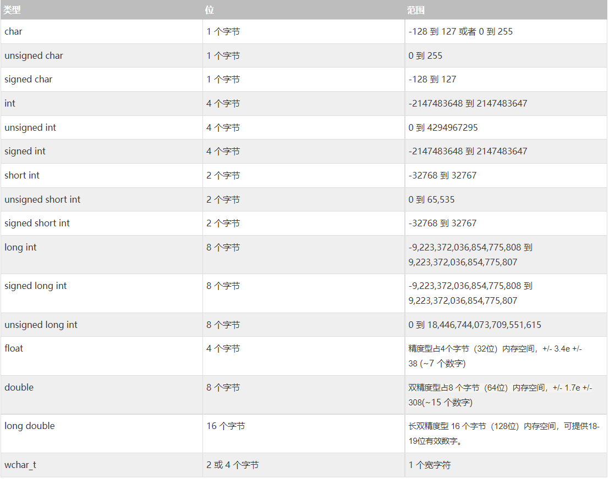

**变量的大小会根据编译器和所使用的电脑而有所不同**


## typedef 声明

您可以使用 **typedef** 为一个已有的类型取一个新的名字。下面是使用 typedef 定义一个新类型的语法：

```
typedef type newname; 
```

例如，下面的语句会告诉编译器，feet 是 int 的另一个名称：

```
typedef int feet;
```

## 枚举类型

枚举类型声明一个可选的类型名称和一组标识符，用来作为该类型的值。其带有零个或多个标识符可以被用来作为该类型的值。每个枚举数是一个枚举类型的常数。

创建枚举，需要使用关键字 **enum**。枚举类型的一般形式为：

```
enum enum-name { list of names } var-list; 
```

在这里，**enum-name 是枚举类型的名称。名称列表 { list of names } 是用逗号分隔的。**

例如，下面的代码定义了一个颜色枚举，变量 c 的类型为 color。最后，c 被赋值为 "blue"。

```
enum color(枚举类型名称) { red, green, blue } c(定义的枚举类型变量);
c = blue;
```

默认情况下，第一个名称的值为 0，第二个名称的值为 1，第三个名称的值为 2，以此类推。但是，您也可以给名称赋予一个特殊的值，只需要添加一个初始值即可。例如，在下面的枚举中，**green** 的值为 5。

```
enum color { red, green=5, blue };
```

在这里，**blue** 的值为 6，因为默认情况下，每个名称都会比它前面一个名称大 1。


# C++ 变量类型

**变量其实只不过是程序可操作的存储区的名称。C++ 中每个变量都有指定的类型，类型决定了变量存储的大小和布局，该范围内的值都可以存储在内存中，运算符可应用于变量上。**

几种基本的变量类型，

| 类型    | 描述                                               |
| :------ | :------------------------------------------------- |
| bool    | 存储值 true 或 false。                             |
| char    | 通常是一个八位字节（一个字节）。这是一个整数类型。 |
| int     | 对机器而言，整数的最自然的大小。                   |
| float   | 单精度浮点值。                                     |
| double  | 双精度浮点值。                                     |
| void    | 表示类型的缺失。                                   |
| wchar_t | 宽字符类型。                                       |

**C++ 也允许定义各种其他类型的变量**，比如**枚举、指针、数组、引用、数据结构、类**等等


## C++ 中的左值（Lvalues）和右值（Rvalues）


C++ 中有两种**类型的表达式**：

- **左值（lvalue）：******指向内存位置的表达式**被称为左值（lvalue）表达式**。左值可以出现在赋值号的左边或右边。

C++语言中可以放在等号左边的变量，即具有对应的可以由用户访问的存储单元，并且能够由用户去改变其值的量。 或者说左值是代表一个内存地址值，通过这个内存地址，就可以对内存进行读写操作；这也就是为什么左值可以被赋值的原因了。

- **右值（rvalue）：**术语右值（rvalue）指的是存储在内存中某些地址的数值。右值是不能对其进行赋值的表达式，也就是说，右值可以出现在赋值号的右边，但不能出现在赋值号的左边。

变量是左值，因此可以出现在赋值号的左边。**数值型的字面值是右值，因此不能被赋值，不能出现在赋值号的左边**。下面是一个有效的语句：

```
int g = 20;
```

但是下面这个就不是一个有效的语句，会生成编译时错误：

```
10 = 20;
```


# C++ 变量作用域

## C++ 变量作用域

作用域是程序的一个区域，一般来说有三个地方可以声明变量：

- 在函数或一个代码块内部声明的变量，称为局部变量。
- 在函数参数的定义中声明的变量，称为形式参数。
- 在所有函数外部声明的变量，称为全局变量。


1、非静态全局变量的作用域是整个源程序 ，当一个源程序由多个源文件组成时，非静态的全局变量在各个源文件中都是有效的。
2、静态全局变量则限制了其作用域， 即只在定义该变量的源文件 内有效，在同一源程序的其它源文件(即声明了该变量的CPP文件,或包含该变量声明头文件的CPP文件)中不能使用它。

把局部变量改变为静态变量后是改变了它的存储方式，即改变了它的生存期。
把全局变量改变为静态变量后是改变了它的作用域，限制了它的使用范围。

关于Static关键字
1.静态变量，分配在静态存储区，在数据段中。函数退出之后，变量值不变。
2.作用域，全局的静态变量、静态函数只能在本文件中使用。（不同于一般全局变量）

​	


# C++ 常量

**常量是固定值，在程序执行期间不会改变。这些固定的值**，又叫做**字面量**。

常量可以是任何的基本数据类型，可分为整型数字、浮点数字、字符、字符串和布尔值。

常量就像是常规的变量，只不过常量的值在定义后不能进行修改。

整数常量

浮点常量

布尔常量

字符常量

字符串常量

## 定义常量

在 C++ 中，有两种简单的定义常量的方式：

- 使用 **#define** 预处理器。
- 使用 **const** 关键字。  const：拘束， 受约束    *const* 是constant 的缩写   本意是不变的，不易改变的意思

```
#define identifier value
```


```
const type variable = value;
const int  a = 10
```


# C++ 修饰符类型

C++ 允许在 **char、int 和 double** 数据类型前放置修饰符。修饰符用于改变基本类型的含义，所以它更能满足各种情境的需求。

下面列出了数据类型修饰符：

- signed   有符号整型、有符号字符型
- unsigned  无符号整型、无符号字符型
- long   长整型
- short  短整型

修饰符 **signed、unsigned、long 和 short** 可应用于整型，**signed** 和 **unsigned** 可应用于字符型，**long** 可应用于双精度型。

## C++ 中的类型限定符

类型限定符提供了变量的额外信息。

| 限定符   | 含义                                                         |
| :------- | :----------------------------------------------------------- |
| const    | **const** 类型的对象在程序执行期间不能被修改改变。           |
| volatile | 修饰符 **volatile** 告诉编译器，变量的值可能以程序未明确指定的方式被改变。 |
| restrict | 由 **restrict** 修饰的指针是唯一一种访问它所指向的对象的方式。只有 C99 增加了新的类型限定符 restrict。 |


#### const


 const名叫常量限定符，用来限定特定变量，以通知编译器该变量是不可修改的。习惯性的使用const，可以避免在函数中对某些不应修改的变量造成可能的改动。


***\*const的用法大致可分为以下几个方面：\****

***\*(1)const修饰基本数据类型\****

***\*(2)const应用到函数中\****

 	1.作为参数的const修饰符
 	2.作为函数返回值的const修饰符

​	 


    修饰参数的const，如 void fun0(const A* a ); void fun1(const A& a);
    调用函数的时候，用相应的变量初始化const常量，则在函数体中，按照const所修饰的部分进行常量化，如形参为const A* a，
    则不能对传递进来的指针的内容进行改变，保护了原指针所指向的内容；如形参为const A& a，则不能对传递进来的引用对象进行改变，


​    
​     修饰返回值的const，如const A fun2( ); const A* fun3( );
​     这样声明了返回值后，const按照"修饰原则"进行修饰，起到相应的保护作用。


***\*(3)const在类中的用法\****

**(4)const修饰类对象，定义常量对象** 


**const 用于函数的定义中**

C++中有的函数参数会用const来传递，同时配合&引用符号一起使用，形式如 void form(const int &a)。


这种用法和[值传递](https://so.csdn.net/so/search?q=值传递&spm=1001.2101.3001.7020)的效果是一样的。但是因为**引用的效率较高**，所以在参数是***\*复杂的数据类型\****的时候，采用这种常量引用的方法。这样既使用了引用，又使用const限制了对参数的修改。


- 首先需要注意的是，**常量引用可以达到和值传递相同的效果。**
- 常量引用***\*从效果上杜绝了在被调用函数内部对传入的参数进行人为修改的情况。\****
- **值传递会对参数进行一个完全的拷贝**，修改不影响原值，但效率不高。


# C++函数的参数传递方式

**值传递：**

首先值传递的传参方式是将传入的参数复制到一个新的存储空间当中，**相当于一个copy，所以可以对其进行任意的修改而又不影响其原来的值**

这种复制在遇到一般的数据类型时性能上还差别不大，遇到一些自定义的复杂的数据类型，结构体时，完全拷贝的方式时间和空间性能都不佳


**引用传递：**


引用&，用&符号免去了完全拷贝这一过程，如果修改的话原来的值也会被修改。效率提升了，但是原值被修改是不能接受的，不能我调用一个函数，原来的变量值都变了。所以，就用const进行了限制。这就是为什么要用常量引用的方式原因。


# C++ 存储类


存储类定义 C++ 程序中变量/函数的范围（可见性）和生命周期。这些说明符放置在它们所修饰的类型之前。下面列出 C++ 程序中可用的存储类：

- auto
- register
- static
- extern
- mutable

## auto 存储类

**auto** 存储类是所有局部变量默认的存储类。

```
{
   int mount;
   auto int month; // 等同于 int mouth
}
```

**上面的实例定义了两个带有相同存储类的变量，auto 只能用在函数内，即 auto 只能修饰局部变量。**

## register 存储类

**register** 存储类用于**定义存储在寄存器中**而不是 RAM 中的局部变量。这意味着变量的最大尺寸等于寄存器的大小（通常是一个词），且不能对它应用一元的 '&' 运算符（因为它没有内存位置）。

```
{
   register int  miles;
}
```

**寄存器只用于需要快速访问的变量，比如计数器。还应注意的是，定义 'register' 并不意味着变量将被存储在寄存器中，它意味着变量可能存储在寄存器中，这取决于硬件和实现的限制。**


## static 存储类

**static** **存储类指示编译器在程序的生命周期内保持局部变量的存在，而不需要在每次它进入和离开作用域时进行创建和销毁**。因此，使用 static 修饰局部变量可以在函数调用之间保持局部变量的值。

static 修饰符也可以应用于全局变量。当 static 修饰全局变量时，会使变量的作用域限制在声明它的文件内。

在 C++ 中，当 static 用在类数据成员上时，会导致仅有一个该成员的副本被类的所有对象共享。


# C++ 运算符

## 杂项运算符

下表列出了 C++ 支持的其他一些重要的运算符。

| 运算符               | 描述                                                         |
| :------------------- | :----------------------------------------------------------- |
| sizeof               | [sizeof 运算符](https://www.w3cschool.cn/cpp/cpp-sizeof-operator.html)返回变量的大小。例如，sizeof(a) 将返回 4，其中 a 是整数。 |
| Condition ? X : Y    | [条件运算符](https://www.w3cschool.cn/cpp/cpp-conditional-operator.html)。如果 Condition 为真 ? 则值为 X : 否则值为 Y。 |
| ,                    | [逗号运算符](https://www.w3cschool.cn/cpp/cpp-comma-operator.html)会顺序执行一系列运算。整个逗号表达式的值是以逗号分隔的列表中的最后一个表达式的值。 |
| .（点）和 ->（箭头） | [成员运算符](https://www.w3cschool.cn/cpp/cpp-member-operators.html)用于引用类、结构和共用体的成员。 |
| Cast                 | [强制转换运算符](https://www.w3cschool.cn/cpp/cpp-casting-operators.html)把一种数据类型转换为另一种数据类型。例如，int(2.2000) 将返回 2。 |
| &                    | [指针运算符 &](https://www.w3cschool.cn/cpp/cpp-pointer-operators.html) 返回变量的地址。例如 &a; 将给出变量的实际地址。 |
| *                    | [指针运算符 *](https://www.w3cschool.cn/cpp/cpp-pointer-operators.html) 指向一个变量。例如，*var; 将指向变量 var。 |

## C++ 中的运算符优先级

运算符的优先级确定表达式中项的组合。这会影响到一个表达式如何计算

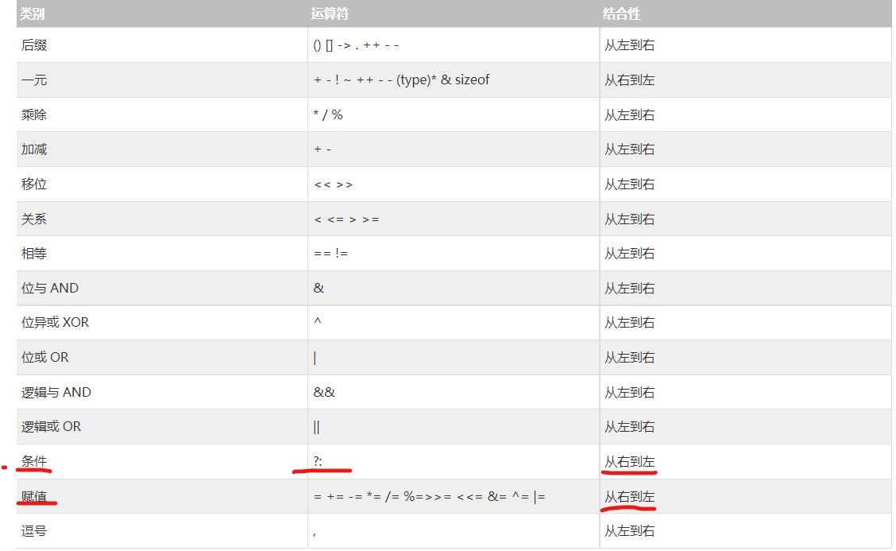

 [**条件运算符 ? :**](https://www.w3cschool.cn/cpp/cpp-conditional-operator.html)，可以用来替代 **if...else** 语句。它的一般形式如下：

```
Exp1 ? Exp2 : Exp3;
```

其中，Exp1、Exp2 和 Exp3 是表达式。请注意，冒号的使用和位置。

? 表达式的值是由 Exp1 决定的。如果 Exp1 为真，则计算 Exp2 的值，结果即为整个 ? 表达式的值。如果 Exp1 为假，则计算 Exp3 的值，结果即为整个 ? 表达式的值。


# C++ 数据结构

C/C++ 数组允许定义可存储相同类型数据项的变量，但是**结构体**是 C++ 中另**一种用户自定义的可用的数据类型**，它允许您存储不同类型的数据项。

结构用于表示一条记录，假设您想要跟踪图书馆中书本的动态，您可能需要跟踪每本书的下列属性：

- Title
- Author
- Subject
- Book ID


## 定义结构 struct

为了定义结构，您必须使用 **struct** 语句。struct 语句定义了一个包含多个成员的新的数据类型，struct 语句的格式如下：

```
struct [structure tag]{
	// 成员元素  值
    member1 definition;
    member2 definition;
    ...
    member2 definition;
}[one or more structure variables];  
```

**structure tag** 是可选的，每个 member definition 是标准的变量定义，比如 int i; 或者 float f; 或者其他有效的变量定义。在结构定义的末尾，最后一个分号之前，您可以指定一个或多个结构变量，这是可选的。下面是声明 Book 结构的方式：

```
struct Books{
    char title[50];
    char author[50];
    char subject[100];
    int book_id;
}book; 
```


# 面向对象编程---->


# C++ 类 & 对象


**C++ 在 C 语言的基础上增加了面向对象编程，C++ 支持面向对象程序设计。类是 C++ 的核心特性，通常被称为用户定义的类型。**

**类用于指定对象的形式，它包含了数据表示法和用于处理数据的方法。类中的数据和方法称为类的成员。函数在一个类被称为类的成员。**


## C++ 类定义

定义一个类，本质上是定义一个数据类型的蓝图。这实际上并没有定义任何数据，但它**定义了类的名称意味着什么，也就是说，它定义了类的对象包括了什么，以及可以在这个对象上执行哪些操作。**

类定义是以关键字 **class** 开头，后跟类的名称。类的主体是包含在一对花括号中。类定义后必须跟着一个分号或一个声明列表。例如，我们使用关键字 **class** 定义 Box 数据类型，如下所示：

```
class Box
{
   public:
      double length;   // Length of a box
      double breadth;  // Breadth of a box
      double height;   // Height of a box
};
```

关键字 **public** 确定了类成员的访问属性。在类对象作用域内，公共成员在类的外部是可访问的。您也可以指定类的成员为 **private** 或 **protected**


**C++ 类和对象相关的概念**

| 概念                                                         | 描述                                                         |
| :----------------------------------------------------------- | :----------------------------------------------------------- |
| [类成员函数](https://www.w3cschool.cn/cpp/cpp-class-member-functions.html) | 类的成员函数是指那些把定义和原型写在类定义内部的函数，就像类定义中的其他变量一样。 |
| [类访问修饰符](https://www.w3cschool.cn/cpp/cpp-class-access-modifiers.html) | 类成员可以被定义为 public、private 或 protected。默认情况下是定义为 private。 |
| [构造函数 & 析构函数](https://www.w3cschool.cn/cpp/cpp-constructor-destructor.html) | 类的构造函数是一种特殊的函数，在创建一个新的对象时调用。类的析构函数也是一种特殊的函数，在删除所创建的对象时调用。 |
| [C++ 拷贝构造函数](https://www.w3cschool.cn/cpp/cpp-copy-constructor.html) | 拷贝构造函数，是一种特殊的构造函数，它在创建对象时，是使用同一类中之前创建的对象来初始化新创建的对象。 |
| [C++ 友元函数](https://www.w3cschool.cn/cpp/cpp-friend-functions.html) | **友元函数**可以访问类的 private 和 protected 成员。         |
| [C++ 内联函数](https://www.w3cschool.cn/cpp/cpp-inline-functions.html) | 通过内联函数，编译器试图在调用函数的地方扩展函数体中的代码。 |
| [C++ 中的 this 指针](https://www.w3cschool.cn/cpp/cpp-this-pointer.html) | 每个对象都有一个特殊的指针 **this**，它指向对象本身。        |
| [C++ 中指向类的指针](https://www.w3cschool.cn/cpp/cpp-pointer-to-class.html) | 指向类的指针方式如同指向结构的指针。实际上，类可以看成是一个带有函数的结构。 |
| [C++ 类的静态成员](https://www.w3cschool.cn/cpp/cpp-static-members.html) | 类的数据成员和函数成员都可以被声明为静态的。                 |


# C++ 继承

2021-08-23 10:26 更新

## C++ 继承

面向对象程序设计中最重要的一个概念是继承。继承允许我们依据另一个类来定义一个类，这使得创建和维护一个应用程序变得更容易。这样做，也达到了重用代码功能和提高执行时间的效果。

当创建一个类时，您不需要重新编写新的数据成员和成员函数，只需指定新建的类继承了一个已有的类的成员即可。这个已有的类称为**基类**，新建的类称为**派生类**。

继承代表了 **is a** 关系。例如，哺乳动物是动物，狗是哺乳动物，因此，狗是动物，等等。

## 基类 & 派生类

一个类可以派生自多个类，这意味着，它可以从多个基类继承数据和函数。定义一个派生类，我们使用一个类派生列表来指定基类。类派生列表以一个或多个基类命名，形式如下：

```
class derived-class: access-specifier base-class
class  派生类名  : 继承的基类名 
```

其中，访问修饰符 access-specifier 是 **public、protected** 或 **private** 其中的一个，base-class 是之前定义过的某个类的名称。如果未使用访问修饰符 access-specifier，则默认为 private

**1. 派生类对象可以调用基类的方法**

Student s; *// 创建Student对象*    

s.say();   *// 派生类调用基类方法* 

**2. 基类指针（引用）可以在不进行显式类型转换的情况下指向（引用）派生类对象**

*// 创建派生类对象*    

 Student s;    

 Person*  pp = &s;    *// 基类指针指向派生类对象*   

 Person&  pr = s;     *// 基类引用引用派生类对象*    

 pp->talk();   

 pr.talk();

**3. 基类指针（引用）只能用于调用基类方法**

// 但注意要区别开多态下的方法调用与子类的关系

*// 创建派生类对象*    

Student s;     

Person* pp = &s;    *// 基类指针指向派生类对象*    

Person& pr = s;     *// 基类引用引用派生类对象*     

pp->talk();         *// ok*   

 pr.talk();          *// ok*     

pp->goSchool();     *// 报错*    ，父类指针只能调用父类的方法，不能调用子类的方法

pr.goSchool();      *// 报错*

**4. 派生类指针可以强制转换为基类指针**

虽然派生类指针不能指向基类对象，但是可以强制让它降级。

```c++
    Student s("Tom","Male","Studio");   // 创建派生类对象  
    Student* sp = &s;           	    // 创建s对象的指针
    Person* pp = (Person*)sp;   		// 派生类指针强制转换为基类指针
    cout << pp->whereLiving();			// 输出 Studio
```

但是注意，这个操作不建议反过来。**基类指针强制转换为派生类指针容易导致崩溃性错误。**


## 访问控制和继承

派生类可以访问基类中所有的非私有成员。因此基类成员如果不想被派生类的成员函数访问，则应在基类中声明为 private。

我们可以根据访问权限总结出不同的访问类型，如下所示：

| 访问     | public | protected | private |
| :------- | :----- | :-------- | :------ |
| 同一个类 | yes    | yes       | yes     |
| 派生类   | yes    | yes       | no      |
| 外部的类 | yes    | no        | no      |

**一个派生类继承了所有的基类方法，但下列情况除外：**

- 基类的构造函数、析构函数和拷贝构造函数。
- 基类的重载运算符。
- 基类的友元函数。

## 继承类型

当一个类派生自基类，该基类可以被继承为 **public、protected** 或 **private** 几种类型。继承类型是通过上面讲解的访问修饰符 access-specifier 来指定的。

我们几乎不使用 **protected** 或 **private** 继承，通常使用 **public** 继承。当使用不同类型的继承时，遵循以下几个规则：

- **公有继承（public）：**当一个类派生自**公有**基类时，基类的**公有**成员也是派生类的**公有**成员，基类的**保护**成员也是派生类的**保护**成员，基类的**私有**成员不能直接被派生类访问，但是可以通过调用基类的**公有**和**保护**成员来访问。


- **保护继承（protected）：** 当一个类派生自**保护**基类时，基类的**公有**和**保护**成员将成为派生类的**保护**成员。

```
class Student:protected std::string , protected std::valarray<double>
{..
};
```


- **私有继承（private）：**当一个类派生自**私有**基类时，基类的**公有**和**保护**成员将成为派生类的**私有**成员。

**私有继承**

```
class Student: private string,  private valarray<double>
{
};
```

### 使用using重新定义访问权限：

```
使用using重新定义访问权限：
在保护继承或私有继承时，基类的公有成员将成为派生类的保护或者私有成员（因此，该方法是不能在类外使用的）。如果要使用基类的方法，那么
方法一：定义一个该基类方法的派生类方法。
例如：
// 定义一个中间派生类，间接地实现使用基类的protect/private方法或属性
double Student::sum() const
{
    return std::valarray < double >::sum();
}
通过这种方法，Student类调用方法.sum()
时，实际上相当于调用基类的sum()
方法，即将其基类valarray对象求和。

方法二：在公有部分使用using声明。
例如：
class Student
{
 ...
public:
    using std::valarray < double >::sum;
    // 这样 Student这个派生类就可以使用 valarray这个类发sum()方法了
    ...
}
效果和方法一是相同的，即使得基类的sum()
方法就像成为了派生类的公有方法一样。

注意：只需要函数名sum，不需要特征标，返回类型，和圆括号。
```


## 多继承 MI

Multiple Inheritance

**C++ 支持多继承，Java不支持类特性的多重继承**


多继承即一个子类可以有多个父类，它继承了多个父类的特性。

C++ 类可以从多个类继承成员，语法如下：

```
class <派生类名>:<继承方式1><基类名1>,<继承方式2><基类名2>,…
{
<派生类类体>
};
```

其中，访问修饰符 access 是 **public、protected** 或 **private** 其中的一个，用来修饰每个基类，各个基类之间用逗号分隔

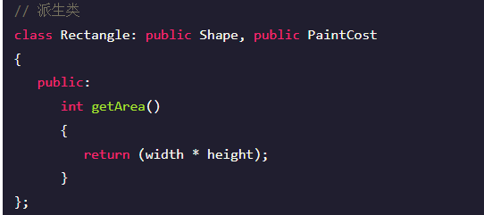


#### 多继承下的构造函数

 多继承形式下的构造函数和单继承形式基本相同，只是要在派生类的构造函数中调用多个基类的构造函数。以上面的 A、B、C、D 类为例，D 类构造函数的写法为：

```
D(形参列表): A(实参列表), B(实参列表), C(实参列表){
  //其他操作
}
```

基类构造函数的调用顺序和和它们在派生类构造函数中出现的顺序无关，而是和声明派生类时基类出现的顺序相同。仍然以上面的 A、B、C、D 类为例，即使将 D 类构造函数写作下面的形式：

```
D(形参列表): B(实参列表), C(实参列表), A(实参列表){
  //其他操作
}
```

那么也是先调用 A 类的构造函数，再调用 B 类构造函数，最后调用 C 类构造函数。

```
#include <iostream>
using namespace std;
//基类
class BaseA{
public:
    BaseA(int a, int b);
    ~BaseA();
protected:
    int m_a;
    int m_b;
};
BaseA::BaseA(int a, int b): m_a(a), m_b(b){
    cout<<"BaseA constructor"<<endl;
}
BaseA::~BaseA(){
    cout<<"BaseA destructor"<<endl;
}
//基类
class BaseB{
public:
    BaseB(int c, int d);
    ~BaseB();
protected:
    int m_c;
    int m_d;
};
BaseB::BaseB(int c, int d): m_c(c), m_d(d){
    cout<<"BaseB constructor"<<endl;
}
BaseB::~BaseB(){
    cout<<"BaseB destructor"<<endl;
}
//派生类
class Derived: public BaseA, public BaseB{
public:
    Derived(int a, int b, int c, int d, int e);
    ~Derived();
public:
    void show();
private:
    int m_e;
};
Derived::Derived(int a, int b, int c, int d, int e): BaseA(a, b), BaseB(c, d), m_e(e){
    cout<<"Derived constructor"<<endl;
}
Derived::~Derived(){
    cout<<"Derived destructor"<<endl;
}
void Derived::show(){
    cout<<m_a<<", "<<m_b<<", "<<m_c<<", "<<m_d<<", "<<m_e<<endl;
}
int main(){
    Derived obj(1, 2, 3, 4, 5);
    obj.show();
    return 0;
}
```


# C++ 包含对象成员的类

一个类对象，可以是另一个类的成员。就像string类可以作为其他类的类成员一样。

一个类对象作为另一个类的数据成员

[（一四六）包含对象成员的类——第十四章-阿里云开发者社区 (aliyun.com)](https://developer.aliyun.com/article/10870)

## valarray类

对象旨在保存值数组，并轻松对它们执行数学运算。它还允许特殊机制引用数组中元素的子集

C ++ 98引入了一个名为valarray的特殊容器，可以有效地保存并提供对数组的数学运算。

其**构造函数**有以下几种：

①valarray<int>abc; //声明一个int类型的valarray类对象（是一个int数组），其长度为0

②valarray<double>abc(5); //声明一个长度为5的double数组（即有5个元素）

③valarray<double>abc(3,5); //声明一个有五个成员的double数组，并且把每个成员的值都初始化为3

④ int a[2] = { 1,2 };

valarray<int>abc(a, 4); //声明一个int数组，有4个成员，并且将前2个成员初始化为数组a的值（即第一个成员值为1，第二个成员值为2）

⑤valarray<int>abc={1,2,3,4}; //声明一个int数组，有四个成员，其值分别被初始化为1,2,3,4。——这是C++11的初始化列表


**一个含有成员对象的类实例化时要先调用成员对象的构造函数，然后再调用该类的构造函数**，析构时先调用该类的析构函数，再调用成员对象的析构函数。


**类方法：**

①operator[](); 访问各个元素

例如：cout << abc.operator[](1) << endl;就是输出abc数组的第二个元素。也可以简单的写为abc[1]

②size(); 返回包含的元素数

③sum(); 返回所有元素的总和

④max(); 返回最大值

⑤min(); 返回最小值


**建立has-a关系：**

```
class Student
{
private:
string name;
valarray<double>scores;
...
}
```

**就是在Student类中包含了string类和valarray类对象。**

Student类具有的特点为：

①可以使用string类和valarray类提供的公有接口；

②Student类本身并不继承这些公有接口。例如，string类对象之间可以相加，而Student类除非定义了operator+()方法，否则是不能相加的；

③不继承接口的has-a关系的组成部分。

**注意：**

①在类声明中使用的是valarray<double>scores; 因此，若在构造函数开始之前初始化它，那么它就是一个double类型，长度为0的数组（因为调用valarray类的默认构造函数）；

②因此，如果想要创建例如一个长度为2的数组，应该在构造函数之前，使用列表初始化的方式进行初始化，例如：Student(int n):scores(n) {...Student的构造函数...}。其效果相当于valarray<double>scores(n) （可参见之前的构造函数②）

③之所以如此，是因为声明一个类时，在进入类的构造函数之前，是可以进行列表初始化的；进入构造函数之后，则各个数据成员已经被初始化了（对于类对象而言，是已经调用了其默认构造函数）。

**初始化顺序：**

在初始化列表包含多个项目时，其初始化顺序为他们被声明的顺序，而不是在初始化列表中的顺序。例如若在Student类的构造函数中使用初始化列表，无论顺序如何，必将先初始化name，再初始化scores。

特别是在代码使用一个成员的值作为另一个成员初始化列表表达式的一部分时，初始化顺序很重要。例如加入第三个类成员，其需要使用name成员作为其初始化的参数，那么name在Student类的顺序就必须位于该类成员之前。


**类中的类成员包含其他类的对象，（其他类的实例对象作为DIY类中的一个成员）**


# C++ 重载运算符和重载函数


C++ 允许在同一作用域中的某个**函数**和**运算符**指定多个定义，分别称为**函数重载**和**运算符重载**。

重载声明是指一个与之前已经在该作用域内声明过的函数或方法具有相同名称的声明，但是它们的参数列表和定义（实现）不相同。当您调用一个**重载函数**或**重载运算符**时，编译器通过把您所使用的参数类型与定义中的参数类型进行比较，决定选用最合适的定义。选择最合适的重载函数或重载运算符的过程，称为**重载决策**。


## C++ 中的函数重载

在同一个作用域内，可以声明几个功能类似的同名函数，但是这些同名函数的形式参数（指参数的个数、类型或者顺序）必须不同。您不能仅通过返回类型的不同来重载函数。


## C++ 中的运算符重载

您可以重定义或重载大部分 C++ 内置的运算符。这样，您就能使用自定义类型的运算符。

重载的运算符是带有特殊名称的函数，函数名是由**关键字 operator 和其后要重载的运算符符号构成的**。与其他函数一样，重载运算符有一个返回类型和一个参数列表。

```
Box operator+(const Box&);
```

声明加法运算符用于把两个 Box 对象相加，返回最终的 Box 对象。大多数的重载运算符可被定义为普通的非成员函数或者被定义为类成员函数。如果我们定义上面的函数为类的非成员函数，那么我们需要为每次操作传递两个参数，如下所示：

```
Box operator+(const Box&, const Box&);
```


# C++ 多态


C++*中的虚函数的作用主要是实现了多态的机制。关于多态，简而言之就是用**父类型别的指针指向其子类的实例**，然后通过父类的指针调用实际子类的成员函数。这种技术可以让父类的指针有“多种形态”，这是一种泛型技术。所谓泛型技术，说白了就是试图使用不变的代码来实现可变的算法。*

虚函数（Virtual Function）是通过一张**虚函数表**（Virtual Table）来实现的。简称为V-Table。在这个表中，主是要一个类的虚函数的地址表，这张表解决了继承、覆盖的问题，保证其容真实反应实际的函数。这样，在有虚函数的类的实例中这个表被分配在了这个实例的内存中，所以，当我们用父类的指针来操作一个子类的时候，这张虚函数表就显得由为重要了，它就像一个地图一样，指明了实际所应该调用的函数。


**多态**按字面的意思就是多种形态。当类之间存在层次结构，并且类之间是通过继承关联时，就会用到多态。

C++ 多态意味着调用成员函数时，会根据调用函数的对象的类型来执行不同的函数。

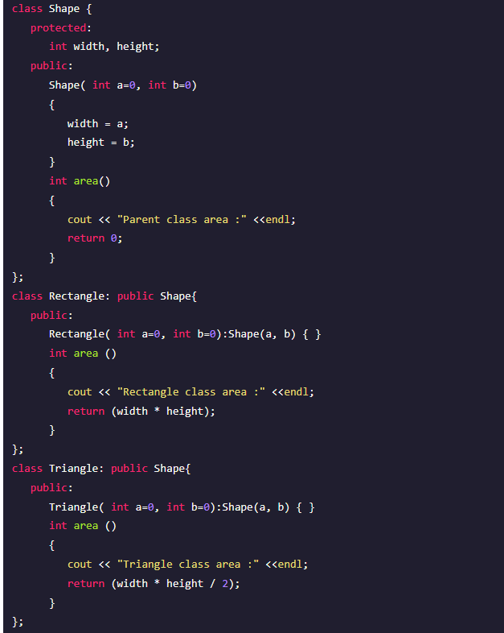

**同样都是继承与Shape父类，但是由于具体对象不同，area()方法不同，就重新设计父类继承过来的方法**

```
int main()
{
    Shape * shape;
// 用父类型别的指针指向其子类的实例，然后通过父类的指针调用实际子类的成员函数。
// 这种技术可以让父类的指针有“多种形态”，这是一种泛型技术
/ 当我们用父类的指针来操作一个子类的时候，虚函数表就显得由为重要了，它就像一个地图一样，指明了实际所应该调用的函数。
    Rectangle
    rec(10, 7);
    Triangle
    tri(10, 5);

    // 存储矩形的地址
    shape = & rec;
    // 调用矩形的求面积函数area
    shape->area();
    // 存储三角形的地址
    shape = & tri;
    // 调用三角形的求面积函数area
    shape->area();

    return 0;
}
```


## 虚函数

**虚函数** 是在基类中使用关键字 **virtual** 声明的函数。在派生类中重新定义基类中定义的虚函数时，会告诉编译器不要静态链接到该函数。

给出函数名和参数，函数体


我们想要的是在程序中任意点可以根据所调用的对象类型来选择调用的函数，这种操作被称为**动态链接**，或**后期绑定**。

## 纯虚函数

**您可能想要在基类中定义虚函数，以便在派生类中重新定义该函数更好地适用于对象，但是您在基类中又不能对虚函数给出有意义的实现，这个时候就会用到纯虚函数。**

**就给出一个函数名和形参，但是没有函数体，而且函数值初值为0，具体实现就由继承该父类的子类实现**

我们可以把基类中的虚函数 area() 改写如下：

```
class Shape {
   protected:
      int width, height;
   public:
      Shape( int a=0, int b=0)
      {
         width = a;
         height = b;
      }
      // pure virtual function
      virtual int area() = 0;
};
```

= 0 告诉编译器，函数没有主体，上面的虚函数是**纯虚函数**。


# C++ 友元类

```
/ *

类的友元函数是定义在类外部，但有权访问类的所有私有（private）成员和保护（protected）成员

尽管友元函数的原型有在类的定义中出现过，但是友元函数并不是成员函数。

友元可以是一个函数，该函数被称为友元函数；

友元也可以是一个类，该类被称为友元类，在这种情况下，整个类及其所有成员都是友元。

如果要声明函数为一个类的友元，需要在类定义中该函数原型前使用关键字
friend

友元的三种实现

全局函数做友元
类做友元
成员函数做友元 // 类中声明友元函数，告诉编译器XXX() 全局函数是Y类的好朋友，可以访问Y对象的私有成员

* /

# include <iostream>
# include <string>
usin namespace std;
// 房屋类
class Building
    {
    // 告诉编译器
    laoWang全局函数是
    Building类
    的好朋友，可以访问Building对象的私有成员
    friend void laoWang1(Building * building);
    friend void laoWang2(Building & building);
    friend void laoWang3(Building building);
    public:
    	Building()
    	{
        m_SittingRoom = "客厅";
    	m_BedRoom = "卧室";
   	 	}
    string m_SittingRoom; // 客厅
   private:
    string m_BedRoom; // 卧室
    };
    // 全局函数
void laoWang1(Building * building)
    {
        cout << "隔壁老王 全局函数 正在访问：（地址传递） " << building->m_SittingRoom << endl;

    cout << "隔壁老王 全局函数 正在访问：（地址传递） " << building->m_BedRoom << endl;
    }
void laoWang2(Building & building)
    {
        cout << "隔壁老王 全局函数 正在访问：（引用传递） " << building.m_SittingRoom << endl;
    	cout << "隔壁老王 全局函数 正在访问：（引用传递） " << building.m_BedRoom << endl;
    }
void laoWang3(Building building)
    {
    cout << "隔壁老王 全局函数 正在访问：（ 值传递 ） " << building.m_SittingRoom << endl;
    cout << "隔壁老王 全局函数 正在访问：（ 值传递 ） " << building.m_BedRoom << endl;
    }
void test()
    {
    Building building;
    laoWang1( & building);
    laoWang2(building);
    laoWang3(building);
    }
    int main()
    {
        test();
    }
```


# C++嵌套类

在一个类的范围内声明另一个类。 这样的类称为 "[嵌套](https://so.csdn.net/so/search?q=嵌套&spm=1001.2101.3001.7020)类"。

[作用域](https://so.csdn.net/so/search?q=作用域&spm=1001.2101.3001.7020)

```bash
	如果一个嵌套类在另一个类的私有部分声明的，嵌套类对于这个类是可见的，对于外界是不可见的。
	如果一个嵌套类在另一个类的公有部分声明的，则允许在这个类和外界使用这个嵌套类。
```

嵌套类被视为在封闭类的范围内，并且可在该范围内使用。 若要从嵌套类的即时封闭范围之外的某个范围引用该类，则必须使用完全限定名。


# C++ 数据抽象


数据抽象是指，只向外界提供关键信息，并隐藏其后台的实现细节，即只表现必要的信息而不呈现细节。

数据抽象是一种依赖于接口和实现分离的编程（设计）技术。

让我们举一个现实生活中的真实例子，比如一台电视机，您可以打开和关闭、切换频道、调整音量、添加外部组件（如喇叭、录像机、DVD 播放器），但是您不知道它的内部实现细节，也就是说，您并不知道它是如何通过缆线接收信号，如何转换信号，并最终显示在屏幕上。

因此，我们可以说电视把它的内部实现和外部接口分离开了，您无需知道它的内部实现原理，直接通过它的外部接口（比如电源按钮、遥控器、声量控制器）就可以操控电视。


## 设计策略

抽象把代码分离为接口和实现。所以在设计组件时，必须保持接口独立于实现，这样，如果改变底层实现，接口也将保持不变。

在这种情况下，不管任何程序使用接口，接口都不会受到影响，只需要将最新的实现重新编译即可。


# C++ 数据封装

所有的 C++ 程序都有以下两个基本要素：

- **程序语句（代码）：**这是程序中执行动作的部分，它们被称为函数。
- **程序数据：**数据是程序的信息，会受到程序函数的影响。

封装是面向对象编程中的把数据和操作数据的函数绑定在一起的一个概念，这样能避免受到外界的干扰和误用，从而确保了安全。数据封装引申出了另一个重要的 OOP 概念，即**数据隐藏**。

**数据封装**是一种把数据和操作数据的函数捆绑在一起的机制，**数据抽象**是一种仅向用户暴露接口而把具体的实现细节隐藏起来的机制。

C++ 通过创建**类**来支持封装和数据因此。我们已经知道，类包含私有成员（private）、保护成员（protected）和公有成员（public）成员。


**数据封装实例：**

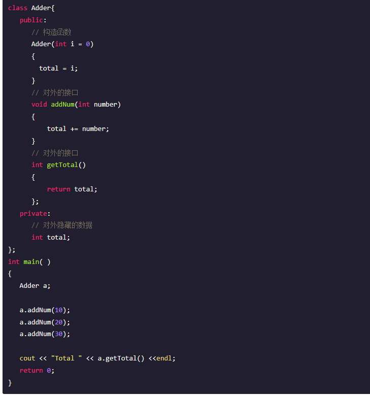

公有成员 **addNum** 和 **getTotal** 是对外的接口，用户需要知道它们以便使用类。私有成员 **total** 是对外隐藏的，用户不需要了解它，但它又是类能正常工作所必需的。

## 设计策略

通常情况下，我们都会设置类成员状态为私有（private），除非我们真的需要将其暴露，这样才能保证良好的**封装性**。

这通常应用于数据成员，但它同样适用于所有成员，包括虚函数。


# C++ 接口（抽象类）


接口描述了类的行为和功能，而不需要完成类的特定实现。

C++ 接口是使用**抽象类**来实现的，抽象类与数据抽象互不混淆，数据抽象是一个把实现细节与相关的数据分离开的概念。


Java  用 abstact class 来定义抽象类

c++ 用包含纯虚函数定义抽象类


**如果类中至少有一个函数被声明为纯虚函数，则这个类就是抽象类**。纯虚函数是通过在声明中使用 "= 0" 来指定的，如下所示：

```
class Box
{
   public:
      // 纯虚函数
      virtual double getVolume() = 0;
   private:
      double length;      // 长度
      double breadth;     // 宽度
      double height;      // 高度
};
```

设计**抽象类**（通常称为 ABC）的目的，是为了给其他类提供一个可以继承的适当的基类。**抽象类不能被用于实例化对象，它只能作为接口使用**。如果试图实例化一个抽象类的对象，会导致编译错误。

因此，如果一个 ABC 的子类需要被实例化，则必须实现每个虚函数，这也意味着 C++ 支持使用 ABC 声明接口。如果没有在派生类中重载纯虚函数，就尝试实例化该类的对象，会导致编译错误。

## 抽象类的实例

请看下面的实例，基类 Shape 提供了一个接口 **getArea()**，在两个派生类 Rectangle 和 Triangle 中分别实现了 **getArea()**：

**基类抽象类不能被实例化，只有继承了该抽象基类的子类中实现了父类的抽象方法，可以实例化子类而不是实例化抽象父类**

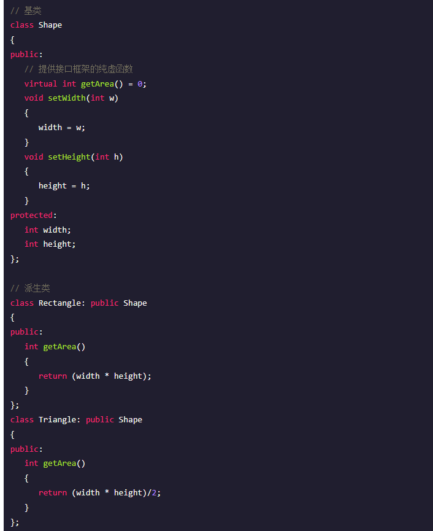

**就像USB这个父类，里面有个抽象方法 data—change，比如手机、电脑、平板等都能进行data—change功能，但是细节又不一样，所以就把这个USB就行接口化设计处理**


## 设计策略

面向对象的系统可能会使用一个抽象基类为所有的外部应用程序提供一个适当的、通用的、标准化的接口。然后，派生类通过继承抽象基类，就把所有类似的操作都继承下来。

外部应用程序提供的功能（即公有函数）在抽象基类中是以纯虚函数的形式存在的。这些纯虚函数在相应的派生类中被实现。

这个架构也使得新的应用程序可以很容易地被添加到系统中，即使是在系统被定义之后依然可以如此。


# C++ vector使用方法

**在 c++ 中，vector 是一个十分有用的容器。它能够像容器一样存放各种类型的对象，简单地说，vector是一个能够存放任意类型的动态数组，能够增加和压缩数据。**

[C++ vector使用方法_w3cschool](https://www.w3cschool.cn/cpp/cpp-i6da2pq0.html)


**五、简单介绍**

1. Vector<类型>标识符
2. Vector<类型>标识符(最大容量)
3. Vector<类型>标识符(最大容量,初始所有值)
4. Int i[5]={1,2,3,4,5}Vector<类型>vi(I,i+2);//得到i索引值为3以后的值
5. Vector< vector< int> >v; 二维向量//这里最外的<>要有空格。否则在比较旧的编译器下无法通过

vector<int> v1;
vector<father> v2;
vector<string> v3;
vector<vector<int> >;  //注意空格。这里相当于二维数组int a[n] [n];
vector<int> v5 = { 1,2,3,4,5 }; //列表初始化,注意使用的是花括号
vector<string> v6 = { "hi","my","name","is","lee" };
vector<int> v7(5, -1); //初始化为-1,-1,-1,-1,-1。第一个参数是数目，第二个参数是要初始化的值
vector<string> v8(3, "hi");
vector<int> v9(10); //默认初始化为0
vector<int> v10(4); //默认初始化为空字符串

**六、vector使用实例**

​	**使用vector注意事项：**

1、如果你要表示的向量长度较长（需要为向量内部保存很多数），容易导致内存泄漏，而且效率会很低；

2、Vector 作为函数的参数或者返回值时，需要注意它的写法：

```
double Distance(vector<int>&a, vector<int>&b)
```

 **其中的“&”绝对不能少！！！**


**vector对象的定义和初始化**

同样的，使用前，导入头文件 #include 可以使用using声明：using std::vector;vector 是一个类模板（class template）。使用模板可以编写一个类定义或函数定义，而用于多个不同的数据类型。因此，我们可以定义保存 string 对象的 vector，或保存 int 值的 vector，又或是保存自定义的类类型对象（如 Sales_items 对象）的 vector。
声明从类模板产生的某种类型的对象，需要提供附加信息，信息的种类取决于模板。以 vector 为例，必须说明 vector 保存何种对象的类型，**通过将类型放在类型放在类模板名称后面的尖括号中来指定类型：**

| vector< T> v1;       | 保存类型为 T 对象。默认构造函数 v1 为空。 |
| -------------------- | ----------------------------------------- |
| vector< T> v2(v1);   | v2 是 v1 的一个副本。                     |
| vector< T> v3(n, i); | v3 包含 n 个值为 i 的元素。               |
| vector< T> v4(n);    | v4 含有值初始化的元素的 n 个副本。        |

【注意：1、若要创建非空的 vector 对象，必须给出初始化元素的值；2、当把一个 vector 对象复制到另一个 vector 对象时，新复制的 vector 中每一个元素都初始化为原 vectors 中相应元素的副本。但这两个 vector 对象必须保存同一种元素类型；3、可以用元素个数和元素值对 vector 对象进行初始化。构造函数用元素个数来决定 vector 对象保存元素的
个数，元素值指定每个元素的初始值】


**vector对象动态增长：**

vector 对象（以及其他标准库容器对象）的重要属性就在于可以在运行时高效地添加元素。

> 注意：因为 vector 增长的效率高，在元素值已知的情况下，最好是动态地添加元素。

**实例：**

vector< int>test;//建立一个vector，int为数组元素的数据类型，test为动态数组名

简单的使用方法如下：  **push_back**

```
vector<int>test;//建立一个vector
test.push_back(1);
test.push_back(2);//把1和2压入vector，这样test[0]就是1,test[1]就是2
```

实例：

```
vector<vector< > > points; //定义一个二维数组
points[0].size();  //指第一行的列数


//得到一个5行3列的数组
//由vector实现的二维数组，可以通过resize()的形式改变行、列值
int i,j;
vector<vector<int>> array(5);  // 5行
for (i = 0; i < array.size(); i++)
    array[i].resize(3);  // 3列

for(i = 0; i < array.size(); i++)
{
    for (j = 0; j < array[0].size();j++)
    {
        array[i][j] = (i+1)*(j+1); // 赋值
    }
}
```


**二维Vector**

```
若想定义A = [[0,1,2],[3,4,5]]

vector<vector<int> > A;  // 大容器
//A.push_back里必须是vector
vector<int> B;  // 小容器
B.push_back(0);
B.push_back(1);
B.push_back(2);
A.push_back(B); // 小容器放入大容器
B.clear();   // 小容器元素清空
B.push_back(3);
B.push_back(4);
B.push_back(5);
A.push_back(B);
```


# C++ map用法

映射字典

map是一类关联式容器

C++ 中 map 提供的是一种键值对容器，里面的数据都是成对出现的,如下图：每一对中的第一个值称之为关键字(key)，每个关键字只能在 map 中出现一次；第二个称之为该关键字的对应值。


## Map的使用

快速插入Key -Value 记录。 **insert**

快速删除记录    

根据Key 修改value记录。

遍历所有记录


1. 需要导入头文件

   ```
   #include <map> // STL头文件没有扩展名.h
   ```

2. map 对象是一个模版类，需要关键字和存储对象两个模版参数

   **定义了一个用int作为索引,并拥有相关联的指向string的指针.**

   ```
    std::map<int , std::string> person;
   ```

3. 可以对模版进行类型定义使其使用方便

   ```
   typedef std::map<int , std::string> MAP_INI_STRING;
   MAP_INI_STRING person;
   ```


## **Map 的构造**

**1、map 最基本的构造函数；**

```
std::map<int , std::string> mapPerson;
```


**2、map 添加数据；**

**1) insert 函数插入 pair 数据**

```
std::map < int , std::string > mapPerson;
mapPerson.insert(pair < int,string > (1,"Jim"));
```

**2)insert 函数插入 value_type 数据**

STL内嵌数据类型： value_type

每个STL中的类都有value_type这种东西，通俗的说value_type 就是 stl容器盛装的   数据的   数据类型

例如：

[vector](https://so.csdn.net/so/search?q=vector&spm=1001.2101.3001.7020)<int> vec;

vector<int>::value_type x;

上述两句代码，第一句是声明一个盛装数据类型是int的数据的vector，第二句是使用vector<int>::value_type定义一个变量x，这个变量x实际上是int类型的，因为vector<int>::value_type中声明的为int型。


```
mapPerson.insert(std::map < int, std::string > ::value_type (2, "Tom"));
```

**3)用数组方式插入数据**

```
mapPerson[3] = "Jerry";

```


## Map 数据的遍历

三种最常用的遍历方法：

**1)前向迭代器**

```
std::map < int ,std::string > ::iterator it;
    std::map < int ,std::string > ::iterator itEnd;
    it = mapPerson.begin();
    itEnd = mapPerson.end();
    while (it != itEnd) {
	cout<<it->first<<' '<<it->second<<endl;  
	it++;
}
```

**2)反向迭代器**

```
std::map < int, string > ::reverse_iterator iter;  
for(iter = mapPerson.rbegin(); iter != mapPerson.rend(); iter++) 
	cout<<iter->first<<"  "<<iter->second<<endl;  
```

**3)数组形式**

```
mapPerson.insert(std::map<int, std::string>::value_type (1, "Tom"));
mapPerson[2] = "Jim";
mapPerson[3] = "Jerry";

int nSize = mapPerson.size();
for(int n = 1; n <= nSize; n++)
	qDebug()<<QString::fromStdString(mapPerson[n]);
```

三种都是遍历，建议使用前向迭代器，慎用使用数组形成（角标开始位置谨慎）。

**4、map 中元素的查找：**

  find() 函数返回一个迭代器指向键值为 key 的元素，如果没找到就返回指向 map 尾部的迭代器。    

```
 map<int ,string > ::iterator l_it;; 
   l_it = maplive.find(112);
   if(l_it == maplive.end())
                cout<<"we do not find 112"<<endl;
   else cout<<"wo find 112"<<endl;
```

**5、map 中元素的删除：**

  如果删除 112；

```
iterator erase（iterator it)	;//通过一个条目对象删除
iterator erase（iterator first，iterator last）；	//删除一个范围
size_type erase(const Key&key);	//通过关键字删除
clear()；//就相当于enumMap.erase(enumMap.begin(),enumMap.end());
```


**6、map 中 swap 的用法：**

 Map 中的 swap 不是一个容器中的元素交换，而是两个容器交换；

**7、map 的 sort 问题：**

 Map 中的元素是自动按 key 升序排序,所以不能对 map 用 sort 函数：

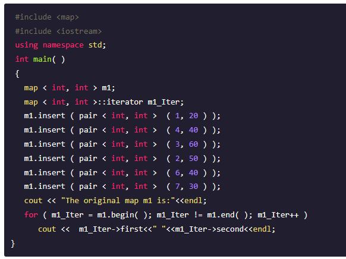

**输出：**

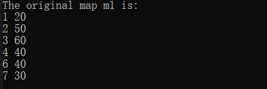


**8、map 的基本操作函数：**

  **C++ Maps 是一种关联式容器，包含“关键字/值”对**

  **begin()         返回指向 map 头部的迭代器**

  **clear(）         删除所有元素**

  **count()         返回指定元素出现的次数**

  **empty()         如果 map 为空则返回 true**

  **end()           返回指向 map 末尾的迭代器**

  **equal_range()    返回特殊条目的迭代器对**

  **erase()          删除一个元素**

  **find()           查找一个元素**

  **get_allocator()   返回map的配置器**

  **insert()         插入元素**

  **key_comp()     返回比较元素key的函数**

  **lower_bound()   返回键值>=给定元素的第一个位置**

  **max_size()      返回可以容纳的最大元素个数**

  **rbegin()        返回一个指向map尾部的逆向迭代器**

  **rend()          返回一个指向map头部的逆向迭代器**

  **size()          返回map中元素的个数**

  **swap()         交换两个map**

  **upper_bound()  返回键值>给定元素的第一个位置**

  **value_comp()    返回比较元素value的函数**


# C++ 命名空间


假设这样一种情况，当一个班上有两个名叫 Zara 的学生时，为了明确区分它们，我们在使用名字之外，不得不使用一些额外的信息，比如他们的家庭住址，或者他们父母的名字等等。

同样的情况也出现在 C++ 应用程序中。例如，您可能会写一个名为 xyz() 的函数，在另一个可用的库中也存在一个相同的函数 xyz()。这样，编译器就无法判断您所使用的是哪一个 xyz() 函数。

因此，引入了**命名空间**这个概念，专门用于解决上面的问题，它可作为附加信息来区分不同库中相同名称的函数、类、变量等。使用了命名空间即定义了上下文。本质上，命名空间就是定义了一个范围。

## **定义命名空间**

命名空间的定义使用关键字 **namespace**，后跟命名空间的名称，如下所示：

```
namespace namespace_name {
   // 代码声明
}
```

为了调用带有命名空间的函数或变量，需要在前面加上命名空间的名称，如下所示：

```
name::code;  // code 可以是变量或函数
```

## using 指令

您可以使用 **using namespace** 指令，这样在使用命名空间时就可以不用在前面加上命名空间的名称。这个指令会告诉编译器，后续的代码将使用指定的命名空间中的名称。


## 不连续的命名空间

命名空间可以定义在几个不同的部分中，因此命名空间是由几个单独定义的部分组成的。**一个命名空间的各个组成部分可以分散在多个文件中。**

所以，如果命名空间中的某个组成部分需要请求定义在另一个文件中的名称，则仍然需要声明该名称。下面的命名空间定义可以是定义一个新的命名空间，也可以是为已有的命名空间增加新的元素：

```
namespace namespace_name {
   // 代码声明
}
```

## 嵌套的命名空间

命名空间可以嵌套，您可以在一个命名空间中定义另一个命名空间，如下所示：

```
namespace namespace_name1 {
   // 代码声明
   namespace namespace_name2 {
      // 代码声明
   }
}
```

您可以通过使用 :: 运算符来访问嵌套的命名空间中的成员：

```
// 访问 namespace_name2 中的成员
using namespace namespace_name1::namespace_name2;

// 访问 namespace:name1 中的成员
using namespace namespace_name1;
```


# C++ 预处理器


预处理器是一些指令，指示编译器在实际编译之前所需完成的预处理。

所有的预处理器指令都是以井号（#）开头，只有空格字符可以出现在预处理指令之前。预处理指令不是 C++ 语句，所以它们不会以分号（;）结尾。

我们已经看到，之前所有的实例中都有 **#include** 指令。这个宏用于把头文件包含到源文件中。

C++ 还支持很多预处理指令，比如 #include、#define、#if、#else、#line 等

## #define 预处理

\#define 预处理指令用于创建符号常量。该符号常量通常称为**宏**

## 函数宏

您可以使用 #define 来定义一个带有参数的宏，如下所示：

**\#define MIN(a,b) (((a)<(b)) ? a : b)**


## 条件编译

有几个指令可以用来有选择地对部分程序源代码进行编译。这个过程被称为条件编译。

条件预处理器的结构与 if 选择结构很像。请看下面这段预处理器的代码：

```
#ifndef NULL
   #define NULL 0
#endif
```


## C++ 中的预定义宏

C++ 提供了下表所示的一些预定义宏：

| 宏       | 描述                                                         |
| :------- | :----------------------------------------------------------- |
| __LINE__ | 这会在程序编译时包含当前行号。                               |
| __FILE__ | 这会在程序编译时包含当前文件名。                             |
| __DATE__ | 这会包含一个形式为 month/day/year 的字符串，它表示把源文件转换为目标代码的日期。 |
| __TIME__ | 这会包含一个形式为 hour:minute:second 的字符串，它表示程序被编译的时间。 |

让我们看看上述这些宏的实例：

```
#include <iostream>
using namespace std;

int main ()
{
	cout << "Value of __LINE__当前行号 : " << __LINE__ << endl;
	cout << "Value of __FILE__当前文件名 : " << __FILE__ << endl;
	cout << "Value of __DATE__当前日期 : " << __DATE__ << endl;
	cout << "Value of __TIME__当前时间 : " << __TIME__ << endl;

    return 0;
}
```


# C++ 异常处理


**异常是程序在执行期间产生的问题**。C++ 异常是指在程序运行时发生的特殊情况，比如尝试除以零的操作。

异常提供了一种转移程序控制权的方式。C++ 异常处理涉及到三个关键字：**try、catch、throw**。

- **throw:** 当问题出现时，程序会抛出一个异常。这是通过使用 **throw** 关键字来完成的。
- **catch:** 在您想要处理问题的地方，通过异常处理程序捕获异常。**catch** 关键字用于捕获异常。
- **try: try** 块中的代码标识将被激活的特定异常。它后面通常跟着一个或多个 catch 块。

如果有一个块抛出一个异常，捕获异常的方法会使用 **try** 和 **catch** 关键字。**try 块中放置可能抛出异常的代码，try 块中的代码被称为保护代码**。使用 try/catch 语句的语法如下所示：

## 捕获异常

```
try
{
   // 保护代码
}catch( ExceptionName e1 )
{//出现异常1 怎么处理
   // catch 块
}catch( ExceptionName e2 )
{//出现异常2 怎么处理
   // catch 块
}catch( ExceptionName eN )
{//出现异常3 怎么处理
   // catch 块
}
```

**如果 try 块在不同的情境下会抛出不同的异常，这个时候可以尝试罗列多个 catch 语句，用于捕获不同类型的异常。**


## 抛出异常

您可以使用 **throw** 语句在代码块中的任何地方抛出异常。throw 语句的操作数可以是任意的表达式，表达式的结果的类型决定了抛出的异常的类型。

```
double division(int a, int b)
{
   if( b == 0 )
   {
      throw "Division by zero condition!";
   }
   return (a/b);
}
```


# C++ 信号处理


信号是由操作系统传给进程的中断，会提早终止一个程序。在 UNIX、LINUX、Mac OS X 或 Windows 系统上，可以通过按 Ctrl+C 产生中断。

有些信号不能被程序捕获，但是下表所列信号可以在程序中捕获，并可以基于信号采取适当的动作。这些信号是定义在 C++ 头文件 <csignal> 中。


# C++ 多线程


阻塞和非阻塞指的是调用者（程序）在等待返回结果（或输入）时的状态。

**阻塞**时，在调用结果返回前，当前线程会被挂起，并在得到结果之后返回。

**非阻塞**时，如果不能立刻得到结果，则该调用者不会阻塞当前线程。因此对应非阻塞的情况，调用者需要定时轮询查看处理状态。


多线程是多任务处理的一种特殊形式，多任务处理允许让电脑同时运行两个或两个以上的程序。在一般情况下，有两种类型的多任务处理：基于进程和基于线程。

**基于进程的多任务处理处理的是程序的并发执行.**

**基于线程的多任务处理的是同一程序的片段的并发执行。**

**多线程程序包含可以同时运行的两个或多个部分。这样的程序中的每个部分称为一个线程，每个线程定义了一个单独的执行路径。**

C++ 不包含多线程应用程序的任何内置支持。相反，它完全依赖于操作系统来提供此功能。


**c++11标准库中出现了一个叫作std::thread**


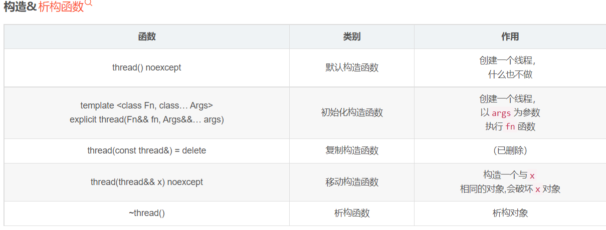


**std::thread();**

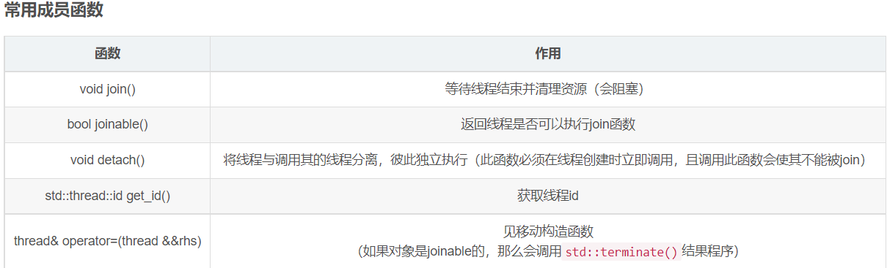

## 注意事项

**1-线程是在thread对象被定义的时候开始执行的，而不是在调用join函数时才执行的，调用join函数只是阻塞等待线程结束并回收资源。**
**2-分离的线程（执行过detach的线程）会在调用它的线程结束或自己结束时释放资源。**
**3-线程会在函数运行完毕后自动释放，不推荐利用其他方法强制结束线程，可能会因资源未释放而导致内存泄漏。**
**4-没有执行join或detach的线程在程序结束时会引发异常**


## C++11中的std::XXX 线程支持库  线程锁

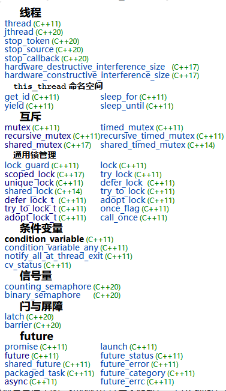

**参考手册：**

https://www.apiref.com/cpp-zh/cpp/thread.html

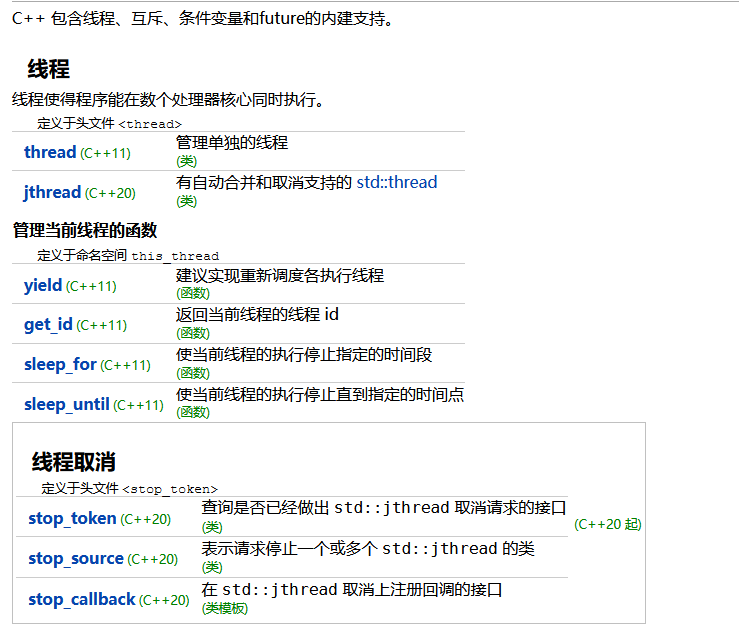


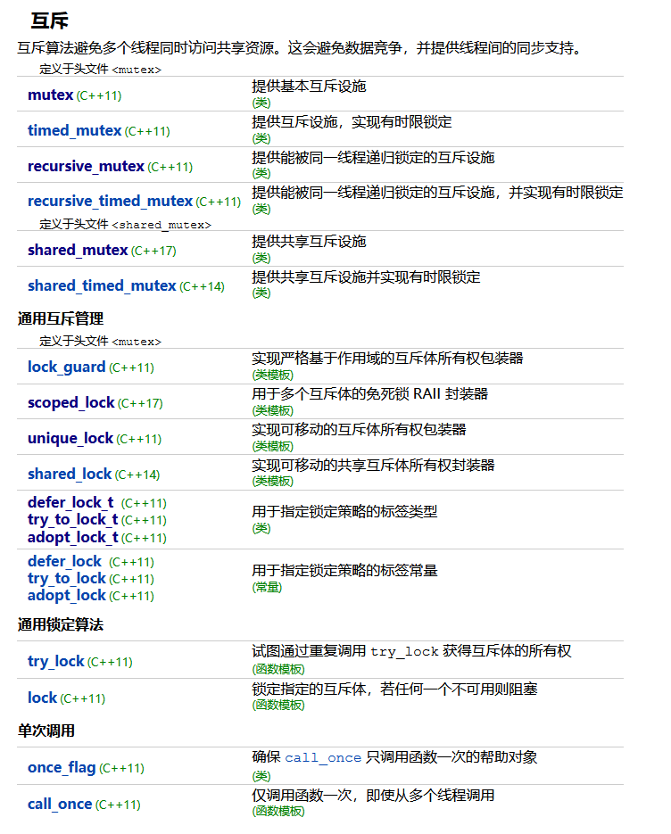

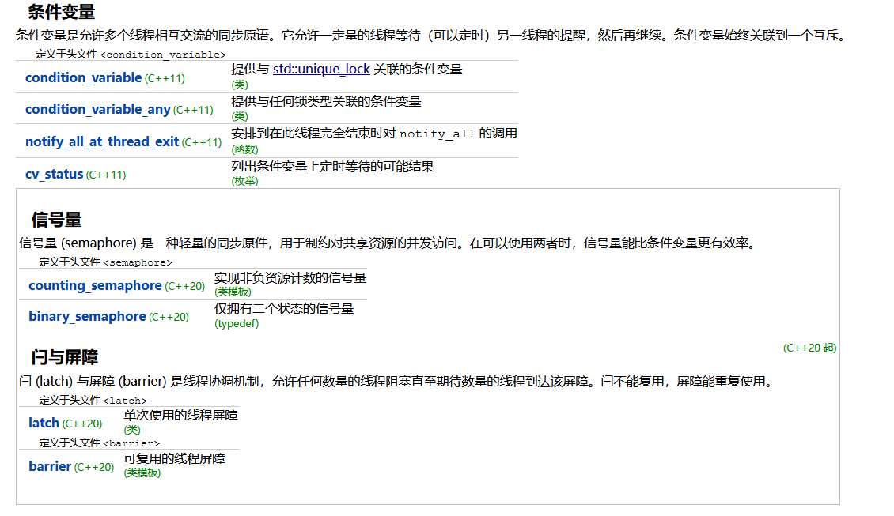

**Future**

标准库提供了一些工具来获取异步任务（即在单独的线程中启动的函数）的返回值，并捕捉其所抛出的异常。这些值在*共享状态*中传递，其中异步任务可以写入其返回值或存储异常，而且可以由持有该引用该共享态的 [std::future](https://www.apiref.com/cpp-zh/cpp/thread/future.html) 或 [std::shared_future](https://www.apiref.com/cpp-zh/cpp/thread/shared_future.html) 实例的线程检验、等待或是操作这个状态。

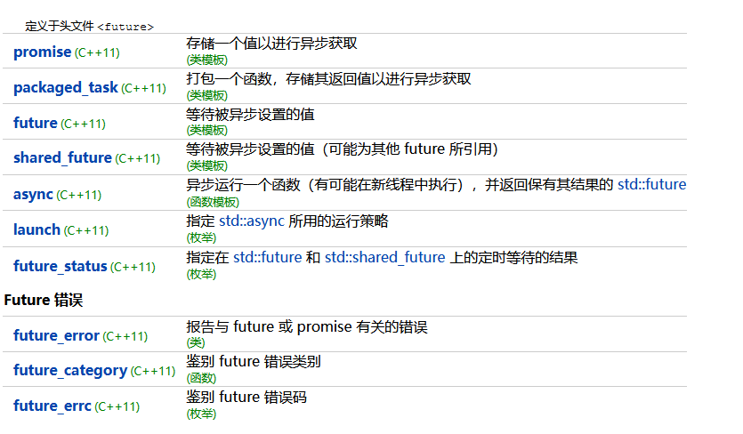


多线程的执行顺序——同时进行、无次序，所以这样就会导致一个问题：多个线程进行时，如果它们同时操作同一个变量，那么肯定会出错。为了应对这种情况，c++11中出现了`std::atomic`和`std::mutex`。


互斥锁(mutex)


原子类型 atomic

### std::mutex

C++11

**独占的互斥量，不能递归使用**


`std::mutex`是 C++11 中最基本的互斥量，一个线程将mutex锁住时，其它的线程就不能操作mutex，直到这个线程将mutex解锁。

`mutex` 类是能用于保护共享数据免受从多个线程同时访问的同步原语。

`mutex` 提供排他性非递归所有权语义：

-  调用方线程从它成功调用 [`lock`](https://www.apiref.com/cpp-zh/cpp/thread/mutex/lock.html) 或 [`try_lock`](https://www.apiref.com/cpp-zh/cpp/thread/mutex/try_lock.html) 开始，到它调用 [`unlock`](https://www.apiref.com/cpp-zh/cpp/thread/mutex/unlock.html) 为止*占有* `mutex` 。
-  线程占有 `mutex` 时，所有其他线程若试图要求 `mutex` 的所有权，则将阻塞（对于 [`lock`](https://www.apiref.com/cpp-zh/cpp/thread/mutex/lock.html) 的调用）或收到 false 返回值（对于 [`try_lock`](https://www.apiref.com/cpp-zh/cpp/thread/mutex/try_lock.html) ）.
-  调用方线程在调用 [`lock`](https://www.apiref.com/cpp-zh/cpp/thread/mutex/lock.html) 或 [`try_lock`](https://www.apiref.com/cpp-zh/cpp/thread/mutex/try_lock.html) 前必须不占有 `mutex` 。

若 `mutex` 在仍为任何线程所占有时即被销毁，或在占有 `mutex` 时线程终止，则行为未定义。 `mutex` 类满足[*互斥体* *(Mutex)* ](https://www.apiref.com/cpp-zh/cpp/named_req/Mutex.html)和[*标准布局类型* *(StandardLayoutType)* ](https://www.apiref.com/cpp-zh/cpp/named_req/StandardLayoutType.html)的全部要求。

`std::mutex` 既不可复制亦不可移动


互斥量（锁）的使用，这是一种线程同步机制，**在C++11中提供了4中互斥量。**

```text
std::mutex;                  //非递归的互斥量
std::timed_mutex;            //带超时的非递归互斥量
std::recursive_mutex;        //递归互斥量
std::recursive_timed_mutex;  //带超时的递归互斥量
```

**mutex的常用成员函数**

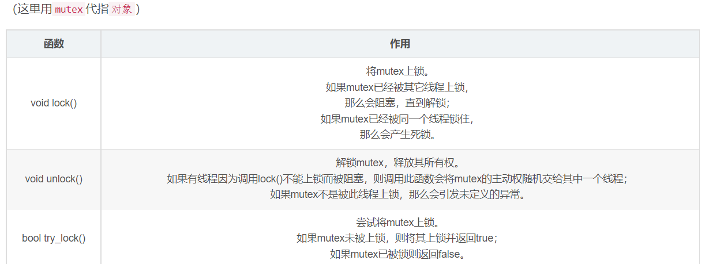


### std::unique_lock

C++11

 std::unique_lock为锁管理模板类，是对通用mutex的封装。std::unique_lock对象以独占所有权的方式(unique owership)管理mutex对象的上锁和解锁操作，即在unique_lock对象的声明周期内，它所管理的锁对象会一直保持上锁状态；而unique_lock的生命周期结束之后，它所管理的锁对象会被解锁。unique_lock具有lock_guard的所有功能，而且更为灵活。虽然二者的对象都不能复制，但是unique_lock可以移动(movable)，因此用unique_lock管理互斥对象，可以作为函数的返回值，也可以放到STL的容器中。


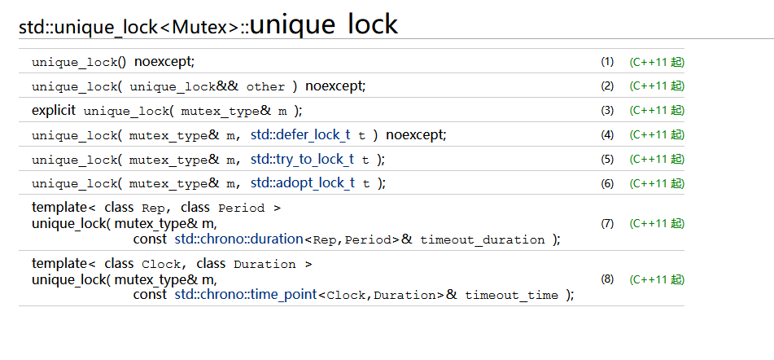

```
std::mutex m_a, m_b, m_c;
int a, b, c = 1;
void update()
{
    {   // 注意：可用 std::lock_guard 或 atomic<int> 代替
        std::unique_lock<std::mutex> lk(m_a);
        // lk : 自己给取的名，m_a就是需要操作的mutex对象
        //std::unique_lock<std::mutex>   带<>使用模板类这种构造方式 
        a++;
    }
 
    { // 注意：细节和替代品见 std::lock 及 std::scoped_lock
      std::unique_lock<std::mutex> lk_b(m_b, std::defer_lock);
      // 设定构造函数的标签参数：std::defer_lock
      std::unique_lock<std::mutex> lk_c(m_c, std::defer_lock);
      std::lock(lk_b, lk_c);
      b = std::exchange(c, b+c);
   }
}
```


构造 `unique_lock` ，可选地锁定提供的互斥。

1) 构造无关联互斥的 `unique_lock` 。

2) 移动构造函数。以 `other` 的内容初始化 `unique_lock` 。令 `other` 无关联互斥。

3-8) 构造以 `m` 为关联互斥的 `unique_lock` 。另外：

3) 通过调用 m.lock() 锁定关联互斥。若当前线程已占有互斥则行为未定义，除非互斥是递归的。

4) 不锁定关联互斥。

5) 通过调用 m.try_lock() 尝试锁定关联互斥而不阻塞。若当前线程已占有互斥则行为未定义，除非互斥是递归的。

6) 假定调用方线程已占有 `m` 。

7) 通过调用 m.try_lock_for(timeout_duration) 尝试锁定关联互斥。阻塞直至经过指定的 `timeout_duration` 或获得锁，之先到来者。可能阻塞长于 `timeout_duration` 。

8) 通过调用 m.try_lock_until(timeout_time) 尝试锁定关联互斥。阻塞直至抵达指定的 `timeout_time` 或获得锁，之先到来者。可能阻塞长于抵达 `timeout_time` 。


**std::defer_lock_t、 std::try_to_lock_t 和 std::adopt_lock_t 是用于为 [std::lock_guard](https://www.apiref.com/cpp-zh/cpp/thread/lock_guard.html) 、 std::scoped_lock 、 [std::unique_lock](https://www.apiref.com/cpp-zh/cpp/thread/unique_lock.html) 和 [std::shared_lock](https://www.apiref.com/cpp-zh/cpp/thread/shared_lock.html) 指定锁定策略的空类标签类型。**

**std::defer_lock、 std::try_to_lock 和 std::adopt_lock**


**构造函数的参数：**

| other            | -    | 用以初始化状态的另一 `unique_lock`           |
| ---------------- | ---- | -------------------------------------------- |
| m                | -    | 与锁关联且可选的获得所有权的互斥             |
| t                | -    | 用于选择拥有不同锁定策略的构造函数的标签参数 |
| timeout_duration | -    | 要阻塞的最大时长                             |
| timeout_time     | -    | 要阻塞到的最大时间点                         |


### std::recursive_mutex    

C++11

https://www.apiref.com/cpp-zh/cpp/thread/recursive_mutex.html

**简单来说，问题就是：加锁的操作需要相互嵌套，如果使用std::mutex 肯定会导致[死锁](https://so.csdn.net/so/search?q=死锁&spm=1001.2101.3001.7020)，而重构代码，提取出共用部分的工作量又很大。**

**好东西 std::recursive_mutex 递归锁**

**递归锁可以允许一个线程对同一互斥量多次加锁，解锁时，需要调用与lock()相同次数的unlock()才能释放使用权**

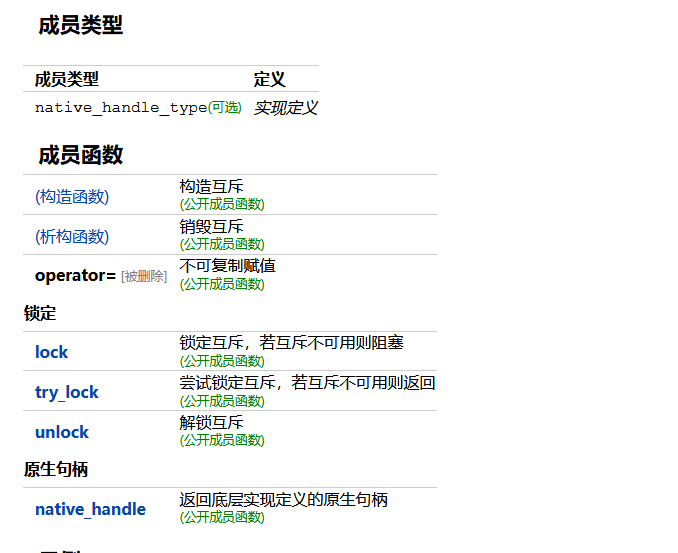

**std::recursive_mutex。他会自动判断是不是同一个线程lock() 了多次同一个锁，如果是则让计数器加1，之后unlock() 会让计数器减1，减到0时才真正解锁。但是相比普通的std::mutex 有一定性能损失。**

**就是用来解决由于多次加锁，可能引发的死锁问题**


### std::timed_mutex

c++11

**有超时功能的独占互斥量，不能递归使用**


### std::recursive_timed_mutex

c++11

**有超时功能的递归互斥量**


### std::shared_mutex

(C++17 起)

std::shared_mutex用于管理可转移和共享所有权的互斥对象，适用场景比较特殊：**一个或多个读线程同时读取共享资源，且只有一个写线程来修改这个资源，这种情况**


**也就是可以有多个线程读，但是只能有一个线程写**，  **读只能读，写只能写，不同同时**


**写情况**：

​		**push_back() 需要修改数据，因需求此为写，使用lock() 和unlock() 的组合**

**读情况：**

​		**则只要读取数据，不修改数据，因此可以和别人共享一起读，使用lock_shared() 和unlock_shared() 的组合**


### std::condition_variable

**条件变量：等待被唤醒**

**std::condition_variable仅仅支持std::unique_lock<std::mutex> 作为wait 的参数，如果需要用其他类型的mutex 锁，可以用std::condition_variable_any。**


### std::asyanc

先说明一点：std::asyanc是std::future的高级封装， 一般我们不会直接使用std::futrue，而是使用对std::future的高级封装std::async。


**std::async()**是一个接受回调(函数或函数对象)作为参数的函数模板，并有可能异步执行它们.

**std::async**返回一个 **std::future< T>**，它存储由 **std::async()**执行的函数对象返回的值。

第一个参数是枚举类型，std::launch::async(异步线程操作) or std::launch::deferred（同步）,如果不指定的话，则默认是std::launch::async|std::launch::deferred,第二个参数是函数对象，支持传参.

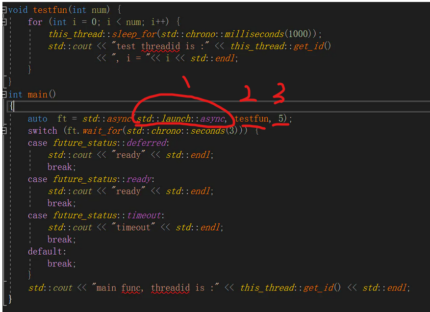


**std::async基本用法**

**1-**std::future可以从异步任务中获取结果，一般与std::async配合使用，**std::async用于创建异步任务，实际上就是创建一个线程执行相应任务。**

**2-**std::async就是异步编程的高级封装，封装了std::future的操作，基本上可以代替std::thread 的所有事情。

**3-**std::async的操作，其实相当于封装了std::promise、std::packaged_task加上std::thread。

 

```
bool is_prime(int x)
{
  for (int i=0; i<x; i++)
  {
    if (x % i == 0)
      return false;
  }
  return true;
}

int main()
{

  std::future<bool> fut = std::async(is_prime, 700020007);//任务创建
  
  std::cout << "please wait";
  std::chrono::milliseconds span(100);
  while (fut.wait_for(span) != std::future_status::ready)
    std::cout << ".";
  std::cout << std::endl;

  bool ret = fut.get();//获取结果
  std::cout << "final result: " << stringify(ret) << std::endl;
  return 0;
}
```


std::async会首先创建线程执行is_prime(700020007)， 任务创建之后，std::async立即返回一个std::future对象。

主线程既可使用std::future::get获取结果，如果调用过程中，任务尚未完成，则主线程阻塞至任务完成。

主线程也可使用std::future::wait_for等待结果返回，wait_for可设置超时时间，如果在超时时间之内任务完成，则返回std::future_status::ready状态；如果在超时时间之内任务尚未完成，则返回std::future_status::timeout状态。


### std::future

future对象是std::async、std::promise、std::packaged_task的底层对象，用来传递其他线程中操作的数据结果;

也就是为什么说std::async是future的高级封装，future被封装在async这个类里面了

类模板 `std::future` 提供访问异步操作结果的机制：

-  （通过 [std::async](https://www.apiref.com/cpp-zh/cpp/thread/async.html) 、 [std::packaged_task](https://www.apiref.com/cpp-zh/cpp/thread/packaged_task.html) 或 [std::promise](https://www.apiref.com/cpp-zh/cpp/thread/promise.html) 创建的）异步操作能提供一个 `std::future` 对象给该异步操作的创建者。

-  然后，异步操作的创建者能用各种方法查询、等待或从 `std::future` 提取值。若异步操作仍未提供值，则这些方法可能阻塞。

-  异步操作准备好发送结果给创建者时，它能通过修改链接到创建者的 `std::future` 的*共享状态*（例如 [std::promise::set_value](https://www.apiref.com/cpp-zh/cpp/thread/promise/set_value.html) ）进行。

注意， `std::future` 所引用的共享状态不与另一异步返回对象共享（与 [std::shared_future](https://www.apiref.com/cpp-zh/cpp/thread/shared_future.html) 相反）。

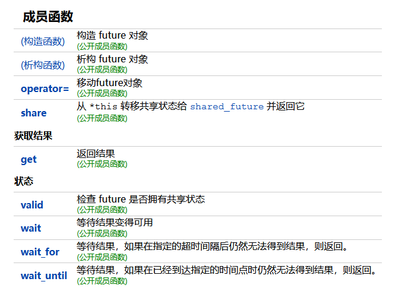


### std::promise

std::promise的作用就是提供一个不同线程之间的数据同步机制，它可以存储一个某种类型的值，并将其传递给对应的future， 即使这个future不在同一个线程中也可以安全的访问到这个值

```
void print_int (std::future<int>& fut) {
  int x = fut.get();
  std::cout << "value: " << x << '\n';
}

int main ()
{
  std::promise<int> prom;                      // create promise

  std::future<int> fut = prom.get_future();    // engagement with future

  std::thread th1 (print_int, std::ref(fut));  // send future to new thread

  prom.set_value (10);                         // fulfill promise
                                               // (synchronizes with getting the future)
  th1.join();
  return 0;
}
```


### std::packaged_task

std::packaged_task的作用就是提供一个不同线程之间的数据同步机制，它可以存储一个函数操作，**并将其返回值传递给对应的future，** 而这个future在另外一个线程中也可以安全的访问到这个值。


### std::condition_variable

c++11起

https://www.apiref.com/cpp-zh/cpp/thread/condition_variable.html

能用于阻塞一个线程，或同时阻塞多个线程，直至另一线程修改共享变量（*条件*）并通知 `condition_variable` 

1.  获得 `std::mutex` （常通过 [std::lock_guard](https://www.apiref.com/cpp-zh/cpp/thread/lock_guard.html) ）
2.  在保有锁时进行修改
3.  在 `std::condition_variable` 上执行 [notify_one](https://www.apiref.com/cpp-zh/cpp/thread/condition_variable/notify_one.html) 或 [notify_all](https://www.apiref.com/cpp-zh/cpp/thread/condition_variable/notify_all.html) （不需要为通知保有锁）

即使共享变量是原子的，也必须在互斥下修改它，以正确地发布修改到等待的线程。


**std::condition_variable 必须和std::unique_lock< std::mutex> 一起用**

**说白了就是让开辟的新线程等待执行，等待某一条件成真才执行**


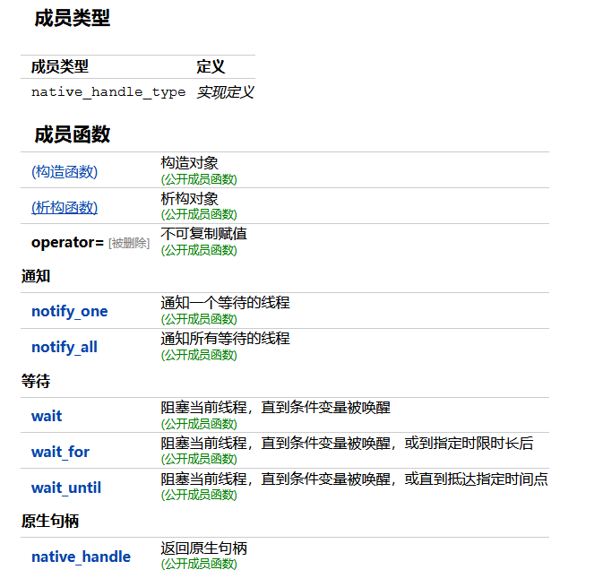


**1.**
**std::condition_variable仅仅支持std::unique_lock< std::mutex> 作为wait 的参数，如果需要用其他类型的mutex 锁，可以用std::condition_variable_any。**
**2.**
**他还有wait_for() 和wait_until() 函数，分别接受chrono 时间段和时间点作为参数。详见：https://en.cppreference.com/w/cpp/thread/condition_variable/wait_for。**


## std::atomic ：原子操作

**原子(atomic) 的（取其不可分割之意**

https://www.apiref.com/cpp-zh/cpp/atomic.html

mutex很好地解决了多线程资源争抢的问题，但它也有缺点：太……慢……了……
以例四为标准，我们定义了100个thread，每个thread要循环10000次，每次循环都要加锁、解锁，这样固然会浪费很多的时间，那么该怎么办呢？接下来就是atomic大展拳脚的时间了。


**原子操作的作用：  主要是针对一些变量，比如a在某个线程中被修改值，但可能也会被另一个线程同时操作，这就导致结果可能出错，为了避免变量a的错误，那么把该变量设定为原子类型atomic，这个就意味着同一时刻只能有一个线程对其进行操作，把他锁住，就类似于线程操作中的mutex线程锁，只是atomic的操作更便捷，同样实现和线程锁一样的效果。**

**说白了，原子类型atomic还是和线程相关联**


**简单理解就是给自定义的变量添加一个类似于关键字一样的东西，**

**比如 普通的  int  a = 0 ;**

**倘若有存在两个以上的线程同时发生对变量a 的操作，a的值可能错误**

**但是，这么定义 std::atomic< int> a = 0;**

**倘若有存在两个以上的线程同时发生对变量a 的操作，但这有获得了a变量操作权的线程才有用，因为变量a是原子类型，就相当于加了一个线程锁，当前操作变量a的线程会锁住，结果才解锁，后面操作a变量的线程才有机会操作变量a**


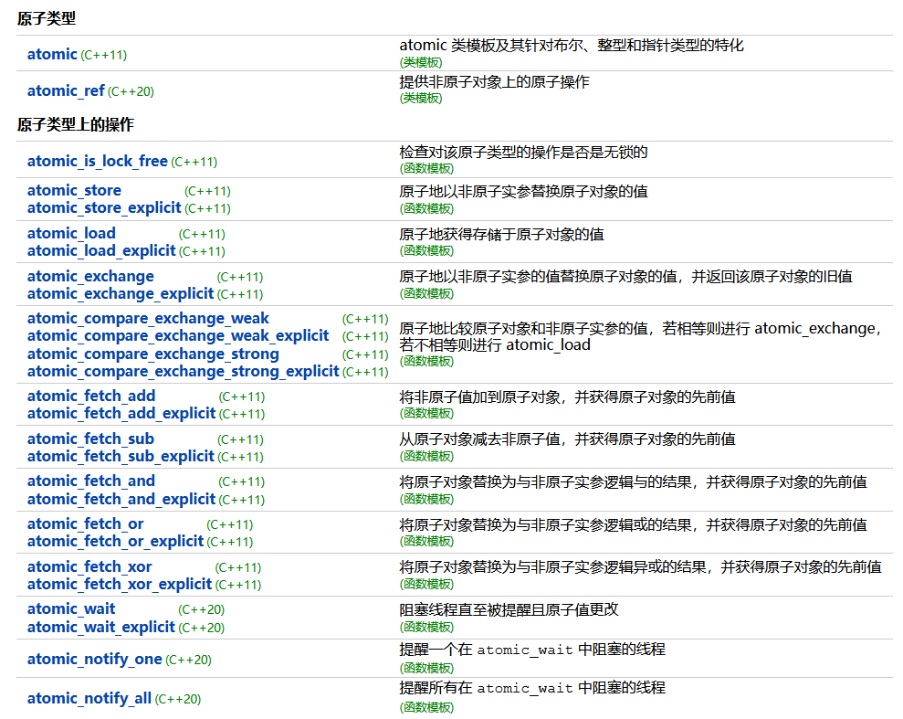

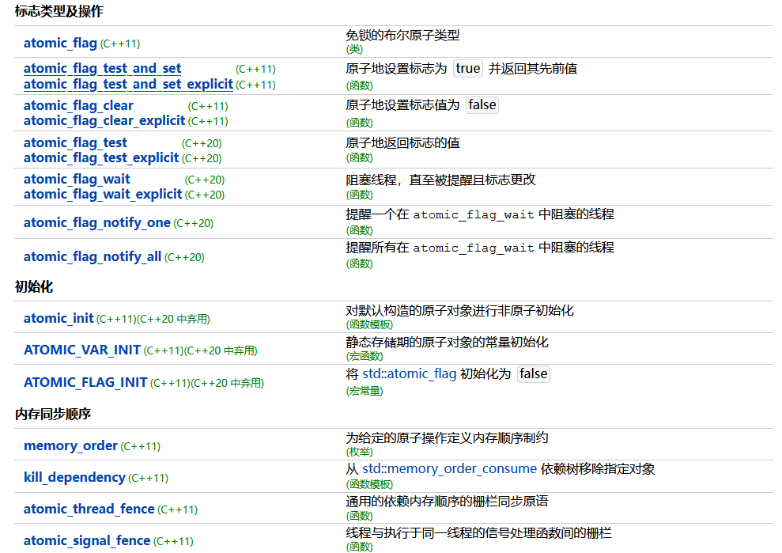


# 值传递&引用传递


(reference type)

“引用”（reference）是c++的一种新的变量类型，是对C的一个重要补充。它的作用是为变量起一个别名。假如有一个变量a，想给它起一个别名，可以这样写：

int a;int &b=a;

这就表明了b是a的“引用”，即a的别名。经过这样的声明，使用a或b的作用相同，都代表同一变量。在上述引用中，&是“引用声明符”，并不代表地址。

不要理解为“把a的值赋给b的地址”。引用类型的数据存储在内存的堆中，而[内存单元]中只存放堆中对象的地址。声明引用并不开辟内存单元，b和a都代表同一变量单元。


基本类型 和 引用类型的不同之处

```text
int num = 10;
String str = "hello";
```


值传递（pass by value ）是指在调用函数时将实际参数  **复制**  一份到函数中，这样在函数中如果对 参数  进行修改，将不会影响到实际参数。


引用传递（pass by reference） 是指在调用函数时将实际参数的地址 **直接**  传递到函数中，那么在函数中修改 参数 ，将影响着实际参数


java中方法参数传递方式是按值传递。

如果参数是基本类型，传递的是基本类型的字面量值的拷贝。

如果参数是引用类型，传递的是该参量所引用的对象在堆中地址值的拷贝。


1.**值传递**

  调用时，将实参的值传递对应的形参，即为值传递。由于形参有自己独立的存储空间，又作为函数的局部变量使用，因此在函数中对任何形参值得修改都不会改变实参变量的值

比如：

void test(int a,int b){

...

}

int main(){

int i = 10;

int j = 30;

test(i,j);

**// test(i,j)这里是值传递，test()函数原型中，形参int a,int b实际上也是有内存空间的，**

**// 也就是调用函数传入的参数就是复制了一份给形参的内存空间，在函数体内部对参数的操作，并不会改变调用处的变量 i,j**

return 0;

}


**2.引用传递**

  引用传递是一种特殊的变量，它被认为是一个变量的别名。当定义一个引用时，其实是为目标变量起一个别名，引用并不分配独立的内存空间，它与目标变量公用其内存空间，当定义一个引用时，如果该引用不是用作函数的参数或者返回值，则必须提供该引用的初始值


void test2(int &a,int &b){

...

}

int main(){

int i = 10;

int j = 30;

test(&i,&j);

**// test(i,j)这里是引用传递，test()函数原型中，形参int &a,int &b没有内存空间的，**

**// 也就是调用函数传入的参数就是真实参数的内存空间，在函数体内部对参数的操作，会改变调用处的变量 i,j**

return 0;

}


# 2022-02-03

# 处理器中的流水线


**流水线(Pipeline)技术是指程序在执行时候多条指令重叠进行操作的一种准并行处理实现技术。通俗的讲将一个时序过程，分解成若干个子过程，每个过程都能有效的与其他子过程同时执行。**


**指令执行过程分为多个阶段，每个阶段需要的资源不一样，因此可以采用流水线技术，同时执行多条指令的不同阶段。**


### 指令周期

CPU取出并执行一条指令所需全部时间称为指令周期，即CPU完成一条指令的时间


将取指和分析称为**取指周期**；指令执行阶段称为**执行周期**


**有些指令只需要取指周期，有些指令需要取指周期和执行周期，有些需要取指周期和多个执行周期**


**如果操作数为间接寻址，则需要首先取出操作数的地址，然后访存取出操作数，因此需要增加   间址周期**


**CPU采用中断方式与IO设备通信，在每条指令执行结束时判中断查询信号，如果有中断请求，需要进入中断周期**

**指令周期的流程如下所示**


**CPU指令周期由取指，间址，执行和中断组成，称为CPU4个工作周期，4个工作周期都需要访存**

**取指 取指令**

**间址 取地址**

**执行 取操作数**

**中断 存程序断点**


## 1.指令流水原理

可以将指令周期简单分为取指令和执行指令


**将指令处理过程进一步细分：**


1	**取指FI   从存储器取出一条指令放入指令部件缓冲区**

2	**指令译码DI   确定操作性质和操作数地址形成方式**

3	**计算操作数地址CO  计算操作有效地址**

4	**取操作数FO  从存储器中取出操作数**

5	**执行指令EI   执行指令，将结果存入目的位置**

6	**写操作书WO  将结果存入寄存器**

**将指令周期分为6个阶段，可以实现指令的6级流水**


将指令执行阶段分为取指 指令译码 地址形成 取操作数 执行指令 回写结果几个阶段，对应相应结构如下


## 2.影响流水线性能因素

### **2.1结构相关 资源相关**

不同指令争用同一部件产生资源冲突

FO取指和FI取操作数会发生访存冲突


解决方式：

流水线完成前一条指令对数据的存储器访问时，暂停取后一条指令

设置独立存储器存放操作数和指令

采用指令预取技术，将指令预取到指令队列中，这样取操作数操作便可以独占存储器访问

### **2.2数据相关**

不同指令重叠操作，可能改变对操作数的读写访问顺序

数据相关冲突有：


写后读相关：先写入寄存器，再读出寄存器

读后写相关：先读寄存器，再写寄存器

写后写相关：指令1先写寄存器，指令2再写寄存器

解决方式：

后推法  遇到数据相关时，停顿后继指令运行，直到前面指令结果已经生成

定向技术  旁路技术   将某条指令执行结果不送回寄存器而是直接送到其他指令所需的地方


### **2.3控制相关**

由转移指令引起 若是条件转移指令，则转移目标地址可能发生跳转，影响流水线效率。


解决方式：

尽早判别转移是否发生，尽早生成转移目标地址

预取转移成功和不成功两个方向的目标指令

加快和提前形成条件码


# 2022-02-21

# C++ 单例模式

**单例 Singleton** 是设计模式的一种，其特点是只提供**唯一**一个类的实例,具有全局变量的特点，在任何位置都可以通过接口获取到那个唯一实例;
 具体运用场景如：

1. 设备管理器，系统中可能有多个设备，但是只有一个设备管理器，用于管理设备驱动;
2. 数据池，用来缓存数据的数据结构，需要在一处写，多处读取或者多处写，多处读取;


**该模式的主要目的就是确保某个类有且仅有一个实例存在。**


## 1 基础要点

- 全局只有一个实例：static 特性，同时禁止用户自己声明并定义实例（把构造函数设为 private）
- 线程安全
- 禁止赋值和拷贝
- 用户通过接口获取实例：使用 static 类成员函数


**单例模式还会设计线程安全问题**


### 懒汉式

### 饿汉式

　　**懒汉式：故名思义，懒汉很懒只有饿了才会去找吃的。也就是说，只有在需要使用的时候才会去实例化。**

　　**饿汉式：饿了肯定要饥不择食。在单例类定义的时候就进行实例化。**

**懒汉式**

```
//Singleton.h
#pragma once

class Singleton {
public:
    static Singleton* getInstance();

private:
	// 构造函数要私有
    Singleton();
    Singleton(const Singleton&);
    Singleton& operator=(const Singleton&);
	//有一个私有的静态成员指针 instance_
    static Singleton* instance_; 
};

//Singleton.cpp
#include <iostream>
#include "Singleton.h"

Singleton* Singleton::instance_ = NULL;

Singleton::Singleton() {
}

Singleton::Singleton(const Singleton&) {
}

Singleton &
Singleton::operator=(const Singleton&) {
}

Singleton *
Singleton::getInstance() {
    if (NULL == instance_) {
    	//私有的静态成员指针 instance_，指向唯一的实例
        instance_ = new Singleton();
    }

    return instance_;
}


```

**组合**


    class Singleton {
    public:
        static Singleton* getInstance(){
            if (NULL == instance_) { // 首先判断一下，没有才给
        	//私有的静态成员指针 instance_，指向唯一的实例
            instance_ = new Singleton();
        }
    
        return instance_;
        
        }
    
    private:
    	// 构造函数要私有
        Singleton(){
        // code
        }
        Singleton(const Singleton&){
        // code
        }
        Singleton& operator=(const Singleton&){
        
        }
    	//有一个私有的静态成员指针 instance_
        static Singleton* instance_=NULL; 
    };
    
    int main(){
    
    Singleton s = new Singleton(); // 实例化单例
    Singleton s = Singleton.getInstance(); ////获取唯一可用的对象
    // ....
    
    Singleton s2 = new Singleton(); // 实例化单例,但是不会有新的实例对象，例化的结果还是同一个实例对象
    Singleton s2 = Singleton.getInstance();
    }


​    


​		**（1）默认构造函数是私有的，外部不能进行单例类的实例化；**

　　**（2）拷贝构造函数和赋值运算符也是私有的，以禁止拷贝和赋值；**

　　**（3）具有一个私有的静态成员指针 instance_，指向唯一的实例；**

　　**（4）提供一个公有的静态成员函数用于返回实例，如果实例为NULL，则进行实例化。**


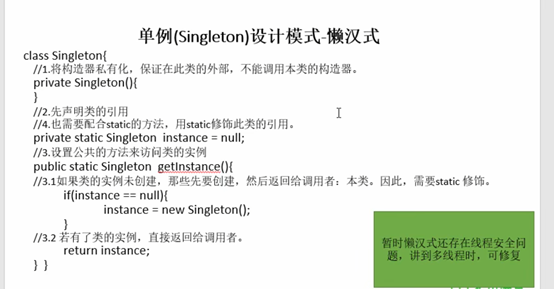


**饿汉式**

```
//Singleton.h
#pragma once

class Singleton {
public:
    static Singleton* getInstance();

private:
    Singleton();
    Singleton(const Singleton&);
    Singleton& operator=(const Singleton&);

    static Singleton* instance_;
};

//Singleton.cpp
#include <iostream>
#include "Singleton.h"

Singleton* Singleton::instance_ = new Singleton();

Singleton::Singleton() {
}

Singleton::Singleton(const Singleton&) {
}

Singleton &
Singleton::operator=(const Singleton&) {
}

Singleton *
Singleton::getInstance() {
    return instance_;
}
```


**组合**

    //Singleton.h
    #pragma once
    
    class Singleton {
    public:
        static Singleton* getInstance(){
        	return instance_;// 直接就返回实例
        }
    
    private:
        Singleton(){
        
        }
        Singleton(const Singleton&){
        
        }
        Singleton& operator=(const Singleton&){
        
        }
    
        static Singleton* instance_ = new Singleton();
    };
    
    int main(){
    
    Singleton s = Singleton.getInstance(); ////获取唯一可用的对象
    // ....
    
    // 实例化单例,但是不会有新的实例对象，得到的结果还是同一个实例对象
    Singleton s2 = Singleton.getInstance();
    }


​    


　**与懒汉式单例模式不同之处是，在全局作用域进行单例类的实例化，并用此实例初始化单例类的静态成员指针instance_**


**总结起来就是，因为getInstance()这个函数的返回值是一个指针，指向了一个类，但是这个指针是static的，唯一的，所以一旦类被例化，那么指向这个类的指针就唯一了，后面不管怎么例化这个类，返回的都是指向唯一的实例对象，这就是单例，单一的实例结果。**


# C++编程之模板与泛型

**2022-06-30**

模板是一种**对类型进行参数化**的工具，模板是泛型编程的基础，而[泛型编程](https://so.csdn.net/so/search?q=泛型编程&spm=1001.2101.3001.7020)指的就是**编写与类型无关的**代码，是C++中一种常见的代码复用方式

**以数据类型作为参数**

七种基本的

| 布尔型   | bool    |
| -------- | ------- |
| 字符型   | char    |
| 整型     | int     |
| 浮点型   | float   |
| 双浮点型 | double  |
| 无类型   | void    |
| 宽字符型 | wchar_t |

一些基本类型可以使用一个或多个类型修饰符进行修饰：

- signed
- unsigned
- short
- long


比如说，这个有一个类，这个类的类成员，类函数里面具体是什么数据类型，在使用前是不知道的，而是到了具体应用场景根据实际来指定，而需要指定的就是其内部所需的数据类型，这时数据类型就是我们需要指定的参数


## 模板  template

模板分为模板函数和模板类；模板函数针对参数类型不同的函数；模板类主要针对数据成员和[成员函数](https://so.csdn.net/so/search?q=成员函数&spm=1001.2101.3001.7020)类型不同的类

模板的一般格式为：template<class 形参名1，class 形参名2，...>

​                返回类型  函数名（参数列表）{函数体}


C++ 中类模板的写法如下：

### 类模板

**模板类主要针对 数据成员 和 成员函数 类型不同的类**

**可以设定不同的数据类型来例化同一种类**


就比如说有椅子这一个类，但是可以分出很多不同材质的椅子，材质就相当于这个椅子类的一个类型参数，有木质、金属、塑料等

赋予不同的材料就能形成不同的类


```
template <class  形参名，class 形参名，…> // <类型参数表>
class 类模板名{
  成员函数和成员变量
};
```

```
　　　　template<class T> class A
　　　　{
　　　　   public: 
　　　　   T a;
　　　　   T b; 
　　　　   T hy(T c, T &d);
　　　　   };
　//在类A中声明了两个类型为T的成员变量a和b，还声明了一个返回类型为T带两个参数类型为T的函数hy
```


类模板中的成员函数放到类模板定义外面写时的语法如下：

```
template <类型参数表>
返回值类型 类模板名<类型参数名列表>::成员函数名(参数表)
{
  ...
}
```


​	

类模板，就是说想构建一个类，这个类的参数的数据类型，类的成员变量，成员函数的数据类型可不确定的，这个类可以用多种数据类型去约束里面的成员的数据类型；如何这个类A和类B，所有东西都是一样的除了数据类型不一样，就像上面的例子，这个类的实例对象可以是int也可以是double等，所以说这时，数据类型就可以成为一个参数，通过数据类型的不同来构建不一样的实例对象。这就是一个模板类，通过套入一个所需的数据类型来完成编程。


```
class Pair
{
public:
    T1 key;  //关键字
    T2 value;  //值
    Pair(T1 k,T2 v):key(k),value(v) { };
    bool operator < (const Pair<T1,T2> & p) const;
};
template<class T1,class T2>
bool Pair<T1,T2>::operator < (const Pair<T1,T2> & p) const
//Pair的成员函数 operator <
{ //"小"的意思就是关键字小
    return key < p.key;
}
int main()
{
    Pair<string,int> student("Tom",19); //实例化出一个类 Pair<string,int>
    cout << student.key << " " << student.value;
    return 0;
}
```


类型参数表的写法如下：

```
class类塑参数1, class类型参数2, ...
```

类模板中的成员函数放到类模板定义外面写时的语法如下：

### 函数模板

**模板函数针对参数类型不同的函数**

```
template <类型参数表>
返回值类型 类模板名<类型参数名列表>::成员函数名(参数表)
{
  ...
}
```

```
　template <class 形参名，class 形参名，......> 
　返回类型 函数名(参数列表)

　　　{

　　　　　　函数体

　　　}
```

也可以这样：

函数模板作为类模板的成员


```
template <class T>
class A
{
public:
    template <class T2>
    void Func(T2 t) { cout << t; }  //成员函数模板
};
```


```
template<class T>
void Swap(T* x,T* y)
{
   T tmp;
   tmp=*x;
   *x=*y;
   *y=tmp;
}
```

```
template<class T>
class A
{
public:
A(T a);//构造
A(const A<T>& a);//拷贝构造
// A<T>为模板类的类型，A为类名
A<T>& operator=(const A<T>& a);//赋值运算符的重载
private:
T _a;
};


这里注意区分模板类的类名和类型：其中A<T>为模板类的类型，A为类名，一般来说，在模板类中，只有拷贝构造函数 和构造函数名必须为类名，其他一般均为类型。模板类实现完成之后，模板类对象可以这样创建：类名<类型>  对象名；比如上面的模板类A，则可以创建一个类型为int的模板类对象a(A<int> a;);在类A后面跟上一个<>并在里面填上相应的类型，这样的话凡是用到模板形参的地方都会被int替换，当有两个模板参数时可以这样实例化：类名<类型1，类型2>  对象名;例如：A<int,double> a;类型之间用逗号分隔即可

```


**模板函数的实现机制**

> - 编译器并不是把函数模板处理成能够处理任何类型的函数
> - 函数模板通过具体类型产生不同的函数
> - 两次编译

**两次编译**
 　　第一次编译:首先编译器会对函数模板声明的地方进行第一次编译.
 　　第二次编译:在调用的地方对参数替换后的代码进行第二次编译


## 泛型   _Generic


泛型是公共语言运行时所支持的参数化类型。 参数化类型是用在使用泛型时指定的未知类型参数定义的类型

**泛型**：是一种把明确类型的工作推迟到创建对象或者调用方法的时候才去明确的特殊的类型。也就是说在泛型使用过程中，操作的数据类型被指定为一个参数，而这种参数类型可以用在**类、方法和接口**中，分别被称为`泛型类`、`泛型方法`、`泛型接口`。


**泛型与 C++ 模板的主要区别：**

- 泛型在运行时被类型替换前一直都是泛型。 模板在编译时专用化，所以在运行时仍不是参数化类型


所以泛型，实质上就是不使用具体数据类型（例如 int、double、float 等），而是使用一种通用类型来进行程序设计的方法，该方法可以大规模的减少程序代码的编写量，让程序员可以集中精力用于业务逻辑的实现。

为了更好地说明使用具体数据类型有多么麻烦，这里先举个例子，假设客户需要一个函数，功能是返回两个 int 类型数据中较大的那个，很多读者自然而然会编写如下代码：

```
int maxt(int x, int y) {    return (x > y) ? x : y;}
```

可是没过几天，该用户又提出需要编写一个返回两个 double 类型数据中较大的那个，于是我们需要之前的代码进行修改：

```
double maxt(double x, double y) {    return (x > y) ? x : y;}
```

之后，该用户又提出需要再编写一个能返回两个 char 类型数据中较大的那个...。可以看到，只是因为数据类型不同，就迫使我们不得不把具有相同功能的代码写了若干遍，这样的实现方法简直令人崩溃。

为了解决类似的问题，有聪明的人将代码修改成如下的样子：

```
T maxt(T x, T y) {    return (x > y) ? x : y;}
```

如此，当用户需要某个数据类型的 maxt 函数时，我们只需要把其中的 T 替换成用户需要的实际数据类型就行了。

那么，代码中的 T 是什么呢？很明显，这是一个占位符，更确切的说是一个类型占位符。也就是说，将来在 T 这个位置上的是一个真实、具体的数据类型，至于到底是哪个类型，完全取决于用户的需求。

当然，如果硬要给 **T 这种类型占位符也叫做一种数据类型，提供这种想法的发明者称它为泛型（generic type）**，而使用这种类型占位符的编程方式就被称为泛型编程。

值得一提的是，既然泛型并不是真实的数据类型，那么使用泛型编写的代码也就不是真正的程序实体，只能算是一个程序实体的样板。故此，通常形象的将这种使用了泛型的代码称为模板，由模板生成实际代码的过程称为模板的具体实现。

> 注意，类型占位符的替换工作，不需要人为操控，可以完全交由计算机来完成，更准确的说，是交由编译器在编译阶段来完成模板的具体实现。

总之一句话，泛型也是一种数据类型，只不过它是一种用来代替所有类型的“通用类型”。在 [C++](http://c.biancheng.net/cplus/) 中，用以支持泛型应用的就是标准模板库 [STL](http://c.biancheng.net/stl/)，它提供了 C++ 泛型设计常用的类模板和函数模板。


## 泛型编程


**“泛”** 

國語辭典解释之一：

广博、普遍。如：「广**泛**」。

1. 《文选·司马相如·上林赋》：「于是乎周览**泛**观，缜纷轧芴。」
2. 晋·陶渊明〈读山海经〉诗一三首之一：「泛览周王传，流观山海图。」


所以“泛”就是说，一般性的，可以广泛普适的 


**模板是泛型编程的一种重要思想**，STL(Standard Template Library，标准模板库)是采用模板实现的一个实例

**所谓泛型编程，就是不依赖于某一具体类型而使代码具有很强适应性的编程范式。**

**就是利用了模板这种可泛化的代码段，来编程的一种方法**


同一种事物能用于多种场景，而不需要新增新的东西，这就是一种“泛化”能力


C++ 的泛型编程是基于模板实现的，而 C++ 的模板采用的是**代码膨胀技术**。例如 std::list 容器，如果你将 int 类型的数据存进去，C++ 编译器就为你生成一个专门用来存 int 类型数据的列表数据结构。也就是说，你向 std::list 容器中存放什么类型，C++ 编译器就为你生成相应的列表数据结构。理论上，数据的类型是无限的，因此 C++ 要生成的列表数据结构也是无限的。如果你的程序中有大量的数据类型要存到 std::list 容器，那么代码就会高度膨胀，这种膨胀是 C++ 编译器在目标文件连接阶段无法优化的。


# 迭代器 iterator 

**什么是迭代器**

迭代器非常类似于指针，用于访问容器中的各元素，而`STL`中的迭代器，迭代器是一个变量，常作为容器和各种通用算法函数的中介，这样就不用为每种容器都专门写一个函数。


尽管不同容器的内部结构各异，但它们本质上都是用来存储大量数据的，换句话说，都是一串能存储多个数据的存储单元。因此，诸如数据的排序、查找、求和等需要对数据进行遍历的操作方法应该是类似的。

既然类似，完全可以利用泛型技术，将它们设计成适用所有容器的通用算法，从而将容器和算法分离开。但实现此目的需要有一个类似中介的装置，它除了要具有对容器进行遍历读写数据的能力之外，还要能对外隐藏容器的内部差异，从而以统一的界面向算法传送数据。


迭代器按功能强弱分为**输入**迭代器、**输出**迭代器、前向迭代器、**双向**迭代器、**随机访问**迭代器 5 种


**迭代器的 4 种定义方式**

| 迭代器定义方式 | 具体格式                                   |
| -------------- | ------------------------------------------ |
| 正向迭代器     | 容器类名::iterator 迭代器名;               |
| 常量正向迭代器 | 容器类名::const_iterator 迭代器名;         |
| 反向迭代器     | 容器类名::reverse_iterator 迭代器名;       |
| 常量反向迭代器 | 容器类名::const_reverse_iterator 迭代器名; |


```
# include <iostream>
# include <vector>
using namespace std;
int main()
{
    vector < int > v {1, 2, 3, 4, 5, 6, 7, 8, 9, 10}; // v被初始化成有10个元素
    cout << "第一种遍历方法：" << endl;
    // size返回元素个数
    for (int i = 0; i < v.size(); ++i)
        cout << v[i] << " "; // 像普通数组一样使用vector容器
        // 创建一个正向迭代器，当然，vector也支持其他 3 种定义迭代器的方式

    cout << endl << "第二种遍历方法：" << endl;
    vector < int >::iterator i;
// 用 != 比较两个迭代器
    for (i = v.begin(); i != v.end(); ++i)
        cout << * i << " ";

    cout << endl << "第三种遍历方法：" << endl;
    for (i = v.begin(); i < v.end(); ++i) // 用 < 比较两个迭代器
        cout << * i << " ";

    cout << endl << "第四种遍历方法：" << endl;
    i = v.begin();
    while (i < v.end()) {// 间隔一个输出
        cout << * i << " ";
        i += 2; // 随机访问迭代器支持 "+= 整数"  的操作
    }
}

第一种遍历方法：
1 2 3 4 5 6 7 8 9 10 
第二种遍历方法：
1 2 3 4 5 6 7 8 9 10 
第三种遍历方法：
1 2 3 4 5 6 7 8 9 10 
第四种遍历方法：
1 3 5 7 9 
```


# 指针

2022-07-16

开始前先了解引用与指针

**指针**是一个变量，存储的是一个地址，指向内存的一个存储单元；

所以指针也是需要内存空间来存储自己

**引用**是原变量的一个**别名**，跟原来的变量实质上是同一个东西。

```cpp
int a = 996;
int *p = &a; // p是指针, &在此是求地址运算
int &r = a; // r是引用, &在此起标识作用

int a = 100;
int & b = a;
cout << b << endl; // 输出结果b=100,也就是和a一样

```

上面定义了一个整型变量 a，p 是一个指针变量，p 的值是变量 a 的地址；

而引用 r，是 a 的一个别名，在内存中 r 和 a 占有同一个存储单元。


指针(pointer)是"指向(point to)"另外一种类型的复合类型。


**符号 & 的作用根据上下文而不同：**

- 作为一元运算符的取址运算符：表达式 &x （）
- 作为二元运算符的按位与运算符：表达式 x & y
- 用于声明引用的分隔符：声明 int &ref;

**指向指针的引用**

引用本身不是一个对象，因此不能定义指向引用的指针。

但是指针是对象，所以存在对指针的引用。

从右向左阅读变量的类型，*&r表示一个指针的引用

&r表示是一个引用

*（&r)表示r引用的是一个指针

```text
// 指向指针的引用
int i = 42;
int *p;
int *&r = p; // 正确：引用的是一个指针
int &*r = p;  // 错误：引用不是对象，因此不能定义指向引用的指针

r = &i;
*r = 0;
```


## **什么是指针？**

**指针**是一个变量，其值为另一个变量的地址，即，内存位置的直接地址。

**每一个变量都有一个内存位置，每一个内存位置都定义了可使用连字号（&）运算符访问的地址，它表示了在内存中的一个地址**

```c++
    int a = 100;
    cout << "&a= " << &a <<endl;
    int *p;
    p = &a;
    cout << "p=  "<< p <<endl;
    cout << "&p= " << &p <<endl;
    cout << "*p= "<< *p <<endl;
    
   输出：
&a= 0xffffcbec
p=  0xffffcbec
&p= 0xffffcbe0
*p= 100
 a 是一个int变量，其值是100
       &a 就是100这个值所在的内存的地址
       int *p  那么p也是一个变量，只是说这种变量里面存放的是0x0000_1111这样的内存地址
       既然p是个变量，那就有内存空间来存放它， &p就是变量p自己的内存地址
       
   
```


变量的指针   和  指向变量的指针变量

星号 * 表示的就是指向表示符，表示“指向"的对象


int    *p1;     # 表示p1是指向int型变量的指针变量

char *p2;   # 表示p2是指向char型变量的指针变量

float *p3;   # 表示p3是指向float型变量的指针变量


**指针有两个属性:指向变量  /  对象的地址和长度** 
**但是指针只存储地址,长度则取决于指针的类型** 


**指针变量声明的一般形式为：**

**type     *var-name;**

**type** 是指针的基类型

**var-name** 是指针变量的名称


```
int    *ip;    /* 一个整型的指针  指针指向的地址的数据的类型是整形数据 */
double *dp;    /* 一个 double 型的指针   指针指向的地址的数据的类型是double型数据*/
float  *fp;    /* 一个浮点型的指针  指针指向的地址的数据的类型是浮点型数据*/
char   *ch;    /* 一个字符型的指针  指针指向的地址的数据的类型是字符型数据*/
```


所有指针的值的实际数据类型，不管是整型、浮点型、字符型，还是其他的数据类型，都是一样的，**都是一个代表内存地址的长的十六进制数**。不同数据类型的指针之间唯一的不同是，指针所指向的变量或常量的数据类型不同。


**指针就是个十六进制数，就是个内存地址，而该内存地址里面装的是什么数据就是由 声明前面的数据类型决定**

### C++ 指针应用详解

#### **1、C++ Null 指针**

赋为 NULL 值的指针被称为**空**指针

int *ptr = NULL;

#### 2、C++ 指针的算术运算

**指针进行四种算术运算：++、--、+、-**

**// 移动到下一个位置      **

**ptr++;**

对指针进行递减运算，即把值减去其数据类型的字节数

**// 移动到下一个位置**      

**ptr--;**

#### 3、指针的比较

指针可以用关系运算符进行比较，如 ==、< 和 >。如果 p1 和 p2 指向两个相关的变量，比如同一个数组中的不同元素，则可对 p1 和 p2 进行大小


#### 4、C++ 指针 vs 数组

指针和数组是密切相关的。事实上，指针和数组在很多情况下是可以互换的。例如，一个指向数组开头的指针，可以通过使用指针的算术运算或数组索引来访问数组。

   int  var[MAX] = {10, 100, 200};   

  int  *ptr;    // 指针中的数组地址  

  ptr = var;


#### 5、重点·C++ 指向指针的指针（多级间接寻址）


指向指针的指针是一种多级间接寻址的形式，或者说是一个指针链。（链表）

指针的指针就是将指针的地址存放在另一个指针里面。

通常，一个指针包含一个变量的地址。当我们定义一个指向指针的指针时，第一个指针包含了第二个指针的地址，第二个指针指向包含实际值的位置。


**声明：**

**变量名前放置两个星号**

```
int  **var;
```


**当一个目标值被一个指针间接指向到另一个指针时，访问这个值需要使用两个星号运算符**


#### 6、重点·C++ 传递指针给函数

**C++ 允许您传递指针给函数，只需要简单地声明函数参数为指针类型即可。**

将一个变量的地址传给另一个函数中


**能接受指针作为参数的函数，也能接受数组作为参数**


#### 7、C++ 从函数返回指针

声明一个返回指针的函数：

int * func(){}

**返回值为int型的指针，就是函数返回值是个指针，指针（内存地址)里面就是存放在返回值，具体什么类型就看定义是int还是char等类型**


**百度百科解释：**

在除了‘C/C++’的一些高级[程序](https://baike.baidu.com/item/程序/13831935)语言中，‘常量’可以被称作，“在一个信息变化过程中，始终不发生改变的量”，其可以是不随着时间变化的某些量的固定信息；也可以表示为某一数值的字符（或字符串），常被用来标识、测量和比较两者的差异。

但在 ‘C/C++语言中’，‘常量’如果还用‘运行过程中不变的量’来描述，就显得不太准确了，甚至是在具体使用时，这就是一个错误的[概念](https://baike.baidu.com/item/概念/829047)。在 ‘C/C++’中，定义‘[指针常量](https://baike.baidu.com/item/指针常量)’时，根据‘const ’的位置的不同，可以定义出几个不同的形式，虽然其看起来‘符合常量的概念’，但是在实际运行中，其值或地址值是会发生变化的。所以本质还不是‘常量概念’

#### 8、**指针常量**

**下面的解释不是绝对的，因为“常量”这个词的定义在编程上是有不同场景下的解释**

地址没有改变，内容可以改变，

在指针常量中，指针自身的值是一个常量，指针变量不允许修改。如同次指针指向一个地址该地址不能被修改，但是该地址里的内容可以被修改定义格式如下：

```
int *const a=5;
或
int a,b；
int * const p=&a ；p=&b;//操作错误
```

char * const s声明(*const s)，(* * const s)是char类型的。s被一个解引用运算符和一个const关键词修饰，故s是个不可修改的指针，但可通过指针s去修改s所指向的数据(即*s)。


#### 9、**常量指针**

指向“常量”的指针 

常量指针本质上是一个指针，常量表示指针指向的内容，说明该指针指向一个“常量”。在常量指针中，指针指向的内容是不可改变的，指针看起来好像指向了一个常量。

```
int a = 1, b = 2;
const int *p = &a;//等价于int const*p=&a;
p = &b; // 指针可以指向其他地址，地址可以改变，内容不可改变
```

对于const char    * s 来说，const  char*  是指向常量的指针,而不是指针本身为常量,可以不被初始化.该指针可以指向常量也可以指向变量,只是从该指针的角度而言,它所指向的是常量。* s是不变的，s是可以改变的，const限定的* s。s被一个解引用运算符修饰，故s是个普通的指针，可以修改，但是s所指向的数据(即*s)由于const的修饰而不可通过指针s去修改。


#### 10、**常量指针常量**

**你可以理解为是8和9两个约束条件的集合，首先指针指向的是一个常量，然后呢，这个常量的值也是不能够改变的，是一个确确实实的常量。**


**int * const p你可以这样看int * （const p）但是不能这样写！！！！const常量的意思，所以指针是个常量，说明指针指向的那个实体（内存）是不可改变的，至于那个实体（内存）存放的值并没有去限制它。**

**int const * p你可以这样看int const  (  * p  )p前面有解引用* ，所以 *p就是代表了p指向的那个实体(内存)常量里面的值，前面加了个const就是说指向的实体（内存）常量的值是不可以改变的，但是指针·指向的实体常量（地址）是可以改变的。const int * p也是代表常量指针，意思和上面那个可以说是一样的，意思是说const (int * p)   *p就是指向的那个实体常量的值，所以前面加const就是说实体常量的值是不能改变的，但是并没有对指向的实体常量进行限制，所以这就是一个常量指针至于，常量指针变量就是这两者的结合。**

```cpp
double pi = 3.14;
const double *ptr = &pi;
double const *ptr1 = &pi;//等效于line 2
double *const ptr2 = &pi;
```

> pointer to const：指针常量
> const pointer：常量指针

简单理解：

1   * const（即*在const之前）：距离const最近的是那个指针ptr（见上面代码第四行），也就是“ptr是只读的”，所以恰当的描述就应该是const pointer

const * p（即*在const之后）：距离const最近的是 * p，也就是“这个指针p的解引用的结果是只读的”，所以不能够通过指针修改这个指针的解引用，所以恰当的描述是pointer to const


**首先，所说的“常量”并不单单是 用了const修饰的， 比如 int a=10; 那么 a也是可是说是一个常量，他的值为10,10就是一个常量**


常量’概念在计算机技术领域的错误解释：

另一层含义指它们的编码方法是不变的（但是严格来说‘人为规定的某一种方法也可以因地制宜而人为改变，所以其本身数值大小‘不是‘常量’的内涵’），比如[字符](https://baike.baidu.com/item/字符)'A'无论在硬件、软件还是各种编程语言中，它的[信息编码](https://baike.baidu.com/item/信息编码)即为 ‘ 0x41’。

在除了‘C/C++’的一些高级[程序](https://baike.baidu.com/item/程序/13831935)语言中，‘常量’可以被称作，“在一个信息变化过程中，始终不发生改变的量”，其可以是不随着时间变化的某些量的固定信息；也可以表示为某一数值的字符（或字符串），常被用来标识、测量和比较两者的差异。

但在 ‘C/C++语言中’，‘常量’如果还用‘运行过程中不变的量’来描述，就显得不太准确了，甚至是在具体使用时，这就是一个错误的[概念](https://baike.baidu.com/item/概念/829047)。在 ‘C/C++’中，定义‘[指针常量](https://baike.baidu.com/item/指针常量)’时，根据‘const ’的位置的不同，可以定义出几个不同的形式，虽然其看起来‘符合常量的概念’，但是在实际运行中，其值或地址值是会发生变化的。所以本质还不是‘常量概念’


下面举几个C[语言](https://baike.baidu.com/item/语言/2291095)的例子做参考：

int *p; /* [定义](https://baike.baidu.com/item/定义/483965)的是变量 */

int const *p; /* 定义的就是常量 */

int * const p; /* 定义的还是常量 */

在上面定义的两个‘常量’的句子中，都符合常量的定义，但是其值是有变化的。所以其本质不是‘常量’

前者[内涵](https://baike.baidu.com/item/内涵/1415202)是表示，定义的“[指针常量](https://baike.baidu.com/item/指针常量)”所指向的整数是不变的，在初始化时，[指针变量](https://baike.baidu.com/item/指针变量)假如指向地址为‘1000’的变量a，这个a的值是固定不变的，但是指针常量p的值，（即地址值）可以向上、向下移动而指向不同的变量。这就是与常量概念相违背了。

后者是表示指针常量的地址值不变的，但是其所指向的整数是可以变化的，同样与上述的定义相违背。


```
#include "iostream"
using namespace std;
void test();
void test2();
int main(){

// 让指针指向一个常量对象，防止使用该指针来修改所指向的值（重点是后半句）
// 把指针变为不可修改操作

// 常量指针-->把声明的指针当做常量，不能通过操作这个指针来修改里面的值，
// 但是其指向的地址的值可以通过其地址标签的方式来改变其内部的值，只是不能通过指针来改变
// （内容可变（非指针方法），地址也可变）

int age = 18;
const int * pt = &age;
/*声明一个pt指向一个const int(这里是18)，因此不能使用pt来修改这个值，
换句话说，*pt的值为const 常量的，不能修改：
比如： *pt += 1; // 非法的
但是，pt的声明并不意味者它的值实际上就是一个常量，而是意味着对pt来说，这个值是常量，例如
pt指向age，而age不是const。 可以直接通过age变量来改变age的值，但不能通过pt指针来改变它

*/
cout << *pt << endl;
cout << pt << endl;
age +=1; // 不能用*pt += 1;修改，但可以直接修改
cout << *pt << endl;
cout << pt << endl;

// 如果是 const int age = 18; 同样也不能 操作age来修改值

// 或者给指针指定新的值
int age2 = 20;
pt = &age2;
cout << *pt << endl;
cout << pt << endl;

// 所以只能防止通过 pt来修改目前所指向的地址内的值，而不能防止修改pt所代表的具体的值，
//也就是可以让pt重新指向新的值的地址

//  const int * p = &a; 这种形式就是一种常量指针  
//  int const* p; //const * 即常量指针
//  const int* p; //const * 即常量指针
// 网上的解释有点令人晕乎， “常量指针本质上是一个指针，常量表示指针指向的内容，说明该指针指向一个“常量”。在常量指针中，指针指向的内容是不可改变的，指针看起来好像指向了一个常量。”
// 这种解释有点不全，应解释为，不能通过 p这个指针去操作改变当前指向的地址里面的内容，这就形成所谓指针指向常量，但是去直接操作指向的值的内容，*p也是会跟着变的
// 而且还可是让指针p指向新的地址空间


test();
test2();

return 0;
}
// 指针本身声明为常量，防止改变指针指向的位置;
//  int* const p; //* const 即指针常量   指针固定了，只能指向这个地址了，不能再指向别的内存地址，
// 可以操作指针来改变里面的值了
// (内容可变(可通过指方式变)，但地址不能变)

void test(){

    int s = 4;
    const int *p = &s; //常量指针  
    int * const p2 = &s;//即指针常量
    // p2只能指向 s,但是可以使用p2修改s的值
    cout << endl;
    cout << p2 << endl;
    cout << *p2 << endl;
    *p2 +=2;
    cout << endl;
    cout << p2 << endl;
    cout << *p2 << endl;

    s += 4;
    cout << endl;
    cout << p2 << endl;
    cout << *p2 << endl;

    // 下面就是错的，前面p2指向了s,不能修改p2重新指向s2
    /* 
    s2= 16;
    p2 = &s2;
    cout << endl;
    cout << p2 << endl;
    cout << *p2 << endl;
    */
}
// 指向常量的常指针
// (内容可变（非指针方式），地址不可变)
void test2(){

    int a = 10;
    //-------指向常量的常量指针-------//
    const int* const p = &a;
    //*p3 = 1;    //Error
    //p3 = &b;    //Error
    a = 5000;    //OK,仍然可以通过原来的声明修改值
    cout << endl;
    cout << p << endl;
    cout << *p << endl;

    // *p +=2;  错误使用

    int b =10;
    // p = &b; 错误使用


/*   指向常量的常指针

不能通过 p指针改变p指向的a的内容
也不能让 p指向新的地址

但是可以直接操作a的值

*/
}


/*
一种方式是看 * 和 const 的排列顺序，比如
     int const* p; //const * 即常量指针
     const int* p; //const * 即常量指针
     int* const p; //* const 即指针常量
还一种方式是看const离谁近，即从右往左看，比如
     int const* p; //const修饰的是*p，即*p的内容不可通过p改变，但p不是const，p可以修改，*p不可修改；
     const int* p; //同上
     int* const p; //const修饰的是p，p是指针，p指向的地址不能修改，p不能修改，但*p可以修改；


*/
```


#### 11、指向函数的指针---函数指针（函数的指针）

**一个函数在编译时就会分配一个入口地址，这个函数的入口地址就称为函数的指针**

**可以用一个指针变量指向函数，通过该指针变量来调用此函数**

定义形式：

        类型 （*指针变量名）（参数列表）；

例如：

        int (*p)(int i,int j);
    
    p是一个指针，它指向一个函数，该函数有2个整形参数，返回类型为int。p首先和*结合，表明p是一个指针。然后再与（）结合，表明它指向的是一个函数。指向函数的指针也称为函数指针


#### 12、用指向函数的指针做函数参数

**指向函数的指针变量的用途之一就是可以把该函数的入口地址作为参数传递到其它函数（传递给形参）。**

原理举例： 
 有一个函数名为fun的函数，它有两个形参x1和x2，并且定义x1和x2为指向函数的指针变量。在调用fun函数时，实参的两个函数名为f1和f2，这样给fun形参传递的就是f1和f2函数的入口地址。**如此在fun函数中就可以调用f1和f2函数。**

int fun(int(* x1)(int,char),int(* x2)(int,int))
{
  int a=1，b=2，c=3；
  int result1，result2=0；
  char d='a'；
  result1=(*x1)(a,d);   //调用f1函数，a，b是实参
  result2=(*x2)(b,c);   //调用f2函数，b，c是实参
}

在fun函数中，声明的形参x1和x2是指向函数的指针变量，x1指向的f1函数有一个int型和一个char型形参，x2指向的f2函数有两个int型形参。
a，b，c，d是调用f1和f2函数时所要求的实参。在fun函数没有被调用的时候，该函数的指针变量x1和x2并不占用内存空间，也不指向任何函数。在fun函数被调用时，此时函数f1和f2的入口地址传送到了fun函数形参x1和x2(即x1和x2指向函数f1和f2)，所以通过* x1和 * x2就可以调用函数f1和函数f2， ( * x1)(a,d)相当于f1(a,b)，( * x2)(b,c)相当于f2(b,c)。 

#### 13、返回指针值的函数--指针函数（返回值是指针）

顾名思义，指针函数即返回指针的函数。其一般定义形式如下： 		

​    **类型名** ***函数名**(**函数参数表列**);

  其中，后缀运算符括号"()"表示这是一个函数，其前缀运算符星号"*"表示此函数为指针型函数，其函数值为指针，即它带回来的值的类型为指针，当调用这个函数后，将得到一个"指向返回值为…的指针（地址），"**类型名**"表示函数返回的指针指向的类型"。


 **int *pfun(int, int);**

  **由于"*"的优先级低于"()"的优先级，因而pfun首先和后面的"()"结合，也就意味着，pfun是一个函数。即：** 		

  **int *(pfun(int, int));**

  **接着再和前面的"*"结合，说明这个函数的返回值是一个指针。由于前面还有一个int，也就是说，pfun是一个返回值为整型指针（返回的指针指向整型变量）的函数。** 		

  **我们不妨来再看一看，指针函数与函数指针有什么区别？** 		

  **int (*pfun)(int, int);**

  **通过括号强行将pfun首先与"*"结合，也就意味着，pfun是一个指针，接着与后面的"()"结合，说明该指针指向的是一个函数，然后再与前面的int结合，也就是说，该函数的返回值是int。由此可见，pfun是一个指向返回值为int的函数的指针。** 		

  **虽然它们只有一个括号的差别，但是表示的意义却截然不同。函数指针的本身是一个指针，指针指向的是一个函数。指针函数的本身是一个函数，其函数的返回值是一个指针。**


#### 14、指针数组  与   指向指针的指针


指针数组：是一个数组，数组内元素为指针

数组指针：是一个指针，指向一个数组


int *arr[3];

C++中[运算符](https://so.csdn.net/so/search?q=运算符&spm=1001.2101.3001.7020)优先级的问题了，arr先与[]结合那它就是数组，arr先与*\*结合那它就是指针。在这里[]的优先级要高于  \*，因此首先定义变量名arr其为大小为3的一个数组，再定义数组里元素int\*。

**指针数组**：指针数组可以说成是”**指针的数组**”，首先这个变量是一个数组，其次，”指针”修饰这个数组，意思是说这个数组的所有元素都是指针类型，在32位系统中，指针占四个字节。

```
char *arr[4] = {"hello", "world", "shannxi", "xian"};
//arr就是我定义的一个指针数组，它有四个元素，每个元素是一个char *类型的指针，这些指针存放着其对应字符串的首地址。
```

**数组指针**：数组指针可以说成是”**数组的指针**”，首先这个变量是一个指针，其次，”数组”修饰这个指针，意思是说这个指针存放着一个数组的首地址，或者说这个指针指向一个数组的首地址。 

首先来定义一个数组指针，既然是指针，名字就叫pa

```
char (*pa)[4];
```

为了访问原始对象，需要对指向指针的指针进行解引用，得到指针，然后对指针进行解引用，获取指针指向的对象。

```text
// 指向指针的指针
int ival = 1024;
int *p1 = &ival;  //p指向一个int型的数
int **pp1 = &p1; // pp指向一个int型的指针

cout << "ival = " << ival << endl;
cout  << "*p = " << *p1 << endl;
cout << "**pp = " << **pp1 << endl;
```


#### 15、指针数组作main函数的形参

指针数组的重要应用是作为main函数的形参，在以往的程序中，main函数的第一行一般形式为：

int main（）或 int main(void）

括号中为空或为“void”，表示main函数没有参数，调用main函数时不必给出参数。

这是一般程序常采用的格式。实际上，在某种情况下，main函数可以有参数，例：

    int mian(int argc,char *argv[])

argc和argv就是main函数的参数，他们是程序的“命令行参数”。

**argc(argument count**缩写，意思是参数个数)。

**argv(argument vector**缩写，意思是参数向量)，它是一个*char指针数组，数组中每一个元素（其值为指针）指向命令行中的一个字符串。

char *argv[]:   argv先和[结合再和\*结合，所以是一个指针的数组，数组里面的每个元素就是个指针

1、char **argv

分析：argv是一个指针变量，argv的指向（*argv）是char *，也就是argv指向的也是一个指针 ；

*argv的指向（**argv）是char。

 

2、char *argv[]

分析：首先argv是一个数组，数组里面的元素是指针变量（char *），数组里元素指向的是char。

argv[i]是指针变量，指向每个字符串的首地址


**通常main函数和其他函数组成一个文件模块，有一个文件名。对这个文件进行编译和连接，得到可执行文件（后缀为.exe）。用户执行这个可执行文件，操作系统就调用main函数，然后由main函数调用其他函数，从而完成程序的功能。**

但问题来了，什么情况下main函数需要参数？main函数的形参是从哪里传递给他们的呢？显然形参的值不可能在程序中得到。**main函数是操作系统调用的，实参只能由操作系统给出。**在操作命令状态下，实参是和执行文件的命令一起给出的。例如在DOS,UNIX,Linux等系统的操作命令状态下，在命令行中包括了命令名和需要传给main函数的参数。

命令行的一般形式为：

**命令名  参数1 参数2……参数n**


**命令名和各个参数之间用空格分隔。命令名是可执行文件名（此文件包含main函数）**

假设可执行文件名为：file1.exe,今想将两个字符串“China”,"Beijing"作为传送给main函数的参数。命令行可写成以下格式：

file1 China Beijing

**file1是可执行文件，China和Beijing是调用main函数的实参**。实际上文件名应包括盘符、路径，今为简化，用file1代表。

请注意以上参数与main函数中形参的关系。

main函数中形参argc是指命令行中参数的个数（注意，文件名也作为一个参数，即本例中file1也算一个参数），**现在，argc的值等于3（有三个命令行参数：file1、China、Beijing）。**

main函数中第二个**形参argv是一个指向字符串的指针数组，**就是说带参数的main函数原型为：

    int main(int argc,char *argv[ ]);

**命令行参数应当都是字符串，这些字符串的首地址构成一个指针数组。**

总结：

argc是主程序参数个数，也就是传入参数的个数，这个值一开始不确定，是看自己输入了多少个参数而确定的。

argv数组从0开始，第一个值存放的是可执行文件的文件名！然后依次存放后面传入的参数！即argv[0]指向字符串"file1"，argv[1]指向字符串"China"……

其实，main函数中的形参不一定命名为argc和argv，可以是任意的名字，只是人们习惯用argc和argv而已。

利用指针数组作为main函数的参数，可以向程序传送命令行参数（这些参数是字符串），这些字符串的长度事先并不知道，而且各参数字符串的长度一般并不相同，命令行参数的数目是可以任意的。用指针数组能够较好


    #include <studio.h>
    
    int main(int argc,char *argv[ ])
    
    {   while(argc>1)
    
       {++argv;  // argv[i]是指针变量，指向每个字符串的首地址
    
          printf("%s\n",*argv);
    
           --argc;
    
        }
    
    return 0;
    
    }

在程序变量命令下输入“China Beijing”。结果为：

China

Beijing

**其中，“*++argv是先进行++argv的运算”，使argv指向下一个元素，然后进行*的运算，找到argv当前指向的字符串。在开始时，argv指向字符串“file1”，++argv使之指向“China”，所以第一次输出“China”，第二次输出“Beijing”。**


#### 16、void型指针

**编译器根据指针的类型从指针指向的地址向后寻址** 

**指针类型不同则寻址范围也不同,比如:**

 **int *从指定地址向后寻找4字节作为变量的存储单元** 

**double *从指定地址向后寻找8字节作为变量的存储单元**


**1.void指针是一种特别的指针** 
   void *vp 
   //说它特别是因为它没有类型 
   //或者说这个类型不能判断出指向对象的长度 

**2.任何指针都可以赋值给void指针** 
   type *p; 
   vp=p; 
   //不需转换 
   //只获得变量/对象地址而不获得大小 

**3.void指针赋值给其他类型的指针时都要进行转换** 
   type *p=(type*)vp; 
   //转换类型也就是获得指向变量/对象大小 

**4.void指针不能复引用** 
   *vp//错误 
   因为void指针只知道,指向变量/对象的起始地址 
   而不知道指向变量/对象的大小(占几个字节)所以无法正确引用 

**5.void指针不能参与指针运算,除非进行转换** 
   (type*)vp++; 
   //vp==vp+sizeof(type)


#### 17、指针数据类型小结


**结合性从右到左**


#### 18、常引用传递

常引用的作用有两个，一是让变量所指向的内存空间只读，二是能够指向常量

首先进一步理解引用： int &a=b 相当于 int *const a=b。即引用是一个指针常量（又称常指针，即一个常量，其类型是指针）。

每当编译器遇到引用变量a，就会自动执行 * 操作。

而常引用：const int &a=b就相当于 const int * const a=b。不仅仅是a这个地址不可修改，而且其指向的内存空间也不可修改。

**常引用.之一（引用变量）**


**常引用.之二（引用常量）**


**函数传递参数的常引用传递方式**

用const声明的引用就是常引用。**常引用所引用的对象不能被更改**。经常见到的是**常引用作为函数的形参，这样不会发生对实参的误修改**。常引用的声明形式为：const 类型说明符 &引用名

```cpp
    #include "iostream"
    using namespace std;
    // 常引用作为函数形参，保证了不会对实参的值进行误修改，常引用的格式是: const 类型名 &引用名;
    void fun(const double &d);
    int main(){
        double d = 3.14;
        fun(d);
        return 0;
    }
//引用本来就相当于一个常指针：* const t
//再加一个const表示指针指向的内存空间也不可修改
//作用：1.让变量所指向的内存空间只读 
    void fun(const double &d){
        // 常引用作形参，在函数中不能更新d所引用的对象
        double i = 6.66;
        // d = i;  此处将报错！！！
        cout << "d = " << d << endl;
    }
```


# 引用---&

## 指针与引用的区别


**指针**是一个变量，存储的是一个**地址**，指向内存的一个存储单元；


**引用**是原变量的一个**别名**，跟原来的变量实质上是同一个东西。


```cpp
int a = 996;

int *p = &a; // p是指针, &在此是求地址运算

int &r = a; // r是引用, &在此起标识作用

    cout << p <<endl; // 输出是地址
    cout << r <<endl; // 输出就是 a的值


定义了一个整型变量 a，p 是一个指针变量，p 的值是变量 a 的地址；

而引用 r，是 a 的一个别名，在内存中 r 和 a 占有同一个存储单元。
```


2、指针可以有多级，引用只能是一级

```cpp
int **p; // 合法
int &&a; // 不合法
```

3、指针可以在定义的时候不初始化，引用必须在定义的时候初始化

```cpp
int *p; // 合法
int &r; // 不合法
int a = 996;
int &r = a; // 合法
```

4、指针可以指向NULL，引用不可以为NULL

```cpp
int *p = NULL; // 合法
int &r = NULL; // 不合法
```

5、指针初始化之后可以再改变，引用不可以

```cpp
int a = 996;
int *p = &a; // 初始化, p 是 a 的地址
int &r = a; // 初始化, r 是 a 的引用

int b = 885;
p = &b;	// 合法, p 更改为 b 的地址
r = b; 	// 不合法, r 不可以再变
```

6、sizeof 的运算结果不同

```cpp
int a = 996;
int *p = &a;
int &r = a;

cout << sizeof(p); // 返回 int* 类型的大小
cout << sizeof(r); // 返回 int 类型的大小
```

在64位机器上，int* 类型的大小为8个字节，int类型的大小为4个字节。

> sizeof 是C/C++ 中的一个操作符（operator），其作用就是返回一个对象或者类型所占的内存字节数。
> The sizeof keyword gives the amount of storage, in bytes, associated with a variable or a type(including aggregate types). This keyword returns a value of type size_t.

7、自增运算意义不同

如下图所示，p++之后指向a后面的内存，r++相当于a++。

```cpp
int a = 996;
int *p = &a;
int &r = a;

p++;
r++;

// 指针的加1操作，单纯的 p++是可以另指针p指向下一个地址的，

比如：p=0x00000001
    p++;
// 加1后，p=0x00000002

// 但是 如果说p++后赋值给一个指针变量，是没法完成 加1操作的
int *p2= p++;
cout << "p2= " << p2 <<endl; // 发现 p2的指针还是0x00000001, 但p指针本身完成了加1，变成了0x00000002
// 因为在 int *p2= p++;中是先赋值后加1，先把p的地址赋给了p2,后p加1， 
// 想要获得 p加1后的地址，应该是  int *p2= ++p;   先加1后赋值


```


8、指针和引用作为函数参数时，指针需要检查是否为空，引用不需要

```cpp
void fun_p(int *p)
{
    // 需要检查P是否为空
    if (p == NULL) 
    {
        // do something
    }
}

void fun_r(int &r)
{
    // 不需要检查r
    // do something
}
```

PS：指针和引用都可以作为函数参数，改变实参的值。


### **特别留意**

数组的引用的加1操作，在有括号和没括号情况下是有区别的

下面的例子中，p2和p3指针之间差的内存地址是数组元素个长度


## C++ 之智能指针


https://www.cnblogs.com/greatverve/p/smart-ptr.html

https://blog.csdn.net/flowing_wind/article/details/81301001

C++ **语言没有自动内存回收机制**

**我们知道除了静态内存和栈内存外，每个程序还有一个内存池，这部分内存被称为自由空间或者堆。程序用堆来存储动态分配的对象即那些在程序运行时分配的对象，当动态对象不再使用时，我们的代码必须显式的销毁它们。**

**在C++中，动态内存的管理是用一对运算符完成的：new和delete，new:在动态内存中为对象分配一块空间并返回一个指向该对象的指针，delete：指向一个动态独享的指针，销毁对象，并释放与之关联的内存。**

**动态内存管理经常会出现两种问题：一种是忘记释放内存，会造成内存泄漏；一种是尚有指针引用内存的情况下就释放了它，就会产生引用非法内存的指针。**

**为了更加容易（更加安全）的使用动态内存，引入了智能指针的概念。智能指针的行为类似常规指针，重要的区别是它负责自动释放所指向的对象。标准库提供的两种智能指针的区别在于管理底层指针的方法不同，**

**shared_ptr允许多个指针指向同一个对象，**

**unique_ptr则“独占”所指向的对象。**

**标准库还定义了一种名为weak_ptr的伴随类，它是一种弱引用，指向shared_ptr所管理的对象，**

**这三种智能指针都定义在memory头文件中。**


**C++11智能指针介绍**

**智能指针主要用于管理在堆上分配的内存，它将普通的指针封装为一个栈对象。当栈对象的生存周期结束后，会在析构函数中释放掉申请的内存，从而防止内存泄漏。C++  11中最常用的智能指针类型为shared_ptr,它采用引用计数的方法，记录当前内存资源被多少个智能指针引用。该引用计数的内存在堆上分配。当新增一个时引用计数加1，当过期时引用计数减一。只有引用计数为0时，智能指针才会自动释放引用的内存资源。对shared_ptr进行初始化时不能将一个普通指针直接赋值给智能指针，因为一个是指针，一个是类。可以通过make_shared函数或者通过构造函数传入普通指针。并可以通过get函数获得普通指针。**

**auto_ptr, unique_ptr,shared_ptr, weak_ptr 其中后三个是C++11支持，并且第一个已经被C++11弃用。**


**为什么要使用智能指针**

智能指针的作用是管理一个指针，因为存在以下这种情况：申请的空间在函数结束时忘记释放，造成**内存泄漏**。使用智能指针可以很大程度上的避免这个问题，因为**智能指针是一个类**，当超出了类的实例对象的作用域时，会**自动调用对象的析构函数**，析构函数会自动释放资源。所以智能指针的作用原理就是在函数结束时自动释放内存空间，不需要手动释放内存空间。

智能指针是一个类


### **#shared_ptr类**

 创建智能指针时必须提供额外的信息，指针可以指向的类型：

```
shared_ptr<string> p1;
shared_ptr<list<int>> p2;
```

默认初始化的智能指针中保存着一个空指针。
 智能指针的使用方式和普通指针类似，解引用一个智能指针返回它指向的对象，在一个条件判断中使用智能指针就是检测它是不是空。

```
if(p1  && p1->empty())
	*p1 = "hi";
```


如下表所示是shared_ptr特有的操作：


**make_shared函数：**

最安全的分配和使用动态内存的方法就是调用一个名为make_shared的标准库函数，此函数在动态内存中分配一个对象并初始化它，**返回指向此对象的shared_pt**r。头文件和share_ptr相同，在memory中
 必须指定想要创建对象的类型，定义格式见下面例子：

```
shared_ptr<int> p3 = make_shared<int>(42);  // 分配一个存放int数据的内存空间，里面初始化值为42
shared_ptr<string> p4 = make_shared<string>(10,'9'); // 分配string数据类型内存空间，初始化值为字符串10和字符'9'
shared_ptr<int> p5 = make_shared<int>(); // 分配存放int数据类型空间，初始化内容为空
```

make_shared用其参数来构造给定类型的对象，如果我们不传递任何参数，对象就会进行值初始化

shared_ptr的拷贝和赋值
 当进行拷贝和赋值时，每个shared_ptr都会记录有多少个其他shared_ptr指向相同的对象。

```
auto p = make_shared<int>(42);
auto q(p);
```

我们可以认为每个shared_ptr都有一个关联的计数器，通常称其为引用计数，无论何时我们拷贝一个shared_ptr，计数器都会递增。当我们给shared_ptr赋予一个新值或是shared_ptr被销毁（例如一个局部的shared_ptr离开其作用域）时，计数器就会递减，一旦一个shared_ptr的计数器变为0,它就会自动释放自己所管理的对象。

```
auto r = make_shared<int>(42);//r指向的int只有一个引用者
r=q;//给r赋值，令它指向另一个地址
	//递增q指向的对象的引用计数
	//递减r原来指向的对象的引用计数
	//r原来指向的对象已没有引用者，会自动释放
```

shared_ptr自动销毁所管理的对象
当指向一个对象的最后一个shared_ptr被销毁时，shared_ptr类会自动销毁此对象，它是通过另一个特殊的成员函数-析构函数完成销毁工作的，类似于构造函数，每个类都有一个析构函数。析构函数控制对象销毁时做什么操作。析构函数一般用来释放对象所分配的资源。shared_ptr的析构函数会递减它所指向的对象的引用计数。如果引用计数变为0，shared_ptr的析构函数就会销毁对象，并释放它所占用的内存。

shared_ptr还会自动释放相关联的内存
当动态对象不再被使用时，shared_ptr类还会自动释放动态对象，这一特性使得动态内存的使用变得非常容易。如果你将shared_ptr存放于一个容器中，而后不再需要全部元素，而只使用其中一部分，要记得用erase删除不再需要的那些元素。

使用了动态生存期的资源的类：
程序使用动态内存的原因：
（1）程序不知道自己需要使用多少对象
（2）程序不知道所需对象的准确类型
（3）程序需要在多个对象间共享数据

#### 直接管理内存

C++定义了两个运算符来分配和释放动态内存，new和delete，使用这两个运算符非常容易出错。

使用new动态分配和初始化对象
 在自由空间分配的内存是无名的，因此new无法为其分配的对象命名，而是返回一个指向该对象的指针。

```
int *pi = new int;//pi指向一个动态分配的、未初始化的无名对象
```

此new表达式在自由空间构造一个int型对象，并返回指向该对象的指针

默认情况下，动态分配的对象是默认初始化的，这意味着内置类型或组合类型的对象的值将是未定义的，而类类型对象将用默认构造函数进行初始化。

```
string *ps = new string;//初始化为空string
int *pi = new int;//pi指向一个未初始化的int
```

我们可以直接使用直接初始化方式来初始化一个动态分配一个动态分配的对象。我们可以使用传统的构造方式，在新标准下，也可以使用列表初始化

```
int *pi = new int(1024);
string *ps = new string(10,'9');
vector<int> *pv = new vector<int>{0,1,2,3,4,5,6,7,8,9};
```


**也可以对动态分配的对象进行初始化，只需在类型名之后跟一对空括号即可；**

动态分配的const对象

```
const int *pci = new const int(1024);
//分配并初始化一个const int
const string *pcs = new const string;
//分配并默认初始化一个const的空string
```

类似其他任何const对象，一个动态分配的const对象必须进行初始化。对于一个定义了默认构造函数的类类型，其const动态对象可以隐式初始化，而其他类型的对象就必须显式初始化。由于分配的对象就必须显式初始化。由于分配的对象是const的，new返回的指针就是一个指向const的指针。

**内存耗尽：**
  虽然现代计算机通常都配备大容量内村，但是自由空间被耗尽的情况还是有可能发生。一旦一个程序用光了它所有可用的空间，new表达式就会失败。默认情况下，如果new不能分配所需的内存空间，他会抛出一个bad_alloc的异常，我们可以改变使用new的方式来阻止它抛出异常

```
//如果分配失败，new返回一个空指针
int *p1 = new int;//如果分配失败，new抛出std：：bad_alloc
int *p2 = new (nothrow)int;//如果分配失败，new返回一个空指针
```

我们称这种形式的new为定位new,定位new表达式允许我们向new传递额外的参数，在例子中我们传给它一个由标准库定义的nothrow的对象，如果将nothrow传递给new，我们的意图是告诉它不要抛出异常。如果这种形式的new不能分配所需内存，它会返回一个空指针。bad_alloc和nothrow都在头文件new中。


#### 释放动态内存

为了防止内存耗尽，在动态内存使用完之后，必须将其归还给系统，使用delete归还。

指针值和delete
我们传递给delete的指针必须指向动态内存，或者是一个空指针。释放一块并非new分配的内存或者将相同的指针释放多次，其行为是未定义的。即使delete后面跟的是指向静态分配的对象或者已经释放的空间，编译还是能够通过，实际上是错误的。

动态对象的生存周期直到被释放时为止
由shared_ptr管理的内存在最后一个shared_ptr销毁时会被自动释放，但是通过内置指针类型来管理的内存就不是这样了，内置类型指针管理的动态对象，直到被显式释放之前都是存在的，所以调用这必须记得释放内存。

使用new和delete管理动态内存常出现的问题：
（1）忘记delete内存
（2）使用已经释放的对象
（3）同一块内存释放两次

delete之后重置指针值
**在delete之后，指针就变成了空悬指针，即指向一块曾经保存数据对象但现在已经无效的内存的地址**

有一种方法可以**避免悬空指针的问题**：在指针即将要离开其作用于之前释放掉它所关联的内存
如果我们需要保留指针可以在delete之后将nullptr赋予指针，这样就清楚的指出指针不指向任何对象。
动态内存的一个基本问题是可能多个指针指向相同的内存

#### shared_ptr和new结合使用

如果我们不初始化一个智能指针，它就会被初始化成一个空指针，接受指针参数的职能指针是explicit的，因此我们不能将一个内置指针隐式转换为一个智能指针，必须直接初始化形式来初始化一个智能指针

```
shared_ptr<int> p1 = new int(1024);//错误：必须使用直接初始化形式
shared_ptr<int> p2(new int(1024));//正确：使用了直接初始化形式
```

下表为定义和改变shared_ptr的其他方法：


不要混合使用普通指针和智能指针
如果混合使用的话，智能指针自动释放之后，普通指针有时就会变成悬空指针，当将一个shared_ptr绑定到一个普通指针时，我们就将内存的管理责任交给了这个shared_ptr。一旦这样做了，我们就不应该再使用内置指针来访问shared_ptr所指向的内存了。
也不要使用get初始化另一个智能指针或为智能指针赋值

**shared_ptr< int > p(new int(42));//引用计数为1**
**int *q = p.get();//正确：但使用q时要注意，不要让它管理的指针被释放**
**{**
	**//新程序块**
	**//未定义：两个独立的share_ptr指向相同的内存**
	**shared_ptr(q);**

****

**}//程序块结束，q被销毁，它指向的内存被释放**
**int foo = *p;//未定义，p指向的内存已经被释放了**

p和q指向相同的一块内部才能，由于是相互独立创建，因此各自的引用计数都是1，当q所在的程序块结束时，q被销毁，这会导致q指向的内存被释放，p这时候就变成一个空悬指针，再次使用时，将发生未定义的行为，当p被销毁时，这块空间会被二次delete

其他shared_ptr操作
 可以使用reset来将一个新的指针赋予一个shared_ptr:


```
p = new int(1024);//错误：不能将一个指针赋予shared_ptr
p.reset(new int(1024));//正确。p指向一个新对象
```


与赋值类似，reset会更新引用计数，如果需要的话，会释放p的对象。reset成员经常和unique一起使用，来控制多个shared_ptr共享的对象。在改变底层对象之前，我们检查自己是否是当前对象仅有的用户。如果不是，在改变之前要制作一份新的拷贝：


```
if(!p.unique())
p.reset(new string(*p));//我们不是唯一用户，分配新的拷贝
*p+=newVal;//现在我们知道自己是唯一的用户，可以改变对象的值
```

智能指针和异常
如果使用智能指针，即使程序块过早结束，智能指针也能确保在内存不再需要时将其释放，sp是一个shared_ptr,因此sp销毁时会检测引用计数，当发生异常时，我们直接管理的内存是不会自动释放的。如果使用内置指针管理内存，且在new之后在对应的delete之前发生了异常，则内存不会被释放。

使用我们自己的释放操作
默认情况下，shared_ptr假定他们指向的是动态内存，因此当一个shared_ptr被销毁时，会自动执行delete操作，为了用shared_ptr来管理一个connection，我们必须首先必须定义一个函数来代替delete。这个删除器函数必须能够完成对shared_ptr中保存的指针进行释放的操作。

智能指针陷阱：
（1）不使用相同的内置指针值初始化（或reset）多个智能指针。
（2）不delete get()返回的指针
（3）不使用get()初始化或reset另一个智能指针
（4）如果你使用get()返回的指针，记住当最后一个对应的智能指针销毁后，你的指针就变为无效了
（5）如果你使用智能指针管理的资源不是new分配的内存，记住传递给它一个删除器
#unique_ptr
某个时刻只能有一个unique_ptr指向一个给定对象，由于一个unique_ptr拥有它指向的对象，因此unique_ptr不支持普通的拷贝或赋值操作。
下表是unique的操作：


虽然我们不能拷贝或者赋值unique_ptr，但是可以通过调用release或reset将指针所有权从一个（非const）unique_ptr转移给另一个unique

//将所有权从p1（指向string Stegosaurus）转移给p2
unique_ptr< string> p2(p1.release());//release将p1置为空
unique_ptr< string>p3(new string("Trex"));
//将所有权从p3转移到p2
p2.reset(p3.release());//reset释放了p2原来指向的内存


elease成员返回unique_ptr当前保存的指针并将其置为空。因此，p2被初始化为p1原来保存的指针，而p1被置为空。
reset成员接受一个可选的指针参数，令unique_ptr重新指向给定的指针。
调用release会切断unique_ptr和它原来管理的的对象间的联系。release返回的指针通常被用来初始化另一个智能指针或给另一个智能指针赋值。
不能拷贝unique_ptr有一个例外：我们可以拷贝或赋值一个将要被销毁的unique_ptr.最常见的例子是从函数返回一个unique_ptr.

```
unique_ptr<int> clone(int p)
{
	//正确：从int*创建一个unique_ptr<int>
	return unique_ptr<int>(new int(p));
}
```

还可以返回一个局部对象的拷贝：

```
unique_ptr<int> clone(int p)
{
	unique_ptr<int> ret(new int(p));
	return ret;
}
```

向后兼容：auto_ptr
标准库的较早版本包含了一个名为auto_ptr的类，它具有uniqued_ptr的部分特性，但不是全部。
用unique_ptr传递删除器
unique_ptr默认使用delete释放它指向的对象，我们可以重载一个unique_ptr中默认的删除器
我们必须在尖括号中unique_ptr指向类型之后提供删除器类型。在创建或reset一个这种unique_ptr类型的对象时，必须提供一个指定类型的可调用对象删除器。

#weak_ptr
weak_ptr是一种不控制所指向对象生存期的智能指针，它指向一个由shared_ptr管理的对象，将一个weak_ptr绑定到一个shared_ptr不会改变shared_ptr的引用计数。一旦最后一个指向对象的shared_ptr被销毁，对象就会被释放，即使有weak_ptr指向对象，对象还是会被释放。
weak_ptr的操作


由于对象可能不存在，我们不能使用weak_ptr直接访问对象，而必须调用lock，此函数检查weak_ptr指向的对象是否存在。如果存在，lock返回一个指向共享对象的shared_ptr,如果不存在，lock将返回一个空指针

#scoped_ptr
scoped和weak_ptr的区别就是，给出了拷贝和赋值操作的声明并没有给出具体实现，并且将这两个操作定义成私有的，这样就保证scoped_ptr不能使用拷贝来构造新的对象也不能执行赋值操作，更加安全，但有了"++""–"以及“*”“->”这些操作，比weak_ptr能实现更多功能。


### std::make_unique 与 std::make_shared

\1.  make_unique 同 unique_ptr 、auto_ptr 等一样，都是 smart pointer，可以取代new 并且无需 delete pointer，有助于代码管理。

\2. make_unique 创建并返回 unique_ptr 至指定类型的对象，这一点从其构造函数能看出来。make_unique相较于unique_ptr 则更加安全。

\3. 编译器不同，make_unique 要求更新（Visual Studio 2015）。


### auto_ptr

（C++98的方案，C++11已经抛弃）采用所有权模式。


### unique_ptr  独占指针

**替换auto_ptr）unique_ptr实现独占式拥有或严格拥有概念，保证同一时间内只有一个智能指针可以指向该对象。它对于避免资源泄露(例如“以new创建对象后因为发生异常而忘记调用delete”)特别有用。**

**unique_ptr比auto_ptr更安全**


**额外：**boost库的boost::scoped_ptr也是一个独占性智能指针，但是它不允许转移所有权，从始而终都只对一个资源负责，它更安全谨慎，但是应用的范围也更狭窄。

### shared_ptr 共享指针

shared_ptr实现共享式拥有概念。多个智能指针可以指向相同对象，该对象和其相关资源会在“最后一个引用被销毁”时候释放。从名字share就可以看出了资源可以被多个指针共享，它使用计数机制来表明资源被几个指针共享。可以通过成员函数use_count()来查看资源的所有者个数。除了可以通过new来构造，还可以通过传入auto_ptr,  unique_ptr,weak_ptr来构造。当我们调用release()时，当前指针会释放资源所有权，计数减一。当计数等于0时，资源会被释放。

shared_ptr 是为了解决 auto_ptr 在对象所有权上的局限性(auto_ptr 是独占的), 在使用引用计数的机制上提供了可以共享所有权的智能指针。

成员函数：

use_count 返回引用计数的个数

unique 返回是否是独占所有权( use_count 为 1)

swap 交换两个 shared_ptr 对象(即交换所拥有的对象)

reset 放弃内部对象的所有权或拥有对象的变更, 会引起原有对象的引用计数的减少

get 返回内部对象(指针), 由于已经重载了()方法, 因此和直接使用对象是一样的.


### weak_ptr  弱指针

share_ptr虽然已经很好用了，但是有一点share_ptr智能指针还是有内存泄露的情况，当两个对象相互使用一个shared_ptr成员变量指向对方，会造成循环引用，使引用计数失效，从而导致内存泄漏。

weak_ptr 是一种不控制对象生命周期的智能指针, 它指向一个 shared_ptr 管理的对象.  进行该对象的内存管理的是那个强引用的shared_ptr， weak_ptr只是提供了对管理对象的一个访问手段。weak_ptr  设计的目的是为配合 shared_ptr 而引入的一种智能指针来协助 shared_ptr 工作, 它只可以从一个 shared_ptr  或另一个 weak_ptr 对象构造,  它的构造和析构不会引起引用记数的增加或减少。weak_ptr是用来解决shared_ptr相互引用时的死锁问题,如果说两个shared_ptr相互引用,那么这两个指针的引用计数永远不可能下降为0,资源永远不会释放。它是对对象的一种弱引用，不会增加对象的引用计数，和shared_ptr之间可以相互转化，shared_ptr可以直接赋值给它，它可以通过调用lock函数来获得shared_ptr。


# C++之静态  static

2022-07-17


##  静态变量与普通变量

- （1）静态变量都在全局数据区分配内存，包括后面将要提到的静态局部变量;
- （2）未经初始化的静态全局变量会被程序自动初始化为0（在函数体内声明的自动变量的值是随机的，除非它被显式初始化，而在函数体外被声明的自动变量也会被初始化为 0）；
- （3）静态全局变量在声明它的整个文件都是可见的，而在文件之外是不可见的。


**全局变量和全局静态变量的区别**

- 1）全局变量是不显式用 static 修饰的全局变量，全局变量默认是有**外部链接性**的，作用域是整个工程，在一个文件内定义的全局变量，在另一个文件中，通过 extern 全局变量名的声明，就可以使用全局变量。
- 2）全局静态变量是显式用 static 修饰的全局变量，作用域是声明此变量所在的文件，其他的文件即使用 extern 声明也不能使用


## C++ 类的静态成员

使用 **static** 关键字来把类成员定义为静态的。当我们声明类的成员为静态时，这意味着无论创建多少个类的对象，静态成员都只有一个副本。


静态成员在类的所有对象中是共享的。如果不存在其他的初始化语句，在创建第一个对象时，所有的静态数据都会被初始化为零。我们不能把静态成员的初始化放置在类的定义中，但是可以在类的**外部通过使用范围解析运算符     ::   来**重新声明静态变量从而对它进行初始化


**总的来说**

- （1）在修饰变量的时候，static 修饰的静态局部变量只执行初始化一次，而且延长了局部变量的生命周期，直到程序运行结束以后才释放。
- （2）static 修饰全局变量的时候，这个全局变量只能在本文件中访问，不能在其它文件中访问，即便是 extern 外部声明也不可以。
- （3）static 修饰一个函数，则这个函数的只能在本文件中调用，不能被其他文件调用。static 修饰的变量存放在全局数据区的静态变量区，包括全局静态变量和局部静态变量，都在全局数据区分配内存。初始化的时候自动初始化为 0。
- （4）不想被释放的时候，可以使用static修饰。比如修饰函数中存放在栈空间的数组。如果不想让这个数组在函数调用结束释放可以使用 static 修饰。
- （5）考虑到数据安全性（当程序想要使用全局变量的时候应该先考虑使用 static）。

**内存分布图解**


### 静态成员函数

如果把函数成员声明为静态的，就可以把函数与类的任何特定对象独立开来。静态成员函数即使在类对象不存在的情况下也能被调用，**静态函数**只要使用类名加范围解析运算符 **::** 就可以访问。

静态成员函数只能访问静态成员数据、其他静态成员函数和类外部的其他函数。

静态成员函数有一个类范围，他们不能访问类的 this 指针。您可以使用静态成员函数来判断类的某些对象是否已被创建。


### 使用规则


**C++中用“持续性、作用域和链接性”三个属性来表征其存储特性，包括变量和函数。**


1，静态成员变量（以下简称静态成员）
1） static成员的所有者是类本身和对象，但是多有对象拥有一样的静态成员（静态成员变量是一个共享变量）。从而在定义对象是不能通过构造函数对其进行初始化，必须在类体外通过类名限定的形式进行初始化。（初始化的时候，不能加static，因为“static”关键词限定该变量的链接性为本文件）
2）静态成员不能在类定义里边初始化，只能在class body外初始化。
3）静态成员仍然遵循public，private，protected访问准则。
4）静态成员不可在类体内赋值，因为它是被所有类对象共享的，在一个对象内改变了，也会在其他对象中改变，造成混乱。为避免这种混乱，故限制它不可在类体内赋值。如果要改变静态成员，可以通过静态成员函数。

2，静态成员函数
1）静态成员函数没有this指针，它不能返回非静态成员，因为除了对象会调用它外，类本身也可以调用。
2） 出现在类体外的函数定义不能指定关键字static；（这句话是对类成员函数来说，在后来的标准中，是可以指定一个非类成员函数为static ，表示的是这个函数的作用于只能在本文件内使用）

成员函数的作用域是**类域**， 而在类体外加上static不是表示静态函数，表示的是函数拥有**文件域**（file scope）
而类域是小于文件域，强行把类域扩大到文件域，就会出错。

3）静态成员之间可以相互访问，包括静态成员函数访问静态数据成员和访问静态成员函数
4）非静态成员函数可以任意地访问静态成员函数和静态数据成员；
5）静态成员函数不能直接访问非静态成员函数和非静态数据成员；可以通过对象名调用非静态成员函数，前提是要传入对象到该静态成员函数中。
6）由于没有this指针的额外开销，因此静态成员函数与类的全局函数相比速度上会有少许的增长；
7）调用静态成员函数，可以用成员访问操作符(.)和(->)为一个类的对象或指向类对象的指针调用静态成员函数， 当同一类的所有对象使用一个量时，对于这个共用的量，可以用静态数据成员变量，这个变量对于同一类的所有的对象都取相同的值。静态成员变量只能被静态成员函数调用。静态成员函数也是由同一类中的所有对象共用。只能调用静态成员变量和静态成员函数。


## static静态变量的理解

静态变量 类型说明符是static。

**静态变量属于静态存储方式**，其存储空间为内存中的静态数据区（在 静态存储区内分配存储单元），该区域中的数据在整个程序的运行期间一直占用这些存储空间（在程序整个运行期间都不释放），也可以认为是其内存地址不变，直 到整个程序运行结束（相反，而auto自动变量，即动态局部变量，属于动态存储类别，占动态存储空间，函数调用结束后即释放）。静态变量虽在程序的整个执 行过程中始终存在，但是在它作用域之外不能使用。

另外，属于**静态存储方式的量不一定就是静态变量**。 例如：**外部变量**虽属于静态存储方式，但不一定是静态变量，必须由 static加以定义后才能成为静态外部变量，或称静态全局变量。

所有的**全局变量都是静态变量**，而局部变量只有定义时加上类型修饰符static，才为局部静态变量。

静态变量可以在任何可以申请的地方申请，一旦申请成功后，它将不再接受其他的同样申请。

**静态变量并不是说其就不能改变值，不能改变值的量叫常量。** 其拥有的值是可变的 ，而且它会保持最新的值。


**说其静态**，是因为它不会随着函数的调用和退出而发生变化。即上次调用函数的时候，如果我们给静态变量赋予某个值的话，下次函数调用时，这个值保持不变。

------


一、静态局部变量：

1、 Static类内部变量同auto自动变量（即未加 Static 声明的局部变量）一样，是某个特定函数的局部变量，即只能在定义该变量的函数内使用该变量，2者作用域相同；两者的不同在于：auto自动变量会随着函数 被调用和退出而存在和消失，而static类局部变量不会，它不管其所在的函数是否被调用，都将一直存在；不过，尽管该变量还继续存在，但不能使用它。倘 若再次调用定义它的函数时，它又可继续使用，而且保存了前次被调用后留下的值。换言之，Static类型的内部变量是一种只能在某个特定函数中使用，但一 直占据存储空间的变量。

2、函数体内如果在定义静态变量的同时进行了初始化，则以后程序不再进行初始化操作（出现在函数内部的基本类型的的静态变量初始化语句只有在第一次调用才执行）。而对自动变量赋初值是在函数调用时进行，每调用一次函数重新给一次初值，相当于执行一次赋值语句。

3、静态局部变量的初始化表达式必须是一个常量或者常量表达式。即使局部静态变量定义时没有赋初值，系统会自动赋初值0（对数值型变量）或空字符（对字符变量）；静态变量的初始值为0。而对自动变量auto来说，如果不赋初值则它的值将是个不确定的值。

4、**当多次调用一个函数且要求在调用之间保留某些变量的值时，可考虑采用静态局部变量**。虽然用全局变量也可以达到上述目的，但全局变量有时会造成意外的副作用，因此仍以采用局部静态变量为宜。


**注**：局部静态变量占用内存时间较长，并且可读性差，因此，除非必要，尽量避免使用局部静态变量。


# C++程序内存地址划分


## C语言内存的静态分配和动态分配.

**2.1 静态分配内存**  

   对于C语言来讲, 静态分配内存就是只用 **类型 + 变量名** 定义的变量. 不管这个变量是局部变量(函数中) 或全局变量(函数外).

**2.1.1 局部变量**    

   第一种情况, 函数中静态分配内存的局部变量


在f()函数里定义的局部变量j 就是1个 **静态分配内存的变量(注意不是静态变量).** 

这种静态分配的变量的生存周期就是函数执行一次的周期.

     什么意思呢,  就是当f()执行时, 操作系统会为变量j 分配1个字节(32位系统)的内存,  但是当f() 执行完时.  变量j所占的内存就会被释放. 可以操作系统用作它用.
     也就是说, 当f() 被循环执行1万次, 程序并不会额外占用9MB多的内存,  因为j所占的内存会不断地释放分配.

上面提过了, 局部变量所占的内存是分配在内存里的Stack(栈)区的. 因为j是int 类型, 所以它会在stuck区占用1字节
**注: 局部变量还有另1种形式就是函数的参数:**

如下面的变量i也是局部变量:

```cpp
int f(int i){
	i++;
	return i;
```

**1.1.2 全局变量** 

​    第二种情况就是定义在函数外(c文件中)静态分配的变量. 

```cpp
int j ;

int f(){  
    j+=20;  
    return j;  
}  
```

上面的j就是全局变量了.

     全局变量可以被各个函数调用, 所以全局变量j的生存周期跟函数f()无关.
    
     也就是说, 全局变量的生存周期是就是程序的生存周期.
    
      即是,如果程序一直在运行,  变量j所占的内存就不会被释放.  理论上讲, 定义的全局变量越多, 程序所占的内存就越大.


     可见全局变量在内存中是静态的, 一旦被分配内存.它不会被释放和重新分配. 所以它占用的内存被分配在内存里的静态区:


**2.2 动态分配内存**

​    c语言所谓动态分配内存就是使用**malloc 函数(必须引用stdlib.h) 在内存中划分一个连续区间(heap区),** 然后用1个 指针变量接受把这区间的 头部地址. 这个指针变量所指向的内存就是动态分配的内存. 

```cpp
int  * p = (int *)malloc(sizeof(int)); 
```

这条语句首先定义了1个int类型的指针 p. 这个指针本身是静态分配的.

在heap去划分了1个size为1个int(1字节)的动态内存, 并且将该动态内存的头部地址赋给指针p.

**动态分配内存和静态分配内存的区别.** 

1.静态分配内存的变量用 类型名(结构体名) + 变量名 定义,  动态分配的内存变量用malloc划分, 然后必须把地址传给另1个指针.

2.静态变量在内存里的栈区Stack(局部变量)或全局区(全局变量 or 静态局部变量(后面会提到))里分配.  动态分配内存的变量在heap堆区分配.

3.静态分配内存变量生命周期有两种, 其中局部变量,在函数结束后就会被释放, 而全局变量在程序结束后才释放.  而动态变量需要程序员手动释放, 否则会在程序结束后才释放.


内核空间：操作系统调度部分，比如32位机，最大内存2^32(4GB),所以在32位机,用户剩余可用内存2/3GB，超出就会奔溃，内存溢出 


栈区，堆区就是关键区域   堆：地址从低到高    栈：从高到低

### 堆 与  栈


堆（Heap）与栈（Stack）

一般情况下，有两层含义：

**（1）程序内存布局场景下，堆与栈表示两种内存管理方式；**
**（2）数据结构场景下，堆与栈表示两种常用的数据结构**


#### 栈简介

栈由操作系统自动分配释放 ，用于存放函数的参数值、局部变量等，其操作方式类似于数据结构中的栈。

**函数返回地址、相关参数、局部变量和寄存器内容等**

**栈有 2 种分配方式：静态分配和动态分配。静态分配是由操作系统完成的**


其中函数中定义的局部变量按照先后定义的顺序依次压入栈中，也就是说相邻变量的地址之间不会存在其它变量。栈的内存地址生长方向与堆相反，由高到底，所以后定义的变量地址低于先定义的变量，比如上面代码中变量 s 的地址小于变量 b 的地址，p2 地址小于 s 的地址。栈中存储的数据的生命周期随着函数的执行完成而结束。


栈是一种运算受限的线性表，其限制是指只仅允许在表的一端进行插入和删除操作，这一端被称为栈顶（Top），相对地，把另一端称为栈底（Bottom）。把新元素放到栈顶元素的上面，使之成为新的栈顶元素称作进栈、入栈或压栈（Push）；把栈顶元素删除，使其相邻的元素成为新的栈顶元素称作出栈或退栈（Pop）。这种受限的运算使栈拥有“先进后出”的特性（First In Last Out），简称 FILO。

栈分顺序栈和链式栈两种。栈是一种线性结构，所以可以使用数组或链表（单向链表、双向链表或循环链表）作为底层数据结构。使用数组实现的栈叫做顺序栈，使用链表实现的栈叫做链式栈，二者的区别是顺序栈中的元素地址连续，链式栈中的元素地址不连续。


#### 堆简介

堆由开发人员分配和释放， 若开发人员不释放，程序结束时由 OS 回收，分配方式类似于链表。

**堆都是动态分配的，没有静态分配的堆。**


其中 p1 所指的 10 字节的内存空间与 p2 所指的 10 字节内存空间都是存在于堆。堆的内存地址生长方向与栈相反，由低到高，但需要注意的是，后申请的内存空间并不一定在先申请的内存空间的后面，即 p2 指向的地址并不一定大于 p1 所指向的内存地址，原因是先申请的内存空间一旦被释放，后申请的内存空间则会利用先前被释放的内存，从而导致先后分配的内存空间在地址上不存在先后关系。堆中存储的数据若未释放，则其生命周期等同于程序的生命周期。


关于堆上内存空间的分配过程，首先应该知道操作系统有一个记录空闲内存地址的链表，当系统收到程序的申请时，会遍历该链表，寻找第一个空间大于所申请空间的堆节点，然后将该节点从空闲节点链表中删除，并将该节点的空间分配给程序。另外，对于大多数系统，会在这块内存空间中的首地址处记录本次分配的大小，这样，代码中的delete语句才能正确地释放本内存空间。由于找到的堆节点的大小不一定正好等于申请的大小，系统会自动地将多余的那部分重新放入空闲链表。


堆是一种常用的树形结构，是一种特殊的完全二叉树，当且仅当满足所有节点的值总是不大于或不小于其父节点的值的完全二叉树被称之为堆。


**分析：**

int *p1 = new int;

new int 属于堆区，所以需要占用堆区内存

int *p1, p1事实上还是一个变量，所以会有栈区内存存储，只是存储的内容是 new int 这个堆内存的地址，但地址里面的内容是 什么不管，new int 时，开发者给什么就是什么；

*p1 = 10;  也就是给开辟的new int  内存里面赋值为10


int s1 = 11;属于栈区的内存空间，可以看出从大到小的地址增长

int *p2 = &s1;    没有使用new ，属于栈区变量，开辟栈区内存给变量p2,不过p2是个指针变量，存放了s1的地址


### 数组的堆栈空间·初始化·遍历

数组的内存空间都是递增的


## 寄存器变量  register 

**定义了一种变量，不是保存在内存上，而是直接存储在CPU中的寄存器中，这种变量称为寄存器变量.**

 寄存器变量的定义形式是：

 register 类型标识符 变量名

 	寄存器是与机器硬件密切相关的，不同类型的计算机，寄存器的数目是不一样的，通常为2到3个，对于在一个函数中说明的多于2到3个的寄存器变量，C编译程序会自动地将寄存器变量变为自动变量。
 	
 	由于受硬件寄存器长度的限制，所以寄存器变量只能是char、int或指针型。寄存器说明符只能用于说明函数中的变量和函数中的形参，因此不允许将外部变量或静态变量说明为"register"。

 register型变量常用于作为循环控制变量，这是使用它的高速特点的最佳场合


**由于register变量使用的是硬件CPU中的寄存器，寄存器变量无地址，所以不能使用取地址运算符"&"求寄存器变量的地址。**


# C++ 动态联编和静态联编

2022-07-19

**C++由于引入了重载、重写，一个函数名可能对应多个不同的函数。编译器必须查看函数参数以及函数名才能确定具体执行哪个函数。**


**将源代码中的函数调用解释为执行特定的函数代码块的过程称为函数名联编。**

意思就是，同一个名称的函数有多种，联编就是把调用和具体的实现进行链接映射的操作。

而联编中，C++编译器在编译过程中完成的编译叫做**静态联编**。

**静态联编**

静态联编工作是在程序编译连接阶段进行的，这种联编又称为早期联编，因为这种联编实在程序开始运行之前完成的。在程序编译阶段进行的这种联编在编译时就解决了程序的操作调用与执行该操作代码间的关系。

但是重载、重写、虚函数使得这项工作变得困难。因为编译器不知道用户将选择哪种类型的对象，执行具体哪一块代码。所以，编译器必须生成能够在程序运行时选择正确的虚函数的代码，这个过程被称为**动态联编**，又称晚期联编。


 静态联编的决策策略，在对C++代码进行编译时，就进行地址和内存分配。使用静态联编的常见的地方就是申明一个变量：当声明某一类型的变量之后，编译器在编译相应源代码的时候，根据其数据类型分配内存空间和地址

```
int a; // 在编译时，即确定好该变量的地址，并分配四字节内存（int为四字节）空间；
double b;// 同上
float c; // 同上
```


**动态联编**

编译程序在编译阶段并不能确切地指导将要调用的函数，只有在程序执行时才能确定将要调用的函数，为此要确切地指导将要调用的函数，要求联编工作在程序运行时进行，这种在程序运行时进行的联编工作被称为动态联编，或称动态束定，又叫晚期联编。

 动态联编的决策策略，在运行C++程序时，根据代码逻辑才给变量分配内存和地址。常用的动态联编是给指针new一个动态地址：在申明一个指针变量之后，若不是直接指向已存在的变量，那么就是通过new动态分配内存和地址进行初始化。

```
int *p = new int;
*p = 10; // 如果没有上句代码后面的new int, 那么执行改代码就会出错
delete p; // 记得不再使用new分配的内存地址时，一定要用delete释放内存，否在将会造成内存泄漏
```

**多态、虚函数也是动态联编**


# 函数对象---函数符 functor

2022-07-20

**把所有能当做函数使用的对象统称为函数对象**

能当做是函数使用的事物对象----函数对象

一般来说，如果我们列出一个对象，而它的后面又跟有由花括号包裹的参数列表，就像`f(arg1, arg2, ...)`，这个对象就被称为函数对象。

[C++中的函数对象 - 知乎 (zhihu.com)](https://zhuanlan.zhihu.com/p/87387720)

函数对象有这几类：

- 函数类
- Lambda
- std::function类
- std::bind和闭包


## Lambda 表达式

 Lambda 表达式，实际上就是提供了一个类似匿名函数的特性， 而匿名函数则是在需要一个函数，但是又不想费力去命名一个函数的情况下去使用的

https://zhuanlan.zhihu.com/p/143884880

先看一个ISO C++ Standard给出的关于`std::sort()`的例子：

```cpp
#include <algorithm>
#include <cmath>

void abssort(float* x, unsigned n) {
    std::sort(x, x + n,
        // Lambda expression begins
        [](float a, float b) {
            return (std::abs(a) < std::abs(b));
        } // end of lambda expression
    );
}
```


1. *capture clause* (Also known as the *lambda-introducer* in the C++ specification.)
2. *parameter list* Optional. (Also known as the *lambda declarator*)
3. *mutable specification* Optional.
4. *exception-specification* Optional.
5. *trailing-return-type* Optional.
6. *lambda body*.


**语法格式：**

(parameters) -> expression 

**可选的大括号：**如果主体包含了一个语句，就不需要使用大括号。

或

 (parameters) ->{ statements; }

**可选的返回关键字：**如果主体只有一个表达式返回值则编译器会自动返回值，大括号需要指定表达式返回了一个数值。


即对应如下：

```cpp
[捕获列表](参数列表) mutable(可选) 异常属性 -> 返回类型 {
// 函数体
}
数的函数名被略去， 返回值使用了一个 -> 的形式进行。

// 没有->，就是没有返回值
[捕获列表](参数列表){
    函数体
}

// 没有[] ，无需不会外部的变量信息
(参数)->返回值类型{
    函数体
}
(参数列表){
    函数体
}

// 没有函数体(不是没有)，返回值就是函数体

(a,b)-> a+b // 直接返回a+b

// 无返回值，无参数    
auto f = []{
    //函数体
}    
    
    
    

int main(){
// 不确定lambda表达式的返回值，那么就定义为auto，由系统来推导
    auto f1 = [](int a,int b){
        int c = a+b;
        printf("%d",c);
        // return a+b;
    };

    f1(5,9);
    // cout << s <<endl;
    return 0;
}    
    
    
    
```

**所谓捕获列表，其实可以理解为参数的一种类型，lambda 表达式内部函数体在默认情况下是不能够使用函数体外部的变量的， 这时候捕获列表可以起到传递外部数据的作用。**


**目的就是使用lambad表达式外部的一些变量，这样就能在lambda函数内部使用外部的一些变量**


**捕获列表**

- []：默认不捕获任何变量；
- [=]：默认以值捕获所有变量；**只写了“=”，就会 按值 捕获所有的封闭范围内的外围变量** 
- [&]：默认以引用捕获所有变量；  **只写了“&”，就会  按引用  捕获所有的封闭范围内的外围变量 可以修改外围变量的值**
- 
- [x]：仅以值捕获x，其它变量不捕获；
- [&x]：仅以引用捕获x，其它变量不捕获； **按引用捕获值x,而且可以修改外围变量x的值**
- [=, &x]：默认以值捕获所有变量，但是x是例外，通过引用捕获；
- [&, x]：默认以引用捕获所有变量，但是x是例外，通过值捕获；


- [this]：通过引用捕获当前对象（其实是复制指针）；
- [*this]：通过按值方式捕获当前对象；

举个例子，如果要引用捕获total，值捕获factor，下列的表达都可以实现该目标：

```cpp
[&total, factor]
[factor, &total]
[&, factor]
[factor, &]
[=, &total]
[&total, =]
```


1. int a = 0, b = 1;
2. **auto** f1 = []{ **return** a; };               // error，没有捕获外部变量
3. **auto** f2 = [&]{ **return** a++; };            // OK，捕获所有外部变量，并对a执行自加运算
4. **auto** f3 = [=]{ **return** a; };              // OK，捕获所有外部变量，并返回a
5. **auto** f4 = [=]{ **return** a++; };            // error，a是以复制方式捕获的，无法修改
6. **auto** f5 = [a]{ **return** a + b; };          // error，没有捕获变量b
7. **auto** f6 = [a, &b]{ **return** a + (b++); };  // OK，捕获a和b的引用，并对b做自加运算
8. **auto** f7 = [=, &b]{ **return** a + (b++); };  // OK，捕获所有外部变量和b的引用，并对b做自加运算


**值返回不可以修改**


# C++ 输入-输入-文件-数据流

2022-07-20

**C++语言不直接处理输入输出，而是通过一族定义在标准库中的类型来处理IO。**
这些类型支持从设备读取数据、向设备写入数据的IO操作，设备可以是文件、控制台窗口等

istream (输入流)类型，提供输入操作

ostream(输出流)类型，提供输出操作

cin, 一个istream**对象**，从标准输入读取数据

cout,一个ostream**对象**，向标准输出写入数据

cerr,一个ostream对象，通常用于输出程序的错误消息，写入到标准错误中

" >>  "运算符，用来从一个istream对象中读取输入数据

“<<”运算符，用来向一个ostream对象写入数据

getline()函数,从一个给定的istream读取一行数据，存入一个给定的string对象中。


## 数据流


#### 标准输入流


#### 标准输出流

ostream类定义了3个全局输出流对象，即**cout**，**cerr**，**clog**，平常用的最多的就是cout，即标准输出。cout将数据输出到终端，它与标准C输出stdout关联。cerr是**标准错误流（非缓冲）**，**clog也是标准错误流（带缓冲**）。cerr与clog都是标准错误流，区别在于cerr不经过缓冲区，直接向终端输出信息，而clog中的信息是存放在缓冲区的，缓冲区满后或遇到endl，向终端输出。注意：在C语言中，标准输入、标准输出和标准错误分别用0，1，2文件描述符代表。
**缓冲区**
       缓冲区又称为缓存，它是内存空间的一部分。也就是说，在内存空间中预留了一定的存储空间，这些存储空间用来缓冲输入或输出的数据，这部分预留的空间就叫做缓冲区。缓冲区根据其对应的是输入设备还是输出设备，分为输入缓冲区和输出缓冲区。比如我们从磁盘里取信息，我们先把读出的数据放在缓冲区，计算机再直接从缓冲区中取数据，等缓冲区的数据取完后再去磁盘中读取，这样就可以减少磁盘的读写次数，再加上计算机对缓冲区的操作大大快于对磁盘的操作，故应用缓冲区可大大提高计算机的运行速度。又比如，我们使用打印机打印文档，由于打印机的打印速度相对较慢，我们先把文档输出到打印机相应的缓冲区，打印机再自行逐步打印，这时我们的CPU可以处理别的事情。因此缓冲区就是一块内存区，它用在输入输出设备和CPU之间，用来缓存数据。它使得低速的输入输出设备和高速的CPU能够协调工作，避免低速的输入输出设备占用CPU时间过长，解放出CPU，使其能够高效率 工作。缓冲区向上连接了程序的输入输出请求，向下连接了真实的I/O操作。作为中间层，必然需要分别处理好与上下两层之间的接口，以及要处理好上下两层之间的协作。
       缓冲区分为三种类型：全缓冲、行缓冲和不带缓冲。

1、全缓冲：在这种情况下，当填满标准I/O缓存后才进行实际I/O操作。全缓冲的典型代表是对磁盘文件的读写。
2、行缓冲：在这种情况下，当在输入和输出中遇到换行符时，执行真正的I/O操作。这时，我们输入的字符先存放在缓冲区，等按下回车键换行时才进行实际的I/O操作。典型代表是键盘输入数据。
3、不带缓冲：也就是不进行缓冲，标准出错情况std::cerr是典型代表，这使得出错信息可以尽快地显示出来。


**输出缓冲区**
       输出缓冲区的内容并写入到实际的输出设备或者文件。以下几种情况会导致输出缓冲区内容被刷新：

1、程序正常结束（有一个收尾操作就是清空缓冲区）；
2、缓冲区满（包含正常情况和异常情况）；
3、使用操纵符显式地刷新输出缓冲区，如：endl（用来完成换行，并刷新缓冲区）、flush（用来直接刷新缓冲区的）、ends(在输入后加上一个空字符，但是没有刷新缓冲区，这个需要注意，很多书上说可以刷新缓冲区，但经过实际测试，ends输出’\0’在windows下当空格，在linux下当空什么都不输出，没有刷新功能)；
4、使用unitbuf（在每次执行完写操作后都刷新输出缓冲区）操纵符设置流的内部状态；
5、输出流与输入流相关联，此时在读输入流时将刷新其关联的输出流的输出缓冲区。

#### C++文件IO

​       以外存磁盘文件为对象进行输入和输出，即从磁盘文件输入数据，数据输出到磁盘文件。以外存文件为对象的输入输出称为文件的输入输出，简称文件I/O。其中文件流是以外存文件为输入输出对象的数据流。文件输入流是从外存文件流向内存的数据，文件输出流是从内存流向外存文件的数据。每一个文件流都有一个内存缓冲区与之对应。文件流本身不是文件，而只是以文件为输入输出对象的流。若要对磁盘文件输入输出，就必须通过文件流来实现。C++对文件进行操作的流类型有三个:ifstream（文件输入流），ofstream（文件输出流），fstream（文件输入输出流），他们的构造函数形式都很类似。文件也有4种流的状态，哪个状态出问题了，该状态对应的函数就会返回1。


# C++哈希表   Hash

2022-07-22

**定义：**关键字通过哈希函数映射到数组上，查找时通过**关键字直接访问**数组。

**哈希函数：**关键字和存储位置建立的对应关系。


百度百科：

Hash，一般翻译做散列、杂凑，或音译为哈希，是把任意长度的[输入](https://baike.baidu.com/item/输入/5481954?fromModule=lemma_inlink)（又叫做预映射pre-image）通过**散列算法变换成固定长度的输出，该输出就是散列值**。这种转换是一种[压缩映射](https://baike.baidu.com/item/压缩映射/5114126?fromModule=lemma_inlink)，也就是，散列值的空间通常远小于输入的空间，不同的输入可能会散列成相同的输出，所以不可能从散列值来确定唯一的输入值。简单的说就是一种将任意长度的消息压缩到某一固定长度的[消息摘要](https://baike.baidu.com/item/消息摘要/4547744?fromModule=lemma_inlink)的函数。

*MD5*信息摘要算法（英语：*MD5* Message-Digest Algorithm），一种被广泛使用的密码散列函数，可以产生出一个128位（16字节）的散列值（hash value），用于确保信息传输完整一致


**一般哈希表都是用来快速判断一个元素是否出现在集合里。**


哈希表（Hash table），也称**散列表**，是根据关键码的值而直接进行访问的数据结构。

一般哈希表都是用来快速判断一个元素是否出现集合里，只需要在初始化时用哈希函数（hash function）将这些元素映射在哈希表的索引上。

即利用散列技术，在记录的存储位置和它的关键字之间建立一个确定的关系f，使每一个关键字key对应一个存储位置 f(key)。散列技术既是一种存储方法，也是一种查找方法。

散列表无法解决同样的关键字对应很多记录的情况，比如用学号找学生而不是用性别来找学生；
散列表不适合范围查找，无法获得表中记录的排序或最大、最小值。

**时间复杂度**：O ( n l o g n ) O(nlogn)O(nlogn)，其中 n 为 s 的长度。排序的时间复杂度为 O(nlogn)，比较两个字符串是否相等时间复杂度为 O(n)，因此总体时间复杂度为 O(nlogn+n)=O(nlogn)。

**空间复杂度**：O ( l o g n ) O(logn)O(logn)。排序需要 O(logn) 的空间复杂度。


**哈希法也是牺牲了空间换取了时间，因为我们要使用额外的数组，set或者是map来存放数据，才能实现快速的查找**

unordered_map 容器，直译过来就是"无序 map 容器"的意思。所谓“无序”，指的是 unordered_map 容器不会像 map 容器那样对存储的数据进行排序。换句话说，unordered_map 容器和 map 容器仅有一点不同，即 map 容器中存储的数据是有序的

​	

| 成员方法           | 功能                                                         |
| ------------------ | ------------------------------------------------------------ |
| begin()            | 返回指向容器中第一个键值对的正向迭代器。                     |
| end()              | 返回指向容器中最后一个键值对之后位置的正向迭代器。           |
| cbegin()           | 和 begin() 功能相同，只不过在其基础上增加了 const 属性，即该方法返回的迭代器不能用于修改容器内存储的键值对。 |
| cend()             | 和 end() 功能相同，只不过在其基础上，增加了 const 属性，即该方法返回的迭代器不能用于修改容器内存储的键值对。 |
| empty()            | 若容器为空，则返回 true；否则 false。                        |
| size()             | 返回当前容器中存有键值对的个数。                             |
| max_size()         | 返回容器所能容纳键值对的最大个数，不同的操作系统，其返回值亦不相同。 |
| operator[key]      | 该模板类中重载了 [] 运算符，其功能是可以向访问数组中元素那样，只要给定某个键值对的键 key，就可以获取该键对应的值。注意，如果当前容器中没有以 key 为键的键值对，则其会使用该键向当前容器中插入一个新键值对。 |
| at(key)            | 返回容器中存储的键 key 对应的值，如果 key 不存在，则会抛出 out_of_range 异常。 |
| find(key)          | 查找以 key 为键的键值对，如果找到，则返回一个指向该键值对的正向迭代器；反之，则返回一个指向容器中最后一个键值对之后位置的迭代器（如果 end() 方法返回的迭代器）。 |
| count(key)         | 在容器中查找以 key 键的键值对的个数。                        |
| equal_range(key)   | 返回一个 pair 对象，其包含 2 个迭代器，用于表明当前容器中键为 key 的键值对所在的范围。 |
| emplace()          | 向容器中添加新键值对，效率比 insert() 方法高。               |
| emplace_hint()     | 向容器中添加新键值对，效率比 insert() 方法高。               |
| insert()           | 向容器中添加新键值对。                                       |
| erase()            | 删除指定键值对。                                             |
| clear()            | 清空容器，即删除容器中存储的所有键值对。                     |
| swap()             | 交换 2 个 unordered_map 容器存储的键值对，前提是必须保证这 2 个容器的类型完全相等。 |
| bucket_count()     | 返回当前容器底层存储键值对时，使用桶（一个线性链表代表一个桶）的数量。 |
| max_bucket_count() | 返回当前系统中，unordered_map 容器底层最多可以使用多少桶。   |
| bucket_size(n)     | 返回第 n 个桶中存储键值对的数量。                            |
| bucket(key)        | 返回以 key 为键的键值对所在桶的编号。                        |
| load_factor()      | 返回 unordered_map 容器中当前的负载因子。负载因子，指的是的当前容器中存储键值对的数量（size()）和使用桶数（bucket_count()）的比值，即 load_factor() = size() / bucket_count()。 |
| max_load_factor()  | 返回或者设置当前 unordered_map 容器的负载因子。              |
| rehash(n)          | 将当前容器底层使用桶的数量设置为 n。                         |
| reserve()          | 将存储桶的数量（也就是 bucket_count() 方法的返回值）设置为至少容纳count个元（不超过最大负载因子）所需的数量，并重新整理容器。 |
| hash_function()    | 返回当前容器使用的哈希函数对象。                             |


**1.建立基本数据类型的哈希表**
unordered_map<int,int> m; //<string,string>,<char,char>

**2.向哈希表中添加元素**
1）.insert 函数
m.insert(pair<int,int>(1, 10));
m.insert(pair<int,int>(2, 20));


2）.用数组方法直接添加
m[3]=30;
m[4]=40;


**3.成员函数**
begin(),end()函数
m.begin() //指向哈希表的第一个容器
m.end()  //指向哈希表的最后一个容器，实则超出了哈希表的范围，为空

**4.find()查找函数**
m.find(2)  //查找key为2的键值对是否存在 ,若没找到则返回m.end()
if(m.find(2)!=m.end()) //判断找到了key为2的键值对

**5.count() 查找函数**
查找哈希表中key为3的键值对，返回其数量，为1，则找到，若没找到则返回0

m.count(3)  //返回 1
m.count(5)   //返回0

**6.size()函数**
m.size()   //返回哈希表的大小

**7.empty**()函数
m.empty()  //判断哈希表是否为空，返回值为true/false

**8.clear**()函数
m.clear()  //清空哈希表

**9.swap**()函数
交换两个哈希表中的元素,整个哈希表的键值对全部都交换过去

unordered_map<int,int> m1;
unordered_map<int,int> m2;
m1.swap(m2);
swap(m1,m2);

10.**哈希表的遍历**
第一种遍历
unordered_map<int, int> count;
for (auto p : count) {
	int front = p.first;   //key
    int end = p.second;   //value
}


第二种遍历
unordered_map<int, int> count;
for(auto it=m.begin();it!=m.end();it++)
{
    int front = it->first;   //key
    int end = it->second;   //value
}


## 哈希冲突


### 开放寻址：

开放寻址法又叫做开放定址法、开地址法，从发生冲突的那个单元起，按照一定的次序，从哈希表中找到一个空闲的单元。然后把发生冲突的元素存入到该单元的一种方法。开放定址法需要的表长度要大于等于所需要存放的元素。

在开放定址法中根据探查序列生成方式的不同，细分有：线性探查法、平方探查法、双散列函数探查法、伪随机探查法等。

开放定址法的缺点在于删除元素的时候不能真的删除，否则会引起查找错误，只能做一个特殊标记。只到有下个元素插入才能真正删除该元素


### 链式地址：


# 二叉树

## 二叉查找树-排序树：

Binary-search-Tree： BST

 若它的左子树不空，则左子树上所有结点的值均小于它的[根结点](https://baike.baidu.com/item/根结点/9795570?fromModule=lemma_inlink)的值； 若它的右子树不空，则右子树上所有结点的值均大于它的根结点的值； 它的左、右子树也分别为[二叉排序树](https://baike.baidu.com/item/二叉排序树/10905079?fromModule=lemma_inlink)。二叉搜索树作为一种经典的数据结构，它既有链表的快速插入与删除操作的特点，又有数组快速查找的优势


搭配二分法


## 平衡树 AVL：

**二叉平衡树(AVL)**：二叉平衡树是在二叉搜素树的基础上加上了限制：任意节点，左右子树的高度差不能超过1。这个约束常常借助左旋和右旋操作实现。

### 红黑树

常见形式：红黑树 Red Black Tree ： RBT


**红黑树的特性**:
**（1）每个节点或者是黑色，或者是红色。**
**（2）根节点是黑色。**
**（3）每个叶子节点（NIL）是黑色。 [注意：这里叶子节点，是指为空(NIL或NULL)的叶子节点！]**
**（4）如果一个节点是红色的，则它的子节点必须是黑色的。**
**（5）从任意一个节点到该节点的子孙节点的所有路径上包含相同数目的黑节点。**

**注意**：
(01) 特性(3)中的叶子节点，是只为空(NIL或null)的节点。
(02) 特性(5)，确保没有一条路径会比其他路径长出俩倍。因而，红黑树是相对是接近平衡的二叉树。

**一棵含有n个节点的红黑树的高度至多为2log(n+1)**.

红黑树的应用比较广泛，主要是用它来存储有序的数据，它的**时间复杂度是O(lgn)**，效率非常之高。


# c++ 容器

2022-08-10

## C++ STL list 链表


\    #include<list>

底层数据结构：双向链表

特性：

- 随机访问：**O(n)**，实际上就是不支持随机访问
- 随机增删：**O(1)**
- 扩容时新增单节点即可

功能：将数据进行**链式存储**

链表(list)是一种物理存储单元上非连续的存储结构，数据元素的逻辑顺序是通过链表中的指针链接实现的

链表的组成：链表由一系列结点组成

结点的组成：一个是存储数据元素的数据域，另一个是存储下一个结点地址的指针域

**STL中的链表是一个双向循环链表**


**1、list的构造函数**
list<int>a{1,2,3}
list<int>a(n)    //声明一个n个元素的列表，每个元素都是0
list<int>a(n, m)  //声明一个n个元素的列表，每个元素都是m
list<int>a(first, last)  //声明一个列表，其元素的初始值来源于由区间所指定的序列中的元素，first和last是迭代器

2、 begin()和end()
通过调用list容器的成员函数begin()得到一个指向容器起始位置的iterator，可以调用list容器的end()函数来得到list末端下一位置

3、 push_back()和push_front()
使用list的成员函数push_back和push_front插入一个元素到list中。其中push_back()是从list的末端插入，而push_front()是从list的头部插入。
7、front()和back()
通过front()可以获得list容器中的头部元素，通过back()可以获得list容器的最后一个元素。注意：当list元素为空时，这时候调用front()和back()不会报错。因此在编写程序时，最好先调用empty()函数判断list是否为空，再调用front()和back()函数。

8、pop_back()和pop_front()
使用pop_back()可以删掉尾部第一个元素，pop_front()可以删掉头部第一个元素。注意：list必须不为空，如果当list为空的时候调用pop_back()和pop_front()会使程序崩掉。

10、swap()

交换两个链表。a.swap(b)和swap(a, b)，都可以完成a链表和b链表的交换。

11、reverse()

可以实现list的逆置

12、merge()

a.merge(b) 调用结束后b变为空，a中元素包含原来a和b的元素。

13、insert()
在指定位置插入一个或多个元素

a.insert(a.begin(),100);  //在a的开始位置（即头部）插入100
a.insert(a.begin(),2, 100);   //在a的开始位置插入2个100
a.insert(a.begin(),b.begin(), b.end());//在a的开始位置插入b从开始到结束的所有位置的元素
14、erase()
删除一个元素或一个区域的元素

a.erase(a.begin());  //将a的第一个元素删除
a.erase(a.begin(),a.end());  //将a的从begin()到end()之间的元素删除。
15、remove()函数
从list中删除元素

list<int>a{6,7,8,9,7,10};
a.remove(7);
// 删除了a中所有值为7的元素，此时a中元素为6,8,9,10


## C++ STL unordered_map

**unordered_map 容器在`<unordered_map>`头文件中，并位于 std 命名空间中。**


**unordered_map，它是由哈希表实现**


unordered_map 容器，直译过来就是"无序 map 容器"的意思。所谓“无序”，指的是 unordered_map 容器不会像 map 容器那样对存储的数据进行排序。换句话说，unordered_map 容器和 map 容器仅有一点不同，即 map 容器中存储的数据是有序的，而 unordered_map 容器中是无序的。


## C++ STL Vector

底层数据结构：数组

数组特性：

- 随机访问：**O(1)**

- 随机插入与删除：**O(n)**，中间插入会引起后面数据的拷贝，尾部可快速增删

- 扩容：

- - 新建时初始化一片空间
  - 插入元素引起扩容的时候，gcc会申请2倍的空间，拷贝原有数据
  - 释放原来空间

- 在进行迭代器相关的修改操作时（包括扩容），迭代器会失效，类似地址失效的感觉


**添加，删除，修改**


**.erase()的时间复杂度为O(n)**

**.insert()时间复杂度为O(n)**

.end()返回的是最后一个元素的后一个位置的地址，不是最后一个元素的地址,所有容器均是如此


**vector使用sort排序要： sort(c.begin(),c.end());**   ------>平均时间复杂度都为O(nlog2n),  最坏为O(n^2)


**vector数组访问**


**初始化：**

(1):

```cpp
vector<int> L;
```

默认初始化，vector为空， size为0，表明容器中没有元素，而且 capacity 也返回 0，意味着还没有分配内存空间。这种初始化方式适用于元素个数未知，需要在程序中动态添加的情况。

(2):

```cpp
vector<int> L2(L);
```

等价于

```cpp
vector<int> L2 = L; 
```

当然，前提是L已经初始化，且L与L2 类型相同，也就是同为int的vector类型

(3):

```cpp
vector<int> L = {1,2,3,4};
```

(4):

```cpp
vector<int> L3(L.begin()+2,L.end()-1);
```

L3初始化为两个迭代器指定范围中元素的拷贝，当然，前提也是L已经初始化，且L范围内元素为int。

(5):

```cpp
vector<int> L4(5);
```

默认值初始化，L4中将包含5个元素，每个元素进行缺省的值初始化，对于int，也就是被赋值为0，因此L4被初始化为包含5个0。

(6):

```cpp
vector<int> L5(5,2);
```

指定值初始化，L5初始化为5个值为2的vector，


二维数组的初始化
1.vector < vector < int > > v;
和一维数组一样，这里的v的size是0。
可以先v.resize(n)来初始化一个长度为n的二维数组，然后使用一个for循环

		for (int i = 0; i < v.size(); i++)
			v[i].resize(n);

这样v的大小就是n*n。
也可以v.resize(n, v0),使用n个一维数组来初始化一个二维数组。
这里v0可以直接使用vector(n,m)来表示，比如

​		vector<vector<int>> v(3, vector<int>(4,1));
3*4大小的二维数组，值全为1.


**初始化一个 二维vector,行M,列N（行列数确定且含有初始值）**

// 初始化一个 二维的matrix, 行M,列N,且值为0
vector<vector<int>> matrix(M,vector<int>(N));
//等价于下面的
vector<vector<int> > matrix(M); 
for(int i=0;i<M;i++) {
    matrix[i].resize(N);
}
//等价于下面的
vector< vector<int> > matrix;
matrix.resize(M);//M行
for(int i=0;i<matrix.size();i++){
    matrix[i].resize(N);//每一行都是N列
}
    
// 初始化一个 二维的matrix, 行M,列N,且值自定义为data;
vector<vector<int>> matrix(M,vector<int>(N,data));


## C++ STL stack 栈

**这里说的栈是数据结构意义上的栈，和运行时的栈是有区别的**


1. 
   \#include<stack>  
2. #include “satck"


1. **stack<int>sta;**
2. **stack<string>sta;**
3. **stack<node>sta;*//node是结构体类型***


| 代码   | 含义                                                         |
| :----- | :----------------------------------------------------------- |
| push() | 压栈，增加元素                            **时间复杂度**O(1) |
| pop()  | 移除栈顶元素                                                   O(1) |
| top()  | 取得栈顶元素（但不删除）                            O(1)     |
| empty  | 检测栈内是否为空，空为真                            O(1)     |
| size() | 返回stack内元素的个数                                  O(1)  |


**栈遍历**

栈只能对栈顶元素进行操作，**如果想要进行遍历，只能将栈中元素一个个取出来存在数组中**


**模拟栈**

**可以通过一个  数组对栈进行模拟    **，一个存放下标的变量top模拟指向栈顶的指针。

特点： 比stack更快，如果能模拟就模拟，会减少时间。


## C++ STL queue  单向队列

1. 
   \#include<queue>
2. #include “queue”


//定义初始化

1. queue<int>q;


   front()		返回队首元素 						 	O(1)
   back()		 返回队尾元素 							O(1)
   push()		尾部添加一个元素副本 进队	 O(1)
   pop()		  删除第一个元素 出队 			   O(1)
   size()		 返回队列中元素个数，返回值类型unsigned int 	O(1)
   empty()	判断是否为空，队列为空，返回true  					  O(1)


**遍历**

**queue不可以遍历**，queue是先进后出的数据类型，
 如果一定要遍历，只能不断读top（）然后再pop（）掉。

只能获取到队头和队尾是什么，要是达到遍历效果，只能是不断地出列


## C++ STL deque  双向队列

1. \#include<deque>
2. #include “deque”


//初始化定义

deque<int>dq;


代码	含义
back()/front()								   访问(不删除)后/前端元素
push_back(x)/push_front(x)		  把x压入后/前端
pop_back() /pop_front()				 删除后/前端元素
erase(iterator it)							  删除双端队列中的某一个元素
erase(iterator first,iterator last)	删除双端队列中[first,last）中的元素
empty()										      判断deque是否空
size()												  返回deque的元素数量
clear()												清空deque

**deque可以进行排序，只能进行从小到大的排序.**

```cpp
sort(d.begin(),d.end())//从小到大
```


## C++ STL priority_queue  优先级队列

**优先队列**是在正常队列的基础上加了优先级，保证每次的队首元素都是优先级最大的。每次操作队列中的元素都是按优先级排序的。

（你可以用它来排序，但是sort一般就可以排序，他的用处一般是在每次对序列进行增 删 改 的操作时，优先队列还能按优先级排序）

（比如一个优先队列 6 4 2 1 0 加入一个值5，优先队列就是6 5 4 2 1 0）


**它的底层是通过堆heap来实现的。**

1. *//头文件*
2. \#include<queue>


//初始化定义

priority_queue<int>pq;


**优先队列只能通过 **    top()访问队首元素（优先级最高的元素）

| 代码                  | 含义                 |
| :-------------------- | :------------------- |
| top()                 | 访问队首元素         |
| push()                | 入队                 |
| pop()                 | 堆顶（队首）元素出队 |
| size()                | 队列元素个数         |
| empty()               | 是否为空             |
| **注意没有clear()！** | **不提供该方法**     |


设置**基本数据类型的优先级**

priority_queue< int,  vector<int>,  less<int>  >pq;

//最后两个>之间要有空格

第一个参数：

​			int代表的是数据类型，也要填对应的类型

第二个参数：
			vector< int > 是用来承载底层数据结构堆的容器，若优先队列中存放的是double型数据，就要填vector< double >。总之存的是什么类型的数据，就相应的填写对应类型。

第三个参数：

​			less< int > 表示数字大的优先级大，降序队列；

​			greater< int >表示数字小的优先级大，升序队列；

**也可以自定义排序，用于参数3**

****


注意：

优先对列自定义排序规则和sort()函数定义cmp函数很相似，但是最后返回的情况是相反的。即相同的符号，最后定义的排列顺序是完全相反的。

所以只需要记住sort的排序规则和优先队列的排序规则是相反的就可以了。


 deque存储pair类型

排序规则：**默认先对pair的first进行降序排序，然后再对second降序排序**

对first先排序，大的排在前面，如果first元素相同，再对second元素排序，保持大的在前面。


## C++ STL map  映射

**映射类似于函数的对应关系**，**每个x对应一个y**，而map是每个键对应一个值


**map的底层是红黑树实现的**


\#include<map>


//初始化定义

1. map<string,string>mp;
2. map<string,int>mp;
3. map<int,int>mp;
4. map<int,node>mp;*//node是结构体类型*

 **map特性：map会按照键的顺序从小到大自动排序**      属于有序表


mp.find(key)			  返回键为key的映射的迭代器   O(logN)      注意：用find函数来定位数据出现位置，它返回的一个迭代器，当数据出现时，它返回数据所在位置的迭代器，如果map中没有要查找的数据，它返回的迭代器等于end函数返回的迭代器，
**mp.erase(it)**				删除迭代器对应的键和值    					    O(1)
**mp.erase(key)**			根据映射的键删除键和值    						O(logN)
**mp.erase(first,last)**	删除左闭右开区间迭代器对应的键和值    O(last-first)
mp.size()					 返回映射的对数                   O(1)
mp.clear()				   清空map中的所有元素       O(N)
mp.insert()				 插入元素，插入时要构造键值对
mp.empty()				如果map为空，返回true，否则返回false
mp.begin()				 返回指向map第一个元素的迭代器（地址）
mp.end()					返回指向map尾部的迭代器（最后一个元素的下一个地址）
mp.rbegin()			   返回指向map最后一个元素的迭代器（地址）


**mp.\**begin\**()和mp.\**end\**()用法：**用于正向遍历map


**mp.\**rbegin\**()和mp.\**rend\**()**：**用于逆向遍历map**


运行结果：

3 4
2 3
1 2

**添加元素**
//先声明
map<string,string>mp;
方式一：

mp["学习"] = "看书";
mp["玩耍"] = "打游戏";

方式二：插入元素构造键值对

mp.insert(make_pair("vegetable","蔬菜"));


方式三：

mp.insert(pair<string,string>("fruit","水果"));


方式四:

mp.insert({"hahaha","wawawa"});


**访问元素**

下标访问：(大部分情况用于访问单个元素)

```cpp
mp["菜哇菜"] = "强哇强";
```

遍历访问:

方式一：**迭代器访问**

**map<string,string>::iterator it;**
for(it=mp.begin();it!=mp.end();it++)
{
	//      键                 值 
	// it是结构体指针访问所以要用 -> 访问
	cout<<it->first<<" "<<it->second<<"\n";
	//*it是结构体变量 访问要用 . 访问
	//cout<<(*it).first<<" "<<(*it).second;
}


方式二：**智能指针访问**

for(auto i:mp)
cout<<i.first<<" "<<i.second<<endl;//键，值


方式三：**对指定单个元素访问**

map<char,int>::iterator it = mp.find('a');
cout<<it -> first <<" "<<  it->second<<"\n";


方式四：**C++17**特性才具有的特性

for(auto [x,y] : mp)
	cout<<x<<" "<<y<<"\n";


**还有两种映射：**

**multimap：**
键可以重复，即一个键对应多个值，如要了解，可以自行搜索。

**unordered_map：**
**不排序，只映射**，速度更快，方法基本一样


## C++ STL set

set容器中的元素不会重复，当插入集合中已有的元素时，并不会插入进去，而且**set容器里的元素自动从小到大排序**。

即：**set里面的元素不重复且有序。**


**set的底层实现：红黑树**


//头文件

1. \#include<set>

//初始化定义

1. set<int> se;


**遍历**

迭代器就相当于一个指针


**multiset**:元素可以出现多次，且有序

**unordered_set** ：元素无序且只能出现一次

**unordered_multiset** ： 元素无序可以出现多次


## C++ STL  pair  对

\#include<utility>

**pair只含有两个元素**，可以看作是只有两个元素的结构体。

应用：

- 代替二元结构体
- 作为map键值对进行插入，代码如下：

```cpp
map<string,int>mp;

mp.insert(pair<string,int>("xingmaqi",1));
```

**访问**

```cpp
//定义结构体数组
pair<int,int>p[20];
for(int i=0;i<20;i++)
{
	//和结构体类似，first代表第一个元素，second代表第二个元素
	cout<<p[i].first<<" "<<p[i].second;
}
```


## C++ STL tuple  元组

1. 
   \#include<tuple>

c++中的tuple是一个允许存放多种不同的数据类型的容器，是针对pair的泛型，和pair一样在std 的namespace中，在使用的时候，需要引用[头文件](https://so.csdn.net/so/search?q=头文件&spm=1001.2101.3001.7020)，同时注意namespace;

**(1)make_tuple**
创建并初始化tuple

auto tup = std::make_tuple("liu","yi","jiang","is",6,1,9);
该代码创建的tuple 对应类型如下，

tuple<const char*,  char*, char*, char*, int, int, int>
不难看出tuple中并不要求元素的类型相同，同时可以支持多个元素。

需要注意的是，tuple变量中的元素数量，在创建完成后就是固定不变的，不能增加或减少。

**(2)tie**
分而取之，获取tuple中的单个元素

auto tup = std::make_tuple('l',6,2.33);
char a;
int b;
double c;
std:tie(a,b,c) = tup; // 取出来放到指定的变量
std::cout<<"a="<<a<<" "<<"b="<<b<<" "<<"c="<<c<<endl;
程序的输出结果为a=l b=6 c=2.33

如果不想取某一位的值，可以使用ingore代替：

auto tup = std::make_tuple('l',6,2.33);
char a;
double c;
std:tie(a,ingore,c) = tup;
std::cout<<"a="<<a<<" "<<"c="<<c<<endl;
程序的输出结果为a=l c=2.33

**(3)forward_as_tuple**
用于接收右值引用数据生成tuple

auto tup = std::forward_as_tuple(1,"csdn")
上述代码创建了一个tuple<int &&, char (&)[6]>类型的元组。

可以看出，tuple中的参数全部为右值引用。而前面讨论的tie函数就只能接受左

**(4)tuple_cat**
用于连接tuple

std::tuple<float, string> tup1(3.14, "pi");
std::tuple<int, char> tup2(10, 'a');
auto tup3 = tuple_cat(tup1, tup2);


tuple中对元素的操作

**(1)get < i >**
获取第i个元素的值

std::tuple<float, string> tup(666, "emmmm");
cout << get<0>(tup);
// 输入第一个元素666.
(2)tuple_element
获取tuple中特定元素数据结构

std::tuple_element<0, decltype(tup1)>::type
**(3)size**
获取tuple中的元素个数

std::tuple<float, string> tup(666, "emmmm");
cout << tuple_size<decltype(tup1)>::value;
// 输出结果为2


## C++ STL string 


# C++之构造函数的参数初始化表

2022-10-03

对于常量类型和引用类型的数据成员,不能在构造函数中用赋值语句直接赋值,C++提供初始化表进行置初值。

 带有成员初始化表的构造函数的一般形式如下:

 **类名::构造函数名([参数表])[:(成员初始化表)]**

**{
   // 构造函数体
}**


成员初始化表的一般形式为：

 **数据成员名1(初始值1),数据成员名2(初始值2),……**


