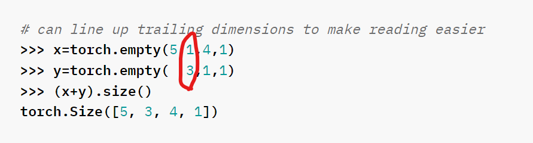
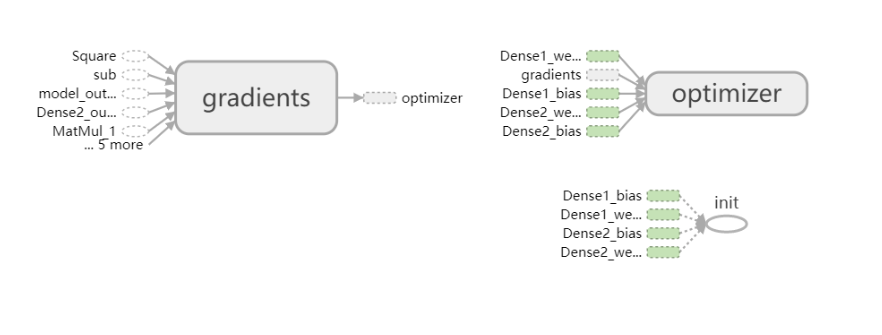
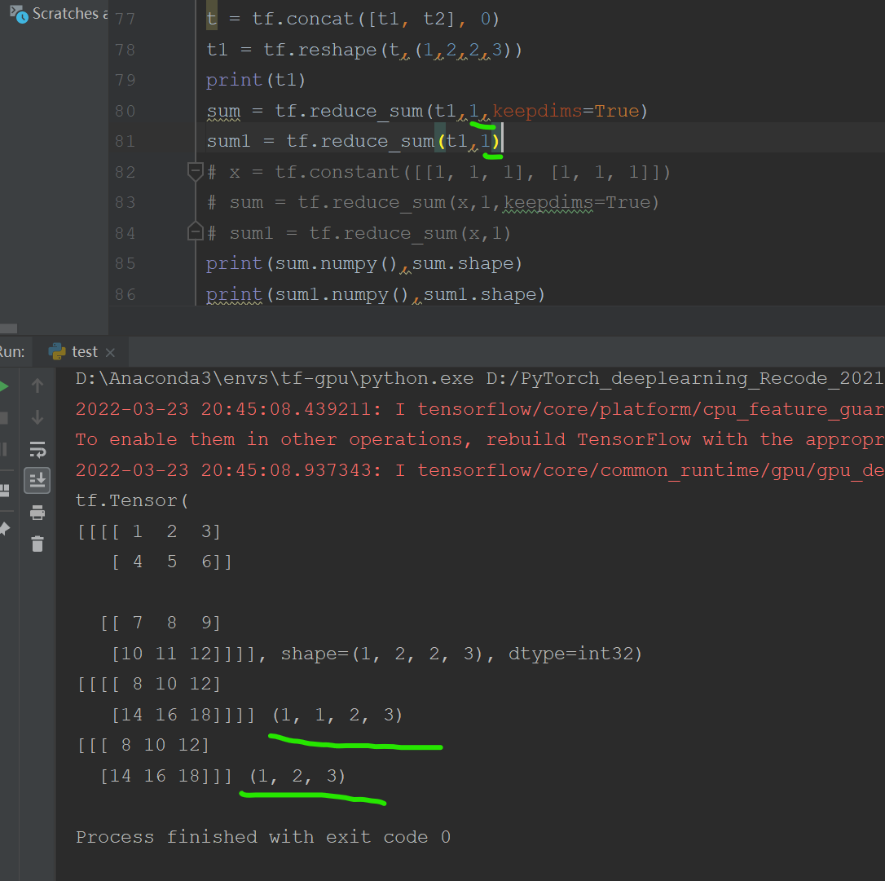
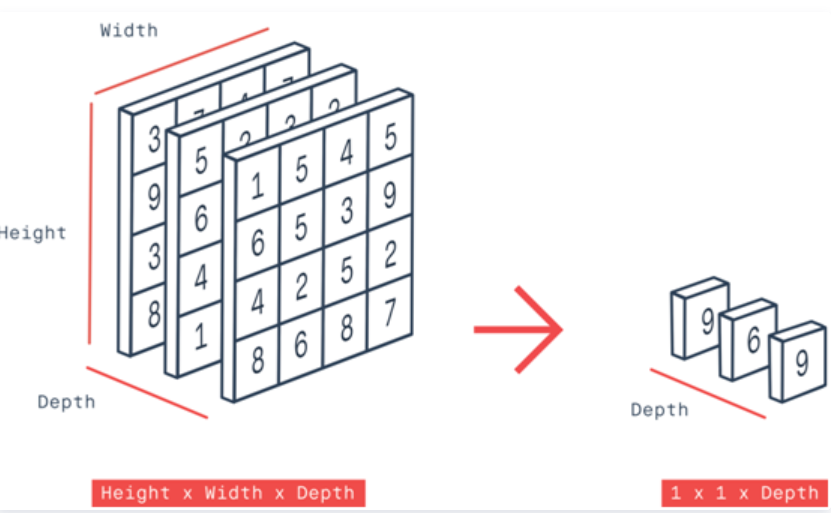
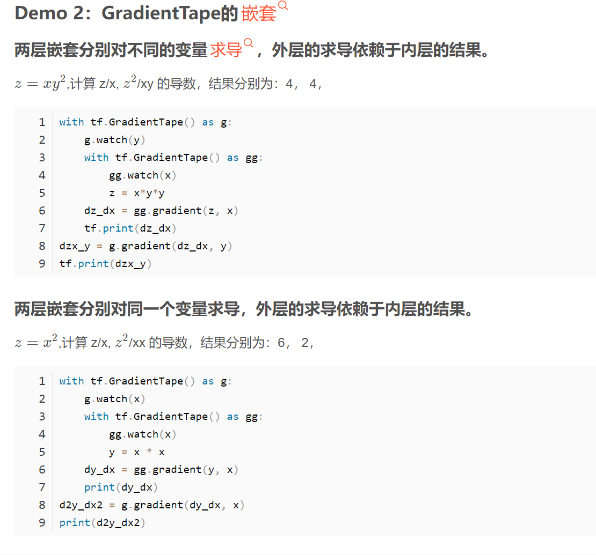

1

早在1943年，神经科学家麦卡洛克(W.S.McCilloch) 和数学家皮兹（W.Pitts）在《数学生物物理学公告》上发表论文**《神经活动中内在思想的逻辑演算》**，这是最早的神经网络模型。


**《神经活动中内在思想的逻辑演算》**--- 麦卡洛克(W.S.McCilloch) 和数学家皮兹（W.Pitts）

**《数学原理》**   ---罗素

**《控制论》**   ---维纳


**反馈**

1980 年，**福岛邦彦**首次使用卷积神经网络实现了模式识别，他被认为是真正的卷积神经网络发明者。

fukushima教授在1980年发表了一篇文章,提出了一种新识别器,这是卷积网络的最早实现.该网络是一种自组织的神经网络,拥有平移和扭曲不变性.

1986年rumelhart等人在反向传播(back propagation)那篇论文的书籍版中提到了这个思想.1988年的一篇关于语言识别中的暂态信号的文章中,也使用了卷积神经网络.

1988年,LeCun在他的文章<基于梯度详细的文本分类>中回顾了之前的卷积神经网络的设计,提出了LeNet-5网络,该网络还可以用于手写数字识别.当时几种变种SVM算法在手写数字识别上取得最好的效果,当时LeNet-5仍然超过了他们.

后来在2003年,有一篇文章<基于层次神经网络的图像解释>对该模型做了扩展.当时,我们主要使用LeCun的LeNet架构


《泛函分析与最优化理论》

$$
x_j = \sqrt()
$$


入门基础常识

**2022-04-09**

## 深度学习框架究竟是什么？

出现大量的深度学习计算框架，**根本原因是深度学习对硬件环境的依赖很高，对于开发者有较高的门槛，深度学习计算框架的出现，屏蔽了大量硬件环境层面的开发代价**，使研究者和开发人员可以专注于算法的实现，快速迭代。


**主流学习框架**


深度学习框架也就像Caffe、tensorflow、pytorch、MXNet、keras这些是深度学习的工具，简单来说就是库，编程时需要import caffe、import tensorflow。作一个简单的比喻，一套深度学习框架就是这个品牌的一套积木，各个组件就是某个模型或算法的一部分，你可以自己设计如何使用积木去堆砌符合你数据集的积木。好处是你不必重复造轮子，模型也就是积木，是给你的，你可以直接组装，但不同的组装方式，也就是不同的数据集则取决于你。

**一句话，就是一个函数库，工具包**

总的来说深度学习框架提供了一些列的深度学习的***组件\***（对于通用的算法，里面会有实现），当需要使用新的算法的时候就需要用户自己去定义，然后调用深度学习框架的函数接口使用用户自定义的新算法.


深度学习计算框架的作用（个人观点)

1--代替numpy（numpy能实现数值计算）使用GPU对Tensor进行操作，实现神经网络的操作
2--提供自动求导/求微分/求梯度的机制，让神经网络实现变得容易
3--内置许多基本网络组件，比如全连接网络，卷积网络，RNN/LSTM等，简化代码工作，让大家可以专注于模型设计等其他步骤，而不是编程上。

深度学习框架如何加速计算???
**1. 张量+基于张量的各种操作+计算图=为了加速计算**


**关于高级语言运算速率低的问题，目前有两种解决方案。**

1--第一种方法是模拟传统的编译器。就好像传统编译器会把高级语言编译成特定平台的汇编语言实现高效运行一样，这种方法将高级语言转换为C语言，然后在C语言基础上编译、执行。为了实现这种转换，每一种张量操作的实现代码都会预先加入C语言的转换部分，然后由编译器在编译阶段将这些由C语言实现的张量操作综合在一起。目前pyCUDA和Cython等编译器都已经实现了这一功能。

2--第二种方法就是前文提到的，利用脚本语言实现前端建模，用底层语言如C++实现后端运行，这意味着高级语言和低级语言之间的交互都发生在框架内部，因此每次的后端变动都不需要修改前端，也不需要完整编译（只需要通过修改编译参数进行部分编译），因此整体速度也就更快。


**部署模型加速的工具**

 1-GPU级别的加速-英伟达的TensorRT

2--CPU级别的加速——英特尔公司的OpenVINO工具箱

3--MNN

4--NCNN

## 深度学习组件

大部分深度学习框架都包含以下五个核心组件：
\1. 张量（Tensor）
\2. 基于张量的各种操作（一系列针对这一对象的数学运算和处理过程）
\3. 计算图（Computation Graph）（将各种操作整合起来，输出我们需要的结果）
\4. 自动微分（Automatic Differentiation）工具（模型训练阶段的梯度计算）
\5. BLAS、cuBLAS、cuDNN等拓展包（提高运算效率的工具包）


## 什么是后端

从软件的角度看：

- **前端**：你能通过设备看到的东西，例如：软件、网页…… 呈现在用户面前的东西都是前端——面向用户 
- **后端**：专门为前端提供数据的一套软件


**深度学习中的后端**

深度学习的后端是使用机器学习算法的底层系统或软件。

机器学习后端是运行算法的机器学习软件的一部分。后端不需要安装在您的机器上。后端负责运行算法、提供结果反馈以及存储训练数据。


负责给当前框架执行计算的功能部分，比如上面说的各种框架就是一套积木，一个积木模组能实现特定的功能，而这个功能的具体对数据操作的部分就是后端，就是说能给人看到的接口（积木）类似于前端，而负责底下计算工作的叫后端。

当然有的框架本身就自己实现了底层计算，而有的没有实现底层计算，只提供积木模组，但不负责计算，这就要给这个积木配置一个第三方的工具完成该具体功能的计算处理。

有的框架和底层实现计算的后端都叫一个名，容易混淆。

要理解后端的概念，可以试想你需要从头开始构建一个网站。你可以使用 PHP 编程语言和 SQL 数据库。这个 SQL 数据库就是是后端。你可以使用 MySQL，PostgreSQL 或者 SQL Serve作为你的数据库；但是，用于与数据库交互的 PHP 代码是不会变的（当然，前提是使用某种可以封装数据库层的 MVC 范例）。从本质上讲，PHP 并不关心正在使用哪个数据库，只要它符合 PHP 的规则即可。

 Keras 也是如此。你可以把后台看作是你的数据库，Keras 是你用来访问数据库的编程语言。你可以把后端替换成任何你喜欢的后端，只要它遵守某些规则，你的代码就不需要更改。因此，你可以把 Keras 看作是一组用来简化深度学习操作的封装（abstraction）


后端是一个计算引擎，作用是构建网络和拓扑结构，允许优化器，执行数字计算。可以想象所有的后台操作都是**在这个后端里进行的**，**你的网络模型，你的几千甚至上万个参数的更新迭代。后端是可以更换的，只要后端满足规则！**


**tensorflow 好比是木头，Keras 好比是拿 tensorflow 做好的木板。如果你盖的房子简单，形状大众，Keras 调用起来会很方便。但如果想设计特殊的房子，那就要从木料开始。**


## keras：

Keras 是一个主要由 Python 语言开发的开源[神经网络](https://so.csdn.net/so/search?q=神经网络&spm=1001.2101.3001.7020)计算库， 它被设计为高度模块化和易扩展的高层神经网络接口，使得用户可以不需要过多的专业知识就可以简洁、 快速地完成模型的搭建与训练。

keras是一种基于模块的高级深度学习开发框架，它并没有仅依赖于某一种高速底层张量库，而是对各种底层张量库进行高层模块封装，让底层库完成诸如张量积、卷积操作。

Keras 是一个模型级库，为开发深度学习模型提供了高层次的构建模块。**它不处理诸如张量乘积和卷积等低级操作**。相反，它依赖于一个专门的、优化的张量操作库来完成这个操作，它可以作为 Keras 的「后端引擎」。相比单独地选择一个张量库，而将 Keras 的实现与该库相关联，Keras 以模块方式处理这个问题，并且可以将几个不同的后端引擎无缝嵌入到 Keras 中

（上面怎么理解这两个Keras的含义， 一个keras是一个函数工具库、工具包，为一个框架提供一些网络搭建工具，这个框架交Keras）

Keras 库分为**前端和后端**，其中后端一般是调用现有的深度学习框架实现底层运算，如 Theano、 CNTK、 TensorFlow 等，前端接口是 Keras 抽象过的一组统一接口函数。

Keras 不会自己进行计算，它使用其他库（Theano、TensorFlow 等）来实现此目的，这就是定义后端接口的原因

**keras去调用TensorFlow，而不是TensorFlow调用keras**

Keras 它是为了支持快速实践而对tensorflow或者Theano的再次封装，让我们可以不用关注过多的底层细节，能够把想法快速转换为结果

Keras默认的后端为tensorflow，如果想要使用theano可以自行更改

Keras 需要一个后端。后端是一个计算引擎——它可以构建网络的图和拓扑结构，运行优化器，并执行具体的数字运算

Keras 依赖于计算后端这一概念。在构建模型图、数值计算等过程里，计算后端承担了所有的「重活」。

 Keras 作为一个基于这个计算引擎之上的封装，帮助深度学习的开发人员与实践者更简单地实现并训练他们的模型。


Keras其实就是TensorFlow和Keras的接口（Keras作为前端，TensorFlow或theano作为后端），它也很灵活，且比较容易学。可以把keras看作为tensorflow封装后的一个API。


**后端不是 ML/DL 概念，而是计算机科学概念。Keras 不会自己进行计算，它使用其他库（Theano、TensorFlow 等）来实现此目的**

**前端可以是任何使用 Keras 并做一些有用的事情（如 GUI）的应用程序**

如果读者不想了解TensorFlow 的细节，只需要模块化，那么Keras 是一个不错的选择。如 果将TensorFlow 比喻为编程界的Java 或C++，那么Keras 就是编程界的Python。它作为TensorFlow 的高层封装，可以与TensorFlow 联合使用，用它很速搭建原型。


**基于什么东西来做运算。Keras 可以基于两个Backend，一个是 Theano，一个是 Tensorflow。如果我们选择Theano作为Keras的Backend， 那么Keras就用 Theano 在底层搭建你需要的神经网络；同样，如果选择 Tensorflow 的话呢，Keras 就使用 Tensorflow 在底层搭建神经网络。**


**单纯的Keras与TensorFlow中的tf.keras**    **Keras vs tf.keras**

tf.keras 软件包与你通过 pip 安装的 keras 软件包（即 pip install keras）是分开的，过去是这样，现在也是。为了确保兼容性，原始的 keras 包没有被包含在 tensorflow 中，因此它们的开发都很有序。


然而，这种情况正在改变——当谷歌在 2019 年 6 月发布 TensorFlow 2.0 时，他们宣布 Keras 现在是 TensorFlow 的官方高级 API，用于快速简单的模型设计和训练。

随着越来越多的 TensorFlow 用户开始使用 Keras 的简易高级 API，越来越多的 TensorFlow 开发人员开始考虑将 Keras 项目纳入 TensorFlow 中作为一个单独模块，并将其命名为 tf.keras。


TensorFlow 2.0 发布后，keras 和 tf.keras 已经处于同步状态，这意味着尽管 keras 和 tf.keras 仍是独立的两个项目，但是开发人员应该开始使用 tf.keras

也就是说TensorFlow中的tf.kears 就是把keras集成到TF里面，作为其中的一部分，方便使用keras，tf.kears就是keras，和单独的keras，tf.keras的维护更周全（毕竟有谷歌），而且tf.keras里面的keras默认后端也是TensorFlow


Keras 可以理解为一套搭建与训练神经网络的高层 API 协议， Keras 本身已经实现了此协议， 安装标准的 Keras 库就可以方便地调用TensorFlow、 CNTK 等后端完成加速计算；在 TensorFlow 中，也实现了一套 Keras 协议，即 tf.keras， 它与 TensorFlow 深度融合，且只能基于 TensorFlow 后端运算， 并对TensorFlow 的支持更完美。
tf.keras 和 keras有什么区别？ 参考资料：[tf.keras 和 keras有什么区别？ - 知乎 (zhihu.com)](https://www.zhihu.com/question/313111229)


**tf.nn.layer与tf.keras.layers的关系**

（1）tf.nn ：提供神经网络相关操作的支持，包括卷积操作（conv）、池化操作（pooling）、归一化、loss、分类操作、embedding、RNN、Evaluation。
（2）tf.layers：主要提供的高层的神经网络，主要和卷积相关的，个人感觉是对tf.nn的进一步封装，tf.nn会更底层一些；可作为独立的层级数据处理，应用到sequnce模型中，当然也可以应用到Model模型。


tf.layers.下面的函数封装比tf.nn.更完备，没有特别要求一般推荐使用tf.layers.，tf.nn.较为基础，若需自己定义内部，可用tf.nn.


tf.nn 的API属性更偏底层  tf.layers API属性比tf.nn 高 ，tf.kears的API属性更高


**封装性：keras > layers > nn**


张量方式的底层接口函数：  tf.nn    是最基础的层，需要编程者自己定义权重，需自己定义内部

层方式来完成模型的搭建：tf.keras.layers

https://blog.csdn.net/qq_43328040/article/details/109338078


**tf.nn.conv2d**

```
tf.nn.conv2d(input,  # 张量输入
            filter, # 卷积核参数
            strides, # 步长参数
            padding, # 卷积方式
            use_cudnn_on_gpu=None, # 是否是gpu加速
            data_format=None,  # 数据格式，与步长参数配合，决定移动方式
            name=None): # 名字，用于tensorboard图形显示时使用
```

关键参数如下

**input.shape=[batch, in_height, in_width, in_channels]**

**filter.shape= [filter_height, filter_width, in_channels, out_channels ]**

**strides = [1, stride, stride, 1].**
必须满足strides[0] = strides[3] = 1.
在大多数情况下 strides = [1, stride, stride, 1].


**tf.layers.conv2d**

```
conv2d(inputs, # 输入的张量
　　 filters, # 卷积过滤器的数量
    kernel_size, # 卷积窗口的大小
    strides=(1, 1), # 卷积步长
    padding='valid', # 可选，默认为 valid，padding 的模式，有 valid 和 same 两种，大小写不区分。
    data_format='channels_last',
    ...)
```

**input** 和tf.nn.conv2d 一样，必须是4维张量，input.shape=[batch, in_height, in_width, in_channels]
filters：整数，表示输出空间的维数（即卷积过滤器的数量），对应于tf.nn.conv2d中的out_channels
**kernel_size**：一个整数，或者包含了两个整数的元组/队列，表示卷积窗的高和宽。如果是一个整数，则宽高相等。 对应于tf.nn.conv2d中的(filter_height, filter_width)


**keras.layers.conv2d**

```
keras.layers.convolutional.Conv2D(
filters,
kernel_size, 
strides=(1, 1), 
padding='valid', 
...)
```

**filters**：卷积核的数目（即输出的维度）

**kernel_size**：单个整数或由两个整数构成的list/tuple，卷积核的宽度和长度。如为单个整数，则表示在各个空间维度的相同长度。

**strides**：单个整数或由两个整数构成的list/tuple，为卷积的步长。如为单个整数，则表示在各个空间维度的相同步长。任何不为1的strides均与任何不为1的dilation_rate均不兼容

padding：补0策略，为“valid”, “same” 。“valid”代表只进行有效的卷积，即对边界数据不处理。“same”代表保留边界处的卷积结果，通常会导致输出shape与输入shape相同。


**从上面看出，三种方式的conv2D方法，封装级别越高，使用就越简单，越偏底层计算实现，要传入的参数形式就越复杂**


**[tf.nn.leaky_relu与tf.keras.layers.LeakyReLU?的区别]**

​	`tf.nn.leaky_relu`是用来计算函数的，而`tf.keras.layers.LeakyReLU`是层版本。但是，在添加到函数API神经网络模型时，它们会有什么不同呢？

深入研究，你可能会发现`tf.keras.layers.LeakyReLU`实际上是在兜帽下调用`tf.nn.leaky_relu`

根据经验，如果您使用keras的api，我建议您尽量使用Keras层，以避免以后出现任何序列化问题


**tf.nn.relu 与 tf.keras.activations.relu**

`tf.nn.relu`是 TensorFlow 特定的，而`tf.keras.activations.relu`在 Keras 自己的库中有更多用途。如果我创建一个只有 TF 的 NN，我很可能会使用`tf.nn.relu`，如果我正在创建一个 Keras Sequential 模型，那么我将使用`tf.keras.activations.relu`.


## **3种用Keras和TensorFlow2.x创建模型的方法：序列模型，函数式模型和继承子类模型**

[3种用Keras和TensorFlow2.0创建模型的方法：序列模型，函数式模型和继承子类模型 Keras TensorFlow2.0 创建模型 序列模型 函数式模型 继承子类模型 (nooverfit.com)](http://nooverfit.com/wp/3种用keras和tensorflow2-0创建模型的方法：序列模型，函数式模/)


**第一种，序列模型。**这是Keras最简单的构建模型方式（也许是所有框架中最简单构建方式），它**顺序地**把所有模型层**依次定义**，可以共享层的定义，多输入输出，但是如果要有分支，自定义层，就很困难了

在Keras中只要模型是Sequential类，那就是使用了**序列模型。**


**第二种，函数式模型。**熟悉函数式编程的朋友对这种方式很好理解，即一切定义都是基于函数的。这种方式给了自定义层的更大空间，可更简单地**定义层的分支，合并（concatenate）等**，如下是一个conv层合并pooling层的图示和对应代码：


**Tensorflow笔记：高级封装——Keras**：https://zhuanlan.zhihu.com/p/131587489


## 编译器/引擎

[深度学习引擎 - cutepig - 博客园 (cnblogs.com)](https://www.cnblogs.com/cutepig/p/11756369.html)

编译器用于将神经网络模型转换为包含引擎的可执行文件，将每一层转换为操作算子，内心分配和依赖生成等

引擎则负责执行该文件，根据文件的依赖描述调度每层算子

编译器侧重于优化，推理引擎侧重于部署


**各个版本的CUDA和英伟达显卡驱动对应表**


# 工具

2022-06-13

- 画图工具

## PIL

PIL，全称 Python Imaging Library，是 Python 平台一个功能非常强大而且简单易用的图像处理库

1. ImageDraw 

ImageDraw 模块提供了图像对象的简单2D绘制。用户可以使用这个模块创建新的图像，注释或润饰已存在图像，为web应用实时产生各种图形

## Matplotlib

 Python 2D-绘图领域使用最广泛的套件。它能让使用者很轻松地将数据图形化

[Matplotlib 教程 | 菜鸟教程 (runoob.com)](https://www.runoob.com/w3cnote/matplotlib-tutorial.html)


- 论文工具

## Papers

The latest in Machine Learning | Papers With Code

https://paperswithcode.com/


Quillbot  : 校正论文

Ginger : 英文写作润色或者说检查的工具

Hemingway Editor : 在线英文写作校对网站，用来检测英语文章的可读性

WhiteSmoke : 改进和增强英语写作软件，能按照整句润色英文文章

Checker ：

Linggle : 快速准确地检索英文惯用语和搭配词

Wordturn : 拥有强大的AI智能可以更好地表达出想要写出的内容，而且还可以检查是否有错别字


## Numpy 基础

参考地址：(https://xufive.blog.csdn.net/article/details/87396460)


numpy 数组的存储顺序和数组的维度是不相干的，因此改变数组的维度是非常便捷的操作，除 resize() 外，这一类操作不会改变所操作的数组本身的存储顺序。


reshape()不会改变源数组的shape结构

resize()会修改源数组的shape结构，真正地改变了shape


reshape往往只是计算过程中的中间变量需要进行shape调整，但并不需要对源数组的shape进行改变

改变数组结构返回的是原元数据的一个新视图，是原元数据的副本。浅复制（view）和深复制（copy）则是创建原数据的副本，但二者之间也有细微差别：浅复制（view）是共享内存，深复制（copy）则是独享。

**数组合并**

numpy 仍然保留了 append() 方法，只不过这个方法不再是 numpy 数组的方法，而是是升级到最外层的 numpy 命名空间了，并且该方法的功能不再是追加元素，而是合并数组了。


**stack**

stack 函数原型为 stack(arrays, axis=0)，

除了 append() 和 concatenate() ，数组合并还有更直接的水平合并（hstack）、垂直合并（vstack）、深度合并（dstack）等方式


#### 数组（文件）IO

numpy 为 ndarray 对象引入了新的二进制文件格式，用于存储重建 ndarray 所需的数据、图形、dtype 和其他信息。.npy 文件存储单个数组，.npz 文件存取多个数组。

**保存单个数组到文件**

numpy.save(file, arr, allow_pickle=True, fix_imports=True)

file: 要保存的文件，扩展名为 .npy，如果文件路径末尾没有扩展名 .npy，该扩展名会被自动加上
arr: 要保存的单个数组
allow_pickle: 可选，布尔值，允许使用 python pickles 保存对象数组，python 中的 pickle 用于在保存到磁盘文件或从磁盘文件读取之前，对对象进行序列化和反序列化
fix_imports: 可选，为了方便 pyhton2 读取 python3 保存的数据

**保存多个数组到文件**

numpy.savez(file, *args, **kwds)

- file: 要保存的文件，扩展名为 .npz，如果文件路径末尾没有扩展名 .npz，该扩展名会被自动加上
- args: 要保存的多个数组，可以使用关键字参数为数组起一个名字，非关键字参数传递的数组会自动起名为 arr_0, arr_1, …
- kwds: 要保存的数组使用关键字名称 

**从文件加载数组**

numpy.load(file, mmap_mode=None, allow_pickle=True, fix_imports=True, encoding='ASCII')

 **使用文本文件存取数组**

numpy 也支持以文本文件存取数据。savetxt() 函数是以简单的文本文件格式存储数据，对应的使用 loadtxt() 函数来获取数据。

# 回归 regression

**指一类为一个或者多个自变量与因变量之间关系建模的方法**

**Regression 就是找到一个函数 function ，通过输入特征 xx，输出一个数值 Scalar。**


**回归用于预测输入变量（自变量）和输出变量（因变量）之间的关系......回归模型正是表示从输入变量到输出变量之间映射的函数。**
**回归问题的学习等价于函数拟合。**


 **检索与回归指标**

**1.IoU**

IoU全称Intersection-over-Union， 即交并比，在目标检测领域中，定义为两个矩形框面积的交集和并集的比值，IoU=A∩B/A∪B。


如果完全重叠，则IoU等于1，是最理想的情况。一般在检测任务中，IoU大于等于0.5就认为召回，如果设置更高的IoU阈值，则召回率下降，同时定位框也越更加精确。


**2.AP和mAP**


Average Precision简称AP，这是一个在检索任务和回归任务中经常使用的指标，实际等于Precision-Recall曲线下的面积


# 监督学习

          监督学习是指：我们给算法一个数据集，并且给定正确答案；数据集中的每个样本都有相应的正确答案，再根据这些样本作出预测；即监督学习中的样本不是都相同的，每个样本都有自己的标签。
    
            回归问题：预测连续的输出值；回归一词是指这样的事实，我们预测一个真正的值输出
    
            线性回归：分类问题：预测一个离散的输出值


# 非监督学习

非监督学习：我们让计算机自已学习

​       非监督学习是指：没有标签这一概念，所有的数据都是一样的，故无监督学习中，只有一个数据集

​       聚类问题：将数据分成几个不同的聚类


# 用git从远程仓库clone非master分支到本地的方法

**2022-05-09**

二、从远程仓库clone非master分支到本地
               这里分两种情况：

              （1） 本地已经有master分支或者某个分支
    
                     这个很简单，
    
                     a） 打开  git bash  窗口  （该步骤非必需）
    
                                输入：  git branch -r或者-a    查看远程的所有分支
    
                      b） 用   git checkout   命令
    
                                输入：  git checkout origin /分支名
    
                      c） 当前本地即为上面你切换的分支。
                            测试一下：
                                输入：  git  branch
                                显示：  * 上面你切换的分支名  （* ，分支颜色为绿色；表示是当前选定的分支 ）
                                               master
    
              （2） 如果本地还什么都没有，然后要 git clone 远程仓库的某个分支（非master）


​                      

                          这个的步骤如下：
    
                          a） 在本地新建文件夹
                          b） git init  ,让该文件夹成为仓库repository
                          c） 与远程仓库建立连接
                              git remote add origin  远程仓库的master地址，以 .git 结尾
                          d） 下载master或者其他分支
                              这里有两个做法，结果是不一样的。
                               
                                1、 直接下载远程仓库上的某个分支
                                      ->>   git clone -b 分支名  master地址（以 .git结尾）
                                      ->>  然后，输入username 、 password即可clone。
                                
                                这样的后果是：
                                        会把远程的分支clone成为本地的master分支
                               此时，打开git bash窗口： 输入： git branch -r或者-a   看不到任何分支。
    
                                2、 另一种方法：可以在本地切换分支（推荐）
                                         ->>   git clone  远程master地址（以 ,git结尾 ）
                                          ->>   成功以后，可以在git bash窗口输入：
                                                 git branch -r或-a   可以显示远程仓库的所有分支；
                                                 git branch              可以查看当前本地的分支（如果是master，则显示master）
                                        然后，
                                         ->>   在本地切换到某个分支，用  git checkout  命令：
                                                  git checkout -b 分支名  origin/分支名
    
                                         ->>    切换成功
                                                     当前本地为 上面你切换的分支。
                                                     测试一下：
                                                          输入： git  branch
                                                          显示：  * 上面你切换的分支名  （* ，分支颜色为绿色；表示是当前选定的分支 ）
                                                                         master
    
               以上，就是用git从远程仓库clone非master分支到本地的方法、命令和步骤，亲测可用
————————————————
版权声明：本文为CSDN博主「gaosuam」的原创文章，遵循CC 4.0 BY-SA版权协议，转载请附上原文出处链接及本声明。
原文链接：https://blog.csdn.net/a24b86/article/details/80813890


# 入门基础--矩阵

2022-03-26

**创建矩阵**


**把一个自定义的数组变为numpy管理的array数据**

np.array([[1,2],[3,4]])


维度（dimensionality），又称为[维数](https://baike.baidu.com/item/维数/6496548)，是[数学](https://baike.baidu.com/item/数学/107037)中独立参数的[数目](https://baike.baidu.com/item/数目/7720359)。在[物理学](https://baike.baidu.com/item/物理学/313183)和[哲学](https://baike.baidu.com/item/哲学/140608)的领域内，指独立的时空坐标的数目

矩阵的秩是线性代数中的一个概念。在[线性代数](https://baike.baidu.com/item/线性代数/800)中，一个[矩阵](https://baike.baidu.com/item/矩阵)*A*的**列秩**是*A*的[线性独立](https://baike.baidu.com/item/线性独立/3209637)的**纵列**的极大数，通常表示为r(*A*)，rk(*A*)或rank *A*。 [1] 

在线性代数中，一个矩阵A的列秩是A的线性独立的纵列的极大数目。类似地，行秩是A的线性无关的横行的极大数目。即如果把矩阵看成一个个行向量或者列向量，秩就是这些行向量或者列向量的秩，也就是极大无关组中所含向量的个数。


numpy中指定维度都是**用元组**来的，比如np.zeros((2,3,2))的维度数量是三维的。np.zeros((3,))维度数量这是1维的，因为(3)不是元组它只能算3加个括号而已, 加个逗号(3,)才是元组。

**维度大小**

比如np.zeros((2,3,4))的维度数量是三维的。这个数组第一维的维度大小是2，第二维的维度大小是3，第三维的维度大小是4.


### 矩阵计算

**如果     两个矩阵的大小相同   ，我们可以使用算术运算符(+ - * /)来对矩阵计算。**


### **矩阵的广播规则**

只有当不同维度为1时(例如矩阵只有一列或一行)，我们才能在不同大小的矩阵上进行这些算术运算，在这种情况下，NumPy将其广播规则用于该操作：


**广播是什么意思呢？**

**当两个矩阵存在某个维度上的维数为1时（多维矩阵时也是），广播机制会把矩阵补全成和前面维度完整的矩阵一样的形状，就像上面的[1,1]变为3行2列后再运算**


往往因为计算矩阵之间的shape不匹配而报错：

**系统会报错：ValueError: operands could not be broadcast together with shapes (3,3) (2,2)**


**pytorch下的广播语义**

https://pytorch.org/docs/stable/notes/broadcasting.html

如果以下规则成立，则两个张量是“可广播的”：

- 每个张量至少有一个维度。
- 在迭代维度大小时，**从尾随维度开始**，（可选条件1）维度大小必须相等，（可选条件2）其中之一为 1，（可选条件3）或者其中之一不存在

例如


解释一下上面的**从尾随维度开始**


**下面这个是可广播的，因为 尾随的两个维度方向，满足 可选条件1）维度大小必须相等，（可选条件2）其中之一为 1，（可选条件3）或者其中之一不存在  三个条件的其中一个**




如果两个张量`x`,`y`是“可广播的”，则生成的张量大小计算如下：

- `x`如果和的维数`y`不相等，则在具有较少维数的张量的维数前加上 1 以使它们的长度相等。
- 然后，对于每个维度大小，生成的维度大小是该 维度`x`和`y`沿该维度的大小的最大值。


#### pytorch广播条件

当一对张量满足下面的条件时，它们才是可以被“广播”的。

1. 每个张量至少有一个维度。
2. 迭代维度尺寸时，从尾部（也就是从后往前）开始，依次每个维度的尺寸必须满足以下之一：
   - **相等**。
   - 其中一个张量的维度**尺寸为1**。
   - 其中一个张量**不存在**这个维度。

**例子**

光看条件可能会有点迷，下面是官方文档中的几个例子。

```

import torch
```

首先，显然相同形状的张量是可以广播的（或者说不需要广播）。

```

x = torch.empty(5, 7, 3)
y = torch.empty(5, 7, 3)
```

`(x+y).size()`输出`torch.Size([5, 7, 3])`。
一般而言，我们可以从后往前分析一对张量是不是“broadcastable”。

```

x = torch.empty(5, 3, 4, 1)
y = torch.empty(	3, 1, 1)
```

我们依次分析：
对倒数第一个维度，两者尺寸相同，符合“相等”的条件。
对倒数第二个维度，y的尺寸为1，符合“其中一个张量尺寸为1”的条件。
对倒数第三个维度，两者尺寸相同，符合“相等”的条件。
对倒数第四个维度，y的该维度不存在，符合“其中一个张量不存在这个维度”的条件。
综上，这两个张量可以广播。
其实，x可以比y多出更多的维度，都满足该维度有“其中一个张量不存在这个维度”的条件。
举个反例：

```

x = torch.empty(5, 2, 4, 1)
y = torch.empty(	3, 1, 1)
```


这里若x+y就无法广播了，因为从后往前遇到倒数第三个维度时会被卡住，不满足任何一个条件。
此外，对`torch.empty((0,))`，它也无法和其他任何张量广播，可以输出发现其结果为`tensor([])`，是空的，这就不满足“每个张量至少有一个维度”这个条件。


**pytorch张量下值能广播拓展最大阶数-1次**


**但 x + y 这样的计算可以广播**


**而numpy没有限制**

```
x=np.ones((1,3,1))
y=np.ones((3,1,7))
print((x+y))

输出：
[[[2. 2. 2. 2. 2. 2. 2.]
  [2. 2. 2. 2. 2. 2. 2.]
  [2. 2. 2. 2. 2. 2. 2.]]

 [[2. 2. 2. 2. 2. 2. 2.]
  [2. 2. 2. 2. 2. 2. 2.]
  [2. 2. 2. 2. 2. 2. 2.]]

 [[2. 2. 2. 2. 2. 2. 2.]
  [2. 2. 2. 2. 2. 2. 2.]
  [2. 2. 2. 2. 2. 2. 2.]]]
```


**下面的形式可以全广播**


**下面就不能广播，因为不满足广播条件**


**当满足广播条件**


### **可以广播的几种情况**：

假定只有两个数组进行操作，例如：A+B、A*B这种情况。

#### 1. 两个数组各维度大小从后往前比对均一致

```python
A = np.zeros((2,5,3,4))
B = np.zeros((3,4))
print((A+B).shape) # 输出 (2, 5, 3, 4)

A = np.zeros((4))
B = np.zeros((3,4))
print((A+B).shape) # 输出(3,4)
```

反例：

```python
A = np.zeros((2,5,3,4))
B = np.zeros((3,3))
print((A+B).shape)
报错：
ValueError: operands could not be broadcast together with shapes (2,5,3,4) (3,3)
为啥呢？因为最后一维的大小A是4，B是3，不一致。A = np.zeros((2,5,3,4))
B = np.zeros((3,3))
print((A+B).shape)
报错：
ValueError: operands could not be broadcast together with shapes (2,5,3,4) (3,3)
为啥呢？因为最后一维的大小A是4，B是3，不一致。
```

#### 2. 两个数组存在一些维度大小不相等时，有一个数组的该不相等维度大小为1

这是对上面那条规则的补充，虽然存在多个维大小不一致，但是只要不相等的那些维有一个数组的该大小是1就可以。

```python
A = np.zeros((2,5,3,4))
B = np.zeros((3,1))
print((A+B).shape) # 输出：(2, 5, 3, 4)

A = np.zeros((2,5,3,4))
B = np.zeros((2,1,1,4))
print((A+B).shape) # 输出：(2, 5, 3, 4)

A = np.zeros((1))
B = np.zeros((3,4))
print((A+B).shape) # 输出(3,4)


# 下面是报错案例
A = np.zeros((2,5,3,4))
B = np.zeros((2,4,1,4))
print((A+B).shape)
ValueError: operands could not be broadcast together with shapes (2,5,3,4) (2,4,1,4)
为啥报错？因为A和B的第2维不相等。并且都不等于1.
```


可以存在一个或一个以上的维度的长度不相等，但是不相等的维度的长度必须是1，而不能大于1

比如：  A:(2,3,4,5)  +B: (2,1,4,5)  可以广播，输出shape = (2,3,4,5) 

A:(2,3,4,5)  +B: (2,1,1,5)  可以广播，输出shape = (2,3,4,5) 


但  A:(2,3,4,5)  +B: (2,2,1,5)  就不可以

### numpy.dot 点积

**点计算**

与算术相关的一个关键区别是使用点积的矩阵乘法。 NumPy为每个矩阵提供了一个dot()方法，我们可以用它来执行与其他矩阵的点积运算：

点积在数学中，又称数量积（dot product; scalar product），是指**接受在 实数 R上的两个 向量 并返回一个实数值标量的二元运算**。 它是 欧几里得空间 的标准 内积 。

**别名:** 标量积、数量积、内积


**这个图的底部添加了矩阵尺寸，以强调两个矩阵在它们彼此面对的一侧必须具有相同的尺寸。**

上面这句话什么意思呢？

就是：两个矩阵（张量）能进行dot计算的最小单元之间，一个最小单元的向量的列数要等于第二个因子


点积（dot product)，又称数量积、标量积.

输入： 一种接受两个等长的数字序列（通常是坐标向量）；
输出：返回单个数字。

在欧几里几何空间中，向量的点积运算又称为内积。

表示


代数定义


推广
矩阵的点积/内积，为对应矩阵元素的积之和。

A，B是定义为两个相同大小的矩阵。


点积的定义是对于相同的维数/长度的向量，将向量相同位置的元素进行相乘之后相加。

[线性代数的本质(7)--点积 - 知乎 (zhihu.com)](https://zhuanlan.zhihu.com/p/112216204)


**点积的作用：可以判断两个向量是否垂直。可以判断两个向量之间，是促进作用，还是抑制作用。可以做投影。**

两个向量点积的结果，是一个数。点积运算，做了降维，把向量变成了一个数（这里的向量是二维的，数是一维的，由二维变成了一维）。

先把ａｂ两个向量当成两个方向的力


**二维数组矩阵之间的dot函数运算得到的乘积是矩阵乘积**

```
a1 = np.array([[2,3],[4,5]])
a2 = np.array([[6,7],[8,9]])
print(np.dot(a1,a2))
输出：
[[36 41]
 [64 73]]
```

表格计算法来解释上面的,二维数组乘积的结果计算过程


**如下二维数组与三维数组的dot函数运算：**


### numpy.matmul

**1.如果第一个参数或者第二个参数是1 维的，它会提升该参数为矩阵（根据另一个参数维数，给该参数增加一个为1的维数）。矩阵相乘之后会将为1的维数去掉。**

```python
a = [[1,2],[3,4]] 
b = [1,2] 
print (np.matmul(a,b))
print (np.matmul(b,a))
结果：

[ 5 11]
[ 7 10]
```

**上面这两种情况，会分别将b提升为（2x1）的矩阵和（1x2）的矩阵。即**


**2.如果某一个参数是N(N>2) )维的，该参数被理解为一些矩阵(参数的最后两个维数为矩阵维数)的stack，而且计算时会相应的广播**


```python
a = np.arange(2*2*4).reshape((2,2,4))
b = np.arange(2*2*4).reshape((2,4,2))
c = np.arange(1*2*4).reshape((1,4,2))
print(np.matmul(a,b))
print()
print(np.matmul(a,c))


a多维的数组，它就会被理解成 两个（2x4）矩阵。
b多维的数组，它就会被理解成 两个（4x2）矩阵。
c多维的数组，它就会被理解成 一个（4x2）矩阵
结果：
[[[ 28  34]
  [ 76  98]]
  
  [[428 466]
  [604 658]]]

[[[ 28  34]
  [ 76  98]]
  
  [[124 162]
  [172 226]]]


```

**那么np.matmul(a,b)则会将a的第一个矩阵和b的第一个矩阵相乘，将a的第二个矩阵b 的第二个矩阵相乘，最终得到一个2×2×2 的结果。**

**np.matmul(a,c)的情况，由于，c只有一个矩阵，所以它会广播一个矩阵与a的第二个矩阵相乘。**


**矩阵乘法本质上只能是两个二维的matrix进行叉乘**

1. **a和b最后两维的维度要符合矩阵乘法的要求（比如a的(3,4)能和b的(4,6)进行矩阵乘法）**
2. **除此之外现在矩阵运算存在广播机制，对于符合条件的张量矩阵，某些维度可以进行广播broadcast来补齐达到矩阵运算shape的计算要求**


### 多维度


**几何形状的创建实际取决于你对域的约定：**


**显然，hstack，vstack或dstack之类的NumPy函数并不一定满足这些约定，其默认的索引顺序是(y,x,z)**


```text
[[[[ 1.  2.  3.]
   [ 4.  5.  6.]]

  [[ 7.  8.  9.]
   [10. 11. 12.]]]


 [[[13. 14. 15.]
   [16. 17. 18.]]

  [[19. 20. 21.]
   [22. 23. 24.]]]]
```


**：shape=[2,2,2,3]的四维矩阵，可以视为2个shape=[2,2,3]的三维矩阵堆叠在一起！！然后三维的最后是用二维的堆叠组成的！！第一个2表示的是batchsize！！最后两维才是有数据的矩阵，前面的维度只是矩阵的排列而已！**


**结论：所有大于二维的，最终都是以二维为基础堆叠在一起的！！**


**所以在矩阵运算的时候，其实最后都可以转成我们常见的二维矩阵运算，遵循的原则是：在多维矩阵相乘中，需最后两维满足shape匹配原则，最后两维才是有数据的矩阵，前面的维度只是矩阵的排列而已！**


比如两个三维的矩阵相乘，分别为shape=[2,2,3]和shape=[2,3,2]

```text
a = 
[[[ 1.  2.  3.]
  [ 4.  5.  6.]]
 [[ 7.  8.  9.]
  [10. 11. 12.]]]

b = 
[[[ 1.  2.]
  [ 3.  4.]
  [ 5.  6.]]

 [[ 7.  8.]
  [ 9. 10.]
  [11. 12.]]]
```

a可以表示成2个shape=[2,3]的矩阵，b可以表示成2个shape=[3,2]的矩阵，前面的额表示的是矩阵排列情况。

计算的时候把a的第一个shape=[2,3]的矩阵和b的第一个shape=[3,2]的矩阵相乘，得到的shape=[2,2]，即


同理，再把a，b个字的第二个shape=[2,3]的矩阵相乘，得到的shape=[2,2]。


最终把结果堆叠在一起，就是2个shape=[2,2]的矩阵堆叠在一起，结果为：

```text
[[[ 22.  28.]
  [ 49.  64.]]

 [[220. 244.]
  [301. 334.]]]
```


**四维的同理！拆成多个三维矩阵来运算即可！！**

需要注意的是，四维中，**前两维是矩阵排列，相乘的话保留前的最大值**。


**比如a：shape=[2,1,4,5]，b：shape=[1,1,5,4]相乘，输出的结果中，前两维保留的是[2,1]，最终结果shape=[2,1,4,4]**


# 激活函数


# 理解卷积

**1. 找橘猫：最简单的办法**

今天我们的任务是找出图中有没有橘猫：


怎样用最简单(笨)的方法完成这个任务？那肯定是看图中的橘色占多少面积，比如说超过10%就认为有橘猫：


但怎么告诉电脑？具体来说，图像在电脑中是按像素（就是一个个点）存储的：


可以计算每个点的色彩与“标准橘色”的接近程度。如果足够接近，就认为属于橘色。

> 例如，如果我们定义标准橘色是红0.8，绿0.6，蓝0.4。 那么，如果某个点的红色在0.7到0.9范围，绿色在0.5到0.7范围，蓝色在0.3到0.5范围，就可以认为它是橘色。

然后电脑检查一遍所有点，统计有多少个橘色点。如果橘色点的个数超过全体点的10%，就认为有橘猫。**这就是一个电脑可以理解的方法。**

总结，这里有两个步骤：

1. **对图像中的每个点进行相同的操作。**
2. **然后将结果汇总。**

这是卷积神经网络的直观思想，我们将在下文逐步看到它的更多细节。

> 现在还没有出现“卷积”，不过，这样简单的方法，已经可以写成一个卷积神经网络架构（这段是写给懂神经网络的，不懂的同学可以先忽略），其中的卷积核是1x1，网络还得有几层，需要用好几个神经元，还需要做 Global Average Pooling。可以想想怎么写！

**2. 找橘猫：更好的方法**

上文的方法无疑是太简单了，很容易误报和漏报：


如何改进？应该再考虑其它特征，例如纹理、形状。特别是纹理。

例如，下图没有出现任何“猫头”“猫身”“猫脚”“猫尾”，但我们一看就知道是橘猫（其它动物的纹理确实不一样）：


于是，一个更好的方法是：找到图中的橘猫纹理区域，然后计算区域的面积，这个区域也许有 1% 就足够我们认为图中有橘猫了。

问题是，如何教会电脑什么是“橘猫纹理”？可以用卷积。

**3. 卷积操作：**

纹理，就是局部的一种图案。如何快速判断图中是否有局部的一种图案？

快速的方法，是使用卷积，也是分两步：

1. **对图像中的每个点进行相同的操作。**
2. **然后将结果汇总。**

看例子，这是我在 excel 画的，可以用 SUMPRODUCT 函数做卷积：


不同的卷积核，可以识别不同的目标。

卷积操作后，图像会变小一点。如果希望图像不变小，可以提前给图片加一圈0（称为padding）。

我们往往还会加入一个“偏置”（bias），就是给整个图像加上一个可以训练的数（这个思想来自于全连接神经网络）。

对于得到的图像，还可以进行进一步变换：

1. 可以取最大值（此时会得到5.0），这标志着图中是否存在这个特征。
2. 可以取平均值（此时会得到0.25），这标志着图中这个特征的密度。
3. 还可以取"最大值"与"平均值"之间的值，会更接近我们的某种直觉。这在数学上有很多办法。

在深度卷积网络中，会经常用到如上的变换（其实就是 max pooling 和 average pooling）。

**4. 卷积神经网络的结构**

卷积需要卷积核，但怎么找到能有效判断“橘猫纹理”的卷积核？

首先，实际上需要多个卷积核。因为不同角度、不同位置、不同大小、不同猫的纹理都不同，所以我们要用不同的卷积核去匹配。而且不一定直接可以得到“评分”，往往还要经过更多的处理（例如，请思考如何判断纹理的颜色是橘色）。因此我们会使用一个网络结构。

举例：

- 用 A 个卷积核，把原始的图分别用每个卷积核处理，得到 A 张图。
- 然后每张图都做一个非线性操作，例如把得到的图中所有小于 0 的数设置为0。这很重要。简单地说，这是因为卷积是线性操作，如果不加入非线性的操作，最终得到的模型仍然是线性的，无法描述大自然的非线性现象。
- 下面的图是我用鼠标画的......：


- 得到了 A 张图。那么，再用 B x A 个卷积核，把这 A 张图变成 B 张图。
- 举个例子，用 3 x 2 个卷积核，可以把 2 张图，变成 3 张图。图中的加法，是点对点相加：


- 别忘了再做非线性处理。
- 然后用 C x B 个卷积核，又可以把 B 张图变成 C 张图。
- 经过很多层之后，我们考虑最终的 N 张图，得到最终的结果。

**卷积神经网络的结构，与普通的全链接神经网络非常相似，只是把乘法换成了卷积。 其实，乘法就相当于 1x1 的卷积。**

通过使用多层结构，我们可以显著提高网络的识别能力和通用性，这是因为自然界中的图像具有层次性。其实人的大脑的视觉系统也是由多层次组成，也许视觉系统是在进化中形成了这种层次性。这就像：

> 猫=身体+头部+四肢+尾巴，头部=毛发+眼+嘴+鼻+耳，眼=眼框+眼珠+瞳孔，眼珠=纹理+形状，眼珠形状=弧线+弧线+…

如下图所示（这里显示的不是卷积核，而是“最能激活这个卷积核的输入图像”，或者说卷积核的识别目标），这是经典的 ImageNet 网络，用于识别各种图像。第一层负责识别各种角度的边界以及某些颜色。第二层开始出现简单的形状和纹理。第三层就有更复杂的结构。随后的概念会越来越复杂。


几点补充，对于彩色图像，之前说过图片在电脑中要分红绿蓝色彩，所以其实输入的图就已经是 3 张图，我们在第一层会使用 A x 3 个滤波核，把图片变成 A 张图。

另外，对于图像的问题，我们往往希望更快地把图像变小（既可以提高运算速度，也可以匹配图像在各个尺度上的特征），因此可加入所谓 pooling 层，负责把图像快速缩小。

**5. 深度学习的神奇之处**

那么，如何找到这么多个卷积核（或者说特征）？

最早的时候，需要人工构造特征（实际是因为当时的电脑运算能力低，必须靠人类专家精心设计特征）。后来随着运算能力的提高，大家可以放心地让电脑半自动挖掘特征。

而现在的深度神经网络，可以全自动发现特征。

简单地说，最开始先把所有卷积核初始化为随机数。然后随机选一小批样本（称为batch），送入网络，算出来怎么微调卷积核可以让识别率提高（具体是通过求导，计算过程叫BP反向传播，其实就是求导的链式法则），于是去微调卷积核。

不断重复这个过程，最后就真的可以得到令人满意的卷积核。这过程中可能还需要实验少量训练方法的参数（这称为“调参”），但整个过程是全自动的，无需任何人工干预，就可以看到随机的卷积核慢慢成型，变为有效的卷积核。

例如下图，从左到右是随着训练的进行，某层中的卷积核的识别目标的变化。可见，一开始卷积核并没有明确的识别目标，但随后会逐渐成型，明确地针对某一种目标进行识别：


由于一开始卷积核是随机初始化，所以它们会有不同的演变方向，于是最终会分别识别多种不同的目标。

这就像在一个丘陵地带下山，如果一开始大家都在一起，那么最后也容易下到一样的地方；但如果一开始大家是随机分布的，那么就会容易到达各个不一样的山谷。


# 信息量-熵-交叉熵

## 1.什么是信息量？

假设*X*是一个[离散](https://so.csdn.net/so/search?q=离散&spm=1001.2101.3001.7020)型随机变量，其取值集合为X，概率分布函数为*p*(*x*)=*Pr*(*X*=*x*),*x*∈X，我们定义事件*X*=*x*0的信息量为： 
***I*(*x*0)=−*log*(*p*(*x*0))，**

概率越小，其中的信息量越大


可以理解为，一个事件发生的概率越大，则它所携带的信息量就越小，而当*p*(*x*0)=1时，熵将等于0，也就是说该事件的发生不会导致任何信息量的增加。举个例子，小明平时不爱学习，考试经常不及格，而小王是个勤奋学习的好学生，经常得满分，所以我们可以做如下假设： 
 事件A：小明考试及格，对应的概率*P*(*x**A*)=0.1，信息量为*I*(*x**A*)=−log(0.1)=3.3219
 事件B：小王考试及格，对应的概率*P*(*x**B*)=0.999，信息量为*I*(*x**B*)=−log(0.999)=0.0014
 可以看出，结果非常符合直观：小明及格的可能性很低(十次考试只有一次及格)，因此如果某次考试及格了（大家都会说：XXX竟然及格了！），必然会引入较大的信息量，对应的*I*值也较高。而对于小王而言，考试及格是大概率事件，在事件B发生前，大家普遍认为事件B的发生几乎是确定的，因此当某次考试小王及格这个事件发生时并不会引入太多的信息量，相应的*I*值也非常的低。

## 2.什么是熵？

**一个随机变量的确定性的度量**


**事件的概率和事件本身的信息量的乘积的和**   或者说是信息量的加权和，权值是事件的概率


那么什么又是熵呢？还是通过上边的例子来说明，假设小明的考试结果是一个0-1分布X*A*

只有两个取值{0：不及格，1：及格}，在某次考试结果公布前，小明的考试结果有多大的不确定度呢？你肯定会说：十有八九不及格！因为根据先验知识，小明及格的概率仅有0.1,90%的可能都是不及格的。怎么来度量这个不确定度？求期望！不错，我们对所有可能结果带来的额外信息量求取均值（期望），其结果不就能够衡量出小明考试成绩的不确定度了吗。 
 即： 


 虽然小明考试结果的不确定性较低，毕竟十次有9次都不及格，但是也比不上小王（1000次考试只有一次才可能不及格，结果相当的确定） 
 我们再假设一个成绩相对普通的学生小东，他及格的概率是*P*(*x**C*)=0.5,即及格与否的概率是一样的，对应的熵： 


 其熵为1，他的不确定性比前边两位同学要高很多，在成绩公布之前，很难准确猜测出他的考试结果。 
 可以看出，**熵其实是信息量的期望值，它是一个随机变量的确定性的度量。熵越大，变量的取值越不确定，反之就越确定。**

对于一个随机变量X而言，它的所有可能取值的信息量的期望（*E*[*I*(*x*)]

）就称为熵。 
*X*的熵定义为


可以看出，当两种取值的可能性相等时，不确定度最大（此时没有任何先验知识），这个结论可以推广到多种取值的情况。在图中也可以看出，当p=0或1时，熵为0，即此时X完全确定。
熵的单位随着公式中log运算的底数而变化，当底数为2时，单位为“比特”(bit)，底数为e时，单位为“奈特”。


## 3.什么是相对熵？

相对熵(relative entropy)又称为**KL散度**（Kullback-Leibler divergence），**KL距离，是两个随机分布间距离的度量**。记为*D_KL*(*p*||*q*)。它度量当真实分布为p时，假设分布q的无效性。 


显然，当*p*=*q*时,两者之间的相对熵*D**K**L*(*p*||*q*)=0 
 上式最后的*Hp*(*q*)表示在p分布下，使用q进行编码需要的bit数，而H(p)表示对真实分布*p*所需要的最小编码bit数。基于此，相对熵的意义就很明确了：*D**K**L*(*p*||*q*)表示在真实分布为p的前提下，使用q分布进行编码相对于使用真实分布p进行编码（即最优编码）所多出来 bit数。

## 4. 什么是交叉熵？

交叉熵容易跟相对熵搞混，二者联系紧密，但又有所区别。假设有两个分布*p*，*q*，则它们在给定样本集上的交叉熵定义如下：


可以看出，交叉熵与上一节定义的相对熵仅相差了*H*(*p*),当*p*已知时，可以把*H*(*p*)看做一个常数，此时交叉熵与KL距离在行为上是等价的，都反映了分布p，q的相似程度。最小化交叉熵等于最小化KL距离。它们都将在*p*=*q*时取得最小值*H*(*p*)（p=q时KL距离为0），因此有的工程文献中将最小化KL距离的方法称为Principle of Minimum Cross-Entropy (MCE)或Minxent方法。 
 特别的，在logistic regression中， 
 p:真实样本分布，服从参数为p的0-1分布，即*X*∼*B*(1,*p*) 
 q:待估计的模型，服从参数为q的0-1分布，即*X*∼*B*(1,*q*) 
 两者的交叉熵为： 

**交叉熵表示为真概率分布p和预测概率分布q的函数**


对所有训练样本取均值得：

​	

这个结果与通过最大似然估计方法求出来的结果一致。


#### 应用实例

现在，让我们在应用程序中使用交叉熵。考虑到我们正在训练一个图像分类器来对外观基本相似的不同动物进行分类，例如浣熊、小熊猫、狐狸等等。


因此，对于可能的7个类中的每一个，分类器估计一个概率，这称为预测分布。由于这是一个有监督的学习问题，我们知道真实的分布。

在上面的例子中，我拍摄了一只浣熊的图像，所以在真实分布中，它的概率是100%，其他的概率是0。我们可以用这两种分布之间的交叉熵作为代价函数，称之为**交叉熵损失**。

**交叉熵动态展示**

https://www.desmos.com/calculator/zytm2sf56e?lang=zh-CN


# 置信区间

**2022-06-11**

置信区间的概念是由原籍波兰的美国统计学家耶日·奈曼提出的

简单理解，比如从北京到张家界旅游5天，你恐怕不能准确说出要花多少钱，但你可以给出一个范围，比如10000—13000，你会觉得比较可信。如果给的范围太大，比如10000—30000，虽然可信度更高一些，但这么大的范围参考意义不大；如果给的范围很小，如10000—10500，虽然准确性提高了，但可信度就似乎不会很高。而找到一个合适的估值范围，这是置信区间要解决的问题。

说到置信区间我们就要说到点估计和区间估计。

点估计?区间估计?

这样一个例子,简直可以很完美的解释这个问题~

刮刮卡：游戏规则是（假设只有一个大奖）：

· 大奖事先就固定好了，一定印在某一张刮刮卡上

· 买了刮刮卡之后，刮开就知道自己是否中奖

那么我们起码有两种策略来刮奖：

· **点估计**：买一张，这就相当于你猜测这一张会中奖(直接用样本统计量来估计总体参数值）

· **区间估计**：买一盒，这就相当于你猜测这一盒里面会有某一张中奖（根据样本统计量，按一定的概率大小确定包含总体参数值）

很显然**区间估计**的命中率会更高（当然费用会更高，因为风险降低了）。

实际上:

点估计量是用于估计总体参数的样本统计量。但我们不可能期望点估计量能给出总体参数的精确值，所以经常在点估计上加减估计误差来计算区间估计。

即区间估计的一般形式为：**点估计±边际误差**。

有一个零部件的长度θ未知，我们通过点估计推测θ为9 cm，这还不足够。如果我们能知道θ有95%的概率在(8.7cm,9.2cm)，那么就理想多了。

**置信区间和置信水平**


其中(8.7cm,9.2cm)我们就可以理解成置信区间,那么95%就是置信水平。

就是说可以有95%可信度认为长度x就是在8.7~9.2之间


由样本统计量所构造的总体参数的估计区间为置信区间。由于统计学家在某种程度上确定这个区间会包含真正的总体参数,所以取名置信区间。在统计中，一个概率样本的置信区间（Confidence interval）是对这个样本的某个总体参数的区间估计。置信区间展现的是这个参数的真实值有一定概率落在测量结果的周围的程度。置信区间给出的被测量参数的测量值的可信程度，即前面所要求的"一定概率"。这个概率被称为置信水平。

简单理解，我们抽取100个样本,当你不断改变样本的时候，由100个样本构造的总体参数的100个置信区间中,有95%的区间包含了总体参数的真正值,5%没包含,这个95%称为置信水平，即1-α。


**建立置信区间?**

置信区间的建立就与中心极限定理和抽样分布有关，在给定置信度的条件下，置信区间的宽度决定于抽样分布,会随着样本量的增大而减小，在样本量给定时，置信区间的宽度随着置信系数的增大而增大。

例如：想了解全国成年男性平均身高，可用抽样的方法，用样本信息估计总体信息。从全国男性中抽取一个样本，这个样本平均值及对总体平均值的一个点估计，当有多个样本，即有多个点估计，但不知道哪个样本对总体的估计最正确，所以用区间估计来解决这个问题。假设全国成年男性平均身高在165-175cm之间，这个区间叫置信区间，及[165,175]，**这个区间的可信程度是由置信水平来表现，置信水平指置信区间包含总体平均值的概率多大，如置信水平为95%**。


# TensorFlow系统架构

**2022-03-13**


以 C API 为界，将整个系统分为前端 和后端两个子系统。

1. 前端系统：提供编程模型，负责构造计算图；
2. 后端系统：提供运行时环境，负责执行计算图。 

TensorFlow 的系统设计遵循良好的分层架构，后端系统的设计和实现可以进一步分解 
 为 4 层。 

1.  运行时：分别提供本地模式和分布式模式，并共享大部分设计和实现 ；
2. 计算层：由各个 OP 的 Kernel 实现组成；在运行时，Kernel 实现执行 OP 的具 体数学运算;   
3. 通信层：基于 gRPC 实现组件间的数据交换，并能够在支持 IB 网络的节点间实 现 RDMA 通信; 
4.  设备层：计算设备是 OP 执行的主要载体，TensorFlow 支持多种异构的计算设备 类型。 

**模型构造和执行流程**

TensorFlow的一大特点是，图的构造和执行相分离。用户添加完算子，构建好整图后，才开始进行训练和执行，也就是图的执行。大体流程如下

1. 图构建：用户在client中基于TensorFlow的多语言编程接口，添加算子，完成计算图的构造。
2. 图传递：client开启session，通过它建立和master之间的连接。执行session.run()时，将构造好的graph序列化为graphDef后，以protobuf的格式传递给master。
3. 图剪枝：master根据session.run()传递的fetches和feeds列表，反向遍历全图full graph，实施剪枝，得到最小依赖子图
4. 图分裂：master将最小子图分裂为多个Graph Partition，并注册到多个worker上。一个worker对应一个Graph Partition。
5. 图二次分裂：worker根据当前可用硬件资源，如CPU GPU，将Graph Partition按照op算子设备约束规范（例如tf.device(’/cpu:0’)，二次分裂到不同设备上。每个计算设备对应一个Graph Partition。
6. 图运行：对于每一个计算设备，worker依照op在kernel中的实现，完成op的运算。设备间数据通信可以使用send/recv节点，而worker间通信，则使用GRPC或RDMA协议。


# Tensorflow2.x建模方法

**不同的建模方式，可以有不同的模型保存、恢复方法**


Tensorflow2.x创建模型的方式主要有三种：

1. Sequential API，顺序模型；
2. Function API，函数式模型；
3. Subclassing API，子类化模型；

其中`Sequential API`只适用于简单的层堆叠，很难实现复杂模型，而`Function API`与`Subclassing API`各有优劣，也不必区分，因为可以进行混搭。

### **1. Sequential API**

顺序API是`layer-by-layer`的方式，适用于简单的层堆栈，但对于构建多输入、多输出的模型难以实现。个人并不推荐使用这种方式构建模型，因此简单放个例子：

```text
model = Sequential(
    [
        Input(shape=(3,)),
        Dense(2, activation='relu', name='layer1'),
        Dense(3, activation='relu', name='layer2'),
        Dense(4, name='layer3'),
    ]
)
```


序列模型是layer-by-layer的，它是最简单的定义模型的方法，但是有几个不足：
• 不能够共享某一层
• 不能有多个分支
• 不能有多个输入


官方解释：

`Sequential` groups a linear stack of layers into a [`tf.keras.Model`](https://www.tensorflow.org/api_docs/python/tf/keras/Model).

Inherits From: [`Model`](https://www.tensorflow.org/api_docs/python/tf/keras/Model), [`Layer`](https://www.tensorflow.org/api_docs/python/tf/keras/layers/Layer), [`Module`]  继承与这些父类


所以Sequential 建模方法可以使用和 Model父类一样的训练方式

```python
model = tf.keras.Sequential()
model.add(...)
model.add(...)
model.compile(optimizer='xxx', loss='yyy')
# This builds the model for the first time:
model.fit(x, y, batch_size=n, epochs=E)
```


### **2. Function API**

**函数式API**

函数式API能很好的处理**非线性拓扑、共享层、具有多输入多输出**的模型。 且模型通常都是层的有向无环图（DAG），因此函数式API是构建层计算图的一种方式。

通过**`tf.keras.utils.plot_model`**进行可视化操作，在window中直接使用该方法可能会出现一些问题，我们可以通过[博客](https://blog.csdn.net/weixin_42459037/article/details/84066164)尝试解决这个问题。

Python GraphViz's executables not found 报错问题:

解决：https://blog.csdn.net/weixin_42459037/article/details/84066164

**tensorflow tf.keras.utils.plot_model 画网络拓扑图**

```python
# pip install graphviz
# pip install pydot
# 下载 graphviz，并添加到环境变量。  https://graphviz.gitlab.io/download/
import tensorflow as tf
import os
os.environ["PATH"] += os.pathsep + 'C:/Program Files/Graphviz/bin/' # graphviz的安装路径
tf.keras.utils.plot_model(
    model, # keras模型
    to_file="tensorflow 多输入 多输出 模型1.png", # 保存图片路径
    show_shapes=True, # 是否显示形状信息
    show_layer_names=True, # 是否显示图层名称
    rankdir="TB", # "TB":垂直图  "LR":水平图
    expand_nested=True, # 是否将嵌套模型展开为簇。
    dpi=96 # 图片每英寸点数。
)
```


以下是`Encoder-Decoder`结构：

```text
def get_models():
    encoder_input = Input(shape=(28, 28, 1), name="img")
    x = layers.Conv2D(16, 3, activation="relu")(encoder_input)
    x = layers.Conv2D(32, 3, activation="relu")(x)
    x = layers.MaxPooling2D(3)(x)
    x = layers.Conv2D(32, 3, activation="relu")(x)
    x = layers.Conv2D(16, 3, activation="relu")(x)
    encoder_output = layers.GlobalMaxPooling2D()(x)

    x = layers.Reshape((4, 4, 1))(encoder_output)
    x = layers.Conv2DTranspose(16, 3, activation="relu")(x)
    x = layers.Conv2DTranspose(32, 3, activation="relu")(x)
    x = layers.UpSampling2D(3)(x)
    x = layers.Conv2DTranspose(16, 3, activation="relu")(x)
    decoder_output = layers.Conv2DTranspose(1, 3, activation="relu")(x)
    
  autoencoder = Model(encoder_input, decoder_output, name="autoencoder")

    return encoder, autoencoder
```


###########

有时候，内置的`tf.keras`层并不满足我们构建复杂的模型，因此需要实现`Subclassing API`中的自定义层。

### **3. Subclassing API**

**这种风格构建模型感觉像面向对象编程**

子类化API是通过继承`tf.keras.layers.Layer`类或`tf.keras.Model`类的自定义层和自定义模型。它们与函数式API并不冲突，特别是自定义层---创建自己的层来扩展API，很方便的与函数式API结合构建模型。

**3.1 Layer类**

Keras的一个中心抽象是`Layer`类。层封装了状态（权重）和从输入到输出的转换（层的前向传播）。

一个简单的线性层定义如下：

```text
class Linear(keras.layers.Layer):
    def __init__(self, units=32, input_dim=32, **kwargs):
        super(Linear, self).__init__(**kwargs)
        self.w = self.add_weight(
            shape=(input_dim, units), initializer="random_normal", trainable=True
        )
        self.b = self.add_weight(shape=(units,), initializer="zeros", trainable=True)

    def call(self, inputs, **kwargs):
        return tf.matmul(inputs, self.w) + self.b
```

有几个注意点：

- 可以在`__init__()`方法中创建类子层（`tf.keras`的内置层API，或者是自定义的），并可以在`call()`中调用；
- 在定义变量时，有时候会看到：

```text
  w_init = tf.random_normal_initializer()
          self.w = tf.Variable(
              initial_value=w_init(shape=(input_dim, units), dtype="float32"),
              trainable=True,
          )
```

与`add_weight()`方法相同，但上述需要先定义初始化，再构造变量，而`add_weight()`可以在定义变量的同时进行初始化，推荐`add_weight()`方法；

- 有时候变量会定义在`build(self, input_shape)`方法中，一种是因为书写习惯，另一种更重要的原因是**「有时候事先并不知道输入的大小（即没有input_dim)，希望在对层实例化后的某个时间再延迟创建权重」**：

```text
  def build(self, input_shape):
          self.w = self.add_weight(
              shape=(input_shape[-1], self.units),
              initializer="random_normal",
              trainable=True,
          )
          self.b = self.add_weight(
              shape=(self.units,), initializer="random_normal", trainable=True
          )
```

其中`input_shape`代表输入的形状；

- `call(self, inputs, **kwargs)`，其中`inputs`是张量或张量的嵌套结构（多输入，张量列表），`**kwargs`是非张量参数。更一般的，`call()`方法应该为：

```text
  call(self, inputs, training=None, mask=None, **kwargs):
training`和`mask`是`call()`方法中的特权参数，`training`针对`BatchNormalization`和`Dropout`层在训练和推断期间具有不同的行为，`mask`则是当先前层生成了掩码时，Keras会自动将正确的`mask`传递给`__call__()
```

**3.2 Model类**

`Layer`类通常是来定义内部的计算模块，例如一个`FM`、`self-attention`等，`Model`类则是用来定义整个外部模型，例如`DeepFM`、`SASRec`等。

`Model`类与`Layer`具有相同的API，但有以下区别：

- `Model`会公开内置训练`fit()`、评估`evaluate()`、预测`predict()`；
- `model.layers`属性会公开其内部层的列表；
- 会公开保存和序列化API（`save()`、`save_weights()`）；

例如：

```text
class MyModel(keras.Model):
  def __init__(self, units=32, **kwargs):
    super(MyModel, self).__init(**kwrags)
    self.units = units
    self.linear = Linear(self.units)  # 去除input_dim
    
 def call(self, inputs, **kwargs):
    outputs = self.linear(inputs)
    return outputs
  

model = MyModel(32)
# model.compile(...)
# model.fit(...)
```

**3.3 call()方法**

上述提到，`call()`中包含两个特权参数，`training`和`mask`。


[TensorFlow 模型建立与训练 — 简单粗暴 TensorFlow 2 0.4 beta 文档 (tf.wiki)](https://tf.wiki/zh_hans/basic/models.html)

Keras 有两个重要的概念： **模型（Model）** 和 **层（Layer）** 。层将各种计算流程和变量进行了封装（例如基本的全连接层，CNN 的卷积层、池化层等），而模型则将各种层进行组织和连接，并封装成一个整体，描述了如何将输入数据通过各种层以及运算而得到输出。在需要模型调用的时候，使用 `y_pred = model(X)` 的形式即可。Keras 在 `tf.keras.layers` 下内置了深度学习中大量常用的的预定义层，同时也允许我们自定义层。

Keras 模型以类的形式呈现，我们可以通过继承 `tf.keras.Model` 这个 Python 类来定义自己的模型。在继承类中，我们需要重写 `__init__()` （构造函数，初始化）和 `call(input)` （模型调用）两个方法，同时也可以根据需要增加自定义的方法

```
class MyModel(tf.keras.Model):
    def __init__(self):
        super().__init__()     # Python 2 下使用 super(MyModel, self).__init__()
        # 此处添加初始化代码（包含 call 方法中会用到的层），例如
        # layer1 = tf.keras.layers.BuiltInLayer(...)
        # layer2 = MyCustomLayer(...)

    def call(self, input):
        # 此处添加模型调用的代码（处理输入并返回输出），例如
        # x = layer1(input)
        # output = layer2(x)
        return output

    # 还可以添加自定义的方法
```

**Keras 模型类定义示意图**


# [Keras](https://so.csdn.net/so/search?q=Keras&spm=1001.2101.3001.7020)版本模型训练

[ TensorFlow 2.0 —— 模型训练__tensorflow2 模型训练](https://blog.csdn.net/qq_37388085/article/details/115409485)

**2022-05-20**

# Keras Pipeline    流水线

**整体流程大概是：定义好用到特征——搭建网络————编译模型——训练——预测结果**

在很多时候，我们只需要建立一个结构相对简单和典型的神经网络（比如 MLP 和 CNN），并使用常规的手段进行训练。这时，Keras 也给我们提供了另一套更为简单高效的内置方法来建立、训练和评估模型的方法。

 最典型和常用的神经网络结构是将一堆层按特定顺序叠加起来，那么，我们是不是只需要提供一个层的列表，就能由 Keras 将它们自动首尾相连，形成模型呢？Keras 的 Sequential API 正是如此。通过向 `tf.keras.models.Sequential()` 提供一个层的列表，就能快速地建立一个 `tf.keras.Model` 模型并返回：

```
        model = tf.keras.models.Sequential([            tf.keras.layers.Flatten(),            tf.keras.layers.Dense(100, activation=tf.nn.relu),            tf.keras.layers.Dense(10),            tf.keras.layers.Softmax()        ])
```

不过，这种层叠结构并不能表示任意的神经网络结构。为此，Keras 提供了 Functional API，帮助我们建立更为复杂的模型，例如多输入 / 输出或存在参数共享的模型。其使用方法是将层作为可调用的对象并返回张量（这点与之前章节的使用方法一致），并将输入向量和输出向量提供给 `tf.keras.Model` 的 `inputs` 和 `outputs` 参数，示例如下：

```
 复制代码        inputs = tf.keras.Input(shape=(28, 28, 1))        x = tf.keras.layers.Flatten()(inputs)        x = tf.keras.layers.Dense(units=100, activation=tf.nn.relu)(x)        x = tf.keras.layers.Dense(units=10)(x)        outputs = tf.keras.layers.Softmax()(x)        model = tf.keras.Model(inputs=inputs, outputs=outputs)
```

**使用 Keras Model 的 compile 、 fit 和 evaluate 方法训练和评估模型**

当模型建立完成后，通过 `tf.keras.Model` 的 `compile` 方法配置训练过程：

```
    model.compile(        optimizer=tf.keras.optimizers.Adam(learning_rate=0.001),        loss=tf.keras.losses.sparse_categorical_crossentropy,        metrics=[tf.keras.metrics.sparse_categorical_accuracy]    )
```

`tf.keras.Model.compile` 接受 3 个重要的参数：

> - `oplimizer` ：优化器，可从 `tf.keras.optimizers` 中选择；
> - `loss` ：损失函数，可从 `tf.keras.losses` 中选择；
> - `metrics` ：评估指标，可从 `tf.keras.metrics` 中选择。

接下来，可以使用 `tf.keras.Model` 的 `fit` 方法训练模型：

```
    model.fit(data_loader.train_data, data_loader.train_label, epochs=num_epochs, batch_size=batch_size)
```

`tf.keras.Model.fit` 接受 5 个重要的参数：

> - `x` ：训练数据；
> - `y` ：目标数据（数据标签）；
> - `epochs` ：将训练数据迭代多少遍；
> - `batch_size` ：批次的大小；
> - `validation_data` ：验证数据，可用于在训练过程中监控模型的性能。

最后，使用 `tf.keras.Model.evaluate` 评估训练效果，提供测试数据及标签即可：

```
 复制代码    print(model.evaluate(data_loader.test_data, data_loader.test_label))
```


# Keras中的训练回调

**2022-05-20**

Keras中的回调是在训练期间（在某个时期开始，在批处理结束时，在某个时期结束时等）在不同时间点调用的对象，这些对象可用于实现以下行为：

1. 在训练过程中的不同时间点进行验证（除了内置的按时间段验证）；
2. 定期或在超过特定精度阈值时对模型进行检查；
3. 当训练似乎停滞不前时，更改模型的学习率；
4. 当训练似乎停滞不前时，对顶层进行微调；
5. 当训练结束或超出特定性能阈值时发送电子邮件或在即时消息通知等等；
6. 回调可以作为列表传递给model.fit；


1. **1 EarlyStopping（早停）**

   

   

   - monitor：被监测的数据
   - min_delta：在被监测的数据中被认为是提升的最小变化。例如，小于min_delta的绝对变化会被认为没有提升；
   - patience：没有进步的训练轮数，在这之后训练就会被停止；
   - verbose：详细信息模式；
   - mode：{auto,min,max}其中之一。在min模式中，当被监测的数据停止下降时，训练就会停止；在max模式中，当被监测的数据停止上升，训练就会停止；在auto模式中，方向会自动从被监测的数据的名字中判断出来。

```
# 早停的应用示例
model = get_compiled_model()

# callbacks相当于list
callbacks = [
    tf.keras.callbacks.EarlyStopping(
        # 当“val_loss”不再下降时停止训练，'val_loss'为监控的指标
        monitor='val_loss',
        # “不再下降”被定义为“减少不超过1e-2”
        min_delta=1e-2,
        # “不再改善”进一步定义为“至少2个epoch”
        patience=2,
        verbose=1)
]
model.fit(x_train, y_train, 
          epoch=20, 
          batch_size=64,
          callbacks=callbacks,
          validation_split=0.2)
```

**1.2 checkpoint模型**

在相对较大的数据集上训练模型时，至关重要的是要定期保存模型的checkpoint，最简单的方法是使用ModelCheckpoint回调。

```
# 模型保存checkpoint示例
model = get_compiled_model()

callbacks = [
    tf.keras.callbacks.ModelCheckpoint(
        filepath='mymodel_{epoch}',  # 模型保存路径
        save_best_only=True,  
        monitor='val_loss',
        save_weights_only=True,  # 保存模型权重
        verbose=1
    )
]
model.fit(x_train, y_train,
          epoch=20,
          batch_size=64,
          callbacks=callbacks,
          validation_split=0.2)
```


**3 使用回调实现动态学习率调整**
由于优化程序无法访问验证指标，因此无法使用这些计划对象来实现动态学习率计划（例如当验证损失不再改善的时候降低学习率）；

但是回调确实可以访问所有指标，包括验证指标！因此可以通过使用回调函数来修改优化程序上的当前学习率，从而实现此模式。实际上，它是作为ReduceLROnPlateau回调内置的。
ReduceLROnPlateau参数：

- monitor：被监测的指标；
- factor：学习速率被降低的因数。新的学习速率=学习速率*因数；
- patience：没有进步的训练轮数，在这之后训练速率会被降低；
- verbose：整数，是否显示信息，0或者1；
- mode：{auto，min，max}其中之一。如果是min模式，如果被监测的数据已经停止下降则学习速率会被降低；如果是max模式，如果被监测的数据已经停止上升则学习速率会被降低；如果是auto模式，方向会被从监测的数据中自动推断处理；
- min_delta：衡量新的最佳阈值，仅关注重大变化；
- cooldown：在学习速率被降低后，重新恢复正常操作之前等待的训练轮数量；
- min_lr：学习速率的下边界；
  

```
# 动态调整学习率示例
model = get_compiled_model()

callbacks = [
    tf.keras.callbacks.ModelCheckpoint(
        filepath='mymodel_{epoch}',  # 模型保存路径
        save_best_only=True,
        monitor='val_loss',
        save_weights_only=True,  # 保存模型权重
        verbose=1
    ),

    tf.keras.callbacks.ReduceLROnPlateau(monitor="val_sparse_categorical_accuracy",
                                         verbose=1,
                                         mode='max',
                                         factor=0.5,
                                         patience=3)
]
model.fit(x_train, y_train,
          epoch=20,
          batch_size=64,
          callbacks=callbacks,
          validation_split=0.2)
```


# TensorFlow2.x---自定义训练(非keras)


(1)建模


(2)自定义损失函数

使用tf.keras里面包装好自定义的损失函数来计算损失。

例如：


```python
# 损失函数
loss_object=tf.keras.losses.SparseCategoricalCrossentropy(from_logits=True)
# 获取损失
def loss(model, x, y):
    y_ = model(x)
    return loss_object(y_true=y, y_pred=y_)
l = loss(model, features, labels)
print(l)
tf.Tensor(1.3738844, shape=(), dtype=float32)
```


（3）梯度计算

使用tf.GradientTape计算loss对所有变量的梯度。

```python
def grad(model, inputs, targets):
    with tf.GradientTape() as tape:
        loss_value = loss(model, inputs, targets)
    return loss_value, tape.gradient(loss_value, model.trainable_variables)
```


（4）优化器

优化程序将计算出的梯度应用于模型的变量，以最大限度地减少损失函数。 


例如：‘

```python
optimizer = tf.keras.optimizers.Adam(learning_rate=0.01)
```

优化器使用如下

```python
loss_value, grads = grad(model, features, labels)
print('步数：{}, 初始loss值：{}'.format(optimizer.iterations.numpy(),
                                loss_value.numpy()))
optimizer.apply_gradients(zip(grads, model.trainable_variables))
print('步数：{}, loss值：{}'.format(optimizer.iterations.numpy(),
                                loss(model,features, labels).numpy()))
步数：0, 初始loss值：1.3738844394683838
步数：1, loss值：1.1648454666137695
```

（5）训练周期循环

每个epoch数据将会被训练一次。

```python
# 保存loss和acc
train_loss_results=[]
train_accuracy_results=[]

num_epochs =201
for epoch in range(num_epochs):
    # 用于记录loss和acc的类
    epoch_loss_avg = tf.keras.metrics.Mean()
    epoch_accuracy = tf.keras.metrics.SparseCategoricalAccuracy()

    # 训练循环
    for x, y in train_dataset:
        # 获取loss和梯度
        loss_value, grads = grad(model, x, y)
        # 梯度优化
        optimizer.apply_gradients(zip(grads, model.trainable_variables))

        # 记录loss均值
        epoch_loss_avg(loss_value)
        # 记录准确率
        epoch_accuracy(y, model(x))

    # 保存每个epoch的loss和acc
    train_loss_results.append(epoch_loss_avg.result())
    train_accuracy_results.append(epoch_accuracy.result())

    if epoch % 50 == 0:
        print("Epoch {:03d}: Loss: {:.3f}, Accuracy: {:.3%}".format(epoch,
                                                                    epoch_loss_avg.result(),
                                                                    epoch_accuracy.result()))
```


（6）模型评估

```python
# 准确率统计类
test_accuracy = tf.keras.metrics.Accuracy()

for (x,y) in test_dataset:
    logits = model(x)
    prediction = tf.argmax(logits, axis=1, output_type=tf.int32)
    test_accuracy(prediction, y) 

print('测试集准确率：', test_accuracy.result())
测试集准确率： tf.Tensor(0.96666664, shape=(), dtype=float32)
```


总结：

1、构建模型（神经网络的前行传播）
		该网络模型可以是DNN、CNN或者其他网络模型
2、定义损失函数
		可以用keras中自带的损失函数，比如mse、categorical_crossentropy、sparse_categorical_crossentropy、binary_crossentropy		等，也可以根据需求自定义损失函数
3、定义优化函数
		可以使用keras中自带的优化器，比如ADAM、SGD、RMSprop等，也可以根据需求自定义优化函数
4、定义指标metrics
		可以使用keras中自带的指标，也可以自定义指标，如下面代码中自定义的acc
5、定义tape
		with tf.GradientTape() as tape:
6、得到模型输出
		predictions= model(data)
7、前向传播得到loss
		loss = loss_object(labels, predictions)
8、反向传播，求梯度
		grads = tape.gradient(loss, model.trainable_variables)
9、用优化函数将计算出来的梯度更新到变量上面去
		optimizer.apply_gradients(zip(grads, self.meta_model.trainable_variables))


# 训练优化的动态学习率-learning-rate

**2022-05-20**

**一、使用[Keras](https://so.csdn.net/so/search?q=Keras&spm=1001.2101.3001.7020)中回调（Callbacks）函数改变学习率**


- tf.keras.callbacks.LearningRateScheduler：动态改变学习速率。
- tf.keras.callbacks.ReduceLROnPlateau：评价指标不在提升时，减少学习率


**二、optimizers优化器中改变学习率**

**tf.keras.optimizers.schedules.InverseTimeDecay**：随着训练学习率衰减


参数:

- initial_learning_rate:初始学习率
- decay_steps: 每隔多少步进行学习率衰减
- decay_rate: 学习率衰减率
- staircase：衰减方式


```
initial_learning_rate = 0.1
decay_steps = 1.0
decay_rate = 0.5
learning_rate_fn = tf.keras.optimizers.schedules.InverseTimeDecay(
  initial_learning_rate, decay_steps, decay_rate)

model.compile(optimizer=tf.keras.optimizers.SGD(
              learning_rate=learning_rate_fn),
              loss='sparse_categorical_crossentropy',
              metrics=['accuracy'])
model.fit(train_x, train_y, epochs=10)
```


 **手动实现自定义的动态学习率**


```
# custom learning rate curve
def scheduler(now_epoch):
    end_lr_rate = 0.01  # end_lr = initial_lr * end_lr_rate
    rate = ((1 + math.cos(now_epoch * math.pi / epochs)) / 2) * (1 - end_lr_rate) + end_lr_rate  # cosine
    new_lr = rate * initial_lr

    return new_lr
    
    
    
for epoch in range(epochs):
    ...
    ...

    # train

    for images, labels in train_bar:
        train_step(images, labels)
    ...
    # update learning rate
    # 这种类手动的学习率更新
    optimizer.learning_rate = scheduler(epoch)    
    # 通过调用自定义的动态学习率函数来获取一个动态返回值，
    # 在每个训练epoch中去更新动态的学习率的值
```


# TensorFlow--tf.name_scope

**2022-02-19**

### **1- tf.name_scope()命名空间的实际作用**


1）在某个tf.name_scope()指定的区域中定义的所有对象及各种操作，他们的“name”属性上会增加该命名区的区域名，用以区别对象属于哪个区域；
 （2）将不同的对象及操作放在由tf.name_scope()指定的区域中，便于在tensorboard中展示清晰的逻辑关系图，这点在复杂关系图中特别重要。

```python
import tensorflow as tf;  
tf.reset_default_graph()

# 无tf.name_scope()
a = tf.constant(1,name='my_a') #定义常量
b = tf.Variable(2,name='my_b') #定义变量
c = tf.add(a,b,name='my_add') #二者相加（操作）
print("a.name = "+a.name)
print("b.name = "+b.name)
print("c.name = "+c.name)

# 有tf.name_scope()
# with tf.name_scope('cgx_name_scope'): #定义一块名为cgx_name_scope的区域，并在其中工作
#     a = tf.constant(1,name='my_a')
#     b = tf.Variable(2,name='my_b')
#     c = tf.add(a,b,name='my_add')
# print("a.name = "+a.name)
# print("b.name = "+b.name)
# print("c.name = "+c.name)

# 保存graph用于tensorboard绘图
with tf.Session() as sess:
    sess.run(tf.global_variables_initializer())
    writer = tf.summary.FileWriter("./test",sess.graph)
    print(sess.run(c))
writer.close()
```


```bash
# 输出结果
# 无tf.name_scope()
a.name = my_a:0
b.name = my_b:0
c.name = my_add:0

# 有tf.name_scope()
a.name = cgx_name_scope/my_a:0
b.name = cgx_name_scope/my_b:0
c.name = cgx_name_scope/my_add:0
```

**从输出结果可以看出，在tf.name_scope()下的所有对象和操作，其name属性前都加了cgx_name_scope，用以表示这些内容全在其范围下。**


### **2-name_scope()只决定“对象”属于哪个范围，并不会对“对象”的“作用域”产生任何影响**

tf.name_scope()只是规定了对象和操作属于哪个区域，但这并不意味着他们的作用域也只限于该区域（with的这种写法很容易让人产生这种误会），不要将其和“全局变量、局部变量”的概念搞混淆，两者完全不是一回事。在name_scope中定义的对象，从被定义的位置开始，直到后来某个地方对该对象重新定义，中间任何地方都可以使用该对象。本质上name_scope只对对象的name属性进行圈定，并不会对其作用域产生任何影响。这就好比甲、乙、丙、丁属于陈家，这里“陈家”就是一个name_scope划定的区域，虽然他们只属于陈家，但他们依然可以去全世界的任何地方，并不会只将他们限制在陈家范围。


```python
#name_scope 的影响范围
with tf.name_scope('cgx_1'): #指定cgx_1区域
    a = tf.Variable(tf.constant(4),name='my_a') #定义变量a
    print("case1: a.name="+a.name) #cgx_1区域内输出
print("case2: a.name="+a.name) #cgx_1区域外输出

# 保存graph用于tensorboard绘图
with tf.name_scope('cgx_2'): #新指定cgx_2区域
    print("case3: a.name="+a.name) #在cgx_2内输出cgx_1中定义a.name
    a = tf.Variable(tf.constant(4),name='my_a') #★★重新定义a这个变量
    print("case4: a.name="+a.name)
print("case5: a.name="+a.name)
```


```bash
# 输出结果：
case1: a.name = cgx_1/my_a:0
case2: a.name = cgx_1/my_a:0
case3: a.name = cgx_1/my_a:0
case4: a.name = cgx_2/my_a:0
case5: a.name = cgx_2/my_a:0
```

（1）程序首先指定了命名区域cgx_1，并在其中定义了变量a，紧接着case1直接在cgx_1中输出a.name = cgx_1/my_a:0，这很好理解，跟想象的一样；
 （2）case2在cgx_1之外的公共区域也输出了相同的a.name，**这就说明a的作用范围并没有被限制在cgx_1中**；
 （3）接着程序又新指定了命名区域cgx_2，并在其中执行case3，输出a.name，结果还是和case1和case2完全相同，实际上还是最前面定义的那个a，这更进一步说明**name_scope不会对对象的作用域产生影响**；
 （4）★★接着在cgx_2中**重新定义了变量“a”**，紧接着就执行case4，输出a.name = cgx_2/my_a:0，可见此时的结果与前面三个case就不同了，说明这里**新定义的a覆盖了前面的a，即使他们在两个完全独立的name_scope中**；
 （5）case5输出的结果与case4结果相同，这已经无须解释了。


### **3-tf.name_scope('cgx_scope')语句重复执行几次，就会生成几个独立的命名空间**

尽管表面上看起来都是“cgx_scope”，实际上tensorflow在每一次执行相同语句都会在后面加上“_序数”，加以区别

```python
with tf.name_scope('cgx_scope'):
    a = tf.Variable(1,name='my_a')

with tf.name_scope('cgx_scope'):
    b = tf.Variable(2,name='my_b')

c = tf.add(a,b,name='my_add')

print("a.name = "+a.name)
print("b.name = "+b.name)

# 保存graph用于tensorboard绘图程序（同上）
```


```# 输出结果
# 输出结果
a.name = cgx_scope/my_a:0
b.name = cgx_scope_1/my_b:0 #自动增加了“_1”
```

（1）指定了“**cgx_scope**”命名区域，并在其中定义变量a；
 （2）又指定了相同名称的“**cgx_scope**”命名区域，并在其中定义变量b；
 （3）输出a.name = cgx_scope/my_a:0和b.name = cgx_scope_1/my_b:0，**可见b.name已经自动加了“_1”，这是tensorflow的特点，自动检测是否重复，有重复就自动增加数字作为标记**。


下图进一步说明a和b不在同一个name_scope中


### 4-如何在不同的地方将对象指定到相同的name_scope中？

**方法：**
**with tf.name_scope('cgx_scope') as cgxscope:**
**……**
**with tf.name_scope(cgxscope) :**
**……**

```dart
with tf.name_scope('cgx_scope') as cgxscope:
    a = tf.Variable(1,name='my_a')

with tf.name_scope(cgxscope):
    b = tf.Variable(2,name='my_b')

c = tf.add(a,b,name='my_add')

print("a.name = "+a.name)
print("b.name = "+b.name)
```

```bash
# 输出结果
a.name = cgx_scope/my_a:0
b.name = cgx_scope/my_b:0
```

**做简单修改，输出结果a和b都在cgx_scope的命名范围内，后面的tensorboard也说明了这点。**


### 5- 多重name_scope命名空间

**多个with tf.name_scope()重叠使用**

```python
with tf.name_scope('cgx_scope_1'): #第一重命名空间
    with tf.name_scope('cgx_scope_2'): #第二重命名空间
        a = tf.Variable(1,name='my_a')

with tf.name_scope('cgx_scope_3'):
    b = tf.Variable(2,name='my_b')

c = tf.add(a,b,name='my_add')

print("a.name = "+a.name)
print("b.name = "+b.name)
```

```bash
# 输出结果
a.name = cgx_scope_1/cgx_scope_2/my_a:0
b.name = cgx_scope_3/my_b:0
```


### 6-tf.name_scope()对由tf.get_variable()产生的变量没有影响


在cgx_scope命名空间下，a是由tf.get_variable(）生成的变量，b是由tf.Variable(）生成的变量，按规律a.name和b.name的前缀都是cgx_scope，但从输出结果可看出，a.name的前缀没出现，说明a不在该命名空间。后面的tensorboard图也说明了这点。出现这种情况是由tf.get_variable()的特性决定的，详见其他文章。

```dart
with tf.name_scope('cgx_scope'):
    a = tf.get_variable('my_a',initializer=4)
    b = tf.Variable(2,name='my_b')

c = tf.add(a,b,name='my_add')

print("a.name = "+a.name)
print("b.name = "+b.name)
```

```bash
# 输出结果
a.name = my_a:0
b.name = cgx_scope/my_b:0
```


# TensorFlow--tf.get_variable()


**获取具有这些参数的现有变量或创建一个新变量.**    

​		**如果有这个名字的张量，就获取该张量信息；**

​		**如果没有这个名字的张量，就创建一个新的张量**

```
get_variable(
    name,新变量或现有变量的名称.
    shape=None,新变量或现有变量的形状.
    dtype=None,新变量或现有变量的类型(默认为 DT_FLOAT).
    initializer=None,创建变量的初始化器.
    regularizer=None, 一个函数(张量 - >张量或无)；将其应用于新创建的变量的结果将被添加到集合 													tf.GraphKeys.REGULARIZATION_LOSSES 中,并可用于正则化.
    trainable=True,如果为 True,还将变量添加到图形集合：GraphKeys.TRAINABLE_VARIABLES.
    collections=None,要将变量添加到其中的图形集合键的列表.默认为 [GraphKeys.LOCAL_VARIABLES].
    caching_device=None,可选的设备字符串或函数,描述变量应该被缓存以读取的位置.默认为变量的设备,如果不是 None,则在其他																							设备上进行缓存
    partitioner=None,
    validate_shape=True,
    use_resource=None,
    custom_getter=None
)
```


# tf.Variable()变量

tf.Variable()用于生成一个初始值为initial-value的变量；必须指定初始化值。

变量存在于单个 session.run 调用的上下文之外，也就是说，变量存储的是**持久张量，当训练模型时，用变量来存储和更新参数**

- 变量是一种op，它的值是张量
- 变量能够持久化保存，普通张量则不可
- 当定义一个变量时，需要再会话中进行初始化
- 变量创建
  tf.Variable(initial_value=None,name=None)


变量OP示例

import tensorflow as tf

a = tf.constant([1, 2, 3, 4, 5]) # 创建普通张量

var = tf.Variable(tf.random_normal([2, 3], mean=0.0, stddev=1.0),
                  name="variable") # 创建变量

init_op = tf.global_variables_initializer() # 变量必须显式初始化, 这里定义的是初始化操作，并没有运行

with tf.Session() as sess:
    sess.run(init_op)
    print(sess.run([a, var]))


使用 `tf.Variable.assign` 重新分配张量。调用 `assign`（通常）不会分配新张量，而会重用现有张量的内存。


从现有变量创建新变量会复制支持张量。两个变量不能共享同一内存空间。

```python
a = tf.Variable([2.0, 3.0])
# Create b based on the value of a
b = tf.Variable(a)
```


**在TensorFlow的世界里，变量的定义和初始化是分开的，所有关于图变量的赋值和计算都要通过tf.Session的run来进行。想要将所有图变量进行集体初始化时应该使用tf.global_variables_initializer。**


# tf.variable_scope 命名空间

```py
tf.compat.v1.variable_scope()

```

官方解释：用于定义创建变量（层）的操作的上下文管理器。

```
with tf.compat.v1.variable_scope("foo"):
    with tf.compat.v1.variable_scope("bar"):
        v = tf.compat.v1.get_variable("v", [1])
        assert v.name == "foo/bar/v:0"
```


**with tf.compat.v1.variable_scope("foo"):** 

声明了一个上下问管理器，在with 缩进的block代码块内的语句都属于这个管理器下，

这里就是声明了一个命名空间管理器，后续的操作都是在这个命名空间内进行，名字的开头就是这个命名空间的头

下面的计算图中展开就清楚其中的关系


# tf.compat.v1.xxx

**tf.compat.v1.assign()**    赋值

将新值分配给原来的变量，使其变为新的值

```py
tf.compat.v1.assign(
    ref, value, validate_shape=None, use_locking=None, name=None
)
```

```
ref`通过分配给它来更新`value
```

```
# 循环加1
state = tf.Variable(0)
new_value = tf.add(state, tf.constant(1))
update = tf.compat.v1.assign(state, new_value) # Update ref by assigning value to it.
with tf.compat.v1.Session() as sess:
    sess.run(tf.compat.v1.global_variables_initializer())
    print(sess.run(state))
    for _ in range(3):
        sess.run(update)
        print(sess.run(state))
```


**tf.compat.v1.add_to_collection()**

​	将tensor对象放入同一个集合 

```
tf.add_to_collection(
    name, //集合名
    value
)


#初始化2个Variable
v1=tf.Variable(tf.constant(1))
v2=tf.Variable(tf.constant(1))
#设置保存到collection的name为collection
name='collection'
#把v1和v2添加到默认graph的collection中
tf.add_to_collection(name,v1)
tf.add_to_collection(name,v2)
#获得名为name的集合
c1 = tf.get_collection(name)
```

tensorflow 2.x不支持add_to_collection


**tf.compat.v1.GraphKeys.UPDATE_OPS**

https://blog.csdn.net/wangdong2017/article/details/90082333

​	关于tf.GraphKeys.UPDATE_OPS，这是一个tensorflow的计算图中内置的一个集合，其中会保存一些需要在训练操作之前完成的操作，**并配合tf.control_dependencies函数使用。**


**tf.control_dependencies()**

tf.compat.v1.control_dependencies()

**该函数保证其辖域中的操作必须要在该函数所传递的参数中的操作完成后再进行**

**想要指定某些操作执行的依赖关系**

**control_dependencies(control_inputs)返回一个控制依赖的上下文管理器，使用`with`关键字可以让在这个上下文环境中的操作都在 control_inputs  执行。**

```py
tf.control_dependencies(
    control_inputs
)
```

**注意：**在带有 Eager 和/或 Autograph 的 TensorFlow 2 中，您不应需要此方法，因为代码会按预期顺序执行。*仅 在使用 v1 样式代码或在图形上下文（例如 inside ）中使用时使用


**tf.compat.v1.train.Saver(）**

保存和恢复变量。

```py
tf.compat.v1.train.Saver(
    var_list=None,
    # Variable/ 列表SaveableObject，或映射名称到SaveableObjects 的字典。如果None, 默认为所有可保存对象的列表。
    reshape=False,
    sharded=False,
    max_to_keep=5,
    keep_checkpoint_every_n_hours=10000.0,
    name=None,
    restore_sequentially=False,
    saver_def=None,
    builder=None,
    defer_build=False,
    allow_empty=False,
    write_version=saver_pb2.SaverDef.V2,
    pad_step_number=False,
    save_relative_paths=False,
    filename=None
)
```

```python
# Create a saver.
saver = tf.compat.v1.train.Saver(...variables...)
# Launch the graph and train, saving the model every 1,000 steps.
sess = tf.compat.v1.Session()
for step in range(1000000):
    sess.run(..training_op..)
    if step % 1000 == 0:
        # Append the step number to the checkpoint name:
        saver.save(sess, 'my-model', global_step=step)


```


**.save()方法**

```py
save(
    sess, # 用于保存变量的会话。
    save_path,
    global_step=None,
    latest_filename=None,
    meta_graph_suffix='meta',
    write_meta_graph=True,
    write_state=True,
    strip_default_attrs=False,
    save_debug_info=False
)
```


**用法1：**

saver = tf.compat.v1.train.Saver(...variables_list...)

例化对象时就告诉需要保存哪些变量

with tf.Session() as sess:

​	sess.run(....)

​	saver.save(sess, 'my-model', global_step=step)

就会保存需要的结果


**用法2：**

​	

```
...
# Create a saver.
saver = tf.compat.v1.train.Saver(.....)

with tf.compat.v1.Session() as sess:
	sess.run(tf.compat.v1.global_variables_initializer())   
    sess.run(..training_op..)
    saver.save(sess, 'my-model', global_step=step)
    就会保存在这个会话中，执行的training_op 所生成的所有变量
```


**tf.compat.v1.global_variables_initializer()**

TF1.x 运行在会话session里面的各个变量需要被初始化，一般在进行 with tf.Seeion() as sess: 前为了避免出错，都先进行一次变量初始化，再run()

**在 TF2 中，变量在创建时立即初始化。不再需要在使用变量初始化程序之前运行它们。**


**tf.compat.v1.metrics.mean**

**计算给定值的（加权）平均值。**

```py
tf.metrics.mean(
    values, weights=None, metrics_collections=None, updates_collections=None,
    name=None
)
```


**tf.compat.v1.ConfigProto()**

​	ConfigProto --->config-protocol  配置协议

​	tf.ConfigProto()主要的作用是配置tf.Session的运算方式

​	tf.ConfigProto()函数用在创建[session](https://so.csdn.net/so/search?q=session&spm=1001.2101.3001.7020)的时候，用来对session进行参数配置：


**用例：**

```lua
config = tf.ConfigProto(allow_soft_placement=True, allow_soft_placement=True)
config.gpu_options.per_process_gpu_memory_fraction = 0.4  #占用40%显存
sess = tf.Session(config=config)
```

1. 记录设备指派情况 : tf.ConfigProto(log_device_placement=True)

   ​	作用是显示值/运算所储存/使用的设备信息，CPU还是GPU

```python
sess = tf.Session(config=tf.ConfigProto(
      allow_soft_placement=True, log_device_placement=True))
或者
with tf.Session(config=tf.ConfigProto(log_device_placement=True)) as sess:
```

2. 自动选择运行设备 ： tf.ConfigProto(allow_soft_placement=True)

   在用"with tf.device('/cpu:0'):"指定使用设备时候，可能这个设备被占用，会出错。当出错时候，这个命会自己修改使用的设备

```python
sess = tf.Session(config=tf.ConfigProto(
      allow_soft_placement=True, log_device_placement=True))
# allow_soft_placement=True选择可用的设备
```

3. 限制GPU资源使用

   tf提供了两种控制GPU资源使用的方法，一是让TensorFlow在运行过程中动态申请显存，需要多少就申请多少;第二种方式就是限制GPU的使用率。

   一、动态申请显存

   ​	config = tf.ConfigProto()
   ​    config.gpu_options.allow_growth = True
   ​    session = tf.Session(config=config)

   二、限制GPU使用率

      config = tf.ConfigProto()
      config.gpu_options.per_process_gpu_memory_fraction = 0.4 #占用40%显存
      session = tf.Session(config=config)

   ​	或者：

   ​     gpu_options=tf.GPUOptions(per_process_gpu_memory_fraction=0.4)
   ​     config=tf.ConfigProto(gpu_options=gpu_options)
   ​     session = tf.Session(config=config)

## 设置使用哪块GPU

**方法一**、在python程序中设置：

​	os.environ['CUDA_VISIBLE_DEVICES'] = '0' #使用 GPU 0
​	 os.environ['CUDA_VISIBLE_DEVICES'] = '0,1' # 使用 GPU 0，1

 **方法二**、在执行python程序时候：

​	CUDA_VISIBLE_DEVICES=0,1 python yourcode.py


**tf.compat.v1.Session**

TF1.x的会话机制


TensorFlow2.0开启默认模式是eager模式。什么是eager模式？说白了命令行交互模式，和我们写python一样的体验，写完一句代码，按下回车立刻就知道了结果。不用事事不离tf.Session run了，那个像阴魂不散的sess.run终于一去不复返了！TensorFlow2.0在推理性能上比之前的版本提供4-5倍

**TF1.x  下**


**TF2.x 下**


**什么意思呢？  在TF1下，计算过程需要手动设置tf.Session()下运行，**

**而在2.0时代就不要这么麻烦，直接计算就自动进入session中，省去了很多麻烦**


**TF1.x下训练还需要session**


**TF2.x下训练就不用session了**


**TF1.x**

TensorFlow 1.x主要是用于处理**静态计算图**的框架。计算图中的节点是Tensors，当图形运行时，它将保持n维数组;图中的边表示在运行图以实际执行有用计算时将在张量上运行的函数。

1. **构建一个描述您要执行的计算的计算图**。这个阶段实际上不执行任何计算;它只是建立了计算的符号表示。该阶段通常将定义一个或多个表示计算图输入的“占位符”（placeholder）对象。
2. **多次运行计算图。** 每次运行图形时（例如，对于一个梯度下降步骤），您将指定要计算的图形的哪些部分，并传递一个“feed_dict”字典，该字典将给出具体值为图中的任何“占位符”。


TensorFlow 1.X需要用户使用tf.*里的API手动构建计算图。然后用session.run()传入输入tensor并且计算某些输出tensor


**TF2.x**

使用Tensorflow 2.0，我们可以简单地采用"更像python"的功能形式，与PyTorch和Numpy操作直接相似。 而不是带有计算图的2步范例

TF 1.x和2.0方法的主要区别在于2.0方法不使用`tf.Session`，`tf.run`，`placeholder`，`feed_dict`

TF2使用动态图 AutoGraph 而非tf1的静态图

TensorFlow 2.X默认是Eager执行模式，我们在定义一个Operation的时候会动态构造计算图并且马上计算。这样的好处就是我们的代码就像在执行普通的Python代码，Graph和Session等实现细节概念都被隐藏在后面了


[TensorFlow 2.X教程(二)：TensorFlow 2.X和1.X的比较 - 李理的博客 (fancyerii.github.io)](http://fancyerii.github.io/2020/09/15/tf2-2/)

TF1.0代码:


TF2.0代码：


# tf.group（）

**在带有 Eager 和/或 Autograph 的 TensorFlow 2 中，您不应需要此方法，因为由于自动控制依赖关系，操作按预期顺序执行，也就是这个API适合在使用session TF1环境下**


tf.group()用于创造一个操作，可以将传入参数的所有操作进行分组

```py
tf.group(
    *inputs, **kwargs
)
```

inputs: 是个张量，这个张量可以是一个复杂表达式的计算结果返回值

ops = tf.group(tensor1, tensor2,...) 
 其中*inputs是0个或者多个用于组合tensor，一旦ops完成了，那么传入的tensor1,tensor2,...等等都会完成了，经常用于组合一些训练节点

**例子**

**generator_train_op = tf.train.AdamOptimizer(g_loss, ...)**
**discriminator_train_op = tf.train.AdamOptimizer(d_loss,...)**
**train_ops = tf.groups(generator_train_op ,discriminator_train_op)**

**with tf.Session() as sess:**
  	**sess.run(train_ops)** 

  **\# 一旦运行了train_ops,那么里面的generator_train_op和discriminator_train_op都将被调用**

 **注意的是，tf.group()返回的是个操作，而不是值**


a = tf.Variable([5])
b = tf.Variable([6])
c = a+b
d = a*b
e = a/b
ops = tf.group(c,d,e)
 with tf.Session() as sess:
   	sess.run(tf.global_variables_initializer())
   	ee = sess.run(ops)

返回的将不是c,d,e的运算结果，而是一个None，就是因为这个是一个操作，而不是一个张量。如果需要返回结果，请参考tf.tuple()


 **assign_ops = []**

**.....**

**swa_assign_op = tf.group(*assign_ops)**

**如果把各种操作添加到列表里面，传给tf.group()的是这个列表的指针（当然python不讲指针，就是列表的地址的意思）**


**注意：**

**tf.group的说明，没说有顺序，，所以说，tf.group只适合合并不关心顺序的操作，多步更新不能乱用tf.group。**


**还有：**

**tf.group()只是合并了众多操作，但是还没有执行这些操作，只是这个集体里面有，要执行这个操作集合，还得创建会话session来执行run**


    ....
    update1 = tf.assign_add(a,1)
    update2 = tf.assign_sub(a,1)
    update3 = tf.assign(b, a)
    
    # 合并众多操作为一个集体，返回一个操作ops,但还没执行
    update = tf.group(update1,update2,update3)
    
    init = tf.global_variables_initializer()
    
    with tf.Session() as sess:
        sess.run(init)
    for _ in range(30000):
        _ = sess.run(update)  # 真正执行操作ops
        print(sess.run(b))


**tf.group()的意义**

**我们知道TF的计算是执行在计算图中，而计算图的运行是在会话session里面来run,**

**开发中会有很多的操作需要 Session.run(),但不能每一个operation（op）都使用一次 Session.run(op),那么就会带来烦杂的操作，tf.group()就是把众多的operation操作合并在一起，在一个会话session里面进行run执行，就省去很多相同的操作，去繁为简**


# tf.GraphKeys

[tf.GraphKeys简介 - 算法之道 (deeplearn.me)](https://www.deeplearn.me/2479.html)

`tf.GraphKeys`包含所有**graph collection**中的标准集合名，有点像Python里的build-in fuction。

首先要了解**graph collection**是什么。

## graph collection

在官方教程——[图和会话](https://tensorflow.google.cn/programmers_guide/graphs)中，介绍什么是tf.Graph是这么说的：

> `tf.Graph`包含两类相关信息：
>
> - **图结构。**图的节点和边缘，指明了各个指令组合在一起的方式，但不规定它们的使用方式。图结构与汇编代码类似：检查图结构可以传达一些有用的信息，但它不包含源代码传达的的所有有用上下文。
> - **图集合。**TensorFlow提供了一种通用机制，以便在`tf.Graph`中存储元数据集合。`tf.add_to_collection`函数允许您将对象列表与一个键相关联(其中`tf.GraphKeys`定义了部分标准键)，`tf.get_collection`则允许您查询与键关联的所有对象。TensorFlow库的许多组成部分会使用它：例如，当您创建`tf.Variable`时，系统会默认将其添加到表示“全局变量(`tf.global_variables`)”和“可训练变量`tf.trainable_variables`)”的集合中。当您后续创建`tf.train.Saver`或`tf.train.Optimizer`时，这些集合中的变量将用作默认参数。

也就是说，在创建图的过程中，TensorFlow的Python底层会自动用一些**collection**对op进行归类，方便之后的调用。这部分**collection**的名字被称为`tf.GraphKeys`，可以用来获取不同类型的op。当然，我们也可以自定义**collection**来收集op。

## 常见GraphKeys

- **GLOBAL_VARIABLES:** 该collection默认加入所有的`Variable`对象，并且在分布式环境中共享。一般来说，`TRAINABLE_VARIABLES`包含在`MODEL_VARIABLES`中，`MODEL_VARIABLES`包含在`GLOBAL_VARIABLES`中。
- **LOCAL_VARIABLES:** 与`GLOBAL_VARIABLES`不同的是，它只包含本机器上的`Variable`，即不能在分布式环境中共享。
- **MODEL_VARIABLES:** 顾名思义，模型中的变量，在构建模型中，所有用于正向传递的`Variable`都将添加到这里。
- **TRAINALBEL_VARIABLES:** 所有用于反向传递的`Variable`，即可训练(可以被optimizer优化，进行参数更新)的变量。
- **SUMMARIES:** 跟Tensorboard相关，这里的`Variable`都由`tf.summary`建立并将用于可视化。
- **QUEUE_RUNNERS: 队列信息，在tf优化中会遇到，正常情况下io速度还是相较于gpu/cpu慢很多 ，所以为了提升效率异步的方式去处理数据读写和运算** the `QueueRunner` objects that are used to produce input for a computation.
- **MOVING_AVERAGE_VARIABLES:** the subset of `Variable` objects that will also keep moving averages.
- **REGULARIZATION_LOSSES: 正则化loss** regularization losses collected during graph construction.


**示例：**


**输出结果：**

I am a: <tf.Variable 'a:0' shape=(3, 3, 32, 64) dtype=float32_ref>
I am b: <tf.Variable 'b:0' shape=(64,) dtype=float32_ref>
I am gv: variables
I am gv: [<tf.Variable 'a:0' shape=(3, 3, 32, 64) dtype=float32_ref>, <tf.Variable 'b:0' shape=(64,) dtype=float32_ref>]
Iam var: <tf.Variable 'a:0' shape=(3, 3, 32, 64) dtype=float32_ref>
True

(3, 3, 32, 64)

Iam var: <tf.Variable 'b:0' shape=(64,) dtype=float32_ref>
False
(64,)


**由上面的定义可以看到这些变量的定义相当于一个集合，只要你在计算图中定义了相关的变量，这些集合默认就会记录你当前所有定义的变量，后续你也可以通过这种方式去获取当前所有变量，甚者你可以在summary的时候全部记录下来使用**


## tf.GraphKeys  之   UPDATE_OPS

**这个图集合往往要和 tf.control_dependencies() 联系起来使用**

在官网中一处关于update_ops的定义解释：https://www.tensorflow.org/api_docs/python/tf/estimator/Head

要在训练时运行的更新操作列表或元组。例如，像 BatchNormalization 这样的层会创建需要在训练时运行的均值和方差更新操作。在 Tensorflow 1.x 中，这些被放入 UPDATE_OPS 集合中。由于 Tensorflow 2.x 没有集合，update_ops 需要在此处显式传递。


# TensorFlow--tf.estimator类

**2022-03-11**

https://zhuanlan.zhihu.com/p/74857888

https://zhuanlan.zhihu.com/p/69847904

https://www.tensorflow.org/guide/estimator?hl=zh-cn

https://zhuanlan.zhihu.com/p/436766369

[基于Tensorflow高阶API构建大规模分布式深度学习模型系列: 开篇](https://zhuanlan.zhihu.com/p/38470806)

[基于Tensorflow高阶API构建大规模分布式深度学习模型系列：基于Dataset API处理Input pipeline](https://zhuanlan.zhihu.com/p/38421397)

[基于Tensorflow高阶API构建大规模分布式深度学习模型系列: 自定义Estimator（以文本分类CNN模型为例）](https://zhuanlan.zhihu.com/p/41473323) 

[基于Tensorflow高阶API构建大规模分布式深度学习模型系列:特征工程 Feature Column](https://zhuanlan.zhihu.com/p/41663141)

[基于Tensorflow高阶API构建大规模分布式深度学习模型系列:CVR预估案例之ESMM模型](https://zhuanlan.zhihu.com/p/42214716)

1. **Estimator 的优势**
**Estimator 有以下优势：**

**对分布式的良好支持（不需要更改代码）。**
**有利于模型开发者之间的代码分享。**
**简化了模型的创建工作。**
**Estimator 建立在 `tf.layers` 上，这简化了自定义 Estimator 的编写。**
**Estimator 会为你创建 graph。**
**Estimator 提供了一个安全的分布式训练环境，其会帮我们控制这么、何时去：**

**建立 graph。**
**初始化 variables。**
**开始 queues。**
**处理 exceptions。**
**创建 checkpoint 文件，从失败中恢复训练。**
**保存 summaries for TensorBoard。**


**再关于Estimator机制原理的论文中，告诉了Estimator还是一个session机制的工作，但是隐藏了，不用开发者手动去操作session，只需要给estimaror赋予一个session运行配置（session config）即可**


```py
tf.estimator.Estimator(
    model_fn, model_dir=None, config=None, params=None, warm_start_from=None
)

通过 model_dir 参数，我们可以指定 Estimator 保存上述文件时的顶级目录。

```


**如图所示，第一次调用 `train` 方法会将 checkpoints 和 event files 文件添加到 `model_dir` 目录中。**


**Estimator 就是个高级的API封装，就是一个封装好的Session运行环境，只需要执行相应的运行动作 train/eval/predict就能把Estimator运行起来，执行里面的配置工作**


**Estimator API 用于针对分布式环境训练模型。它适用于一些行业使用场景，例如用大型数据集进行分布式训练并导出模型以用于生产**

Estimator允许开发者自定义任意的模型结构、损失函数、优化方法以及如何对这个模型进行训练、评估和导出等内容，同时屏蔽了与底层硬件设备、分布式网络数据传输等相关的细节。


**estimator本身就是封装session，让用户不再去低级地操作session**

**在执行  .train()  .predict()  .evaluate() 方法就能开启内部封装的session，无须手动设置session和run**


**1.1. 训练的一般操作**

- 构建数据集：一般包括训练数据（定义为`x`）和预期输出结果（定义为`labels`）。

- 构建模型：通过`x`得到模型输出（定义为`logits`）。

- 训练：

- - 获取损失函数：通过`labels`和`logits`得到损失函数、根据条件获取权重衰减损失函数等。

  - 定义优化器：包括选择优化器类型及相关参数、获取当前学习率。

  - 通过损失函数和优化器进行梯度下降操作（即定义`train_op`并执行）。

  - 训练过程中相关操作：

  - - 定期进行`tf.summary`操作，通过tensorboard可视化训练过程以及训练结果。
    - 定期保存模型（即save操作）。
    - 定期在命令行输出相关参数（如global step、loss等，即logging操作）。


**1.2. tf.estimator的使用流程**

- 第一步：定义`init_fn`函数，构建数据集，包括数据预处理、数据增广。

- 第二步：定义`model_fn` 模型函数，作用如下：

- - 构建模型。
  - 计算学习率、构建优化器、创建`train_op`操作。
  - 定义性能指标（性能指标在命令行或summary操作中都会用到）。

- 第三步：构建`tf.estimator.Estimator`对象，作用如下：

- - 定义训练过程中相关操作，包括什么时候进行summary/save/logging操作，summary/save操作的保存路径。
  - 设置`tf.Session`的参数。
  - 传入自定义的hook，进行定制训练。

- 第四步：通过 `tf.estimator.Estimator` 对象的`train`、`evaluate`、`predict`方法，传入`init_fn`函数进行对应的操作。

- - 可以通过传入hooks来实现自定义功能。


**1.3. input_fn介绍：**

- `input_fn`不接受任何参数。

- 遍历到抛出`OutOfRangeError`或`StopIteration`异常为止。

- 注意事项：

- - 建议在 `init_fn` 中构建 `tf.data.Dataset` 对象。

  - - 即创建 `tf.data.Dataset` 的过程是在`init_fn` 中，而不是在 `init_fn` 外构建好对象，`init_fn`中仅仅是返回一个已经存在的 `tf.data.Dataset` 对象。
    - 因为在多GPU训练时，后者会报错。

  - 函数可以直接返回`tf.data.Dataset`实例，也可以返回`cur_dataset.make_one_shot_iterator().get_next()`

  - - 推荐前者，因为如果使用后者会在多GPU训练时报错。


**1.4. model_fn介绍：**

**模型函数model_fn必须要有features, mode两个参数，可自己选择加入labels。最后要返回特定的tf.estimator.EstimatorSpec()。**

- 预创建Estimator和自定义Estimator的唯一区别就是：自定义Estimator需要自行编写函数模型，而预创建Estimator不需要。

- 函数有5个输入参数features, labels, mode, params, config，并输出一个`EstimatorSpec`实例。

- - `features`：`input_fn`的第一个输出。
  - `labels`：`input_fn`的第二个输出。
  - `mode`：操作类型（是训练、预测还是评估），对应`tf.estimator.ModeKeys.EVAL/TRAIN/PREDICT`。
  - `params`：定义`Estimator`实例时传入的`params`属性。
  - `config`：定义`Estimator`实例时传入的`config`属性。

- 输出`EstimatorSpec`实例介绍：

- - 训练时：需要指定`loss`和`train_op`。
  - 预测时：需要指定`predictions`。
  - 评估时：需要指定`loss`和`metrics`。


**1.5. 实例化Estimator**

- `tf.estimator.Estimator`的构造器包括5个参数：

- - `model_fn`：前面已经介绍。
  - `model_dir`：summary和save的路径。
  - `config`：`tf.estimator.RunConfig`实例，后续详细介绍。
  - `params`：输入参数，会传输到 `model_fn` 中。
  - `warm_start_from`：热启动功能，暂时没碰到做啥用的，后续看源码再说。

- `config`参数：

- - 可用于设置训练过程中相关操作，主要就是summary/save/logging操作。
  - 可用于设置 `tf.Session` 的配置，`session_config` 其实就是 `tf.ConfigProto` 对象。
  - 可用于设置多GPU训练，即`train_distribute`变量。


https://blog.csdn.net/qq_32806793/article/details/85019394

## Estimator.train() 方法

tf.estimator.Estimator源码之train方法解读：[(57条消息) 读tf.estimator.Estimator源码之train方法(史上最详细，欢迎留言讨论)_voidfaceless的博客-CSDN博客](https://blog.csdn.net/voidfaceless/article/details/103023910)

从input_fn 获取数据，用来训练模型

**input_fn**：对象是一个为训练提供输入数据的函数（每次提供一个batch_size的数据）,其返回的是的格式是tf.data.Dataset的dataset，具有（features,labels），正好作为mode_fn的输入，其返回的格式应该是下列之一：

1--tf.data.Dataset object: Outputs of Dataset object must be a tuple (features, labels)
2-- A tuple (features, labels): Where features is a tf.Tensor or a dictionary of string feature name to Tensor and labels is a Tensor or a dictionary of string label name to Tensor

 **max_steps**：最大训练多少step(也就是训练多少个batch_size),当我们暂停后，继续训练程序会检测目前已经****训练的步数是否大于max_steps，若大于等于，那么就不会继续训练**

**step**:会在原来的基础上，**继续“增长式”训练**，例如你调用了两次train(input_fn,step=10),那么模型就相当于训练了20个迭代


- [ ] `**steps` 参数用来告诉 `train` 方法在指定的 training steps 后停止训练。**


input_fn:

- [`tf.data.Dataset`](https://www.tensorflow.org/versions/r1.15/api_docs/python/tf/data/Dataset)对象：对象的输出必须`Dataset`是具有`(features, labels)`与以下相同约束的元组。
- 一个元组`(features, labels)`：哪里`features`是一个[`tf.Tensor`](https://www.tensorflow.org/versions/r1.15/api_docs/python/tf/Tensor)或一个字符串特征名称的字典，`Tensor`并且`labels`是一个 `Tensor`或一个字符串标签名称的字典`Tensor`。`features`和都 `labels`被 消耗掉`model_fn`。

https://www.tensorflow.org/guide/estimator#create_input_functions

```python
IMG_SIZE = 160  # All images will be resized to 160x160
def preprocess(image, label):
  image = tf.cast(image, tf.float32)
  image = (image/127.5) - 1
  image = tf.image.resize(image, (IMG_SIZE, IMG_SIZE))
  return image, label

def train_input_fn(batch_size):
  data = tfds.load('cats_vs_dogs', as_supervised=True)
  train_data = data['train']
  train_data = train_data.map(preprocess).shuffle(500).batch(batch_size)
  return train_data
```

要进行训练，可调用 Estimator 的训练函数：

```python
est_mobilenet_v2.train(input_fn=lambda: train_input_fn(32), steps=500)
```


**keras_to_estimator**

https://blog.csdn.net/qq_41660119/article/details/105899452


**实例**

- 单一输入、单一输出，如图像分类模型、图像分割模型。

- - `my_init_fn` 构建了简单数据集，包括一个输入`x`和一个输出`y`。
  - `my_init_fn2` 构建了简单数据集，只包括一个输入`x`。
  - `my_model_fn` 构建了简单线性模型，通过x输出logits。

- 在预测时（即调用`tf.estimator.Estimator`的`predict`函数时），使用`my_init_fn`与`my_init_fn2`的结果一样。

```python
import os
import tensorflow as tf
import numpy as np
os.environ["CUDA_DEVICE_ORDER"] = "PCI_BUS_ID"  # see issue #152
os.environ["CUDA_VISIBLE_DEVICES"] = "3"
tf.logging.set_verbosity(tf.logging.INFO)


def my_init_fn():
    # 一个单独的输入
    x = np.arange(100, dtype=np.float32)/100.0
    np.random.seed(0)

    # 一个单独的输出
    y = x * 0.8 - 0.2 + np.random.normal(0, 0.1, size=[100])

    # 获取 tf.data.Dataset 对象
    d = tf.data.Dataset.from_tensor_slices((x, y)).batch(4)

    return d.make_one_shot_iterator().get_next()


def my_init_fn2():
    x = np.arange(100, dtype=np.float32)
    d = tf.data.Dataset.from_tensor_slices(x).batch(4)
    return d.make_one_shot_iterator().get_next()


def my_model_fn(features, labels, mode, params):
    # 直接使用 features & labels

    # 构建模型
    logits = tf.layers.dense(tf.reshape(features, [-1, 1]), 1)

    if mode == tf.estimator.ModeKeys.PREDICT:
        predictions = {'logits': logits}
        return tf.estimator.EstimatorSpec(mode, predictions=predictions)

    # 获取损失函数
    if labels is not None:
        labels = tf.to_float(tf.reshape(labels, [-1, 1]))
    loss = tf.losses.mean_squared_error(labels, logits)

    if mode == tf.estimator.ModeKeys.EVAL:
        # 定义性能指标
        mean_absolute_error = tf.metrics.mean_absolute_error(labels, logits)
        metrics = {'mean_absolute_error': mean_absolute_error}
        
        return tf.estimator.EstimatorSpec(
            mode, loss=loss, eval_metric_ops=metrics)
    #tf.estimator.EstimatorSpec就是一个类，当被实例化就会返回对应模型下的网络模型实例
    

    # 构建优化器与梯度更新操作
    optimizer = tf.train.GradientDescentOptimizer(learning_rate=0.001)
    train_op = optimizer.minimize(loss, global_step=tf.train.get_global_step())
    return tf.estimator.EstimatorSpec(mode, loss=loss, train_op=train_op)


if __name__ == '__main__':
    # 创建Estimator对象
    model = tf.estimator.Estimator(model_fn=my_model_fn, model_dir='./logs')
    # 就会进入神经网络搭建函数my_model_fn里面

    # 训练
    NUM_EPOCHS = 20
    for i in range(NUM_EPOCHS):
        model.train(my_init_fn)
        # model.train()就会进入my_model_fn()而且mode=train，也就是ModeKeys==TRAIN，就会安装
        # train模式下进行神经网络构造，返回tf.estimator.EstimatorSpec实例对象

    # 预测
    # 每行预测结果类似 {'logits': array([0.07357793], dtype=float32)}
    # 这里使用 my_init_fn2 也有一样的结果
    predictions = model.predict(input_fn=my_init_fn)
    for pred in predictions:
        print(pred)

    # 评估
    # 评估结果类似 {'loss': 0.03677843, 'mean_absolute_error': 0.15645184, 'global_step': 500}
    print(model.evaluate(my_init_fn))
```


**Tensorflow笔记：高级封装——tf.Estimator**

[Tensorflow笔记：高级封装——tf.Estimator - 知乎 (zhihu.com)](https://zhuanlan.zhihu.com/p/129018863)


estimator指导实例

[tf-estimator-tutorials/02.0 - CNN with CIFAR-10 tfrecords dataset.ipynb at master · GoogleCloudPlatform/tf-estimator-tutorials (github.com)](https://github.com/GoogleCloudPlatform/tf-estimator-tutorials/blob/master/07_Image_Analysis/02.0 - CNN with CIFAR-10 tfrecords dataset.ipynb)


## tf.estimator.EstimatorSpec

是一个class(类)，是定义在model_fn中的，并且model_fn返回的也是它的一个实例，这个实例是用来初始化Estimator类的
（Ops and objects returned from a model_fn and passed to an Estimator.）


**模型有训练-预测-评估三种阶段，对于不同模式阶段，数据有不同的处理方式，model_fn()需要对三种模式设置三套代码，而EstimatorSpec 就是每一套模式下的代码**


```py
tf.estimator.EstimatorSpec(
    mode, 
    predictions=None, 
    loss=None, 
    train_op=None, 
    eval_metric_ops=None,
    export_outputs=None, 
    training_chief_hooks=None, 
    training_hooks=None,
    scaffold=None, 
    evaluation_hooks=None, 
    prediction_hooks=None
)
```

**training_hooks这个参数，看起来可以通过添加hook的方式在每个step都去调用某个函数**

**loss: Training loss Tensor. Must be either scalar, or with shape [1].**  

​		**训练损失大小，标量值；就是说整个网络训练下来，网络损失函数大小怎么计算**

**train_op: Op for the training step. **

​	**也就是说神经网络在训练过程中需要完成的操作，一般这个操作算子就是神经网络的梯度计算权重优化**


**案例**

```python3
def model_fn(features, labels, mode, params):
    # ==========  解析参数部分  ========== #
    learning_rate = params["learning_rate"]

    # ==========  网络结构部分  ========== #
    # input
    X = tf.cast(features["image"], tf.float32, name="input_image")
    X = tf.reshape(X, [-1, 28*28]) / 255
    # DNN
    deep_inputs = X
    deep_inputs = tf.contrib.layers.fully_connected(inputs=deep_inputs, num_outputs=128)
    deep_inputs = tf.contrib.layers.fully_connected(inputs=deep_inputs, num_outputs=64)
    y_deep = tf.contrib.layers.fully_connected(inputs=deep_inputs, num_outputs=10)
    # output
    y = tf.reshape(y_deep, shape=[-1, 10])
    pred = tf.nn.softmax(y, name="soft_max")

    
    # ==========  如果是 predict 任务  ========== #
    predictions={"prob": pred}
    export_outputs = {tf.saved_model.signature_constants.DEFAULT_SERVING_SIGNATURE_DEF_KEY: tf.estimator.export.PredictOutput(predictions)}
    # Provide an estimator spec for `ModeKeys.PREDICT`
    if mode == tf.estimator.ModeKeys.PREDICT:
        return tf.estimator.EstimatorSpec(
                mode=mode,
                predictions=predictions,
                export_outputs=export_outputs)
    

    # ==========  如果是 eval 任务  ========== #
    one_hot_label = tf.one_hot(tf.cast(labels, tf.int32, name="input_label"), depth=10, name="label")
    # 构建损失
    loss = tf.reduce_mean(tf.nn.softmax_cross_entropy_with_logits(logits=y, labels=one_hot_label))
    eval_metric_ops = {
        "accuracy": tf.metrics.accuracy(tf.math.argmax(one_hot_label, axis=1), tf.math.argmax(pred, axis=1))
    }
    if mode == tf.estimator.ModeKeys.EVAL:
        return tf.estimator.EstimatorSpec(
                mode=mode,
                predictions=predictions,
                loss=loss,
                eval_metric_ops=eval_metric_ops)
    

    # ==========  如果是 train 任务  ========== #
    # 构建train_op
    train_op = tf.train.AdamOptimizer(learning_rate=learning_rate, beta1=0.9, beta2=0.999, epsilon=1e-8).minimize(loss, global_step=tf.train.get_global_step())
    # Provide an estimator spec for `ModeKeys.TRAIN` modes
    if mode == tf.estimator.ModeKeys.TRAIN:
        return tf.estimator.EstimatorSpec(
                mode=mode,
                predictions=predictions,
                loss=loss,
                train_op=train_op)
```


**案例**


    def my_model_fn(features, labels, mode, params):
        # 直接使用 features & labels
    
        # 构建模型
        logits = tf.layers.dense(tf.reshape(features, [-1, 1]), 1)
    
        if mode == tf.estimator.ModeKeys.PREDICT:
            predictions = {'logits': logits}
            return tf.estimator.EstimatorSpec(mode, predictions=predictions)
    
        # 获取损失函数
        if labels is not None:
            labels = tf.to_float(tf.reshape(labels, [-1, 1]))
        loss = tf.losses.mean_squared_error(labels, logits)
    
        if mode == tf.estimator.ModeKeys.EVAL:
            # 定义性能指标
            mean_absolute_error = tf.metrics.mean_absolute_error(labels, logits)
            metrics = {'mean_absolute_error': mean_absolute_error}
            
            return tf.estimator.EstimatorSpec(
                mode, loss=loss, eval_metric_ops=metrics)
        #tf.estimator.EstimatorSpec就是一个类，当被实例化就会返回对应模型下的网络模型实例


​    
​        # 构建优化器与梯度更新操作
​        optimizer = tf.train.GradientDescentOptimizer(learning_rate=0.001)
​        train_op = optimizer.minimize(loss, global_step=tf.train.get_global_step())
​        return tf.estimator.EstimatorSpec(mode, loss=loss, train_op=train_op)


    if __name__ == '__main__':
        # 创建Estimator对象
        model = tf.estimator.Estimator(model_fn=my_model_fn, model_dir='./logs')
        # 就会进入神经网络搭建函数my_model_fn里面
    
        # 训练
        NUM_EPOCHS = 20
        for i in range(NUM_EPOCHS):
            model.train(my_init_fn)
            # model.train()就会进入my_model_fn()而且mode=train，也就是ModeKeys==TRAIN，就会安装
            # train模式下进行神经网络构造，返回tf.estimator.EstimatorSpec实例对象
    
        # 预测
        # 每行预测结果类似 {'logits': array([0.07357793], dtype=float32)}
        # 这里使用 my_init_fn2 也有一样的结果
        predictions = model.predict(input_fn=my_init_fn)
        for pred in predictions:
            print(pred)
    
        # 评估
        # 评估结果类似 {'loss': 0.03677843, 'mean_absolute_error': 0.15645184, 'global_step': 500}
        print(model.evaluate(my_init_fn))

**我们在model_fn() 函数里面针对各个模式 TRAIN、Eval、Predict 设计了各个模式下的计算要求，而当我们在使用model=tf.estimator.Estimator(model_fn=my_model_fn,  ... )  例化网络模型时，就返回对应模式下的网络模型，但是我们发现，在设计model_fn()各个模式下的计算是很多而复杂的，例化时model_fn()就要针对模式返回一个特定的网络模型，但不能返回一个非常复杂的形式，为了让开发者更见解使用model_fn()返回网络模型，就要对模型就行规范化处理，让API更简洁，spec：规格、规格参数， EstimatorSpec()就是规格化的，让众多的复杂的东西得到规范化，使用更简单简洁更方便对网络的初始化**


**例如**

​	**下面的 EVAL模式下有很多算子计算，看起来很多很复杂，但是一旦合并操作后，需要返回的EstimatorSpec()对象其实只有几个简单的参数**

```
 if mode == tf.estimator.ModeKeys.EVAL:
  (model,target_vars,metrics) = built
  wsum = tf.Variable(
   0.0,dtype=tf.float32,name="wsum",trainable=False,
   collections=[tf.compat.v1.GraphKeys.LOCAL_VARIABLES, tf.compat.v1.GraphKeys.METRIC_VARIABLES],
   synchronization=tf.VariableSynchronization.ON_READ,
   aggregation=tf.VariableAggregation.SUM
  )
  wsum_op = tf.assign_add(wsum,target_vars.weight_sum)
  eval_metric_ops={
   "p0loss": tf.compat.v1.metrics.mean(target_vars.policy_loss_unreduced, weights=target_vars.target_weight_used),
   "p1loss": tf.compat.v1.metrics.mean(target_vars.policy1_loss_unreduced, weights=target_vars.target_weight_used),
   "vloss": tf.compat.v1.metrics.mean(target_vars.value_loss_unreduced, weights=target_vars.target_weight_used),
   "tdvloss": tf.compat.v1.metrics.mean(target_vars.td_value_loss_unreduced, weights=target_vars.target_weight_used),
   "smloss": tf.compat.v1.metrics.mean(target_vars.scoremean_loss_unreduced, weights=target_vars.target_weight_used),
   "leadloss": tf.compat.v1.metrics.mean(target_vars.lead_loss_unreduced, weights=target_vars.target_weight_used),
   "vtimeloss": tf.compat.v1.metrics.mean(target_vars.variance_time_loss_unreduced, weights=target_vars.target_weight_used),
   "sbpdfloss": tf.compat.v1.metrics.mean(target_vars.scorebelief_pdf_loss_unreduced, weights=target_vars.target_weight_used),
   "sbcdfloss": tf.compat.v1.metrics.mean(target_vars.scorebelief_cdf_loss_unreduced, weights=target_vars.target_weight_used),
   "oloss": tf.compat.v1.metrics.mean(target_vars.ownership_loss_unreduced, weights=target_vars.target_weight_used),
   "sloss": tf.compat.v1.metrics.mean(target_vars.scoring_loss_unreduced, weights=target_vars.target_weight_used),
   "fploss": tf.compat.v1.metrics.mean(target_vars.futurepos_loss_unreduced, weights=target_vars.target_weight_used),
   "rsdloss": tf.compat.v1.metrics.mean(target_vars.scorestdev_reg_loss_unreduced, weights=target_vars.target_weight_used),
   "rloss": tf.compat.v1.metrics.mean(target_vars.reg_loss_per_weight, weights=target_vars.weight_sum),
   "rscloss": tf.compat.v1.metrics.mean(target_vars.scale_reg_loss_unreduced, weights=target_vars.target_weight_used),
   "pacc1": tf.compat.v1.metrics.mean(metrics.accuracy1_unreduced, weights=target_vars.target_weight_used),
   "ventr": tf.compat.v1.metrics.mean(metrics.value_entropy_unreduced, weights=target_vars.target_weight_used),
   "ptentr": tf.compat.v1.metrics.mean(metrics.policy_target_entropy_unreduced, weights=target_vars.target_weight_used)
  }

  return tf.estimator.EstimatorSpec(
   mode,
   loss=target_vars.opt_loss / tf.constant(batch_size,dtype=tf.float32),
   eval_metric_ops=eval_metric_ops
  )
```


## tf.estimator.RunConfig

```
tf.estimator.RunConfig(
    model_dir=None,    指定存储模型参数，graph等的路径
    tf_random_seed=None, 
    save_summary_steps=100,  每隔多少step就存一次Summaries
    save_checkpoints_steps=_USE_DEFAULT, :每隔多少个step就存一次checkpoint
    save_checkpoints_secs=_USE_DEFAULT, 每隔这么多秒保存检查点
    session_config=None, 用于设置会话参数的 ConfigProto
    keep_checkpoint_max=5, 		要保留的最近检查点文件的最大数量。创建新文件时，会删除旧文件。如果None为 0，则保留所								有检查点文件。默认为 5（即保留 5 个最近的检查点文件）
    keep_checkpoint_every_n_hours=10000,
    log_step_count_steps=100,   该参数的作用是,(相对于总的step数而言)指定每隔多少step就记录一次训练过程中loss的值，								 同时也会记录global steps/s，通过这个也可以得到模型训练的速度快慢
    train_distribute=None,
    device_fn=None,
    protocol=None,
    eval_distribute=None,
    experimental_distribute=None,
    experimental_max_worker_delay_secs=None,
    session_creation_timeout_secs=7200,
    checkpoint_save_graph_def=True
)
```

## tf.ConfigProto 配置协议

**TF1才有**

**tf.ConfigProto一般用在创建session的时候，用来对session进行参数配置**

| `allow_soft_placement`         | `bool allow_soft_placement`    如果你指定的设备不存在，允许TF自动分配设备 |
| ------------------------------ | ------------------------------------------------------------ |
| `cluster_def`                  | `ClusterDef cluster_def`                                     |
| `device_count`                 | `repeated DeviceCountEntry device_count `  使用字典分配可用的 GPU 设备号和 CPU 设备号 |
| `device_filters`               | `repeated string device_filters`                             |
| `experimental`                 | `Experimental experimental`                                  |
| `gpu_options`                  | `GPUOptions gpu_options`                                     |
| `graph_options`                | `GraphOptions graph_options`                                 |
| `inter_op_parallelism_threads` | `int32 inter_op_parallelism_threads`                         |
| `intra_op_parallelism_threads` | `int32 intra_op_parallelism_threads`                         |
| `isolate_session_state`        | `bool isolate_session_state`                                 |
| `log_device_placement`         | `bool log_device_placement`  是否打印设备分配日志            |
| `operation_timeout_in_ms`      | `int64 operation_timeout_in_ms`                              |
| `placement_period`             | `int32 placement_period`                                     |
| `rpc_options`                  | `RPCOptions rpc_options`                                     |
| `session_inter_op_thread_pool` | `repeated ThreadPoolOptionProto session_inter_op_thread_pool` |
| `use_per_session_threads`      | `bool use_per_session_threads`                               |


1. gpu_options.allow_growth：开始分配少量显存，然后按需增加
2. gpu_options.per_process_gpu_memory_fraction：给 GPU 分配固定大小的显存

device_count 限制使用的CPU数量，而不是线程数量。

inter_op_parallelism_threads=0

- 设置线程一个操作内部并行运算的线程数，比如矩阵乘法，如果设置为０，则表示以最优的线程数处理

allow_soft_placement=True

- 有时候，不同的设备，它的cpu和gpu是不同的，如果将这个选项设置成True，那么当运行设备不满足要求时，会自动分配GPU或者CPU

**让参数设置生效的方法**

```
session = tf.Session(config=config)
```


**设置使用哪块GPU**

方法一、在python程序中设置：

os.environ['CUDA_VISIBLE_DEVICES'] = '0' #使用 GPU 0
os.environ['CUDA_VISIBLE_DEVICES'] = '0,1' # 使用 GPU 0，

方法二、在执行python程序时候：

CUDA_VISIBLE_DEVICES=0,1 python yourcode.py


## TF Estimator 官方之----Checkpoints

Estimators 在训练过程中会自动将以下内容保存到磁盘：

- **chenkpoints**：训练过程中的模型快照。
- **event files**：其中包含 TensorBoard 用于创建可视化图表的信息

通过 `model_dir` 参数，我们可以指定 Estimator 保存上述文件时的顶级目录。


- [x] **如下图所示，第一次调用 `train` 方法会将 checkpoints 和 event files 文件添加到 `model_dir` 目录中。**


### 1.2 创建 Checkpoints 的频率

**默认情况下**，Estimator 会根据以下策略来写入 checkpoints。

每10分钟（600秒）向磁盘写入一个 checkpoint。
在 train 方法开始（第一次迭代）和结束（最后一次迭代）时写入一个 checkpoint。
model_dir 目录中保留 5 个最近写入的检查点。
当然，你可以按如下方式修改 checkpoint 的写入策略：

**创建一个tf.estimator.RunConfig对象来定义 checkpoint 写入策略。**
**在实例化 Estimator 时，将 RunConfig 对象传给 Estimator 的 config 参数。**


### 2. 恢复模型

第一次调用 Estimator 的 train 方法时，TensorFlow会保存 checkpoint 文件到 model_dir 目录。随后调用 tarin、evaluate、predict 方法将进行如下操作：

Estimator 通过运行 model_fn 来构建模型的计算图。
Estimator 从 checkpoints 中初始化模型参数。


# TensorFlow--tf.summary类--TensorBoard

**2022-03-12**

**概括：编写汇总数据的操作，用于分析和可视化。**


TensorFlow 使用 TensorBoard 来提供计算图形的图形图像。这使得理解、调试和优化复杂的神经网络程序变得很方便。TensorBoard  也可以提供有关网络执行的量化指标。它读取 TensorFlow 事件文件，其中包含运行 TensorFlow 会话期间生成的摘要数据。


**具体做法**

使用 TensorBoard 的第一步是确定想要的 OP 摘要。以 DNN  为例，通常需要知道损失项（目标函数）如何随时间变化。在自适应学习率的优化中，学习率本身会随时间变化。可以在 tf.summary.scalar  OP 的帮助下得到需要的术语摘要。假设损失变量定义了误差项，我们想知道它是如何随时间变化的


还可以使用 tf.summary.histogram 可视化梯度、权重或特定层的输出分布：


摘要将在会话操作中生成。可以在计算图中定义 tf.summaries.merge_all() OP 来通过一步操作得到摘要，而不需要单独执行每个摘要操作。


生成的摘要需要用事件文件写入：


这会将所有摘要和图形写入 summary_dir 目录中。现在，为了可视化摘要，需要从命令行中调用 TensorBoard：


## tf.summary.scalar()

输出`Summary`包含单个标量值的协议缓冲区。

**#就是将需要总结记录的一个标量数据记录在缓存区**


```py
tf.summary.scalar(
    name, tensor, collections=None, family=None
)
```

| `name`        | 生成节点的名称。还将作为 TensorBoard 中的系列名称。          |
| ------------- | ------------------------------------------------------------ |
| `tensor`      | 一个包含单个值的实数值张量。 就是需要记录的标量              |
| `collections` | 图集合键的可选列表。新的摘要操作被添加到这些集合中。默认为. `[GraphKeys.SUMMARIES]` |
| `family`      | 可选的; 如果提供，用作摘要标签名称的前缀，它控制用于在 Tensorboard 上显示的选项卡名称。 |

## tf.summary.histogram()

输出`Summary`带有直方图的协议缓冲区。

**也是把数据放入缓存区，只是这个值将被汇总成一个直方图的形式**

```py
tf.summary.histogram(
    name, values, collections=None, family=None
)
```

| `values` | 一个实数`Tensor`。任何形状。用于构建直方图的值。 |
| -------- | ------------------------------------------------ |
|          |                                                  |

## tf.summary.image()

输出`Summary`带有图像的协议缓冲区。

**也是把数据放入缓存区，只是这些值是图片**

就是说，你看图形化监控的数据，它是以图像的形式存在的，为了能看到这个变量，那么给缓存区的数据也就必须是图片的数据格式。

```py
tf.summary.image(
    name, tensor, max_outputs=3, collections=None, family=None
)
```


| `tensor`      | 一个 4-D 的uint8或1、3 或 4 的float3的Tensor`形状。[batch_size, height,width, channel] channels |
| ------------- | ------------------------------------------------------------ |
| `max_outputs` | 为其生成图像的最大批处理元素数。                             |


## tf.summary.initialize()

初始化图形执行模式的摘要写入。

```py
tf.summary.initialize(
    graph=None, session=None
)
```


## tf.summary.merge()

合并摘要。

此操作创建一个 [`Summary`](https://tensorflow.google.cn/code/tensorflow/core/framework/summary.proto) 协议缓冲区，其中包含输入摘要中所有值的并集。

**如果我不想保存所有定义的summary信息，也可以用tf.summary.merge方法有选择性地保存信息：**

```py
tf.summary.merge(
    inputs, collections=None, name=None
)
```

| `inputs`      | `string` `Tensor`包含序列化`Summary` 协议缓冲区 的对象列表。 |
| ------------- | ------------------------------------------------------------ |
| `collections` | 图集合键的可选列表。新的摘要操作被添加到这些集合中。默认为`[]`. |
| `name`        | 操作的名称（可选）                                           |


**一般选择要保存的信息还需要用到tf.get_collection()函数**


```python
tf.summary.scalar('accuracy',acc)                   #生成准确率标量图  
merge_summary = tf.summary.merge([tf.get_collection(tf.GraphKeys.SUMMARIES,'accuracy'),...(其他要显示的信息)])  
train_writer = tf.summary.FileWriter(dir,sess.graph)#定义一个写入summary的目标文件，dir为写入文件地址  
......(交叉熵、优化器等定义)  
for step in xrange(training_step):                  #训练循环  
    train_summary = sess.run(merge_summary,feed_dict =  {...})#调用sess.run运行图，生成一步的训练过程数据  
    train_writer.add_summary(train_summary,step)#调用train_writer的add_summary方法将训练过程以及训练步数保存  

```

**使用tf.get_collection函数筛选图中summary信息中的accuracy信息，这里的 tf.GraphKeys.SUMMARIES  是summary在collection中的标志。**


当然，也可以直接：

```python
acc_summary = tf.summary.scalar('accuracy',acc)                   #生成准确率标量图  
merge_summary = tf.summary.merge([acc_summary ,...(其他要显示的信息)])  #这里的[]不可省
```

 如果要在tensorboard中画多个数据图，需定义多个tf.summary.FileWriter并重复上述过程。

**说白了就是按需来，因为在tf.summary.scalar()等操作中，给了各个名字，那么就可以按照名字来获得想要的摘要summary**

返回值：

​	一个字符串类型的标量Tensor。合并产生的序列化的摘要协议缓冲区。


## tf.summary.merge_all


合并默认**图**中收集的所有摘要。

**全都要**

```py
tf.summary.merge_all(
    key=tf.GraphKeys.SUMMARIES, scope=None, name=None
)
```

| `key`   | `GraphKey`用于收集摘要。默认为 [`GraphKeys.SUMMARIES`](https://tensorflow.google.cn/versions/r1.15/api_docs/python/tf/GraphKeys#SUMMARIES). |
| ------- | ------------------------------------------------------------ |
| `scope` | 用于过滤摘要操作的可选范围，使用`re.match`                   |


**首先搞懂上面中“图”的概念**

个人：“图”就是我们自己设计的神经网络图谱，把一个个网络节点图形化，那么就是一个网络图谱，各个节点之间就会有很多连接，通过相互连接来数据交互；

## tf.summary.FileWriter()

将`Summary`协议缓冲区写入事件文件。

**summary缓存有数据始终是在缓存，还没有“固化”保存到本地，那么先定义一个向本地存储缓存数据的工具**

```py
tf.summary.FileWriter(
    logdir, graph=None, max_queue=10, flush_secs=120, graph_def=None,
    filename_suffix=None, session=None
)
```


**tf.summary.FileWriter() 返回是一个实例对象，要操作对象的函数才能真正完成缓存数据“固化”保存到本地的工作**

.add_event()

.add_graph()

.add_meta_graph()

.add_run_metadata()

.add_session_log()

.add_summary() **将  Summary协议缓冲区添加到事件文件。**

```py
add_summary(
    summary, global_step=None
)
```

| summary     | 一个  Summary 协议缓冲区，可以选择序列化为字符串。 |
| ----------- | -------------------------------------------------- |
| global_step | 数字。与摘要一起记录的可选全局步长值。             |


.close()   将事件文件刷新到磁盘并关闭文件。当不再需要摘要编写器时调用此方法。

.flush()    将事件文件刷新到磁盘。

.get_logdir()  返回将写入事件文件的目录。

.reopen()

.enter() 与“with”语句一起使用。

.exit()   与“with”语句一起使用。

# tensorflow的基本概念：Graph、Operation、Tensor、Node


Tensorflow的执行示意。


Tensorflow的核心工作原理，即训练闭环由 Graph, target(output)、Loss、Variable 变量（Tensorflow中也是Variable）


**在tensorflow程序中应包含两个部分:一个是构建计算图的部分，另一个是把建好的计算图放在一个Sesstion会话中的执行部分。**


**在Tensorflow中，用计算图来构建网络，用会话来具体执行网络。深入理解了这两点**


- **图（tf.Graph）**：计算图，主要用于构建网络，本身不进行任何实际的计算。计算图的设计启发是高等数学里面的链式求导法则的图。可以将计算图理解为是一个计算模板或者计划书。
- **会话（tf.session）**：会话，主要用于**执行网络**。所有关于神经网络的计算都在这里进行，它执行的依据是计算图或者计算图的一部分，同时，会话也会负责分配计算资源和变量存放，以及维护执行过程中的变量。


**tensorflow API 结构一览**


```
左边的部分是高层API， 高层API在牺牲部分灵活性的情况下可以帮助你快速的搭建模型； 右边的部分属于底层API， 灵活性较高，但模型的实现较为复杂，一个简单模型往往需要上千行代码。
```

**数据流图**
 tensorflow 定义的数据流图如下所示：


可以看到黑色箭头在流动，流动的就是tensor，也就是数据。仔细观察，箭头经过的节点就是对数据的操作，输入数据经过某个操作后，继续往下流。这张图片很好解释了TensorFlow名字的内涵。计算机程序=数据+算法。tf框架正是采用了图（graph）的概念将复杂的数据流动抽象管理起来。图相当于AI模型的蓝图，包含所有设计逻辑。在tf图里，可以对变量进行管理，可以添加对变量的操作。tf可以声明常量（tf.constant)、变量（tf.Variable）和占位量（tf.placeholder）。

从上面可以看出，`tensorflow的Graph明确定义为：由节点和有向边描述数学运算的有向无环图`。例如

- 调用 `tf.constant(42.0)` 可创建单个 `tf.Operation`，该操作可以生成值 42.0，将该值添加到默认图中，并返回表示常量值的 tf.Tensor。
- 调用 `tf.matmul(x, y)` 可创建单个 tf.Operation，该操作会将 tf.Tensor 对象 x 和 y 的值相乘，将其添加到默认图中，并返回表示乘法运算结果的 tf.Tensor。
- 执行 `v = tf.Variable(0)` 可向图添加一个 tf.Operation，该操作可以存储一个可写入的张量值，该值在多个 tf.Session.run 调用之间保持恒定。tf.Variable 对象会封装此操作，并可以像张量一样使用，即读取已存储值的当前值。`tf.Variable` 对象也具有 `assign` 和 `assign_add` 等方法，这些方法可创建 tf.Operation对象，这些对象在执行时将更新已存储的值。（请参阅变量了解关于变量的更多信息。）
- 调用 `tf.train.Optimizer.minimize` 可将操作和张量添加到计算梯度的默认图中，并返回一个 tf.Operation，该操作在运行时会将这些梯度应用到一组变量上。


Namespace，表示命名空间

OpNode，操作结点

Constant，常量

Dataflow edge，数据流向边

Control dependency edge，控制依赖边

Reference edge，参考边


什么样的操作才会被添加到计算图中：

首先知道计算图会有什么类型的节点：

​		计算节点（Operation）、

​		存储节点（Variable）

​		和数据节点（Placeholder）3类


1：计算节点，只要设计到对指令的操作，四则运算、矩阵运算..  tensor API中的基本操作都会添加到计算图中，但是单纯的张量声明是不会添加到计算图的

2：存储节点，被tf.Variable()   tf.get_variabel() 这样的就会在计算图中形成存储节点


3：placeholder

TensorFlow提供了placeholder机制，用于在会话运行时动态提供输入数据。placeholder相当于定义了一个位置，这个位置上的数据在程序运行时再指定。目的是为了解决如何在有限的输入节点上实现高效地接收大量数据的问题。


**创建普通张量，不会添加到计算图**


**创建普通张量，而且张量之间进行数学运算，会添加到计算图中**


**创建普通张量并把他变为TF的变量，就会添加到计算图中**


**创建普通张量并形态reshape，就会添加到计算图中**


**这里有一个很重要的概念：什么是节点，什么是Tensor?**

https://zhuanlan.zhihu.com/p/37430176


**NCHW与NHWC数据格式**

- N - Batch
- C - Channel
- H - Height
- W - Width

假定N = 2，C = 16，H = 5，W = 4，那么这个4D数据，看起来是这样的：


### **1 NCHW**

NCHW是先取W方向数据；然后H方向；再C方向；最后N方向。

所以，序列化出1D数据：

000 (W方向) 001 002 003，(H方向) 004 005 ... 019，(C方向) 020 ... 318 319，(N方向) 320 321 ...

### **2 NHWC**

NHWC是先取C方向数据；然后W方向；再H方向；最后N方向。

所以，序列化出1D数据：

000 (C方向) 020 ... 300，(W方向) 001 021 ... 303，(H方向) 004 ... 319，(N方向) 320 340 ...

**RGB图像数据举例**

表达RGB彩色图像时，一个像素的RGB值用3个数值表示，对应Channel为3。易于理解这里假定N=1，那么NCHW和NHWC数据格式可以很直接的这样表达：


**NCHW是**

    先在一个Channel面上把W方向|H方向上元素存储起来 // R
    然后再在另一个Channel切面上把W方向|H方向上元素存储起来 // G
    最后一个Channel切面上把W方向|H方向上元素存储起来 // B

这样看起来，就是先把R通道的每个像素都存储；然后存储G通道；再然后B通道。

**NHWC是**

    先把3个Channel上元素存储起来 // 也就是一个像素的RGB
    然后再在W方向|H方向上元素存储起来

这样看起来，就是顺序地取像素的RGB数值存储起来


设置为 “NHWC” 时，排列顺序为 [batch, height, width, channels]
设置为 “NCHW” 时，排列顺序为 [batch, channels, height, width]


**两种数据格式相互转换**

**NHWC –> NCHW：**
import tensorflow as tf
x = tf.reshape(tf.range(24), [1, 3, 4, 2])
out = tf.transpose(x, [0, 3, 1, 2])

**NCHW –> NHWC：**
import tensorflow as tf
x = tf.reshape(tf.range(24), [1, 2, 3, 4])
out = tf.transpose(x, [0, 2, 3, 1])


 **GPU加速的情况下，因为GPU对于图像的处理比较多，希望在访问同一个channel的像素是连续的，一般存储选用NCHW，这样在做CNN的时候，在访问内存的时候就是连续的了，比较方便。**


**不管是NHWC还是NCHW，构造该高维矩阵的基础二维矩阵都是最后两个数值的shape，**

**NHWC的基础二维矩阵shape为 WC，W行C列**

**NCHW的基础二维矩阵shape为 HW，H行W列**


**HWC  和  CHW都能表示一个样本数据，但是数据的管理形式不一样**


```
import numpy as np
import cv2
img = cv2.imread('123.jpg')
print(img.shape)  # 读入一张图片(225,400,3) HWC数据分布

X_train = np.empty((1, 225, 400, 3)) #存入一个数组
X_train = img
print(X_train.shape) # (225, 400, 3)
print(X_train)
zero = tf.zeros((1,225,400,3),tf.int8)  #张量化
zero = X_train #存入张量
print("zero",zero)
new = tf.transpose(zero,[2,0,1]) # 通道交换
print("new",new)
```


在 CNN 中常常见到 1x1 卷积（例如：用于移动和嵌入式视觉应用的 MobileNets），也是每个输入 channel 乘一个权值，然后将所有 channel 结果累加得到一个输出 channel。如果使用 NHWC 数据格式，可以将卷积计算简化为矩阵乘计算，即 1x1 卷积核实现了每个输入像素组到每个输出像素组的线性变换。

TensorFlow 为什么选择 NHWC 格式作为默认格式？因为早期开发都是基于 CPU，使用 NHWC 比 NCHW 稍快一些（不难理解，NHWC 局部性更好，cache 利用率高）。

NCHW 则是 Nvidia cuDNN 默认格式，使用 GPU 加速时用 NCHW 格式速度会更快（也有个别情况例外）。

最佳实践：设计网络时充分考虑两种格式，最好能灵活切换，在 GPU 上训练时使用 NCHW 格式，在 CPU 上做预测时使用 NHWC 格式


**取出通道内容**


      [array([[[ 1],
            [ 3],
            [ 5]],
      [[ 7],
        [ 9],
        [11]],
    
       [[13],
        [15],
        [17]]])]
    [<tf.Tensor 'strided_slice_1:0' shape=(3, 3, 1) dtype=int32>]
    [array([[[ 1,  3,  5],
            [ 7,  9, 11],
            [13, 15, 17]]])]
    [<tf.Tensor 'strided_slice_3:0' shape=(1, 3, 3) dtype=int32>]    


## 数据载体：张量

在tensorflow中，张量（Tensor）是数据流图上的数据载体，通常是多维数组。还有一种叫**SpareseTensor，存放稀疏数据**（0的数量远多于非0元素），旨在减少稀疏数据的内存占用。
在物理实现时，它含有指向张量数据的内存缓冲区的指针，当它不被任何操作依赖时，会释放该内存缓冲区。

**1.创建**

**一般tensor都不是直接创建的，而是定义常量和代数计算操作而间接创建的。**


```python3
a = tf.constant(1, name="a", dtype=tf.int32) # 定义常量的方式间接创建张量
b = tf.constant(2, name="b", dtype=tf.int32)
c = tf.add(a, b, name="c") # 代数计算间接创建张量
```

**2.求解**

如果想要求解某个张量的值，**则需要创建会话**，然后执行张量的eval方法或会话的run方法。

```text
with tf.Session() as sess:
    print(c.eval())
    print(sess.run(c))
```

**3.成员方法**


**4.操作**

tensorflow提供了大量操作，以便构建数据流图，实现算法模型。


**前向图**中的节点分为三类：

**1-**`Operation`，主要为数学函数和表达式。比如图中的MatMul，BiasAdd和Softmax，绝大多数节点都属于此类。

​	**Op（操作）**：数据流图中的一个节点，代表一次基本的操作过程。

**2-**存储模型参数的张量（`Variable`）：比如图中的和。

​	**Tensor（张量）**：在TensorFlow 中，所有计算数据的格式

**3-**占位符(`placeholder`)：比如图中的Input和Class Labels，通常用来描述输入、输出数据的类型和形状。


**后向图**中的节点同样分为三类

**1-**`梯度值`：经过前向图计算出的模型参数的梯度，比如图中的Gradients

**2-**`更新模型参数的操作`：比如图中和，它们定义了如何将梯度值更新到对应的模型参数。

**3-**`更新后的模型参数`，比如图中SGD Trainer内的W和b，与前向图中的模型参数一一对应，但参数值得到了更新，用于模型的下一轮训练。


**有向边**：定义了节点之间的关系。分为两类：一类用于传输数据，绝大部分流动着张量的边都是此类，在图中使用实线表示，简称数据边。还有一种特殊边，一般画为虚线边，称为控制依赖，可以用于控制操作的运算，这被用来确保happens-before关系，这类边上没有数据流过，但源节点必须在目的节点开始执行前完成执行。例如`tf.global_variables_initializer()`形成的边。


## TensorFlow中定义Tensor时的参数name有什么用？

某些地方，看到了语法，其中变量用name初始化，有时没有name

*# With name* 

x1 = tf.Variable(0, name="X1") 

*# Without* 

one = tf.constant(1)


**name在以下几个方面很有帮助**


**在TensorBoard中使用name来很好地显示边的名称**


## 模型载体：操作 

数据流图由节点和有向边组成，每个节点代表一种操作，因此操作是模型功能的实际载体。数据流图中的节点按功能不同可以分为以下三种：

1. 计算节点：计算或控制操作。
2. 存储节点：变量，一般用来存储模型参数。
3. 数据节点：占位符操作，描述待输入数据的属性。

**计算节点：Operation**   **又称"算子**"

计算操作的基本属性：


并不需要直接定义计算节点，只要你用了类似tf.add这种操作，它就自动构造了Operation实例。下面整理了TensorFlow Python API提供的典型操作：


**存储节点：Variable**

作用：多次执行数据流图时存储特定的参数。

**机器学习算法都会有参数，而参数的状态是需要保存的。而参数是在图中有其固定的位置的，不能像普通数据那样正常流动。因而，TF中将Variables实现为一个特殊的算子，该算子会返回它所保存的可变tensor的句柄。**


构建变量时必须给定一个值。
变量值要初始化`tf.global_variables_initializer()`之后才能看到。


**数据节点：Placeholder**


数据流图在填充数据之前不会执行任何计算，通常，我们在定义模型之前就已经明确了输入数据的**类型和形状**等属性，而模型的第一步计算很可能就要用到这些输入数据。数据节点Placeholder的作用就是**定义好待输入数据的类型和形状**，先完成模型的构建，最后数据流图**要执行的时候**再把数据**填充(feed)**到Placehoder中来。


## 运行环境：会话  session

**用来执行构造好的计算图，同时会话拥有和管理程序运行时的所有资源。**

**也就是"数据流图"是在会话session中得到执行运转**

**tensorflow数据流图描述了要计算的拓扑结构和所需的数据属性，但它仅仅是个壳**。还需要向图中填充数据、选择待求解的张量、执行各种操作才能得到结果。而tensorflow的会话提供了这个计算过程的运行环境，它的本质是维护一段运行时间的上下文。
会话通过提取和切分数据流图、调度并执行操作节点，来将数据流图在计算机上执行。


**注意：TF2已经抛弃手动session**

 **[Eager Execution](https://link.zhihu.com/?target=https%3A//github.com/tensorflow/tensorflow/tree/master/tensorflow/contrib/eager) (beta)**允许我们像pytorch或numpy一样使用Tensorflow，不需要创建session，所见即所得。


流程：创建会话、运行会话、关闭会话。

```text
# 方法1
sess = tf.Session() # 创建会话
sess.run(...)       # 运行会话
sess.close()        # 关闭会话  第一种方式session则作用于整个程序文件，需要用close来释放资源

# 方法2
with tf.Session() as sess：# 即session这个参数只适用于with语句下面，同时语句结束后自动释放资源
    sess.run(...)
```


**session参数**


**target**在执行单机任务时不用管它。
**graph**指向默认图，当有多个数据流图时需要显式指定。
**config**描述会话的配置信息。
配置的内容可以包括并行线程数、GPU分配策略、运算超时时间等参数，最常用的几个参数：


**tensorflow分布式原理**

tensorflow的实现分为了单机实现和分布式实现。

单机的模式下，计算图会按照程序间的依赖关系顺序执行。

在分布式实现中，需要实现的是对client，master，worker process，device管理。

- client也就是客户端，他通过session的接口与master和worker相连。
- master则负责管理所有woker的计算图执行。
- worker由一个或多个计算设备device组成，如cpu，gpu等。

具体过程如下图：


在分布式实现中，tensorflow有一套专门的节点分配策略。

策略是基于代价模型，代价模型会估算每个节点的输入，输出的tensor大小以及所需的计算时间，然后分配每个节点的计算设备。


**补充**

**占位符placeholder：**

​	占位符。这是一个在定义时不需要赋值，但在使用之前必须赋值（feed）的变量，可以用数据通过feed_dict给填充进去就可以，通常用作训练数据。

**占位符，在tensorflow中类似于函数参数，运行时必须传入值。**

**例如：**

通过为输入图像和目标输出类别创建节点，来开始构建计算图。

```python3
x = tf.placeholder("float", shape=[None, 784])
y = tf.placeholder("float", shape=[None, 10])
```

这里的x和y并不是特定的值，相反，他们都只是一个占位符，可以在TensorFlow运行某一计算时根据该占位符输入具体的值

输入图片x是一个2维的浮点数张量。这里，分配给它的shape为[None,784]，其中784是一张展平的MNIST图片的维度。None表示其值大小不定，在这里作为第一个维度值，用以指代batch的大小，意即x的数量不定。输出类别值y也是一个2维张量，其中每一行为一个10维的one-hot向量,用于代表对应某一MNIST图片的类别。

​		**例2**

import tensorflow as tf

\# 使用变量(variable)作为计算图的输入

\# 构造函数返回的值代表了Variable op的输出 (session运行的时候，为session提供输入)

\# tf Graph input

a = tf.placeholder(tf.int16)

b = tf.placeholder(tf.int16)

\# 定义一些操作

add = tf.add(a, b)

mul = tf.multiply(a, b)

\# 启动默认会话

with tf.Session() as sess:

  **\# 把运行每一个操作，把变量值输入进去**

  print("变量相加: %i" % sess.run(add, **feed_dict={a: 2, b: 3}**))

  print("变量相乘: %i" % sess.run(mul, feed_dict={a: 2, b: 3}))


## 实例

```python
import tensorflow as tf
import numpy as np
import matplotlib.pyplot as plt
 
#使用numpy生成200个随机点
x_data=np.linspace(-0.5,0.5,200)[:,np.newaxis]
noise=np.random.normal(0,0.02,x_data.shape)
y_data=np.square(x_data)+noise
 
#定义两个placeholder占位符存放输入数据
# 数据节点 x,y
x=tf.placeholder(tf.float32,[None,1],name="model_input")
y=tf.placeholder(tf.float32,[None,1],name="model_output")
 
#定义神经网络中间层
# 参数是在图中有其固定的位置的，不能像普通数据那样正常流动。因而，用tf.Variables实现为一个特殊的算子
# Weights_L1,biases_L1参数是储存节点
Weights_L1=tf.Variable(tf.random_normal([1,10]),name="Dense1_weights")
biases_L1=tf.Variable(tf.zeros([1,10]),name="Dense1_bias")    #加入偏置项
Wx_plus_b_L1=tf.matmul(x,Weights_L1)+biases_L1  # 计算节点
L1=tf.nn.tanh(Wx_plus_b_L1,name="Dense1_output")   #加入激活函数  计算节点
 
#定义神经网络输出层
Weights_L2=tf.Variable(tf.random_normal([10,1]),name="Dense2_weights")
biases_L2=tf.Variable(tf.zeros([1,1]),name="Dense2_bias")  #加入偏置项
Wx_plus_b_L2=tf.matmul(L1,Weights_L2)+biases_L2
prediction=tf.nn.tanh(Wx_plus_b_L2,name="Dense2_ouput")   #加入激活函数
 
#定义损失函数（均方差函数）
loss=tf.reduce_mean(tf.square(y-prediction),name="loss_function")
#定义反向传播算法（使用梯度下降算法训练）
optimizer = tf.train.GradientDescentOptimizer(0.1).minimize(loss,name="optimizer")
 
# tensorboard
loss_scaler = tf.summary.scalar('loss',loss)
merge_summary = tf.summary.merge_all()
 
# 模型保存
saver = tf.train.Saver()
 
gpu_options = tf.GPUOptions()
gpu_options.visible_device_list = "1"
gpu_options.allow_growth = True   
config = tf.ConfigProto(gpu_options = gpu_options)
with tf.Session(config=config) as sess:
    #变量初始化
    sess.run(tf.global_variables_initializer())
    writer=tf.summary.FileWriter('./tensorboard/linear_regression',graph=sess.graph)
    
    #训练2000次
    for i in range(2000):
        opti,loss_,merge_summary_ = sess.run([optimizer,loss,merge_summary],feed_dict={x:x_data,y:y_data})
        writer.add_summary(merge_summary_,global_step=i)
        if i%100==0:
            print(f"now is training {i+1} batch,and loss is {loss_} ")
    save_path = saver.save(sess,"./linear_model/linear_model.ckpt")
    print(f"model have saved in {save_path} ")
```





**在原来的理解中，声明变量比如：a=tf.Variable()这应该是一个tensor，而进行的操作比如tf.add()应该才是operation，后来这么理解是有问题的。**


**Partial Execution(局部执行)**

TF支持部分执行，对于多输出的TF图，可能用户只想获取一个输出，此时可以指定需要的输入(feed)和输出(fetch)值。然后TF会自动计算该输出的依赖，然后只计算必要的部分。


如上图所示，指定b为输入，f为输出，那么此时d、e是不会被计算的。


# Hook 钩子函数

2022-04-08

**1. 什么是Hook**

经常会听到钩子函数(hook function)这个概念，那到底什么是hook？hook的作用是什么？


- what is hook ？钩子hook，顾名思义，可以理解是一个挂钩，作用是有需要的时候挂一个东西上去。具体的解释是：钩子函数是把我们自己实现的hook函数在某一时刻挂接到目标挂载点上。
- hook函数的作用 举个例子，hook的概念在windows桌面软件开发很常见，特别是各种事件触发的机制;  比如C++的MFC程序中，要监听鼠标左键按下的时间，MFC提供了一个onLeftKeyDown的钩子函数。很显然，MFC框架并没有为我们实现onLeftKeyDown具体的操作，只是为我们提供一个钩子，当我们需要处理的时候，只要去重写这个函数，把我们需要操作挂载在这个钩子里，如果我们不挂载，MFC事件触发机制中执行的就是空的操作。

- hook函数是程序中预定义好的函数，这个函数处于原有程序流程当中（暴露一个钩子出来）
- 我们需要再在有流程中钩子定义的函数块中实现某个具体的细节，需要把我们的实现，挂接或者注册（register）到钩子里，使得hook函数对目标可用
- hook 是一种编程机制，和具体的语言没有直接的关系
- 如果从设计模式上看，hook模式是模板方法的扩展
- 钩子只有注册的时候，才会使用，所以原有程序的流程中，没有注册或挂载时，执行的是空（即没有执行任何操作）


**hook函数和我们常听到另外一个名称：回调函数（callback function）功能是类似的，可以按照同种模式来理解**


**2-hook在开源框架中的应用**

在深度学习训练流程中，hook函数体现的淋漓尽致

一个训练过程（不包括数据准备），会轮询多次训练集，每次称为一个epoch，每个epoch又分为多个batch来训练。流程先后拆解成：

- 开始训练
- 训练一个epoch前
- 训练一个batch前
- 训练一个batch后
- 训练一个epoch后
- 评估验证集
- 结束训练

这些步骤是穿插在训练一个batch数据的过程中，这些可以理解成是钩子函数，我们可能需要在这些钩子函数中实现一些定制化的东西，比如在`训练一个epoch后`我们要保存下训练的模型，在`结束训练`时用最好的模型执行下测试集的效果等等

https://www.yisu.com/zixun/338244.html

keras中是通过各种回调函数来实现钩子hook功能的

**总结如下：**

- **hook函数是流程中预定义好的一个步骤，没有实现**
- **挂载或者注册时， 流程执行就会执行这个钩子函数**
- **回调函数和hook函数功能上是一致的**
- **hook设计方式带来灵活性，如果流程中有一个步骤，你想让调用方来实现，你可以用hook函数**

https://zhuanlan.zhihu.com/p/106400162?utm_source=wechat_session

**自定义Hooks**：https://zhuanlan.zhihu.com/p/106400162?utm_source=wechat_session


# TensorFlow--Dataset API

https://blog.csdn.net/weixin_44493841/article/details/102935684

https://blog.csdn.net/weixin_45250844/article/details/93364233

Datasets：一种为TensorFlow 模型创建输入管道的新方式。把数组、元组、张量等转换成**DatasetV1Adapter**格式

![[外链图片转存失败,源站可能有防盗链机制,建议将图片保存下来直接上传(img-HCgCLF6p-1573024333270)(C:\Users\xiahuadong\Pictures\博客\104.png)]](https://img-blog.csdnimg.cn/2019110615133218.png?x-oss-process=image/watermark,type_ZmFuZ3poZW5naGVpdGk,shadow_10,text_aHR0cHM6Ly9ibG9nLmNzZG4ubmV0L3dlaXhpbl80NDQ5Mzg0MQ==,size_16,color_FFFFFF,t_70)


**Datasets API是由以下图中所示的类组成：**

![[外链图片转存失败,源站可能有防盗链机制,建议将图片保存下来直接上传(img-iu0oA2R6-1573024333271)(C:\Users\xiahuadong\Pictures\博客\105.png)]](https://img-blog.csdnimg.cn/20191106151346447.png?x-oss-process=image/watermark,type_ZmFuZ3poZW5naGVpdGk,shadow_10,text_aHR0cHM6Ly9ibG9nLmNzZG4ubmV0L3dlaXhpbl80NDQ5Mzg0MQ==,size_16,color_FFFFFF,t_70)


**tf.data详解**

https://blog.csdn.net/weixin_46649052/article/details/108837436


**2022-03-12**

Dataset API的使用方法（包括在非Eager模式和Eager模式下两种情况）。

https://zhuanlan.zhihu.com/p/30751039

**.CSV（逗号分隔值）文件是一种特殊的文件类型，可在Excel 中创建或编辑。**

**.npy文件——Numpy专用的二进制格式**

**.tfrecord 是Google官方推荐的一种数据格式，是专门为TensorFlow设计的一种数据格式。 TFRecord是一种二进制文件**

TFRecord内部是一系列实现了protocol buffer(**protobuf**:高效的数据压缩编码方式)数据标准的Example


`Example`消息体中包含了一系列的`tf.train.feature`属性，而 每一个`feature` 是一个`key-value`的键值对，其中，`key` 是string类型，而`value` 的取值有三种：

- `bytes_list:` 可以存储`string `和`byte`两种数据类型。
- `float_list: `可以存储`float(float32)`与`double(float64)` 两种数据类型 。
- `int64_list: `可以存储：`bool, enum, int32, uint32, int64, uint64` 

**为什么使用TFRecord？**

TFRecord 并非是TensorFlow唯一支持的数据格式，你也可以使用CSV或文本等格式，但是对于TensorFlow来说，TFRecord 是最友好的，也是最方便的。前面提到，TFRecord内部是一系列实现了`protocol buffer`数据标准的Example，从[3] 中我们看到，对于大型数据，对比其余数据格式，`protocol buffer`类型的数据优势很明显。

## 将数据转化为TFRecord文件

Google官方推荐在对于中大数据集来说，先将数据集转化为TFRecord数据（`.tfrecords`), 这样可加快你在数据读取, 预处理中的速度。

将数据转化为 `tfrecord` 格式只需要三步

```python3
writer = tf.python_io.TFRecordWriter(out_file_name)  # 1. 定义 writer对象

for data in dataes:
    context = dataes[0]
    question = dataes[1]
    answer = dataes[2]

    """ 2. 定义features """
    example = tf.train.Example(
        features = tf.train.Features(
            feature = {
               'context': tf.train.Feature(
                 int64_list=tf.train.Int64List(value=context)),
               'question': tf.train.Feature(
                 int64_list=tf.train.Int64List(value=question)),
               'answer': tf.train.Feature(
                 int64_list=tf.train.Int64List(value=answer))
            }))

    """ 3. 序列化,写入"""
    serialized = example.SerializeToString()
    writer.write(serialized)
```

**读取**

使用 [tf.data.TFRecordDataset](https://link.zhihu.com/?target=https%3A//www.tensorflow.org/api_docs/python/tf/data/TFRecordDataset) 就能够轻松的读取数据，高效便捷。


**TFRecord的制作与读取案例2**

[Tensorflow笔记：TFRecord的制作与读取 - 知乎 (zhihu.com)](https://zhuanlan.zhihu.com/p/128975161)

[Tensorflow笔记：TFRecord的制作与读取 - 知乎 (zhihu.com)](https://zhuanlan.zhihu.com/p/128975161)


**基本概念：Dataset与Iterator**

Google官方给出的Dataset API中的类图：


**Dataset:**基类，包含创建和转换数据集的方法。还允许您从内存中的数据或Python中初始化数据集
生产者。

**TextLineDataset:** 从文本文件中读取行 (txt,csv…)。

**TFRecordDataset**: 从TFRecord文件 读取记录。
**FixedLengthRecordDataset**: 从二进制文件中读取固定大小的记录 。
**Iterator**: 提供一次访问一个数据集元素的方法
总之，Datasets API实现了从内存或者硬盘文件中加载数据组成数据集，同时对数据集进行一系列变换操作，最终将数据集提供给其他API使用的一系列功能


**Dataset可以看作是相同类型“元素”的有序列表**。在实际使用时，单个“元素”可以是向量，也可以是字符串、图片，甚至是tuple或者dict。


先以最简单的，**Dataset的每一个元素是一个数字为例**：

```python3
import tensorflow as tf
import numpy as np

dataset = tf.data.Dataset.from_tensor_slices(np.array([1.0, 2.0, 3.0, 4.0, 5.0]))
```

这样，我们就创建了一个dataset，这个dataset中含有5个元素，分别是1.0, 2.0, 3.0, 4.0, 5.0。

如何将这个dataset中的元素取出呢？**方法是从Dataset中示例化一个Iterator，然后对Iterator进行迭代。**

**在非Eager模式下**，读取上述dataset中元素的方法为：


```python3
iterator = dataset.make_one_shot_iterator()
one_element = iterator.get_next()
with tf.Session() as sess:
    for i in range(5):
        print(sess.run(one_element))
```


对应的输出结果应该就是从1.0到5.0。语句iterator = dataset.make_one_shot_iterator()从dataset中实例化了一个Iterator，这个Iterator是一个“one shot iterator”，即只能从头到尾读取一次。one_element = iterator.get_next()表示从iterator里取出一个元素。**由于这是非Eager模式，所以one_element只是一个Tensor，并不是一个实际的值。调用sess.run(one_element)后，才能真正地取出一个值。**


所以one_element只是一个Tensor，并不是一个实际的值。调用sess.run(one_element)后，才能真正地取出一个值。这句话怎么理解呢？  其实这就需要回到前面的Graph、operation、Tensor、Node这个概念，在整个运转的Graph中，Tensor是节点之间流动的媒介，而运行就要在session会话中进行


如果一个dataset中元素被读取完了，再尝试sess.run(one_element)的话，就会抛出tf.errors.OutOfRangeError异常，**这个行为与使用队列方式读取数据的行为是一致的。**在实际程序中，可以在外界捕捉这个异常以判断数据是否读取完，请参考下面的代码：


```python3
dataset = tf.data.Dataset.from_tensor_slices(np.array([1.0, 2.0, 3.0, 4.0, 5.0]))
iterator = dataset.make_one_shot_iterator()
one_element = iterator.get_next()
with tf.Session() as sess:
    try:
        while True:
            print(sess.run(one_element))
    except tf.errors.OutOfRangeError:
        print("end!")
```


**在Eager模式中，创建Iterator的方式有所不同。**是通过**tfe.Iterator(dataset)**的形式直接创建Iterator并迭代。迭代时可以直接取出值，不需要使用sess.run()：


```python3
import tensorflow.contrib.eager as tfe
tfe.enable_eager_execution()

dataset = tf.data.Dataset.from_tensor_slices(np.array([1.0, 2.0, 3.0, 4.0, 5.0]))

for one_element in tfe.Iterator(dataset):
    print(one_element)
```


**从内存中创建更复杂的Dataset**

之前我们用tf.data.Dataset.from_tensor_slices创建了一个最简单的Dataset：

```python3
dataset = tf.data.Dataset.from_tensor_slices(np.array([1.0, 2.0, 3.0, 4.0, 5.0]))
```

其实，tf.data.Dataset.from_tensor_slices的功能不止如此，它的真正作用是**切分传入Tensor的第一个维度，生成相应的dataset。**

例如：

```python3
dataset = tf.data.Dataset.from_tensor_slices(np.random.uniform(size=(5, 2)))
```

传入的数值是一个矩阵，它的形状为(5, 2)，tf.data.Dataset.from_tensor_slices就会切分它形状上的第一个维度，最后生成的dataset中一个含有5个元素，每个元素的形状是(2, )，**即每个元素是矩阵的一行。**

[0.71721104 0.62042548]
[0.34478428 0.15627515]
[0.98781425 0.6095761 ]
[0.37310593 0.48681418]
[0.25514417 0.19697795]


在实际使用中，我们可能还希望Dataset中的每个元素具有更复杂的形式，如每个元素是一个Python中的元组，或是Python中的词典。**例如，在图像识别问题中，一个元素可以是{"image": image_tensor, "label": label_tensor}的形式，这样处理起来更方便。**

tf.data.Dataset.from_tensor_slices同样支持创建这种dataset，例如我们可以让每一个元素是一个词典：


```python3
dataset = tf.data.Dataset.from_tensor_slices(
    {
        "a": np.array([1.0, 2.0, 3.0, 4.0, 5.0]),                                       
        "b": np.random.uniform(size=(5, 2))
    }
)
```

这时函数会分别切分"a"中的数值以及"b"中的数值，最终dataset中的一个元素就是类似于{"a": 1.0, "b": [0.9, 0.1]}的形式。

{'a': 1.0, 'b': array([0.89827111, 0.23411482])}
{'a': 2.0, 'b': array([0.30264855, 0.78268058])}
{'a': 3.0, 'b': array([0.21824421, 0.17144477])}
{'a': 4.0, 'b': array([0.80885391, 0.9483753 ])}
{'a': 5.0, 'b': array([0.81470372, 0.76749813])}


**利用tf.data.Dataset.from_tensor_slices创建每个元素是一个tuple的dataset也是可以的：**

```python3
dataset = tf.data.Dataset.from_tensor_slices(
  (np.array([1.0, 2.0, 3.0, 4.0, 5.0]), np.random.uniform(size=(5, 2)))
)
```


## 加载数据形成数据集


**从内存或迭代器中加载数据：**


**读取数组**


**读取矩阵**


**读取字典**


**文本文件：**


**读取图片image**


**tfrecords文件：**


**二进制文件：**


## 对Dataset中的元素做变换：Transformation


**Dataset支持一类特殊的操作：Transformation。一个Dataset通过Transformation变成一个新的Dataset。**通常我们可以通过Transformation完成数据变换，打乱，组成batch，生成epoch等一系列操作。

常用的Transformation有：

- map
- batch
- shuffle
- repeat


**1）map**

map接收**一个函数**，**Dataset中的每个元素都会被当作这个函数的输入，并将函数返回值作为新的Dataset**，如我们可以对dataset中每个元素的值加1：

```python3
dataset = tf.data.Dataset.from_tensor_slices(np.array([1.0, 2.0, 3.0, 4.0, 5.0]))
dataset = dataset.map(lambda x: x + 1) 
iterator = dataset.make_one_shot_iterator()
one_element = iterator.get_next()
with tf.Session() as sess:
    for i in range(5):
        print(sess.run(one_element))
#输出
# 2.0, 3.0, 4.0, 5.0, 6.0
```


**（2）batch**

batch就是将多个元素组合成batch，如下面的程序将dataset中的每个元素组成了大小为32的batch：

```python3
dataset = dataset.batch(32)


将dataset中的每个元素组成了大小为2的batch：

dataset = tf.data.Dataset.from_tensor_slices(np.array([1.0, 2.0, 3.0, 4.0, 5.0,6.0]))
dataset = dataset.batch(2) # 将dataset中的每个元素组成了大小为2的batch
iterator = dataset.make_one_shot_iterator()
one_element = iterator.get_next()
with tf.Session() as sess:
    for i in range(3):
        print(sess.run(one_element))
        
#输出
[1. 2.]
[3. 4.]
[5. 6.]
```


**（3）shuffle**

shuffle的功能为打乱dataset中的元素，它有一个参数buffersize，表示打乱时使用的buffer的大小：

```python3
dataset = dataset.shuffle(buffer_size=10000)


dataset = tf.data.Dataset.from_tensor_slices(np.array([1.1, 2.3, 3.3, 4.7, 5.2,6.4,7.0,8.5,9.7,10.5]))
dataset = dataset.shuffle(10) # 将dataset中的每个元素组成了大小为2的batch
iterator = dataset.make_one_shot_iterator()
one_element = iterator.get_next()
with tf.Session() as sess:
    for i in range(10):
        print(sess.run(one_element))

#输出 
7.0
1.1
10.5
6.4
2.3
9.7
3.3
4.7
8.5
5.2


```


**（4）repeat**

repeat的功能就是将整个序列重复多次，主要用来处理机器学习中的epoch，假设原先的数据是一个epoch，使用repeat(5)就可以将之变成5个epoch：

```python3
dataset = dataset.repeat(5)

dataset = tf.data.Dataset.from_tensor_slices(np.array([1.0, 2.0, 3.0, 4.0,5.5]))
dataset = dataset.repeat(2)
iterator = dataset.make_one_shot_iterator()
one_element = iterator.get_next()
with tf.Session() as sess:
    for i in range(10):
        print(sess.run(one_element))

# 输出
1.0
2.0
3.0
4.0
5.5
1.0
2.0
3.0
4.0
5.5

```

如果直接调用repeat()的话，生成的序列就会无限重复下去，没有结束，因此也不会抛出tf.errors.OutOfRangeError异常：

```python3
dataset = dataset.repeat()
```


**（5）flat_map**

跨此数据集映射 map_func 并展平结果。

如果 flat_map 您想确保数据集的顺序保持不变，请使用。例如，要将批次数据集展平为其元素的数据集：

**#就是将需要对元素的操作以及操作结果展平合并成一个函数**

```python3

dataset = tf.data.Dataset.from_tensor_slices([ [1, 2, 3], [4, 5, 6], [7, 8, 9] ])
iterator = dataset.make_one_shot_iterator()
one_element = iterator.get_next()
with tf.Session() as sess:
    for i in range(3):
        print(sess.run(one_element))
        
        
输出：
[1 2 3]
[4 5 6]
[7 8 9]

dataset = tf.data.Dataset.from_tensor_slices([ [1, 2, 3], [4, 5, 6], [7, 8, 9] ])
data = dataset.flat_map(lambda x: tf.data.Dataset.from_tensor_slices(x + 1))
iterator = data.make_one_shot_iterator()
one_element = iterator.get_next()
with tf.Session() as sess:
    for i in range(9):
        print(sess.run(one_element))

#输出：
2
3
4
5
6
7
8
9
10
#就是将需要对元素的操作以及操作结果展平合并成一个函数

```


**（6）prefetch**

创建一个`Dataset`从该数据集中预取元素的 。


**注意：**与其他`Dataset`方法一样，预取对输入数据集的元素进行操作。它没有示例与批次的概念。 `examples.prefetch(2)`将预取两个元素（2 个示例），同时`examples.batch(20).prefetch(2)`将预取 2 个元素（2 个批次，每批 20 个示例）。

## 例子：读入磁盘图片与对应label

讲到这里，我们可以来考虑一个简单，但同时也非常常用的例子**：读入磁盘中的图片和图片相应的label，并将其打乱，组成batch_size=32的训练样本。在训练时重复10个epoch。**

对应的程序为（从官方示例程序修改而来）：


```python3
# 函数的功能时将filename对应的图片文件读进来，并缩放到统一的大小
def _parse_function(filename, label):
  image_string = tf.read_file(filename)
  image_decoded = tf.image.decode_image(image_string)
  image_resized = tf.image.resize_images(image_decoded, [28, 28])
  return image_resized, label

# 图片文件的列表
filenames = tf.constant(["/var/data/image1.jpg", "/var/data/image2.jpg", ...])
# label[i]就是图片filenames[i]的label
labels = tf.constant([0, 37, ...])

# 此时dataset中的一个元素是(filename, label)
dataset = tf.data.Dataset.from_tensor_slices((filenames, labels))

# 此时dataset中的一个元素是(image_resized, label)
dataset = dataset.map(_parse_function)

# 此时dataset中的一个元素是(image_resized_batch, label_batch)
dataset = dataset.shuffle(buffersize=1000).batch(32).repeat(10)
```


## 详解tensorflow数据读取机制

首先需要思考的一个问题是，什么是数据读取？以图像数据为例，读取数据的过程可以用下图来表示：


假设我们的硬盘中有一个图片数据集0001.jpg，0002.jpg，0003.jpg……我们只需要把它们读取到内存中，然后提供给GPU或是CPU进行计算就可以了。这听起来很容易，但事实远没有那么简单。**事实上，我们必须要把数据先读入后才能进行计算，假设读入用时0.1s，计算用时0.9s，那么就意味着每过1s，GPU都会有0.1s无事可做，这就大大降低了运算的效率。**


如何解决这个问题？方法就是将读入数据和计算分别放在两个线程中，将数据读入内存的一个队列，如下图所示：


**读取线程源源不断地将文件系统中的图片读入到一个内存的队列中，而负责计算的是另一个线程，计算需要数据时，直接从内存队列中取就可以了。这样就可以解决GPU因为IO而空闲的问题！**


而在tensorflow中，为了方便管理，在内存队列前又添加了一层所谓的**“文件名队列”**。

为什么要添加这一层文件名队列？我们**首先得了解机器学习中的一个概念：epoch。**对于一个数据集来讲，运行一个epoch就是将这个数据集中的图片全部计算一遍。如一个数据集中有三张图片A.jpg、B.jpg、C.jpg，那么跑一个epoch就是指对A、B、C三张图片都计算了一遍。两个epoch就是指先对A、B、C各计算一遍，然后再全部计算一遍，也就是说每张图片都计算了两遍。

tensorflow使用**文件名队列+内存队列双队列**的形式读入文件，可以很好地管理epoch。下面我们用图片的形式来说明这个机制的运行方式。如下图，还是以数据集A.jpg, B.jpg, C.jpg为例，假定我们要跑一个epoch，那么我们就在文件名队列中把A、B、C各放入一次，并在之后标注队列结束。


程序运行后，内存队列首先读入A（此时A从文件名队列中出队）：


再依次读入B和C：


此时，如果再尝试读入，系统由于检测到了“结束”，就会自动抛出一个异常（OutOfRange）。外部捕捉到这个异常后就可以结束程序了。这就是tensorflow中读取数据的基本机制。如果我们要跑2个epoch而不是1个epoch，那只要在文件名队列中将A、B、C依次放入两次再标记结束就可以了。


**tensorflow读取数据机制的对应函数**

如何在tensorflow中创建上述的两个队列呢？

对于文件名队列，我们使用tf.train.string_input_producer函数。这个函数需要传入一个文件名list，系统会自动将它转为一个文件名队列。

此外tf.train.string_input_producer还有两个重要的参数，一个是num_epochs，它就是我们上文中提到的epoch数。另外一个就是shuffle，shuffle是指在一个epoch内文件的顺序是否被打乱。若设置shuffle=False，如下图，每个epoch内，数据还是按照A、B、C的顺序进入文件名队列，这个顺序不会改变：


如果设置shuffle=True，那么在一个epoch内，数据的前后顺序就会被打乱，如下图所示：


在tensorflow中，内存队列不需要我们自己建立，我们只需要使用reader对象从文件名队列中读取数据就可以了


## Dataset 和 Iterator 的关系

https://blog.csdn.net/weixin_45250844/article/details/93381398

Dataset 是数据集，Iterator 是对应的数据集迭代器。


如果 Dataset 是一个水池的话，那么它其中的数据就好比是水池中的水，Iterator 你可以把它当成是一根水管。
在 Tensorflow 的程序代码中，正是通过 Iterator 这根水管，才可以源源不断地从 Dataset 中取出数据。

但为了应付多变的环境，水管也需要变化，Iterator 也有许多种类。

1**一次性水管，单次 Iterator**

创建单次迭代器，非常的简单，只需要调用 Dataset 对象相应的方法

```python
make_one_shot_iterator()
```

这个方法会返回一个 Iterator 对象。

而调用 iterator 的 get_next() 就可以轻松地取出数据了。


2**可以定制的水管，可初始化的 Iterator**

单次 Iterator 无法满足参数化的要求，但有其他类型的 Iterator 可以完成这个目标。


3--**能够接不同水池的水管，可重新初始化的 Iterator**

有时候，需要一个 Iterator 从不同的 Dataset 对象中读取数值。Tensorflow 针对这种情况，提供了一个可以重新初始化的 Iterator


# TensorFlow中层API：Datasets+TFRecord的数据导入


主要是为了使用estimator 构建神经网络来处理数据

主要流程如下1、将数据处理成tfrecord的形式，2、用tf解析tf_record ，并放到dataset中，3、像操作张量一样来操作dataset。

## TF_record 加 dataset 为network 打数据基础

https://blog.csdn.net/scf_scf_scf/article/details/103799912


# TensorFlow  tensor 张量操作API

**2022-03-23**


### **tensor张量的打印**

由于tensorflow是张量流，它的逻辑是先搭建网络结构，网络结构搭建好后，开启一个session，此时才算是将网络结构实例化。

只有在网络实例化之后，才会将数据送入网络结构，这时才能查看网络结构中的数据。

举一个例子，我个人感觉tensorflow就是在修一个水管一样，首先给你一个入口（输入），一个出口（输出），利用不同形状的水管（不同的网络单元，比如cnn中的卷积层，池化层等）搭建出一个能够将入口和出口连通的线路（满足输入输出的网络结构），搭建时水管（网络结构）中是没有水（数据）的，只有搭建好以后，打开水龙头（初始化，sess.run）才会有水（数据）流经水管（网络结构）。

我们初始化一个sess=tf.Session(),然后print sess.run(sl)即可看到结果如下


tensor看为一个n维的数组或列表， 每个tensor中包含了**类型（type）** 、 **阶（rank）** 和形状**（shape）**


**rank（阶）** 指的就是`维度`。 张量的阶和矩阵的阶并不是同一个概念， 主要是看**有几层中括号**。 例如， 对于一个传统意义上的3阶矩阵a=[[1， 2， 3]， [4， 5， 6]， [7， 8， 9]]来讲， 在张量中的阶数表示为2阶（因为它有两层中括号） 。


张量的相关操作包括**类型转换、 数值操作、形状变换和数据操作。**


### 类型转换


### 数值操作


#### tf.constant  常量

**常量张量**    一个不可以更改的数据

```py
tf.constant(
    value, dtype=None, shape=None, name='Const'
)
```

创建一个常量的张量数据，value值可以是一个普通的常量数值，可以是列表，也可以是numpy下的数组

shape就是把输入数据变成什么样的张量形状，比如  1D-2D-3D-4D 等


结果是： 1


#### tf.random.normal  正态分布

**用于从“服从指定正态分布的序列”中随机取出指定个数的值。**

​    shape: 输出张量的形状，必选
​    mean: 正态分布的均值，默认为0
​    stddev: 正态分布的标准差，默认为1.0
​    dtype: 输出的类型，默认为tf.float32
​    seed: 随机数种子，**是一个整数，当设置之后，每次生成的随机数都一样**
​    name: 操作的名称


**seed: 随机数种子，是一个整数，当设置之后，每次生成的随机数都一样**


**没有种子数，前后结果不一致**


**上面是使用了tf.Variable()把生成的张量变为变量，需要初始化，下面就是一个普通张量，不需要初始化**


#### tf.random.uniform  均匀分布

从均匀分布中输出随机值.

```py
tf.random.uniform(
    shape, minval=0, maxval=None, dtype=tf.dtypes.float32, seed=None, name=None
)
```

均匀分布 `[minval, maxval)`。下限`minval`包含在范围内，而上限`maxval`不包括在内。


#### tf.linspace  等差数列

将start, stop之间的数划分成 num个等差数值

```py
tf.linspace(
    start, stop, num, name=None, axis=0
)
```

### 形状变换


#### tf.size   元素数量大小

**tf.size 的使用也是分版本，旧的版本就不能直接获取到元素个数，新的2.0以后的好像就可以了**


#### tf.rank()  阶数

1.x 和2.x  版本会有兼容性问题，没法正常使用


#### tf.reshape  形态变换

**将tensor变换为参数shape的形式**

shape为一个列表形式，特殊的一点是列表中可以存在-1。-1代表的含义是不用我们自己指定这一维的大小，函数会自动计算，但列表中只能存在一个-1


#### tf.expand_dims 增加维度


**在axis=0 添加，二维矩阵添加一维**


**张量内的单元还是从右往左， 5-6  5列6行作为一个子单元，有1个单元**


**在axis=1 添加，二维矩阵添加一维**


**5列一行作为一个子单元，有6个子单元**


**在axis=2 添加，二维矩阵添加一维**


**1列5行作为子单元，有6个子单元**


**3D张量再添加一维**


**5列3行为一个最小子单元**     

原来是（2,3,5） axis=0，所以计算原来所以元素总数  需要被添加维度上的维数n = N/(2 x 3 x5 )  N = 30 ,所以 n = 1 


**5列3行为一个最小子单元  ,次级子单元有1个最小子单元，最外单元有2个次级单元**   


**5列1行为一个最小子单元  ,次级子单元有3个最小子单元，最外单元有2个次级单元**   


**1列5行为一个最小子单元  ,次级子单元有3个最小子单元，最外单元有2个次级单元**   


**只能加一维，不能跨维度**


#### 


### 数据操作


#### tf.concat 拼接张量


**N-C-H-W**

**concat   axis =0    批量拼接**

**concat   axis =1    通道拼接**

**concat   axis =2    单元高拼接**

**concat   axis =3    单元宽拼接**


#### tf.stack  堆叠


**if axis == 0 then the output tensor will have the shape (N, A, B, C). **

**if axis == 1 then the  output  tensor will have the shape (A, N, B, C)**


### 算术操作


#### tf.multiply  乘法非矩阵

乘法，相同位置的元素相乘

x,y要有相同的数据类型

### 矩阵相关的运算


#### tf.matmul 矩阵乘法

将矩阵 a 乘以矩阵 b,生成a * b

**叉积的作用：建立三维的直角坐标系，判断两个向量的相对方位（左还是右），判断点是否在三角形内。**

**注意 a b矩阵的rank关系   比如 a.shape=[2,3] 那么 b.shape = [3,2]   因为矩阵相乘，前面的矩阵列维数要等于后面矩阵行维数**


**[矩阵乘法的几何意义]**

从投影的角度理解矩阵乘法：

向量x在以ai作为每个坐标轴单位向量的新坐标系的坐标

通俗讲：在矩阵中，以矩阵中的行矩阵作为一个具体的点和原点的连线作为坐标轴，所有的行也是这样从而组成一个坐标系，求原来向量在新的坐标系中的坐标点。

特点：根据矩阵中的行组成的坐标系

从坐标映射角度理解矩阵乘法：变换前的区域进行旋转和沿特定方向缩放结合一起的操作，让原来区域经过形变后映射到一个新的区域中，从而求向量在新的区域中的坐标（将原来的坐标轴映射到新的坐标轴中,例如笛卡尔坐标转化成别的坐标）

特点：根据矩阵中的列组成的坐标系

新知识点：

偏置：位移向量，能将图片进行耦合的向量。作用：能够将所有的点全部耦合

仿射变换：线性变化加上一个位移向量

拟合：将所有的点以曲线的方式进行连接，从而形成图片的过程 


#### tf.tensordot 内积


点积的作用：可以判断两个向量是否垂直。可以判断两个向量之间，是促进作用，还是抑制作用。可以做投影。


**tf.tensordot是tensorflow中tensor矩阵相乘的API，可以进行任意维度的矩阵内积**

**tf.tensordot(a,b,axes,name=None)**


a:类型为float32或者float64的tensor
b:和a有相同的type,即张量同类型,但不要求同维度
**axes:可以为int32的数值,也可以是list,**

**为int32类型的数值,表示取a的最后几个维度,与b的前面几个维度相乘,再累加求和,消去（收缩）相乘维度**
**为list,则是指定a的哪几个维度与b的哪几个维度相乘,消去（收缩）这些相乘的维度**


a 和 b 沿特定轴的张量收缩。
 Tensordot (也称为张量收缩) 对从 a 和 b 所指定的索引 a_axes 和 b_axes 的元素的乘积进行求和。
 列表 a_axes 和 b_axes 指定沿其收缩张量的那些轴对。

 **对于所有 range(0, len(a_axes)) 中的 i，a 的轴 a_axes[i] 必须与 b 的轴 b_axes[i] 具有相同的维度。**

 **列表 a_axes 和 b_axes 必须具有相同的长度，并由唯一的整数组成，用于为每个张量指定有效的坐标轴。**


 **axes：可以是标量 N，也可以是具有形状 [2, k] 的 int32 Tensor 的列表。**

**如果轴是标量，则按顺序对 a 的最后 N 个轴和 b 的前 N 个轴进行求和。**

**如果轴是一个列表或 Tensor，则分别对于轴 a 和 b，在第一和第二行包含该组唯一整数指定沿该收缩被计算。a 和 b 的坐标轴数必须相等**


```
a = tf.constant([1,2,3,2,1,2,2,2], shape=[2,2,2])
b =tf.constant([4,5,4,5,4,5], shape=[2,3])
res = tf.tensordot(a,b,axes=1)
# with tf.compat.v1.Session() as sess:
print("a的shape:",a.shape)
print("b的shape:",b.shape)
print("a的值:", a)
print("b的值:",b)
print("res_shape:",res.shape)
print("res_value:",res)

输出：
a的shape: (2, 2, 2)
b的shape: (2, 3)
a的值: tf.Tensor(
[[[1 2]
  [3 2]]

 [[1 2]
  [2 2]]], shape=(2, 2, 2), dtype=int32)
b的值: tf.Tensor(
[[4 5 4]
 [5 4 5]], shape=(2, 3), dtype=int32)
res_shape: (2, 2, 3)
res_value: tf.Tensor(
[[[14 13 14]
  [22 23 22]]

 [[14 13 14]
  [18 18 18]]], shape=(2, 2, 3), dtype=int32)


```


**首先a、b矩阵示意图如下：**


**红框与紫框，按序号依次相乘。**

**在axes=1轴上相乘指的是将a的最后一个维度与b的第一个维度矩阵相乘，然后将结果累加求和，消除（收缩）这两个维度，矩阵a，b剩下的维度concat，就是所求矩阵维度**


axes=1 取a最后一个维度，a.shape=(2,2,2) 最为维度为2，也就是一个一维向量，长度为2，就是上面红色框内容


**1x4+2x5 = 14  1x5+2x4=13  1x4+2x5 = 14    [14 13 14 ]**

**3x4+2x5 = 22  3x5+2x4=23  3x4+2x5 =22     [22  23  22 ]**

**1x4+2x5 = 14  1x5+2x4=13  1x4+2x5 = 14    [14 13 14 ]**

**2x4+2x5 = 18  2x5+2x4=18  2x4+2x5 = 14    [18 18 18 ]**


**.在axes=2轴上相乘指的是将a的最后两个维度与b的前两个维度矩阵相乘，然后将结果累加求和，消除（收缩）这四个维度，矩阵a，b剩下的维度concat，就是所求矩阵维度**


**在axes=[[1,3],[0,2]]上进行tensor相乘，指的是将a的第一个维度、第三个维度concat的维度与b的第0（维度下标从0开始）个维度、第二个维度concat的维度进行矩阵相乘，然后将结果累加求和，消除（收缩）这四个维度，矩阵a，b剩下的维度concat，就是所求矩阵维度**

```
a = tf.constant([1, 2, 3, 4, 5, 6, 7, 8, 9, 10,
                 11, 12, 13, 14, 15, 16, 17, 18, 19, 20,
                 21, 22, 23, 24], shape=[2, 3, 4])

b = tf.constant([1, 2, 3, 4, 5, 6, 7, 8, 9, 10, 11, 12], shape=[4, 3])

c = tf.tensordot(a, b, axes=1)
print(" c ",c)
# 同 tf.matmul，普通矩阵相乘
# shape: [2, 3, 4] x [4, 3] = [2, 3, 3]


d = tf.tensordot(a, b, axes=2)
print(" d ",d)
# 对a的后2个轴的数据进行Flatten，即a的shape变成 [2, 3X4] = [2, 12];
# 对b的前2个轴的数据进行Flatten，即b的shape变成[12]
# shape: [2, 12] x [12] = [2,]


e = tf.tensordot(a, b, axes=([1, 2], [0, 1]))
print(" e ",e)
# 分别指定两个轴，此结果同 tf.tensordot(a, b, axes=2)
# 对a的后2个轴（索引1，2）的数据进行Flatten，即a的shape变成 [2, 3X4] = [2, 12];
# 对b的前2个轴（索引0，1）的数据进行Flatten，即b的shape变成[12]，展开结果[1,2,3,4,5,6,7,8,9,10,11,12]
# shape: [2, 12] x [12] = [2,]


f = tf.tensordot(a, b, axes=([1, 2], [1, 0]))
print(" f ",f)
# 分别指定两个轴
# 对a的后2个轴（索引1，2）的数据进行Flatten，即a的shape变成 [2, 3X4] = [2, 12];
# 对b的前2个轴（索引1，0）的数据进行Flatten，即b的shape变成[12]，轴的顺序不同，展开方式不同，展开结果[1,4,7,10,2,5,8,11,3,6,9,12]
# shape: [2, 12] x [12] = [2,]


g = tf.tensordot(a, b, axes=([1], [1]))
print(" g ",g)
# 指定任何轴，指定的轴形状一致
# shape: [2, 3, 4] x [4, 3] = [2, 4, 4] （消去（3，3））
```

 

 c  tf.Tensor(
[[[ 70  80  90]
  [158 184 210]
  [246 288 330]]

 [[334 392 450]
  [422 496 570]
  [510 600 690]]], shape=(2, 3, 3), dtype=int32)

 d  tf.Tensor([ 650 1586], shape=(2,), dtype=int32)

 e  tf.Tensor([ 650 1586], shape=(2,), dtype=int32)

 f  tf.Tensor([ 584 1520], shape=(2,), dtype=int32)

 g  tf.Tensor(
[[[ 38  83 128 173]
  [ 44  98 152 206]
  [ 50 113 176 239]
  [ 56 128 200 272]]

 [[110 263 416 569]
  [116 278 440 602]
  [122 293 464 635]
  [128 308 488 668]]], shape=(2, 4, 4), dtype=int32)


```py
tf.tensordot(
    a, b, axes, name=None
)
```

Tensordot (也称为张量收缩) 对从 a 和 b 所指定的索引 a_axes 和 b_axes 的元素的乘积进行求和。

列表 axes [ a_axes   ,    b_axes]    :       a_axes 和 b_axes 指定沿其收缩张量的那些轴对

如果axes参数是一个**元组**，则元组的第一维指第一个乘数a要做运算的下标，第二维指第二个乘数要做运算的下标。这里axes=(1,1),也就是说a的第1维与b的第一维进行矩阵相乘。

c = tf.tensordot(a,b, axes=((1,2),(0,1)))

axes同样是元组，这里表明a的第1，2维和b的第0，1维进行矩阵乘法。

该操作对应于`numpy.tensordot(a, b, axes)`。

示例1：当`a`和`b`是矩阵（2阶）时，情况`axes=1` 相当于矩阵乘法。

示例2：当`a`和`b`是矩阵（2阶）时，情况 `axes = [[1], [0]]`相当于矩阵乘法。

示例 3：当`a`和`b`是矩阵（2 阶）时，case`axes=0`给出了外积，即 4 阶张量。


```
a = tf.ones(shape=[2,2,3])
b = tf.ones(shape=[3,2,6])
c = tf.tensordot(a,b, axes=(1,1))
这里axes=(1,1),也就是说a的第1维与b的第一维进行矩阵相乘。相当于[2,3,2]*[2,3,6],结果c即为[2,3,3,6]。
```


```
a = tf.ones(shape=[2,2,3])
b = tf.ones(shape=[3,2,6])
c = tf.tensordot(a,b, axes=((1,2),(0,1)))

axes同样是元组，这里表明a的第1，2维和b的第0，1维进行矩阵乘法。即[2,2*3] * [3*2,6]= [2,6] * [6,6] = [2,6],c的大小即为[2,6]
```


**step1 : 根据axes，确认a 和 b的计算轴**

```python3
# axes = (1, 0)
a_axes, b_axes = _tensordot_axes(a, axes) # a_axes = [1], b_axes = [0]
```

**step2 ：tensor根据各自计算轴reshape**

```python3
a_reshape, a_free_dims, a_free_dims_static = _tensordot_reshape(a, a_axes)
b_reshape, b_free_dims, b_free_dims_static = _tensordot_reshape(b, b_axes, flipped=True)
```

**step 3: 矩阵相乘**

```python3
ab_matmul = matmul(a_reshape, b_reshape) # [2, 2] * [2, 1] -> [2, 1]
```

**step 4: 结果reshape**

```python3
result_shape = a_free_dims + b_free_dims # [2, 1] + [1] -> [2, 1, 1]
array_ops.reshape(ab_matmul, result_shape, name=name) # [2, 1] -> [2, 1, 1]
```


#### tf.reverse反序

**反转张量的特定维度.**

reverse(    tensor,    axis,    name=None )

给定一个tensor和一个int32类型的张量axis,以表示要反转的tensor的一组维度.此操作反转每个维度 i ,其中存在 j,例如：axis[j] == i.

tensor可以有多达8个维度.指定的维数axis可以是0或更多的条目.如果多次指定索引,则会引发InvalidArgument错误.

```
# tensor 't' is [[[[ 0,  1,  2,  3],
#                  [ 4,  5,  6,  7],
#                  [ 8,  9, 10, 11]],
#                 [[12, 13, 14, 15],
#                  [16, 17, 18, 19],
#                  [20, 21, 22, 23]]]]
# tensor 't' shape is [1, 2, 3, 4]

# 'dims' is [3] or 'dims' is -1
# B-C-H-W    按W反转
reverse(t, dims) ==> [[[[ 3,  2,  1,  0],
                        [ 7,  6,  5,  4],
                        [ 11, 10, 9, 8]],
                       [[15, 14, 13, 12],
                        [19, 18, 17, 16],
                        [23, 22, 21, 20]]]]

# B-C-H-W    按H反转
# 'dims' is '[2]' (or 'dims' is '[-2]')
reverse(t, dims) ==> [[[[8, 9, 10, 11],
                        [4, 5, 6, 7],
                        [0, 1, 2, 3]]
                       [[20, 21, 22, 23],
                        [16, 17, 18, 19],
                        [12, 13, 14, 15]]]]
# B-C-H-W    按C反转                        
# 'dims' is '[1]' (or 'dims' is '[-3]')
reverse(t, dims) ==> [[[[12, 13, 14, 15],
                        [16, 17, 18, 19],
                        [20, 21, 22, 23]
                       [[ 0,  1,  2,  3],
                        [ 4,  5,  6,  7],
                        [ 8,  9, 10, 11]]]]                        
t=[[1,2,3],[4,5,6]]
t0=tf.reverse(t,[0])
按行（axis=0）变换，上下行交换位置
[[4 5 6]
[1 2 3]]

t1=tf.reverse(t,[1])
axis=1按照横轴变换，前后列交换位置
[[3 2 1]
[6 5 4]]

t21=tf.reverse(t,[0,1])
先纵轴变换，后横轴变换
[[6 5 4]
[3 2 1]]

t22=tf.reverse(t,[1,0])
先横轴后纵轴变换
[[6 5 4]
[3 2 1]]


```


### 复数操作函数


### 规约计算

规约计算的操作都会有降维的功能， 在所有`reduce_xxx`系列操作函数中， 都是以xxx的手段降维， 每个函数都有axis这个参数， 即沿某个方向， 使用xxx方法对输入的Tensor进行降维。


#### tf.resume_sum 某一维度的和

```python
tf.reduce_sum(
    input_tensor, 
    axis=None, 
    keepdims=None,
    name=None,
    reduction_indices=None, 
    keep_dims=None)

input_tensor：待求和的tensor;
axis：指定的维，如果不指定，则计算所有元素的总和;
keepdims：是否保持原有张量的维度，设置为True，结果保持输入tensor的形状，设置为False，结果会降低维度，如果不传入这个参数，则系统默认为False;
name：操作的名称;
reduction_indices：在以前版本中用来指定轴，已弃用;
keep_dims：在以前版本中用来设置是否保持原张量的维度，已弃用;
keepdims新版本替代keep_dims
如果设置keepdims=True，加和后的张量依然是n维的，其中指定axis的那个维度元素个数为1，其他维度形状不变

```


**加和全部维度信息**


**加和一个维度**


**加和特定维度，但是输出shape保持不变**


**axis = 1 就是 [ [ [[]] ] ] 就是最里面三个[[[  ]]]三维矩阵向量之间的加和 ， [[[]]] 里面的每个[[]]二维向量之间对应元素加和**（二维矩阵加法）



**在哪个维度上相加，加哪个维度消失（在不保持shape不变） ，其他维度形状不变，**


**axis = 2 就是 [ [ [[]] ] ] 就是最里面两个[[]] 二维矩阵向量之间的加和 ， [[]] 里面的每个[]一维向量之间对应元素加和**

一维向量之间加法


**axis =3 就是最低维度方向，就是 [ ] 一维向量的单元数据 比如[1 2 3 ] 这向量维度的数据相加求和，每一个一维向量都加和**

向量内部标量之间加法


**加和多个维度**


多维tensor例子简单说明。下面是个 2 * 3 * 4 的tensor。

```python
[[[ 1   2   3   4]
  [ 5   6   7   8]
  [ 9   10 11 12]],
 [[ 13  14 15 16]
  [ 17  18 19 20]
  [ 21  22 23 24]]]
```

tf.reduce_sum(tensor, axis=0) axis=0 说明是按第一个维度进行求和。那么求和结果shape是3*4

```json
[[1+13   2+14   3+15 4+16]
 [5+17   6+18   7+19 8+20]
 [9+21 10+22 11+23 12+24]]
```

依次类推，如果axis=1，那么求和结果shape是2*4，即：

```json
[[ 1 + 5 + 9   2 + 6+10   3 + 7+11   4 + 8+12]
 [13+17+21     14+18+22   15+19+23   16+20+24]]
```

如果axis=2，那么求和结果shape是2*3，即：

```json
[[1+2+3+4          5+6+7+8          9+10+11+12]
 [13+14+15+16      17+18+19+20      1+22+23+24]]
```


### 分割


### 序列比较与索引提取


### TF错误类--

作为一个完整的框架， 有它自己的错误处理。TensorFlow中的错误类如下表所示， 该部分不常用， 可以作为工具， 使用时查询一下即可。


# TensorFlow2.x 张量的数学运算

**2022-06-07**

张量的操作主要包括张量的结构操作和张量的数学运算。

张量结构操作诸如：张量创建，索引切片，维度变换，合并分割。

张量**数学运算**主要有：标量运算，向量运算，矩阵运算。

### **一，标量运算**

张量的数学运算符可以分为标量运算符、向量运算符、以及矩阵运算符。

加减乘除乘方，以及三角函数，指数，对数等常见函数，逻辑比较运算符等都是标量运算符。

标量运算符的特点是对张量实施逐元素运算。

有些标量运算符对常用的数学运算符进行了重载。并且支持类似numpy的广播特性。

许多标量运算符都在 tf.math模块下。

```
a-b 
a*b 
a/b
a**2
a**(0.5)
a//3  #整除除法
(a>=2)  # 比较
(a>=2)&(a<=3) # 逻辑与
a==5          # tf.equal(a,5)
tf.sqrt(a) # 算数平方根
tf.print(tf.maximum(a,b))  # 最值
tf.print(tf.minimum(a,b)) # 
```

### **二，向量运算**

向量运算符只**在一个特定轴上运算**，将一个向量映射到一个标量或者另外一个向量。 许多向量运算符都以reduce开头。

```
# 向量reduce
a = tf.range(1,10)
tf.print(tf.reduce_sum(a))  # 求和
tf.print(tf.reduce_mean(a)) # 均值
tf.print(tf.reduce_max(a))  # 最大值
tf.print(tf.reduce_min(a))  # 最小值
tf.print(tf.reduce_prod(a)) # 阶乘
```


**指定维度**

```
# 张量指定维度进行reduce
b = tf.reshape(a,(3,3))
tf.print(tf.reduce_sum(b, axis=1, keepdims=True))
tf.print(tf.reduce_sum(b, axis=0, keepdims=True))
```

**bool类型的reduce**

```
# bool类型的reduce
p = tf.constant([True,False,False])
q = tf.constant([False,False,True])
tf.print(tf.reduce_all(p))
tf.print(tf.reduce_any(q)
```


```
# 利用tf.foldr实现tf.reduce_sum
s = tf.foldr(lambda a,b:a+b,tf.range(10)) 
tf.print(s)
```

**cum扫描累积**

```
# cum扫描累积
a = tf.range(1,10)
tf.print(tf.math.cumsum(a))
tf.print(tf.math.cumprod(a))

[1 3 6 ... 28 36 45]
[1 2 6 ... 5040 40320 362880]
```


**arg最大最小值索引**

```
# arg最大最小值索引
a = tf.range(1,10)
tf.print(tf.argmax(a))
tf.print(tf.argmin(a))
```


**张量排序**

```
# tf.math.top_k可以用于对张量排序
a = tf.constant([1,3,7,5,4,8])
 
values,indices = tf.math.top_k(a,3,sorted=True)
tf.print(values)
tf.print(indices)
 
# 利用tf.math.top_k可以在TensorFlow中实现KNN算法

[8 7 5]  # 前3的值
[5 2 3]  # 前3的值得索引
```


### **三，矩阵运算**

矩阵必须是**二维**的（参与基础运算的部分，不是说输入的shape）。类似tf.constant([1,2,3])这样的不是矩阵。

矩阵运算包括：矩阵乘法，矩阵转置，矩阵逆，矩阵求迹，矩阵范数，矩阵行列式，矩阵求特征值，矩阵分解等运算。

除了一些常用的运算外，大部分和矩阵有关的运算都在tf.linalg子包中。


 **矩阵乘法**

```
# 矩阵乘法
a = tf.constant([[1,2],[3,4]])
b = tf.constant([[2,0],[0,2]])
a@b  #等价于tf.matmul(a,b)
```

**矩阵转置**

```
# 矩阵转置
a = tf.constant([[1.0,2],[3,4]])
tf.transpose(a)
```

**矩阵逆**

```
# 矩阵逆，必须为tf.float32或tf.double类型
a = tf.constant([[1.0,2],[3.0,4]],dtype = tf.float32)
tf.linalg.inv(a)
```

**矩阵求trace 秩**

```
# 矩阵求trace
a = tf.constant([[1.0,2],[3,4]])
tf.linalg.trace(a)
```

**矩阵求范数**

```
# 矩阵求范数
a = tf.constant([[1.0,2],[3,4]])
tf.linalg.norm(a)
```


**矩阵行列式**

```
# 矩阵行列式
a = tf.constant([[1.0,2],[3,4]])
tf.linalg.det(a)
```

**矩阵特征值**

```
# 矩阵特征值
tf.linalg.eigvalsh(a)
```

**矩阵qr分解**

```
# 矩阵qr分解
a  = tf.constant([[1.0,2.0],[3.0,4.0]],dtype = tf.float32)
q,r = tf.linalg.qr(a)
tf.print(q)
tf.print(r)
tf.print(q@r)
```


**矩阵svd分解**

```
# 矩阵svd分解
a  = tf.constant([[1.0,2.0],[3.0,4.0]],dtype = tf.float32)
v,s,d = tf.linalg.svd(a)
tf.matmul(tf.matmul(s,tf.linalg.diag(v)),d)
```

```
# 利用svd分解可以在TensorFlow中实现主成分分析降维
```


### **四，广播机制**

TensorFlow的广播规则和numpy是一样的:

- 1、如果张量的维度不同，将维度较小的张量进行扩展，直到两个张量的维度都一样。
- 2、如果两个张量在某个维度上的长度是相同的，或者其中一个张量在该维度上的**长度为1**，那么我们就说这两个张量在该维度上是相容的。
- 3、如果两个张量在所有维度上都是相容的，它们就能使用广播。
- 4、广播之后，每个维度的长度将取两个张量在该维度长度的较大值。
- 5、在任何一个维度上，如果一个张量的长度为1，另一个张量长度大于1，那么在该维度上，就好像是对第一个张量进行了复制。


**tf.broadcast_to 以显式的方式按照广播机制扩展张量的维度。**

**简单理解：**对两个数组，分别比较他们的每一个维度（若其中一个数组没有当前维度则忽略），满足：

- 数组拥有相同形状。
- 当前维度的值相等。
- 当前维度的值有一个是 1。


# TF的神经网络nn 计算单元


卷积： 提取特征   input-source-----> features-map

池化：压缩特征 （池化不涉及矩阵运算）

滑动卷积窗口步长：stride     stride小： 粒度小，特征提取结果比较丰富    stride大： 粒度大，特征提取结果比较粗糙

卷积核大小： 卷积核尺寸越小，特征提取粒度越小，特征越丰富

边沿填充： padding  对数据数据矩阵边沿填充，有些重要数据可能分布在边沿，为了提高边沿数据的利用，给矩阵边沿扩展，

​					有时候边界数据对卷积结果影响大，但是正常卷积时会都是边界数据得不到充分利用，为了提高边界数据利用，就扩					充边界，使得卷积时边界数据更充分利用


卷积参数的共享：

感受野：  

​			


## tf.nn.conv2d

```py
tf.nn.conv2d(
    input,
    filters,
    strides,
    padding,
    data_format='NHWC',
    dilations=None,
    name=None
)
```

### **padding**

在tensorflow官网中，**padding = “SAME”输入和输出大小关系如下：**

**输出大小等于输入大小除以步长向上取整，s是步长大小；**

**SAME表示在扫描的时候，如果遇到卷积核比剩下的元素要大时，这个时候需要补0进行最后一次的行扫描或者列扫描**

**padding='SAME',这种情况tensorflow会先在边侧补0（优先右侧和下方），然后经过卷积操作得到结果。**


**padding = “VALID”输入和输出大小关系如下：**

**输出大小等于输入大小减去滤波器大小加上1，最后再除以步长（f为滤波器的大小，s是步长大小）。**


**padding=same规则介绍**

https://blog.csdn.net/theadore2017/article/details/107232208/


1.VALID
VALID方式就是这个单词的意思，也就是…不进行填充，非常潇洒，对于多出来的数据，直接丢掉，例如，设数据的长度是8， 设置filter的长度是4 ，stride是2：

data:  1 2 3 4 5 6 7 8
       |------|
           |-----|
                  7 8 不够下一次的取值 直接丢弃

这种方式很好理解，但是显然，这样的代价就是后边的一部分数据会丢失，所以一般不会使用。

2.SAME
这才是我们所熟知的 padding 填充，我的试验如下：

如果最后需要补全的数量是n：

- n 如果是奇数，那么前面增加 (n-1)/2，后面增加（n+1）/2
- n 如果是偶数，那么前后都增加 n/2


# TF的图层单元---layer

## tf.keras.Layer类

**自定义图层**

```
在tf.keras.layers包中，图层是对象。要构造一个图层，只需构造一个对象
```


**实现自己的层的最佳方法是扩展tf.keras.Layer类并实现：**

  _ _init_ _ ，您可以在其中执行所有与输入无关的初始化

build方法，您知道输入张量的形状，并可以进行其余的初始化

call方法，在这里进行正向传播计算

请注意，您不必等到调用build来创建变量，您也可以在_ _init_ _中创建它们。但是，在build中创建它们的优点是它可以根据图层将要操作的输入的形状启用后期变量创建。另一方面，在_ _init__中创建变量意味着需要明确指定创建变量所需的形状。


```python
图层有许多有用的方法。例如，您可以通过调用layer.variables来检查图层中的所有变量。
```


## tf.keras.Model类

**机器学习模型中许多有趣的图层是通过组合现有层来实现的**

**创建包含其他图层的类似图层的东西时使用的主类是tf.keras.Model。实现一个是通过继承自tf.keras.Model完成的。**


# 优化器 Optimizer


**TF1.x**


## tf.keras.optimizers

### apply_gradients()

**这个方法灵活性高，适合需要对网络参数进行细化调整的处理，先计算梯度，对梯度二次处理后再应用于网络参数更新**


**apply_gradients()方法同样返回一个训练计算器iterations**

**train_step =optimizer.apply_radients(XXX).numpy()**


### minimize()

**这个方法就是简单，直接就是loss最小化目标，不进行细化处理**

**minimize()方法内部自己去调用_compute_gradients()方法计算梯度，并调用apply_gradients()方法去更新梯度，只是没有开发者自己细化优化处理**

```py
minimize(
    loss, var_list, grad_loss=None, name=None, tape=None
)
```

**像这样**

```py
opt = tf.keras.optimizers.SGD(learning_rate=0.1, momentum=0.9)
var = tf.Variable(1.0)
val0 = var.value()
loss = lambda: (var ** 2)/2.0         # d(loss)/d(var1) = var1
# First step is `- learning_rate * grad`
# 
step_count = opt.minimize(loss, [var]).numpy()
```

**同时也可以获得当前训练的全局步骤数**


## TF1.x下

### 使用tf.train 下的优化器

[TensorFlow学习笔记之--[compute_gradients和apply_gradients原理浅析\] - 云+社区 - 腾讯云 (tencent.com)](https://cloud.tencent.com/developer/article/1375874)


**tf.compat.v1.train.Optimizer**


#### compute_gradients  计算梯度

**作用：计算损失函数对于各个变量列表中各个变量的梯度。返回的是一个(gradient, variable)对的列表**

```
compute_gradients(
    loss,
    var_list=None,
    gate_gradients=GATE_OP,
    aggregation_method=None,
    colocate_gradients_with_ops=False,
    grad_loss=None
)
```


**var_list**参数

**tf.Variable要更新以最小化 的可选列表或元组loss。默认为 key 下图表中收集的变量列表GraphKeys.TRAINABLE_VARIABLES**

就像下面那样


**这种计算方法他不想TF2那样直接可以使用 model.trainable_variables 来获取模型可训练参数列表，他是从计算图中获取**


**函数返回值**

 It returns a list of (gradient, variable) pairs where "gradient" is the gradient for "variable". 


#### apply_gradients  梯度更新

```py
apply_gradients(
    grads_and_vars, global_step=None, name=None
)
```


**参数grads_and_vars： List of (gradient, variable) pairs as returned by compute_gradients()** 

**就是说要是一个pari数据对**

**梯度值和梯度变量名是一对**


**TF2.x已经不使用TF1.x的梯度计算方式了**
**tf.keras.optimizers.Optimizer in TF2 does not provide a compute_gradients method, and you should use a tf.GradientTape to obtain the gradients:**


```
@tf.function
def train step(inputs):
  batch_data, labels = inputs
  with tf.GradientTape() as tape:
    predictions = model(batch_data, training=True)
    loss = tf.keras.losses.CategoricalCrossentropy(
        reduction=tf.keras.losses.Reduction.NONE)(labels, predictions)
  gradients = tape.gradient(loss, model.trainable_variables)
  optimizer.apply_gradients(zip(gradients, model.trainable_variables))
```


# 动态学习率策略


训练策略可能提到学习率是随着迭代次数变化的。在tensorflow中，在训练过程中更改学习率主要有两种方式，第一个是学习率指数衰减，第二个就是迭代次数在某一范围指定一个学习率。

**tf.train.piecewise_constant()就是为第二种学习率变化方式而设计的**

```python
def piecewise_constant(x, boundaries, values, name=None)
```

形参x指的是global_step，其实就是迭代次数，boundaries一个列表，内容指的是迭代次数所在的区间，values是个列表，存放在不同区间该使用的学习率的值。

注意，values中的数目应该比boundaries中的数目大1，原因很简单，无非是两个数可以制定出三个区间嘛，有三个区间自然要用3个学习率。


实例


**1 global_step与learning_rate的关系**

earning_rate：在梯度下降中学习率大小很关键，过大容易造成震荡，过小容易陷入局部最优值以及降低收敛速度加长学习时间。起初学习率过大是加速到达最低点，解决学习率国小的问题；随着训练步数的增加，学习率呈指数递减，防止学习率过大而到达不了最低点，使得最后趋于平稳，到达一个稳定的学习状态
learning_rate衰减方式：
 lr_init - 初始学习率
 decay_rate - 学习衰减率
 global_step - 全局训练步数（每训练一个batch就+1）
 decay_step - 衰减步数（训练100 或 10000步之后开始改变学习率）

		阶梯式l  r_new = lr_init * decay_rate^(global_step/decay_step)
		 				当且仅当global_step/decay_step 为整数时学习率才会改变
		 				 tfAPI:
		指数形式 lr_new = lr_init * decay_rate^(global_step/decay_step)
		               每训练一个batch学习率都会更新


​	
​	
​	global_step = tf.Variable(0)
​	 
​	# 通过exponential_decay函数生成学习率
​	#staircase = True为阶梯式更新lr,staircase = False为指数形式更新lr
​	learning_rate = tf.train.exponential_decay(0.1, global_step, 100, 0.96, staircase = True)
​	 
​	# 使用指数衰减的学习率。在minimize函数中传入global_step将自动更新
​	# global_ste参数，从而使得学习率也得到相应更新
​	learning_step = tf.train.GradientDescentOptimizer(learning_rate).minimize(..my loss.., global_step = global_step)

**2 global_step与estimator的关系**

	'''
	                every_n_iter : 指定打印的step数
	            '''
	            logging_hook = tf.train.LoggingTensorHook({"loss":total_loss,"step":global_steps},every_n_iter=1)
	            output_spec = tf.estimator.tpu.TPUEstimatorSpec(
	                mode=mode,
	                loss=total_loss,
	                train_op=train_op,
	                training_hooks=[logging_hook],  #add
	                scaffold_fn=scaffold_fn)  # 钩子，这里用来将BERT中的参数作为我们模型的初始值


# TF 中关于global_step的解读

**基于 TF1.x**

**global_step首先理解就是一个张量，一个标量的数**


**首先，global_step这个变量不是固有的，是开发者自己设计定义的，而哪些API中的参数中也有同名的参数定义，表示说这个API接收一个能表示这个意义的值的参数**

**这个global_step既然是用来表示当前网络训练到第几步，那么这就相当于是一个计数器，那谁来给这个计数器加1??**

**加1操作主要是在 class Optimizer 这个优化器父类的内部方法来完成，TF中任意优化器都继承父类Optimizer ，当优化器的实例对象调用方法 minimize() （ 调用minimize()就会间接调用apply_gradients() ）或者调用 apply_gradients()  传入的变量计数器global_step就是加1**

https://github.com/tensorflow/tensorflow/blob/v1.15.0/tensorflow/python/training/optimizer.py#L531-L638


**从上面apply_gradients()定义看出，传入的计数器变量就是在其内部完成加1操作的。也就是说，每次网络进行一次对网络结果的权重梯度计算并更新，就是对传入的计数器变量加1，当前没有传入就没有加1，这个global_step全局训练步数计数器就是为了给后面开发获取当前训练进度来设计的，进行到不同的训练进行或许有不同的训练设计，global_step就能知道当前训练到哪了**


**还有一种是下面的方法**

 	**global_step = tf.compat.v1.train.get_global_step() #获取全局步长张量。 TF2 中没有全局变量，弃用	get_global_step()**

​	**train_op  = optimizer.apply_gradients(adjusted_gradients_clipped, global_step=global_step)**


**使用.train.get_global_step()来获取当前网络的global_step**

https://github.com/tensorflow/tensorflow/blob/v1.15.0/tensorflow/python/training/training_util.py#L71-L103


## TF1.x下的global_step迁移到TF2.x

https://www.tensorflow.org/api_docs/python/tf/compat/v1/train/get_global_step

**TF1.x**

```
g = tf.Graph()
with g.as_default():
  x = tf.compat.v1.placeholder(tf.float32, [])
  loss, var_list = compute_loss(x)
  
  global_step = tf.compat.v1.train.get_or_create_global_step()
  
  global_init = tf.compat.v1.global_variables_initializer()
  optimizer = tf.compat.v1.train.GradientDescentOptimizer(0.1)
  train_op = optimizer.minimize(loss, global_step, var_list)
sess = tf.compat.v1.Session(graph=g)
sess.run(global_init)
print("before training:", sess.run(global_step))

sess.run(train_op, feed_dict={x: 3})
print("after training:", sess.run(global_step))
```


**TF2.x**

```
optimizer = tf.keras.optimizers.SGD(.01)
print("before training:", optimizer.iterations.numpy())

with tf.GradientTape() as tape:
  loss, var_list = compute_loss(3)
  grads = tape.gradient(loss, var_list)
  optimizer.apply_gradients(zip(grads, var_list))
print("after training:", optimizer.iterations.numpy())
```


 **tf.keras.optimizers下的各个优化器类型都是继承了父类optimizers**

**父类optimizers里面有个一个属性变量iterations**

**iterations的官方解释是：Variable. The number of training steps this Optimizer has run.也就是说是一个训练优化步数计算器**


**optimizers这里父类源码里面的iterations解释**

   	**An Operation that applies the specified gradients. The iterations will be automatically increased by 1.**
   	
   	**An Operation that updates the variables in var_list. The iterationswill be automatically increased by 1.**


**整体意思就是iterations是一个变量Variable，在使用一次optimizer优化器对网络进行参数优化后就会自动加一，用户可以通过读取这个属性值来获取当前训练了多少个step；替代TF1中的train.get_global_step()来获取当前网络的global_step**

**通过iterations.numpy()获取当前值**


**简单示例：**


# pytorch神经网络nn计算单元

## torch.nn.Linear全连接

**任务模型**

两层全连接神经元为例，给出定义方式


A1~A4共有4个输入神经元，**第二个4** 表示B1~B4共有4个输出神经元

**torch.nn.Linear** 函数本质是一个[矩阵](https://so.csdn.net/so/search?q=矩阵&spm=1001.2101.3001.7020)计算函数，即运算参数为矩阵形式


 A T A^T AT 我们能看出是矩阵表达，但实际上公式中的 y y y， x x x 和 b b b 均以矩阵形式存在，下面我们详细说说 上述网络结构是如何转换成矩阵计算并通过 torch.nn.Linear 函数计算的。首先，我们将上述网络结构中B1~B4的各层计算结果表达出来，结果如下：


就是输入层的数据乘以链接神经元的权重并求和，最后加上偏置项

**线性方程组**


 **torch.nn.Linear** 函数就是 **通过这种方式将** 全连接层表达出来的

in_features ：全连接神经网络输入层的神经元个数;（本质等于 x 的列数）
out_features：全连接神经网络的输出层神经元个数；（本质等于 y  的行数）
bias = True：输出层神经元默认自带偏置项；（由于 b b b 的列数始终为1，行数始终与 y y y 相等，所以不需要指定尺寸。）

**AT 这个矩阵是 torch.nn.Linear 函数自己根据 y，  x 两者的尺寸自动计算生成的，不需要我们自己定义。 因为 A T {A^T} AT 矩阵的本质是神经网络的权重**

**单维度输入**


**多维度输入**


**在多维度输入的情况下我们可以理解为多个单层输入方式的叠加执行，上图中相同颜色的数据表示对应的输入内容和输出结果。在同时输入多个维度信息的条件下，我们引入batch这个概念作为理解突破点。在批处理的过程中，batch_size即为当前数据的输入维度，在模型固定的情况下，输入数据的个数是唯一确定的（即输入矩阵的列数），而行数可以由设计者自行决定，决定的方式即为 batch_size。**


# 回归问题(Regression)--逻辑回归--线性回归


回归问题是机器学习三大基本模型中很重要的一环，**其功能是建模和分析变量之间的关系。**

回归问题多用来预测一个具体的数值，如预测房价、未来的天气情况等等。例如我们根据一个地区的若干年的PM2.5数值变化来估计某一天该地区的PM2.5值大小，预测值与当天实际数值大小越接近，回归分析算法的可信度越高。

面对一个回归问题，我们可简要描述其求解流程：

1. 选定**训练模型**，即我们为程序选定一个求解框架，如线性回归模型(Linear Regression)等。
2. 导入**训练集 train_set**，即给模型提供大量可供学习参考的正确数据。
3. 选择合适的**学习算法**，通过训练集中大量输入输出结果让程序不断优化输入数据与输出数据间的关联性，从而提升模型的预测准确度。
4. 在训练结束后即可让模型**预测结果**，我们为程序提供一组新的输入数据，模型根据训练集的学习成果来预测这组输入对应的输出值。

回归是什么意思？后来看了一个答案解释很有意思，回归这个词来自于生物学，在调查父母与子代身高问题的时候，发现父母如果过高的话，子女就会比父母矮一点，如果父母矮的话，子女又会比父母高，这使得身高不会向高矮俩个极端发展，而是趋于回到中心，后来做统计的时候引入统计学，回归就是数据会向平均值靠拢，更确切地说，**数据的分布遵循着某种规律，数据都会向这个规律靠近**，就好比我们做事都有一个原则，我们每做一件事的时候，都会想想这个原则，做出的事尽量不会偏离这个原则。而我们要做的就是找出这些数据的规律，并用数学表示出这个规律。


常见的模型有两种：


**回归用于预测输入变量（自变量）和输出变量（因变量）之间的关系......回归模型正是表示从输入变量到输出变量之间映射的函数。**
**回归问题的学习等价于函数拟合。**

**Regression 就是找到一个函数 function ，通过输入特征 x，输出一个数值 Scalar。**


[P3 回归 (datawhalechina.github.io)](https://datawhalechina.github.io/leeml-notes/#/chapter3/chapter3)


**线性模型符合以下形式**

![[公式]](https://www.zhihu.com/equation?tex=f%28x%29+%3D+b+%2B+%5Csum_%7Bi+%3D+1%7D%5E%7Bm%7D+w_i+x_i)

**全连接的数学表达形式**


**可以看出，全连接就是一个个回归问题，就是在拟合一个个线性方程，或者说是线程方程组**


**个人理解： 回归问题，是一个关于“数值”的问题，就比如说一个结果是多少，有多大；与分类问题不一样就是，分类是一个“是什么”的问题**


**Logistic Regression（逻辑回归）**

[P11 logistic回归 (datawhalechina.github.io)](https://datawhalechina.github.io/leeml-notes/#/chapter11/chapter11)


**基于概率模型下的回归问题**


**这种函数集的分类问题叫做 Logistic Regression（逻辑回归）**


**交叉熵代表的含义是这两个分布有多接近，如果两个分布是一模一样的话，那计算出的交叉熵就是熵**

**交叉熵的详细理论可以参考《Information Theory（信息论）》**


### 梯度下降 (Gradient Descent)

**2022-04-20**

**为了获得更好的模型预测结果，我们要让损失函数L(w)的值尽可能小，所以我们希望回归系数`w`可以向减小损失函数值的方向移动，即：**

![[公式]](https://www.zhihu.com/equation?tex=+w%5E%7B%2A%7D%3Darg+%5C++min_w+%5C++L%28w%29+%5C%5C+)


![[公式]](https://www.zhihu.com/equation?tex=L%28w%2C+b%29+%3D+%5Csum_%7Bn+%3D+1%7D%5EN+%28y%5E%7B%28n%29%7D+-++%28b+%2B+w+x%5E%7B%28n%29%7D%29%29%5E2)

![[公式]](https://www.zhihu.com/equation?tex=%5Cfrac%7B%5Cpartial+L%7D%7B%5Cpartial+w%7D) 代表了在 ![[公式]](https://www.zhihu.com/equation?tex=b) 不变的情况下 ![[公式]](https://www.zhihu.com/equation?tex=L) 随 ![[公式]](https://www.zhihu.com/equation?tex=w) 的变化而变化，![[公式]](https://www.zhihu.com/equation?tex=%5Cfrac%7B%5Cpartial+L%7D%7B%5Cpartial+b%7D) 同理

**那么如果这偏微分算出来是负值，说明随着自变量的增加，因变量会变小；如果是正值，自变量增加，因变量也增加。所以不难发现，我们如果希望我们的损失函数越来越小，我们需要让自变量往偏微分的相反数方向移动。**

而所谓梯度，就是 ![[公式]](https://www.zhihu.com/equation?tex=%5Cvec+%5Cnabla+L+%3D++%5Cbegin%7Bpmatrix%7D+%5Cfrac%7B%5Cpartial+L%7D%7B%5Cpartial+w%7D+%5C%5C+%5Cfrac%7B%5Cpartial+L%7D%7B%5Cpartial+b%7D+%5Cend%7Bpmatrix%7D) ，因此令 ![[公式]](https://www.zhihu.com/equation?tex=w%5Ek%2C+b%5Ek) 代表第 ![[公式]](https://www.zhihu.com/equation?tex=k+) 次迭代，那么

![[公式]](https://www.zhihu.com/equation?tex=w%5E%7Bk%2B1%7D+%3D+w%5Ek+-+%5Ceta_w+%5Cfrac%7B%5Cpartial+L%7D%7B%5Cpartial+w%7D+%7C_%7Bw+%3D+w%5Ek%2C%5C+b+%3D+b%5Ek%7D+)

![[公式]](https://www.zhihu.com/equation?tex=b%5E%7Bk%2B1%7D+%3D+b%5Ek+-+%5Ceta_b+%5Cfrac%7B%5Cpartial+L%7D%7B%5Cpartial+b%7D+%7C_%7Bw+%3D+w%5Ek%2C%5C+b+%3D+b%5Ek%7D+)

这里 ![[公式]](https://www.zhihu.com/equation?tex=%5Ceta) 是学习率 (Learning Rate) ，其大小决定了下一步迭代的幅度。对于不同参数可以有不同的学习率


是，我们可以得到最基本的梯度下降算法的更新步骤：

![[公式]](https://www.zhihu.com/equation?tex=w_1+%5Cleftarrow+w_0-%5Ceta%5Cfrac%7B%5Cpartial+L%7D%7B%5Cpartial+w%7D%7C_%7Bw%3Dw_0%7D%5C%5C+)

其中，超参数 ![[公式]](https://www.zhihu.com/equation?tex=%5Ceta+) 代表学习速率(learning_rate)，即单次更新步长。 ![[公式]](https://www.zhihu.com/equation?tex=%5Ceta+) 值的选择需谨慎，如果太小更新速率太慢则很难到达；如果太大则容易直接越过极值点。


#### 小批量梯度下降（MBGD）

- 区别于批量梯度下降（BGD）每次迭代使用全部样本更新梯度，MBGD每次只从样本中随机抽取一小批（m个）样本进行训练。
- MBGD算法描述：


#### 动量加速梯度下降

- 动量方法用于加速学习，特别是处理高曲率、小但一致的梯度，或是带噪声的梯度。
- 速度**v**累计了梯度元素 ![[公式]](https://www.zhihu.com/equation?tex=%5Cnabla+L+) ，超参数 ![[公式]](https://www.zhihu.com/equation?tex=%5Calpha+) 决定了之前梯度贡献的衰减率。
- 衰减率为 ![[公式]](https://www.zhihu.com/equation?tex=%5Calpha) 时对应着最大速度为普通梯度下降的 ![[公式]](https://www.zhihu.com/equation?tex=%5Cfrac%7B1%7D%7B1-%5Calpha%7D) 倍。
- 带动量的算法描述：


#### Adagrad

- **独立地适应所有模型参数的学习率**，具有较大偏导的参数相应有一个较大的学习率，而具有小偏导的参数则对应一个较小的学习率。
- **缺点**：从训练开始时积累梯度平方可能会导致有效学习率过早和过量的减小，即提前收敛。
- Adagrad算法描述：


#### RMSProp

- RMSProp是对Adagrad算法的改进，它使用**指数衰减平均**以丢弃遥远过去的历史，使其能够在找到凸碗状结构后快速收敛。
- 指数加权平均：各数值的加权而随时间而指数式递减，越近期的数据加权越重

![[公式]](https://www.zhihu.com/equation?tex=+v_t+%3D+%5Cbeta+%2A+v_%7Bt-1%7D+%2B+%281-%5Cbeta%29%2A%5Ctheta_t+%5C%5C)

- RMSProp算法描述：


#### Adam

- Adam是对RSMProp的进一步改进，它除了引入**历史梯度平方的指数衰减平均（r）**外，还保留了**历史梯度的指数衰减平均（s）**，相当于动量。
- Adam算法描述：

> **建议初始值**： ![[公式]](https://www.zhihu.com/equation?tex=%5Cepsilon%3D0.001%2C%5C+%5Crho_1%3D0.9%2C%5C+%5Crho_2%3D0.999+)


引起实际值 ![[公式]](https://www.zhihu.com/equation?tex=%5Chat%7By%7D+) 与预测值 ![[公式]](https://www.zhihu.com/equation?tex=y%5E%7B%2A%7D+) 之间存在误差的因素有两点，一个是**偏差值（bias）**，另一个则是**方差（varience）**。而由这两类偏差引起误差的相对大小可以将错误拟合结果分为两类：**欠拟合（underfitting）**和**过拟合（overfitting）**

**Bias:**

![[公式]](https://www.zhihu.com/equation?tex=Bias%3Df%5E%2A%28x%29-%5Cmathbb%7BE%7D%5BA%28x%29%5D)

由该公式可知，Bias描述了所有可能的训练数据集在算法 ![[公式]](https://www.zhihu.com/equation?tex=A) 下训练出所有模型输出的平均值 ![[公式]](https://www.zhihu.com/equation?tex=%5Cmathbb%7BE%7D%5BA%28x%29%5D) 与真是模型 ![[公式]](https://www.zhihu.com/equation?tex=f%5E%2A%28x%29) 的差异。

**Variance:**

![[公式]](https://www.zhihu.com/equation?tex=Variance%3D%5Cmathbb%7BE%7D%5B%28A%28x%29-%5Cmathbb%7BE%7D%5BA%28x%29%5D%29%5E2%5D)

有公式可知，方差描述了对算法 ![[公式]](https://www.zhihu.com/equation?tex=A) 使用不同的训练数据集训练出来的模型的输出值之间的差异。


### 泛化性（Generalization）

泛化是指在训练集上的经验性能是否会在未知数据集上表现出差不多的性能。性能同样好，就可以认为是泛化性较好。

通俗解释：你在训练集上得到好的性能，是否意味着在整体上得到好的性能，这就是泛化。


### 欠拟合

"欠拟合"常常在模型学习能力较弱，而数据复杂度较高的情况出现，此时模型由于学习能力不足，无法学习到数据集中的"一般规律"，因而导致泛化能力弱。

1. 诊断：预测误差在训练集就比较大，明显由bias引起。
2. 处理：

- 增加特征数量
- 选用更复杂的模型（线性模型变高次多项式模型）


### 过拟合

"过拟合"常常在模型学习能力过强的情况中出现，此时的模型学习能力太强，以至于将训练集单个样本自身的特点都能捕捉到，并将其认为是"一般规律"，同样这种情况也会导致模型泛化能力下降。

**另外一个角度，过拟合从直观上理解便是，在对训练数据进行拟合时，需要照顾到每个点，从而使得拟合函数波动性非常大，即方差大。**

1. 诊断：预测误差在训练集较小，但在测试集中应用时显著增加，明显由varience引起。
2. 处理：

- 减少特征数量
- 获取或者构造更多训练数据
- 正则化（regularization）
- 模型过于复杂，选取合适模型


**学习曲线一般有不同形状，如下图所示**


**欠拟合情况**：随着训练样本数增大，训练集得分和验证集得分收敛，并且两者的收敛值很接近。

**过拟合情况**：随着训练样本数增大，训练集得分和验证集得分相差还是很大


### 过拟合与欠拟合的数学分析

[过拟合与欠拟合的数学分析 - 知乎 (zhihu.com)](https://zhuanlan.zhihu.com/p/45181613)

**机器学习中Bayes Error(贝叶斯误差), Bias(偏差), Variance(方差), 与 Generalization Error(泛化误差):**

**(1)Generalization Error:**

模型在真实情况下(即某种事件的所有的数据)所表现出的误差就称为泛化误差，这个误差能真正反映模型出预测的准确性。

**(2) Bayes Error:**

我们用训练数据训练模型时，希望最小化训练误差，而最小化的训练误差就是贝叶斯误差。

- *对于连续数据:*

![[公式]](https://www.zhihu.com/equation?tex=%5Cvarepsilon%28f%29%3D%5Cmathbb%7BE%7D%5B%28y-f%28x%29%29%5E2%5D)

![[公式]](https://www.zhihu.com/equation?tex=%3D%5Cint%28y-f%28x%29%29%5E2dP%28x%2Cy%29)

因为对于某个数据来说它的误差为 ![[公式]](https://www.zhihu.com/equation?tex=%28y_i-f%28x_i%29%29%5E2) ,且这个数据出现的概率为 ![[公式]](https://www.zhihu.com/equation?tex=P%28x%2Cy%29) ，因此连续变量的误差为： ![[公式]](https://www.zhihu.com/equation?tex=%5Cint%28y-f%28x%29%29%5E2dP%28x%2Cy%29)

在监督学习问题中，我们需要找到一个函数 ![[公式]](https://www.zhihu.com/equation?tex=f) ，使得 ![[公式]](https://www.zhihu.com/equation?tex=f%28x%29%5Capprox+y) ，因此：

![[公式]](https://www.zhihu.com/equation?tex=f%5E%2A%3Dargmin_f+%5Cvarepsilon%28f%29)


![[公式]](https://www.zhihu.com/equation?tex=%5CRightarrow+) Generalization Error = Bayes Error + Variance + Bias ^![[公式]](https://www.zhihu.com/equation?tex=%5E2)

因此在模型拟合过程中，我们希望让模型的泛化误差最小从而得到在test dataset上误差最小的模型，我们希望模型的variance和bias都很小，这样模型的泛化误差才会足够的小。但是实际中我们并不能得到一个bias与variance都很小的模型，因为党有很多个特征时，模型会更好的拟合训练样本，则模型的bias会变小，而variance变大。当有很少的特征时，模型不会很好的拟合训练样本，则variance会变小，bias会变大。因为在训练过程中，bias与variance是互相冲突的。则我们只需要在训练过程中让模型的variance与bias都相对较小即可得到最好的模型。


### 增加特征

在应对优化问题中，除了一股脑地增加一个特征的多项式以外，还可以从是否有其他特征的角度去思考。


### 加入正则化 (Regularisation)

这样看来貌似增加特征也会对模型有所改善。但是一股脑地增加特征也会有种种问题。首先并不是所有的特征与我们的输出都强相关，这部分可以通过计算协方差 (Covariance) 来判断。

**实际上，特征参数的值w越小，通常对应于越光滑的函数，也就是更加简单的函数，他们对于输入数据的变化不敏感，因此，就不易发生过拟合的问题。于是，我们考虑在损失函数内添加一项来满足尽可能将特征参数的值缩小。**

而且之前提出的自由度问题，在增加特征的时候也会凸显出来，参数增多，但是数据量不变，势必造成过拟合。

![[公式]](https://www.zhihu.com/equation?tex=+y%3Db%2B%5Csum%7Bw_ix_i%7D%5C%5C+)

![[公式]](https://www.zhihu.com/equation?tex=L%28w%2C+b%29+%3D+%5Csum_%7Bn+%3D+1%7D%5EN+%28y%5E%7B%28n%29%7D+-++%28b+%2B++%5Csum_%7Bi+%3D+1%7D%5E%7Bm%7D+w_i+x_i%5E%7B%28n%29%7D%29%29%5E2+%2B+%5Clambda++%5Csum_%7Bi+%3D+1%7D%5E%7Bm%7D+w_i%5E2)


**于是便有了正则化的提出。正则化对损失函数进行了修改**

通过增加后面那一项，损失函数在迭代中会经历减小 ![[公式]](https://www.zhihu.com/equation?tex=w_i) 的大小，从而减小一些大斜率特征带来的影响。避免一些大斜率特征的骤增和骤降，从而得到更加平滑的回归模型

值得留意的是正则化只考虑 ![[公式]](https://www.zhihu.com/equation?tex=w) 不考虑 ![[公式]](https://www.zhihu.com/equation?tex=b) ，因为 ![[公式]](https://www.zhihu.com/equation?tex=b+) 并不影响函数的增减幅度，也就不会影响平滑程度。


当某一维的特征所对应的权重过大时，而此时模型的预测和真实数据之间距离很小，通过规则化项就可以使整体的cost取较大的

值，从而，在训练的过程中避免了去选择那些某一维（或几维）特征的权重过大的情况，即过分依赖某一维（或几维）的特征


L2与L1的区别在于，L1正则是拉普拉斯先验，而L2正则则是高斯先验。它们都是服从均值为0，协方差为1/λ。当λ=0时，即没有先验）没有正则项，则相当于先验分布具有无穷大的协方差，那么这个先验约束则会非常弱，模型为了拟合所有的训练集数据，参数可以变得任意大从而使得模型不稳定，即方差大而偏差小。λ越大，标明先验分布协方差越小，偏差越大，模型越稳定。即，加入正则项是在偏差bias与方差variance之间做平衡tradeoff（来自知乎）。下图即为L2与L1正则的区别：


上图中的模型是线性回归，有两个特征，要优化的参数分别是w1和w2，左图的正则化是L2，右图是L1。蓝色线就是优化过程中遇到的等高线，一圈代表一个目标函数值，圆心就是样本观测值（假设一个样本），半径就是误差值，受限条件就是红色边界（就是正则化那部分），二者相交处，才是最优参数。可见右边的最优参数只可能在坐标轴上，所以就会出现0权重参数，使得模型稀疏。


我们知道, 过拟合就是所谓的模型对可见的数据过度自信, 非常完美的拟合上了这些数据, 如果具备过拟合的能力, 那么这个方程就可能是一个比较复杂的非线性方程 , 正是因为这里的 x^3 和 x^2 使得这条虚线能够被弯来弯去, 所以整个模型就会特别努力地去学习作用在 x^3 和 x^2 上的 c d 参数. 但是我们期望模型要学到的却是 这条蓝色的曲线. 因为它能更有效地概括数据.而且只需要一个 y=a+bx 就能表达出数据的规律. 或者是说, 蓝色的线最开始时, 和红色线同样也有 c d 两个参数, 可是最终学出来时, c 和 d 都学成了0, 虽然蓝色方程的误差要比红色大, 但是概括起数据来还是蓝色好. 那我们如何保证能学出来这样的参数呢? 这就是 l1 l2 正则化出现的原因啦.


#### L1 L2 Regularization


对于刚刚的线条, 我们一般用这个方程来求得模型 y(x) 和 真实数据 y 的误差, 而 L1 L2 就只是在这个误差公式后面多加了一个东西, 让误差不仅仅取决于拟合数据拟合的好坏, 而且取决于像刚刚 c d 那些参数的值的大小. 如果是每个参数的平方, 那么我们称它为 L2正则化, 如果是每个参数的绝对值, 我们称为 L1 正则化. 那么它们是怎么样工作的呢?


#### 核心思想


我们拿 L2正则化来探讨一下, 机器学习的过程是一个 通过修改参数 theta 来减小误差的过程, 可是在减小误差的时候非线性越强的参数, 比如在 x^3 旁边的 theta 4 就会被修改得越多, 因为如果使用非线性强的参数就能使方程更加曲折, 也就能更好的拟合上那些分布的数据点. Theta 4 说, 瞧我本事多大, 就让我来改变模型, 来拟合所有的数据吧, 可是它这种态度招到了误差方程的强烈反击, 误差方程就说: no no no no, 我们是一个团队, 虽然你厉害, 但也不能仅仅靠你一个人, 万一你错了, 我们整个团队的效率就突然降低了, 我得 hold 住那些在 team 里独出风头的人. 这就是整套正规化算法的核心思想. 那 L1, L2 正则化又有什么不同呢?


#### 图像化


想象现在只有两个参数 theta1 theta2 要学, 蓝色的圆心是误差最小的地方, 而每条蓝线上的误差都是一样的. 正则化的方程是在黄线上产生的额外误差(也能理解为惩罚度), 在黄圈上的额外误差也是一样. 所以在蓝线和黄线 交点上的点能让两个误差的合最小. 这就是 theta1 和 theta2 正则化后的解. 要提到另外一点是, 使用 L1 的方法, 我们很可能得到的结果是只有 theta1 的特征被保留, 所以很多人也用 l1 正则化来挑选对结果贡献最大的重要特征. 但是 l1 的结并不是稳定的. 比如用批数据训练, 每次批数据都会有稍稍不同的误差曲线,


L2 针对于这种变动, 白点的移动不会太大, 而 L1的白点则可能跳到许多不同的地方 , 因为这些地方的总误差都是差不多的. 侧面说明了 L1 解的不稳定性


#### 统一表达形式


最后,为了控制这种正规化的强度, 我们会加上一个参数 lambda, 并且通过 交叉验证 cross validation 来选择比较好的 lambda. 这时, 为了统一化这类型的正则化方法, 我们还会使用 p 来代表对参数的正则化程度. 这就是这一系列正则化方法的最终的表达形式啦.


### 深入理解L1、L2正则化

[深入理解L1、L2正则化 - 知乎 (zhihu.com)](https://zhuanlan.zhihu.com/p/29360425)

正则化（Regularization）是机器学习中一种常用的技术，其主要目的是控制模型复杂度，减小过拟合。最基本的正则化方法是在原目标（代价）函数 中添加惩罚项，对复杂度高的模型进行“惩罚”。其数学表达形式为：

![[公式]](https://www.zhihu.com/equation?tex=%5Ctilde%7BJ%7D%5Cleft%28+w%3BX%2Cy+%5Cright%29+%3DJ+%5Cleft%28+w%3BX%2Cy+%5Cright%29%2B%5Calpha%5COmega%5Cleft%28+w+%5Cright%29)

式中 ![[公式]](https://www.zhihu.com/equation?tex=X) 、 ![[公式]](https://www.zhihu.com/equation?tex=y)为训练样本和相应标签， ![[公式]](https://www.zhihu.com/equation?tex=w) 为权重系数向量； ![[公式]](https://www.zhihu.com/equation?tex=J%5Cleft%28+%5Cright%29) 为目标函数， ![[公式]](https://www.zhihu.com/equation?tex=%5COmega%5Cleft%28+w+%5Cright%29) 即为惩罚项，可理解为模型“规模”的某种度量；参数![[公式]](https://www.zhihu.com/equation?tex=%5Calpha) 控制控制正则化强弱。不同的 ![[公式]](https://www.zhihu.com/equation?tex=%5COmega) 函数对权重 ![[公式]](https://www.zhihu.com/equation?tex=w) 的最优解有不同的偏好，因而会产生不同的正则化效果。最常用的 ![[公式]](https://www.zhihu.com/equation?tex=%5COmega) 函数有两种，即 ![[公式]](https://www.zhihu.com/equation?tex=l_%7B1%7D) 范数和 ![[公式]](https://www.zhihu.com/equation?tex=l_%7B2%7D) 范数，相应称之为 ![[公式]](https://www.zhihu.com/equation?tex=l_%7B1%7D) 正则化和 ![[公式]](https://www.zhihu.com/equation?tex=l_%7B2%7D) 正则化。此时有：

![[公式]](https://www.zhihu.com/equation?tex=l_%7B1%7D%3A%5COmega%5Cleft%28+w+%5Cright%29%3D%5Cleft%7C+%5Cleft%7C+w+%5Cright%7C%5Cright%7C_%7B1%7D%3D%5Csum_%7Bi%7D%7B%5Cleft%7C+w_%7Bi%7D+%5Cright%7C%7D)

![[公式]](https://www.zhihu.com/equation?tex=l_%7B2%7D%3A%5COmega%5Cleft%28+w+%5Cright%29%3D%5Cleft%7C+%5Cleft%7C+w+%5Cright%7C%5Cright%7C_%7B2%7D%5E%7B2%7D%3D%5Csum_%7Bi%7D%7Bw_%7Bi%7D%5E%7B2%7D%7D)

本文将从不同角度详细说明 ![[公式]](https://www.zhihu.com/equation?tex=l_%7B1%7D) 、 ![[公式]](https://www.zhihu.com/equation?tex=l_%7B2%7D) 正则化的推导、求解过程，并对 ![[公式]](https://www.zhihu.com/equation?tex=l_%7B1%7D) 范数产生稀疏性效果的本质予以解释。

#### 一、 ![[公式]](https://www.zhihu.com/equation?tex=l_%7B1%7D) ![[公式]](https://www.zhihu.com/equation?tex=l_%7B2%7D) 正则化来源推导

可从带约束条件的优化求解和最大后验概率两种思路来推导 ![[公式]](https://www.zhihu.com/equation?tex=l_%7B1%7D) 、 ![[公式]](https://www.zhihu.com/equation?tex=l_%7B2%7D) 正则化，下面将予以详细分析。

##### 1、正则化理解之基于约束条件的最优化

对于模型权重系数 ![[公式]](https://www.zhihu.com/equation?tex=w) 求解是通过最小化目标函数实现的，即求解：

![[公式]](https://www.zhihu.com/equation?tex=%5Cmin_%7Bw+%7D%7BJ%5Cleft%28+w%3B+X%2C+y+%5Cright%29%7D+)

我们知道，模型的复杂度可用VC维来衡量。通常情况下，模型VC维与系数 ![[公式]](https://www.zhihu.com/equation?tex=w) 的个数成线性关系：即 ![[公式]](https://www.zhihu.com/equation?tex=w) 数量越多，VC维越大，模型越复杂。因此，为了限制模型的复杂度，很自然的思路是减少系数 ![[公式]](https://www.zhihu.com/equation?tex=w) 的个数，即让 ![[公式]](https://www.zhihu.com/equation?tex=w) 向量中一些元素为0或者说限制 ![[公式]](https://www.zhihu.com/equation?tex=w) 中非零元素的个数。为此，我们可在原优化问题中加入一个约束条件：

![[公式]](https://www.zhihu.com/equation?tex=%5Cbegin%7Bgather%7D+%5Cmin_%7Bw+%7D%7BJ%5Cleft%28+w%3B+X%2C+y+%5Cright%29%7D%5C%5C+s.t.+%5Cleft%7C+%5Cleft%7C+w+%5Cright%7C%5Cright%7C_%7B0%7D%5Cleq+C+%5Cend%7Bgather%7D)

![[公式]](https://www.zhihu.com/equation?tex=%5Cleft%7C%5Cleft%7C+%5Ccdot+%5Cright%7C%5Cright%7C_%7B0%7D) 范数表示向量中非零元素的个数。但由于该问题是一个NP问题，不易求解，为此我们需要稍微“放松”一下约束条件。为了达到近似效果，我们不严格要求某些权重 ![[公式]](https://www.zhihu.com/equation?tex=w) 为0，而是要求权重 ![[公式]](https://www.zhihu.com/equation?tex=w) 应接近于0，即尽量小。从而可用 ![[公式]](https://www.zhihu.com/equation?tex=l_%7B1%7D) 、 ![[公式]](https://www.zhihu.com/equation?tex=l_%7B2%7D) 范数来近似 ![[公式]](https://www.zhihu.com/equation?tex=l_%7B0%7D) 范数，即：

![[公式]](https://www.zhihu.com/equation?tex=%5Cbegin%7Bgather%7D+%5Cmin_%7Bw+%7D%7BJ%5Cleft%28+w%3B+X%2C+y+%5Cright%29%7D%5C%5C+s.t.+%5Cleft%7C+%5Cleft%7C+w+%5Cright%7C%5Cright%7C_%7B1%7D%5Cleq+C+%5Cend%7Bgather%7D) 或 ![[公式]](https://www.zhihu.com/equation?tex=%5Cbegin%7Bgather%7D+%5Cmin_%7Bw+%7D%7BJ%5Cleft%28+w%3B+X%2C+y+%5Cright%29%7D%5C%5C+s.t.+%5Cleft%7C+%5Cleft%7C+w+%5Cright%7C%5Cright%7C_%7B2%7D%5Cleq+C+%5Cend%7Bgather%7D)

使用 ![[公式]](https://www.zhihu.com/equation?tex=l_%7B2%7D) 范数时，为方便后续处理，可对 ![[公式]](https://www.zhihu.com/equation?tex=%5Cleft%7C+%5Cleft%7C+w+%5Cright%7C%5Cright%7C_%7B2%7D) 进行平方，此时只需调整 ![[公式]](https://www.zhihu.com/equation?tex=C) 的取值即可。利用拉格朗日算子法，我们可将上述带约束条件的最优化问题转换为不带约束项的优化问题，构造拉格朗日函数：

![[公式]](https://www.zhihu.com/equation?tex=L%5Cleft%28+w%2C%5Calpha+%5Cright%29%3DJ+%5Cleft%28+w%3BX%2Cy+%5Cright%29%2B%5Calpha%5Cleft%28%5Cleft%7C+%5Cleft%7C+w+%5Cright%7C%5Cright%7C_%7B1%7D-C%5Cright%29) 或

![[公式]](https://www.zhihu.com/equation?tex=L%5Cleft%28+w%2C%5Calpha+%5Cright%29%3DJ+%5Cleft%28+w%3BX%2Cy+%5Cright%29%2B%5Calpha%5Cleft%28+%5Cleft%7C+%5Cleft%7C+w+%5Cright%7C%5Cright%7C_%7B2%7D%5E%7B2%7D+-+C+%5Cright%29)

其中 ![[公式]](https://www.zhihu.com/equation?tex=%5Calpha%3E0) ，我们假设 ![[公式]](https://www.zhihu.com/equation?tex=%5Calpha) 的最优解为 ![[公式]](https://www.zhihu.com/equation?tex=%5Calpha%5E%7B%5Cast%7D) ，则对拉格朗日函数求最小化等价于：

![[公式]](https://www.zhihu.com/equation?tex=%5Cmin_%7Bw+%7DJ+%5Cleft%28+w%3BX%2Cy+%5Cright%29%2B%5Calpha%5E%7B%5Cast%7D+%5Cleft%7C+%5Cleft%7C+w+%5Cright%7C%5Cright%7C_%7B1%7D) 或

![[公式]](https://www.zhihu.com/equation?tex=%5Cmin_%7Bw+%7DJ+%5Cleft%28+w%3BX%2Cy+%5Cright%29%2B%5Calpha%5E%7B%5Cast%7D+%5Cleft%7C+%5Cleft%7C+w+%5Cright%7C%5Cright%7C_%7B2%7D%5E%7B2%7D)

可以看出，上式与 ![[公式]](https://www.zhihu.com/equation?tex=%5Cmin_%7Bw+%7D%5Ctilde%7BJ%7D%5Cleft%28+w%3BX%2Cy+%5Cright%29+) 等价。

故此，我们得到对 ![[公式]](https://www.zhihu.com/equation?tex=l_%7B1%7D) 、 ![[公式]](https://www.zhihu.com/equation?tex=l_%7B2%7D) 正则化的第一种理解：

- ![[公式]](https://www.zhihu.com/equation?tex=l_%7B1%7D) 正则化等价于在原优化目标函数中增加约束条件 ![[公式]](https://www.zhihu.com/equation?tex=%5Cleft%7C+%5Cleft%7C+w+%5Cright%7C%5Cright%7C_%7B1%7D%5Cleq+C)
- ![[公式]](https://www.zhihu.com/equation?tex=l_%7B2%7D) 正则化等价于在原优化目标函数中增加约束条件 ![[公式]](https://www.zhihu.com/equation?tex=%5Cleft%7C+%5Cleft%7C+w+%5Cright%7C%5Cright%7C_%7B2%7D%5E%7B2%7D%5Cleq+C)

##### 2、正则化理解之最大后验概率估计

在最大似然估计中，是假设权重 ![[公式]](https://www.zhihu.com/equation?tex=w) 是未知的参数，从而求得对数似然函数：

![[公式]](https://www.zhihu.com/equation?tex=l%5Cleft%28+w+%5Cright%29+%3D%5Ctext%7Blog%7D%5Cleft%5B+P%5Cleft%28+y%7CX%3Bw+%5Cright%29+%5Cright%5D%3D%5Ctext%7Blog%7D%5Cleft%5B+%5Cprod_%7Bi%7DP%5Cleft%28+y%5E%7Bi%7D%7Cx%5E%7Bi%7D%3Bw+%5Cright%29+%5Cright%5D)

通过假设 ![[公式]](https://www.zhihu.com/equation?tex=y%5E%7Bi%7D) 的不同概率分布，即可得到不同的模型。例如若假设 ![[公式]](https://www.zhihu.com/equation?tex=y%5E%7Bi%7D%5Csim+N%5Cleft%28+w%5E%7BT%7Dx%5E%7Bi%7D%EF%BC%8C+%5Csigma%5E%7B2%7D+%5Cright%29) 的高斯分布，则有：

![[公式]](https://www.zhihu.com/equation?tex=l%5Cleft%28+w+%5Cright%29+%3D%5Ctext%7Blog%7D%5Cleft%5B+%5Cprod_%7Bi%7D%5Cfrac%7B1%7D%7B%5Csqrt%7B2%5Cpi%7D%5Csigma%7D+e%5E%7B-%5Cfrac%7B%5Cleft%28+y%5E%7Bi%7D-w%5E%7BT%7Dx%5E%7Bi%7D+%5Cright%29%5E%7B2%7D%7D%7B2%5Csigma%5E%7B2%7D%7D%7D+%5Cright%5D%3D-%5Cfrac%7B1%7D%7B2%5Csigma%5E%7B2%7D%7D%5Csum_%7Bi%7D%7B%5Cleft%28+y%5E%7Bi%7D-w%5E%7BT%7Dx%5E%7Bi%7D+%5Cright%29%5E%7B2%7D%7D%2BC)

式中 ![[公式]](https://www.zhihu.com/equation?tex=C) 为常数项，由于常数项和系数项不影响 ![[公式]](https://www.zhihu.com/equation?tex=%5Ctext%7Bmax%7D%5Cspace+l%5Cleft%28+w+%5Cright%29) 的解，因而可令 ![[公式]](https://www.zhihu.com/equation?tex=J+%5Cleft%28+w%3BX%2Cy+%5Cright%29%3D-+l%5Cleft%28+w+%5Cright%29) 即可得到线性回归的代价函数。

在最大后验概率估计中，则将权重 ![[公式]](https://www.zhihu.com/equation?tex=w) 看作随机变量，也具有某种分布，从而有：

![[公式]](https://www.zhihu.com/equation?tex=+P%5Cleft%28+w%7CX%2Cy+%5Cright%29+%3D%5Cfrac%7BP%5Cleft%28+w%2CX%2Cy+%5Cright%29%7D%7BP%5Cleft%28+X%2Cy+%5Cright%29%7D+%3D%5Cfrac%7BP%5Cleft%28+X%2Cy%7Cw+%5Cright%29P%5Cleft%28+w+%5Cright%29%7D%7BP%5Cleft%28+X%2Cy+%5Cright%29%7D+%5Cpropto+%7BP%5Cleft%28+y%7CX%2Cw+%5Cright%29P%5Cleft%28+w+%5Cright%29%7D)

同样取对数有：

![[公式]](https://www.zhihu.com/equation?tex=%5Ctext%7BMAP%7D%3D%5Ctext%7Blog%7D%7BP%5Cleft%28+y%7CX%2Cw+%5Cright%29P%5Cleft%28+w+%5Cright%29%7D%3D%5Ctext%7Blog%7D%7BP%5Cleft%28+y%7CX%2Cw+%5Cright%29%7D%2B%5Ctext%7Blog%7DP%5Cleft%28+w+%5Cright%29)

可以看出后验概率函数为在似然函数的基础上增加了一项 ![[公式]](https://www.zhihu.com/equation?tex=%5Ctext%7Blog%7DP%5Cleft%28+w+%5Cright%29) 。 ![[公式]](https://www.zhihu.com/equation?tex=P%5Cleft%28+w+%5Cright%29) 的意义是对权重系数 ![[公式]](https://www.zhihu.com/equation?tex=w) 的概率分布的先验假设，在收集到训练样本 ![[公式]](https://www.zhihu.com/equation?tex=%5Cleft%5C%7B+X%2Cy+%5Cright%5C%7D) 后，则可根据 ![[公式]](https://www.zhihu.com/equation?tex=w) 在 ![[公式]](https://www.zhihu.com/equation?tex=%5Cleft%5C%7B+X%2Cy+%5Cright%5C%7D) 下的后验概率对 ![[公式]](https://www.zhihu.com/equation?tex=w) 进行修正，从而做出对 ![[公式]](https://www.zhihu.com/equation?tex=w) 更好地估计。

若假设 ![[公式]](https://www.zhihu.com/equation?tex=w_%7Bj%7D) 的先验分布为0均值的高斯分布，即 ![[公式]](https://www.zhihu.com/equation?tex=w_%7Bj%7D%5Csim+N%5Cleft%28+0%2C+%5Csigma%5E%7B2%7D+%5Cright%29) ，则有：

![[公式]](https://www.zhihu.com/equation?tex=%5Ctext%7Blog%7DP%5Cleft%28+w+%5Cright%29%3D%5Ctext%7Blog%7D%5Cprod_%7Bj%7DP%5Cleft%28+w_%7Bj%7D+%5Cright%29%3D%5Ctext%7Blog%7D%5Cprod_%7Bj%7D%5Cleft%5B+%5Cfrac%7B1%7D%7B%5Csqrt%7B2%5Cpi%7D%5Csigma%7D+e%5E%7B-%5Cfrac%7B%5Cleft%28+w_%7Bj%7D+%5Cright%29%5E%7B2%7D%7D%7B2%5Csigma%5E%7B2%7D%7D%7D+%5Cright%5D%3D-%5Cfrac%7B1%7D%7B2%5Csigma%5E%7B2%7D%7D%5Csum_%7Bj%7D%7Bw_%7Bj%7D%5E%7B2%7D%7D%2BC%27)

可以看到，在高斯分布下 ![[公式]](https://www.zhihu.com/equation?tex=%5Ctext%7Blog%7DP%5Cleft%28+w+%5Cright%29) 的效果等价于在代价函数中增加 ![[公式]](https://www.zhihu.com/equation?tex=l_%7B2%7D) 正则项。

若假设 ![[公式]](https://www.zhihu.com/equation?tex=w_%7Bj%7D) 服从均值为0、参数为 ![[公式]](https://www.zhihu.com/equation?tex=a) 的拉普拉斯分布，即：

![[公式]](https://www.zhihu.com/equation?tex=P%5Cleft%28+w_%7Bj%7D+%5Cright%29%3D%5Cfrac%7B1%7D%7B%5Csqrt%7B2a%7D%7De%5E%7B%5Cfrac%7B-%5Cleft%7C+w_%7Bj%7D%5Cright%7C%7D%7Ba%7D%7D)

则有：

![[公式]](https://www.zhihu.com/equation?tex=%5Ctext%7Blog%7DP%5Cleft%28+w+%5Cright%29%3D%5Ctext%7Blog%7D+%5Cprod_%7Bj%7D%5Cfrac%7B1%7D%7B%5Csqrt%7B2a%7D%7De%5E%7B%5Cfrac%7B-%5Cleft%7C+w_%7Bj%7D%5Cright%7C%7D%7Ba%7D%7D%3D-%5Cfrac%7B1%7D%7Ba%7D%5Csum_%7Bj%7D%7B%5Cleft%7C+w_%7Bj%7D%5Cright%7C%7D%2BC%27)

可以看到，在拉普拉斯分布下 ![[公式]](https://www.zhihu.com/equation?tex=%5Ctext%7Blog%7DP%5Cleft%28+w+%5Cright%29) 的效果等价于在代价函数中增加 ![[公式]](https://www.zhihu.com/equation?tex=l_%7B1%7D) 正则项。

故此，我们得到对于 ![[公式]](https://www.zhihu.com/equation?tex=l_%7B1%7D) 、 ![[公式]](https://www.zhihu.com/equation?tex=l_%7B2%7D) 正则化的第二种理解：

- ![[公式]](https://www.zhihu.com/equation?tex=l_%7B1%7D) 正则化可通过假设权重 ![[公式]](https://www.zhihu.com/equation?tex=w) 的先验分布为拉普拉斯分布，由最大后验概率估计导出；
- ![[公式]](https://www.zhihu.com/equation?tex=l_%7B2%7D) 正则化可通过假设权重 ![[公式]](https://www.zhihu.com/equation?tex=w) 的先验分布为高斯分布，由最大后验概率估计导出。


### TF下加入正则化

TF1 

**在定义网络节点时就配置正则化参数**

```
import tensorflow as tf
from tensorflow import keras
l2_reg = keras.regularizers.l2(0.05)
model = keras.models.Sequential([
    keras.layers.Dense(30, activation="elu", kernel_initializer="he_normal",
                       kernel_regularizer=l2_reg),
    keras.layers.Dense(1, kernel_regularizer=l2_reg)
])
# 两个Dense层都带有regularizer，因此都有regularization loss项。
# 访问model.losses可以得到当前的regularization loss
indata = tf.compat.v1.random.normal((30,1),0.5,1)
print(indata)
model(indata)
print(model.losses)
```


**加入卷积**

```
import tensorflow as tf
from tensorflow import keras
l2_reg = keras.regularizers.l2(0.05)
model = keras.models.Sequential([
    keras.layers.Conv2D(filters=3, kernel_size=(3, 3), activation='relu', padding='same',
                        kernel_regularizer=tf.keras.regularizers.l2(0.01)),
    keras.layers.Dense(30, activation="elu", kernel_initializer="he_normal",
                       kernel_regularizer=l2_reg),
    keras.layers.Dense(1, kernel_regularizer=l2_reg)
])
# 两个Dense层都带有regularizer，因此都有regularization loss项。
# 访问model.losses可以得到当前的regularization loss
# indata = tf.compat.v1.random.normal((30,1),0.5,1)
indata = tf.random.normal((8,16,16,3),0.5,1)
# print(indata)
model(indata)
print(model.losses)
```

**TF1输出**

[<tf.Tensor 'sequential/**conv2d/kernel/Regularizer**/add:0' shape=() dtype=float32>, <tf.Tensor 'sequential/**dense/kernel/Regularizer**/add:0' shape=() dtype=float32>, <tf.Tensor 'sequential/**dense_1/kernel/Regularizer**/add:0' shape=() dtype=float32>]

**TF2输出**

[<tf.Tensor: shape=(), dtype=float32, numpy=0.030721623>, 

<tf.Tensor: shape=(), dtype=float32, numpy=3.3121955>,

 <tf.Tensor: shape=(), dtype=float32, numpy=0.09808443>]


**两个Dense层都带有regularizer，因此都有regularization loss项。**

**访问model.losses可以得到当前的regularization loss**

**kernel_regularizer 计算的就是层参数的相应值（l1、l2等）**

**TF 2下**

```
import tensorflow as tf
from tensorflow import keras
l2_reg = keras.regularizers.l2(0.05)
model = keras.models.Sequential([
    keras.layers.Dense(30, activation="elu", kernel_initializer="he_normal",
                       kernel_regularizer=l2_reg),
    keras.layers.Dense(1, kernel_regularizer=l2_reg)
])
# 两个Dense层都带有regularizer，因此都有regularization loss项。
# 访问model.losses可以得到当前的regularization loss
# indata = tf.compat.v1.random.normal((30,1),0.5,1)
indata = tf.random.normal((30,1),0.5,1)
print(indata)
model(indata)
print(model.losses)
```


#### tensorflow2添加l1,l2 regularization

**tensorflow.org/api_docs/python/tf/keras/regularizers/Regularizer**

Regularizers allow you to apply penalties on layer parameters or
layer activity during optimization.These penalties are summed into the
loss function that the network optimizes.

正则化器允许您在优化期间对层参数或层活动应用惩罚。这些惩罚被汇总到网络优化的损失函数中。

正则化惩罚是按层应用的。确切的 API 取决于层，但许多层（例如、 和 `Dense`）`Conv1D`都有统一的 API。


给自己定义的参数部分加上你想要的正则化：

**keras防止过拟合（二） L1正则化与L2正则化源码细节和在自定义层中加入**

https://blog.csdn.net/flash_zhj/article/details/106911191?spm=1001.2101.3001.6650.1&utm_medium=distribute.pc_relevant.none-task-blog-2%7Edefault%7ECTRLIST%7ERate-1.topblog&depth_1-utm_source=distribute.pc_relevant.none-task-blog-2%7Edefault%7ECTRLIST%7ERate-1.topblog&utm_relevant_index=2


### 概率与分类的关系

[P10 概率分类模型 (datawhalechina.github.io)](https://datawhalechina.github.io/leeml-notes/#/chapter10/chapter10)

**先验与后验**

从原因到结果的论证称为“先验的”，而从结果到原因的论证称为“后验的”。

先验概率是指根据以往经验和分析得到的概率，如全概率公式 中的，它往往作为“由因求果”问题中的“因”出现。后验概率是指在得到“结果”的信息后重新修正的概率，是“执果寻因”问题中的“因” 。

后验概率是基于新的信息，修正原来的先验概率后所获得的更接近实际情况的概率估计。


先验概率的分类：利用过去历史资料计算得到的先验概率，称为**客观先验概率**；

当历史资料无从取得或资料不完全时，凭人们的主观经验来判断而得到的先验概率，称为**主观先验概率**


后验概率是指通过调查或其它方式获取新的附加信息，利用贝叶斯公式对先验概率进行修正，而后得到的概率


先验概率和后验概率的区别：先验概率不是根据有关自然状态的全部资料测定的，而只是利用现有的材料(主要是历史资料)计算的；后验概率使用了有关自然状态更加全面的资料，既有先验概率资料，也有补充资料；

先验概率的计算比较简单，没有使用贝叶斯公式；

而后验概率的计算，要使用贝叶斯公式，而且在利用样本资料计算逻辑概率时，还要使用理论概率分布，需要更多的数理统计知识


#### 贝叶斯

给定事件B的基础上，计算事件A发生的概率，即 ![[公式]](https://www.zhihu.com/equation?tex=P%28A%7CB%29) 。但是，我们可能只能计算P(B|A)。

贝叶斯公式可以在知道P(B|A)的情况下，计算出P(A|B)，具体公式为 ![[公式]](https://www.zhihu.com/equation?tex=P%28A%7CB%29+%3D%5Cfrac%7BP%28B%7CA%29P%28A%29%7D%7BP%28B%29%7D)

如上贝叶斯公式实现了概率反转，即由 ![[公式]](https://www.zhihu.com/equation?tex=P%28B%7CA%29) 得到 ![[公式]](https://www.zhihu.com/equation?tex=P%28A%7CB%29) 


- P(A|B)称为后验概率(posterior),这是我们需要结合先验概率和证据计算之后才能知道的。
- P(B|A)称为似然(likelihood),在事件A发生的情况下，事件B(或evidence)的概率有多大
- P(A)称为先验概率(prior), 事件A发生的概率有多大
- P(B)称为证据(evidence)，即无论事件如何，事件B(或evidence)的可能性有多大

贝叶斯规则给出了一个规则，即将一些先验的信念(贝叶斯认为概率是对某种信念的度量)与观察到的数据结合起来，来更新信念，这个过程也称为“学习”。或者说，我们的信念随着获得的信息增多而发生改变。比如说，我们认为在年终的时候有50%的可能会得到升职；如果我们从老板那里得到了正面且积极的反馈，我们可能会上调这个概率值，反之会下调。随着我们获得信息的增多，我们不断调整我们的估计值，直到它接近真正的答案。


贝叶斯案例：

https://zhuanlan.zhihu.com/p/366454777

#### 似然

1、似然与概率的区别

在英语语境里，likelihood 和 probability 的日常使用是可以互换的，都表示对机会 (chance) 的同义替代。但在数学中，probability 这一指代是有严格的定义的，即符合柯尔莫果洛夫公理 (Kolmogorov axioms) 的一种**数学对象**（换句话说，**不是**所有的可以用0到1之间的数所表示的对象都能称为概率），而 likelihood (function) 这一概念是由Fisher提出，他采用这个词，也是为了凸显他所要表述的**数学对象**既和 probability 有千丝万缕的联系，但又不完全一样的这一感觉。中文把它们一个翻译为**概率**一个翻译为**似然**也是独具匠心。

除此之外，统计学中的另一常见概念"置信（区间）"(confidence interval)中的置信度(confidence level) 或者称为[置信系数](https://www.zhihu.com/search?q=置信系数&search_source=Entity&hybrid_search_source=Entity&hybrid_search_extra={"sourceType"%3A"answer"%2C"sourceId"%3A145495695}) (confidence coefficient) **也不是**概率。换句话说，"构建关于总体均值的95%的[置信区间](https://www.zhihu.com/search?q=置信区间&search_source=Entity&hybrid_search_source=Entity&hybrid_search_extra={"sourceType"%3A"answer"%2C"sourceId"%3A145495695})"里的"95%"**不是**概率意义下的0.95（即使它也是0到1之间的代表机会chance的一个度量）


一种方便区别是概率还是似然的方法是，根据定义，"谁谁谁的概率"中谁谁谁只能是概率空间中的事件，换句话说，我们只能说，**事件**(发生)的概率是多少多少(因为事件具有概率结构从而刻画随机性，所以才能谈概率)；而"谁谁谁的似然"中的谁谁谁只能是参数，比如说，参数等于 ![[公式]](https://www.zhihu.com/equation?tex=%5Ctheta+)时的似然是多少。 


2、似然与概率的联系

先看[似然函数](https://www.zhihu.com/search?q=似然函数&search_source=Entity&hybrid_search_source=Entity&hybrid_search_extra={"sourceType"%3A"answer"%2C"sourceId"%3A145495695})的定义，它是给定联合样本值![[公式]](https://www.zhihu.com/equation?tex=%5Ctextbf%7Bx%7D)下关于(未知)参数![[公式]](https://www.zhihu.com/equation?tex=%5Ctheta) 的函数：![[公式]](https://www.zhihu.com/equation?tex=L%28%5Ctheta+%7C+%5Ctextbf%7Bx%7D%29+%3D+f%28%5Ctextbf%7Bx%7D+%7C+%5Ctheta%29)这里的小![[公式]](https://www.zhihu.com/equation?tex=%5Ctextbf%7Bx%7D)是指联合样本随机变量![[公式]](https://www.zhihu.com/equation?tex=%5Ctextbf%7BX%7D)取到的值，即![[公式]](https://www.zhihu.com/equation?tex=%5Ctextbf%7BX%7D+%3D+%5Ctextbf%7Bx%7D)；这里的![[公式]](https://www.zhihu.com/equation?tex=%5Ctheta)是指未知参数，它属于参数空间；这里的![[公式]](https://www.zhihu.com/equation?tex=f%28%5Ctextbf%7Bx%7D%7C%5Ctheta%29)是一个[密度函数](https://www.zhihu.com/search?q=密度函数&search_source=Entity&hybrid_search_source=Entity&hybrid_search_extra={"sourceType"%3A"answer"%2C"sourceId"%3A145495695})，特别地，它表示(给定)![[公式]](https://www.zhihu.com/equation?tex=%5Ctheta)下关于联合样本值![[公式]](https://www.zhihu.com/equation?tex=%5Ctextbf%7Bx%7D)的联合密度函数。

所以从定义上，似然函数和密度函数是完全不同的两个**数学对象**：前者是关于![[公式]](https://www.zhihu.com/equation?tex=%5Ctheta)的函数，后者是关于![[公式]](https://www.zhihu.com/equation?tex=%5Ctextbf%7Bx%7D)的函数。所以这里的等号![[公式]](https://www.zhihu.com/equation?tex=%3D) 理解为**函数值形式**的相等，而不是两个函数本身是同一函数(根据函数相等的定义，函数相等当且仅当定义域相等并且对应关系相等)。

**说完两者的区别，再说两者的联系。**

（1）如果![[公式]](https://www.zhihu.com/equation?tex=%5Ctextbf%7BX%7D)是离散的[随机向量](https://www.zhihu.com/search?q=随机向量&search_source=Entity&hybrid_search_source=Entity&hybrid_search_extra={"sourceType"%3A"answer"%2C"sourceId"%3A145495695})，那么其**概率**密度函数![[公式]](https://www.zhihu.com/equation?tex=+f%28%5Ctextbf%7Bx%7D+%7C+%5Ctheta%29)可改写为![[公式]](https://www.zhihu.com/equation?tex=+f%28%5Ctextbf%7Bx%7D+%7C+%5Ctheta%29+%3D+%5Cmathbb%7BP%7D_%5Ctheta%28%5Ctextbf%7BX%7D+%3D+%5Ctextbf%7Bx%7D%29)，即代表了在参数![[公式]](https://www.zhihu.com/equation?tex=%5Ctheta)下随机向量![[公式]](https://www.zhihu.com/equation?tex=%5Ctextbf%7BX%7D)取到值![[公式]](https://www.zhihu.com/equation?tex=%5Ctextbf%7Bx%7D)的**可能性**；并且，**如果**我们发现![[公式]](https://www.zhihu.com/equation?tex=L%28%5Ctheta_1+%7C+%5Ctextbf%7Bx%7D+%29+%3D+%5Cmathbb%7BP%7D_%7B%5Ctheta_1%7D%28%5Ctextbf%7BX%7D+%3D+%5Ctextbf%7Bx%7D%29+%3E+%5Cmathbb%7BP%7D_%7B%5Ctheta_2%7D%28%5Ctextbf%7BX%7D+%3D+%5Ctextbf%7Bx%7D%29+%3D+L%28%5Ctheta_2+%7C+%5Ctextbf%7Bx%7D%29)那么**似然**函数就反应出这样一个**朴素推测**：在参数![[公式]](https://www.zhihu.com/equation?tex=%5Ctheta_1)下随机向量![[公式]](https://www.zhihu.com/equation?tex=%5Ctextbf%7BX%7D)取到值![[公式]](https://www.zhihu.com/equation?tex=%5Ctextbf%7Bx%7D)的**可能性大于** 在参数![[公式]](https://www.zhihu.com/equation?tex=%5Ctheta_2)下随机向量![[公式]](https://www.zhihu.com/equation?tex=%5Ctextbf%7BX%7D)取到值![[公式]](https://www.zhihu.com/equation?tex=%5Ctextbf%7Bx%7D)的**可能性**。换句话说，我们更有理由相信(相对于![[公式]](https://www.zhihu.com/equation?tex=%5Ctheta_2)来说)![[公式]](https://www.zhihu.com/equation?tex=%5Ctheta_1)**更有可能**是真实值。这里的可能性由概率来刻画。（2）如果![[公式]](https://www.zhihu.com/equation?tex=%5Ctextbf%7BX%7D)是连续的随机向量，那么其密度函数![[公式]](https://www.zhihu.com/equation?tex=+f%28%5Ctextbf%7Bx%7D+%7C+%5Ctheta%29)本身（如果在![[公式]](https://www.zhihu.com/equation?tex=%5Ctextbf%7Bx%7D)连续的话）在![[公式]](https://www.zhihu.com/equation?tex=%5Ctextbf%7Bx%7D)处的**概率**为0，为了方便考虑一维情况：给定一个充分小![[公式]](https://www.zhihu.com/equation?tex=%5Cepsilon+%3E+0)，那么随机变量![[公式]](https://www.zhihu.com/equation?tex=X)取值在![[公式]](https://www.zhihu.com/equation?tex=%28x+-+%5Cepsilon%2C+x+%2B+%5Cepsilon%29)区间内的**概率**即为![[公式]](https://www.zhihu.com/equation?tex=%5Cmathbb%7BP%7D_%5Ctheta%28x+-+%5Cepsilon+%3C+X+%3C+x+%2B+%5Cepsilon%29+%3D+%5Cint_%7Bx+-+%5Cepsilon%7D%5E%7Bx+%2B+%5Cepsilon%7D+f%28x+%7C+%5Ctheta%29+dx+%5Capprox+2+%5Cepsilon+f%28x+%7C+%5Ctheta%29+%3D+2+%5Cepsilon+L%28%5Ctheta+%7C+x%29)并且两个未知参数的情况下做比就能约掉![[公式]](https://www.zhihu.com/equation?tex=2%5Cepsilon)，所以和离散情况下的理解一致，只是此时**似然**所表达的那种**可能性**和**概率**![[公式]](https://www.zhihu.com/equation?tex=f%28x%7C%5Ctheta%29+%3D+0)无关。综上，**概率**(密度)表达给定![[公式]](https://www.zhihu.com/equation?tex=%5Ctheta)下样本随机向量![[公式]](https://www.zhihu.com/equation?tex=%5Ctextbf%7BX%7D+%3D+%5Ctextbf%7Bx%7D)的**可能性**，而**似然**表达了给定样本![[公式]](https://www.zhihu.com/equation?tex=%5Ctextbf%7BX%7D+%3D+%5Ctextbf%7Bx%7D)下参数![[公式]](https://www.zhihu.com/equation?tex=%5Ctheta_1)(相对于另外的参数![[公式]](https://www.zhihu.com/equation?tex=%5Ctheta_2))为真实值的**可能性**。我们总是对随机变量的取值谈**概率**，而在非贝叶斯统计的角度下，参数是一个实数而非随机变量，所以我们一般不谈一个参数的**概率**。最后我们再回到![[公式]](https://www.zhihu.com/equation?tex=L%28%5Ctheta+%7C+%5Ctextbf%7Bx%7D%29+%3D+f%28%5Ctextbf%7Bx%7D+%7C+%5Ctheta%29)这个表达。首先我们严格记号，竖线![[公式]](https://www.zhihu.com/equation?tex=%7C)表示条件概率或者条件分布，分号![[公式]](https://www.zhihu.com/equation?tex=%3B)表示把参数隔开。所以这个式子的严格书写方式是![[公式]](https://www.zhihu.com/equation?tex=L%28%5Ctheta+%7C+%5Ctextbf%7Bx%7D%29+%3D+f%28%5Ctextbf%7Bx%7D+%3B+%5Ctheta%29)因为![[公式]](https://www.zhihu.com/equation?tex=%5Ctheta)在右端只当作参数理解。


**似然例子：**

这个是quora上的一个回答  [What is the difference between probability and likelihood?](https://link.zhihu.com/?target=http%3A//qr.ae/TUIfoc)在评论中这位老师将概率密度函数和[似然函数](https://www.zhihu.com/search?q=似然函数&search_source=Entity&hybrid_search_source=Entity&hybrid_search_extra={"sourceType"%3A"answer"%2C"sourceId"%3A470252492})之间的关系，类比成 ![[公式]](https://www.zhihu.com/equation?tex=2%5Eb) 和 ![[公式]](https://www.zhihu.com/equation?tex=a%5E2) 之间的关系。详细翻译如下

我们可以做一个类比，假设一个函数为 ![[公式]](https://www.zhihu.com/equation?tex=a%5E%7Bb%7D) ，这个函数包含两个变量。如果你令b=2，这样你就得到了一个关于***a的二次函数\***，即 ![[公式]](https://www.zhihu.com/equation?tex=a%5E2) ：


当你令a=2时，你将得到一个关于***b的指数函数\***，即 ![[公式]](https://www.zhihu.com/equation?tex=2%5Eb) ：


可以看到这两个函数有着不同的名字，却源于同一个函数。而p(x|θ)也是一个有着两个变量的函数。***如果，你将θ设为常量，则你会得到一个概率函数（关于x的函数）；如果，你将x设为常量你将得到似然函数（关于θ的函数）\***


有一个硬币，它有θ的概率会正面向上，有1-θ的概率反面向上。θ是存在的，但是你不知道它是多少。为了获得θ的值，你做了一个实验：将硬币抛10次，得到了一个正反序列：x=HHTTHTHHHH。

无论θ的值是多少，这个序列的概率值为 **θ⋅θ⋅(1-θ)⋅(1-θ)⋅θ⋅(1-θ)⋅θ⋅θ⋅θ⋅θ = θ⁷ (1-θ)³**

比如，如果θ值为0，则得到这个序列的概率值为0。如果θ值为1/2，概率值为1/1024。

**但是，我们应该得到一个更大的概率值，所以我们尝试了所有θ可取的值，画出了下图：**


这个曲线就是θ的似然函数，通过了解在某一假设下，已知数据发生的可能性，来评价哪一个假设更接近θ的真实值。

如图所示，最有可能的假设是在θ=0.7的时候取到。但是，你无须得出最终的结论θ=0.7。事实上，根据贝叶斯法则，0.7是一个不太可能的取值（如果你知道几乎所有的硬币都是均质的，那么这个实验并没有提供足够的证据来说服你，它是均质的）。但是，0.7却是最大似然估计的取值。

因为这里仅仅试验了一次，得到的样本太少，所以最终求出的最大似然值偏差较大，如果经过多次试验，扩充样本空间，则最终求得的最大似然估计将接近真实值0.5


### 概率分布函数、概率密度函数

**2022-06-11**

**1.随机变量**

随机变量又可根据**数值**的不同，分为两类：离散型随机变量和连续型随机变量.


离散型随机变量是指其数值只能由**自然数或整数**单位计算


**2.离散型随机变量的概率函数、概率分布、分布函数**

**③ 分布函数**


分布函数又是个什么东东，其实它的全名叫做：**概率分布函数**.

我们来讲一下它的定义：

> 设离散型随机变量的分布律是： ![[公式]](https://www.zhihu.com/equation?tex=p_%7Bk%7D+%3D+P%28X%3Dx_%7Bk%7D%29%EF%BC%8Ck%3D1%EF%BC%8C2%EF%BC%8C3%EF%BC%8C...)
> 则 ![[公式]](https://www.zhihu.com/equation?tex=F%28x%29%3DP%28%5Ctext%7BX%7D+%5Cleqslant+x%29+%3D%5Csum_%7Bx_%7Bk%7D+%5Cleqslant+x%7D+p_%7Bk%7D) ，由于 ![[公式]](https://www.zhihu.com/equation?tex=X) 是取 ![[公式]](https://www.zhihu.com/equation?tex=%5Cleqslant+x) 的 诸值![[公式]](https://www.zhihu.com/equation?tex=x_%7Bk%7D) 的概率之和，
> 故又称是 **累积概率函数**.

其实上面定义所讲的**"分布律"**就是我们前面所说的 "概率函数**"**

如果你仔细推敲 "概率分布函数" 的定义，就会发现它就是概率函数中的概率累加的结果，所以它又叫做"**累积概率函数**".


PDF概率密度函数（probability density function）, 在数学中，连续型随机变量的概率密度函数（在不至于混淆时可以简称为密度函数）是一个描述这个随机变量的输出值，在某个确定的取值点附近的可能性的**函数**。

**在某一区间上的积分来刻画随机变量落在这个区间中的概率**，积分的函数就是概率密度，积分的结果是概率


CDF 累积分布函数 (cumulative distribution function)，又叫分布函数，是概率密度**函数的积分**，能完整描述一个实随机变量X的概率分布。


**3.连续型随机变量的概率函数与分布函数**

① 概率函数

其实连续型随机变量的概率函数 换了一个 名字，叫做 "**概率密度函数**".

为啥要换名字呢，其实我们仔细一想就能大致明白，连续型随机变量的数值是连续的，求它的概率是有"问题"的，就像一个物体，你要计算它每个点所对应的"质量".

下面我们来看一下，陈希孺老师所著的《概率论与数理统计》对密度函数的描述:

**"密度函数**"这名字由来可解释如下.

> 取定一个点 ![[公式]](https://www.zhihu.com/equation?tex=x) ，则按分布函数的定义，事件 ![[公式]](https://www.zhihu.com/equation?tex=x+%3C+%5Ctext%7BX%7D+%3C+x+%2B+h) ( ![[公式]](https://www.zhihu.com/equation?tex=h) 为常数)的概率就为：
> ![[公式]](https://www.zhihu.com/equation?tex=F%28x+%2B+h%29+-+F%28x%29) ，所以比值： ![[公式]](https://www.zhihu.com/equation?tex=%5BF%28x+%2B+h%29+-+F%28x%29%5D+%2F+h) ，可以解释为 ![[公式]](https://www.zhihu.com/equation?tex=x) 点附近
> ![[公式]](https://www.zhihu.com/equation?tex=h) 这么长的区间 ![[公式]](https://www.zhihu.com/equation?tex=%28x%2C+x+%2B+h%29) 内，单位长度所占有的概率. 令 ![[公式]](https://www.zhihu.com/equation?tex=h+%5Crightarrow+0) ，则这个比的极限，即 ![[公式]](https://www.zhihu.com/equation?tex=F%5E%7B%27%7D%28x%29+%3D+f%28x%29)，也就是 ![[公式]](https://www.zhihu.com/equation?tex=x) 点处(无穷小的区段内)单位长的概率，或者说，它反映了概率在 ![[公式]](https://www.zhihu.com/equation?tex=x) 点处"**密集程度**". 你可以设想一根极细的无穷长的金属杆，总质量为1，概率密度相当于杆上各点的质量密度.

继续往下看：


​																					图5 分布函数与概率密度函数

![[公式]](https://www.zhihu.com/equation?tex=F%28b%29+-+F%28a%29++%3D+%5Cint_%7Ba%7D%5E%7Bb%7D+f%28x%29dx++%5Ctag%7B1%7D)

分析：概率密度函数其实一个定积分的函数，定积分在数学一般用来求面积，在这里你把"**概率**"理解为"**面积**"即可.

Q: 概率密度函数在某点的函数值，有什么意义？

A: 其实 **概率密度函数值** 即为 概率在该点的**变化率.**

千万不要误认为：概率密度函数值是 该点的概率.


举例：速度(概率密度)和距离(概率)

某一点的速度 不能认为是 某一点的距离，这样是没有意义的.

因为距离是从XX到XX的概念，所以概率也要有区间.

这个区间可以是 ![[公式]](https://www.zhihu.com/equation?tex=x) 的邻域，对 ![[公式]](https://www.zhihu.com/equation?tex=x) 的邻域 ![[公式]](https://www.zhihu.com/equation?tex=f%28x%29) 进行积分，可以求得这个邻域的面积，这个面积大小就代表了事件在该邻域所发生的概率大小.


**1.为什么需要分布函数？**

对于离散型随机变量，可以直接用分布律来描述其统计规律性，而对于非离散型的随机变量，如连续型随机变量，因为我们无法一一列举出随机变量的所有可能取值，所以它的概率分布不能像随机变量那样进行描述，于是引入PDF，用积分来求随机变量落入某个区间的概率。

分布律不能描述连续型随机变量，密度函数不能描述离散随机变量，因此需要找到一个统一方式描述随机变量统计规律，这就有了分布函数。另外，在现实生活中，有时候人们感兴趣的是随机变量落入某个范围内的概率是多少，如掷骰子的数小于3点的获胜，那么考虑随机变量落入某个区间的概率就变得有现实意义了，因此引入分布函数很有必要。


2. **分布函数的意义**

分布函数在点处的函数值表示落在区间内的概率


# TensorFlow2.x ----@tf.function --Autograph


**如果想在TF 2.0上构建传统的计算图, 我们就需要用到`tf.function`.**

**`@tf.function`的装饰器.**

**在TF 2.0中, 如果一个函数被`@tf.function`装饰了, 那么AutoGraph将会被自动调用, 从而将python函数转换成可执行的图表示.**


**在tensorflow1.x的时候，代码默认的执行方式是graph execution（图执行），而从tensorflow2.0开始，改为了eager execution（饥饿执行）。正如翻译的意思一样，eager execution会立即执行每一步代码，非常的饥渴。而graph execution会将所有代码组合成一个graph（图）后再执行。**


**在eager 模式下，代码的编写变得很自然很简单，而且因为代码会被立即执行，所以调试时也变得很方便。而graph 模式下，代码的执行效率要高一些；而且由于graph其实就是一个由操作指令和数据组成的一个数据结构** 


**graph 虽然运行很高效，但是代码却没有eager 的简洁，为了兼顾两种模式的优点，所以出现了tf.function。使用tf.function可以将eager 代码一键封装成graph。**


**既然是封装成graph，那为什么名字里使用function这个单词内，不应该是tf.graph吗？因为tf.function的作用就是将python function转化成包含了graph的tensorflow function。所以使用function这个单词也说得通** 


**如果你之前使用过tenforflow 1.x，你会察觉到，在2.x中构建graph再也不需要tf.Session和Placeholder了。使代码大大地简洁了。** 


**tf.function: 究竟发生了什么?**

在第一次 调用 被 `@tf.function`   装饰的   函数时, 下列事情将会发生:

- 该函数被执行并跟踪。和Tensorflow 1.x类似, Eager会在这个函数中被禁用，因此每个`tf.`API只会定义一个生成`tf.Tensor`输出的节点
- AutoGraph用于检测可以转换为等效图表示的Python操作（`while`→`tf.while`，`for`→`tf.while`，`if`→`tf.cond`，`assert`→`tf.assert`...)
- 为了保留执行顺序，在每个语句之后自动添加`tf.control_dependencies`，以便在执行第`i+1`行时确保第`i`行已经被执行. 至此计算图已经确定
- 根据函数名称和输入参数，创建唯一ID并将其与定义好的计算图相关联。计算图被缓存到一个映射表中：`map [id] = graph`
- 如果ID配对上了，之后的函数调用都会直接使用该计算图


## @tf.function----坑

```python
#调用静态图的例子
@tf.function
def f():
    a = tf.constant([[10,10],[11.,1.]])
    x = tf.constant([[1.,0.],[0.,1.]])
    b = tf.Variable(12.)
    y = tf.matmul(a, x) + b
    print("PRINT: ", y)
    tf.print("TF-PRINT: ", y)
    return y

f()
#此时执行会报错
```

**造成这个错误的根源在于同样的命令在动态图和静态图中的不一致性.**

**在动态图中, tf.Variabl时一个普通的python变量, 超出了其作用域范围就会被销毁. **

**而在静态图中, tf.Variable则是计算图中一个持续存在的节点, 不受python的作用域的影响. 因此, 这是使用tf.function的第一个教训:**


**解决方法**

1. **将tf.Variable作为函数的参数传入**
2. **将父作用域继承tf.Variable**
3. **将tf.Variable作为类属性来调用**

```python
#此时就可以行的通了
class F():
    def __init__(self):
        self._b = None

    @tf.function
    def __call__(self):
        a = tf.constant([[10, 10], [11., 1.]])
        x = tf.constant([[1., 0.], [0., 1.]])
        if self._b is None:
            self._b = tf.Variable(12.)
        y = tf.matmul(a, x) + self._b
        print("PRINT: ", y)
        tf.print("TF-PRINT: ", y)
        return y

f = F()
f()


#或者
@tf.function
def f(b):
    a = tf.constant([[10,10],[11.,1.]])
    x = tf.constant([[1.,0.],[0.,1.]])
    y = tf.matmul(a, x) + b
    print("PRINT: ", y)
    tf.print("TF-PRINT: ", y)
    return y

b = tf.Variable(12.)
f(b)
```


**坑2：**

静态图尽量使用tf.Tensor做参数,tensorflow会根据Python原生数据类型的值不同(这里不受类型影响,浮点数1.0等于int型1),而重复创建图,导致适得其反,速度反而变慢

```python
@tf.function
def g(x):
  return x
start = time.time()
for i in tf.range(1000):
  g(i)
end = time.time()
print("tf.Tensor time elapsed: ", (end-start))
start = time.time()
for i in range(1000):
  g(i)
end = time.time()
print("Native type time elapsed: ", (end-start))


#结果为
tf.Tensor time elapsed:  0.41594886779785156
Native type time elapsed:  5.189513444900513
#非静态图模式速度反而变慢了,所以注意,静态图使用tf.range,而不是python原生的range
# 也就是tf.range 比 python的range快
```

**坑3**

**静态图tf.Tensor比值比的是tensor的hash值,而不是原本的值**

```python
def outPy(x,y):
    if x<y:
        print(1)
@tf.function
def outTf(x,y):
    if x<y:
        print(1)
```

**使用tf自带的数学方法**

| tf自带数学比大小函数 |                       |
| -------------------- | --------------------- |
| 大于                 | tf.math.greater(a, b) |
| 等于                 | tf.math.equal(a, b)   |
| 小于                 | tf.math.less(a, b)    |


小结

- 我们可以用`@tf.function`装饰器来将python代码转成图表示代码
- 我们不能在被装饰函数中初始化`tf.Variable`
- 可以用变量作用域继承(对象属性)或者参数传入的方法使用在函数外初始化的变量


# Tensorflow2.x  GradientTape

GradientTape 可以理解为“梯度流 记录磁带”


```py
tf.GradientTape(
    persistent=False, watch_accessed_variables=True
)
```

可训练变量（由[`tf.Variable`](https://www.tensorflow.org/api_docs/python/tf/Variable)or创建[`tf.compat.v1.get_variable`](https://www.tensorflow.org/api_docs/python/tf/compat/v1/get_variable)，`trainable=True`在这两种情况下都是默认的）会被自动监视。可以通过调用`watch`此上下文管理器上的方法来手动监视张量。


而TensorFlow 2.0默认是eager模式，每行代码顺序执行，没有了构建图的过程（也取消了control_dependency的用法）。但也不能每行都计算一下梯度吧？计算量太大，也没必要。因此，需要一个**上下文管理器**（context manager）来连接需要**计算梯度**的函数和变量，方便求解同时也提升效率。


**举个例子：计算y=x^2在x = 3时的导数：**

```
x = tf.constant(3.0) 
with tf.GradientTape() as g: 
	g.watch(x)  
	y = x * x 
dy_dx = g.gradient(y, x) # y’ = 2*x = 2*3 = 6
```

例子中的watch函数把需要计算梯度的变量x加进来了。GradientTape默认只监控由tf.Variable创建的traiable=True属性（默认）的变量。上面例子中的x是constant，因此计算梯度需要增加g.watch(x)函数。当然，也可以设置不自动监控可训练变量，完全由自己指定，设置watch_accessed_variables=False就行了（一般用不到）


## model.trainable_variables 与 model.trainable_weights


**tf.keras.Model**

**都能返回模型的可训练参数列表**


**trainable_weights被当做一个属性来用**


**这两个方法可以用在进行梯度计算，参数优化时获取网络可训练的参数列表**


# pytorch与tensorFlow 异同

## 1-神经网络结构数据流的差异


**pytorch在设计网络结构时由于nn.Module这个类的存在以及__ call __ 函数，存在forward()函数，输入的训练数据流由forward来组织；**

**而TensorFlow设计网络时，各个网络层前后关联时就设计好数据对接，没有像pytorch那样使用forward()函数来组织**


# python设计神经网络中对数据处理的重要处理方式---->迭代器

**一、    概念**

1-**迭代：是通过重复执行的代码处理相似的数据集的过程，并且本次迭代的处理数据要依赖上一次的结果继续往下做，上一次产生的结果为下一次产生结果的初始状态，如果中途有任何停顿，都不能算是迭代（百度百科解释）**。

**对计算机特定程序中需要反复执行的子程序*(一组指令)，进行一次重复，即重复执行程序中的循环，直到满足某条件为止，亦称为迭代。**（**在多训练数据集处理时，更多用到的是这种概念下的迭代**）

1)    非迭代例子
loop = 0
while loop < 3:
print("Hello world!")
loop += 1
2)     迭代例子
loop = 0
while loop < 3:
print(loop)
loop += 1

例1仅是循环3次输出" Hello world!"，输出的数据不依赖上一次的数据，因此不是跌代（不是百度百科说的迭代）。

**2-容器：**

**容器是一种把多个元素组织在一起的数据结构，容器中的元素可以逐个地迭代获取，可以用in, not in关键字判断元素是否包含在容器中。**

**1)**    这个定义与在列表中定义的容器“可以包含其他类型对象（如列表、元组、字典等）作为元素的对象，在 Python中称为容器（**container**）”从字面上看是不同的，但本质上是一样的，因为基本上所有有元素的数据类型（字符串除外）都能包含其他类型的对象；
**2)**    容器仅仅只是用来存放数据的，我们平常看到的 l = [1,2,3,4]等等，好像我们可以直接从列表这个容器中取出元素，但事实上容器并不提供这种能力，而是可迭代对象赋予了容器这种能力。

**3-可迭代对象(Iterable)：**

**可迭代对象并不是指某种具体的数据类型，它是指存储了元素的一个容器对象，且容器中的元素可以通过iter( )方法或getitem( )方法访问。**

**1)**    __iter__方法的作用是让对象可以用for ... in循环遍历，__getitem__( )方法是让对象可以通过“实例名[index]”的方式访问实例中的元素。认为这两个方法的目的是Python实现一个通用的外部可以访问可迭代对象内部数据的接口。
**2)**    一个可迭代对象是不能独立进行迭代的，Python中，迭代是通过for ... in来完成的。凡是可迭代对象都可以直接用for… in…循环访问，这个语句其实做了两件事：第一件事是调用__iter__()获得一个可迭代器，第二件事是循环调用__next__()。
**3)**    常见的可迭代对象包括：
a)    集合数据类型，如list、tuple、dict、set、str等；
b)    生成器(generator)，包括生成器和带yield的生成器函数(generator function)，下节专门介绍。
**4)**    如何判断一个对象是可迭代对象呢？可以通过collections模块的Iterable类型判断，具体判断方法如下：
from collections import Iterable
isinstance('', Iterable)  #返回True，表明字符串也是可迭代对象
关于collections后续再介绍。
**5)**    在迭代可变对象如列表对象时候，一个序列的迭代器只是记录当前到达了序列中的第几个元素，所以如果在迭代过程中改变了序列的元素。更新会立即反应到所迭代的条目上。比如一个列表 用for…in方法迭代访问时，删除了当前索引n对应的元素，则下一个循环时，访问的数据索引为n+1，但实际访问元素的索引是上一轮循环中列表的索引n+2对应元素。

**4-迭代器（Iterator）**：

**迭代器可以看作是一个特殊的对象，每次调用该对象时会返回自身的下一个元素，从实现上来看，一个迭代器对象必须是定义了iter()方法和next()方法的对象。**

**1)**    Python的Iterator对象表示的是一个数据流，可以把这个数据流看做是一个有序序列，但我们却不能提前知道序列的长度，所以Iterator的计算是惰性的，只有在需要返回下一个数据时它才会计算；
**2)**    Iterator对象可以被next()函数调用并不断返回下一个数据，直到没有数据时抛出StopIteration错误；
**3)**    所有的Iterable可迭代对象均可以通过内置函数iter()来转变为迭代器Iterator。老猿认为__iter__( )方法是让对象可以用for ... in循环遍历时找到数据对象的位置，__next__( )方法是让对象可以通过next(实例名)访问下一个元素。除了通过内置函数next调用可以判断是否为迭代器外，还可以通过collection中的Iterator类型判断。如：   isinstance('', Iterator)可以判断字符串类型是否迭代器。注意： list、dict、str虽然是Iterable，却不是Iterator。
**4)**    迭代器优点：节约内存（循环过程中，数据不用一次读入，在处理文件对象时特别有用，因为文件也是迭代器对象）、不依赖索引取值、实现惰性计算(需要时再取值计算)；
举例：用迭代器的方式访问文件
for line in open("test.txt"):

​	print(line)
​          这样每次读取一行就输出一行，而不是一次性将整个文件读入，节约内存。
**5)**    迭代器使用上存在限制：只能向前一个个地访问数据，已访问数据无法再次访问、遍历访问一次后再访问无数据
举例：
l = [1,2,3,4]
i=iter(l)  #从list列表生成迭代器i
list(i)   #将迭代器内容转换成列表，输出[1,2,3,4]
list(i)   #将迭代器内容再次转换成列表，输出[]
用for循环访问：
i=iter(l)
for k in i:

​	print(k)  #输出1、2、3、4
for k in i:

​	print(k)  #再次循环没有输出
如果需要解决这个问题，可以分别定义一个可迭代对象，每次访问前从可迭代对象重新生成和迭代器对象，如本部分前面所介绍的，当用for..in方式访问可迭代对象时，系统就是这么干的；
6)    迭代器当所有的元素全部取出后再次调用next就会抛出一个StopIteration异常，这并不是错误的发生，而是告诉外部调用者迭代完成了

**二、    迭代器代码举例**

1. 用for…in方式访问迭代器
   vList=[1,2,3,4]
   vIter=iter(vList)  #从列表生成迭代器对象
   for i in vIter: 

   ​	print('第一次：',i)   #输出迭代器中的数据1、2、3、4
   for i in vIter:  

   ​	print('第二次:',i)  #再次输出没有数据，因为迭代器已经空了
   如果上述for循环访问变量改成列表，则每次都能输出数字
   for i in vList:  

   ​	print('第一次：',i)  #输出列表中的数据1、2、3、4，可以重复执行输出
   从以上两种for循环方式可以看出迭代器和可迭代对象的区别。

2. 用next方式访问
   vList=[1,2,3,4]
   vIter=iter(vList)
   while True:  
   try:i=next(vIter)
   except:break
       print('第一次：',i)
   while循环如果执行第二次机也不会输出。


# Pytorch

## 一，torch模块

**import torch**

包含了多维张量的数据结构以及基于其上的多种数学操作。另外，它也提供了多种工具，其中一些可以更有效地对张量和任意类型进行**序列化**。具体包括pytorch张量的生成，以及运算、切片、连接等操作，还包括神经网络中经常使用的激活函数，比如sigmoid、relu、tanh，还提供了与numpy的交互操作


### 模型序列化--保存加载

pytorch中最常见的模型保存使用 .pt 或者是 .pth 作为模型文件扩展名

`torch.save` ：把序列化的对象保存到硬盘。它利用了 Python 的 `pickle` 来实现序列化。模型、张量以及字典都可以用该函数进行保存；

`torch.load`：采用 `pickle` 将反序列化的对象从存储中加载进来。

**另外：**

`torch.nn.Module.load_state_dict`：采用一个反序列化的 `state_dict`加载一个模型的参数字典。


1--只保存参数；（官方推荐） 

```css
# 保存
torch.save(model.state_dict(), path)
# 加载
model.load_state_dict(torch.load(path))
```

特别地，如果还想保存某一次训练采用的优化器、epochs等信息，可将这些信息组合起来构成一个字典，然后将字典保存起来：

```bash
# 保存
state = {'model': model.state_dict(), 'optimizer': optimizer.state_dict(), 'epoch': epoch}
torch.save(state, path)
# 加载
checkpoint = torch.load(path)
model.load_state_dict(checkpoint['model'])
optimizer.load_state_dict(checkpoint['optimizer'])
epoch = checkpoint(['epoch'])
```

**只保存参数的方法在加载的时候要事先定义好跟原模型一致的模型，并在该模型的实例对象(假设名为model)上进行加载，即在使用上述加载语句前已经有定义了一个和原模型一样的Net, 并且进行了实例化 model=Net( ) 。**

**使用预训练权重**

```
# 第一步：读取当前模型参数
model_dict = model.state_dict()
# 第二步：读取预训练模型
pretrained_dict = torch.load(model_path, map_location = device)
pretrained_dict = {k: v for k, v in pretrained_dict.items() if np.shape(model_dict[k]) == np.shape(v)}
# 第三步：使用预训练的模型更新当前模型参数
model_dict.update(pretrained_dict)
# 第四步：加载模型参数model.load_state_dict(model_dict)
```

**冻结训练**

冻结训练其实也是迁移学习的思想

面是进行冻结训练的示例代码，假设前50个epoch冻结，后50个epoch解冻：

```
# 冻结阶段训练参数，learning_rate和batch_size可以设置大一点
Init_Epoch          = 0
Freeze_Epoch        = 50
Freeze_batch_size   = 8
Freeze_lr           = 1e-3
# 解冻阶段训练参数，learning_rate和batch_size设置小一点
UnFreeze_Epoch      = 100
Unfreeze_batch_size = 4
Unfreeze_lr         = 1e-4
# 可以加一个变量控制是否进行冻结训练
Freeze_Train        = True
# 冻结一部分进行训练
batch_size  = Freeze_batch_size
lr          = Freeze_lr
start_epoch = Init_Epoch
end_epoch   = Freeze_Epoch
if Freeze_Train:  
	for param in model.backbone.parameters():  param.requires_grad = False
# 解冻后训练
batch_size  = Unfreeze_batch_size
lr          = Unfreeze_lr
start_epoch = Freeze_Epoch
end_epoch   = UnFreeze_Epoch
if Freeze_Train:  
	for param in model.backbone.parameters():  param.requires_grad = True
```

**断点恢复**


2--保存整个模型 (结构+参数)。

```css
# 保存
torch.save(model, path)
# 加载
model = torch.load(path)
```


由于保存整个模型将耗费大量的存储，故官方推荐只保存参数，然后在建好模型的基础上加载。


**只保存参数**


**保存整个模型与参数**


**从上面两张图可以看出，只有权值，模型是黑色的，有结构，模型是彩色的，还能看到节点的属性**


## 定义保存网络，保存整个网络，结构+权值

```
# Define model
import torch
import torch.nn as nn
import torch.functional as F
import torch.optim as optim


class TheModelClass(nn.Module):
    def __init__(self):
        super(TheModelClass, self).__init__()
        self.conv1 = nn.Conv2d(3, 6, 5)
        self.pool = nn.MaxPool2d(2, 2)
        self.conv2 = nn.Conv2d(6, 16, 5)
        self.fc1 = nn.Linear(16 * 3 * 3, 120)
        self.fc2 = nn.Linear(120, 84)
        self.fc3 = nn.Linear(84, 10)
        self.relu = nn.ReLU(inplace=True)

    def forward(self, x):
        x = self.pool(self.relu(self.conv1(x)))
        x = self.pool(self.relu(self.conv2(x)))
        x = x.view(-1, 16 * 3 * 3)
        x = self.relu(self.fc1(x))
        x = self.relu(self.fc2(x))
        x = self.fc3(x)
        return x


model = TheModelClass()  # 简单定义一个 5 层的 CNN
optimizer = optim.SGD(model.parameters(), lr=0.001, momentum=0.9)

torch.save(model, "./model/test0519.pth")  # 保存整个网络，包括权重和结构

```

**直接恢复网络**

```
""" 直接从模型文件权重文件中恢复网络，并传入数据验证"""
model_from_file = torch.load("./model/test0519.pth")

data = torch.ones((8, 3, 25, 25))
print(data.shape)
out = model_from_file(data)
print(out.shape)
```

输出：

输入数据的shape=  torch.Size([8, 3, 25, 25])
网络模型处理后输出shape=  torch.Size([8, 10])


## 二，torch.Tensor

import torch
a = torch.tensor()

numpy作为Python中数据分析的专业第三方库，比Python自带的Math库速度更快。同样的，在PyTorch中，有一个类似于numpy的库，称为Tensor。**Tensor可谓是神经网络界的numpy**

## 三，torch.sparse

在做nlp任务时，有个特点就是特征矩阵是稀疏矩阵。torch.sparse模块定义了稀疏张量，采用的是COO格式，主要方法是用一个长整型定义非零元素的位置，用浮点数张量定义对应非零元素的值。稀疏张量之间可以做加减乘除和矩阵乘法。从而有效地存储和处理大多数元素为零的张量。

## 四，torch.cuda

该模块定义了与cuda运算的一系列函数，比如检查系统的cuda是否可用，在多GPU情况下，查看显示当前进程对应的GPU序号，清除GPU上的缓存，设置GPU的计算流，同步GPU上执行的所有核函数等。

**torch.cuda.is_available()					   GPU是否可用(True/False)**
**torch.version.cuda								 查看GPU版本(如：10.2)**
**torch.cuda.get_device_capability()	  查看GPU算力，比如(7,5)**
**torch.cuda.current_device()	    		 返回当前设备索引(默认为0)**
**torch.cuda.set_device(1)					   设置默认使用的GPU编号**
**torch.cuda.get_device_name(0)		   查看GPU全名**
**torch.cuda.device_count()				    查看可用的GPU**

**GPU上使用数据**

3.1 直接创建法

可以直接在cuda中创建数据，如下方法所示。

```python
a = torch.ones(3,4,device="cuda")
b = torch.cuda.FloatTensor(3, 4)
```

3.2 CPU转移至GPU

（1）方法一：[tensor](https://so.csdn.net/so/search?q=tensor&spm=1001.2101.3001.7020).to()

```python
import torch
a = torch.ones(3,4)
b = a.to("cuda")
print(a)
print(b)
```

.to()不仅可以转移device，还可以修改数据类型，比如：a.to(torch.double)。

（2）方法二：tensor.cuda()

```python
a = torch.tensor([1., 2.]).cuda()
```

（3）方法三：tensor.type()

```python
dtype = torch.cuda.FloatTensor
x = torch.rand(2,2).type(dtype)
```

（4）方法四：torch.from_numpy(np_labels).cuda()

```python
import torch
import numpy as np

b = np.ones(2)
a = torch.from_numpy(b).cuda()
print(a)
```

 **一般哪些对象可以使用GPU**

（1）网络模型 (module)

```python
device = torch.device("cuda")
 
module = module.to(device)
```

（2）数据 (输入imgs、标注target/label)

```python
device = torch.device("cuda")

for data in data_loader:
    imgs, targets = data
    imgs = imgs.to(device)
    targets = target.to(device)
    #....
```

（3）[损失函数](https://so.csdn.net/so/search?q=损失函数&spm=1001.2101.3001.7020) (loss_function)

```python
device = torch.device("cuda")
 
loss_function = loss_function.to(device)
```


## 五，torch.nn模块

torch.nn是pytorch神经网络模块化的核心，这个模块下面有很多子模块，包括卷积层nn.ConvNd和线性层（全连接层）nn.Linear等。当构建深度学习模型的时候，可以通过继承nn.Module类并重写forward方法来实现一个新的神经网络。另外，torch.nn中也定义了一系列的损失函数，包括平方损失函数torch.nn.MSELoss、交叉熵损失函数torch.nn.CrossEntropyLoss等。


## 六，torch.nn.functional函数模块

该模块定义了一些与神经网络相关的函数，包括卷积函数和池化函数等，torch.nn中定义的模块一般会调用torch.nn.functional里的函数，比如，nn.ConvNd会调用torch.nn.functional.convNd函数。另外，torch.nn.functional里面还定义了一些不常用的激活函数，包括torch.nn.functional.relu6和torch.nn.functional.elu等。


nn中的大多数[layer](https://so.csdn.net/so/search?q=layer&spm=1001.2101.3001.7020)在functional中都有一个与之对应的函数

**nn.functional.xxx是函数接口，而nn.Xxx是nn.funcitonal.xxx的封装类，并且nn.xxx都继承于一个共同的祖先，nn.Module。这一点导致nn.Xxx除了具有nn.funcitonal.xxx功能之外，内部附带了nn.Module相关的属性和方法。如train eval load_state_dict**


nn.Conv2是一个类，而F.conv2d是一个函数 

如果所有的层都用nn.funcitonal来定义，那么所有的Variable如weight bias等，都需要用户来手动定义


两者的**差别之处：**

调用方式不同

nn.Xxx需要先实例化并传入参数，然后以函数调用的方式调用实例化的对象并传入数据。

nn.Xxx不需要自己定义和管理weight,而nn.funcitonal.xxx需要自定义weight,每次调用的时候需要手动传入weight。不利于代码复用。

什么时候使用nn.functional.xxx，什么时候使用nn.Xxx

依赖于解决问题的复杂度和个人的爱好。在nn.Xxx不能满足功能的时候，nn.funcitonal.xxx是更好的选择


**就是nn.funcitonal.xxx可以自己进行功能DIY，而nn.Xxx规定是什么样只能什么样**


## 七，torch.nn.init模块

**神经网络初始化，就是给定义的网络权重张量矩阵赋初值**

该模块**定义了神经网络权重的初始化**，包括均匀初始化torch.nn.init.uniform_和正太分布归一化torch.nn.init.normal_等。值得注意得是，在pytorch中函数或者方法如果以下划线结尾，则这个方法会直接改变作用张量的值，因此，这些方法会直接改变传入张量的值，同时会返回改变后的张量。

1、init.uniform  

从均匀分布 U ( a , b )中生成值，填充输入的张量或变量

**init.uniform(tensor, a=0, b=1)**

**w = torch.Tensor(3, 5)**

 **nn.init.uniform(w)**


2、nn.init.normal

从给定均值和标准差的正态分布 N(mean,std)中生成值，填充输入的张量或变量

3、nn.init.constant

用val的值填充输入的张量或变量

4、nn.init.eye

用单位矩阵来**填充2维输入**张量或变量。在线性层尽可能多的保存输入特性

5、nn.init.dirac

用Dirac δ* 函数来填充{3, 4, 5}维输入张量或变量。在卷积层尽可能多的保存输入通道特性


6、nn.init.xavier_uniform


7、nn.init.xavier_normal


8、nn.init.kaiming_uniform


9、nn.init.kaiming_normal


10、nn.init.orthogonal


11、nn.init.sparse


**也就是定义某个节点后，里面的参数的初始值以什么样的数据分布来初始化**


**通过torch.nn.init更改模型初始化参数**


    class Net(nn.Module):
        # 初始化定义网络的结构：也就是定义网络的层
        def __init__(self):
            super(Net,self).__init__()
            self.layer1 = nn.Sequential(            
                nn.Conv2d(3,6,kernel_size=5,stride=1,padding=0),
                # 激活函数
                nn.ReLU(),
                # kernel_size：pooling size，stride：down-sample
                nn.MaxPool2d(kernel_size=2,stride=2))
            self.layer2 = nn.Sequential(            
                nn.Conv2d(6,16,kernel_size=5,stride=1,padding=0),
                # 激活函数
                nn.ReLU(),
                # kernel_size：pooling size，stride：down-sample
                nn.MaxPool2d(kernel_size=2,stride=2))
    def forward(self, x):
        x = self.layer1(x)
        x = self.layer2(x)
        return x
        
    model= Net().to(device)


**在外部修改：**

w1 = torch.empty(model.layer1[0].weight.shape) #according to the layer shape to create tensor

nn.init.kaiming_uniform_(w1, mode='fan_in', nonlinearity='relu')

model.layer1[0].weight.data.copy_(w1)

通过这种方式，模型的第一个卷积层的参数就被修改了

**当然也可以放在模型内部就修改。**


​        
​    class Net(nn.Module):
​        # 初始化定义网络的结构：也就是定义网络的层
​        def __init__(self):
​            super(Net,self).__init__()
​            self.layer1 = nn.Sequential(            
​                nn.Conv2d(3,6,kernel_size=5,stride=1,padding=0),
​                # 激活函数
​                nn.ReLU(),
​                # kernel_size：pooling size，stride：down-sample
​                nn.MaxPool2d(kernel_size=2,stride=2))
​            self.layer2 = nn.Sequential(            
​                nn.Conv2d(6,16,kernel_size=5,stride=1,padding=0),
​                # 激活函数
​                nn.ReLU(),
​                # kernel_size：pooling size，stride：down-sample
​                nn.MaxPool2d(kernel_size=2,stride=2))


​                
​            w1 = torch.empty(self.layer1[0].weight.shape) #according to the layer shape to create tensor   
​       		nn.init.kaiming_normal_(w1, mode='fan_in', nonlinearity='relu')
​        	self.layer1[0].weight.data.copy_(w1)


## 八，torch.optim模块

**torch.optim模块定义了一系列的优化器**，比如torch.optim.SGD、torch.optim.AdaGrad、torch.optim.RMSProp、torch.optim.Adam等。还包含学习率衰减的算法的模块torch.optim.lr_scheduler，这个模块包含了学习率阶梯下降算法torch.optim.lr_scheduler.StepLR和余弦退火算法torch.optim.lr_scheduler.CosineAnnealingLR


所有优化器都是继承父类 `Optimizer`

`Optimizer` 是所有优化器的父类，它主要有如下公共方法:

- add_param_group(param_group): 添加模型可学习参数组
- step(closure): 进行一次参数更新
- zero_grad(): 清空上次迭代记录的梯度信息
- state_dict(): 返回 dict 结构的参数状态
- load_state_dict(state_dict): 加载 dict 结构的参数状态


**学习率调节器 lr_scheduler**

有了优化器，还需要根据 epoch 来调整学习率，`lr_schedluer`提供了在训练模型时学习率的调整策略。

[PyTorch 源码解读之 torch.optim：优化算法接口详解 - 知乎 (zhihu.com)](https://zhuanlan.zhihu.com/p/346205754)


## 九，torch.autograd模块

该模块是**pytorch的自动微分算法模块**，定义了一系列自动微分函数，包括torch.autograd.backward函数，主要用于在求得损失函数后进行反向梯度传播。torch.autograd.grad函数用于一个标量张量（即只有一个分量的张量）对另一个张量求导，以及在代码中设置不参与求导的部分。另外，这个模块还内置了数值梯度功能和检查自动微分引擎是否输出正确结果的功能。


- torch.autograd.function （函数的反向传播）
- torch.autograd.functional （计算图的反向传播）
- torch.autograd.gradcheck （数值梯度检查）
- torch.autograd.anomaly_mode （在自动求导时检测错误产生路径）
- torch.autograd.grad_mode （设置是否需要梯度）
- model.eval() 与 torch.no_grad()
- torch.autograd.profiler （提供 function 级别的统计信息）


## 十，torch.distributed模块

torch.distributed是**pytorch的分布式计算模块**，主要功能是提供pytorch的并行运行环境，其主要支持的后端有MPI、Gloo和NCCL三种。pytorch的分布式工作原理主要是启动多个并行的进程，每个进程都拥有一个模型的备份，然后输入不同的训练数据到多个并行的进程，计算损失函数，每个进行独立地做反向传播，最后对所有进程权重张量的梯度做归约（Redue）。用到后端的部分主要是数据的广播（Broadcast）和数据的收集（Gather），其中，前者是把数据从一个节点（进程）传播到另一个节点（进程），比如归约后梯度张量的传播，后者则把数据从其它节点转移到当前节点，比如把梯度张量从其它节点转移到某个特定的节点，然后对所有的张量求平均。pytorch的分布式计算模块不但提供了后端的一个包装，还提供了一些启动方式来启动多个进程，包括但不限于通过网络（TCP）、环境变量、共享文件等。

## 十一，torch.distributions模块

**可参数化的概率分布和采样函数**

该模块提供了一系列类，使得pytorch能够对不同的分布进行采样，并且生成概率采样过程的计算图。在一些应用过程中，比如强化学习，经常会使用一个深度学习模型来模拟在不同环境条件下采取的策略，其最后的输出是不同动作的概率。当深度学习模型输出概率之后，需要根据概率对策略进行采样来模拟当前的策略概率分布，最后用梯度下降方法来让最优策略的概率最大（这个算法称为策略梯度算法，Policy Gradient）。实际上，因为采样的输出结果是离散的，无法直接求导，所以不能使用反keh.distributions.Categorical类，pytorch还支持其它分布。比如torch.distributions.Normal类支持连续的正太分布的采样，可以用于连续的强化学习的策略。


## 十二，torch.hub模块

该模块提供了一系列预训练的模型供用户使用。比如，可以通过torch.hub.list函数来获取某个模型镜像站点的模型信息。通过torch.hub.load来载入预训练的模型，载入后的模型可以保存到本地，并可以看到这些模型对应类支持的方法。


## 十三，torch.jit模块

该模块是pytorch的即时编译器模块。这个模块存在的意义是把pytorch的动态图转换成可以优化和序列化的静态图，其主要工作原理是通过预先定义好的张量，追踪整个动态图的构建过程，得到最终构建出来的动态图，然后转换为静态图。通过JIT得到的静态图可以被保存，并且被pytorch其它前端（如C++语言的前端）支持。另外，JIT也可以用来生成其它格式的神经网络描述文件，如ONNX。torch.jit支持两种模式，即脚本模式（ScriptModule）和追踪模式（Tracing）。两者都能构建静态图，区别在于前者支持控制流，后者不支持，但是前者支持的神经网络模块比后者少。


## 十四，torch.multiprocessing模块

该模块定义了pytorch中的多进程API，可以启动不同的进程，每个进程运行不同的深度学习模型，并且能够在进程间共享张量。共享的张量可以在CPU上，也可以在GPU上，多进程API还提供了与python原生的多进程API（即multiprocessing库）相同的一系列函数，包括锁（Lock）和队列（Queue）等。


## 十五，torch.random模块

该模块提供了一系列的方法来保存和设置**随机数生成器**的状态，包括使用get_rng_state函数获取当前随机数生成器的状态，set_rng_state函数设置当前随机数生成器状态，并且可以使用manual_seed函数来设置随机种子，也可以使用initial_seed函数来得到程序初始的随机种子。因为神经网络的训练是一个随机的过程，包括数据的输入、权重的初始化都具有一定的随机性。设置一个统一的随机种子可以有效地帮助我们测试不同神经网络地表现，有助于调试神经网络地结构。


## 十六，torch.onnx模块

该模块定义了pytorch导出和载入ONNX格式地深度学习模型描述文件。ONNX格式地存在是为了方便不同深度学习框架之间交换模型。引入这个模块可以方便pytorch导出模型给其它深度学习框架使用，或者让pytorch载入其它深度学习框架构建地深度学习模型。


## 十七，torch.utils模块

该模块提供了一系列地工具来帮助神经网络地训练、测试和结构优化。这个模块主要包含以下6个子模块：

### 1，torch.utils.bottleneck模块

该模块可以用来检查深度学习模型中模块地运行时间，从而可以找到性能瓶颈的那些模块，通过优化那些模块的运行时间，从而优化整个深度学习的模型的性能。

### 2，torch.utils.checkpoint模块

该模块可以用来节约深度学习使用的内存。通过前面的介绍我们知道，因为要进行梯度反向传播，在构建计算图的时候需要保存中间的数据，而这些数据大大增加了深度学习的内存消耗。为了减少内存消耗，让迷你批次的大小得到提高，从而提升深度学习模型的性能和优化时的稳定性，我们可以通过这个模块记录中间数据的计算过程，然后丢弃这些中间数据，等需要用到的时候再重新计算这些数据。这个模块设计的核心思想是以计算时间换内存空间，如果使用得当，深度学习模型的性能可以有很大的提升。

### 3、torch.utils.cpp_extension模块

该模块定义了pytorch的C++扩展，其主要包含两个类：CppExtension定义了使用C++来编写的扩展模块的源代码相关信息，CUDAExtension则定义了C++/CUDA编写的扩展模块的源代码相关信息。再某些情况下，用户可能使用C++实现某些张量运算和神经网络结构（比如pytorch没有类似功能的模块或者类似功能的模块性能比较低），该模块就提供了一个方法能够让python来调用C++/CUDA编写的深度学习扩展模块。在底层上，这个扩展模块使用了pybind11,保持了接口的轻量性并使得pytorch易于被扩展。

### 4，torch.utils.data模块

该模块引入了数据集（Dataset）和数据载入器（DataLoader）的概念，前者代表包含了所有数据的数据集，通过索引能够得到某一条特定的数据，后者通过对数据集的包装，可以对数据集进行随机排列（Shuffle）和采样（Sample）,得到一系列打乱数据的迷你批次。

### 5，torch.util.dlpacl模块

该模块定义了pytorch张量和DLPackz张量存储格式之间的转换，用于不同框架之间张量数据的交换。

### 6，torch.utils.tensorboard模块

该模块是pytorch对TensorBoard数据可视化工具的支持。TensorBoard原来是TensorFlow自带的数据可视化工具，能够显示深度学习模型在训练过程中损失函数、张量权重的直方图，以及模型训练过程中输出的文本、图像和视频等。TensorBoard的功能非常强大，而且是基于可交互的动态网页设计的，使用者可以通过预先提供的一系列功能来输出特定的训练过程的细节（如某一神经网络层的权重的直方图，以及训练过程中某一段时间的损失函数等）pytorch支持TensorBoard可视化后，在训练过程中，可以很方便地观察中间输出地张量，也可以方便地调试深度学习模型


## 十八，torch.profiler 性能分析模块

当深度学习模型完成训练开始部署、推理阶段，模型的推理速度、性能往往受到关注

PyTorch Profiler 是一个允许在训练和推理期间收集性能指标的工具。Profiler 的上下文管理器 API 可用于更好地了解哪些模型运算符最昂贵，检查它们的输入形状和堆栈跟踪，研究设备内核活动并可视化执行跟踪。

官方教程：

[PyTorch Profiler With TensorBoard — PyTorch Tutorials 1.11.0+cu102 documentation](https://pytorch.org/tutorials/intermediate/tensorboard_profiler_tutorial.html)


# Pytorch建模方法

2022-05-19

Pytorch通常有三种方式构建模型：

使用nn.Sequential按层顺序构建模型，

继承nn.Module[基类](https://so.csdn.net/so/search?q=基类&spm=1001.2101.3001.7020)构建自定义模型，

继承nn.Module基类构建模型并辅助应用模型容器 ----ModuleList类/ModuleDict类

## nn.Sequential顺序构建模型


**class  Sequential(Module):   容器类Sequential继承与Module这个基类**


    def creatModel():
        model=nn.Sequential() #Sequential类也是继承自Module类
        model.add_module('conv1',nn.Conv2d(in_channels=3,out_channels=32,kernel_size=3))
        model.add_module('pool',nn.MaxPool2d(kernel_size=2,stride=2))
        model.add_module('conv2',nn.Conv2d(in_channels=32,out_channels=64,kernel_size=5))
        model.add_module('dropout',nn.Dropout2d(p=0.1))
        model.add_module('adaptive_pool',nn.AdaptiveMaxPool2d((1,1)))
        model.add_module('flatten',nn.Flatten())
        model.add_module('linear1',nn.Linear(64,32))
        model.add_module('relu',nn.ReLU())
        model.add_module('linear2',nn.Linear(32,1))
        model.add_module('sigmoid',nn.Sigmoid())
        return model
    
    mymodel=creatModel()
    print(mymodel)
    torchkeras.summary(mymodel,input_shape=(3,512,512))

## 继承nn.Module基类构建自定义模型

Module类是`nn`模块里提供的一个模型构造类（专门用来构造模型的），是所有神经网络模块的父类，我们可以继承它来定义我们想要的模型。

    import torch
    from torch import nn
    class MyModel(nn.Module): # 没有继承Module，就无法完成反向传播的过程
    #重写Module类的__init__方法和forward方法
        def __init__(self):
            super(MyModel,self).__init__()
            self.conv1=nn.Conv2d(in_channels=3,out_channels=32,kernel_size=3)
            self.pool=nn.MaxPool2d(kernel_size=2,stride=2)
            self.conv2=nn.Conv2d(in_channels=32,out_channels=64,kernel_size=5)
            self.dropout=nn.Dropout2d(p=0.1)
            self.adaptive_pool=nn.AdaptiveMaxPool2d((1,1))
            self.flatten=nn.Flatten()
            self.linear1=nn.Linear(64,32)
            self.relu=nn.ReLU()
            self.linear2=nn.Linear(32,1)
            self.sigmoid=nn.Sigmoid()
        def forward(self,x):
            x=self.conv1(x)
            x=self.pool(x)
            x=self.conv2(x)
            x=self.dropout(x)
            x=self.adaptive_pool(x)
            x=self.flatten(x)
            x=self.linear1(x)
            x=self.relu(x)
            x=self.linear2(x)
            y=self.sigmoid(x)
            return y


​        
​    model =MyModel()
​    import torchkeras
​    torchkeras.summary(model,input_shape=(3,512,512))


## 继承nn.Module基类构建模型并辅助应用模型容器

**ModuleList类**

就是往一个列表里面添加各种不同的模块（nn.Module）

ModuleList类接收一个子模块的列表作为输入，但是不像Sequential类中模块的顺序就是计算的顺序，这里只是把这些模块添加进来了，这些模块的顺序不是计算顺序，所以，ModuleList类没有默认实现forward方法（Sequential类就默认实现了，因为Sequential中模块计算顺序是确定的）。

也可以类似List那样进行append和extend操作：

```text
net = nn.ModuleList([nn.Linear(784, 256), nn.ReLU()])  #跟前面的不同就是把模块放到一个列表里了
net.append(nn.Linear(256, 10))  # 类似List的append操作，append一个模块
print(net[-1])  # 类似List的索引访问，访问最后一个模块
print(net)
```

既然，nn.ModuleList类似List那样把神经网络子模块放在了一起，那在整个神经网络中，这些子模块放在List中和放在nn.ModuleList中有什么区别呢？

区别在于：

```text
class Module_ModuleList(nn.Module):
    def __init__(self):
        super(Module_ModuleList, self).__init__()
        self.linears = nn.ModuleList([nn.Linear(10, 10)])

class Module_List(nn.Module):
    def __init__(self):
        super(Module_List, self).__init__()
        self.linears = [nn.Linear(10, 10)]

net1 = Module_ModuleList()
net2 = Module_List()

print("net1:")
for p in net1.parameters():
    print(p.size())

print("net2:")
for p in net2.parameters():
    print(p)
```

输出：

```text
net1:
torch.Size([10, 10])
torch.Size([10])
net2:
```

也就是说，加入到ModuleList里面的所有模块的参数会被自动添加到整个网络中。


**ModuleDict类**

ModuleDict的使用跟ModuleList差不多：

```python3
net = nn.ModuleDict({
    'linear': nn.Linear(784, 256),
    'act': nn.ReLU(),
})
net['output'] = nn.Linear(256, 10) # 添加
print(net['linear']) # 访问
print(net.output)
print(net)
```

可以将ModuleDict与ModuleList进行类比：

```text
1、ModuleDict类接收一个子模块的字典作为输入，没有定义forward函数。
1、ModuleList类接收一个子模块的列表作为输入，，没有定义forward函数。

2、ModuleDict可以类似字典那样进行添加访问操作
2、ModuleList可以类似List那样进行append和extend操作

3、ModuleDict里的所有模块的参数会被自动添加到整个网络中。
4、ModuleList里的所有模块的参数会被自动添加到整个网络中。
```


`torch.save(model, path)`

`model = torch.load(path)`

`torch.nn.Module.load_state_dict`

上面几种建模方法都可以使用这几种模型保存与加载方法


# pytorch为什么要forward()

2022-02-18

基于Python的语言特性，当我们直接用实例加括号，如下面的cat()，这个时候就直接调用了对象Cat的__*call*__*方法。*


pytorch中由于module都是继承自nn.Module,   nn.Module中有__*call*__方法


实例2：

*class A:*    

*def forward(self,):*       

 	*return "hellow world"*    

__ call __ = forward
当你执行: *a = A()* *print(a())*

结果当然是打印出“hello world”, __*call*__ 是一个魔法函数，就是你用 *a()* 时调用的函数。通过在nn.Module 中定义这个魔法函数，并像“协议”一般关联了 forward 这个函数名，用户在定义的网络中只要继承了nn.Module，就可以都这样调用。但是这不是最关键的。最关键的当然是forward方法背后实现的各种功能.


**最直接的感受，当然还是前面说的，调用起来方便。你给自己的网络Net（继承nn.Module模块）写了forward方法，然后网络实例(net)直接net(inputs)就能执行了，而不需要 net.forward(inputs)，当然效果是一样的。**


**__ call__函数**

该方法的功能类似于在类中重载 () 运算符，使得类实例对象可以像调用普通函数那样，以“对象名()”的形式使用。**作用：**为了将**类的实例对象**变为可调用对象。


个人理解：

​	**因为自定义的网络模块Net一般都是继承于nn.Module,这个nn.Module中定义了__ call__ 函数，既然自定义的类class diyNet继承了该父类，那么相当于有了该 __ call__ 方法，而这个 __ call__ 方法正好内部逻辑就是调用 forward()函数；**

​	**在设计网络模块时正好设计者在forward()函数体内放置的代码就是网络模组内的各个节点数据流前后流向，这样就安排好了模组的数据对接工作，当然forward()函数允许有返回值**

​	**在diyNet(data)对自定义的网络模块实例化时，传入数据data就是相当于diyNet.forward(data),把数据传入forward函数中进行管理数据在各个具体的神经网络单元中的流向**


**也就是说，在我们编写的模型所继承的nn.Module类中，其__call__方法内便包含了某种形式的对forward方法的调用，从而使得我们不需要显式地调用forward方法。**
 当然，以上是简化的理解，实际的过程应为：

- 调用module的call方法
- module的call里面调用module的forward方法
- forward里面如果碰到Module的子类，回到第1步，如果碰到的是Function的子类，继续往下
- 调用Function的call方法
- Function的call方法调用了Function的forward方法
- Function的forward返回值
- module的forward返回值
- 在module的call进行forward_hook操作，然后返回值


在编写代码的时候并不会显式地去调用forward方法。原因在于：

```haskell
module(data)
```

实际上就等价于

```haskell
module.forward(data)
```


**上面在例化 module = Module()时，并没有传入forward所需的数据data，module(data)这时才传入了data**


# Pytorch – 全局池化层

**2022-03-23**

[轻松学Pytorch – 全局池化层详解 - 云+社区 - 腾讯云 (tencent.com)](https://cloud.tencent.com/developer/article/1639297)

全局池化

卷积神经网络可以解决回归跟分类问题，但是常见的卷积神经网络到最后都要通过全连接层实现分类，这个其实会导致很多时候神经元数目跟计算量在全连接层暴增，特别对一些回归要求比较高的网络往往会带来一些后遗症。所以陆陆续续有人提出了不同全连接层解决方案，最常见的两个就是把最后卷积层flatten改为全局最大/均值池化


可以看到全局池化会根据需要产生神经元，神经元个数可控，可调。而flatten方式就是一个硬链接，无法在flatten的时候调整链接数目。全局均值池化输出最常见的做法是把每个通道feature map输出一个神经元(均值结果输出)，图示如下：


全局最大池化图示如下，它是取每个feature map的最大值：




全局均值池化跟全局最大池化的输入一般为NxCxHxW，输出为NxCx1x1但是实际上有时候我们还会有另外一个需求，就是全局深度池化，它的输出是Nx1xHxW。这个方式的池化通常会先把数据转换为NxH*WxC的方式，然后使用一维度最大/均值池化在C上完成，最后在转换为Nx1xHxW即可


# 2022-03-07

# 如何理解空洞卷积（dilated convolution）

https://www.zhihu.com/question/54149221/answer/192025860


Dilated/斤斤计较us Convolution 或者是 Convolution with holes 从字面上就很好理解，是在标准的 [convolution map](https://www.zhihu.com/search?q=convolution+map&search_source=Entity&hybrid_search_source=Entity&hybrid_search_extra={"sourceType"%3A"answer"%2C"sourceId"%3A323880412}) 里注入空洞，以此来增加 [reception field](https://www.zhihu.com/search?q=reception+field&search_source=Entity&hybrid_search_source=Entity&hybrid_search_extra={"sourceType"%3A"answer"%2C"sourceId"%3A323880412})。相比原来的正常convolution，[dilated convolution](https://www.zhihu.com/search?q=dilated+convolution&search_source=Entity&hybrid_search_source=Entity&hybrid_search_extra={"sourceType"%3A"answer"%2C"sourceId"%3A323880412}) 多了一个 hyper-parameter 称之为 dilation rate 指的是kernel的间隔数量(e.g. 正常的 convolution 是 dilatation rate 1)。


以一  i

​															**Standard Convolution with a 3 x 3 kernel (and padding)**


​														**Dilated Convolution with a 3 x 3 kernel and dilation rate 2**

首先是诞生背景，在图像分割领域，图像输入到CNN（典型的网络比如FCN[3]）中，FCN先像传统的CNN那样对图像做卷积再pooling，降低图像尺寸的同时增大感受野，但是由于图像分割预测是[pixel-wise](https://www.zhihu.com/search?q=pixel-wise&search_source=Entity&hybrid_search_source=Entity&hybrid_search_extra={"sourceType"%3A"answer"%2C"sourceId"%3A192025860})的输出，所以要将pooling后较小的图像尺寸upsampling到原始的图像尺寸进行预测（upsampling一般采用deconv反卷积操作，deconv可参见知乎答案[如何理解深度学习中的deconvolution networks？](https://www.zhihu.com/question/43609045/answer/132235276)），之前的pooling操作使得每个pixel预测都能看到较大感受野信息。因此图像分割FCN中有两个关键，一个是pooling减小图像尺寸增大感受野，另一个是upsampling扩大图像尺寸。在先减小再增大尺寸的过程中，肯定有一些信息损失掉了，那么能不能设计一种新的操作，**不通过pooling也能有较大的感受野看到更多的信息呢？答案就是dilated conv。**


**看一下dilated conv原始论文[4]中的示意图：**


(a)图对应3x3的1-dilated conv，和普通的卷积操作一样，(b)图对应3x3的2-dilated conv，实际的卷积kernel size还是3x3，但是空洞为1，也就是对于一个7x7的图像patch，只有9个红色的点和3x3的kernel发生卷积操作，其余的点略过。也可以理解为kernel的size为7x7，但是只有图中的9个点的权重不为0，其余都为0。 可以看到虽然kernel size只有3x3，但是这个卷积的感受野已经增大到了7x7（如果考虑到这个2-dilated conv的前一层是一个1-dilated conv的话，那么每个红点就是1-dilated的卷积输出，所以感受野为3x3，所以1-dilated和2-dilated合起来就能达到7x7的conv）,(c)图是4-dilated conv操作，同理跟在两个1-dilated和2-dilated conv的后面，能达到15x15的感受野。对比传统的conv操作，3层3x3的卷积加起来，stride为1的话，只能达到(kernel-1)*layer+1=7的感受野，也就是和层数layer成线性关系，而dilated conv的感受野是指数级的增长。

dilated的好处是不做pooling损失信息的情况下，加大了感受野，让每个卷积输出都包含较大范围的信息。在图像需要全局信息或者语音文本需要较长的sequence信息依赖的问题中，都能很好的应用dilated conv，比如图像分割[3]、语音合成WaveNet[2]、机器翻译ByteNet[1]中。简单贴下ByteNet和WaveNet用到的dilated conv结构，可以更形象的了解dilated conv本身。

**ByteNet**


**WaveNet**


下面再阐述下deconv和dilated conv的区别：

deconv的具体解释可参见[如何理解深度学习中的deconvolution networks？](https://www.zhihu.com/question/43609045/answer/132235276)，deconv的其中一个用途是做upsampling，即增大图像尺寸。而dilated conv并不是做upsampling，而是增大感受野。

可以形象的做个解释：

对于标准的k*k卷积操作，stride为s，分三种情况：

(1) s>1，即卷积的同时做了downsampling，卷积后图像尺寸减小；

(2) s=1，普通的步长为1的卷积，比如在tensorflow中设置padding=SAME的话，卷积的图像输入和输出有相同的尺寸大小；

(3) 0<s<1，fractionally strided convolution，相当于对图像做upsampling。比如s=0.5时，意味着在图像每个像素之间padding一个空白的像素后，stride改为1做卷积，得到的[feature map](https://www.zhihu.com/search?q=feature+map&search_source=Entity&hybrid_search_source=Entity&hybrid_search_extra={"sourceType"%3A"answer"%2C"sourceId"%3A192025860})


# 感受野

https://distill.pub/2019/computing-receptive-fields/

https://blog.csdn.net/weixin_40756000/article/details/117264194


Pytorch---各种API

# torch.nn.functional.pad

用来扩充张量数据的边界

pad的函数和numpy以及tensorflow的pad用法都不一样

`torch.nn.functional.pad`(*input*, *pad*, *mode='constant'*, *value=0.0*)

- input : 输入张量
- pad： 指定padding的维度和数目，形式是元组，稍后讲。
- mode: 填充模式，不一样的模式，填充的值也不一样，
- value： **仅当mode为‘constant’时有效，意思是填充的值是常亮，且值为value**


假设现在有一个tensor的shape为[ 3 , 3 , 32 , 40 ] [3,3,32,40][3,3,32,40]，四维张量。

假设pad为：

> (2,2
> 3,4,
> 1,2,
> 1,1 )

第一行的（2,2），意义是对最低的维度（dim=-1）前面填充2个单位，后面填充2个单位。
第二行的（3,4），意义是对倒数第二个维度（dim=-2），前面填充3个单位，后面填充4个单位
…
第三行第四行的意义以此类推。重点就是pad里面每两个元素为1组，指定了由低维到高维，每一维度，前面填充和后面填充的数值位。


**当pad有四个参数，代表对最后两个维度扩充，pad = (左边填充数， 右边填充数， 上边填充数， 下边填充数)**


**当pad有六个参数时，代表队最后三个维度扩充，**
**# pad = (左边填充数， 右边填充数， 上边填充数， 下边填充数， 前边填充数，后边填充数)**


```
t4d = torch.empty(3, 3, 4, 2)
p3d = (0, 1, 2, 1, 3, 3) # pad by (0, 1), (2, 1), and (3, 3)
out = F.pad(t4d, p3d, "constant", 0)
print(out.size())
# 输出 torch.Size([3, 9, 7, 3])
```

## [torch](https://so.csdn.net/so/search?q=torch&spm=1001.2101.3001.7020).roll(input, shifts, dims=None) → Tensor

- input (Tensor) —— 输入张量。
- shifts (python:int 或 tuple of python:int) —— 张量元素移位的位数。如果该参数是一个元组（例如shifts=(x,y)），dims必须是一个相同大小的元组（例如dims=(a,b)），相当于在第a维度移x位，在b维度移y位
- dims (int 或 tuple of python:int) 确定的维度。
  沿给定维数滚动张量，移动到最后一个位置以外的元素将在第一个位置重新引入。如果没有指定尺寸，张量将在轧制前被压平，然后恢复到原始形状。


这篇文章总结了深度学习中常用的几种类型的卷积，并尝试以每个人都可以访问的方式解释它们，

# 1-卷积与互相关（信号处理）

## 1.1 信号处理中的卷积操作

在信号处理中，对于信号 ![[公式]](https://www.zhihu.com/equation?tex=f%28t%29) 和滤波器 ![[公式]](https://www.zhihu.com/equation?tex=g%28t%29) 。


对信号进行滤波即对![[公式]](https://www.zhihu.com/equation?tex=f%28t%29) 和![[公式]](https://www.zhihu.com/equation?tex=g%28t%29)执行卷及操作，卷积公式为：


滤波器在卷积时先进行反转得到 ![[公式]](https://www.zhihu.com/equation?tex=g%28-%5Ctau%29) ,再位移 ![[公式]](https://www.zhihu.com/equation?tex=x) 得位移后的函数 ![[公式]](https://www.zhihu.com/equation?tex=g%28t-%5Ctau%29) 。


然后对信号 ![[公式]](https://www.zhihu.com/equation?tex=f%28t%29) 滑动乘积，并对乘积进行积分或者累加得卷积结果。


由以上可以看出，信号处理中的卷积是对滤波器进行反转位移后，再沿轴滑动，每一个滑动位置相交区域的面积，即为该位置的卷积值。

## 1.2 信号处理中的互相关

理解了卷积操作之后理解互相关更加简单，互相关是两个函数之间的滑动点击或滑动内积。相对于卷积操作来说，互相关中的滤波器 ![[公式]](https://www.zhihu.com/equation?tex=g%28t%29) 不进行反转，直接沿轴滑动，同样每一个滑动位置处的卷积值为两函数相交区域的面积。


另一方面，互相关被称为**滑动点积**或两个函数的**滑动内积**。互相关的filters不需要反转，它直接在函数f中滑动。f和g之间的交叉区域是互相关，下图显示了相关性和互相关之间的差异：


​																		**信号处理中卷积和互相关之间的差异**

在深度学习中，卷积中的filters是不需要反转的。严格来说，它们是互相关的，**本质上是执行逐元素的乘法和加法**，在深度学习中我们称之为卷积。因为可以在训练过程中了解filters的权重。如果以上示例中的逆函数g是正确的函数，则在训练后，学习到的滤波器将看起来像逆函数g。因此，不需要像真正的卷积那样在训练之前先反转滤波器。


# 2. 深度学习中的卷积操作

在深度学习中，卷积操作按理也是对信号进行卷积，那么滤波器就要反转再位移滑动进行积分。但是在实际应用中我们不将其反转，而是按照互相关的方式直接相乘然后积分，本质上是对信号按元素相乘累加得卷积值。例如对如下矩阵：


用3x3的卷积核：


进行位移相乘然后累加9个数得到卷积值，对于第一个卷积值为矩阵：


和卷积核对应元素相乘再累加的结果即：


其他卷积结果以此类推,得到卷积映射：


**由此可见深度学习中的卷积操作并不是信号处理中，那样严格意义上的卷积，而是互相关。**

那么大家就会有疑问，那这还能算卷积吗？答案是肯定的。

对于信号处理中滤波器与信号的卷积，信号和滤波器都是确定的，也就是滤波器已经被认为设计好了，只需要进行卷积滤波就可以达到预期结果。

而对于深度学习，一个卷积核也相当于一个滤波器，但是这个滤波器并没有被人工设计好，相反，它的初始化参数可以是随机的，而这些参数需要在不断的训练中进行优化更新，这一过程就是卷积的学习过程。经过不断地学习优化，滤波器才能达到理想地状态。那么假设此过程中的输入信号为上边的 ![[公式]](https://www.zhihu.com/equation?tex=f%28t%29) ，初始化滤波器为 ![[公式]](https://www.zhihu.com/equation?tex=g%5E%7B%27%7D%28t%29) ,那么经过学习优化，最终得到的滤波器 ![[公式]](https://www.zhihu.com/equation?tex=g%5E%7B%27%7D%28t%29) 的参数与 ![[公式]](https://www.zhihu.com/equation?tex=g%28t%29) 相同，即 ![[公式]](https://www.zhihu.com/equation?tex=g%5E%7B%27%7D%28t%29%3Dg%28t%29) 。如图所示，经过学习优化，滤波器自己调整参数转过来了：


# 3.  转置卷积（反卷积）

**反卷积也可以称为卷积转置或转置卷积，但其并非卷积操作的反向操作。由上边的介绍可以指导，卷积操作会将输入映射到**

**一个更小的feature  map中，那么反卷积则可以将这个小的feature map映射为一个大的feature  map，但是切记，这不**

**是卷积的反向操作，也不会得到与原始输入一样的输出，但是却保留了映射中相对位置关系的信息，我们可以将其理解为上**

**采样**


**从小映射到大**


从上图中可以看出，**一个3x3的输入经过一个3x3的反卷积核的处理可以得到一个7x7的feature map**。

那么这一操作是怎么实现的呢？这里就需要先理解一个概念——**卷积矩阵**，顾名思义就是把卷积操作写成一个矩阵的形式，通过一次矩阵乘法就可以完成整个卷积操作。**卷积矩阵的构造是通过对卷积核的重排列构造的**。例如对于3x3的卷积核：


可以重排列为一个4x16的卷积矩阵：


这样对于一个4x4的输入矩阵就可以通过一次矩阵相乘得到卷积操作的结果。那难道是用4x4乘4x16得到一个4x16的结果吗。首先我们来看正常的卷积操作。设该输入矩阵为：


以1为步长没有填充，那么卷积结果为：


这是一个2x2的矩阵，不是4x16的矩阵啊，那是哪里出了错误呢？错误就出在矩阵相乘的地方，这里不能直接用输入的4x4矩阵与卷积矩阵相乘，而是**应该将输入矩阵转换为一个1x16的列向量**，那么该列向量与卷积矩阵相乘会得到一个1x4的向量，再将该向量reshape为2x2的矩阵即为卷积结果。下面我们来看具体过程，1x16的列向量为：


与卷积矩阵相乘后得：


再reshape则结果为：


与原始的卷积操作的结果是相同的。

到这里大家可能对反卷积或者是转置卷积有了一定想法，没错，此时就是要将卷积矩阵进行转置，那么就可以得到一个16x4的转置卷积矩阵，对于输出的2x2的featuremap，reshape为4x1，再将二者相乘即可得到一个16x1的转置卷积的结果，此时再reshape即可得到一个4x4的输出。


将计算的列向量reshape可得：


这样就通过转置卷积将2x2的矩阵反卷为一个4x4的矩阵，但是从结果也可以看出反卷积的结果与原始输入信号不同。只是保留了位置信息，以及得到了想要的形状。

反卷积可以应用在生成对抗网络(GAN)，的生成器上，大家可以参考DCGAN进行理解。


# 4-深度学习中的卷积（单通道/多通道）

# 5-3D卷积

# 6-1 x 1卷积


# 7-可分离卷积（空间可分离卷积，深度卷积）

# 8-扁平卷积（Flattened Convolution）

# 9-分组卷积（Grouped Convolution）

# 10-随机分组卷积（Shuffled Grouped Convolution）

# 11-逐点分组卷积（Pointwise Grouped Convolution）


# 2022-03-10

# BN(Batch Normalization）如何理解


参考1：https://www.cnblogs.com/Renyi-Fan/p/13704050.html


**让feature map满足某一分布规律，理论上是指整个训练样本集所对应feature map的数据要满足分布规律**，也就是说要计算出整个训练集的feature map然后在进行标准化处理，对于一个大型的数据集明显是不可能的，所以论文中说的是Batch Normalization

**也就是我们计算一个Batch数据的feature map然后在进行标准化（batch越大越接近整个数据集的分布，效果越好）**

**BN的作用**：

Batch Normalization是2015年一篇论文中提出的数据归一化方法，往往用在深度神经网络中激活层之前。其作用可以加快模型训练

时的收敛速度，使得模型训练过程更加稳定，避免梯度爆炸或者梯度消失。并且起到一定的正则化作用，几乎代替了Dropout。

1. 加快网络的训练和收敛的速度
2. 控制梯度爆炸防止梯度消失
3. 防止过拟合

- 分析：
- （1）**加快收敛速度**：在深度神经网络中中，如果每层的数据分布都不一样的话，将会导致网络非常难收敛和训练，而如果把 每层的数据都在转换在均值为零，方差为1 的状态下，这样每层数据的分布都是一样的训练会比较容易收敛。

（2）防止梯度爆炸和梯度消失：


以sigmoid函数为例，sigmoid函数使得输出在[0,1]之间，实际上当x道了一定的大小，经过sigmoid函数后输出范围就会变得很小


梯度消失：在深度神经网络中，如果网络的激活输出很大，其对应的梯度就会很小，导致网络的学习速率就会很慢，假设网络中每层的学习梯度都小于最大值0.25，网络中有n层，因为链式求导的原因，第一层的梯度将会小于0.25的n次方，所以学习速率相对来说会变的很慢，而对于网络的最后一层只需要对自身求导一次，梯度就大，学习速率就会比较快，这就会造成在一个很深的网络中，浅层基本不学习，权值变化小，而后面几层网络一直学习，后面的网络基本可以表征整个网络，这样失去了深度的意义。（使用BN层归一化后，网络的输出就不会很大，梯度就不会很小）

梯度爆炸：第一层偏移量的梯度=激活层斜率1x权值1x激活层斜率2x…激活层斜率(n-1)x权值(n-1)x激活层斜率n，假如激活层斜率均为最大值0.25，所有层的权值为100，这样梯度就会指数增加。（使用bn层后权值的更新也不会很大）

（3）BN算法防止过拟合：在网络的训练中，BN的使用使得一个minibatch中所有样本都被关联在了一起，因此网络不会从某一个训练样本中生成确定的结果，即同样一个样本的输出不再仅仅取决于样本的本身，也取决于跟这个样本同属一个batch的其他样本，而每次网络都是随机取batch，这样就会使得整个网络不会朝这一个方向使劲学习。一定程度上避免了过拟合。

**BN的缺陷**：

1、高度依赖于mini-batch的大小，实际使用中会对mini-Batch大小进行约束，不适合类似在线学习（mini-batch为1）。

2、不适用于RNN网络中normalize操作：BN实际使用时需要计算并且保存某一层神经网络mini-batch的均值和方差等统计信息，对于对一个固定深度的前向神经网络（DNN，CNN）使用BN，很方便；但对于RNN来说，sequence的长度是不一致的，换句话说RNN的深度不是固定的，不同的time-step需要保存不同的statics特征，可能存在一个特殊sequence比其的sequence长很多，这样training时，计算很麻烦


**BN核心公式**

![[公式]](https://www.zhihu.com/equation?tex=%5Cbegin%7Balign%7D%26Input%3AB%3D%5C%7Bx_%7B1...m%7D%5C%7D%3B%5Cgamma+%2C%5Cbeta+%28parameters%5C+to%5C+be%5C+learned%29%5C%5C+%26Output%3A%5C%7By_i%3DBN_%7B%5Cgamma+%2C%5Cbeta%7D%28x_i%29%5C%7D+%5Cend%7Balign%7D%5C%5C+%5Cmu_%7BB%7D+%5Cleftarrow%5Cfrac%7B1%7D%7Bm%7D%5Csum_%7Bi%3D1%7D%5E%7Bm%7D%7Bx_i%7D%5C%5C+%5Csigma_%7BB%7D%5E2%5Cleftarrow%5Cfrac%7B1%7D%7Bm%7D%5Csum_%7Bi%3D1%7D%5Em%28x_i-%5Cmu_B%29%5E2%5C%5C+%5Ctilde%7Bx%7D_i%5Cleftarrow%5Cfrac%7Bx_i-%5Cmu_B%7D%7B%5Csqrt%7B%5Csigma_B%5E2%2B%5Cepsilon%7D%7D%5C%5C+y_i%5Cleftarrow%5Cgamma%5Ctilde%7Bx%7D_i%2B%5Cbeta%5C%5C+)

1. 输入为数值集合（ ![[公式]](https://www.zhihu.com/equation?tex=B) ），**可训练参数 ![[公式]](https://www.zhihu.com/equation?tex=%5Cgamma+%E3%80%81%5Cbeta)** ；   **扩展参数 gamma, 和 平移参数 β**
2. BN的具体操作为：先计算 ![[公式]](https://www.zhihu.com/equation?tex=B) 的均值和方差，之后将 ![[公式]](https://www.zhihu.com/equation?tex=B) 集合的均值、方差变换为0、1（对应上式中 ![[公式]](https://www.zhihu.com/equation?tex=%5Ctilde%7Bx%7D_i%5Cleftarrow%5Cfrac%7Bx_i-%5Cmu_B%7D%7B%5Csqrt%7B%5Csigma_B%5E2%2B%5Cepsilon%7D%7D) ），最后将 ![[公式]](https://www.zhihu.com/equation?tex=B) 中每个元素乘以 ![[公式]](https://www.zhihu.com/equation?tex=%5Cgamma) 再加 ![[公式]](https://www.zhihu.com/equation?tex=%5Cbeta+) ，输出。 ![[公式]](https://www.zhihu.com/equation?tex=%5Cgamma+%E3%80%81%5Cbeta) 是可训练参数，参与整个网络的BP；
3. 归一化的目的：将数据规整到统一区间，减少数据的发散程度，降低网络的学习难度。BN的精髓在于归一之后，使用 ![[公式]](https://www.zhihu.com/equation?tex=%5Cgamma+%E3%80%81%5Cbeta) 作为还原参数，在一定程度上保留原数据的分布。


**但当我们在各层之间加入了BN层后，某层的输出仅由两个参数γ和β决定，使用梯度下降法优化参数时，优化方法只需要调节两个参数的值来控制各层的输出，而不需要调节各层的全部参数**

下图给出了一个计算均值和方差的示例：


**所以我们在训练过程中要去不断的计算每个batch的均值和方差，并使用移动平均(moving average)的方法记录统计的均值和方差，在训练完后我们可以近似认为所统计的均值和方差就等于整个训练集的均值和方差。**


神经网络中传递的张量数据，其维度通常记为[N, H, W, C]，其中N是batch_size，H、W是行、列，C是通道数。那么上式中BN的输入集合 ![[公式]](https://www.zhihu.com/equation?tex=B) 就是下图中蓝色的部分。


均值的计算，就是在一个批次内，将每个通道中的数字单独加起来，再除以 ![[公式]](https://www.zhihu.com/equation?tex=N%5Ctimes+H+%5Ctimes+W) 。举个例子：该批次内有10张图

片，			每张图片有三个通道RBG，每张图片的高、宽是H、W，那么均值就是

计算10张图片R通道的像素数值总和除以**![[公式]](https://www.zhihu.com/equation?tex=10+%5Ctimes+H+%5Ctimes+W)** ，

再计算B通道全部像素值总和除以![[公式]](https://www.zhihu.com/equation?tex=10+%5Ctimes+H+%5Ctimes+W)，    

最后计算G通道的像素值总和除以![[公式]](https://www.zhihu.com/equation?tex=10+%5Ctimes+H+%5Ctimes+W)。方差的计算类似。

可训练参数 ![[公式]](https://www.zhihu.com/equation?tex=%5Cgamma%E3%80%81%5Cbeta) 的维度等于**张量的通道数**，在上述例子中，RBG三个通道分别需要一个 ![[公式]](https://www.zhihu.com/equation?tex=%5Cgamma) 和一个 ![[公式]](https://www.zhihu.com/equation?tex=%5Cbeta) ，所以 ![[公式]](https://www.zhihu.com/equation?tex=%5Cvec%7B%5Cgamma%7D%E3%80%81%5Cvec%7B%5Cbeta%7D) 的维度等于3。


**训练与推理时BN中的均值、方差分别是什么？**


此问题是BN争议最大之处，正确答案是：

​	**训练**时，均值、方差分别是**该批次**内数据相应维度的均值与方差；

​	**推理**时，均值、方差是**基于所有批次**的期望计算所得，公式如下：

![[公式]](https://www.zhihu.com/equation?tex=%5Cbegin%7Balign%7DE%5Bx%5D%26+%5Cleftarrow+E_B%5B%5Cmu_B%5D++%5C%5C+Var%5Bx%5D+%26+%5Cleftarrow%5Cfrac%7Bm%7D%7Bm-1%7DE_B%5B%5Csigma_B%5E2%5D+%5Cend%7Balign%7D+%5C%5C)

其中 ![[公式]](https://www.zhihu.com/equation?tex=E%28x%29) 表示 x 的期望。


## 


假设在网络中间经过某些卷积操作之后的输出的feature maps的尺寸为N×C×W×H，5为batch size（N），3为channel（C），W×H为feature map的宽高，则Batch Normalization的计算过程如下。


- 每个batch计算同一通道的**均值μ**，如图取channel 0，即c = 0（红色表示）


- 每个batch计算同一通道的**方差**


- 对当前channel下feature map中**每个点x**，索引形式X[n，c，w，h]，做**归一化**


- 增加缩放和平移变量γ 和β （可学习的仿射变换参数），归一化后的值


- 简化公式：


**Batch Normalization, 批标准化, 和普通的数据标准化类似, 是将分散的数据统一的一种做法, 也是优化神经网络的一种方法.具有统一规格的数据, 能让机器学习更容易学习到数据之中的规律.**


在神经网络中, 数据分布对训练会产生影响. 比如某个神经元 x 的值为1, 某个 Weights 的初始值为 0.1, 这样后一层神经元计算结果就是 Wx = 0.1; 又或者 x = 20, 这样 Wx 的结果就为 2. 现在还不能看出什么问题, 但是, 当我们加上一层激励函数, 激活这个 Wx 值的时候, 问题就来了. 如果使用 像 tanh 的激励函数, Wx 的激活值就变成了 ~0.1 和 ~1, 接近于 1 的部已经处在了 激励函数的饱和阶段, 也就是如果 x 无论再怎么扩大, tanh 激励函数输出值也还是 接近1. 换句话说, 神经网络在初始阶段已经不对那些比较大的 x 特征范围 敏感了. 这样很糟糕, 想象我轻轻拍自己的感觉和重重打自己的感觉居然没什么差别, 这就证明我的感官系统失效了. 当然我们是可以用之前提到的对数据做 normalization 预处理, 使得输入的 x 变化范围不会太大, 让输入值经过激励函数的敏感部分. 但刚刚这个不敏感问题不仅仅发生在神经网络的输入层, 而且在隐藏层中也经常会发生


只是时候 x 换到了隐藏层当中, 我们能不能对隐藏层的输入结果进行像之前那样的normalization 处理呢? 答案是可以的, 因为大牛们发明了一种技术, 叫做 batch normalization, 正是处理这种情况.


**Batch normalization 的 batch 是批数据, 把数据分成小批小批进行 stochastic gradient descent. 而且在每批数据进行前向传递 forward propagation 的时候, 对每一层都进行 normalization 的处理,**


**Batch normalization 也可以被看做一个层面. 在一层层的添加神经网络的时候, 我们先有数据 X, 再添加全连接层, 全连接层的计算结果会经过 激励函数 成为下一层的输入, 接着重复之前的操作. Batch Normalization (BN) 就被添加在每一个全连接和激励函数之间.**


**之前说过, 计算结果在进入激励函数前的值很重要, 如果我们不单单看一个值, 我们可以说, 计算结果值的分布对于激励函数很重要. 对于数据值大多分布在这个区间的数据, 才能进行更有效的传递. 对比这两个在激活之前的值的分布. 上者没有进行 normalization, 下者进行了 normalization, 这样当然是下者能够更有效地利用 tanh 进行非线性化的过程.**


没有 normalize 的数据 使用 tanh 激活以后, 激活值大部分都分布到了饱和阶段, 也就是大部分的激活值不是-1, 就是1, 而 normalize 以后, 大部分的激活值在每个分布区间都还有存在. 再将这个激活后的分布传递到下一层神经网络进行后续计算, 每个区间都有分布的这一种对于神经网络就会更加有价值. Batch normalization 不仅仅 normalize 了一下数据, 他还进行了反 normalize 的手续. 为什么要这样呢?


我们引入一些 batch normalization 的公式. 这三步就是我们在刚刚一直说的 normalization 工序, 但是公式的后面还有一个反向操作, 将 normalize 后的数据再扩展和平移. 原来这是为了让神经网络自己去学着使用和修改这个**扩展参数 gamma, 和 平移参数 β,** 这样神经网络就能自己慢慢琢磨出前面的 normalization 操作到底有没有起到优化的作用, 如果没有起到作用, 我就使用 gamma 和 belt 来抵消一些 normalization 的操作.


最后我们来看看一张神经网络训练到最后, 代表了每层输出值的结果的分布图. 这样我们就能一眼看出 Batch normalization 的功效啦. 让每一层的值在有效的范围内传递下去


总结起来就是，让数据在经过激活函数后，激活结果分布不会出现极端，导致丢失数据特征，让更多的特征能在网络层中传输


## 使用BN时需要注意的问题

（1）训练时要将traning参数设置为True，在验证时将trainning参数设置为False。在pytorch中可通过创建模型的model.train()和model.eval()方法控制。

（2）batch size尽可能设置大点，设置小后表现可能很糟糕，设置的越大求的均值和方差越接近整个训练集的均值和方差。

（3）建议将bn层放在卷积层（Conv）和激活层（例如Relu）之间，且卷积层不要使用偏置bias，因为没有用，参考下图推理，即使使用了偏置bias求出的结果也是一样的****


**BN的精髓**之处：γ和β是可学习的。我们获得一个关于y轴对称的分布真的是最符合神经网络训练的吗？没有任何理由能证明这点。事实上，γ和β为输出的线性调整参数，可以让分布曲线压缩或延长一点，左移或右移一点。由于γ和β是可训练的，那么意味着神经网络会随着训练过程自己挑选一个最适合的分布。如果我们固执地不用γ和β会怎么样呢？那势必会把压力转移到特征提取层，虽然最后结果依然可观，但训练压力会很大。你想想，一边只需要训练两个数，另一边需要训练特征提取层来符合最优分布就是关于y轴的对称曲线。前者自然训练成本更低。


## 手搓 BN

如果使用tensorflow的slim框架，BN就已经集成在内了，直接打开相应的参数即可。如果调用tf.nn.batch_normalization这个接口，那么需要自己在外部做一些事。

下述代码是基于tf.nn.batch_normalization封装好的BN函数：

```
import tensorflow as tf
from tensorflow.python.training import moving_averages


def batch_normalization(input, is_training, name="BN",
                        moving_decay=0.999, eps=1e-5):
    input_shape = input.get_shape()
    params_shape = input_shape[-1]
    axis = list(range(len(input_shape) - 1))
    with tf.variable_scope(name, reuse=tf.AUTO_REUSE) as scope:
        beta = tf.get_variable('beta',
                               params_shape,
                               initializer=tf.zeros_initializer)
        gamma = tf.get_variable('gamma',
                                params_shape,
                                initializer=tf.ones_initializer)
        moving_mean = tf.get_variable('moving_mean',
                                      params_shape,
                                      initializer=tf.zeros_initializer,
                                      trainable=False
                                      )
        moving_var = tf.get_variable('moving_var',
                                     params_shape,
                                     initializer=tf.ones_initializer,
                                     trainable=False
                                     )
        def train():
            # These ops will only be preformed when training.
            mean, var = tf.nn.moments(input, axis)
            update_moving_mean = moving_averages.assign_moving_average(moving_mean,
                                                                       mean,
                                                                       moving_decay)
            update_moving_var = moving_averages.assign_moving_average(
                moving_var, var, moving_decay)
            return tf.identity(mean), tf.identity(var)

        mean, var = tf.cond(tf.equal(is_training, True), train,
                                 lambda: (moving_mean, moving_var))

        return tf.nn.batch_normalization(input, mean, var, beta, gamma, eps)

# 在代码实现中有一个技巧，如果训练几百万个Batch，那么是不是要将其均值方差全部储存，最后再计算推理时所用的均值和方差？
# 这样显然太过笨拙，占用内存随着训练次数不断上升。为了避免该问题，上述代码使用了滑动平均，储存固定个数Batch的均值和方差，
# 不断迭代更新推理时需要的 [公式] 与 [公式] 。


# 注意到代码中：
#
# beta、gamma在训练状态下，是可训练参数，在推理状态下，直接加载训练好的数值。
# moving_mean、moving_var在训练、推理中都是不可训练参数，只根据滑动平均计算公式更新数值，
# 不会随着网络的训练BP而改变数值；在推理时，直接加载储存计算好的滑动平均之后的数值，作为推理时的均值和方差。
```


## 滑动平均（moving average）

要前进的方向不再由当前梯度方向完全决定，而是最近几次梯度方向的滑动平均。利用滑动平均思想的优化算法有带动量（momentum）的SGD、Nesterov动量、Adam（ADAptive Momentum estimation）等。


滑动平均（exponential moving average），或者叫做指数加权平均（exponentially weighted moving avergae），可以用来估计变量的局部均值，使得变量的更新与一段时间内的历史取值有关。


## 自适应步长

  自适应地确定[权值](https://so.csdn.net/so/search?q=权值&spm=1001.2101.3001.7020)每一维的步长。当某一维持续震荡时，我们希望这一维的步长小一些；当某一维一直沿着相同的方向前进时，我们希望这一维的步长大一些。利用自适应步长思想的优化算法有AdaGrad、RMSProp、Adam等。


# Layer Normalization 如何理解


**Layer Normalization是针对自然语言处理领域提出的**，例如像RNN循环神经网络。为什么不使用直接BN呢，因为在RNN这类时序网络中，时序的长度并不是一个定值（网络深度不一定相同），比如每句话的长短都不一定相同，所有很难去使用BN，所以作者提出了Layer Normalization（注意，在图像处理领域中BN比LN是更有效的，但现在很多人将自然语言领域的模型用来处理图像，比如Vision Transformer，此时还是会涉及到LN）


长度大于任何一个训练样本的测试样本，我们无法找到保存的归一化统计量，所以BN无法运行

样本长度不一


**Batch Normalization 的处理对象是对一批样本，**

**Layer Normalization 的处理对象是单个样本。**

**Batch Normalization 是对这批样本的同一维度特征做归一化，**

**Layer Normalization 是对这单个样本的所有维度特征做归一化。**


**LN：Layer Normalization，LN是“横”着来的，对一个样本，不同的神经元neuron间做归一化。**

**BN：Batch Normalization，BN是“竖”着来的，各个维度做归一化，所以与batch size有关系。**


最直接的理解就是图片RGB做BN，10张RGB(100X100)图片，(10,100,100,3)


BatchNorm这类归一化技术，**目的就是让每一层的分布稳定下来**，让后面的层可以在前面层的基础上安心学习知识。


**BatchNorm就是通过对batch size这个维度归一化来让分布稳定下来。** 

**就是比如（128,19,19,96） 128个批次，每个批次有96个19X19大小的样本，那么BN就是在一个批就是96个19X19这些样本数据内做归一化处理，从第1个批号到第128个批号做BN，所以BN是在batch-size这个维度来处理**


**LayerNorm则是通过对 Hidden size这个维度归一化来让分布稳定下来。**

先来张图直观感受下BN，LN，IN，GN的区别与联系


假如我们的词向量是100（如图是立方体的高），batchsize是64（立方体中的N）。

BN：固定每句话的第一个位置，则这个切片是 （64， 100）维的矩阵。

LN：固定一句话，则切片是（seq_len, 100）维。

但是，BN取出一条 **（1，64）**的向量（**绿色剪头方向**）并进行缩放，LN则是取出一条**（1， 100）**维（**红色箭头**）进行缩放。

**总体来看：**

BN （**64**，j， k）

j代表一句话的某一位置 0 ~ seq_len 左闭右开。

k代表embedding dim范围 0 ~ 100维左闭右开。

**因此，对于BN而言，batchsize的大小会影响BN效果。**

**如果我们输入batchsize = 128，即** BN （**128**，j， k）

**则BN取出一条 （1，128）的向量并进行缩放。**

LN (i, j, **100**)

i代表 batchsize的范围， 0~64 左闭右开。

j代表一句话的某一位置 0 ~ seq_len 左闭右开。

因此batchsize的大小不影响LN


#  Global-pooling 如何理解


说白了，“global pooling”就是pooling的 **滑窗size** 和整张feature map的size一样大。这样，每个 W×H×CW×H×CW\times H\times C 的feature map输入就会被转化为 1×1×C1×1×C1\times 1\times C 输出。因此，其实也等同于每个位置权重都为 1/(W×H)1/(W×H)1 / (W\times H) 的FC层操作。

等同于输入一个tensor，输出一根vector。

“global pooling”在滑窗内的具体pooling方法可以是任意的，所以就会被细分为“global avg pooling”、“global max pooling”等。


**全连接 FC**


**global-pooling  全局池化**


比如  GAP，Global Average Pooling

用 feature map 直接表示属于某个类的 confidence map，比如有10个类，就在最后输出10个 feature map，每个feature map中的值加起来求平均值，这十个数字就是对应的概率或者叫置信度。然后把得到的这些平均值直接作为属于某个类别的 confidence value，再输入softmax中分类， 更重要的是实验效果并不比用 FC 差。


全连接先把特征图压缩成1列，然后接两层全连接故计算量4x*4x*4x4

GAP只在gap得到的特征后直接softmax,故计算量4x4

 [](https://img2018.cnblogs.com/i-beta/1557203/202002/1557203-20200214175820782-1032276794.jpg)

 

 

***1\***|***3\*****感受野、参数量、特征信息对比**

1.而且全局平均池化操作，从而使其具有全局的感受野，使得网络低层也能利用全局信息。

2.全连接的目的，因为传统的网络我们的输出都是几个类别的概率，那么全连接层就是高度提纯的特征了，方便交给最后的分类器或者回归。


**因为FC的参数众多，这么做就减少了参数的数量**


# 数据集--字典

**2022-03-20**

字典也是 [Python](http://c.biancheng.net/python/) 提供的一种常用的[数据结构](http://c.biancheng.net/data_structure/)，它用于存放**具有映射关系的数据**。


比如有份成绩表数据，语文：79，数学：80，英语：92，这组数据看上去像两个列表，但这两个列表的元素之间有一定的关联关系。如果单纯使用两个列表来保存这组数据，则无法记录两组数据之间的关联关系。


**字典相当于保存了两组数据，其中一组数据是关键数据，被称为 key；另一组数据可通过 key 来访问，被称为 value**


**程序需要通过 key 来访问 value，因此字典中的 key 不允许重复。**

**花括号语法创建字典：**

**需要指出的是，元组可以作为 dict 的 key，但列表不能作为元组的 key。这是由于 dict 要求 key 必须是不可变类型，但列表是可变类型，因此列表不能作为元组的 key。**

```
# 使用元组作为dict的key
dict2 = {(20, 30):'good', 30:'bad'}
print(dict2)
```


在使用 dict() 函数创建字典时，可以传入多个列表或元组参数作为 key-value 对，每个列表或元组将被当成一个 key-value 对，因此这些列表或元组都只能包含两个元素

```
vegetables = [('celery', 1.58), ('brocoli', 1.29), ('lettuce', 2.19)]
# 创建包含3组key-value对的字典
dict3 = dict(vegetables)
print(dict3) 
# {'celery': 1.58, 'brocoli': 1.29, 'lettuce': 2.19}
cars = [['BMW', 8.5], ['BENS', 8.3], ['AUDI', 7.9]]
# 创建包含3组key-value对的字典
dict4 = dict(cars)
print(dict4) 
# {'BMW': 8.5, 'BENS': 8.3, 'AUDI': 7.9}
```


**dict 添加 key-value 对，只需为不存在的 key 赋值即可：**


```
scores = {'语文': 89}
# 通过key访问
valueprint(scores['语文'])
# 对不存在的key赋值，就是增加key-value对
scores['数学'] = 93
scores[92] = 5.7
print(scores) 
# {'语文': 89, '数学': 93, 92: 5.7}


```

**如果对 dict 中存在的 key-value 对赋值，新赋的 value 就会覆盖原有的 value，这样即可改变 dict 中的 key-value 对**


# Transformer

**2022-03-22**

**AI 领域的 Attention 机制**


**在一个head情况下就是QKV三个结果之间的softmax计算**
**可能为了考究特征值中哪些特征更影响结果，更值得关注，那么就细分QKV，在细分的分支中计算部分特征值的输出结果，这就是“多头”，而最后还的“万川归海”，将各个“头”分支的计算汇聚起来，再用一个融合矩阵来得到各个分支的最后结果，融合矩阵就是各个分支的重要性权重**


**CNN可以看做是简化版的self-attention，CNN只考虑在kernel内的像素的关联，而self-attention考虑的是整个image的所有的像素的关联；**
**也可以说self-attention是复杂化的CNN**


**Mask 掩码**

Mask操作是为了避免解码器在训练的时候看到当前时刻看到以后时间的信息。

对于t时刻的query，应该只看到key(1), key(2),...key(t-1)的数据，因为key(t)在当前时刻还不存在。

Masked的作用是使对应value的权值为0，对于query(t)和未来时刻的key的内积，赋值为负无穷大（-inf），这样使用softmax计算权值为0，所以计算output的时候只用到了t-1以前时刻的key-value pair的信息。保证了训练时和预测时的情况是一样的


- **Multi-head attention  多头注意力**

技巧：与其用d_model（512）维度的query,key,values做一次注意力函数运算，不如把它们都投影到低维空间（线性层），投影H次，然后做H次的注意力函数运算，然后把每一个注意力运算的输出拼接在一起，再做一次投影。


**模型在对当前位置的信息进行编码时，会过度的将注意力集中于自身的位置**（虽然这符合常识）而可能忽略了其它位置[2]。因此，作者采取的一种解决方案就是采用多头注意力机制（MultiHeadAttention）


**目的**：单纯注意力运算可以学到的参数几乎没有，为了识别不一样的模式，希望有不一样的计算相似度的办法。为了增加模型泛化能力，把序列经过线性层投影到低维空间，这个参数W是可以学习的。也就是说，给输入序列H次机会，希望能学到不同投影方法，使得投影到的向量空间里面能够匹配不同视角的相似函数结果(进而不同视角的Attention结果)，**类似于卷积神经网络多通道的作用**。


-  **Point-wise Feed-forward Networks**   前向全连接

transformer抽取序列信息：attention把序列里的信息抓取出来，在每个点做了一次全局的汇聚，里面包含了感兴趣的序列信息，以至于后面经过mlp做投影，把向量映射到更想要的语义空间，因为每个点都包含了序列相关信息，所以对每个点独立做MLP就可以了，这就是transformer如何抽取“序列信息”并加工的方法。

RNN抽取序列信息：MLP权重W是共用的，时序信息是通过把上一个时刻的输出接到当前时刻，与当前时刻的输入合并，再经过MLP,实现了序列信息的汇聚和提取.

都是用MLP实现语义空间的转换，不一样的是如何传递“序列信息”。


- 计算复杂度

n是序列长度，d是向量长度

- 顺序的计算

下一个计算需要等前面多少个数据计算才能开始；约少并行度越高。

- 信息传递的距离

一个信息从一个数据点走到另一个数据点需要走多远


**计算得到的Q、K、V，你可以理解为这是对于同一个输入进行3次不同的线性变换来表示其不同的3种状态**

**Attention 原理的3步分解：**


注意力机制可以描述为将query和一系列的key-value对映射到某个输出的过程，而这个输出的向量就是根据query和key计算得到的权重作用于value上的权重和。


除以
$$
\sqrt{d_k}
$$
的过程就是中所指的Scale过程。

对于较大的dk来说在完成QKT后将会得到很大的值，而这将导致在经过sofrmax操作后产生非常小的梯度，不利于网络的训练。


## Transformer中的归一化

- **什么是归一化**
- **为什要归一化**

[Transformer中的归一化(一)：什么是归一化&为什么要归一化 - 知乎 (zhihu.com)](https://zhuanlan.zhihu.com/p/476102712)

**从函数的等高线说起**

- 讨论一个二元损失函数的情况，即损失函数只有两个参数： J(w1,w2)=w12+w22+5

- - 下图就是这个损失函数的图像，**等高线就是函数 J 在参数平面 (w1,w2) 上的投影**
  - 等高的理解：**在投影面上的任意一个环中，所有点的函数值都一样**
  - 等高的理解：在函数曲面上存在一个环，环上所有点的函数值一样，即距离投影平面的距离都一样


- 具体看这个参数平面的话，绘制等高线图是：

- - 任意一个环上的不同参数取值 (w1,w2) ，其函数值都一样
  - 可以看到，当 (w1=0,w2=0) 时，函数值=5，即全局最小点


**梯度与等高线的关系**


采用梯度下降算法时，**因为梯度的方向和等高线的切线是垂直的**，所以沿着梯度反方向迭代时，实际就是垂直于等高线一步步迭代。如下图所示，这是两种不同的等高线采用梯度下降算法时的迭代情况。很明显，左图也就是等高线呈现正圆形时能够有最少的迭代步数，因此收敛速度更快。然而在有些情况下，等高线是椭圆形的，会有更多的迭代步数才能到达函数最低点，收敛变慢


**那么，什么时候会出现这种椭圆形的等高线情况呢？我们对线性回归和逻辑回归分别进行分析。**


从上式可以看出，由于 x2>>x1 ，那么当 w1,w2 产生相同的增量时，后者能产生更大的函数变化值，从而产生椭圆形的环状等高线。本质上，这是因为输入的特征的尺度（即取值范围）不一样！

[参考]: https://zhuanlan.zhihu.com/p/476102712

**因此，在线性回归中若各个特征变量之间的取值范围差异较大，则会导致目标函数收敛速度慢等问题，需要对输入特征进行归一化，尽量避免形成椭圆形的等高线。**


以逻辑回归为例，由于逻辑回归中特征组合的加权和还会作用上sigmoid函数，影响收敛的因素，除了梯度下降算法的效率外，更重要的是最后的输出 z 的大小的影响。


从上图可以看出，当z的值小于-5左右时，函数值约等于0，当z的值大于5左右时，函数值约等于1。这两种情况下面，梯度趋近于0，使得参数无法得到更新。因此，对于逻辑回归来说，主要影响的是特征组合加权和后的sigmoid输出，而特征的输入范围又会影响最终的sigmoid输出，影响模型的收敛性，所以要对输入特征进行归一化，避免最后的输出处于**梯度饱和区**

**小结**

总结来说，**输入特征的尺度会影响梯度下降算法的迭代步数以及梯度更新的难度，从而影响训练的收敛性。**

**因此，我们需要对特征进行归一化，即使得各个特征有相似的尺度**


**常见的特征归一化**

上文我们讲了特征归一化，就是要让各个特征有相似的尺度。相似的尺度一般是讲要有相似的取值范围。因此我们可以通过一些方法**把特征的取值范围约束到一个相同的区间**。另一方面，这个尺度也可以理解为这些特征都是从一个相似的分布中采样得来。因此我们还可以通过一些方法**使得不同特征的取值均符合相似的分布**。


**细节**

- **rescaling (min-max normalization, range scaling)**   重新调整比例、规模


**mean normalization**  均值化


**standard normalization (z-score normalization)**标准归一化（Z-分数归一化）


**scaling to unit length**  缩放到单位长度


**原理**

总结来看，前三种特征归一化方法的计算方式是**减一个统计量再除以一个统计量**，最后一种为**除以向量自身的长度。**

- **减去一个统计量可以看做选哪个值作为原点**（是最小值或者均值），然后将整个数据集都平移到这个新的原点位置。如果特征之间的偏置不同会对后续过程产生负面影响，则该操作是有益的，可以看做某种偏置无关操作。如果原始特征值是有特殊意义的，则该操作可能会有害。

- - 如何理解：对于一堆二维数据，计算均值得到(a,b)，减去这个均值点，就相当于把整个平面直角坐标系平移到这个点上，为什么呢？因为(a,b)-(a,b) = (0,0)就是原点，其他的点在x轴和y轴上做相应移动。

- **除以一个统计量可以看做在坐标轴方向上对特征进行缩放**，用于降低特征尺度的影响，可以看做某种特征无关操作。缩放可以采用最大值和最小值之间的跨度，也可以用标准差(到中心点的平均距离)。

- - 如何理解：(a,b)/ 3 = (a/3, b/3)，就相当于这些点在x轴上的值缩小三倍，在y轴上缩小三倍。

- **除以长度相当于把长度归一化，把所有特征都映射到单位球上，**可以看作某种长度无关操作。比如词频特征要移除文章长度的影响，图像处理中某些特征要移除光照强度的影响，以及方便计算向量余弦相似度等。

- - 如何理解：除以向量的模，实际就是让向量的长度为1，这样子，若干个n维向量就分布在一个单位球上，只是方向不同。


更直观地，可以从下图（来自于CS231n课程）观察上述方法的作用。下图是一堆二维数据点的可视化，可以看到，减去了每个维度的均值 以后，数据点的中心移动到了原点位置，进一步的，每个维度用标准差缩放以后，在每个维度上，数据点的取值范围均保持相同。


**方差**是衡量源数据和期望值相差的度量值。

方差是在概率论和统计方差衡量[随机变量](https://baike.baidu.com/item/随机变量/828980)或一组数据时离散程度的度量。概率论中方差用来度量[随机变量](https://baike.baidu.com/item/随机变量/828980)和其[数学期望](https://baike.baidu.com/item/数学期望/5362790)（即[均值](https://baike.baidu.com/item/均值/5922988)）之间的偏离程度。统计中的方差（样本方差）是每个样本值与全体样本值的平均数之差的平方值的[平均数](https://baike.baidu.com/item/平均数/11031224)。在许多实际问题中，研究方差即偏离程度有着重要意义。


方差在统计描述和概率分布中各有不同的定义，并有不同的公式。


**标准差**（Standard Deviation） ，数学术语，是离均差平方的算术[平均数](https://baike.baidu.com/item/平均数/11031224)（即：[方差](https://baike.baidu.com/item/方差/3108412)）的[算术平方根](https://baike.baidu.com/item/算术平方根/1944252)，用σ表示。标准差也被称为标准偏差，或者实验标准差，在[概率统计](https://baike.baidu.com/item/概率统计/1486966)中最常使用作为[统计分布](https://baike.baidu.com/item/统计分布/8478867)程度上的测量依据。

标准差是方差的算术平方根。标准差能反映一个数据集的离散程度


## 特征归一化在深度神经网络的作用


**前置内容：Domain Adaption中的Covariate Shift**

在讲传统机器学习的特征归一化在深度网络中的应用之前，先要讲下迁移学习中的领域自适应（DA）。在迁移学习中，源域有很多标注数据，目标域没有或者只有少量的标注数据，但是有大量无标注数据。比如常见的问题就是机器学习模型的泛化性问题，希望在A领域上训练的模型，能够在B领域也有比较好的性能。

在DA中，一般假设源领域和目标领域有相同的样本空间，比如猫狗分类问题，样本空间就是两个类：猫和狗，但是数据分布不同 ps(x,y)≠pt(x,y) 。由贝叶斯公式可以把这个联合分布分解为 p(x,y)=p(x|y)p(y)=p(y|x)p(x) 。所以数据分布不一致有3种情况：(具体可以看我的回答：[在迁移学习中，边缘概率分布和条件概率分布有什么含义？](https://www.zhihu.com/question/293820673/answer/2308925558))。这里主要介绍Covariate Shift现象。

variate指的是一个随机变量，co-variate指的是随这个随机变量变化的另一个随机变量。Covariate Shift指的就是：**源领域和目标领域的输入边缘分布不同**，但是条件分布相同    ps(x)≠pt(x);     ps(y|x)=pt(y|x) 。以猫狗识别问题为例：

- 源领域中的狗都是哈士奇，而目标领域中的狗都是拉布拉多，所以输入的边缘分布不同。
- 不管是什么狗，最后输出为狗的概率都为1，也就是输出的label都要是狗，也就是条件分布相同，也就是学习任务是相同的。
- 解决这种情况的做法一般是学习一个domain invariant的representation，也就是不管是什么领域的狗，最后输出都要是狗这个标签。


### 深度神经网络中归一化的作用

把传统机器学习中的特征归一化方法用在具有多个隐藏层的深度神经网络中，对隐藏层的输入进行归一化，也能够提升训练效率。其”可能“的原因有几派的观点：

1---**更好的尺度不变性(即不同层输入的取值范围或者分布都比较一致)**

一般上认为，深度神经网络中存在一种叫做internal covariate shift (ICS)的现象：在深度神经网络中，一个神经层的输入是之前神经层的输出。给定一个神经层，它之前的所有神经层的参数变化会导致其输入的分布发生较大的改变。当使用随机梯度下降来训练网络时，每次参数更新都会导致该神经层的输入分布发生改变。越高的层，其输入分布会改变得越明显．就像一栋高楼，低楼层发生一个较小的偏移，可能会导致高楼层较大的偏移。

该现象会导致下面几个问题：

- 在训练的过程中，网络需要不断适应新的输入数据分布（其实就是之前讲的梯度更新迭代步数增多），所以会大大降低学习速度。
- 由于参数的分布不同，所以可能导致很多数据落入梯度饱和区，使得学习过早停止。
- 某些参数分布偏离太大，对其他层或者输出产生了巨大影响。

对比上面的概念就是：在神经网络的各层输出，由于它们经过了层内操作作用，其分布显然与各层对应的输入分布不同，而且差异会随着网络深度增大而增大。**各层的输入和输出分布可以看作源领域和目标领域的输入边缘分布**（因为这一层的输出分布也是下一层的输入分布），**显然这两个分布已经变的不同了，但是其要预测的条件分布是相同的**，因为两个输入预测出来的最后的label肯定要是一样的。

为了缓解ICS问题，需要对隐藏层的输入进行归一化，比如都归一化成标准正态分布，可以使得每个神经层对其输入具有更好的尺度不变性．不论低层的参数如何变化，高层的输入保持相对稳定。

2----**更平滑的”优化地形“（optimization landscape）**

在NIPS2018的[How Does Batch Normalization Help Optimization?](http://cn.arxiv.org/abs/1805.11604)一文中，作者详细阐述了batch normalization (一种用在DNN上的归一化方法)真正起作用的原因。该文中对ICS有了更精要的阐述，即该层的输入分布会因为之前层的更新而发生改变。同时，论文提出了两个问题，即**BN的作用是否与ICS相关，以及BN是否会消除或减少ICS**。

为了探究第一个问题，作者在BN层后面人为引入了一个随时间随机改变（该分布不容易被DNN学到）的噪声分布（即人为引入漂移现象，使得下一层的分布不再稳定）。结果发现，**加了噪声以后，层的分布的稳定性（通过可视化每层采样一定神经元的激活值来度量分布的方差和均值）并不好，但是最后的效果依然很好，**这说明BN层和ICS似乎没有啥关系。（因为加了BN层，虽然分布不稳定，但是效果依然好）。


为了探究第二个问题，作者又设计了指标来量化ICS现象：通过测量更新到前一层和当前层的梯度差异(L2距离)来量化一个层中的参数在多大程度上必须“调整”以应对前一层中的参数更新。理想来说**，ICS现象越小，上一层参数更新对当前层的分布影响越小，梯度变化程度越小。**最后实验发现BN并不能减少ICS，甚至可能还会有一定程度上的增加。


由此，作者认为BN层的作用可能和ICS没啥关系，也不能减少ICS。

而作者认为，**BN的作用在于使得optimization landscape更加光滑。**

神经网络的高维损失函数构成了一个损失曲面，也被称为优化地形（optimization landscape）。

这里用L-Lipschitz函数即|f(x1)−f(x2)|≤L∥x1−x2∥来定量描述这种光滑度。

作者发现确实加了BN层以后，optimization landscape更加光滑了。


进一步地，作者还以平滑优化地形为目标设计了另一种方法，结果发现和BN的效果差不多。这也说明了BN层的作用在于使得优化地形更加平滑。


## Transformer中的归一化：BN的原理、作用和实现

[Transformer中的归一化(四)：BatchNormalization的原理、作用和实现 - 知乎 (zhihu.com)](https://zhuanlan.zhihu.com/p/481277619)

Batch Normalization的算法过程

首先是对每一维特征进行归一化，可以借助上上节介绍的归一化方法**：本质上是减去一个统计量，再除以一个统计量**。另一方面，BN的操作是在mini-batch层面进行计算，而不是full batch。具体来说：


**通过上述变换实现每个特征维度上的均值和方差为0和1。**


- **在实现中需要注意的一点是：到底是对哪个维度求均值和方差**

- - 对于shape为b x d的张量来说，特征维度是最后一维：d。求均值和方差实际就是：对于d中的每一维，统计b个样本的均值和方差，均值和方差向量的形状为(d)。实现：x.mean(dim=0)。
  - 对于shape为BCHW的张量来说，如果是batch Normalization，特征维度是channel：C。求均值和方差实际就是：先reshape：C, BHW，然后统计BHW个样本的均值和方差，均值和方差向量形状为(C)。实现：x.permute(1,0,2,3).view(3,-1).mean(dim=1)
  - 总结来说：batch Normalization实际是对特征的每一维统计所有样本的均值和方差，CNN里面特征维度是channel维，所以最后向量形状就是(C)。
  - 提前说一下：Layer Normalization实际是对每个样本的所有维度统计均值和方差，所以求和取平均的是d维度，最后向量形状就是(B, max_len)

## Transformer中的归一化(五)：LN的原理和实现 & 为什么Transformer要用LN

**Batch Normalization的些许缺陷**

要讲Layer Normalization，先讲讲Batch Normalization存在的一些问题：即不适用于什么场景。

- BN在mini-batch较小的情况下不太适用。BN是对整个mini-batch的样本统计均值和方差，当训练样本数很少时，样本的均值和方差不能反映全局的统计分布信息，从而导致效果下降。

- BN无法应用于RNN。

- - RNN实际是共享的MLP，在时间维度上展开，每个step的输出是(bsz, hidden_dim)。由于不同句子的同一位置的分布大概率是不同的，所以应用BN来约束是没意义的。注：而BN应用在CNN可以的原因是同一个channel的特征图都是由同一个卷积核产生的。
  - LN原文的说法是：在训练时，对BN来说需要保存每个step的统计信息（均值和方差）。在测试时，由于变长句子的特性，测试集可能出现比训练集更长的句子，所以对于后面位置的step，是没有训练的统计量使用的。（不过实践中的话都是固定了max len，然后padding的。）
  - 当然还有一种说法是，不同句子的长度不一样，对所有的样本统计均值是无意义的，因为某些样本在后面的timestep时其实是padding。
  - 还有一种说法是（Normalization helps training of quantized lstm.）：应用BN层的话，每个timestep都需要去保存和计算batch统计量，耗时又耗力，后面就有人提出across timestep去shared BN的统计量，这明显不对，因为不同timestep的分布明显是不同的。
  - 最后，大家发现LN的效果还很不错，比BN好，所以就变成NLP data里面的default config了。


# 在迁移学习中，边缘概率分布和条件概率分布有什么含义？

**1.迁移学习中为什么会研究这两种分布？**

迁移学习的一大问题是领域自适应问题，即希望在有大量标注数据训练的源域中训练的模型，在只有少量标注或者无标注数据的目标域中有很好的泛化性。其中的挑战在于源域和目标域的数据分布很可能是不同的，即 ps(x,y)≠pt(x,y)。 p_source   p_target

通过贝叶斯公式，可以将这个联合概率分布分解为： p(x,y)=p(x|y)p(y)=p(y|x)p(x)。因此，研究数据分布不一致的情况，可以转而研究边缘概率分布和条件概率分布

**2.数据分布不一致有哪些情况？如何理解其中的边缘概率分布和条件概率分布含义？**


- **先验概率：知道原因推结果的，P(原因)、P(结果|原因)等**
- **后验概率：根据结果推原因的，P(原因|结果)等**


# 自注意力机制机制和卷积神经网络比较


[(57条消息) 李宏毅机器学习笔记：CNN和Self-Attention_YuriFan的博客-CSDN博客_cnn self-attention](https://blog.csdn.net/qq_43711697/article/details/119740869#:~:text=cnn 是 self-attention 的特殊化，通过设置 self-attention 可以做到 cnn,的所有工作。 self-attention 是关注全局的关系， cnn 是关注指定范围内互相的关系。 CVPR2017oral注意力模型RA -CNN 简析（转）)

自注意力机制和CNN相比较其实两者很相似，自注意力机制不一定要用在语音领域也可以用在图像领域，其经过特殊的调参发挥的作用和CNN是一模一样的，**简单来说，CNN是简化的self-attention**，对于一幅图像而言，CNN只需要局部关联处理就行，而自注意力机制需要全部输入然后互关。


**Attention Mechanism可以帮助模型对输入的X每个部分赋予不同的权重，抽取出更加关键及重要的信息，使模型做出更加准确的判断，同时不会对模型的计算和存储带来更大的开销，这也是Attention Mechanism应用如此广泛的原因**


总的来说，**注意力机制可分为两种：一种是软注意力(soft attention)，另一种则是强注意力(hard attention)。**

**软注意力(soft attention)与强注意力(hard attention)的不同之处在于：**


- **软注意力更关注区域或者通道**，而且软注意力是确定性的注意力，学习完成后直接可以通过网络生成，**最关键的地方是软注意力是可微的**，这是一个非常重要的地方。**可以微分的注意力就可以通过神经网络算出梯度并且前向传播和后向反馈来学习得到注意力的权重。** 在计算机视觉中，很多领域的相关工作(例如，分类、检测、分割、生成模型、视频处理等)都在使用Soft Attention，典型代表：SENet、SKNet。
- 首先**强注意力是更加关注点**，也就是图像中的每个点都有可能延伸出注意力，同时**强注意力是一个随机的预测过程，更强调动态变化**。当然，最关键是强注意力是一个**不可微**的注意力，训练过程往往是通过**增强学习(reinforcement learning)** 来完成的。


## CV中的注意力机制

[计算机视觉](https://so.csdn.net/so/search?q=计算机视觉&spm=1001.2101.3001.7020)中的注意力机制的基本思想**是让模型学会专注，把注意力集中在重要的信息上而忽视不重要的信息。**

**attention机制的本质就是利用相关特征图学习权重分布，再用学出来的权重施加在原特征图之上最后进行加权求和**

总结为如下四点：

- **这个加权可以是保留所有分量均做加权（即soft attention）；也可以是在分布中以某种采样策略选取部分分量（即hard attention），此时常用RL来做。**
- **加权可以作用在空间尺度上，给不同空间区域加权**；
- **加权可以作用在Channel尺度上，给不同通道特征加权**；
- **加权可以作用在不同时刻历史特征上，结合循环结构添加权重，例如机器翻译，或者视频相关的工作。**


计算机视觉中的注意力机制，通常将注意力机制中的模型结构分为三大注意力域来分析。主要是：**空间域(spatial domain)，通道域(channel domain)，混合域(mixed domain)。**

1. **空间域**——将图片中的的空间域信息做对应的空间变换，从而能将关键的信息提取出来。对空间进行掩码的生成，进行打分，代表是Spatial Attention Module。
2. **通道域**——类似于给每个通道上的信号都增加一个权重，来代表该通道与关键信息的相关度的话，这个权重越大，则表示相关度越高。对通道生成掩码mask，进行打分，代表是senet, Channel Attention Module。
3. **混合域**——空间域的注意力是忽略了通道域中的信息，将每个通道中的图片特征同等处理，这种做法会将空间域变换方法局限在原始图片特征提取阶段，应用在神经网络层其他层的可解释性不强。


## 卷积神经网络中常用的Attention


在卷积神经网络中常用到的主要有两种：一种是spatial attention, 另外一种是channel attention。当然有时也有使用空间与通道混合的注意力，其中混合注意力的代表主要是BAM, CBAM。

**Spatial Attention：**
对于卷积神经网络，CNN每一层都会输出一个C x H x W的特征图，C就是通道，同时也代表卷积核的数量，亦为特征的数量，H 和W就是原始图片经过压缩后的图的高度和宽度，
spatial attention就是对于所有的通道，在二维平面上，对H x W尺寸的特征图学习到一个权重，对每个像素都会学习到一个权重。你可以想象成一个像素是C维的一个向量，深度是C，在C个维度上，权重都是一样的，但是在平面上，权重不一样。

**Channel Attention：** 就是对每个C（通道），在channel维度上，学习到不同的权重，平面维度上权重相同。所以基于通道域的注意力通常是对一个通道内的信息直接全局平均池化，而忽略每一个通道内的局部信息。

spatial 和 channel attention可以理解为关注图片的不同区域和关注图片的不同特征。channel attention的全面介绍可以参考论文：SCA-CNN，通道注意力在图像分类中的网络结构方面，典型的就是SENet。


# Vision Transformer

[Vision Transformer , Vision MLP 超详细解读 (原理分析+代码解读) (目录) - 知乎 (zhihu.com)](https://zhuanlan.zhihu.com/p/348593638)

## Vision Transformer 解读  (一)

[Vision Transformer 超详细解读 (原理分析+代码解读) (一) - 知乎 (zhihu.com)](https://zhuanlan.zhihu.com/p/340149804)


# ResNet的最新变体和解释

https://zhuanlan.zhihu.com/p/343577181


# GAN 生成对抗网络

2022-04-08


为了理解GANs， 你需要知道生成算法是如何工作的，为此，我们最好拿判别算法与之进行对比。判别算法尝试去区分输入的数据，意思就是，给他们数据实例的特征，他们将预测这些数据所属的标签或者类别。

比如说，给它一封邮件的所有单词，判别算法能够判别这封邮件是否属于垃圾邮件。垃圾邮件是标签之一，从这封邮件中获取的所有单词（词袋）就组成了输入数据的特征。当以数学来表述这个问题，标签被称为y，特征被称为x 。 公式 p(y|x) 的意思是“给定x，y发生的概率”，在这个例子中可以翻译成“给定这些包含的单词，这封邮件是垃圾邮件的概率”。

因此，判别算法是将特征映射为标签，它们只关心这中相关性。一种去理解生成的方法是，它们所做的事情恰恰是相反的，生成并非是由给定特定的特征去预测标签，而是尝试由给定的标签去预测特征。

生成算法在竭力回答这样一个问题：假定这个邮件是垃圾邮件，那么这些特征应该是什么样的？ 判别模型关心y和x的关系，但生成模型关心的是“你怎样得到x”， 它允许你获得p(x|y),   “给定y，x发生的概率”，或者给定一个类，特征的概率。（也就是说，生成算法也能被用做一个分类器，但是它不仅仅做的是输入数据的分类）

**GANs是怎样工作的呢？**

一个被称为生成器的神经网络生成新的数据实例，相对的，另一个被称为判别器的东西去评估他们的真实性；也就是说，判别器决定每一个它检验的数据实例是否属于真实的训练数据集。

让我们来谈论一下比模仿蒙娜丽莎更平庸的事，我们来生成一些手写数字，比如从现实世界里取到的MNIST数据集。判别器的**目标**是当给它们展示一个真正的MNIST数据集的实例，它能够识别这个实例是真实的。

与此同时，生成器正在创造新的图片来传到判别器。它们希望它们生成的图片被认为是真实的，即使它们是假的。生成器的**目标**是生成能够通过的手写数字，去欺骗那个傻乎乎的判别器而不被抓到。判别器的**目标**是鉴别来自生成器的图片是否是假的。

以下是GAN所采取的步骤：

- 生成器接收随机数然后返回一张图片
- 这张图片和真实数据集的图片流一起被送进了判别器
- 判别器接收真实的和假的图片然后返回概率，一个0-1之间的数字，1代表为真实的预测，0代表是假的

所以你会有一个双反馈循环：

- 判别器和图片的ground truth构成一个反馈循环
- 生成器和判别器构成一个反馈循环


# with 语句

先了解什么是上下文管理器

**上下文管理器详解**

首先，看一个简单的例子：

```text
# 创建一个文件写入字符串“Python”
f = open('123.txt', 'w')
f.write("python")
f.close()


# 使用with语句调用上下文实现文件写入操作
with open('123.txt', 'w') as f:
    f.write('python')
```

可以看到，使用上下文管理器，可以让代码更加优雅简洁。当然，上下文的管理器的作用不止于此，它内部的实现机制，能很好的处理代码异常，提升代码的复用性


**先理清几个概念**

1. **上下文表达式：with open('test.txt')   as    f:** 
2. **上下文管理器：open('test.txt')** 
3. **f 不是上下文管理器，应该是资源对象。**


## **什么是上下文管理器？**

这里先了解下**上下文**，上下文是 context 直译的叫法，在程序中用来表示代码执行过程中所处的前后环境，比如在文件操作时，文件需要打开关闭，而文件读写操作就处于文件操作的上下文环境中。

**上下文管理器**，上下文管理器是指在一段代码执行之前，执行一些预处理的工作，代码执行之后再执行一些清理工作。


上下文管理器中有`__enter__()`和 `__exit__()` 两个方法，`__enter__()`方法在执行 with 后面的语句时执行，一般用来处理操作前的内容,比如一些创建对象，初始化等； `__exit__()` 方法在 with 内的代码执行完毕后执行，一般用来处理一些善后收尾工作，比如文件的关闭，数据库的关闭等。

简单来说，上下文管理器的原理过程如下：

- 调用`__enter__()`方法，进行预处理操作
- 执行用户操作
- 调用 `__exit__()` 方法，完成清理操作


## **上下文管理器的应用场景：**

资源管理功能，即文件处理、网络连接、数据库连接等操作时需要关闭资源。

也可以在代码执行前后增加功能，类似于装饰器，比如代码之前做权限验证等。


当with中执行的语句发生异常时，异常信息会被发送到 `__exit__()`方法的参数中， `__exit__()` 方法有如下三个参数:

**exc_type : 异常类型**

**exc_val : 异常值**

**exc_tb : 异常回溯追踪**


实例 


**with     tf.Session()     as     sess:**


1. **上下文表达式：with     tf.Session()     as     sess:**
2. **上下文管理器：tf.Session()**   
3. **sess不是上下文管理器，应该是资源对象。**


重点是 上下文管理器，上面说实现了 `__entrt__`()    和 `__exit__()` 方法的类或表达式

进入 tf.Session类内部，

**可以看到其实现了这两个方法，所以  tf.Session()在这里就是个上下文管理器，其中其中异常情况在exit()中处理**


**像下面的用法就是错误的，因为 （1 < 2 ） 这个表达式没有实现 enter ()方法，不能构成上下文管理器**


也就是：

with  EXp as Var：

​	/* code */

EXp 这个目标必须是实现了 enter()与 exit()方法的对象


**像下面自定义的类实现了 enter、exit 方法就可以作为上下文管理器，就可以使用with 关键字**


# tensorflow2.0实现复杂神经网络(多输入多输出nn)

参考：

https://www.jb51.net/article/207265.htm

https://blog.csdn.net/zhong_ddbb/article/details/108912753

https://www.csdn.net/tags/MtTaEgwsMDkyOTkyLWJsb2cO0O0O.html

**多输入,对于一个[wide and deep 模型](https://blog.csdn.net/majorary/article/details/106153480)，通常考虑输入不同的特征。**

**多输出，通常用于实现不同的任务。**


**具有多个输入和输出的模型**

https://www.jb51.net/article/207265.htm

工单标题（文本输入），工单的文本正文（文本输入），以及用户添加的任何标签（分类输入）

**模型将具有两个输出：**

介于 0 和 1 之间的优先级分数（标量 Sigmoid 输出）

应该处理工单的部门（部门范围内的 Softmax 输出）


模型大概长这样：


# tensorflow2.0自定义复杂损失函数，然后用compile配置

参考：

https://www.zhihu.com/question/336662215


这种情况下，`y_actual`和`y_pred`的值会自动传入该损失函数中，无需操心，这种实现也比较简单

自定义损失函数接收两个张量y_true,y_pred作为输入参数，并输出一个标量作为损失函数值。


第二种情况，损失函数需要额外的参数，即损失函数需要的数据不止是预测值和真实值这么简单，比如我要添加一个权重的惩罚项以防权重过大，这时上面方法就行不通了


# Python列表推导式

1.列表推导式可以说在Python程序开发时应用广泛。
 2.列表推导式可以使用非常简洁的方式来快速生成满足特定需求的列表，且代码具有非常强的可读性。
 3.Python的内部实现对列表推导式做了大量优化，可以保证很快的运行速度。


**语法**： **[  表达式   for   变量 in    序列或迭代对象  ]**

列表推导式在逻辑上相当于一个循环，但形式更加简洁

```python
>>> list = [x*x for x in range(10)]
>>> print(list)
[0, 1, 4, 9, 16, 25, 36, 49, 64, 81]
>>> print(sum(list))
285
```

**②使用列表推导式实现嵌套列表的平铺**

>>> vec = [[1,2,3],[4,5,6],[7,8,9]]
>>> list = [num for elem in vec for num in elem]
>>> print(list)
>>> [1, 2, 3, 4, 5, 6, 7, 8, 9]
>>> '''
>>> 在这个列表推导式中有两个循环，其中第一个循环为外循环，执行得慢；
>>> 第二个循环为内循环，执行得快。
>>> '''
>>> #用循环实现其等价写法：
>>> vec = [[1,2,3],[4,5,6],[7,8,9]]
>>> result= []
>>> for elem in vec:
>>> for num in elem:
>>>  result.append(num)
>>> print(result)
>>>


# python 循环高级用法

**2022-05-04**

 **[expression for x in X [if condition] for y in Y [if condition] ... for n in N [if condition]]**

上面按照从左至右的顺序，分别是外层循环到内层循环


# python中文件的路径操作API

**2022-05-24**

[Python中的路径操作](https://blog.csdn.net/u013008795/article/details/89742486)

## Python os.path() 模块模块中的path  API

| 方法                                | 说明                                                         |
| :---------------------------------- | :----------------------------------------------------------- |
| os.path.abspath(path)               | 返回绝对路径                                                 |
| os.path.basename(path)              | 返回文件名                                                   |
| os.path.commonprefix(list)          | 返回list(多个路径)中，所有path共有的最长的路径               |
| os.path.dirname(path)               | 返回文件路径                                                 |
| os.path.exists(path)                | 如果路径 path 存在，返回 True；如果路径 path 不存在，返回 False。 |
| os.path.lexists                     | 路径存在则返回True,路径损坏也返回True                        |
| os.path.expanduser(path)            | 把path中包含的"~"和"~user"转换成用户目录                     |
| os.path.expandvars(path)            | 根据环境变量的值替换path中包含的"$name"和"${name}"           |
| os.path.getatime(path)              | 返回最近访问时间（浮点型秒数）                               |
| os.path.getmtime(path)              | 返回最近文件修改时间                                         |
| os.path.getctime(path)              | 返回文件 path 创建时间                                       |
| os.path.getsize(path)               | 返回文件大小，如果文件不存在就返回错误                       |
| os.path.isabs(path)                 | 判断是否为绝对路径                                           |
| os.path.isfile(path)                | 判断路径是否为文件                                           |
| os.path.isdir(path)                 | 判断路径是否为目录                                           |
| os.path.islink(path)                | 判断路径是否为链接                                           |
| os.path.ismount(path)               | 判断路径是否为挂载点                                         |
| os.path.join(path1[, path2[, ...]]) | 把目录和文件名合成一个路径                                   |
| os.path.normcase(path)              | 转换path的大小写和斜杠                                       |
| os.path.normpath(path)              | 规范path字符串形式                                           |
| os.path.realpath(path)              | 返回path的真实路径                                           |
| os.path.relpath(path[, start])      | 从start开始计算相对路径                                      |
| os.path.samefile(path1, path2)      | 判断目录或文件是否相同                                       |
| os.path.sameopenfile(fp1, fp2)      | 判断fp1和fp2是否指向同一文件                                 |
| os.path.samestat(stat1, stat2)      | 判断stat tuple stat1和stat2是否指向同一个文件                |
| os.path.split(path)                 | 把路径分割成 dirname 和 basename，返回一个元组               |
| os.path.splitdrive(path)            | 一般用在 windows 下，返回驱动器名和路径组成的元组            |
| os.path.splitext(path)              | 分割路径，返回路径名和文件扩展名的元组                       |
| os.path.splitunc(path)              | 把路径分割为加载点与文件                                     |
| os.path.walk(path, visit, arg)      | 遍历path，进入每个目录都调用visit函数，visit函数必须有3个参数(arg, dirname, names)，dirname表示当前目录的目录名，names代表当前目录下的所有文件名，args则为walk的第三个参数 |
| os.path.supports_unicode_filenames  | 设置是否支持unicode路径名                                    |


## pathlib模块中的Path API

- cwd()->Path #获取当前工作路径

- home()->Path #获取当前用户的家目录


**Path中的判断方法**

- is_dir() #是否是目录，目录存在返回True
- is_file() #是否是普通文件，文件存在返回True。
- is_fifo() #是否是FiFO文件，如果文件路径是链接文件，链接文件指向FIFO文件，并未断开，则为True,否则为False
- is_symlink() #是否是软连接
- is_block_device() #是否是块设备
- is_char_device() #是否是字符设备
- is_absolute() #是否是绝对路径
  

**绝对路径(Path)**

- resolve() #返回一个新的路径，这个路径就是当前Path对象的绝对路径，如果是软连接则直接被解析。注意无法识别windows的快捷方式。
- absolute() #获取绝对路径，也无法识别windows的快捷方式

**路径重构(Path)**

- joinpath(*other)-> #路径重铸，类似于path.join方法
- with_name(name)->Path #返回一个名称已经修改的新路径。如果原始路径没有名称会引发ValueError异常


# Kears

## keras.Model

### model.fit()

**模型训练方法**

### **自定义 Model.fit 的内容 ** 

https://tensorflow.google.cn/guide/keras/customizing_what_happens_in_fit/?hl=zh_cn

您在进行监督学习时可以使用 `fit()`，一切都可以顺利完成。

需要从头开始编写自己的训练循环时，您可以使用 `GradientTape` 并控制每个微小的细节。

但如果您需要自定义训练算法，又想从 `fit()` 的便捷功能（例如回调、内置分布支持或步骤融合）中受益，那么该怎么做？

需要自定义 `fit()` 的功能时，您应**重写 `Model` 类的训练步骤函数**。此函数是 `fit()` 会针对每批次数据调用的函数。然后，您将能够像往常一样调用 `fit()`，它将运行您自己的学习算法。

**简单的示例**


```
class CustomModel(keras.Model): # 继承Model父类
    def train_step(self, data): # 重写 父类的train_step()方法，在内部定义自己的训练过程
        # Unpack the data. Its structure depends on your model and
        # on what you pass to `fit()`.
        x, y = data # 训练的数据

        with tf.GradientTape() as tape:
            y_pred = self(x, training=True)  # Forward pass  前向计算，模型训练
            # Compute the loss value
            # (the loss function is configured in `compile()`)
            #损失大小
            loss = self.compiled_loss(y, y_pred, regularization_losses=self.losses)

        # Compute gradients  网络梯度计算
        trainable_vars = self.trainable_variables
        gradients = tape.gradient(loss, trainable_vars)
        # Update weights  梯度计算后对网络权重更新
        self.optimizer.apply_gradients(zip(gradients, trainable_vars))
        # Update metrics (includes the metric that tracks the loss)
        
        self.compiled_metrics.update_state(y, y_pred)
        # Return a dict mapping metric names to current value
        return {m.name: m.result() for m in self.metrics}
```

```
import numpy as np

# Construct and compile an instance of CustomModel
inputs = keras.Input(shape=(32,))
outputs = keras.layers.Dense(1)(inputs)
model = CustomModel(inputs, outputs) # 例化模型
model.compile(optimizer="adam", loss="mse", metrics=["mae"]) #编译模型

# Just use `fit` as usual
x = np.random.random((1000, 32))
y = np.random.random((1000, 1))
model.fit(x, y, epochs=3)  # 喂入数据
```


## TF从头编写训练循环

https://tensorflow.google.cn/guide/keras/writing_a_training_loop_from_scratch?hl=zh_cn


### tf.GradientTape

TensorFlow 为自动微分提供了 `tf.GradientTape` API；即计算某个计算相对于某些输入（通常是 `tf.Variable`）的梯度。TensorFlow 会将在 `tf.GradientTape` 上下文内执行的相关运算“记录”到“条带”上。TensorFlow 随后会该使用条带通过[反向模式微分]计算“记录的”计算的梯度。


记录一些运算后，使用 `GradientTape.gradient(target, sources)` 计算某个目标（通常是损失）相对于某个源（通常是模型变量）的梯度。

**1--记录  2--计算  3--更新**





#### 相对于模型的梯度

在大多数情况下，需要计算相对于模型的可训练变量的梯度。 由于 `tf.Module` 的所有子类都在 `Module.trainable_variables` 属性中聚合其变量，您可以用几行代码计算这些梯度： 


```python
layer = tf.keras.layers.Dense(2, activation='relu')
# 或者 model = Model_XX()
x = tf.constant([[1., 2., 3.]])


with tf.GradientTape() as tape:
  # Forward pass
  y = layer(x)
  # y = model(x)
  loss = tf.reduce_mean(y**2)

# Calculate gradients with respect to every trainable variable
grad = tape.gradient(loss, layer.trainable_variables)
# grad = tape.gradient(loss, model.trainable_variables)
```

**model.trainable_variables**

**layer.trainable_variables**

就是  tf.Variable() 变量中 trainable=True的


`tf.GradientTape` 提供了钩子，让用户可以控制被监视或不被监视的内容。

要记录相对于 `tf.Tensor` 的梯度，您需要调用 `GradientTape.watch(x)`：

**怎么理解呢？ 就是说 所需要进行梯度计算的式子中，求导的变量是关于某个定义的特定的张量tensor，所以用watch()方法来添加，不像关于模型model或layer中可以直接使用 .trainable_variable来获取变量列表**

```
x = tf.constant(3.0)
with tf.GradientTape() as tape:
  tape.watch(x)
  y = x**2

# dy = 2x * dx
dy_dx = tape.gradient(y, x)
print(dy_dx.numpy())
```


# TF---checkpoint 检查点

我们希望在模型训练完成后能将训练好的参数（变量）保存起来，在需要使用模型的其他地方载入模型和参数，就能直接得到训练

好的模型。而TensorFlow 正好提供了tf.train.Checkpoint这一强大的变量保存与恢复类，可以使用其 save() 和 restore() 方法将 

TensorFlow 中所有包含 Checkpointable State 的对象进行保存和恢复。不过有一点要注意的是，Checkpoint 只保存模型的参数，

即Checkpoint中存储着模型model所使用的的所有的tf.Variable对象，不保存模型的计算过程，因此一般用于在具有模型源代码的时

候恢复之前训练好的模型参数。**如果需要导出模型（无需源代码也能运行模型），应该考虑使用SaveModel或者h5格式进行保存。**


**Checkpoints文件本质是一个二进制文件，它把变量名映射到对应的tensor值 。所以只存储的各个变量的值，并没有网络结构信息！**


分成三类：

​		**一种是在保存模型时生成的文件，**

​		**一种是我们在使用tensorboard时生成的文件，**

​		**还有一种就是plugins这个文件夹**


**tensorboard文件**

- events.out.tfevents.*...: 保存的就是你的accuracy或者loss在不同时刻的值。
- graph.pbtxt: 这其实是一个文本文件，保存了模型的结构信息


**保存模型时生成的文件**

**包括checkpoint、*.meta  *.index  、 *.data  4个文件**

- checkpoint: 其实就是一个txt文件，存储的是路径信息，我们可以看一下它的内容是什么：

```
model_checkpoint_path: "model.ckpt-26767"
all_model_checkpoint_paths: "model.ckpt-0"
all_model_checkpoint_paths: "model.ckpt-26767"
```

**第一行表示最近的一次checkpoints路径信息，也就是说可能因为某种原因你的模型训练中断了。不过没关系，下次重新训练时，会自动从上次的断点继续训练而不用重新训练了**

**后面两项则表示已经保存的所有断点路径。**

**data文件**
ckpt-1.data-00000-of-00001：数据文件，保存的是网络的权值，偏置，操作等等。

**index文件**
ckpt-1.index：是一个不可变得字符串字典，每一个键key都是张量的名称，它的值value是一个序列化的**BundleEntryProto**（表述

了tensor的metadata）。 每个BundleEntryProto描述张量的元数据，所谓的元数据就是描述这个Variable 的一些信息的数据。 “数

据”文件中的哪个文件包含张量的内容，该文件的偏移量，校验和，一些辅助数据等等。

**meta文件**: 其实和上面的graph.pbtxt作用一样都保存了graph结构,只不过meta文件是二进制的，它包括 GraphDef,SaverDef等,当

存在meta file,我们可以不在文件中定义模型,也可以运行,而如果没有meta file,我们需要定义好模型,再加载data file,得到变量值。


checkpint 的导出是网络结构和参数权重分开保存的。
其组成：

```python
checkpoint # 列出该目录下，保存的所有的checkpoint列表，下面有具体的例子
events.out.tfevents.1583930869.prod-cloudserver-gpu169 # tensorboad可视化所需文件，可以直观看出模型的结构
'''
model.ckpt-13000表示前缀，代表第13000 global steps时的保存结果，我们在指定checkpoint加载时，也只需要说明前缀即可。
'''
model.ckpt-13000.index # 代表了参数名
model.ckpt-13000.data-00000-of-00001 # 代表了参数值
model.ckpt-13000.meta # 代表了网络结构
```


## checkpoint信息的查看

**检查点checkpoint的本质是存储的每一个变量的数据，而在index文件中还存储着每一个Variable的名称以及它的元数据**


# TensorFlow .ckpt 模型的保存与恢复

.ckpt 全称为 checkpoint，代表着一个检查点，即为 [model](https://so.csdn.net/so/search?q=model&spm=1001.2101.3001.7020) 训练过程中的一个快照，可能是在训练开始，也可能是在训练完成。


**tf.train.Saver()类，.save(sess, ckpt文件目录)方法**


var_list是字典形式{变量名字符串: 变量符号}，相对应的restore也根据同样形式的字典将ckpt中的字符串对应的变量加载给程序中的符号。

## 加载模型

当我们基于checkpoint文件(ckpt)加载参数时，实际上我们使用**Saver.restore**取代了initializer的初始化


checkpoint文件会记录保存信息，通过它可以定位最新保存的模型：

```
ckpt = tf.train.get_checkpoint_state('./model/')
print(ckpt.model_checkpoint_path)
```


.meta文件保存了当前图结构

.index文件保存了当前参数名

.data文件保存了当前参数值


### 1. 不加载图结构，只加载参数

由于实际上我们参数保存的都是Variable变量的值，所以其他的参数值（例如batch_size）等，我们在restore时可能希望修改，但是图结构在train时一般就已经确定了，所以我们可以使用tf.Graph().as_default()新建一个默认图（建议使用上下文环境），利用这个新图修改和变量无关的参值大小，从而达到目的。

```
'''
使用原网络保存的模型加载到自己重新定义的图上
可以使用python变量名加载模型，也可以使用节点名
'''
import AlexNet as Net
import AlexNet_train as train
import random
import tensorflow as tf

IMAGE_PATH = './flower_photos/daisy/5673728_71b8cb57eb.jpg'

with tf.Graph().as_default() as g:
    x = tf.placeholder(tf.float32, [1, train.INPUT_SIZE[0], train.INPUT_SIZE[1], 3])
    y = Net.inference_1(x, N_CLASS=5, train=False)

    with tf.Session() as sess:
        # 程序前面得有 Variable 供 save or restore 才不报错
        # 否则会提示没有可保存的变量
        saver = tf.train.Saver()

        ckpt = tf.train.get_checkpoint_state('./model/')
        img_raw = tf.gfile.FastGFile(IMAGE_PATH, 'rb').read()
        img = sess.run(tf.expand_dims(tf.image.resize_images(
            tf.image.decode_jpeg(img_raw), [224, 224], method=random.randint(0, 3)), 0))

        if ckpt and ckpt.model_checkpoint_path:
            print(ckpt.model_checkpoint_path)
            saver.restore(sess, './model/model.ckpt-0')
            global_step = ckpt.model_checkpoint_path.split('/')[-1].split('-')[-1]
            res = sess.run(y, feed_dict={x: img})
            print(global_step, sess.run(tf.argmax(res, 1)))
```

### 2. 加载图结构和参数

```
'''
直接使用使用保存好的图
无需加载python定义的结构，直接使用节点名称加载模型
由于节点形状已经定下来了，所以有不便之处，placeholder定义batch后单张传会报错
现阶段不推荐使用，以后如果理解深入了可能会找到使用方法
'''
import AlexNet_train as train
import random
import tensorflow as tf

IMAGE_PATH = './flower_photos/daisy/5673728_71b8cb57eb.jpg'

ckpt = tf.train.get_checkpoint_state('./model/')  # 通过检查点文件锁定最新的模型
saver = tf.train.import_meta_graph(ckpt.model_checkpoint_path + '.meta')  # 载入图结构，保存在.meta文件中

with tf.Session() as sess:
    saver.restore(sess, ckpt.model_checkpoint_path)  # 载入参数，参数保存在两个文件中，不过restore会自己寻找

    img_raw = tf.gfile.FastGFile(IMAGE_PATH, 'rb').read()
    img = sess.run(tf.image.resize_images(
        tf.image.decode_jpeg(img_raw), train.INPUT_SIZE, method=random.randint(0, 3)))
    imgs = []
    for i in range(128):
        imgs.append(img)
    print(sess.run(tf.get_default_graph().get_tensor_by_name('fc3:0'), feed_dict={'Placeholder:0': imgs}))

    '''
    img = sess.run(tf.expand_dims(tf.image.resize_images(
        tf.image.decode_jpeg(img_raw), train.INPUT_SIZE, method=random.randint(0, 3)), 0))
    print(img)
    imgs = []
    for i in range(128):
        imgs.append(img)
    print(sess.run(tf.get_default_graph().get_tensor_by_name('conv1:0'),
                   feed_dict={'Placeholder:0':img}))
```

**注意，在所有两种方式中都可以通过调用节点名称使用节点输出张量，节点.name属性返回节点名称。**

### 3. 简化版本

```
# 连同图结构一同加载
ckpt = tf.train.get_checkpoint_state('./model/')
saver = tf.train.import_meta_graph(ckpt.model_checkpoint_path + '.meta')
with tf.Session() as sess:
    saver.restore(sess, ckpt.model_checkpoint_path)


# 只加载数据，不加载图结构，可以在新图中改变batch_size等的值
# 不过需要注意，Saver对象实例化之前需要定义好新的图结构，否则会报错
saver = tf.train.Saver()
with tf.Session() as sess:
    ckpt = tf.train.get_checkpoint_state('./model/')
    saver.restore(sess, ckpt.model_checkpoint_path)
```


在tensorflow 2.0中，推荐使用SavedModel进行模型的保存，所以keras默认导出格式是SavedModel，也可以通过显性使用 `.h5` 后缀，使得保存的模型格式为HDF5 。 此外其他low level API，都支持导出为SavedModel格式，以及Concrete Functions。Concrete Function是一个签名函数，有固定格式的输入和输出。 最终转化成Flatbuffer，服务端运行结束。


# Tensorflow2.0的模型保存方法

```
https://blog.csdn.net/qq_27825451/article/details/105505033
https://www.tensorflow.org/guide/keras/save_and_serialize
https://www.tensorflow.org/guide/checkpoint
```

**保存模型**

**1、model.save('path_to_my_model.h5')**

***# 加载模型，同时加载了模型的结构、权重等信息***

**new_model = keras.models.load_model('path_to_my_model.h5')**


由于model.h5是保存的整个模型，这个模型包括如下内容：

1. The model's architecture，模型的结构
2. The model's weight values (模型的权值)
3. The model's training config (模型的配置，即我们通过compile编译模型的一些信息，如优化器，损失函数等), 
4. The optimizer and its state, (优化器的状态信息，我们可以接着之前的训练继续训练)
   

**2、将模型保存为\**SavedModel格式\****

我们可以将Sequence和[Model](https://so.csdn.net/so/search?q=Model&spm=1001.2101.3001.7020)模型保存为tensorflow标准的SavedModel格式，这是对tensorflow对象标准的序列化格式，非常推荐使用，不同的是，他不是将模型保存为一个单独的文件，而是有几个文件组成。


    ----path_to_saved_model
    |-----assets
    |-----variables
           |------variables.data-00000-of-00002
           |------variables.data-00001-of-00002
           |------variables.index
    |-----saved_model.pb
需要注意的是，这种方式依然会保存模型的所有信息，即***\*“网络结构、权重、配置、优化器状态”\****四个信息，所以可以接着训练。

**3 分别保存模型的\**结构Architecture和模型权重Weights\****

**（1）仅仅保存模型结构Architecture——两个方法**

    # 方法一：通过model的get_config方法
    config = model.get_config()  # 注意这里并没有存储到磁盘哦！！
     
    # 方法二：通过json格式，可以将模型保存为json格式
    json_config = model.to_json()
     
    # 将模型结构以json格式保存成磁盘文件
    with open('model_config.json', 'w') as json_file:
        json_file.write(json_config)

模型结构的加载，

```
# 从前面的config对象加载
new_model = keras.Model.from_config(config)

# 从前面的json_config对象加载，这个对象可以是从磁盘读取的就送对象
new_model = keras.models.model_from_json(json_config)

# 如果从磁盘读取，则
with open('model_config.json') as json_file:
    json_config = json_file.read()
new_model = keras.models.model_from_json(json_config
```

**（2）保存模型的权重——Weights**

不保存权重，仅仅是获取模型的权重，然后给模型设置

```
# 仅仅是获取权重，不保存
weights = model.get_weights()

# 给模型设置权重
model.set_weights(weights) 
```

将***\*权重weights保存在磁盘上，用一个 h5 文件来存储\****。

```
# 保存权重到磁盘，注意，这里是一个 h5 文件哦！
model.save_weights('path_to_my_weights.h5')

# 新模型从磁盘加载权重
new_model.load_weights('path_to_my_weights.h5')
```

**4 仅仅保存模型权重，保存成checkpoint格式**


```
# 注意，这里的'path_to_my_tf_checkpoint'是一个文件夹
# 权重checkpoint 会保存在这个文件夹之下
model.save_weights('path_to_my_tf_checkpoint')
```


[tensorflow 模型导出总结 - 知乎 (zhihu.com)](https://zhuanlan.zhihu.com/p/113734249)

## SavedModel


SavedModel 格式是tensorflow 2.0 推荐的格式，他很好地支持了tf-serving等部署，并且可以简单被python，java等调用。

一个 SavedModel 包含了一个完整的 TensorFlow program, 包含了 weights 以及 计算图 computation. 它不需要原本的模型代码就可以加载所以很容易在 TFLite, TensorFlow.js, TensorFlow Serving, or TensorFlow Hub 上部署。


通常SavedModel由以下几个部分组成

```text
├── assets/ # 所需的外部文件，例如说初始化的词汇表文件，一般无
├── assets.extra/ # TensorFlow graph 不需要的文件, 例如说给用户知晓的如何使用SavedModel的信息. Tensorflow 不使用这个目录下的文件。
├── saved_model.pb # 保存的是MetaGraph的网络结构
├── variables # 参数权重，包含了所有模型的变量(tf.Variable objects)参数
    ├── variables.data-00000-of-00001
    └── variables.index
```


#### Using SavedModel with Estimators

[Saving and Restoring（模型存储和加载） (Guide) - TensorFlow Guide 中文开发手册 - 开发者手册 - 云+社区 - 腾讯云 (tencent.com)](https://cloud.tencent.com/developer/section/1475671)

在训练 Estimator 模型之后，您可能希望从该模型**创建一个服务**来接收请求并返回结果。您可以在您的计算机本地运行此类服务，或者在云中对其进行可扩展部署。

要准备一个用于服务的训练完好的估算器，您必须以标准SavedModel格式导出它


**准备服务于输入**

在训练期间，从`input_fn()`摄取数据并准备好供模型使用。在服务时间，类似，`serving_input_receiver_fn()`接受推理请求并为模型做好准备。该功能具有以下目的：

- 向关系图中添加占位符,服务系统将使用推理请求进行馈送

- **要添加将数据从输入格式转换为模型所需的特征张量所需的任何额外操作**。


利用build_raw_serving_input_receiver_fn()创建一个

serving_input_receiver_fn()函数

这个serving_input_receiver_fn()返回一个 ServingInputReceiver对象

**最终就是build_raw_serving_input_receiver_fn()返回一个 ServingInputReceiver对象**

```py
tf.estimator.export.build_raw_serving_input_receiver_fn(
    features, default_batch_size=None
)
features：a dict of string to Tensor

```


**该函数返回一个 tf.estimator.export.ServingInputReceiver  对象，该对象将占位符和结果特征打包 Tensor 在一起。**

这个怎么理解？？？


estimator.export_saved_model(）

这个方法通过首先调用`serving_input_receiver_fn()`建立一个新的图，以获得特征`Tensor`，然后调用此`Estimator`的`model_fn()`，以基于这些特征的模型曲线图。它会重新启动`Session`，并且默认情况下会将最近的检查点恢复到它。（如果需要，可以传递不同的检查点。）最后，它在给定的`export_dir_base`（即，`export_dir_base/<timestamp>`）下面创建一个带时间戳的导出目录，并将SavedModel写入其中，其中包含`MetaGraphDef`从此Session中保存的单个文件。


# Python中[lambda](https://so.csdn.net/so/search?q=lambda&spm=1001.2101.3001.7020) 函数详解与运用

2022-05-02

python中有一种灵活，便捷的且具有函数功能的表达式：lambda表达式！
 lambda表达式，又称匿名函数，是现代各种编程语言争相引入的一种语法

## lambda语法

lambda [parameter_list] : expression
根据其语法格式可以得到lambda 表达式的两个要点：

    lambda 表达式必须使用 lambda 关键字定义。
    lambda匿名函数的格式:在lambda关键字之后、冒号左边为参数列表，可不带参数，也可有多个参数。若有多个参数，则参数间用逗号隔开；冒号右边的为表达式，其实lambda返回值是一个函数的地址，也就是函数对象
**[parameter_list]** 是参数列表，它的结构与 Python 中函数(function)的参数列表是一样的

**expression** 是一个参数表达式，表达式中出现的参数需要在`[parameter_list]`中有定义，并且表达式只能是单行的，只能有一个表达式

**lambda 特性**

    lambda 函数是匿名的
    所谓匿名函数，通俗地说就是没有名字的函数。lambda函数没有名字。
    lambda 函数有输入和输出
    输入是传入到参数列表[parameter_list]的值，输出是根据表达式expression计算得到的值。
    lambda 函数拥有自己的命名空间
    不能访问自己参数列表之外或全局命名空间里的参数，只能完成非常简单的功能。
    lambda 表达式可以写成函数的形式
    lambda 表达式的本质是匿名的、单行函数体的函数，故lambda 表达式可以写成函数的形式。例如，对于如下 lambda 表达式：
    lambda x ， y ： x * y
**常见的lambda函数示例：**

lambda x, y: x+y			# 函数输入是x和y，输出是它们的和x+y
lambda:None					# 函数没有输入参数，输出是None
lambda *args: sum(args)		# 输入是任意个数参数，输出是它们的和(隐性要求输入参数必须能进行算术运算)
lambda **kwargs: 6			# 输入是任意键值对参数，输出是6

## lambda 常见用法

- **1.将lambda函数赋值给一个变量，通过这个变量间接调用该lambda函数**

```python
a = lambda x, y: x + y
print(a(6, 7))
#结果 13
```

- **2.将lambda函数赋值给其他函数，从而将其他函数用该lambda函数替换**

```python
print(sum([6, 7]))

sum = lambda x: None
print(sum([6, 7]))
#结果 13
#结果 None
```


# python中的推导式

2022-08-31

Python中只有三种推导式，分别是列表推导式、字典推导式和[集合](https://so.csdn.net/so/search?q=集合&spm=1001.2101.3001.7020)推导式。


### 列表推导式

列表推导式又叫做列表生成式

化简代码，用一个[表达式](https://so.csdn.net/so/search?q=表达式&spm=1001.2101.3001.7020)创建一个有规律的列表或控制一个有规律列表。


**列表推导式写在一个列表的[]中括号里，它的读与写都从for循环开始，在for循环的左边写上的是for循环的返回值**

**1.语法**：[[表达式](https://so.csdn.net/so/search?q=表达式&spm=1001.2101.3001.7020) for 变量 in 序列或迭代对象]


**多个for循环实现列表推导式**


**if-else for in**


```
counts = [self.Nsa[(s, a)] if (s, a) in self.Nsa else 0 for a in range(self.game.getActionSize())]
# 等价于下面
"""    
counts=[]
for a in range(self.game.getActionSize()):
    if (s,a) in self.Nsa:
        counts.append(self.Nsa[(s,a)] )
    else:
        counts.append(0)
"""
```


# Python-解释def __init__(self, *args, **kwargs)

> 表示接受任意个数的参数
>
> - 如果是没有指定key的参数,会以list的形式存放到args中
> - 如果是有指定key的参数,会以dict的形式存放到kwargs中


# 马尔可夫链模型

[马尔可夫链模型是什么？ - 知乎 (zhihu.com)](https://www.zhihu.com/question/26665048)

它是随机过程中的一种过程，一个统计模型，到底是哪一种过程呢？好像一两句话也说不清楚，还是先看个例子吧。
先说说我们村智商为0的[王二狗](https://www.zhihu.com/search?q=王二狗&search_source=Entity&hybrid_search_source=Entity&hybrid_search_extra={"sourceType"%3A"answer"%2C"sourceId"%3A157852228})，人傻不拉几的，见人就傻笑，每天中午12点的标配，仨状态：吃，玩，睡。这就是传说中的状态分布。

你想知道他n天后中午12点的状态么？是在吃，还是在玩，还是在睡？这些状态发生的概率分别都是多少？ （知道你不想，就假装想知道吧~~学习真的好累~~）
先看个假设，他每个状态的转移都是有概率的，比如今天玩，明天睡的概率是几，今天玩，明天也玩的概率是几几，还是先看个图吧，更直观一些。

这个矩阵就是**转移概率矩阵P**，并且它是保持不变的，就是说第一天到第二天的转移概率矩阵跟第二天到第三天的转移概率矩阵是一样的。（这个叫时齐，不细说了，有兴趣的同学自行百度）。
有了这个矩阵，再加上已知的第一天的状态分布，就可以计算出第N天的状态分布了。
S1 是4月1号中午12点的的**状态分布矩阵** [0.6, 0.2, 0.2]，里面的数字分别代表吃的概率，玩的概率，睡的概率。那么4月2号的状态分布矩阵 S2 = S1 * P (俩矩阵相乘)。4月3号的状态分布矩阵 S3 = S2 * P (**看见没，跟S1无关，只跟S2有关**)。4月4号的状态分布矩阵 S4 = S3 * P (**看见没，跟S1，S2无关，只跟S3有关**)。...4月n号的状态分布矩阵 Sn = Sn-1 * P (**看见没，只跟它前面一个状态Sn-1有关**)。

-------------------------------------------------------------------------------------------------------------------------

**总结：马尔可夫链就是这样一个任性的过程，它将来的状态分布只取决于现在，跟过去无关！就把下面这幅图想象成是一个马尔可夫链吧。实际上就是一个随机变量随时间按照Markov性质进行变化的过程。**


# 稀疏性--Sparsity

**2022-05-16**

假设你有机会在其中进行数据分析。你的任务是找出森林中每个区域的熊猫数量与树木数量的比。成功分析后，会发现树木的密度高于熊猫密度。转换为矩阵形式，差不多是这个样子：


其中散落着一些可爱的大熊猫，但是矩阵的密度主要源于树木。设树木值=“0”，则熊猫值=任何非零值，表示为“1”。然后，该图像将变成由0和1组成的矩阵，这意味着整个矩阵的密度包括大量0和极少量1。

**这种包括大量0和极少非0数值的矩阵就是稀疏矩阵**


这里结合”稀疏“与”特征“两个关键词来理解即可。

所谓”特征“，就是对”对象“的一种数据表达。比如，我们要衡量一个人，可以有诸如此类的特征：”性别=男“,"年龄=22",”身高=175cm“等等，借助于对象本身的features，机器学习通常希望学习某一个model，综合features，做到对某些标记的预测，比如”体重=？kg“；

所谓”稀疏“，是很常见的一个词，比如稀疏矩阵，稀疏编码。**这里直白点讲，就是非零值很少**。就如对于矩阵而言，稀疏矩阵，就是大部分数据都为0，少部分不为0，稀疏正是指”非0数据很少


那么”稀疏特征“，如果用矩阵的形式表达，得到的就是稀疏矩阵。**“稀疏特征”**在大多数的特征上其值为0，只有少部分的特征非0。


稀疏表示的好处在于降低表示复杂度，更直白的原因其实就是减少系数参数，通过稀疏表示，可以充分发挥数据所含有的信息，**去掉冗余**的数据信息，达到最大化利用数据，这一点是非常重要的。

被稀疏表示的特征即是稀疏特征。


# 稀疏表示--与--过完备

**2022-05-17**

首先我们来一个官方的说法：任意一个信号都可以在一个过完备字典上稀疏线性表出。这样，一个信号被分解为有限个信号的线形组合的形式我们称之为稀疏表示。表达为公式为：

**y = D*α* *s.t*.||α||0 < σ**


我们先从整体入手，理解这句话，然后在逐个的解释每个字眼的含义。

首先我们说到中国古典四大名著之一的《红楼梦》，全篇120回，一共用了731,017个汉字。新华字典是我们每个人小学都人手必备的工具书，共收录了11,200个汉字，虽然二者字数相差了将近70倍，但我们每个人都知道，《红楼梦》中出现的每一个汉字都能从《新华字典》里找到，并且如果大家仔细想想的话，《红楼梦》一定没有用完一本《新华字典》中收录的每一个汉字，综上我们可以说：一套《红楼梦》中所有的汉字都能在《新华字典》中找到，并且《新华字典》中一定有《红楼梦》没用到的汉字。


咋一听是不是挺有哲理。基于这个例子我们   **把“能在**找到”翻译成**线性表示**，     **把“一定有没用过的字”翻译成**稀疏**，这样的话是不是对我们文章开始所提到的定义有一点理解了？别急，我们再看一个例子。


你有没有思考一个问题，你如何认出你的朋友？


你怎么能从人群中认出你最好的朋友，你怎么能在很多年不见之后一眼就认出你的年轻时候的朋友？这时候有的朋友可能会说啦，“因为他下巴这有颗痣”，“因为他鼻子特别大”，“因为他秃啦”，等等。这些都对，我们可总结一下，我们只需要记住特定的几个专属于朋友的特征就能认出你的朋友，因为一张脸上有无数的东西可以记住，用掉书袋的话说，脸是连续的，有无数个特征，但你只需要记住**很少的特征**你就能认出你的朋友。那么这样的问题我们同样用上面的话总结一下：只需要从脸上找到有限个标志特征就能识别出一个人。同样的我们将“识别出人”看作是线形表出，**“有限个”说成稀疏**，这也是我们一开始提到的那句话一种理解。


这一次我们加深一步，我们将上一句话换个说法：人脸在面部特征识别的空间中是稀疏的。说白了也是同一个意思，面部特征识别空间就是我要认出一个人，也就是说我想认出一个人只需要有限个特征，而这有限个特征相较于拥有无限特征的脸来说，是稀疏的。这样将第一个例子扩张，也就变成了：任意一本中文书在《新华字典》的收录汉字空间中是稀疏的。然后我们自然推广（高中数学知识），假设存在这样一个信号的字典，它也像《新华字典》一样收录了各种基本信号，那么我们也能说：任意一个信号都是这个信号字典中基本信号组合而成，并且任意一个信号不会用到其中的每一个基信号。抑或是：信号在信号字典的特征空间内是稀疏的。这就是本文一开始提到的定义的通俗理解。


好了，通过上面的解释相信所有人都对稀疏表示大体有了一个理解，现在我门开始理解定义中的一个关键字眼，“过完备”，什么是过完备呢，这就要用到一点线性代数中的知识。


我们知道在三维坐标系中任意三个互不相关的向量就可以表示出空间中所有的向量，表达为公式为：

**x = ax1+bx2+cx3**

其中x1,x2,x3表示任意三个互不相关的向量，并且我们知道任意四个，五个，六个向量也有同样的定理，但任意两个不行。为什么呢，因为向量的数量一定要大于等于空间的维数，即任意n维空间中，n个互不相关的向量就可以表示n维空间中所有的向量。


那么我们将信号的长度n看作这个信号空间的维数，那么至少n个互不相关的信号才能表示这个空间内所有信号，但是当n足够大时，我们很难保证互不相关（学过高等代数的更好理解），那么我们就只能增大信号数量，要多大呢？不多，只需要足够大，数学有时候就是这么感性，只需要m个信号，当m足够大时就能表示所有的信号了，数学符号表示为m>>n，那么这个过完备的意思就是字典中信号的个数要远远大于信号的长度。其实过完备和稀疏是相辅相成的，只有m足够大，才能实现只用极少的原子表示一个信号。


最后我们来解释公式（1）。其中y就表示任意信号，D表示过完备字典，*α*表示系数矩阵，D*α*就是二者的点乘，*s.t.*表示*subject to*的缩写，我们所说的稀疏就是*α*中非零系数的数量很少，即绝大部分*α*中的系数都为*0*，如何用数学公式约束呢？就是*||α||*0 < σ，其中小于符号前一部分是*α*的第*0*范数，所谓范数就是距离的一种，现实中的*A*到*B*的距离就是第二范数，*α*的第*0*范数指的是*α*中非零元数的数量，整体来说就是*α*中非零元素的数量之和小于一个约定好的数*σ*。


**（二）稀疏表示的应用**

假设一条数据长度为1024的信号占用的储存空间为1 kb，在计算机内部会表示成大小为1024×1的矩阵，我们可以将其改写成32×32大小的信号矩阵。那么我们要传输这样的一个信号就需要1 kb的流量。


但由于信号的稀疏性质，我们可以将其表达为一个储存在本地的字典D，大小为32×64，和一个稀疏向量*α*，大小为*64*×*32*，因为稀疏表示的性质我们知道向量*α*中绝大部分位置上的数值为*0*，根据经验超过90%位置的数值为0，计算64×32×0.1=204.8，因此我们知道一般矩阵α中不会有超过205个有效值，因此我们记录每个值所在的位置，占用205个数据空间。因此现在我们如果需要传输这个长度为1024的信号，仅需要传输205×2大小的矩阵，消耗流量仅0.4 kb。


接收方在接受到这个矩阵后按特定的方式重构系数矩阵，再与储存在本地的字典做内积就得到了原始的长度为1024的信号，整个过程节省的数据传输流量为60%。

需要注意的是，这只是一个很简单很粗浅的例子，实际情况比这复杂很多，但这已经足够表示稀疏在数据存储传输中的作用。


**稀疏表示（Sparse Representation）也叫作稀疏编码（Sparse Coding）,就是用字典中元素的线性组合去表示测试样本。**


**稀疏就是要用字典中最少元素尽可能表示出测试样本。所以，要求非零元素很少，或者远大于0的元素很少。**

**稀疏表示，就是用字典中的元素（就是字典中的样本）的线性组合尽可能的描述（还原）测试样本。稀疏表示要用尽可能少的字典中的元素去描述测试样本。**


**过完备**


链接：https://www.zhihu.com/question/22205661/answer/236054067

我们先来看一个二维空间：


在这个二维空间中，有两个基向量，那么任意一个在该平面的的向量可以由这两个向量线性叠加。如果将（0，1）与（1,0）分别看做两个列向量 ![[公式]](https://www.zhihu.com/equation?tex=d_%7B1%7D%3D%5Cleft%28+1%2C0+%5Cright%29%5E%7BT%7D%EF%BC%8Cd_%7B2%7D%3D%5Cleft%28+0%2C1+%5Cright%29%5E%7BT%7D%EF%BC%8C)则表征一个二维空间的向量可以写成矩阵的形式：

![[公式]](https://www.zhihu.com/equation?tex=y%3D%5Cleft%5Bd_%7B1%7D%EF%BC%8Cd_%7B2%7D+%5Cright%5Dx+%3D+D_%7B1%7Dx)

x为叠加系数。那么如果一个向量y一旦确定，那么x也就是唯一确定的，也就是说y可以由 ![[公式]](https://www.zhihu.com/equation?tex=d_%7B1%7D%3D%5Cleft%28+1%2C0+%5Cright%29%5E%7BT%7D%EF%BC%8Cd_%7B2%7D%3D%5Cleft%28+0%2C1+%5Cright%29%5E%7BT%7D) 唯一确定表示， ![[公式]](https://www.zhihu.com/equation?tex=D_%7B1%7D) 也是一个满秩矩阵。那么如果二维空间不光只有 ![[公式]](https://www.zhihu.com/equation?tex=d_%7B1%7D%EF%BC%8Cd_%7B2%7D)，还有很多其他向量：


那么同样用一个这些向量来表征二维空间中的任意一个向量：

![[公式]](https://www.zhihu.com/equation?tex=y%3D%5Cleft%5Bd_%7B1%7D%2C...%2Cd_%7Bn%7D+%5Cright%5Dx+%3D+D_%7B2%7Dx)

由于这些向量不是两两正交的，且向量个数远远高于维数，这就导致表征y的叠加系数x是不唯一的（因此就要加上x是[稀疏向量](https://www.zhihu.com/search?q=稀疏向量&search_source=Entity&hybrid_search_source=Entity&hybrid_search_extra={"sourceType"%3A"answer"%2C"sourceId"%3A236054067})的约束），也就是说矩阵 ![[公式]](https://www.zhihu.com/equation?tex=D_%7B2%7D) 不是一个满秩矩阵， ![[公式]](https://www.zhihu.com/equation?tex=D_%7B2%7D) 相对于 ![[公式]](https://www.zhihu.com/equation?tex=D_%7B1%7D) 来说就显得非常的冗余，因为 ![[公式]](https://www.zhihu.com/equation?tex=D_%7B2%7D) 中不光可能包含了二维空间的正交基向量，还有可能包含了需要表征的向量以及其他很多的向量，**所以说 ![[公式]](https://www.zhihu.com/equation?tex=D_%7B2%7D) 包含的向量非常多，就更加完备**，所以类似于 ![[公式]](https://www.zhihu.com/equation?tex=D_%7B2%7D) 这样的字典就可以叫做**超完备字典。**


**简单的说就是字典D的列数比行数高**

**具体的标准就是看那个线性方程的解的情况，过完备应该是线性方程有多于1个的解**


#      深度学习的57个专业术语 

深度学习的57个专业术语 

 2022-06-11

[ ](http://www.dvbcn.com/)

激活函数（Activation Function）为了让神经网络能够学习复杂的决策边界（decisio...

 


**激活函数（Activation Function）**

 

为了让神经网络能够学习复杂的决策边界（decision boundary），我们在其一些层应用一个非线性激活函数。最常用的函数包括  sigmoid、tanh、ReLU（Rectified Linear Unit 线性修正单元） 以及这些函数的变体。

 

**Adadelta**

 

Adadelta 是一个基于梯度下降的学习算法，可以随时间调整适应每个参数的学习率。它是作为 Adagrad  的改进版提出的，它比超参数（hyperparameter）更敏感而且可能会太过严重地降低学习率。Adadelta 类似于  rmsprop，而且可被用来替代 vanilla SGD。

 

论文：Adadelta：一种自适应学习率方法（ADADELTA: An Adaptive Learning Rate Method）

技术博客：斯坦福 CS231n：优化算法（http://cs231n.github.io/neural-networks-3/）

技术博客：梯度下降优化算法概述（http://sebastianruder.com/optimizing-gradient-descent/）

 

**Adagrad**

 

Adagrad 是一种自适应学习率算法，能够随时间跟踪平方梯度并自动适应每个参数的学习率。它可被用来替代vanilla SGD  (http://www.wildml.com/deep-learning-glossary/#sgd)；而且在稀疏数据上更是特别有用，在其中它可以将更高的学习率分配给更新不频繁的参数。

 

论文：用于在线学习和随机优化的自适应次梯度方法（Adaptive Subgradient Methods for Online Learning and Stochastic Optimization）

技术博客：斯坦福 CS231n：优化算法（http://cs231n.github.io/neural-networks-3/）

技术博客：梯度下降优化算法概述（http://sebastianruder.com/optimizing-gradient-descent/）

 

**Adam**

 

Adam 是一种类似于 rmsprop 的自适应学习率算法，但它的更新是通过使用梯度的第一和第二时刻的运行平均值（running average）直接估计的，而且还包括一个偏差校正项。

 

论文：Adam：一种随机优化方法（Adam: A Method for Stochastic Optimization）

技术博客：梯度下降优化算法概述（http://sebastianruder.com/optimizing-gradient-descent/）

 

**仿射层（Affine Layer）**

 

神经网络中的一个全连接层。仿射（Affine）的意思是前面一层中的每一个神经元都连接到当前层中的每一个神经元。在许多方面，这是神经网络的「标准」层。仿射层通常被加在卷积神经网络或循环神经网络做出最终预测前的输出的顶层。仿射层的一般形式为 y = f(Wx + b)，其中 x 是层输入，w 是参数，b 是一个偏差矢量，f 是一个非线性激活函数。

 

**注意机制（Attention Mechanism）**

 

注意机制是由人类视觉注意所启发的，是一种关注图像中特定部分的能力。注意机制可被整合到语言处理和图像识别的架构中以帮助网络学习在做出预测时应该「关注」什么。

 

技术博客：深度学习和自然语言处理中的注意和记忆（http://www.wildml.com/2016/01/attention-and-memory-in-deep-learning-and-nlp/）

 

**Alexnet**

 

Alexnet 是一种卷积神经网络架构的名字，这种架构曾在 2012 年 ILSVRC  挑战赛中以巨大优势获胜，而且它还导致了人们对用于图像识别的卷积神经网络（CNN）的兴趣的复苏。它由 5  个卷积层组成。其中一些后面跟随着最大池化（max-pooling）层和带有最终 1000 条路径的 softmax (1000-way  softmax)的 3个全连接层。Alexnet 被引入到了使用深度卷积神经网络的 ImageNet 分类中。

 

**自编码器（Autoencoder）**

 

自编码器是一种神经网络模型，它的目标是预测输入自身，这通常通过网络中某个地方的「瓶颈（bottleneck）」实现。通过引入瓶颈，我们迫使网络学习输入更低维度的表征，从而有效地将输入压缩成一个好的表征。自编码器和 PCA 等降维技术相关，但因为它们的非线性本质，它们可以学习更为复杂的映射。目前已有一些范围涵盖较广的自编码器存在，包括  降噪自编码器（Denoising Autoencoders）、变自编码器（Variational  Autoencoders）和序列自编码器（Sequence Autoencoders）。

 

降噪自编码器论文：Stacked Denoising Autoencoders: Learning Useful Representations in a Deep Network with a Local Denoising Criterion 

变自编码器论文：Auto-Encoding Variational Bayes

序列自编码器论文：Semi-supervised Sequence Learning

 

**平均池化（Average-Pooling）**

 

平均池化是一种在卷积神经网络中用于图像识别的池化（Pooling）技术。它的工作原理是在特征的局部区域上滑动窗口，比如像素，然后再取窗口中所有值的平均。它将输入表征压缩成一种更低维度的表征。

 

**反向传播（Backpropagation）**

 

反向传播是一种在神经网络中用来有效地计算梯度的算法，或更一般而言，是一种前馈计算图（feedforward computational graph）。其可以归结成从网络输出开始应用分化的链式法则，然后向后传播梯度。反向传播的第一个应用可以追溯到 1960 年代的 Vapnik  等人，但论文 Learning representations by back-propagating errors常常被作为引用源。

 

技术博客：计算图上的微积分学：反向传播（http://colah.github.io/posts/2015-08-Backprop/）

 

**通过时间的反向传播（BPTT：Backpropagation Through Time）**

 

通过时间的反向传播是应用于循环神经网络（RNN）的反向传播算法。BPTT 可被看作是应用于 RNN  的标准反向传播算法，其中的每一个时间步骤（time step）都代表一个计算层，而且它的参数是跨计算层共享的。因为 RNN  在所有的时间步骤中都共享了同样的参数，一个时间步骤的错误必然能「通过时间」反向到之前所有的时间步骤，该算法也因而得名。当处理长序列（数百个输入）时，为降低计算成本常常使用一种删节版的 BPTT。删节的 BPTT 会在固定数量的步骤之后停止反向传播错误。

 

论文：Backpropagation Through Time: What It Does and How to Do It

 

**分批标准化（BN：Batch Normalization）**

 

分批标准化是一种按小批量的方式标准化层输入的技术。它能加速训练过程，允许使用更高的学习率，还可用作规范器（regularizer）。人们发现，分批标准化在卷积和前馈神经网络中应用时非常高效，但尚未被成功应用到循环神经网络上。

 

论文：分批标准化：通过减少内部协变量位移（Covariate Shift）加速深度网络训练（Batch Normalization:  Accelerating Deep Network Training by Reducing Internal Covariate Shift）

论文：使用分批标准化的循环神经网络（Batch Normalized Recurrent Neural Networks）

 

**双向循环神经网络（Bidirectional RNN）**

 

双向循环神经网络是一类包含两个方向不同的 RNN 的神经网络。其中的前向 RNN 从起点向终点读取输入序列，而反向 RNN  则从终点向起点读取。这两个 RNN 互相彼此堆叠，它们的状态通常通过附加两个矢量的方式进行组合。双向 RNN  常被用在自然语言问题中，因为在自然语言中我们需要同时考虑话语的前后上下文以做出预测。

 

论文：双向循环神经网络（Bidirectional Recurrent Neural Networks）

 

**Caffe**

 

Caffe 是由伯克利大学视觉和学习中心开发的一种深度学习框架。在视觉任务和卷积神经网络模型中，Caffe 格外受欢迎且性能优异。

 

**分类交叉熵损失（Categorical Cross-Entropy Loss）**

 

分类交叉熵损失也被称为负对数似然（negative log  likelihood）。这是一种用于解决分类问题的流行的损失函数，可用于测量两种概率分布（通常是真实标签和预测标签）之间的相似性。它可用 L = -sum(y * log(y_prediction)) 表示，其中 y 是真实标签的概率分布（通常是一个one-hot  vector），y_prediction 是预测标签的概率分布，通常来自于一个 softmax。

 

**信道（Channel）**

 

深度学习模型的输入数据可以有多个信道。图像就是个典型的例子，它有红、绿和蓝三个颜色信道。一个图像可以被表示成一个三维的张量（Tensor），其中的维度对应于信道、高度和宽度。自然语言数据也可以有多个信道，比如在不同类型的嵌入（embedding）形式中。

 

**卷积神经网络（CNN/ConvNet：Convolutional Neural Network）**

 

CNN 使用卷积连接从输入的局部区域中提取的特征。大部分 CNN 都包含了卷积层、池化层和仿射层的组合。CNN 尤其凭借其在视觉识别任务的卓越性能表现而获得了普及，它已经在该领域保持了好几年的领先。

 

技术博客：斯坦福CS231n类——用于视觉识别的卷积神经网络（http://cs231n.github.io/neural-networks-3/）

技术博客：理解用于自然语言处理的卷积神经网络（http://www.wildml.com/2015/11/understanding-convolutional-neural-networks-for-nlp/）

 

**深度信念网络（DBN：Deep Belief Network）**

 

DBN 是一类以无监督的方式学习数据的分层表征的概率图形模型。DBN 由多个隐藏层组成，这些隐藏层的每一对连续层之间的神经元是相互连接的。DBN 通过彼此堆叠多个 RBN（限制波尔兹曼机）并一个接一个地训练而创建。

 

论文：深度信念网络的一种快速学习算法（A fast learning algorithm for deep belief nets）

 

**Deep Dream**

 

这是谷歌发明的一种试图用来提炼深度卷积神经网络获取的知识的技术。这种技术可以生成新的图像或转换已有的图片从而给它们一种幻梦般的感觉，尤其是递归地应用时。

 

代码：Github 上的 Deep Dream（https://github.com/google/deepdream）

技术博客：Inceptionism：向神经网络掘进更深（https://research.googleblog.com/2015/06/inceptionism-going-deeper-into-neural.html）

 

**Dropout**

 

Dropout 是一种用于神经网络防止过拟合的正则化技术。它通过在每次训练迭代中随机地设置神经元中的一小部分为 0  来阻止神经元共适应（co-adapting），Dropout 可以通过多种方式进行解读，比如从不同网络的指数数字中随机取样。Dropout  层首先通过它们在卷积神经网络中的应用而得到普及，但自那以后也被应用到了其它层上，包括输入嵌入或循环网络。

 

论文：Dropout: 一种防止神经网络过拟合的简单方法（Dropout: A Simple Way to Prevent Neural Networks from Overfitting）

论文：循环神经网络正则化（Recurrent Neural Network Regularization）

 

**嵌入（Embedding）**

 

一个嵌入映射到一个输入表征，比如一个词或一句话映射到一个矢量。一种流行的嵌入是词语嵌入（word  embedding，国内常用的说法是：词向量），如 word2vec 或  GloVe。我们也可以嵌入句子、段落或图像。比如说，通过将图像和他们的文本描述映射到一个共同的嵌入空间中并最小化它们之间的距离，我们可以将标签和图像进行匹配。嵌入可以被明确地学习到，比如在 word2vec 中；嵌入也可作为监督任务的一部分例如情感分析（Sentiment  Analysis）。通常一个网络的输入层是通过预先训练的嵌入进行初始化，然后再根据当前任务进行微调（fine-tuned）。

 

**梯度爆炸问题（Exploding Gradient Problem**）

 

梯度爆炸问题是梯度消失问题（Vanishing Gradient Problem）的对立面。在深度神经网络中，梯度可能会在反向传播过程中爆炸，导致数字溢出。解决梯度爆炸的一个常见技术是执行梯度裁剪（Gradient Clipping）。

 

论文：训练循环神经网络的困难之处（On the difficulty of training Recurrent Neural Networks）

 

**微调（Fine-Tuning）**

 

Fine-Tuning  这种技术是指使用来自另一个任务（例如一个无监督训练网络）的参数初始化网络，然后再基于当前任务更新这些参数。比如，自然语言处理架构通常使用  word2vec 这样的预训练的词向量（word embeddings），然后这些词向量会在训练过程中基于特定的任务（如情感分析）进行更新。

 

**梯度裁剪（Gradient Clipping）**

 

梯度裁剪是一种在非常深度的网络（通常是循环神经网络）中用于防止梯度爆炸（exploding  gradient）的技术。执行梯度裁剪的方法有很多，但常见的一种是当参数矢量的 L2 范数（L2  norm）超过一个特定阈值时对参数矢量的梯度进行标准化，这个特定阈值根据函数：新梯度=梯度*阈值/L2范数（梯度）{new_gradients = gradients * threshold / l2_norm(gradients)}确定。

 

论文：训练循环神经网络的困难之处（On the difficulty of training Recurrent Neural Networks）

 

**GloVe**

 

Glove 是一种为话语获取矢量表征（嵌入）的无监督学习算法。GloVe 的使用目的和 word2vec 一样，但 GloVe 具有不同的矢量表征，因为它是在共现（co-occurrence）统计数据上训练的。

 

论文：GloVe：用于词汇表征（Word Representation）的全局矢量（Global Vector）（GloVe: Global Vectors for Word Representation ）

 

**GoogleLeNet**

 

GoogleLeNet 是曾赢得了 2014 年 ILSVRC 挑战赛的一种卷积神经网络架构。这种网络使用 Inception 模块（Inception Module）以减少参数和提高网络中计算资源的利用率。

 

论文：使用卷积获得更深（Going Deeper with Convolutions）

 

**GRU**

 

GRU（Gated Recurrent Unit：门控循环单元）是一种 LSTM 单元的简化版本，拥有更少的参数。和 LSTM  细胞（LSTM cell）一样，它使用门控机制，通过防止梯度消失问题（vanishing gradient  problem）让循环神经网络可以有效学习长程依赖（long-range dependency）。GRU  包含一个复位和更新门，它们可以根据当前时间步骤的新值决定旧记忆中哪些部分需要保留或更新。

 

论文：为统计机器翻译使用 RNN 编码器-解码器学习短语表征（Learning Phrase Representations using RNN Encoder-Decoder for Statistical Machine Translation）

技术博客：循环神经网络教程，第 4 部分：用 Python 和 Theano 实现 GRU/LSTM  RNN（http://www.wildml.com/2015/10/recurrent-neural-network-tutorial-part-4-implementing-a-grulstm-rnn-with-python-and-theano/）

 

**Highway Layer**

 

Highway Layer　是使用门控机制控制通过层的信息流的一种神经网络层。堆叠多个 Highway Layer  层可让训练非常深的网络成为可能。Highway Layer  的工作原理是通过学习一个选择输入的哪部分通过和哪部分通过一个变换函数（如标准的仿射层）的门控函数来进行学习。Highway Layer  的基本公式是 T * h(x) + (1 - T) * x；其中 T 是学习过的门控函数，取值在 0 到 1 之间；h(x)  是一个任意的输入变换，x 是输入。注意所有这些都必须具有相同的大小。

 

论文：Highway Networks

 

**ICML**


即国际机器学习大会（International Conference for Machine Learning），一个顶级的机器学习会议。

 

**ILSVRC**

 

即 ImageNet 大型视觉识别挑战赛（ImageNet Large Scale Visual Recognition  Challenge），该比赛用于评估大规模对象检测和图像分类的算法。它是计算机视觉领域最受欢迎的学术挑战赛。过去几年中，深度学习让错误率出现了显著下降，从 30% 降到了不到 5%，在许多分类任务中击败了人类。

 

**Inception模块（Inception Module）**

 

Inception模块被用在卷积神经网络中，通过堆叠 1×1 卷积的降维（dimensionality reduction）带来更高效的计算和更深度的网络。

 

论文：使用卷积获得更深（Going Deeper with Convolutions）

 

**Keras**

 

Kears 是一个基于 Python 的深度学习库，其中包括许多用于深度神经网络的高层次构建模块。它可以运行在 TensorFlow 或 Theano 上。

 

**LSTM**

 

长短期记忆（Long Short-Term  Memory）网络通过使用内存门控机制防止循环神经网络（RNN）中的梯度消失问题（vanishing gradient problem）。使用  LSTM 单元计算 RNN 中的隐藏状态可以帮助该网络有效地传播梯度和学习长程依赖（long-range dependency）。

 

论文：长短期记忆（LONG SHORT-TERM MEMORY）

技术博客：理解 LSTM 网络（http://colah.github.io/posts/2015-08-Understanding-LSTMs/）

技术博客：循环神经网络教程，第 4 部分：用 Python 和 Theano 实现 GRU/LSTM  RNN（http://www.wildml.com/2015/10/recurrent-neural-network-tutorial-part-4-implementing-a-grulstm-rnn-with-python-and-theano/）

 

**最大池化（Max-Pooling）**

 

池化（Pooling）操作通常被用在卷积神经网络中。一个最大池化层从一块特征中选取最大值。和卷积层一样，池化层也是通过窗口（块）大小和步幅尺寸进行参数化。比如，我们可能在一个 10×10 特征矩阵上以 2 的步幅滑动一个 2×2 的窗口，然后选取每个窗口的 4 个值中的最大值，得到一个 5×5  特征矩阵。池化层通过只保留最突出的信息来减少表征的维度；在这个图像输入的例子中，它们为转译提供了基本的不变性（即使图像偏移了几个像素，仍可选出同样的最大值）。池化层通常被安插在连续卷积层之间。

 

**MNIST**

 

MNIST数据集可能是最常用的一个图像识别数据集。它包含 60,000 个手写数字的训练样本和 10,000 个测试样本。每一张图像的尺寸为 28×28像素。目前最先进的模型通常能在该测试集中达到 99.5% 或更高的准确度。

 

**动量（Momentum）**

 

动量是梯度下降算法（Gradient Descent Algorithm）的扩展，可以加速和阻抑参数更新。在实际应用中，在梯度下降更新中包含一个动量项可在深度网络中得到更好的收敛速度（convergence rate）。

 

论文：通过反向传播（back-propagating error）错误学习表征

 

**多层感知器（MLP：Multilayer Perceptron）**

 

多层感知器是一种带有多个全连接层的前馈神经网络，这些全连接层使用非线性激活函数（activation function）处理非线性可分的数据。MLP 是多层神经网络或有两层以上的深度神经网络的最基本形式。

 

**负对数似然（NLL：Negative Log Likelihood）**

 

参见分类交叉熵损失（Categorical Cross-Entropy Loss）。

 

**神经网络机器翻译（NMT：Neural Machine Translation）**

 

NMT 系统使用神经网络实现语言（如英语和法语）之间的翻译。NMT 系统可以使用双语语料库进行端到端的训练，这有别于需要手工打造特征和开发的传统机器翻译系统。NMT 系统通常使用编码器和解码器循环神经网络实现，它可以分别编码源句和生成目标句。

 

论文：使用神经网络的序列到序列学习（Sequence to Sequence Learning with Neural Networks）

论文：为统计机器翻译使用 RNN 编码器-解码器学习短语表征（Learning Phrase Representations using RNN Encoder-Decoder for Statistical Machine Translation）

 

**神经图灵机（NTM：Neural Turing Machine）**

 

NTM 是可以从案例中推导简单算法的神经网络架构。比如，NTM 可以通过案例的输入和输出学习排序算法。NTM 通常学习记忆和注意机制的某些形式以处理程序执行过程中的状态。

 

论文：神经图灵机（Neural Turing Machines）

 

**非线性（Nonlinearity）**

 

参见激活函数（Activation Function）。

 

**噪音对比估计（NCE：noise-contrastive estimation）**

 

噪音对比估计是一种通常被用于训练带有大输出词汇的分类器的采样损失（sampling loss）。在大量的可能的类上计算 softmax 是异常昂贵的。使用 NCE，我们可以将问题降低成二元分类问题，这可以通过训练分类器区别对待取样和「真实」分布以及人工生成的噪声分布来实现。

 

论文：噪音对比估计：一种用于非标准化统计模型的新估计原理（Noise-contrastive estimation: A new estimation principle for unnormalized statistical models ）

论文：使用噪音对比估计有效地学习词向量（Learning word embeddings efficiently with noise-contrastive estimation）

 

**池化**

 

参见最大池化（Max-Pooling）或平均池化（Average-Pooling）。

 

**受限玻尔兹曼机（RBN：Restricted Boltzmann Machine）**

 

RBN 是一种可被解释为一个随机人工神经网络的概率图形模型。RBN 以无监督的形式学习数据的表征。RBN  由可见层和隐藏层以及每一个这些层中的二元神经元的连接所构成。RBN 可以使用对比散度（contrastive  divergence）进行有效的训练，这是梯度下降的一种近似。

 

第六章：动态系统中的信息处理：和谐理论基础

论文：受限玻尔兹曼机简介（An Introduction to Restricted Boltzmann Machines）

 

**循环神经网络（RNN：Recurrent Neural Network）**

 

RNN 模型通过隐藏状态（或称记忆）连续进行相互作用。它可以使用最多 N 个输入，并产生最多 N  个输出。比如，一个输入序列可能是一个句子，其输出为每个单词的词性标注（part-of-speech tag）（N 到  N）；一个输入可能是一个句子，其输出为该句子的情感分类（N 到 1）；一个输入可能是单个图像，其输出为描述该图像所对应一系列词语（1 到  N）。在每一个时间步骤中，RNN  会基于当前输入和之前的隐藏状态计算新的隐藏状态「记忆」。其中「循环（recurrent）」这个术语来自这个事实：在每一步中都是用了同样的参数，该网络根据不同的输入执行同样的计算。

 

技术博客：了解 LSTM 网络（http://colah.github.io/posts/2015-08-Understanding-LSTMs/）

技术博客：循环神经网络教程第1部分——介绍 RNN （http://www.wildml.com/2015/09/recurrent-neural-networks-tutorial-part-1-introduction-to-rnns/）

 

**递归神经网络（Recursive Neural Network）**

 

递归神经网络是循环神经网络的树状结构的一种泛化（generalization）。每一次递归都使用相同的权重。就像 RNN  一样，递归神经网络可以使用向后传播（backpropagation）进行端到端的训练。尽管可以学习树结构以将其用作优化问题的一部分，但递归神经网络通常被用在已有预定义结构的问题中，如自然语言处理的解析树中。

 

论文：使用递归神经网络解析自然场景和自然语言（Parsing Natural Scenes and Natural Language with Recursive Neural Networks ）

 

**ReLU**

 

即线性修正单元（Rectified Linear Unit）。ReLU 常在深度神经网络中被用作激活函数。它们的定义是 f(x) =  max(0, x) 。ReLU 相对于 tanh 等函数的优势包括它们往往很稀疏（它们的活化可以很容易设置为  0），而且它们受到梯度消失问题的影响也更小。ReLU 主要被用在卷积神经网络中用作激活函数。ReLU 存在几种变体，如Leaky  ReLUs、Parametric ReLU (PReLU) 或更为流畅的 softplus近似。

 

论文：深入研究修正器（Rectifiers）：在 ImageNet 分类上超越人类水平的性能（Delving Deep into  Rectifiers: Surpassing Human-Level Performance on ImageNet  Classification）

论文：修正非线性改进神经网络声学模型（Rectifier Nonlinearities Improve Neural Network Acoustic Models ）

论文：线性修正单元改进受限玻尔兹曼机（Rectified Linear Units Improve Restricted Boltzmann Machines  ）

 

**残差网络（ResNet）**

 

深度残差网络（Deep Residual Network）赢得了 2015 年的 ILSVRC  挑战赛。这些网络的工作方式是引入跨层堆栈的快捷连接，让优化器可以学习更「容易」的残差映射（residual  mapping）而非更为复杂的原映射（original mapping）。这些快捷连接和 Highway Layer  类似，但它们与数据无关且不会引入额外的参数或训练复杂度。ResNet 在 ImageNet 测试集中实现了 3.57% 的错误率。

 

论文：用于图像识别的深度残差网络（Deep Residual Learning for Image Recognition）

 

**RMSProp**

 

RMSProp 是一种基于梯度的优化算法。它与 Adagrad 类似，但引入了一个额外的衰减项抵消 Adagrad 在学习率上的快速下降。

 

PPT：用于机器学习的神经网络 讲座6a

技术博客：斯坦福CS231n：优化算法（http://cs231n.github.io/neural-networks-3/）

技术博客：梯度下降优化算法概述（http://sebastianruder.com/optimizing-gradient-descent/）

 

**序列到序列（Seq2Seq）**

 

序列到序列（Sequence-to-Sequence）模型读取一个序列（如一个句子）作为输入，然后产生另一个序列作为输出。它和标准的  RNN 不同；在标准的 RNN 中，输入序列会在网络开始产生任何输出之前被完整地读取。通常而言，Seq2Seq 通过两个分别作为编码器和解码器的 RNN 实现。神经网络机器翻译是一类典型的 Seq2Seq 模型。

 

论文：使用神经网络的序列到序列学习（Sequence to Sequence Learning with Neural Networks）

 

**随机梯度下降（SGD：Stochastic Gradient Descent）**

 

随机梯度下降是一种被用在训练阶段学习网络参数的基于梯度的优化算法。梯度通常使用反向传播算法计算。在实际应用中，人们使用微小批量版本的  SGD，其中的参数更新基于批案例而非单个案例进行执行，这能增加计算效率。vanilla SGD  存在许多扩展，包括动量（Momentum）、Adagrad、rmsprop、Adadelta 或 Adam。

 

论文：用于在线学习和随机优化的自适应次梯度方法（Adaptive Subgradient Methods for Online Learning and Stochastic Optimization）

技术博客：斯坦福CS231n：优化算法（http://cs231n.github.io/neural-networks-3/）

技术博客：梯度下降优化算法概述（http://sebastianruder.com/optimizing-gradient-descent/）

 

**Softmax**

 

Softmax 函数通常被用于将原始分数（raw score）的矢量转换成用于分类的神经网络的输出层上的类概率（class  probability）。它通过对归一化常数（normalization  constant）进行指数化和相除运算而对分数进行规范化。如果我们正在处理大量的类，例如机器翻译中的大量词汇，计算归一化常数是很昂贵的。有许多种可以让计算更高效的替代选择，包括分层 Softmax（Hierarchical Softmax）或使用基于取样的损失函数，如 NCE。

 

**TensorFlow**

 

TensorFlow是一个开源 C ++ / Python 软件库，用于使用数据流图的数值计算，尤其是深度神经网络。它是由谷歌创建的。在设计方面，它最类似于 Theano，但比  Caffe 或 Keras 更低级。

 

**Theano**

 

Theano 是一个让你可以定义、优化和评估数学表达式的 Python 库。它包含许多用于深度神经网络的构造模块。Theano 是类似于 TensorFlow 的低级别库。更高级别的库包括Keras 和 Caffe。

 

**梯度消失问题（Vanishing Gradient Problem）**

 

梯度消失问题出现在使用梯度很小（在 0 到 1  的范围内）的激活函数的非常深的神经网络中，通常是循环神经网络。因为这些小梯度会在反向传播中相乘，它们往往在这些层中传播时「消失」，从而让网络无法学习长程依赖。解决这一问题的常用方法是使用 ReLU 这样的不受小梯度影响的激活函数，或使用明确针对消失梯度问题的架构，如LSTM。这个问题的反面被称为梯度爆炸问题（exploding  gradient problem）。

 

论文：训练循环神经网络的困难之处（On the difficulty of training Recurrent Neural Networks）

 

**VGG**

 

VGG 是在 2014 年 ImageNet 定位和分类比赛中分别斩获第一和第二位置的卷积神经网络模型。这个 VGG 模型包含 16-19 个权重层，并使用了大小为 3×3 和 1×1 的小型卷积过滤器。

 

论文：用于大规模图像识别的非常深度的卷积网络（Very Deep Convolutional Networks for Large-Scale Image Recognition）

 

**word2vec**

 

word2vec 是一种试图通过预测文档中话语的上下文来学习词向量（word embedding）的算法和工具  (https://code.google.com/p/word2vec/)。最终得到的词矢量（word  vector）有一些有趣的性质，例如vector('queen') ~= vector('king') - vector('man') +  vector('woman') （女王~=国王-男人+女人）。两个不同的目标函数可以用来学习这些嵌入：Skip-Gram  目标函数尝试预测一个词的上下文，CBOW  目标函数则尝试从词上下文预测这个词。


# 支持向量机SVM

2022-06-26

support vector machines, SVM


支持向量机（support vector machines, SVM）是一种二分类模型，它的基本模型是定义在特征空间上的**间隔最大的线性分类器**，间隔最大使它有别于感知机；SVM还包括**核技巧**，这使它成为实质上的非线性分类器。SVM的的学习策略就是间隔最大化，可形式化为一个求解凸二次规划的问题，也等价于正则化的合页损失函数的最小化问题。SVM的的学习算法就是求解凸二次规划的最优化算法。

**线性可分**


在二维空间上，两类点被一条直线完全分开叫做线性可分。

严格的数学定义是：

![[公式]](https://www.zhihu.com/equation?tex=D_0) 和 ![[公式]](https://www.zhihu.com/equation?tex=D_1) 是 n 维欧氏空间中的两个点集。如果存在 n 维向量 w 和实数 b，使得所有属于 ![[公式]](https://www.zhihu.com/equation?tex=D_0) 的点 ![[公式]](https://www.zhihu.com/equation?tex=x_i) 都有 ![[公式]](https://www.zhihu.com/equation?tex=wx_i+%2B+b+%3E+0) ，而对于所有属于 ![[公式]](https://www.zhihu.com/equation?tex=D_1) 的点 ![[公式]](https://www.zhihu.com/equation?tex=x_j) 则有 ![[公式]](https://www.zhihu.com/equation?tex=wx_j+%2B+b+%3C+0) ，则我们称 ![[公式]](https://www.zhihu.com/equation?tex=D_0) 和 ![[公式]](https://www.zhihu.com/equation?tex=D_1) 线性可分。

**最大间隔超平面**

从二维扩展到多维空间中时，将 ![[公式]](https://www.zhihu.com/equation?tex=D_0) 和 ![[公式]](https://www.zhihu.com/equation?tex=D_1) 完全正确地划分开的 ![[公式]](https://www.zhihu.com/equation?tex=wx%2Bb%3D0) 就成了一个超平面。

为了使这个超平面更具鲁棒性，我们会去找最佳超平面，以最大间隔把两类样本分开的超平面，也称之为最大间隔超平面。

- 两类样本分别分割在该超平面的两侧；
- 两侧距离超平面最近的样本点到超平面的距离被最大化了。

**支持向量**


样本中距离超平面最近的一些点，这些点叫做支持向量。  margin：边缘


**SVM算法原理**

SVM学习的基本想法是求解能够正确划分训练数据集并且几何间隔最大的分离超平面。如下图所示， ![[公式]](https://www.zhihu.com/equation?tex=+%5Cboldsymbol%7Bw%7D%5Ccdot+x%2Bb%3D0+) 即为分离超平面，对于线性可分的数据集来说，这样的超平面有无穷多个（即感知机），但是几何间隔最大的分离超平面却是唯一的。


在推导之前，先给出一些定义。假设给定一个特征空间上的训练数据集

![[公式]](https://www.zhihu.com/equation?tex=+T%3D%5Cleft%5C%7B+%5Cleft%28+%5Cboldsymbol%7Bx%7D_1%2Cy_1+%5Cright%29+%2C%5Cleft%28+%5Cboldsymbol%7Bx%7D_2%2Cy_2+%5Cright%29+%2C...%2C%5Cleft%28+%5Cboldsymbol%7Bx%7D_N%2Cy_N+%5Cright%29+%5Cright%5C%7D+)

其中， ![[公式]](https://www.zhihu.com/equation?tex=%5Cboldsymbol%7Bx%7D_i%5Cin+%5Cmathbb%7BR%7D%5En+) ， ![[公式]](https://www.zhihu.com/equation?tex=+y_i%5Cin+%5Cleft%5C%7B+%2B1%2C-1+%5Cright%5C%7D+%2Ci%3D1%2C2%2C...N+) ， ![[公式]](https://www.zhihu.com/equation?tex=x_i+) 为第 ![[公式]](https://www.zhihu.com/equation?tex=+i+) 个特征向量， ![[公式]](https://www.zhihu.com/equation?tex=+y_i+) 为类标记，当它等于+1时为正例；为-1时为负例。再假设训练数据集是**线性可分**的。


# 感知机 Perceptron

感知机是由美国学者FrankRosenblatt在1957年提出来的


感知机接收多个输入信号，输出一个信号。这里所说的“信号”可以想象成电流或河流那样具备“流动性”的东西。像电流流过导线，向前方输送电子一样，感知机的信号也会形成流，向前方输送信息。但是，和实际的电流不同的是，感知机的信号只有“流/不流”（1/0）两种取值。这里我们认为0对应“不传递信号”， 1对应“传递信号”。


x1、 x2是输入信号，y是输出信号， w1、 w2是权重（w是weight的首字母）。图中的○称为“神经元”或者“节点”。输入信号被送往神经元时，会被分别乘以固定的权重（w1x1、 w2x2）。神经元会计算传送过来的信号的总和，只有当这个总和超过了某个界限值时，才会输出1。这也称为“神经元被激活” 。这里将这个界限值称为阈值，用符号θ表示。
感知机的运行原理只有这些！把上述内容用数学式来表示，就是下面这个式子（1）。


感知机的多个输入信号都有各自固有的权重，这些权重发挥着控制各个信号的重要性的作用。也就是说，权重越大，对应该权重的信号的重要性就越高。


感知机 (Perceptron)是二分类的线性分类模型，其输入为实例的特征向量，输出为实例的类别，取+1和-1。感知机对应于输入空间(特征空间)中将实例划为正负两类的分离超平面，属于判别模型


**2 感知机模型**

2.1 点到直线的距离


2.2 样本到超平面距离


2.3 函数模型


2.4 几何解权


# Q-learning

2022-08-31


# 强化学习


参考学习资料1：[强化学习（一）模型基础 - 腾讯云开发者社区-腾讯云 (tencent.com)](https://cloud.tencent.com/developer/article/1184696)