# 2022-01-09

# ARM—Neon


**什么是NEON？**
**NEON是指适用于Arm Cortex-A系列处理器的一种高级SIMD（单指令多数据）扩展指令集。NEON 技术可加速多媒体和信号处理算法（如视频编码/解码、2D/3D 图形、游戏、音频和语音处理、图像处理技术、电话和声音合成）。**
**NEON 指令可执行并行数据处理：**

- 寄存器被视为同一数据类型的元素的矢量
- 数据类型可为： 8 /16 /32/64 位整数，单精度（Arm 32位平台），单精度浮点/双精度浮点（Arm 64位平台）
- 指令在所有通道中执行同一操作


**Arm 高级SIMD发展历史**


 **为什么要用NEON**
NEON提供：

- 支持整数和浮点操作，以确保适合从编解码器、高性能计算到 3D 图形等广泛应用领域。
- 与 Arm处理器紧密结合，提供指令流和内存的统一视图，编程比外部硬件加速器更简单。


## **Arm v8架构简介**

Arm v8-A是一个非常重要的架构变化，它支持64位执行模式 “AArch64” ，并且带来了全新的64位指令集 “A64” 。同时，为了兼容Arm v7-A （32位架构）指令集，也引入了 “AArch32” 的概念。大部分Arm v7-A代码可以运行在Arm v8-A AArch32执行模式下。

**AArch64是ARMv8 架构的一种执行状态。**


ARMv8-A 将 64 位架构支持引入 ARM 架构中，其中包括：

- 64 位通用寄存器、SP（堆栈指针）和 PC（程序计数器）
- 64 位数据处理和扩展的虚拟寻址

3.1 寄存器
Arm v8-A AArch64有31个64位通用目的寄存器，每一个通用寄存器具有64位（X0-X30）或是32位模式（W0-W30）。其寄存器视图如下：


Arm v8-A AArch64有32个128位寄存器，也能当作32位Sn寄存器或是64位Dn寄存器使用。其寄存器视图如下：


3.2 指令集
Arm v8-A AArch32指令集是由A32（Arm指令，32 位固定长度指令集）和T32（Thumb指令集，16 位固定长度指令集；Thumb2指令集， 16/32位长度指令集）指令集组成。它是Arm v7 Cortex-A指令集的超集，因此Arm v8-A AArch32能后向兼容Arm v7-A以便运行早期软件。同时，为了维持与A64指令集的一致性，AArch32指令集又新增了NEON除法，加密指令扩展。
与AArch32指令集相比，AArch64指令集A64（32位固定长度）发生了很大变化，比如，它们具有完全不同的指令格式。但是在功能上来说，AArch64指令集基本上实现了AArch32指令集的全部功能，另外添加了NEON双精度浮点的支持。


3.3 NEON指令格式
现在大部分已经是Arm v8平台，因此本节只介绍AArch64 NEON指令格式。通用描述如下：
`{<prefix>}<op>{<suffix>} Vd.<T>, Vn.<T>, Vm.<T>`
这里：
`<prefix>`——前缀，如S/U/F/P 分别表示 有符号整数/无符号整数/浮点数/布尔数据类型
`<op>`——操作符。例如ADD，AND等。
`<suffix>`——后缀，通常是有以下几种

- P：将向量按对操作，例如ADDP
- V：跨所有的数据通道操作，例如FMAXV
- 2：在宽指令/窄指令中操作数据的高位部分。例如ADDHN2，SADDL2。

ADDHN2：两个128位矢量相加，得到64位矢量结果，并将结果存到NEON寄存器的高64位部分。
SADDL2： 两个NEON寄存器的高64位部分相加，得到128-位结果。
`<T>` ——数据类型，通常是8B/16B/4H/8H/2S/4S/2D等。B代表8位数据类型；H代表16位数据宽度；S代表32位数据宽度，可以是32位整数或单精度浮点；D代表64位数据宽度，可以是64位整数或双精度浮点。
下面列出具体的NEON指令例子：
`UADDLP V0.8H, V0.16B`
`FADD V0.4S, V0.4S, V0.4S`

更多内容请参考[Armasm_user_guide.pdf](https://link.zhihu.com/?target=http%3A//infocenter.arm.com/help/topic/com.Arm.doc.dui0801g/DUI0801G_Armasm_user_guide.pdf)


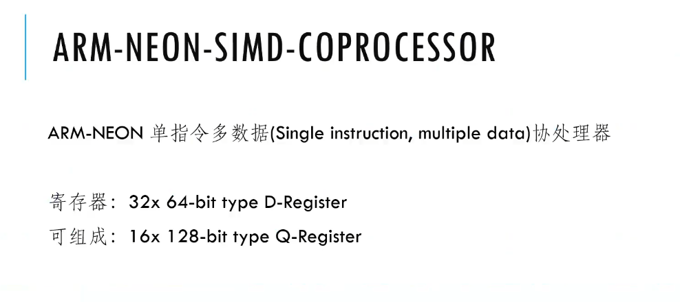

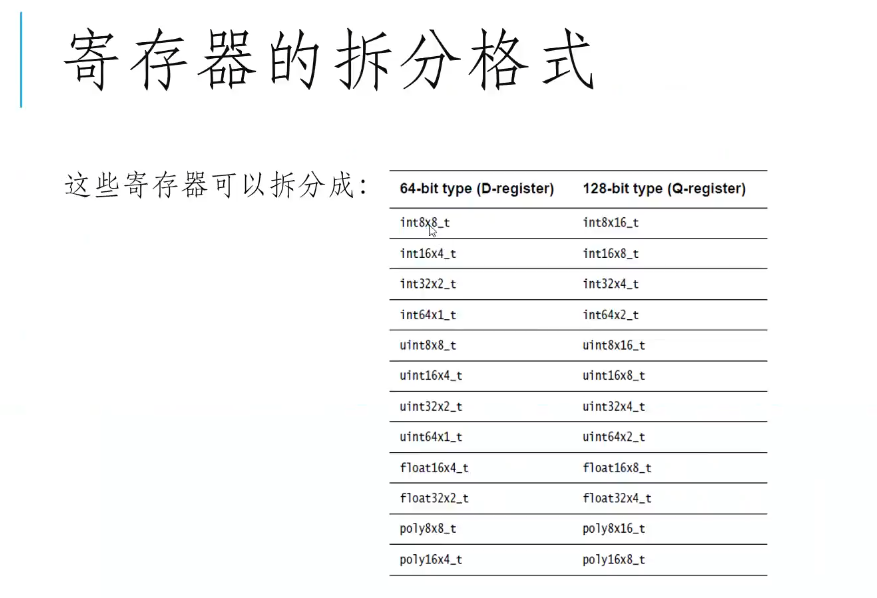


**能将寄存器划分，比如将一个64bit的D寄存器划分为8个8bit的单元，用于存储数据**

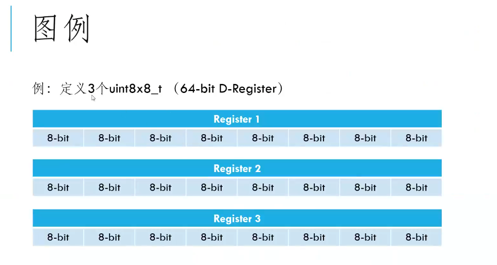


**例如用两个64位的寄存器进行划分处理，储存数据，并对这两个寄存器的数据进行加法运算**

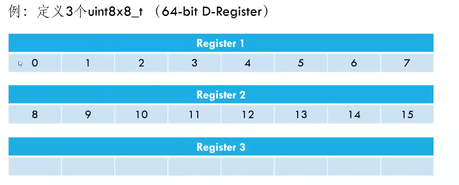

**能同时在一条加法指令下，同时还对8组数据进行加法运算**

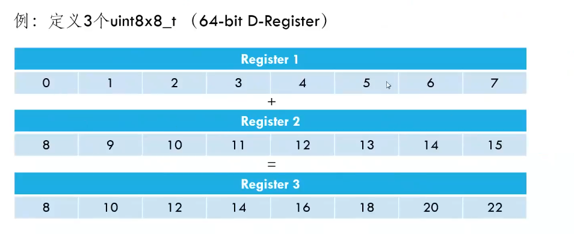


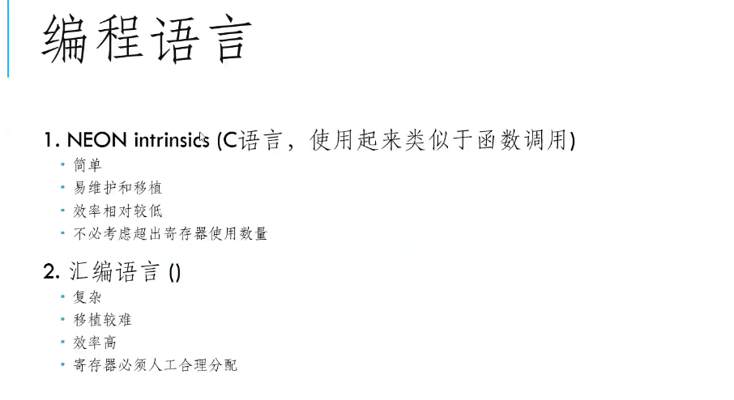


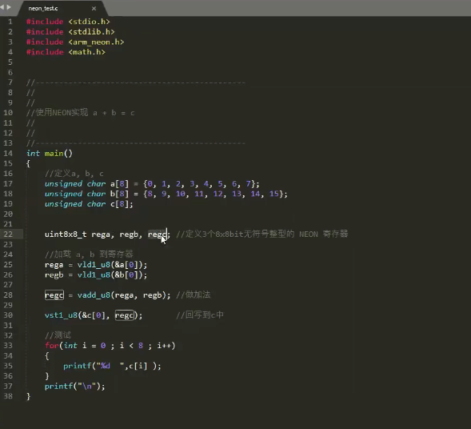


定义neon寄存区  unit8x8 rega;  

数据加载到寄存器中 rega = vld1_u8(&a[0]);


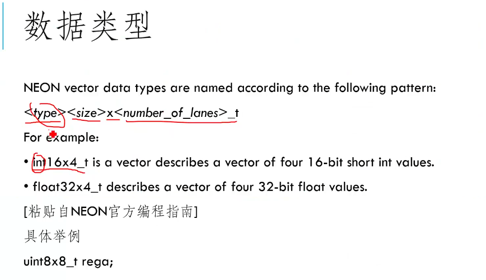


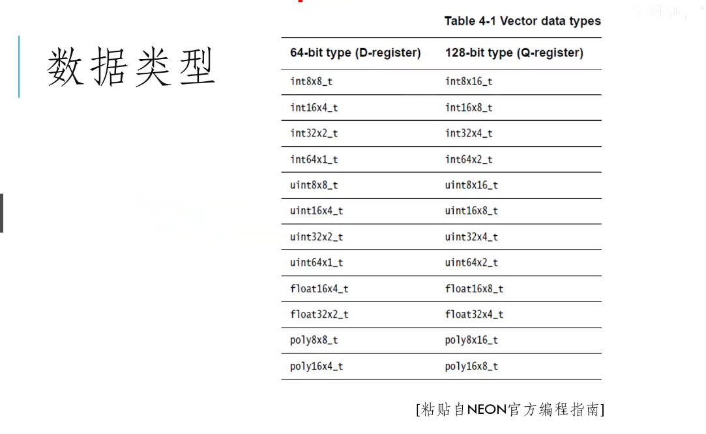


**结构体**

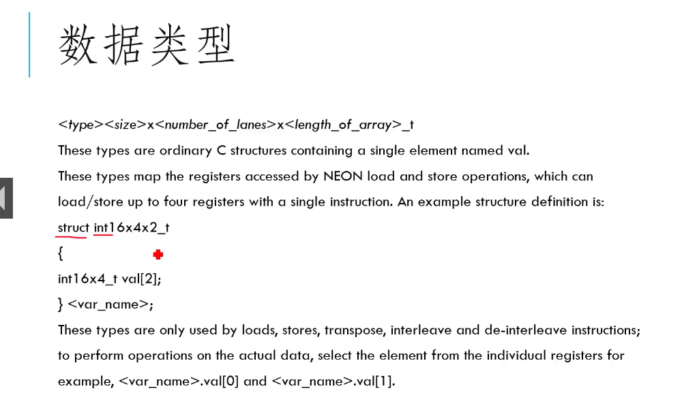

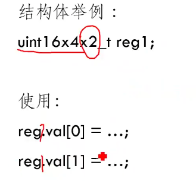

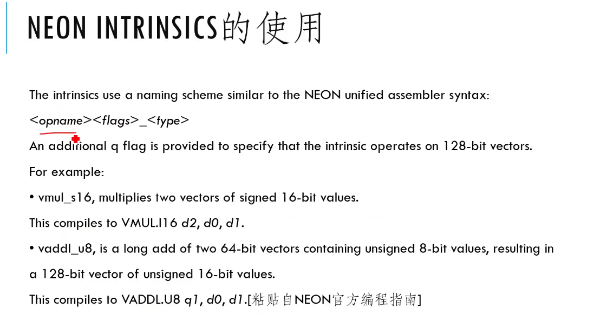


**Neon代码设计步骤**

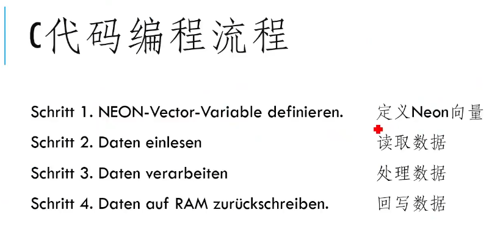


**数据读写**

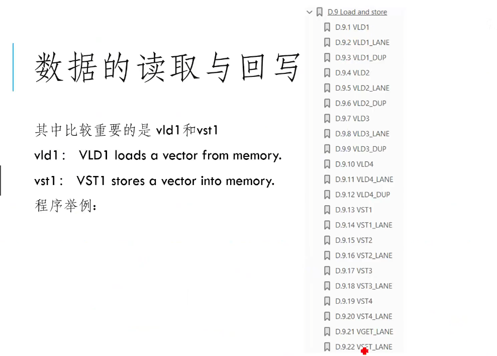


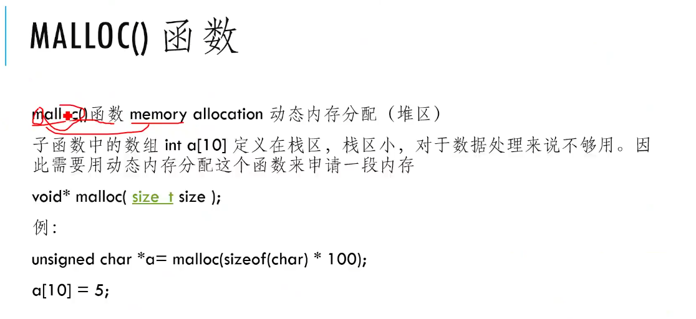


# Neon Intrinsics

https://developer.arm.com/documentation/den0018

NEON Intrinsics 是一种更简单的**编写 NEON 代码的方法**， NEON Intrinsics 类似于 C 函数 调用，在编译时由编译器替换为相应的 汇编 指令，使用时需要包含头文件 arm _ neon.h。


Neon是ARM平台的向量化计算指令集，通过一条指令完成多个数据的运算达到加速的目的，常用于AI、多媒体等计算密集型任务。


**intrinsics是以类似调用C语言函数的方法调用Neon，并由编译器生成最终的二进制代码，assembly则是手工嵌入**

**Neon汇编，直接生成二进制代码。**

## 1、入门

**1.1 Neon介绍、简明案例与编程惯例**

推荐阅读ARM官方的 **Optimizing C Code with Neon Intrinsics** (https://developer.arm.com/documentation/102467/0100/)

该资料以HWC转CHW（permute）操作、矩阵乘法为例子，介绍如何将普通C++实现改写为Neon Intrinsics的实现。


**ARM官方制作了intrinsics检索页面** 

[Intrinsics – Arm Developer](https://developer.arm.com/architectures/instruction-sets/intrinsics/)


## 2.ARM官方示例


**为什么使用 Neon 内在函数**

内在函数是编译器知道其精确实现的函数。Neon 内在函数是一组定义的 C 和 C++ 函数`arm_neon.h`，Arm 编译器和 GCC 支持这些函数。这些函数让您无需直接编写汇编代码即可使用 Neon，因为这些函数本身包含内联到调用代码中的短汇编内核。此外，寄存器分配和流水线优化由编译器处理，因此避免了汇编程序员面临的许多困难。

有关所有 **Neon 内在函数的列表**，请参阅[Neon Intrinsics Reference](https://developer.arm.com/architectures/instruction-sets/simd-isas/neon/intrinsics)。Neon 内在工程规范包含在[Arm C 语言扩展 (ACLE) 中](https://developer.arm.com/architectures/system-architectures/software-standards/acle)。

使用 Neon 内在函数有许多好处：

- **强大**：内在函数使程序员无需手写汇编代码即可直接访问 Neon 指令集。
- **便携**：可能需要针对不同的目标处理器重新编写手写的 Neon 汇编指令。包含 Neon 内在函数的 C 和 C++ 代码可以针对新目标或新执行状态（例如，从 AArch32 迁移到 AArch64）进行编译，只需极少或无需代码更改。
- **灵活**：程序员可以在需要时利用 Neon，或者在不需要时使用 C/C++，同时避免许多低级工程问题。

但是，内在函数可能并非在所有情况下都是正确的选择：

- 与导入库或依赖编译器相比，使用 Neon 内在函数的学习曲线更陡峭。
- 手动优化的汇编代码可能会提供最大的性能改进空间，即使它更难编写。

现在，我们将通过几个示例来使用 Neon 内部函数重新实现一些 C 函数。选择的示例并未反映其应用程序的全部复杂性，但它们应该说明内在函数的使用并作为更复杂代码的起点。


### **示例：RGB 去交错**

考虑一个 24 位 RGB 图像，其中图像是一个像素数组，每个像素都有一个红色、蓝色和绿色元素。在内存中，这可能显示为：

[](https://documentation-service.arm.com/static/606449625f0ba621d5d587b4?token=)

这是因为 RGB 数据是交错的，访问和操作三个独立的颜色通道给程序员带来了问题。在简单的情况下，我们可以通过将模 3 应用于交错的 RGB 值来编写自己的单色通道操作。然而，对于更复杂的操作，例如傅里叶变换，提取和分割通道会更有意义。

我们在内存中有一个 RGB 值数组，我们希望对它们进行去交错并将这些值放在单独的颜色数组中。执行此操作的 C 程序可能如下所示：


```
void rgb_deinterleave_c(uint8_t *r, uint8_t *g, uint8_t *b, uint8_t *rgb, int len_color) {
    /*
     * Take the elements of "rgb" and store the individual colors "r", "g", and "b".
     */
    for (int i=0; i < len_color; i++) {
        r[i] = rgb[3*i];
        g[i] = rgb[3*i+1];
        b[i] = rgb[3*i+2];
    }
}
```

但是有一个问题。在优化级别 -O3（非常高的优化）下使用 Arm Compiler 6 进行编译并检查反汇编显示没有使用 Neon 指令或寄存器。每个单独的 8 位值存储在单独的 64 位通用寄存器中。考虑到全宽 Neon 寄存器是 128 位宽，在示例中每个可以保存 8 位值中的 16 个，重写使用 Neon 内在函数的解决方案应该会给我们带来很好的结果。


```
void rgb_deinterleave_neon(uint8_t *r, uint8_t *g, uint8_t *b, uint8_t *rgb, int len_color) {
    /*
     * Take the elements of "rgb" and store the individual colors "r", "g", and "b"
     */
    int num8x16 = len_color / 16;
    uint8x16x3_t intlv_rgb;
    for (int i=0; i < num8x16; i++) {
        intlv_rgb = vld3q_u8(rgb+3*16*i);
        vst1q_u8(r+16*i, intlv_rgb.val[0]);
        vst1q_u8(g+16*i, intlv_rgb.val[1]);
        vst1q_u8(b+16*i, intlv_rgb.val[2]);
    }
}
```

在此示例中，我们使用了以下类型和内在函数：

| 代码元素       | 它是什么？                                                   | 我们为什么要使用它？                                         |
| :------------- | ------------------------------------------------------------ | ------------------------------------------------------------ |
| `uint8x16_t`   | 16 个 8 位无符号整数的数组。                                 | 一个`uint8x16_t`适合 128 位寄存器。即使在 C 代码中，我们也可以确保没有浪费的寄存器位。 |
| `uint8x16x3_t` | 具有三个`uint8x16_t`元素的结构体。                           | 循环中当前颜色值的临时保存区域。                             |
| `vld3q_u8(…)`  | `uint8x16x3_t`通过加载 3*16 字节内存的连续区域返回 a的函数。加载的每个字节都`uint8x16_t`以交替模式放置在三个数组之一中。 | 在最低级别，此内在保证生成 LD3 指令，该指令将给定地址中的值以交替模式加载到三个 Neon 寄存器中。 |
| `vst1q_u8(…)`  | `uint8x16_t`在给定地址存储 a 的函数。                        | 它存储一个完整的 128 位寄存器，其中充满了字节值。            |

上面的完整源代码可以在 Arm 机器上使用以下命令进行编译和反汇编：


```
gcc -g -o3 rgb.c -o exe_rgb_o3
objdump -d exe_rgb_o3 > disasm_rgb_o3
```


### 矩阵乘法示例

矩阵乘法是在许多数据密集型应用程序中执行的操作。它由以简单方式重复的算术运算组组成：

[](https://documentation-service.arm.com/static/606449625f0ba621d5d587b3?token=)

矩阵乘法过程如下：

- **A** - 在第一个矩阵中取一行
- **B** - 对该行与第二个矩阵中的一列进行点积
- **C** - 将结果存储在新矩阵的相应行和列中

对于 32 位浮点矩阵，乘法可以写成：


```
void matrix_multiply_c(float32_t *A, float32_t *B, float32_t *C, uint32_t n, uint32_t m, uint32_t k) {
    for (int i_idx=0; i_idx < n; i_idx++) {
        for (int j_idx=0; j_idx < m; j_idx++) {
            C[n*j_idx + i_idx] = 0;
            for (int k_idx=0; k_idx < k; k_idx++) {
                C[n*j_idx + i_idx] += A[n*k_idx + i_idx]*B[k*j_idx + k_idx];
            }
        }
    }
}
```

我们假设了内存中矩阵的主要列布局。也就是说，一个`n`x`m`矩阵`M`表示为一个数组`M_array`，其中= 。`Mij``M_array[n*j + i]`

这段代码不是最理想的，因为它没有充分利用 Neon。我们可以通过使用内在函数来开始改进它，但让我们首先通过查看小的、固定大小的矩阵来解决一个更简单的问题，然后再转向更大的矩阵。

以下代码使用内在函数将两个`4x4`矩阵相乘。由于我们要处理的值很少且数量固定，所有这些值都可以立即放入处理器的 Neon 寄存器中，因此我们可以完全展开循环。


```
void matrix_multiply_4x4_neon(float32_t *A, float32_t *B, float32_t *C) {
        // these are the columns A
        float32x4_t A0;
        float32x4_t A1;
        float32x4_t A2;
        float32x4_t A3;
        
        // these are the columns B
        float32x4_t B0;
        float32x4_t B1;
        float32x4_t B2;
        float32x4_t B3;
        
        // these are the columns C
        float32x4_t C0;
        float32x4_t C1;
        float32x4_t C2;
        float32x4_t C3;
        
        A0 = vld1q_f32(A);
        A1 = vld1q_f32(A+4);
        A2 = vld1q_f32(A+8);
        A3 = vld1q_f32(A+12);
        
        // Zero accumulators for C values
        C0 = vmovq_n_f32(0);
        C1 = vmovq_n_f32(0);
        C2 = vmovq_n_f32(0);
        C3 = vmovq_n_f32(0);
        
        // Multiply accumulate in 4x1 blocks, i.e. each column in C
        B0 = vld1q_f32(B);
        C0 = vfmaq_laneq_f32(C0, A0, B0, 0);
        C0 = vfmaq_laneq_f32(C0, A1, B0, 1);
        C0 = vfmaq_laneq_f32(C0, A2, B0, 2);
        C0 = vfmaq_laneq_f32(C0, A3, B0, 3);
        vst1q_f32(C, C0);
        
        B1 = vld1q_f32(B+4);
        C1 = vfmaq_laneq_f32(C1, A0, B1, 0);
        C1 = vfmaq_laneq_f32(C1, A1, B1, 1);
        C1 = vfmaq_laneq_f32(C1, A2, B1, 2);
        C1 = vfmaq_laneq_f32(C1, A3, B1, 3);
        vst1q_f32(C+4, C1);
        
        B2 = vld1q_f32(B+8);
        C2 = vfmaq_laneq_f32(C2, A0, B2, 0);
        C2 = vfmaq_laneq_f32(C2, A1, B2, 1);
        C2 = vfmaq_laneq_f32(C2, A2, B2, 2);
        C2 = vfmaq_laneq_f32(C2, A3, B2, 3);
        vst1q_f32(C+8, C2);
        
        B3 = vld1q_f32(B+12);
        C3 = vfmaq_laneq_f32(C3, A0, B3, 0);
        C3 = vfmaq_laneq_f32(C3, A1, B3, 1);
        C3 = vfmaq_laneq_f32(C3, A2, B3, 2);
        C3 = vfmaq_laneq_f32(C3, A3, B3, 3);
        vst1q_f32(C+12, C3);
}
```

我们选择乘以固定大小的`4x4`矩阵有几个原因：

- 一些应用程序特别需要`4x4`矩阵，例如图形或相对论物理学。
- Neon 向量寄存器保存四个 32 位值，因此将程序与架构相匹配将使其更易于优化。
- 我们可以采用这个`4x4`内核并将其用于更通用的内核。

让我们总结一下这里使用的内在函数：

| 代码元素            | 它是什么？                                                   | 我们为什么要使用它？                                         |
| :------------------ | ------------------------------------------------------------ | ------------------------------------------------------------ |
| `float32x4_t`       | 四个 32 位浮点数的数组。                                     | 一个`uint32x4_t`适合 128 位寄存器。即使在 C 代码中，我们也可以确保没有浪费的寄存器位。 |
| `vld1q_f32(…)`      | 将四个 32 位浮点数加载到`float32x4_t`.                       | 要从 A 和 B 获取我们需要的矩阵值。                           |
| `vfmaq_lane_f32(…)` | 使用融合乘法累加指令的函数。将一个`float32x4_t`值乘以另一个元素的单个元素，`float32x4_t`然后将结果与第三个元素相加，`float32x4_t`然后返回结果。 | 由于矩阵行列点积是一组乘法和加法，因此此操作非常自然。       |
| `vst1q_f32(…)`      | `float32x4_t`在给定地址存储 a 的函数。                       | 计算后存储结果。                                             |

现在我们可以乘以`4x4`矩阵，我们可以通过将更大的矩阵视为`4x4`矩阵块来乘以更大的矩阵。这种方法的一个缺陷是它只适用于在两个维度上都是四的倍数的矩阵大小，但是通过用零填充任何矩阵，您可以使用此方法而无需更改它。

下面列出了更通用的矩阵乘法的代码。内核的结构变化很小，主要变化是增加了循环和地址计算。正如在`4x4 kernel we have used unique variable names for the columns of B, even though we could have used one variable and re-loaded. This acts as a hint to the compiler to assign different registers to these variables, which will enable the processor to complete the arithmetic instructions for one column while waiting on the loads for another.`


```
void matrix_multiply_neon(float32_t  *A, float32_t  *B, float32_t *C, uint32_t n, uint32_t m, uint32_t k) {
        /* 
         * Multiply matrices A and B, store the result in C. 
         * It is the user's responsibility to make sure the matrices are compatible.
         */     

        int A_idx;
        int B_idx;
        int C_idx;
        
        // these are the columns of a 4x4 sub matrix of A
        float32x4_t A0;
        float32x4_t A1;
        float32x4_t A2;
        float32x4_t A3;
        
        // these are the columns of a 4x4 sub matrix of B
        float32x4_t B0;
        float32x4_t B1;
        float32x4_t B2;
        float32x4_t B3;
        
        // these are the columns of a 4x4 sub matrix of C
        float32x4_t C0;
        float32x4_t C1;
        float32x4_t C2;
        float32x4_t C3;
        
        for (int i_idx=0; i_idx<n; i_idx+=4 {            for (int j_idx=0; j_idx<m; j_idx+=4){                 // zero accumulators before matrix op                 c0=vmovq_n_f32(0);                 c1=vmovq_n_f32(0);                 c2=vmovq_n_f32(0);                  c3=vmovq_n_f32(0);                 for (int k_idx=0; k_idx<k; k_idx+=4){                      // compute base index to 4x4 block                      a_idx = i_idx + n*k_idx;                      b_idx = k*j_idx k_idx;                      // load most current a values in row                      A0=vld1q_f32(A+A_idx);                      A1=vld1q_f32(A+A_idx+n);                      A2=vld1q_f32(A+A_idx+2*n);                      A3=vld1q_f32(A+A_idx+3*n);                      // multiply accumulate 4x1 blocks, i.e. each column C                      B0=vld1q_f32(B+B_idx);                      C0=vfmaq_laneq_f32(C0,A0,B0,0);                      C0=vfmaq_laneq_f32(C0,A1,B0,1);                      C0=vfmaq_laneq_f32(C0,A2,B0,2);                      C0=vfmaq_laneq_f32(C0,A3,B0,3);                      B1=v1d1q_f32(B+B_idx+k);                      C1=vfmaq_laneq_f32(C1,A0,B1,0);                      C1=vfmaq_laneq_f32(C1,A1,B1,1);                      C1=vfmaq_laneq_f32(C1,A2,B1,2);                      C1=vfmaq_laneq_f32(C1,A3,B1,3);                      B2=vld1q_f32(B+B_idx+2*k);                      C2=vfmaq_laneq_f32(C2,A0,B2,0);                      C2=vfmaq_laneq_f32(C2,A1,B2,1);                      C2=vfmaq_laneq_f32(C2,A2,B2,2);                      C2=vfmaq_laneq_f32(C2,A3,B3,3);                      B3=vld1q_f32(B+B_idx+3*k);                      C3=vfmaq_laneq_f32(C3,A0,B3,0);                      C3=vfmaq_laneq_f32(C3,A1,B3,1);                      C3=vfmaq_laneq_f32(C3,A2,B3,2);                      C3=vfmaq_laneq_f32(C3,A3,B3,3);                }   //Compute base index for stores   C_idx = n*j_idx + i_idx;   vstlq_f32(C+C_idx, C0);   vstlq_f32(C+C_idx+n,Cl);   vstlq_f32(C+C_idx+2*n,C2);   vstlq_f32(C+C_idx+3*n,C3);  } }}
```

编译和反汇编这个函数，并将它与我们的 C 函数进行比较显示：

- 给定矩阵乘法的算术指令更少，因为我们正在利用具有完整寄存器打包的高级 SIMD 技术。纯 C 代码一般不会这样做。
- `FMLA`而不是`FMUL`指令。由内在函数指定。
- 更少的循环迭代。如果使用得当，内在函数可以轻松展开循环。
- 但是，由于内存分配和数据类型（例如，`float32x4_t`）的初始化，存在不必要的加载和存储，这些在纯 C 代码中没有使用。

- 完整源代码示例：矩阵乘法

  /*
   * Copyright (C) Arm Limited, 2019 All rights reserved. 
   * 
   * The example code is provided to you as an aid to learning when working 
   * with Arm-based technology, including but not limited to programming tutorials. 
   * Arm hereby grants to you, subject to the terms and conditions of this Licence, 
   * a non-exclusive, non-transferable, non-sub-licensable, free-of-charge licence, 
   * to use and copy the Software solely for the purpose of demonstration and 
   * evaluation.
   * 
   * You accept that the Software has not been tested by Arm therefore the Software 
   * is provided "as is", without warranty of any kind, express or implied. In no 
   * event shall the authors or copyright holders be liable for any claim, damages 
   * or other liability, whether in action or contract, tort or otherwise, arising 
   * from, out of or in connection with the Software or the use of Software.
   */

  #include <stdio.h>
  #include <stdint.h>
  #include <stdlib.h>
  #include <stdbool.h>
  #include <math.h>

  #include <arm_neon.h>

  #define BLOCK_SIZE 4


  void matrix_multiply_c(float32_t *A, float32_t *B, float32_t *C, uint32_t n, uint32_t m, uint32_t k) {
          for (int i_idx=0; i_idx<n; i_idx++) {
                  for (int j_idx=0; j_idx<m; j_idx++) {
                          C[n*j_idx + i_idx] = 0;
                          for (int k_idx=0; k_idx<k; k_idx++) {
                                  C[n*j_idx + i_idx] += A[n*k_idx + i_idx]*B[k*j_idx + k_idx];
                          }
                  }
          }
  }

  void matrix_multiply_neon(float32_t  *A, float32_t  *B, float32_t *C, uint32_t n, uint32_t m, uint32_t k) {
          /* 
           * Multiply matrices A and B, store the result in C. 
           * It is the user's responsibility to make sure the matrices are compatible.
           */     

          int A_idx;
          int B_idx;
          int C_idx;
          
          // these are the columns of a 4x4 sub matrix of A
          float32x4_t A0;
          float32x4_t A1;
          float32x4_t A2;
          float32x4_t A3;
          
          // these are the columns of a 4x4 sub matrix of B
          float32x4_t B0;
          float32x4_t B1;
          float32x4_t B2;
          float32x4_t B3;
          
          // these are the columns of a 4x4 sub matrix of C
          float32x4_t C0;
          float32x4_t C1;
          float32x4_t C2;
          float32x4_t C3;
          
          for (int i_idx=0; i_idx<n; i_idx+=4) {
                  for (int j_idx=0; j_idx<m; j_idx+=4) {
                          // Zero accumulators before matrix op
                          C0 = vmovq_n_f32(0);
                          C1 = vmovq_n_f32(0);
                          C2 = vmovq_n_f32(0);
                          C3 = vmovq_n_f32(0);
                          for (int k_idx=0; k_idx<k; k_idx+=4) {
                                  // Compute base index to 4x4 block
                                  A_idx = i_idx + n*k_idx;
                                  B_idx = k*j_idx + k_idx;
                                  
                                  // Load most current A values in row 
                                  A0 = vld1q_f32(A+A_idx);
                                  A1 = vld1q_f32(A+A_idx+n);
                                  A2 = vld1q_f32(A+A_idx+2*n);
                                  A3 = vld1q_f32(A+A_idx+3*n);
                                  
                                  // Multiply accumulate in 4x1 blocks, i.e. each column in C
                                  B0 = vld1q_f32(B+B_idx);
                                  C0 = vfmaq_laneq_f32(C0, A0, B0, 0);
                                  C0 = vfmaq_laneq_f32(C0, A1, B0, 1);
                                  C0 = vfmaq_laneq_f32(C0, A2, B0, 2);
                                  C0 = vfmaq_laneq_f32(C0, A3, B0, 3);
                                  
                                  B1 = vld1q_f32(B+B_idx+k);
                                  C1 = vfmaq_laneq_f32(C1, A0, B1, 0);
                                  C1 = vfmaq_laneq_f32(C1, A1, B1, 1);
                                  C1 = vfmaq_laneq_f32(C1, A2, B1, 2);
                                  C1 = vfmaq_laneq_f32(C1, A3, B1, 3);
                                  
                                  B2 = vld1q_f32(B+B_idx+2*k);
                                  C2 = vfmaq_laneq_f32(C2, A0, B2, 0);
                                  C2 = vfmaq_laneq_f32(C2, A1, B2, 1);
                                  C2 = vfmaq_laneq_f32(C2, A2, B2, 2);
                                  C2 = vfmaq_laneq_f32(C2, A3, B2, 3);
                                  
                                  B3 = vld1q_f32(B+B_idx+3*k);
                                  C3 = vfmaq_laneq_f32(C3, A0, B3, 0);
                                  C3 = vfmaq_laneq_f32(C3, A1, B3, 1);
                                  C3 = vfmaq_laneq_f32(C3, A2, B3, 2);
                                  C3 = vfmaq_laneq_f32(C3, A3, B3, 3);
                          }
                          // Compute base index for stores
                          C_idx = n*j_idx + i_idx;
                          vst1q_f32(C+C_idx, C0);
                          vst1q_f32(C+C_idx+n, C1);
                          vst1q_f32(C+C_idx+2*n, C2);
                          vst1q_f32(C+C_idx+3*n, C3);
                  }
          }
  }

  void matrix_multiply_4x4_neon(float32_t *A, float32_t *B, float32_t *C) {
          // these are the columns A
          float32x4_t A0;
          float32x4_t A1;
          float32x4_t A2;
          float32x4_t A3;
          
          // these are the columns B
          float32x4_t B0;
          float32x4_t B1;
          float32x4_t B2;
          float32x4_t B3;
          
          // these are the columns C
          float32x4_t C0;
          float32x4_t C1;
          float32x4_t C2;
          float32x4_t C3;
          
          A0 = vld1q_f32(A);
          A1 = vld1q_f32(A+4);
          A2 = vld1q_f32(A+8);
          A3 = vld1q_f32(A+12);
          
          // Zero accumulators for C values
          C0 = vmovq_n_f32(0);
          C1 = vmovq_n_f32(0);
          C2 = vmovq_n_f32(0);
          C3 = vmovq_n_f32(0);
          
          // Multiply accumulate in 4x1 blocks, i.e. each column in C
          B0 = vld1q_f32(B);
          C0 = vfmaq_laneq_f32(C0, A0, B0, 0);
          C0 = vfmaq_laneq_f32(C0, A1, B0, 1);
          C0 = vfmaq_laneq_f32(C0, A2, B0, 2);
          C0 = vfmaq_laneq_f32(C0, A3, B0, 3);
          vst1q_f32(C, C0);
          
          B1 = vld1q_f32(B+4);
          C1 = vfmaq_laneq_f32(C1, A0, B1, 0);
          C1 = vfmaq_laneq_f32(C1, A1, B1, 1);
          C1 = vfmaq_laneq_f32(C1, A2, B1, 2);
          C1 = vfmaq_laneq_f32(C1, A3, B1, 3);
          vst1q_f32(C+4, C1);
          
          B2 = vld1q_f32(B+8);
          C2 = vfmaq_laneq_f32(C2, A0, B2, 0);
          C2 = vfmaq_laneq_f32(C2, A1, B2, 1);
          C2 = vfmaq_laneq_f32(C2, A2, B2, 2);
          C2 = vfmaq_laneq_f32(C2, A3, B2, 3);
          vst1q_f32(C+8, C2);
          
          B3 = vld1q_f32(B+12);
          C3 = vfmaq_laneq_f32(C3, A0, B3, 0);
          C3 = vfmaq_laneq_f32(C3, A1, B3, 1);
          C3 = vfmaq_laneq_f32(C3, A2, B3, 2);
          C3 = vfmaq_laneq_f32(C3, A3, B3, 3);
          vst1q_f32(C+12, C3);
  }

  void print_matrix(float32_t *M, uint32_t cols, uint32_t rows) {
          for (int i=0; i<rows; i++) {
                  for (int j=0; j<cols; j++) {
                          printf("%f ", M[j*rows + i]);
                  }
                  printf("\n");
          }
          printf("\n");
  }

  void matrix_init_rand(float32_t *M, uint32_t numvals) {
          for (int i=0; i<numvals; i++) {
                  M[i] = (float)rand()/(float)(RAND_MAX);
          }
  }

  void matrix_init(float32_t *M, uint32_t cols, uint32_t rows, float32_t val) {
          for (int i=0; i<rows; i++) {
                  for (int j=0; j<cols; j++) {
                          M[j*rows + i] = val;
                  }
          }
  }

  bool f32comp_noteq(float32_t a, float32_t b) {
          if (fabs(a-b) < 0.000001) {
                  return false;
          }
          return true;
  }

  bool matrix_comp(float32_t *A, float32_t *B, uint32_t rows, uint32_t cols) {
          float32_t a;
          float32_t b;
          for (int i=0; i<rows; i++) {
                  for (int j=0; j<cols; j++) {
                          a = A[rows*j + i];
                          b = B[rows*j + i];      
                          
                          if (f32comp_noteq(a, b)) {
                                  printf("i=%d, j=%d, A=%f, B=%f\n", i, j, a, b);
                                  return false;
                          }
                  }
          }
          return true;
  }

  int main() {
          uint32_t n = 2*BLOCK_SIZE; // rows in A
          uint32_t m = 2*BLOCK_SIZE; // cols in B
          uint32_t k = 2*BLOCK_SIZE; // cols in a and rows in b
          
          float32_t A[n*k];
          float32_t B[k*m];
          float32_t C[n*m];
          float32_t D[n*m];
          float32_t E[n*m];
          
          bool c_eq_asm;
          bool c_eq_neon;
      
          matrix_init_rand(A, n*k);
          matrix_init_rand(B, k*m);
          matrix_init(C, n, m, 0);
      
          print_matrix(A, k, n);
          print_matrix(B, m, k);
          //print_matrix(C, n, m);
          
          matrix_multiply_c(A, B, E, n, m, k);
          printf("C\n");
          print_matrix(E, n, m);
          printf("===============================\n");
          
          matrix_multiply_neon(A, B, D, n, m, k);
          printf("Neon\n");
          print_matrix(D, n, m);
          c_eq_neon = matrix_comp(E, D, n, m);
          printf("Neon equal to C? %d\n", c_eq_neon);
          printf("===============================\n");
  }

上面的完整源代码可以在 Arm 机器上使用以下命令进行编译和反汇编：


```
gcc -g -o3 matrix.c -o exe_matrix_o3
objdump -d exe_ matrix _o3 > disasm_matrix_o3
```


## 编程约定

程序约定是针对特定编程语言的一组准则。

### 宏

为了使用内在函数，必须支持高级 SIMD 架构，并且在任何情况下都可能会或可能不会启用某些特定指令。当定义了以下宏且等于 1 时，对应的功能可用：


编译器支持高级 SIMD

AArch64 始终为 1

支持霓虹浮点运算

AArch64 始终为 1

加密指令可用。

因此，加密 Neon 内在函数是可用的。

融合乘法累加指令可用。

因此，使用这些的 Neon 内在函数是可用的。

此列表并不详尽，更多宏在[Arm C 语言扩展](https://developer.arm.com/architectures/system-architectures/software-standards/acle)文档中有详细说明。

### 类型

有三种主要的数据类型可用，`arm_neon.h`它们遵循这些模式：

- `baseW_t`

  标量数据类型

- `baseWxL_t`

  矢量数据类型

- `baseWxLxN_t`

  向量数组数据类型

在哪里：

- `base` 指基本数据类型。
- `W` 是基本类型的宽度。
- `L` 是向量数据类型中标量数据类型实例的数量，例如标量数组。
- `N` 是向量数组类型中向量数据类型实例的数量，例如标量数组的结构。

通常`W`，`L`向量数据类型的长度为 64 或 128 位，因此完全适合 Neon 寄存器。`N`对应于同时对多个寄存器进行操作的那些指令。

在我们之前的代码中，我们遇到了所有三个示例：

- `uint8_t`    单个
- `uint8x16_t`   数组  16个uint8_t 数据组成的数组
- `uint8x16x3_t`    结构体  3个 uint8x16_t组成的

### 函数-Intrinsics命名规则

根据 Arm C 语言扩展，函数原型`arm_neon.h`遵循通用模式。在最一般的层面上，这是：

```
ret v[p][q][r]name[u][n][q][x][_high][_lane | laneq][_n][_result]_type(args)
```

请注意某些字母和名称重载，但按上述顺序：

- `ret` 	函数的返回类型。


- `v` : `vector`   所有内在函数的 缩写 和存在。
- `p`         表示成对操作。（ 手段 可能存在）。 [value]   value
- `q`         表示饱和操作（ `vqtb[l][x]` AArch64 操作中的 `q`128 位索引和结果操作数除外）。
- `r`         表示舍入操作。
- 
- `name`   基本操作的描述性名称。这通常是高级 SIMD 指令，但并非必须如此。
- `u`         表示有符号到无符号饱和。
- `n`         表示收窄操作。
- `q`         后缀名称表示对 128 位向量的操作。
- `x`         表示 AArch64 中的高级 SIMD 标量操作。它可以是一个 `b`， `h`， `s`或 `d`（即，8，16，32，或64位）。
- `_high`  在 AArch64 中，用于涉及 128 位操作数的加宽和收窄操作。对于扩展 128 位操作数， `high`指的是源操作数的前 64 位。对于缩小范围，它指的是目标操作数的前 64 位。
- `_n`       表示作为参数提供的标量操作数。
- `_lane`  表示取自向量通道的标量操作数。 `_laneq`表示从 128 位宽度的输入向量的通道中获取的标量操作数。（ `left | right`仅表示 `left`或 `right`将出现）。
- `type`    简短形式的主要操作数类型。
- `args`    函数的参数。


比如：

```
vaddq_u16
```

没有前缀 p-q-r

 v:

add: 操作

q: 128位向量操作

_u16: 无符号16位数值


Neon 是 Arm 架构的高级 SIMD 扩展的实现。所有符合 Armv8-A 架构的处理器（例如， [Cortex-A76](https://developer.arm.com/ip-products/processors/cortex-a/cortex-a76)或 [Cortex-A57](https://developer.arm.com/ip-products/processors/cortex-a/cortex-a57)）都包括 Neon。在程序员看来，Neon 提供了额外的 32 个 128 位寄存器，其中包含在这些寄存器内的 8、16、32 或 64 位通道上运行的指令。

为了使用 Neon 内在函数，您必须在 C 文件中包含哪个头文件？

`arm_neon.h``#include <arm_neon.h>` 必须出现在使用任何 Neon 内在函数之前。

这个函数有什么作用？int8x16_t vmulq_s8 (int8x16_t a, int8x16_t b)

该`mul`函数名是一个暗示，这种内在的使用`MUL`指令。根据参数和返回值的类型，十六字节的有符号整数，我们可以猜测这个内在映射到以下指令：

```
MUL Vd.16B, Vn.16B, Vm.16B
```

所以这个功能将对应的元素`a`，并`b`返回结果。检查定义表明这确实是真的。


本教程中定义的去交错函数只能对 16 个 8 位无符号整数块进行操作。如果您有一个长度不是 16 的倍数的 uint8_t 值数组，您将如何解释这一点： 1) 更改数组，但不更改函数？和 2) 更改函数，但不更改数组？


1. 更改数组，但不更改函数？在这种情况下，用零填充数组将是最简单的选择，但这种填充可能必须在其他函数中加以考虑。
2. 更改函数，但不更改数组？一种方法是对十六个值的每一个整数倍使用 Neon 解交织，然后对余数使用 C 解交织。


数据类型 float64_t、poly64x2_t 和 int8x8x3_t 代表什么？


- `float64_t` 是标量类型，它是 64 位浮点类型。
- `poly64x2_t` 是两个 64 位多项式标量的向量类型。
- `int8x8x3_t` 是 8 个 8 位有符号整数的三个向量的向量数组类型。


**正常指令：生成大小相同且类型通常与操作数向量相同的结果向量；int8x8_t vadd_s8 (int8x8_t a, int8x8_t b)**

**长指令：对双字向量操作数执行运算，生成四字向量的结果。所生成的元素一般是操作数元素宽度的两倍，并属于同一类型；**

**int16x8_t vaddl_s8 (int8x8_t a, int8x8_t b)**

**宽指令：一个双字向量操作数和一个四字向量操作数执行运算，生成四字向量结果。所生成的元素和第一个操作数的元素是第二个**   wide  

**操作数元素宽度的两倍；int16x8_t vaddw_s8 (int16x8_t a, int8x8_t b)**

**窄指令：四字向量操作数执行运算，并生成双字向量结果，所生成的元素一般是操作数元素宽度的一半；**

**int8x8_t  vaddhn_s16** **(int16x8_t a, int16x8_t b) **  narrow 

**饱和指令：当超过数据类型指定的范围则自动限制在该范围内；int8x8_t vqsub_s8 (int8x8_t a, int8x8_t b)**

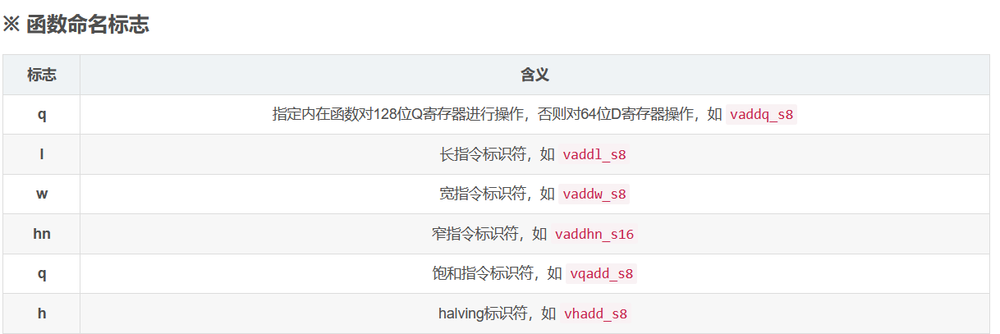


相关的研讨会视频、库和案例。第一个视频帮助我建立了优化分析思维，值得推荐。

（1）研讨会视频 "Performance Analysis for Optimizing Embedded Deep Learning Inference Software," a Presentation from Arm - Edge AI and Vision Alliance

https://www.edge-ai-vision.com/2019/07/performance-analysis-for-optimizing-embedded-deep-learning-inference-software-a-presentation-from-arm/

（2）研讨会视频 LCU14-504: Taming ARMv8 NEON: from theory to benchmark results

https://www.youtube.com/watch?v=ixuDntaSnHIwww.youtube.com

（3）研讨会视频 HKG15-408: ARM v8-A NEON optimization

https://www.youtube.com/watch?v=NYFzidaS3Z4www.youtube.com

（4）Ne10（ARM官方的计算库）：

https://github.com/projectNe10/Ne10

（5）Arm Optimized Routines（ARM官方的计算、网络、字符串库）：

https://github.com/ARM-software/optimized-routines

（6）Neon优化Chromium的案例

https://developer.arm.com/documentation/101964/developer.arm.com


