### Android CmakeLists.txt

```
cmake_minimum_required(VERSION 3.10.2)
project("tengmnn")

# set(): 设置变量值
set(CMAKE_CXX_FLAGS "${CMAKE_CXX_FLAGS} -fopenmp")  # 设置变量CMAKE_CXX_FLAGS = ${CMAKE_CXX_FLAGS} -fopenmp

set(CMAKE_C_FLAGS "${CMAKE_C_FLAGS} -fopenmp")
if (DEFINED ANDROID_NDK_MAJOR AND ${ANDROID_NDK_MAJOR} GREATER 20)
    set(CMAKE_SHARED_LINKER_FLAGS "${CMAKE_SHARED_LINKER_FLAGS} -static-openmp")
endif ()

#查找目录中的所有源文件。  aux_source_directory(<dir> <variable>)
# 收集指定目录中所有源文件的名称，并将列表存储在<variable>提供的目录中
aux_source_directory(. SRC_LIST)  # 当前路径下的所有文件名，存放在变量SRC_LIST中

# 添加库
#使用指定的源文件向项目添加库。
#add_library(<name> [静态 | 共享 | 模块]
#        [EXCLUDE_FROM_ALL]
#        来源 1 [来源 2 ...])


add_library( # Sets the name of the library.
        tengmnn  # 要从命令调用中列出的源文件创建的库目标

        # Sets the library as a shared library.
        SHARED  # 指定要创建的库的类型

        # Provides a relative path to your source file(s).
        ${SRC_LIST})  # 创建库tengmnn所需要用到的源文件


#查找库 find_library（名称1 [path1 path2 …]）
find_library( # Sets the name of the path variable.
        log-lib

        # Specifies the name of the NDK library that
        # you want CMake to locate.
        log)
#寻找 第三方库
# find_library (<VAR> name1 [path1 path2 ...])
find_library(android-lib android)
find_library(jnigraphics-lib jnigraphics)

# opencv
# 包含哪些文件，添加文件的路径
include_directories(
        ${CMAKE_SOURCE_DIR}/opencv/include/
)

# 导入外部库：导入静态库
#这种用法直接导入已经生成的库，cmake不会给这类library添加编译规则。这种用法的关键在于添加变量IMPORTED。
add_library(libopencv_java4 STATIC IMPORTED)

set_target_properties(
        libopencv_java4 # 目标
        PROPERTIES IMPORTED_LOCATION  # 关键字  属性名：导入本地
        ${CMAKE_SOURCE_DIR}/opencv/${ANDROID_ABI}/libopencv_java4.so   # 属性值
)

# mnn
# 添加目录
include_directories(${CMAKE_SOURCE_DIR}/mnn/include/)
include_directories(${CMAKE_SOURCE_DIR}/mnn/include/expr/)

# 添加库
add_library(libMNN STATIC IMPORTED)
add_library(libMNN_CL STATIC IMPORTED)
add_library(libMNN_Express STATIC IMPORTED)

# 在这里添加进来各个.so库
# set_target_properties():设置目标可以具有影响其构建方式的属性

#set_target_properties(target1 target2 ...
#        PROPERTIES prop1 value1
#        prop2 value2 ...)

set_target_properties(
        libMNN  # 目标1
        libMNN_CL  # 目标2
        libMNN_Express  # 目标3
        PROPERTIES IMPORTED_LOCATION  # PROPERTIES ：关键字属性   IMPORTED_LOCATION：具体的属性   IMPORTED_LOCATION：导入本地
#        CMAKE_SOURCE_DIR就是当前所在路劲  ，CMAKE_SOURCE_DIR=  .../main/cpp/

        # 下面是属性值
        ${CMAKE_SOURCE_DIR}/mnn/${ANDROID_ABI}/libMNN.so
        # .../main/cpp/mnn/arm64-v8a/
        # .../main/cpp/mnn/armeabi-v7a/
        ${CMAKE_SOURCE_DIR}/mnn/${ANDROID_ABI}/libMNN_CL.so
        ${CMAKE_SOURCE_DIR}/mnn/${ANDROID_ABI}/libMNN_Express.so
)


#target_link_libraries(<target> ... <item> ... ...)
#指定链接给定目标和/或其依赖项时要使用的库或标志
# 该指令的作用为将目标文件与库文件进行链接
target_link_libraries( # Specifies the target library.
        tengmnn  # 目标

        # Links the target library to the log library
        # included in the NDK.
        # 依赖项，依赖什么内容，
        ${log-lib}
        ${android-lib}
        ${jnigraphics-lib}
        libopencv_java4
        libMNN libMNN_CL libMNN_Express)
```

#### 1. add_library

说白了就是新建一个自定义名字的动态、静态库，这些库的编译根据哪个源文件编译一些源文件。

该指令的主要作用就是将指定的源文件生成链接文件，然后添加到工程中去。该指令常用的语法如下：

```
add_library(<name> [STATIC | SHARED | MODULE]
            [EXCLUDE_FROM_ALL]
            [source1] [source2] [...])
```

其中<name>表示库文件的名字，该库文件会根据命令里列出的源文件来创建。而STATIC、SHARED和MODULE的作用是指定生成的库文件的类型。STATIC库是目标文件的归档文件，在链接其它目标的时候使用。SHARED库会被动态链接（动态链接库），在运行时会被加载。MODULE库是一种不会被链接到其它目标中的插件，但是可能会在运行时使用dlopen-系列的函数。默认状态下，库文件将会在于源文件目录树的构建目录树的位置被创建，该命令也会在这里被调用。

而语法中的source1 source2分别表示各个源文件。


```
#        构建脚本中指定“tengmnn”作为共享库的名称，CMake 将创建一个名称为 tengmnn.so 的文件。
#        在 Java 代码中加载此库时使用 static { System.loadLibrary("tengmnn");} 来加载该库
```

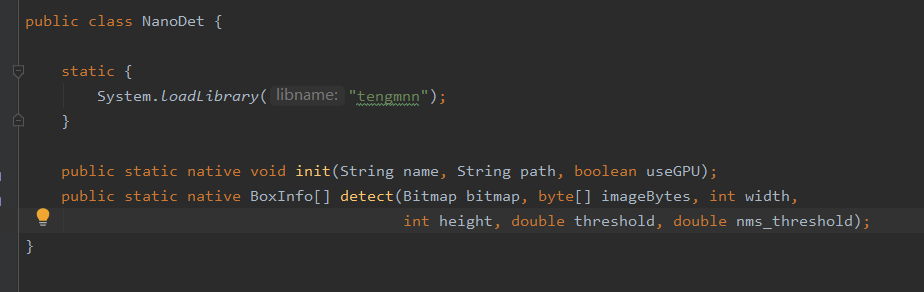

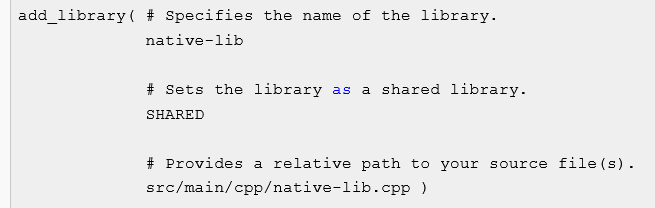

使用 `add_library()` 向您的 CMake 构建脚本添加源文件或库时，Android Studio 还会在您同步项目后在 **Project** 视图下显示关联的标头文件。不过，为了确保 CMake 可以在编译时定位您的标头文件，您需要将 [`include_directories()`](https://cmake.org/cmake/help/latest/command/include_directories.html)命令添加到 CMake 构建脚本中并指定标头的路径：

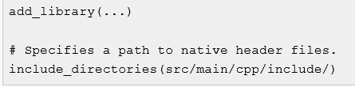

告诉编译规则，在native-lib.cpp源码中所用到的.h头文件放在哪里，这个一般是说用到了别人编译好的.so、.jar等库，而这些库里面的函数名也就头文件声明需要知道，就需要把对应添加的so库里面函数头文件添加进来。


**Android中如果想使用.so库**的话，首先得先加载，加载现在主要有两种方法，一种是直接System.loadLibrary方法加载工程中的libs目录下的默认so文件，这里的加载文件名是xxx，而整个so的文件名为：libxxx.so。还有一种是加载指定目录下的so文件，使用System.load方法，这里需要加载的文件名是全路径，比如：xxx/xxx/libxxx.so。

 上面的两种加载方式，在大部分场景中用到的都是第一种方式，而第二种方式用的比较多的就是在插件中加载so文件了。

 不管是第一种方式还是第二种方式，其实到最后都是调用了Runtime.java类的加载方法doLoad：


#### **2.ADD_SUBDIRECTORY命令**

**语法：** `ADD_SUBDIRECTORY(source_dir [binary_dir] [EXCLUDE_FROM_ALL])`
 该命令告诉CMake去**子目录**中查看可用的CMakeLists.txt文件

`EXCLUDE_FROM_ALL` 参数的含义是将这个目录从编译过程中排除


#### **4.ADD_EXECUTABLE命令**

告诉工程生成一个可执行文件。该命令定义了工程最终生成的可执行文件的文件名以及参与编译的头文件和cpp文件。
如果想指定生成的可执行文件的存放路径，可以设置cmake中预定义变量EXECUTABLE_OUTPUT_PATH 的值。例如，将生成的可执行文件放置在cmake编译路径的bin文件夹下可用：SET(EXECUTABLE_OUTPUT_PATH ${PROJECT_BINARY_DIR}/bin)

#### **4.SET命令——用于设置变量，相当于为变量取别名**


#### 5、find_package（）

https://blog.csdn.net/sen873591769/article/details/90183015


#### 6、 target_link_libraries

该指令的作用为将目标文件与库文件进行链接

target_link_libraries(<**target**> [item1] [item2] [...]

[[[debug|optimized|general] <item>] ...)

上述指令中的<**target**>是指通过add_executable()和add_library()指令生成已经创建的目标文件。而[item]表示库文件没有后缀的名字。默认情况下，库依赖项是传递的。当这个目标链接到另一个目标时，链接到这个目标的库也会出现在另一个目标的连接线上。这个传递的接口存储在interface_link_libraries的目标属性中，可以通过设置该属性直接重写传递接口。

#### 7.set()

将CMake、缓存或环境变量设置为给定值。

```
set(<variable> <value>
    [[CACHE <type> <docstring> [FORCE]] | PARENT_SCOPE])
```

在 CMake 中，将s <**variable**> 设置为值 <**value**>。<**value**> 在设置 <**variable**> 之前被扩展。通常， set 会设置一个常规的 CMake 变量。如果 CACHE 存在，则 <**variable**> 将被放入缓存中，除非它已经在缓存中。有关常规和缓存变量及其交互的详细信息，请参阅下面的“CMake 中的变量类型”部分。如果使用 CACHE，则需要 <**type**> 和 <**docstring**>。<**type**> 由 CMake GUI 用于选择用户设置值的小部件。<**type**> 的值可能是以下之一

```
FILEPATH = File chooser dialog.
PATH     = Directory chooser dialog.
STRING   = Arbitrary string.
BOOL     = Boolean ON/OFF checkbox.
INTERNAL = No GUI entry (used for persistent variables).
```

如果 <**type**> 是 INTERNAL，缓存变量被标记为内部，并且不会在像 cmake-gui 这样的工具中显示给用户。这适用于应保留在缓存中但用户通常不应更改的值。内部意味着力。

通常，set (...CACHE...) 创建缓存变量，但不会修改它们。如果指定 FORCE，则设置缓存变量的值，即使该变量已在缓存中。通常应该避免这种情况，因为它会删除用户对缓存变量值的任何更改。

如果存在 PARENT_SCOPE，则该变量将设置在当前范围之上的范围内。每个新目录或函数都会创建一个新作用域。此命令会将变量的值设置到父目录或调用函数中（以适用于手头的情况为准）。PARENT_SCOPE 不能与 CACHE 结合使用。

如果 <**value**> 未指定，则删除变量而不是 set。另请参阅：unset() 命令。

```
set(<variable> <value1> ... <valueN>)
```

在这种情况下， <**variable**>设置为以分号分隔的值列表。

<**variable**> 可以是环境变量，例如：

```
set( ENV{PATH} /home/martink )
```

在这种情况下，将设置环境变量。

*** CMake 中的变量类型 \***

在 CMake 中有两种类型的变量：普通变量和缓存变量。普通变量用于脚本内部使用（就像大多数编程语言中的变量一样）；它们不会在 CMake 运行中持续存在。缓存变量（除非使用 INTERNAL设置）主要用于配置设置，其中第一次 CMake 运行确定合适的默认值，然后用户可以通过使用 ccmake 或 cmake-gui 等工具编辑缓存来覆盖该默认值。缓存变量存储在 CMake 缓存文件中，并在 CMake 运行中保持不变。

两种类型可以以相同的名称但不同的值同时存在。计算 ${FOO} 时，CMake 首先在作用域中查找普通变量 'FOO' 并在set 时使用它。当且仅当不存在正常变量时，它才会回退到缓存变量“FOO”。

一些例子：

**代码' set (FOO“x”)'设置了普通变量'FOO'。**它不会触及缓存，但会隐藏任何现有的缓存值“FOO”。

代码 ' set (FOO “x” CACHE ...)' 检查缓存中的 'FOO'，忽略任何同名的普通变量。如果“FOO”在缓存中，那么普通变量或缓存变量都不会发生任何变化。如果“FOO”不在缓存中，则将其添加到缓存中。

最后，每当命令添加或修改缓存变量时，CMake 也会从当前作用域中*删除*同名的普通变量，以便紧随其后的评估将公开新缓存的值。

通常项目应该避免使用同名的普通变量和缓存变量，因为这种交互可能难以遵循。但是，在某些情况下，它可能很有用。一个例子（被一些项目使用）：

一个项目在其源树中有一个子项目。子项目有自己的 CMakeLists.txt，它是使用 add_subdirectory() 从父 CMakeLists.txt 中包含的。现在，如果父项目和子项目提供相同的选项（例如编译器选项），则父项目将第一次有机会向缓存添加用户可编辑的选项。通常，子级将使用与父级相同的值。但是，可能需要对子项目选项的值进行硬编码，同时仍允许用户编辑父项目使用的值。父项目可以简单地通过设置来实现这一点在足以完全隐藏子级选项的缓存变量的范围内与选项同名的普通变量。父级已经设置了缓存变量，所以子级的 set(...CACHE...) 不会做任何事情，并且评估选项变量将使用普通变量的值，这隐藏了缓存变量。


### build.gradle文件


apply plugin: 'com.android.application' //表示是一个应用程序的模块，可独立运行
//apply plugin: 'com.android.library' //表示是一个依赖库，不能独立运行
apply from: "add_plugin.gradle"//引入其他的gradle文件
android {
//程序在编译的时候会检查lint，有任何错误提示会停止build，我们可以关闭这个开关
    lintOptions {
        abortOnError false  
        //即使报错也不会停止打包
        checkReleaseBuilds false  
        //打包release版本的时候进行检测
    }

    compileSdkVersion 28   //指定项目的编译版本
    buildToolsVersion "30.0.3"//指定项目构建工具的版本;其中包括了打包工具aapt、dx等等
    defaultConfig {
        applicationId "com.example.customerservice"" //指定包名
        minSdkVersion 15//指定最低的兼容的Android系统版本
        targetSdkVersion 28//指定你的目标版本，表示你在该Android系统版本已经做过充分的测试
        versionCode 1   //版本号
        versionName "1.0"   //版本名称
        multiDexEnabled true  
        //当方法数超过65535(方法的索引使用的是一个short值，
        //而short最大值是65535)的时候允许打包成多个dex文件，动态加载dex。这里面坑很深啊
    }
    buildTypes { //指定生成安装文件的配置，常有两个子包:release,debug，注：直接运行的都是debug安装文件
        release { //用于指定生成正式版安装文件的配置
            minifyEnabled false     //指定是否对代码进行混淆，true表示混淆
            //指定混淆时使用的规则文件，proguard-android.txt指所有项目通用的混淆规则，proguard-rules.pro当前项目特有的混淆规则
            proguardFiles getDefaultProguardFile('proguard-android.txt'), 'proguard-rules.pro'
        }
    }
}
dependencies { //指定当前项目的所有依赖关系：本地依赖、库依赖、远程依赖
    implementation fileTree(dir: 'libs', include: ['*.jar'])//本地依赖
    androidTestimplementation('com.android.support.test.espresso:espresso-core:2.2.2', {
        exclude group: 'com.android.support', module: 'support-annotations'
    })
    implementation 'com.android.support:appcompat-v7:25.0.1'//远程依赖，com.android.support是域名部分，appcompat-v7是组名称，25.0.1是版本号
    Implementation project(':hello')//库依赖
    testImplementation 'junit:junit:4.12'  //声明测试用列库
    implementation
    'com.android.support.constraint:constraint-layout:1.0.0'
}
//声明是要使用谷歌服务框架
apply plugin: 'com.google.gms.google-services'

//使用maven仓库。android有两个标准的library文件服务器，一个jcenter一个maven。两者毫无关系。
//jcenter有的maven可能没有，反之亦然。
//如果要使用jcenter的话就把mavenCentral()替换成jcenter()
repositories {
    mavenCentral()
}

#### module模块下app的build.gradle

// 插件
plugins {
    id 'com.android.application'
}
//这个android{}闭包主要为了配置项目构建的各种属性：
android {
    compileSdkVersion 30  //设置编译时用的Android版本
    buildToolsVersion "30.0.3"  // buildTools版本

    defaultConfig {
        applicationId "com.wzt.mnn"   //应用的包名
        minSdkVersion 24   //最低SDK
        targetSdkVersion 30  //目标SDK
        versionCode 1  //当前版本号
        versionName "1.0"   //版本名
    
        testInstrumentationRunner "androidx.test.runner.AndroidJUnitRunner"
//        外部原生构建
//        要手动配置 Gradle 以关联到您的原生库，您需要将 externalNativeBuild {} 块添加到模块级 build.gradle 文件中，
//        并使用 cmake {} 或 ndkBuild {} 对其进行配置


//        在模块级 build.gradle 文件的 defaultConfig {} 块中配置另一个 externalNativeBuild {} 块，为 CMake 或 ndk-build 指定可选参数和标志。
        externalNativeBuild {
            cmake { // 封装了你的CMake构建配置。


                // 传递给CMake的可选参数。
                arguments "-DANDROID_ARM_NEON=TRUE", "-DANDROID_PLATFORM=android-21", "-DANDROID_STL=c++_shared"
                // 设置一个标志，以便为C++编译器启用格式宏常量。
                cppFlags ""
            }
        }

//        Gradle 仅构建和打包原生库的特定 ABI 配置，您可以在模块级 build.gradle 文件中使用 ndk.abiFilters标志指定这些配置
        ndk {
            moduleName "WztMnnJniLog"
            ldLibs "log", "z", "m"
            abiFilters "armeabi-v7a", "arm64-v8a"  //        指定 ABI
        }
    }


//指定生成安装文件的配置，常用类型：release（用于生产环境） 、debug（测试环境）
//    buildTypes{}闭包：
//    这个闭包主要指定生成安装文件的主要配置，
    buildTypes {
        release {  //指定生成正式版本安装文件的配置
            minifyEnabled false  //指定代码是否进行混淆，true表示混淆
            proguardFiles getDefaultProguardFile('proguard-android-optimize.txt'), 'proguard-rules.pro'   //指定混淆规则

        }
    }
    
    externalNativeBuild {  // 封装了你的外部本地构建配置。
        cmake { // 封装了你的CMake构建配置。
    
            path "src/main/cpp/CMakeLists.txt" // 为你的CMake构建脚本提供一个相对路径。
            version "3.10.2"   // 要和cMakeLists.txt中版本一致
        }
    }


//    新版Gradle实现了自动打包编译so文件的功能，并且为so文件指定了默认的目录app/src/main/jniLibs，当然默认是没有这个文件夹的，
//    我们只需要新建一个jniLibs文件夹，并将so文件复制到该文件夹下，编译运行即可。
//    通常，为了更好地管理第三方库文件，或者更简单地将Eclipse项目转化为Android Studio项目，
//    建议将jar文件和so文件放在一起，统一搁置在app/libs目录下，此时，我们只需要在build.gradle的android一栏中添加如命令，指定so文件的目录即可


    sourceSets {
        //    sourceSets{}闭包：配置目录指向
        main {
            jniLibs.srcDirs = ['src/main/jniLibs', 'libs']  //指定lib库目录
        }
    }


    repositories {
        flatDir {
            dirs 'libs'
        }
    }
    
    compileOptions {
    //java编译版本
        sourceCompatibility JavaVersion.VERSION_1_8
        targetCompatibility JavaVersion.VERSION_1_8
    }
}

//  添加依赖
dependencies { //指定当前项目的所有依赖关系：本地依赖、库依赖、远程依赖

//    implementation 声明要依赖的工程，包名要具体
//    依赖声明implementation，将依赖的库文件隐藏在内部，不让外部访问
    implementation 'androidx.appcompat:appcompat:1.2.0'
    implementation 'com.google.android.material:material:1.2.1'
    implementation 'androidx.constraintlayout:constraintlayout:2.0.4'

//    testImplementation: 只在单元测试代码的编译以及最终打包测试apk时有效
//    testImplementation和androidTestImplementation：表示声明测试用例库。

    // 声明测试试用列库
    testImplementation 'junit:junit:4.+'   //引入入junit库，单元测试版本
    androidTestImplementation 'androidx.test.ext:junit:1.1.2'
    androidTestImplementation 'androidx.test.espresso:espresso-core:3.3.0'

//    implementation(name:'MNN-release', ext:'aar')

    // Use the most recent version of CameraX, currently that is alpha04
    def camerax_version = "1.0.0-alpha05"
    //noinspection GradleDependency
    
    implementation "androidx.camera:camera-core:${camerax_version}"// 依赖的cameraX版本
    //noinspection GradleDependency
    implementation "androidx.camera:camera-camera2:${camerax_version}" // 依赖的camera2版本


//  com.android.support为域名部分
// com. 一般是远程 依赖
    implementation 'com.android.support:multidex:1.0.3' //远程依赖
    // crash
    implementation 'com.zxy.android:recovery:1.0.0'
    // photoview
    implementation 'com.github.chrisbanes:PhotoView:2.3.0'
//    implementation 'com.bm.photoview:library:1.4.1'
    // FFMMR
    // 添加远程依赖
    implementation 'com.github.wseemann:FFmpegMediaMetadataRetriever-core:1.0.15'
    implementation 'com.github.wseemann:FFmpegMediaMetadataRetriever-native:1.0.15'
    

    //本地依赖声明，表示将libs目录下所有.jar后缀的文件都添加到项目的构建路径当中
    //也叫本地二进制依赖
    // dir:路劲  include:[] 包含的内容的列表，把需要添加的文件添加到列表中
    implementation fileTree(dir: 'libs', include: ['*.jar'])
}

##### **重点**：**sourceSets{}闭包：配置目录指向**

配置 jniLibs.srcDirs = ['libs']，可以在Android studio的Android视图下生成jniLibs文件夹，可以方便我们存放jar包和库文件，其中Android视图下的jniLibs和project视图下的libs指向同一文件夹（app→libs）

**编译前**

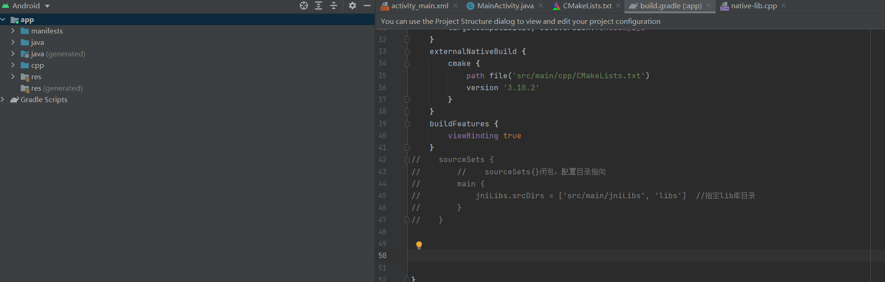


**编译后**

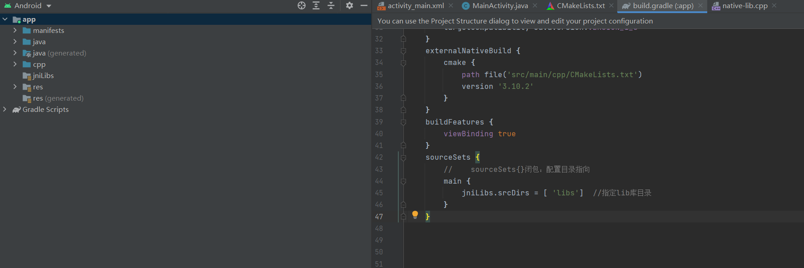


**如果是在Android Studio中，则会默认匹配main下的jniLibs目录，如果没有目录需要自己手动创建。并且库的名称也不能随便更改。**

**在选择 Android 的选项下面显示的jniLibs 目录和选择 Project 选项下面的libs 其实是一个  但是在Android选项下面的jniLibs不是自动生成的  需要在module的build.gradle里面的android下面配置sourceSets** 

**sourceSets{}配置库资源目录，目的就是告诉编译器我该此项目要用到的lib或者一些别的库资源上哪找，比如

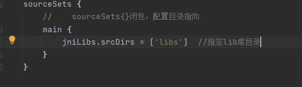

这么配置后 ，在Android 的选项下面显示的jniLibs 目录，表示资源从这里个目录里面找，而Project 选项下面的目录就是libs， 

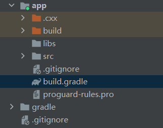

但是为了更有区分度，一般开发者自己新建jniLibs文件目录。但是有个问题就是，目前编译器不会自动生成jniLibs文件目录在Project 选项下面(我的编译器确实不行)，就算你再build.gradle里面配置了也不会自动创建，但是指定了资源库路径。比如：

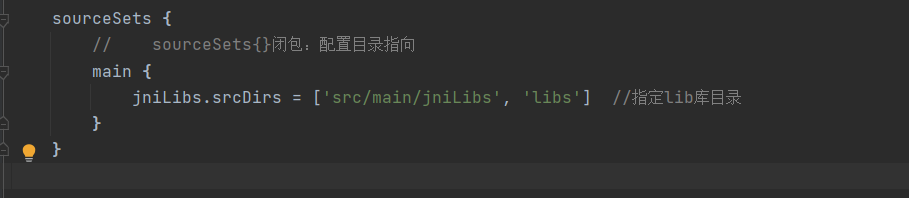

这样虽然指定了src/main/jniLibs  和libs但是在Project 选项下面只有libs,没src/main/jniLibs，这么并没有错，开发者可以把so等资源库就放在app/libs目录下，要是觉得为了更体现条理，那么就按照给定的src/main/jniLibs，在src/main下面新建jniLibs目录，把依赖SO库放在这个路径下，这也是没错，就看开发者个人喜好。

还有一个问题就是，在Project 选项下面没有libs, 在Android 的选项下面没有jniLibs 目录，就算配置了路径


虽然sourceset{}指定lib目录路径，但是更多的是在cmakelists.txt文件中指定各种依赖so库，重要在cmakelists.txt


##### 重点：buildTypes{}

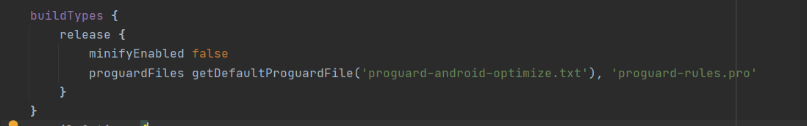

##### 重点：externalNativeBuild{}

**指定编译工具camke{}或者ndk-build{}只能其中一个**，指定工具后再指定工具的一些具体配置


我们在`build.gradle`里面看到，有两个地方用到了`externalNativeBuild`，一个是在`defaultConfig`里面，是一个是在`defaultConfig`外面。

**1、**在defaultConfig外面的externalNativeBuild里面的cmake指明了CMakeList.txt的路径(在本项目下，和是build.gradle在同一个目录里面)。 **defaultConfig外面的 externalNativeBuild - cmake，指明了 CMakeList.txt 的路径；**

**2、**在defaultConfig里面的externalNativeBuild里面的cmake主要填写的是CMake的命令参数。即由arguments中的参数最后转化成一个可执行的CMake的命令。**defaultConfig 里面的 externalNativeBuild - cmake，主要填写 CMake 的命令参数。**


##### 重点：dependencies{}----依赖项

**更多配置项信息看**：[添加构建依赖项  | Android 开发者  | Android Developers (google.cn)](https://developer.android.google.cn/studio/build/dependencies?hl=zh-cn)

如需向您的项目添加依赖项，请在 `build.gradle` 文件的 `dependencies` 代码块中指定依赖项配置

**应用模块的以下 `build.gradle` 文件包含三种不同类型的依赖项：**

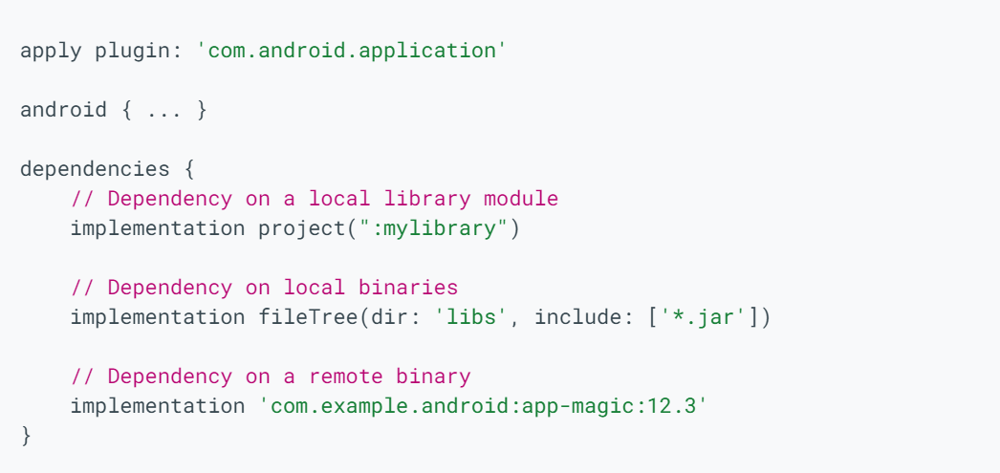


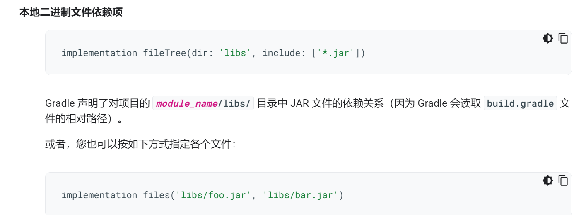

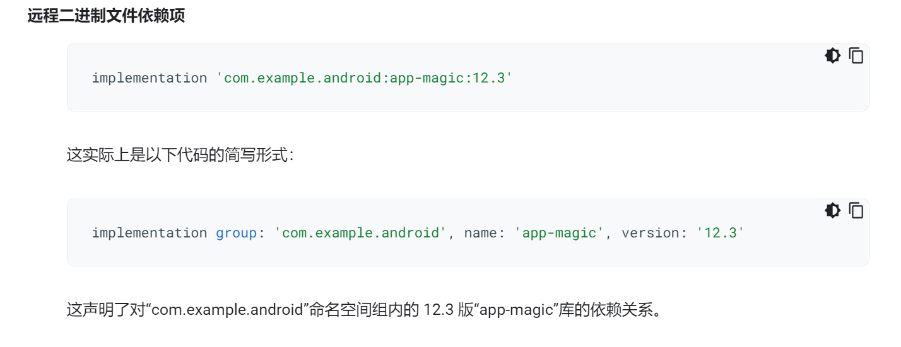

##### 编译生成的库的存放路径

**app--->build--->intermediates--->cmake--->debug/release--->object--->xxxx**


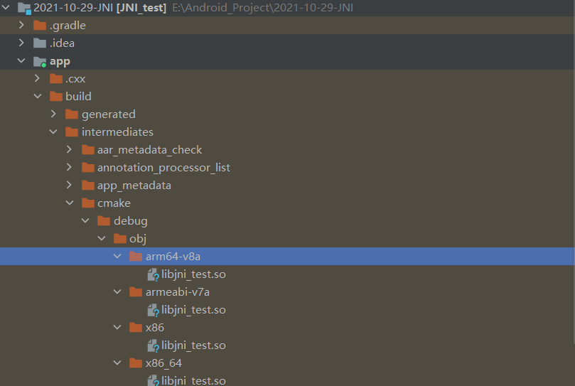


# JNI


### Java与JNI引用类型对照表

与Java基本类型不同，引用类型对开发人员是不透明的。Java内部数据结构并不直接向原生代码开放。也就是说 C/C++代码并不能直接访问Java代码的字段和方法


