# 2021-10-15


[写给Android App开发人员看的Android底层知识（1）](https://www.cnblogs.com/Jax/p/6864103.html)

[写给Android App开发人员看的Android底层知识（1） - 包建强 - 博客园 (cnblogs.com)](https://www.cnblogs.com/Jax/p/6864103.html)

## 晚上

**Activity是一个应用程序的组件，他在屏幕上提供了一个区域，允许用户在上面做一些交互性的操作， 比如打电话，照相，发送邮件，或者显示一个地图！Activity可以理解成一个绘制用户界面的窗口， 而这个窗口可以填满整个屏幕，也可能比屏幕小或者浮动在其他窗口的上方！**


## Activity 生命周期一览


**OnCreate是Android中的一个特别的函数，用来“表示一个窗口正在生成”。其不产生窗口，只是在窗口显示前设置窗口的属性如风格、位置颜色等。**------- 主要用于加载布局、开发者设计模块的初始化等


**onStart()是activity界面被显示出来的时候执行的，用户可见**   -----在活动由不可见变为可见的时候调用

**重写 onstart()**:

​	Android开发中有时会遇到这种情况，在数据列表的Activity中点击添加按钮，弹出另一个Activity添加数据，这样返回数据列表的

Activity时就需要刷新数据列表（因为添加了一条数据）。这时需要刷新数据列表的代码就应该写在数据列表Activity的onStart()函数

里面，而不能写在onCreate()函数里面，因为回到数据列表Activity时调用的是onStart()，而不是onCreate()。


**onResume():这个方法在活动准备好和用户进行交互的时候调用。此时的活动一定位于返回栈的栈顶，并且处于运行状态.**

 

**生命周期的一些细节：**

  1   Activity 第一次创建时会调用 onCreate(Bundle)。 该方法用于创建 Activity 的用户界  面，创建所需的后台线程，并执行其他的全局初始化。如果能获得Activity以前的  状态，就可以将包含此状态的 android.os.Bundle 对象传给onCreate()；否则就传入  一个空引用。在调用 onCreate(Bundle)之后， 

  Android 总会调用 onStart()。 

  2   在用户看到 Activity 之前会调用 onStart()方法。当 Activity 进入前台时， Android  在调用 onStart()之后就会调用onResume()；当 Activity 变成隐藏状态时， Android  就会在调用 onStart()之后调用 onStop()。 

  3   当 Activity 停止后，在其重新启动之前会调用 onRestart()。在调用 onRestart()之后，  Android 会调用 onStart()。 

  4   在 Activity 开始跟用户交互之前会调用 onResume()。此时， Activity 获得了焦点，  用户的输入会发送给该 Activity。当 Activity 必须暂停时，Android 就会在调用  onResume()之后调用 onPause()。 

  5   当 Android 要恢复另一个 Activity 时会调用 onPause()。该方法一般用于保留未保存  的修改，停止可能会消耗处理器资源的动画等。它应该很快地完成工作，因为只  有等该方法返回时，下一个 Activity 才能被重新激活。在调用了 onPause()之后，  当 Activity 开始跟用户交互时， Android 就会使用onResume()，当 Activity 变成隐  藏状态时调用 onStop()。 许多 Activity 执行 onPause()方法来提交数据的改变或者准  备停止与用户的交互操作。 

  6   当 Activity 变为隐藏状态时会调用 onStop()。这种情况可能发生在 Activity被销毁，  或者另一个 Activity(正在运行的或新启动的)被重新激活并将覆盖前一个 Activity  时。在调用 onStop()之后，如果 Activity 重新跟用户交互， Android 会调用 onRestart()  方法； 

  7   如果 Activity 退出了，就会调用 onDestroy()方法。 

  8   在 Activity 被销毁之前会调用 onDestroy()，除非是内存不够， Android 强行终止了  Activity 的进程。在这种情况下就不会调用 onDestroy()。如果调用了 onDestroy()，  那它就是该 Activity 接收的最终调用。在 onPause()、 onStop()或 onDestroy()返回之  后， Android 可以终止托管 Activity 的进程。从 onPause()返回后到调用 onResume()  之前， Activity 都处于可终止状态。在 onPause()再次返回之前， Activity 都不会再  处于可终止状态。 


规范或语言就是指令集 ISA，Instruction Set Architecture  

程序被按照某种指令集的规范翻译为CPU可识别的底层代码的过程叫做编译（compile）

指令集架构

指令集

微架构

X86

X64

X86-64

ARM

复杂指令集

精简指令集

**Reduced** Instruction Set Computing (RISC) [精简指令集](https://www.zhihu.com/search?q=精简指令集&search_source=Entity&hybrid_search_source=Entity&hybrid_search_extra={"sourceType"%3A"article"%2C"sourceId"%3A46170108})，比如ARM,MIPS等

**Complex** Instruction Set Computing (CISC) 复杂指令集，比如Intel的X86等

可变长指令集


架构就像是建楼，按照架构的设计规范可以建造一栋楼，配备了架构设计规范里面的基本配件；

指令集，就是做一件事的流程，执行什么的动作就是执行对应的指令，各种各样的执行动作就构成了一个完整的事件处理系统指令集；

就像在 汇编-51中的各种汇编指令就是一个指令集


微架构就是基于指令集架构以及指令集下的设计的具体功能模块，比如就像是建楼，大楼基于指令集架构，但是具体到具体的户型就可能不一样了，该种户型下可能使用了新材料、新工艺等等，而且面向特定的用户群体，这就像现今的一些芯片的增加的微架构模块；但是归结起来，微架构还是一个实实在在的电路模块，只是这个电路模块有特定的需求与制造工艺等


X86  ： **x86**泛指一系列基于[Intel 8086](https://baike.baidu.com/item/Intel 8086)且向后兼容的[中央处理器](https://baike.baidu.com/item/中央处理器)[指令集架构](https://baike.baidu.com/item/指令集架构)。


X64：


86和64应该说是寄存器的长度


Intel的8086是个寄存器字长16位的芯片，在后续的发展中不断进步，


首先X86和X64一般是指CPU的位数，X64是指CPU是64位版本，X86是指CPU是32位版本。

CPU的位数是指**处理器运算位数**，是指微处理器一次执行指令的数据带宽

CPU位数指的是一个时钟周期内处理器同时寄存和处理的二进制位数

CPU位数 = CPU中寄存器的位数 = CPU一次并行处理的数据宽度。CPU位数越多，则寻址位数越多，处理能力就越强。

CPU寻址能力 = 2^S (s为地址总线宽度） <= CPU位数

操作系统的位数 = 所依赖的指令集位数 <= CPU位数。

整数类型不一定跟位数相等，CPU位数准确地说应该是CPU一次能够并行处理的数据宽度，一般就是指数据总线宽度。


X64准确的说应该叫X86_64，本质上也是X86的一个版本，由于X86已经被淘汰，因此X64就是主流了。


64位系统内存理论最大支持2的64次方即17179869184G，而32位的系统内存最大支持2的32次方即4G，如果安装合计大于4G的内存，32位系统也只能使用4G的大小，多余的空间全部空置。在内存使用高涨的今天，32位系统可以说是跟不上时代的需求了


**操作系统位数**

介绍一个重要的概念“指令集”，指令集可以说是：计算机核心硬件CPU（中央处理器）和 计算机核心软件OS（操作系统)之间的接口、桥梁和纽带。

CPU为了实现其功能都设计了指令集，即CPU的全部指令，这就是机器语言。指令集被整合到了操作系统内核最底层的hal(硬件抽象层)中，属于操作系统与硬件之间(宏指令与微指令)的接口，指令集向操作系统定义了CPU最基本的功能，操作系统调用这些功能让CPU执行某个任务。指令集中的一条指令，就是让CPU完成一系列的动作，而该动作的完成则表明了某种运算的完成。一个功能可能需要一条或几条指令来实现。

**操作系统位数的概念是基于CPU位数的**，且是依赖于指令集的位数的。一般，操作系统位数有如下的关系：

操作系统的位数 = 所依赖的指令集位数 <= CPU位数。

注意：

（1）32位CPU只能安装32位操作系统，32位操作系统支持的内存最多为2的32次方，就是4G；

（2）64位CPU可以安装32位操作系统，也可以安装64位操作系统。64位操作系统的寻址能力就是2的64次方，即理论上是17179869184G，实际中是不可能用到这么大的内存，目前64位windows系统最大只支持128G，而当前主流主板只能加到16G。现在软件兼容性已基本没有任何问题，如果计算机安装内存超过4G，比如到6G或更多，就必须考虑安装64位操作系统，不然发挥不出硬件的所有性能，如内存相当于白装了。


**编译器位数**

这里的编译器位数指的是编译生成的软件的位数。


**处理器指令集架构的宽度和指令的编码长度没有任何关系。不是说64位架构的指令长度为64位。**

**从理论上来讲，指令本身的编码长度越短越好，因为可以节省代码的存储空间。因此即便在64位的架构下，也存在大量16位编码的指令，且基本很少出现过64位的指令编码。**


CPU的基本组成单元即为核心（core）。多个核心可以同时执行多件计算任务，前提是这些任务没有先后顺序。

核心的实现方式被称为微架构（microarchitecture）。微架构的设计影响核心可以达到的最高频率、核心在一定频率下能执行的运算量、一定工艺水平下核心的能耗水平等等


常见的代号如Haswell、Cortex-A15等都是微架构的称号。注意微架构与指令集是两个概念：指令集是CPU选择的语言，而微架构是具体的实现。i7-4770的核心是Haswell微架构，这种微架构兼容x86指令集


微架构研发完成，或者说核心研发完成，接下来就是将其组装为芯片了。过去的芯片仅仅包括CPU部分，如今大量的芯片集成了CPU、GPU、IO等多种不同的功能组件，此时这种芯片就不是传统意义上的“CPU”了。将各种功能组件组装为芯片的技术含量相比微架构研发来说是较低的，因而业界能做此类工作的企业也数量较多。


所谓微架构说白点就是CPU硬件图纸，设计这里有几个晶体管，那里怎么连接晶体管。
核心对应的是逻辑图，是一种逻辑关系，微架构是逻辑关系的硬件实现（把逻辑门转换为硬件设计）。
指令集是机器代码和硬件功能的对应，比如x86的指令集中010110代表把a和b加起来，而arm指令集10011代表把a和b加起来。
编译器，你在电脑上敲的代码a+b是高级语言，x86对应编译器把a+b翻译为a 010110 b，arm编译器则翻译为a 10011 b，然后给对应的CPU看
所谓的soc整合设计，一个芯片，上方放4个A75 cpu 下方放8个mali gpu左边放内存右边放dsp，然后拿塑料片盖上。这叫soc设计


**SIMD**

SIMD(**Single Instruction Multiple Data**)即单指令流多数据流，是一种采用一个控制器来控制多个处理器，同时对一组数据（又称“[数据向量](https://www.zhihu.com/search?q=数据向量&search_source=Entity&hybrid_search_source=Entity&hybrid_search_extra={"sourceType"%3A"article"%2C"sourceId"%3A55327037})”）中的每一个分别执行相同的操作从而实现空间上的[并行性](https://www.zhihu.com/search?q=并行性&search_source=Entity&hybrid_search_source=Entity&hybrid_search_extra={"sourceType"%3A"article"%2C"sourceId"%3A55327037})的技术。简单来说就是一个指令能够同时处理多个数据。


使用标量运算一次只能对一对数据执行乘法操作，而采用SIMD[乘法指令](https://www.zhihu.com/search?q=乘法指令&search_source=Entity&hybrid_search_source=Entity&hybrid_search_extra={"sourceType"%3A"article"%2C"sourceId"%3A55327037})，则一次可以对四对数据同时执行乘法操作。

1996年Intel推出了X86的MMX(MultiMedia eXtension)指令集扩展，MMX定义了8个寄存器，称为MM0到MM7，以及对这些寄存器进行操作的指令。每个寄存器为64位宽，可用于以“压缩”格式保存[64位整数](https://www.zhihu.com/search?q=64位整数&search_source=Entity&hybrid_search_source=Entity&hybrid_search_extra={"sourceType"%3A"article"%2C"sourceId"%3A55327037})或多个较小整数，然后可以将单个指令一次应用于两个32位整数，四个16位整数或8个8位整数。


intel在1999年又推出了全面覆盖MMX的SSE(**Streaming SIMD Extensions， 流式SIMD扩展**)指令集，并

SSE添加了八个新的128位寄存器(XMM0至XMM7)，而后来的X86-64扩展又在原来的基础上添加了8个寄存器(XMM8至XMM15)。SSE支持单个寄存器存储4个[32位单精度浮点数](https://www.zhihu.com/search?q=32位单精度浮点数&search_source=Entity&hybrid_search_source=Entity&hybrid_search_extra={"sourceType"%3A"article"%2C"sourceId"%3A55327037})，之后的SSE2则支持单个寄存器存储2个[64位双精度浮点数](https://www.zhihu.com/search?q=64位双精度浮点数&search_source=Entity&hybrid_search_source=Entity&hybrid_search_extra={"sourceType"%3A"article"%2C"sourceId"%3A55327037})，2个64位整数或4个32位整数或8个16位短整形。SSE2之后还有SSE3，SSE4以及AVX，AVX2等扩展指令集。


AVX引入了16个256位寄存器(YMM0至YMM15)，AVX的256位寄存器和SSE的128位寄存器存在着相互重叠的关系(XMM寄存器为YMM寄存器的低位)，所以最好不要混用AVX与SSE指令集


### 运行的前台、后台

软件的前台运行是指在桌面任务栏上可见正在运行的模式，比如正在运行的游戏软件；而后台运行是指应用程序关闭之后依然可以继续轻微运行相关的服务的运行模式，比如一些软件可以在后台获得到用户消息后及时通知用户。

有一个监听器，在Application中，叫ActivityLifeCycleCallback你可以注册自己的LifeCycleCallback，然后记录所有start之后的activity。 当你的列表不为空，你的应用就在前台，否则就在后台，当你的应用其中有一个Activity启动的时候，你的callback就会收到通知。


***onCreate**\*** : 该方法是在Activity被创建时回调，它是生命周期第一个调用的方法，我们在创建Activity时一般都需要重写该方法，然后在该方法中做一些**初始化的操作**，如通过setContentView设置界面布局的资源，初始化所需要的组件信息等。 


更直白的理解：就是你的手指从手机的主页面一点击APP应用后，APP进入显示给你开的第一的页面状态其背后需要做的工作，完成这些工作后才能呈现出我们能看到的界面


***onStart\*** : 此方法被回调时表示Activity正在启动，此时Activity已处于可见状态，只是还没有在前台显示，因此无法与用户进行交互。可以简单理解为Activity已显示而我们无法看见摆了。 


***onResume\*** :  当此方法回调时，则说明Activity已在前台可见，可与**用户交互**了（处于前面所说的Active/Running形态），onResume方法与onStart的相同点是两者都表示Activity可见，只不过onStart回调时Activity还是后台无法与用户交互，而onResume则已显示在前台，可与用户交互。当然从流程图，我们也可以看出当Activity停止后（onPause方法和onStop方法被调用），重新回到前台时也会调用onResume方法，因此我们也可以在onResume方法中初始化一些资源，比如重新初始化在onPause或者onStop方法中释放的资源。 

***onPause\*** :  此方法被回调时则表示Activity正在停止（Paused形态），一般情况下onStop方法会紧接着被回调。但通过流程图我们还可以看到一种情况是onPause方法执行后直接执行了onResume方法，这属于比较极端的现象了，这可能是用户操作使当前Activity退居后台后又迅速地再回到到当前的Activity，此时onResume方法就会被回调。当然，在onPause方法中我们可以做一些数据存储或者动画停止或者资源回收的操作，但是不能太耗时，因为这可能会影响到新的Activity的显示——onPause方法执行完成后，新Activity的onResume方法才会被执行。 


***onStop\*** : 一般在onPause方法执行完成直接执行，表示Activity即将停止或者完全被覆盖（Stopped形态），此时Activity不可见，仅在后台运行。同样地，在onStop方法可以做一些资源释放的操作（不能太耗时）。 


***onRestart\*** :表示Activity正在重新启动，当Activity由不可见变为可见状态时，该方法被回调。这种情况一般是用户打开了一个新的Activity时，当前的Activity就会被暂停（onPause和onStop被执行了），接着又回到当前Activity页面时，onRestart方法就会被回调。 

***onDestroy\*** :此时Activity正在被销毁，也是生命周期最后一个执行的方法，一般我们可以在此方法中做一些回收工作和最终的资源释放。 
下面我们通过程序来验证上面流程中的几种比较重要的情况，同时观察生命周期方法的回调时机。**


### **7个生命周期：**

```java
 /* onCreate:
     * 表示Activity正在被创建，执行一些初始化工作
     * （如：调用 setContentView 加载界面布局资源，初始化Activity所需数据等）；
     */
    @Override
    protected void onCreate(Bundle savedInstanceState) {  // create 创建
        super.onCreate(savedInstanceState);
    }
    /* onStart:
     * 表示Activity正在被启动，这时Activity已经可见(对应用可见)，
     * 只不过还在后台，用户还看不到；
     */
    @Override
    protected void onStart() {  // start 开始
        super.onStart();
    }
    /* onResume：
     * 表示Activity已经出现在前台，用户可见；
     */
    @Override
    protected void onResume() {//当该activity与用户能进行交互时被执行，用户可以获得activity的焦点，能够与用户交互。
        super.onResume();
    }
    /* onPause： pause暂停、停顿
     * 表示Activity正在停止，可以执行存储数据、停止动画等不太耗时的工作
     * （因为新活动的onCreate方法要在旧活动的onPause执行完才执行，
     *  为了不影响用户体验，要求这个过程尽可能在很短时间内完成）；
     */
    @Override
    protected void onPause() { //pause暂停、停顿
        super.onPause();
    }
    /* onStop：
     * 表示Activity即将停止，可以做一些稍微重量级的工作，同样不能太耗时；
     */
    @Override
    protected void onStop() { // stop 停止
        super.onStop();
    }
    /* onDestory：
     * 表示Activity即将被销毁，执行回收工作和资源释放。
     */
    @Override
    protected void onDestroy() {  // destroy 销毁
        super.onDestroy();
    }
    /* onRestart：
     * 表示Activity正在重新启动，
     * 执行顺序为：onPause → onStop → onRestart → onStart → onResume
     */
    @Override
    protected void onRestart() {  // restart 重新启动
        super.onRestart();
    }
```


### 实际应用生命周期过程

1. 初次启动一个Activity，回调情况：

   

Activity启动后，先调用了onCreate方法，然后是onStart方法，最后是onResume方法，进入运行状态，此时Activity已在前台显示。

Activity启动–>onCreate()–>onStart()–>onResume()依次被调用


1. 从Activity A 打开新的Activity B，B活动回调情况：onPause -> （ Activity B 启动）->  onStop 。***这里还有一种特殊情况，当新启动的Activity采用透明主题时，当前Actvity不会回调onStop方法。\***（见补充说明1）

   从A活动切换到B活动，再回到A活动，期间A活动没有调用finish()方法。A活动回调情况：

   

2. 

   

   按back键退出Activity A，A活动回调情况：（见补充说明2）

   

3. 

   

   息屏，然后亮屏，回调情况：

   

 *实践出真知，这些过程都可以自己写个简单的Demo验证一下，印象更深刻一些。*

**补充说明：**

1. onStart 和 onStop，onResume 和 onPause 这两个配对的回调是具有不同意义的，onStart 和 onStop 是从Activity是否可见这个角度来回调的，而onResume 和 onPause则是从Activity是否位于前台来回调的，在实际使用过程中没有其他明显区别。**说明：**onStart（后台可见）-> onResume（前台可见）-> onPause（后台可见）-> onStop（后台也不可见）。

个人观点：上述实例2的原因是在回调onStop方法前，Activity A在后台是可见的，只不过不在前台无法与用户发生交互，如果回调了onStop，后台的Activity A也不可见了，那么Activity B的透明背景之后是默认的白色背景，视觉上会显得十分尴尬，个人觉得这么设计也是为了优化用户体验吧。

1. 默认情况下，按back键，会回调Activity的 onDestroy 方法，销毁当前实例。
2. 从Activity A跳转到 Activity B的过程中，先回调 A 的onPause方法，然后创建Activity B，然后才回调 A 的 onStop 方法（在上面的2，3两个实例中都能发现），因此，不要在onPause方法中执行耗时的操作，以尽快启动Activity B，使得用户拥有流畅的使用体验。

### Activity异常生命周期

https://blog.csdn.net/qq_35559358/article/details/79715222

异常的生命周期主要分以下两种情况：

- 1、相关的系统配置发生改变导致Activity被杀死并重新创建（一般指横竖屏切换）
- 2、内存不足导致低优先级的Activity被杀死


​	onSaveInstanceState和onRestoreInstanceState方法是干什么用的呢？实际上这两个方法是系统自动调用的，当系统配置发生变化后，Activity会被销毁，也就是onPause，onStop，onDestroy会被依次调用，同时因为Activity是在异常情况下销毁的，android系统会自动调用onSaveInstanceState方法来保存当前Activity的状态信息，因此我们可以在onSaveInstanceState方法中存储一些数据以便Activity重建之后可以恢复这些数据，当然这个方法的调用时机必须在onStop方法之前，也就是Activity停止之前。


​	当Activity被重新创建之后，系统还会去调用onRestoreInstanceState方法，并把Activity销毁时通过onSaveInstanceState方法保存的Bundle对象作为参数同时传递给onRestoreInstanceState和onCreate方法，因此我们可以通过onRestoreInstanceState和onCreate方法来判断Activity是否被重新创建，倘若被重建了，我们就可以对之前的数据进行恢复

**这里有点需要特别注意，onSaveInstanceState和onRestoreInstanceState只有在Activity异常终止时才会被调用的，正常情况是不会调用这两个方法的。**


## Android中的“焦点”-什么是“焦点”

参考资料：

[Android中最详细的焦点问题，从概念出发带你一点点分享（1） - 知乎 (zhihu.com)](https://zhuanlan.zhihu.com/p/34486860)

### 焦点概念

焦点在Android中也就是Focus，称为Focus机制。以后我们看到Focus就是指的焦点！那么什么是焦点机制呢？或者什么是焦点呢？
概念：所谓焦点就和我们生活中一样，比如你的同学聚会中，谁是焦点啊。其实意思差不多，焦点就是最受关注的哪一个，人们都围绕着它。再来回到我们Android开发中，比如一个页面有3个EditText，那么当你键盘输入内容的时候，这个时候会在哪一个EditText里面显示内容呢？这个时候就是谁获得了焦点就在那个EditText中显示内容。（注意：有很多人把焦点和点击混了，以为我点击了某个控件，这个控件就获取焦点了，这个是不一定的，不能这么认为！后面会有说明）

说白了就是你手机当前屏幕上的焦点在那个控件上，体现就是当前控件获取了焦点，对于EditText来说，体现就是键盘输入的内容，会输入到这个EditText上面。如果这个EditText没有获取焦点的话，键盘输入的内容是不会在EditText内显示的。

**获取焦点的两种模式**

触摸模式（TouchMode）与普通模式

用代码的体现就是：如果请求有触摸获取焦点的能力，在xml中的配置是 android:focusableInTouchMode="true"
请求有普通获取焦点的能力（可以理解为通过物理键盘），在xml中的配置是android:focusable="true"
具体的来说说这两种模式：

- focusable

出现这种模式主要是因为Android系统不仅仅是针对手机的，有可能在电视、手表等等的非触摸输入设备上。在手机上其实普通模式很少用了，现在的手机基本都是触摸屏并且没有物理上下键的，这种模式是用在TV等一些有物理键的产品上面的。比如非触摸屏手机或者TV，如果设置为true，则键盘上下左右选中，焦点会随之移动。比如有物理上下键，你按一个向下键，屏幕上的内容就会对应选中一个向下的控件，如果这个控件有focusable能力的话这个时候这个控件就是获得了焦点。

- focusableInTouchMode

在Android开发中对于现在的手机来说，都是触摸模式（TocuMode），就是当你触摸一个控件的时候，这个控件会获取焦点。注意：有些控件是默认不具有触摸获取焦点的功能的（Button、TextView、LinearLayout等等这些控件是默认没有触摸获取焦点功能的，为什么会有这种问题呢？原因是这些控件有时候可能会想要先响应点击事件，如果触摸获取焦点功能打开后，当你点一下，默认是不会调用点击事件的，这个时候会先让这个控件获取焦点）EditText是默认有触摸获取焦点功能的，并将第一抢先获取焦点。这就解释了为什么当一个页面有EditText的时候，我们进入的时候默认有光标，键盘弹出，这就是焦点在这EditText上面。
就像上面说的那些控件（Button、TextView等等这些默认没有触摸获取焦点功能的控件），当你点击它的时候，它也不会获取焦点也就是调用 isFocused()方法的时候返回的也是false，这个时候默认的是触发到它的点击事件。如果你配置了focusableInTouchMode的话这个时候这些控件才会获取焦点，而这个时候是不会触发点击事件的，触发的是 OnFocusChangeListener。这个时候获取了焦点，当你在点击的时候才会触发点击事件。

总结：这两个属性都是表示是否可以获取焦点，focusableInTouchMode是针对触屏的。 android：focusable是针对有物理键下操作的。我们在Android开发中主要是用focusableInTouchMode。

**分析一下为什么出现EditText自动获取焦点的问题**

我们都知道如果在布局中有EdiText的话，EditText会默认获得焦点，弹出键盘。解决方法网上也很多了，就是在EditText的父布局中添加 focusableInTouchMode = true 。网上大多数会添加focusable = true。我们通过上面的内容可以知道，对于手机来说，只需要添加 focusableInTouchMode = true 就可以了。
EditText自动获取焦点主要是因为当我们没有给EditText的父布局设置focusableInTouchMode的时候，它的父布局是默认没有这个能力的，所以焦点就会直接被EditText争夺去。如果我们设置了focusableInTouchMode的话，这样EditText的父布局就会有这个能力了，这样只有我们触摸的时候触发相应的事件，通过Android中的事件传递机制进行传递了。


## Android四大组件-Activity


1.活动（activity）

2.服务(Service)

3.广播接受者（Broadcast Receive）

4.内容提供者（Content Provider）

| Activities          | 描述UI，并且处理用户与机器屏幕的交互。    |
| ------------------- | ----------------------------------------- |
| Services            | 处理与应用程序关联的后台操作。            |
| Broadcast Receivers | 处理Android操作系统和应用程序之间的通信。 |
| Content Providers   | 处理数据和数据库管理方面的问题。          |


1.应用程序中，一个Activity通常就是一个单独的屏幕，它上面可以显示一些控件也可以监听并处理用户的事件做出响应。

2：Activity之间通过Intent进行通信。在Intent 的描述结构中，有两个最重要的部分：动作和动作对应的数据

### 1-Activity之间的跳转：


```java
public class MainActivity extends Activity {
private Button button1;
@Override
# Bundle：捆，捆绑
protected void onCreate(Bundle savedInstanceState) { # Bundle经常使用在Activity之间或者线程间传递数据
	super.onCreate(savedInstanceState); # `super`可以用来调用直接父类方法。
	setContentView(R.layout.activity_main);
	
	button1 = (Button) findViewById(R.id.button1);
	//绑定事件
	button1.setOnClickListener(new View.OnClickListener() {
    // 运行后点击显示按钮就可以跳到新的activity
​			@Override
​			public void onClick(View v) {
​	//第一种方式
​						//创建一个意图
​						// 一个构造方法是 Intent(Context, Class)
​						// context：上下文信息  class：要跳转到的activity目标
​						// 显式使用
​	/*				Intent intent = new Intent(MainActivity.this,SecondActivity.class);
​					//启动Activity
​					startActivity(intent);*/
​	//第二种方式	 直接告诉 目标activity	
​		 /*	Intent intent = new Intent("com.gdqy.activity.SecondActivity");
​				startActivity(intent);*/
​	//第三种 
​					Intent intent = new Intent();
​					intent.setAction("com.gdqy.activity.SecondActivity");
​					startActivity(intent);
​				}
​			});
​		}
​		@Override
​		public boolean onCreateOptionsMenu(Menu menu) {
​			getMenuInflater().inflate(R.menu.main, menu);
​			return true;
​		}
​	
​	}
```


​			
​		


	package com.gdqy.activity;
	
	import android.app.Activity;
	import android.os.Bundle;
	import android.view.View;
	
	public class SecondActivity extends Activity {
	@Override
	protected void onCreate(Bundle savedInstanceState) {
		super.onCreate(savedInstanceState);
		setContentView(R.layout.next);
	}
	}


Android-Intent中通过startActivity(Intent intent )显式启动新的Activity]

Intent:即意图，一般是用来启动新的Activity，按照启动方式分为两类：**显式Intent** 和 **隐式Intent**

**显示Intent就是直接以“类名称”来指定要启动哪一个Activity：Intent intent = new Intent(this , activity.class);**　　其中activity.class就是要指定启动的activity


### 2-Android-Intent   意图

`Intent` 是一个消息传递对象


**四大组件之间的信息传入媒介**


- **Intent是一种运行时绑定（runtime binding)机制，它能在程序运行的过程中连接两个不同的组件**。通过Intent，你的程序可以向Android表达某种请求或者意愿，Android会根据意愿的内容选择适当的组件来响应。

activity、service和broadcast receiver之间是通过Intent进行通信的，而另外一个组件Content Provider本身就是一种通信机制，不需要通过Intent


**如果Activity1需要和Activity2进行联系，二者不需要直接联系，而是通过Intent作为桥梁。通俗来讲，Intnet类似于中介、媒婆的角色。**


- 使用Context.startActivity() 或 Activity.startActivityForResult()，传入一个intent来启动一个activity。使用 Activity.setResult()，传入一个intent来从activity中返回结果。

- 将intent对象传给Context.startService()来启动一个service或者传消息给一个运行的service。将intent对象传给 Context.bindService()来绑定一个service。

- 将intent对象传给 Context.sendBroadcast()，Context.sendOrderedBroadcast()，或者Context.sendStickyBroadcast()等广播方法，则它们被传给 broadcast receiver。


**显式Intent**
显示Itent指的是直接**指定目标**组件，创建的Intent对象传入了2个参数

​		**Intent intent = new Intent(MainActivity.this,SecondActivity.class);**


**隐式Intent**

Intent 用于通过描述您想在某个 `Intent` 对象中执行的简单操作（如“查看地图”或“拍摄照片”）来启动另一应用中的某个 Activity。这种 Intent 称作*隐式* Intent，因为它并不指定要启动的应用组件，而是指定一项*操作*并提供执行该操作所需的一些*数据*。

隐式Intent不会明确指出需要激活的目标组件，它被广泛地应用在不同应用程序之间传递消息。Android系统会使用**IntentFilter**匹配相应的组件，匹配的属性主要包括以下三个

- ​	action：表示Intent对象要完成的动作
- ​    data：表示Intent对象中传递的数据
- ​    category：表示为action添加的额外信息


### Activity  与  AppCompatActivity

当使用Eclipse开发Android应用的时候，当创建项目的时候，MainActivity自动继承的是Activity，而在使用Android Studio开发Android应用的时候，创建项目时，自动继承的是AppCompatActivity。我们分别用Eclipse与AS创建项目并运行，发现继承的父类不一样，但是运行出来的界面是一样的


## Android---Context 上下文


既然大多数情况可以new一个实例，那么，我们在android中的Activity实例怎么获取呢？Activity.instance可以获取activity。既然Activity也大致归属于一个类，那么可不可以用 Activity activity=new Activity(); 呢？安卓不像Java程序一样，随便创建一个类，写个main(）方法就能运行，**Android应用模型是基于组件的应用设计模式，组件的运行要有一个完整的Android工程环境。在这个环境下，Activity、Service等系统组件才能正常工作，而这些组件不能采用普通的java对象创建方式，new一下是不能创建实例的，而是要有它们各自的上下文环境，也就是Context.
所以说，Context是维持android各组件能够正常工作的一个核心功能类

**what 's Context:**

但在程序中，我们可理解为当前对象在程序中所处的一个环境，一个与系统交互的过程。 比如QQ和你们自己的女朋友聊天时（没有grilfriend的可自己跳过举例），此时的context是指的聊天界面以及相关的数据请求与传输，Context在加载资源、启动Activity、获取系统服务、创建View等操作都要参与。


所以，一个Activity就是一个Context（getActivity()==getContext），一个Service也是一个Context。Android把场景抽象为Context类，用户和操作系统的每一次交互都是一个场景，比如：打电话、发短信等，都有activity，还有一些我们肉眼看不见的后台服务。一个应用程序可以认为是一个工作环境，用户在这个环境中切换到不同的场景，这就像服务员，客户可能是外卖小哥、也可能是农民工等，这些就是不同的场景，而服务员就是一个应用程序。


**How to understand the ‘Context’:**

打开AndroidStudio，输入Context，然后ctrl+鼠标左键追朔其源码(看源码一般都先看注释便于理解)：**import android.content.Context;**

----->

	Context提供了关于应用环境全局信息的接口。它是一个abstract类，它的执行被Android系统提供，允许获取以应用为特征的资源和类型，是一个统领一些资源APP环境变量等的上下文。通过它可以获取应用程序的资源和类（包括应用级别操作，如启动Activity，发广播，接收intent等）。abstract会有它的实现类。我们可以通过AndroidStudio去查看它的子类，得到以下关系：
	它有2个具体实现子类：ContextImpl、ContextWrapper。
	
	1--其中，ContextWrapper(上下文封装器)类，只是一个包装类，其构造函数中必须包含一个Context引用，同时它提供了attachBaseContext(）用于给ContextWrapper对象中指定真正的Context对象，调用它的方法都会被转向其所包含的真正的Context对象。
	
	2---ContextThemeWrapper类其内部包含了与主题相关的接口。主题就是清单文件中android:theme为Application或Activity元素指定的主题。（Activity才需要主题，Serviceu不需要，因为服务是没有界面的后台场景，所以服务直接继承ContextWrapper。Application同理。）而Contextlmpl类则是真正实现了Context中的所有函数，应用程序中所调用的各种Context类的方法，其实现均来自这个类。


​	
​	
​	
​	换言之：Context的2个实现子类分工的，其中ContextImpl是Context的具体是实现类，而ContextWrapper则是Context的包装类。Activity、Application、Service都继承自ContextWrapper(Activity继承自ContextWrapper的子类ContextThemeWrapper)，但它们的初始化过程中都会创建ContextImpl对象，由ContextImpl实现Context中的方法。


​	


## Android四大组件-Service


**`Service`      是一个不使用用户界面而在后台执行操作的组件。**


相同于Activity一样，它有自己的生命周期，创建配置方式也很相似。不同点在于，Service长期运行于后台，用于执行长期运行但并不和用户交互的任务。

所以当某个程序组件需要在运行时需要与用户进行交互，需要提供某种界面时，这时就是用Activity；如果不需要与用户交互，只需要运行于后台，像后台下载东西或是后台播放音乐等等，此时就应该考虑使用Service。

服务基本上包含两种状态 


服务拥有生命周期方法，可以实现监控服务状态的变化，可以在合适的阶段执行工作。下面的左图展示了当服务通过startService()被创建时的生命周期，右图则显示了当服务通过bindService()被创建时的生命周期：


要创建服务，你需要创建一个继承自Service基类或者它的已知子类的Java类。Service基类定义了不同的回调方法和多数重要方法。你不需要实现所有的回调方法。


## Android 进程层次

​	进程优先级的时候是以 activity、service  这样的组件来说的，但请注意这些优先级是在进程的级别上的，而非组件级别。只要有一个组件是前台进程，就会将整个进程变为前台进程。同时我们要知道绝大多数应用是单进程的，如果我们有生命周期差异很大的不同部分或者某个部分非常重量型，那么我们强烈建议把它们分为不同的进程，以便让重量级进程尽早被系统回收。 


​	从图中我们可以看出共有5中优先级线程，Foreground Processes ，Visible Processes ，Service Processes ， Background Processes ， Empty Processes ；

### 1.Foreground Processes(前台进程)

  系统中前台进程的数量很少(这点从图中也是可以看出来的), 前台进程几乎不会被杀死. 只有当内存低到无法保证所有的前台进程同时运行时才会选择杀死某个前台进程.以下几种都属于前台进程： 
a. 处于前台正与用户交互的activity 
b. 与前台activity绑定的service 
c. 调用了startForeground()方法的service 
d. 正在执行onCreate(), onStart(), 或onDestroy()方法的service 
e. 正在执行onReceive()方法的BroadcastReceiver. 
凡是包含以上任意一种情况的进程都是前台进程。当然一些 activity 在依靠他们成为前台进程的同事，也可能依赖 bound service 。任何进程，如果它持有一个绑定到前台 activity 的服务，那么它也被赋予了同样的前台优先级。

### 2.Visible Processes(可视进程)

  此时如果一个Activity可见但并非处于前台时，如在Activity中弹出了一个对话框，从而导致Activity可见但位于后台无法与用户交互，这个进程就可以被视为可见进程，同时我们也必须明白可见 activity 的 bound service 和 content provider 也处于可见进程状态。这同样是为了保证使用中的  activity  所依赖的进程不会被过早地杀掉。但还是需要注意的是，只是可见并不意味着不能被杀掉。如果来自前台进程的内存压力过大，可见进程仍有可能被杀掉。从用户的角度看，这意味着当前 activity 背后的可见 activity 会被黑屏代替。当然，倘若我们正确地重建 activity ，在前台 activity  关闭之后，我们的进程和 activity 会立刻恢复而没有数据损失。

### 3.Service Processes(服务进程)

  如果我们通过startService()启动一个service服务，那么它被看作是一个服务进程。对于许多在后台做处理（如异步加载数据，获取耗时资源等）而没有立即成为前台服务的app都属于这种情况。这是比较常见也是最合理的后台处理方式，这种进程只有在可见进程和前台进程内存不足时才有可能被杀掉。

### 4.Background Processes(后台进程)

  假如我们的Activity目前是前台进程，但是这时候，我们点Home键，将导致onPause，onStop方法被调用，我们的进程也就变成了后台进程，**当然我们的后台进程并不会被立马杀死，所以这些进程会保留一段时间，直到更高优先级进程需要内存的时候才被回收**，并且是按照最近最少使用顺序（最少使用的会被优先回收）。很多时候我们会发现手机的内存大都是被后台App进程占用了大部分空间，而android系统这样做的好处是可以使用我们在下次重新打开此进程的app时无需重新分配和加载资源，从而拥有更好的用户体验。 
。然而内存不足的时候，他们仍然会被杀掉，所以我们应该和可见 activity 处理情况一样，应该尽量能够在不丢失用户状态的情况下重建这些 activity ，以便达到更佳的用户体验。

### 5.Empty Processes(空进程)

  在任何层次中，空进程都是最低优先级的。如果我们的进程不属于以上类别，那它就是空进程。空进程是没有活跃的组件，只是出于缓存的目的而被保留（为了更加有效地使用内存而不是完全释放掉），只要 Android 系统内存需要可以随时杀掉它们。

嗯，现在我们应该对android进程有个比较明确的概念了，回到之前的的Activity内存不足被android系统杀死的话题，为了防止一些重要的Activity不被意外杀死，我们应该让当前所在进程的Activity保持较高的优先级，如使其变为前台进程，或者通过service去绑定，也可以让其成为单独的进程。当然如果真的不幸被杀死，我们也应该尽量通过onSaveInstanceState方法和onRestoreInstanceState方法来保存和恢复数据，以便获得更佳的用户体验。


# 2021-10-16

## 早

## Android线程的启动的两种方法

**实现并启动线程有两种方法**
1、写一个类继承自Thread类，重写run方法。用start方法启动线程
2、写一个类实现Runnable接口，实现run方法。用new Thread(Runnable target).start()方法来启动


**多线程原理：**相当于玩游戏机，只有一个游戏机（cpu），可是有很多人要玩，于是，start是排队！等CPU选中你就是轮到你，你就run（），当CPU的运行的时间片执行完，这个线程就继续排队，等待下一次的run（）。

调用start（）后，线程会被放到等待队列，等待CPU调度，并不一定要马上开始执行，只是将这个线程置于可动行状态。然后通过JVM，线程Thread会调用run（）方法，执行本线程的线程体。**先调用start后调用run，这么麻烦，为了不直接调用run？**就是为了实现多线程的优点，没这个start不行。

1.**start（）方法来启动线程，真正实现了多线程运行。**这时无需等待run方法体代码执行完毕，可以直接继续执行下面的代码；通过调用Thread类的start()方法来启动一个线程， 这时此线程是处于就绪状态， 并没有运行。 然后通过此Thread类调用方法run()来完成其运行操作的， 这里方法run()称为线程体，它包含了要执行的这个线程的内容， Run方法运行结束， 此线程终止。然后CPU再调度其它线程。
2.**run（）方法当作普通方法的方式调用。**程序还是要顺序执行，要等待run方法体执行完毕后，才可继续执行下面的代码； 程序中只有主线程——这一个线程， 其程序执行路径还是只有一条， 这样就没有达到写线程的目的。**
**

记住：**多线程就是分时利用CPU，宏观上让所有线程一起执行 ，也叫并发**


## runOnUiThread 线程

不能在主线程以外操作UI，android中把耗时的操作都放到子线程里面，主线程又叫UI线程

**注意：**

​	不要阻塞主线程（UI线程）
​	不要从主线程以外的线程更新UI（UI线程）

在Android开发过程中，常需要更新界面的UI。而更新UI是要主线程来更新的，即UI线程更新。如果在主线线程之外的线程中直接更新页面 显示常会报错。

### runOnUiThread 更新界面的UI

利用Activity.runOnUiThread(Runnable)把更新ui的代码创建在Runnable中，然后在需要更新 ui时，把这个Runnable对象传给Activity.runOnUiThread(Runnable)。  这样Runnable对像就能在ui程序中被调用。如果当前线程是UI线程,那么行动是立即执行。如果当前线程不是UI线程,操作是发布到事件队列的UI 线程

```
runOnUiThread(new Runnable() {
//                        一个类继承自Thread类，重写run方法。用start方法启动线程
                        @Override
                        public void run() {//重写run方法
                           
                          
                            Toast.makeText(MainActivity.this, "xxx!", Toast.LENGTH_LONG).show();
                        }
                    });
```


### Runnable

可运行的

在java中可有两种方式实现多线程，一种是实现Runnable接口


# 2021-10-17

## 早

## Android-camera

https://source.android.google.cn/devices/camera/multi-camera?hl=zh-cn

### OpenGL 渲染

用 CameraX 去做 OpenGL 渲染实现美颜。滤镜等效果。

还记得在图像预览 Preview 的 setOnPreviewOutputUpdateListener 方法中，会返回一个 `SurfaceTexture` ，相机的图像流就是通过它返回的。

那么要实现 OpenGL 线程的渲染，首先就要基于 EGL 去创建 OpenGL 绘制环境，然后利用 SurfaceTexture 的 `attachToGLContext` 方法，将 SurfaceTexture 添加到 OpenGL 线程去。

attachToGLContext 的参数是一个纹理 ID ，这个纹理就必须是 OES 类型的纹理。

然后再把这纹理 ID 绘制到 OpenGL 对应的 Surface 上，这可以看成是两个不同的线程在允许，一个 Camera 预览线程，一个 OpenGL 绘制线程。


### CameraX库

https://developer.android.com/training/camerax/architecture

CameraX是目前位于**Alpha**中的Jetpack支持库。CameraX库旨在简化应用程序开发中相机功能的使用。CameraX通过“ **图像分析”**提供了对相机的深入分析，还提供了通过**扩展**使用内置设备相机功能（如HDR，人像模式等）的方法。

CameraX中有一个称为**用例**的概念，它通过使用特定用例而不是专注于管理所有特定于设备的细微差别来增强开发人员的交互。

**用例**（英语：**use case**），或译**使用案例**、**用况**，是[软件工程](https://baike.baidu.com/item/软件工程)或[系统工程](https://baike.baidu.com/item/系统工程)中对系统如何反应外界请求的描述，是一种通过用户的使用场景来获取需求的技术。每个用例提供了一个或多个场景，该场景说明了系统是如何和最终用户或其它系统互动，也就是谁可以用系统做什么，从而获得一个明确的业务目标。编写用例时要避免使用技术术语，而应该用最终用户或者领域专家的语言。用例一般是由软件开发者和最终用户共同创作的。

用例：通俗就是在这种情况下针对处理可以使用的方法   比如cameraX有三种使用场景，可以用来预览、分析、捕获，而这三种工作方式具体又怎么做就要开发者自行配置

不同用例可以组合使用，也可以同时处于活动状态。例如，应用中可以加入预览用例，以便让用户查看进入相机视野的画面；加入图片分析用例，以确定照片里的人物是否在微笑；还可以加入图片拍摄用例，以在人物微笑时拍摄照片。

共有三个用例：

- [**预览**](https://links.jianshu.com/go?to=https%3A%2F%2Fdeveloper.android.com%2Ftraining%2Fcamerax%2Fpreview)：在显示器上显示图像

- [**图像分析**](https://links.jianshu.com/go?to=https%3A%2F%2Fdeveloper.android.com%2Ftraining%2Fcamerax%2Fanalyze)：无缝访问缓冲区以在算法中使用，例如传递给MLKit

  1.图像分析用例提供了一个几乎可访问的图像来进行图像处理，应用机器学习以及更多图像分析技术

  (一个神经网络分析用例可以查看MNN-Nano的个人注释代码版本)

  2.分析图片是实时获取图片的字节流，用于分析  [2021Note/MNN-note at main · Guyuena/2021Note (github.com)](https://github.com/Guyuena/2021Note/blob/main/MNN-note)

  3、允许定义实现该ImageAnalysis.Analyzer接口的自定义类，该类将与传入的摄像机帧一起调用

- [**图像捕获**](https://links.jianshu.com/go?to=https%3A%2F%2Fdeveloper.android.com%2Ftraining%2Fcamerax%2Ftake-photo)：保存高质量图像


## Android-Service

https://developer.android.com/guide/components/services

`Service` 是一种可在后台执行长时间运行操作而不提供界面的应用组件。服务可由其他应用组件启动，而且即使用户切换到其他应用，服务仍将在后台继续运行。此外，组件可通过绑定到服务与之进行交互，甚至是执行进程间通信 (IPC)。例如，服务可在后台处理网络事务、播放音乐，执行文件 I/O 或与内容提供程序进行交互。

简单地说，服务是一种即使用户未与应用交互也可在后台运行的组件，因此，只有在需要服务时才应创建服务。

如果您必须在主线程之外执行操作，但只在用户与您的应用交互时执行此操作，则应创建新线程。例如，如果您只是想在 Activity 运行的同时播放一些音乐，则可在 `onCreate()` 中创建线程，在 `onStart()` 中启动线程运行，然后在 `onStop()` 中停止线程。

三种不同的服务类型：

### 前台 Foreground 

前台服务执行一些用户能注意到的操作。例如，音频应用会使用前台服务来播放音频曲目。前台服务必须显示[通知](https://developer.android.com/guide/topics/ui/notifiers/notifications)。即使用户停止与应用的交互，前台服务仍会继续运行。

### 后台 Background

后台服务执行用户不会直接注意到的操作。例如，如果应用使用某个服务来压缩其存储空间，则此服务通常是后台服务。

### 绑定 Bound 

当应用组件通过调用 `bindService()` 绑定到服务时，服务即处于*绑定*状态。绑定服务会提供客户端-服务器接口，以便组件与服务进行交互、发送请求、接收结果，甚至是利用进程间通信 (IPC) 跨进程执行这些操作。仅当与另一个应用组件绑定时，绑定服务才会运行。多个组件可同时绑定到该服务，但全部取消绑定后，该服务即会被销毁。

## Android—线程-进程管理


当应用组件启动且该应用未运行任何其他组件时，Android 系统会使用单个执行线程为应用启动新的 Linux 进程。默认情况下，同一应用的所有组件会在相同的进程和线程（称为“主”线程）中运行。如果某个应用组件启动且该应用已存在进程（因为存在该应用的其他组件），则该组件会在此进程内启动并使用相同的执行线程。但是，您可以安排应用中的其他组件在单独的进程中运行，并为任何进程创建额外的线程。

**进程**是对运行时程序的封装，是**系统进行资源调度和分配的的基本单位，实现了操作系统的并发**；

**线程**是进程的子任务，**是CPU调度和分派的基本单位**，**用于保证程序的实时性，实现进程内部的并发；线程是操作系统可识别的最小执行和调度单位**

### 1、进程

默认情况下，同一应用的所有组件均在相同的进程中运行，且大多数应用都不应改变这一点。但是，如果您发现需要控制某个组件所属的进程，则可在清单文件中执行此操作。

各类组件元素（activity service receive provider）的清单文件条目均支持 `android:process` 属性，此属性可指定该组件应在哪个进程中运行。您可以设置此属性，使每个组件均在各自的进程中运行，或者使某些组件共享一个进程，而其他组件则不共享。您也可设置 `android:process`，以便不同应用的组件在同一进程中运行，但前提是这些应用共享相同的 Linux 用户 ID 并使用相同的证书进行签署。

此外，（application） 元素还支持 `android:process` 属性，用来设置适用于所有组件的默认值。

当内存不足，而其他更急于为用户提供服务的进程又需要内存时，Android 可能会决定在某一时刻关闭某个进程。正因如此，系统会销毁在被终止进程中运行的应用组件。当这些组件需再次运行时，系统将为其重启进程。

决定终止哪个进程时，Android 系统会权衡其对用户的相对重要性。例如，相较于托管可见 Activity 的进程而言，系统更有可能关闭托管屏幕上不再可见的 Activity 的进程。因此，是否终止某个进程的决定取决于该进程中所运行组件的状态。

如需详细了解进程生命周期及其与应用状态的关系，请参阅[进程和应用生命周期](https://developer.android.com/guide/topics/processes/process-lifecycle)。

### 2、线程

启动应用时，系统会为该应用创建一个称为“main”（主线程）的执行线程。此线程非常重要，因为其负责将事件分派给相应的界面微件，其中包括绘图事件。此外，应用与 Android 界面工具包组件（来自 `android.widget` 和 `android.view` 软件包的组件）也几乎都在该线程中进行交互。因此，主线程有时也称为界面线程。但在一些特殊情况下，应用的主线程可能并非其界面线程，相关详情请参阅[线程注解](https://developer.android.com/studio/write/annotations#thread-annotations)。


### 3、Handler 机制

Windows编程的朋友可能知道Windows程序是消息驱动的，并且有全局的消息循环系统。而Android应用程序也是消息驱动的，按道理来说也应该提供消息循环机制。实际上谷歌参考了Windows的消息循环机制，也在Android系统中实现了消息循环机制。Android通过Looper、Handler来实现消息循环机制，Android消息循环是针对线程的（每个线程都可以有自己的消息队列和消息循环）。

由于Android采用的是单线程模式，开发者无法在子线程中更新 UI，所以系统给我提供了 Handler 这个类来实现 UI 更新问题

#### 1. Handler 的作用

在Android为了保障线程安全，规定只能由主线程来更新UI信息。而在实际开发中，会经常遇到多个子线程都去操作UI信息的情况，那么就会导致UI线程不安全。这时，我们就需要借助 **Handler 作为媒介**，让 Handler 通知主线程按顺序一个个去更新UI，避免UI线程不安全。

那么，子线程要更新UI的信息时，我们就需要将要更新的消息传递到 `UI`主线程中，再由主线程完成更新，从而实现工作线程对`UI`的更新处理，最终完成异**步消息的处理**（如图1所示）。


​																		图1 - 消息传递流程

####  2. Handler 相关概念解释

 主要涉及的有：**处理器（Handler）**、**消息（Message）**、**消息队列（Message Queue）**、**循环器（Looper）**。

| **概念**                           | **定义**                                              | **作用**                                                     | **备注**                                |
| ---------------------------------- | ----------------------------------------------------- | ------------------------------------------------------------ | --------------------------------------- |
| **主线程** **（Main Thread）**     | 当应用第一次启动时， 就会开启一条主线程。             | 处理与UI相关的事件                                           | 主线程 ↑ 通讯媒介：Handler **↓** 子线程 |
| **子线程**                         | `人为手动开启的`                                      | 执行耗时的操作 （如，网络请求等）                            |                                         |
| **消息** **（Message）**           | 线程间通讯的数据单元 （**即Handler接受/处理的对象**） | 存储需要操作的信息                                           |                                         |
| **消息队列** **（Message Queue）** | 一种数据结构 （队：**先进先出**）                     | 存储Handler发来的消息 （Message）                            |                                         |
| **处理者** **（Handler）**         | ◆ 主线程与子线程的通讯媒介； ◆ 线程消息的处理者。     | ◆ 添加消息（Message）到消息队列（Message Queue）； ◆ 处理由循环器（Looper）分配、抽取过来的消息（Message）。 |                                         |
| **循环器** **（Looper）**          | 消息队列（Message Queue）与 Handler的**通讯媒介**     | 消息循环即： ◆ 消息获取：循环取出消息队列（Message Queue）中的消息（Message）； ◆ 消息分发：将取出的消息（Message）发送给对应的处理者（Handler）。Looper 有着一个很难听的中文名字，**消息泵**，用来从MessageQueue中抽取Message，发送给Handler进行处理。 |                                         |

 

Message Queue 消息队列，以先进先出队列形式管理所有的Message，且在初始化Looper对象时会创建一个与之关联的MessageQueue。每个线程最多只有一个MessageQueue。MessageQueue通常都是由Looper来管理，而主线程创建时，会创建一个默认的Looper对象，而Looper对象的创建，将自动创建一个MessageQueue。其他非主线程，不会自动创建Looper。

**Looper**

每个线程只能够一个Looper,管理MessageQueue，不断从中去除Message分发给对应的Handler处理。

通俗一点讲：当我们的子线程想修改Activity中的UI组件时，我们可以新建一个Handler对象，通过这个对象向主线程发送消息；而我们发送的消息会先到主线程的MessageQueue中进行等待，由Looper按先入先出顺序取出，再根据Message对象的what属性分发给对应的Handler进行处理。

为什么使用handler，MessageQueue，Looper？

主线程无法进行时间比较繁长的任务，所以需要子线程进行处理，然而子线程无法进行UI的界面更新，所以我们需要使用handler来传递消息给主线程，让其完成UI的更新。由于主线程和子线程进行不同的时间工作，所要需要用MessageQueue来存放子线程的消息，Looper取出消息交给主线程响应。


#### 3. 工作原理及流程

Handler 机制流程主要包含4个步骤：

​    ① 异步通讯；

​    ② 消息发送；

​    ③ 消息循环；

​    ④ 消息处理。

详情如下表所示：

| 步骤           | 具体描述                                                     | 备注                                                         |
| -------------- | ------------------------------------------------------------ | ------------------------------------------------------------ |
| **① 异步通讯** | 在主线程中创建： ◆ 处理器对象（Looper）                     ◆ 消息队列对象（Message Queue）                                ◆ Handler对象 | ◆ Looper、Message Queue均属于主线程； ◆ 创建完Message Queue后，Looper自动进行消息循环； ◆ 此时，Handler自动绑定到主线程的Looper和Message Queue。 |
| **② 消息发送** | 子线程通过Handler发送消息消息（Message）到消息队列（Message Queue）中。 | 消息内容 = 子线程对UI的操作                                  |
| **③ 消息循环** | ◆ 消息出队：Looper从消息队列（Message Queue）中循环取出消息（Message）； ◆ 消息分发：Looper将取出的消息（Message）分发给消息的处理者（Handler）。 | 在消息循环过程中，如果消息队列为空，则自动阻塞。             |
| **④ 消息处理** | ◆ 处理者（Handler）接受到处理器（Looper）发送过来的消息（Message）； ◆ 处理者（Handler）根据消息（Message）进行处理。 |                                                              |

 

**工作流图**（如图2所示）：


 

​																		图2 - Handler 机制工作流图

 

#### 4. 总结

最后需要注意几点：

线程（Thread）、循环器（Looper）、处理器（Handler）之间的关系如下：

- 一个线程（Thread）只能绑定一个循环器（Looper）；但一个Thread可以有多个处理器（Handler）。
- 一个循环器（Looper）可绑定多个处理器（Handler）。
- 一个处理器（Handler）只能绑定一个循环器（Looper）。

 


​	

​																图3 - Thread、Looper、Handler 之间的关系


**2021-10-19**

**早**

### 4、Handler-Android使用

#### **1、new Handler()和new Handler(Looper.getMainLooper())的区别**

如果你不带参数的实例化：Handler handler = new Handler();那么这个会默认用当前线程的looper

一般而言，如果你的Handler是要来刷新操作UI的，那么就需要在主线程下跑。

**情况:**
 **1.要刷新UI**，handler要用到主线程的looper。那么在主线程 Handler handler = new  Handler();

​	如果在其他线程，也要满足这个功能的话，要Handler handler = new  Handler(Looper.getMainLooper());

 **2.不用刷新ui,只是处理消息。**  当前线程如果是主线程的话，Handler handler = new Handler();

​	不是主线程的话，Looper.prepare();  Handler handler = new Handler();Looper.loop();或者Handler handler = new  

Handler(Looper.getMainLooper());

 **若是实例化的时候**用Looper.getMainLooper()就表示放到主UI线程去处理。

 如果不是的话，因为**只有UI线程默认**Loop.prepare();Loop.loop();过，其他线程需要手动调用这两个，否则会报错。

**一句话，不是主线程更新Ui,就要加Looper.getMainLooper()**

#### 2、message.what,message.arg1,message.arg2,message.obj，他们在之间有什么区别呢？

msg.what就是一般用来区别消息的，比如你传进去的时候msg.what = 3; 然后处理的时候判断msg.what == 3是不是成立的。

msg.obj呢，这个就是传递数据了，msg中能够携带对象，在handleMessage的时候，可以把这个数据取出来做处理了。


#### 3、HandlerThread

HandlerThread 这个类能方便的开启一个包含looper的线程，这个looper也能被用来创建一个handler对象（意思就是把looper以参数形式传递到handler的构造器），并提示我们注意：在用到 HandlerThread 时，同样**必须调用start方法**。

　Android 提供了一个线程类 HanderThread 类，HanderThread类继承了Thread类，它封装了 Looper 对象，使我们不用关心 Looper 的开启和释放的细节问题(因为 Looper 的构造函数是私有的，对于其实例的获取比较麻烦，而 HandlerThread 帮我搞定了这些繁琐)。**HandlerThread 对象中可以通过 getLooper 方法获取一个 Looper  对象引用**。

其主要的方法有：

　　　　**public Looper** **getLooper** **()**

　　　　**public int** **getThreadId** **()**

　　　　**public boolean** **quit** **()**

　　　　**public void** **run** **()**

　　　   **public boolean**  **quitSafely **()

在项目中使用 handler 在主线程中对 UI  进行重绘，其运行机制都是通过发送消息的方式，从子线程中发送消息，然后UI线程中的looper对象接收消息并管理消息队列，默认情况下系统会创建一个无参构造方法的Handler对象，利用这种方法Handler可以自动与当前运行线程(UI线程)的Looper关联,这就是为什么在UI线程中创建Handler时都不需要给其构造器中传递looper对象的原因了。

 

handler发送消息有两种方式，一种是post，另一种是send方式,send方式的话，那么通过handleMessage处理发送过来的消息；Handler对于Message的处理不是并发的。一个Looper  只有处理完一条Message才会读取下一条，所以消息的处理是阻塞形式的（handleMessage()方法里不应该有耗时操作，可以将耗时操作放在其他线程执行，操作完后发送Message（通过sendMessges方法）,然后由handleMessage()更新UI）。


接下来我们再来说说**Looper**，它是用了收发消息并管理消息队列的，它的构造器是私有的，它的实例化需要通过 loop.prepare(),即初始化当前线程为looper,所以我们说，如果用的不是HandlerThread，而是一个普通的线程，**那么如果此时又需要用到looper，那么必须在run方法的第一行写loop.prepare();**为什么说looper是用来管理消息队列的，因为通过源码发现：

**MessageQueue**是在Looper的私有构造函数Looper()中实例化的；

总结一下，HandlerThread是被显式地通过new创建的实例，而与它绑定在一起的Looper是在HandlerThread的执行过程中被实例化的，相应的MessageQueue也是在这个过程中实例化的。

​	然后之前我也从不少地方，无论是视频还是论坛里得到的结论是：looper.loop实际上就是一个while(true)的死循环，MessageQueue是Looper保留的一份引用，通过它的next()[序列1]获取MessageQueue中的下一个要处理的消息，这个过程中如果没有相应的消息，执行它的线程会用this.wait()释放它所拥有的MessageQueue的对象锁而等待。


Android系统中Looper负责管理线程的消息队列和消息循环，具体实现请参考Looper的源码。  可以通过Loop.myLooper()得到当前线程的Looper对象，通过Loop.getMainLooper()可以获得当前进程的主线程的Looper对象。


前面提到Android系统的消息队列和消息循环都是针对具体线程的，一个线程可以存在（当然也可以不存在）一个消息队列和一个消息循环（Looper），特定线程的消息只能分发给本线程，不能进行跨线程，跨进程通讯。但是创建的工作线程默认是没有消息循环和消息队列的，如果想让该线程具有消息队列和消息循环，需要在线程中首先调用Looper.prepare()来创建消息队列，然后调用Looper.loop()进入消息循环。

class LooperThread extends Thread {
      public Handler mHandler;

      public void run() {
          Looper.prepare();
    
          mHandler = new Handler() {
              public void handleMessage(Message msg) {
                  // process incoming messages here
              }
          };
    
          Looper.loop();
      }
  }

 这样你的线程就具有了消息处理机制了，在Handler中进行消息处理。

线程就升级为Looper线程


**线程中有一个Looper对象，它的内部维护了一个消息队列**

**Looper.loop()**

调用loop方法后，Looper线程就开始真正工作了，它不断从自己的MQ中取出队头的消息(也叫任务)执行


什么是handler？handler扮演了往MQ上添加消息和处理消息的角色（只处理由自己发出的消息），即**通知MQ它要执行一个任务(sendMessage)，并在loop到自己的时候执行该任务**

**(handleMessage)，整个过程是异步的**。handler创建时会关联一个looper，默认的构造方法将关联当前线程的looper，不过这也是可以set的。

**加入handler**


**一个线程可以有多个Handler，但是只能有一个Looper！**


1.handler可以在**任意线程发送消息**，这些消息会被添加到关联的MQ上。


2.handler是在它**关联的looper线程中处理消息**的。


**使用handler发送消息通知activity更新UI**


1、首先Looper.prepare()在本线程中保存一个Looper实例，然后该实例中保存一个MessageQueue对象；因为Looper.prepare()在一个线程中只能调用一次，所以MessageQueue在一个线程中只会存在一个。

2、Looper.loop()会让当前线程进入一个无限循环，不端从MessageQueue的实例中读取消息，然后回调msg.target.dispatchMessage(msg)方法。

3、Handler的构造方法，会首先得到当前线程中保存的Looper实例，进而与Looper实例中的MessageQueue想关联。

4、Handler的sendMessage方法，会给msg的target赋值为handler自身，然后加入MessageQueue中。

5、在构造Handler实例时，我们会重写handleMessage方法，也就是msg.target.dispatchMessage(msg)最终调用的方法。


**sendMessage()**

定义好handler后，在其他线程访问这个线程的handler，调用sendMessage()发送信息给主线程的handler。内部是通过消息队列的方式依次传递。

**handleMessage()**

在定义自己的Handler的时候都会重写Handler的handleMessage()方法来对拿到的消息进行处理，因此这个方法应该是运行在接收消息的线程的。（例如下载内容->更新UI，handleMessage()运行在主线程）。
 很无奈的是这个方法在父类Handler中就是一个public的方法，因此如果不小心在该写sendMessage()的地方写了handleMessage()，就会造成handleMessage()中写的内容运行在子线程中，然后使用了导致修改UI失败等错误。
 （类似于新建了一个线程，然后调用run方法去执行它的Runnable了，而没有执行start开辟新线程）

**dispatchMessage()**

dispatchMessage的调用和handleMessage情况类似，内部实际上还是调用handleMessage()，因此，直接调用也是无法回到主线程的。


Activity是一个UI线程，运行于主线程中，Android系统在启动的时候会为Activity创建一个消息队列和消息循环（Looper）。详细实现请参考ActivityThread.java文件。

 Handler的作用是把消息加入特定的（Looper）消息队列中，并分发和处理该消息队列中的消息。构造Handler的时候可以指定一个Looper对象，如果不指定则利用当前线程的Looper创建。详细实现请参考Looper的源码。


# 2021-10-18

## 早

## TextureView  纹理视图

### SurfaceTextureListener   表面纹理视图监听器

https://developer.android.google.cn/reference/android/view/TextureView.SurfaceTextureListener

当与此纹理视图相关联的表面纹理可用时，可使用此侦听器收到通知。

例：

```
//           把 mTextureView 这个纹理视图设置一个监听器，当纹理视图发生相应变换，那么监听器相应的处理函数就会被调用
            mTextureView.setSurfaceTextureListener(mSurfaceTextureListener);
```

```
// 界面纹理视图监听器
private final TextureView.SurfaceTextureListener mSurfaceTextureListener
        = new TextureView.SurfaceTextureListener()
{

    //当TextureView的 SurfaceTexture 可供使用时调用。
    @Override
    public void onSurfaceTextureAvailable(SurfaceTexture texture, int width, int height) {
        configureTransform(width, height);
    }
    //当SurfaceTexture的缓冲区大小改变时调用。
    @Override
    public void onSurfaceTextureSizeChanged(SurfaceTexture texture, int width, int height) {
        configureTransform(width, height);
    }
    //当指定的SurfaceTexture对象即将被销毁时调用。
    @Override
    public boolean onSurfaceTextureDestroyed(SurfaceTexture texture) {
        synchronized (mCameraStateLock) {
            mPreviewSize = null;
        }
        return true;
    }
    //当指定SurfaceTexture通过 更新 时调用
    @Override
    public void onSurfaceTextureUpdated(SurfaceTexture texture) {
    }

};
```


## Android-Button控件

##### 1. 设置背景

- **设置背景图**
   xml布局：

```objectivec
  <Button android:id="@+id/button"
      android:layout_width="match_parent"
      android:layout_height="wrap_content"
      android:text="按钮"
      android:background="@drawable/ic_launcher"/>
```

**设置背景色**
 xml布局：

```objectivec
  <Button android:id="@+id/button"
      android:layout_width="match_parent"
      android:layout_height="wrap_content"
      android:text="按钮"
      android:background="#ff0000"/>
```

##### 2. 设置样式

- **设置背景样式**

shape样式：

```xml
<?xml version="1.0" encoding="utf-8"?>
<shape
    xmlns:android="http://schemas.android.com/apk/res/android"
    android:shape="rectangle">   
    <corners android:radius="6dp" />
    <solid android:color="#ffffff" />
    <padding android:bottom="10dp" android:left="20dp" android:right="20dp" android:top="10dp" />
    <stroke android:width="3dp" android:color="#99CCFF" />      
</shape>
```

 xml布局：

```objectivec
  <Button android:id="@+id/button"
      android:layout_width="match_parent"
      android:layout_height="wrap_content"
      android:text="按钮"
      android:background="@drawable/btn_bg"/>
```


##### 3. 点击事件的响应方法

**① 实现OnClickListener接口**

```java
public class MainActivity extends AppCompatActivity implements View.OnClickListener {

    @Override
    protected void onCreate(Bundle savedInstanceState) {
        super.onCreate(savedInstanceState);
        setContentView(R.layout.layout_main);
        Button btn = (Button) findViewById(R.id.btn);
        //绑定监听
        btn.setOnClickListener(this);
    }

    //重写onClick()方法
    @Override
    public void onClick(View v) {
        Toast.makeText(MainActivity.this, "Clicked", Toast.LENGTH_SHORT).show();
    }

}
```


**② 匿名内部类**

```java
public class MainActivity extends AppCompatActivity {

    @Override
    protected void onCreate(Bundle savedInstanceState) {
        super.onCreate(savedInstanceState);
        setContentView(R.layout.layout_main);
        Button btn = (Button) findViewById(R.id.btn);
        //使用匿名内部类
        btn.setOnClickListener(new View.OnClickListener() {
            @Override
            public void onClick(View v) {
                Toast.makeText(MainActivity.this, "Clicked", Toast.LENGTH_SHORT).show();
            }
        });
    }

}
```

**③ 定义内部类**

```java
public class MainActivity extends AppCompatActivity {

    @Override
    protected void onCreate(Bundle savedInstanceState) {
        super.onCreate(savedInstanceState);
        setContentView(R.layout.layout_main);
        Button btn = (Button) findViewById(R.id.btn);       
        btn.setOnClickListener(listener);
    }

    class listener implements OnClickListener {

        @Override
        public void onClick(View v) {
            Toast.makeText(MainActivity.this, "Clicked", Toast.LENGTH_SHORT).show();
        }
    }

}
```


    //第一种、匿名内部类： 
        btn_back.setOnClickListener(new OnClickListener() {
        @Override
        public void onClick(View arg0) {
        }
        });


​    
​    //2 实现 View.OnClickListener
​    btn_back.setOnClickListener(this);
​    自定义单击事件监听类： 
​    @Override
​    public void onClick(View arg0) {
​        switch (arg0.getId()){  
​            case R.id.bt_dial:  
​    }
​    
​    //3 xml文件
​    android:onClick="Btn3OnClick"
​    public void Btn3OnClick(View view){    
​          String strTmp="点击Button03";  
​          btn_over.setText(strTmp);  
​        }   
​        
​        //4            
​        btn_back.setOnClickListener(listener);  
​        Button.OnClickListener listener = new Button.OnClickListener(){//创建监听对象     
​             public void onClick(View v){    
​             }
​        }


​    
​        //5. 注释
​        // 一种基于ButterKnife的Android系统的View注入框架，以前总是要写很多findViewById来找到View对象，有了ButterKnife可以很轻松的省去这些步骤
​        // @OnClick(R.id.btn)
​        
​        @OnClick(R.id.btn_back)
​        public void fh(View v) { 
​            return null;
​        }
​    这种方法能同时监控多个控件
​    比如下面实例：
​    在OnClick(View view)方法中用switch-case对不同id代表的button进行相应的处理：     


# 2021-10-19

## 下午

## Android实现多线程的几种方式


Android多线程实现方式包括：

##### 1、基础使用

> - 继承Thread类
> - 实现Runnable接口
> - Handler

##### 2、复合使用

> - AsyncTask
> - HandlerThread
> - IntentService

##### 3、高级使用

### Android笔记（一 Looper）

[Android笔记（一 Looper）_jametang25的博客-CSDN博客](https://blog.csdn.net/u014529755/article/details/71689052)


[【源码篇】Handler那些事（万字图文） - 掘金 (juejin.cn)](https://juejin.cn/post/6950146347731255327)


Handler发送Message到MessageQueue中，通过Looper循环取出消息，完成整个消息传输。

**1**-Looper类。我们知道在主线程中，不需要我们创建Looper，系统会自动给我们创建好一个Looper。而子线程只能通过prepare()–>loop()的方法来手动创建。对于Looper的获取，这里需要注意。主线程的Looper可以直接通过Looper.getMainLooper()的方法来获取到，而子线程的Looper需要通过HandlerThread类中的getLooper方法来获取到。

**2**-looper顾名思义是轮询，轮询的目的是为了查找消息队列（MessageQueue）中的消息并且处理消息（Message）。MessageQueue和Looper是一一对应的关系，一个prepare后的线程中只有一个Looper对象和以及MessageQueue，且线程独有。消息可以是来自Looper所在线程，也可以是来自其他子线程

### 二、基础使用

Android多线程实现的基础使用包括：

- 继承Thread类
- 实现Runnable接口
- Handler

接下来对各个进行分析。

##### 1、继承Thread类

**多个线程分别完成各自的任务**

###### 1.1 简介


###### 1.2 使用详解

（1）使用步骤


（2） 具体使用


（3） 简便使用：匿名类
很多情况下，开发者会选择一种更加方便的方法去创建线程：匿名类


上述两种使用方法本质相同，但是各有优劣势 & 不同的应用场景：


###### 1.3 实例应用

实例

- 应用场景：创建两个线程-实现两个不同的耗时任务
- 实例说明：实现2个窗口同时卖火车票；每个窗口卖100张，但卖票速度不同：窗口1是1s/张，窗口2是3s/张

具体实现
main_activity.xml

MainActivity.java

[(19条消息) 全面详解Android实现多线程的几种方式（史上最全，最详细）_恬静释然的博客-CSDN博客_android 多线程](https://blog.csdn.net/qq_41648631/article/details/103045252)


###### 1.4 与“实现Runnable接口”对比


##### 2、实现Runnable接口

**多个线程完成一个任务**

###### 2.1 简介


###### 2.2 使用详情

（1）使用步骤


**特别注意：**

- **Java中真正能创建新线程的只有Thread类对象**
- **通过实现Runnable的方式，最终还是通过Thread类对象来创建线程**
- **所以对于 实现了Runnable接口的类，称为 线程辅助类；Thread类才是真正的线程类**

（2） 具体使用

**implements**关键字用于实现接口。**interface**关键字用于声明一个特殊类型的类，只包含抽象的方法。要访问接口方法，接口必须由另一个类使用**implements**关键字（而不是**extends**）“实现”（有点像继承的）。接口方法的主体由“实现”类提供。


（3） 简便使用：匿名类
很多情况下，开发者会选择一种更加方便的方法去创建线程：匿名类


以上2种方法本质相同，但是各有优劣势 & 不同的应用场景：


###### 2.3 实例应用

实例

- 应用场景：创建两个线程-实现一个耗时任务
- 实例说明：实现2个窗口同时卖火车票；两个窗口一共卖100张，卖票速度均为1s/张


main_activity.xml

MainActivity.java

[(19条消息) 全面详解Android实现多线程的几种方式（史上最全，最详细）_恬静释然的博客-CSDN博客_android 多线程](https://blog.csdn.net/qq_41648631/article/details/103045252)


从上面的执行结果可以看出，开辟的两个线程都是实例化同一个线程类

也就是共享了资源，所以从输出结果就是卖票剩余数是连着的，因为这两个线程都共享同一个资源（变量ticket），所以都操作了同一个变量


##### 3、 Handler

首先明白：   **Handler是一套消息传递机制**

###### 3.1 作用

在多线程的应用场景中，将工作线程中需更新UI的操作信息 传递到 UI主线程，从而实现 工作线程对UI的更新处理，最终实现异步消息的处理


###### 3.2 意义

问：为什么要用 `Handler`消息传递机制
答：多个线程并发更新UI的同时 保证线程安全
具体描述如下：


###### 3.4 相关概念

关于 Handler 异步通信机制中的相关概念如下：

在下面的讲解中，我将直接使用英文名讲解，即 Handler、Message、Message Queue、Looper，希望大家先熟悉相关概念


###### **3.5 使用方式**

**Handler的使用方式 因发送消息到消息队列的方式不同而不同**
共分为2种：使用Handler.sendMessage（）、使用Handler.post（）

- **方式1：使用 Handler.sendMessage（）**


- **方式2：使用Handler.post（）**


###### 3.6 实例讲解

本文将用实例逐个讲解 Handler的用法

- 由于Handler的作用 = 将工作线程需操作UI的消息 传递 到主线程，使得主线程可根据工作线程的需求
- 更新UI，从而避免线程操作不安全的问题 故下文的实例 = 1个简单 “更新UI操作” 的案例
- 主布局文件相同 = 1个用于展示的TextView


**(1) 使用 Handler.sendMessage（）**

**方式1：新建Handler子类（内部类）**


在子线程中去通过Handler去主线程中更新或执行某个操作

比如： 在main线程中开辟Handler的子类并重写服务函数handleMessage()；

开辟子线程new Thread()并在子线程中通过mHandler.sendMessage(msg)向Handler处理器提交待处理的信息；

而后服务函数handleMessage()就会在MessageQueue中一个个读取待处理的信息，当轮到前面提交的message就会执行相应工作；


**(2) 使用 Handler.post（）**

- 具体使用


###### 3.7 工作原理 解析

**（1）工作流程解析**
Handler机制的工作流程主要包括4个步骤：

异步通信准备
消息发送
消息循环
消息处理


**（2）工作流程图**


**（3） 示意图**


（4） 特别注意

线程（Thread）、循环器（Looper）、处理者（Handler）之间的对应关系如下：

1个线程（Thread）只能绑定 1个循环器（Looper），但可以有多个处理者（Handler）
1个循环器（Looper） 可绑定多个处理者（Handler）
1个处理者（Handler） 只能绑定1个1个循环器（Looper）


###### 3.8 Handler机制的核心类

在源码分析前，先来了解Handler机制中的核心类

**（1） 类说明**

Handler机制 中有3个重要的类：

- 处理器 类（Handler）
- 消息队列 类（MessageQueue）
- 循环器 类（Looper）


**（2） 类图**


**（3） 具体介绍**


###### 3.9 源码分析

下面的源码分析将根据 Handler的使用步骤进行
Handler使用方式 因发送消息到消息队列的方式不同而不同，共分为2种：使用Handler.sendMessage（）、使用Handler.post（）

下面的源码分析将依据上述2种使用方式进行

**方式1：使用 Handler.sendMessage（）**

- 使用步骤


- 源码分析

下面，我将根据上述每个步骤进行源码分析

**步骤1：在主线程中 通过匿名内部类 创建Handler类对象**


从上面可看出：

当创建Handler对象时，则通过 构造方法 自动关联当前线程的Looper对象 & 对应的消息队列对象（MessageQueue），从而 自动绑定了 实现创建Handler对象操作的线程

那么，当前线程的Looper对象 & 对应的消息队列对象（MessageQueue） 是什么时候创建的呢？

在上述使用步骤中，并无 创建Looper对象 & 对应的消息队列对象（MessageQueue）这1步

步骤1前的隐式操作1：创建循环器对象（Looper） & 消息队列对象（MessageQueue）
**步骤介绍**


总结：

创建主线程时，会自动调用ActivityThread的1个静态的main（）；而main（）内则会调用Looper.prepareMainLooper()为主线程生成1个Looper对象，同时也会生成其对应的MessageQueue对象

（1）即 主线程的Looper对象自动生成，不需手动生成；而子线程的Looper对象则需手动通过Looper.prepare()创建
（2）在子线程若不手动创建Looper对象 则无法生成Handler对象

- 根据Handler的作用（在主线程更新UI），故Handler实例的创建场景 主要在主线程
- 生成Looper & MessageQueue对象后，则会自动进入消息循环：Looper.loop（），即又是另外一个隐式操作。

**步骤1前的隐式操作2：消息循环**

此处主要分析的是Looper类中的loop（）方法


总结：

消息循环的操作 = 消息出队 + 分发给对应的Handler实例
分发给对应的Handler的过程：根据出队消息的归属者通过dispatchMessage(msg)进行分发，最终回调复写的handleMessage(Message msg)，从而实现 消息处理 的操作
特别注意：在进行消息分发时（dispatchMessage(msg)），会进行1次发送方式的判断：
（1）若msg.callback属性不为空，则代表使用了post（Runnable r）发送消息，则直接回调Runnable对象里复写的run（）
（2）若msg.callback属性为空，则代表使用了sendMessage（Message msg）发送消息，则回调复写的handleMessage(msg)

至此，关于步骤1的源码分析讲解完毕。总结如下


步骤2：创建消息对象

  * 
    总结


步骤3：在工作线程中 发送消息到消息队列中

多线程的实现方式：AsyncTask、继承Thread类、实现Runnable


总结
Handler发送消息的本质 = 为该消息定义target属性（即本身实例对象） & 将消息入队到绑定线程的消息队列中。具体如下：


至此，关于使用 Handler.sendMessage（）的源码解析完毕

总结

- 根据操作步骤的源码分析总结


工作流程总结
下面，将顺着文章：工作流程再理一次


- **方式2：使用 Handler.post（）**
- 使用步骤


- 源码分析

下面，我将根据上述每个步骤进行源码分析
实际上，该方式与方式1中的Handler.sendMessage（）工作原理相同、源码分析类似，下面将主要讲解不同之处

**步骤1：在主线程中创建Handler实例**


**步骤2：在工作线程中 发送消息到消息队列中**


从上面的分析可看出：

> - 消息对象的创建 = 内部 根据Runnable对象而封装
> - 发送到消息队列的逻辑 = 方式1中sendMessage（Message msg）

下面，我们重新回到步骤1前的隐式操作2：消息循环，即Looper类中的loop（）方法


至此，你应该明白使用 Handler.post（）的工作流程：与方式1（Handler.sendMessage（））类似，区别在于：

> - 不需外部创建消息对象，而是内部根据传入的Runnable对象 封装消息对象
> - 回调的消息处理方法是：复写Runnable对象的run（）

二者的具体异同如下：


至此，关于使用 Handler.post（）的源码解析完毕

**总结**


- 工作流程总结

下面，将顺着文章：工作流程再理一次


###### 3.10 特别注意：Handle引起的内存泄漏

**1. 问题描述**

Handler的一般用法 = 新建Handler子类（内部类） 、匿名Handler内部类


示意图

- 上述例子虽可运行成功，但代码会出现严重警告：

> - 警告的原因 = 该Handler类由于无设置为 静态类，从而导致了内存泄露
> - 最终的内存泄露发生在Handler类的外部类：MainActivity类


那么，该Handler在无设置为静态类时，为什么会造成内存泄露呢？

**2. 原因讲解**

2.1 储备知识

> - 主线程的Looper对象的生命周期 = 该应用程序的生命周期
> - 在Java中，非静态内部类 & 匿名内部类都默认持有 外部类的引用

2.2 泄露原因描述
从上述示例代码可知：

上述的Handler实例的消息队列有2个分别来自线程1、2的消息（分别 为延迟1s、6s）

在Handler消息队列 还有未处理的消息 / 正在处理消息时，消息队列中的Message持有Handler实例的引用

由于Handler = 非静态内部类 / 匿名内部类（2种使用方式），故又默认持有外部类的引用（即MainActivity实例），引用关系如下图
上述的引用关系会一直保持，直到Handler消息队列中的所有消息被处理完毕


在Handler消息队列 还有未处理的消息 / 正在处理消息时，此时若需销毁外部类MainActivity，但由于上述引用关系，垃圾回收器（GC）无法回收MainActivity，从而造成内存泄漏。如下图：


2.3 总结

当Handler消息队列 还有未处理的消息 / 正在处理消息时，存在引用关系： “未被处理 / 正处理的消息 -> Handler实例 -> 外部类”

若出现 Handler的生命周期 > 外部类的生命周期 时（即 Handler消息队列 还有未处理的消息 / 正在处理消息 而 外部类需销毁时），将使得外部类无法被垃圾回收器（GC）回收，从而造成 内存泄露

解决方案
从上面可看出，造成内存泄露的原因有2个关键条件：
存在“未被处理 / 正处理的消息 -> Handler实例 -> 外部类” 的引用关系
Handler的生命周期 > 外部类的生命周期
即 Handler消息队列 还有未处理的消息 / 正在处理消息 而 外部类需销毁
解决方案的思路 = 使得上述任1条件不成立 即可。解决方案1：静态内部类+弱引用

原理
静态内部类 不默认持有外部类的引用，从而使得 “未被处理 / 正处理的消息 -> Handler实例 -> 外部类” 的引用关系 的引用关系 不复存在。

具体方案
将Handler的子类设置成 静态内部类

同时，还可加上 使用WeakReference弱引用持有Activity实例
原因：弱引用的对象拥有短暂的生命周期。在垃圾回收器线程扫描时，一旦发现了只具有弱引用的对象，不管当前内存空间足够与否，都会回收它的内存
解决代码


解决方案2：当外部类结束生命周期时，清空Handler内消息队列

原理
不仅使得 “未被处理 / 正处理的消息 -> Handler实例 -> 外部类” 的引用关系 不复存在，同时 使得 Handler的生命周期（即 消息存在的时期） 与 外部类的生命周期 同步

具体方案
当 外部类（此处以Activity为例） 结束生命周期时（此时系统会调用onDestroy（）），清除 Handler消息队列里的所有消息（调用removeCallbacksAndMessages(null)）

具体代码


- 使用建议
  为了保证Handler中消息队列中的所有消息都能被执行，此处推荐使用解决方案1解决内存泄露问题，即 静态内部类 + 弱引用的方式

### 三、复合使用  AsyncTask       Async

Android多线程实现的复合使用包括：

AsyncTask     异步任务         Async：异步
HandlerThread
IntentService
称为”复用“的主要原因是：这3种方式的本质原理都是Android多线程基础实现（继承Thread类、实现Runnable接口、Handler）的组合实现。下面，我将详细讲解。

1 AsyncTask

**异步指的是让CPU暂时搁置当前请求的响应,处理下一个请求,当通过轮询或其他方式得到回调通知后,开始运行**


#### 同步与异步的概念：

**同步***：当我们执行某个功能时，在没有得到结果之前，这个调用就不能返回！简单点就是说必须 等前一件事做完才能做下一件事；

**异步***：和同步则是相对的，当我们执行某个功能后，我们并不需要立即得到结果，我们额可以正常地 做其他操作，这个功能可以在完成后通知或者回调来告诉我们；还是上面那个后台下载的例子，后台下载， 我们执行下载功能后，我们就无需去关心它的下载过程，当下载完毕后通知我们就可以了~*

#### **线程阻塞？**

###### 1.1 简介


###### 1.2 定义

> - 一个Android 已封装好的轻量级异步类
> - 属于抽象类，即使用时需 实现子类


###### 1.3 作用

> - 实现多线程 在工作线程中执行任务，如 耗时任务
> - 异步通信、消息传递 实现工作线程 & 主线程（UI线程）之间的通信，即：将工作线程的执行结果传递给主线程，从而在主线程中执行相关的UI操作，从而保证线程安全

###### 1.4 优点

> - 方便实现异步通信 ：不需使用 “任务线程（如继承Thread类） + Handler”的复杂组合
> - 节省资源： 采用**线程池**的缓存线程 + 复用线程，避免了频繁创建 & 销毁线程所带来的系统资源开销


###### 1.4 类 & 方法介绍

**(1) 类定义**
AsyncTask类属于抽象类，即使用时需 实现子类


public abstract class AsyncTask<Params, Progress, Result> { 
 ... 
}

// 类中参数为3种**泛型类型**
// 整体作用：控制AsyncTask子类执行线程任务时各个阶段的返回类型
// 具体说明：
    // a. Params：开始异步任务执行时传入的参数类型，对应excute（）中传递的参数
    // b. Progress：异步任务执行过程中，返回下载进度值的类型
    // c. Result：异步任务执行完成后，返回的结果类型，与doInBackground()的返回值类型保持一致
// 注：
    // a. 使用时并不是所有类型都被使用
    // b. 若无被使用，可用java.lang.Void类型代替
    // c. 若有不同业务，需额外再写1个AsyncTask的子类
}


**(2) 核心方法**

- AsyncTask 核心 & 常用的方法如下：


方法执行顺序如下


###### 1.5 使用步骤

AsyncTask的使用步骤有3个：

> - 创建 AsyncTask 子类 & 根据需求实现核心方法
> - 创建 AsyncTask子类的实例对象（即 任务实例）
> - 手动调用execute(（）从而执行异步线程任务


###### 1.6 实例讲解

下面，我将用1个实例讲解 具体如何使用 AsyncTask

**(1) 实例说明**
点击按钮 则 开启线程执行线程任务
显示后台加载进度
加载完毕后更新UI组件
期间若点击取消按钮，则取消加载

**(2) 具体实现**


###### 1.7 使用时的注意点

在使用AsyncTask时有一些问题需要注意的：

（1） 关于 生命周期

> - 结论： AsyncTask不与任何组件绑定生命周期
> - 使用建议： 在Activity 或 Fragment中使用 AsyncTask时，最好在Activity 或 Fragment的onDestory（）调用 cancel(boolean)；

2） 关于 内存泄漏

- **结论** ：若AsyncTask被声明为Activity的非静态内部类，当Activity需销毁时，会因AsyncTask保留对Activity的引用 而导致Activity无法被回收，最终引起内存泄露
- **使用建议**： AsyncTask应被声明为Activity的静态内部类

（3） 线程任务执行结果 丢失

​	**结论**： 当Activity重新创建时（屏幕旋转 / Activity被意外销毁时后恢复），之前运行的AsyncTask（非静态的内部类）持有的之前	Activity引用已无效，故复写的onPostExecute()将不生效，即无法更新UI操作
​	**使用建议：** 在Activity恢复时的对应方法 重启 任务线程

###### 1.8 工作原理

（1） 储备知识：线程


**与进程的区别**


（2） 具体原理介绍

- AsyncTask的实现原理 = 线程池 + Handler
  其中：线程池用于线程调度、复用 & 执行任务；Handler 用于异步通信

其内部封装了2个线程池 + 1个Handler，具体介绍如下：


（3） 类 & 方法介绍
在进行源码分析前，先介绍AsyncTask中的类 & 核心方法

- 类定义
  AsyncTask类属于抽象类，即使用时需 实现子类


- 核心方法

AsyncTask 核心 & 常用的方法如下：


方法执行顺序如下：


###### 1.9 源码分析

本次源码分析将根据 AsyncTask的使用步骤讲解

AsyncTask的使用步骤有4个：

> - 创建 AsyncTask 子类 & 根据需求实现核心方法
> - 创建 AsyncTask子类的实例对象（即 任务实例）
> - 手动调用execute(（）从而执行异步线程任务


- **具体介绍如下**


- 下面，我将根据上述使用步骤进行源码分析:

**步骤1：创建AsyncTask子类**
在该步骤中，只需知道 “该类中复写的方法将在后续源码中调用” 即可

**步骤2：创建AsyncTask子类的实例对象（即 任务实例）**


总结：

> - 创建了1个WorkerRunnable类 的实例对象 & 复写了call()方法
> - 创建了1个FutureTask类 的实例对象 & 复写了 done()


**步骤3：手动调用execute(Params… params)**


总结：

执行任务前，通过 任务队列 线程池类（SerialExecutor）将任务按顺序放入到队列中；
通过同步锁 修饰execute（）从而保证AsyncTask中的任务是串行执行的
之后的线程任务执行是 通过任务线程池类（THREAD_POOL_EXECUTOR） 进行的。


**继续往下分析：THREAD_POOL_EXECUTOR.execute（）**


**总结**

任务线程池类（THREAD_POOL_EXECUTOR）实际上是1个已配置好的可执行并行任务的线程池
调用THREAD_POOL_EXECUTOR.execute（）实际上是调用线程池的execute()去执行具体耗时任务
而该耗时任务则是步骤2中初始化 WorkerRunnable实例对象时复写的call（）内容
在call（）方法里，先调用 我们复写的doInBackground(mParams)执行耗时操作
再调用postResult(result)， 通过 InternalHandler 类 将任务消息传递到主线程；根据消息标识（MESSAGE_POST_RESULT）判断，最终通过finish(）调用我们复写的onPostExecute(result)，从而实现UI更新操作

**至此，关于AsyncTask的源码 分析完毕，附上一份最终总结：**


**总结**
**本文介绍了多线程中的AsyncTask的 工作原理 & 源码分析，总结如下：**


##### 2、HandlerThread

###### 2.1 简介


###### 2.2 使用步骤

> - HandlerThread的本质：继承Thread类 & 封装Handler类
> - HandlerThread的使用步骤分为5步


###### 2.3 实例讲解

下面，我将用一个实例讲解HandlerThread该如何使用

**2.3.1 实例说明**

- 点击按钮实现延迟操作
- 最终更新UI组件

**2.3.2 具体实现**


###### 2.4 特别注意点

在HandlerThread中，有2个问题需注意的：内存泄漏 & 连续发送消息

**2.4.1 内存泄露**

- 在上面的例子中，出现了严重的警告：


即造成了严重的内存泄漏

2.4.2 连续发送消息

当你连续点击3下时，发现并无按照最新点击的按钮操作显示，而是按顺序的一个个显示出来
原因：使用HandlerThread时只是开了一个工作线程，当你点击了n下后，只是将n个消息发送到消息队列MessageQueue里排队，等候派发消息给Handler再进行对应的操作

###### 2.5 工作原理

内部原理 = Thread类 + Handler类机制，即：

> - 通过继承Thread类，快速地创建1个带有Looper对象的新工作线程
> - 通过封装Handler类，快速创建Handler & 与其他线程进行通信

###### 2.6 源码分析

本次源码分析将根据 HandlerThread的使用步骤讲解

HandlerThread的使用步骤有5个：


**总结**

本文全面分析了多线程中HandlerThread的源码，总结如下：


###### HandlerThread的特点

- HandlerThread将loop转到子线程中处理，说白了就是将分担MainLooper的工作量，降低了主线程的压力，使主界面更流畅。
- 开启一个线程起到多个线程的作用。处理任务是串行执行，按消息发送顺序进行处理。HandlerThread本质是一个线程，在线程内部，代码是串行处理的。
- 但是由于每一个任务都将以队列的方式逐个被执行到，一旦队列中有某个任务执行时间过长，那么就会导致后续的任务都会被延迟处理。
- HandlerThread拥有自己的消息队列，它不会干扰或阻塞UI线程。
- 对于网络IO操作，HandlerThread并不适合，因为它只有一个线程，还得排队一个一个等着。


##### 3.IntentService

###### 3.1 定义

Android里的一个封装类，继承四大组件之一的Service

###### 3.2 作用

处理异步请求 & 实现多线程

###### 3.3 使用场景

线程任务 需 按顺序、在后台执行

- 最常见的场景：离线下载
- 不符合多个数据同时请求的场景：所有的任务都在同一个Thread looper里执行

###### 3.4 使用步骤

> 步骤1：定义 IntentService的子类，需复写onHandleIntent()方法
> 步骤2：在Manifest.xml中注册服务
> 步骤3：在Activity中开启Service服务

###### 3.5 实例讲解

**步骤1：定义 IntentService的子类**
传入线程名称、复写`onHandleIntent()`方法


###### 3.6 对比

此处主要讲解IntentService与四大组件Service、普通线程的区别。

3.6.1 与Service的区别


3.6.2 与其他线程的区别


###### 3.7 工作原理

3.7.1 流程示意图

IntentService的工作原理 & 源码工作流程如下：


3.7.2 特别注意
若启动IntentService 多次，那么 每个耗时操作 则 以队列的方式 在 IntentService的 onHandleIntent回调方法中依次执行，执行完自动结束

接下来，我们将通过 源码分析 解决以下问题：

IntentService 如何单独开启1个新的工作线程
IntentService 如何通过onStartCommand() 将Intent 传递给服务 & 依次插入到工作队列中

###### 3.8 源码分析


###### 3.9 源码总结

从上面源码可看出：IntentService本质 = Handler + HandlerThread：

通过HandlerThread 单独开启1个工作线程：IntentService
创建1个内部 Handler ：ServiceHandler
绑定 ServiceHandler 与 IntentService
通过 onStartCommand() 传递服务intent 到ServiceHandler 、依次插入Intent到工作队列中 & 逐个发送给 onHandleIntent()
通过onHandleIntent() 依次处理所有Intent对象所对应的任务
因此我们通过复写onHandleIntent() & 在里面 根据Intent的不同进行不同线程操作 即可

###### 3.10 注意事项

此处，有两个注意事项需要关注的：

工作任务队列 = 顺序执行
不建议通过 bindService() 启动 IntentService

**注意事项1：工作任务队列 = 顺序执行**

> 即 若一个任务正在IntentService中执行，此时你再发送1个新的任务请求，这个新的任务会一直等待直到前面一个任务执行完毕后才开始执行

**原因：**

由于onCreate()只会调用一次 = 只会创建1个工作线程；
当多次调用 startService(Intent)时（即 onStartCommand（）也会调用多次），其实不会创建新的工作线程，只是把消息加入消息队列中 & 等待执行。 所以，多次启动 IntentService 会按顺序执行事件
若服务停止，则会清除消息队列中的消息，后续的事件不执行

**注意事项2：不建议通过 bindService() 启动 IntentService**
原因：


### 四、 高级使用

Android多线程的高级使用主要是线程池（ThreadPool）。

##### 1. 简介


##### 2. 具体使用 & 工作原理

具体参考[Android线程池使用及其原理](https://blog.csdn.net/qq_41648631/article/details/102871630)

以上就是多线程实现的方式，参考https://juejin.im/post/5d12c1c66fb9a07ee30e2821


# 2021-10-22


## 线程


1、新建状态（New）：新创建了一个线程对象。

2、**就绪状态（Runnable）**：线程对象创建后，其他线程调用了该对象的start()方法。该状态的线程位于可运行线程池中，变得可运行，等待获取CPU的使用权。

3、运行状态（Running）：就绪状态的线程获取了CPU，执行程序代码。

**4、阻塞状态（Blocked）：阻塞状态是线程因为某种原因放弃CPU使用权，暂时停止运行。直到线程进入就绪状态，才有机会转到运行状态。阻塞的情况分三种：**

**（一）、等待阻塞：运行的线程执行wait()方法，JVM会把该线程放入等待池中。(wait会释放持有的锁)**

**（二）、同步阻塞：运行的线程在获取对象的同步锁时，若该同步锁被别的线程占用，则JVM会把该线程放入锁池中。**

**（三）、其他阻塞：运行的线程执行sleep()或join()方法，或者发出了I/O请求时，JVM会把该线程置为阻塞状态。当sleep()状态超时、join()等待线程终止或者超时、或者I/O处理完毕时，线程重新转入就绪状态。（注意,sleep是不会释放持有的锁）**

5、死亡状态（Dead）：线程执行完了或者因异常退出了run()方法，该线程结束生命周期。


为什么会出现线程阻塞？

1、睡眠状态：当一个线程执行代码的时候调用了sleep方法后，线程处于睡眠状态，需要设置一个睡眠时间，此时有其他线程需要执行时就会造成线程阻塞，而且sleep方法被调用之后，线程不会释放锁对象，也就是说锁还在该线程手里，CPU执行权还在自己手里，等睡眠时间一过，该线程就会进入就绪状态，典型的“占着茅坑不拉屎”；

2、等待状态：当一个线程正在运行时，调用了wait方法，此时该线程需要交出CPU执行权，也就是将锁释放出去，交给另一个线程，该线程进入等待状态，但与睡眠状态不一样的是，进入等待状态的线程不需要设置睡眠时间，但是需要执行notify方法或者notifyall方法来对其唤醒，自己是不会主动醒来的，等被唤醒之后，该线程也会进入就绪状态，但是进入仅需状态的该线程手里是没有执行权的，也就是没有锁，而睡眠状态的线程一旦苏醒，进入就绪状态时是自己还拿着锁的。等待状态的线程苏醒后，就是典型的“物是人非，大权旁落“；

3、礼让状态：当一个线程正在运行时，调用了yield方法之后，该线程会将执行权礼让给同等级的线程或者比它高一级的线程优先执行，此时该线程有可能只执行了一部分而此时把执行权礼让给了其他线程，这个时候也会进入阻塞状态，但是该线程会随时可能又被分配到执行权，这就很”中国化的线程“了，比较讲究谦让；

4、自闭状态：当一个线程正在运行时，调用了一个join方法，此时该线程会进入阻塞状态，另一个线程会运行，直到运行结束后，原线程才会进入就绪状态。这个比较像是”走后门“，本来该先把你的事情解决完了再解决后边的人的事情，但是这时候有走后门的人，那就会停止给你解决，而优先把走后门的人事情解决了；

5、suspend() 和 resume() ：这两个方法是配套使用的，suspend() 是让线程进入阻塞状态，它的解药就是resume()，没有resume()它自己是不会恢复的，由于这种比较容易出现死锁现象，所以jdk1.5之后就已经被废除了，这对就是相爱相杀的一对。

阻塞: 线程A需要等待线程B, 于是线程A在等待这个数的步骤上被挂起, 不能分到cpu, 不能执行, 这样被称为阻塞.

非阻塞: 线程同样需要线程B给一个数, 但是线程A仅仅告知线程B要给这个数, 并没有马上就要使用这个数, 此时线程A没有被挂起, 仍

然能分到cpu, 仍然能执行, 这样被称为非阻塞.

### 线程调度

线程的调度

#### 1、调整线程优先级：

Java线程有优先级，优先级高的线程会获得较多的运行机会。

 

Java线程的优先级用整数表示，取值范围是1~10，Thread类有以下三个静态常量：

static int MAX_PRIORITY

​     	线程可以具有的最高优先级，取值为10。

static int MIN_PRIORITY

​     	线程可以具有的最低优先级，取值为1。

static int NORM_PRIORITY

​     	分配给线程的默认优先级，取值为5。

Thread类的**setPriority()和getPriority()方法分别用来设置和获取线程的优先级。**


每个线程都有默认的优先级。主线程的默认优先级为Thread.NORM_PRIORITY。

线程的优先级有继承关系，比如A线程中创建了B线程，那么B将和A具有相同的优先级。

JVM提供了10个线程优先级，但与常见的操作系统都不能很好的映射。如果希望程序能移植到各个操作系统中，应该仅仅使用Thread类有以下三个静态常量作为优先级，这样能保证同样的优先级采用了同样的调度方式。

#### 2、线程睡眠：

Thread.**sleep(long millis)**方法，使线程转到阻塞状态。millis参数设定睡眠的时间，以毫秒为单位。当睡眠结束后，就转为就绪（Runnable）状态。sleep()平台移植性好。

 **sleep(long millis): 在指定的毫秒数内让当前正在执行的线程休眠（暂停执行）**
    sleep()使当前线程进入停滞状态（阻塞当前线程），让出CUP的使用、目的是不让当前线程独自霸占该进程所获的CPU资源，以留一定时间给其他线程执行的机会;
    sleep()是Thread类的Static(静态)的方法；因此他不能改变对象的机锁，所以当在一个Synchronized块中调用Sleep()方法是，线程虽然休眠了，但是对象的机锁并木有被释放，其他线程无法访问这个对象（即使睡着也持有对象锁）


#### 3、线程等待：

Object类中的**wait()**方法，导致当前的线程等待，直到其他线程调用此对象的 notify() 方法或 notifyAll() 唤醒方法。这个两个唤醒方法也是Object类中的方法，行为等价于调用 wait(0) 一样。

 

#### 4、线程让步：

Thread.**yield()** 方法，暂停当前正在执行的线程对象，把执行机会让给相同或者更高优先级的线程。

 **yield():暂停当前正在执行的线程对象，并执行其他线程。**

***\*yield()应该做的是让当前运行线程回到可运行状态，以允许具有相同优先级的其他线程获得运行机会。\****因此，使用yield()的目的是让相同优先级的线程之间能适当的轮转执行。但是，实际中无法保证yield()达到让步目的，因为让步的线程还有可能被线程调度程序再次选中。

​    结论：yield()从未导致线程转到等待/睡眠/阻塞状态。在大多数情况下，yield()将导致线程从运行状态转到可运行状态，但有可能没有效果。


#### 5、线程加入：

**join()**方法，等待其他线程终止。在当前线程中调用另一个线程的join()方法，则当前线程转入阻塞状态，直到另一个进程运行结束，当前线程再由阻塞转为就绪状态。

 **join():指等待t线程终止。**

join是Thread类的一个方法，启动线程后直接调用，即join()的作用是：“等待该线程终止”，这里需要理解的就是该线程是指的主线程等待子线程的终止。也就是说，在子线程调用了join()方法后面的代码要等到子线程结束了才能继续执行。

在很多情况下，主线程生成并起动了子线程，如果子线程里要进行大量的耗时的运算，主线程往往将于子线程之前结束，但是如果主线程处理完其他的事务后，需要用到子线程的处理结果，也就是主线程需要等待子线程执行完成之后再结束，这个时候就要用到join()方法了。


#### 6、线程唤醒：

Object类中的**notify()方法**，唤醒在此对象监视器上等待的单个线程。如果所有线程都在此对象上等待，则会选择唤醒其中一个线程，选择是任意性的，并在对实现做出决定时发生。类似的方法还有一个**notifyAll()**，唤醒在此对象监视器上等待的所有线程。


**sleep()和yield()的区别：**
    sleep()使当前线程进入停滞状态，所以执行sleep()的线程在指定的时间内肯定不会被执行；yield()只是使当前线程重新回到可执行状态，所以执行yield()的线程有可能在进入到可执行状态后马上又被执行。
    sleep 方法使当前运行中的线程睡眼一段时间，进入不可运行状态，这段时间的长短是由程序设定的，yield 方法使当前线程让出 CPU 占有权，但让出的时间是不可设定的。实际上，yield()方法对应了如下操作：先检测当前是否有相同优先级的线程处于同可运行状态，如有，则把 CPU 的占有权交给此线程，否则，继续运行原来的线程。所以yield()方法称为“退让”，它把运行机会让给了同等优先级的其他线程。
    另外，sleep 方法允许较低优先级的线程获得运行机会，但 yield() 方法执行时，当前线程仍处在可运行状态，所以，不可能让出较低优先级的线程些时获得 CPU 占有权。在一个运行系统中，如果较高优先级的线程没有调用 sleep 方法，又没有受到 I\O 阻塞，那么，较低优先级线程只能等待所有较高优先级的线程运行结束，才有机会运行。 


# 2021-10-23

### new Thread(new Runnable(){})


​	**JAVA是面向对象的，也就是说，对于一个方法等，它需要什么类型的对象，只要传入就可以了。**

像这里，Thread类的构造方法中，需要一个实现了Runnable接口的对象，而new就是生成了个Runnable接口下的一个实例对象。

同等与这种写法，实例化了一个Runnable接口子类的实例

**1、实现Runnable接口的方法创建线程**

**Thread th=new Thread(new MyRunnable());**

 **public class MyRunnable implements Runnable{**

​	 **@Override public void run()** 

**{ 	*//具体实现***

**}** 

**}**

**因为接口不能实例化，new Runnable（）是一个实现接口Runnable的类的对象，后面的run方法是该类里实现的方法，这就是匿名内部类的写法**


​    **// 匿名内部类方法开辟线程**

​    **Thread thread1=new Thread(new Runnable() {**

​     **public void run() {**

  *//具体实现***

​     **}**

​    **}**

**);**


### BiliBili-learning-Thread

#### 多线程意义


**1、用户体验，流畅避免ANR（Application not responding）无响应**

**2、异步处理任务**


**Activity活动，生命周期中以onXXX()的方法是在主线程中被回调，所以若是在该种方法体内加入了异步任务处理代码，那么需要使用相应的操作切换到主线程中，不然报错**


**1、Handler  事件处理器**

**2、Looper  循环提取器**

**3、Message  消息传输媒介**

**4、MessageQueue  消息队列**


**AsyncTask** **异步任务框架**


**线程池**


#### 多线程创建


##### **Runnable与Thread的联系**

**public class Thread extends Object implements Runnable**

Thread类也是Runnable接口的子类


#### 线程池的应用   ThreadPool 


使用new Thread来进行线程的创建，但是这样会有一些问题。如：

a. 每次new Thread新建对象性能差。
b. 线程缺乏统一管理，可能无限制新建线程，相互之间竞争，及可能占用过多系统资源导致死机或oom。
c. 缺乏更多功能，如定时执行、定期执行、线程中断。
相比new Thread，Java提供的四种线程池的好处在于：
a. 重用存在的线程，减少对象创建、消亡的开销，性能佳。
b. 可有效控制最大并发线程数，提高系统资源的使用率，同时避免过多资源竞争，避免堵塞。
c. 提供定时执行、定期执行、单线程、并发数控制等功能。


匿名类线程写法

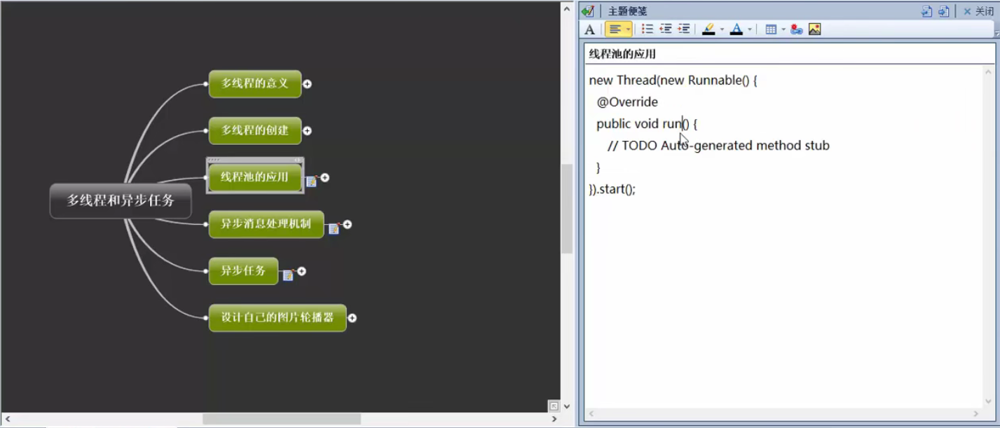


##### **newCacheThreadPool**


**结果**


**在有需要新的线程任务时，可以不必再开辟新的线程，而是从线程池已有的线程资源中使用空闲线程来处理任务，这样就再次利用了资源，而非再次申请先资源。如果线程资源不够再开辟新的资源。**  上面的Thread-1明显被回收在利用


##### **newFixedThreadPool**


**最大并发线程数只有3个，上面可以同时3条子线程并发执行，而且最大三条子线程同时执行**

**但是不是说必须是并发3个线程就休息，上面设置了最大并发数，可能在某次只有一个线程任务执行后就休息2s，也可能2个线程任务，只是最大并发数为3**


##### newSingThreadExecutor

**创建一个单线程化的线程池，它只会用唯一的工作线程来执行任务，保证所有任务按照指定顺序(FIFO, LIFO, 优先级)执行。**


##### newScheduledThreadPool

**创建一个定长线程池，支持定时及周期性任务执行**


**线程池也是个异步线程任务，通过线程池能开辟子线程来进行比较耗时的任务，而且线程管理也更方便**


#### 异步消息处理机制


##### **Handler**


**send**  发送Message对象 


##### post  发送Runnable对象到主线程

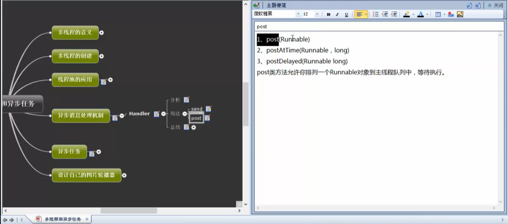


**总结**


**补充**

**view.post()**

**runOnUiThread()**


#### 异步任务

**AsyncTask类**

**为了方便在子线程中更新UI元素，引入AsyncTask类，但最后的结果是切换到UI线程中UI操作**，**本质还是回到UI线程**


**AsyncTask多线程框架**


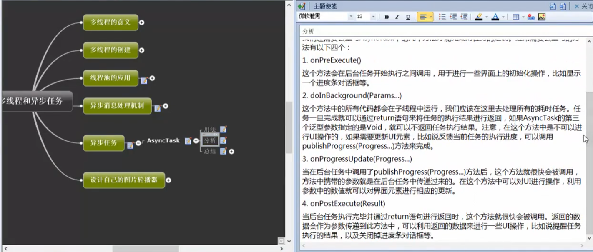


**常用方法执行顺序如下**


​																							示意图

# 2021-10-24  程序员节1024

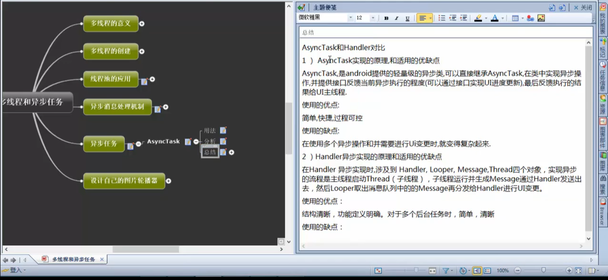


## 异步任务设计实例

**图片轮播器**


# 2021-10-25

##### public/private/protected的具体区别

**1、public：public表明该数据成员、成员函数是对所有用户开放的，所有用户都可以直接进行调用**
**2、private：private表示私有，私有的意思就是除了class自己之外，任何人都不可以直接使用。**
**3、protected：protected对于子女、朋友来说，就是public的，可以自由使用，没有任何限制，而对于其他的外部class，protected就变成private**


**2.轮播方式--构造数据源**


3、**定时自动轮播**


# 2021-11-03

## UI页面布局

五种传统布局

- **LinearLayout（线性布局）**
- **RelativeLayout（相对布局）**
- **FrameLayout（帧布局）**
- **AbsoluteLayout（绝对布局）**
- **TableLayout（表格布局）**

新布局

- **ConstraintLayout（约束布局）**


- **id：**为TextView设置一个组件id，根据id，我们可以在Java代码中通过findViewById()的方法获取到该对象，然后进行相关属性的设置，又或者使用RelativeLayout时，参考组件用的也是id！


### 一、LinearLayout（线性布局）

垂直线性布局和水平线性布局，分别表示为android:orientation="vertical"和android:orientation="horizontal"。前者表示控件以垂直方式排列，即每行放一个控件；后者表示控件按照水平方式排列，即所有控件都放在同一行，超出部分会被遮盖。

①android:layout_height属性：设置控件的高度；
②android:layout_width属性：设置控件的宽度；
关于layout_height和layout_width属性共有三种取值，fill_parent和match_parent属性表示强制性使控件扩展，条件允许的情况下，尽可能多的占满空间，wrap_parent表示显示控件的全部内容即可。
③android:layout_gravity属性：设置控件显示的位置，默认取值top，表示顶部对齐。如果希望居中对齐，可取值为center_vertical表示垂直居中，或center_horizontal表示水平居中；
④android:layout_margin属性：设置控件的上、下、左、右边框的边距；
⑤android:layout_marginBottom属性：设置控件下边框的边距，如"5.0dip"，表示5个像素；
⑥android:layout_marginLeft属性：设置控件左边框的边距；
⑦android:layout_marginRight属性：设置控件右边框的边距；
⑧android:layout_marginTop属性：设置控件的上边框的边距；
⑨android:layout_weight属性：默认为0，表示只在屏幕上占据需要显示的空间大小。若大于0，则和其他值大于0的视图按照取值的比例来分割可用空间。eg：如果屏幕上控件较为一致，可以全设置为1，则空间将会被等比划分，较为规范好看。


#### 1.方向

横向和纵向。

```cpp
android:orientation="horizontal"   //水平
android:orientation="vertical"     //垂直
```


#### 2.对齐方式

```css
android:gravity
android:layout_gravity
```

需要注意的是，这两个属性是有区别的：
 `android:gravity`是指本元素的子元素相对它的对齐方式,
 `android:layout_gravity`是指本元素相对它的父元素的对齐方式。
 相同的，对于其他属性，如果加上`layout_`前缀，就代表着本元素相对父元素的属性。

**常用的属性值：**

- `android:gravity="center_horizontal"`   子控件水平方向居中
- `android:gravity="center_vertical"`    子控件竖直方向居中
- `android:gravity="center"`    子控件竖直方向和水平方向居中
- `android:gravity= start || end || top || bottom`    子控件左对齐  ||  右对齐  ||  顶部对齐  ||  底部对齐
- `android:gravity= left || right`    子控件左对齐 ||  右对齐

这里的start和left属性，end和right属性需要注意一下，这里写的是对于中国的情况而言。实际上，他们两个是不同的，left是绝对的左边，而start会根据不同的国家习惯改变。比如在从右向左顺序阅读的国家，start代表的就是在右边

#### 3.子控件大小

```undefined
layout_height
layout_width
layout_weight
```

**属性值：**

- `layout_height= "wrap_content"`    根据子控件内容的大小决定大小   wrap:保装、包裹
- `layout_height= "match_parent"`    子控件填满父容器
- `layout_weight= "xdp"`    直接设置大小

比较特殊的：

- `layout_height= "0dp"`
- `layout_weight= "1"`
  当为0dp大小时，需要配合weight使用，表示比例

### 二、RelativeLayout 相对布局

**相对布局更随意，它可以让子控件出现在整个布局的任何位置**

#### 1.属性值为true或false

**属性和属性值：**

```css
　  android:layout_centerHrizontal 水平居中
　　android:layout_centerVertical 垂直居中
　　android:layout_centerInparent 相对于父元素完全居中
　　android:layout_alignParentBottom 贴紧父元素的下边缘
　　android:layout_alignParentLeft 贴紧父元素的左边缘
　　android:layout_alignParentRight 贴紧父元素的右边缘
　　android:layout_alignParentTop 贴紧父元素的上边缘　　


parent相对的属性
android:layout_alignParentTop  表示widget的顶部和Container的顶部对齐。
android:layout_alignParentBottom 表示widget的底部和Container的底部对齐。
android:layout_alignParentStart  表示widget的左边和Container的起始边缘对齐。
android:layout_alignParentEnd  表示widget的左边和Container的结束边缘对齐。
android:layout_alignParentLeft  表示widget的左边和Container的左边对齐。
android:layout_alignParentRight  表示widget的右边和Container的右边对齐。
android:layout_centerInParent 表示widget处于Container平面上的正中间。
android:layout_alignWithParentIfMissing
若设置true，则当该控件layout_toLeftOf, layout_toRightOf等找不到相对的参考widget时，就以父container为参考。


```

看命名就能看出这个属性是啥意思。align是排列的意思，alignParent就是排列在父容器的某个位置。


#### 2.属性值必须为id的引用名[“@id/id-name]

```css
    android:layout_below 在某元素的下方
    android:layout_above 在某元素的的上方
    android:layout_toLeftOf 在某元素的左边
    android:layout_toRightOf 在某元素的右边
    android:layout_alignTop 本元素的上边缘和某元素的的上边缘对齐
    android:layout_alignLeft 本元素的左边缘和某元素的的左边缘对齐
    android:layout_alignBottom 本元素的下边缘和某元素的的下边缘对齐    
    android:layout_alignRight 本元素的右边缘和某元素的的右边缘对齐
```

**根据另一个控件的位置来确定当前控件的位置。**

```xml
    <TextView
        android:id="@+id/tx_two"
        android:textSize="30sp"
        android:layout_width="250dp"
        android:layout_height="wrap_content"//根据子控件内容的大小决定大小
        
        // 根据控件（tx_three）的位置来设定当前控件tx_two的位置
        android:layout_below="@+id/tx_three"// 当前控件tx_two位于控件tx_three的下面
        android:layout_alignEnd="@+id/tx_three"//当前控件tx_two与控件tx_three结束边缘对齐
        android:layout_alignRight="@+id/tx_three"// 当前控件tx_two与控件tx_three右边对齐
        
        android:text="2-Hello World!"
        android:background="#0d6074" />
    <TextView
        android:id="@+id/tx_three"
        android:textSize="30sp"
        android:layout_width="wrap_content"
        android:layout_height="wrap_content"
        
        android:layout_centerInParent="true"       
        
        android:text="Hello World!"
        android:background="#a73956" />
```


**顺序是控件1--控件3--控件2**


**与widget(控件-小工具)相对的属性**

**android:layout_above				表示该widget位于参数值标识的widget的上方。**

**android:layout_below				表示该widget位于参数值标识的widget的下方。**

**android:layout_alignTop			表示该widget的顶部参数值标识的widget的顶部对齐。**

**android:layout_alignBottom	表示该widget的底部与参数值标识的widget的底部对齐。**

**android:layout_alignStart		表示该widget的起始边缘与参数值标识的widget的起始边缘对齐。**

**android:layout_alignEnd		表示该widget的结束边缘与参数值标识的widget的结束边缘对齐。**

**android:layout_alignLeft		表示该widget的左边与参数值标识的widget的左边对齐。**

**android:layout_alignRight		表示该widget的右边参数值标识的widget的右边对齐。**

**android:layout_centerHorizontal		表示widget处于Container水平方向上的中间。**

**android:layout_centerVertical		表示widget处于Container垂直方向上的中间。**

**android:layout_alignBaseline		表示该widget的BaseLine与参数值标识的widget的BaseLine对齐。**

**android:layout_toLeftOf			表示该widget位于参数值标识的widget的左方。**

**android:layout_toRightOf		表示该widget位于参数值标识的widget的右方。**

**android:layout_toStartOf		表示该widget结束边缘与参数值标识的widget的起始边缘对齐**

**android:layout_toEndOf		表示该widget起始边缘与参数值标识的widget的结束边缘对齐**


#### 3.属性值为具体的像素值，如20dip，40px

**padding和margin 关键字**

**margin 边缘 **     边缘（外边距），指该控件距离父控件或其他控件的边距；
**padding 衬垫，填充 ** 填充（内边距），指该控件内部内容，如文本/图片距离该控件的边距

```css
    android:layout_marginBottom 离某元素底边缘的距离
    android:layout_marginLeft 离某元素左边缘的距离
    android:layout_marginRight 离某元素右边缘的距离
    android:layout_marginTop 离某元素上边缘的距离
```


### 三、FrameLayout 帧布局

最简单的一种布局，没有任何定位方式，当我们往里面添加控件的时候，会默认把他们放到这块区域的左上角，帧布局的大小由控件中最大的子控件决定，如果控件的大小一样大的话，那么同一时刻就只能看到最上面的那个组件，后续添加的控件会覆盖前一个。由于帧布局的特性，它的应用场景并不是很多，不过它经常配合Fragment使用。

**帧布局，这个布局的特点是从左上角开始，后面的会覆盖前面的控件。**


#### 1.属性

```cpp
android:foreground     //设置改帧布局容器的前景图像
android:foregroundGravity     //设置前景图像显示的位置
```


### 四、ConstraintLayout  约束布局


**ConstraintLayout约束布局的含义: 根据布局中的其他元素或视图, 确定View在屏幕中的位置, 受到三类约束, 即其他视图, 父容器(parent), 基准线(Guideline).**

参考：http://blog.csdn.net/guolin_blog/article/details/53122387


## UI-控件绑定监听器

**为控件绑定监听器主要分为以下步骤：**

**1、获取代表控件的对象**
**2、定义一个类，实现监听器接口**
**3、生成监听器对象**
**4、为控件绑定监听器对象**


**Android.R.Layout：Android SDK自带的布局文件；** 

**R.Layout：自己在res目录下编写的布局。**


**实例1：Button按钮----监听器OnClickListener**

```
   <Button 
        android:id="@+id/button"
        android:layout_width="match_parent"
        android:layout_height="wrap_content"
        android:text="button"/>
```


Activity.java

```
textView.setText("set text success");
       //获取代表控件的对象
       button =(Button)findViewById(R.id.button);
       //生成监听器对象
       ButtonListener buttonListener =new ButtonListener();
       //为控件绑定监听器对象
       button.setOnClickListener(buttonListener);
    }

        //定义监听类，实现监听器接口
 class ButtonListener implements OnClickListener{

    @Override
    public void onClick(View arg0) {
        // TODO Auto-generated method stub
         textView.setText("onclick ok");
    }
```

**实例2： CheckBox复选框----监听器OnCheckedChangeListener**

```
<CheckBox 
     android:id="@+id/eat"
     android:layout_width="wrap_content"
     android:layout_height="wrap_content"
     android:text="吃饭"
    />
```

```
//获取代表控件的对象
        eatbox = (CheckBox)findViewById(R.id.eat);
      //生成监听器对象
        CheckBoxListener checkBoxListener = new CheckBoxListener();
       //为控件绑定监听器对象
        eatbox.setOnCheckedChangeListener(checkBoxListener);
    }
    　　　　//定义监听类，实现监听器接口
    class CheckBoxListener implements OnCheckedChangeListener{

        @Override
        public void onCheckedChanged(CompoundButton arg0, boolean arg1) {
            //第一参数为CheckBox对象，第二参数为是否选中
            if(arg0.getId()==R.id.eat){
                System.out.println("eat");
            }
            if(arg1){
                System.out.println("oncheck");
            }
        }
```


# 2021-11-05

## Surface

### 1、Surface的本质


**Surface本质上是一个Native Window, 并且保存着需要在屏幕上显示的数据(buffer)**


**1.1、BufferQueue**
Android通过BufferQueue管理图像图层数据的跨进程传输。BufferQueue的两端分别是图像数据的**生产者和消费者**。

**1.2、GraphicBuffer**
GraphicBuffer（简称Buffer）是BufferQueue传递的数据，一个Buffer包含一帧图像，Buffer由gralloc分配和回收。根据需求Buffer可能来源于普通内存，也可能是硬件专有内存池中的。

一个BufferQueue一般有2~3个Buffer，按需分配。Buffer传递通过文件句柄，不存在大数据的拷贝。收到Buffer的进程需要映射到虚拟地址空间才能访问，当然也可以不通过CPU访问，而是由其他硬件设备直接访问（通过DMA等）。

**1.3、Productor**
图像数据的生产者，**Surface就是一种Productor**，Surface在native层是ANativeWindow形式。

**1.4、Consumer**
图像数据的消费者，一般应用产生的图像被**SurfaceFlinger**消耗，其Layer是一种Consumer，**将Buffer转换为GL的Texture**，通过GL完成多个图层的叠加合成。

**SurfaceFlinger**是一个系统服务，这个系统服务主要实现了Surface的建立、控制、管理等功能。换种说法就是，在Android 的实现中它是一个service，提供系统范围内的surface composer功能，它能够将各种应用程序的2D、3D surface进行组合。

**1.5、SurfaceTexture**
将Buffer转换为GL的纹理（Texture），可以认为是图像数据的消费者，一般由消费者创建，等待生产者连接。

### 2、Surface的使用

**2.1、应用窗口**
应用窗口包括Activity和Dialog，他们的显示Surface都是通过请求WMS（WindowManagerService）创建，最终由SurfaceFlinger创建。

在生产者这一端，应用可以通过CPU在Canvas上作图，也可以通过转换为GLSurface，有GL作图。

消费者即为SurfaceFlinger的Layer，在hardware支持的情况下，也可能由硬件composer消耗。

**2.2、SurfaceView**
SurfaceView有独立与应用窗口的Surface，同样也可以由应用通过Canvas或者GL作图，更常见的是交由MediaCodec（视频播放）或者Camera（视频录制）填充数据。

**2.2、TextureView**
TextureView将图像数据转换为GL的Texture，并显示在应用窗口上，因此其显示的内容与应用窗口的其他元素是时间同步的。

TextureView的SurfaceTexture可以转换为Surface来使用，通过Canvas或者GL作图，也可以由MediaCodec或者Camera填充数据。

**2.3、MediaCodec**
在视频编码场景，与视频播放情况相反，由MediaCodec创建Surface，该Surface可以由应用、Camera填充数据。

**2.4、VirtualDisplay**
VirtualDisplay向Surface填充数据，由SurfaceFlinger管理，SurfaceFlinger将Layer读到到数据也通过GL叠加合成到VirtualDisplay上。如果将VirtualDisplay于TextureView结合，你将会看到图像无穷递归的科幻场景。


Surface的具体使用上，我们通常并不直接去手动创建一个Surface，尽管可以这么做，通常，我们是通过SurfaceView，GLSurfaceView间接地去创建Surface，当然，更多的时候我们在使用Surface而不自知，在Andorid的窗口实现里，每一个Window其实都会对应一个Surface，而每个Activity都会持有一个Window


### 3、Surface的生命期

3.1、BufferQueue
BufferQueue 由 SurfaceFlinger 创建，被同时创建的 IGraphicBufferrProducer 可能引用。

IGraphicBufferrProducer 被 SurfaceControl 和 Surface 持有。IGraphicBufferrProducer 由自身的引用计数管理生命期。

SurfaceControl 可以提前 destory BufferQueue ，不需要得到所有引用释放。

3.2、Native Surface
Native 层的 Surface 从 IGraphicBufferrProducer （实际是BufferQueue）创建，通过引用计数管理生命期。

3.3、Java Surface
Java Surface 持有 Native Surface 指针，并且持有一个引用计数。

Java Surface 可以从 SurfaceTexture 创建，实际是获取 SurfaceTexture  里面的 producer 来创建 Native Surface。

Java Surface 的 release 方法释放 Native Surface 指针，并减少引用计数。

Java Surface 的 destory 方法只是 release 的别名。

两个 Java Surface 可以移动持有的 Native Surface。单向的，不是交换。


Android Surface的创建涉及三个进程

1. **App 进程**
    Surface本质上是一个Native Window, 并且保存着需要在屏幕上显示的数据(buffer), 它通常包含 triple-buffers 以防止Jank。
    那么谁要创建Surface呢? 当然是App了，App需要将自己的内容显示在屏幕上，所以App负责发起Surface创建请求，创建好Surface后, 就可以直接可以在canvas上画图等，最终都会保存到Surface里的buffer里，最后由SurfaceFlinger合成并显示。
2. **System_Server进程**
    主要是其中的WindowManagerService, 负责接收APP请求，向SurfaceFlinger发起具体的请求创建Surface, 且WMS需要创建Surface的辅助管理类，如SurfaceControl。
    为什么需要与system进程打交道呢？App直接通知SurfaceFlinger创建Surface不就行了？为什么还需要通过system进程呢？个人猜想可能是统一由WMS管理，以及当前系统中的窗口的Z -order计算， 减轻SurfaceFlinger的负担。
3. **SurfaceFlinger**
    为App进程创建具体的Surface, 在SurfaceFlinger里对应成Layer, 然后负责管理、合成显示。


**Surface 是一个接口，供生产方与消耗方交换缓冲区。（官方解释）(为什么是一个接口，还能提供缓存区？？，在后面笔记中记载，Surface是一个类似于ANativeWindow结构体的数据定义形式，所以在java中surface可认为就是一个结构体，按照结构体的灵活性，里面可以添加各种类型的数据，正好surface里面就定义了存放图像数据的buffer缓存（BufferQueue），外部就可以通过访问surface来访问到保存了图像数据的BufferQueue，也就是为什么Surface被定义为借口，而且本质是一块内存的原因了吧)**

本质上，Surface就是一块内存区

Surface 对象使应用能够渲染要在屏幕上显示的图像。（意思就是Surface缓存里面的图像数据可以拿出来进行渲染处理再显示到屏幕上）

**android的文档描述Surface是“Handle onto a raw buffer that is being managed by the screen compositor”，这个描述透漏出两个信息：首先，Surface是一个raw buffer（屏幕缓冲区）的句柄，通过它去管理一个raw buffer，其次，Surface本身是由screen compositor来管理的。也就是前面提到的surface可看成结构体，这样当然可以通过句柄(指针)的方式来访问到已经被填充了数据的surface的内部的buffer数据**

**（Surface是原始图像缓冲区（raw buffer）的一个句柄，而原始图像缓冲区是由屏幕图像合成器（screen compositor）管理的。**

**就如在C语言编程一样，通过一个文件的句柄，就可以操作文件，获取文件的内容。同样的，通过Surface就可以获取raw buffer其中的内容）**


**内存句柄与指针的区别**

Surface对应了一块屏幕缓冲区，每个window对应一个Surface，任何View都是画在Surface上的，传统的view共享一块屏幕缓冲区，所有的绘制必须在UI线程中进行。


**让我们首先看一下下面的屏幕简略图**


每个应用程序可能对应着一个或者多个图形界面，而每个界面我们就称之为一个surface ，或者说是window ，在上面的图中我们能看到4 个surface，一个是home 界面，还有就是红、绿、蓝分别代表的3 个surface ，而两个button 实际是home surface 里面的内容。在这里我们能看到我们进行图形显示所需要解决的问题：

a、首先每个surface 在屏幕上有它的位置，以及大小，然后每个surface 里面还有要显示的内容，内容，大小，位置 这些元素 在我们改变应用程序的时候都可能会改变，改变时应该如何处理 ？

b、然后就各个surface 之间可能有重叠，比如说在上面的简略图中，绿色覆盖了蓝色，而红色又覆盖了绿色和蓝色以及下面的home ，而且还具有一定透明度。这种层之间的关系应该如何描述？      

我们首先来看第二个问题，我们可以想象在屏幕平面的垂直方向还有一个Z 轴，所有的surface 根据在Z 轴上的坐标来确定前后，这样就可以描述各个surface 之间的上下覆盖关系了，而这个在Z 轴上的顺序，图形上有个专业术语叫Z-order 。  

对于第一个问题，我们需要一个结构来记录应用程序界面的位置，大小，以及一个buffer 来记录需要显示的内容，**所以这就是我们surface 的概念，surface 实际我们可以把它理解成一个容器（以结构体为容器形式），这个容器记录着应用程序界面的控制信息，比如说大小啊，位置啊，而它还有buffer 来专门存储需要显示的内容。**

在这里还存在一个问题，那就是当存在图形重合的时候应该如何处理呢，而且可能有些surface 还带有透明信息，这里就是我们SurfaceFlinger 需要解决问题，它要**把各个surface 组合(compose/merge) 成一个main Surface ，最后将Main Surface 的内容发送给FB/V4l2 Output ，这样屏幕上就能看到我们想要的效果。**  在实际中对这些Surface 进行merge 可以采用两种方式，一种就是采用软件的形式来merge ，还一种就是采用硬件的方式，**软件的方式就是我们的SurfaceFlinger** ，而硬件的方式就是Overlay 。

**OverLay**

因为硬件merge 内容相对简单，我们首先来看overlay 。 Overlay 实现的方式有很多，但都需要硬件的支持。以IMX51 为例子，当IPU 向内核申请FB的时候它会申请3 个FB ，一个是主屏的，还一个是副屏的，还一个就是Overlay 的。 简单地来说，Overlay就是我们将硬件所能接受的格式数据 和控制信息送到这个Overlay FrameBuffer，由硬件驱动来负责merge Overlay buffer和主屏buffer中的内容。

一般来说现在的硬件都只支持一个Overlay，主要用在视频播放以及camera preview上，因为视频内容的不断变化用硬件Merge比用软件Merge要有效率得多，下面就是使用Overlay和不使用Overlay的过程：


**更多具体参考：**

https://blog.csdn.net/haigand/article/details/90489336


在Android系统上 android.view.Surface，Surface是view的之类


SurfaceTexture是从Android3.0（API 11）加入的一个新类。SurfaceTexture用来捕获视频流（stream）中的图像帧（image frame）的，视频流可以是相机预览或者视频解码数据。SurfaceTexture可以作为android.hardware.camera2、MediaCodec、MediaPlayer、和 VideoDecode这些类的目标视频数据输出对象。

SurfaceTexture和SurfaceView不同的是，它对图像流的处理并不直接显示，而是转为OpenGL的外部纹理，因此可用于图像流数据的二次处理（如Camera滤镜，桌面特效等）。比如Camera的预览数据，可以通过SurfaceTexture交给TextureView作为View heirachy中的一个硬件加速层来显示。首先，SurfaceTexture从图像流（来自Camera预览，视频解码，GL绘制场景等）中获得帧数据，当SurfaceTexture中有数据帧更新时，SurfaceTexture.OnFrameAvailableListener这个监听接口将会有回调，此时可以调用updateTexImage()方法从视频流数据中更新当前数据帧。并通过SurfaceTexture所绑定的OpenGL纹理对象来对其进行一些图像处理操作。

## SurfaceTexture

**SurfaceTexture拆开就是Surface+Texture，SurfaceTexture从Android系统上看：android.graphics.SurfaceTexture，隶属于grapics的图形处理类，因为它是图像处理OpenGL和surface的结合体，它类似于普通的surface，而且使用了surface，同样都是使用的结构体型的数据形式，都有BufferQueue图形数据缓存，但是区别可能就在于SurfaceTexture就是专门提供给OpenGL这个图形处理工具库使用的用来存图形数据的   数据结构。  **

**SurfaceTexture 是 Surface 和 OpenGL ES (GLES) 纹理的组合，SurfaceTexture 是用于提供输出到 GLES 纹理的接口。这和前面提到的surface一样，都是个接口，SurfaceTexture定义成和surface一样的结构体形式，那么就可以访问结构体的元素内容来获取到图形数据buffer缓存。而SurfaceTexture的Buffer缓存数据是提供到GLES（OpenGL for Embedded Systems 嵌入式OpenGL系统）进行图形数据的加工喧嚷处理。**

**SurfaceTexture 包含一个 BufferQueue。当生产方将新的缓冲区排入队列时，onFrameAvailable() 回调会通知应用。然后，应用调用 updateTexImage()，这会释放先前占有的缓冲区，从队列中获取新缓冲区并执行 EGL 调用，从而使 GLES 可将此缓冲区作为外部纹理使用。**


**BufferQueue 类是 Android 中所有图形处理操作的核心。它的作用很简单：将生成图形数据缓冲区的一方（生产方）连接到接受数据以进行显示或进一步处理的一方（消耗方）。几乎所有在系统中移动图形数据缓冲区的内容都依赖于 BufferQueue。**


**从上面看出，使用、surfacetexture就是间接使用了  Surface，而Surface就是一个Buffer缓存区**

********SurfaceTexture 就是 Surface + OpenGL的组合，surface就是个Raw的图像数据，SurfaceTexture就是surface被OpenGL渲染处理后的“surface”数据******


## SurfaceView


**简单来说，SurfaceView与Surface的联系就是，Surface是管理显示内容的数据（implementsParcelable），包括存储于数据的交换。而SurfaceView就是把这些数据显示出来到屏幕上面。**

 

-->android.view.View

​		-->android.view.SurfaceView    

public class SurfaceView extends View{}

**有一种特殊的视图，称为SurfaceView**

View通过刷新来重绘视图，Android系统通过发出VSYNC信号来进行屏幕的重绘，刷新的时间间隔为16ms

在一些需要频繁刷新，执行很多逻辑操作的时候，超过了`16ms`（60Hz一般情况、现在有高刷了，可到达120Hz以上），就会导致卡顿

SurfaceView`继承之`View`，但拥有独立的绘制表面，即它不与其宿主窗口共享同一个绘图表面，可以单独在一个线程进行绘制，并不会占用主线程的资源。这样，绘制就会比较高效，游戏，视频播放，还有最近热门的直播，都可以用`SurfaceView
Su                        rfaceView`有两个子类`GLSurfaceView`和`VideoView

`SurfaceView`和`View`的区别：

1. `View`主要适用于主动更新的情况下，而`SurfaceView`主要适用于被动更新，例如频繁地刷新
2. `View`在主线程中对画面进行刷新，而`SurfaceView`通常会通过一个子线程来进行页面的刷新
3. View在绘图时没有使用双缓冲机制，而`SufaceView`在底层实现机制中就已经实现了双缓冲机制

**如果自定义View需要频繁刷新，或者刷新时数据处理量比较大，就 可以考虑使用SurfaceView来取代View了**


SurfaceView是视图(View)的继承类，这个视图里内嵌了一个**专门用于绘制的Surface**。你可以**控制（使用SurfaceHolder控制）这个Surface的格式和尺寸**。

Surfaceview控制这个Surface的绘制位置。

​      surface是纵深排序(Z-ordered)的，这表明它总在自己所在窗口的后面。surfaceview提供了一个可见区域，只有在这个可见区域内 的surface部分内容才可见，可见区域外的部分不可见。surface的排版显示受到视图层级关系的影响，它的兄弟视图结点会在顶端显示。这意味者  surface的内容会被它的兄弟视图遮挡，这一特性可以用来放置遮盖物(overlays)(例如，文本和按钮等控件)。注意，如果surface上面 有透明控件，那么它的每次变化都会引起框架重新计算它和顶层控件的透明效果，这会影响性能。

​    **你可以通过SurfaceHolder接口访问这个surface，getHolder()方法可以得到这个接口。**

​     surfaceview变得可见时，surface被创建；surfaceview隐藏前，surface被销毁。这样能节省资源。如果你要查看  surface被创建和销毁的时机，可以重载surfaceCreated(SurfaceHolder)和  surfaceDestroyed(SurfaceHolder)。
​    surfaceview的核心在于提供了两个线程：UI线程和渲染线程。这里应注意：
​    1> 所有SurfaceView和SurfaceHolder.Callback的方法都应该在UI线程里调用，一般来说就是应用程序主线程。渲染线程所要访问的各种变量应该作同步处理。
​     2> 由于surface可能被销毁，它只在SurfaceHolder.Callback.surfaceCreated()和  SurfaceHolder.Callback.surfaceDestroyed()之间有效，所以要确保渲染线程访问的是合法有效的surface。


窗口中的view共享一个window，window又对应一个Surface，所以窗口中的view共享一个Surface，而SurfaceView拥有自己的Surface。SurfaceView会创建一个置于应用窗口之后的新窗口，**SurfaceView相当于在Window上挖一个洞，它就是显示在这个洞里**，其他的View是显示在Window上，所以View可以显示在 SurfaceView之上，也可以添加一些层在SurfaceView之上。


SurfaceView的窗口刷新的时候不需要重绘应用程序的窗口而android普通窗口的视图绘制机制是一层一层的，任何一个子元素或者是局部的刷新都会导致整个视图结构全部重绘一次。


**SurfaceView就有点画中画的意思，（我从屏幕抠一块区域出来，我单独用）SurfaceView区域有单独的管理，不和主页面共享，surfaceview的开发更高效**


**可以直接从内存或者DMA等硬件接口取得图像数据,是个非常重要的绘图容器。**

**它的特性是：可以在主线程之外的线程中向屏幕绘图上。这样可以避免画图任务繁重的时候造成主线程阻塞，从而提高了程序的反应速度。在游戏开发中多用到SurfaceView，游戏中的背景、人物、动画等等尽量在画布canvas中画出。**


**2. SurfaceView的使用模板**

`SurfaceView`使用过程有一套模板代码，大部分的`SurfaceView`都可以套用

3步走套路：

1. **创建**SurfaceView
2. 初始化SurfaceView
3. **使用**SurfaceView

------

**2.1 创建SurfaceView**

创建一个自定义的`SurfaceViewL`，继承之`SurfaceView`，并实现两个接口`SurfaceHolder.CallBack`和`Runnable`

代码：


```java
public class SurfaceViewL extends SurfaceView implements SurfaceHolder.Callback,Runnable{
    // 继承extends--并实现implements接口（callback、runnable）

    //  自建类的构造方法
    public SurfaceViewL(Context context, AttributeSet attrs) {
        super(context, attrs);
    }

    // 实现SurfaceHolder.Callback方法1
    @Override
    public void surfaceCreated(SurfaceHolder holder) {//创建
    }
 // 实现SurfaceHolder.Callback方法2
    @Override
    public void surfaceChanged(SurfaceHolder holder, int format, int width, int height) {//改变
    }
 // 实现SurfaceHolder.Callback方法3
    @Override
    public void surfaceDestroyed(SurfaceHolder holder) {//销毁
    }
 //Runnable 接口实现
    @Override
    public void run() {
    }
}
```

`SurfaceHolder.CallBack`有3个方法，分别在`SurfaceView`创建，改变，销毁时进行回调

`SurfaceHolder.CallBack`还有一个子`Callback2`接口，里面添加了一个`surfaceRedrawNeeded (SurfaceHolder holder)`方法

当需要重绘`SurfaceView`中的内容时，可以使用这个接口。目前还不了解具体的使用场景

------

**2.2 初始化`SurfaceView`**

在自定义的`SurfaceView`中，通常需要3个成员变量

1. SurfaceHolder mSurfaceHolder 可以控制`SurfaceView`的大小，格式，可以监控或者改变`SurfaceView`
2. Canvas mCanvas 画布
3. boolean isDrawing 子线程标志位，用来控制子线程

------

在构造方法中，对`SurfaceHolder mSurfaceHolder`进行初始化


```java
public SurfaceViewL(Context context, AttributeSet attrs) {
        super(context, attrs);
        init();
    }

private void init() {
        mSurfaceHolder = getHolder();//得到SurfaceHolder对象
        mSurfaceHolder.addCallback(this);//注册SurfaceHolder
        setFocusable(true);
        setFocusableInTouchMode(true);
        this.setKeepScreenOn(true);//保持屏幕长亮
}
```

- `setFocusable(true)` 能否获得焦点
- `setFocusableInTouchMode(true)` 能否通过触摸获得焦点

这两个方法都是`View`类的方法，可以看看[setFocusable与setFocusableInTouchMode差异以及clickable](https://link.jianshu.com?t=http%3A%2F%2Fblog.csdn.net%2Fu011682673%2Farticle%2Fdetails%2F51549639)

------

**2.3 使用SurfaceView**

利用在2.2拿到的`mSurfaceHolder`对象，通过`lockCanvas()`方法获得当前的`Canvas`

**注意：**
 `lockCanvas()`获取到的`Canvas`对象还是上次的`Canvas`对象，并不是一个新的对象。之前的绘图都将被保留，如果需要擦除，可以在绘制之前通过`drawColor()`方法来进行清屏

绘制要充分利用`SurfaceView`的三个回调方法，在`surfaceCreate()`方法中开启子线程进行绘制。在子线程中，使用一个`while(isDrawing)`循环来不停地绘制。具体的绘制过程，由`lockCanvas()`方法进行绘制，并通过`unlockCanvasAndPost(mCanvas)`进行画布内容的提交

------

**2.4 完整的模板代码**


```java
public class SurfaceViewL extends SurfaceView implements SurfaceHolder.Callback, Runnable {
    // SurfaceHolder
    private SurfaceHolder mSurfaceHolder;
    // 画布
    private Canvas mCanvas;
    // 子线程标志位
    private boolean isDrawing;

    public SurfaceViewL(Context context, AttributeSet attrs) {
        super(context, attrs);
        init();
    }

    private void init() {
        mSurfaceHolder = getHolder();
        mSurfaceHolder.addCallback(this);
        setFocusable(true);
        setFocusableInTouchMode(true);
        this.setKeepScreenOn(true);
    }
// 在surface创建时被调用，一般在这个方法里面开启渲染屏幕的线程。
    @Override
    public void surfaceCreated(SurfaceHolder holder) {//创建
        isDrawing = true;
        new Thread(this).start();
    }

    @Override
    // surface发生改变时被调用
    public void surfaceChanged(SurfaceHolder holder, int format, int width, int height) {//改变

    }

     // 销毁时被调用，一般在这个方法里将渲染的线程停止
    @Override
    public void surfaceDestroyed(SurfaceHolder holder) {//销毁
        isDrawing = false;
    }

    @Override
    public void run() {
        while (isDrawing){
            drawing();
        }
    }

    private void drawing() {
        try {
           mCanvas = mSurfaceHolder.lockCanvas();
           //这里进行内容的绘制 
           ...
           
        }finally {
           if (mCanvas != null){
               mSurfaceHolder.unlockCanvasAndPost(mCanvas);
           }
        }
    }
}
```

`mSurfaceHolder.unlockCanvasAndPost(mCanvas)`将这行代码放入`finally`代码块中，目的是为了确保内容都能够被提交


#### **SurfaceView实现**

首先继承SurfaceView并实现SurfaceHolder.Callback接口
**使用接口的原因**：因为使用SurfaceView 有一个原则，所有的绘图工作必须得在Surface 被创建之后才能开始(Surface—表面，这

个概念在 图形编程中常常被提到。基本上我们可以把它当作显存的一个映射，写入到Surface 的内容可以被直接复制到显存从而显

示出来，这使得显示速度会非常快)，而在Surface 被销毁之前必须结束。所以Callback  中的surfaceCreated 和surfaceDestroyed 

就成了绘图处理代码的边界。


**SurfaceHolder 是控制 surface 的一个抽象接口，**你可以通过 SurfaceHolder 来控制 surface 的尺寸和格式，或者修改 surface 的

像素，监视 surface 的变化等等，SurfaceHolder 是 SurfaceView 的典型接口。


需要重写的方法

　（1）public void surface**Changed**(SurfaceHolder holder,int format,int width,int height){}

　  //**在surface的大小发生改变时激发**

　（2）public void surface**Created**(SurfaceHolder holder){}

　  //**在创建时激发**，一般在这里调用画图的线程。

　（3）public void surface**Destroyed**(SurfaceHolder holder) {}

　  //**销毁时激发**，一般在这里将画图的线程停止、释放。

整个过程：

1、继承SurfaceView并实现SurfaceHolder.Callback接口 ----> 

2、SurfaceView.getHolder()获得SurfaceHolder对象  ---->

3、SurfaceHolder.addCallback(callback)添加回调函数---->

4、SurfaceHolder.lockCanvas()获得Canvas对象并锁定画布---->

5 、Canvas绘画 ---->

6、SurfaceHolder.unlockCanvasAndPost(Canvas  canvas)结束锁定画图，并提交改变，将图形显示。


**SurfaceHolder**
这里用到了一个类SurfaceHolder,可以把它当成surface的控制器，用来操纵surface。处理它的Canvas上画的效果和动画，控制表

面，大小，像素等。

几个需要注意的方法：

(1)、abstract void addCallback(SurfaceHolder.Callback callback);

// 给SurfaceView当前的持有者一个回调对象。

(2)、abstract Canvas lockCanvas();

// 锁定画布，一般在锁定后就可以通过其返回的画布对象Canvas，在其上面画图等操作了。

(3)、abstract Canvas lockCanvas(Rect dirty);

// 锁定画布的某个区域进行画图等..因为画完图后，会调用下面的unlockCanvasAndPost来改变显示内容。

// 相对部分内存要求比较高的游戏来说，可以不用重画dirty外的其它区域的像素，可以提高速度。

(4)、abstract void unlockCanvasAndPost(Canvas canvas);

// 结束锁定画图，并提交改变。

 1 package xl.test;
 2 
 3 import android.app.Activity;
 4 import android.content.Context;
 5 import android.graphics.Canvas;
 6 import android.graphics.Color;
 7 import android.graphics.Paint;
 8 import android.graphics.Rect;
 9 import android.os.Bundle;
 10 import android.view.SurfaceHolder;
 11 import android.view.SurfaceView;
 12 
 13 public class ViewTest extends Activity {
 14   /** Called when the activity is first created. */
 15   @Override
 16   public void onCreate(Bundle savedInstanceState) {
 17     super.onCreate(savedInstanceState);
 18     setContentView(new MyView(this));
 19   }
 20   //视图内部类
 21   class MyView extends SurfaceView implements SurfaceHolder.Callback
 22   {
 23     private SurfaceHolder holder;
 24     private MyThread myThread; 
 25     public MyView(Context context) {
 26       super(context);
 27       // TODO Auto-generated constructor stub
 28       holder = this.getHolder();
 29       holder.addCallback(this);
 30       myThread = new MyThread(holder);//创建一个绘图线程
 31     }
 32 
 33     @Override
 34     public void surfaceChanged(SurfaceHolder holder, int format, int width,
 35         int height) {
 36       // TODO Auto-generated method stub
 37       
 38     }
 39 
 40     @Override
 41     public void surfaceCreated(SurfaceHolder holder) {
 42       // TODO Auto-generated method stub
 43       myThread.isRun = true;
 44       myThread.start();
 45     }
 46 
 47     @Override
 48     public void surfaceDestroyed(SurfaceHolder holder) {
 49       // TODO Auto-generated method stub
 50       myThread.isRun = false;
 51     }
 52     
 53   }
 54   //线程内部类
 55   class MyThread extends Thread
 56   {
 57     private SurfaceHolder holder;
 58     public boolean isRun ;
 59     public MyThread(SurfaceHolder holder)
 60     {
 61       this.holder =holder; 
 62       isRun = true;
 63     }
 64     @Override
 65     public void run()
 66     {
 67       int count = 0;
 68       while(isRun)
 69       {
 70         Canvas c = null;
 71         try
 72         {
 73           synchronized (holder)
 74           {
 75             c = holder.lockCanvas();//锁定画布，一般在锁定后就可以通过其返回的画布对象Canvas，在其上面画图等操作了。
 76             c.drawColor(Color.BLACK);//设置画布背景颜色
 77             Paint p = new Paint(); //创建画笔
 78             p.setColor(Color.WHITE);
 79             Rect r = new Rect(100, 50, 300, 250);
 80             c.drawRect(r, p);
 81             c.drawText("这是第"+(count++)+"秒", 100, 310, p);
 82             Thread.sleep(1000);//睡眠时间为1秒
 83           }
 84         }
 85         catch (Exception e) {
 86           // TODO: handle exception
 87           e.printStackTrace();
 88         }
 89         finally
 90         {
 91           if(c!= null)
 92           {
 93             holder.unlockCanvasAndPost(c);//结束锁定画图，并提交改变。
 94 
 95           }
 96         }
 97       }
 98     }
 99   }
100 }


## Android控件TextView的实现原理分析

在前面一个系列的文章中，我们以窗口为单位，分析了WindowManagerService服务的实现。同时，在再前面一个系列的文章中，我们又分析了窗口的组成。简单来说，窗口就是由一系列的视图按照一定的布局组织起来的。实际上，**每一个视图都是一个控件**，**这些控制可以将自己的UI绘制在窗口的绘图表面上，同时还可以与用户进行交互，即获得用户的键盘或者触摸屏输入**。在本文中，我们就详细分析窗口控件的上述实现原理。

*UI控件之一是：TextView(文本框)，用于显示文本的一个控件*

由于Android系统提供的控件比较多，因此我们只能挑一个比较有代表的控件进行分析。这个比较有代表性的控件便是TextView，其它的一些基础控件，例如Button、EditText和CheckBox等，都是直接或者间接地以它为父类的。每一个控件的实现都是相当复杂的，不过基本上都是一些细节问题，而且不同的控件有不同的实现细节，因此，本文并不打算详细地分析TextView的具体实现，而是从所有控件为了实现自己的功能而需要的东西出发，去分析TextView的实现框架。

    那么，控件为了实现自己的功能而需要的东西是什么呢？有两个材料是必不可少的。
    第一个材料是画布，
    第二个材料是用户输入。
    有画布才能绘制UI，而有用户输入才能与用户进行交互。因此，接下来我们主要分析TextView的绘制流程，以及它获得用户输入的过程。用户输入主要包括键盘输入以及触摸屏输入，本文主要关注的是键盘输入。触摸屏输入与键盘输入的获取过程是类似的，读者如果有兴趣的话，可以参照本文的内容来自己研究一下。
    
    从前面Android应用程序窗口（Activity）实现框架简要介绍和学习计划这个系列的文章可以知道，应用程序窗口，即Activity窗口，是由一个PhoneWindow对象，一个DecorView对象，以及一个ViewRoot对象来描述的。其中，PhoneWindow对象用来描述窗口对象，DecorView对象用来描述窗口的顶层视图，ViewRoot对象除了用来与WindowManagerService服务通信之外，还用来接收用户输入。窗口控件本身也是一个视图，即一个View对象，它们是以树形结构组织在一起形成整个窗口的UI的。为了简单起见，本文假设要分析的TextView控件是直接以窗口的顶层视图为父视图的，即以DecorView为父视图，如图1所示：


​                                       **图1 窗口结构示意图以及DecorView、TextView的类关系图**

图1显示的是一个包含了TextView控件的Activity窗口的结构示意图以及DecorView、TextView的简单类关系图，从中可以看出：

        1. 用户输入首先是由ViewRoot接收，然后再分发给TextView处理；
    
        2. DecorView是一个视图容器，因此，它是从ViewGroup继承下来，而ViewGroup本身又是从View继承下来的；
    
        3. TextView是一个简单视图，因此，它是直接继承了View。
    
        接下来，我们就以图1所示的Activity窗口为例，来分析TextView控件的UI绘制框架及其获得键盘输入的过程。
    
        一. TextView控件的UI绘制框架
    
        从前面Android应用程序窗口（Activity）的测量（Measure）、布局（Layout）和绘制（Draw）过程分析一文可以知道，Activity窗口的UI绘制操作分为三步来走，分别是测量、布局和绘制。
更多：

[(30条消息) Android控件TextView的实现原理分析_老罗的Android之旅-CSDN博客](https://blog.csdn.net/luoshengyang/article/details/8636153)


## Android视图SurfaceView的实现原理分析

 在Android系统中，**有一种特殊的视图，称为SurfaceView**，它拥有独立的绘图表面，即它不与其宿主窗口共享同一个绘图表面。由于拥有独立的绘图表面，因此SurfaceView的UI就可以在一个独立的线程中进行绘制。又由于不会占用主线程资源，SurfaceView一方面可以实现复杂而高效的UI，另一方面又不会导致用户输入得不到及时响应。在本文中，我们就详细分析SurfaceView的实现原理。

 在前面Android控件TextView的实现原理分析一文中提到，普通的Android控件，例如TextView、Button和CheckBox等，它们都是将自己的UI绘制在宿主窗口的绘图表面之上，这意味着它们的UI是在应用程序的主线程中进行绘制的。由于应用程序的主线程除了要绘制UI之外，还需要及时地响应用户输入，否则的话，系统就会认为应用程序没有响应了，因此就会弹出一个ANR对话框出来。对于一些游戏画面，或者摄像头预览、视频播放来说，它们的UI都比较复杂，而且要求能够进行高效的绘制，因此，它们的UI就不适合在应用程序的主线程中进行绘制。这时候就必须要给那些需要复杂而高效UI的视图生成一个独立的绘图表面，以及使用一个独立的线程来绘制这些视图的UI。

    在前面Android应用程序与SurfaceFlinger服务的关系概述和学习计划和Android系统Surface机制的SurfaceFlinger服务简要介绍和学习计划这两个系统的文章中，我们主要分析了Android应用程序窗口是如何通过SurfaceFlinger服务来绘制自己的UI的。一般来说，每一个窗口在SurfaceFlinger服务中都对应有一个Layer，用来描述它的绘图表面。对于那些具有SurfaceView的窗口来说，每一个SurfaceView在SurfaceFlinger服务中还对应有一个独立的Layer或者LayerBuffer，用来单独描述它的绘图表面，以区别于它的宿主窗口的绘图表面。
    
    无论是LayerBuffer，还是Layer，它们都是以LayerBase为基类的，也就是说，SurfaceFlinger服务把所有的LayerBuffer和Layer都抽象为LayerBase，因此就可以用统一的流程来绘制和合成它们的UI。由于LayerBuffer的绘制和合成与Layer的绘制和合成是类似的，因此本文不打算对LayerBuffer的绘制和合成操作进行分析。需要深入理解LayerBuffer的绘制和合成操作的，可以参考Android应用程序与SurfaceFlinger服务的关系概述和学习计划和Android系统Surface机制的SurfaceFlinger服务简要介绍和学习计划这两个系统的文章。
    
    为了接下来可以方便地描述SurfaceView的实现原理分析，我们假设在一个Activity窗口的视图结构中，除了有一个DecorView顶层视图之外，还有两个TextView控件，以及一个SurfaceView视图，这样该Activity窗口在SurfaceFlinger服务中就对应有两个Layer或者一个Layer的一个LayerBuffer，如图1所示：


 在图1中，Activity窗口的顶层视图DecorView及其两个TextView控件的UI都是绘制在SurfaceFlinger服务中的同一个Layer上面的，而SurfaceView的UI是绘制在SurfaceFlinger服务中的另外一个Layer或者LayerBuffer上的。

         注意，用来描述SurfaceView的Layer或者LayerBuffer的Z轴位置是小于用来其宿主Activity窗口的Layer的Z轴位置的，但是前者会在后者的上面挖一个“洞”出来，以便它的UI可以对用户可见。实际上，SurfaceView在其宿主Activity窗口上所挖的“洞”只不过是在其宿主Activity窗口上设置了一块透明区域。
    
        从总体上描述了SurfaceView的大致实现原理之后，接下来我们就详细分析它的具体实现过程，包括它的绘图表面的创建过程、在宿主窗口上面进行挖洞的过程，以及绘制过程。
    
        1. SurfaceView的绘图表面的创建过程
    
        由于SurfaceView具有独立的绘图表面，因此，在它的UI内容可以绘制之前，我们首先要将它的绘图表面创建出来。尽管SurfaceView不与它的宿主窗口共享同一个绘图表面，但是它仍然是属于宿主窗口的视图结构的一个结点的，也就是说，SurfaceView仍然是会参与到宿主窗口的某些执行流程中去。
    
        从前面Android应用程序窗口（Activity）的绘图表面（Surface）的创建过程分析一文可以知道，每当一个窗口需要刷新UI时，就会调用ViewRoot类的成员函数performTraversals。ViewRoot类的成员函数performTraversals在执行的过程中，如果发现当前窗口的绘图表面还没有创建，或者发现当前窗口的绘图表面已经失效了，那么就会请求WindowManagerService服务创建一个新的绘图表面，同时，它还会通过一系列的回调函数来让嵌入在窗口里面的SurfaceView有机会创建自己的绘图表面。
 接下来，我们就从ViewRoot类的成员函数performTraversals开始，分析SurfaceView的绘图表面的创建过程，如图2所示：


  这个过程可以分为8个步骤，接下来我们就详细分析每一个步骤。

[(29条消息) Android视图SurfaceView的实现原理分析_老罗的Android之旅-CSDN博客_android surfaceview原理](https://blog.csdn.net/luoshengyang/article/details/8661317/)


# 2021-11-06

## ANativeWindow 是什么

ANativeWindow是C/C++中定义的一个结构体,等同于Java中的`Surface`.

（）

Android NDK中可以访问到ANativeWindow.

ANativeWindow中存放像素信息的结构是:`ANativeWindow_Buffer`:


**struct ANativeWindow**
{
   .....

   //上层定义好函数指针，传给opengl后，opengl在必要的时候会调用相应的函数
   int      (* dequeueBuffer )( struct ANativeWindow * window ,
                struct ANativeWindowBuffer ** buffer , int * fenceFd );

   int      (* queueBuffer )( struct ANativeWindow * window ,
                struct ANativeWindowBuffer * buffer , int fenceFd );

   int      (* cancelBuffer )( struct ANativeWindow * window ,
                struct ANativeWindowBuffer * buffer , int fenceFd );
}

ANativeWindowBuffer:绘制的图像缓冲区
**struct ANativeWindowBuffer**
{
    int width ;
    int height ;
    int usage ;
     .....
   //通过这个handle就跟Gralloc模块申请的图片缓存关联起来了，可能在fb申请也能是共享内存中申请的（看他了 usage ）
    buffer_handle_t handle ; 
}


## **内存句柄与指针的区别**

**句柄其实就是指针**，但是他和指针最大的不同是:给你一个指针，你可以通过这个指针做任何事情，也许是好事，也许是通过这个指针破坏内存，干一些捣乱的事情。这个我想大家都会碰到过，因为乱用指针导致程序崩溃
    句柄就没有这个缺点，通过句柄，你只能干一些windows让你干的事情（调用一些api函数等等），没有了指针的坏处。

**句柄是一些表的索引也就是指向指针的指针,句柄和指针都是地址**，句柄是Windows编程的一个关键性的概念，编写Windows应用程序总是要和各种句柄打交道。
所谓句柄，就是一个唯一的数，用以标识许多不同的对象类型，如窗口、菜单、内存、画笔、画刷等。在Win32里，句柄是指向一个“无类型对象”(void*)的指针，也就是一个4字节长的数据。
无论它的本质是什么，句柄并不是一个真正意义上的指针。从构造上看，句柄是一个指针，尽管它没有指向用于存储某个对象的内存位置。事实上，句柄指向一个包含了对该对象进行的引用的位置。
句柄的声明是这样的：
typedef void *HANDLE
由于Windows是一个多任务操作系统，它可以同时运行多个程序或一个程序的多个副本。这些运行的程序称为一个实例。为了对同一程序的多个副本进行管理，Windows引入了实例句柄。Windows为每个应用程序建立一张表，实例句柄就好象是这张表的一个索引。
不同在于：
  1、句柄所指的可以是一个很复杂的结构，并且很有可以是与系统有关的，比如说上面所说的线程的句柄，它指向的就是一个类或者结构，他和系统有很密切的关系，当一个线程由于不可预料的原因，而终止时在系统就可以回它所占用的资料，如CPU，内存等等，反过来想可以知道，这个句柄中的某一些项，是与系统进行交互的。由于Windows系统，是一个多任务的系统，它随时都可能要分配内存，回收内存，重组内存。
  2、指针它也可以指向一个复杂的结构，但是通常是用户定义的，所以的必需的工作都要用户完成，特别是在删除的时候。但在VC＋＋6.0中也有一些指针，它们都是处理一些小问题才用的，如最常见的字符的指针,它也是要用户处理的如果你动态分配了内存；但是Cstring 就不要用户处理了，它其实是VC＋＋中的一个类，所以的操作都由成员函数完成，产生（分配）由构造函数，删除（回收）由析构函数完成。


纹理是由于物体表面的物理属性的多样性而造成的,物理属性不同表示某个特定表

面特征的灰度或者颜色信息不同,不同的物理表面会产生不同的纹理图像,因而纹理作

为图像的一个极为重要的属性,在计算机视觉和图像处理中占有举足轻重的地位。纹理

是图像中特征值强度的某种局部重复模式的宏观表现。然而,对于自然纹理图像而言

这种重复模式往往是近似的和复杂的,难以用语言描述,而人类对纹理的感受多是与心

理效果相结合的,因此,迄今都没有一个对纹理的正式的、广泛认可的和一致的定义。


一点拙见，从模型的角度看，图像是以像素值矩阵呈现的，所以色彩、纹理都“隐藏”在像素值之中，纹理可能是比像素值矩阵高级一点的语义理解和总结。换句话说纹理是在描述若干像素点之间的关系，但最终都是依托像素值矩阵来表达的，在理解时也不能与像素值割裂开。这是我的一点理解。


**手机直播需要实现的无非是将手机采集到的视频和音频经过处理后以一定的格式发送到服务器端，整个过程如下所示：**

直播推流SDK开发工具库手册：

https://cloud.tencent.com/document/product/454/56610


RTMP是Real Time Messaging Protocol（实时消息传输[协议](https://baike.baidu.com/item/协议/13020269)）的首字母缩写。该协议基于TCP，是一个协议族，包括RTMP基本协议及RTMPT/RTMPS/RTMPE等多种变种。RTMP是一种设计用来进行实时数据通信的网络协议，主要用来在Flash/AIR平台和支持RTMP协议的流媒体/交互服务器之间进行音视频和数据通信。支持该协议的软件包括Adobe Media Server/Ultrant Media Server/red5等。RTMP与HTTP一样，都属于TCP/IP四层模型的应用层。


RTMP(Real Time Messaging Protocol)实时消息传送协议是[Adobe](https://baike.baidu.com/item/Adobe) Systems公司为Flash播放器和服务器之间音频、视频和数据传输 开发的开放协议。


# 2021-11-09

# 生产者/消费者问题

生产者和消费者问题是线程模型中的经典问题：生产者和消费者在同一时间段内共用同一个存储空间，如下图所示，生产者向空间

里存放数据，而消费者取用数据，如果不加以协调可能会出现以下情况：

存储空间已满，而生产者占用着它，消费者等着生产者让出空间从而去除产品，生产者等着消费者消费产品，从而向空间中添加产

品。互相等待，从而发生死锁。


# 2021-11-11

YUV 是一种颜色编码方法，和它等同的还有 RGB 颜色编码方法。

#  YUV 的采样与格式

**RGB 颜色编码**

RGB 三个字母分别代表了 红（Red）、绿（Green）、蓝（Blue），这三种颜色称为 **三原色**，将它们以不同的比例相加，可以产生多种多样的颜色。

在图像显示中，一张 1280 * 720 大小的图片，就代表着它有 1280 * 720 个像素点。其中每一个像素点的颜色显示都采用 RGB 编码方法，将 RGB 分别取不同的值，就会展示不同的颜色。


RGB 图像中，每个像素点都有红、绿、蓝三个原色，其中每种原色都占用 8 bit，也就是一个字节，那么一个像素点也就占用 24 bit，也就是三个字节。

一张 1280 * 720 大小的图片，就占用 1280 * 720 * 3 / 1024 / 1024 = 2.63 MB 存储空间。

**YUV 颜色编码**

YUV 颜色编码采用的是 **明亮度** 和 **色度** 来指定像素的颜色。

其中，Y 表示明亮度（Luminance、Luma），而 U 和 V 表示色度（Chrominance、Chroma）。

而色度又定义了颜色的两个方面：色调和饱和度。

使用 YUV 颜色编码表示一幅图像，它应该下面这样的：


和 RGB 表示图像类似，每个像素点都包含 Y、U、V 分量。但是它的 Y 和 UV 分量是可以分离的，如果没有 UV 分量一样可以显示完整的图像，只不过是黑白的。

对于 YUV 图像来说，并不是每个像素点都需要包含了 Y、U、V 三个分量，根据不同的采样格式，可以每个 Y 分量都对应自己的 UV 分量，也可以几个 Y 分量共用 UV 分量。

**RGB 到 YUV 的转换**

对于图像显示器来说，它是通过 RGB 模型来显示图像的，而在传输图像数据时又是使用 YUV 模型，这是因为 YUV 模型可以节省带宽。因此就需要采集图像时将 RGB 模型转换到 YUV 模型，显示时再将 YUV 模型转换为 RGB 模型。

RGB 到 YUV 的转换，就是将图像所有像素点的 R、G、B 分量转换到 Y、U、V 分量。

有如下公式进行转换：


此时的转换结束后，每个像素点都有完整的 Y、U、V 分量。而之前提到 Y 和 UV 分量是可以分离的，接下来通过不同的采样方式，可以将图像的 Y、U、V 分量重新组合。

接下来的不同采样格式都是在一张图像所有像素的 RGB 转换到 YUV 基础上进行的。

**YUV 采样格式**

YUV 图像的主流采样方式有如下三种：

- YUV 4:4:4 采样
- YUV 4:2:2 采样
- YUV 4:2:0 采样

**YUV 4:4:4 采样**

YUV 4:4:4 采样，意味着 Y、U、V 三个分量的采样比例相同，因此在生成的图像里，每个像素的三个分量信息完整，都是 8 bit，也就是一个字节。

如下图所示：


其中，Y 分量用叉表示，UV 分量用圆圈表示。

```
举个例子 ：

假如图像像素为：[Y0 U0 V0]、[Y1 U1 V1]、[Y2 U2 V2]、[Y3 U3 V3]

那么采样的码流为：Y0 U0 V0 Y1 U1 V1 Y2 U2 V2 Y3 U3 V3 

最后映射出的像素点依旧为 [Y0 U0 V0]、[Y1 U1 V1]、[Y2 U2 V2]、[Y3 U3 V3] 
```

可以看到这种采样方式的图像和 RGB 颜色模型的图像大小是一样，并没有达到节省带宽的目的，当将 RGB 图像转换为 YUV 图像时，也是先转换为 YUV 4:4:4 采样的图像。

**YUV 4:2:2 采样**

YUV 4:2:2 采样，意味着 UV 分量是 Y 分量采样的一半，Y 分量和 UV 分量按照 2 : 1 的比例采样。如果水平方向有 10 个像素点，那么采样了 10 个 Y 分量，而只采样了 5 个 UV 分量。

如下图所示：


其中，Y 分量用叉表示，UV 分量用圆圈表示。

```
 举个例子 ：

 假如图像像素为：[Y0 U0 V0]、[Y1 U1 V1]、[Y2 U2 V2]、[Y3 U3 V3]

 那么采样的码流为：Y0 U0 Y1 V1 Y2 U2 Y3 V3 

 其中，每采样过一个像素点，都会采样其 Y 分量，而 U、V 分量就会间隔一个采集一个。

 最后映射出的像素点为 [Y0 U0 V1]、[Y1 U0 V1]、[Y2 U2 V3]、[Y3 U2 V3]
```

采样的码流映射为像素点，还是要满足每个像素点有 Y、U、V 三个分量。但是可以看到，第一和第二像素点公用了 U0、V1 分量，第三和第四个像素点公用了 U2、V3 分量，这样就节省了图像空间。

一张 1280 * 720 大小的图片，在 YUV 4:2:2 采样时的大小为：

> （1280 * 720 * 8 + 1280 * 720 * 0.5 * 8 * 2）/ 8 / 1024 / 1024 = 1.76 MB 。

可以看到 YUV 4:2:2 采样的图像比 RGB 模型图像节省了三分之一的存储空间，在传输时占用的带宽也会随之减少。

**YUV 4:2:0 采样**

YUV 4:2:0 采样，并不是指只采样 U 分量而不采样 V 分量。而是指，在每一行扫描时，只扫描一种色度分量（U 或者 V），和 Y 分量按照 2 : 1 的方式采样。比如，第一行扫描时，YU 按照 2 : 1 的方式采样，那么第二行扫描时，YV 分量按照 2:1 的方式采样。对于每个色度分量来说，它的水平方向和竖直方向的采样和 Y 分量相比都是 2:1 。

如下图所示：


其中，Y 分量用叉表示，UV 分量用圆圈表示。

假设第一行扫描了 U 分量，第二行扫描了 V 分量，那么需要扫描两行才能够组成完整的 UV 分量。

```
举个例子 ：

假设图像像素为：

[Y0 U0 V0]、[Y1 U1 V1]、 [Y2 U2 V2]、 [Y3 U3 V3]
[Y5 U5 V5]、[Y6 U6 V6]、 [Y7 U7 V7] 、[Y8 U8 V8]

那么采样的码流为：Y0 U0 Y1 Y2 U2 Y3 Y5 V5 Y6 Y7 V7 Y8

其中，每采样过一个像素点，都会采样其 Y 分量，而 U、V 分量就会间隔一行按照 2 : 1 进行采样。

最后映射出的像素点为：

[Y0 U0 V5]、[Y1 U0 V5]、[Y2 U2 V7]、[Y3 U2 V7]
[Y5 U0 V5]、[Y6 U0 V6]、[Y7 U2 V7]、[Y8 U2 V8]
```

从映射出的像素点中可以看到，四个 Y 分量是共用了一套 UV 分量，而且是按照 2*2 的小方格的形式分布的，相比 YUV 4:2:2 采样中两个 Y 分量共用一套 UV 分量，这样更能够节省空间。

一张 1280 * 720 大小的图片，在 YUV 4:2:0 采样时的大小为：

> （1280 * 720 * 8 + 1280 * 720 * 0.25 * 8 * 2）/ 8 / 1024 / 1024 = 1.32 MB 。

可以看到 YUV 4:2:0 采样的图像比 RGB 模型图像节省了一半的存储空间，因此它也是比较主流的采样方式。

**YUV 存储格式**

说完了采样，接下来就是如何把采样的数据存储起来。

YUV 的存储格式，有两种：

- planar  平面格式

- - 指先连续存储所有像素点的 Y 分量，然后存储 U 分量，最后是 V 分量。

- packed  打包模式

- - 指每个像素点的 Y、U、V 分量是连续交替存储的。

根据采样方式和存储格式的不同，就有了多种 YUV 格式。这些格式主要是基于 YUV 4:2:2 和 YUV 4:2:0 采样。

常见的基于 YUV 4:2:2 采样的格式如下表：

| YUV 4:2:2 采样 |
| :------------- |
| YUYV 格式      |
| UYVY 格式      |
| YUV 422P 格式  |

常见的基于 YUV 4:2:0 采样的格式如下表：

|                | YUV 4:2:0 采样 | YUV 4:2:0 采样 |
| :------------- | :------------- | :------------- |
| YUV 420P 类型  | YV12 格式      | YU12 格式      |
| YUV 420SP 类型 | NV12 格式      | NV21 格式      |

更多的 YUV 格式信息参考这里：YUV pixel formats

**基于 YUV 4:2:2  采样的格式**

YUV 4:2:2 采样规定了 Y 和 UV 分量按照 2: 1 的比例采样，两个 Y 分量公用一组 UV 分量。

**YUYV 格式**

YUYV 格式是采用打包格式进行存储的，指每个像素点都采用 Y 分量，但是每隔一个像素采样它的 UV 分量，排列顺序如下：

> Y0 UO Y1 V0  Y2 U2 Y3 V2

Y0 和 Y1 公用 U0 V0 分量，Y2 和 Y3 公用 U2 V2 分量….


**UYVY 格式**

UYVY 格式也是采用打包格式进行存储，它的顺序和 YUYV 相反，先采用 U 分量再采样 Y 分量，排列顺序如下：

> U0 Y0 V0 Y1 U2 Y2 V2 Y3

Y0 和 Y1 公用 U0 V0 分量，Y2 和 Y3 公用 U2 V2 分量….

根据 UV 和 Y 的顺序还有其他格式，比如，YVYU 格式，VYUY 格式等等，原理大致一样了。


**YUV 422P 格式**

YUV 422P 格式，又叫做 I422，采用的是平面格式进行存储，先存储所有的 Y 分量，再存储所有的 U 分量，再存储所有的 V 分量。

**基于 YUV 4:2:0  采样的格式**

基于 YUV 4:2:0 采样的格式主要有 YUV 420P 和 YUV 420SP 两种类型，每个类型又对应其他具体格式。

- YUV 420P 类型

- - YU12 格式
  - YV12 格式

- YUV 420SP 类型

- - NV12 格式
  - NV21 格式

YUV 420P 和 YUV 420SP 都是基于  Planar 平面模式 进行存储的，先存储所有的 Y 分量后， YUV420P 类型就会先存储所有的 U 分量或者 V 分量，而 YUV420SP 则是按照 UV 或者 VU 的交替顺序进行存储了，具体查看看下图：

YUV420SP 的格式：


YUV420P 的格式：


**YU12 和 YV12 格式**

YU12 和 YV12 格式都属于 YUV 420P 类型，即先存储 Y 分量，再存储 U、V 分量，区别在于：YU12 是先 Y 再 U 后 V，而 YV12 是先 Y 再 V 后 U 。

YV 12 的存储格式如下图所示：


YU 12 又称作 I420 格式，它的存储格式就是把 V 和 U 反过来了。

**NV12 和 NV21 格式**

NV12 和 NV21 格式都属于 YUV420SP 类型。它也是先存储了 Y 分量，但接下来并不是再存储所有的 U 或者 V 分量，而是把 UV 分量交替连续存储。

NV12 是 IOS 中有的模式，它的存储顺序是先存 Y 分量，再 UV 进行交替存储。


NV21 是 安卓 中有的模式，它的存储顺序是先存 Y 分量，在 VU 交替存储。

####  Android上如何使用工具库--Libyuv

https://www.jianshu.com/p/bd0feaf4c0f9

 libyuv并不能直接为Android开发直接进行使用，需要对它进行编译的操作。在这里介绍的是使用Android Studio的Cmake的方式进行libyuv的编译操作，首先从官方网站[Libyuv](https://link.jianshu.com?t=https://chromium.googlesource.com/libyuv/libyuv/)上下载libyuv库，下载的目录结构如下


libyuv.png


  如果无法下载的话，也可以从我文章最后的demo中去进行拷贝。新键Android项目，并且创建的时候勾选项include C++ Support，也就是改android项目支持C,C++的编译，如果对于Android Stuido如何支持C,C++编译不清楚的，请自行百度谷歌，这里就不多细说。项目创建之后将下载的libyuv库直接拷贝到src/main/cpp目录下


# Runnable--接口


Java开发中，我们实现多线程，有两种方式， 一种是继承Thread类，一种是实现Runnable接口。但是，我们真的理解Runnable？Runnable和Thread一样吗？都是开启新的线程吗？ 为何明明在子线程使用Handler的post(Runnable)，最终还是在主线程中执行呢？

**一、首先通过例子实现这两种方式。**

1、继承Thread类。

   Thread类是在java.lang包中定义的。一个类只要继承了Thread类同时覆写了本类中的run()方法就可以实现多线程操作了。

首先新建一个MyThread类继承自Thread类，重写run()方法，在控制输入传递的文本，


    public class MyThread extends Thread {
    
    private String name;
     
    public MyThread(String name) {
        this.name = name;
    }
     
    @Override
    public void run() {
        System.out.println("MyThread is " + name);
    }
    }


    public class Test1 {
    public static void main(String[] args){
        MyThread myThread1=new MyThread("线程1");
        MyThread myThread2=new MyThread("线程2");
        MyThread myThread3=new MyThread("线程3");
     
        myThread1.start();
        myThread2.start();
        myThread3.start();
     
        System.out.println("myThread1 id ="+myThread1.getId());
        System.out.println("myThread1 id ="+myThread2.getId());
        System.out.println("myThread1 id ="+myThread3.getId());
       }
     }

 


开启了三个线程。

PS：如果你也是使用Android Studio，控制台中文输出可能是乱码，那么可以参考这篇文章去解决，[Android Studio中Java控制台中文输出乱码](http://blog.csdn.net/zxw136511485/article/details/53032974)


2、实现Runnable接口。

   **Runnable只是一个接口，它里面只有一个run()方法，没有start()方法，**

```java
    public interface Runnable{  


    public void run();  


    } 
```


**所以，即使实现了Runnable接口，那也无法启动线程，必须依托其他类。**


**而Thread类，有一个构造方法，参数是Runnable对象，也就是说可以通过Thread类来启动Runnable实现多线程。**

```java
# Thread这个类的一个含参的构造方法，在例化提个新线程时，使用该种构造方法来例化新线程，需要传入一个实现了Runnable接口的类即可   
public Thread(Runnable target) {

        init(null, target, "Thread-" + nextThreadNum(), 0);
    }
```

 **所以，实现Runnable接口后，需要使用Thread类来启动。**


创建一个类MyRunnable，实现Runnable接口，


    public class MyRunnable implements Runnable {
    private String name;
     
    public MyRunnable(String name) {
        this.name = name;
    }
    @Override
    public void run() {
        System.out.println("MyRunnable is " + name);
    }
    }

和继承Thread类的实现方法基本一样，其实Thread类也是实现了Runnable接口，


public class Test1 {

    public static void main(String[] args){
     
        MyRunnable myRunnable1=new MyRunnable("Runnable1");
        MyRunnable myRunnable2=new MyRunnable("Runnable2");
        MyRunnable myRunnable3=new MyRunnable("Runnable3");
     
        Thread myThread1=new Thread(myRunnable1);// 利用Thread的 public Thread(Runnable target)构造方法，把实现Runnable接口的类使用该构造方法来开辟新的线程
        myThread1.start();
        System.out.println("myThread1 id ="+myThread1.getId());
        Thread myThread2=new Thread(myRunnable2);
        myThread2.start();
        System.out.println("myThread1 id ="+myThread2.getId());
        Thread myThread3=new Thread(myRunnable3);
        myThread3.start();
        System.out.println("myThread1 id ="+myThread3.getId());
    }

}

**只是实现Runnable接口，并不能启动或者说实现一个线程。Runnable接口，并不能代表一个线程。\**Runnable接口和线程是两个不同的概念！\****

**换句话说，一个类，实现Runnable接口，这个类可以做很多事情，不仅仅只被用于线程，也可以用于其他功能！**


**为何明显使用Handler的post(Runnable)，最终还是在主线程中执行呢？**


1.我们都知道使用Handler更新UI，有时候会调用 Handler.post()方法更新UI， Handler.post()方法的源码如下，

```java
   public final boolean post(Runnable r)
    {
       return  sendMessageDelayed(getPostMessage(r), 0);

    }
```


**getPostMessage()方法是创建一个Message对象，并且将参数的Runnable对象赋值给了该Message对象的callback属性，**


```java
    private static Message getPostMessage(Runnable r) {

        Message m = Message.obtain();

        m.callback = r;

        return m;

    }
```


**sendMessageDelayed()方法内部会继续调用其他方法（此处不再详说），而这一系列的方法最终的功能是，将创建的Message对象加入到消息队列中**。详情请看[ Android 源码解析Handler处理机制（二）](http://blog.csdn.net/zxw136511485/article/details/52981108)。

**2.执行Looper.loop()方法，该方法将会从消息循环中循环取出消息，取出消息后，会执行下面的代码，**


public void dispatchMessage(Message msg) {
        if (msg.callback != null) {
            handleCallback(msg);
        } else {
            if (mCallback != null) {
                if (mCallback.handleMessage(msg)) {
                    return;
                }
            }
            handleMessage(msg);
        }
    }

**参数是消息队列取出的消息，如果该消息的callback属性(Runnable对象)等于‘null’，则会执行handleMessage()方法，否则，将执行handleCallback()方法，我们重点看看handleCallback()方法，有关handleMessage()详情请看 Android 源码解析Handler处理机制（二）。**


```java
   private static void handleCallback(Message message) {

        message.callback.run();

    }
```

通过上面的分析，这一块是不是更加清晰、明白了！

```java
message.callback.run();
```

**很显然该方法仅仅是执行了消息的callback属性(Runnable对象)的run()方法，并没有开启子线程，它其实还是运行在Handler所在的线程即主线程中。**

小结：**使用Handler.post()方法更新UI，只是将消息加入到消息队列，并且设置消息的callback属性为参数Runnable对象的值；从消息循环中取出消息时，将执行消息对象的callback属性(Runnable对象)run()方法，还是在Handler所在的主线程中运行的，并没有开启新的子线程。**


**PS：在使用Runnable时，可能会内存泄露。Runnable是一个匿名内部类，因此它对当前Activity有一个隐式引用。如果Activity在销毁之前，任务还未完成， 那么将导致Activity的内存资源无法回收，造成内存泄漏。那么该怎么解决这种问题呢？代码如下，**

```java
    static class MyRunnable implements Runnable {

        @Override

        public void run() {

       //执行任务
        }
    }
```


**使用 静态内部类，避免了Activity的内存资源泄漏。**


**使用Runnable实现多线程可以达到资源共享目的。**


**Runnable接口和Thread之间的联系：**


**public class Thread extends Object implements Runnable**

现在的定义方式


 **发现Thread类也是Runnable接口的子类。**


Thread是系统给你的资源，有了Thread你才有从CPU那里得到可执行时间片的权力， Thread并不认识你的程序，不知道有test  这

样的类，因为编序员有千千万，每个人命名都不一样，想要做的事都不一样， 所以 Thread只认识一个！ 那就是Runnable 。 

 **Thread认识Runnable 并且知道Runnable 里面有一个run方法. 一旦调用Thread的start方法，Runnable  方法里的run就**

**会被Thread自动运行。** 所以，当我们把我们的类继承（这里应该叫实现接口）自Runnable  的时候，我们的程序就是属于

Runnable 一个类型的了。 虽然是Runnable 的子类，但人家认识你爸爸，当然也知道了你。  Thread可以不管你内部有什么情况，他只管你有run()方法就行了，他就调start让你去运行run  所以我们在run里面写点东西，这样就可以让系统运行我们想要做的代码了。 是不是很通俗很易懂呢？ 

**所以要运行线程的步骤是，**  

**1。生成我们自己的类对象** 

**2。从系统那里得到Thread** 

**3。让Threa调我们的类对象，让其start起来** 

代码: test a=new  test(); Thread thread=new Thread(a);  //Thread需要一个参数，就是你编的线程类，这样他就认识了你

的线程，也有资格向系统申请拿到CPU时间片thread.start();  你可以简单点写： new Thread(a).start(); 


### 个人总结： 


1、实现开辟新线程的方法有两个，一个是直接继承Thread类来设计自己的线程并例化

就像下面：


2、通过实现Runnable接口来实现子线程，这是因为Thread这个类，从类定义上看，Thread就是一个实现了Runnable这个接口的类，而且Thread的其中一个构造函数就是通过传入一个实现了Runnable接口的对象来例化Thread


也就是可以通过先设计一个实现implements了Runnable接口的子类，再把这个子类传入Thread()这个Thread类的构造函数中来例化新的子线程对象；具体实现就想前面的笔记中一样


Runnable接口只有一个方法run()，我们声明自己的类实现Runnable接 口并提供这一方法，将我们的线程代码写入其中，就完成了这一部分的任务。但是Runnable接口并没有任何对线程的支持，我们还必须创建Thread类 的实例，这一点通过Thread类的构造函数public Thread(Runnable target);来实现。


3、Runnable 并不一定是新开一个线程，比如下面的调用方法就是运行在UI主线程中的： 

 复制代码 代码如下:

​    Handler mHandler=new Handler();  
​    mHandler.post(new Runnable(){  
​     @Override public void run()  
​     {

​	 // TODO Auto-generated method stub  
​      }  
​    }); 

我们可以通过调用handler的post方法，把Runnable对象（一般是Runnable的子类）传过去；handler会在looper中调用这个

Runnable的Run方法执行。 

 Runnable是一个接口，不是一个线程，一般线程会实现Runnable。所以如果我们使用匿名内部类是运行在UI主线程的，如果我们

使用实现这个Runnable接口的线程类，则是运行在对应线程的。


View.post(Runnable)方法。在post(Runnable  action)方法里，View获得当前线程（即UI线程）的Handler，然后将action对象post到

Handler里。在Handler里，它将传递过来的action对象包装成一个Message（Message的callback为action），然后将其投入UI线程

的消息循环中。在Handler再次处理该Message时，有一条分支（未解释的那条）就是为它所设，直接调用runnable的run方法。而

此时，已经路由到UI线程里，因此，我们可以毫无顾虑的来更新UI。


**前面看到的代码，我们 这里Message的callback为一个Runnable的匿名内部类**

 **这种情况下，由于不是在新的线程中使用，所以千万别做复杂的计算逻辑。**


在多线程编程这块，我们经常要使用Handler，Thread和Runnable这三个类，那么他们之间的关系你是否弄清楚了呢?  

 首先说明Android的CPU分配的最小单元是线程，Handler一般是在某个线程里创建的，因而Handler和Thread就是相互绑定的，一

一对应。 

 而Runnable是一个接口，Thread是Runnable的子类。所以说，他俩都算一个进程。 


 **HandlerThread顾名思义就是可以处理消息循环的线程，他是一个拥有Looper的线程，可以处理消息循环。** 


 **与其说Handler和一个线程绑定，不如说Handler是和Looper一一对应的。**

  **HandlerThread  就是创建一个和Handler一样包含Looper的线程，也就是自己开辟一个子线程，这个子线程能够想**

**Handler机制一样处理任务消息，但是 Handler是主线程处理，而HandlerThread自己的子线程处理**


# 2021-11-12

# Handler机制再学习


handler：  handle  处理   + r   handler:一个处理事情的东西

Handler机制又是包含几样东西组成的一个事件处理机制

Handler异步通信系统  ： Handler + Message + Looper   + MessageQueue

用于处理Looper提取出来的Message的线程是主线程，也就是UI线程，说白了Handler机制就是一个如何把需要在主线程中处理的

事件信息（而产生事件信息的任务是子线程中的，子线程往往是处理复杂的事件，只是事件的结果需要在主线程中呈现）传递给主线程并让主线程处理事件的线程机制。


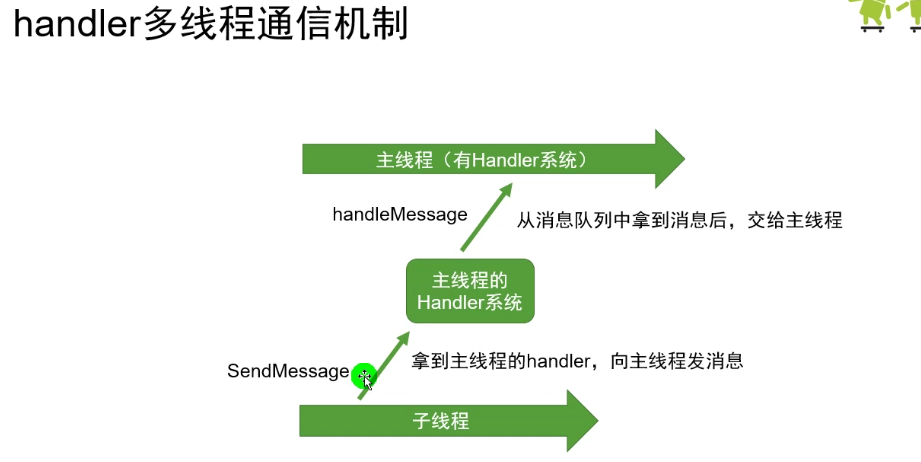


**个人理解：**


Thread和Runnable这两个都可以用来进行子线程的开辟，都是无法运用主线程来处理某些事件，这里我说的Thread和Runnable是一般情况下使用子线程的方法，不要深入剖析，因为深入剖析Thread和Runnable在某种情况可能就可以使用主线程。

Thread和Runnable可能就是我们用来开辟多线程来加快处理任务的方法，Handler机制也是可以处理多线程，而这个多可能不是我门理解的和Thread和Runnable一样的多，Handler机制是由各子线程发向主线程的任务请求，但主线程不能一并同时处理，需要讲究先来后到，主线程一个个处理由子线程发过来的任务请求，而这个任务请求一般不会是复杂的任务，可能就是个数据更新、页面刷新等，复杂的处理部分已经使用Thread或Runnable开辟的子线程处理，需要主线程处理的往往是子线程的结果，而这个结果正好是要由主线程来完成接下来的简单任务，handler机制也就是由一般子线程提交send一个请求到主线程的消息队列中排队，等到Looper取出这个由子线程提交的任务请求，那么主线程就会处理任务。


**主线程就是领导Handler，子线程就是下面干活的，一众员工在下面干活，干活的结果可能需要领导签字确认，那么你就把签字确认表提交SendMessage给领导的待处理任务邮箱（Message Queue），当然会有很多员工提交确认表，那么就一个个来，秘书Looper就一个个按提交顺序提取确认表交给（handleMessage）领导来签字确认。**

**而领导签字（主线程）和员工干活（子线程）是相互独立的，你干你的活，他干他的活，领导不会说等着员工，领导也有其他任务要完成，只是你工作的结果需要占用领导的时间来给你确认而已。你提交的信息可能会很久才会得到领导的答复，因为领导任务太多，你的任务排在待处理的任务队列的很后面，或者说你提交的任务不是特别着急的事（优先级），所以不会那么快得到恢复。**


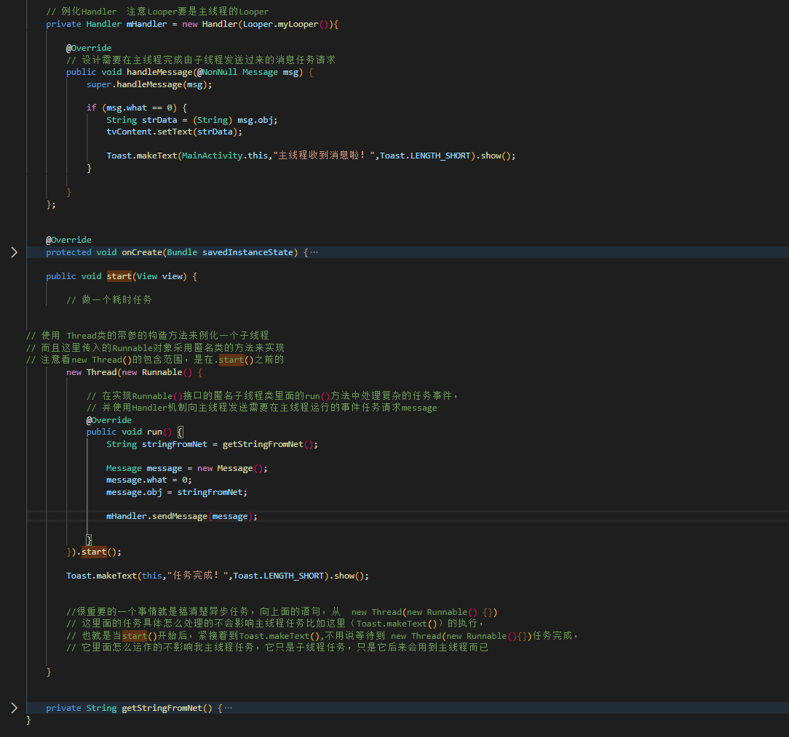


```csharp
    /**
     * YUV_420_888转NV21
     *
     * @param image CameraX ImageProxy
     * @return byte array
     */
    public static byte[] yuv420ToNv21(ImageProxy image) {
        ImageProxy.PlaneProxy[] planes = image.getPlanes();
        ByteBuffer yBuffer = planes[0].getBuffer();
        ByteBuffer uBuffer = planes[1].getBuffer();
        ByteBuffer vBuffer = planes[2].getBuffer();
        int ySize = yBuffer.remaining();
        int uSize = uBuffer.remaining();
        int vSize = vBuffer.remaining();
        int size = image.getWidth() * image.getHeight();
        byte[] nv21 = new byte[size * 3 / 2];
        yBuffer.get(nv21, 0, ySize);
        vBuffer.get(nv21, ySize, vSize);

        byte[] u = new byte[uSize];
        uBuffer.get(u);

        //每隔开一位替换V，达到VU交替
        int pos = ySize + 1;
        for (int i = 0; i < uSize; i++) {
            if (i % 2 == 0) {
                nv21[pos] = u[i];
                pos += 2;
            }
        }
        return nv21;
        
        //        Image.Plane[] planes = image.getPlanes();
//                ByteBuffer y = planes[0].getBuffer();
//                ByteBuffer u = planes[1].getBuffer();
//                ByteBuffer v = planes[2].getBuffer();
//                int y1 = y.remaining();
//                int u1 = u.remaining();
//                int v1 = v.remaining();
//                mYuvBytes = new byte[y1 + u1 + v1];
//                y.get(mYuvBytes, 0, y1);
//                u.get(mYuvBytes, y1 + v1, u1);
//                 /** 对NV21，可以从plane[1]中取出最后的值追加到末尾*/
//                v.get(mYuvBytes, y1, v1);
        
        
                Image.Plane[] planes = image.getPlanes();
                ByteBuffer y = planes[0].getBuffer();
                ByteBuffer u = planes[1].getBuffer();
                ByteBuffer v = planes[2].getBuffer();
                int y1 = y.remaining();
                int u1 = u.remaining();
                int v1 = v.remaining();
                mYuvBytes = new byte[y1 + u1 + v1];
                y.get(mYuvBytes, 0, y1);
                u.get(mYuvBytes, y1, u1);
                  /**对NV12则是在plane[2]中取出最后的值追加到末尾*/
                v.get(mYuvBytes, y1 + u1, v1);        
        
        
    
```


# 2021-11-18

## Android JNI

[JNI 提示  | Android NDK  | Android Developers (google.cn)](https://developer.android.google.cn/training/articles/perf-jni?hl=zh-cn#java)


**share object(dynamic library)**   .so库


**向您的项目添加 C 和 C++ 代码**

**[向您的项目添加 C 和 C++ 代码  | Android 开发者  | Android Developers (google.cn)](https://developer.android.google.cn/studio/projects/add-native-code?hl=zh-cn#new-project)**


### 使用预构建库

如需了解如何在 CMake 中使用预构建库，请参阅 [CMake 手册](https://cmake.org/cmake/help/latest/command/add_library.html)中关于 `IMPORTED` 目标的 `add_library` 文档

[add_library — CMake 3.22.0-rc3 Documentation](https://cmake.org/cmake/help/latest/command/add_library.html)

- ```
  add_library(<name> [STATIC | SHARED | MODULE]
              [EXCLUDE_FROM_ALL]
              [<source>...])
  ```


### 编写带本地c++方法的Android 项目工程

**1、新建带c++支持的项目**


**2、项目中的本地c方法结构**


**3、native-lib.cpp 概述**

新建的c源文件里面有一个自添加的方法


**开发者想要编写c方法，c函数的具体实现就在这个c.pp里面实现**


**4、如何在java声明了一个c方法，但要在native.cpp中实现**

(1)在java端说明函数

注意关键字  native 表示本地方法


**（2）添加到jni方法中**

**选项标红函数名**


**或 Alt+Enter**


**(3)native.cpp  方法体**

**可以看到在里面就实现了本地方法的函数名和参数，但是还没方法体，就自己设计**


**（4）设计方法体**


**（5）测试**


### 如何调用 .so 为己用


2、jni 调用类的路径一定要一致。也就是说 .so中函数声明涉及到的package name和class name与调用它的package name和class name不符。因此我们要改变我们工程中的package name和class name。使其与.so文件中函数签名提示的一致，在这个类中加入native方法的声明。

 

如： JNI接口 Java_com_netease_xtc_cloudmusic_utils_NeteaseMusicUtils_nativeInit 中，com.netease.xtc.cloudmusic.utils 代表的是 package name ，NeteaseMusicUtils 则是 class name。 

而第三方提供so库的工作人员的c文件的定义JNI接口为Java_com_netease_cloudmusic_utils_NeteaseMusicUtils_nativeInit，即： package name 必须为: com.netease.cloudmusic.utils ，而class name 必须为 NeteaseMusicUtils 。


## 创建 Android 库


**[创建 Android 库  | Android 开发者  | Android Developers (google.cn)](https://developer.android.google.cn/studio/projects/android-library?hl=zh-cn#kts)**


获取RGB_565


2
down vote
I did it like this, and it works.

Bitmap bitmap = Bitmap.createBitmap(captureWidth, captureHeight, Bitmap.Config.RGB_565);

ByteBuffer buffer = ByteBuffer.wrap(data);

bitmap.copyPixelsFromBuffer(buffer);


当然解决问题的就是第二种方法，先创建一个rgb565格式的bitmap对象，然后创建一个字节buffer，用它的wrap方法封装，然后把像素数据从里面拷贝出来；这就是核心实现部分，当然你们要做的就是怎么获取到一帧的RGB565的字节数据。


1.  **byte** [] mPixel = **new** **byte**[240*320*2]; 
2.   **int** n = 0; 
3.   ByteBuffer buffer = ByteBuffer.wrap( mPixel );/*将 byte 数组包装到缓冲区中*/ 
4. Bitmap VideoBit = Bitmap.createBitmap(240, 320, Config.RGB_565);  /*位图文件  */   
5. fileIS = **new** FileInputStream(PathFileName);  
6. ​    fileIS.read(mPixel); 
7.  **protected** **void** onDraw(Canvas canvas) { 
8. ​    **super**.onDraw(canvas);   
9. ​     
10. ​     
11. ​     
12. ​    VideoBit.copyPixelsFromBuffer(buffer);   /*从缓冲区中复制像素，从当前位置开始覆盖位图的像素*/ 
13. canvas.drawBitmap(VideoBit, 0, 0, **null**);  ｝ 


#### 5.YUV_420_888_toRGB8888方法

```
    public static Bitmap YUV_420_888_toRGB8888(Context context, Image.Plane[] planes, byte[][] yuvBytes, int width, int height){
        int yRowStride= planes[0].getRowStride();
        int uvRowStride= planes[1].getRowStride();  // we know from   documentation that RowStride is the same for u and v.
        int uvPixelStride= planes[1].getPixelStride();  // we know from   documentation that PixelStride is the same for u and v.
        RenderScript rs = RenderScript.create(context);
        ScriptC_yuv420888 mYuv420=new ScriptC_yuv420888(rs);
        Type.Builder typeUcharY = new Type.Builder(rs, Element.U8(rs));
        typeUcharY.setX(yRowStride).setY(height);
        Allocation yAlloc = Allocation.createTyped(rs, typeUcharY.create());
        yAlloc.copyFrom(yuvBytes[0]);
        mYuv420.set_ypsIn(yAlloc);
        Type.Builder typeUcharUV = new Type.Builder(rs, Element.U8(rs));
        typeUcharUV.setX(yuvBytes[1].length);
        Allocation uAlloc = Allocation.createTyped(rs, typeUcharUV.create());
        uAlloc.copyFrom(yuvBytes[1]);
        mYuv420.set_uIn(uAlloc);
        Allocation vAlloc = Allocation.createTyped(rs, typeUcharUV.create());
        vAlloc.copyFrom(yuvBytes[2]);
        mYuv420.set_vIn(vAlloc);
        // handover parameters
        mYuv420.set_picWidth(width);
        mYuv420.set_uvRowStride (uvRowStride);
        mYuv420.set_uvPixelStride (uvPixelStride);
        Bitmap outBitmap = Bitmap.createBitmap(width, height, Bitmap.Config.ARGB_8888);
        Allocation outAlloc = Allocation.createFromBitmap(rs, outBitmap, Allocation.MipmapControl.MIPMAP_NONE, Allocation.USAGE_SCRIPT);
        Script.LaunchOptions lo = new Script.LaunchOptions();
        lo.setX(0, width);  // by this we ignore the y’s padding zone, i.e. the right side of x between width and yRowStride
        lo.setY(0, height);
        mYuv420.forEach_doConvert(outAlloc,lo);
        outAlloc.copyTo(outBitmap);
        return outBitmap;
    }
```


#### 6.使用示例

```
    public void onImageAvailable(ImageReader reader) {
        Image image = reader.acquireLatestImage();
        Image.Plane[] planes = image.getPlanes();
        for (int i = 0; i < planes.length; ++i) {
            final ByteBuffer buffer = planes[i].getBuffer();
            if (yuvBytes[i] == null) {
                yuvBytes[i] = new byte[buffer.capacity()];
            }
            buffer.get(yuvBytes[i]);
        }
        Bitmap processBitmap = UtilImage.YUV_420_888_toRGB8888(MainActivity.this,planes,yuvBytes,640,480);
        image.close();
    }
```


## Android-NDK工具编译库文件


#### 1.Android.mk文件解析

Android.mk是Android提供的一种makefile文件，用来指定诸如编译生成so库名、引用的头文件目录、需要编译的.c/.cpp文件和.a静态库文件等。要掌握jni，就必须熟练掌握Android.mk的语法规范。

它的基本格式如下：

1. LOCAL_PATH := $(call my-dir)    
2. include $(CLEAR_VARS) 
3. ................ 
4. LOCAL_xxx    := xxx 
5. LOCAL_MODULE  := hello-jni 
6. LOCAL_SRC_FILES := hello-jni.c 
7. LOCAL_xxx    := xxx 
8. ................ 
9. include $(BUILD_SHARED_LIBRARY) 

 **#LOCAL_PATH变量制定了该.mk的路径   $(call my-dir)调用NDK内部的函数获得当前.mk文件的路径**

每个Android.mk文件必须以定义LOCAL_PATH为开始。它用于在开发tree中查找源文件。宏my-dir 则由Build System提供。返回包含Android.mk的目录路径。

**#include $(CLEAR_VARS)清空了除了LOCAL_PATH之外的所有LOCAL_xxx变量的值**

这个清理动作是必须的，因为所有的编译控制文件由同一个GNU Make解析和执行，其变量是全局的。所以清理后才能避免相互影响。


**省略号中间就是对于模块参数的设置，主要包括：模块名字、模块源文件、模块类型、编译好的模块存放位置、以及编译的平台等**

LOCAL_MODULE模块必须定义，以表示Android.mk中的每一个模块。名字必须唯一且不包含空格。Build System会自动添加适当的前缀和后缀。例如，foo，要产生动态库，则生成libfoo.so

LOCAL_MODULE_PATH :=$(TARGET_ROOT_OUT) 指定最后生成的模块的目标地址  TARGET_ROOT_OUT宏定义

LOCAL_SRC_FILES := hello-jni.c 

LOCAL_SRC_FILES变量必须包含将要打包如模块的C/C++ 源码。不必列出头文件，build System 会自动帮我们找出依赖文件。


**include $(BUILD_xxx_xxx)执行NDK的默认脚本，它会收集include $(CLEAR_VARS)脚本后所有定义的LOCAL_xxx变量，然后根据它们来生成模块。**

BUILD_SHARED_LIBRARY：是Build System提供的一个变量，指向一个GNU Makefile Script。
它负责收集自从上次调用 include $(CLEAR_VARS)  后的所有LOCAL_XXX信息。并决定编译为什么。

下面4个只能配置一个，不然报错

​	**BUILD_STATIC_LIBRARY**   ：编译为静态库。 
​	**BUILD_SHARED_LIBRARY** ：编译为动态库 
​	**BUILD_EXECUTABLE**      ：编译为Native C可执行程序  

​	**BUILD_PREBUILT**         ：该模块已经预先编译


#### 2.Application.mk解析

https://developer.android.google.cn/ndk/guides/application_mk

Application.mk文件，这是android NDK构建系统使用的一个可选构建文件。它的目的是描述应用程序需要哪些模块，也定义了所有模块的一些通用变量


要将C\C++代码编译为SO文件，光有Android.mk文件还不行，还需要一个Application.mk文件。

Application.mk是用来确定一些编译规则的，它规定的不是某一个文件某一行代码，而是所有文件相关

Application.mk和Android.mk是放在同一个目录下的。


**Application.mk的写法**

Application.mk文件中里面全都是标签key和值value来定义一些属性


key1 := value1 

key2 := value2

key3 := value3


\#是用来注释的，//双斜杠在mk文件中是不能用作于注释的

标签书写的次序是不论的


1、APP_PLATFORM（必选项）
作用：定义使用的ndk库函数版本号。


2、APP_ABI （必选项）

作用：编译成什么类型的cpu的so, 全选也可以使用all

APP_ABI := armeabi-v7a arm64-v8a 

或者

\#APP_ABI := all

目前主流的Android设备是armeabi-v7a架构的，然后就是x86和armeabi了。
如果同时包含了 armeabi，armeabi-v7a和x86，所有设备都可以运行，程序在运行的时候去加载不同平台对应的so，这是较为完美的一种解决方案，但是同时也会导致包变大。
armeabi-v7a是可以兼容armeabi的，而v7a的CPU支持硬件浮点运算，目前绝大对数设备已经是armeabi-v7a了，所以为了性能上的更优，就不要为了兼容放到armeabi下了。
x86也是可以兼容armeabi平台运行的，另外需要指出的是，打出包的x86的so，总会比armeabi平台的体积更小，对于性能有追求，还是建议在打包so的时候支持x86。

3、APP_STL （非必选项）
作用：如何连接c++标准库 。
属性值：
stlport_static 静态链接
stlport_shared 动态链接
system 系统默认

如果生成的so库包含静态.a文件，这个属性要写成stlport_static，否则可以不用写

4、APP_OPTIM （非必选项）
编译版本，如果是DEBUG版本就会带上调试信息。可以使用gdb-server进行动态断点低调试。
debug 调试版本 so中带调试信息，
release（默认） 发布版本 so不带调试信息

正常情况不用写这个属性就可以了，如果需要进行断点调试的情况可以设置为debug


**一个规定怎么编译，需要什么材料，一个规定编译出来的东西是啥样的，适合给谁用**


#### 3、实例操作使用NDK编译一个SO库

1、安装NDK  win10下

下载好对应版本，添加到环境变量中


2、准备好编译材料

编译规则 Android.mk   Application.mk

源码  hello-jni.c  需要被编译成库的源码

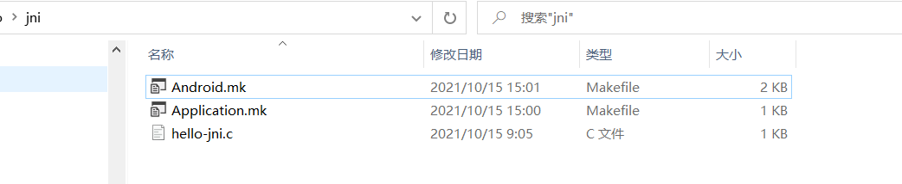

 **Android.mk** 


**Application.mk**


**编译**


**build.sh脚本**

```
                    Executable : ${HOME}/Android/Sdk/cmake/3.10.2.4988404/bin/cmake
arguments :
-H${HOME}/Dev/github-projects/googlesamples/ndk-samples/hello-jni/app/src/main/cpp
-DCMAKE_FIND_ROOT_PATH=${HOME}/Dev/github-projects/googlesamples/ndk-samples/hello-jni/app/.cxx/cmake/universalDebug/prefab/armeabi-v7a/prefab
-DCMAKE_BUILD_TYPE=Debug
-DCMAKE_TOOLCHAIN_FILE=${HOME}/Android/Sdk/ndk/22.1.7171670/build/cmake/android.toolchain.cmake
-DANDROID_ABI=armeabi-v7a
-DANDROID_NDK=${HOME}/Android/Sdk/ndk/22.1.7171670
-DANDROID_PLATFORM=android-23
-DCMAKE_ANDROID_ARCH_ABI=armeabi-v7a
-DCMAKE_ANDROID_NDK=${HOME}/Android/Sdk/ndk/22.1.7171670
-DCMAKE_EXPORT_COMPILE_COMMANDS=ON
-DCMAKE_LIBRARY_OUTPUT_DIRECTORY=${HOME}/Dev/github-projects/googlesamples/ndk-samples/hello-jni/app/build/intermediates/cmake/universalDebug/obj/armeabi-v7a
-DCMAKE_RUNTIME_OUTPUT_DIRECTORY=${HOME}/Dev/github-projects/googlesamples/ndk-samples/hello-jni/app/build/intermediates/cmake/universalDebug/obj/armeabi-v7a
-DCMAKE_MAKE_PROGRAM=${HOME}/Android/Sdk/cmake/3.10.2.4988404/bin/ninja
-DCMAKE_SYSTEM_NAME=Android
-DCMAKE_SYSTEM_VERSION=23
-B${HOME}/Dev/github-projects/googlesamples/ndk-samples/hello-jni/app/.cxx/cmake/universalDebug/armeabi-v7a
-GNinja
jvmArgs :

                    Build command args: []
                    Version: 1
```


#### **android-NDK 编译boost动态库**

**https://github.com/moritz-wundke/Boost-for-Android**


**[dec1/Boost-for-Android: Android port of Boost C++ Libraries (github.com)](https://github.com/dec1/Boost-for-Android)**

**https://github.com/dec1/Boost-for-Android**

**预编译：**

https://github.com/dec1/Boost-for-Android/releases


##  NDK-build编译源码为库文件并调用编译的库

### **编译jthread为例：**

官方的jthread是一个基于pthead的封装库，用来解决unix平台多线程编程。封装置后调用相对简单，使用jthread可以轮询查询是否接收到rtp包并且取出。

文件结构如下：

```
└── JThread
    ├── CMakeLists.txt
    ├── ChangeLog
    ├── LICENSE.MIT
    ├── README.md
    ├── TODO
    ├── builddist.sh
    ├── cmake
    │   └── JThreadConfig.cmake.in
    ├── doc
    │   └── manual.tex
    ├── pkgconfig
    │   ├── CMakeLists.txt
    │   └── jthread.pc.in
    ├── sphinxdoc
    │   ├── Makefile
    │   ├── README.md
    │   └── source
    │       ├── _static
    │       ├── _templates
    │       └── conf.py
    └── src
        ├── CMakeLists.txt
        ├── jmutex.h
        ├── jmutexautolock.h
        ├── jthread.h
        ├── jthreadconfig.h.in
        ├── pthread
        │   ├── jmutex.cpp
        │   └── jthread.cpp
        └── win32
            ├── jmutex.cpp
            └── jthread.cpp
```

文件很少，主要的源文件在src文件夹下，这里的文件是实现jthread的主要代码，我们不用管，重点关注该文件夹下的`CMakeLists.txt`文件。doc、pkgconfi和spinxdoc三个文件夹是unix平台安装的文件，也可以不用管。主要的是CMakeLists.txt文件和cmake文件夹下的`JThreadConfig.cmake.in`。下面一起分析一下上面提到的三个需要关注的文件。
关于cmake的详细文档请参[考官方文档](https://cmake.org/cmake/help/v3.10/index.html)或者[这个系列文章](https://juejin.im/post/5a8ebe006fb9a0635a6574de)。

#### 根目录下的CMakeList.txt文件

该文件是整个工程构建系统的入口。

```
cmake_minimum_required(VERSION 3.0)

project(jthread)
set(VERSION 1.3.3)
```

来看看这三个蛋疼的玩意，指定了使用cmake的最小版本，构建的工程的名称以及该库的版本。

```
include(CheckCXXSourceCompiles)
```

这个就牛逼了，是用来测试c源码是否包含某个功能，稍后在src文件夹下CMakeLists.txt文件介绍会用到。

```
set (_DEFAULT_LIBRARY_INSTALL_DIR lib)
if (EXISTS "${CMAKE_INSTALL_PREFIX}/lib32/" AND CMAKE_SIZEOF_VOID_P EQUAL 4)
	set (_DEFAULT_LIBRARY_INSTALL_DIR lib32)
elseif (EXISTS "${CMAKE_INSTALL_PREFIX}/lib64/" AND CMAKE_SIZEOF_VOID_P EQUAL 8)
	set (_DEFAULT_LIBRARY_INSTALL_DIR lib64)
endif ()

set(LIBRARY_INSTALL_DIR "${_DEFAULT_LIBRARY_INSTALL_DIR}" CACHE PATH "Library installation directory")
if(NOT IS_ABSOLUTE "${LIBRARY_INSTALL_DIR}")
	set(LIBRARY_INSTALL_DIR "${CMAKE_INSTALL_PREFIX}/${LIBRARY_INSTALL_DIR}")
endif()
```

这几个是关于库的安装路径设置，暂时忽略，因为我们在交叉编译的时候会手动指定安装目录。

```
find_package(Threads)
if (NOT CMAKE_USE_WIN32_THREADS_INIT)
	if (NOT CMAKE_USE_PTHREADS_INIT)
		message(FATAL_ERROR "Can find neither pthread support nor Win32 thread support")
	endif (NOT CMAKE_USE_PTHREADS_INIT)
endif (NOT CMAKE_USE_WIN32_THREADS_INIT)
```

find_package可以用来查询系统是否包含某个库，包含会返回变量成功，不包含变量返回NOTFOUND。
这个是用来寻找threads库，假如找到会生成以下变量:

```
CMAKE_THREAD_LIBS_INIT     - 库名称
CMAKE_USE_SPROC_INIT       - 使用sproc?
CMAKE_USE_WIN32_THREADS_INIT - 使用WIN32 threads?
CMAKE_USE_PTHREADS_INIT    - 使用pthreads
CMAKE_HP_PTHREADS_INIT     - 使用pthreads
```

稍后会用到其中的一些变量。
最后一行：

```
add_subdirectory(src)
```

这个是提供执行构建src文件夹下的CMakeLists.txt文件的一个入口，添加这句后src中的cmake文件就可以引用这个cmake文件中的一些变量和环境设置。

#### src文件夹下的CMakeLists.txt文件

这个文件的内比较多，挑一些重要的讲一讲：

```
if (NOT MSVC OR JTHREAD_COMPILE_STATIC)
	set(JTHREAD_INSTALLTARGETS jthread-static)
	add_library(jthread-static STATIC ${SOURCES} ${HEADERS})
	set_target_properties(jthread-static PROPERTIES OUTPUT_NAME jthread)
	set_target_properties(jthread-static PROPERTIES CLEAN_DIRECT_OUTPUT 1)
	target_link_libraries(jthread-static ${CMAKE_THREAD_LIBS_INIT})
endif()

if ((NOT MSVC AND NOT JTHREAD_COMPILE_STATIC_ONLY) OR (MSVC AND NOT JTHREAD_COMPILE_STATIC))
	add_library(jthread-shared SHARED ${SOURCES} ${HEADERS})
	set_target_properties(jthread-shared PROPERTIES VERSION ${VERSION})
	set_target_properties(jthread-shared PROPERTIES OUTPUT_NAME jthread)
	set_target_properties(jthread-shared PROPERTIES CLEAN_DIRECT_OUTPUT 1)
	set(JTHREAD_INSTALLTARGETS ${JTHREAD_INSTALLTARGETS} jthread-shared)
	target_link_libraries(jthread-shared ${CMAKE_THREAD_LIBS_INIT})
endif ()
```

这段代码的作用是在非windows平台下构建动态库和静态库，假如不需要全部构建只需要构建动态库或者静态库，注释掉其中的一部分即可(上边构建静态库.a文件，下边构建动态库.so文件)。

```
install(FILES ${HEADERS} DESTINATION include/jthread)
install(TARGETS ${JTHREAD_INSTALLTARGETS} DESTINATION ${LIBRARY_INSTALL_DIR})
```

这两句是用来安装文件，cmake系统默认的安装路径是/usr/local/*，假如设置了`CMAKE_INSTALL_PREFIX`,则会改变默认的安装路径到该变量指向的路径。这两句话的作用是将变量`HEADERS`包含的文件-主要是头文件-安装到`CMAKE_INSTALL_PREFIX`指向路径的`include/jthread`文件夹下,同理，动态库和静态库会安装到指向路径的`lib`文件夹下。

关于上边提到的测试，`include(CheckCXXSourceCompiles)`：

```
# Test pthread_cancel (doesn't exits on Android)
set(CMAKE_REQUIRED_LIBRARIES ${CMAKE_THREAD_LIBS_INIT})
check_cxx_source_compiles("#include <pthread.h>\nint main(void) { pthread_cancel((pthread_t)0); return 0; }" JTHREAD_HAVE_PTHREADCANCEL)
if (NOT JTHREAD_HAVE_PTHREADCANCEL)
    #message("Enabling JTHREAD_SKIP_PTHREAD_CANCEL")
	add_definitions(-DJTHREAD_SKIP_PTHREAD_CANCEL)
else ()
	#message("pthread_cancel appears to exist")
endif (NOT JTHREAD_HAVE_PTHREADCANCEL)
```


这个功能是测试pthread是否有cancel函数,并将结构存储在`JTHREAD_HAVE_PTHREADCANCEL`变量中，程序执行成功则会返回true，执行失败则会返回false，然后执行if中的语句，来添加跳过执行cancel函数的变量，这样在编译后程序就不会执行cancel函数了。

来看一下另一端代码：

```
configure_file("${PROJECT_SOURCE_DIR}/cmake/JThreadConfig.cmake.in" 
	       "${PROJECT_BINARY_DIR}/cmake/JThreadConfig.cmake")
```

configure_file的作用是将第一个参数指向的文件复制到第二个参数指向的路径，也会重命名该文件，并且在生成的文件中替换源文件中的变量。看一下源文件，指定了三个变量，后两个变量会随着你的参数指定而变化。

```
set(JTHREAD_FOUND 1)

set(JTHREAD_INCLUDE_DIRS "${CMAKE_INSTALL_PREFIX}/include")

set(JTHREAD_LIBRARIES ${JTHREAD_LIBS_CMAKECONFIG})
```

这个文件本身并没有太大的作用，主要目的是让jrtplib寻找到jthread库。实际在jrtplib中定义的find宏中提供了两种方式，不是必须采用这种方式。

#### 编译全abi的jthread库

用ndk-build来构建时比较简单的，但是要自己编写.mk文件。我闲的蛋疼写了一个bash脚本来生成全abi的动态库和静态库。安卓支持的abi版本共有7种，armeabi arm64-v8a armeabi-v7a mips mips64 x86 x86_64，我们需要分别生成这些版本的动态库.so文件与静态库.o文件。

```
#!/bin/bash

#ndk的路径，替换为自己的路径
export NDK_PATH=/Users/rangaofei/Library/Android/sdk/ndk-bundle

#将要构建的架构
TARGETS=(armeabi arm64-v8a armeabi-v7a mips mips64 x86 x86_64)

#清除build文件夹下的内容
function clean_build() {
	if ([ -d build ]); then
		echo "prepare to clean cache"
		(rm -rf ./build/*)
		echo "complete"
	else
		echo "build is not a directory"
		exit 0
	fi
}

function prepare_build() {
	# 检测是否有Build文件夹，有的话删除文件夹，没有的话创建文件夹
	if ([ -e build ]); then
		echo "you already have build dir"
		clean_build
	else
		echo "prepare to create dir build"
		mkdir build
	fi
	(
		cd build
		for dir in ${TARGETS[@]}; do
			mkdir $dir
		done
	)
}

function prepare_target() {
	#检测是否有所有的target文件夹，有则删除，没有则创建
	if ([ -e target ] && [ -d target ]); then
		echo "prepare to clean target"
		rm -rf ./target/*
		echo "clean target complete"
	else
		echo "you not have target_dir,we will create it"
		mkdir target
	fi
}

function create_child_dir() {
	if ([ -e target ]); then
		(
			cd target
			mkdir $1
		)
	else
		echo "target is not a dir"
	fi
}

function move_to_target() {
	pwd
	if ([ -e ./build/$1/src/libjthread.a ]); then
		echo "prepare move target to ./target/$1"
		cp ./build/$1/src/libjthread.a ./target/$1
		cp ./build/$1/src/libjthread.so ./target/$1
		echo "move to ./target/$1 finished"
	else
		echo "move error $1"
	fi
}

function build_lib() {
	cd build/$1
	cmake ../.. \
		-DCMAKE_SYSTEM_NAME=Android \
		-DCMAKE_SYSTEM_VERSION=21 \
		-DCMAKE_ANDROID_ARCH_ABI=$1 \
		-DCMAKE_ANDROID_NDK=$NDK_PATH \
		-DCMAKE_ANDROID_STL_TYPE=gnustl_static \
		-DCMAKE_INSTALL_PREFIX=$(pwd)
}

function create_all_child_dir() {
	for dir in ${TARGETS[@]}; do
		create_child_dir $dir
		echo "$dir created"
	done
}

function create_all_target() {
	prepare_build
	prepare_target
	create_all_child_dir
	for target in ${TARGETS[@]}; do
		(
			build_lib $target
			make
			make install
		)
		move_to_target $target
	done
}

function sbuild() {
	echo "-------$1"
	case $1 in
	"all")
		create_all_target
		;;
	"*") ;;

	esac
}

sbuild_list=("all")
function _sbuild() {
	local cur
	COMPREPLY=()
	cur="${COMP_WORDS[COMP_CWORD]}"
	COMPREPLY=($(compgen -W "${sbuild_list[*]}" -- ${cur}))
	return 0
}
complete -o filenames -F _sbuild sbuild
```

关于shell脚本有兴趣的话可以参考[系列文章](https://rangaofei.github.io/tags/Shell/).

关于cmake构建的指令是

```
cmake ../.. \
		-DCMAKE_SYSTEM_NAME=Android \
		-DCMAKE_SYSTEM_VERSION=21 \
		-DCMAKE_ANDROID_ARCH_ABI=$1 \
		-DCMAKE_ANDROID_NDK=$NDK_PATH \
		-DCMAKE_ANDROID_STL_TYPE=gnustl_static \
		-DCMAKE_INSTALL_PREFIX=$(pwd)
```

这个命令是执行交叉编译的命令，`-DCMAKE_SYSTEM_NAME=Android`指定了编译平台是安卓平台；`-DCMAKE_SYSTEM_VERSION=21`指定了api版本是21；`-DCMAKE_ANDROID_ARCH_ABI=$1`指定了构建的abi为该函数接收的参数，因为会便利TARGETS数组，所以会执行七次；-DCMAKE_INSTALL_PREFIX=$(pwd)指定了我们上边提到的安装路径为当前目录，则会在当前目录下创建include/thread文件夹来存放头文件，lib文件夹存放库文件。

上边的脚本共干了以下几件事

1. 创建buil文件夹，并在build文件夹下创建七种abi文件夹库，用来执行cmake的外部构建，存放所有生成的文件。
2. 创建target文件夹，并在target文件下创建七种abi文件夹库，将生成的库文件拷贝到这个文件夹下
3. 遍历所有的abi，进入build对应的文件夹下，执行外部构建，并且执行make和make install完成构建
4. 拷贝所有的lib文件夹下的库到对应的target文件夹下

我们在命令行执行下边两个命令

```
source build.sh
sbuild all
```

> 温馨提示：最好在bash中执行上述命令，zsh会发生未知的错误，并且不支持我编写的自动补全。

构建会自动执行并输出日志。构建完成后来看一下目录结构

```
.
├── build
│   ├── arm64-v8a
│   ├── armeabi
│   ├── armeabi-v7a
│   ├── mips
│   ├── mips64
│   ├── x86
│   └── x86_64
├── cmake
├── doc
├── pkgconfig
├── sphinxdoc
│   └── source
├── src
│   ├── pthread
│   └── win32
└── target
    ├── arm64-v8a
    ├── armeabi
    ├── armeabi-v7a
    ├── mips
    ├── mips64
    ├── x86
    └── x86_64
```

可以看到build文件夹和target文件夹已经按我们预期好的形式创建了，并且都有对应的abi文件夹下已经生成了所有的静态库和动态库。这样我们的jthrea库就构建好了，看一下cmake文件夹下的JThradConfig.cmake文件，这个文件位于`build/$abi/cmake`文件夹下，我选的是arm64-v8a：

```
set(JTHREAD_FOUND 1)

set(JTHREAD_INCLUDE_DIRS "/Users/rangaofei/Documents/program/JThread/build/arm64-v8a/include")

set(JTHREAD_LIBRARIES  "-L/Users/rangaofei/Documents/program/JThread/build/arm64-v8a/lib" "-ljthread")
```

这里已经替换好了我当前的目录。

#### 编译jrtplib

从github上下载好后，目录结构与jthread基本相似，根目录下的CMakeLists.txt同样是构建的入口，src下是源文件，此处注意一个example文件夹，这个是用来测试jtrplib的，由于我们是安卓平台不需要这个文件夹的例子，所以找到200行左右的代码

```
add_subdirectory(examples)
```

将它注释掉，系统就不会构建所有的examples了。

cmake文件夹下有一些文件，其中有三个模块供构建时使用。，重点介绍一下这个findjthread模块，其他的两个比较简单。

#### findjthread.cmake模块

这个模块用来寻找jthread库。上边提到了寻找jthread库可以用JThreadConfig.cmake文件来查询

```
find_package(JThread QUIET NO_MODULE)

if (NOT JTHREAD_FOUND) # Config file could not be found
	find_path(JTHREAD_INCLUDE_DIR jthread/jthread.h)
	
	set(JTHREAD_INCLUDE_DIRS ${JTHREAD_INCLUDE_DIR})

	if (UNIX)
		find_library(JTHREAD_LIBRARY jthread)
		if (JTHREAD_LIBRARY)
			set(JTHREAD_LIBRARIES ${JTHREAD_LIBRARY})
			find_library(JTHREAD_PTHREAD_LIB pthread)
			if (JTHREAD_PTHREAD_LIB)
				set(JTHREAD_LIBRARIES ${JTHREAD_LIBRARY} ${JTHREAD_PTHREAD_LIB})
			endif(JTHREAD_PTHREAD_LIB)
		endif (JTHREAD_LIBRARY)
	else (UNIX)
		find_library(JTHREAD_LIB_RELEASE jthread)
		find_library(JTHREAD_LIB_DEBUG jthread_d)

		if (JTHREAD_LIB_RELEASE OR JTHREAD_LIB_DEBUG)
			set(JTHREAD_LIBRARIES "")
			if (JTHREAD_LIB_RELEASE)
				set(JTHREAD_LIBRARIES ${JTHREAD_LIBRARIES} optimized ${JTHREAD_LIB_RELEASE})
			endif (JTHREAD_LIB_RELEASE)
			if (JTHREAD_LIB_DEBUG)
				set(JTHREAD_LIBRARIES ${JTHREAD_LIBRARIES} debug ${JTHREAD_LIB_DEBUG})
			endif (JTHREAD_LIB_DEBUG)
		endif (JTHREAD_LIB_RELEASE OR JTHREAD_LIB_DEBUG)
	endif(UNIX)
endif (NOT JTHREAD_FOUND)

include(FindPackageHandleStandardArgs)

find_package_handle_standard_args(JThread DEFAULT_MSG JTHREAD_INCLUDE_DIRS JTHREAD_LIBRARIES)
```

这个模块中使用了find_package和find_path,那我们需要在命令行中指定一个参数：`CMAKE_FIND_ROOT_PATH`,当使用交叉编译时这个命令是用来提供find_package和find_path的寻找路径，稍后编写的shell脚本中会设置这个变量。

找不到ifaddrs

在交叉编译的过程中，需要使用到库ifaddrs，在unix系统中这个属于必须实现的库，但是很可惜，安卓中没有，在编译的时候报错，提示找不到关于ifaddrs的函数。所以要使用这个库必须手动导入，这里为了方便我就直接拷贝过来了这两个文件，github地址是https://github.com/morristech/android-ifaddrs。然后我们需要在src文件夹下的CMakeLists.txt中找到两个变量`HEADERS`和`SOURCES`，这是两个数组，前者定义了所有的头文件，后者定义了所有的源文件，我们将为ifaddrs的添加的两个文件ifaddrs.h添加到HEADERS数组，ifaddrs.c添加到SOURCES数组。

到这里我们的准备工作基本结束了，下一步要编写shell脚本生成全abi。
基本步骤与编译jthread库相似：

1. 创建buil文件夹，并在build文件夹下创建七种abi文件夹库，用来执行cmake的外部构建，存放所有生成的文件。
2. 创建target文件夹，并在target文件下创建七种abi文件夹库，将生成的库文件拷贝到这个文件夹下
3. 遍历所有的abi，进入build对应的文件夹下，执行外部构建，并且执行make和make install完成构建
4. 拷贝所有的lib文件夹下的库到对应的target文件夹下

命令相似度很高，我就不写了，真不要看一下cmake的构建指令:

```
cmake ../.. \
		-DCMAKE_SYSTEM_NAME=Android \
		-DCMAKE_SYSTEM_VERSION=21 \
		-DCMAKE_ANDROID_ARCH_ABI=$1 \
		-DCMAKE_ANDROID_NDK=$NDK_PATH \
		-DCMAKE_ANDROID_STL_TYPE=gnustl_static \
		-DCMAKE_INSTALL_PREFIX=$(pwd) \
        -DCMAKE_FIND_ROOT_PATH=/Users/rangaofei/Documents/program/JThread/build/$1
```


除了最后一行，其他与jthread的构建基本一致。
最后指定了一个变量`-DCMAKE_FIND_ROOT_PATH`,这变量就是我们前边提到的寻找jthread的文件夹路径。

执行命令

```
surce build.sh
sbuild all
```

> 温馨提示：最好在bash中执行上述命令，zsh会发生未知的错误，并且不支持我编写的自动补全。

这个库文件较多，构建时间会很长：

```
.
├── build
│   ├── arm64-v8a
│   ├── armeabi
│   ├── armeabi-v7a
│   ├── mips
│   ├── mips64
│   ├── x86
│   └── x86_64
├── cmake
├── doc
├── examples
├── pkgconfig
├── sphinxdoc
│   └── source
├── src
│   ├── extratransmitters
│   └── ifaddrs
├── target
│   ├── arm64-v8a
│   ├── armeabi
│   ├── armeabi-v7a
│   ├── mips
│   ├── mips64
│   ├── x86
│   └── x86_64
├── tests
└── tools
```

构建完成后同样在build和target文件夹下生成了这么多库。

#### JNI调用

终于到最后一步了,我们编写了这么蛋疼的东西只为这一下。**此处以静态库.a文件作为导入库**，修改CMakeLists.txt文件如下：

```
cmake_minimum_required(VERSION 3.4.1)

add_library(native-lib
            SHARED
            src/main/cpp/native-lib.cpp )
add_library( jrtp
             STATIC
             IMPORTED )
set_target_properties(jrtp PROPERTIES IMPORTED_LOCATION
${CMAKE_SOURCE_DIR}/src/main/jniLibs/${ANDROID_ABI}/libjrtp.a)


# 导入自自行编译的动态库 ————start
add_library(jthread STATIC IMPORTED)
set_target_properties(jthread PROPERTIES IMPORTED_LOCATION
${CMAKE_SOURCE_DIR}/src/main/jniLibs/${ANDROID_ABI}/libjthread.a) # 所有ABI的库都包含
# 导入自自行编译的动态库 ————end


include_directories(
             src/main/cpp/include/jrtplib3  # 添加了库，还需要添加库的对应函数的头文件
             src/main/cpp/include
            )


find_library( # Sets the name of the path variable.
              log-lib

              # Specifies the name of the NDK library that
              # you want CMake to locate.
              log )


target_link_libraries( # Specifies the target library.
                       native-lib

                       # Links the target library to the log library
                       # included in the NDK.
                       ${log-lib}
                      )

target_link_libraries(native-lib jrtp jthread)
```

native-lib是我们的目标库，jrtp和jthread是我们自己构建好的库导入进来的，所以在导入库的时候指定了IMPORT属性，并且指定了properties中库的路径，否则系统会提示连接失败。

我们工程中src/main中的主要文件夹如下:

```
-- cpp
|   `-- include
|       |-- jrtplib3
|       `-- jthread
|-- java
|   `-- com
|       `-- saka
|-- jniLibs
|   |-- arm64-v8a
|   |-- armeabi
|   |-- armeabi-v7a
|   |-- mips
|   |-- mips64
|   |-- x86
|   `-- x86_64
`-- res
    |-- drawable
    |-- drawable-v24
    |-- layout
    |-- mipmap-anydpi-v26
    |-- mipmap-hdpi
    |-- mipmap-mdpi
    |-- mipmap-xhdpi
    |-- mipmap-xxhdpi
    |-- mipmap-xxxhdpi
    `-- values
```

**cpp文件夹下有native-lib.cpp文件和include文件夹，include文件夹下有所有的jrpt和jthread头文件。**


**jniLibs文件夹中存放着所有的abi文件夹，也就是所有的库文件：**

```
|-- arm64-v8a
|   |-- libjrtp.a
|   |-- libjrtp.so
|   `-- libjthread.a
|-- armeabi
|   |-- libjrtp.a
|   |-- libjrtp.so
|   `-- libjthread.a
|-- armeabi-v7a
|   |-- libjrtp.a
|   |-- libjrtp.so
|   `-- libjthread.a
|-- mips
|   |-- libjrtp.a
|   |-- libjrtp.so
|   `-- libjthread.a
|-- mips64
|   |-- libjrtp.a
|   |-- libjrtp.so
|   `-- libjthread.a
|-- x86
|   |-- libjrtp.a
|   |-- libjrtp.so
|   `-- libjthread.a
`-- x86_64
    |-- libjrtp.a
    |-- libjrtp.so
    `-- libjthread.a
```

这里我把libjrtp.so文件也复制进来了，为了方便下边讲解如何用动态库构建项目。

**依赖动态库构建相对简单一些，因为不需要传递依赖我们native-lib库依赖了jtrp,而jrtp依赖了jthread，在使用静态库的时候需要指定链接所有的依赖库，而使用动态库可以不用，值需要依赖jrtp：**

```
cmake_minimum_required(VERSION 3.4.1)

add_library(native-lib
            SHARED
            src/main/cpp/native-lib.cpp )
add_library( jrtp
               SHARED
             # STATIC
             IMPORTED )
  
 # **依赖动态库** 
set_target_properties(jrtp PROPERTIES IMPORTED_LOCATION
${CMAKE_SOURCE_DIR}/src/main/jniLibs/${ANDROID_ABI}/libjrtp.so)


# add_library(jthread STATIC IMPORTED)
# set_target_properties(jthread PROPERTIES IMPORTED_LOCATION
# ${CMAKE_SOURCE_DIR}/src/main/jniLibs/${ANDROID_ABI}/libjthread.a)


include_directories(
             src/main/cpp/include/jrtplib3
             src/main/cpp/include
            )


find_library( # Sets the name of the path variable.
              log-lib

              # Specifies the name of the NDK library that
              # you want CMake to locate.
              log )


target_link_libraries( # Specifies the target library.
                       native-lib

                       # Links the target library to the log library
                       # included in the NDK.
                       ${log-lib}
                      )

# target_link_libraries(native-lib jrtp jthread)
target_link_libraries(native-lib jrtp)  # 动态链接
```

去除了jthread依赖，指定了jrtp为SHARED动态库，修改了路径指向了libjrtp.so文件，同时删除了最后的依赖jthread。

native-lib.cpp中的主要代码如下：

```
destport = 8006;

num = 10;

RTPUDPv4TransmissionParams transparams;
RTPSessionParams sessparams;
sessparams.SetOwnTimestampUnit(1.0 / 10.0);

sessparams.SetAcceptOwnPackets(true);
transparams.SetPortbase(portbase);
status = sess.Create(sessparams, &transparams);
checkerror(status);
uint8_t localip[] = {192, 168, 31, 122};
RTPIPv4Address addr(localip, destport);
status = sess.AddDestination(addr);
checkerror(status);
for (i = 1; i <= num; i++) {
    LOGD("Sending packet");
    status = sess.SendPacket((void *) "1234567890", 10, 0, false, 10);
    checkerror(status);

    sess.BeginDataAccess();

    sess.EndDataAccess();

    RTPTime::Wait(RTPTime(1, 0));
}
```

这个是引用的example1


# CMakeLists.txt 语法介绍与实例

[(45条消息) CMakeLists.txt 语法介绍与实例演练_阿飞的博客-CSDN博客_cmakelists.txt 教程](https://blog.csdn.net/afei__/article/details/81201039)

### 1. 指定 cmake 的最小版本

```erlang
cmake_minimum_required(VERSION 3.4.1)
```

这行命令是可选的，我们可以不写这句话，但在有些情况下，如果 CMakeLists.txt 文件中使用了一些高版本 cmake 特有的一些命令的时候，就需要加上这样一行，提醒用户升级到该版本之后再执行 cmake。

### 2. 设置项目名称

```erlang
project(demo)
```

这个命令不是强制性的，但最好都加上。它**会引入两个变量 demo_BINARY_DIR 和 demo_SOURCE_DIR**，同时，cmake 自动定义了两个等价的变量 PROJECT_BINARY_DIR 和 PROJECT_SOURCE_DIR。


### 3. 设置编译类型

```php
add_executable(demo demo.cpp)      # 生成可执行文件


add_library(common STATIC util.cpp) # 生成静态库


add_library(common SHARED util.cpp) # 生成动态库或共享库
```


### 4. 指定编译包含的源文件

**4.1 明确指定包含哪些源文件**

add_library(demo demo.cpp test.cpp util.cpp)

**4.2 搜索所有的 cpp 文件**

aux_source_directory(dir VAR) 发现一个目录下所有的源代码文件并将列表存储在一个变量中

1. aux_source_directory(. SRC_LIST) # 搜索当前目录下的所有.cpp文件
2. add_library(demo ${SRC_LIST})

**4.3 自定义搜索规则**


### 5. 查找指定的库文件

find_library(VAR name path)查找到指定的预编译库，并将它的路径存储在变量中。
默认的搜索路径为 cmake 包含的系统库，因此如果是 NDK 的公共库只需要指定库的 name 即可。


           find_library( # Sets the name of the path variable.
                  log-lib  
             # Specifies the name of the NDK library that
              # you want CMake to locate.
              log )
类似的命令还有 find_file()、find_path()、find_program()、find_package()。

### 6. 设置包含的目录

```ruby
include_directories(

    ${CMAKE_CURRENT_SOURCE_DIR}

    ${CMAKE_CURRENT_BINARY_DIR}

    ${CMAKE_CURRENT_SOURCE_DIR}/include

)
```


**[Linux](https://so.csdn.net/so/search?from=pc_blog_highlight&q=Linux) 下还可以通过如下方式设置包含的目录**

```kotlin
set(CMAKE_CXX_FLAGS "${CMAKE_CXX_FLAGS} -I${CMAKE_CURRENT_SOURCE_DIR}")
```

### 7. 设置链接库搜索目录

```bash
link_directories(
    ${CMAKE_CURRENT_SOURCE_DIR}/libs
    )
```


**Linux 下还可以通过如下方式设置包含的目录**

```kotlin
set(CMAKE_CXX_FLAGS "${CMAKE_CXX_FLAGS} -L${CMAKE_CURRENT_SOURCE_DIR}/libs")
```

8. 设置 target 需要链接的库

        target_link_libraries( # 目标库
                    demo
                       # 目标库需要链接的库
                       # log-lib 是上面 find_library 指定的变量名
                       ${log-lib} )

在 Windows 下，系统会根据链接库目录，搜索xxx.lib 文件，Linux 下会搜索 xxx.so 或者 xxx.a 文件，如果都存在会优先链接动态库（so 后缀）。

**8.1 指定链接动态库或静态库**

```r
target_link_libraries(demo libface.a) # 链接libface.a
target_link_libraries(demo libface.so) # 链接libface.so
```

**8.2 指定全路径**

target_link_libraries(demo ${CMAKE_CURRENT_SOURCE_DIR}/libs/libface.a)
target_link_libraries(demo ${CMAKE_CURRENT_SOURCE_DIR}/libs/libface.so)

**8.3 指定链接多个库**

```bash
target_link_libraries(demo

    ${CMAKE_CURRENT_SOURCE_DIR}/libs/libface.a
    boost_system.a
    boost_thread
    pthread)
```

### 9. 设置变量

**9.1 set 直接设置变量的值**

```bash
set(SRC_LIST main.cpp test.cpp)
add_executable(demo ${SRC_LIST})
```

**9.2 set 追加设置变量的值**

```bash
set(SRC_LIST main.cpp)
set(SRC_LIST ${SRC_LIST} test.cpp)
add_executable(demo ${SRC_LIST})
```

**9.3 list 追加或者删除变量的值**

```erlang
set(SRC_LIST main.cpp)
list(APPEND SRC_LIST test.cpp)
list(REMOVE_ITEM SRC_LIST main.cpp)
add_executable(demo ${SRC_LIST})

```

### 10. 条件控制

**10.1 if…elseif…else…endif**

**逻辑判断和比较：**
if (expression)：expression 不为空（0,N,NO,OFF,FALSE,NOTFOUND）时为真
if (not exp)：与上面相反
if (var1 AND var2)
if (var1 OR var2)
if (COMMAND cmd)：如果 cmd 确实是命令并可调用为真
if (EXISTS dir) if (EXISTS file)：如果目录或文件存在为真
if (file1 IS_NEWER_THAN file2)：当 file1 比 file2 新，或 file1/file2 中有一个不存在时为真，文件名需使用全路径
if (IS_DIRECTORY dir)：当 dir 是目录时为真
if (DEFINED var)：如果变量被定义为真
if (var MATCHES regex)：给定的变量或者字符串能够匹配正则表达式 regex 时为真，此处 var 可以用 var 名，也可以用 ${var}
if (string MATCHES regex)

**数字比较：**
if (variable LESS number)：LESS 小于
if (string LESS number)
if (variable GREATER number)：GREATER 大于
if (string GREATER number)
if (variable EQUAL number)：EQUAL 等于
if (string EQUAL number)

**字母表顺序比较：**
if (variable STRLESS string)
if (string STRLESS string)
if (variable STRGREATER string)
if (string STRGREATER string)
if (variable STREQUAL string)
if (string STREQUAL string)

### 11. 打印信息

```ruby
message(${PROJECT_SOURCE_DIR})
message("build with debug mode")
message(WARNING "this is warnning message")
message(FATAL_ERROR "this build has many error") # FATAL_ERROR 会导致编译失败

```

### 12. 包含其它 cmake 文件

include(./common.cmake) # 指定包含文件的全路径
include(def) # 在搜索路径中搜索def.cmake文件
set(CMAKE_MODULE_PATH ${CMAKE_CURRENT_SOURCE_DIR}/cmake) # 设置include的搜索路径

## CMAKE常用变量

### 1. 预定义变量

**PROJECT_SOURCE_DIR：工程的根目录**
**PROJECT_BINARY_DIR：运行 cmake 命令的目录，通常是 ${PROJECT_SOURCE_DIR}/build**
**PROJECT_NAME：返回通过 project 命令定义的项目名称**
**CMAKE_CURRENT_SOURCE_DIR：当前处理的 CMakeLists.txt 所在的路径**
**CMAKE_CURRENT_BINARY_DIR：target 编译目录**
**CMAKE_CURRENT_LIST_DIR：CMakeLists.txt 的完整路径**
**CMAKE_CURRENT_LIST_LINE：当前所在的行**
**CMAKE_MODULE_PATH：定义自己的 cmake 模块所在的路径，SET(CMAKE_MODULE_PATH ${PROJECT_SOURCE_DIR}/cmake)，然后可以用INCLUDE命令来调用自己的模块**
**EXECUTABLE_OUTPUT_PATH：重新定义目标二进制可执行文件的存放位置**
**LIBRARY_OUTPUT_PATH：重新定义目标链接库文件的存放位置**

### 2. 环境变量

使用环境变量

```ruby
 $ENV{Name}
```

写入环境变量

```python
 set(ENV{Name} value) # 这里没有“$”符号
```

### 3. 系统信息

**­CMAKE_MAJOR_VERSION：cmake 主版本号，比如 3.4.1 中的 3**
**­CMAKE_MINOR_VERSION：cmake 次版本号，比如 3.4.1 中的 4**
**­CMAKE_PATCH_VERSION：cmake 补丁等级，比如 3.4.1 中的 1**
**­CMAKE_SYSTEM：系统名称，比如 Linux-­2.6.22**
**­CMAKE_SYSTEM_NAME：不包含版本的系统名，比如 Linux**
**­CMAKE_SYSTEM_VERSION：系统版本，比如 2.6.22**
**­CMAKE_SYSTEM_PROCESSOR：处理器名称，比如 i686**
**­UNIX：在所有的类 UNIX 平台下该值为 TRUE，包括 OS X 和 cygwin**
**­WIN32：在所有的 win32 平台下该值为 TRUE，包括 cygwin**


### 4. 主要开关选项

BUILD_SHARED_LIBS：这个开关用来控制默认的库编译方式，如果不进行设置，使用 add_library 又没有指定库类型的情况下，默认编译生成的库都是静态库。如果 set(BUILD_SHARED_LIBS ON) 后，默认生成的为动态库
CMAKE_C_FLAGS：设置 C 编译选项，也可以通过指令 add_definitions() 添加
CMAKE_CXX_FLAGS：设置 C++ 编译选项，也可以通过指令 add_definitions() 添加


**add_definitions(-DENABLE_DEBUG -DABC) # 参数之间用空格分隔**


### CMake 编译项目并打包.SO库

[(19条消息) cmake简单使用及编译项目打包成so文件_Gavinmiaoc的博客-CSDN博客_cmake 编译so](https://blog.csdn.net/Gavinmiaoc/article/details/84313687)

1、测试文件准备

so_test.h,so_test.c，内容很简单就是输出一个test，main里调用了下test_so函数。


2、重新编辑CMakeLists.txt

CMAKE_MINIMUM_REQUIRED(VERSION 3.1)
PROJECT(HELLO) #项目名称　　
AUX_SOURCE_DIRECTORY(. SRC_LIST) #把当前目录(.)下所有源代码文件和头文件加入变量SRC_LIST
ADD_EXECUTABLE(hello ${SRC_LIST}) #生成应用程序 hello (在windows下会自动生成hello.exe)

add_library(utils SHARED ${SRC_LIST})

set_target_properties(utils PROPERTIES output_name "utils")


3、建立build文件目录，进去编译，生成了共享库libutils.so


Usage

  cmake [options] < path-to-source>
  cmake [options] < path-to-existing-build>
  cmake [options] -S < path-to-source> -B < path-to-build>

Specify a source directory to (re-)generate a build system for it in the current working directory.  

指定一个源代码目录，以便在当前工作目录中为其（重新）生成一个构建系统。

Specify an existing build directory tore-generate its build system.


当前工作目录。 指定一个现有的构建目录来重新生成其构建系统。


Options
  -S < path-to-source>          = Explicitly specify a source directory.
  -B < path-to-build>           = Explicitly specify a build directory.
  -C < initial-cache>           = Pre-load a script to populate the cache.
  -D < var>[:< type>]=< value>    = Create or update a cmake cache entry.
  -U <globbing_expr>           = Remove matching entries from CMake cache.
  -G < generator-name>          = Specify a build system generator.
  -T < toolset-name>            = Specify toolset name if supported by
                                 generator.
  -A < platform-name>           = Specify platform name if supported by
                                 generator.
  --toolchain < file>           = Specify toolchain file
                                 [CMAKE_TOOLCHAIN_FILE].
  --install-prefix < directory> = Specify install directory
                                 [CMAKE_INSTALL_PREFIX].
  -Wdev                        = Enable developer warnings.
  -Wno-dev                     = Suppress developer warnings.
  -Werror=dev                  = Make developer warnings errors.
  -Wno-error=dev               = Make developer warnings not errors.
  -Wdeprecated                 = Enable deprecation warnings.
  -Wno-deprecated              = Suppress deprecation warnings.
  -Werror=deprecated           = Make deprecated macro and function warnings
                                 errors.
  -Wno-error=deprecated        = Make deprecated macro and function warnings
                                 not errors.
  --preset < preset>,--preset=< preset>
                               = Specify a configure preset.
  --list-presets               = List available presets.
  -E                           = CMake command mode.
  -L[A][H]                     = List non-advanced cached variables.
  --build < dir>                = Build a CMake-generated project binary tree.
  --install < dir>              = Install a CMake-generated project binary
                                 tree.
  --open < dir>                 = Open generated project in the associated
                                 application.
  -N                           = View mode only.
  -P < file>                    = Process script mode.
  --find-package               = Legacy pkg-config like mode.  Do not use.
  --graphviz=[file]            = Generate graphviz of dependencies, see
                                 CMakeGraphVizOptions.cmake for more.
  --system-information [file]  = Dump information about this system.
  --log-level=<ERROR|WARNING|NOTICE|STATUS|VERBOSE|DEBUG|TRACE>
                               = Set the verbosity of messages from CMake
                                 files.  --loglevel is also accepted for
                                 backward compatibility reasons.
  --log-context                = Prepend log messages with context, if given
  --debug-trycompile           = Do not delete the try_compile build tree.
                                 Only useful on one try_compile at a time.
  --debug-output               = Put cmake in a debug mode.
  --debug-find                 = Put cmake find in a debug mode.
  --trace                      = Put cmake in trace mode.
  --trace-expand               = Put cmake in trace mode with variable
                                 expansion.
  --trace-format=<human|json-v1>
                               = Set the output format of the trace.
  --trace-source=< file>        = Trace only this CMake file/module.  Multiple
                                 options allowed.
  --trace-redirect=< file>      = Redirect trace output to a file instead of
                                 stderr.
  --warn-uninitialized         = Warn about uninitialized values.
  --no-warn-unused-cli         = Don't warn about command line options.
  --check-system-vars          = Find problems with variable usage in system
                                 files.
  --profiling-format=< fmt>     = Output data for profiling CMake scripts.
                                 Supported formats: google-trace
  --profiling-output=< file>    = Select an output path for the profiling data
                                 enabled through --profiling-format.
  --help,-help,-usage,-h,-H,/? = Print usage information and exit.
  --version,-version,/V [< f>]  = Print version number and exit.
  --help-full [< f>]            = Print all help manuals and exit.
  --help-manual < man> [< f>]    = Print one help manual and exit.
  --help-manual-list [< f>]     = List help manuals available and exit.
  --help-command < cmd> [< f>]   = Print help for one command and exit.
  --help-command-list [< f>]    = List commands with help available and exit.
  --help-commands [< f>]        = Print cmake-commands manual and exit.
  --help-module < mod> [< f>]    = Print help for one module and exit.
  --help-module-list [< f>]     = List modules with help available and exit.
  --help-modules [< f>]         = Print cmake-modules manual and exit.
  --help-policy < cmp> [< f>]    = Print help for one policy and exit.
  --help-policy-list [< f>]     = List policies with help available and exit.
  --help-policies [< f>]        = Print cmake-policies manual and exit.
  --help-property < prop> [< f>] = Print help for one property and exit.
  --help-property-list [< f>]   = List properties with help available and
                                 exit.
  --help-properties [< f>]      = Print cmake-properties manual and exit.
  --help-variable var [< f>]    = Print help for one variable and exit.
  --help-variable-list [< f>]   = List variables with help available and exit.
  --help-variables [< f>]       = Print cmake-variables manual and exit.

Generators

The following generators are available on this platform (* marks default):
  Green Hills MULTI            = Generates Green Hills MULTI files
                                 (experimental, work-in-progress).
* Unix Makefiles               = Generates standard UNIX makefiles.
  Ninja                        = Generates build.ninja files.
  Ninja Multi-Config           = Generates build-<Config>.ninja files.
  Watcom WMake                 = Generates Watcom WMake makefiles.
  CodeBlocks - Ninja           = Generates CodeBlocks project files.
  CodeBlocks - Unix Makefiles  = Generates CodeBlocks project files.
  CodeLite - Ninja             = Generates CodeLite project files.
  CodeLite - Unix Makefiles    = Generates CodeLite project files.
  Eclipse CDT4 - Ninja         = Generates Eclipse CDT 4.0 project files.
  Eclipse CDT4 - Unix Makefiles= Generates Eclipse CDT 4.0 project files.
  Kate - Ninja                 = Generates Kate project files.
  Kate - Unix Makefiles        = Generates Kate project files.
  Sublime Text 2 - Ninja       = Generates Sublime Text 2 project files.
  Sublime Text 2 - Unix Makefiles
                               = Generates Sublime Text 2 project files.


| 参数 | 含义                                                         |
| ---- | ------------------------------------------------------------ |
| -S   | 指定源文件根目录，必须包含一个CMakeLists.txt文件             |
| -B   | 指定构建目录，构建生成的[中间文件](https://www.zhihu.com/search?q=中间文件&search_source=Entity&hybrid_search_source=Entity&hybrid_search_extra={"sourceType"%3A"article"%2C"sourceId"%3A367808125})和目标文件的生成路径 |
| -D   | [指定变量](https://www.zhihu.com/search?q=指定变量&search_source=Entity&hybrid_search_source=Entity&hybrid_search_extra={"sourceType"%3A"article"%2C"sourceId"%3A367808125})，格式为-D < var>=< value>，-D后面的空格可以省略 |

比如，指明使用当前目录作为源文件目录，其中包含`CMakeLists.txt`文件；使用build目录作为构建目录；设定变量`CMAKE_BUILD_TYPE`的值为`Debug`，变量`AUTHOR`的值为`RealCoolEngineer`：

```text
cmake -S . -B build -DCMAKE_BUILD_TYPE=Debug -DAUTHOR=RealCoolEngineer
```


**2 执行构建**

使用`cmake --build [<dir> | --preset <preset>]`执行构建。

这里要指定的目录就是生成构建系统时指定的构建目录。常用的参数如下：

| 参数                   | 含义                                         |
| ---------------------- | -------------------------------------------- |
| --target               | 指定构建目标代替默认的构建目标，可以指定多个 |
| --parallel/-j [<jobs>] | 指定构建目标时使用的进程数                   |

> 在这一步，如果使用的是make构建工具，则可以在构建目录下直接使用make命令。


**-D**

1. -D 相当于就是定义, -D 可以理解为告诉cmake 后边我要定义一些参数了, 你每定义一个就在前边加上-D就是了
2. CMAKE_BUILD_TYPE 这种东西往往是在CMakeList.txt 中定义的, 这个是你要编译的类型, 一般的选择有debug,release, 但是不确定
3. CMAKE_INSTALL_PREFIX 这个是安装路径.


# 2021-11-22


Android多线程教程：https://www.jianshu.com/p/540f0c6c7bd1


# 2021-12-06

# Android JNI基本操作

自从 Android Studio 升级到 2.3 版本以后，使用 CMake 进行编译就方便多了，不需要再写 Android.mk 了，也不需要用 javah 来生成头文件了，直接写好 native 方法，快捷方式就可以生成对应的 C++ 方法，只要专注写好 C++ 代码，CMake 就可以指定的 CPU 架构生成对应的 SO 库。

[Android JNI 基本操作 (glumes.com)

[[Android JNI 数组 操作 (glumes.com)](https://glumes.com/post/android/android-jni-array-operation/)](https://glumes.com/post/android/android-jni-basic-operation/)

[Android 通过 JNI 访问 Java 字段和方法调用 (glumes.com)](https://glumes.com/post/android/android-jni-access-field-and-method/)

[Android 通过 JNI 调用 Java 类的构造方法和父类的方法 (glumes.com)](https://glumes.com/post/android/android-jni-invoke-constructor-method-and-super-method/)

[Android JNI 调用时缓存字段和方法 ID (glumes.com)](https://glumes.com/post/android/android-jni-cache-fieldid-and-methodid/)


## JNI 和 NDK 的区别

JNI 全称是 Java Native Interface，即 Java 本地接口。它是用来使得 Java 语言和 C/C++ 语言相互调用的。它本身和 Android 并无关系，只是在 Android 开发中会用到，在其他地方也会用到的。

而 NDK 的全称是 Native Development Kit，和 SDK 的全称是 Software Development Kit 一样，都是开发工具包。NDK 是 Android 开发的工具包，主要用作 C/C++ 开发，提供了相关的动态库。


在 Android 上进行 NDK 开发还是得先学会 JNI 相关技能，先可以从 Java 层到 C/C++ 层的相互调用，然后再学习 NDK 开发的那些技巧。


在 Java 层中只有两个参数，而在 C++ 代码就有四个参数了，至少都会包含前面两个参数，下面讲解这些参数意义。


**JNIEnv 类型对象参数 env**

`JNIEnv*` 是定义任意 native 函数的第一个参数，它是一个指针，通过它可以访问虚拟机内部的各种数据结构，同时它还指向 JVM 函数表的指针，函数表中的每一个入口指向一个 JNI 函数，每个函数用于访问 JVM 中特定的数据结构。

结构如下图所示：


可以看到这里面涉及了三类指针，JNIEnv * 本身就是指针，而它指向的也是指针，在 JVM 函数表里面的每一项又都是指针。

**jobject 参数**

jobject 是 native 函数里的第二个参数类型，但却不是一定的。

如果该 native 方法是一个静态 static 方法，那么第二个参数就是 jobject 类型，指的是调用该函数的对象；

如果是一个实例方法，那么第二个参数就是 jclass 类型，指的是调用该函数的类。

**基本数据类型转换**

在 Java 中传递的参数类型是 int，而在 JNI 中就成了 jint，这就涉及到 Java 到 JNI 的数据类型转换。

如下表所示：

| Java 类型 | Native 类型 | 符号属性 | 字长 |
| :-------- | :---------- | :------- | :--- |
| boolean   | jboolean    | 无符号   | 8位  |
| byte      | jbyte       | 无符号   | 8位  |
| char      | jchar       | 无符号   | 16位 |
| short     | jshort      | 有符号   | 16位 |
| int       | jnit        | 有符号   | 32位 |
| long      | jlong       | 有符号   | 64位 |
| float     | jfloat      | 有符号   | 32位 |
| double    | jdouble     | 有符号   | 64位 |


**引用数据类型转换**

除了基本数据类型之外，引用数据类型也有着一一对应。

| Java 引用类型       | Native 类型   | Java 引用类型 | Native 类型  |
| :------------------ | :------------ | :------------ | :----------- |
| All objects         | jobject       | char[][]      | jcharArray   |
| java.lang.Class     | jclass        | short[][]     | jshortArray  |
| java.lang.String    | jstring       | int[][]       | jintArray    |
| Object[][]          | jobjectArray  | long[][]      | jlongArray   |
| boolean[][]         | jbooleanArray | float[][]     | jfloatArray  |
| byte[][]            | jbyteArray    | double[][]    | jdoubleArray |
| java.lang.Throwable | jthrowable    |               |              |


## Android多线程：Synchronized关键字

**2.作用**

保证同一时刻最多只有1个线程执行 被`Synchronized`修饰的方法 / 代码

> 其他线程 必须等待当前线程执行完该方法 / 代码块后才能执行该方法 / 代码块

**3. 应用场景**

**保证线程安全，解决多线程中的并发同步问题（实现的是阻塞型并发）**，具体场景如下：

1. 修饰 实例方法 / 代码块时，（同步）保护的是同一个对象方法的调用 &  当前实例对象
2. 修饰 静态方法 / 代码块时，（同步）保护的是 静态方法的调用 & class 类对象


**4. 原理**

1. 依赖 `JVM` 实现同步
2. 底层通过一个监视器对象`（monitor）`完成， `wait（）`、`notify（）` 等方法也依赖于 monitor 对象

> 监视器锁（monitor）的本质 依赖于 底层操作系统的互斥锁（Mutex Lock）实现


**5. 具体使用**

`Synchronized` 用于 修饰 **1-代码块、2-类的实例方法 & 3-静态方法**

**5.1 锁的类型 & 等级**

对象锁：

方法锁：

类锁：


**之间的区别**


**5.2 使用规则**


**5.4 特别注意**

`Synchronized`修饰方法时存在缺陷：若修饰1个大的方法，将会大大影响效率

- 示例
   若使用`Synchronized`关键字修饰 线程类的`run()`，由于`run()`在线程的整个生命期内一直在运行，因此将导致它对本类任何`Synchronized`方法的调用都永远不会成功
- 解决方案
   使用 `Synchronized`关键字声明代码块


**6. 特点**


**注：原子性、可见性、有序性的定义**


## Android多线程：HandlerThread


**创建一个带有Looper对象的工作线程**，理解这句话对理解HandlerThread很重要

**2. 使用步骤**

- `HandlerThread`的本质：继承`Thread`类 & 封装`Handler`类
- `HandlerThread`的使用步骤分为5步


### 4. 特别注意点

在HandlerThread中，有2个问题需注意的：内存泄漏 & 连续发送消息

**4.1 内存泄露**

- 在上面的例子中，出现了严重的警告：


即造成了严重的**内存泄漏**，关于Handler的内存泄露请看文章：[Android 内存泄露：详解 Handler 内存泄露的原因](https://www.jianshu.com/p/ed9e15eff47a)


**4.2 连续发送消息**

- 当你连续点击3下时，发现并无按照最新点击的按钮操作显示，而是按顺序的一个个显示出来
- 原因：使用`HandlerThread`时只是开了一个工作线程，当你点击了`n`下后，只是将`n`个消息发送到消息队列`MessageQueue`里排队，等候派发消息给Handler再进行对应的操作


### HandlerThread的特点

- HandlerThread将loop转到子线程中处理，**说白了就是将分担MainLooper的工作量，降低了主线程的压力，使主界面更流畅。**
- 开启一个线程起到多个线程的作用。处理任务是串行执行，按消息发送顺序进行处理。HandlerThread本质是一个线程，在线程内部，代码是串行处理的。
- 但是由于每一个任务都将以队列的方式逐个被执行到，一旦队列中有某个任务执行时间过长，那么就会导致后续的任务都会被延迟处理。
- HandlerThread拥有自己的消息队列，它不会干扰或阻塞UI线程。
- 对于网络IO操作，HandlerThread并不适合，因为它只有一个线程，还得排队一个一个等着。


# 2021-11-23

## Android多线程：AsyncTask 异步任务

一个`Android` 已封装好的轻量级异步类。属于抽象类，即使用时需实现子类。


**2. 作用**

1. 实现多线程：在工作线程中执行任务，如 耗时任务
2. 异步通信、消息传递：**实现工作线程 & 主线程（`UI`线程）之间的通信**，即：将工作线程的执行结果传递给主线程，从而在主线程中执行相关的`UI`操作，保证线程安全。


**3. 优点**

- 方便实现异步通信
   不需使用 “任务线程（如继承`Thread`类） + `Handler`”的复杂组合
- 节省资源
   采用线程池的缓存线程 + 复用线程，避免了频繁创建 & 销毁线程所带来的系统资源开销


**4.1 类定义**

`AsyncTask`类属于抽象类，即使用时需 实现子类

```cpp
public abstract class AsyncTask<Params, Progress, Result> { 
 ... 
}

// 类中参数为3种泛型类型
// 整体作用：控制AsyncTask子类执行线程任务时各个阶段的返回类型
// 具体说明：
    // a. Params：开始异步任务执行时传入的参数类型，对应excute（）中传递的参数
    // b. Progress：异步任务执行过程中，返回下载进度值的类型
    // c. Result：异步任务执行完成后，返回的结果类型，与doInBackground()的返回值类型保持一致
// 注：
    // a. 使用时并不是所有类型都被使用
    // b. 若无被使用，可用java.lang.Void类型代替
    // c. 若有不同业务，需额外再写1个AsyncTask的子类
}
```

**4.2 核心方法**


常用方法执行顺序如下


**5. 使用步骤**

- `AsyncTask`的使用步骤有3个：

1. 创建 `AsyncTask` 子类 & 根据需求实现核心方法
2. 创建 `AsyncTask`子类的实例对象（即 任务实例）
3. 手动调用`execute()`从而执行异步线程任务


**具体介绍如下**

```dart
/**
  * 步骤1：创建AsyncTask子类
  * 注： 
  *   a. 继承AsyncTask类
  *   b. 为3个泛型参数指定类型；若不使用，可用java.lang.Void类型代替
  *   c. 根据需求，在AsyncTask子类内实现核心方法
  */

  private class MyTask extends AsyncTask<Params, Progress, Result> {

        ....

      // 方法1：onPreExecute（）
      // 作用：执行 线程任务前的操作
      // 注：根据需求复写
      @Override
      protected void onPreExecute() {
           ...
        }

      // 方法2：doInBackground（）
      // 作用：接收输入参数、执行任务中的耗时操作、返回 线程任务执行的结果
      // 注：必须复写，从而自定义线程任务
      @Override
      protected String doInBackground(String... params) {

            ...// 自定义的线程任务

            // 可调用publishProgress（）显示进度, 之后将执行onProgressUpdate（）
             publishProgress(count);
              
         }

      // 方法3：onProgressUpdate（）
      // 作用：在主线程 显示线程任务执行的进度
      // 注：根据需求复写
      @Override
      protected void onProgressUpdate(Integer... progresses) {
            ...

        }

      // 方法4：onPostExecute（）
      // 作用：接收线程任务执行结果、将执行结果显示到UI组件
      // 注：必须复写，从而自定义UI操作
      @Override
      protected void onPostExecute(String result) {

         ...// UI操作

        }

      // 方法5：onCancelled()
      // 作用：将异步任务设置为：取消状态
      @Override
        protected void onCancelled() {
        ...
        }
  }

/**
  * 步骤2：创建AsyncTask子类的实例对象（即 任务实例）
  * 注：AsyncTask子类的实例必须在UI线程中创建
  */
  MyTask mTask = new MyTask();

/**
  * 步骤3：手动调用execute(Params... params) 从而执行异步线程任务
  * 注：
  *    a. 必须在UI线程中调用
  *    b. 同一个AsyncTask实例对象只能执行1次，若执行第2次将会抛出异常
  *    c. 执行任务中，系统会自动调用AsyncTask的一系列方法：onPreExecute() 、doInBackground()、onProgressUpdate() 、onPostExecute() 
  *    d. 不能手动调用上述方法
  */
  mTask.execute()；
```


## Android多线程：IntentService

**1. 定义**

```
Android`里的一个封装类，继承四大组件之一的`Service
```

**2. 作用**

处理异步请求 & 实现多线程

**3. 使用场景**

线程任务 需 **按顺序**、**在后台执行**

> 1. 最常见的场景：离线下载
> 2. 不符合多个数据同时请求的场景：所有的任务都在同一个`Thread looper`里执行


**4. 使用步骤**

步骤1：定义 `IntentService`的子类，需复写`onHandleIntent()`方法
 步骤2：在`Manifest.xml`中注册服务
 步骤3：在`Activity`中开启`Service`服务


**5. 实例讲解**

**步骤1：定义 `IntentService`的子类**

传入线程名称、复写`onHandleIntent()`方法

```java
public class myIntentService extends IntentService {

  /** 
    * 在构造函数中传入线程名字
    **/  
    public myIntentService() {
        // 调用父类的构造函数
        // 参数 = 工作线程的名字
        super("myIntentService");
    }

   /** 
     * 复写onHandleIntent()方法
     * 根据 Intent实现 耗时任务 操作
     **/  
    @Override
    protected void onHandleIntent(Intent intent) {

        // 根据 Intent的不同，进行不同的事务处理
        String taskName = intent.getExtras().getString("taskName");
        switch (taskName) {
            case "task1":
                Log.i("myIntentService", "do task1");
                break;
            case "task2":
                Log.i("myIntentService", "do task2");
                break;
            default:
                break;
        }
    }

    @Override
    // 这个是 IntentService源码中的 onCreate() 方法
    public void onCreate() {
        Log.i("myIntentService", "onCreate");
        super.onCreate();
    }
   /** 
     * 复写onStartCommand()方法
     * 默认实现 = 将请求的Intent添加到工作队列里
     **/  
    @Override
    public int onStartCommand(Intent intent, int flags, int startId) {
        Log.i("myIntentService", "onStartCommand");
        return super.onStartCommand(intent, flags, startId);
    }

    @Override
    public void onDestroy() {
        Log.i("myIntentService", "onDestroy");
        super.onDestroy();
    }
}
```


**步骤2：在Manifest.xml中注册服务**

```xml
<service android:name=".myIntentService">
            <intent-filter >
                <action android:name="cn.scu.finch"/>
            </intent-filter>
        </service>
```


**步骤3：在Activity中开启Service服务**

```java
public class MainActivity extends AppCompatActivity {

    @Override
    protected void onCreate(Bundle savedInstanceState) {
        super.onCreate(savedInstanceState);
        setContentView(R.layout.activity_main);

            // 同一服务只会开启1个工作线程
            // 在onHandleIntent（）函数里，依次处理传入的Intent请求
            // 将请求通过Bundle对象传入到Intent，再传入到服务里

            // 请求1
            Intent i = new Intent("cn.scu.finch");
            Bundle bundle = new Bundle();
            bundle.putString("taskName", "task1");
            i.putExtras(bundle);
            startService(i);

            // 请求2
            Intent i2 = new Intent("cn.scu.finch");
            Bundle bundle2 = new Bundle();
            bundle2.putString("taskName", "task2");
            i2.putExtras(bundle2);
            startService(i2);

            startService(i);  //多次启动
        }
    }
```


**6.1 与Service的区别**


**Service**
 Service 是长期运行在后台的应用程序组件。
 Service 不是一个单独的进程，它和应用程序在同一个进程中，Service 也不是一个线程,它和线程没有任何关系，所以它不能直接处理耗时操作。如果直接把耗时操作放在 Service 的 onStartCommand() 中，很容易引起 ANR .如果有耗时操作就必须开启一个单独的线程来处理

**IntentService**
 IntentService 是继承于 Service 并处理异步请求的一个类，在 IntentService 内有一个工作线程来处理耗时操作，启动 IntentService 的方式和启动传统 Service 一样，同时，当任务执行完后，IntentService 会自动停止，而不需要我们去手动控制。另外，可以启动 IntentService 多次，而每一个耗时操作会以工作队列的方式在IntentService 的 onHandleIntent 回调方法中执行，并且，每次只会执行一个工作线程，执行完第一个再执行第二个，以此类推。

而且，所有请求都在一个单线程中，不会阻塞应用程序的主线程（UI Thread），同一时间只处理一个请求。 那么，用 IntentService 有什么好处呢？首先，我们省去了在 Service 中手动开线程的麻烦，第二，当操作完成时，我们不用手动停止 Service


**6.2 与其他线程的区别**


`IntentService`的工作原理 & 源码工作流程如下：


IntentService源码分析指南:  https://www.jianshu.com/p/8a3c44a9173a


## Android多线程：线程池ThreadPool


**2.1 核心参数**


```cpp
// 创建线程池对象如下
// 通过 构造方法 配置核心参数
   Executor executor = new ThreadPoolExecutor( 
                                              CORE_POOL_SIZE,
                                              MAXIMUM_POOL_SIZE,
                                              KEEP_ALIVE,
                                              TimeUnit.SECONDS, 
                                              sPoolWorkQueue,
                                              sThreadFactory 
                                               );

// 构造函数源码分析
    public ThreadPoolExecutor (int corePoolSize,
                               int maximumPoolSize,
                               long keepAliveTime,
                               TimeUnit unit,
                               BlockingQueue<Runnable workQueue>,
                               ThreadFactory threadFactory )
```

**3. 使用流程**

```java
// 1. 创建线程池
   // 创建时，通过配置线程池的参数，从而实现自己所需的线程池
   Executor threadPool = new ThreadPoolExecutor(
                                              CORE_POOL_SIZE,
                                              MAXIMUM_POOL_SIZE,
                                              KEEP_ALIVE,
                                              TimeUnit.SECONDS,
                                              sPoolWorkQueue,
                                              sThreadFactory
                                              );
    // 注：在Java中，已内置4种常见线程池，下面会详细说明

// 2. 向线程池提交任务：execute（）
    // 说明：传入 Runnable对象
       threadPool.execute(new Runnable() {
            @Override
            public void run() {
                ... // 线程执行任务
            }
        });

// 3. 关闭线程池shutdown() 
  threadPool.shutdown();
  
  // 关闭线程的原理
  // a. 遍历线程池中的所有工作线程
  // b. 逐个调用线程的interrupt（）中断线程（注：无法响应中断的任务可能永远无法终止）

  // 也可调用shutdownNow（）关闭线程：threadPool.shutdownNow（）
  // 二者区别：
  // shutdown：设置 线程池的状态 为 SHUTDOWN，然后中断所有没有正在执行任务的线程
  // shutdownNow：设置 线程池的状态 为 STOP，然后尝试停止所有的正在执行或暂停任务的线程，并返回等待执行任务的列表
  // 使用建议：一般调用shutdown（）关闭线程池；若任务不一定要执行完，则调用shutdownNow（）
```


**4.1 定长线程池（FixedThreadPool）**

- 特点：只有核心线程 & 不会被回收、线程数量固定、任务队列无大小限制（超出的线程任务会在队列中等待）
- 应用场景：控制线程最大并发数
- 具体使用：通过 *Executors.newFixedThreadPool()* 创建

```csharp
// 1. 创建定长线程池对象 & 设置线程池线程数量固定为3
ExecutorService fixedThreadPool = Executors.newFixedThreadPool(3);

// 2. 创建好Runnable类线程对象 & 需执行的任务
Runnable task =new Runnable(){
  public void run(){
    System.out.println("执行任务啦");
     }
    };
        
// 3. 向线程池提交任务：execute（）
fixedThreadPool.execute(task);
        
// 4. 关闭线程池
fixedThreadPool.shutdown();
```

**4.2 定时线程池（ScheduledThreadPool ）**

- 特点：核心线程数量固定、非核心线程数量无限制（闲置时马上回收）
- 应用场景：执行定时 / 周期性 任务
- 使用：通过*Executors.newScheduledThreadPool()*创建

```csharp
// 1. 创建 定时线程池对象 & 设置线程池线程数量固定为5
ScheduledExecutorService scheduledThreadPool = Executors.newScheduledThreadPool(5);

// 2. 创建好Runnable类线程对象 & 需执行的任务
Runnable task =new Runnable(){
       public void run(){
              System.out.println("执行任务啦");
          }
    };
// 3. 向线程池提交任务：schedule（）
scheduledThreadPool.schedule(task, 1, TimeUnit.SECONDS); // 延迟1s后执行任务
scheduledThreadPool.scheduleAtFixedRate(task,10,1000,TimeUnit.MILLISECONDS);// 延迟10ms后、每隔1000ms执行任务

// 4. 关闭线程池
scheduledThreadPool.shutdown();
```


**4.3 可缓存线程池（CachedThreadPool）**

- 特点：只有非核心线程、线程数量不固定（可无限大）、灵活回收空闲线程（具备超时机制，全部回收时几乎不占系统资源）、新建线程（无线程可用时）

> 任何线程任务到来都会立刻执行，不需要等待

- 应用场景：执行大量、耗时少的线程任务
- 使用：通过*Executors.newCachedThreadPool()*创建

```csharp
// 1. 创建可缓存线程池对象
ExecutorService cachedThreadPool = Executors.newCachedThreadPool();

// 2. 创建好Runnable类线程对象 & 需执行的任务
Runnable task =new Runnable(){
  public void run(){
        System.out.println("执行任务啦");
            }
    };

// 3. 向线程池提交任务：execute（）
cachedThreadPool.execute(task);

// 4. 关闭线程池
cachedThreadPool.shutdown();

//当执行第二个任务时第一个任务已经完成
//那么会复用执行第一个任务的线程，而不用每次新建线程。
```


**4.4 单线程化线程池（SingleThreadExecutor）**

- 特点：只有一个核心线程（保证所有任务按照指定顺序在一个线程中执行，不需要处理线程同步的问题）
- 应用场景：不适合并发但可能引起IO阻塞性及影响UI线程响应的操作，如数据库操作，文件操作等
- 使用：通过*Executors.newSingleThreadExecutor()*创建


```csharp
// 1. 创建单线程化线程池
ExecutorService singleThreadExecutor = Executors.newSingleThreadExecutor();

// 2. 创建好Runnable类线程对象 & 需执行的任务
Runnable task =new Runnable(){
  public void run(){
        System.out.println("执行任务啦");
            }
    };

// 3. 向线程池提交任务：execute（）
singleThreadExecutor.execute(task);

// 4. 关闭线程池
singleThreadExecutor.shutdown();
```


# Memory Profiler 查看 Java 堆和内存分配

要打开 Memory Profiler，请按以下步骤操作：

1. 依次点击 View > Tool Windows > Profiler（您也可以点击工具栏中的 Profile 图标 ）。
2. 从 Android Profiler 工具栏中选择要分析的设备和应用进程。如果您已通过 USB 连接设备但系统未列出该设备，请确保您已启用 USB 调试。
3. 点击 MEMORY 时间轴上的任意位置以打开 Memory Profiler。

或者，您可以从命令行使用 dumpsys 来检查您的应用内存，还可以在 logcat 中查看 GC 事件。


1. 用于强制执行垃圾回收事件的按钮。

2. 用于捕获堆转储的按钮。

   **注意**：只有在连接到搭载 Android 7.1（API 级别 25）或更低版本的设备时，才会在堆转储按钮右侧显示用于记录内存分配的按钮。

3. 用于指定分析器多久捕获一次内存分配的下拉菜单。选择适当的选项可帮助您在分析时提高应用性能。

4. 用于缩放时间轴的按钮。

5. 用于跳转到实时内存数据的按钮。

6. 事件时间轴，显示活动状态、用户输入事件和屏幕旋转事件。

7. 内存使用量时间轴，它会显示以下内容：
    一个堆叠图表，显示每个内存类别当前使用多少内存，如左侧的 y 轴以及顶部的彩色键所示。
    一条虚线，表示分配的对象数，如右侧的 y 轴所示。
    每个垃圾回收事件的图标。


- Java：从 Java 或 Kotlin 代码分配的对象的内存。

- Native：从 C 或 C++ 代码分配的对象的内存。

  即使您的应用中不使用 C++，您也可能会看到此处使用的一些原生内存，因为 Android 框架使用原生内存代表您处理各种任务，如处理图像资源和其他图形时，即使您编写的代码采用 Java 或 Kotlin 语言。

- Graphics：图形缓冲区队列向屏幕显示像素（包括 GL 表面、GL 纹理等等）所使用的内存。（请注意，这是与 CPU 共享的内存，不是 GPU 专用内存。）

- Stack：您的应用中的原生堆栈和 Java 堆栈使用的内存。这通常与您的应用运行多少线程有关。

- Code：您的应用用于处理代码和资源（如 dex 字节码、经过优化或编译的 dex 代码、.so 库和字体）的内存。

- Others：您的应用使用的系统不确定如何分类的内存。

- Allocated：您的应用分配的 Java/Kotlin 对象数。此数字没有计入 C 或 C++ 中分配的对象。

  如果连接到搭载 Android 7.1 及更低版本的设备，只有在 Memory Profiler  连接到您运行的应用时，才开始此分配计数。因此，您开始分析之前分配的任何对象都不会被计入。不过，Android 8.0  及更高版本附带一个设备内置分析工具，该工具可跟踪所有分配，因此，在 Android 8.0 及更高版本上，此数字始终表示您的应用中待处理的  Java 对象总数。


### 查看内存分配

内存分配为您显示内存中的每个 Java 对象和 JNI 引用是如何分配的。具体而言，Memory Profiler 可为您显示有关对象分配的以下信息：

- 分配了哪些类型的对象以及它们使用多少空间。
- 每个分配的堆栈轨迹，包括在哪个线程中。
- 对象在何时被取消分配（仅当使用搭载 Android 8.0 或更高版本的设备时）。


要检查分配记录，请按以下步骤操作：

1. 浏览列表以查找堆计数异常大且可能存在泄露的对象。为帮助查找已知类，点击 Class Name 列标题以按字母顺序排序。然后，点击一个类名称。此时右侧将出现 Instance View 窗格，显示该类的每个实例，如图 3 所示。

   此外，您也可以快速找到对象，方法是点击 Filter 图标 ，或按 Ctrl+F 键（在 Mac 上，按 Command+F  键），然后在搜索字段中输入类或软件包名称。如果从下拉菜单中选择 Arrange by  callstack，还可以按方法名称搜索。如果要使用正则表达式，请勾选 Regex 旁边的复选框。如果您的搜索查询区分大小写，请勾选 Match case 旁边的复选框。

2. 在 Instance View 窗格中，点击一个实例。此时下方将出现 Call Stack 标签页，显示该实例被分配到何处以及在哪个线程中。

3. 在 Call Stack 标签页中，右键点击任意行并选择 Jump to Source，以在编辑器中打开该代码。


您可以使用已分配对象列表上方的两个菜单来选择要检查的堆以及如何组织数据。

从左侧的菜单中，选择要检查的堆：

- default heap：当系统未指定堆时。
- image heap：系统启动映像，包含启动期间预加载的类。此处的分配保证绝不会移动或消失。
- zygote heap：写时复制堆，其中的应用进程是从 Android 系统中派生的。
- app heap：您的应用在其中分配内存的主堆。
- JNI heap：显示 Java 原生接口 (JNI) 引用被分配和释放到什么位置的堆。


从右侧的菜单中，选择如何安排分配：

- Arrange by class：根据类名称对所有分配进行分组。这是默认选项。
- Arrange by package：根据软件包名称对所有分配进行分组。
- Arrange by callstack：将所有分配分组到其对应的调用堆栈。


要检查分配记录，请按以下步骤操作：

\1. 浏览列表以查找堆计数异常大且可能存在泄漏的对象。 点击 **Class Name** 列标题可以按字母顺序排序。 然后点击一个类名称。 此时在右侧将出现 **Instance View** 窗格，显示该类的每个实例。

\2. 在 **Instance View** 窗格中，点击一个实例。 此时下方将出现 **Call Stack** 标签，显示该实例被分配到何处以及在哪个线程中，如下图所示。

\3. 在 **Call Stack** 标签中，双击任意行以在编辑器中跳转到该代码。


**3.3 捕获堆转储**

堆转储显示在捕获堆转储时应用中哪些对象正在使用内存。 特别是在长时间的用户会话后，堆转储会显示您认为不应再位于内存中却仍在内存中的对象，从而帮助识别内存泄漏。 在捕获堆转储后，可以查看以下信息：

- 应用已分配哪些类型的对象，以及每个类型分配多少。
- 每个对象正在使用多少内存。
- 在代码中的何处仍在引用每个对象。
- 对象所分配到的调用堆栈。 （目前，如果在记录分配时捕获堆转储，则只有在 Android 7.1 及更低版本中，堆转储才能使用调用堆栈。）

要捕获堆转储，在 Memory Profiler 工具栏中点击 **Dump Java heap** 。 在转储堆期间，Java 内存量可能会暂时增加， 这很正常，因为堆转储与您的应用发生在同一进程中，并需要一些内存来收集数据。

堆转储显示在内存时间线下，显示堆中的所有类类型，如下图所示。


要检查堆，请按以下步骤操作：

\1. 浏览列表以查找堆计数异常大且可能存在泄漏的对象。 点击 **Class Name** 列标题可以按字母顺序排序。 然后点击一个类名称。 此时在右侧将出现 **Instance View** 窗格，显示该类的每个实例。

\2. 在 **Instance View** 窗格中，点击一个实例，此时下方将出现 **References**，显示该对象的每个引用。点击实例名称旁的箭头可以查看其所有字段，然后点击一个字段名称查看其所有引用。 如果要查看某个字段的实例详情，右键点击该字段并选择 **Go to Instance**，如下图所示。

\3. 在 **References** 标签中，如果发现某个引用可能在泄漏内存，则右键点击它并选择 **Go to Instance**。


在类列表中，可以查看以下信息：

- **Heap Count**：堆中的实例数。
- **Shallow Size**：此堆中所有实例的总大小（以字节为单位）。
- **Retained Size**：为此类的所有实例而保留的内存总大小（以字节为单位）。

在类列表顶部，可以使用左侧下拉列表在以下堆转储之间进行切换：

- **Default heap**：系统未指定堆时。
- **App heap**：应用在其中分配内存的主堆。
- **Image heap**：系统启动映像，包含启动期间预加载的类。 此处的分配保证绝不会移动或消失。
- **Zygote heap**：写时复制堆，其中的应用进程是从 Android 系统中派生的。

默认情况下，此列表按 **Retained Size** 列排序，可以点击任意列标题以更改列表的排序方式。

在 **Instance View** 中，每个实例都包含以下信息：

- **Depth**：从任意 GC root 到所选实例的最短 hop 数。
- **Shallow Size**：此实例的大小。
- **Retained Size**：此实例支配的内存大小。
- 

**3.4 将堆转储另存为 HPROF**

如果要保存堆转储以供日后查看，可通过点击时间线下方工具栏中的 **Export heap dump as HPROF file**，将堆转储导出到一个 HPROF 文件中。 在显示的对话框中，确保使用 .hprof 后缀保存文件。然后，通过将此文件拖到一个空的编辑器窗口就可以在 Android Studio 中打开该文件。

要使用其他 HPROF 分析器（如 jhat），需要将 HPROF 文件从 Android 格式转换为 Java SE HPROF 格式。 可以使用 android_sdk/platform-tools/ 目录中的 hprof-conv 工具执行此操作。 运行该命令需要两个参数：原始 HPROF 文件和转换后 HPROF 文件的写入位置。 例如：

hprof-conv heap-original.hprof heap-converted.hprof


图形区域:

- **横向时间轴, 内存检测时间, 跟随滚动.**
- **纵向内存轴, 内存使用量, 根据应用使用动态分配.**
- **蓝色区域表示当前已分配使用的内存量.**
- **灰色区域表示剩余可使用的内存量.**
- **红色圈圈指示的是系统GC事件(内存有一定量的回收).**

**2.1 关于Java Heap**

由Java Heap文件可以看到如下数据:

- 按类型显示对象申请的内存快照(内存大小);
- 每次自动或手动触发GC时的样本数据;
- 协助定位可能发生的内存泄露点:
  - 所有已经被destroyed的activity, 还可以从GC Root访问到.
  - 重复的String实例.

**2.2 HPROF Viewer怎么看**


**2.3 HPROF Analyzer**

另外, 在HPROF Viewer的右侧有一个"Analyzer Tasks"的按钮, 点击会进入HPROF Analyzer的hprof的分析界面:


### 内存泄漏分析

**什么是内存泄漏？**

**通常我们认为，在运行的程序中，如果一个无法访问的对象却仍然占用着内存空间，即为此对象造成了内存泄漏。**

**在 JVM 中的内存泄漏通常是指: 内存中含有那些再也不会被使用、但是仍然能够访问的对象。**


待分析结果出来后，可以点击右侧的筛选按钮，筛选我们关注的包名，如下图所示：

**"Allocation" 这一列显示的是它的实例数量。而在它右边则依次是 "Native Size"、"Shallow Size" 和 "Retained Size":**


也可以在“Arrange by class”处选择“Arrange by package”来进行手动选择。


可以看到有3个MemoryLeakActivity对象，按理说退出它们并GC之后不应该在内存中。我们单击那一行，右侧会显示每个实例，点击其中一个实例，下面会显示其引用，如下图所示：


我们可以双击第一个引用，或者右键点击选择“Jump to Source”，就可以定位到产生内存泄漏的代码，如下：


这样一个内存泄漏的分析过程就结束了。


Profiler根据dump文件来分析内存泄漏,跳转到下图.

1.表示有几个内存泄漏

2.查看当前的内存泄漏对象,我们可以先关注自己的工程的内存泄漏.

3.是对象实例,可能这个对象有多个泄漏对象

4.代表引用

5.点击5以后,6就可以很容易定位到是什么变量导致的这个对象的内存泄漏.

从下图就可以很容易看到是因为我们定位的静态变量引用导致的问题.


**"Allocation" 这一列显示的是它的实例数量。而在它右边则依次是 "Native Size"、"Shallow Size" 和 "Retained Size":**


**Heap Dump ： 堆积垃圾**

这几组数据分别意味着什么呢？下面我会通过一个例子来说明

我们用下图来表示某段 Heap Dump 记录的应用内存状态。注意红色的节点，在这个示例中，这个节点所代表的对象从我们的工程中引用了 Native 对象:


这种情况不太常见，但在 Android 8.0 之后，使用 Bitmap 便可能产生此类情景，因为 Bitmap 会把像素信息存储在原生内存中来减少 JVM 的内存压力。

先从 "Shallow Size" 讲起，这列数据其实非常简单，就是对象本身消耗的内存大小，在上图中，即为红色节点自身所占内存。

而 "Native Size" 同样也很简单，它是类对象所引用的 Native 对象 (蓝色节点) 所消耗的内存大小:


"Retained Size" 稍复杂些，它是下图中所有橙色节点的大小:


由于一旦删除红色节点，其余的橙色节点都将无法被访问，这时候它们就会被 GC 回收掉。从这个角度上讲，它们是被红色节点所持有的，因此被命名为 "Retained Size"。

还有一个前面没有提到的数据维度。当您点击某个类名，界面中会显示这个类实例列表，这里有一列新数据 —— "Depth":


"Depth" 是从 GC Root 到达这个实例的最短路径，图中的这些数字就是每个对象的深度 (Depth):


一个对象离 GC Root 越近，它就越有可能与 GC Root 有多条路径相连，也就越可能在垃圾回收中被保存下来。

以红色节点为例，如果从其左边来的任何一个引用被破坏，红色节点就会变成不可访问的状态并且被垃圾回收回收掉。而对于右边的蓝色节点来说，如果您希望它被垃圾回收，那您需要把左右两边的路径都破坏才行。

值得警惕的是，如果您看到某个实例的 "Depth" 为 1 的话，这意味着它直接被 GC root 引用，同时也意味着它永远不会被自动回收。

下面是一个示例 Activity，它实现了 LocationListener 接口，高亮部分代码 "requestLocationUpdates" 将会使用当前 Activity 实例来注册 locationManager。如果您忘记注销，这个 Activity 就会泄漏。它将永远都待在内存里，因为位置管理器是一个 GC root，而且永远都存在:


您能在 Memory Profiler 中查看这一情况。点击一个实例，Memory Profiler 将会打开一个面板来显示谁正在引用这个实例:


我们可以看到位置管理器中的 mListener 正在引用这个 Activity。您可以更进一步，通过引用面板导航至堆的引用视图，它可以让您验证这条引用链是否是您所预期的，也能帮您理解代码中是否有泄漏以及哪里有泄漏。


#  Profiler 工具解析应用的内存和 CPU 使用数据

网址：

**https://www.jianshu.com/p/24e82e962eea**

**https://developer.android.com/studio/profile/memory-profiler**


# CPU Profiler


**① Event 时间线**： 显示应用中在其生命周期转换的 Activity，并显示用户与设备的交互，包括屏幕旋转 Event。

**② CPU 时间线**： 显示应用的实时 CPU 使用率（占总可用 CPU 时间的百分比）以及应用使用的总线程数。 此时间线还显示其他进程的 CPU 使用率（如系统进程或其他应用），以便可以将其与自己的应用使用率进行对比。 通过沿时间线的水平轴移动鼠标，还可以检查历史 CPU 使用率数据。

**③ 线程 Activity 时间线**： 列出属于应用进程的每个线程。下面说明不同的颜色对应的含义：

- **绿色**： 表示线程处于活动状态或准备使用 CPU。 即，它正在“运行中”或处于“可运行”状态。
- **黄色**： 表示线程处于活动状态，但它正在等待一个 I/O 操作（如磁盘或网络 I/O），然后才能完成它的工作。
- **灰色**： 表示线程正在休眠且没有消耗任何 CPU 时间。 当线程需要访问尚不可用的资源时偶尔会发生这种情况。 线程进入自主休眠或内核将此线程置于休眠状态，直到所需的资源可用。

**④ 记录配置**： 选择分析器记录函数跟踪的方式，如下：

- **Sampled**： 以固定周期记录。在应用执行期间频繁捕获应用的调用堆栈。 分析器比较捕获的数据集以推导与应用代码执行有关的时间和资源使用信息。 基于“Sampled”的跟踪的问题是，如果应用在捕获调用堆栈后进入一个函数并在下一次捕获前退出该函数，则分析器不会记录该函数调用。 如果对此类生命周期很短的跟踪函数感兴趣，应使用“Instrumented”跟踪。
- **Instrumented**： 以函数调用时间为周期记录。在运行时设置应用以在每个函数调用的开始和结束时记录时间戳。 它收集时间戳并进行比较，以生成函数跟踪数据，包括时间信息和 CPU 使用率。 注意，与设置每个函数关联的开销会影响运行时性能，并可能会影响分析数据，对于生命周期相对较短的函数，这一点更为明显。 此外，如果应用短时间内执行大量函数，则分析器可能会迅速超出它的文件大小限制，且不能再记录更多的跟踪数据。
- **Edit configurations**： 允许更改上述“Sampled”和“Instrumented”记录配置的某些默认值，并将它们另存为自定义配置。

**⑤ 记录按钮**： 用于开始和停止记录函数跟踪。

**注：** 分析器还会报告 Android Studio 和 Android 平台添加到您的应用进程（如 **JDWP**、**Profile Saver**、**Studio:VMStats**、**Studio:Perfa** 以及 **Studio:Heartbeat**）的线程 CPU 使用率。


# Profiler工具和mat进行内存泄漏分析


有内存泄露后我们需要使用as的profiler工具进行分析并获取到`.hprof`文件

导出以后我们会得到`1.hprof`文件，但是这个不是`mat`工具用到的标准文件。我们需要使用sdk自带的`hprof-conv.exe`(platform-tools文件夹下) 工具进行转换，转换以后我们就得到了`1_mat.hprof`文件


 **接下来打开控制台，切换到hprof-conv.exe所在目录，执行：hprof-conv 源文件 输出文件**

```css
转换mat标准文件
命令：hprof-conv -z src dst
例如：hprof-conv -z 1.hprof 1_mat.hprof
```


1. 1. - **Histogram可以列出内存中的对象，对象的个数以及大小。**
      - **Dominator Tree可以列出那个线程，以及线程下面的那些对象占用的空间。**
      - **Top consumers通过图形列出最大的object。**
      - **Leak Suspects通过MA自动分析泄漏的原因。**


下来我们就需要使用mat进行分析了,打开以后如下图，我们呢点击`histogram`


进入Histogram 页面有我们在红框位置输入我们想要找的类，然后右键选择`merge shortest paths to Gc roots`然后在选择`exclude all phantom/weak/soft etc.references`选项


- **Class Name ： 类名称，java类名**
- **Objects ： 类的对象的数量，这个对象被创建了多少个**
- **Shallow Heap ：一个对象内存的消耗大小，不包含对其他对象的引用**

- **Retained Heap ：是shallow Heap的总和，也就是该对象被GC之后所能回收到内存的总和**

一般来说,**Shallow Heap**堆中的对象是它的大小和保留内存大小相同的对象是堆内存的数量时,将释放对象被垃圾收集。


就得到了如下的引用图，从图中我们分析出 loginActivity是被inputMethodManager所引用（这其实是android系统的一个bug）,所以我们主要将两者之间的联系给断开就行，解决方法如下


**点击Dominator Tree**


**可以看到内存占用比较高的线程有2哪几个**


**选中需要查看的线程，查看stack**


**从这份报告，看到该图深色区域被怀疑有内存泄漏，可以发现整个heap只有79.7M内存，深色区域就占了62%。所以，MAT通过简单的报告就说明了项目是有可疑代码的，具体点开详情来找到类，**


### **Shallow heap & Retained heap**

所有包含Heap Profling功能的工具（MAT, Yourkit, JProfiler, TPTP等）都会使用到两个名词，一个是Shallow Size，另一个是 Retained Size.


**Shallow Size** 
对象自身占用的内存大小，不包括它引用的对象。 
针对非数组类型的对象，它的大小就是对象与它所有的成员变量大小的总和。当然这里面还会包括一些java语言特性的数据存储单元。 
针对数组类型的对象，它的大小是数组元素对象的大小总和。 


**Retained Size** 
Retained Size=当前对象大小+当前对象可直接或间接引用到的对象的大小总和。(间接引用的含义：A->B->C, C就是间接引用) 
**换句话说，Retained Size就是当前对象被GC后，从Heap上总共能释放掉的内存。** 
不过，释放的时候还要排除被GC Roots直接或间接引用的对象。他们暂时不会被被当做Garbage。


**看图理解Retained Size**


**上图中，GC Roots直接引用了A和B两个对象。** 

**A对象的Retained Size=A对象的Shallow Size** 

**B对象的Retained Size=B对象的Shallow Size + C对象的Shallow Size**

**这里不包括D对象，因为D对象被GC Roots直接引用。** 


如果GC Roots不引用D对象呢？


**B对象的Retained Size=B对象的Shallow Size + C对象的Shallow Size + D对象的Shallow Size**     


# 2021-11-26

# Android @BindView的用法

使用@BindView(R.id.xxx)绑定的view


# ButterKnife与BindView使用详解


# 2021-11-29 


# 闪退


## Android程序Crash时的异常上报


来源：http://blog.csdn.net/singwhatiwanna/article/details/17289479

android应用不可避免的会发生crash，无论你的程序写的多完美，总是无法完全避免crash的发生，可能是由于android系统底层的bug，也可能是由于不充分的机型适配或者是糟糕的网络状况。当crash发生时，系统会kill掉你的程序，表现就是闪退或者程序已停止运行，这对用户来说是很不友好的，也是开发者所不愿意看到的，更糟糕的是，当用户发生了crash，开发者却无法得知程序为何crash，即便你想去解决这个crash，但是由于你无法知道用户当时的crash信息，所以你也无能为力。是否真的这样呢，其实android中有处理这类问题的方法，请看下面Thread类中的一个方法#setDefaultUncaughtExceptionHandler


从方法的字面意义来看，这个方法好像是可以设置系统的默认异常处理器，其实，这个方法就可以解决应用常见的crash问题。当crash发生的时候，我们可以捕获到异常信息，把异常信息存储到SD卡中，然后在合适的时机通过网络将crash信息上传到服务器上，这样开发人员就可以分析用户crash的场景从而在后面的版本中修复此类crash。我们还可以在crash发生时，弹出一个通知告诉用户程序crash了，然后再退出，这样做比闪退要温和一点。


> crashsdk occurred exception, pid: 18231, tid: 18231
> signal 11 (SIGSEGV), code 1 (SEGV_MAPERR), fault addr c9a21110
>
> >   r0 00000000  r1 dde243e0  r2 00000000  r3 00000000
> >   r4 dde243e0  r5 c9a21110  r6 c9a21110  r7 00000000
> >   r8 c9a210f8  r9 e01fbb10  10 00007206  fp 00000000


在程序运行的过程中，有时候会抛出错误SIGSEGV。

什么是SIGSEGV？
SIGSEGV： SIG 是信号名的通用前缀， SEGV 是segmentation violation，也就是存储器区段错误。

SIGSEGV原因：
一般是无效的内存引用，导致进程异常终止。一般可以具体为下面三种情况：


1. 访问空指针。
2. 内存越界访问
3. 访问已经释放的内存

**如何避免SIGSEGV**

1. 申请内存之后，需要check 内存申请是否成功，然后再去访问内存。
2. 确保申请的内存大小能满足使用的需求，避免越界访问。


## Java try catch finally语句


**try** {

   // 可能会发生异常的语句

} **catch**(ExceptionType e) {

   // 处理异常语句

} **finally** {

​    // 清理代码块

}

对于以上格式，无论是否发生异常（除特殊情况外），finally 语句块中的代码都会被执行。此外，finally 语句也可以和 try 语句匹配使用，其语法格式如下：

1. **try** {
2. ​    // 逻辑代码块
3. } **finally** {
4. ​    // 清理代码块
5. }


使用 try-catch-finally 语句时需注意以下几点：

1. 异常处理语法结构中只有 try 块是必需的，也就是说，如果没有 try 块，则不能有后面的 catch 块和 finally 块；
2. catch 块和 finally 块都是可选的，但 catch 块和 finally 块至少出现其中之一，也可以同时出现；
3. 可以有多个 catch 块，捕获父类异常的 catch 块必须位于捕获子类异常的后面；
4. 不能只有 try 块，既没有 catch 块，也没有 finally 块；
5. 多个 catch 块必须位于 try 块之后，finally 块必须位于所有的 catch 块之后。
6. finally 与 try 语句块匹配的语法格式，此种情况会导致异常丢失，所以不常见。


般情况下，无论是否有异常拋出，都会执行 finally 语句块中的语句，执行流程如图 1 所示。


ry catch finally 语句块的执行情况可以细分为以下 3 种情况：

1. 如果 try 代码块中没有拋出异常，则执行完 try 代码块之后直接执行 finally 代码块，然后执行 try catch finally 语句块之后的语句。
2. 如果 try 代码块中拋出异常，并被 catch 子句捕捉，那么在拋出异常的地方终止 try 代码块的执行，转而执行相匹配的 catch 代码块，之后执行 finally 代码块。如果 finally 代码块中没有拋出异常，则继续执行 try catch finally 语句块之后的语句；如果 finally 代码块中拋出异常，则把该异常传递给该方法的调用者。
3. 如果 try 代码块中拋出的异常没有被任何 catch 子句捕捉到，那么将直接执行 finally 代码块中的语句，并把该异常传递给该方法的调用者。

**快捷键生成try catch代码块：先选中要包裹的代码块，然后按下ctrl + alt + t 即可选择生成try catch代码块了。**


```
当try语句中出现异常是时，会执行catch中的语句，java运行时系统会自动将catch括号中的Exception e 初始化，也就是实例化Exception类型的对象。e是此对象引用名称。然后e（引用）会自动调用Exception类中指定的方法，也就出现了e.printStackTrace() ;。
printStackTrace()方法的意思是：在命令行打印异常信息在程序中出错的位置及原因。（这是白话解释，比较容易理解）
```


**PID用于进程**

**TID用于线程**


**首先：pid是进程标识符; tid是线程标识符。**
 **但实际上，内核并没有真正区分它们：线程和进程很像，但它与同一组的线程共享一些东西（内存，fds …）。**
 **因此，tid实际上是内核（线程）中可调度对象的标识符，而pid是共享内存和fds（进程）的可调度对象组的标识符。**


**进程标识信息（uid、gid）**


***GID* 是group ID(用户组的ID)*UID*是user ID（用户的ID）**


**调试技巧**

相对来说调试技巧几乎没有，一般都是循序渐进循规蹈矩地按照步骤来查找问题。
 Java侧：一般多使用printStackTrace来查看具体exception的throw位置。
 C++侧：多使用GDB来熟练技巧。

**.解决思路及解决方案**

Java侧：
 Java侧一般就两种解决办法：

1. 把这个throw的exception catch住。
2. 查看为何抛出这个exception然后解决。

C++侧：

1. 查看是否存在代码逻辑漏洞导致访问空指针或类似错误，然后修改。
2. 如果并不存在代码逻辑漏洞，可能存在内存读写问题，需要找到具体位置然后转交系统稳定性同事进行分析。


## **crashsdk**

 **崩溃包**

调试查看崩溃日志信息sdk工具，避免adb快速打印定位找不到具体bug

**在 Android(arm/x86) 上捕捉崩溃**

**捕捉Java & Native(arm/x86)中的crash，将crash信息转储到sdcard中的一个文件中，crash信息包括调用栈、系统版本、体系结构、native crash的注册状态等**


1. **对于Java中的crash，我们使用Thread#setDefaultUncaughtExceptionHandler来处理；**

**2.对于 Native 中的 crash，我们需要一个信号处理器来获得处理信号的机会，比如 SIGSEGV；在句柄中，我们展开调用堆栈并转储我们感兴趣的信息。由于我们在信号处理程序中执行这些操作，因此我们应该考虑信号安全性。**


https://github.com/LiWeiQiangAndroid/crashsdk

1、下载crashsdk，依赖项目中

```
implementation project(path: ':crashsdk')
```

2、初始化SDK，可在Application中初始化，其他位置也ok

```
//配置全局异常崩溃操作
        if (BuildConfig.DEBUG) { //调试开发状态开启
            CrashConfig.Builder.create()
                    .backgroundMode(CrashConfig.BACKGROUND_MODE_SILENT) //背景模式,开启沉浸式
                    .enabled(true) //是否启动全局异常捕获
                    .showErrorDetails(true) //是否显示错误详细信息
                    .showRestartButton(true) //是否显示重启按钮
                    .trackActivities(true) //是否跟踪Activity
                    .minTimeBetweenCrashesMs(2000) //崩溃的间隔时间(毫秒)
//                .errorDrawable(R.drawable.base_ic_launcher) //错误图标
                    .restartActivity(MainActivity.class) //重新启动后的activity
//                .errorActivity(YourCustomErrorActivity.class) //崩溃后的错误activity
//                .eventListener(new YourCustomEventListener()) //崩溃后的错误监听
                    .apply();
        }
```

到这里，接入就完成了,注释的可自由选择配置

效果如下


**在NDK开发的过程中，如果遇到应用Crash，JNI层的报错信息并不像java层那样可以看到详细的错误信息和错误位置，如果要想定位到错误位置，需要借助NDK的一些工具进行地址转换，本文中用addr2line（NDK的工具）来捕捉错误信息**


## addr2line的用法        

 /Users/yangjun/Library/Android/sdk/ndk/android-ndk-r9d/toolchains/x86-4.8/prebuilt/darwin-x86_64/bin/i686-linux-android-addr2line

然后执行:

 ./i686-linux-android-addr2line -f -C -e 带符号so的文件路径 地址

 

 

示例：

./i686-linux-android-addr2line -f -C -e  /Users/yangjun/git/dingtalk/TBLiveStream-Android/artc-core/src/main/obj/local/armeabi-v7a/libTaoLive.so 0x33308

_JNIEnv::NewStringUTF(char const*)

/Users/liuyouxue/Library/Android/sdk/ndk/android-ndk-r9d/platforms/android-16/arch-arm/usr/include/jni.h:873

 

./i686-linux-android-addr2line -f -C -e  /Users/yangjun/git/dingtalk/TBLiveStream-Android/artc-core/src/main/obj/local/armeabi-v7a/libTaoLive.so 0x476e4

TaoLivePublishEngine_Impl::onCsd(int, Buffer_Struct const&)

/Users/liuyouxue/work/android/dingding/c-bug/TBLiveStream-Android/artc-core/src/main/jni/LiveMediaFramework/fw/engine/TaoLivePublishEngine_Impl.cpp:856


# 2021-12-04

## Android  UI控件


**Android常用控件介绍及使用**


控件

TextView 显示文字，相当于Panel
ImageView 显示图片
EditText 输入框，可编辑,可设置软键盘方式
Button 按钮，可附带图片
CheckBox 复选框
RadioButton 单选按钮（和 RadioGroup 配合使用）    无线电按钮 

按用途分类：

**文本控件**
	– TextView
	– EditText
**按钮控件**
	– Button
	– ImageButton
**状态开关按钮**
	– ToggleButton
**单选与复选按钮**
	– CheckBox和RadioButton
**图片控件**
	– ImageView
**时钟控件**
	– AnalogClock
	– DigitalClock

**日期与时间选择控件**
	– DatePicker
	– TimePicker


### 1. Textview

[2.3.1 TextView(文本框)详解 | 菜鸟教程 (runoob.com)](https://www.runoob.com/w3cnote/android-tutorial-textview.html)

显示文字，相当于Panel。一般用来文本展示，继承自android.view.View，在android.widget包中。


### 2. EditText


**在Activity中的简单用法**


### 3. Button

Button是最常用的按钮，继承自android.widget.TextView，在android.widget包中。他的常用子类CheckBox,RadioButton, ToggleButton


我们需要在Activity中为Button的点击事件注册一个监听器，以下介绍两种方式来实现按钮监听事件，更多方法可以参考下Android的按钮单击事件及监听器的实现方式

**1.通过匿名内部类作为事件监听器类，这种方法适用于事件监听器只是临时使用一次，因为大部分时候，事件处理器都没有什么利用价值（可利用代码通常都被抽象成了业务逻辑方法），这是一种使用最广泛的方法：**


**2.使用实现接口的方式来进行注册，让Activity类实现了OnClickListener事件监听接口，从而可以在该Activity类中直接定义事件处理器方法：onClick(view v)，当为某个组件添加该事件监听器对象时，直接使用this作为事件监听器对象即可：**


### 4.ImageButton

ImageButton继承自ImageView类，与Button之间的最大区别在于ImageButton中没有text属性。ImageButton控件中设置按钮中显示的图片可以通过android：src属性来设置。也可以通过setImageResource(int)来设置。


### 5.Checkbox和RadioButton

android.widget. RadioButton单选按钮，继承自android.widget.CompoundButton，在android.widget包中
单选按钮要声明在RadioGroup，RadioGroup是流式布局android.widget.LinearLayout的子类。
单选按钮状态更改的监听，是要给他的RadioGroup添加：
setOnCheckedChangeListener(RadioGroup.OnCheckedChangeListener)监听器。
注意监听器类型和CheckBox是不一样的。


**android.widget.CheckBox复选按钮，继承自android.widget.CompoundButton，在android.widget包中。**
**isChecked() ：检查是否被选中**
**监听状态修改，需要添加：**
**setOnCheckedChangeListener(CompoundButton.OnCheckedChangeListener);**


### 6.ImageView

ImageView控件负责显示图片，其图片的来源可以是在资源文件中的id，也可以是Drawable对象或者位图对象。还可以是Content Provider的URI。


### 7.ProgressBar

ProgressBar 用于在界面上显示一个进度条,表示我们的程序正在加载一些数据，运行程序，会看到屏幕中有一个圆形进度条正在旋转。


### 8.SurfaceView

**SurfaceView专门提供了嵌入视图层级的绘制界面，开发者可以控制该界面像Size等的形式，能保证界面在屏幕上的正确位置。**

但也有局限：

由于是独立的一层View，更像是独立的一个Window，不能加上动画、平移、缩放；

两个SurfaceView不能相互覆盖。

SurfaceView可以通过SurfaceHolder.addCallback方法在子线程中更新UI，由于SurfaceView的双缓冲功能，可以是画面更加流畅的运行，但是由于其holder的存在导致画面更新会存在间隔


Android提供了View来进行绘图处理，在大部分情况下，View都能满足绘图需求。大家都知道View是通过刷新来重绘视图，
Android系统通过发出VSYNC信号来进行屏幕的重绘，刷新的间隔时间为16ms。如果在16ms内View完成了你所需要执行的所
有操作，那么用户在视觉上，就不会产生卡顿的感觉；反之，如果操作的逻辑过多时，就会掉帧从而使得用户感觉到卡顿。
特别的需要频繁刷新的界面上，如游戏（60FPS以上），就会不断阻塞主线程，从而导致界面卡顿。
而Android提供了SurfaceView来解决这种情况。

#### SurfaceView和View的区别：

1，View主要适用于主动更新的情况下，而SurfaceView主要适用于被动更新，例如频繁地刷新

2，View在主线程中对画面进行刷新，而SurfaceView通常会通过一个子线程来进行页面的刷新

3，View在绘图时没有使用双缓冲机制，而SufaceView在底层实现机制中就已经实现了双缓冲机制

##### SurfaceView的使用模板


通过 SurfaceView 的 getHolder() 方法获取图层 (Surface)，它通过接口 SurfaceHolder 提供。当 SurfaceView 所在的窗口可见的时候，图层 (Surface) 会被创建。你可以通过实现 SurfaceHolder.Callback.surfaceCreated(SurfaceHolder) 和 SurfaceHolder.Callback.surfaceDestroyed(SurfaceHolder) 监听 Surface 的创建和销毁事件，并且只能在这两个方法之间对图层 (Surface) 进行操作。 SurfaceView 和 SurfaceHolder.Callback 的所有方法都会被主线程调用，所以当在子线程中进行绘制的时候，必须妥善进行线程的同步。


### 9.TextureView

**TextureView更像是一般的View，像TextView那样能被缩放、平移，也能加上动画。**

TextureView只能在开启了硬件加速的Window中使用，并且消费的内存要比SurfaceView多，并伴随着1-3帧的延迟。

TextureView则可以通过TextureView.setSurfaceTextureListener在子线程中更新UI


#### 使用

**我们要做的就是获取用于渲染内容的SurfaceTexture（它能捕获一个图像流的一帧来作为OpenGL 的texture也就是纹理。这个图片流主要是来自相机的预览或视频的解码。）。具体做法是先创建TextureView对象，然后实现SurfaceTextureListener接口**


**这里我用得是匿名内部类，也可以像点击事件这样的回调一样去实现SurfaceTextureListener的接口。**

**onSurfaceTextureAvailable()：在SurfaceTexture准备使用时调用。**
**onSurfaceTextureDestroyed()：当指定SurfaceTexture即将被销毁时调用。如果返回true，则调用此方法后，表面纹理中不会发生渲染。如果返回false，则客户端需要调用release()。大多数应用程序应该返回true。**
**onSurfaceTextureSizeChanged()：当SurfaceTexture缓冲区大小更改时调用。**
**onSurfaceTextureUpdated()：当指定SurfaceTexture的更新时调用updateTexImage()**


#### TextureView 的使用

**在相机中使用**

我们以在相机（Camera2）中的应用为例进行代码介绍


在Android代码中获取控件，并设置监听来处理当前显示预览的SurfaceTexture状态


  private TextureView mTextureView;
   private CameraManager mCameraManager;
   private List< String> mBackCameraList = new ArrayList();

   @Override
   protected void onCreate(@Nullable Bundle savedInstanceState) {
       super.onCreate(savedInstanceState);
       mTextureView.setSurfaceTextureListener(mSurfaceTextureListener);
       mCameraManager = (CameraManager) getSystemService(Context.CAMERA_SERVICE);
       getAllBackCameraId();
   }

   /**
   * 获取后置相机sensor 列表
      */
      private void getAllBackCameraId() {
       try {
           for (String cameraId : mCameraManager.getCameraIdList()) {
               CameraCharacteristics characteristics = mCameraManager.getCameraCharacteristics(cameraId);
               Integer facing = characteristics.get(CameraCharacteristics.LENS_FACING);
               if (facing != null && facing == CameraCharacteristics.LENS_FACING_BACK) {
                   mBackCameraList.add(cameraId);
               }
           }
       } catch (CameraAccessException e) {
           e.printStackTrace();
       }
      }

   private TextureView.SurfaceTextureListener mSurfaceTextureListener = new TextureView.SurfaceTextureListener(){
       @Override
       public void onSurfaceTextureAvailable(SurfaceTexture surface, int width, int height) {

 **// Add the surface texture to camera**

​           initBackCamera();
​       }

       @Override
       public void onSurfaceTextureSizeChanged(SurfaceTexture surface, int width, int height) {
       }
    
       @Override
       public boolean onSurfaceTextureDestroyed(SurfaceTexture surface) {
           return false;
       }
    
       @Override
       public void onSurfaceTextureUpdated(SurfaceTexture surface) {
       }
   };

   /**
   *  进行相机的初始化配置
      */
      private void initBackCamera() {
       String cameraId = mBackCameraList.get(0); //只使用后置主摄
       try {
           CameraCharacteristics characteristics = mCameraManager.getCameraCharacteristics(cameraId);
           StreamConfigurationMap map = characteristics.get(CameraCharacteristics.SCALER_STREAM_CONFIGURATION_MAP);
           
           Size[] sizes = map.getOutputSizes(ImageFormat.JPEG);
           Size largest = Collections.max(Arrays.asList(sizes), new CompareSizesByArea());
           ...
           进行一些配置工作
           ...
       } catch (CameraAccessException e) {
           e.printStackTrace();
       }
      }


具体后边的处理逻辑这里不再详细描述。
从上边的代码中我们可以了解，使用TextureView分为四步：
1：在布局文件中添加Textureview
2：在Activity中添加 SurfaceTextureListener 回调
3：在 onSurfaceTextureAvailable 回调中拿到SurfaceTexture；并将它设置给camera作为承载预览数据流的载体
4：在 onSurfaceTextureDestroyed 回调中做一些释放资源操作

**TextureView 的 SurfaceTexture 可以通过 getSurfaceTexture()方法或者通过 SurfaceTextureListener 获取到。**


## 基于监听的事件处理机制

[3.1.1 基于监听的事件处理机制 | 菜鸟教程 (runoob.com)](https://www.runoob.com/w3cnote/android-tutorial-listen-event-handle.html)


*事件监听机制中由***事件源***，***事件***，***事件监听器***三类对象组成 处理流程如下:* **Step 1:***为某个事件源(组件)设置一个监听器,用于监听用户操作* **Step 2:***用户的操作,触发了事件源的监听器* **Step 3:***生成了对应的事件对象* **Step 4:***将这个事件源对象作为参数传给事件监听器* **step 5:***事件监听器对事件对象进行判断,执行对应的事件处理器(对应事件的处理方法)*


## 基于回调的事件处理机制

[3.2 基于回调的事件处理机制 | 菜鸟教程 (runoob.com)](https://www.runoob.com/w3cnote/android-tutorial-callback-event-handle.html)

**将功能定义与功能分开的一种手段,一种解耦合的设计思想;在Java中回调是通过接口来实现的, 作为一种系统架构,必须要有自己的运行环境,且需要为用户提供实现接口;实现依赖于客户,这样就可以 达到接口统一,实现不同,系统通过在不同的状态下"回调"我们的实现类,从而达到接口和实现的分离！**


**比如：***你周五放学回家,你问你老妈煮好饭没,你妈说还没煮;然后你跟她说: 老妈,我看下喜羊羊,你煮好饭叫我哈!* **分析:***你和老妈约定了一个接口,你通过这个接口叫老妈煮饭,当饭煮好了的时候,你老妈 又通过这个接口来反馈你,"饭煮好了"！*


# 2021-12-07

# 向Android的项目添加 C 和 C++ 代码

参考：https://www.cnblogs.com/roger-jc/p/11144705.html

[向您的项目添加 C 和 C++ 代码  | Android 开发者  | Android Developers](https://developer.android.com/studio/projects/add-native-code)

**下面的博客特别用参考价值**


### 1、下载 NDK 和构建工具

要为您的应用编译和调试原生代码，您需要以下组件：

- *[Android 原生开发工具包 (NDK)](https://developer.android.com/ndk/index.html)*：这套工具集允许您为 Android 使用 C 和 C++ 代码，并提供众多平台库，让您可以管理原生 Activity 和访问物理设备组件，例如传感器和触摸输入。
- *[CMake](https://cmake.org/)*：一款外部构建工具，可与 Gradle 搭配使用来构建原生库。如果您只计划使用 ndk-build，则不需要此组件。
- *[LLDB](http://lldb.llvm.org/)*：一种调试程序，Android Studio 使用它来[调试原生代码](https://developer.android.com/studio/debug/index.html)。

您可以[使用 SDK 管理器](https://developer.android.com/studio/intro/update.html#sdk-manager)安装这些组件：

　　1.在打开的项目中，从菜单栏选择 **Tools > Android > SDK Manager**。

　　2.点击 **SDK Tools** 标签。

　　3.选中 **LLDB**、**CMake** 和 **NDK** 旁的复选框，如图 1 所示

　　　　　　　　　　　　　　　　

　　　　　　　　　　　　　　　　　　　　**图 1.** 从 SDK 管理器中安装 LLDB、CMake 和 NDK。

　　4.点击 **Apply**，然后在弹出式对话框中点击 **OK**。

　　5.安装完成后，点击 **Finish**，然后点击 **OK**。


### 2、创建支持 C/C++ 的新项目 

创建支持原生代码的项目与[创建任何其他 Android Studio 项目](https://developer.android.com/studio/projects/create-project.html)类似，不过前者还需要额外几个步骤：

1. 在向导的 **Configure your new project** 部分，选中 **Include C++ Support** 复选框。

2. 点击 **Next**。

3. 正常填写所有其他字段并完成向导接下来的几个部分。

4. 在向导的 

   Customize C++ Support

    部分，您可以使用下列选项自定义项目：

   - **C++ Standard**：使用下拉列表选择您希望使用哪种 C++ 标准。选择 **Toolchain Default** 会使用默认的 CMake 设置。
   - **Exceptions Support**：如果您希望启用对 C++ 异常处理的支持，请选中此复选框。如果启用此复选框，Android Studio 会将 `-fexceptions` 标志添加到模块级 `build.gradle` 文件的 `cppFlags` 中，Gradle 会将其传递到 CMake。
   - **Runtime Type Information Support**：如果您希望支持 RTTI，请选中此复选框。如果启用此复选框，Android Studio 会将 `-frtti` 标志添加到模块级 `build.gradle` 文件的 `cppFlags` 中，Gradle 会将其传递到 CMake。

5. 点击 **Finish**。

在 Android Studio 完成新项目的创建后，请从 IDE 左侧打开 **Project** 窗格并选择 **Android** 视图。如图 2 中所示，Android Studio 将添加 **cpp** 和 **External Build Files** 组：


 

1. **图 2.** 您的原生源文件和外部构建脚本的 Android 视图组。

   **注**：此视图无法反映磁盘上的实际文件层次结构，而是将相似文件分到一组中，简化项目导航。

   1. 在 **cpp** 组中，您可以找到属于项目的所有原生源文件、标头和预构建库。对于新项目，Android Studio 会创建一个示例 C++ 源文件 `native-lib.cpp`，并将其置于应用模块的 `src/main/cpp/` 目录中。本示例代码提供了一个简单的 C++ 函数 `stringFromJNI()`，此函数可以返回字符串“Hello from C++”。要了解如何向项目添加其他源文件，请参阅介绍如何[创建新的原生源文件](https://developer.android.com/studio/projects/add-native-code.html#create-sources)的部分。
   2. 在 **External Build Files** 组中，您可以找到 CMake 或 ndk-build 的构建脚本。与 `build.gradle` 文件指示 Gradle 如何构建应用一样，CMake 和 ndk-build 需要一个构建脚本来了解如何构建您的原生库。对于新项目，Android Studio 会创建一个 CMake 构建脚本 `CMakeLists.txt`，并将其置于模块的根目录中。要详细了解此构建脚本的内容，请参阅介绍如何[创建 Cmake 构建脚本](https://developer.android.com/studio/projects/add-native-code.html#create-cmake-script)的部分。

   **构建和运行示例应用** 

   点击 **Run**  后，Android Studio 将在您的 Android 设备或者模拟器上构建并启动一个显示文字“Hello from C++”的应用。下面的概览介绍了构建和运行示例应用时会发生的事件：

   1. Gradle 调用您的外部构建脚本 `CMakeLists.txt`。
   2. CMake 按照构建脚本中的命令将 C++ 源文件 `native-lib.cpp` 编译到共享的对象库中，并命名为 `libnative-lib.so`，Gradle 随后会将其打包到 APK 中。
   3. 运行时，应用的 `MainActivity` 会使用 [`System.loadLibrary()`](https://developer.android.com/reference/java/lang/System.html#loadLibrary(java.lang.String)) 加载原生库。现在，应用可以使用库的原生函数 `stringFromJNI()`。
   4. `MainActivity.onCreate()` 调用 `stringFromJNI()`，这将返回“Hello from C++”并使用这些文字更新 [`TextView`](https://developer.android.com/reference/android/widget/TextView.html)。

   **注**：[Instant Run](https://developer.android.com/studio/run/index.html#instant-run) 与使用原生代码的项目不兼容。Android Studio 会自动停用此功能。

   如果您想要验证 Gradle 是否已将原生库打包到 APK 中，可以使用 **[APK 分析器](https://developer.android.com/studio/build/apk-analyzer.html)：**

   #### APK分析器

   　　1.选择 **Build > Analyze APK**。

   　　2.从 `app/build/outputs/apk/` 目录中选择 APK 并点击 **OK**。

   　　3.如图 3 中所示，您会在 APK 分析器窗口的 `lib/<ABI>/` 下看到 `libnative-lib.so`　

　　　　　　　　　　　　　　　　　　　　　　**图 3.** 使用 APK 分析器定位原生库。

**提示**：如果您想要试验使用原生代码的其他 Android 应用，请点击 **File > New > Import Sample** 并从 **Ndk** 列表中选择示例项目。

### 3、**向现有项目添加 C/C++ 代码** 

如果您希望向现有项目添加原生代码，请执行以下步骤：

1. 创建新的原生源文件

   并将其添加到您的 Android Studio 项目中。

   - 如果您已经拥有原生代码或想要导入预构建的原生库，则可以跳过此步骤。

2. 创建 CMake 构建脚本

   ，将您的原生源代码构建到库中。如果导入和关联预构建库或平台库，您也需要此构建脚本。

   - 如果您的现有原生库已经拥有 `CMakeLists.txt` 构建脚本或者使用 ndk-build 并包含 [`Android.mk`](https://developer.android.com/ndk/guides/android_mk.html) 构建脚本，则可以跳过此步骤。

3. 提供一个指向您的 CMake 或 ndk-build 脚本文件的路径，[将 Gradle 关联到您的原生库](https://developer.android.com/studio/projects/add-native-code.html#link-gradle)。Gradle 使用构建脚本将源代码导入您的 Android Studio 项目并将原生库（SO 文件）打包到 APK 中。

配置完项目后，您可以使用 [JNI 框架](http://docs.oracle.com/javase/7/docs/technotes/guides/jni/spec/jniTOC.html)从 Java 代码中访问您的原生函数。要构建和运行应用，只需点击 **Run** 。Gradle 会以依赖项的形式添加您的外部原生构建流程，用于编译、构建原生库并将其随 APK 一起打包。

**创建新的原生源文件**

要在应用模块的主源代码集中创建一个包含新建原生源文件的 `cpp/` 目录，请按以下步骤操作：

1. 从 IDE 的左侧打开 **Project** 窗格并从下拉菜单中选择 **Project** 视图。

2. 导航到 **您的模块 > src**，右键点击 **main** 目录，然后选择 **New > Directory**。

3. 为目录输入一个名称（例如 `cpp`）并点击 **OK**。

4. 右键点击您刚刚创建的目录，然后选择 **New > C/C++ Source File**。

5. 为您的源文件输入一个名称，例如 `native-lib`。

6. 从 Type下拉菜单中，为您的源文件选择文件扩展名，例如 .cpp

   点击 **Edit File Types** ，您可以向下拉菜单中添加其他文件类型，例如 `.cxx` 或 `.hxx`。在弹出的 **C/C++** 对话框中，从 **Source Extension** 和 **Header Extension** 下拉菜单中选择另一个文件扩展名，然后点击 **OK**。

7. 如果您还希望创建一个标头文件，请选中 **Create an associated header** 复选框。

8. 点击 **OK**。

**创建 CMake 构建脚本** 

如果您的原生源文件还没有 CMake 构建脚本，则您需要自行创建一个并包含适当的 CMake 命令。CMake 构建脚本是一个纯文本文件，您必须将其命名为 `CMakeLists.txt`。本部分介绍了您应包含到构建脚本中的一些基本命令，用于在创建原生库时指示 CMake 应使用哪些源文件。

**注**：如果您的项目使用 ndk-build，则不需要创建 CMake 构建脚本。提供一个指向您的 [`Android.mk`](https://developer.android.com/ndk/guides/android_mk.html) 文件的路径，[将 Gradle 关联到您的原生库](https://developer.android.com/studio/projects/add-native-code.html#link-gradle)。

要创建一个可以用作 CMake 构建脚本的纯文本文件，请按以下步骤操作：

1. 从 IDE 的左侧打开 **Project** 窗格并从下拉菜单中选择 **Project** 视图。

2. 右键点击 您的模块 的根目录并选择 New > File。

   **注**：您可以在所需的任意位置创建构建脚本。不过，在配置构建脚本时，原生源文件和库的路径将与构建脚本的位置相关。

3. 输入“CMakeLists.txt”作为文件名并点击 **OK**。


### 4、APK分析器

验证 Gradle 是否已将原生库打包到 APK 中，验证使用到了那些.so库，以及是否被使用到，可以使用 [APK 分析器](https://developer.android.com/studio/build/apk-analyzer.html)：

　　1.选择 **Build > Analyze APK**。

　　2.从 `app/build/outputs/apk/` 目录中选择 APK 并点击 **OK**。

　　3.如图 3 中所示，您会在 APK 分析器窗口的 `lib/<ABI>/` 下看到 `libnative-lib.so`　


## Gradle  编译配置

在您构建应用时，Gradle 会自动将导入的库打包到 APK 中

Gradle是一个构建工具，它是用来帮助我们构建app的，构建包括编译、打包等过程，为Gradle指定构建规则，然后它就会根据我们的“命令”自动为我们构建app

https://www.cnblogs.com/roger-jc/p/11144705.html

在Android studio 3.2 版项目中使用cmake调用C/C++  

https://blog.csdn.net/qq_38315190/article/details/83583317

### 1、工程下的build.gradle

**指定了整个项目的构建规则**

```
// Top-level build file where you can add configuration options common to all sub-projects/modules.
// 顶层构建文件，你可以在其中添加所有子项目/模块共有的配置选项。
buildscript {

//    repositories闭包
//    　　该闭包中声明了jcenter()的配置，其中jcenter是一个代码托管仓库，上面托管了很多Android开源项目，在这里配置了jcenter后我们可以在项目中方便引用jcenter上的开源项目。
    repositories {
    //使用maven仓库。android有两个标准的library文件服务器，一个jcenter一个maven。两者毫无关系。
	//jcenter有的maven可能没有，反之亦然。
	//如果要使用jcenter的话就把mavenCentral()替换成jcenter()
        google()
        jcenter() //构建脚本中所依赖的库都在jcenter仓库下载
    }
    dependencies {
//        该闭包使用classpath声明了一个Gradle插件，由于Gradle并不只是用来构建Android项目，因此此处引入相关插件来构建Android项目，
//        其中'4.1.1'为该插件的版本号，可以根据最新的版本号来调整
        classpath "com.android.tools.build:gradle:4.1.1"  //指定了gradle插件的版本


        // NOTE: Do not place your application dependencies here; they belong
        // in the individual module build.gradle files
    }
}


//所有子工程共同配置
allprojects {

//    repositories闭包
//    　　该闭包中声明了jcenter()的配置，其中jcenter是一个代码托管仓库，上面托管了很多Android开源项目，在这里配置了jcenter后我们可以在项目中方便引用jcenter上的开源项目。
    repositories {
        google()
        jcenter() //当前项目所有模块所依赖的库都在jcenter仓库下载
        maven { url "https://jitpack.io" }
    }
}

task clean(type: Delete) {
    delete rootProject.buildDir
}
```


### 2、module模块下app的build.gradle

#### ----------如何在 gradle 中使用 cmake 的变量

#### ---------gardle 配置 ndk 指定 ABI： abiFilters 详解

典型的 ABI 包含以下信息：

​		机器代码应使用的 CPU 指令集。
​		运行时内存存储和加载的字节顺序。
​		可执行二进制文件（例如程序和共享库）的格式，以及它们支持的内容类型。
​		用于解析内容与系统之间数据的各种约定。这些约定包括对齐限制，以及系统如何使用堆栈和在调用函数时注册。
​		运行时可用于机器代码的函数符号列表 - 通常来自非常具体的库集。


```
// 插件
plugins {
    id 'com.android.application'
}
//这个android{}闭包主要为了配置项目构建的各种属性：
android {
    compileSdkVersion 30  //设置编译时用的Android版本    //编译sdk的版本，也就是API Level，例如API-19、API-20、API-21等等。
    //build tools的版本，其中包括了打包工具aapt、dx等等。
    //这个工具的目录位于你的sdk目录/build-tools/下
    buildToolsVersion "30.0.3"  // buildTools版本
//默认配置
    defaultConfig {
        applicationId "com.wzt.mnn"   //应用的包名
        minSdkVersion 24   //最低SDK   //最小sdk版本，如果设备小于这个版本或者大于maxSdkVersion将无法安装这个应用
        targetSdkVersion 30  //目标SDK  //目标sdk版本，充分测试过的版本（建议版本）
        versionCode 1  //当前版本号  //版本号，第一版是1，之后每更新一次加1
        versionName "1.0"   //版本名 //版本名，显示给用户看到的版本号
        testInstrumentationRunner "androidx.test.runner.AndroidJUnitRunner"//Instrumentation单元测试
//        外部原生构建
//        要手动配置 Gradle 以关联到您的原生库，您需要将 externalNativeBuild {} 块添加到模块级 build.gradle 文件中，
//        并使用 cmake {} 或 ndkBuild {} 对其进行配置


//        在模块级 build.gradle 文件的 defaultConfig {} 块中配置另一个 externalNativeBuild {} 块，为 CMake 或 ndk-build 指定可选参数和标志。

        externalNativeBuild { // 封装了你的外部本地构建配置
            cmake { // 封装了你的CMake构建配置。


                // 传递给CMake的可选参数。
                arguments "-DANDROID_ARM_NEON=TRUE", "-DANDROID_PLATFORM=android-21", "-DANDROID_STL=c++_shared"
                // 设置一个标志，以便为C++编译器启用格式宏常量。
                cppFlags ""

                 cppFlags '-std=c++11'
                // dlopen failed: library "libc++_shared.so" not found  集成第三方so时发生该错误添加下面
                arguments '-DANDROID_STL=c++_shared'
                
        		// arguments "-D变量名=参数".
        		// 使用下面这种语法向变量传递多个参数（参数之间使用空格隔开）：
                // arguments "-D变量名=参数1 参数2"
            }
        }

//        Gradle 仅构建和打包原生库的特定 ABI 配置，您可以在模块级 build.gradle 文件中使用 ndk.abiFilters标志指定这些配置
        ndk {
            moduleName "WztMnnJniLog" //设置库(so)文件名称
            ldLibs "log", "z", "m"
            //引入库，
            abiFilters "armeabi-v7a", "arm64-v8a"  //        指定 ABI
        }
    }


//指定生成安装文件的配置，常用类型：release（用于生产环境） 、debug（测试环境）
//    buildTypes{}闭包：
//    这个闭包主要指定生成安装文件的主要配置，
    buildTypes {
        release {  //指定生成正式版本安装文件的配置
            minifyEnabled false  //指定代码是否进行混淆，true表示混淆
            proguardFiles getDefaultProguardFile('proguard-android-optimize.txt'), 'proguard-rules.pro'   //指定混淆规则

        }
    }
//若要手动配置 Gradle 以关联到您的原生库，需要将 externalNativeBuild {} 块添加到模块级 build.gradle 文件中，并使用 cmake {} 或 ndkBuild {} 对其进行配置
//注意：如果您想要将 Gradle 关联到现有 ndk-build 项目，请使用 ndkBuild {} 块而不是 cmake {}，并提供 Android.mk 文件的相对路径。如果 Application.mk 文件与您的 Android.mk 文件位于相同目录下，
//Gradle 也会包含此文件。

    externalNativeBuild {  // 封装了你的外部本地构建配置。
        cmake { // 封装了你的CMake构建配置。

            path "src/main/cpp/CMakeLists.txt" // 为你的CMake构建脚本提供一个相对路径。
            version "3.10.2"   // 要和cMakeLists.txt中版本一致
        }
    }


//    新版Gradle实现了自动打包编译so文件的功能，并且为so文件指定了默认的目录app/src/main/jniLibs，当然默认是没有这个文件夹的，
//    我们只需要新建一个jniLibs文件夹，并将so文件复制到该文件夹下，编译运行即可。
//    通常，为了更好地管理第三方库文件，或者更简单地将Eclipse项目转化为Android Studio项目，
//    建议将jar文件和so文件放在一起，统一搁置在app/libs目录下，此时，我们只需要在build.gradle的android一栏中添加如命令，指定so文件的目录即可


    sourceSets {
        //    sourceSets{}闭包：配置目录指向
       main {
            manifest.srcFile 'AndroidManifest.xml'//指定清单文件
            res.srcDirs = ['res']//指定res资源目录
            assets.srcDirs = ['assets']    //asset资源目录
            jni.srcDirs 'src/main/jni'     //jni代码目录
            jniLibs.srcDir 'src/main/jniLibs' //jni库目录
            java.srcDirs = ['src']//指定java源代码目录
            resources.srcDirs = ['src']//指定resource目录
            aidl.srcDirs = ['src']//指定aidl目录
            renderscript.srcDirs = ['src']//指定source目录
        }
        debug.setRoot('build-types/debug')//指定debug模式的路径
        release.setRoot('build-types/release')//指定release模式的路径
    }


    repositories {
        flatDir {
            dirs 'libs'
        }
    }

    compileOptions {
    //java编译版本
        sourceCompatibility JavaVersion.VERSION_1_8
        targetCompatibility JavaVersion.VERSION_1_8
    }
}

//  添加依赖
//指定当前项目的所有依赖关系：本地依赖、库依赖、远程依赖
//本地依赖：可以对本地Jar包或目录添加依赖关系
//库依赖：可以对项目中的库模块添加依赖关系
//远程依赖：可以对jcenter库上的开源项目添加依赖
//标准的远程依赖格式是 域名:组织名:版本号


dependencies { //指定当前项目的所有依赖关系：本地依赖、库依赖、远程依赖

//  implementation 声明要依赖的工程，包名要具体
//  依赖声明implementation，将依赖的库文件隐藏在内部，不让外部访问
//远程依赖，com.android.support是域名部分，appcompat-v7是组名称，26.1.0是版本号
    implementation 'com.android.support:appcompat-v7:26.1.0'

    implementation 'androidx.appcompat:appcompat:1.2.0'
    implementation 'com.google.android.material:material:1.2.1'
    implementation 'androidx.constraintlayout:constraintlayout:2.0.4'

//    testImplementation: 只在单元测试代码的编译以及最终打包测试apk时有效
//    testImplementation和androidTestImplementation：表示声明测试用例库。

    // 声明测试试用列库
    testImplementation 'junit:junit:4.+'   //引入入junit库，单元测试版本
    androidTestImplementation 'androidx.test.ext:junit:1.1.2'
    androidTestImplementation 'androidx.test.espresso:espresso-core:3.3.0'

//    implementation(name:'MNN-release', ext:'aar')

    // Use the most recent version of CameraX, currently that is alpha04
    def camerax_version = "1.0.0-alpha05"
    //noinspection GradleDependency

    implementation "androidx.camera:camera-core:${camerax_version}"// 依赖的cameraX版本
    //noinspection GradleDependency
    implementation "androidx.camera:camera-camera2:${camerax_version}" // 依赖的camera2版本
    
    
//  com.android.support为域名部分
// com. 一般是远程 依赖
    implementation 'com.android.support:multidex:1.0.3' //远程依赖
    // crash
    implementation 'com.zxy.android:recovery:1.0.0'
    // photoview
    implementation 'com.github.chrisbanes:PhotoView:2.3.0'
//    implementation 'com.bm.photoview:library:1.4.1'
    // FFMMR
    // 添加远程依赖
    implementation 'com.github.wseemann:FFmpegMediaMetadataRetriever-core:1.0.15'
    implementation 'com.github.wseemann:FFmpegMediaMetadataRetriever-native:1.0.15'
    
    //本地依赖声明，表示将libs目录下所有.jar后缀的文件都添加到项目的构建路径当中
    //也叫本地二进制依赖
    // dir:路劲  include:[] 包含的内容的列表，把需要添加的文件添加到列表中
    implementation fileTree(dir: 'libs', include: ['*.jar']) //本地依赖
    implementation fileTree(dir: 'libs', include: ['*.jar'])
    implementation project(':hello')//库依赖
 
	//声明是要使用谷歌服务框架
	apply plugin: 'com.google.gms.google-services'   
    
}
```


**我们也可以通过 abiFilters 来指定我们需要的 ABI：**


### （C++ 库支持）

名称	说明	功能
libstdc++	 默认最小系统 C++ 运行时库	 不适用
gabi++_static	 GAbi++ 运行时（静态）。	 C++ 异常和 RTTI
gabi++_shared	 GAbi++ 运行时（共享）。	 C++ 异常和 RTTI
stlport_static	 STLport 运行时（静态）。	 C++ 异常和 RTTI；标准库
stlport_shared	 STLport 运行时（共享）。	 C++ 异常和 RTTI；标准库
gnustl_static	 GNU STL（静态）。	 C++ 异常和 RTTI；标准库
gnustl_shared	 GNU STL（共享）。	 C++ 异常和 RTTI；标准库
c++_static	 LLVM libc++ 运行时（静态）。	 C++ 异常和 RTTI；标准库
c++_shared	 LLVM libc++ 运行时（共享）。	 C++ 异常和 RTTI；标准库


### CMake 编译 NDK 所支持的变量配置


### Android CmakeLists.txt

```
cmake_minimum_required(VERSION 3.10.2)
project("tengmnn")

# set(): 设置变量值
set(CMAKE_CXX_FLAGS "${CMAKE_CXX_FLAGS} -fopenmp")  # 设置变量CMAKE_CXX_FLAGS = ${CMAKE_CXX_FLAGS} -fopenmp

set(CMAKE_C_FLAGS "${CMAKE_C_FLAGS} -fopenmp")
if (DEFINED ANDROID_NDK_MAJOR AND ${ANDROID_NDK_MAJOR} GREATER 20)
    set(CMAKE_SHARED_LINKER_FLAGS "${CMAKE_SHARED_LINKER_FLAGS} -static-openmp")
endif ()

#查找目录中的所有源文件。  aux_source_directory(<dir> <variable>)
# 收集指定目录中所有源文件的名称，并将列表存储在<variable>提供的目录中
aux_source_directory(. SRC_LIST)  # 当前路径下的所有文件名，存放在变量SRC_LIST中

# 添加库
#使用指定的源文件向项目添加库。
#add_library(<name> [静态 | 共享 | 模块]
#        [EXCLUDE_FROM_ALL]
#        来源 1 [来源 2 ...])


add_library( # Sets the name of the library.
        tengmnn  # 要从命令调用中列出的源文件创建的库目标

        # Sets the library as a shared library.
        SHARED  # 指定要创建的库的类型

        # Provides a relative path to your source file(s).
        ${SRC_LIST})  # 创建库tengmnn所需要用到的源文件


#查找库 find_library（名称1 [path1 path2 …]）
find_library( # Sets the name of the path variable.
        log-lib

        # Specifies the name of the NDK library that
        # you want CMake to locate.
        log)
#寻找 第三方库
# find_library (<VAR> name1 [path1 path2 ...])
find_library(android-lib android)
find_library(jnigraphics-lib jnigraphics)

# opencv
# 包含哪些文件，添加文件的路径
include_directories(
        ${CMAKE_SOURCE_DIR}/opencv/include/
)

# 导入外部库：导入静态库
#这种用法直接导入已经生成的库，cmake不会给这类library添加编译规则。这种用法的关键在于添加变量IMPORTED。
add_library(libopencv_java4 STATIC IMPORTED)

set_target_properties(
        libopencv_java4 # 目标
        PROPERTIES IMPORTED_LOCATION  # 关键字  属性名：导入本地
        ${CMAKE_SOURCE_DIR}/opencv/${ANDROID_ABI}/libopencv_java4.so   # 属性值
)

# mnn
# 添加目录
include_directories(${CMAKE_SOURCE_DIR}/mnn/include/)
include_directories(${CMAKE_SOURCE_DIR}/mnn/include/expr/)

# 添加库
add_library(libMNN STATIC IMPORTED)
add_library(libMNN_CL STATIC IMPORTED)
add_library(libMNN_Express STATIC IMPORTED)

# 在这里添加进来各个.so库
# set_target_properties():设置目标可以具有影响其构建方式的属性

#set_target_properties(target1 target2 ...
#        PROPERTIES prop1 value1
#        prop2 value2 ...)

set_target_properties(
        libMNN  # 目标1
        libMNN_CL  # 目标2
        libMNN_Express  # 目标3
        PROPERTIES IMPORTED_LOCATION  # PROPERTIES ：关键字属性   IMPORTED_LOCATION：具体的属性   IMPORTED_LOCATION：导入本地
#        CMAKE_SOURCE_DIR就是当前所在路劲  ，CMAKE_SOURCE_DIR=  .../main/cpp/

        # 下面是属性值
        ${CMAKE_SOURCE_DIR}/mnn/${ANDROID_ABI}/libMNN.so
        # .../main/cpp/mnn/arm64-v8a/
        # .../main/cpp/mnn/armeabi-v7a/
        ${CMAKE_SOURCE_DIR}/mnn/${ANDROID_ABI}/libMNN_CL.so
        ${CMAKE_SOURCE_DIR}/mnn/${ANDROID_ABI}/libMNN_Express.so
)


#target_link_libraries(<target> ... <item> ... ...)
#指定链接给定目标和/或其依赖项时要使用的库或标志
target_link_libraries( # Specifies the target library.
        tengmnn  # 目标

        # Links the target library to the log library
        # included in the NDK.
        # 依赖项，依赖什么内容，
        ${log-lib}
        ${android-lib}
        ${jnigraphics-lib}
        libopencv_java4
        libMNN libMNN_CL libMNN_Express)
```

#### 1. add_library

该指令的主要作用就是将指定的源文件生成链接文件，然后添加到工程中去。该指令常用的语法如下：

```
add_library(<name> [STATIC | SHARED | MODULE]
            [EXCLUDE_FROM_ALL]
            [source1] [source2] [...])
```

其中<name>表示库文件的名字，该库文件会根据命令里列出的源文件来创建。而STATIC、SHARED和MODULE的作用是指定生成的库文件的类型。STATIC库是目标文件的归档文件，在链接其它目标的时候使用。SHARED库会被动态链接（动态链接库），在运行时会被加载。MODULE库是一种不会被链接到其它目标中的插件，但是可能会在运行时使用dlopen-系列的函数。默认状态下，库文件将会在于源文件目录树的构建目录树的位置被创建，该命令也会在这里被调用。

而语法中的source1 source2分别表示各个源文件。


```
#        构建脚本中指定“tengmnn”作为共享库的名称，CMake 将创建一个名称为 tengmnn.so 的文件。
#        在 Java 代码中加载此库时使用 static { System.loadLibrary("tengmnn");} 来加载该库
```


使用 `add_library()` 向您的 CMake 构建脚本添加源文件或库时，Android Studio 还会在您同步项目后在 **Project** 视图下显示关联的标头文件。不过，为了确保 CMake 可以在编译时定位您的标头文件，您需要将 [`include_directories()`](https://cmake.org/cmake/help/latest/command/include_directories.html)命令添加到 CMake 构建脚本中并指定标头的路径：


告诉编译规则，在native-lib.cpp源码中所用到的.h头文件放在哪里


**Android中如果想使用.so库**的话，首先得先加载，加载现在主要有两种方法，一种是直接System.loadLibrary方法加载工程中的libs目录下的默认so文件，这里的加载文件名是xxx，而整个so的文件名为：libxxx.so。还有一种是加载指定目录下的so文件，使用System.load方法，这里需要加载的文件名是全路径，比如：xxx/xxx/libxxx.so。

 上面的两种加载方式，在大部分场景中用到的都是第一种方式，而第二种方式用的比较多的就是在插件中加载so文件了。

 不管是第一种方式还是第二种方式，其实到最后都是调用了Runtime.java类的加载方法doLoad：


#### **2.add_subdirectory命令** 

**语法：** `ADD_SUBDIRECTORY(source_dir [binary_dir] [EXCLUDE_FROM_ALL])`
 该命令告诉CMake去**子目录**中查看可用的CMakeLists.txt文件

`EXCLUDE_FROM_ALL` 参数的含义是将这个目录从编译过程中排除


#### 3.add_executable可执行文件命令**

告诉工程生成一个可执行文件。该命令定义了工程最终生成的可执行文件的文件名以及参与编译的头文件和cpp文件。
如果想指定生成的可执行文件的存放路径，可以设置cmake中预定义变量EXECUTABLE_OUTPUT_PATH 的值。例如，将生成的可执行文件放置在cmake编译路径的bin文件夹下可用：SET(EXECUTABLE_OUTPUT_PATH ${PROJECT_BINARY_DIR}/bin)

##### 普通可执行文件

```cpp
add_executable(<name> [WIN32] [MACOSX_BUNDLE]
               [EXCLUDE_FROM_ALL]
               [source1] [source2 ...])
```

**`name`:**可执行目标文件的名字，在一个cmake工程中，这个名字必须全局唯一。

**`WIN32`:**用于`windows系统`下创建一个以`WinMain`为入口的可执行目标文件（通常入口函数为`main`），它不是一个`控制台应用程序`，而是一个`GUI应用程序`。当`WIN32`选项使用的时候，可执行目标的 `WIN32_EXECUTABLE`会被置位`ON`。

**`MACOSX_BUNDLE`:**用于`mac系统`或者`IOS系统`下创建一个GUI可执行应用程序，当`MACOSX_BUNDLE`选项使用的时候，可执行目标的`MACOSX_BUNDLE`会被置位`ON`。

**`EXCLUDE_FROM_ALL`:**用于指定可执行目标是否会被构建，当该选项使用的时候，可执行目标不会被构建。

**`[source1] [source2 ...]`:**构建可执行目标文件所需要的源文件。也可以通过[`target_sources()`](https://links.jianshu.com/go?to=https%3A%2F%2Fcmake.org%2Fcmake%2Fhelp%2Flatest%2Fcommand%2Ftarget_sources.html%23command%3Atarget_sources)继续为可执行目标文件添加源文件，要求是在调用`target_sources`之前，可执行目标文件必须已经通过`add_executable`或`add_library`定义了。

##### 导入的可执行文件

```cpp
add_executable(<name> IMPORTED [GLOBAL])
```


#### 别名可执行文件

```cpp
add_executable(<name> ALIAS <target>)
```


#### **4.set命令——用于设置变量，相当于为变量取别名**


#### 5.find_package（）

**引入外部依赖包**

**用来查找依赖包的**

**在我们实际开发过程中，经常不可避免会使用到第三方开源库，这些开源库可能是通过apt-get install命令自动安装到系统目录中，也可能是由我们自己下载库的源码然后通过编译安装到指令目录下的。**

**不管哪种方式安装的库文件，如果我们需要自己的项目中使用这些库，首先面临的第一个问题就是如何找到这些库。所谓“找到”这些库，其实是根据我们的需要找到指定版本的库头文件包含路径、链接库路径等，从而能够满足我们开发项目的编译链接需要。**

**在没有CMake的时代，这种库查找链接的工作都需要借助MakeFile中的各种命令来完成，非常的繁琐，而且不方便移植，到了CMake时代，CMake给我们提供了find_package()命令用来查找依赖包，理想情况下，一句find_package()命令就能把一整个依赖包的头文件包含路径、库路径、库名字、版本号等情况都获取到，后续只管用就好了。**


**find_package(< PackageName> [version] [EXACT] [QUIET] [MODULE]**


**关键字解释**

version和EXACT: 都是可选的，version指定的是版本，如果指定就必须检查找到的包的版本是否和version兼容。如果指定EXACT则表示必须完全匹配的版本而不是兼容版本就可以。

QUIET 可选字段，表示如果查找失败，不会在屏幕进行输出（但是如果指定了REQUIRED字段，则QUIET无效，仍然会输出查找失败提示语）。

MODULE 可选字段。前面提到说“如果Module模式查找失败则回退到Config模式进行查找”，但是假如设定了MODULE选项，那么就只在Module模式查找，如果Module模式下查找失败并不回落到Config模式查找。

REQUIRED可选字段。表示一定要找到包，找不到的话就立即停掉整个cmake。而如果不指定REQUIRED则cmake会继续执行。

COMPONENTS，components:可选字段，表示查找的包中必须要找到的组件(components），如果有任何一个找不到就算失败，类似于REQUIRED，导致cmake停止执行。

OPTIONAL_COMPONENTS和components：可选的模块，找不到也不会让cmake停止执行。


#### 6.target_sources

往source文件中追加源文件, 比如：


**当然如果你在根目录通过add_executable定义了一个输出目标，也可以可以在子目录中用target_sources命令往这个输出目标里面追加源文件。**

**比如上面往my_source目标文件中添加源文件**


#### 7.message（）

目前 Android Studio 默认支持的 CMake 最新版本是 3.10.2，但是这个版本 message 输出根本看不到


CMake 如果要像用户展示消息需要可以使用 `message()` API，类似与 Android 中的 Log 输出。


```cmake
message([<mode>] "message to display" ...)
```


< mode>关键字，可以指定消息的类型：

```
<mode>` 表示模式，可以为: `STATUS`, `WARNING`, `AUTHOR_WARNING`, `SEND_ERROR`, `FATAL_ERROR`, `DEPRECATION`, `NOTICE`, `VERBOSE`, `DEBUG`, `TRACE
```

```objectivec
(none)         = 重要消息
STATUS         = 附带消息
WARNING        = CMake警告，继续处理
AUTHOR_WARNING = CMake警告（dev），继续处理
SEND_ERROR     = CMake错误，继续处理，但跳过生成
FATAL_ERROR    = CMake错误，停止处理和生成
DEPRECATION    = 如果分别启用了变量CMAKE_ERROR_DEPRECATED或CMAKE_WARN_DEPRECATED，则CMake弃用错误或警告，否则无消息
```


简单演示上面前三种，打印一些变量值：


```cmake
message("CMAKE_SOURCE_DIR = ${CMAKE_SOURCE_DIR}")
message(STATUS "PROJECT_SOURCE_DIR = ${PROJECT_SOURCE_DIR}")
message(WARNING "CMAKE_BINARY_DIR = ${CMAKE_BINARY_DIR}")
```


message("======================================")
message("1. NONE")
message(NOTICE "2. NOTICE")
message(STATUS "3. STATUS")
message(WARNING "4. WARNING")
message(DEPRECATION "5. DEPRECATION")
message(AUTHOR_WARNING "6. AUTHOR_WARNING")
message(SEND_ERROR "7. SEND_ERROR")
message(FATAL_ERROR "8. FATAL_ERROR")
message(VERBOSE "9. VERBOSE")
message(DEBUG "10. DEBUG")
message(TRACE "11. TRACE")
message("======================================")


#### 8.set_target_properties

为目标文件设置属性，语法如下：


#### 9.target_compile_definitions

**为目标添加编译定义。**

**\# 有时候我们在会使用 target_compile_definitions 来灵活的注入需要的宏定义**


指定在编译给定的 `<target>` 时要使用的编译定义。命名的 `<target>` 必须由诸如[ `add_executable()` ](https://runebook.dev/zh-CN/docs/cmake/command/add_executable#command:add_executable)或[ `add_library()` 之](https://runebook.dev/zh-CN/docs/cmake/command/add_library#command:add_library)类的命令创建，并且不能为[ALIAS target]


需要 `INTERFACE` ， `PUBLIC` 和 `PRIVATE` 关键字来指定以下参数的范围。 `PRIVATE` 和 `PUBLIC` 项目将填充 `<target>` 的[ `COMPILE_DEFINITIONS` ](https://runebook.dev/zh-CN/docs/cmake/prop_tgt/compile_definitions#prop_tgt:COMPILE_DEFINITIONS)属性。 `PUBLIC` 和 `INTERFACE` 项目将填充 `<target>` 的[ `INTERFACE_COMPILE_DEFINITIONS` ](https://runebook.dev/zh-CN/docs/cmake/prop_tgt/interface_compile_definitions#prop_tgt:INTERFACE_COMPILE_DEFINITIONS)属性。以下参数指定编译定义。重复调用相同的 `<target>` 会按调用顺序追加项目。

compile_definitions：编译定义

三个编译属性：

​		**interface: 接口**

​		**public：公共的**

​		**private：私用的**

**举例说明三个关键字**


**main.c 不使用 libhello.so 的任何功能，因此 libhello-world.so 不需要将其依赖—— libhello.so 传递给 main.c，hello-world/CMakeLists.txt 中使用 PRIVATE 关键字；main.c 使用 libhello.so 的功能，但是libhello-world.so 不使用，hello-world/CMakeLists.txt 中使用 INTERFACE 关键字；main.c 和 libhello-world.so 都使用 libhello.so 的功能，hello-world/CMakeLists.txt 中使用 PUBLIC 关键字；**


#### 10.find_path

**该命令用于搜索指定头文件路径。**

**找什么叫什么名字的文件，在哪些目录下找，找到后路径存在哪个变量中**

```
find_path(<VAR> name1 [path1 path2 ...])
```


该命令用于给定名字文件所在的路径。一条名为< VAR>的cache条目会被创建，并存储该命令的执行结果。如果在某个路径下发现了该文件，该结果会被存储到该变量中；除非该变量被清除，该次搜索不会继续进行。如果没有找到，存储的结果将会是<VAR>-NOTFOUND，并且当下一次以相同的变量名调用find_path命令时，该命令会再一次尝试搜索该文件。需要搜索的文件名通过在NAMES选项后面的列出来的参数来确定


#### 11.find_library

**该命令用于搜索指定动态文件路径，里面的内容为自定义的变量名、动态文件名、具体路径。**

```
find_library (
          <VAR>
          name | NAMES name1 [name2 ...] [NAMES_PER_DIR]
          [HINTS [path | ENV var]... ]
          [PATHS [path | ENV var]... ]
          [PATH_SUFFIXES suffix1 [suffix2 ...]]
          [DOC "cache documentation string"]
          [NO_CACHE]
          [REQUIRED]
          [NO_DEFAULT_PATH]
          [NO_PACKAGE_ROOT_PATH]
          [NO_CMAKE_PATH]
          [NO_CMAKE_ENVIRONMENT_PATH]
          [NO_SYSTEM_ENVIRONMENT_PATH]
          [NO_CMAKE_SYSTEM_PATH]
          [CMAKE_FIND_ROOT_PATH_BOTH |
           ONLY_CMAKE_FIND_ROOT_PATH |
           NO_CMAKE_FIND_ROOT_PATH]
         )
```

- find_library（名称1 [path1 path2 …]）

VAR 创建名为的缓存条目以存储此命令的结果。如果找到了库，结果将存储在变量中，除非清除变量，否则将不会重复搜索。
如果什么也没找到，结果将是-NOTFOUND。
REQUIRED如果未找到任何内容，该选项将停止处理并显示一条错误消息，
否则，下次使用相同的变量调 用find_library时，将再次尝试搜索。
NAMES 为库指定一个或多个可能的名称。
HINTS， PATHS 除了默认位置，还指定要搜索的目录。该子选项读取系统环境变量的路径。
DOC 指定缓存条目的文档字符串。
REQUIRED 如果未找到任何内容，则停止处理并显示错误消息。

#### 12.target_link_libraries

**该指令的作用为将目标文件与库文件进行链接。该指令的语法如下：**


**上述指令中的< target>是指通过add_executable()和add_library()指令生成已经创建的目标文件。而[item]表示库文件没有后缀的名字。默认情况下，库依赖项是传递的。当这个目标链接到另一个目标时，链接到这个目标的库也会出现在另一个目标的连接线上。这个传递的接口存储在interface_link_libraries的目标属性中，可以通过设置该属性直接重写传递接口。**


**target_link_libraries 链接库顺序**:链接库顺序和gcc是一致的，即被链接的库放到后面

```
target_link_libraries(swack_lib
    PRIVATE lib_A
    PRIVATE lib_B
    PRIVATE lib_C
    PRIVATE lib_D
    )
```

编译`swack_lib`依赖`lib_A` 

编译`lib_A`依赖`lib_B` 

编译`lib_B`依赖`lib_C` 

编译`lib_C`依赖`lib_D`


#### 13.link_directories

该指令的作用主要是指定要链接的库文件的路径，该指令有时候不一定需要。因为find_package和find_library指令可以得到库文件的绝对路径。不过你自己写的动态库文件放在自己新建的目录下时，可以用该指令指定该目录的路径以便工程能够找到。


#### 14.configure_file

configure_file(input output options)

  将一个文件(由`input`参数指定)拷贝到指定位置(由`output`参数指定)，并根据`options`修改其内容。

configure_file命令一般用于自定义编译选项或者自定义宏的场景。configure_file命令会根据`options`指定的规则，自动对`input`文件中`cmakedefine`关键字及其内容进行转换。

  具体来说，会做如下几个替换：

  1. 将input文件中的`@var@`或者`${var}`替换成cmake中指定的值。

  2. 将input文件中的`#cmakedefine var`关键字替换成`#define var`或者`#undef var`，取决于cmake是否定义了var。


**举例说明**

  需要准备2个文件，config.h.in（input）、CMakeLists.txt，（output是自动生成的）内容如下：

  **config.h.in**


```objc
#cmakedefine var1
#cmakedefine var2 "@var2@" #注意：@@之间的名称要与cmakedefine后的变量名一样
#cmakedefine var3 "${var3}" #注意：${}之间的名称要与cmakedefine后的变量名一样
#ifdef _@var4@_${var5}_
#endif
```

  **CMakeLists.txt**


```bash
cmake_mininum_required(VERSION 2.8)
project (configure_file_test)
option (var1 "use var1..." ON)  #定义var1，也可以使用cmake -Dvar1=ON替代
set (var2 13) #指定var2的值
set (var3 "var3string") #指定var3的值
set (var4 "VARTEST4")
set (var5 "VARTEST5")

configure_file (config.h.in config.h)
```

  **执行cmake命令**


```undefined
cmake .
```

  **自动生成的config.h文件内容**


```cpp
#define var1
#define var2 "13"
#define var3 "var3string"
#ifdef _VARTEST4_VARTEST5_
#endif
```


#### 15.Cmake 交叉编译工具链

[cmake-toolchains（7） — CMake 3.22.1 文档](https://cmake.org/cmake/help/latest/manual/cmake-toolchains.7.html?highlight=cmake_cxx_compiler_id)

**cmake 工具链变量详解** 


**CMAKE_SYSTEM_NAME** 

​		目标机所在操作系统名称

**CMAKE_SYSTEM_PROCESSOR**

​		目标系统的硬件或CPU架构，不同CPU架构取值：arm（ARM）、x86（X86）

**2. 交叉编译器**

**CMAKE_C_COMPILER**

​		目标系统的C语言编译器，这里可以将变量设置成完整路径或者文件名

**CMAKE_CXX_COMPILER**

​		目标系统的C++语言编译器，这里可以将变量设置成完整路径或者文件名

**3. 外部依赖库**

**CMAKE_FIND_ROOT_PATH**

​		代表了目标板使用的一系列相关文件夹路径的根路径，CMAKE_FIND_ROOT_PATH_MODE_XXX 均在此根路径及其子目录下查找

**CMAKE_FIND_ROOT_PATH_MODE_PROGRAM**

​		指定交叉编译时可执行程序的搜索模式，一般取值 NEVER 或 ONLY

**CMAKE_FIND_ROOT_PATH_MODE_INCLUDE**

​		指定交叉编译时头文件的搜索模式，一般取值 ONLY

**CMAKE_FIND_ROOT_PATH_MODE_LIBRARY**

​		指定交叉编译时库文件的搜索模式，一般取值 ONLY

**CMAKE_FIND_ROOT_PATH_MODE_PACKAGE**

​		指定交叉编译时开发包的搜索模式，一般取值 ONLY

4.**交叉编译搜索模式**

**NEVER** 表示不在你 CMAKE_FIND_ROOT_PATH 设置的目录下进行查找

**ONLY** 表示仅在你 CMAKE_FIND_ROOT_PATH 设置的目录下进行查找

**BOTH** 表示先在你 CMAKE_FIND_ROOT_PATH 设置的目录下进行查找再查找全局路径


##### 1-安卓交叉编译

CMake 使用以下步骤选择其中一个环境：

- 如果设置了[`CMAKE_ANDROID_NDK`](https://cmake.org/cmake/help/latest/variable/CMAKE_ANDROID_NDK.html#variable:CMAKE_ANDROID_NDK)变量，则将使用**指定位置的 NDK**。
- 否则，如果设置了[`CMAKE_ANDROID_STANDALONE_TOOLCHAIN`](https://cmake.org/cmake/help/latest/variable/CMAKE_ANDROID_STANDALONE_TOOLCHAIN.html#variable:CMAKE_ANDROID_STANDALONE_TOOLCHAIN)变量，则将**使用指定位置的独立工具链。**
- 否则，如果[`将CMAKE_SYSROOT`](https://cmake.org/cmake/help/latest/variable/CMAKE_SYSROOT.html#variable:CMAKE_SYSROOT)变量设置为表单的目录，则该部分将用作[`CMAKE_ANDROID_NDK`](https://cmake.org/cmake/help/latest/variable/CMAKE_ANDROID_NDK.html#variable:CMAKE_ANDROID_NDK)的值，并将使用NDK。`<ndk>/platforms/android-<api>/arch-<arch>``<ndk>`
- 否则，如果[`CMAKE_SYSROOT`](https://cmake.org/cmake/help/latest/variable/CMAKE_SYSROOT.html#variable:CMAKE_SYSROOT)变量被设置为表单的目录，则该部件将用作[`CMAKE_ANDROID_STANDALONE_TOOLCHAIN`](https://cmake.org/cmake/help/latest/variable/CMAKE_ANDROID_STANDALONE_TOOLCHAIN.html#variable:CMAKE_ANDROID_STANDALONE_TOOLCHAIN)的值，并且将使用独立工具链。`<standalone-toolchain>/sysroot``<standalone-toolchain>`
- 否则，如果设置了 cmake 变量，它将用作[`CMAKE_ANDROID_NDK`](https://cmake.org/cmake/help/latest/variable/CMAKE_ANDROID_NDK.html#variable:CMAKE_ANDROID_NDK)的值，并且将使用 NDK。`ANDROID_NDK`
- 否则，如果设置了 cmake 变量，它将用作[`CMAKE_ANDROID_STANDALONE_TOOLCHAIN`](https://cmake.org/cmake/help/latest/variable/CMAKE_ANDROID_STANDALONE_TOOLCHAIN.html#variable:CMAKE_ANDROID_STANDALONE_TOOLCHAIN)的值，并且将使用独立工具链。`ANDROID_STANDALONE_TOOLCHAIN`
- 否则，如果设置了环境变量或，它将用作[`CMAKE_ANDROID_NDK`](https://cmake.org/cmake/help/latest/variable/CMAKE_ANDROID_NDK.html#variable:CMAKE_ANDROID_NDK)的值，并将使用 NDK。`ANDROID_NDK_ROOT``ANDROID_NDK`
- 否则，如果设置了环境变量，则该变量将用作[`CMAKE_ANDROID_STANDALONE_TOOLCHAIN`](https://cmake.org/cmake/help/latest/variable/CMAKE_ANDROID_STANDALONE_TOOLCHAIN.html#variable:CMAKE_ANDROID_STANDALONE_TOOLCHAIN)的值，并且将使用独立工具链。`ANDROID_STANDALONE_TOOLCHAIN`
- 否则，将发出错误诊断程序，指出找不到 NDK 或独立工具链。

*新版本 3.20：*如果选择了 Android NDK，则会在[`CMAKE_ANDROID_NDK_VERSION`](https://cmake.org/cmake/help/latest/variable/CMAKE_ANDROID_NDK_VERSION.html#variable:CMAKE_ANDROID_NDK_VERSION)变量中报告其版本号。

###### 使用 NDK 进行 Android 交叉编译

使用以下变量配置 Android NDK 的使用：

- [`CMAKE_SYSTEM_NAME`](https://cmake.org/cmake/help/latest/variable/CMAKE_SYSTEM_NAME.html#variable:CMAKE_SYSTEM_NAME)

  设置为 “ . ”   必须指定才能为 Android 启用交叉编译。`Android`

- [`CMAKE_SYSTEM_VERSION`](https://cmake.org/cmake/help/latest/variable/CMAKE_SYSTEM_VERSION.html#variable:CMAKE_SYSTEM_VERSION)

  设置为安卓 API 级别。如果未指定，则按如下方式确定该值：如果设置了[`CMAKE_ANDROID_API`](https://cmake.org/cmake/help/latest/variable/CMAKE_ANDROID_API.html#variable:CMAKE_ANDROID_API)变量，则将其值用作 API 级别。如果设置了[`CMAKE_SYSROOT`](https://cmake.org/cmake/help/latest/variable/CMAKE_SYSROOT.html#variable:CMAKE_SYSROOT)变量，则会从包含系统根目录的 NDK 目录结构中检测到 API 级别。否则，将使用 NDK 中可用的最新 API 级别。

- [`CMAKE_ANDROID_ARCH_ABI`](https://cmake.org/cmake/help/latest/variable/CMAKE_ANDROID_ARCH_ABI.html#variable:CMAKE_ANDROID_ARCH_ABI)

  设置为 Android ABI（体系结构）。如果未指定，则此变量将缺省为 和 列表中第一个受支持的 ABI。 [`CMAKE_ANDROID_ARCH`](https://cmake.org/cmake/help/latest/variable/CMAKE_ANDROID_ARCH.html#variable:CMAKE_ANDROID_ARCH)变量将自动计算自。另请参阅[`CMAKE_ANDROID_ARM_MODE`](https://cmake.org/cmake/help/latest/variable/CMAKE_ANDROID_ARM_MODE.html#variable:CMAKE_ANDROID_ARM_MODE)和[`CMAKE_ANDROID_ARM_NEON`](https://cmake.org/cmake/help/latest/variable/CMAKE_ANDROID_ARM_NEON.html#variable:CMAKE_ANDROID_ARM_NEON)变量。`armeabi``armeabi-v7a``arm64-v8a``CMAKE_ANDROID_ARCH_ABI`

- [`CMAKE_ANDROID_NDK`](https://cmake.org/cmake/help/latest/variable/CMAKE_ANDROID_NDK.html#variable:CMAKE_ANDROID_NDK)

  设置为 Android NDK 根目录的绝对路径。如果未指定，则将按[上面](https://cmake.org/cmake/help/latest/manual/cmake-toolchains.7.html?highlight=cmake_cxx_compiler_id#cross-compiling-for-android)指定的方式选择此变量的默认值。

- [`CMAKE_ANDROID_NDK_DEPRECATED_HEADERS`](https://cmake.org/cmake/help/latest/variable/CMAKE_ANDROID_NDK_DEPRECATED_HEADERS.html#variable:CMAKE_ANDROID_NDK_DEPRECATED_HEADERS)

  设置为 true 值以使用已弃用的每 api 级标头，而不是统一标头。如果未指定，则默认值将为 false，除非使用不提供统一标头的 NDK。

- [`CMAKE_ANDROID_NDK_TOOLCHAIN_VERSION`](https://cmake.org/cmake/help/latest/variable/CMAKE_ANDROID_NDK_TOOLCHAIN_VERSION.html#variable:CMAKE_ANDROID_NDK_TOOLCHAIN_VERSION)

  在 NDK r19 或更高版本上，此变量必须未设置或设置为 。在 NDK r18 或更低版本上，将其设置为要选择为编译器的 NDK 工具链的版本。如果未指定，则默认值将是最新的可用 GCC 工具链。`clang`

- [`CMAKE_ANDROID_STL_TYPE`](https://cmake.org/cmake/help/latest/variable/CMAKE_ANDROID_STL_TYPE.html#variable:CMAKE_ANDROID_STL_TYPE)

  设置为指定要使用的标准库C++。如果未指定，将按照变量文档中的说明选择默认值。

将自动计算和提供以下变量：

- [`CMAKE__ANDROID_TOOLCHAIN_PREFIX`](https://cmake.org/cmake/help/latest/variable/CMAKE_LANG_ANDROID_TOOLCHAIN_PREFIX.html#variable:CMAKE__ANDROID_TOOLCHAIN_PREFIX)

  NDK 工具链中 binutils 的绝对路径前缀。

- [`CMAKE_<朗>_ANDROID_TOOLCHAIN_SUFFIX`](https://cmake.org/cmake/help/latest/variable/CMAKE_LANG_ANDROID_TOOLCHAIN_SUFFIX.html#variable:CMAKE__ANDROID_TOOLCHAIN_SUFFIX)

  NDK 工具链中 binutils 的主机平台后缀。


例如，工具链文件可能包含：

```
set(CMAKE_SYSTEM_NAME Android)
set(CMAKE_SYSTEM_VERSION 21) # API level
set(CMAKE_ANDROID_ARCH_ABI arm64-v8a)
set(CMAKE_ANDROID_NDK /path/to/android-ndk)
set(CMAKE_ANDROID_STL_TYPE gnustl_static)
```


或者，可以在没有工具链文件的情况下指定值：

```
$ cmake ../src \
  -DCMAKE_SYSTEM_NAME=Android \
  -DCMAKE_SYSTEM_VERSION=21 \
  -DCMAKE_ANDROID_ARCH_ABI=arm64-v8a \
  -DCMAKE_ANDROID_NDK=/path/to/android-ndk \
  -DCMAKE_ANDROID_STL_TYPE=gnustl_static
```


###### 使用独立工具链为 Android 进行交叉编译

[cmake-toolchains（7） — CMake 3.22.1 文档](https://cmake.org/cmake/help/latest/manual/cmake-toolchains.7.html?highlight=cmake_cxx_compiler_id#cross-compiling-for-android-with-the-ndk)


###### Android9.0中使用python3

[Android9.0中使用python3 - Swack](https://www.swack.cn/wiki/001558681974020669b912b0c994e7090649ac4846e80b2000/001596696229847b380a54c62db4508b19bd6db0bf79a6b000)


## CMake-gui与CMakeLists.txt关系

**就是把工程目录下的CmakeListst.txt文件里面的配置参数内容以界面化的形式展现出来，同时允许开发者在界面化的gui中添加相应的编译配置参数**


**与cmakelists.txt的对应（展示部分）**


有时候点击完后有些变量无法显示，那么开发者可以自行添加并配置


**katago一开始的cmake-gui在config后的结果，可以看到有很多变量没有显示，就可以自己添加并配置**


**查看点击config后生成的CMakeCache.txt  变量缓存信息，同样可以看到有哪些变量没有配置有值，就可以自己按照一样的变量名添加并赋值**


**下面的配置了对应的编译参数后的CMakeCache.txt  变量缓存信息**


**需要注意的是，自己添加配置变量不是随便的，而是要是在CMakeLists.txt中有的，当然没有的也可以添加，但这个添加后不会重写到原始的Cmakelists.txt中，只会存在于CMakeCache.txt中，这样就会在到最后的编译-链接时，编译命令需要这个参数就读取，不需要就跳过**


**注意cmake-gui的输出日志信息**


**主要留意红色的信息，这些信息能告诉我们编译过程中的警告-错误等信息，这个信息是在Cmakelists.txt中的，是在编写make规则时加入的message日志信息，用来提示**


### Ubuntu（LINUX）下安装cmake 和cmake-gui

**先装cmake：sudo apt-get install cmake** 

------

**再装cmake-gui：sudo apt-get install cmake-qt-gui**

------

**运行：cmake-gui**

------

**方法二： 去cmake 官网 [cmake.org/](https://link.jianshu.com?t=https://cmake.org/)下载最新版cmake，先解压，然后 cd 进入文件目录下** 

------

**先到目录下： cd ~/cmake-3.10.0/**

------

**然后： ./configure --qt-gui**

------

**接着： make -j4   //4代表电脑核数，不写也行**

------

**最后： make install** 

------

**直接运行： cmake-gui** 


## Android-NDK工具编译库文件

#### 1.Android.mk文件解析

Android.mk是Android提供的一种makefile文件，用来指定诸如编译生成so库名、引用的头文件目录、需要编译的.c/.cpp文件和.a静态库文件等。要掌握jni，就必须熟练掌握Android.mk的语法规范。

它的基本格式如下：

1. LOCAL_PATH := $(call my-dir)    
2. include $(CLEAR_VARS) 
3. ................ 
4. LOCAL_xxx    := xxx 
5. LOCAL_MODULE  := hello-jni 
6. LOCAL_SRC_FILES := hello-jni.c 
7. LOCAL_xxx    := xxx 
8. ................ 
9. include $(BUILD_SHARED_LIBRARY) 

 **#LOCAL_PATH变量制定了该.mk的路径   $(call my-dir)调用NDK内部的函数获得当前.mk文件的路径**

每个Android.mk文件必须以定义LOCAL_PATH为开始。它用于在开发tree中查找源文件。宏my-dir 则由Build System提供。返回包含Android.mk的目录路径。

**#include $(CLEAR_VARS)清空了除了LOCAL_PATH之外的所有LOCAL_xxx变量的值**

这个清理动作是必须的，因为所有的编译控制文件由同一个GNU Make解析和执行，其变量是全局的。所以清理后才能避免相互影响。


**省略号中间就是对于模块参数的设置，主要包括：模块名字、模块源文件、模块类型、编译好的模块存放位置、以及编译的平台等**

LOCAL_MODULE模块必须定义，以表示Android.mk中的每一个模块。名字必须唯一且不包含空格。Build System会自动添加适当的前缀和后缀。例如，foo，要产生动态库，则生成libfoo.so

LOCAL_MODULE_PATH :=$(TARGET_ROOT_OUT) 指定最后生成的模块的目标地址  TARGET_ROOT_OUT宏定义

LOCAL_SRC_FILES := hello-jni.c 

LOCAL_SRC_FILES变量必须包含将要打包如模块的C/C++ 源码。不必列出头文件，build System 会自动帮我们找出依赖文件。


**include $(BUILD_xxx_xxx)执行NDK的默认脚本，它会收集include $(CLEAR_VARS)脚本后所有定义的LOCAL_xxx变量，然后根据它们来生成模块。**

BUILD_SHARED_LIBRARY：是Build System提供的一个变量，指向一个GNU Makefile Script。
它负责收集自从上次调用 include $(CLEAR_VARS)  后的所有LOCAL_XXX信息。并决定编译为什么。

下面4个只能配置一个，不然报错

​	**BUILD_STATIC_LIBRARY**   ：编译为静态库。 
​	**BUILD_SHARED_LIBRARY** ：编译为动态库 
​	**BUILD_EXECUTABLE**      ：编译为Native C可执行程序  

​	**BUILD_PREBUILT**         ：该模块已经预先编译


#### 2.Application.mk解析

https://developer.android.google.cn/ndk/guides/application_mk

Application.mk文件，这是android NDK构建系统使用的一个可选构建文件。它的目的是描述应用程序需要哪些模块，也定义了所有模块的一些通用变量


要将C\C++代码编译为SO文件，光有Android.mk文件还不行，还需要一个Application.mk文件。

Application.mk是用来确定一些编译规则的，它规定的不是某一个文件某一行代码，而是所有文件相关

Application.mk和Android.mk是放在同一个目录下的。


**Application.mk的写法**

Application.mk文件中里面全都是标签key和值value来定义一些属性


key1 := value1 

key2 := value2

key3 := value3


\#是用来注释的，//双斜杠在mk文件中是不能用作于注释的

标签书写的次序是不论的


1、APP_PLATFORM（必选项）
作用：定义使用的ndk库函数版本号。


2、APP_ABI （必选项）

作用：编译成什么类型的cpu的so, 全选也可以使用all

APP_ABI := armeabi-v7a arm64-v8a 

或者

\#APP_ABI := all

目前主流的Android设备是armeabi-v7a架构的，然后就是x86和armeabi了。
如果同时包含了 armeabi，armeabi-v7a和x86，所有设备都可以运行，程序在运行的时候去加载不同平台对应的so，这是较为完美的一种解决方案，但是同时也会导致包变大。
armeabi-v7a是可以兼容armeabi的，而v7a的CPU支持硬件浮点运算，目前绝大对数设备已经是armeabi-v7a了，所以为了性能上的更优，就不要为了兼容放到armeabi下了。
x86也是可以兼容armeabi平台运行的，另外需要指出的是，打出包的x86的so，总会比armeabi平台的体积更小，对于性能有追求，还是建议在打包so的时候支持x86。

3、APP_STL （非必选项）
作用：如何连接c++标准库 。
属性值：
stlport_static 静态链接
stlport_shared 动态链接
system 系统默认

如果生成的so库包含静态.a文件，这个属性要写成stlport_static，否则可以不用写

4、APP_OPTIM （非必选项）
编译版本，如果是DEBUG版本就会带上调试信息。可以使用gdb-server进行动态断点低调试。
debug 调试版本 so中带调试信息，
release（默认） 发布版本 so不带调试信息

正常情况不用写这个属性就可以了，如果需要进行断点调试的情况可以设置为debug


**一个规定怎么编译，需要什么材料，一个规定编译出来的东西是啥样的，适合给谁用**


#### 3、实例操作使用NDK编译一个SO库

1、安装NDK  win10下

下载好对应版本，添加到环境变量中


2、准备好编译材料

编译规则 Android.mk   Application.mk

源码  hello-jni.c  需要被编译成库的源码


 **Android.mk** 


**Application.mk**


**编译**


**IDA-Pro可以打开SO包**


**IDA View-A是反汇编窗口，**

**HexView-A是[十六进制](https://www.zhihu.com/search?q=十六进制&search_source=Entity&hybrid_search_source=Entity&hybrid_search_extra={"sourceType"%3A"article"%2C"sourceId"%3A82177268})格式显示的窗口，**

**Imports是导入表（程序中调用到的外面的函数），**

**Functions是函数表（这个程序中的函数），**

**Structures是结构，**

**Enums是枚举。**


## android加载 so 库的模式


将NDK_PATH替换为自己的路径即可。

[cmake使用教程（一）-起步 - 掘金 (juejin.cn)](https://juejin.cn/post/6844903557183832078)


# 2021-12-13

# shell脚本生成安卓全abi动态库与静态库


## 一些变量

使用cmake交叉编译时必须找到ndk路径，否则不能编译，定义如下，将NDK_PATH替换为自己的路径即可。

```
#!/bin/bash

#ndk的路径，替换为自己的路径
export NDK_PATH=/Users/rangaofei/Library/Android/sdk/ndk-bundle

#将要构建的架构
TARGETS=(armeabi arm64-v8a armeabi-v7a mips mips64 x86 x86_64)
```

## 准备build文件夹

采用外部构建的方式，build文件夹是构建的文件夹，所有的生成文件都会在这边，所以先检测是否有这个文件夹，没有就创建，有就清除里边的内容。

```
#清除build文件夹下的内容
function clean_build() {
	if ([ -d build ]); then
		echo "prepare to clean cache"
		(rm -rf ./build/*)
		echo "complete"
	else
		echo "build is not a directory"
		exit 0
	fi
}

function prepare_build() {
	# 检测是否有Build文件夹，有的话删除文件夹，没有的话创建文件夹
	if ([ -e build ]); then
		echo "you already have build dir"
		clean_build
	else
		echo "prepare to create dir build"
		mkdir build
	fi
}
```


## 准备target文件夹

target文件夹是我们用来存放各种abi动态库的文件夹，我们会将build文件夹中生成的动态库和静态库复制到target对应的文件夹下

```
function prepare_target() {
	#检测是否有所有的target文件夹，有则删除，没有则创建
	if ([ -e target ] && [ -d target ]); then
		echo "prepare to clean target"
		rm -rf ./target/*
		echo "clean target complete"
	else
		echo "you not have target_dir,we will create it"
		mkdir target
	fi
}
function create_child_dir() {
	if ([ -e target ]); then
		(
			cd target
			mkdir $1
		)
	else
		echo "target is not a dir"
	fi
}

function move_to_target() {
	if ([ -e ./build/src/libjthread.a ] && [ -e ./build/src/libjthread.so ]); then
		echo "prepare move target to ./target/$1"
		mv ./build/src/libjthread.a ./target/$1
		mv ./build/src/libjthread.so ./target/$1
		echo "move to ./target/$1 finished"
	else
		echo "move error"$()
	fi
}
```

这里边有三个函数，第一个用来创建target文件夹，第二个用来创建abi架构的文件夹，第三个用于复制库到创建好的文件夹下。

## 构建函数

```
function build_lib() {
	clean_build
	cd build
	cmake .. \
		-DCMAKE_SYSTEM_NAME=Android \
		-DCMAKE_SYSTEM_VERSION=21 \
		-DCMAKE_ANDROID_ARCH_ABI=$1 \
		-DCMAKE_ANDROID_NDK=$NDK_PATH \
		-DCMAKE_ANDROID_STL_TYPE=gnustl_static
}

function create_all_child_dir() {
	for dir in ${TARGETS[@]}; do
		create_child_dir $dir
		echo "$dir created"
	done
}

function build_armeabi() {
	prepare_build
	prepare_target
	create_child_dir armeabi
	(
		build_lib armeabi
		make
	)
	move_to_target armeabi
}

function build_armeabi-v7a() {
	prepare_build
	prepare_target
	create_child_dir armeabi-v7a
	(
		build_lib armeabi_v7a
		make
	)
	move_to_target armeabi-v7a
}

function build_arm64-v8a() {
	prepare_build
	prepare_target
	create_child_dir arm64-8a
	(
		build_lib arm64-v8a
		make
	)
	move_to_target arm64-8a
}

function build_mips() {
	prepare_build
	prepare_target
	create_child_dir mips
	(
		build_lib mips
		make
	)
	move_to_target mips
}

function build_mips64() {
	prepare_build
	prepare_target
	create_child_dir mips64
	(
		build_lib mips64
		make
	)
	move_to_target mips64
}

function build_x86() {
	prepare_build
	prepare_target
	create_child_dir x86
	(
		build_lib x86
		make
	)
	move_to_target x86
}

function build_x86_64() {
	prepare_build
	prepare_target
	create_child_dir x86_64
	(
		build_lib x86_64
		make
	)
	move_to_target x86_64
}

function create_all_target() {
	prepare_build
	prepare_target
	create_all_child_dir
	for target in ${TARGETS[@]}; do
		(
			build_lib $target
			make
		)
		move_to_target $target
	done
```

看起来很长的一段函数，其实没毛的内容，第一个函数是用来交叉编译的主要函数，他接受一个平台参数，也就是我们定义好的TARGETS数组中的元素，后边的七个函数是分别构建单一abi架构。最后一个就牛逼了，他会遍历数组，构建所有的abi平台。
到这里主要功能完成了。

## 自动补全

为了让程序更完美，我做了一个自动补全的命令，在bash中安tab即可自动补全你想要的架构。

```
function sbuild() {
	echo "-------$1"
	case $1 in
	"all")
		create_all_target
		;;
	"armeabi")
		build_armeabi
		;;
	"v7a")
		build_armeabi-v7a
		;;
	"v8a")
		build_arm64-v8a
		;;
	"mips")
		build_mips
		;;
	"mips64")
		build_mips64
		;;
	"x86")
		build_x86
		;;
	"x86_64")
		build_x86_64
		;;
	"*") ;;

	esac
}

sbuild_list=(${TARGETS[@]} "all")
function _sbuild() {
	local cur
	COMPREPLY=()
	cur="${COMP_WORDS[COMP_CWORD]}"
	COMPREPLY=($(compgen -W "${sbuild_list[*]}" -- ${cur}))
	return 0
}
complete -o filenames -F _sbuild sbuild
```


在这里我们扩展了一下TARGETS数组，添加了一个all，这个参数就是用来构建全平台abi。

## 执行命令

最后执行一下，最好在bash中执行，zsh好像没有自动补全的complete命令。

```
source build.sh
```


这个命令是用来输出执行脚本，然后我们就可以用构建命令了

```
sbuild all
```


构建全平台

```
sbuild armeabi
```


构建armeabi平台。七种架构都能单独构建。
单独构建后只有一种平台架构：

```
.
└── armeabi
    ├── libjthread.a
    └── libjthread.so

1 directory, 2 files
```


全部构建后：

```
.
├── arm64-v8a
│   ├── libjthread.a
│   └── libjthread.so
├── armeabi
│   ├── libjthread.a
│   └── libjthread.so
├── armeabi-v7a
│   ├── libjthread.a
│   └── libjthread.so
├── mips
│   ├── libjthread.a
│   └── libjthread.so
├── mips64
│   ├── libjthread.a
│   └── libjthread.so
├── x86
│   ├── libjthread.a
│   └── libjthread.so
└── x86_64
    ├── libjthread.a
    └── libjthread.so

7 directories, 14 files
```


> 最后说明一下，这个方式是用cmake来构建安卓平台的动态库和静态库的方式，生成好的文件最后还是要放进安卓指定的文件夹中，这些库的调用必须是用jni编程来实现的，不能直接来调用。


# **反编译apk：**


# Java   I/O 数据流

参考：

[(46条消息) Java基础---I/O流_luyangsiyi的博客-CSDN博客](https://blog.csdn.net/qq_40709702/article/details/104241881)

[Java IO流详解 - Fuu - 博客园 (cnblogs.com)](https://www.cnblogs.com/furaywww/p/8849850.html)


**字节流（8bit）、字符流（16bit）**


 **操作 IO 流的模板：**

　　**①、创建源或目标对象**

　　　　**输入：把文件中的数据流向到程序中，此时文件是 源，程序是目标**

　　　　**输出：把程序中的数据流向到文件中，此时文件是目标，程序是源**

****

　　**②、创建 IO 流对象**

　　　　**输入：创建输入流对象**

　　　　**输出：创建输出流对象**

****

　　**③、具体的 IO 操作**

****

　　**④、关闭资源**

　　　　**输入：输入流的 close() 方法**

　　　　**输出：输出流的 close() 方法**


## 二、IO流原理及流的分类

### 1、原理

I/O是Input/Output的缩写，I/O技术用于处理设备之间的数据传输，如读写文件、网络通讯等。

Java程序中，对于数据的输入/输出操作以“流”的方式进行。

**java.io包**下提供了各种“流”类和接口，用以获取不同种类的数据，并通过标准的方法输入或输出数据。

- 输入：读取外部数据（磁盘、光盘等存储设备的数据）到程序（内存）中。
- 输出：将程序（内存）数据输出到磁盘、光盘等存储设备中。

### 2、流的分类

- 按操作数据单位不同分为：字节流（8bit）、字符流（16bit）
- 按数据流的流向不同分为：输入流、输出流
- 按流的角色的不同分为：节点流、处理流


Java的IO流共涉及40多个类，实际上非常规则，都是从如下4个抽象基类派生的。


四个类派生出来的子类名称都是以其父类名作为子类名后缀。

| 抽象基类 | 字节流       | 字符流 |
| -------- | ------------ | ------ |
| 输入流   | InputStream  | Reader |
| 输出流   | OutputStream | Writer |

## 三、文件流（或节点流）

节点流：可以从或向一个特定的地方(节点)读写数据，直接连接数据源。如最常见的是文件的FileReader，还可以是数组、管道、字符串，关键字分别为ByteArray/CharArray，Piped，String。


### 1、FileReader读入数据的基本操作

#### （1）read()

#### （2）read(char[] cbuf)

### 2、FileWriter写出数据的操作

#### （1）FileWriter(）

### 3、使用FileReader和FileWriter实现文本文件的复制

### 4、使用FileInputStream和FileOutputStream进行非文本文件的复制

### 5、非文本复制方法的封装


**File 类的常用方法**

　　①、**创建方法**

　　　　1.boolean createNewFile() 不存在返回true 存在返回false
　　　　2.boolean mkdir() 创建目录，如果上一级目录不存在，则会创建失败
　　　　3.boolean mkdirs() 创建多级目录，如果上一级目录不存在也会自动创建

　　②、**删除方法**

　　　　1.boolean delete() 删除文件或目录，如果表示目录，则目录下必须为空才能删除
　　　　2.boolean deleteOnExit() 文件使用完成后删除

　　③、**判断方法**

　　　　1.boolean canExecute()判断文件是否可执行
　　　　2.boolean canRead()判断文件是否可读
　　　　3.boolean canWrite() 判断文件是否可写
　　　　4.boolean exists() 判断文件或目录是否存在
　　　　5.boolean isDirectory()  判断此路径是否为一个目录
　　　　6.boolean isFile()　　判断是否为一个文件
　　　　7.boolean isHidden()　　判断是否为隐藏文件
　　　　8.boolean isAbsolute()判断是否是绝对路径 文件不存在也能判断

 　④、**获取方法**

　　　　1.String getName() 获取此路径表示的文件或目录名称
　　　　2.String getPath() 将此路径名转换为路径名字符串
　　　　3.String getAbsolutePath() 返回此抽象路径名的绝对形式
　　　　4.String getParent()//如果没有父目录返回null
　　　　5.long lastModified()//获取最后一次修改的时间
　　　　6.long length() 返回由此抽象路径名表示的文件的长度。
　　　　7.boolean renameTo(File f) 重命名由此抽象路径名表示的文件。
　　　　8.File[] liseRoots()//获取机器盘符
　　　　9.String[] list()  返回一个字符串数组，命名由此抽象路径名表示的目录中的文件和目录。
　　　　10.String[] list(FilenameFilter filter) 返回一个字符串数组，命名由此抽象路径名表示的目录中满足指定过滤器的文件和目录。


## 四、缓冲流（或处理流）

处理流（包装流）：并不直接连接数据源，是对一个已存在的流的连接和封装，是一种典型的装饰器设计模式，使用处理流主要是为了更方便的执行输入输出工作，如PrintStream，输出功能很强大，又如BufferedReader提供缓存机制，推荐输出时都使用处理流包装。


1、缓冲流实现非文本文件的使用
2、缓冲流提高读写速度的原因
3、缓冲流实现文本文件的复制

## 五、转换流（或处理流）

1、概述
2、InputStreamReader的使用
3、OutputStreamWriter的使用
4、字符集

**转换流属于字符流，末尾为父类。**
**InputStreamReader：将一个字节的输入流转换为字符的输入流。**
**OutputStreamWriter：将一个字节的输出流转换为字符的输出流。**

**作用：提供字节流与字符流之间的转换。**

**解码：字节、字节数组—>字符数组、字符串 InputStreamReader**
**编码：字符数组、字符串—>字节、字节数组 OutputStreamWriter**

**字符集：**

**ASCII：美国标准信息焦焕妈，用一个字节的7位表示（128个情况）**

**ISO8859-1：拉丁码表，欧洲码表，用一个字节的128位表示**

**GB2312：中国的中文编码表，最多两个字节编码所有字符**

**GBK：中国的中文编码表升级，融合了更多的中文字符符号，最多两个字节编码**

**Unicode：国际标准码，融合了目前人类使用的所有字符，为每个字符分配唯一的字符码，所有的文字都用两个字节来表示**

**UTF-8：变长的编码方式，可用1-4个字节来表示一个字符**


**//    InputStreamReader的使用，实现字节的输入流到字符的输入流的转换**

    @Test
    public void test1(){
        //InputStreamReader的使用，实现字节的输入流到字符的输入流的转换
        FileInputStream fis = null;
        InputStreamReader isr = null;
        try {
            fis = new FileInputStream(new File("hello1.txt"));
            //InputStreamReader isr = new InputStreamReader(fis);使用系统默认的字符集
            //参数2指明了字符集，具体使用哪个字符集，取决于文件保存时使用的字符集
            isr = new InputStreamReader(fis,"UTF-8");
    
            char[] cbuf = new char[20];
            int len;
            while((len=isr.read(cbuf))!=-1){
                String str = new String(cbuf,0,len);
                System.out.print(str);
            }
        } catch (FileNotFoundException | UnsupportedEncodingException e) {
            e.printStackTrace();
        } catch (IOException e) {
            e.printStackTrace();
        } finally {
            try{
                if(isr!=null){
                    isr.close();
                }
            } catch (IOException e) {
                e.printStackTrace();
            }
        }
    }


**OutputStreamWriter的使用**


    @Test
    public void test2(){
        //综合使用InputStreamReader和OutputStreamWriter
        File srcFile = new File("hello1.txt");
        File destFile = new File("hello2.txt");
    	InputStreamReader isr = null;
    	OutputStreamWriter osw = null;
    try{
        FileInputStream fis = new FileInputStream(srcFile);
        FileOutputStream fos = new FileOutputStream(destFile);
        isr = new InputStreamReader(fis,"utf-8");
        osw = new OutputStreamWriter(fos,"gbk");
    
        char[] cbuf = new char[20];
        int len;
        while((len=isr.read(cbuf))!=-1){
            osw.write(cbuf,0,len);
        }
    } catch (FileNotFoundException e) {
        e.printStackTrace();
    } catch (UnsupportedEncodingException e) {
        e.printStackTrace();
    } catch (IOException e) {
        e.printStackTrace();
    } finally {
        try{
            if(isr!=null){
                isr.close();
            }
        } catch (IOException e) {
            e.printStackTrace();
        }
        try{
            if(osw!=null){
                osw.close();
            }
        } catch (IOException e) {
            e.printStackTrace();
        }
    }
    }


## 六、标准输入、输出流（了解）

 **System.in：标准的输入流，默认从键盘输入**    

**System.out：标准的输出流，默认从控制台输出**


## 七、打印流（了解）

**PrintStream和PrintWriter：**

## 八、数据流（了解）

**DataOutputStream**

## 九、对象流（或处理流）

1、对象的序列化
2、对象流序列化与反序列化字符串操作
3、自定义类实现序列化与反序列化操作

## 十、随机存取文件流（了解）

1、随机存取文件流实现数据的读写
2、随机存取文件流实现插入操作


## Java之OutputStreamWriter流


字节流操作操作文本文件不方便，为了简单化，方便操作文本，开发转换流，  字节流+编码表

读取一个字节，8个二进制， 1次读取2个字节+查询编码


转换流：

​	输出流：OutputStreamWriter


 API说明：OutputStreamWriter是从字符流到字节流的桥接：使用指定的字符集将写入其中的字符编码为字节。它使用的字符集可以通过名称指定，也可以明确指定，或者可以接受平台的默认字符集。


**1)OutputStreamWriter是从字符流到字节流的桥接怎么理解？**

    1、字符的输出需要通过字符流来操作，但是本质最后还是通过字节流输出到计算机上进行存储的
    
    2、 因此OutputStreamWriter流的作用就是利用字节流作为底层输出流然后构建字符输出流，字符输出流输出字符到流中，然后通过指定的字符集把流中的字符编码成字节输出到字节流中，其作用就是一个桥梁，使得双方链接起来


**2）使用的字符集可以通过名称指定，也可以明确指定，或者可以接受平台的默认字符集怎么理解？**

    OutputStreamWriter流中的构造方法可以指定字符集，或者不设置取默认值

**3）每次调用write（）方法都会导致在给定字符上调用编码转换器。生成的字节在写入底层输出流之前在缓冲区中累积怎么理解**

     OutputStreamWriter中存在一个字节缓冲区，用于存储每次输出的字符编码后的字节，然后待字符输出流输出完毕一次性的将存储的字节全部输出给底层的字节输出流

**4）传递给write()方法的字符不会被缓冲怎么理解？**

      没有理解清楚，因为write()方法会传递字符作为方法实参，若该字符不缓冲，那缓冲区的字节从何而来~~~~~

**5)考虑在BufferedWriter中包装OutputStreamWriter，以避免频繁的转换器调用?**

     1、可以通过OutputStreamWriter对象来构建BufferedWriter对象，以提高字符输出的效率，
    
     2、OutputStreamWriter中频繁的调用了字符编码器进行转换，而这样的转换过程是很耗资源的？


### OutputStreamWriter流API

**1）写入一个字符到流中：本质是调用StreamEncoder的write(int c)方法**

```java
    public void write(int c) throws IOException {

        se.write(c);

    }
```


**2)写入字符数组的一部分到流中：本质上调用StreamEncoder的write(char cbuf[], int off, int len)方法**

```java
    public void write(char cbuf[], int off, int len) throws IOException {

        se.write(cbuf, off, len);

    }
```


**3）写入字符串的一部分到流中：本质是调用StreamEncoder的write(String str, int off, int len)方法**

```java
    public void write(String str, int off, int len) throws IOException {

        se.write(str, off, len);

    }
```


**4）刷新流中的数据：本质是调用StreamEncoder的flush()方法**

```java
  public void flush() throws IOException {

        se.flush();

    }
```

**5）关闭流但是先刷新流：即该流必须要先调用flush方法然后再调用close方法**

```java
    public void close() throws IOException {

        se.close();

    }
```


**6）OutputStreamWriter流的API和构造方法本质全部是调用StreamEncoder流的方法，因此需要了解OutputStreamWriter流的具体实现需要查看StreamEncoder流源码才可知**


## Java之InputStreamReader流

```
import java.io.FileInputStream;
import java.io.IOException;
import java.io.InputStreamReader;
```


# RxJava 是什么

**参考：**

https://blog.csdn.net/ccorg/article/details/56479281

**RxJava - JVM响应式扩展Reactive Extensions  用于使用Java VM的可观察序列编写异步和基于事件的程序的库**


RxJava 是一个响应式编程框架，采用观察者设计模式


RxJava 是一个开源项目，地址：[https://github.com/ReactiveX/RxJava](https://links.jianshu.com/go?to=https%3A%2F%2Fgithub.com%2FReactiveX%2FRxJava)
 RxAndroid，用于 Android 开发，添加了 Android 用的接口。地址： [https://github.com/ReactiveX/RxAndroid](https://links.jianshu.com/go?to=https%3A%2F%2Fgithub.com%2FReactiveX%2FRxAndroid)


###  观察者模式

 先简述一下观察者模式，已经熟悉的可以跳过这一段。

 观察者模式面向的需求是：A 对象（观察者）对 B 对象（被观察者）的某种变化高度敏感，需要在 B  变化的一瞬间做出反应。举个例子，新闻里喜闻乐见的警察抓小偷，警察需要在小偷伸手作案的时候实施抓捕。在这个例子里，警察是观察者，小偷是被观察者，警察需要时刻盯着小偷的一举一动，才能保证不会漏过任何瞬间。程序的观察者模式和这种真正的『观察』略有不同，观察者不需要时刻盯着被观察者（例如 A 不需要每过 2ms 就检查一次 B 的状态），而是采用注册(Register)或者称为订阅(Subscribe)的方式，告诉被观察者：我需要你的某某状态，你要在它变化的时候通知我。 Android 开发中一个比较典型的例子是点击监听器 `OnClickListener` 。对设置`OnClickListener` 来说， `View` 是被观察者， `OnClickListener` 是观察者，二者通过 `setOnClickListener()` 方法达成订阅关系。订阅之后用户点击按钮的瞬间，Android Framework 就会将点击事件发送给已经注册的 `OnClickListener` 。采取这样被动的观察方式，既省去了反复检索状态的资源消耗，也能够得到最高的反馈速度。当然，这也得益于我们可以随意定制自己程序中的观察者和被观察者，而警察叔叔明显无法要求小偷『你在作案的时候务必通知我』。


 而 RxJava 作为一个工具库，使用的就是通用形式的观察者模式。

###  RxJava 的观察者模式

 RxJava 有四个基本概念：`Observable` (可观察者，即被观察者)、 `Observer` (观察者)、 `subscribe` (订阅)、事件。`Observable` 和`Observer` 通过 `subscribe()` 方法实现订阅关系，从而 `Observable` 可以在需要的时候发出事件来通知 `Observer`。

 与传统观察者模式不同， RxJava 的事件回调方法除了普通事件 `onNext()` （相当于 `onClick()` / `onEvent()`）之外，还定义了两个特殊的事件：`onCompleted()` 和 `onError()`。

- `onCompleted()`: 事件队列完结。RxJava 不仅把每个事件单独处理，还会把它们看做一个队列。RxJava 规定，当不会再有新的`onNext()` 发出时，需要触发 `onCompleted()` 方法作为标志。
- `onError()`: 事件队列异常。在事件处理过程中出异常时，`onError()` 会被触发，同时队列自动终止，不允许再有事件发出。
- 在一个正确运行的事件序列中, `onCompleted()` 和 `onError()` 有且只有一个，并且是事件序列中的最后一个。需要注意的是，`onCompleted()` 和 `onError()` 二者也是互斥的，即在队列中调用了其中一个，就不应该再调用另一个。


###  PublishSubject

**功能解析**

**PublishSubject 即是一个被观察者（Observable）也是一个观察者 （Observer）**


看上面的Marble diagram图： 第一条线是一个PublishSubject，第二、第三条是订阅者，向上的箭头表示订阅者订阅Subject，向下的箭头表示Subject发送事件。 第一个订阅者在1事件发送后才订阅，所以它不会收到1事件，它会收到2.3事件。第二个订阅者在2事件发送出来后才订阅，所以它只会收到3事件。

**PublishSubject 的next事件只会发送给当前已经订阅这个subject的订阅者，新的订阅者不会收到订阅之前发送的事件。**

Subject终止之后，再去订阅，会给后面的订阅者发送它的终止事件。所有的subject都是如此。


| 修饰符和类型                            | 方法和说明                                                   |
| :-------------------------------------- | :----------------------------------------------------------- |
| `static <T> @NonNull PublishSubject<T>` | `create()`构造一个 PublishSubject。                          |
| `@Nullable Throwable`                   | `getThrowable()`如果 Subject 尚未终止，则返回导致 Subject 终止的错误或 null。 |
| `boolean`                               | `hasComplete()`如果主题已通过完整事件达到终止状态，则返回 true。 |
| `boolean`                               | `hasObservers()`如果主题有任何观察者，则返回 true。          |
| `boolean`                               | `hasThrowable()`如果主题已通过错误事件达到终止状态，则返回 true。 |
| `void`                                  | `onComplete()`通知[`Observer`](http://reactivex.io/RxJava/3.x/javadoc/io/reactivex/rxjava3/core/Observer.html)的[`Observable`](http://reactivex.io/RxJava/3.x/javadoc/io/reactivex/rxjava3/core/Observable.html)发送完基于推送的通知。 |
| `void`                                  | `onError(Throwable t)`通知[`Observer`](http://reactivex.io/RxJava/3.x/javadoc/io/reactivex/rxjava3/core/Observer.html)将[`Observable`](http://reactivex.io/RxJava/3.x/javadoc/io/reactivex/rxjava3/core/Observable.html)经历一个错误条件。 |
| `void`                                  | `onNext(T t)`提供了[`Observer`](http://reactivex.io/RxJava/3.x/javadoc/io/reactivex/rxjava3/core/Observer.html)一个新的观察项目。 |
| `void`                                  | `onSubscribe(Disposable d)`以同步（从内）和异步方式提供[`Observer`](http://reactivex.io/RxJava/3.x/javadoc/io/reactivex/rxjava3/core/Observer.html)取消（处理）连接（通道）的方法。[`Observable`](http://reactivex.io/RxJava/3.x/javadoc/io/reactivex/rxjava3/core/Observable.html)[`Observer.onNext(Object)`](http://reactivex.io/RxJava/3.x/javadoc/io/reactivex/rxjava3/core/Observer.html#onNext-T-) |
| `protected void`                        | `subscribeActual(Observer<? super T> t)`Operator 实现（源代码和中间代码）应该实现这个方法来执行必要的业务逻辑并处理传入的[`Observer`](http://reactivex.io/RxJava/3.x/javadoc/io/reactivex/rxjava3/core/Observer.html)s。 |


**PublishSubject 是最直接的一个 Subject。当一个数据发射到 PublishSubject 中时，PublishSubject 将立刻把这个数据发射到订阅到该 subject 上的所有 subscriber 中。** 


#### java  hide 方法 在PublishSubject 应用

**java  hide 方法_反应式java方法hide()**

Allows hiding extra features such as Subject’s Observer methods or preventing certain identity-based optimizations (fusion).

允许隐藏额外的功能，如主体的观察者方法或防止某些基于身份的优化（融合）。


一个例子是：

PublishSubject objectPublishSubject = PublishSubject.create();

Observable hide = objectPublishSubject.hide();

假设您在内部使用PublishSubject,并且希望将Observable传递给外部世界.由于信息隐藏,这将是一个好主意.来自外部的调用者无法在Observable上调用#onNext().因此,您可以使用Observable作为方法的返回值,只返回PublishSubject.这是可能的,但是调用者可以投射它并且能够从外部调用#onNext().

Observable#hide从PublishSubject创建一个新的Observable,因此不可能进行转换.


# Java进程Runtime、Process、ProcessBuilder调用外部程序


**通过Java执行系统命令，与cmd中或者终端上一样执行shell命令，最典型的用法就是使用Runtime.getRuntime().exec(command)或者new ProcessBuilder(cmdArray).start()。让我们看看Runtime、ProcessBuilder的详细解析和详细用法。**


### **Runtime**

 **Runtime类是Java程序的运行时环境。不能new出一个Runtime对象，只能通过getRuntime()方法获取当前Runtime运行时对象的引用。然后可以调用Runtime的方法查看和修改Java虚拟机的状态。**

**Runtime和ProcessBuilder的不同点就是，启动子进程时的命令形式不同，Runtime.getRuntime.exec()可以把命令和参数写在一个String中，用空格分开，ProcessBuilder则是构造函数的参数中，传递一个由命令和参数组成的list或数组。**

Runtime类主要的方法如下


**exec方法接收一个命令然后执行，通过该方法可以执行和cmd中用法一样命令。比如，Runtime.getRuntime().exec(“ls”)，就和cmd中执行ls效果一样了。**
 **freeMemory()可以查看当前虚拟机内存中空闲内存还有多少。**
 **totalMemory()可以查看当前虚拟机使用的总内存大小。**
 **maxMemory()可以查看JVM的最终可以使用的最大内存是多少。**
 **availableProcessors()可以查看本机有多少处理器，即本机处理器是多少核。**
 **exit(int)方法可以退出当前Java程序的运行，System.exit(int)方法就是调用了Runtime.exit(int)方法来退出运行的。**
 **示例，**


### Process

Process是一个抽象类，主要方法如下：

**6个抽象方法：**
**destroy()**
**杀掉子进程。**
**exitValue()**
**返回子进程的出口值。**
**InputStream getErrorStream()**
**获得子进程的错误流。**
**InputStream getInputStream()**
**获得子进程的输入流。**
**OutputStream getOutputStream()**
**获得子进程的输出流。**
**waitFor()**
**导致当前线程等待，如果必要，一直要等到由该 Process 对象表示的进程已经终止**


****waitFor()是让当前主进程等待这个process指向的子进程执行完成。**
 **exitValue()可以查看process指向的子进程执行完的退出值，0代表是正常运行结束。**
 **destroy()和destroyForcibly()可以终止process子进程的运行，后者是强制终止，前者与平台终止进程的具体实现有关。
 通过Runtime.getRuntime().exe(string)可以创建一个本地进程执行传入的命令，这个方法返回Process的一个实例。如**


**如何创建Process对象？**
 一般有两种方法：

- 使用命令名和命令的参数选项构造ProcessBuilder对象，它的start方法执行命令，启动一个进程，返回一个Process对象。
- Runtime.exec() 方法创建一个本机进程，并返回 Process 子类的一个实例。

**process指向一个本地进程，相对于main进程来说，process指向的称为子进程。其中的is是为了获取子进程的输出信息。**

**明明是获取输出信息，为什么是InputStream呢？因为相对于main进程来说，子进程的输出就是main进程的输入，所以是InputStream。vice verse，如果要向子进程传递参数或者输入信息，则应该用OutputStream。但是不推荐用java  1.0引入的Process，而是用java 5.0的ProcessBuilder替代。**


### **ProcessBuilder**

 **ProcessBuilder是java 5.0引入的，start()方法返回Process的一个实例，如，**


**创建ProcessBuilder不需要通过Runtime，而Runtime.getRimtime().exec(string)正是调用了ProcessBuilder的构造方法来创建子进程并执行的。**

**ProcessBuilder的构造方法接收一个命令参数的数组形式，其中，第一个元素代表要执行的系统命令，后面的元素代表要传给该命令的参数。**

**调用.start()方法运行之后，就可以获得该子进程的Process引用了，然后就可以调用Process的方法进行处理**


**注意**
  **在用Runtime.getRuntime().exec()或ProcessBuilder(array).start()创建子进程Process之后，<*一定要及时取走子进程**

**的输出信息和错误信息*>，否则输出信息流和错误信息流很可能因为信息太多导致被填满，最终导致子进程阻塞住，然后执行不下去。**


#### ProcessBuilder API

**构造方法摘要**
**ProcessBuilder(List< String> command)**
**利用指定的操作系统程序和参数构造一个进程生成器。**
**ProcessBuilder(String… command)**
**利用指定的操作系统程序和参数构造一个进程生成器。**

**方法摘要**
**command()**
**返回此进程生成器的操作系统程序和参数。**
**command(List<String> command)**
**设置此进程生成器的操作系统程序和参数。**
**command(String… command)**
**设置此进程生成器的操作系统程序和参数。**
**directory()**
**返回此进程生成器的工作目录。**
**directory(File directory)**
**设置此进程生成器的工作目录。**
**environment()**
**返回此进程生成器环境的字符串映射视图。 environment方法获得运行进程的环境变量,得到一个Map,可以修改环境变量**
**redirectErrorStream()**
**通知进程生成器是否合并标准错误和标准输出。**
**redirectErrorStream(boolean redirectErrorStream)**
**设置此进程生成器的 redirectErrorStream 属性。**
**start()**
**使用此进程生成器的属性启动一个新进程。**

**ProcessBuilder Demo**

这里演示一个ProcessBuilder的demo，和Runtime.exec()方法差不多，同样是采用ProcessJar.jar进行测试。


为了更形象的说明ProcessBuilder的用法，下面再举几个例子：


本文的原文链接：https://honeypps.com/java/process-builder-quick-start/


**JAR 文件就是 Java Archive File，顾名思意，它的应用是与 Java 息息相关的，是 Java 的一种文档格式**。


**既然可以运行jar包里面的函数方法，也应该能运行.SO库包里面的函数方法**


### **ProcessBuilder与Runtime.exec()的区别?**

ProcessBuilder.start() 和 Runtime.exec() 方法都被用来创建一个操作系统进程（执行命令行操作），并返回 Process 子类的一个实例，该实例可用来控制进程状态并获得相关信息。
ProcessBuilder.start() 和 Runtime.exec()传递的参数有所不同，Runtime.exec()可接受一个单独的字符串，这个字符串是通过空格来分隔可执行命令程序和参数的；也可以接受字符串数组参数。而ProcessBuilder的构造函数是一个字符串列表或者数组。列表中第一个参数是可执行命令程序，其他的是命令行执行是需要的参数。

**通过查看JDK源码可知，Runtime.exec最终是通过调用ProcessBuilder来真正执行操作的。**


**为了能够详细的说明**ProcessBuilder和Runtime.exec的“功效”，下面先做一个测试jar包(ProcessJar.jar)，这个jar包里就一个类，如下：


然后放在classpath下。之后可以调用命令行：java -jar ProcessJar.jar [args1…n]

Runtime.getRuntime.exec的使用Demo:


**由于调用Runtime.exec方法所创建的子进程没有自己的终端或控制台，因此该子进程的标准IO(如stdin，stdou，stderr)都通过Process.getOutputStream()，Process.getInputStream()，Process.getErrorStream()方法重定向给它的父进程了。用户需要用这些stream来向子进程输入数据或获取子进程的输出。**


# 2021-12-10


##  函数式编程


**函数响应式编程**是种编程范式。它是**通过构建函数操作数据序列**，然后对这些序列做出响应的编程方式。它结合了**函数式编程**以及**响应式编程**


**下面左边的中括号里面就是函数操作数据序列，右边.xxx()就是对序列做出响应的方法**

**继续，当右边的响应方法接收的参数是一个函数，那么就形成了函数式编程**

**右边的.xxx()方法是observable这个可观察者约定俗成的方法（关键字），表示对数据序列的操作方法，而方法的参数，也就是传入的参数（函数）就是这个操作的具体细节**


**函数式编程**是种编程范式，它需要我们**将函数作为参数传递**，或者作为返回值返还。我们可以通过组合不同的函数来得到想要的结果。


我们来看一下这几个例子：

```swift
// 全校学生
let allStudents: [Student] = getSchoolStudents()

// 三年二班的学生
let gradeThreeClassTwoStudents: [Student] = allStudents
    .filter { student in student.grade == 3 && student.class == 2 }
// 对allStudents进行filter过滤操作，过滤条件参数是个函数，也就是函数做为参数传入filter函数中
```

由于我们想要得到三年二班的学生，所以我们把三年二班的判定函数作为参数传递给 `filter` 方法，这样就能从全校学生中过滤出三年二班的学生。

```swift
// 三年二班的每一个男同学唱一首《一剪梅》
gradeThreeClassTwoStudents
    .filter { student in student.sex == .male }
	//循环变量 forEach
    .forEach { boy in boy.singASong(name: "一剪梅") }
```

同样的我们将性别的判断函数传递给 `filter` 方法，这样就能从三年二班的学生中过滤出男同学，然后将唱歌作为函数传递给 `forEach` 方法。于是每一个男同学都要唱《一剪梅》😄。

```swift
// 三年二班学生成绩高于90分的家长上台领奖
gradeThreeClassTwoStudents
    .filter { student in student.score > 90 }
    .map { student in student.parent }
    .forEach { parent in parent.receiveAPrize() }
```

用分数判定来筛选出90分以上的同学，然后用`map`转换为学生家长，最后用`forEach`让每个家长上台领奖。

```swift
// 由高到低打印三年二班的学生成绩
gradeThreeClassTwoStudents
    .sorted { student0, student1 in student0.score > student1.score }
    .forEach { student in print("score: \(student.score), name: \(student.name)") }
```

将排序逻辑的函数传递给 `sorted`方法，这样学生就按成绩高低排序，最后用`forEach`将成绩和学生名字打印出来。

 **整体结构**


值得注意的是，我们先从三年二班筛选出男同学，后来又从三年二班筛选出分数高于90的学生。都是用的 `filter` 方法，只是传递了不同的判定函数，从而得出了不同的筛选结果。


这就是**函数式编程**，它使我们可以通过组合不同的方法，以及不同的函数来获取目标结果。你可以想象如果我们用传统的 for 循环来完成相同的逻辑，那将会是一件多么繁琐的事情。所以函数试编程的优点是显而易见的：


##  函数式编程 -> 函数响应式编程

**如何进阶将函数式编程  升级到  函数响应式编程**

现在大家已经了解我们是如何运用**函数式编程**来操作序列的。其实我们可以把这种操作序列的方式再升华一下。例如，你可以把一个按钮的点击事件看作是一个序列：


```swift
// 假设用户在进入页面到离开页面期间，总共点击按钮 3 次

// 按钮点击序列
let taps: Array<Void> = [(), (), ()]

// 每次点击后弹出提示框
taps.forEach { showAlert() }
```

这样处理点击事件是非常理想的，但是问题是这个序列里面的元素（点击事件）是异步产生的，传统序列是无法描叙这种元素异步产生的情况。为了解决这个问题，于是就产生了**可监听序列**`Observable<Element>`。它也是一个序列，只不过这个序列里面的元素可以是同步产生的，也可以是异步产生的:


```swift
// 按钮点击序列
let taps: Observable<Void> = button.rx.tap.asObservable()

// 每次点击后弹出提示框
taps.subscribe(onNext: { showAlert() })
```

上面 `taps` 就是按钮点击事件的序列。然后我们通过弹出提示框，来对每一次点击事件做出响应。这种编程方式叫做**响应式编程**。**就是每个触发信号去设置一个处理的函数（给一个函数入口）**


我们结合**函数式编程**以及**响应式编程**就得到了**函数响应式编程**：

**就像上面的响应式那样，一个触发事件会与之对应一个响应，而如果事件的来源使用observable的构造函数来生成，而响应的组织形式由函数式编程方式来，使用observable的方法来处理各个触发事件与响应的函数（也就是对事件的处理），到达函数响应式编程**

**响应不是给一个函数入口，而是直接给出具体的处理方法**（直接给处理逻辑(代码块)传递）

```swift
passwordOutlet.rx.text.orEmpty
    .map { $0.characters.count >= minimalPasswordLength }
    .bind(to: passwordValidOutlet.rx.isHidden)
    .disposed(by: disposeBag)
```

我们通过不同的**构建函数，**  （就像上面的taps: Observable< Void> = button.rx.tap.asObservable()）

来**创建所需要的数据序列。**

最后通过适当的方式来**响应（就像上面的subscribe(onNext: { showAlert() }) 对序列做出响应）这个序列**。这就是**函数响应式编程**。

​                                                                                                                                                                                                                                                                           


##  数据绑定（订阅）

**可监听序列**绑定到**观察者**


在 **RxSwift** 里有一个比较重要的概念就是**数据绑定（订阅）**。就是指将**可监听序列**绑定到**观察者**上：

我们对比一下这两段代码：

```swift
let image: UIImage = UIImage(named: ...)
imageView.image = image
let image: Observable<UIImage> = ...
image.bind(to: imageView.rx.image)
```

第一段代码我们非常熟悉，它就是将一个单独的图片设置到`imageView`上。

第二段代码则是将一个图片序列 **“同步”** 到`imageView`上。这个序列里面的图片可以是**异步**产生的。这里定义的 `image` 就是上图中蓝色部分（**可监听序列**），`imageView.rx.image`就是上图中橙色部分（**观察者**）。而这种 **“同步机制”** 就是**数据绑定（订阅）**。


**响应式编程**

例如,在命令式编程环境中, a = b + c 表示将表达式的结果赋给 a，而之后改变 b 或 c 的值不会影响 a。但在响应式编程中，a的值会随着 b 或 c 的更新而更新。

在响应式编程当中，a = b + c 声明的是一种绑定关系。（ a 与 b、c 绑定起来了，所以 b、c 的变化会影响 a，这也就是所谓【变化传播】）


#  RxSwift：ReactiveX for Swift 核心

# 

[4. RxSwift 核心 · RxSwift 中文文档 (beeth0ven.github.io)](https://beeth0ven.github.io/RxSwift-Chinese-Documentation/content/rxswift_core.html)

**RxSwift是Swift函数响应式编程的一个开源库**


- [Observable](https://beeth0ven.github.io/RxSwift-Chinese-Documentation/content/rxswift_core/observable.html) - 产生事件
- [Observer](https://beeth0ven.github.io/RxSwift-Chinese-Documentation/content/rxswift_core/observer.html) - 响应事件
- [Operator](https://beeth0ven.github.io/RxSwift-Chinese-Documentation/content/rxswift_core/operator.html) - 创建变化组合事件
- [Disposable](https://beeth0ven.github.io/RxSwift-Chinese-Documentation/content/rxswift_core/disposable.html) - 管理绑定（订阅）的生命周期
- [Schedulers](https://beeth0ven.github.io/RxSwift-Chinese-Documentation/content/rxswift_core/schedulers.html) - 线程队列调配


### 1. RxSwift做了什么

- RxSwift把我们程序中每一个操作都看成一个事件
- 比如一个TextField中的文本改变，一个按钮被点击，或者一个网络请求结束等，每一个事件源就可以看成一个管道，也就是sequence
- 比如TextField，当我们改变里面的文本的时候，这个TextField就会不断的发出事件，从他的这个sequence中不断的流出，我们只需要监听这个sequence，每流出一个事件就做相应的处理。
- 同理，Button也是一个sequence，每点击一次就流出一个事件。

## 


# Kotlin指南:lambda表达式的精髓

https://blog.csdn.net/eclipsexys/article/details/102890812

**lambda表达式是Kotlin函数式编程的一个重要概念，要想掌握函数式编程，就必须熟练掌握lambda表达式，并掌握它的各种写法和实现，这些都是掌握函数式编程的基础。**


 **在Kotlin中，函数作为一等公民存在,函数可以像值一样被传递。lambda就是将一小段代码封装成匿名函数，以参数值的方式传递到函数中，供函数使用。**


**在Java8之前，当外部需要设置一个类中某种事件的处理逻辑时，往往需要定义一个接口（类），并创建其匿名实例作为参数，具体的处理逻辑存放到某个对应的方法中来实现：**


**但Kotlin说,太TM啰嗦了，我直接将处理逻辑(代码块)传递给你:**


## lambda基本形式

lambda表达式有三大特征：

1. lambda表达式存在于{}中 
2. 参数及参数类型(可省略)在->左边 
3. 函数体在->右边 

lambda表达式返回值总是返回函数体内部最后一行表达式的值

**lambda 表达式只能引用标记了 final 的外层局部变量，这就是说不能在 lambda 内部修改定义在域外的局部变量，否则会编译错误。**

### 无参数

无参数形式为：

val 函数名 = { 函数体 }

```
val hello = { println("hello kotlin") }

// 等价于函数
fun hello() {
    println("hello kotlin")
}
```

### 有参数

完整表达方式： 

val 函数名 : (参数1类型, 参数2类型, ...) -> 返回值类型 = { 参数1, 参数2, ... -> 函数体 }


表达式返回值类型可自动推断形式 

val 函数名 = { 参数1:类型1, 参数2:类型2, ... -> 函数体 }

```

val sum: (Int, Int) -> Int = { a, b -> a   b }
// 等价于
val sum = { a: Int, b: Int -> a   b }

// 等价于函数
fun sum(a: Int, b: Int): Int {
    return a   b
```

**只有一个参数的时候，返回值中的参数形参可以省略，引用时通过it进行引用**

```
fun main(args: Array<String>) {
    val lambda = { println("test") }
    lambda()
    lambda.invoke()
}
```


**在使用lambda表达式的时候，可以用下划线(_)表示未使用的参数，表示不处理这个参数。**

### 匿名函数

匿名函数形式为：

**val 函数名 = fun(参数1:类型1, 参数2:类型2, ...): 返回值类型 { 函数体 }**


```
val sum = fun(a: Int, b: Int): Int {
    return a   b
}

// 等价于函数
fun sum(a: Int, b: Int): Int {
    return a   b
}
```


## Lambda表达式再解

### Lambda表达式语法

(int a,int b) ->{return a+b;};

这个本质是一个函数；

一般的函数类似如下：

```
int add(int a,int b){
  return a+b;
}
```

有**返回值**，**方法名**，**参数列表**，**方法体**

Lambda表达式函数的话，只有**参数列表**，和**方法体**；

( 参数列表 ) -> { 方法体 }

说明：

( ) ：用来描述参数列表；

{ } ： 用来描述方法体；

**-> ：Lambda运算符，可以叫做箭头符号，或者goes to**


接口方法参数，无参，单个参数，两个参数，有返回值，没有返回值，这**六种情况**都罗列下：

```
interface If1{

    /**
     * 无参数无返回值
     */
     void test();
}


interface If2{

    /**
     * 单个参数无返回值
     * @param a
     */
    void test(int a);
}

interface If3{

    /**
     * 两个参数无返回值
     * @param a
     * @param b
     */
    void test(int a,int b);
}


interface If4{

    /**
     * 无参数有返回值
     * @return
     */
    int test();
}

interface If5{

    /**
     * 单个参数有返回值
     * @param a
     * @return
     */
    int test(int a);
}

interface If6{

    /**
     * 多个参数有返回值
     * @param a
     * @param b
     * @return
     */
    int test(int a,int b);
}
```


**用Lambda表达式实现：**

```
// 无参数无返回值
If1 if1=()->{
  System.out.println("无参数无返回值");
};
if1.test();

// 单个参数无返回值
If2 if2=(int a)->{
  System.out.println("单个参数无返回值 a="+a);
};
if2.test(3);

// 两个参数无返回值
If3 if3=(int a,int b)->{
  System.out.println("两个参数无返回值 a+b="+(a+b));
};
if3.test(2,3);

// 无参数有返回值
If4 if4=()->{
  System.out.print("无参数有返回值 ");
  return 100;
};
System.out.println(if4.test());


// 单个参数有返回值
If5 if5=(int a)->{
  System.out.print("单个参数有返回值 ");
  return a;
};
System.out.println(if5.test(200));

// 多个参数有返回值
If6 if6=(int a,int b)->{
  System.out.print("多个参数有返回值 ");
  return a+b;
};
System.out.println(if6.test(1,2));
```


### Lambda表达式精简语法

**语法注意点：**

1,参数类型可以省略

2,假如只有一个参数，()括号可以省略

3,如果方法体只有一条语句，{}大括号可以省略

4,如果方法体中唯一的语句是return返回语句，那省略大括号的同时return也要省略


# 2021-12-11

# Kotlin


## 关键字apply、run、let、also、with


### **let**

let扩展函数的实际上是一个作用域函数，当你需要去定义一个变量在一个特定的作用域范围内，let函数的是一个不错的选择；let函数另一个作用就是可以避免写一些判断null的操作。

```csharp
object.let{
it.todo()//在函数体内使用it替代object对象去访问其公有的属性和方法
...
}

//另一种用途 判断object为null的操作
object?.let{//表示object不为null的条件下，才会去执行let函数体
it.todo()
}
```


- ## let函数的kotlin和Java转化


```kotlin
//kotlin

 fun main(args: Array<String>) {
    val result = "testLet".let {
        println(it.length)
        1000
    }
    println(result)
 }

 //java

 public final class LetFunctionKt {
   public static final void main(@NotNull String[] args) {
      Intrinsics.checkParameterIsNotNull(args, "args");
      String var2 = "testLet";
      int var4 = var2.length();
      System.out.println(var4);
      int result = 1000;
      System.out.println(result);
   }
}
```

- ## let函数使用前后的对比


```bash
mVideoPlayer?.setVideoView(activity.course_video_view)
    mVideoPlayer?.setControllerView(activity.course_video_controller_view)
    mVideoPlayer?.setCurtainView(activity.course_video_curtain_view)
------------------------------------------------------------------------------------------------------------------------------
mVideoPlayer?.let {
       it.setVideoView(activity.course_video_view)
       it.setControllerView(activity.course_video_controller_view)
       it.setCurtainView(activity.course_video_curtain_view)
}
```


### **with**

- ## with函数使用的一般结构

**with函数和前面的几个函数使用方式略有不同，因为它不是以扩展的形式存在的。它是将某对象作为函数的参数，在函数块内可以通过 this 指代该对象。返回值为函数块的最后一行或指定return表达式。**

**with函数是接收了两个参数，分别为T类型的对象receiver和一个lambda函数块，所以with函数最原始样子如下:**


**但是由于with函数最后一个参数是一个函数，可以把函数提到圆括号的外部，所以最终with函数的调用形式如下:**


```csharp
with(object){
   //todo
 }
```


- ## with函数的kotlin和Java转化


```kotlin
//kotlin
fun main(args: Array<String>) {
    val user = User("Kotlin", 1, "1111111")

    val result = with(user) {
        println("my name is $name, I am $age years old, my phone number is $phoneNum")
        1000
    }
    println("result: $result")
}
------------------------------------------------------------------------------------------------------------------------------
//java
 public static final void main(@NotNull String[] args) {
      Intrinsics.checkParameterIsNotNull(args, "args");
      User user = new User("Kotlin", 1, "1111111");
      String var4 = "my name is " + user.getName() + ", I am " + user.getAge() + " years old, my phone number is " + user.getPhoneNum();
      System.out.println(var4);
      int result = 1000;
      String var3 = "result: " + result;
      System.out.println(var3);
   }
```


- ## with函数使用前后的对比


```kotlin
override fun onBindViewHolder(holder: ViewHolder, position: Int){
   val item = getItem(position)?: return
   with(item){
      holder.tvNewsTitle.text = StringUtils.trimToEmpty(titleEn)
       holder.tvNewsSummary.text = StringUtils.trimToEmpty(summary)
       holder.tvExtraInf.text = "难度：$gradeInfo | 单词数：$length | 读后感: $numReviews"
   }
}
------------------------------------------------------------------------------------------------------------------------------
@Override
public void onBindViewHolder(ViewHolder holder, int position) {
   ArticleSnippet item = getItem(position);
        if (item == null) {
            return;
        }
        holder.tvNewsTitle.setText(StringUtils.trimToEmpty(item.titleEn));
        holder.tvNewsSummary.setText(StringUtils.trimToEmpty(item.summary));
        String gradeInfo = "难度：" + item.gradeInfo;
        String wordCount = "单词数：" + item.length;
        String reviewNum = "读后感：" + item.numReviews;
        String extraInfo = gradeInfo + " | " + wordCount + " | " + reviewNum;
        holder.tvExtraInfo.setText(extraInfo);
}
```


with函数的适用的场景
 **适用于调用同一个类的多个方法时，可以省去类名重复，直接调用类的方法即可，经常用于Android中RecyclerView中onBinderViewHolder中，数据model的属性映射到UI上**

### **run**

- ## run函数使用的一般结构


```csharp
object.run{
//todo
}
```

- ## run函数的kotlin和Java转化


```kotlin
//java
  public static final void main(@NotNull String[] args) {
      Intrinsics.checkParameterIsNotNull(args, "args");
      User user = new User("Kotlin", 1, "1111111");
      String var5 = "my name is " + user.getName() + ", I am " + user.getAge() + " years old, my phone number is " + user.getPhoneNum();
      System.out.println(var5);
      int result = 1000;
      String var3 = "result: " + result;
      System.out.println(var3);
   }
------------------------------------------------------------------------------------------------------------------------------
//kotlin
fun main(args: Array<String>) {
    val user = User("Kotlin", 1, "1111111")

    val result = user.run {
        println("my name is $name, I am $age years old, my phone number is $phoneNum")
        1000
    }
    println("result: $result")
}
```

- ## run函数使用前后对比


```kotlin
override fun onBindViewHolder(holder: ViewHolder, position: Int){
   val item = getItem(position)?: return
   with(item){
      holder.tvNewsTitle.text = StringUtils.trimToEmpty(titleEn)
       holder.tvNewsSummary.text = StringUtils.trimToEmpty(summary)
       holder.tvExtraInf = "难度：$gradeInfo | 单词数：$length | 读后感: $numReviews"
       ...   
   }
}
// 使用后
override fun onBindViewHolder(holder: ViewHolder, position: Int){
  getItem(position)?.run{
      holder.tvNewsTitle.text = StringUtils.trimToEmpty(titleEn)
       holder.tvNewsSummary.text = StringUtils.trimToEmpty(summary)
       holder.tvExtraInf = "难度：$gradeInfo | 单词数：$length | 读后感: $numReviews"
       ...   
   }
}
```

- ## run函数使用场景

**适用于let,with函数任何场景。因为run函数是let,with两个函数结合体，准确来说它弥补了let函数在函数体内必须使用it参数替代对象，在run函数中可以像with函数一样可以省略，直接访问实例的公有属性和方法，另一方面它弥补了with函数传入对象判空问题，在run函数中可以像let函数一样做判空处理**

**run函数实际上可以说是let和with两个函数的结合体，run函数只接收一个lambda函数为参数，以[闭包](https://so.csdn.net/so/search?from=pc_blog_highlight&q=闭包)形式返回，返回值为最后一行的值或者指定的return的表达式。**


### **apply**

- ## apply函数使用的一般结构


```csharp
object.apply{
//todo
}
```

- ## apply函数的kotlin和Java转化


```kotlin
//java
public final class ApplyFunctionKt {
   public static final void main(@NotNull String[] args) {
      Intrinsics.checkParameterIsNotNull(args, "args");
      User user = new User("Kotlin", 1, "1111111");
      String var5 = "my name is " + user.getName() + ", I am " + user.getAge() + " years old, my phone number is " + user.getPhoneNum();
      System.out.println(var5);
      String var3 = "result: " + user;
      System.out.println(var3);
   }
}

//kotlin
fun main(args: Array<String>) {
    val user = User("Kotlin", 1, "1111111")
    val result = user.apply {
        println("my name is $name, I am $age years old, my phone number is $phoneNum")
        1000
    }
    println("result: $result")
}
```

- ## apply函数使用前后的对比


```kotlin
//使用前
mSheetDialogView = View.inflate(activity, R.layout.biz_exam_plan_layout_sheet_inner, null)
        mSheetDialogView.course_comment_tv_label.paint.isFakeBoldText = true
        mSheetDialogView.course_comment_tv_score.paint.isFakeBoldText = true
        mSheetDialogView.course_comment_tv_cancel.paint.isFakeBoldText = true
        mSheetDialogView.course_comment_tv_confirm.paint.isFakeBoldText = true
        mSheetDialogView.course_comment_seek_bar.max = 10
        mSheetDialogView.course_comment_seek_bar.progress = 0
//使用后
mSheetDialogView = View.inflate(activity, R.layout.biz_exam_plan_layout_sheet_inner, null).apply{
   course_comment_tv_label.paint.isFakeBoldText = true
   course_comment_tv_score.paint.isFakeBoldText = true
   course_comment_tv_cancel.paint.isFakeBoldText = true
   course_comment_tv_confirm.paint.isFakeBoldText = true
   course_comment_seek_bar.max = 10
   course_comment_seek_bar.progress = 0

}
//多级判空
    if (mSectionMetaData == null || mSectionMetaData.questionnaire == null || mSectionMetaData.section == null) {
            return;
        }
        if (mSectionMetaData.questionnaire.userProject != null) {
            renderAnalysis();
            return;
        }
        if (mSectionMetaData.section != null && !mSectionMetaData.section.sectionArticles.isEmpty()) {
            fetchQuestionData();
            return;
        }

    mSectionMetaData?.apply{
    //mSectionMetaData不为空的时候操作mSectionMetaData
    }?.questionnaire?.apply{
    //questionnaire不为空的时候操作questionnaire
    }?.section?.apply{
    //section不为空的时候操作section
    }?.sectionArticle?.apply{
    //sectionArticle不为空的时候操作sectionArticle
    }
```

**整体作用功能和run函数很像，唯一不同点就是它返回的值是对象本身，而run函数是一个闭包形式返回，返回的是最后一行的值。正是基于这一点差异它的适用场景稍微与run函数有点不一样。apply一般用于一个对象实例初始化的时候，需要对对象中的属性进行赋值。或者动态inflate出一个XML的View的时候需要给View绑定数据也会用到，这种情景非常常见。特别是在我们开发中会有一些数据model向View model转化实例化的过程中需要用到。**

**而apply函数的返回的是传入对象的本身。**


### **also**

- ## also函数使用的一般结构


```csharp
object.also{
//todo
}
```

- ## also函数编译后的class文件


```kotlin
//java
public final class AlsoFunctionKt {
   public static final void main(@NotNull String[] args) {
      Intrinsics.checkParameterIsNotNull(args, "args");
      String var2 = "testLet";
      int var4 = var2.length();
      System.out.println(var4);
      System.out.println(var2);
   }
}
//kotlin
fun main(args: Array<String>) {
    val result = "testLet".also {
        println(it.length)
        1000
    }
    println(result)
}
```

- ## also函数的适用场景

**适用于let函数的任何场景，also函数和let很像，只是唯一的不同点就是let函数最后的返回值是最后一行的返回值而also函数的返回值是返回当前的这个对象。一般可用于多个扩展函数链式调用**


### **kotlin 双冒号（反射）操作符**

**双冒号操作符 表示把一个方法(变量)当做一个参数，传递到另一个方法(变量)中进行使用,和 Java8 类似，通俗的来讲就是引用一个方法**

```text
           RabbitMonitorProtocol.ANR.name -> RabbitAnrInfo::class.java
           else -> RabbitFPSInfo::class.java
```


 Class 中的某个方法中使用**双冒号**调用当前 Class 的内部方法时调动方式为： 


    class Test1 {
        fun isOdd(x: Int) = x % 2 != 0
    fun test() {
        var list = listOf(1, 2, 3, 4, 5)
        println(list.filter(this::isOdd))
    }
    }
一般情况，我们调用当前类的方法 this 都是可省略的，这里之所以不可省略的原因是

```
为了防止作用域混淆 ， :: 调用的函数如果是类的成员函数或者是扩展函数，必须使用限定符,比如this
```

如果把 isOdd 写到 class 外部 (全局) 这里也是可以省略限定符。

### Kotlin：object关键字

object是[Kotlin](https://so.csdn.net/so/search?q=Kotlin&spm=1001.2101.3001.7020)中的一个重要的关键字，也是Java中没有的。object主要有以下三种使用场景：

- **对象声明**（Object Declaration）
- **伴生对象**（Companion Object）
- **对象表达式**（Object Expression）

**1. 对象声明（Object Declaration**）

1) 语法含义：将类的声明和定义该类的单例对象结合在一起（即通过object就实现了单例模式）
 2) 基本示例

```kotlin
object RepositoryManager{
    fun method(){
        println("I'm in object declaration")
    }
}
```

   即将class关键字替换为object关键字，来声明一个类，与此同时也声明它的一个对象。只要编写这么多代码，这个类就已经是单例的了。

3) 使用

a. 在Kotlin中：

fun main(args: Array< String >) {
    RepositoryManager.method()


2. **伴生对象（Companion object）**

在阐述伴生对象之前，首先我们要明确一点：在Kotlin中是没有static关键字的，也就是意味着没有了静态方法和静态成员。那么在kotlin中如果要想表示这种概念，取而代之的是包级别函数（package-level function）和我们这里提到的伴生对象1) 语法形式：

```kotlin
class A{
    companion object 伴生对象名(可以省略){
        //define method and field here
    }
}
```

2) 基本示例：


    class ObjectTest {
    companion object MyObjec{
    
        val a = 20
    
        fun method() {
            println("I'm in companion object")
        }
    }
    }
3) 使用：

a. 在Kotlin中：


    fun main(args: Array< String>) {
        //方式一
        ObjectTest.MyObject.method()
        println(ObjectTest.MyObject.a)
    //方式二（推荐方式）
    ObjectTest.method()
    println(ObjectTest.a)
    }


在这里请注意：在定义（定义时如果省略了伴生对象名，那么编译器会为其提供默认的名字Companion）和调用时伴生对象名是可以省略的。而且在方式二中，注意调用形式，是通过类名.方法名()的形式进行的，我们在没有生成ObjectTest类的对象时，调用了定义其内部伴生对象中定义的属性和方法，是不是类似Java中的静态方法的概念


# 2022-02-06

# Kotlin

Kotlin是一门实用的编程语言，可用于JVM和Android程序开发，Kotlin结合了面向对象和函数式特性，致力于互操作性、安全、简洁和工具支持。 
Kotlin是一门通用的语言，只要能用Java的地方就能用Kotlin，包含：服务器程序开发、移动应用开发（Android）、桌面客户端程序开发

 **Kotlin的主要特点之一是Java+Kotlin混合工程的互操作性以及无缝兼容**，使引入Kotlin的过程简单容易，并达成更少的重复性代码（boilerplate code）和更佳的类型安全（type-safety）。 
Kotlin还有一个扩展标准库（extensive standard library）能让日常工作变得简单顺畅，它能帮助保持低字节码足迹 (bytecode footprint)。当然，Kotlin 中自然可以使用 Java 库，反之亦然。 

**ReactiveX是Reactive Extensions的缩写**

微软给的定义是，Rx是一个函数库，让开发者可以利用可观察序列和LINQ风格查询操作符来编写异步和基于事件的程序，使用Rx，开发者可以用Observables表示异步数据流，用LINQ操作符查询异步数据流， 用Schedulers参数化异步数据流的并发处理，Rx可以这样定义：Rx = Observables + LINQ + Schedulers。

ReactiveX.io给的定义是，Rx是一个使用可观察数据流进行异步编程的编程接口，ReactiveX结合了观察者模式、迭代器模式和函数式编程的精华。

## 响应式编程RxAndroid

### 函数响应式编程基本特点

[Start · ReactiveX文档中文翻译 (gitbooks.io)](https://mcxiaoke.gitbooks.io/rxdocs/content/operators/Start.html)

1、函数响应式编程 
2、异步 
3、事件驱动（事件作为可观察序列） 
4、基于观察者模式 
5、组合式 
6、专门出错处理 
7、适用于处理并发问题

**基本概念**

RxJava最核心的两个东西是**Observables**（被观察者，事件源）和**Subscribers**（观察者）。Observables发出一系列事件，Subscribers处理这些事件。这里的事件可以是任何你感兴趣的东西（触摸事件，web接口调用返回的数据。。。） 
一个Observable可以发出零个或者多个事件，知道结束或者出错。每发出一个事件，就会调用它的Subscriber的onNext方法，最后调用Subscriber.onCompleted()或者Subscriber.onError()结束。 
我们主要关心的是 onNext 函数来处理业务逻辑


**Rx模式**

​	**使用观察者模式**

- 创建：Rx可以方便的创建事件流和数据流
- 组合：Rx使用查询式的操作符组合和变换数据流
- 监听：Rx可以订阅任何可观察的数据流并执行操作

**特点**

- 函数式风格：对可观察数据流使用无副作用的输入输出函数，避免了程序里错综复杂的状态
- 简化代码：Rx的操作符通通常可以将复杂的难题简化为很少的几行代码
- 异步错误处理：传统的try/catch没办法处理异步计算，Rx提供了合适的错误处理机制
- 轻松使用并发：Rx的Observables和Schedulers让开发者可以摆脱底层的线程同步和各种并发问题


**一些名词的翻译**

- **Reactive** 直译为反应性的，有活性的，根据上下文一般翻译为反应式、响应式
- **Iterable** 可迭代对象，支持以迭代器的形式遍历，许多语言中都存在这个概念
- **Observable** 可观察对象，在Rx中定义为更强大的Iterable，在观察者模式中是被观察的对象，一旦数据产生或发生变化，会通过某种方式通知观察者或订阅者
- **Observer** 观察者对象，监听Observable发射的数据并做出响应，Subscriber是它的一个特殊实现
- **emit** 直译为发射，发布，发出，含义是Observable在数据产生或变化时发送通知给Observer，调用Observer对应的方法，文章里一律译为发射
- **items** 直译为项目，条目，在Rx里是指Observable发射的数据项，文章里一律译为数据，数据项


**响应式编程**

Rx提供了一系列的操作符，你可以使用它们来过滤(filter)、选择(select)、变换(transform)、结合(combine)和组合(compose)多个Observable，这些操作符让执行和复合变得非常高效。

你可以把Observable当做Iterable的推送方式的等价物，使用Iterable，消费者从生产者那拉取数据，线程阻塞直至数据准备好。使用Observable，在数据准备好时，生产者将数据推送给消费者。数据可以同步或异步的到达，这种方式更灵活。


下面的例子展示了相似的高阶函数在Iterable和Observable上的应用

```java
// 作为Iterable  迭代时
getDataFromLocalMemory()
  .skip(10)
  .take(5)
  .map({ s -> return s + " transformed" })
  .forEach({ println "next => " + it })

// 普通Observable观察者模式
getDataFromNetwork()
  .skip(10)
  .take(5)
  .map({ s -> return s + " transformed" })
  .subscribe({ println "onNext => " + it })
```

Observable类型给GOF的观察者模式添加了两种缺少的语义，这样就和Iterable类型中可用的操作一致了：

1. 生产者可以发信号给消费者，通知它没有更多数据可用了（对于Iterable，一个for循环正常完成表示没有数据了；对于Observable，就是调用观察者的`onCompleted`方法）
2. 生产者可以发信号给消费者，通知它遇到了一个错误（对于Iterable，迭代过程中发生错误会抛出异常；对于Observable，就是调用观察者(Observer)的`onError`方法）

有了这两种功能，Rx就能使Observable与Iterable保持一致了，唯一的不同是数据流的方向。任何对Iterable的操作，你都可以对Observable使用。


#### Observable是如何工作的

在我们做其他事情之前，我们需要学习的是一个Observable序列是如何将item通过链推送给Observer的。在最高层，Observable传递这三类事件：

- `onNext()`:每次从源推送一个item到Observer
- `onComplete()`:将一个**完成事件**推送给Observer，表明后续**不再有**`onNext()`调用
- `onError()`:将一个错误事件推送给Observer,通常由观察者来定义如何处理它。除非使用`retry`操作符来拦截这一错误，否则可观察链将终止，并不在发出任何事件

##### 使用Observable.create()

现在，让我们使用Observable.create()来创建一个Observable。相对而言source是我们观测链的起点。

`Observable.create()`允许我们通过lambda表达式创建一个Observable emitter。我们能够调用Observable emitter的`onNext()`方法来发射(一次)数据(emissions)，以及调用一次`onComplete()`来通知发射完成，之后便不再有事件发出。这些`onNext()`调用将把item连接到观察者，

示例代码：

```java
Observable.create(new Observable.OnSubscribe<Integer>() {
    @Override
    public void call(Subscriber<? super Integer> observer) {
        try {
            if (!observer.isUnsubscribed()) {
                for (int i = 1; i < 5; i++) {
                    observer.onNext(i);//  可观察者向订阅者发出消息
                }
                observer.onCompleted();// 没有可观察的信息了
            }
        } catch (Exception e) {
            observer.onError(e);
        }
    }
 } ).subscribe(new Subscriber<Integer>() {
        @Override
        public void onNext(Integer item) {
            System.out.println("Next: " + item);// 订阅observable的消息，并做出信息处理
        }

        @Override
        public void onError(Throwable error) {
            System.err.println("Error: " + error.getMessage());// 错误信息处理
        }

        @Override
        public void onCompleted() {
            System.out.println("Sequence complete.");//表示observable没有可发送的消息了
        }
    });
```

输出：

```
Next: 1
Next: 2
Next: 3
Next: 4
Sequence complete.
```


**onNext()是处理每一项数据的一种方式**


**Subject：它既是*Observable，*又是*observer。*也就是既可以发送事件，也可以接收事件。**

**下面是四个子类PublishSubject、ReplaySubject、BehaviorSubject、AsyncSubject**


##### 概述

在ReactiveX中，**一个观察者(Observer)**     订阅    **一个可观察对象(Observable)**。   

观察者   对  Observable  发射的数据或数据序列   作出响应。这种模式可以极大地**简化并发操作**，因为它**创建**了一个处于待命状态

的观察者哨兵，在未来某个时刻**响应**Observable的通知，**不需要阻塞等待**Observable发射数据。


- [Single](https://mcxiaoke.gitbooks.io/rxdocs/content/Single.html) - 一个特殊的Observable，只发射单个数据。

##### 背景知识

在很多软件编程任务中，或多或少你都会期望你写的代码能按照编写的顺序，一次一个的顺序执行和完成。但是在ReactiveX中，很多指令可能是并行执行的，之后他们的执行结果才会被观察者捕获，顺序是不确定的。为达到这个目的，你定义一种获取和变换数据的机制，而不是调用一个方法。在这种机制下，存在一个可观察对象(Observable)，观察者(Observer)订阅(Subscribe)它，当数据就绪时，之前定义的机制就会分发数据给一直处于等待状态的观察者哨兵。

这种方法的优点是，如果你有大量的任务要处理，它们互相之间没有依赖关系。你可以同时开始执行它们，不用等待一个完成再开始下一个（用这种方式，你的整个任务队列能耗费的最长时间，不会超过任务里最耗时的那个）。

有很多术语可用于描述这种异步编程和设计模式，在在本文里我们使用这些术语：**一个观察者订阅一个可观察对象** (*An observer subscribes to an Observable*)。通过调用观察者的方法，Observable发射数据或通知给它的观察者。

在其它的文档和场景里，有时我们也将**Observer**叫做*Subscriber*、*Watcher*、*Reactor*。这个模型通常被称作***Reactor模式***。

订阅者-观察者-响应方


##### 回调方法 (onNext, onCompleted, onError)

Subscribe方法用于将观察者连接到Observable，你的观察者需要实现以下方法的一个子集：

- **onNext(T item)**

  Observable调用这个方法发射数据，方法的参数就是Observable发射的数据，这个方法可能会被调用多次，取决于你的实现。

- **onError(Exception ex)**

  当Observable遇到错误或者无法返回期望的数据时会调用这个方法，这个调用会终止Observable，后续不会再调用onNext和onCompleted，onError方法的参数是抛出的异常。

- **onComplete**

  正常终止，如果没有遇到错误，Observable在最后一次调用onNext之后调用此方法。

根据Observable协议的定义，onNext可能会被调用零次或者很多次，最后会有一次onCompleted或onError调用（不会同时），传递数据给onNext通常被称作发射，onCompleted和onError被称作通知。


## Observable的操作符


ReactiveX真正强大的地方在于它的操作符，操作符让你可以变换、组合、操纵和处理Observable发射的数据。

Rx的操作符让你可以用声明式的风格组合异步操作序列，它拥有回调的所有效率优势，同时又避免了典型的异步系统中嵌套回调的缺点。

下面是常用的操作符列表：  [Operators · ReactiveX文档中文翻译 (gitbooks.io)](https://mcxiaoke.gitbooks.io/rxdocs/content/Operators.html)

1. [ **创建操作**]     Create, Defer, Empty/Never/Throw, From, Interval, Just, Range, Repeat, Start, Timer
2. **[变换操作]**     Buffer, FlatMap, GroupBy, Map, Scan和Window
3. **[过滤操作]**     Debounce, Distinct, ElementAt, Filter, First, IgnoreElements, Last, Sample, Skip, SkipLast, Take, TakeLast
4. **[组合操作]**      And/Then/When, CombineLatest, Join, Merge, StartWith, Switch, Zip
5. **[错误处理]**     Catch和Retry
6. **[辅助操作]**     Delay, Do, Materialize/Dematerialize, ObserveOn, Serialize, Subscribe, SubscribeOn, TimeInterval, Timeout, Timestamp, Using
7. **[条件和布尔操作]**   All, Amb, Contains, DefaultIfEmpty, SequenceEqual, SkipUntil, SkipWhile, TakeUntil, TakeWhile
8. [算术和集合操作]     Average, Concat, Count, Max, Min, Reduce, Sum
9. [**转换操作**]       To
10. **[连接操作]**      Connect, Publish, RefCount, Replay
11. **[反压操作]**，用于增加特殊的流程控制策略的操作符

这些操作符并不全都是ReactiveX的核心组成部分，有一些是语言特定的实现或可选的模块。

## 操作符决策树

几种主要的需求

- **直接创建一个Observable（创建操作）**
- **组合多个Observable（组合操作）**
- **对Observable发射的数据执行变换操作（变换操作）**
- **从Observable发射的数据中取特定的值（过滤操作）**
- **转发Observable的部分值（条件/布尔/过滤操作）**
- **对Observable发射的数据序列求值（算术/聚合操作）**


### Map

对Observable发射的每一项数据应用一个函数，执行变换操作


`Map`操作符对原始Observable发射的每一项数据应用一个你选择的函数，然后返回一个发射这些结果的Observable。

RxJava将这个操作符实现为`map`函数

### cast


`cast`操作符将原始Observable发射的每一项数据都强制转换为一个指定的类型，然后再发射数据，它是`map`的一个特殊版本。


### Filter

只发射通过了谓词测试的数据项


`Filter`操作符使用你指定的一个谓词函数测试数据项，只有通过测试的数据才会被发射。


```java
Observable.just(1, 2, 3, 4, 5)// 创建一个发射指定值的Observable,Just将单个数据转换为发射那个数据的Observable。
    //just只是简单的原样发射，将数组或Iterable当做单个数据。
    
    
          .filter(new Func1<Integer, Boolean>() {//过滤
              @Override
              public Boolean call(Integer item) {
                return( item < 4 );
              }
          }).subscribe(new Subscriber<Integer>() {
        @Override
        public void onNext(Integer item) {
            System.out.println("Next: " + item);
        }

        @Override
        public void onError(Throwable error) {
            System.err.println("Error: " + error.getMessage());
        }

        @Override
        public void onCompleted() {
            System.out.println("Sequence complete.");
        }
    });
```


输出

```
Next: 1
Next: 2
Next: 3
Sequence complete.
```

### First

只发射第一项（或者满足某个条件的第一项）数据


### Range

创建一个发射特定整数序列的Observable


### Take

只发射前面的N项数据

使用`Take`操作符让你可以修改Observable的行为，只返回前面的N项数据，然后发射完成通知，忽略剩余的数据。


## RxJava-Single

一种 称为“Single” 的[Observable变体。](https://reactivex.io/documentation/observable.html)

Single 类似于 Observable，但它不会发出一系列值——从没有到无限多——它总是发出一个值或错误通知。

出于这个原因，您无需使用用于响应来自 Observable 的通知的三种方法（`onNext`、`onError`和`onCompleted`）订阅 Single ，而是仅使用两种方法进行订阅：

**onSuccess**

​	a Single passes this method the sole item that the Single emits

​	译：Single 将此方法传递给 Single 发出的唯一项目

​	**Single实例发射单个的值到这个方法**

**onError**

​	a Single passes this method the Throwable that caused the Single to be unable to emit an item

​	译：一个 Single 传递这个方法 Throwable 导致 Single 无法发射一个项目

​	**如果无法发射需要的值，Single对象发射一个Throwable对象到这个方法**

Single 只会调用这些方法之一，并且只会调用一次。在调用任一方法时，Single 终止并且对它的订阅结束。


**Single 这个类的解释参考**：https://reactivex.io/documentation/single.html


(2022-02-07)

## 关键字与操作符

### 硬关键字

以下符号会始终解释为关键字，不能用作标识符：

- ```
  as
  ```

  - **用于类型转换**

  先看下列代码

  ```bash
  fun main() {
      val any: Any = "abc"
      print(any.length)
  }
  ```

  此时会报错，因为Any类中没有length()方法，但是打印一下any对象的类型就会发现，any对象的类型是class java.lang.String，说明any对象实际上是个String类型的变量，但是kotlin在编译时会认为any对象是指定的Any类型的对象，所以就不能调用length()方法。

  ```bash
  fun main() {
      val any: Any = "abc"
      any as String //  将any这个变量的类型由Any类型转为String类型
      print(any.length.toString())
  }
  
  ```

  此时就可以利用**as**关键字，将any对象转换为String类型，就可以调用length()方法了。

  - **为[导入指定一个别名]**

**import org.test.Message as testMessage // testMessage 代表“org.test.Message”**


- `as?` 用于[安全类型转换](https://www.kotlincn.net/docs/reference/typecasts.html#安全的可空转换操作符)

为了避免抛出异常，可以使用*安全*转换操作符 *as?*，它可以在失败时返回 *null*：

```
val x: String? = y as? String
```

请注意，尽管事实上 *as?* 的右边是一个非空类型的 `String`，但是其转换的结果是可空的。


- `break` [终止循环的执行](https://www.kotlincn.net/docs/reference/returns.html)

- `class` 声明一个[类](https://www.kotlincn.net/docs/reference/classes.html)

- `continue` [继续最近层循环的下一步](https://www.kotlincn.net/docs/reference/returns.html)

- `do` 开始一个 [do/while 循环](https://www.kotlincn.net/docs/reference/control-flow.html#while-循环)（后置条件的循环）

- `else` 定义一个 [if 表达式](https://www.kotlincn.net/docs/reference/control-flow.html#if-表达式)条件为 false 时执行的分支

- `false` 指定[布尔类型](https://www.kotlincn.net/docs/reference/basic-types.html#布尔)的“假”值

- `for` 开始一个 [for 循环](https://www.kotlincn.net/docs/reference/control-flow.html#for-循环)

- `fun` 声明一个[函数](https://www.kotlincn.net/docs/reference/functions.html)

- `if` 开始一个 [if 表达式](https://www.kotlincn.net/docs/reference/control-flow.html#if-表达式)

- ```
  in  //属于什么内
  ```

  - 指定在 [for 循环](https://www.kotlincn.net/docs/reference/control-flow.html#for-循环)中迭代的对象
  - 用作中缀操作符以检测一个值属于[一个区间]、 一个集合或者其他[定义“contains”方法]的实体
  - 在 [when 表达式中](https://www.kotlincn.net/docs/reference/control-flow.html#when-表达式)用于上述目的
  - 将一个类型参数标记为[逆变](https://www.kotlincn.net/docs/reference/generics.html#声明处型变)

- ```
  !in // 不属于什么内
  ```

  - 用作中缀操作符以检测一个值**不**属于[一个区间](https://www.kotlincn.net/docs/reference/ranges.html)、 一个集合或者其他[定义“contains”方法](https://www.kotlincn.net/docs/reference/operator-overloading.html#in)的实体
  - 在 [when 表达式中](https://www.kotlincn.net/docs/reference/control-flow.html#when-表达式)用于上述目的

- `interface` 声明一个[接口](https://www.kotlincn.net/docs/reference/interfaces.html)

- ```
  is  是什么与否？
  ```

  - 检测[一个值具有指定类型](https://www.kotlincn.net/docs/reference/typecasts.html#is-与-is-操作符)
  - 在 [when 表达式中](https://www.kotlincn.net/docs/reference/control-flow.html#when-表达式)用于上述目的

- ```
  !is  不是什么与否？
  ```

  - 检测[一个值**不**具有指定类型](https://www.kotlincn.net/docs/reference/typecasts.html#is-与-is-操作符)
  - 在 [when 表达式中](https://www.kotlincn.net/docs/reference/control-flow.html#when-表达式)用于上述目的

- `null` 是表示不指向任何对象的对象引用的常量

- `object` 同时声明[一个类及其实例](https://www.kotlincn.net/docs/reference/object-declarations.html)

  ​		比如： 单例

- `package` 指定[当前文件的包](https://www.kotlincn.net/docs/reference/packages.html)

- `return` [从最近层的函数或匿名函数返回](https://www.kotlincn.net/docs/reference/returns.html)

- ```
  super
  ```

  - [引用一个方法或属性的超类（父类）实现](https://www.kotlincn.net/docs/reference/classes.html#调用超类实现)
  - [在次构造函数中调用超类构造函数](https://www.kotlincn.net/docs/reference/classes.html#继承)

- ```
  this
  ```

  - 引用[当前接收者](https://www.kotlincn.net/docs/reference/this-expressions.html)
  - [在次构造函数中调用同一个类的另一个构造函数](https://www.kotlincn.net/docs/reference/classes.html#构造函数)

- `throw` [抛出一个异常](https://www.kotlincn.net/docs/reference/exceptions.html)

- `true` 指定[布尔类型](https://www.kotlincn.net/docs/reference/basic-types.html#布尔)的“真”值

- `try` [开始一个异常处理块](https://www.kotlincn.net/docs/reference/exceptions.html)

- `typealias` 声明一个[类型别名](https://www.kotlincn.net/docs/reference/type-aliases.html)

- `typeof` 保留以供未来使用

- `val` 声明一个只读[属性](https://www.kotlincn.net/docs/reference/properties.html)或[局部变量](https://www.kotlincn.net/docs/reference/basic-syntax.html#defining-variables)

- `var` 声明一个可变[属性](https://www.kotlincn.net/docs/reference/properties.html)或[局部变量](https://www.kotlincn.net/docs/reference/basic-syntax.html#defining-variables)

- `when` 开始一个 [when 表达式](https://www.kotlincn.net/docs/reference/control-flow.html#when-表达式)（执行其中一个给定分支）

- `while` 开始一个 [while 循环](https://www.kotlincn.net/docs/reference/control-flow.html#while-循环)（前置条件的循环）

### 软关键字

以下符号在适用的**上下文中充当关键字**，而在其他上下文中可用作标识符：

- ```
  by
  ```

  - [将接口的实现委托给另一个对象](https://www.kotlincn.net/docs/reference/delegation.html)
  - [将属性访问器的实现委托给另一个对象](https://www.kotlincn.net/docs/reference/delegated-properties.html)

- `catch` 开始一个[处理指定异常类型](https://www.kotlincn.net/docs/reference/exceptions.html)的块

- `constructor` 声明一个[主构造函数或次构造函数](https://www.kotlincn.net/docs/reference/classes.html#构造函数)

- `delegate` 用作[注解使用处目标](https://www.kotlincn.net/docs/reference/annotations.html#注解使用处目标)

- `dynamic` 引用一个 Kotlin/JS 代码中的[动态类型](https://www.kotlincn.net/docs/reference/dynamic-type.html)

- `field` 用作[注解使用处目标](https://www.kotlincn.net/docs/reference/annotations.html#注解使用处目标)


- `file` 用作[注解使用处目标](https://www.kotlincn.net/docs/reference/annotations.html#注解使用处目标)

- `finally` 开始一个[当 try 块退出时总会执行的块](https://www.kotlincn.net/docs/reference/exceptions.html)

- ```
  get
  ```

  - 声明[属性的 getter](https://www.kotlincn.net/docs/reference/properties.html#getters-与-setters)
  - 用作[注解使用处目标](https://www.kotlincn.net/docs/reference/annotations.html#注解使用处目标)

- `import` [将另一个包中的声明导入当前文件](https://www.kotlincn.net/docs/reference/packages.html)

- `init` 开始一个[初始化块](https://www.kotlincn.net/docs/reference/classes.html#构造函数)

- `param` 用作[注解使用处目标](https://www.kotlincn.net/docs/reference/annotations.html#注解使用处目标)

- `property` 用作[注解使用处目标](https://www.kotlincn.net/docs/reference/annotations.html#注解使用处目标)

- `receiver`用作[注解使用处目标](https://www.kotlincn.net/docs/reference/annotations.html#注解使用处目标)

- ```
  set
  ```

  - 声明[属性的 setter](https://www.kotlincn.net/docs/reference/properties.html#getters-与-setters)
  - 用作[注解使用处目标](https://www.kotlincn.net/docs/reference/annotations.html#注解使用处目标)

- `setparam` 用作[注解使用处目标](https://www.kotlincn.net/docs/reference/annotations.html#注解使用处目标)

- `where` 指定[泛型类型参数的约束](https://www.kotlincn.net/docs/reference/generics.html#上界)

### 修饰符关键字

以下符号作为声明中修饰符列表中的关键字，并可用作其他上下文中的标识符：

- `actual` 表示[多平台项目](https://www.kotlincn.net/docs/reference/multiplatform.html)中的一个平台相关实现
- `abstract` 将一个类或成员标记为[抽象](https://www.kotlincn.net/docs/reference/classes.html#抽象类)
- `annotation` 声明一个[注解类](https://www.kotlincn.net/docs/reference/annotations.html)
- `companion` 声明一个[伴生对象](https://www.kotlincn.net/docs/reference/object-declarations.html#伴生对象)
- `const` 将属性标记为[编译期常量](https://www.kotlincn.net/docs/reference/properties.html#编译期常量)
- `crossinline` 禁止[传递给内联函数的 lambda 中的非局部返回](https://www.kotlincn.net/docs/reference/inline-functions.html#非局部返回)
- `data` 指示编译器[为类生成典型成员](https://www.kotlincn.net/docs/reference/data-classes.html)
- `enum` 声明一个[枚举](https://www.kotlincn.net/docs/reference/enum-classes.html)
- `expect` 将一个声明标记为[平台相关](https://www.kotlincn.net/docs/reference/multiplatform.html)，并期待在平台模块中实现。
- `external` 将一个声明标记为不是在 Kotlin 中实现（通过 [JNI](https://www.kotlincn.net/docs/reference/java-interop.html#在-kotlin-中使用-jni) 访问或者在 [JavaScript](https://www.kotlincn.net/docs/reference/js-interop.html#external-修饰符) 中实现）
- `final` 禁止[成员覆盖](https://www.kotlincn.net/docs/reference/classes.html#覆盖方法)
- `infix` 允许以[中缀表示法](https://www.kotlincn.net/docs/reference/functions.html#中缀表示法)调用函数
- `inline` 告诉编译器[在调用处内联传给它的函数和 lambda 表达式](https://www.kotlincn.net/docs/reference/inline-functions.html)
- `inner` 允许在[嵌套类](https://www.kotlincn.net/docs/reference/nested-classes.html)中引用外部类实例
- `internal` 将一个声明标记为[在当前模块中可见](https://www.kotlincn.net/docs/reference/visibility-modifiers.html)
- `lateinit` 允许[在构造函数之外初始化非空属性](https://www.kotlincn.net/docs/reference/properties.html#延迟初始化属性与变量)
- `noinline` 关闭[传给内联函数的 lambda 表达式的内联](https://www.kotlincn.net/docs/reference/inline-functions.html#禁用内联)
- `open` 允许[一个类子类化或覆盖成员](https://www.kotlincn.net/docs/reference/classes.html#继承)
- `operator` 将一个函数标记为[重载一个操作符或者实现一个约定](https://www.kotlincn.net/docs/reference/operator-overloading.html)
- `out` 将类型参数标记为[协变](https://www.kotlincn.net/docs/reference/generics.html#声明处型变)
- `override` 将一个成员标记为[超类成员的覆盖](https://www.kotlincn.net/docs/reference/classes.html#覆盖方法)
- `private` 将一个声明标记为[在当前类或文件中可见](https://www.kotlincn.net/docs/reference/visibility-modifiers.html)
- `protected` 将一个声明标记为[在当前类及其子类中可见](https://www.kotlincn.net/docs/reference/visibility-modifiers.html)
- `public` 将一个声明标记为[在任何地方可见](https://www.kotlincn.net/docs/reference/visibility-modifiers.html)
- `reified` 将内联函数的类型参数标记为[在运行时可访问](https://www.kotlincn.net/docs/reference/inline-functions.html#具体化的类型参数)
- `sealed` 声明一个[密封类](https://www.kotlincn.net/docs/reference/sealed-classes.html)（限制子类化的类）
- `suspend` 将一个函数或 lambda 表达式标记为挂起式（可用做[协程](https://www.kotlincn.net/docs/reference/coroutines.html)）
- `tailrec` 将一个函数标记为[尾递归](https://www.kotlincn.net/docs/reference/functions.html#尾递归函数)（允许编译器将递归替换为迭代）
- `vararg` 允许[一个参数传入可变数量的参数](https://www.kotlincn.net/docs/reference/functions.html#可变数量的参数varargs)

### 特殊标识符

以下标识符由编译器在指定上下文中定义，并且可以用作其他上下文中的常规标识符：

- `field` 用在属性访问器内部来引用该[属性的幕后字段](https://www.kotlincn.net/docs/reference/properties.html#幕后字段)

- `it` 用在 lambda 表达式内部来[隐式引用其参数](https://www.kotlincn.net/docs/reference/lambdas.html#it单个参数的隐式名称)

  ​	**it 用于 函数类型中： 函数只有一个参数 。 it表示 参数对象。**

### 操作符和特殊符号

Kotlin 支持以下操作符和特殊符号：

- ```
  +、-、*、/、%—— 数学操作符
  ```

  - `*` 也用于[将数组传递给 vararg 参数](https://www.kotlincn.net/docs/reference/functions.html#可变数量的参数varargs)

- ```
  =
  ```

  - 赋值操作符
  - 也用于指定[参数的默认值](https://www.kotlincn.net/docs/reference/functions.html#默认参数)

- `+=`、 `-=`、 `*=`、 `/=`、 `%=` —— [广义赋值操作符](https://www.kotlincn.net/docs/reference/operator-overloading.html#assignments)

- `++`、 `--` —— [递增与递减操作符](https://www.kotlincn.net/docs/reference/operator-overloading.html#递增与递减)

- `&&`、 `||`、 `!` —— 逻辑“与”、“或”、“非”操作符（对于位运算，请使用相应的[中缀函数](https://www.kotlincn.net/docs/reference/basic-types.html#运算)）

- `==`、 `!=` —— [相等操作符](https://www.kotlincn.net/docs/reference/operator-overloading.html#equals)（对于非原生类型会翻译为调用 `equals()`）

- `===`、 `!==` —— [引用相等操作符](https://www.kotlincn.net/docs/reference/equality.html#引用相等)

- `<`、 `>`、 `<=`、 `>=` —— [比较操作符](https://www.kotlincn.net/docs/reference/operator-overloading.html#comparison)（对于非原生类型会翻译为调用 `compareTo()`）

- `[`、 `]` —— [索引访问操作符](https://www.kotlincn.net/docs/reference/operator-overloading.html#indexed)（会翻译为调用 `get` 与 `set`）

- `!!` [断言一个表达式非空](https://www.kotlincn.net/docs/reference/null-safety.html#-操作符)

- `?.` 执行[安全调用](https://www.kotlincn.net/docs/reference/null-safety.html#安全的调用)（如果接收者非空，就调用一个方法或访问一个属性）

- `?:` 如果左侧的值为空，就取右侧的值（[elvis 操作符](https://www.kotlincn.net/docs/reference/null-safety.html#elvis-操作符)）

- `::` 创建一个[成员引用](https://www.kotlincn.net/docs/reference/reflection.html#函数引用)或者一个[类引用](https://www.kotlincn.net/docs/reference/reflection.html#类引用)

- `..` 创建一个[区间](https://www.kotlincn.net/docs/reference/ranges.html)

- `:` 分隔声明中的名称与类型

- `?` 将类型标记为[可空](https://www.kotlincn.net/docs/reference/null-safety.html#可空类型与非空类型)

- ```
  ->    goes to 
  ```

  - 分隔 [lambda 表达式](https://www.kotlincn.net/docs/reference/lambdas.html#lambda-表达式语法)的参数与主体
  - 分隔在[函数类型](https://www.kotlincn.net/docs/reference/lambdas.html#函数类型)中的参数类型与返回类型声明
  - 分隔 [when 表达式](https://www.kotlincn.net/docs/reference/control-flow.html#when-表达式)分支的条件与代码体

- ```
  @
  ```

  - 引入一个[注解](https://www.kotlincn.net/docs/reference/annotations.html#用法)
  - 引入或引用一个[循环标签](https://www.kotlincn.net/docs/reference/returns.html#break-与-continue-标签)
  - 引入或引用一个 [lambda 表达式标签](https://www.kotlincn.net/docs/reference/returns.html#返回到标签)
  - 引用一个来自外部作用域的 [“this”表达式](https://www.kotlincn.net/docs/reference/this-expressions.html#限定的-this)
  - 引用一个[外部超类](https://www.kotlincn.net/docs/reference/classes.html#调用超类实现)

- `;` 分隔位于同一行的多个语句

- `$` 在[字符串模版](https://www.kotlincn.net/docs/reference/basic-types.html#字符串模板)中引用变量或者表达式

- ```
  _  // 下划线
  ```

  - 在 [lambda 表达式](https://www.kotlincn.net/docs/reference/lambdas.html#下划线用于未使用的变量自-11-起)中代替未使用的参数
  - 在[解构声明](https://www.kotlincn.net/docs/reference/multi-declarations.html#下划线用于未使用的变量自-11-起)中代替未使用的参数


## Class Observable< T> 详解

[Observable (RxJava Javadoc 1.3.8) (reactivex.io)](http://reactivex.io/RxJava/javadoc/rx/Observable.html#doOnSubscribe-rx.functions.Action0-)


**里面是关于Observable这个类的各种可操作方法解释**


# 2021-12-13

# 超详细的android so库的逆向调试

[超详细的android so库的逆向调试 - 掘金 (juejin.cn)](https://juejin.cn/post/6995378350323826696)

**Android逆向 之 IDA静态分析so**

[Android逆向 之 IDA静态分析so（一） - 简书 (jianshu.com)](https://www.jianshu.com/p/73f66050f4d1)

**Android app视图查看工具**

[Android app视图查看工具 - 简书 (jianshu.com)](https://www.jianshu.com/p/7e43aafc4cd5)

android java层的逆向比较简单，主要就是脱壳 、反编译源码，通过xposed进行hook。
接下来介绍一下，如何去调试hook native层的源码，也就是hook so文件。

**应用环境准备**

首先，为了方便学习，一上来就hook第三方app难度极大，因此我们自己来创建一个native的项目，自己来hook自己的项目作为学习的练手点。

**创建默认的native application**

打开as，选择File -> new project -> naive c++ 创建包含c++的原生工程。


默认的native工程，帮我们实现了stringFromJNI方法，那我们就来探索如何**hook这个stringFromJNI**，并修改他的值。

**修改stringFromJNI方法，便于调试**

as默认实现的stringFromJNI只有在Activity onCreate的时候调用，为了便于调试，我们增加一个点击事件，每次点击重新调用，并且返回一个随机的值。

**java代码增加如下方法：**

```
	binding.sampleText.setOnClickListener {
		Log.e("MainActivity", "stringFromJNI")
		binding.sampleText.text = stringFromJNI()
	}
复制代码
```

**修改native-lib.cpp代码:**

```
#include <jni.h>
#include <string>

using namespace std;

int max1(int num1, int num2);
#define random(x) rand()%(x)

extern "C" JNIEXPORT jstring JNICALL
Java_com_noober_naticeapplication_MainActivity_stringFromJNI(
        JNIEnv* env,
        jobject /* this */) {
    int result = max1(random(100), random(100));
    string hello = "Hello from C++";
    string hello2 = hello.append(to_string(result));
    return env->NewStringUTF(hello2.c_str());
}


int max1(int num1, int num2)
{
    // 局部变量声明
    int result;

    if (num1 > num2)
        result = num1;
    else
        result = num2;

    return result;
}
复制代码
```

修改的代码很简单，相信不会 c++ 的同学也看得懂，就是随机输入两个数，取其中小的那一位拼接在“Hello from C++”后面，并返回。主要目的是让我们每次点击的时候，返回内容可以动态。

**修改androidManifest文件**

在application中增加下面两行代码：

```
    android:extractNativeLibs="true"
    android:debuggable="true"
    
复制代码
```

**android:debuggable:** 让我们可以对apk进行调试，如果是第三方已经打包好了app，我们需要对其manifest文件进行修改，增加这行代码，然后进行重打包，否则无法进行so的调试。

**android:extractNativeLibs:** 很多人在进行调试的时候发现ida pro一切正常，但是却一直没有加载我们的libnative -lib.so, 是因为缺少这行代码。如果不加，可能会使so直接自身的base.apk进行加载，导致ida pro无法识别。

**修改CMakeLists.txt**

在cmakelists中增加下面代码。so文件生成路径，这样编译之后就可以在main-cpp-jniLibs目录下找到生产的so文件。

```
set(CMAKE_LIBRARY_OUTPUT_DIRECTORY ${PROJECT_SOURCE_DIR}/jniLibs/${ANDROID_ABI})
复制代码
```

**编译运行，获取so**

上述工作做好之后，直接编译运行，同时会生成4个so文件,我们取手机运行时对应使用的那个so进行hook。
我这边使用的是arm64-v8a目录下的libnative-lib.so。


**hook环境准备**

- 系统：windows 10 64位
- 工具ida pro 7.5
- java8环境
- android sdk tools和adb工具
- arm64-v8a目录下的libnative-lib.so
- android 真机

**使用ida pro进行hook**

**adb与手机的准备**

1. 首先找到ida pro的dbgsrv文件夹,里面有很多server文件


64代表的含义是64位，否则就是32位，我们根据我们需要调试的so的指令集进行选择。因为我这边调试的是arm64-v8a，这里我们就选择android_server64的文件。连接真机后，打开cmd，输入以下指令：

```
adb push "\\Mac\Home\Desktop\IDA PRO 7.5 (x86, x64, ARM, ARM64)\dbgsrv\android_server64"  /data/local/tmp
复制代码
```

1. 如果是真机，则需要输入su，模拟器不需要

   ```
    #真机
    su
   复制代码
   ```

2. 修改权限

   ```
    chmod 777 /data/local/tmp/android_server64
   复制代码
   ```

3. 运行

   ```
    /data/local/tmp/android_server64
   复制代码
   ```


1. 新打开一个cmd，在本地执行adb 做端口转发

   ```
    adb forward tcp:23946 tcp:23946
   复制代码
   ```

**ida pro的工作准备**

1. 打开ida pro，因为我们的so是64位的，所以打开ida64.exe。点击new，选择libnative-lib.so。
2. 选择**debugger-select debugger**


1. 选择**Remote ARM Linux/Android debugger**


1. 点击**debugger-Debugger options**

勾选**Suspend on process entry point** ，也就是在断点处进行挂起暂停


1. 点击**debugger-Process options**

填写hostname为**localhost**


1. 找到exports标签，ctrl+f，搜索java关键字，找到我们要hook的函数。


1. 双击打开，按F5，进行反汇编操作。这样就可以看到反汇编之后的c ++代码了。然后我们随便加上断点进行调试。


1. 执行adb命令，进入调试状态，也就是打开我们要调试的app的启动activity，我这边如下：

   ```
    adb shell am start -D -n com.noober.naticeapplication/com.noober.naticeapplication.MainActivity
   复制代码
   ```

2. 点击**debugger-Attach to process**

选择我们需要调试的进程。


1. adb 执行如下命令，关联运行的so与本地要调试的so。

   ```
   jdb -connect com.sun.jdi.SocketAttach:hostname=127.0.0.1,port=8700
   复制代码
   ```

2. 此时ida卡在libc.so的位置，点击继续执行，弹出如下界面，关联so到本地，选择same。如果没有弹出则需要通过快捷键ctrl+s, 打开所有已经加载的so，找到我们的libnative-lib.so


1. 此时就会自动进入断点。


**使用ida pro进行调试**

**ida pro 常用调试快捷键**

- F2下断点
- F7单步步入
- F8单步步过
- F9执行到下个断点
- G调到函数地址
- Debugger-debugger windows-locals 查看变量

**进行调试**

1. 简单分析反汇编代码，我们发现返回值是v5，通过f8，执行到return的上一行。打开locals, 获取所有变量的值。


1. 复制bytes的地址0x7FFE2CDEB9LL，切换到代码界面，输入快捷键g，输入地址跳转。这样我们便从内存中得到了数据结果，可以看出本次返回的值就是"Hello from c++89"


1. 当然我们也可以在locals中直接修改值，这样就达到了我们hook so动态修改数据的目的。


# linux下可执行程序的装载和启动


https://www.cnblogs.com/icecri/p/4438351.html


# 2021-12-14


## Cache缓存


[Sinaean Dean - 知乎 (zhihu.com)](https://www.zhihu.com/people/sinaean-dean-91/posts)

[计算机缓存Cache以及Cache Line详解 - 知乎 (zhihu.com)](https://zhuanlan.zhihu.com/p/37749443)

参考：知乎


**寄存器的速度最快，可以在一个时钟周期内访问，其次是高速缓存，可以在几个时钟周期内访问，普通内存可以在几十个或几百个时钟周期内访问。**


**存储器分级，利用的是局部性原理。我们可以以经典的阅读书籍为例。我在读的书，捧在手里（[寄存器]），我最近频繁阅读的书，放在书桌上（缓存），随时取来读。当然书桌上只能放有限几本书。我更多的书在书架上（内存）。如果书架上没有的书，就去图书馆（磁盘）。我要读的书如果手里没有，那么去书桌上找，如果书桌上没有，去书架上找，如果书架上没有去图书馆去找。可以对应寄存器没有，则从缓存中取，缓存中没有，则从内存中取到缓存，如果内存中没有，则先从磁盘读入内存，再读入缓存，再读入寄存器。**


**cache是一种又小又快的存储器。它存在的意义是弥合Memory与CPU之间的速度差距。**

**cache，中译名[高速缓冲存储器]，其作用是为了更好的利用局部性原理，减少CPU访问主存的次数。简单地说，CPU正在访问的指令和数据，其可能会被以后多次访问到，或者是该指令和数据附近的内存区域，也可能会被多次访问。因此，第一次访问这一块区域时，将其复制到cache中，以后访问该区域的指令或者数据时，就不用再从主存中取出。**

现在的CPU中有好几个等级的缓存。通常L1和L2缓存都是每个CPU一个的, L1缓存有分为**L1i和L1d**，分别用来存储指令和数据。L2缓存是不区分指令和数据的。L3缓存多个核心共用一个，通常也不区分指令和数据。 还有一种缓存叫TLB，它主要用来缓存MMU使用的页表，通常我们讲缓存（cache)的时候是不算它的。


​									Cache hierarchy of the K8 core in the AMD Athlon 64 CPU


cache分成多个组，每个组分成多个行，linesize是cache的基本单位，从主存向cache迁移数据都是按照linesize为单位替换的。比如linesize为32Byte，那么迁移必须一次迁移32Byte到cache。 这个linesize比较容易理解，想想我们前面书的例子，我们从书架往书桌搬书必须以书为单位，肯定不能把书撕了以页为单位。书就是linesize。当然了现实生活中每本书页数不同，但是同个cache的linesize总是相同的。

所谓8路组相连（ 8-way set associative）的含义是指，每个组里面有8个行。


我们知道，cache的容量要远远小于主存，主存和cache肯定不是一一对应的，那么主存中的地址和cache的映射关系是怎样的呢？
拿到一个地址，首先是映射到一个组里面去。如何映射？取内存地址的中间几位来映射。
举例来说，data cache: 32-KB, 8-way set associative, 64-byte line size
**假定：Cache总大小为32KB，8路组相连（每组有8个line），每个line的大小linesize为64Byte,OK，我们可以很轻易的算出一共有32K/8/64=64 个组。**
对于32位的内存地址，每个line有2^6 = 64Byte，所以地址的【0，5】区分line中的那个[字节](https://www.zhihu.com/search?q=字节&search_source=Entity&hybrid_search_source=Entity&hybrid_search_extra={"sourceType"%3A"article"%2C"sourceId"%3A37749443})。一共有64个组。我们取内存地址中间6为来hash查找地址属于那个组。即内存地址的【6，11】位来确定属于64组的哪一个组。组确定了之后，【12，31】的内存地址与组中8个line挨个比对，如果【12，31】为与某个line一致，并且这个line为有效，那么缓存命中。
OK，cache分成三类，
1 **直接映射高速缓存**，这个简单，即每个组只有一个line，选中组之后不需要和组中的每个line比对，因为只有一个line。
2 **组相联高速缓存**，这个就是我们前面介绍的cache。 S个组，每个组E个line。
3 **全相联高速缓存**，这个简单，只有一个组，就是全相联。不用hash来确定组，直接挨个比对高位地址，来确定是否命中。可以想见这种方式不适合大的缓存。想想看，如果4M 的大缓存　linesize为32Byte，采用全相联的话，就意味着4*1024*1024/32 = 128K 个line挨个比较，来确定是否命中，这是多要命的事情。高速缓存立马成了低速缓存了。


　描述一个cache需要以下参数　：

1　cache分级，L1 cache, L2 cache, L3 cache,级别越低，离ｃｐｕ越近

2 cache的容量

3 cache的linesize

4 cache 每组的行个数.

**2.2 Cache 结构**


**3.计算机缓存行 ChaceLine**

假设内存容量为M，内存地址为m位：那么寻址范围为000…00~FFF…F(m位)

倘若把内存地址分为以下三个区间：


tag, set index, block offset三个区间有什么用呢？再来看看Cache的逻辑结构吧：


将此图与上图做对比，可以得出各参数如下：

B = 2^b

S = 2^s

现在来解释一下各个参数的意义：

一个cache被分为**S个组**，**每个组有E个cacheline**，**而一个cacheline中，有B个存储单元**，现代处理器中，这个存储单元一般是**以字节(通常8个位)为单位的**，也是最小的寻址单元。因此，在一个内存地址中，中间的s位决定了该单元被映射到哪一组，而最低的b位决定了该单元在cacheline中的偏移量。valid通常是一位，代表该cacheline是否是有效的(当该cacheline不存在内存映射时，当然是无效的)。tag就是内存地址的高t位，因为可能会有多个内存地址映射到同一个cacheline中，所以该位是用来校验该cacheline是否是CPU要访问的内存单元。

当tag和valid校验成功是，我们称为cache命中，这时只要将cache中的单元取出，放入CPU寄存器中即可。

当tag或valid校验失败的时候，就说明要访问的内存单元(也可能是连续的一些单元，如int占4个字节，double占8个字节)并不在cache中，这时就需要去内存中取了，这就是cache不命中的情况(cache miss)。当不命中的情况发生时，系统就会从内存中取得该单元，将其装入cache中，与此同时也放入CPU寄存器中，等待下一步处理。注意，以下这一点对理解linux cache机制非常重要：


高速缓存其实就是一组称之为缓存行(cache line)的固定大小的数据块，其大小是以突发读或者突发写周期的大小为基础的。

每个高速缓存行完全是在一个突发读操作周期中进行填充或者下载的。即使处理器只存取一个字节的存储器，高速缓存控制器也启动整个存取器访问周期并请求整个数据块。缓存行第一个字节的地址总是突发周期尺寸的倍数。缓存行的起始位置总是与突发周期的开头保持一致。

当从内存中取单元到cache中时，会一次取一个cacheline大小的[内存区域](https://www.zhihu.com/search?q=内存区域&search_source=Entity&hybrid_search_source=Entity&hybrid_search_extra={"sourceType"%3A"article"%2C"sourceId"%3A37749443})到cache中，然后存进相应的cacheline中。

例如：我们要取地址 (t, s, b) 内存单元，发生了[cache miss](https://www.zhihu.com/search?q=cache+miss&search_source=Entity&hybrid_search_source=Entity&hybrid_search_extra={"sourceType"%3A"article"%2C"sourceId"%3A37749443})，那么系统会取 (t, s, 00…000) 到 (t, s, FF…FFF)的内存单元，将其放入相应的cacheline中。


下面看看cache的映射机制：

> 当E=1时， 每组只有一个cacheline。那么相隔2^(s+b)个单元的2个[内存单元](https://www.zhihu.com/search?q=内存单元&search_source=Entity&hybrid_search_source=Entity&hybrid_search_extra={"sourceType"%3A"article"%2C"sourceId"%3A37749443})，会被映射到同一个cacheline中。(好好想想为什么?)
> 当1<E<C/B时，每组有E个cacheline，不同的地址，只要中间s位相同，那么就会被映射到同一组中，同一组中被映射到哪个cacheline中是依赖于替换算法的。
> 当E=C/B，此时S=1，每个内存单元都能映射到任意的cacheline。带有这样cache的处理器几乎没有，因为这种映射机制需要昂贵复杂的硬件来支持。

不管哪种映射，只要发生了cache miss，那么必定会有一个cacheline大小的内存区域，被取到cache中相应的cacheline。

现代处理器，一般将cache分为2~3级，L1, L2, L3。L1一般为CPU专有，不在多个CPU中共享。L2 cache一般是多个CPU共享的，也可能装在主板上。L1 cache还可能分为instruction cache, data cache. 这样CPU能同时取指令和数据。


## Program header table：程序头部表


https://www.cnblogs.com/icecri/p/4438351.html（[linux下可执行程序的装载和启动](https://www.cnblogs.com/icecri/p/4438351.html)）

告诉系统如何创建进程映像。用来构造进程映像的目标文件必须具有程序头部表

用来说明怎样创建进程的内存映像。

**进程的内存映像是指内核在内存中如何存放可执行程序文件，在将程序转化为进程的过程中，操作系统将可执行程序从硬盘复制至内存中，其布局如下**：


**其中栈用于保存函数返回地址、函数参数、函数内部定义的局部变量。释放时由编译器自动释放。地址向下增长。**


**堆保存程序中动态分配的变量，比如malloc，new函数等。一般由程序员分配，若未释放，可能由OS回收。地址向上增长。**


**bss   保存已声明未初始化的局部变量  因为这些变量的值为0，所以这个段在文件当中不占据空间。**


**data   存储 已经初始化的全局变量和静态变量**


**text     存储   程序代码 、只读程序**


**可执行程序与内存映像的不同**在于：

**（1）可执行程序位于磁盘中，内存映像位于内存**

**（2）可执行程序没有堆栈，因为程序被加载到内在中才会分配堆栈**

**（3）可执行程序虽然也有未初始化数据段但它并不被存储在位于硬盘中的可执行文件中**

**（4）可执行程序是静态的、不变的，而内存映像随着程序的执行是在动态变化的，比如参数值变化，函数调用会使内存映像变化**

**内存映像中的程序就是进程，可以动态运行的程序。**


**程序转化为进程的步骤：**


**（1）内核将程序读入内存，拷贝一个文件的段到一个虚拟的内存段，存在一种映射关系，为其分配映像空间**


**程序加载时默认映射地址总是0x8048000，前面存放的是ELF header，entry point address存放的是程序入口地址，ELF header大小不同，其地址不同，一般是0x8048_00，是刚加载过可执行文件的进程的起始地址。**

**（2）内核为进程分配一个pid**

**（3）内核为进程保存pid及相应的状态信息**

**Section header table**包含了每个section的入口，包含名字，大小等。


**可执行程序的装载**


**一般通过shell执行可执行程序，shell本身不限制命令行参数的个数，命令行参数的个数受限于命令自身，也就是main函数愿意接受的参数情况。**

**例如，int main(int argc, char *argv[])//一般用户输入时传递参数**

**又如， int main(int argc, char *argv[], char *envp[])//环境变量envp，shell会自动加上**

**shell会调用execve将命令行参数和环境参数传递给可执行程序的main函数，execve的函数原型**

**int execve(const char * filename,char * const argv[ ],char * const envp[ ]);**


创建一个新的用户态堆栈时，实际上是把filename, argv[ ], envp[  ]的内容通过指针方式传递到系统调用的内核处理函数，内核处理函数在创建可执行程序新的堆栈时会把参数拷贝到用户态堆栈来处理可执行程序，即初始化新的可执行程序的上下文环境。所以新的函数能从main函数开始把对应的函数接收过来开始执行。


## 堆 与  栈

堆（Heap）与栈（Stack）

一般情况下，有两层含义：

**（1）程序内存布局场景下，堆与栈表示两种内存管理方式；**
**（2）数据结构场景下，堆与栈表示两种常用的数据结构**


### 栈简介

栈由操作系统自动分配释放 ，用于存放函数的参数值、局部变量等，其操作方式类似于数据结构中的栈。

**函数返回地址、相关参数、局部变量和寄存器内容等**

**栈有 2 种分配方式：静态分配和动态分配。静态分配是由操作系统完成的**


其中函数中定义的局部变量按照先后定义的顺序依次压入栈中，也就是说相邻变量的地址之间不会存在其它变量。栈的内存地址生长方向与堆相反，由高到底，所以后定义的变量地址低于先定义的变量，比如上面代码中变量 s 的地址小于变量 b 的地址，p2 地址小于 s 的地址。栈中存储的数据的生命周期随着函数的执行完成而结束。


栈是一种运算受限的线性表，其限制是指只仅允许在表的一端进行插入和删除操作，这一端被称为栈顶（Top），相对地，把另一端称为栈底（Bottom）。把新元素放到栈顶元素的上面，使之成为新的栈顶元素称作进栈、入栈或压栈（Push）；把栈顶元素删除，使其相邻的元素成为新的栈顶元素称作出栈或退栈（Pop）。这种受限的运算使栈拥有“先进后出”的特性（First In Last Out），简称 FILO。

栈分顺序栈和链式栈两种。栈是一种线性结构，所以可以使用数组或链表（单向链表、双向链表或循环链表）作为底层数据结构。使用数组实现的栈叫做顺序栈，使用链表实现的栈叫做链式栈，二者的区别是顺序栈中的元素地址连续，链式栈中的元素地址不连续。


### 堆简介

堆由开发人员分配和释放， 若开发人员不释放，程序结束时由 OS 回收，分配方式类似于链表。

**堆都是动态分配的，没有静态分配的堆。**

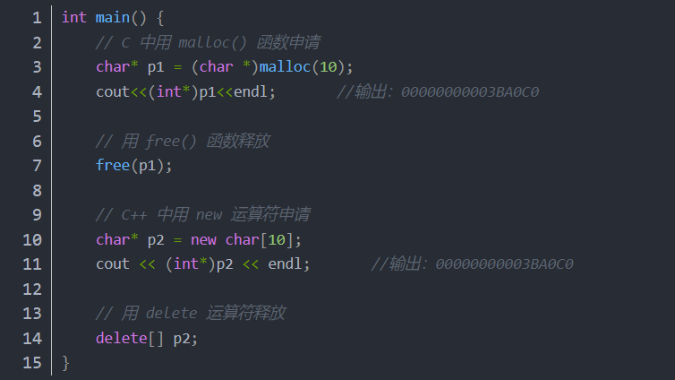


其中 p1 所指的 10 字节的内存空间与 p2 所指的 10 字节内存空间都是存在于堆。堆的内存地址生长方向与栈相反，由低到高，但需要注意的是，后申请的内存空间并不一定在先申请的内存空间的后面，即 p2 指向的地址并不一定大于 p1 所指向的内存地址，原因是先申请的内存空间一旦被释放，后申请的内存空间则会利用先前被释放的内存，从而导致先后分配的内存空间在地址上不存在先后关系。堆中存储的数据若未释放，则其生命周期等同于程序的生命周期。


关于堆上内存空间的分配过程，首先应该知道操作系统有一个记录空闲内存地址的链表，当系统收到程序的申请时，会遍历该链表，寻找第一个空间大于所申请空间的堆节点，然后将该节点从空闲节点链表中删除，并将该节点的空间分配给程序。另外，对于大多数系统，会在这块内存空间中的首地址处记录本次分配的大小，这样，代码中的delete语句才能正确地释放本内存空间。由于找到的堆节点的大小不一定正好等于申请的大小，系统会自动地将多余的那部分重新放入空闲链表。


堆是一种常用的树形结构，是一种特殊的完全二叉树，当且仅当满足所有节点的值总是不大于或不小于其父节点的值的完全二叉树被称之为堆。


# 分析Linux-类Unix环境下的.SO文件


## linux c下的.c .h .o .so .a文件 可执行文件 gcc使用

## ELF(Executable and Linking Format)


其中： -  .text 节里装载了程序的可执行机器码 - .rodata 节里装载了只读数据 - .data  节里面装载了被初始化的数据，包括全局和静态C变量 - .bss 节里面装载了未被初始化的全局和静态C变量(在目标文件中只是占位符，不占空间) - .symtab 或者 .dynsym 节里面装载了符号信息 - 以 .rel 打头的 节里面装载了重定位条目 - .debug  一个调试符号表，只有使用了`-g`参数编译时才会有，用于debug - .line 用于记录C源程序的行号和.text节中机器指令之间的映射，也是只有使用了`-g`参数编译时才会有 - .strtab 或者 .dynstr 节里面装载了字符串信息（以null结尾的字符串信息）


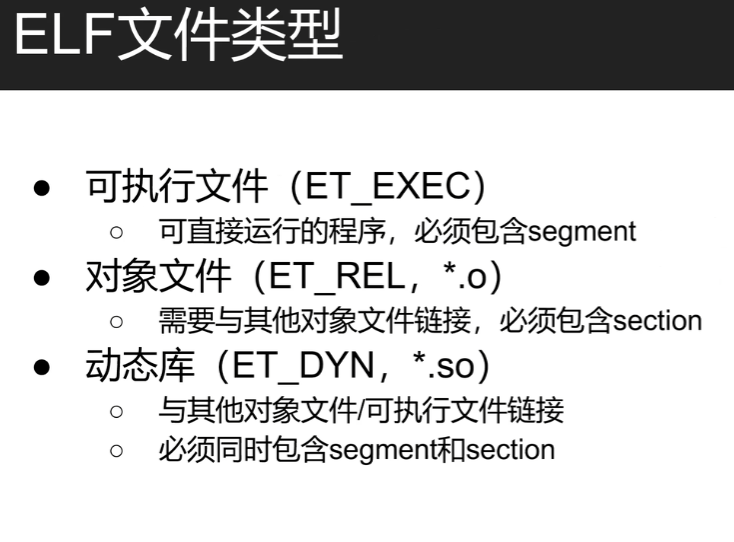

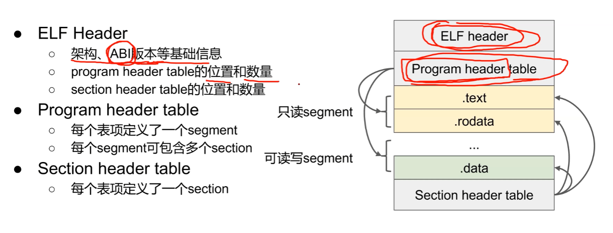


linux下c语言工程：

c文件：主要每个模块的原代码都在c文件中。

h文件：每个c文件都跟着一个h文件，h文件的作用是放着c文件中函数的声明，结构体的定义，宏的定义等。

o文件：目标文件。每个文件经过编译都会形成一个目标文件（二进制文件），多个目标文件链接后才能形成可执行文件。

o文件如何形成： gcc -c a.c

可执行文件：

不论是c文件还是o文件，都是无法执行的，最终还要生成可执行的文件。

gcc  a.c b.c c.c -o run  将c文件编译后链接，生成可执行文件

gcc a.o b.o c.o -o run  将目标文件链接为可执行文件

 

a文件：将o文件打包生成的静态库。

 

so文件：形成动态库，当程序运行的时候才加载进来。

生成so文件：gcc a.c b.c c.c -fpic  -shared -o  librun.so

.o文件
.o文件是源码编译出的二进制文件。
你先得了解从源代码到可执行文件的过程。以一个简单的add函数源文件为例。

```
int add(int a,int b)
{
    return a+b;
}
```

 


先预处理为.i文件
gcc -E add.c -o add.i
再编译为汇编文件
gcc -S add.i -o add.s
再汇编为二进制的.o文件
gcc -c add.s -o add.o

好，现在.o文件出来了。它就是C/C++编译的产物，因为C/C++编译的单元编译。每一个.c/.cpp文件就是一个编译单元，把所有单元都编译好之后，再连接成一个完成的程序。

.a文件
.a文件实质上就是.o文件打了个包。一般把它叫做静态库文件。它在使用的时候，效果和使用.o文件是一样的。

.so文件
**.so文件就不一样了,它不是简单的.o文件打了一个包，它是一个ELF格式的文件，也就是linux的可执行文件。**
.so文件可以用于多个进程的共享使用（位置无关的才行），所以又叫共享库文件。程序在使用它的时候，会在运行时把它映射到自己进程空间的某一处，其不在使用它的程序中。


**readelf 命令**

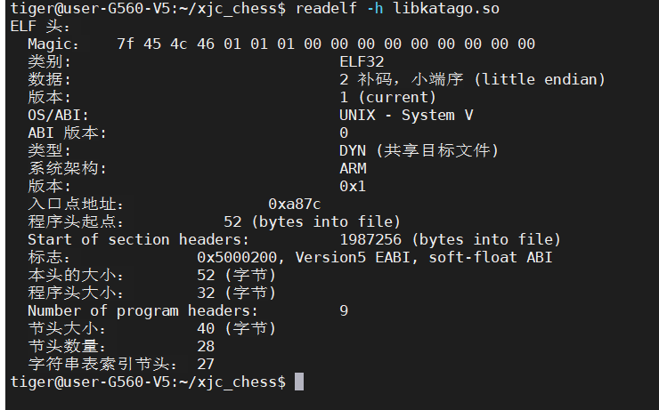

[(48条消息) Linux下可执行文件格式详解_永不放弃的地盘-CSDN博客_linux可执行文件格式](https://blog.csdn.net/topasstem8/article/details/38730971)

**ELF(Executable and Linking Format)文件顾名思义就知道这种文件同时兼具可执行于可连接的作用。**


Entry point address 指的是程序入口地址，如果是可执行文件，这个字段会有值；

Start of program headers 指的是 程序头表 的起始位置。程序头表 是从装载视图的角度对elf的各个段进行的分类信息；结构和段表相似；

Start of section headers 指出了elf除文件头以外的最重要的信息：段表 的起始位置。段表包含了各个段的名称、属性、大小、位置等重要信息。操作系统首先找到段表，然后根据段表的信息去找到各个段。段表是一个类似数组的结构，一个段的信息是这个数组的一个元素。

Size of this header 指的是头文件大小，32位都是 52 个字节，0x34个字节。

Size of program headers 指的是每个 程序头表 的大小。

Number of program headers 指的是 程序头表 的数目。

Size of sections headers 指的是每个 段表 的大小；

Number of section headers 指的是 段表的数量；

Section header string table index 指出了段表当中用到的字符串表在段表中的下标。


## readelf 指令

**readelf -d      查看以来的so 库的名称**

**-S（大写）   汇总显示ELF文件的所有section header的信息**

**-t    详细显示section header**

**-s（小写）   显示符号表 symbol table**

**-x <section number | name>   以十六进制的形式，显示某个section的内容**

**-h   显示elf文件头。**

**-r   显示重定位表（.rel...段）的信息。**

**-a  显示所有信息。**

**-l   --program-headers   --segments 显示程序头（段头）信息(如果有的话)。** 

**-g  --section-groups 显示节组信息(如果有的话)。** 

**-e  --headers 显示全部头信息，等价于: -h -l -S** 

**-r  --relocs 显示可重定位段的信息。**

**-u  --unwind 显示unwind段信息。当前只支持IA64 ELF的unwind段信息。** 

**-d  --dynamic 显示动态段的信息。** 

**-A  --arch-specific 显示CPU构架信息。** 

**-D  --use-dynamic 使用动态段中的符号表显示符号，而不是使用符号段。** 

**-I  --histogram 显示符号的时候，显示bucket list长度的柱状图**

**-v  --version 显示readelf的版本信息。**

**-V  --version-info 显示版本段的信息。**

## objdump命令

是用查看目标文件或者可执行的目标文件的构成的[gcc](http://man.linuxde.net/gcc)工具。 


**在链接的时候指定入口是可以制造可以运行的.so文件的**

典型的例子：

- /lib64/ld-linux-x86-64.so.2
- /lib64/libc.so.6

**可以的，在编译的时候给它指定入口地址，比如gcc的-e选项**


**Linux下的so文件通常是作为动态链接库使用的，但其实so文件跟可执行程序一样都是ELF格式，所以应该都是可以直接执行的。 在Linux下的很多so库文件都是可以直接执行的，不过通常只是打印出编译信息。例如：**

```
/lib64/ld-linux-x86-64.so.2
```

```
/lib/x86_64-linux-gnu/libpthread.so.0
```

```
/lib/x86_64-linux-gnu/libc.so.6
```

但不是所有版本的Linux下都能运行，有的是找不到的

要让一个so文件可直接执行，只需要在编译时指定入口函数即可

`-Wl`表示传递给链接器ld的参数，分隔的逗号会被替换成空格。`-e,lib_entry`就指明了入口函数。 编译生成的libservice.so就可以直接执行了：


**windows下  的exe**

rundll是怎么执行的呢，根据[微软支持文档](https://link.zhihu.com/?target=https%3A//support.microsoft.com/zh-cn/help/164787/info-windows-rundll-and-rundll32-interface)的说明

> Rundll 执行以下步骤：
> \1. 它分析命令行。
> \2. 它通过 LoadLibrary() 加载指定的 DLL。
> \3. 它通过 GetProcAddress() 获取 <entrypoint> 函数的地址。
> \4. 它调用 <entrypoint> 函数，并传递作为 <optional arguments> 的命令行尾。
> \5. 当 <entrypoint> 函数返回时，Rundll.exe 将卸载 DLL 并退出。

需要被LoadLibrary动态加载，因此我并不认为rundll执行dll属于直接运行。

以及评论区对于**直接运行**的理解似乎有分歧，只能怪题主没有说明清楚了。我的理解是能直接被内核加载运行，运行时有自己独立的进程ID不需要依赖于其它的可执行文件而存在，或者说可以被execve或者CreateProcess的。


dll和exe均为PE格式的文件，但是dll不能直接被Windows加载执行，因为

\1. PE中有一个[比特记录文件](https://www.zhihu.com/search?q=比特记录文件&search_source=Entity&hybrid_search_source=Entity&hybrid_search_extra={"sourceType"%3A"answer"%2C"sourceId"%3A310217890})是dll还是exe，Windows会拒绝加载dll文件。

\2. dll没有[入口函数](https://www.zhihu.com/search?q=入口函数&search_source=Entity&hybrid_search_source=Entity&hybrid_search_extra={"sourceType"%3A"answer"%2C"sourceId"%3A310217890})，说白了就是Windows不知道从哪里开始执行这个文件。

dll也就是动态链接库，是被系统在exe运行时加载的，so也是一个道理。

dll和so的另一个相似之处大概是他们的格式都和各自对应系统上的[二进制](https://www.zhihu.com/search?q=二进制&search_source=Entity&hybrid_search_source=Entity&hybrid_search_extra={"sourceType"%3A"answer"%2C"sourceId"%3A310217890})可执行文件格式相同


**程序总是从main*函数*的第一条语句开始执行的 正确吗？**

[程序总是从main函数的第一条语句开始执行的 正确吗？ - 知乎 (zhihu.com)](https://www.zhihu.com/question/284419756/answer/1891986753)

**不是这样的，程序不一定都是是从[main函数](https://www.zhihu.com/search?q=main函数&search_source=Entity&hybrid_search_source=Entity&hybrid_search_extra={"sourceType"%3A"answer"%2C"sourceId"%3A"1891986753"})的第一条语句开始执行，而且程序入口函数是可以指定的，无论是Windows还是Linux都是这样，我主要举例Linux**。

其实在main函数调用之前，程序已经做了一大部分工作，为了保证程序可以顺利进行，要先初始化进程执行环境，如堆分配初始化、[线程子系统](https://www.zhihu.com/search?q=线程子系统&search_source=Entity&hybrid_search_source=Entity&hybrid_search_extra={"sourceType"%3A"answer"%2C"sourceId"%3A"1891986753"})等，C++的全局对象构造函数也是这一时期被执行的，[全局析构函数](https://www.zhihu.com/search?q=全局析构函数&search_source=Entity&hybrid_search_source=Entity&hybrid_search_extra={"sourceType"%3A"answer"%2C"sourceId"%3A"1891986753"})是main之后执行的。


这里涉及到一些编译链接方面的知识，Linux一般程序的入口是__start函数，有两个段：

- .init段：进程的初始化代码，一个程序开始运行时，在main函数调用之前，会先运行.init段中的代码。
- .fini段：进程终止代码，当main函数正常退出后，glibc会安排执行该段代码。

**那如何指定程序入口呢？**

其实可以在链接过程中指定，**在ld链接过程中使用-e参数可以指定程序入口**，由于一段简短的[printf函数](https://www.zhihu.com/search?q=printf函数&search_source=Entity&hybrid_search_source=Entity&hybrid_search_extra={"sourceType"%3A"answer"%2C"sourceId"%3A"1891986753"})其实都依赖了好多个链接库，我们也不太方便使用链接脚本将目标文件与所有这些依赖库进行链接，所以使用下面这段内嵌汇编的程序来打印一段字符串，这段程序不依赖任何链接库就可以打印出字符串内容，读者如果不懂其中的含义也不用担心，只需要了解下面介绍的链接知识就好。

**代码如下：**

```text
const char* str = "hello";

void print() {
    asm("movl $13,%%edx \n\t"
        "movl str,%%ecx \n\t"
        "movl $0,%%ebx \n\t"
        "movl $4,%%eax \n\t"
        "int $0x80 \n\t"
        :
        :"r"(str):"edx", "ecx", "ebx");
}


void exit() {
    asm("movl $42,%ebx \n\t"
        "movl $1,%eax \n\t"
        "int $0x80 \n\t");
}

void nomain() {
    print();
    exit();
}
```

**使用如下命令生成目标文件：**

```text
gcc -c -fno-builtin test.c
```


**看下输出的test.o的符号：**


**再使用-e指定入口函数符号：**


```text
~/test$ ld -static -e nomain -o test test.o
~/test$ ./test
hello
```


**搞定，得出结论，程序不是从main函数的第一条语句开始执行，而且没有main函数也可以让程序执行。**

**main函数就是这个约定好的用户代码默认入口。当然，只要你愿意，改成啥都行**


## 启动一个独立可执行程序


1. 创建一个独立进程，将映像文件加载到进程的[内存空间](https://www.zhihu.com/search?q=内存空间&search_source=Entity&hybrid_search_source=Entity&hybrid_search_extra={"sourceType"%3A"answer"%2C"sourceId"%3A"511509451"})

2. 创建一个线程，将线程的程序计数器（也就是当前执行的代码的地址）按加载时的约定指向映像内容的某个位置

3. 启动线程，开始执行映像里的机器码

一般来说，只有纯汇编中起始地址才是用户自己编写的代码，通过常见的编程语言编写的程序，起始地址都是编程语言的runtime，在这里通常要进行一些对语言来说必要的初始化，例如C需要初始化C库中的[静态数据](https://www.zhihu.com/search?q=静态数据&search_source=Entity&hybrid_search_source=Entity&hybrid_search_extra={"sourceType"%3A"answer"%2C"sourceId"%3A"511509451"})之类。接下来，runtime也会按照约定再以某种方式调用[用户代码](https://www.zhihu.com/search?q=用户代码&search_source=Entity&hybrid_search_source=Entity&hybrid_search_extra={"sourceType"%3A"answer"%2C"sourceId"%3A"511509451"})。这里有几种典型的例子：

1. 初始化后调用某个入口点（如main），然后将执行过程完整移交给用户代码，直到退出后执行清理操作。这是C++之类语言的典型启动过程，也是绝大多数控制台程序的启动过程。

2. runtime自带一些框架功能，启动后初始化框架并进入自己内部的固定循环，典型例子是.Net下的winform应用，启动后会自动加载窗体，用户代码表现为事件回调

3. 两者的结合，首先加载框架，但是在加载完成后，通过框架直接调用[用户程序](https://www.zhihu.com/search?q=用户程序&search_source=Entity&hybrid_search_source=Entity&hybrid_search_extra={"sourceType"%3A"answer"%2C"sourceId"%3A"511509451"})的入口点，将执行过程完整移交，但保留了用户通过某些方式使用框架的能力，典型例子是golang的常见runtime，其实会启动一个自己的调度器，而main是调度器里的一个goroutine。其他某些通过用户态实现[多线程](https://www.zhihu.com/search?q=多线程&search_source=Entity&hybrid_search_source=Entity&hybrid_search_extra={"sourceType"%3A"answer"%2C"sourceId"%3A"511509451"})的runtime也有类似结构。

实际上，runtime和系统库的边界是比较暧昧的，许多时候启动代码中其实包含大量系统库的代码。使用第三方框架时，往往也存在框架直接接管了main的情况，实际上这些情形都是类似的，没有必要[教条主义](https://www.zhihu.com/search?q=教条主义&search_source=Entity&hybrid_search_source=Entity&hybrid_search_extra={"sourceType"%3A"answer"%2C"sourceId"%3A"511509451"})，理清执行路线即可。


## 实现可执行的so文件

[cpp»实现可执行的so文件 (hustyx.com)](https://www.hustyx.com/cpp/89/#:~:text=Linux下的s,可以直接执行的。)

Linux下的so文件通常是作为动态链接库使用的，但其实so文件跟可执行程序一样都是ELF格式，所以应该都是可以直接执行的。 在Linux下的很多so库文件都是可以直接执行的，不过通常只是打印出编译信息。例如：

```
/lib64/ld-linux-x86-64.so.2
```

还有

```
/lib/x86_64-linux-gnu/libpthread.so.0
```

还有

```
/lib/x86_64-linux-gnu/libc.so.6
```

特别说明一下，我的系统为Ubuntu 10.04 64bit版本。

要让一个so文件可直接执行，只需要在编译时指定入口函数即可，否则强制执行一个so文件会导致出core。gcc和g++，即C和C++在实现步骤上略有不同。


**gcc编译**

例如有源文件service.c

```
#include <stdio.h>
#include <stdlib.h>

const char service_interp[] __attribute__((section(".interp"))) = "/lib64/ld-linux-x86-64.so.2";

void lib_service()
{
    printf("This is a service of the shared library\n");
} 

void lib_entry()
{
    printf("Entry point of the service library\n");
    exit(0);
}
```


注意，service_interp变量指明了ld.so的位置，不同的Linux系统略有不同，函数lib_entry()必须以`exit(0)`结束。 编译指令：

```
gcc -shared service.c -o libservice.so -Wl,-e,lib_entry -fPIC
```

`-Wl`表示传递给链接器ld的参数，分隔的逗号会被替换成空格。`-e,lib_entry`就指明了入口函数。 编译生成的libservice.so就可以直接执行了：

```
ubuntu:/tmp/service$ ./libservice.so 
Entry point of the service library
```

当然，这丝毫不会影响libservice.so作为动态链接库的功能。


**执行是能执行(如/lib64/libc-xx.so),但如果不特殊处理下 一般so执行都会报段错误的, 给你的so加个.interp节指定下连接器地址并指定下入口函数就可以了正常执行了哈**


```c
void hello() {
    static const char *msg = "Hello, World!\n";
    asm(
        "movq $1, %%rax\n"
        "movq $1, %%rdi\n"
        "movq %0, %%rsi\n"
        "movq $14, %%rdx\n"
        "syscall\n"
        :
        : "r"(msg)
        : "%rax" , "%rdi" , "%rsi", "%rdx"
    );
}

int main() {
    hello();
}
```

保存为hw.c，编译选项

```bash
gcc -fPIC  -Wl,-E -pie -o libhw.so hw.c
```


**./libhw.so**  

**输出 Hello, World!**


## 指定可执行程序的函数入口（非main）

https://blog.csdn.net/justlinux2010/article/details/11621087


**g++编译**

上面的例子是编译C代码，如果要编译C++代码，基本没有什么不同，除了使用g++外，就是得注意函数名的重构问题。 有两种处理方式，其一，使用`extern "C"`迫使函数名保持原样，其二，先使用`g++ -c`将代码编译成`.o`文件， 再使用`readelf -s service.o`来查看重构之后的函数名，在编译时使用重构后的函数名，例如：`-Wl,-e,_Z10test_entryv`。

再值得注意一点的是，入口函数及其所调用的函数不能使用C++的输入输出类，即不能使用cout、cin之类，否则就会core。 使用C函数进行输入输出操作是没有问题的，我觉得这个问题是可以解决的，但我目前没有找到问题在哪，先留个TODO在此。

**总结**

将程序的核心逻辑进行so化是有相当多好处的，比如可以进行多实例部署，可以将词典资源抽离出来，可以加快服务拉起， 可以充分利用机器资源等。而给so文件直接可执行的功能，就可以方便地了解so文件编译信息、版本信息、使用方法等。


**亲测有效**


**运行结果**


**结论，SO既是函数链接库，也可以是可执行文件，就像exe那样可执行**


  **GCC能编译出2种格式的可执行体：a.out格式、elf格式。其中.o目标文件、.a静态库文件**
**Appendix.1 常用命令**
**ldd：显示可执行文件或者库文件依赖的库文件。**
**objdump：显示elf可执行文件的内部信息。**
  **-h：显示**
  **-t：显示符号信息**
  **-T：显示动态符号信息。（例如引用动态链接库中的函数名称）**
  **-r：显示重定位入口信息。**
  **-R：显示动态重定位入口信息。（例如：动态链接库中的变量或者函数地址）**
  **-s：显示所有section内容。**
  **-S：反汇编代码段。**
**objcopy：copy elf文件内容**
  **-R：删除某个section**
  **-j：仅仅复制指定的section**


## SO加载解析过程

参考：https://shuwoom.com/?p=351

**so加载的全局流程函数关系如下图所示：**


**Java层的函数调用关系图如下：**


JAVA层中加载so函数开始作为入口点进行追踪。

```
System.loadLibrary(“libxxx.so”);
```


**loadLibrary函数内调用了Runtime类里的loadLibrary函数。该函数主要是搜索so库，加载并链接so文件。**


**2 Native层函数调用关系**


**How to make executable shared libraries**


## 关于调用第三方SO包的问题


### 1、如何添加第三方的so包


### **2、使用第三方so包**  


**新建一个java类，这个类名特别讲究，必须和当时建立编译这个so的时候的函数所在的类名一致；而且java脚本所在的文件夹包名也要和当时编译so包的包名一致**


```
//  编译报错：  No implementation found for int com.example.goapplication.MainActivity.reinition() (tried Java_com_example_goapplication_MainActivity_reinition and Java_com_example_goapplication_MainActivity_reinition__)

//so文件在生成的时候，工程名和类名要设置的和将要使用的工程一致，才可以调用成功。
```


**举个例子：**


**这个JNI函数（public native String stringFromJNI()）的CPP对应是：**


```
Java_com_example_goapplication_MainActivity_stringFromJNI
```

**这就指明了这个jni函数的一些信息：**

**com_example_goapplication: 表示这个函数所属的包为**


**MainActivity： 表示这个函数所属的类**


**stringFromJNI: 函数名**


**比如我建立了一个test_katago的java类，并且里面有个函数test_katago()本地JNI函数，我把他编译到goapplication.so里面**

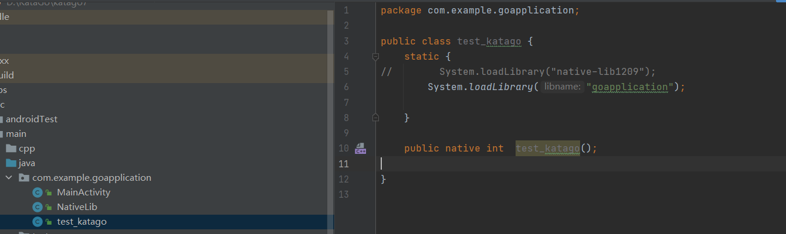

**编译的时候需要启用CMakeLists.txt**


**编译成一个so包以后，怎么将这个so包作为第三方包，移植到别的app开发中**

**1、新建工程，配置好build.gradle(app)**

**把so拉进来**


**2、新建同包名同类名的java脚本**


**加载so，声明so里面的同名函数**


**定义so包里面的函数**


**测试结果**


**so包里面源码函数**


**结果一致**


## Java调用so文件

https://blog.csdn.net/zjq852533445/article/details/87252214?utm_medium=distribute.pc_relevant.none-task-blog-2~default~baidujs_baidulandingword~default-0.no_search_link&spm=1001.2101.3001.4242.1


## so库方法的调用过程


https://blog.csdn.net/cr459464757/article/details/93377329

## 在命令行下用cmake交叉编译可在android中运行的so包

https://blog.csdn.net/qq_16149777/article/details/87276378

https://blog.csdn.net/MingHuang2017/article/details/79000345?spm=1001.2101.3001.6650.1&utm_medium=distribute.pc_relevant.none-task-blog-2%7Edefault%7ECTRLIST%7Edefault-1.no_search_link&depth_1-utm_source=distribute.pc_relevant.none-task-blog-2%7Edefault%7ECTRLIST%7Edefault-1.no_search_link

## ARM交叉编译工具链分类说明

https://blog.csdn.net/qq_16149777/article/details/82349868?spm=1001.2014.3001.5502


## gcc 命令的常用选项 

https://blog.csdn.net/u013836909/article/details/107770465

| 选项         | 解释                                                         |
| ------------ | ------------------------------------------------------------ |
| -ansi        | 只支持 ANSI 标准的 C 语法。这一选项将禁止 GNU C 的某些特色， 例如 asm 或 typeof 关键词。 |
| -c           | 只编译并生成目标文件。                                       |
| -DMACRO      | 以字符串"1"定义 MACRO 宏。                                   |
| -DMACRO=DEFN | 以字符串"DEFN"定义 MACRO 宏。                                |
| -E           | 只运行 C 预编译器。                                          |
| -g           | 生成调试信息。GNU 调试器可利用该信息。                       |
| -IDIRECTORY  | 指定额外的头文件搜索路径DIRECTORY。                          |
| -LDIRECTORY  | 指定额外的函数库搜索路径DIRECTORY。                          |
| -lLIBRARY    | 连接时搜索指定的函数库LIBRARY。                              |
| -m486        | 针对 486 进行代码优化。                                      |
| -o FILE      | 生成指定的输出文件。用在生成可执行文件时。                   |
| -O0          | 不进行优化处理。                                             |
| -O 或 -O1    | 优化生成代码。                                               |
| -O2          | 进一步优化。                                                 |
| -O3          | 比 -O2 更进一步优化，包括 inline 函数。                      |
| -shared      | 生成共享目标文件。通常用在建立共享库时。                     |
| -static      | 禁止使用共享连接。                                           |
| -UMACRO      | 取消对 MACRO 宏的定义。                                      |
| -w           | 不生成任何警告信息。                                         |
| -Wall        | 生成所有警告信息。                                           |

**-e entry
-entry=entry**
 指定程序入口点为entry。参数由链接器解释；GNU链接器接受符号名称或地址。

**-pie**
 在支持它的目标上生成一个动态链接的位置无关可执行文件。为了获得可预测的结果，还必须指定用于编译的相同选项集（-fpie， -fPIE，或model suboptions）。

**-shared**
产生一个动态库，然后可以将其与其他对象链接以**形成可执行文件**。并非所有系统都支持此选项。为了获得可预测的结果，还必须指定用于编译的相同选项集（-fpic， -fPIC，或model suboptions）。用法：gcc -shared foo.o -o libfoo.so


**-flinker-output=type**
此选项控制链接时间优化器的代码生成。默认情况下，链接器输出由链接器插件自动确定。为了调试编译器，并且如果需要与non-LTO目标文件进行增量链接，则手动控制类型可能很有用。
如果类型为“exec”，代码生成会生成静态二进制文件。在这种情况下-fpic 和 -fpie 都被禁用。
如果类型为“dyn”，代码生成产生一个共享库。在这种情况下-fpic 要么 -fPIC保留，但不会自动启用。这样就可以在可能的体系结构（即x86）上构建不带位置无关代码的共享库。
如果类型为“pie”，代码生成会产生一个 -fpie 可执行文件。这样会产生与“执行’ 除了那个 -fpie 如果在编译时指定，则不禁用。
如果类型为“rel’，编译器假定已完成增量链接。包含用于链接时间优化的中间代码的部分将合并，预先优化，然后输出到生成的目标文件中。另外，如果 -ffat-lto-objects如果指定，将生成二进制代码以用于将来的no-LTO链接。通过增量链接生成的目标文件比从相同目标文件生成的静态库小。在链接时，假设使用了库中的大多数对象，则增量链接的结果也比静态库加载得更快。
“nolto-rel”将编译器配置为进行增量链接，其中强制执行代码生成，生成最终的二进制文件，并剥离用于后续链接时间优化的中间代码。当将多个目标文件链接在一起时，与禁用链接时优化（例如，发生跨模块内联）相比，对结果代码的优化效果更好，但是整个程序优化的大部分好处都将丢失。
在增量链接期间（通过 -r）链接器插件默认为 rel。但是，使用GNU Binutils的当前接口，不可能将LTO对象和no-LTO对象增量链接到单个混合对象文件中。如果增量链接中的任何目标文件不能用于链接时优化，则链接器插件会发出警告并使用“nolto-rel”。为了保持整个程序的优化，建议将此类对象链接到静态库中。


## g++编译

- 第一步：   **编译预处理**，也称预编译，可以使用命令`g++ -E`执行

- 第二步：   **编译**，可以使用`g++ -S`执行
- 第三步：   **汇编**，可以使用`as` 或者`g++ -c`执行
- 第四步：    **链接**，可以使用`g++ xxx.o xxx.so xxx.a`执行


- `shared`:告诉编译器生成一个动态链接库

- `-Wl,-soname`:指示生成的动态链接库的别名（这里是`libtest.so`）

- `-o`:指示实际生成的动态链接库（这里是`libtest.so.0.1`）

- `-fPIC`

  - fPIC的全称是 `Position Independent Code`， 用于生成位置无关代码（看不懂没关系，总之加上这个参数，别的代码在引用这个库的时候才更方便，反之，稍不注意就会有各种乱七八糟的报错）。

  - 使用-fPIC选项生成的动态库，是位置无关的。这样的代码本身就能被放到线性地址空间的任意位置，无需修改就能正确执行。通常的方法是获取指令指针的值，加上一个偏移得到全局变量/函数的地址。

    gcc编译参数-fPIC的一些问题------>[gcc编译参数-fPIC的一些问题_老徐_新浪博客 (sina.com.cn)](http://blog.sina.com.cn/s/blog_54f82cc201011op1.html)

   在gcc中，如果指定`-shared`不指定`-fPIC`会报错，无法生成非PIC的动态库，不过`clang`可以。

 **-l**参数和**-L**参数 (添加引用链接库、添加包含路径)

**-l**参数就是用来指定程序要链接的库，-l参数紧接着就是库名

**就是指定链接时去（哪里）找（什么）库。**

​		如：-I /home/hello/include

​		表示将/home/hello/include目录作为第一个寻找头文件的目录。

**-Wl:rpath**  ,添加运行时库路径

​		如：-Wl:rpath=/home/hello/lib

​		表示将/home/hello/lib目录作为程序运行时第一个寻找库文件的目录，程序寻找顺序是：/home/hello/lib-->/usr/lib-->/usr/local/lib。

-L,添加链接库路径

​		-L 后跟路径，告诉链接器从哪找库(.so文件)，只有在链接时会用到。

​		如：-L /home/hello/lib

​		表示将/home/hello/lib目录作为第一个寻找库文件的目录，寻找顺序是：/home/hello/lib-->/usr/lib-->/usr/local/lib

**调试选项**

**-g**

只是编译器，在编译的时候，产生调试信息。

**-gstabs**

此选项以stabs格式声称调试信息,但是不包括gdb调试信息.

**-gstabs+**

此选项以stabs格式声称调试信息,并且包含仅供gdb使用的额外调试信息.

-**ggdb**

此选项将尽可能的生成gdb的可以使用的调试信息.

-**glevel**

请求生成调试信息，同时用level指出需要多少信息，默认的level值是2


**错误与警告**

-**Wall**

一般使用该选项，允许发出GCC能够提供的所有有用的警告。也可以用-W{warning}来标记指定的警告。

-**pedantic**

允许发出ANSI/ISO C标准所列出的所有警告

**-pedantic-errors**

允许发出ANSI/ISO C标准所列出的错误

-**werror**

把所有警告转换为错误，以在警告发生时中止编译过程

-**w**

关闭所有警告,建议不要使用此项

**预处理选项**

-**Dmacro**

相当于C语言中的#define macro

-**Dmacro=defn**

相当于C语言中的#define macro=defn

-**Umacro**

相当于C语言中的#undef macro

-**undef**

取消对任何非标准宏的定义

**其他选项**

**-o**

制定目标名称,缺省的时候,gcc 编译出来的文件是a.out

gcc -o hello hello.c 
-O0
-O1
-O2
-O3
编译器的优化选项的4个级别，-O0表示没有优化,-O1为缺省值，-O3优化级别最高

**-fpic**

编译器就生成位置无关目标码.适用于共享库(shared library).

**-fPIC**

编译器就输出位置无关目标码.适用于动态连接(dynamic linking),即使分支需要大范围转移.

**-v**

显示详细的编译、汇编、连接命令


**静态编译和动态编译**

编译C++的程序可以分为动态编译和静态编译两种

​	**静态编译**
链接阶段，会将汇编生成的目标文件.o与引用到的库一起链接打包到可执行文件中。这种称为静态编译，静态编译中使用的库就是静态库（*.a 或*.lib）生成的可执行文件在运行时不需要依赖于链接库。

​	优点：
代码的装载速度快，执行速度也比较快
不依赖其他库执行，移植方便
​	缺点：
程序体积大
更新不方便，如果静态库需要更新，程序需要重新编译
如果多个应用程序使用的话，会被装载多次，浪费内存

​	**动态编译**

动态库在程序编译时并不会被连接到目标代码中，而是在程序运行是才被载入。不同的应用程序如果调用相同的库，那么在内存里只需要有一份该共享库的实例，规避了空间浪费问题。

动态编译中使用的库就是动态库（`*.so` 或`*.dll`）

动态库在程序运行是才被载入，也解决了静态库对程序的更新、部署和发布页会带来麻烦。用户只需要更新动态库即可，增量更新。

- 优点：
  - 多个应用程序可以使用同一个动态库，而不需要在磁盘上存储多个拷贝
  - 动态灵活，增量更新
- 缺点：
  - 由于是运行时加载，多多少少会影响程序的前期执行性能
  - 动态库缺失会导致文件无法运行


# 2022-01-10

## Integrate Arm NN into an Android app Tutorial

将Arm NN集成到Android应用中教程    [Integrate Arm NN into an Android app Tutorial](https://developer.arm.com/documentation/102744/latest)

### 被低估的ArmNN

[ARM-software/armnn: Arm NN ML Software. The code here is a read-only mirror of https://review.mlplatform.org/admin/repos/ml/armnn (github.com)](https://github.com/ARM-software/armnn)


### armnn常用接口

参考链接：
 [https://www.arm.com/solutions/artificial-intelligence](https://links.jianshu.com/go?to=https%3A%2F%2Fwww.arm.com%2Fsolutions%2Fartificial-intelligence)
 [https://developer.arm.com/ip-products/processors/machine-learning/arm-nn](https://links.jianshu.com/go?to=https%3A%2F%2Fdeveloper.arm.com%2Fip-products%2Fprocessors%2Fmachine-learning%2Farm-nn)
 [https://github.com/Arm-software/armnn](https://links.jianshu.com/go?to=https%3A%2F%2Fgithub.com%2FArm-software%2Farmnn)
 [http://www.elecfans.com/d/643409.html](https://links.jianshu.com/go?to=http%3A%2F%2Fwww.elecfans.com%2Fd%2F643409.html)


armnn是arm公司推出的一项开源软件，可在基于arm的高性能平台上完成机器学习应用程序的构建和运行

armnn桥接了底层硬件和深度学习框架（tf, tf_lite, caffe, 等），可以在编程过程中选择用到的后台计算硬件（包括CPU，mali GPU或者arm的专用NPU）这样我们能够很方便地在嵌入式平台上搭建训练好的深度学习模型，并配合opencv或者其他开源框架构建完整的人工智能应用。

本文将大致总结一下用armnn来运行一个神经网络需要的步骤
 需要包含的头文件

```cpp
#include "armnn/ArmNN.hpp"
#include "armnn/Exceptions.hpp"
#include "armnn/Tensor.hpp"
#include "armnn/INetwork.hpp"
#include "armnnTfParser/ITfParser.hpp"
```

armnn运行一个神经网络的过程主要包括如下步骤：

1. **读取模型，创建网络**

```php
armnnTfParser::ITfParserPtr parser = armnnTfParser::ITfParser::Create();
armnn::INetworkPtr network = parser->CreateNetworkFromBinaryFile(输入数据（指针）,{{input_tensor_name, 输入tensor的size}},{output_tensor_name});

armnnTfParser::BindingPointInfo inputBindingInfo = parser->GetNetworkInputBindingInfo(input_tensor_name);
armnnTfParser::BindingPointInfo outputBindingInfo = parser->GetNetworkOutputBindingInfo(output_tensor_name);
```


**2.配置运行参数**，其中可以指定用到的后台，包括CPU，GPU。其中使用GPU能够明显提升神经网络运行速度，在RK3399平台上，对于一个基于resnet-18的语义分割网络（两个resnet-18正向反向相接，pb格式的模型大小约为90MB），使用GpuAcc选项运行时间大概在1.2s左右，使用CpuRef选项用时接近200s,而直接使用tensorflow for aarch64的python接口，运行时间在4s左右(可能是编译好的tensorflow for aarch64中使用了一些加速方法)。不过使用GPU存在的一个问题就是IO时间要比使用CPU长很多，如果跑一些小网络（比如lenet-5,使用CPU循环执行500000次用时16s，用GPU循环执行5000次同样用时16s）使用CPU来完成会更好。

```rust
armnn::IRuntime::CreationOptions options;
armnn::IRuntimePtr runtime = armnn::IRuntime::Create(options);
options.m_EnableGpuProfiling = false;
options.m_GpuAccTunedParameters = armnn::IGpuAccTunedParameters::Create(armnn::IGpuAccTunedParameters::Mode::UseTunedParameters);
armnn::IOptimizedNetworkPtr optNet = armnn::Optimize(*network, {armnn::Compute::GpuAcc}, runtime->GetDeviceSpec());

armnn::NetworkId networkIdentifier;
runtime->LoadNetwork(networkIdentifier, std::move(optNet));
```

 **3.读入数据并运行模型**

```php
armnn::Status ret = runtime->EnqueueWorkload(networkIdentifier,MakeInputTensors(inputBindingInfo, &arr_256[0]),MakeOutputTensors(outputBindingInfo, &output[0]));
```

其中函数 makeInputTensor 和 makeOutputTensor定义如下：

```php
armnn::InputTensors MakeInputTensors(const std::pair<armnn::LayerBindingId,armnn::TensorInfo> &input, const void *inputTensorData)
{
    return {{input.first, armnn::ConstTensor(input.second, inputTensorData)}};
}

// Helper function to make output tensors
armnn::OutputTensors MakeOutputTensors(const std::pair<armnn::LayerBindingId, armnn::TensorInfo> &output, void *outputTensorData)
{
    return {{output.first, armnn::Tensor(output.second, outputTensorData)}};
}
```

## 移植ArmNN

https://blog.csdn.net/yiyayiya557/article/details/107069590


## Google Git

**里面有很过库、包等工具源码**


# 2021-01-26

## Android Process和ProcessBuilder

https://www.apiref.com/android-zh/java/lang/ProcessBuilder.html


Java的ProcessBuilder是一个final类。 public final class ProcessBuilder extends  Object此类**用于创建操作系统进程**。 每个 ProcessBuilder 实例管理一个进程属性集。start() 方法利用这些属性创建一个新的 Process 实例。start() 方法可以从同一实例重复调用，以利用相同的或相关的属性创建新的子进程


这个类用于创建操作系统进程。

每个`ProcessBuilder`实例管理一组进程属性。 `start()`方法使用这些属性创建一个新的`Process`实例。 可以从同一实例重复调用`start()`方法，以创建具有相同或相关属性的新子`start()` 。


制造进程管理这些流程属性：

**1-**command, 指向着一系列可能会被执行的外部文件，和一系列取决于所处系统的操作系统命令

**2-**environment, 取决于所处系统的环境变量，起始值当前进程的环境变量拷贝

**3-**working directory, 默认值是该进程的工作目录。

**4-**standard input、standard output、standout error,指向该进程的各种流，可以通过Process类下的相应方法获得

**5-**redirectErrorStream, 用来指示该进程的standard output和error output是否输出到同一个地方

**请注意，这个类不同步。** 如果多个**线程**同时访问`ProcessBuilder`实例，并且至少有一个线程在结构上修改了其中一个属性，则它*必须*在外部同步。


**构造函数**


**返回一个进程Process类的对象**

```
 Process p = new ProcessBuilder("myCommand", "myArg");
```


Process p = new ProcessBuilder("myCommand", "myArg");

**myCommand：执行什么命令**

**myArg： 执行的命令给予什么参数**

或 

```
private  Process p_test;
p_test =  new ProcessBuilder("myCommand", "myArg");
```


**Process类**

```
public abstract class Process
extends Object
```

`Process`提供对ProcessBuilder.start和Runtime.exec启动的本机进程的控制。 该类提供了从进程执行输入，执行输出到进程，等待进程完成，检查进程的退出状态以及销毁（杀死）进程的方法。 [`ProcessBuilder.start()`](https://www.apiref.com/java11-zh/java.base/java/lang/ProcessBuilder.html#start())和[`Runtime.exec`](https://www.apiref.com/java11-zh/java.base/java/lang/Runtime.html#exec(java.lang.String[],java.lang.String[],java.io.File))方法创建本机进程并返回`Process`的子类实例，该实例可用于控制进程并获取有关它的信息。

创建进程的方法可能不适用于某些本机平台上的特殊进程，例如本机窗口进程，守护程序进程，Microsoft Windows上的Win16 / DOS进程或shell脚本。

默认情况下，创建的进程没有自己的终端或控制台。 其所有的标准I / O（即标准输入，标准输出，标准错误）操作将被重定向到父进程，在那里他们可以经由使用所述方法获得的流进行访问[`getOutputStream()`](https://www.apiref.com/java11-zh/java.base/java/lang/Process.html#getOutputStream()) ， [`getInputStream()`](https://www.apiref.com/java11-zh/java.base/java/lang/Process.html#getInputStream()) ，和[`getErrorStream()`](https://www.apiref.com/java11-zh/java.base/java/lang/Process.html#getErrorStream()) 。 父进程使用这些流将输入提供给进程并从进程输出。 由于某些本机平台仅为标准输入和输出流提供有限的缓冲区大小，因此无法及时写入输入流或读取进程的输出流可能会导致进程阻塞甚至死锁。


**获取输入流**

```
public abstract InputStream getInputStream ()
```

返回连接到子进程正常输出的输入流。流从该`Process`对象表示的进程的标准输出中获取通过管道传输的数据。

如果子进程的标准输出已经被重定向， [`ProcessBuilder.redirectOutput`](https://docs.oracle.com/javase/8/docs/api/java/lang/ProcessBuilder.html#redirectOutput-java.lang.ProcessBuilder.Redirect-) 那么这个方法将返回一个 [空输入流](https://docs.oracle.com/javase/8/docs/api/java/lang/ProcessBuilder.html#redirect-output)。


否则，如果子进程的标准错误已经被重定向， [`ProcessBuilder.redirectErrorStream`](https://docs.oracle.com/javase/8/docs/api/java/lang/ProcessBuilder.html#redirectErrorStream-boolean-) 那么这个方法返回的输入流将接收合并后的标准输出和子进程的标准错误。


以当前的java程序为主角，getInputStream()就是获取例化的process对象的输出结果，对当前的java程序来说，为了获取到process的输出，那么站在这个角度上，数据就是输入方向的


**获取输出流**


```
public abstract OutputStream getOutputStream ()
```

返回连接到子进程正常输入的**输出流**。流的输出通过管道传输到此`Process`对象表示的进程的标准输入。


**获取错误流**


```
public abstract InputStream getErrorStream ()
```

返回连接到子进程错误输出的输入流。流从该`Process`对象表示的进程的错误输出中获取通过管道传输的数据。


Process 创建一条新的线程去执行任务，但创建进程的方法可能无法针对某些本机平台上的特定进程很好地工作。 

  但是ProcessBuilder 是一个final类，用于创建操作系统进程。每个 ProcessBuilder 实例管理一个进程属性集。 

  1）start() 方法利用这些属性创建一个新的 Process 实例。


####   调用外部程序示例


创建了一个查看Java版本号的`ProcessBuilder`

```javascript
ProcessBuilder pb = new ProcessBuilder("java","-version");
```

了`ProcessBuilder`仅仅是第一步，我们还没有实际执行程序。为了执行程序，我们需要调用它的`start()`方法，这会启动进程并返回一个`Process`对象。

```javascript
Process process = pb.start();
```

这样的话，命令行对应的进程就会开始执行。我们可以调用`Process`的`exitValue()`方法获取进程是否成功返回

如果需要获取进程的输出，可以调用`getInputStream()`获取程序的输入流。**需要注意进程的输入输出和我们Java程序的输入输出方向正好是相反的**，所以如果我们想要向进程中传递参数，就需要调用它的`getOutputStream`获取输出流。


```javascript
byte[] bytes = new byte[process.getInputStream().available()];

process.getInputStream().read(bytes);

System.out.println(new String(bytes));
```


**进程的阻塞**

如果你实际执行上面的代码的话，很可能抛出`IllegalThreadStateException`。因为在我们获取程序输出的时候，很有可能当前进程并没有结束。那么获取结果就是不合法的操作。因此，为了安全的等待进程结束，我们需要调用`waitFor()`方法，阻塞当前线程，直到进程退出为止。

所以最后的代码类似这样。在进程启动之后，我们需要阻塞，直到它结束。然后获取返回值和输出结果。

```javascript
ProcessBuilder pb = new ProcessBuilder("java","-version");
Process process = pb.start();
process.waitFor();
System.out.println(process.exitValue());
byte[] bytes = new byte[process.getInputStream().available()];
process.getInputStream().read(bytes);
System.out.println(new String(bytes));
```


`ProcessBuilder`的文档的话，会发现有这么一个方法`redirectErrorStream(boolean)`，该方法的作用是将子进程的错误流重定向到标准输出流上。这样我们使用Process.getInputStream() ，就可以获取到所有输出了。


```javascript
ProcessBuilder pb = new ProcessBuilder("java","-version");
pb.redirectErrorStream(true);
Process process = pb.start();
process.waitFor();
System.out.println(process.exitValue());
byte[] bytes = new byte[process.getInputStream().available()];
process.getInputStream().read(bytes);
System.out.println(new String(bytes));
```


```
 ProcessBuilder pb =
   new ProcessBuilder("myCommand", "myArg1", "myArg2");  // 实例化ProcessBuilder类对象pb
 Map<String, String> env = pb.environment();// 返回环境变量
 pb.command("cmd1","arg1","arg2"); // 重新设置命令参数
 /* 
  List<String> c = pb.command(); // 获取命令参数
    Iterator<String> it = c.iterator();
     while(it.hasNext()){
         System.out.print(it.next()+"\t");// cmd1 /arg1 arg2
     }
 */  
   
 env.put("VAR1", "myValue"); // 添加环境变量key-value
 env.remove("OTHERVAR");  // 移除环境变量OTHERVAR
 env.put("VAR2", env.get("VAR1") + "suffix"); //添加环境变量
 pb.directory(new File("myDir")); // 设置目录 设置此流程构建器的工作目录。
 File log = new File("log");
 System.out.println(pb.directory().getPath()); // 获取进程构建器的工作目录路径
 pb.redirectErrorStream(true); // 重定向错误输出流到正常输出流
 pb.redirectOutput(Redirect.appendTo(log)); 将此流程构建器的标准输出目标设置为文件，并输入到目标文件中，也就是上面的log文件
 Process p = pb.start(); // 启动进程，只有ProcessBuilder类对象pb执行start()方法后才会返回一个Process类的实例对象
 assert pb.redirectInput() == Redirect.PIPE;
 assert pb.redirectOutput().file() == log;
 assert p.getInputStream().read() == -1;
 
 
 
```


**ProcessBuilder pb =new ProcessBuilder("myCommand", "myArg1", "myArg2");** 

**...**

**pb.command();// 返回当前ProcessBuilder 对象pb的命令**

**pb.command("command_test");// 添加一条命令**

**List< String >command_test;**

**pb.command(command_test);//添加一个存储了一些命令的列表，批量化**


# 2022-01-27

## Android 读取assets文件夹下的文件资源


Android资源文件大致可以分为两种：

第一种是res目录下存放的可编译的资源文件：

这种资源文件系统会在R.Java里面自动生成该资源文件的ID，所以访问这种资源文件比较简单，通过R.XXX.ID即可；

第二种是assets目录下存放的原生资源文件：

因为系统在编译的时候不会编译assets下的资源文件，所以我们不能通过R.XXX.ID的方式访问它们


Android系统为我们提供了一个**AssetManager工具类**。

查看官方API可知，AssetManager提供对应用程序的原始资源文件进行访问；这个类提供了一个低级别的API，它允许你以简单的字节流的形式打开和读取和应用程序绑定在一起的原始资源文件。  


assets文件夹资源的访问

assets文件夹里面的文件都是保持原始的文件格式，需要用AssetManager以字节流的形式读取文件。

      1. 先在Activity里面调用getAssets() 来获取AssetManager引用。
      2. 再用AssetManager的open(String fileName, int accessMode) 方法则指定读取的文件以及访问模式就能得到输入流InputStream。 
      3. 然后就是用已经open file 的inputStream读取文件，读取完成后记得inputStream.close() 。
      4.调用AssetManager.close() 关闭AssetManager。
需要注意的是，来自Resources和Assets 中的文件只可以读取而不能进行写的操作


# 2022-02-06


# 泛型

讲解什么是泛型之前，我们先观察Java标准库提供的`ArrayList`，它可以看作“可变长度”的数组，因为用起来比数组更方便。

实际上`ArrayList`内部就是一个`Object[]`数组，配合存储一个当前分配的长度，就可以充当“可变数组”：

```
public class ArrayList {
    private Object[] array;
    private int size;
    public void add(Object e) {...}
    public void remove(int index) {...}
    public Object get(int index) {...}
}
```


如果用上述`ArrayList`存储`String`类型，会有这么几个缺点：

- 需要强制转型；
- 不方便，易出错。

例如，代码必须这么写：

```
ArrayList list = new ArrayList();
list.add("Hello");
// 获取到Object，必须强制转型为String:
String first = (String) list.get(0);
```

很容易出现ClassCastException，因为容易“误转型”：

```
list.add(new Integer(123));
// ERROR: ClassCastException:
String second = (String) list.get(1);
```

要解决上述问题，我们可以为`String`单独编写一种`ArrayList`：

```
public class StringArrayList {
    private String[] array;
    private int size;
    public void add(String e) {...}
    public void remove(int index) {...}
    public String get(int index) {...}
}
```

这样一来，存入的必须是`String`，取出的也一定是`String`，不需要强制转型，因为编译器会强制检查放入的类型：

```
StringArrayList list = new StringArrayList();
list.add("Hello");
String first = list.get(0);
// 编译错误: 不允许放入非String类型:
list.add(new Integer(123));
```

问题暂时解决。

然而，新的问题是，如果要存储`Integer`，还需要为`Integer`单独编写一种`ArrayList`：


```
public class IntegerArrayList {
    private Integer[] array;
    private int size;
    public void add(Integer e) {...}
    public void remove(int index) {...}
    public Integer get(int index) {...}
}
```

实际上，还需要为其他所有class单独编写一种`ArrayList`：

- LongArrayList
- DoubleArrayList
- PersonArrayList
- ...

这是不可能的，JDK的class就有上千个，而且它还不知道其他人编写的class。


## 创造泛型

**为了解决新的问题，我们必须把`ArrayList`变成一种模板：`ArrayList<T>`，代码如下：**

```
public class ArrayList<T> {
    private T[] array;
    private int size;
    public void add(T e) {...}
    public void remove(int index) {...}
    public T get(int index) {...}
}
```

`T`可以是任何class。这样一来，我们就实现了：编写一次模版，可以创建任意类型的`ArrayList`：


```
// 创建可以存储String的ArrayList:
ArrayList<String> strList = new ArrayList<String>();
// 创建可以存储Float的ArrayList:
ArrayList<Float> floatList = new ArrayList<Float>();
// 创建可以存储Person的ArrayList:
ArrayList<Person> personList = new ArrayList<Person>();
```


因此，泛型就是定义一种模板，例如`ArrayList<T>`，然后在代码中为用到的类创建对应的`ArrayList<类型>`：

```
ArrayList<String> strList = new ArrayList<String>();
```

由编译器针对类型作检查：

```
strList.add("hello"); // OK
String s = strList.get(0); // OK
strList.add(new Integer(123)); // compile error!
Integer n = strList.get(0); // compile error!
```

这样一来，既实现了编写一次，万能匹配，又通过编译器保证了类型安全：这就是泛型。


## 向上转型

在Java标准库中的`ArrayList<T>`实现了`List<T>`接口，它可以向上转型为`List<T>`：

```
public class ArrayList<T> implements List<T> {
    ...
}

List<String> list = new ArrayList<String>();
```

即类型`ArrayList<T>`可以向上转型为`List<T>`。

要*特别注意*：不能把`ArrayList<Integer>`向上转型为`ArrayList<Number>`或`List<Number>`。

这是为什么呢？假设`ArrayList<Integer>`可以向上转型为`ArrayList<Number>`，观察一下代码：

```
// 创建ArrayList<Integer>类型：
ArrayList<Integer> integerList = new ArrayList<Integer>();
// 添加一个Integer：
integerList.add(new Integer(123));
// “向上转型”为ArrayList<Number>：
ArrayList<Number> numberList = integerList;
// 添加一个Float，因为Float也是Number：
numberList.add(new Float(12.34));
// 从ArrayList<Integer>获取索引为1的元素（即添加的Float）：
Integer n = integerList.get(1); // ClassCastException!
```

我们把一个`ArrayList<Integer>`转型为`ArrayList<Number>`类型后，这个`ArrayList<Number>`就可以接受`Float`类型，因为`Float`是`Number`的子类。但是，`ArrayList<Number>`实际上和`ArrayList<Integer>`是同一个对象，也就是`ArrayList<Integer>`类型，它不可能接受`Float`类型， 所以在获取`Integer`的时候将产生`ClassCastException`。

实际上，编译器为了避免这种错误，根本就不允许把`ArrayList<Integer>`转型为`ArrayList<Number>`。

 ArrayList< Integer>和ArrayList< Number>两者完全没有继承关系。

### 小结

泛型就是编写模板代码来适应任意类型；

泛型的好处是使用时不必对类型进行强制转换，它通过编译器对类型进行检查；

注意泛型的继承关系：可以把`ArrayList<Integer>`向上转型为`List<Integer>`（`T`不能变！），但不能把`ArrayList<Integer>`向上转型为`ArrayList<Number>`（`T`不能变成父类）。


