# 1、在微软平台上编译 GNU Go

**1.1在编译 GNU Go 源代码之前，您需要先运行 CMake**

提前安装好CMake

从 cmd.exe 命令提示符，CD 进入 GNU Go 源目录。要确认您在正确的位置，您应该在 GNU Go 代码的顶级目录（以及较低子目录中的其他目录）中看到文件“CMakeLists.txt”。

通过键入以下命令指示 CMake 生成新的 Visual Studio 构建文件：

​	 cmake CMakeLists.txt

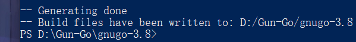

**编译前**

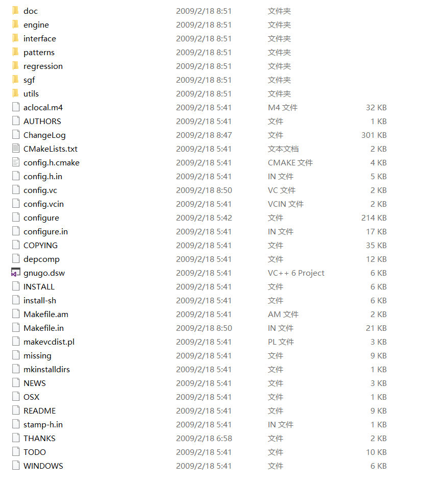

**编译后**

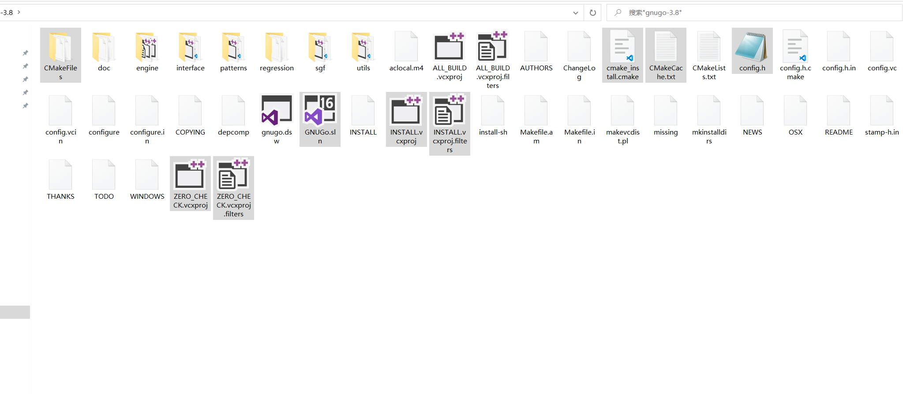

生成了 Visual Studio 解决方案文件 GUNGo.sln

**visual studio处理**

**用visual studio打开GUNGo.sln**

1、打开工程，不用做什么代码处理

2、编译特定平台的可执行二进制文件.exe

​	2.1 Release X64  配置好直接点运行   调试版本

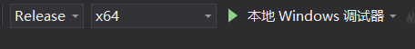

就会生成对应的EXE文件，并创建新的文件来保存

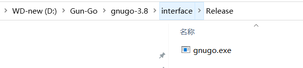

 2.2 Debug x64  发行版本

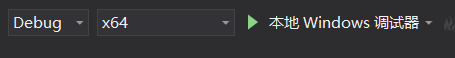

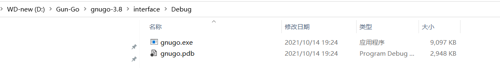

# 2、 Unix、Linux平台编译

https://www.gnu.org/software/gnugo/gnugo_2.html#SEC7

# 3、编译前后文件比对

cmake编译前

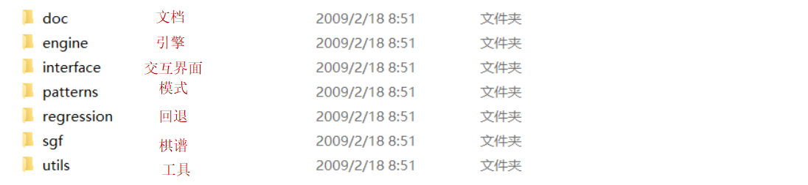

cmake编译后

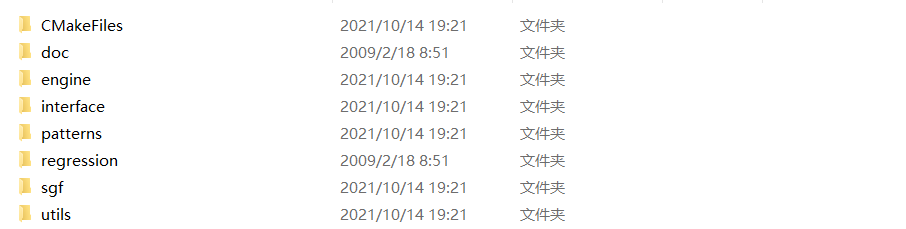

cmake编译后 engine、interface、patterns、sgf、utils文件夹里面都会多一个CMakeFiles文件夹

在visual studio编译后，engine、interface、patterns、sgf、utils中都会新创建两个Release 、Debug文件夹，里面存放着按照各自文件夹根目录下的CMakeLists.txt规则进行编译生成相应的lib库

**以engine文件为例：**

在visual studio 运行生成 release和debug后，engine中会有release和debug文件夹，并生成lib库

下棋的引擎库 engine.lib、engine.pdb和 绘制棋盘的board.lib  board.pdb库

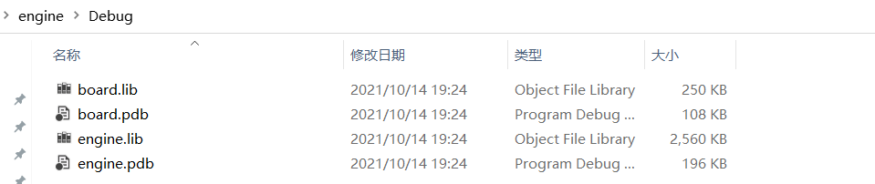

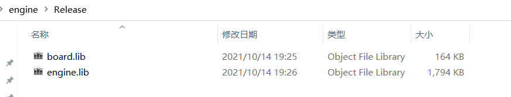

**编译构建规则解析**

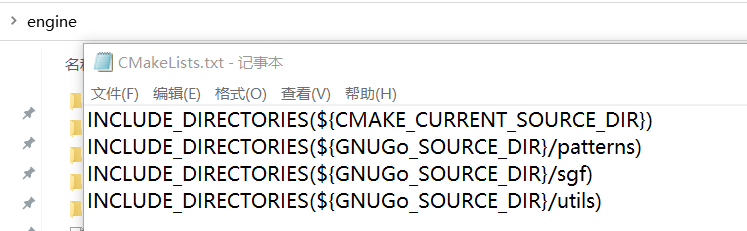

#编译所包含的文件的文件的路径

INCLUDE_DIRECTORIES(${CMAKE_CURRENT_SOURCE_DIR}) 

#包含patterns sgf utils这三个文件夹路径

INCLUDE_DIRECTORIES(${GNUGo_SOURCE_DIR}/patterns)
INCLUDE_DIRECTORIES(${GNUGo_SOURCE_DIR}/sgf)
INCLUDE_DIRECTORIES(${GNUGo_SOURCE_DIR}/utils)

########### engine library ###############

#设置变量 engine_STAT_SRCS   engine库所需包含的源码，就是前面添加的4个目录路径中，符合下面名字的源码

SET(engine_STAT_SRCS
    aftermath.c
    board.c
    boardlib.c
    breakin.c
    cache.c
    clock.c
    combination.c
    dragon.c
    endgame.c
    filllib.c
    fuseki.c
    genmove.c
    globals.c
    handicap.c
    hash.c
    influence.c
    interface.c
    matchpat.c
    montecarlo.c
    move_reasons.c
    movelist.c
    optics.c
    oracle.c
    owl.c
    persistent.c
    printutils.c
    readconnect.c
    reading.c
    semeai.c
    sgfdecide.c
    sgffile.c
    shapes.c
    showbord.c
    surround.c
    unconditional.c
    utils.c
    value_moves.c
    worm.c
    )

#添加新的静态库，库名engine ，依赖资源${engine_STAT_SRCS}就是前面环境变量添加的

ADD_LIBRARY(engine STATIC ${engine_STAT_SRCS})

########### board library ###############

#棋盘工具lib库环境变量

SET(board_STAT_SRCS
    board.c
    boardlib.c
    hash.c
    printutils.c
    )

#添加新的静态库，库名board ，依赖资源${board_STAT_SRCS}就是前面环境变量添加的

ADD_LIBRARY(board STATIC ${board_STAT_SRCS})

通过 CMakeLists.txt规则约束后就能编译生成lib库

 ndk-build NDK_PROJECT_PATH=D:\Gun-Go\jni  APP_BUILD_SCRIPT=D:\Gun-Go\jni\Android.mk  NDK_APPLICATION_MK=D:\Gun-Go\jni\Application.mk

