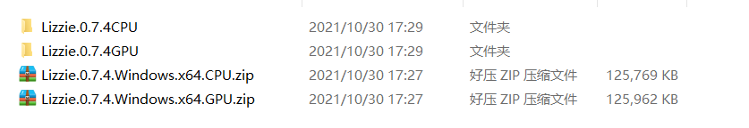
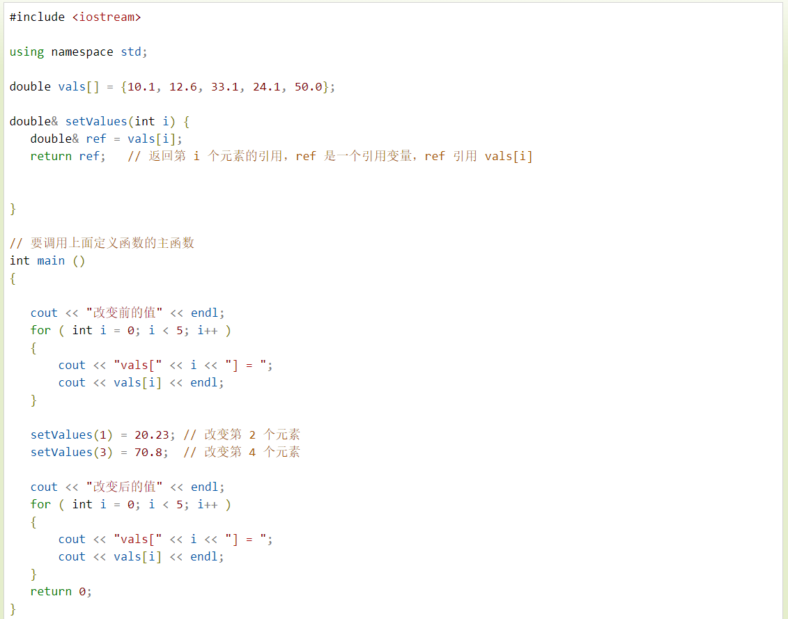
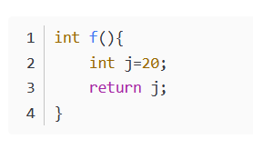
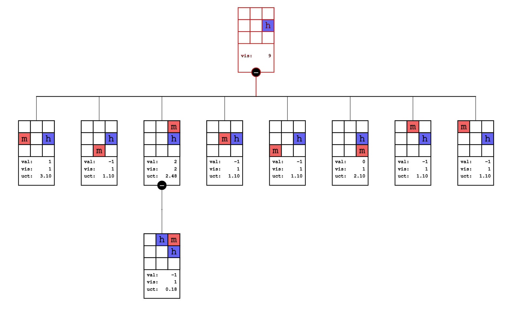
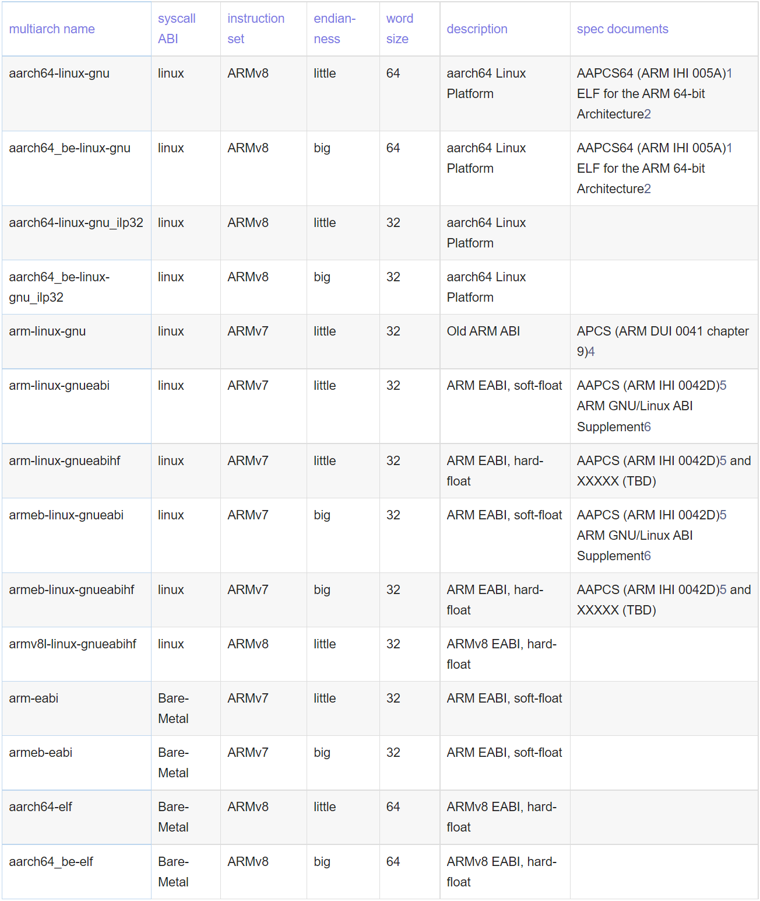

2021-10-30

# C++基础知识储备

### c++ obj文件与exe文件的区别、作用

**编译**：当前源代码编译成二进制目标文件（.obj文件）

**链接（link）**：将生成的.obj文件与库文件.lib等文件链接，生成可执行文件（.exe文件）。

**可以说.obj文件是.exe文件的前身；**

1、obj里存的是编译后的代码跟数据，并且有名称，所以在连接时会出现未解决的外部符号一说。当连成exe后便不存在名称的概念了，只有地址。**lib就是一堆obj的组合。**  

编译器会默认链接一些常用的库，其它的需要你自己指定。

2、目标文件，一般是程序编译后的【二进制文件】，再通过链接器和资源文件链接就成可执行文件了。OBJ只给出了程序的【相对地址】，而可执行文件是【绝对地址】。CPP对应的二进制代码格式obj，是未经重定位的！

3、编译C 程序会产生obj 文件和exe 文件，我们都知道exe 文件是可执行文件，但obj 文件是做什么用的呢？

查了下资料发现obj 文件和exe 文件都是二进制数据文件，其中obj 文件是COFF 格式，exe 文件时PE 格式。

那为什么不直接让 obj 文件作为可执行文件呢？

**原来obj 文件的格式是跨平台 的，通过link 可以将obj 链接为所使用系统能够识别的格式**，比如windows 系统中的exe 文件。

一个现代编译器的主要工作流程如下：
源程序（source code）→ 

预处理器（preprocessor）→ 

编译器（compiler）→ 

汇编程序（assembler）→ 

目标程序（object code）→ 

连接器（链接器，Linker）→ 可执行程序（executables）


**1*.exe:**是生成的可执行文件

**2*.ilk**:当选定渐增型编译连接时，连接器自动生成ILK文件，记录连接信息

**3*.obj**:是目标文件,源程序编译后的产物

**4*.pch**:全称是PreCompiled Header，就是预先编译好的头文件

**5*.idb**:文件保存的信息,使编译器在重新编译的时候只重编译最新改动过的函数和只对最新类定义改动过的源文件进行重编译，以提高编译速度

**6*.pdb**:全称是Program DataBase，即程序数据库文件，用来记录调试信息

**7*.dsp**:(全称是Developer Studio Project)也是一个配置文件

**8*.ncb**:(全称No Compile Browser)的缩写，其中存放了供ClassView、WizardBar和Component Gallery使用的信息，由VC开发环境自动生成

**9*.plg**:实际上是一个超文本文件，可以用Internet Explorer打开，记录了Build的过程

**10*.cpp**:就是C++源代码文件.


### 动态静态库

lib是和dll对应的。

lib是静态的库文件，dll是动态的库文件。

**所谓静态**就是**link的时候**把里面需要的东西抽取出来安排到你的exe文件中，以后运行  你的exe的时候不再需要lib。

**所谓动态**就是**exe运行的时候**依赖于dll里面提供的功能，没有这个dll，你的exe无法运行。


lib,  dll,  exe都算是最终的目标文件，是最终产物。而c/c++属于源代码。源代码和最终目标文件中过渡的就是中间代码obj，实际上之所以需要中间代码，是你不可能一次得到目标文件。

比如说一个exe需要很多的cpp文件生成。而编译器一次只能编译一个cpp文件。

这样编译器编译好一个cpp以后会将其编译成obj，当所有必须要的cpp都编译成obj以后，再统一link成所需要exe，应该说缺少任意一个obj都会导致exe的链接失败。

1. obj里存的是编译后的代码跟数据，并且有名称，所以在连接时会出现未解决的外部符号一说。当连成exe后便不存在名称的概念了，只有地址。lib就是一堆obj的组合。

2.理论上可以，但实际中通常用lib。

3.编译器会默认链接一些常用的库，其它的需要你自己指定。

#### lib和DLL的区别

**(1)lib是编译时需要的，dll是运行时需要的。** 

如果要完成源代码的编译，有lib就够了。 

如果也使动态连接的程序运行起来，有dll就够了。 

在开发和调试阶段，当然最好都有。 

**(2)一般的动态库程序有lib文件和dll文件。**

lib文件是必须在编译期就连接到应用程序中的，而dll文件是运行期才会被调用的。如果有dll文件，那么对应的lib文件一般是一些索引信息，具体的实现在dll文件中。

如果只有lib文件，那么这个lib文件是静态编译出来的，索引和实现都在其中。静态编译的lib文件有好处：给用户安装时就不需要再挂动态库了。

但也有缺点，就是导致应用程序比较大，而且失去了动态库的灵活性，在版本升级时，同时要发布新的应用程序才行。 

(3)在动态库的情况下，有两个文件，一个是引入库（.LIB）文件，一个是DLL文件。

引入库文件包含被DLL导出的函数的名称和位置，DLL包含实际的函数和数据，应用程序使用LIB文件链接到所需要使用的DLL文件，库中的函数和数据并不复制到可执行文件中，因此在应用程序的可执行文件中，存放的不是被调用的函数代码，而是DLL中所要调用的函数的内存地址。

这样当一个或多个应用程序运行是再把程序代码和被调用的函数代码链接起来，从而节省了内存资源。

从上面的说明可以看出，DLL和.LIB文件必须随应用程序一起发行，否则应用程序将会产生错误。


# GUI界面介绍

**KataGo 只是一个引擎，没有自己的图形化界面。因此，通常您会希望将 KataGo 与 GUI 或分析程序一起使用**

## 一、Lizzie


1、下载  https://github.com/featurecat/lizzie/releases

CPU、GPU版


2、解压



3、编译 以GPU版Lizzie界面GUI为例

新建一个TXT文本，在里面写入    java -jar lizzie.jar    注意提前安装好java环境


把TXT文件后缀改为 .bat


4、 运行  点击  自己建立的install.bat文件即可


对lizzie文件目录稍作解释


**katago   leelazero 这两个目录就是引擎   theme顾名思义就是主题**

**katago.exe   leelaz.exe  就是围棋引擎   lizzie主要就是调用.exe引擎可执行文件**


**引擎配置**


**lizzie帮助操作**


Lizzie 自带了权重文件 network.gz ，但版本并非最新，如果需要使用其它权重文件，则可以去下载 [最新的权重文件](http://zero.sjeng.org/best-network)，将其更名为 xx.gz 放到 Lizzie 文件夹里面的相应文件即可。

**更換權重的方法：**
1.把權重丟到Lizzie資料夾裡面，比如下载了**b40-s663.bin.gz**这个权重文件
2.改這行設定-model **b40-s663.bin.gz** 改成新權重的檔案名稱


## 二、Sabaki

[Sabaki 使用指南 - 围棋软件与人工智能 (goandai.com)](https://www.goandai.com/sabaki-wiki/)

1、下载  sabaki

-portable  免安装版直接双击运行

setup安装版，自行安装到本地


2、下载引擎  

按需下载

https://github.com/lightvector/KataGo/releases


**下载到本地，解压，要用哪个根据电脑配置选择**

**以opencl版为例**


3、启动sabaki

配置引擎和权重文件，要把权重文件(xxx.bin.gz)放到上面下载的引擎文件夹中

**比如：**


**参数配置：**


1、GTP运行日志目录

2、test2  自定义引擎名字

3、引擎exe所在目录 路径

4、运行参数    这个就是重点  命令调试

5、启动参数


# 围棋术语

a (large) group of stones 一条（大）龙
alive 活（棋）
aji 味
areas 实地
atari 打吃
Baduk 围棋
Black 黑棋
board 棋盘
bowl 棋盒
**capture 提子**
capturing races 对杀
compensation points 贴目
connection 连接
corner 角
dame 单官
dan（业余/职业）（）段
dan pro 职业（）段
dead 死（棋）
divine move 胜负手
edge 边
eye 眼
false eyes 假眼
five by five 五五
forcing moves 劫财
fuseki 布局
Go 围棋
gote 后手
grid size 棋盘尺寸（9X9，13X13，19X19）
**handicap 泛指包括让子和贴目等形式在内的指导棋**
hane 扳
hayago 快棋
high eye 高目
high kakari 高挂
Igo 围棋
influence-oriented approach 注重外势
ishi no shita 倒脱靴
jigo 和棋
joseki 定石/定式
jungsuk 定石/定式
kakari 挂
kifu 棋谱
ko 劫
ko fights 打劫
komi 贴目
korigatachi 愚形
kosumi 小尖
kyu 级
ladder 征子
large high eye 超高目
liberties 气
lightness 薄
low kakari 低挂
miai 见合
monkey jump 伸腿
move 一招棋、一手棋
moyo 模样
myoushu 妙手
nakade 点杀
net 枷吃
nidan bane 连扳
origin of heaven 天元
outside the eye 目外
outside the large eye 超目外
**pass 停一手**
**rank 级别、段位**
resignation 投子认负
rule-sets （中国/日本/韩国）规则
**score 点目**
**seki 双活**
**sente 先手**
separation 分离/分断
shape 棋形
side 边
small eye 小目
snapback 倒扑
star point 星位
**stone 棋子**
tengen 天元
territorial approach 注重实地 
territories 实地
tesuji 手筋
thickness 厚实
threeby three 三三
tsumego 诘棋/死活题
Weiqi 围棋
White 白棋
yose 官子
yosu miru 试应手

C:/Program Files/Eigen3/include/eigen3

C:/Program Files/Eigen3/include/eigen3

I:/SSL/OpenSSL-Win64/lib/VC/libcrypto64MDd.lib

I:/SSL/OpenSSL-Win64/lib/VC/libcrypto64MD.lib

C:/Program Files/libzip/include

C:/Program Files/libzip/include

C:/Program Files/libzip/lib/zip.lib

I:/SSL/OpenSSL-Win64/include/openssl/applink.c

I:/SSL/OpenSSL-Win64/lib/VC/libssl64MDd.lib

I:/SSL/OpenSSL-Win64/lib/VC/libssl64MD.lib

C:/Program Files/zlib/lib/zlibd.lib

C:/Program Files/zlib/lib/zlib.


[KataGo Opening Books (katagobooks.org)

[](https://katagobooks.org/)


# KataGo的使用方法

**围棋最强开源AI-KataGo在Windows系统下的编译全集教程**

[围棋最强开源AI-KataGo在Windows系统下的编译全集教程 - 知乎 (zhihu.com)](https://


BUILD_DISTRIBUTED

EIGEN3_INCLUDE_DIRS

Eigen3_DIR

NO_GIT_REVISION

CMAKE_CONFIGURATION_TYPES

CMAKE_INSTALL_PREFIX

LIB_EAY_DEBUG

LIB_EAY_RELEASE

LIBZIP_INCLUDE_DIR_ZIP

LIBZIP_INCLUDE_DIR_ZIPCONF

LIBZIP_LIBRARY

OPENSSL_APPLINK_SOURCE

SSL_EAY_DEBUG

SSL_EAY_RELEASE

ZLIB_LIBRAY_DEBUG

ZLIB_LIBRAY_RELEASE


### Linux 下查找安装包

1、locate + 包名

2、缺少某个包 error while loading shared libraries: libz[.so](https://www.jb51.cc/tag/so/).1: cannot open shared object file: No such file or directory

我们首先知道的是缺少libz[.so](https://www.jb51.cc/tag/so/).1这个库[文件](https://www.jb51.cc/tag/wenjian/)。

[解决方法](https://www.jb51.cc/tag/jiejuefangfa/)：很明显就是安装这个库所在包，可是我们怎么这知道 libz[.so](https://www.jb51.cc/tag/so/).1在哪个包呢？

使用apt-file search 查找你的库所在包

​	 使用apt-file search命令来查找某个命令或某[一个](https://www.jb51.cc/tag/yige/)库所在的包，具体[用法](https://www.jb51.cc/tag/yongfa/)如下：

​	 ~$ apt-file search libz[.so](https://www.jb51.cc/tag/so/).1

 运行命令[显示](https://www.jb51.cc/tag/xianshi/)如下：

 lib32z1: /usr/lib32/libz[.so](https://www.jb51.cc/tag/so/).1

 lib32z1: /usr/lib32/libz[.so](https://www.jb51.cc/tag/so/).1.2.3.3

 lib32z1-dev: /usr/lib32/libz[.so](https://www.jb51.cc/tag/so/)

 lsb-build-base3: /usr/lib/lsb3/libz[.so](https://www.jb51.cc/tag/so/)

 zlib1g: /lib/libz[.so](https://www.jb51.cc/tag/so/).1

 zlib1g: /lib/libz[.so](https://www.jb51.cc/tag/so/).1.2.3.3

 zlib1g-dbg: /usr/lib/debug/lib/libz[.so](https://www.jb51.cc/tag/so/).1.2.3.3

 zlib1g-dbg: /usr/lib/debug/usr/lib32/libz[.so](https://www.jb51.cc/tag/so/).1.2.3.3

 zlib1g-dev: /usr/lib/libz[.so](https://www.jb51.cc/tag/so/)


 使用apt-file search 查找你的库所在包就行了，右边的是匹配你的库，左边的是你查的库所在的包

我们会发现与libz[.so](https://www.jb51.cc/tag/so/).1相对应的是左边名字叫：lib32z1的包，所以安装这个lib32z1包即可。 sudo apt-get install lib32z1


**把编译出来的zlibs.dll库放进去**


**解决：**


**解决：**


https://blog.csdn.net/LostSpeed/article/details/112417341


KataGo 支持多个命令。

所有这些命令都需要一个包含神经网络的“model”文件，该文件以 .bin.gz 或 .txt.gz 结尾，有时也只是 .gz 扩展名。但是，如果模型名为 default_model.bin.gz 或 default_model.txt.gz，并且位于与 katago 可执行文件相同的目录中，则可以省略指定模型的步骤。

其中大多数命令还需要一个以 .cfg 结尾的 GTP“config”文件，该文件指定有关 KataGo 行为方式的参数。但是，如果 GTP 配置名为 default_gtp.cfg，并且与 katago 可执行文件位于同一目录中，则可以忽略指定。

如果您是第一次运行 KataGo，则可能需要先在命令行上运行基准测试或 genconfig 命令，以测试 KataGo 是否正常工作并选择多个线程。在 OpenCL 版本上，给 KataGo 一个自动调整 OpenCL 的机会，这可能需要一段时间。

要使用下载的 KataGo 神经网络和 GTP 配置运行 GTP 引擎，请执行以下操作：

- ./katago gtp -model < NEURALNET>.gz -config <GTP_CONFIG>.cfg
- 或者从不同的途径：whatever/path/to/katago gtp -model whatever/path/to/< NEURALNET>.gz -config /whatever/path/to/<GTP_CONFIG>.cfg
- 这是用来告诉你的 GUI （Lizzie, q5Go, Sabaki, GoGui, 等）来运行 KataGo 的命令 （当然，所有的实际路径都被替换了）。

或如前所述，如果您在与 KataGo 相同的目录中具有正确命名的默认配置和模型：

- ./katago gtp
- 或者从不同的途径：whatever/path/to/katago gtp
- 另外，这是您要告诉您的（Lizzie, q5Go, Sabaki, GoGui, 等）来运行 KataGo 的命令 （如果您具有默认配置和模型）。

# 


主要算法技术：

- auxiliary value,  辅助值
- policy,  策略
- ownership,  所有权-占领
- score training targets,  得分训练目标
- playout cap randomization,   游戏模拟上限随机化
- global pooling layers,  全局池化层
- policy surprise weighting,  策略加权
- policy target pruning,   策略目标裁剪
- shaped dirichlet noise,  异形狄利克雷噪声
- 等。

 主要面向用户的功能：

- 预测分析分数和地空，
- 处理多个规则和贴目值，包括古老的"还棋头"规则，
- 同一网络能够在从7x7到19x19的所有棋盘里下棋，
- 特殊的不对称训练以提高让子游戏发挥。


**加入分布式训练**

https://katagotraining.org/


### KataGo 并行分析引擎 

https://github.com/lightvector/KataGo/blob/master/docs/Analysis_Engine.md

KataGo 包含一个引擎，可用于并行分析大量位置（整个游戏或多个游戏）。当正确配置并与可以处理大批量大小的现代 GPU 一起使用时，该引擎可以比使用 GTP 引擎快得多，并且`kata-analyze`由于能够利用跨位置批处理，并且希望拥有更好的 API。分析引擎主要用于编写工具的人——例如，作为分析服务器或网站的后端运行。

该引擎可以通过以下方式运行：

```
./katago analysis -config CONFIG_FILE -model MODEL_FILE
```


在官方论文《Mastering the game of Go without human knowledge》中，解释了如何使用最新的策略网络+MCTS来self-play获得大量棋局数据。再将棋局数据作为训练集，训练策略网络的过程。


# katago 源码编译详解（2021-12-12）

## Compiling KataGo--官方解释

KataGo is written in C++. It should compile on Linux or OSX via g++ that supports at least C++14, or on Windows via MSVC 15 (2017) and later. Other compilers and systems have not been tested yet. This is recommended if you want to run the full KataGo self-play training loop on your own and/or do your own research and experimentation, or if you want to run KataGo on an operating system for which there is no precompiled executable available.

**Building for Distributed**

As also mentioned in the instructions below but repeated here for visibility, if you also are building KataGo with the intent to use it in distributed training on [https://katagotraining.org](https://katagotraining.org/), then keep in mind:

- You'll need to specify `-DBUILD_DISTRIBUTED=1` or `BUILD_DISTRIBUTED` and have OpenSSL installed.
- Building will need to happen within a Git clone of the KataGo repo, rather than a zipped copy of the source (such as what you might download from a packaged release).
- The version will need to be supported for distributed training. **The `master` branch will NOT work** - instead please use the either latest release tag or the tip of the `stable` branch, these should both work.
- Please do NOT attempt to bypass any versioning or safety checks - if you feel you need to do so, please first reach out by opening an issue or messaging in [discord](https://discord.gg/bqkZAz3). There is an alternate site [test.katagodistributed.org](https://github.com/lightvector/KataGo/blob/master/test.katagodistributed.org) you can use if you are working on KataGo development or want to test things more freely, ask in the KataGo channel of discord to set up a test account.

**Linux**

- Requirements

  - CMake with a minimum version of 3.10.2 - for example `sudo apt install cmake` on Debian, or download from https://cmake.org/download/ if that doesn't give you a recent-enough version.
  - Some version of g++ that supports at least C++14.
  - If using the OpenCL backend, a modern GPU that supports OpenCL 1.2 or greater, or else something like [this](https://software.intel.com/en-us/opencl-sdk) for CPU. But if using CPU, Eigen should be better.
  - If using the CUDA backend, CUDA 10.2 with CUDNN 7.6.5, or CUDA 11.1 with CUDNN 8.0.4 (https://developer.nvidia.com/cuda-toolkit) (https://developer.nvidia.com/cudnn) and a GPU capable of supporting them. I'm unsure how version compatibility works with CUDA, there's a good chance that later versions than these work just as well, but they have not been tested.
  - If using the TensorRT backend, in addition to the dependencies for the CUDA backend, you also need TensorRT (https://developer.nvidia.com/tensorrt) on a version compatible with your CUDA and CUDNN versions and at least version 8.2.
  - If using the Eigen backend, Eigen3. With Debian packages, (i.e. apt or apt-get), this should be `libeigen3-dev`.
  - zlib, libzip. With Debian packages (i.e. apt or apt-get), these should be `zlib1g-dev`, `libzip-dev`.
  - If you want to do self-play training and research, probably Google perftools `libgoogle-perftools-dev` for TCMalloc or some other better malloc implementation. For unknown reasons, the allocation pattern in self-play with large numbers of threads and parallel games causes a lot of memory fragmentation under glibc malloc that will eventually run your machine out of memory, but better mallocs handle it fine.
  - If compiling to contribute to public distributed training runs, OpenSSL is required (`libssl-dev`).

- Clone this repo:

  - `git clone https://github.com/lightvector/KataGo.git`

- Compile using CMake and make in the cpp directory:

  - `cd KataGo/cpp`

  - ```
    cmake . -DUSE_BACKEND=OPENCL
    ```

    or

    ```
    cmake . -DUSE_BACKEND=CUDA
    ```

    or

    ```
    cmake . -DUSE_BACKEND=TENSORRT
    ```

    or

    ```
    cmake . -DUSE_BACKEND=EIGEN
    ```

     

    depending on which backend you want.

    - Specify also `-DUSE_TCMALLOC=1` if using TCMalloc.

    - Compiling will also call git commands to embed the git hash into the compiled executable, specify also `-DNO_GIT_REVISION=1` to disable it if this is causing issues for you.

    - Specify `-DUSE_AVX2=1` to also compile Eigen with AVX2 and FMA support, which will make it incompatible with old CPUs but much faster. (If you want to go further, you can also add `-DCMAKE_CXX_FLAGS='-march=native'` which will specialize to precisely your machine's CPU, but the exe might not run on other machines at all).

    - Specify

      ```
      -DBUILD_DISTRIBUTED=1
      ```

      to compile with support for contributing data to public distributed training runs.

      - If building distributed, you will also need to build with Git revision support, including building within a clone of the repo, as opposed to merely an unzipped copy of its source.
      - Only builds from specific tagged versions or branches can contribute, in particular, instead of the `master` branch, use either the latest release tag (e.g. v1.8.0) or the tip of the `stable` branch. To minimize the chance of any data incompatibilities or bugs, please do NOT attempt to contribute with custom changes or circumvent these limitations.

  - `make`

- Done! You should now have a compiled `katago` executable in your working directory.

- Pre-trained neural nets are available on the [releases page](https://github.com/lightvector/KataGo/releases) or more from [here](https://d3dndmfyhecmj0.cloudfront.net/g170/index.html).

- You will probably want to edit `configs/gtp_example.cfg` (see "Tuning for Performance" above).

- If using OpenCL, you will want to verify that KataGo is picking up the correct device when you run it (e.g. some systems may have both an Intel CPU OpenCL and GPU OpenCL, if KataGo appears to pick the wrong one, you can correct this by specifying `openclGpuToUse` in `configs/gtp_example.cfg`).

**Windows**

- Requirements

  - CMake with a minimum version of 3.10.2, GUI version strongly recommended (https://cmake.org/download/)
  - Microsoft Visual Studio for C++. Version 15 (2017) has been tested and should work, other versions might work as well.
  - If using the OpenCL backend, a modern GPU that supports OpenCL 1.2 or greater, or else something like [this](https://software.intel.com/en-us/opencl-sdk) for CPU. But if using CPU, Eigen should be better.
  - If using the CUDA backend, CUDA 10.2 with CUDNN 7.6.5, or CUDA 11.1 with CUDNN 8.0.4 (https://developer.nvidia.com/cuda-toolkit) (https://developer.nvidia.com/cudnn) and a GPU capable of supporting them. I'm unsure how version compatibility works with CUDA, there's a good chance that later versions than these work just as well, but they have not been tested.
  - If using the TensorRT backend, in addition to the dependencies for the CUDA backend, you also need TensorRT (https://developer.nvidia.com/tensorrt) on a version compatible with your CUDA and CUDNN versions.
  - If using the Eigen backend, Eigen3, version 3.3.x. (http://eigen.tuxfamily.org/index.php?title=Main_Page#Download).
  - zlib. The following package might work, https://www.nuget.org/packages/zlib-vc140-static-64/, or alternatively you can build it yourself via something like: https://github.com/kiyolee/zlib-win-build
  - libzip (optional, needed only for self-play training) - for example https://github.com/kiyolee/libzip-win-build
  - If compiling to contribute to public distributed training runs, OpenSSL is required (https://www.openssl.org/, https://wiki.openssl.org/index.php/Compilation_and_Installation).

- Download/clone this repo to some folder `KataGo`.

- Configure using CMake GUI and compile in MSVC:

  - Select `KataGo/cpp` as the source code directory in [CMake GUI](https://cmake.org/runningcmake/).

  - Set the build directory to wherever you would like the built executable to be produced.

  - Click "Configure". For the generator select your MSVC version, and also select "x64" for the optional platform if you're on 64-bit windows, don't use win32.

  - If you get errors where CMake has not automatically found ZLib, point it to the appropriate places according to the error messages:

    - `ZLIB_INCLUDE_DIR` - point this to the directory containing `zlib.h` and other headers
    - `ZLIB_LIBRARY` - point this to the `libz.lib` resulting from building zlib. Note that "*_LIBRARY" expects to be pointed to the ".lib" file, whereas the ".dll" file is the file that needs to be included with KataGo at runtime.

  - Also set `USE_BACKEND` to `OPENCL`, or `CUDA`, or `TENSORRT`, or `EIGEN` depending on what backend you want to use.

  - Set any other options you want and re-run "Configure" again as needed after setting them. Such as:

    - `NO_GIT_REVISION` if you don't have Git or if cmake is not finding it.

    - `NO_LIBZIP` if you don't care about running self-play training and you don't have libzip.

    - `USE_AVX2` if you want to compile with AVX2 and FMA instructions, which will fail on some CPUs but speed up Eigen greatly on CPUs that support them.

    - ```
      BUILD_DISTRIBUTED
      ```

      to compile with support for contributing data to public distributed training runs.

      - If building distributed, you will also need to build with Git revision support, including building within a clone of the repo, as opposed to merely an unzipped copy of its source.
      - Only builds from specific tagged versions or branches can contribute, in particular, instead of the `master` branch, use either the latest release tag (e.g. v1.8.0) or the tip of the `stable` branch. To minimize the chance of any data incompatibilities or bugs, please do NOT attempt to contribute with custom changes or circumvent these limitations.

  - Once running "Configure" looks good, run "Generate" and then open MSVC and build as normal in MSVC.

- Done! You should now have a compiled `katago.exe` executable in your working directory.

- Note: You may need to copy the ".dll" files corresponding to the various ".lib" files you compiled with into the directory containing katago.exe.

- Note: If you had to update or install CUDA or GPU drivers, you will likely need to reboot before they will work.

- Pre-trained neural nets are available on the [releases page](https://github.com/lightvector/KataGo/releases) or more from [here](https://d3dndmfyhecmj0.cloudfront.net/g170/index.html).

- You will probably want to edit `configs/gtp_example.cfg` (see "Tuning for Performance" above).

- If using OpenCL, you will want to verify that KataGo is picking up the correct device (e.g. some systems may have both an Intel CPU OpenCL and GPU OpenCL, if KataGo appears to pick the wrong one, you can correct this by specifying `openclGpuToUse` in `configs/gtp_example.cfg`).


## 编译 KataGo---译文

KataGo是用C++写的。它应该通过支持至少C++14的g ++在Linux或OSX上编译，或者通过MSVC 15（2017）及更高版本在Windows上编译。其他编译器和系统尚未经过测试。如果您想自己运行完整的KataGo自玩训练循环和/或进行自己的研究和实验，或者如果您想在没有预编译可执行文件的操作系统上运行KataGo，则建议这样做。

**为分布式构建**

假如进行分布式训练的话，编译需要注意的细节：


正如下面的说明中提到的，但为了便于查看，这里重复了一遍，如果您还构建了KataGo，目的是在[https://katagotraining.org](https://katagotraining.org/)上的分布式训练中使用它，那么请记住：

- 您需要指定 或 并安装 OpenSSL。`-DBUILD_DISTRIBUTED=1``BUILD_DISTRIBUTED`
- **构建需要在 KataGo 存储库的 Git 克隆中进行，而不是源代码的压缩副本（例如，您可能从打包版本下载的内容）。**（意思就是不能是编译从github网站浏览时下载的压缩包文件，需要使git模式下载，避免丢包）**
- 分布式训练需要支持该版本。**`主`分支将不起作用**- 相反，请使用最新版本标记或分支的提示，这些都应该有效。`stable`
- 请不要试图绕过任何版本控制或安全检查 - 如果您认为需要这样做，请首先通过打开问题或不和谐的消息来[联系](https://discord.gg/bqkZAz3)。有一个备用站点[test.katagodistributed.org](https://github.com/lightvector/KataGo/blob/master/test.katagodistributed.org)如果您正在从事KataGo开发或想要更自由地测试内容，则可以使用，请在不和谐的KataGo频道中要求设置测试帐户。

**Linux**

- 要求

  - CMake的最低版本为3.10.2 - 例如在Debian上，或者从https://cmake.org/download/下载，如果这不能给你一个足够新的版本。`sudo apt install cmake`
  - 某些版本的 g++ 至少支持 C++14。
  - 如果使用OpenCL后端，支持OpenCL 1.2或更高版本的现代GPU，[或者CPU之类的](https://software.intel.com/en-us/opencl-sdk)东西。但如果使用CPU，Eigen应该更好。
  - 如果使用 CUDA 后端，则 CUDA 10.2 与 CUDNN 7.6.5，或 CUDA 11.1 与 CUDNN 8.0.4 （https://developer.nvidia.com/cuda-toolkit） （https://developer.nvidia.com/cudnn） 和能够支持它们的 GPU。我不确定版本兼容性如何与CUDA一起工作，很有可能比这些版本更晚的版本也可以工作，但它们尚未经过测试。
  - 如果使用TensorRT后端，除了CUDA后端的依赖关系外，您还需要在与CUDA和CUDNN版本兼容的版本以及至少8.2版本兼容的版本上使用TensorRT（https://developer.nvidia.com/tensorrt）。
  - 如果使用 Eigen 后端，则为 Eigen3。对于 Debian 软件包（即 apt 或 apt-get），这应该是 .`libeigen3-dev`
  - **sudo apt-get install libeigen3-dev安装Eigen3，要是不知道安装路径，可以sudo apt install mlocate，再用locate eigen3查看安装位置，别的包也是可以使用locate查看位于哪里**
  - **作为C++下常用的矩阵库，Eigen3**

  

  - zlib， libzip.对于 Debian 软件包（即 apt 或 apt-get），这些应该是 ， 。`zlib1g-dev``libzip-dev`

  **sudo  apt-get install zlib1g-dev      注意是  数字1不是字母l**

  **sudo apt-get install libzip-dev**  

  

  

  - 如果你想做自我游戏训练和研究，可能是谷歌perftools for TCMalloc或其他一些更好的malloc实现。由于未知的原因，在具有大量线程和并行游戏的自玩模式中，在glibc malloc下会导致大量内存碎片，最终将使您的计算机失去内存，但更好的mallocs可以很好地处理它。`libgoogle-perftools-dev`
  - 如果编译为公共分布式训练运行做出贡献，则需要 OpenSSL （）。`libssl-dev`

- 克隆此存储库：

  - `git clone https://github.com/lightvector/KataGo.git`

- 使用 CMake 编译并在 cpp 目录中进行 make：

  - `cd KataGo/cpp`

  - ```
    cmake . -DUSE_BACKEND=OPENCL
    ```

    或或或取决于您想要的后端。

    ```
    cmake . -DUSE_BACKEND=CUDA
    ```

    ```
    cmake . -DUSE_BACKEND=TENSORRT
    ```

    ```
    cmake . -DUSE_BACKEND=EIGEN
    ```

    - 如果使用 TCMalloc，另请指定。`-DUSE_TCMALLOC=1`

    - 编译还将调用 git 命令以将 git 哈希嵌入到已编译的可执行文件中，如果这会给您带来问题，请指定禁用它。`-DNO_GIT_REVISION=1`

    - 指定还编译具有 AVX2 和 FMA 支持的 Eigen，这将使它与旧 CPU 不兼容，但速度要快得多。（如果您想更进一步，还可以添加专门用于精确计算机CPU的CPU，但exe可能根本无法在其他计算机上运行）。`-DUSE_AVX2=1``-DCMAKE_CXX_FLAGS='-march=native'`

    - 指定编译时支持向公共分布式训练运行提供数据。

      ```
      -DBUILD_DISTRIBUTED=1
      ```

      - 如果构建分布式，则还需要使用 Git 修订支持进行构建，包括在存储库的克隆中构建，而不仅仅是其源代码的解压缩副本。
      - 只有来自特定标记版本或分支的构建才能做出贡献，特别是，而不是分支，使用最新版本标记（例如v1.8.0）或分支的尖端。为了最大限度地减少任何数据不兼容或错误的可能性，请不要尝试进行自定义更改或规避这些限制。`master``stable`

  - `make`

- 做！现在，您的工作目录中应该有一个已编译的可执行文件。`katago`

- 预先训练的神经网络可在[发布页面上](https://github.com/lightvector/KataGo/releases)找到，也可以从这里获得更多[内容](https://d3dndmfyhecmj0.cloudfront.net/g170/index.html)。

- 您可能需要编辑（请参阅上面的"优化性能"）。`configs/gtp_example.cfg`

- 如果使用 OpenCL，您将需要验证 KataGo 在运行它时是否选取了正确的设备（例如，某些系统可能同时具有 Intel CPU OpenCL 和 GPU OpenCL，如果 KataGo 似乎选错了设备，您可以通过在 中指定来更正此问题）。`openclGpuToUse``configs/gtp_example.cfg`

**windows**

- 要求

  - CMake 的最低版本为 3.10.2，强烈建议使用 GUI 版本[（https://cmake.org/download/](https://cmake.org/download/))
  - Microsoft Visual Studio for C++.版本 15 （2017） 已经过测试，应该可以正常工作，其他版本也可以。
  - 如果使用OpenCL后端，支持OpenCL 1.2或更高版本的现代GPU，[或者CPU之类的](https://software.intel.com/en-us/opencl-sdk)东西。但如果使用CPU，Eigen应该更好。
  - 如果使用 CUDA 后端，则 CUDA 10.2 与 CUDNN 7.6.5，或 CUDA 11.1 与 CUDNN 8.0.4 （https://developer.nvidia.com/cuda-toolkit） （https://developer.nvidia.com/cudnn） 和能够支持它们的 GPU。我不确定版本兼容性如何与CUDA一起工作，很有可能比这些版本更晚的版本也可以工作，但它们尚未经过测试。
  - 如果使用TensorRT后端，除了CUDA后端的依赖关系外，您还需要在与CUDA和CUDNN版本兼容的版本上使用TensorRT（https://developer.nvidia.com/tensorrt）。
  - 如果使用 Eigen 后端，则 Eigen3 版本 3.3.x. （http://eigen.tuxfamily.org/index.php?title=Main_Page#Download）。
  - 兹利布。以下包可能有效[，https://www.nuget.org/packages/zlib-vc140-static-64/，](https://www.nuget.org/packages/zlib-vc140-static-64/)或者您可以通过类似如下方式自行构建它[：https://github.com/kiyolee/zlib-win-build](https://github.com/kiyolee/zlib-win-build)
  - libzip（可选，仅用于自玩训练） - 例如https://github.com/kiyolee/libzip-win-build
  - 如果编译为公共分布式训练运行做出贡献，则需要OpenSSL（https://www.openssl.org/，https://wiki.openssl.org/index.php/Compilation_and_Installation）。

- 将此存储库下载/克隆到某个文件夹 。`KataGo`

- 使用 CMake GUI 进行配置并在 MSVC 中编译：

  - 选择 作为[CMake GUI](https://cmake.org/runningcmake/)中的源代码目录。`KataGo/cpp`

  - 将生成目录设置为要生成生成的可执行文件的任何位置。

  - 单击"配置"。对于生成器，请选择您的 MSVC 版本，如果您使用的是 64 位窗口，则还要为可选平台选择"x64"，请不要使用 win32。

  - 如果 CMake 未自动找到 ZLib 时出现错误，请根据错误消息将其指向适当的位置：

    - `ZLIB_INCLUDE_DIR`- 将其指向包含和其他标头的目录`zlib.h`
    - `ZLIB_LIBRARY`- 将此指向构建zlib的结果。请注意，"*_LIBRARY"应指向".lib"文件，而".dll"文件是需要在运行时包含在 KataGo 中的文件。`libz.lib`

  - 还要设置为 、、 或 ，或 取决于要使用的后端。`USE_BACKEND``OPENCL``CUDA``TENSORRT``EIGEN`

  - 设置所需的任何其他选项，并在设置后根据需要再次重新运行"配置"。如：

    - `NO_GIT_REVISION`如果你没有 Git，或者 cmake 没有找到它。

    - `NO_LIBZIP`如果你不关心运行自我游戏训练，你没有libzip。

    - `USE_AVX2`如果您想使用AVX2和FMA指令进行编译，这些指令在某些CPU上会失败，但在支持它们的CPU上会大大加快Eigen。

    - ```
      BUILD_DISTRIBUTED
      ```

      编译时支持向公共分布式训练运行提供数据。

      - 如果构建分布式，则还需要使用 Git 修订支持进行构建，包括在存储库的克隆中构建，而不仅仅是其源代码的解压缩副本。
      - 只有来自特定标记版本或分支的构建才能做出贡献，特别是，而不是分支，使用最新版本标记（例如v1.8.0）或分支的尖端。为了最大限度地减少任何数据不兼容或错误的可能性，请不要尝试进行自定义更改或规避这些限制。`master``stable`

  - 运行"配置"看起来不错后，运行"生成"，然后打开MSVC并在MSVC中正常构建。

- 做！现在，您的工作目录中应该有一个已编译的可执行文件。`katago.exe`

- 注意：您可能需要将与编译时使用的各种".lib"文件对应的".dll"文件复制到包含 katago.exe的目录中。

- 注意：如果您必须更新或安装 CUDA 或 GPU 驱动程序，则可能需要重新启动才能正常工作。

- 预先训练的神经网络可在[发布页面上](https://github.com/lightvector/KataGo/releases)找到，也可以从这里获得更多[内容](https://d3dndmfyhecmj0.cloudfront.net/g170/index.html)。

- 您可能需要编辑（请参阅上面的"优化性能"）。`configs/gtp_example.cfg`

- 如果使用 OpenCL，您将需要验证 KataGo 是否选取了正确的设备（例如，某些系统可能同时具有 Intel CPU OpenCL 和 GPU OpenCL，如果 KataGo 似乎选取了错误的设备，您可以通过在 中指定来更正此问题）。`openclGpuToUse``configs/gtp_example.cfg`


### Eigen3 使用与实例

**C++下常用的矩阵库，Eigen3**


[(51条消息) Eigen3 使用与实例_薛定谔的猫i的博客-CSDN博客_eigen3](https://blog.csdn.net/weixin_42130534/article/details/103871071)


## katago 源码的CMakeLists.txt 解析


# 围棋引擎的GTP协议    Go Text protocol

GTP：围棋文本协议

[GTP - 去文本协议 (liu.se)](http://www.lysator.liu.se/~gunnar/gtp/)

https://www.tianqiweiqi.com/go-gtp.html


# 2021-11-03

# C++  Records


#### **extern关键字**

extern是C/C++语言中表明函数和全局变量作用范围（可见性）的关键字，该关键字告诉编译器，**其声明的函数和变量可以在本模块或其它模块中使用,拓展变量的作用域**。
 通常，在模块的头文件中**对本模块提供给其它模块引用的函数和全局变量**以关键字extern声明。例如，如果模块B欲引用该模块A中定义的全局变量和函数时只需包含模块A的头文件即可。这样，模块B中调用模块A中的函数时，在编译阶段，模块B虽然找不到该函数，但是并不会报错；它会在**链接阶段**中从模块A编译生成的目标代码中找到此函数。


**extern "C"的含义**

**1、**     **extern "C" 包含双重含义**，从字面上即可得到：首先，被它修饰的目标是“extern”的；其次，被它修饰的目标是“C”的。
被extern "C"限定的函数或变量是extern类型的；

**2、**被extern "C"修饰的变量和函数是按照C语言方式编译和链接的

extern 修饰符通常用于当有两个或多个文件共享相同的全局变量或函数的时候

3、外部函数

​		在函数首部左端加上 extern 表示该函数是外部函数，可供其他文件引用；

​		但省略不写，隐含就是外部函数


#### static关键字

static；静态

被它修饰的全局变量和函数只能在本模块中使用。因此，一个函数或变量只可能被本模块使用时，其不可能被extern “C”修饰。


**希望某些外部变量只限于本文件使用，而不能被其他文件使用，在定义外部变量时加上一个关键字“static”**

##### static 用来控制变量的存储方式和可见性

函数内部定义的变量，在程序执行到它的定义处时，编译器为它在**栈上**分配空间，函数在栈上分配的空间在此函数执行结束时会释放掉，这样就产生了一个问题:  如果想将函数中此变量的值保存至下一次调用时，如何实现？   最容易想到的方法是定义一个全局的变量，但定义为一个全局变量有许多缺点，最明显的缺点是破坏了此变量的访问范围（使得在此函数中定义的变量，不仅仅受此函数控制）。需要一个数据对象为整个类而非某个对象服务，同时又力求不破坏类的封装性，即要求此成员隐藏在类的内部，对外不可见

所以静态数据成员不能在任何函数内分配空间和初始化。这样，它的空间分配有三个可能的地方，一是作为类的外部接口的头文件，那里有类声明；二是类定义的内部实现，那里有类的成员函数定义；三是应用程序的 main(）函数前的全局数据声明和定义处。

　　静态数据成员要实际地分配空间，故不能在类的声明中定义（只能声明数据成员）。类声明只声明一个类的“尺寸和规格”，并不进行实际的内存分配，所以在类声明中写成定义是错误的。它也不能在头文件中类声明的外部定义，因为那会造成在多个使用该类的源文件中，对其重复定义。

　　**static 被引入以告知编译器，将变量存储在程序的静态存储区而非栈上空间**，静态数据成员按定义出现的先后顺序依次初始化，注意静态成员嵌套时，要保证所嵌套的成员已经初始化了。消除时的顺序是初始化的反顺序。

**static 的优势：**

　　可以节省内存，因为它是所有对象所公有的，因此，对多个对象来说，静态数据成员只存储一处，供所有对象共用。静态数据成员的值对每个对象都是一样，但它的值是可以更新的。只要对静态数据成员的值更新一次，保证所有对象存取更新后的相同的值，这样可以提高时间效率。引用静态数据成员时，采用如下格式：

​		(1) 类的静态成员函数是属于整个类而非类的对象，所以它没有this指针，这就导致了它仅能访问类的静态数据和静态成员函数。

　　(2) 不能将静态成员函数定义为虚函数。

　　(3) 由于静态成员声明于类中，操作于其外，所以对其取地址操作，就多少有些特殊，变量地址是指向其数据类型的指针，函数地址类型是一个“nonmember 函数指针”。

　　(4) 由于静态成员函数没有 this 指针，所以就差不多等同于 nonmember 函数，结果就产生了一个意想不到的好处：成为一个  callback 函数，使得我们得以将 c++ 和 c-based x window 系统结合，同时也成功的应用于线程函数身上。

　　(5) static 并没有增加程序的时空开销，相反她还缩短了子类对父类静态成员的访问时间，节省了子类的内存空间。

　　(6) 静态数据成员在<定义或说明>时前面加关键字 static。

　　(7) 静态数据成员是静态存储的，所以必须对它进行初始化。

　　(8) 静态成员初始化与一般数据成员初始化不同：

　　初始化在类体外进行，而前面不加 static，以免与一般静态变量或对象相混淆；

　　初始化时不加该成员的访问权限控制符 private、public；

　　初始化时使用作用域运算符来标明它所属类；

　　所以我们得出静态数据成员初始化的格式：


```
<数据类型><类名>::<静态数据成员名>=<值>
```

　(9)  为了防止父类的影响，可以在子类定义一个与父类相同的静态变量，以屏蔽父类的影响。


**C语言的static关键字**

c语言static关键字对内存分配的影响.

首先, **c的static 关键字是不能修饰动态分配内存的.**

例如

​		int * p = static (int *)malloc(sizeof(int))


是错误的.  

 但是 下面写法是合法的.

​		static int * p = (int *)malloc(sizeof(int))

上面的static 不是修饰动态分配的内存,  而是修饰静态分配的指针变量p 


**c语言结构体的成员不能用static 修饰**


#### 变量---变量与作用域

作用域是程序的一个区域，一般来说有三个地方可以定义变量：

- 在函数或一个代码块内部声明的变量，称为**局部变量。**
- 在函数参数的定义中声明的变量，称为**形式参数。**
- 在所有函数外部声明的变量，称为**全局变量。**


#### 常量

在 C++ 中，有两种简单的定义常量的方式：

- **使用 #define 预处理器。**   宏

  ​		#define value_nane  value

- **使用 const 关键字。**

  ​		const type variable = value;    例如： const  int  a = 10;  定义int型常量a,值为10


#### C++ 修饰符类型

C++ 允许在 **char、int 和 double** 数据类型前放置修饰符。修饰符用于改变基本类型的含义，所以它更能满足各种情境的需求。


##### (数据类型)--修饰符：

修饰数据类型

- **signed**
- **unsigned**
- **long**
- **short**


##### C++ 中的(类型)--限定符

**类型限定符提供了变量的额外信息。**

就是限定数据类型，给数据类型多一种属性  如： const  int  a   、const  char c   、 voiatile  int  b ,还有和数据类型修饰符一块使用

const signed  int  a，这种既有修饰有用限定；还可能在类里面定义 **private**  **const** **signed**  int  a多个修饰限定词


**const**：const类型的对象在程序执行期间不能被修改

​	

**volatile**：volatile告诉编译器，变量的值可能以程序未明确指定的方式被改变

**restrict** ：restrict修饰的指针是唯一一种访问指定对象的访问


#### C++(访问)---限定符  重点

**首先得明白一个概念，访问限定符是用来限定类的，而不是限定对象的，只要类型相同就可以互相访问C++中的访问限定符可以分为三种，public访问、protected访问、private访问。**

**主要用来控制类或着结构体成员变量和成员函数的访问权限，称为成员访问限定符。**

**C++中，class中如果对成员变量和成员函数不指定访问权限限定符，默认为private；而struct则默认为public。**


##### public

　　被public限定符所修饰的成员变量和成员函数可以被类的函数、子类的函数、友元函数，也可以由该类的对象来访问。即可以使用类的成员运算符来访问。这里的友元函数，可以是该类的友元函数，也可以是该类的友元类的成员函数。

 

##### protected

　　被protected限定符修饰的成员变量和成员函数可以被该类的成员函数访问，**但不能被该类对象所访问，即不能通过类对象的成员运算符来访问。**另外，这些成员变量可以被子类的函数和友元函数访问，相比public限定符成员少了一个可以使用类对象直接访问的特性。

 

##### private

　　被private限定符所修饰的成员变量只能被该类的方法和友元函数所访问，子类函数无法防问，该类的对象无法访问。在这三个限定符中限制程度最高。一般来讲，应当尽可能将类的成员变量使用private来修饰，减少成员变量的暴露，只提供get/set方法给外界访问，这样能够提供类的安全性。

**友元函数**

类的友元函数是定义在类外部，但有权访问类的所有私有（private）成员和保护（protected）成员。尽管友元函数的原型有在类的定义中出现过，但是友元函数并不是成员函数。

友元可以是一个函数，该函数被称为友元函数；**友元也可以是一个类，该类被称为友元类**，在这种情况下，整个类及其所有成员都是友元。

如果要声明函数为一个类的友元，需要在类定义中该函数原型前使用关键字 **friend**，如下所示：


**声明类 ClassTwo 的所有成员函数作为类 ClassOne 的友元，需要在类 ClassOne 的定义中放置如下声明：**

```
friend class ClassTwo;
```


#### C++运算符


**指针运算符&：**

​	返回变量的地址。例如 &a; 将给出变量的实际地址。


**指针运算符  *：**

指向一个变量。例如，*var; 将指向变量 var。

​	**int* a**, int型指针，指向变量所在的地址   

​	int b= 20

​	int* a=&b  而不是int* a=b，因为变量a是指针变量，那么存放的也要是指针

**同理**

​	**int   *a**, int型指针，指向变量所在的地址   

​	int b= 20

​	int *a=&b  而不是int  *a=b，因为变量a是指针变量，那么存放的也要是指针


​	**int   *a** 等于	**int* a**


## C++  的特殊符号

### 1、 双冒号

#### （1）作用域符号::

前面一般是类名称，后面一般是该类的成员名称，C++为例避免不同的类有名称相同的成员而采用作用域的方式进行区分
如：A,B表示两个类，在A,B中都有成员member。那么
A::member就表示类A中的成员member
B::member就表示类B中的成员member 


#### （2）::是C++里的“作用域分解运算符

**比如声明了一个类A，类A里声明了一个成员函数void  func()，但没有在类的声明里给出func()的定义，那么在类外定义func()时，就要写成void A::func()，表示这个f()函数是类A的成员函数。例如**


#### **（3）**全局作用域符号：

当全局变量在局部函数中与其中某个变量重名，那么就可以用::来区分如：


### 2、单冒号

**1、单冒号可以给类构造函数的成员变量进行初始化**


**2、public:和private:后面的冒号，表示后面定义的所有成员都是公有或私有的，直到下一个"public:”或"private:”出现为止。"private:"为默认处理。**  可以称为一个**领域符号**

**但要注意它不相当于如下所示的赋值代码，下面这样写是给a、b赋值，而不是初始化**


此外，初始化的顺序与成员变量声名的顺序相同，并不由你写的顺序决定，如下所示，虽然写的时候是把b初始化放在a前面，但实际初始化还是由类中所写顺序决定。因此，假设此时输出a，a将是一个随机数


**3、冒号后面的是初始化列表，用在函数名的后面就是这个意思**


**4、类名冒号后面的是用来定义类的继承。**

class 派生类名 : 继承方式 基类名

{

  派生类的成员

};

**5、表示结构体内位域的定义（即该变量占几个bit空间）**

typedef struct _XXX{

​     unsigned char a:4;  // 类型说明符 位域名：位域长度 

​     unsigned char c;

} ;


## 数组


**声明：**

**type arrayName [ arraySize ];**

**arraySize** 必须是一个大于零的整数常量，**type** 可以是任意有效的 C++ 数据类型。


**初始化：**

**type arrayName [ arraySize ] = {a1,a2,a3......an}；**


**C++ 多维数组**

type name   [size1]  [size2]...[sizeN];


**2、C++ 指向数组的指针**

double    runoobAarray[50];

**runoobAarray** 是一个指向 &runoobAarray[0] 的指针，即数组 runoobAarray 的第一个元素的地址。因此，下面的程序片段把 **p** 赋值为 **runoobAarray** 的第一个元素的地址：

```
double *p;
double runoobAarray[10];

p = runoobAarray;
```

**使用指针的数组值**

***(p+i)** i = 0 1 2 3 ....   指向数组的第i个元素

**p 是一个指向 double 型数据的指针（不是指针p是double类型，而是p指向的指针所存放的对象数据的数据类型是double），这意味着它可以存储一个 double 类型的变量。一旦我们有了 p 中的地址，*p 将给出存储在 p 中相应地址的值，正如上面实例中所演示的。**


**3、C++ 传递数组给函数**

C++ 中您可以通过指定不带索引的数组名来传递一个指向数组的指针。

C++ 传数组给一个函数，数组类型自动转换为指针类型，因而传的实际是地址。


## C++ 指针

**什么是指针？**

**指针**是一个变量，其值为另一个变量的地址，即，内存位置的直接地址。

**每一个变量都有一个内存位置，每一个内存位置都定义了可使用连字号（&）运算符访问的地址，它表示了在内存中的一个地址**


变量的指针   和  指向变量的指针变量

星号 * 表示的就是指向表示符，表示“指向"的对象


int    *p1;     # 表示p1是指向int型变量的指针变量

char *p2;   # 表示p2是指向char型变量的指针变量

float *p3;   # 表示p3是指向float型变量的指针变量


**指针有两个属性:指向变量  /  对象的地址和长度** 
**但是指针只存储地址,长度则取决于指针的类型** 


**指针变量声明的一般形式为：**

**type     *var-name;**

**type** 是指针的基类型

**var-name** 是指针变量的名称


```
int    *ip;    /* 一个整型的指针  指针指向的地址的数据的类型是整形数据 */
double *dp;    /* 一个 double 型的指针   指针指向的地址的数据的类型是double型数据*/
float  *fp;    /* 一个浮点型的指针  指针指向的地址的数据的类型是浮点型数据*/
char   *ch;    /* 一个字符型的指针  指针指向的地址的数据的类型是字符型数据*/
```


所有指针的值的实际数据类型，不管是整型、浮点型、字符型，还是其他的数据类型，都是一样的，**都是一个代表内存地址的长的十六进制数**。不同数据类型的指针之间唯一的不同是，指针所指向的变量或常量的数据类型不同。


**指针就是个十六进制数，就是个内存地址，而该内存地址里面装的是什么数据就是由 声明前面的数据类型决定**

### C++ 指针应用详解

#### **1、C++ Null 指针**

赋为 NULL 值的指针被称为**空**指针

int *ptr = NULL;

#### 2、C++ 指针的算术运算

**指针进行四种算术运算：++、--、+、-**

**// 移动到下一个位置      **

**ptr++;**

对指针进行递减运算，即把值减去其数据类型的字节数

**// 移动到下一个位置**      

**ptr--;**

#### 3、指针的比较

指针可以用关系运算符进行比较，如 ==、< 和 >。如果 p1 和 p2 指向两个相关的变量，比如同一个数组中的不同元素，则可对 p1 和 p2 进行大小


#### 4、C++ 指针 vs 数组

指针和数组是密切相关的。事实上，指针和数组在很多情况下是可以互换的。例如，一个指向数组开头的指针，可以通过使用指针的算术运算或数组索引来访问数组。

   int  var[MAX] = {10, 100, 200};   

  int  *ptr;    // 指针中的数组地址  

  ptr = var;


#### 5、重点·C++ 指向指针的指针（多级间接寻址）


指向指针的指针是一种多级间接寻址的形式，或者说是一个指针链。（链表）

指针的指针就是将指针的地址存放在另一个指针里面。

通常，一个指针包含一个变量的地址。当我们定义一个指向指针的指针时，第一个指针包含了第二个指针的地址，第二个指针指向包含实际值的位置。


**声明：**

**变量名前放置两个星号**

```
int  **var;
```


**当一个目标值被一个指针间接指向到另一个指针时，访问这个值需要使用两个星号运算符**


#### 6、重点·C++ 传递指针给函数

**C++ 允许您传递指针给函数，只需要简单地声明函数参数为指针类型即可。**

将一个变量的地址传给另一个函数中


**能接受指针作为参数的函数，也能接受数组作为参数**


#### 7、C++ 从函数返回指针

声明一个返回指针的函数：

int * func(){}

**返回值为int型的指针，就是函数返回值是个指针，指针（内存地址)里面就是存放在返回值，具体什么类型就看定义是int还是char等类型**


#### 8、**指针常量**

地址没有改变，内容可以改变，

在指针常量中，指针自身的值是一个常量，指针变量不允许修改。如同次指针指向一个地址该地址不能被修改，但是该地址里的内容可以被修改定义格式如下：

```
int *const a=5;
或
int a,b；
int * const p=&a ；p=&b;//操作错误
```

char * const s声明(*const s)，(* * const s)是char类型的。s被一个解引用运算符和一个const关键词修饰，故s是个不可修改的指针，但可通过指针s去修改s所指向的数据(即*s)。

#### 9、**常量指针**

指向“常量”的指针 

常量指针本质上是一个指针，常量表示指针指向的内容，说明该指针指向一个“常量”。在常量指针中，指针指向的内容是不可改变的，指针看起来好像指向了一个常量。

```
int a = 1, b = 2;
const int *p = &a;//等价于int const*p=&a;
p = &b; // 指针可以指向其他地址，地址可以改变，内容不可改变
```

对于const char    * s 来说，const  char*  是指向常量的指针,而不是指针本身为常量,可以不被初始化.该指针可以指向常量也可以指向变量,只是从该指针的角度而言,它所指向的是常量。* s是不变的，s是可以改变的，const限定的* s。s被一个解引用运算符修饰，故s是个普通的指针，可以修改，但是s所指向的数据(即*s)由于const的修饰而不可通过指针s去修改。

#### 10、**常量指针常量**

**你可以理解为是8和9两个约束条件的集合，首先指针指向的是一个常量，然后呢，这个常量的值也是不能够改变的，是一个确确实实的常量。**


**int * const p你可以这样看int * （const p）但是不能这样写！！！！const常量的意思，所以指针是个常量，说明指针指向的那个实体（内存）是不可改变的，至于那个实体（内存）存放的值并没有去限制它。**

**int const * p你可以这样看int const  (  * p  )p前面有解引用* ，所以 *p就是代表了p指向的那个实体(内存)常量里面的值，前面加了个const就是说指向的实体（内存）常量的值是不可以改变的，但是指针·指向的实体常量（地址）是可以改变的。const int * p也是代表常量指针，意思和上面那个可以说是一样的，意思是说const (int * p)   *p就是指向的那个实体常量的值，所以前面加const就是说实体常量的值是不能改变的，但是并没有对指向的实体常量进行限制，所以这就是一个常量指针至于，常量指针变量就是这两者的结合。**


```cpp
double pi = 3.14;
const double *ptr = &pi;
double const *ptr1 = &pi;//等效于line 2
double *const ptr2 = &pi;
```

> pointer to const：指针常量
> const pointer：常量指针

简单理解：

1   * const（即*在const之前）：距离const最近的是那个指针ptr（见上面代码第四行），也就是“ptr是只读的”，所以恰当的描述就应该是const pointer

const * p（即*在const之后）：距离const最近的是 * p，也就是“这个指针p的解引用的结果是只读的”，所以不能够通过指针修改这个指针的解引用，所以恰当的描述是pointer to const

#### 11、指向函数的指针---函数指针（函数的指针）

**一个函数在编译时就会分配一个入口地址，这个函数的入口地址就称为函数的指针**

**可以用一个指针变量指向函数，通过该指针变量来调用此函数**

定义形式：

        类型 （*指针变量名）（参数列表）；

例如：

        int (*p)(int i,int j);
    
    p是一个指针，它指向一个函数，该函数有2个整形参数，返回类型为int。p首先和*结合，表明p是一个指针。然后再与（）结合，表明它指向的是一个函数。指向函数的指针也称为函数指针


#### 12、用指向函数的指针做函数参数

**指向函数的指针变量的用途之一就是可以把该函数的入口地址作为参数传递到其它函数（传递给形参）。**

原理举例： 
 有一个函数名为fun的函数，它有两个形参x1和x2，并且定义x1和x2为指向函数的指针变量。在调用fun函数时，实参的两个函数名为f1和f2，这样给fun形参传递的就是f1和f2函数的入口地址。**如此在fun函数中就可以调用f1和f2函数。**

int fun(int(* x1)(int,char),int(* x2)(int,int))
{
  int a=1，b=2，c=3；
  int result1，result2=0；
  char d='a'；
  result1=(*x1)(a,d);   //调用f1函数，a，b是实参
  result2=(*x2)(b,c);   //调用f2函数，b，c是实参
}

在fun函数中，声明的形参x1和x2是指向函数的指针变量，x1指向的f1函数有一个int型和一个char型形参，x2指向的f2函数有两个int型形参。
a，b，c，d是调用f1和f2函数时所要求的实参。在fun函数没有被调用的时候，该函数的指针变量x1和x2并不占用内存空间，也不指向任何函数。在fun函数被调用时，此时函数f1和f2的入口地址传送到了fun函数形参x1和x2(即x1和x2指向函数f1和f2)，所以通过* x1和 * x2就可以调用函数f1和函数f2， ( * x1)(a,d)相当于f1(a,b)，( * x2)(b,c)相当于f2(b,c)。 

#### 13、返回指针值的函数--指针函数（返回值是指针）

顾名思义，指针函数即返回指针的函数。其一般定义形式如下： 		

​    **类型名** ***函数名**(**函数参数表列**);

  其中，后缀运算符括号"()"表示这是一个函数，其前缀运算符星号"*"表示此函数为指针型函数，其函数值为指针，即它带回来的值的类型为指针，当调用这个函数后，将得到一个"指向返回值为…的指针（地址），"**类型名**"表示函数返回的指针指向的类型"。


 **int *pfun(int, int);**

  **由于"*"的优先级低于"()"的优先级，因而pfun首先和后面的"()"结合，也就意味着，pfun是一个函数。即：** 		

  **int *(pfun(int, int));**

  **接着再和前面的"*"结合，说明这个函数的返回值是一个指针。由于前面还有一个int，也就是说，pfun是一个返回值为整型指针（返回的指针指向整型变量）的函数。** 		

  **我们不妨来再看一看，指针函数与函数指针有什么区别？** 		

  **int (*pfun)(int, int);**

  **通过括号强行将pfun首先与"*"结合，也就意味着，pfun是一个指针，接着与后面的"()"结合，说明该指针指向的是一个函数，然后再与前面的int结合，也就是说，该函数的返回值是int。由此可见，pfun是一个指向返回值为int的函数的指针。** 		

  **虽然它们只有一个括号的差别，但是表示的意义却截然不同。函数指针的本身是一个指针，指针指向的是一个函数。指针函数的本身是一个函数，其函数的返回值是一个指针。**


#### 14、指针数组与指向指针的指针

**指针数组**：指针数组可以说成是”**指针的数组**”，首先这个变量是一个数组，其次，”指针”修饰这个数组，意思是说这个数组的所有元素都是指针类型，在32位系统中，指针占四个字节。

```
char *arr[4] = {"hello", "world", "shannxi", "xian"};
//arr就是我定义的一个指针数组，它有四个元素，每个元素是一个char *类型的指针，这些指针存放着其对应字符串的首地址。
```

**数组指针**：数组指针可以说成是”**数组的指针**”，首先这个变量是一个指针，其次，”数组”修饰这个指针，意思是说这个指针存放着一个数组的首地址，或者说这个指针指向一个数组的首地址。 

首先来定义一个数组指针，既然是指针，名字就叫pa

```
char (*pa)[4];
```


#### 15、指针数组作main函数的形参

指针数组的重要应用是作为main函数的形参，在以往的程序中，main函数的第一行一般形式为：

int main（）或 int main(void）

括号中为空或为“void”，表示main函数没有参数，调用main函数时不必给出参数。

这是一般程序常采用的格式。实际上，在某种情况下，main函数可以有参数，例：

    int mian(int argc,char *argv[])

argc和argv就是main函数的参数，他们是程序的“命令行参数”。

**argc(argument count**缩写，意思是参数个数)。

**argv(argument vector**缩写，意思是参数向量)，它是一个*char指针数组，数组中每一个元素（其值为指针）指向命令行中的一个字符串。

**通常main函数和其他函数组成一个文件模块，有一个文件名。对这个文件进行编译和连接，得到可执行文件（后缀为.exe）。用户执行这个可执行文件，操作系统就调用main函数，然后由main函数调用其他函数，从而完成程序的功能。**

但问题来了，什么情况下main函数需要参数？main函数的形参是从哪里传递给他们的呢？显然形参的值不可能在程序中得到。**main函数是操作系统调用的，实参只能由操作系统给出。**在操作命令状态下，实参是和执行文件的命令一起给出的。例如在DOS,UNIX,Linux等系统的操作命令状态下，在命令行中包括了命令名和需要传给main函数的参数。

命令行的一般形式为：

**命令名  参数1 参数2……参数n**


**命令名和各个参数之间用空格分隔。命令名是可执行文件名（此文件包含main函数）**

假设可执行文件名为：file1.exe,今想将两个字符串“China”,"Beijing"作为传送给main函数的参数。命令行可写成以下格式：

file1 China Beijing

**file1是可执行文件，China和Beijing是调用main函数的实参**。实际上文件名应包括盘符、路径，今为简化，用file1代表。

请注意以上参数与main函数中形参的关系。

main函数中形参argc是指命令行中参数的个数（注意，文件名也作为一个参数，即本例中file1也算一个参数），**现在，argc的值等于3（有三个命令行参数：file1、China、Beijing）。**

main函数中第二个**形参argv是一个指向字符串的指针数组，**就是说带参数的main函数原型为：

    int main(int argc,char *argv[ ]);

**命令行参数应当都是字符串，这些字符串的首地址构成一个指针数组。**

总结：

argc是主程序参数个数，也就是传入参数的个数，这个值一开始不确定，是看自己输入了多少个参数而确定的。

argv数组从0开始，第一个值存放的是可执行文件的文件名！然后依次存放后面传入的参数！即argv[0]指向字符串"file1"，argv[1]指向字符串"China"……

其实，main函数中的形参不一定命名为argc和argv，可以是任意的名字，只是人们习惯用argc和argv而已。

利用指针数组作为main函数的参数，可以向程序传送命令行参数（这些参数是字符串），这些字符串的长度事先并不知道，而且各参数字符串的长度一般并不相同，命令行参数的数目是可以任意的。用指针数组能够较好


    #include <studio.h>
    
    int main(int argc,char *argv[ ])
    
    {   while(argc>1)
    
       {++argv;  // argv[i]是指针变量，指向每个字符串的首地址
    
          printf("%s\n",*argv);
    
           --argc;
    
        }
    
    return 0;
    
    }

在程序变量命令下输入“China Beijing”。结果为：

China

Beijing

**其中，“*++argv是先进行++argv的运算”，使argv指向下一个元素，然后进行*的运算，找到argv当前指向的字符串。在开始时，argv指向字符串“file1”，++argv使之指向“China”，所以第一次输出“China”，第二次输出“Beijing”。**


#### 16、void型指针

**编译器根据指针的类型从指针指向的地址向后寻址** 

**指针类型不同则寻址范围也不同,比如:**

 **int *从指定地址向后寻找4字节作为变量的存储单元** 

**double *从指定地址向后寻找8字节作为变量的存储单元**


**1.void指针是一种特别的指针** 
   void *vp 
   //说它特别是因为它没有类型 
   //或者说这个类型不能判断出指向对象的长度 

**2.任何指针都可以赋值给void指针** 
   type *p; 
   vp=p; 
   //不需转换 
   //只获得变量/对象地址而不获得大小 

**3.void指针赋值给其他类型的指针时都要进行转换** 
   type *p=(type*)vp; 
   //转换类型也就是获得指向变量/对象大小 

**4.void指针不能复引用** 
   *vp//错误 
   因为void指针只知道,指向变量/对象的起始地址 
   而不知道指向变量/对象的大小(占几个字节)所以无法正确引用 

**5.void指针不能参与指针运算,除非进行转换** 
   (type*)vp++; 
   //vp==vp+sizeof(type)


#### 17、指针数据类型小结


**结合性从右到左**


#### 18、常引用传递

常引用的作用有两个，一是让变量所指向的内存空间只读，二是能够指向常量

首先进一步理解引用： int &a=b 相当于 int *const a=b。即引用是一个指针常量（又称常指针，即一个常量，其类型是指针）。

每当编译器遇到引用变量a，就会自动执行 * 操作。

而常引用：const int &a=b就相当于 const int * const a=b。不仅仅是a这个地址不可修改，而且其指向的内存空间也不可修改。

**常引用.之一（引用变量）**


**常引用.之二（引用常量）**


 **一、**

用const声明的引用就是常引用。**常引用所引用的对象不能被更改**。经常见到的是**常引用作为函数的形参，这样不会发生对实参的误修改**。常引用的声明形式为：const 类型说明符 &引用名

```cpp
    #include "iostream"
    using namespace std;
    // 常引用作为函数形参，保证了不会对实参的值进行误修改，常引用的格式是: const 类型名 &引用名;
    void fun(const double &d);
    int main(){
        double d = 3.14;
        fun(d);
        return 0;
    }
//引用本来就相当于一个常指针：* const t
//再加一个const表示指针指向的内存空间也不可修改
//作用：1.让变量所指向的内存空间只读 
    void fun(const double &d){
        // 常引用作形参，在函数中不能更新d所引用的对象
        double i = 6.66;
        // d = i;  此处将报错！！！
        cout << "d = " << d << endl;
    }
```

## C++ 之智能指针


https://www.cnblogs.com/greatverve/p/smart-ptr.html

https://blog.csdn.net/flowing_wind/article/details/81301001

C++ **语言没有自动内存回收机制**

**我们知道除了静态内存和栈内存外，每个程序还有一个内存池，这部分内存被称为自由空间或者堆。程序用堆来存储动态分配的对象即那些在程序运行时分配的对象，当动态对象不再使用时，我们的代码必须显式的销毁它们。**

**在C++中，动态内存的管理是用一对运算符完成的：new和delete，new:在动态内存中为对象分配一块空间并返回一个指向该对象的指针，delete：指向一个动态独享的指针，销毁对象，并释放与之关联的内存。**

**动态内存管理经常会出现两种问题：一种是忘记释放内存，会造成内存泄漏；一种是尚有指针引用内存的情况下就释放了它，就会产生引用非法内存的指针。**

**为了更加容易（更加安全）的使用动态内存，引入了智能指针的概念。智能指针的行为类似常规指针，重要的区别是它负责自动释放所指向的对象。标准库提供的两种智能指针的区别在于管理底层指针的方法不同，**

**shared_ptr允许多个指针指向同一个对象，**

**unique_ptr则“独占”所指向的对象。**

**标准库还定义了一种名为weak_ptr的伴随类，它是一种弱引用，指向shared_ptr所管理的对象，**

**这三种智能指针都定义在memory头文件中。**


**C++11智能指针介绍**

**智能指针主要用于管理在堆上分配的内存，它将普通的指针封装为一个栈对象。当栈对象的生存周期结束后，会在析构函数中释放掉申请的内存，从而防止内存泄漏。C++  11中最常用的智能指针类型为shared_ptr,它采用引用计数的方法，记录当前内存资源被多少个智能指针引用。该引用计数的内存在堆上分配。当新增一个时引用计数加1，当过期时引用计数减一。只有引用计数为0时，智能指针才会自动释放引用的内存资源。对shared_ptr进行初始化时不能将一个普通指针直接赋值给智能指针，因为一个是指针，一个是类。可以通过make_shared函数或者通过构造函数传入普通指针。并可以通过get函数获得普通指针。**

**auto_ptr, unique_ptr,shared_ptr, weak_ptr 其中后三个是C++11支持，并且第一个已经被C++11弃用。**


**为什么要使用智能指针**

**智能指针的作用是管理一个指针，因为存在以下这种情况：申请的空间在函数结束时忘记释放，造成内存泄漏。使用智能指针可以很大程度上的避免这个问题，因为智能指针是一个类，当超出了类的实例对象的作用域时，会自动调用对象的析构函数，析构函数会自动释放资源。所以智能指针的作用原理就是在函数结束时自动释放内存空间，不需要手动释放内存空间。**


### **#shared_ptr类**

 创建智能指针时必须提供额外的信息，指针可以指向的类型：

```
shared_ptr<string> p1;
shared_ptr<list<int>> p2;
```

默认初始化的智能指针中保存着一个空指针。
 智能指针的使用方式和普通指针类似，解引用一个智能指针返回它指向的对象，在一个条件判断中使用智能指针就是检测它是不是空。

```
if(p1  && p1->empty())
	*p1 = "hi";
```


如下表所示是shared_ptr特有的操作：


**make_shared函数：**

最安全的分配和使用动态内存的方法就是调用一个名为make_shared的标准库函数，此函数在动态内存中分配一个对象并初始化它，**返回指向此对象的shared_pt**r。头文件和share_ptr相同，在memory中
 必须指定想要创建对象的类型，定义格式见下面例子：

```
shared_ptr<int> p3 = make_shared<int>(42);  // 分配一个存放int数据的内存空间，里面初始化值为42
shared_ptr<string> p4 = make_shared<string>(10,'9'); // 分配string数据类型内存空间，初始化值为字符串10和字符'9'
shared_ptr<int> p5 = make_shared<int>(); // 分配存放int数据类型空间，初始化内容为空
```

make_shared用其参数来构造给定类型的对象，如果我们不传递任何参数，对象就会进行值初始化

shared_ptr的拷贝和赋值
 当进行拷贝和赋值时，每个shared_ptr都会记录有多少个其他shared_ptr指向相同的对象。

```
auto p = make_shared<int>(42);
auto q(p);
```

我们可以认为每个shared_ptr都有一个关联的计数器，通常称其为引用计数，无论何时我们拷贝一个shared_ptr，计数器都会递增。当我们给shared_ptr赋予一个新值或是shared_ptr被销毁（例如一个局部的shared_ptr离开其作用域）时，计数器就会递减，一旦一个shared_ptr的计数器变为0,它就会自动释放自己所管理的对象。

```
auto r = make_shared<int>(42);//r指向的int只有一个引用者
r=q;//给r赋值，令它指向另一个地址
	//递增q指向的对象的引用计数
	//递减r原来指向的对象的引用计数
	//r原来指向的对象已没有引用者，会自动释放
```

shared_ptr自动销毁所管理的对象
当指向一个对象的最后一个shared_ptr被销毁时，shared_ptr类会自动销毁此对象，它是通过另一个特殊的成员函数-析构函数完成销毁工作的，类似于构造函数，每个类都有一个析构函数。析构函数控制对象销毁时做什么操作。析构函数一般用来释放对象所分配的资源。shared_ptr的析构函数会递减它所指向的对象的引用计数。如果引用计数变为0，shared_ptr的析构函数就会销毁对象，并释放它所占用的内存。

shared_ptr还会自动释放相关联的内存
当动态对象不再被使用时，shared_ptr类还会自动释放动态对象，这一特性使得动态内存的使用变得非常容易。如果你将shared_ptr存放于一个容器中，而后不再需要全部元素，而只使用其中一部分，要记得用erase删除不再需要的那些元素。

使用了动态生存期的资源的类：
程序使用动态内存的原因：
（1）程序不知道自己需要使用多少对象
（2）程序不知道所需对象的准确类型
（3）程序需要在多个对象间共享数据

#### 直接管理内存

C++定义了两个运算符来分配和释放动态内存，new和delete，使用这两个运算符非常容易出错。

使用new动态分配和初始化对象
 在自由空间分配的内存是无名的，因此new无法为其分配的对象命名，而是返回一个指向该对象的指针。

```
int *pi = new int;//pi指向一个动态分配的、未初始化的无名对象
```

此new表达式在自由空间构造一个int型对象，并返回指向该对象的指针

默认情况下，动态分配的对象是默认初始化的，这意味着内置类型或组合类型的对象的值将是未定义的，而类类型对象将用默认构造函数进行初始化。

```
string *ps = new string;//初始化为空string
int *pi = new int;//pi指向一个未初始化的int
```

我们可以直接使用直接初始化方式来初始化一个动态分配一个动态分配的对象。我们可以使用传统的构造方式，在新标准下，也可以使用列表初始化

```
int *pi = new int(1024);
string *ps = new string(10,'9');
vector<int> *pv = new vector<int>{0,1,2,3,4,5,6,7,8,9};
```


**也可以对动态分配的对象进行初始化，只需在类型名之后跟一对空括号即可；**

动态分配的const对象

```
const int *pci = new const int(1024);
//分配并初始化一个const int
const string *pcs = new const string;
//分配并默认初始化一个const的空string
```

类似其他任何const对象，一个动态分配的const对象必须进行初始化。对于一个定义了默认构造函数的类类型，其const动态对象可以隐式初始化，而其他类型的对象就必须显式初始化。由于分配的对象就必须显式初始化。由于分配的对象是const的，new返回的指针就是一个指向const的指针。

**内存耗尽：**
  虽然现代计算机通常都配备大容量内村，但是自由空间被耗尽的情况还是有可能发生。一旦一个程序用光了它所有可用的空间，new表达式就会失败。默认情况下，如果new不能分配所需的内存空间，他会抛出一个bad_alloc的异常，我们可以改变使用new的方式来阻止它抛出异常

```
//如果分配失败，new返回一个空指针
int *p1 = new int;//如果分配失败，new抛出std：：bad_alloc
int *p2 = new (nothrow)int;//如果分配失败，new返回一个空指针
```

我们称这种形式的new为定位new,定位new表达式允许我们向new传递额外的参数，在例子中我们传给它一个由标准库定义的nothrow的对象，如果将nothrow传递给new，我们的意图是告诉它不要抛出异常。如果这种形式的new不能分配所需内存，它会返回一个空指针。bad_alloc和nothrow都在头文件new中。


#### 释放动态内存

为了防止内存耗尽，在动态内存使用完之后，必须将其归还给系统，使用delete归还。

指针值和delete
我们传递给delete的指针必须指向动态内存，或者是一个空指针。释放一块并非new分配的内存或者将相同的指针释放多次，其行为是未定义的。即使delete后面跟的是指向静态分配的对象或者已经释放的空间，编译还是能够通过，实际上是错误的。

动态对象的生存周期直到被释放时为止
由shared_ptr管理的内存在最后一个shared_ptr销毁时会被自动释放，但是通过内置指针类型来管理的内存就不是这样了，内置类型指针管理的动态对象，直到被显式释放之前都是存在的，所以调用这必须记得释放内存。

使用new和delete管理动态内存常出现的问题：
（1）忘记delete内存
（2）使用已经释放的对象
（3）同一块内存释放两次

delete之后重置指针值
**在delete之后，指针就变成了空悬指针，即指向一块曾经保存数据对象但现在已经无效的内存的地址**

有一种方法可以**避免悬空指针的问题**：在指针即将要离开其作用于之前释放掉它所关联的内存
如果我们需要保留指针可以在delete之后将nullptr赋予指针，这样就清楚的指出指针不指向任何对象。
动态内存的一个基本问题是可能多个指针指向相同的内存

#### shared_ptr和new结合使用

如果我们不初始化一个智能指针，它就会被初始化成一个空指针，接受指针参数的职能指针是explicit的，因此我们不能将一个内置指针隐式转换为一个智能指针，必须直接初始化形式来初始化一个智能指针

```
shared_ptr<int> p1 = new int(1024);//错误：必须使用直接初始化形式
shared_ptr<int> p2(new int(1024));//正确：使用了直接初始化形式
```

下表为定义和改变shared_ptr的其他方法：


不要混合使用普通指针和智能指针
如果混合使用的话，智能指针自动释放之后，普通指针有时就会变成悬空指针，当将一个shared_ptr绑定到一个普通指针时，我们就将内存的管理责任交给了这个shared_ptr。一旦这样做了，我们就不应该再使用内置指针来访问shared_ptr所指向的内存了。
也不要使用get初始化另一个智能指针或为智能指针赋值

**shared_ptr< int > p(new int(42));//引用计数为1**
**int *q = p.get();//正确：但使用q时要注意，不要让它管理的指针被释放**
**{**
	**//新程序块**
	**//未定义：两个独立的share_ptr指向相同的内存**
	**shared_ptr(q);**

****

**}//程序块结束，q被销毁，它指向的内存被释放**
**int foo = *p;//未定义，p指向的内存已经被释放了**

p和q指向相同的一块内部才能，由于是相互独立创建，因此各自的引用计数都是1，当q所在的程序块结束时，q被销毁，这会导致q指向的内存被释放，p这时候就变成一个空悬指针，再次使用时，将发生未定义的行为，当p被销毁时，这块空间会被二次delete

其他shared_ptr操作
 可以使用reset来将一个新的指针赋予一个shared_ptr:


```
p = new int(1024);//错误：不能将一个指针赋予shared_ptr
p.reset(new int(1024));//正确。p指向一个新对象
```


与赋值类似，reset会更新引用计数，如果需要的话，会释放p的对象。reset成员经常和unique一起使用，来控制多个shared_ptr共享的对象。在改变底层对象之前，我们检查自己是否是当前对象仅有的用户。如果不是，在改变之前要制作一份新的拷贝：


```
if(!p.unique())
p.reset(new string(*p));//我们不是唯一用户，分配新的拷贝
*p+=newVal;//现在我们知道自己是唯一的用户，可以改变对象的值
```

智能指针和异常
如果使用智能指针，即使程序块过早结束，智能指针也能确保在内存不再需要时将其释放，sp是一个shared_ptr,因此sp销毁时会检测引用计数，当发生异常时，我们直接管理的内存是不会自动释放的。如果使用内置指针管理内存，且在new之后在对应的delete之前发生了异常，则内存不会被释放。

使用我们自己的释放操作
默认情况下，shared_ptr假定他们指向的是动态内存，因此当一个shared_ptr被销毁时，会自动执行delete操作，为了用shared_ptr来管理一个connection，我们必须首先必须定义一个函数来代替delete。这个删除器函数必须能够完成对shared_ptr中保存的指针进行释放的操作。

智能指针陷阱：
（1）不使用相同的内置指针值初始化（或reset）多个智能指针。
（2）不delete get()返回的指针
（3）不使用get()初始化或reset另一个智能指针
（4）如果你使用get()返回的指针，记住当最后一个对应的智能指针销毁后，你的指针就变为无效了
（5）如果你使用智能指针管理的资源不是new分配的内存，记住传递给它一个删除器
#unique_ptr
某个时刻只能有一个unique_ptr指向一个给定对象，由于一个unique_ptr拥有它指向的对象，因此unique_ptr不支持普通的拷贝或赋值操作。
下表是unique的操作：


虽然我们不能拷贝或者赋值unique_ptr，但是可以通过调用release或reset将指针所有权从一个（非const）unique_ptr转移给另一个unique

//将所有权从p1（指向string Stegosaurus）转移给p2
unique_ptr< string> p2(p1.release());//release将p1置为空
unique_ptr< string>p3(new string("Trex"));
//将所有权从p3转移到p2
p2.reset(p3.release());//reset释放了p2原来指向的内存


elease成员返回unique_ptr当前保存的指针并将其置为空。因此，p2被初始化为p1原来保存的指针，而p1被置为空。
reset成员接受一个可选的指针参数，令unique_ptr重新指向给定的指针。
调用release会切断unique_ptr和它原来管理的的对象间的联系。release返回的指针通常被用来初始化另一个智能指针或给另一个智能指针赋值。
不能拷贝unique_ptr有一个例外：我们可以拷贝或赋值一个将要被销毁的unique_ptr.最常见的例子是从函数返回一个unique_ptr.

```
unique_ptr<int> clone(int p)
{
	//正确：从int*创建一个unique_ptr<int>
	return unique_ptr<int>(new int(p));
}
```

还可以返回一个局部对象的拷贝：

```
unique_ptr<int> clone(int p)
{
	unique_ptr<int> ret(new int(p));
	return ret;
}
```

向后兼容：auto_ptr
标准库的较早版本包含了一个名为auto_ptr的类，它具有uniqued_ptr的部分特性，但不是全部。
用unique_ptr传递删除器
unique_ptr默认使用delete释放它指向的对象，我们可以重载一个unique_ptr中默认的删除器
我们必须在尖括号中unique_ptr指向类型之后提供删除器类型。在创建或reset一个这种unique_ptr类型的对象时，必须提供一个指定类型的可调用对象删除器。

#weak_ptr
weak_ptr是一种不控制所指向对象生存期的智能指针，它指向一个由shared_ptr管理的对象，将一个weak_ptr绑定到一个shared_ptr不会改变shared_ptr的引用计数。一旦最后一个指向对象的shared_ptr被销毁，对象就会被释放，即使有weak_ptr指向对象，对象还是会被释放。
weak_ptr的操作


由于对象可能不存在，我们不能使用weak_ptr直接访问对象，而必须调用lock，此函数检查weak_ptr指向的对象是否存在。如果存在，lock返回一个指向共享对象的shared_ptr,如果不存在，lock将返回一个空指针

#scoped_ptr
scoped和weak_ptr的区别就是，给出了拷贝和赋值操作的声明并没有给出具体实现，并且将这两个操作定义成私有的，这样就保证scoped_ptr不能使用拷贝来构造新的对象也不能执行赋值操作，更加安全，但有了"++""–"以及“*”“->”这些操作，比weak_ptr能实现更多功能。


### std::make_unique 与 std::make_shared

\1.  make_unique 同 unique_ptr 、auto_ptr 等一样，都是 smart pointer，可以取代new 并且无需 delete pointer，有助于代码管理。

\2. make_unique 创建并返回 unique_ptr 至指定类型的对象，这一点从其构造函数能看出来。make_unique相较于unique_ptr 则更加安全。

\3. 编译器不同，make_unique 要求更新（Visual Studio 2015）。


### auto_ptr

（C++98的方案，C++11已经抛弃）采用所有权模式。


### unique_ptr  独占指针

**替换auto_ptr）unique_ptr实现独占式拥有或严格拥有概念，保证同一时间内只有一个智能指针可以指向该对象。它对于避免资源泄露(例如“以new创建对象后因为发生异常而忘记调用delete”)特别有用。**

**unique_ptr比auto_ptr更安全**


**额外：**boost库的boost::scoped_ptr也是一个独占性智能指针，但是它不允许转移所有权，从始而终都只对一个资源负责，它更安全谨慎，但是应用的范围也更狭窄。

### shared_ptr 共享指针

shared_ptr实现共享式拥有概念。多个智能指针可以指向相同对象，该对象和其相关资源会在“最后一个引用被销毁”时候释放。从名字share就可以看出了资源可以被多个指针共享，它使用计数机制来表明资源被几个指针共享。可以通过成员函数use_count()来查看资源的所有者个数。除了可以通过new来构造，还可以通过传入auto_ptr,  unique_ptr,weak_ptr来构造。当我们调用release()时，当前指针会释放资源所有权，计数减一。当计数等于0时，资源会被释放。

shared_ptr 是为了解决 auto_ptr 在对象所有权上的局限性(auto_ptr 是独占的), 在使用引用计数的机制上提供了可以共享所有权的智能指针。

成员函数：

use_count 返回引用计数的个数

unique 返回是否是独占所有权( use_count 为 1)

swap 交换两个 shared_ptr 对象(即交换所拥有的对象)

reset 放弃内部对象的所有权或拥有对象的变更, 会引起原有对象的引用计数的减少

get 返回内部对象(指针), 由于已经重载了()方法, 因此和直接使用对象是一样的.


### weak_ptr  弱指针

share_ptr虽然已经很好用了，但是有一点share_ptr智能指针还是有内存泄露的情况，当两个对象相互使用一个shared_ptr成员变量指向对方，会造成循环引用，使引用计数失效，从而导致内存泄漏。

weak_ptr 是一种不控制对象生命周期的智能指针, 它指向一个 shared_ptr 管理的对象.  进行该对象的内存管理的是那个强引用的shared_ptr， weak_ptr只是提供了对管理对象的一个访问手段。weak_ptr  设计的目的是为配合 shared_ptr 而引入的一种智能指针来协助 shared_ptr 工作, 它只可以从一个 shared_ptr  或另一个 weak_ptr 对象构造,  它的构造和析构不会引起引用记数的增加或减少。weak_ptr是用来解决shared_ptr相互引用时的死锁问题,如果说两个shared_ptr相互引用,那么这两个指针的引用计数永远不可能下降为0,资源永远不会释放。它是对对象的一种弱引用，不会增加对象的引用计数，和shared_ptr之间可以相互转化，shared_ptr可以直接赋值给它，它可以通过调用lock函数来获得shared_ptr。


## C++ 引用  type&  

引用变量是一个别名，也就是说，它是某个已存在变量的另一个名字。一旦把引用初始化为某个变量，就可以使用该引用名称或变量名称来指向变量。


**C++ 引用 vs 指针**

引用很容易与指针混淆，它们之间有三个主要的不同：

- 不存在空引用。引用必须连接到一块合法的内存。
- 一旦引用被初始化为一个对象，就不能被指向到另一个对象。指针可以在任何时候指向到另一个对象。
- 引用必须在创建时被初始化。指针可以在任何时间被初始化。


**创建引用**

试想变量名称是变量附属在内存位置中的标签，您**可以把引用当成是变量附属在内存位置中的第二个标签**。因此，您可以通过原始变量名称或引用来访问变量的内容。例如：

```
int i = 17;
```

我们可以为 i 声明引用变量，如下所示：

```
int&  r = i;
double& s = d;
```

在这些声明中，& 读作**引用**。因此，第一个声明可以读作 "r 是一个初始化为 i 的整型引用"，第二个声明可以读作 "s 是一个初始化为 d 的 double 型引用"


#### 引用通常用于函数参数列表和函数返回值

##### 1、C++ 把引用作为参数


##### 2、C++ 把引用作为返回值

通过使用引用来替代指针，会使 C++ 程序更容易阅读和维护。C++ 函数可以返回一个引用，方式与返回一个指针类似。

当函数返回一个引用时，则返回一个指向返回值的隐式指针。这样，函数就可以放在赋值语句的左边。





## C++ 数据结构·重点

**结构**是 C++ 中另一种用户自定义的可用的数据类型，它允许您存储不同类型的数据项。

#### 1-定义结构

为了定义结构，您必须使用 **struct** 语句。struct 语句定义了一个包含多个成员的新的数据类型，struct 语句的格式如下：


**type_name** 是结构体类型的名称，

**member_type1 member_name1** 是标准的变量定义，比如 **int i;** 或者 **float f;** 或者其他有效的变量定义。在结构定义的末尾，最后一个分号之前，您可以指定一个或多个结构变量，这是可选的。

下面是声明一个结构体类型 **Books**，变量为 **book**：


#### 2-访问结构成员

**成员访问运算符（.）**


#### 3-结构作为函数参数---重点

**结构作为函数参数，传参方式与其他类型的变量或指针类似**


#### 4-指向结构体的指针--重点

声明定义：

```
struct Books *struct_pointer;
```

**声明了一个结构体数据结构为Books 这个结构体类型的指针变量 struct_pointer**


  **printBook( &Book1 );**

**可以用指针形式表示：**

**struct Books *struct_point1;**

**struct_point1 = &Book1;  // 表示指向了Book1这个结构体变量**

**printBook( struct_point1  );**


#### typedef 关键字

**为创建的类型取一个"别名"**


## C++ 类 & 对象


**Access specifieres:后面的冒号，表示后面定义的所有成员都是公有或私有的，直到下一个"public:”或"private:”出现为止。"private:"为默认处理。**


#### 2--C++ 类构造函数 & 析构函数

类的**构造函数**

类的**构造函数**是类的一种特殊的成员函数，它会在每次创建类的新对象时执行。

**构造函数的名称与类的名称是完全相同的，并且不会返回任何类型，也不会返回 void。**构造函数可用于为某些成员变量设置初始值


类的析构函数

类的**析构函数**是类的一种特殊的成员函数，它会在每次删除所创建的对象时执行。

析构函数的名称与类的名称是完全相同的，只是在前面加了个波浪号（~）作为前缀，它不会返回任何值，也不能带有任何参数。析构函数有助于在跳出程序（比如

**关闭文件、**

**释放内存等）前释放资源。**


#### 3--C++ 重载运算符和重载函数··重点

**C++ 允许在同一作用域中的某个函数和运算符指定多个定义，分别称为函数重载和运算符重载。**

重载声明是指一个与之前已经在该作用域内声明过的函数或方法具有相同名称的声明，但是它们的参数列表和定义（实现）不相同。

当您调用一个**重载函数**或**重载运算符**时，编译器通过把您所使用的参数类型与定义中的参数类型进行比较，决定选用最合适的定义。选择最合适的重载函数或重载运算符的过程，称为**重载决策**。


##### （1）函数重载

在同一个作用域内，**可以声明几个功能类似的同名函数，但是这些同名函数的形式参数**（指参数的个数、类型或者顺序）必须不同。您不能仅通过返回类型的不同来重载函数。

重载(overloading) 是在一个类里面，方法名字相同，而参数不同。返回类型可以相同也可以不同。

每个重载的方法（或者构造函数）都必须有一个独一无二的参数类型列表。

最常用的地方就是构造器的重载。

**下面的实例中，同名函数 print() 被用于输出不同的数据类型：**


##### （2）C++ 中的运算符重载


可以重定义或重载大部分 C++ 内置的运算符。这样，您就能使用自定义类型的运算符。

重载的运算符是带有特殊名称的函数，函数名是由关键字 operator 和其后要重载的运算符符号构成的。与其他函数一样，重载运算符有一个返回类型和一个参数列表。


#### 4--C++ 多态（多种形态）----重重点

[C++ 多态 | 菜鸟教程 (runoob.com)](https://www.runoob.com/cplusplus/cpp-polymorphism.html)

**多态**按字面的意思就是**多种形态**。当类之间存在层次结构，并且**类之间是通过继承关联时**，就会用到多态。

C++ 多态意味着调用成员函数时，会**根据调用函数的对象的类型来执行不同的函数**


##### （1）多态实例讲解：


当上面的代码被编译和执行时，它会产生下列结果：

```
Parent class area :
Parent class area :
```

导致错误输出的原因是，调用函数 area() 被编译器设置为基类中的版本，这就是所谓的**静态多态**，或**静态链接** - 函数调用在程序执行前就准备好了。有时候这也被称为**早绑定**，因为 area() 函数在程序编译期间就已经设置好了。

但现在，让我们对程序稍作修改，在 Shape 类中，area() 的声明前放置关键字 **virtual**，如下所示：


**个人解析：** 上面的shape基类，class Rectangle、class Triangle都继承与基类shape产生关联这就满足多态的条件，子类中有和基类一样的同名函数，这有点类似于函数的重载，但又区别于重载，重载是在一个类里面声明同名不同操作运算的函数，而多态是在继承父类的子类中声明定义同名函数；而且还有一个很明显的特征，因为在多态的基类中，同名函数前不添加**virtual**关键字，就会导致编译器编译结果不对，实例化的子类对象不知道是使用基类中的同名函数方法，还是基类的同名函数方法，这就导致编译器理解错误（也不能说是错误，而是一种**静态多态**、静态链接，和我们需要的多态形式不是一个东西，所以认为错误），所以多态（动态多态、动态链接）会在基类的方法中添加**virtual关键字**，而重载没有。动态多态链接就会根据所例化的对象来判断使用的是哪个子类中的同名函数方法。

**接口有一个特别区分于多态的特点，就是接口（抽象类）必须要有纯虚函数**

**多态就是定义的同时给了点提示，多态定义的也是虚函数，但不是纯虚函数，所以很像接口-抽象类，但是不是，抽象类-接口就是妥妥的光给定义，一点提示不能给，纯纯的虚函数**


##### （2）虚函数----重点

**虚函数** 是在基类中使用关键字 **virtual** 声明的函数。在派生类中重新定义基类中定义的虚函数时，会告诉编译器不要静态链接到该函数。

我们想要的是在程序中任意点可以根据所调用的对象类型来选择调用的函数，这种操作被称为**动态链接**，或**后期绑定**。


##### （3）纯虚函数


您可能想要在基类中定义虚函数，以便在派生类中重新定义该函数更好地适用于对象，但是您**在基类中又不能对虚函数给出有意义的实现**，这个时候就会用到纯虚函数。


**而在继承该父类的子类中根据需要给出 int area(){}函数的具体实现的方法体**


#### 5--C++ 数据抽象

数据抽象是指，只向外界**提供关键信息**，并**隐藏其后台的实现细节**，即只表现必要的信息而不呈现细节。

数据抽象是一种依赖于接口和实现分离的编程（设计）技术。


#### 6--C++ 数据封装

[C++ 数据封装 | 菜鸟教程 (runoob.com)](https://www.runoob.com/cplusplus/cpp-data-encapsulation.html)

所有的 C++ 程序都有以下两个基本要素：

- **程序语句（代码）：**这是程序中执行动作的部分，它们被称为函数。
- **程序数据：**数据是程序的信息，会受到程序函数的影响。

封装是面向对象编程中的把数据和操作数据的函数绑定在一起的一个概念，这样能避免受到外界的干扰和误用，从而确保了安全。数据封装引申出了另一个重要的 OOP 概念，即**数据隐藏**。

**数据封装**是一种把数据和操作数据的函数捆绑在一起的机制，**数据抽象**是一种仅向用户暴露接口而把具体的实现细节隐藏起来的机制。

C++ 通过创建**类**来支持封装和数据隐藏（public、protected、private）。我们已经知道，类包含私有成员（private）、保护成员（protected）和公有成员（public）成员。默认情况下，在类中定义的所有项目都是私有的


#### 7--C++ 接口（抽象类）---重重点

**抽象-抽象-abstract  -abstract，就是很笼统，有这么个事物，但这个事物具体构造不知道，需要再去实际设计构造，只是单纯给出一个描述，可以按照描述来自己实现所描述。**抽象类就是给你画大饼，给你蓝图，自己想像，而真正实现就要靠再开发者设计。

**接口描述了类的行为和功能，而不需要完成类的特定实现。** 


C++ 接口是使用**抽象类**来实现的，抽象类与数据抽象互不混淆，数据抽象是一个把实现细节与相关的数据分离开的概念。

如果类中**至少有一个函数被声明为纯虚函数**，**则这个类就是抽象类**。纯虚函数是通过在声明中使用 "= 0" 来指定的


**abstract-class**

设计**抽象类**（通常称为 ABC）的目的，是为了给其他类提供一个可以继承的适当的基类。抽象类不能被用于实例化对象，它只能作为**接口**使用。如果试图实例化一个抽象类的对象，会导致编译错误。


因此，如果一个 ABC 的子类需要被实例化，则必须实现每个虚函数，这也意味着 C++ 支持使用 ABC 声明接口。如果没有在派生类中重写纯虚函数，就尝试实例化该类的对象，会导致编译错误。

可用于实例化对象的类被称为**具体类**。


**个人分析：**

接口或者说是抽象类，更偏向于一个事物的基类，在这个基类里面它告诉外界它能干啥，但是它永远不告诉你具体怎么干。就想一个基类“车”这个基类，告你外界他能跑、能拉货、能载人，但是就是告诉外界“车”这个基类有这几个功能，但是因为“车”有各种各种的具体型号，不同型号实行相同功能的方式不一样，所以“车”基类就是给出一个方法名，但是具体实现要由继承该基类的子类按照自己的实际情况来实现。而且基类无法实例化，给了方法没给方法的实现，实例化的对象不就是残废的吗，所以不能实例化。

而要实例化一个具有基类声明的功能的对象，就要在继承父类的子类中实现父类声明的方法，实例化子类对象。

基类的方法声明（接口声明）至少有一个函数被声明为纯虚函数，因为纯虚函数就是只声明不实现。


**接口有一个特别区分于多态的特点，就是接口（抽象类）必须要有纯虚函数**

**多态就是定义的同时给了点提示，多态定义的也是虚函数，但不是纯虚函数，所以很像接口-抽象类，但是不是，抽象类-接口就是妥妥的光给定义，一点提示不能给，纯纯的虚函数**


## C++ 异常处理


异常提供了一种转移程序控制权的方式。C++ 异常处理涉及到三个关键字：**try、catch、throw**。

- **throw:** 当问题出现时，程序会抛出一个异常。这是通过使用 **throw** 关键字来完成的。
- **catch:** 在您想要处理问题的地方，通过异常处理程序捕获异常。**catch** 关键字用于捕获异常。
- **try:** **try** 块中的代码标识将被激活的特定异常。它后面通常跟着一个或多个 catch 块。


#### 抛出异常

   {      throw "Division by zero condition!";   }

#### 捕获异常

**catch** 块跟在 **try** 块后面，用于捕获异常。您可以指定想要捕捉的异常类型，这是由 catch 关键字后的括号内的异常声明决定的。


上面的代码会捕获一个类型为 **ExceptionName** 的异常。如果您想让 catch 块能够处理 try 块抛出的任何类型的异常，则必须在异常声明的括号内使用省略号 ...，如下所示：


## C++ 命名空间（namespace）······重点

假设这样一种情况，当一个班上有两个名叫 Zara 的学生时，为了明确区分它们，我们在使用名字之外，不得不使用一些额外的信息，比如他们的家庭住址，或者他们父母的名字等等。

同样的情况也出现在 C++ 应用程序中。例如，您可能会写一个名为 xyz() 的函数，在另一个可用的库中也存在一个相同的函数 xyz()。这样，编译器就无法判断您所使用的是哪一个 xyz() 函数。

因此，引入了**命名空间**这个概念，专门用于解决上面的问题，它可作为附加信息来区分不同库中相同名称的函数、类、变量等。使用了命名空间即定义了上下文。本质上，命名空间就是定义了一个范围。


一个文件夹(目录)中可以包含多个文件夹，每个文件夹中不能有相同的文件名，但不同文件夹中的文件可以重名。


**总的来说就是：告诉开发者这个东西（函数、变量、常量、结构体）是从哪来的，属于哪个管理空间，同样都叫张三，得区分开是哪个张三**


#### 定义命名空间


**为了调用带有命名空间的函数或变量，需要在前面加上命名空间的名称，如下所示：**


#### using 指令

**就是告诉你我用的就是哪个区域的量（函数、变量、常量、结构体），比如，我叫的是本村的张三而不是隔壁村的张三**

使用 **using namespace** 指令，这样在使用命名空间时就可以不用在前面加上命名空间的名称。这个指令会告诉编译器，后续的代码将使用指定的命名空间中的名称。


#### 不连续的命名空间

命名空间可以定义在几个不同的部分中，因此命名空间是由几个单独定义的部分组成的。一个命名空间的各个组成部分可以分散在多个文件中。

所以，如果命名空间中的某个组成部分需要请求定义在另一个文件中的名称，则仍然需要声明该名称。下面的命名空间定义可以是定义一个新的命名空间，也可以是为已有的命名空间增加新的元素：


#### 嵌套的命名空间

命名空间可以嵌套，您可以在一个命名空间中定义另一个命名空间


**您可以通过使用 :: 运算符来访问嵌套的命名空间中的成员：**


## C++ 预处理器

预处理器是一些指令，指示编译器在实际编译之前所需完成的预处理。

所有的预处理器指令都是以井号（#）开头，只有空格字符可以出现在预处理指令之前。**预处理指令不是 C++ 语句**，所以它们不会以分号（;）结尾。


**C++ 还支持很多预处理指令，比如 #include、#define、#if、#else、#line 等**


#### #define 预处理

\#define 预处理指令用于创建符号常量。该符号常量通常称为**宏**


#### 条件编译

有几个指令可以用来有选择地对部分程序源代码进行编译。这个过程被称为条件编译。


**您可以只在调试时进行编译，调试开关可以使用一个宏来实现，如下所示：**


## C++ 流控制

C++的输入输出分为三种：

C++的输入输出分为三种：

**(1)基于控制台的I/O**

  

**(2)基于文件的I/O**

​    

**(3)基于字符串的I/O**

​      

**istringstream类**

**描述：从流中提取数据，支持 >> 操作**

**初始化：使用字符串进行初始化**


**ostringstream类**

**描述：把其他类型的数据写入流(往流中写入数据)，支持<<操作**


**stringstream类**

**描述：是对istringstream和ostringstream类的综合，支持<<, >>操作符，可以进行字符串到其它类型的快速转换**


**作用：**

**1、stringstream通常是用来做数据转换的**

**2、将文件的所有数据一次性读入内存**


## C++ 多线程


# 2021-11-27


# 2021-11-30


# const 关键字

## C\C++中函数后面加const


//此函数不能修改class FunctionConst的成员函数 value” 其中value不是成员函数，是成员变量


**声明一个成员函数的时候用const关键字是用来说明这个函数是 “只读(read-only)”函数，也就是说明这个函数不会修改任何数据成员(object)。 为了声明一个const成员函数， 把const关键字放在函数括号的后面。声明和定义的时候都应该放const关键字。**

**任何不会修改数据成员的函数都应该声明为const类型。如果在编写const成员函数时，不慎修改了数据成员，或者调用了其它非const成员函数，编译器将指出错误，这无疑会提高程序的健壮性。**


**当const在函数名前面的时候修饰的是函数返回值。**

**当const在函数名后面表示是常成员函数，该函数不能修改对象内的任何成员，只能发生读操作，不能发生写操作**


# int main(int argc,char* argv[])详解

argc是命令行总的参数个数  
argv[]为保存命令行参数的字符串指针，其中第0个参数是程序的全名，以后的参数为命令行后面跟的用户输入的参数，argv参数是字符串指针数组，其各元素值为命令行中各字符串(参数均按字符串处理)的首地址。 指针数组的长度即为参数个数argc。数组元素初值由系统自动赋予


比如：  
 int  main(int  argc,  char*  argv[])  
 {  
	 int  i;  
	 for  (i  =  0;  i<argc;  i++)  
	 cout<<argv[i]<<endl;  
 	cin>>i;  
 	return  0;  
 }  

执行时敲入  
 F:\MYDOCU~1\TEMPCODE\D1\DEBUG\D1.EXE  aaaa  bbb  ccc  ddd  
 输出如下：  
 F:\MYDOCU~1\TEMPCODE\D1\DEBUG\D1.EXE  
 aaaa  
 bbb  
 ccc  
 ddd


char  *argv[]是一个字符数组,其大小是int  argc,主要用于命令行参数  argv[]  参数，数组里每个元素代表一个参数;
 比如你输入  
 test  a.c  b.c  t.c  
 则  
 argc  =  4  

 argv[0]  =  "test"  
 argv[1]  =  "a.c"  
 argv[2]  =  "b.c"  
 argv[3]  =  "t.c"

argc记录了用户在运行程序的命令行中输入的参数的个数。  
argv[]指向的数组中至少有一个字符指针，即argv[0].他通常指向程序中的可执行文件的文件名。在有些版本的编译器中还包括程序
 文件所在的路径。


# C++11 并发指南std::condition_variable详解

C++11 标准中 <condition_variable> 头文件里面的类和相关函数。

<condition_variable > 头文件主要包含了与条件变量相关的类和函数。相关的类包括  std::condition_variable 和  std::condition_variable_any，还有枚举类型std::cv_status。另外还包括函数  std::notify_all_at_thread_exit()，下面分别介绍一下以上几种类型。

**std::condition_variable 类介绍**

std::condition_variable 是条件变量，更多有关条件变量的定义参考[维基百科](http://en.wikipedia.org/wiki/Monitor_(synchronization))。[Linux](http://lib.csdn.net/base/linux) 下使用 Pthread 库中的 pthread_cond_*() 函数提供了与条件变量相关的功能， Windows 则参考 [MSDN](http://msdn.microsoft.com/en-us/library/windows/desktop/ms682052(v=vs.85).aspx)。

当 std::condition_variable 对象的某个 wait 函数被调用的时候，它使用 std::unique_lock(通过 std::mutex) 来锁住当前线程。当前线程会一直被阻塞，直到另外一个线程在相同的 std::condition_variable  对象上调用了 notification 函数来唤醒当前线程。

std::condition_variable 对象通常使用 std::unique_lock<std::mutex>  来等待，如果需要使用另外的 lockable 类型，可以使用 std::condition_variable_any 类，本文后面会讲到  std::condition_variable_any 的用法。


# Thread的join()方法

`join()`方法是`Thread`类中的一个方法，该方法的定义是等待该线程终止。其实就是`join()`方法将挂起**调用线程**的执行，直到**被调用的对象**完成它的执行


**join实例**

现在有`T1、T2、T3`三个线程，你怎样保证`T2`在`T1`执行完后执行，`T3`在`T2`执行完后执行？这个问题是网上很热门的面试题目（这里除了用`join`之外还有很多其他方法能够实现，只是使用join是最简单的方案）

	/**
	 * 现在有T1、T2、T3三个线程，你怎样保证T2在T1执行完后执行，T3在T2执行完后执行？
	 * @author RJH
	 * 2017年11月24日
	 */
	public class JoinDemo {
	
		public static void main(String[] args) {
			//初始化线程t1,由于后续有匿名内部类调用这个对象,需要用final修饰
			final Thread t1 = new Thread(new Runnable() {
	
				@Override
				public void run() {
					System.out.println("t1 is running");
				}
			});
			//初始化线程t2,由于后续有匿名内部类调用这个对象,需要用final修饰
			final Thread t2 = new Thread(new Runnable() {
	
				@Override
				public void run() {
					try {
						//t1调用join方法,t2会等待t1运行完之后才会开始执行后续代码
						t1.join();
					} catch (InterruptedException e) {
						e.printStackTrace();
					} finally {
						System.out.println("t2 is running");
					}
				}
			});
			//初始化线程t3
			Thread t3 = new Thread(new Runnable() {
	
				@Override
				public void run() {
					try {
						//t2调用join方法,t3会等待t2运行完之后才会开始执行后续代码
						t2.join();
					} catch (InterruptedException e) {
						e.printStackTrace();
					} finally {
						System.out.println("t3 is running");
					}
				}
			});
			//依次启动3个线程
			t1.start();
			t2.start();
			t3.start();
		}
	}

**输出结果**

```
	t1 is running
	t2 is running
	t3 is running
```

**结果分析**

在`t2`线程中`t2`本身就是**调用线程**，所谓的调用线程是指调用了`t.join()`方法的线程，而**被调用的对象**指的是调用join方法的线程对象，即`t1`。所以这`3`个线程按照`t1->t2->t3`的顺序执行了。


# 互斥锁(mutex)

**每个线程在对资源操作前都尝试先加锁，成功加锁才能操作，操作结束解锁。**

**但通过“锁”就将资源的访问变成互斥操作，而后与时间有关的错误也不会再产生了。**


**应注意：同一时刻，只能有一个线程持有该锁**。

**当A线程对某个全局变量加锁访问，B在访问前尝试加锁，拿不到锁，B阻塞。C线程不去加锁，而直接访问该全局变量，依然能够访问，但会出现数据混乱。**


**所以，互斥锁实质上是操作系统提供的一把“建议锁”（又称“协同锁”），建议程序中有多线程访问共享资源的时候使用该机制。但，并没有强制限定。**
**因此，即使有了mutex，如果有线程不按规则来访问数据，依然会造成数据混乱。**


http://blog.sciencenet.cn/blog-409681-962662.html

**一、AlphaGo“思考”的过程**

考虑到我们人类认识问题都愿意自顶向下，先看到全局再看局部。所以我先介绍一下AlphaGo“思考”的全过程。

形象地说，AlphaGo有四个思考用的“大脑”，也就是DeepMind团队训练出来的四个神经网络，用论文中的符号表示，就是Pπ、Pσ、Pρ和Vθ，为了方便起见，给它们起名为**“快速走子网络”**、**“专家训练网络”**、**“自我提升网络”**和**“价值判断网络”**。前三个神经网络都以当前围棋对弈局面为输入，经过计算后输出可能的走子选择和对应的概率，概率越大的点意味着神经网络更倾向于在那一点走子，这个概率是针对输入局面下所有可能的走子方法而计算的，也就是每个可能的落子点都有一个概率，当然会有不少的点概率为0。第四个神经网络是进行价值判断的，输入一个对弈局面，它会计算得出这个局面下黑棋和白棋的胜率。

简单的解释一下前三个网络的区别：**“快速走子网络”**是一个比较低水平但是计算量也很小的神经网络；**“专家训练网络”**的参数都是通过职业棋手对弈的棋局训练出来的，它的激活函数和具体的卷积核数量以及相应神经元数量会与“快速走子网络”有所不同，表现为计算量不同，水平也不同；**“自我提升网络”**是在“专家训练网络”的基础上，通过电脑自我对弈的大量棋局进行提升训练后的网络，理论上讲水平更高，计算量与“专家训练网络”是一样的，只是训练出来的参数不同。

训练好这四个神经网络之后，AlphaGo就可以开始与人对弈了。对弈过程中，AlphaGo的“思考”是通过蒙特卡洛博弈树搜索和模拟来实现的。大致步骤如下：

（1）假设当前棋局状态为St，对于每一种可选择的走法a，选择走a之后的棋局价值Q(St,a)与“专家训练网络”计算出的走a的概率P(St,a)之和最大的那种a，记为at。***注意，这里面的Q(St,a)不是简单的靠“价值判断网络”计算出来的，而是“价值判断网络”计算结果与蒙特卡洛模拟结果的加权平均；这里的P(St,a)也不是直接用“专家训练网络”计算出来的，而是正比于Pσ(St,a)／（1+N(St,a)），N(St,a)是（St，a）这个节点所经过的搜索次数，为了鼓励搜索模拟，“专家训练网络”所得到的走子概率用搜索次数进行了衰减。\***

（2）按照（1）中的方法继续搜索选择下一级节点，直到搜索下去碰上一个叶子节点，也就是原来没有再继续展开的、没有评估过的节点。

（3）将这个叶子节点SL展开，并用“价值判断网络”计算其价值Vθ（SL），然后用“快速走子网络”在这个节点的基础上进行多局自我对弈，根据多局对弈的胜负比率来估算胜率Z(SL)。最后使用Vθ（SL）和Z(SL)的加权平均来估算此节点的胜率。

（4）将估算结果反向更新到这次搜索途经的全部节点，反向更新公式稍复杂，就不再列了，本来目的就是普及性介绍嘛。

（5）之后再从St开始，仍然按照（1）的规则重新搜索。

至于蒙卡搜索模拟到什么时候，取决于给AlphaGo多长的时间走一步棋，时间快到的时候，AlphaGo就停止搜索模拟，并以跟节点St下搜索途经次数最多的节点（因为每次都是选最佳节点搜索模拟，所以搜索结束后就以途经次数最多作为标准了）作为自己本步的着法。

**以上就是AlphaGo思考的全过程，其实和人类很类似，有思考下一步着法的“大脑”，有判断局面价值的“大脑”，然后再向后推断若干步，确定自己的“走法”。**

**二、卷积神经网络（CNN）的极简介绍**

下面简单介绍一下卷积神经网络。先说神经网络，就是模拟人类或者动物大脑，用若干个神经元共同计算逼近某种复杂计算（函数）的方法。其实任何一种价值判断都可以理解为某种多元函数，输入若干数据（信息），输出结论。数学上可以证明，使用神经网络（多层）可以无限逼近这些多元函数。

拿围棋来讲，假设每种局面下会有一种或几种最理想的走法，那么就可以将局面作为输入，理想走法作为输出形成一类多元函数。理论上，神经网络可以无限逼近这个函数。由于围棋局面可以看成一个19＊19的图像，而卷积神经网络（CNN）又是处理图像比较理想的方法，所以DeepMind团队就使用了CNN。

当然CNN为什么设置为13层的神经网络，每层的卷积核有几个，激活函数是什么，使用什么样的误差传递函数来反向训练这个神经网络，这些都需要尝试，这才是DeepMind团队最主要的成果，当然论文里面也不会详细说了。

一个问题是，训练最基础的“专家训练网络”所使用的数据是大量职业棋手的棋局，但是没有理由认为职业棋手的走法就是最佳走法，所以这种训练实际上是用一种有误差的数据进行的，当然训练出来的神经网络也不会绝对理想。但是，如果AlphaGo真的在这种训练下达到高水平，以后可以考虑使用高水平AlphaGo自我对弈的棋局重新训练形成“专家训练网络”，也许效果会更好。

**三、关于论文中的几个有趣事实**

（1）“快速走子网络”计算一次需要2微秒，“专家训练网络”计算一次需要3毫秒。

（2）“快速走子网络”与专家走法的匹配准确度为24.2%，“专家训练网络”则为57%。

（3）“自我提升网络”和“专家训练网络”对弈胜率为80%。

（4）“价值判断网络”在使用职业棋手对局数据进行训练时，发生了过度拟合的情况，训练组偏差0.19而测试组达到0.37，说明泛化效果不好。为了解决这个问题，改用了“自我提升网络”自我对弈3000万局作为“价值判断网络”的训练数据，基本解决了过度拟合的问题。

（5）DeepMind团队发现，在蒙特卡洛树搜索时，计算下一步走子概率使用“专家训练网络”效果要优于使用“自我提升网络”，虽然“自我提升网络”与“专家训练网络”对弈时胜率高达80%。但是在训练“价值判断网络”时，使用“自我提升网络”自我对弈的棋局效果好于使用“专家训练网络”。

（6）计算上，多线程搜索使用CPU处理，策略和价值并行计算使用GPU处理。单机版的AlphaGo使用了40个线程、48个CPU和8个GPU。分布式版的AlphaGo使用了40个线程、1202个CPU和176个GPU。

（7）分布式版本对单机版的胜率为77%。

**四、澄清一些观点及个人思考**

（1）AlphaGo有自己的“棋风”么？

从人类的角度看，某个固定版本的AlphaGo肯定会有自己的“棋风”，因为训练好的神经网络参数就决定了它会如何“判断”，蒙卡搜索算法又决定了它的“思考”过程，这些综合在一起就形成了它的走棋风格。但是这种风格是在大量数据训练后形成的，肯定与人类的风格很不一样。它未必有系统的、前后一致的特点，它的风格更多体现在某种局面下会有怎样的判断倾向。当然，是否能够被人类准确抓住不好说。

（2）AlphaGo在第四局“抽风”的bug好解决么？

个人认为不好解决。训练形成的神经网络里面有大量的参数，这些参数都不是程序员设定的，而是软件自己学习形成的。如果这些参数不尽合理，在某些局面下会误判，那么可能的解决办法就是重新训练或者加强训练，绝不可能由哪个人直接修改某些参数来消除bug。严格的说，没有哪个人敢随意修改神经网络参数，所以在与李世石这五局对局过程中，AlphaGo版本是没有任何变化的。

（3）关于人工智能在深度学习技术下的可能发展？

首先，个人认为那种能够威胁人类的AI还远远看不到希望，目前的AlphaGo是在“监督”下学习，还算不上完全自我学习。即使不久的将来能自我学习了，也不过是针对围棋，并不是万能的“学者”。我觉得人类还没必要担心AI会威胁人类。

其次，AI这次在围棋上战胜人类顶尖高手，基本证明了所谓的“棋感”、“棋风”、“大局观”等围棋高手所谈论的虚的能力，并不是人类独有的，经过训练的神经网络也会有。所以，随着技术的进步，我相信电脑也会能够欣赏艺术（音乐、画作、小说、笑话），能够创作文学、艺术作品，能够针对不同的情况形成自己的“情绪”。但是这些都不是人类害怕AI的理由，因为这些始终都是通过计算实现的，其实是我们人类可控的。

未来的AI可以帮助人类搞科研、分析数据、协助医疗、创作诗歌、写新闻报道等等，我相信这些都会是人类科技的进步，都会让生活更美好。当然在享受这些美好的同时，也需要记住，世界上所有的事情都是双刃剑，AI也可以用来骗人、作恶，这就需要善良的人类通过有效的管理措施和监督措施，通过法律，禁止人们开展“坏”AI的研究。


# 2021-12-02

## katago调试

**必要文件**


## release模式下运行


# C++ stderr/stdout 重定向到文件


**通常，stderr和stdout被用来输出内容显示到屏幕，但是，有时候我们需要把这些信息写到指定的文件，方便随时查阅。最简单的实现方式就是，把 stderr/stdout 的输出 重定向 到文件。**

**stdout, stdin, stderr的中文名字分别是标准输出，标准输入和标准错误。**

**在此之前先区分一下：printf，sprintf，fprintf。**

**1，printf就是标准输出，在屏幕上打印出一段字符串来。**

**2，sprintf就是把格式化的数据写入到某个字符串中。返回值字符串的长度。**

**3，fprintf是用于文件操作。**


**当一个用户进程被创建的时候，系统会自动为该进程创建三个数据流（stdout, stdin, stderr），也就是题目中所提到的这三个。那么什么是数据流呢（stream）？我们知道，一个程序要运行，需要有输入、输出，如果出错，还要能表现出自身的错误。这是就要从某个地方读入数据、将数据输出到某个地方，这就够成了数据流。**


**因此，一个进程初期所拥有的这么三个数据流，就分别是标准输出、标准输入和标准错误，分别用stdout, stdin, stderr来表示。。这3个文件分别为标准输入（stdin）、标准输出（stdout）、标准错误（stderr）。它们在<stdio.h>中声明，大多数环境中，stdin指向键盘，stdout、stderr指向显示器。之所以使用stderr，若因某种原因造成其中一个文件无法访问，相应的诊断信息要在该链接的输出的末尾才能打印出来。当输出到屏幕时，这种处理方法尚可接受，但如果输出到一个文件或通过管道输出到另一个程序时，就无法接受了。若有stderr存在，即使对标准输出进行了重定向，写到stderr中的输出通常也会显示在屏幕上。比如我们在c++中使用fprintf:**

**fprintf(stdout,"hello world!\n");**

**屏幕上将打印出"helloworld!"来。**

**同样，我们使用：fread(ptr,1,10,stdin);**

**上面的代码会接收用户输入在终端里的字符，并存在ptr中。**

**那么标准输入输出和错误是不是只能反应在终端里呢？答案是不是的！我们可以将标准输入和输出重定位到文件中：**


int main(){undefined

fprintf(stdout,"Hello ");

fprintf(stderr,"World!");

return0;

}

 

解答：这段代码的输出是什么呢？，然后发现输出是:

World!Hello   但目前本人调试中是 Hello World！

**这是为什么呢？在默认情况下，stdout是行缓冲的，他的输出会放在一个buffer里面，只有到换行的时候，才会输出到屏幕。而stderr是无缓冲的，会直接输出，举例来说就是fprintf(stdout, "xxxx") 和 fprintf(stdout,"xxxx\n")，前者会缓存，直到遇到新行才会一起输出。而fprintf(stderr,  "xxxxx")，不管有么有\n，都输出。**


**2，fprintf(stderr,"Can't open it!\n");**

**fprintf(stdout, "Can't open it!\n");**

**printf("Can't open it!\n");**

**这3句效果不是一样啊，有什么区别吗？**

**有区别。**

**stdout -- 标准输出设备**

**stderr -- 标准错误输出设备**

**两者默认向屏幕输出。**

**但如果用转向标准输出到磁盘文件，则可看出两者区别。stdout输出到磁盘文件，stderr在屏幕。**


**通常，stderr和stdout被用来输出内容显示到屏幕，但是，有时候我们需要把这些信息写到指定的文件，方便随时查阅。最简单的实现方式就是，把 stderr/stdout 的输出重定向到文件。**


**stderr与stdout的区别**

**stdout（标准输出），输出方式是行缓冲。输出的字符会先存放在缓冲区，等按下回车键时才进行实际的I/O操作。**

**stderr（标准出错），是不带缓冲的，这使得出错信息可以直接尽快地显示出来。**


**关于缓冲的说明：**

| 类型   | 说明                                                         | 输出情况                                                     |
| ------ | ------------------------------------------------------------ | ------------------------------------------------------------ |
| 满缓冲 | I/O操作只有在缓冲区被填满之后才会进行                        | 1.缓冲区满 2.刷出数据 （fflush） 3.关闭文件 （fclose）       |
| 行缓冲 | 通常只有遇到换行符时，才会执行实际的I/O操作；但缓冲区满也会强制执行 | 1.遇到换行符 2.缓冲区满 3.刷出数据 （fflush） 4.关闭文件 （fclose） |
| 无缓冲 | 不缓存，直接进行I/O操作                                      | 直接输出                                                     |


**然而就缓冲来说，stdout与stderr没有绝对的区别，因为缓冲类型可以设定。这里要借助setvbuf() 或setbuf() 函数**。


int main()

{


	char buf[512] = { 0 };
	
	setbuf(stderr, buf);
	//我们就可以定义缓冲区大小。缓冲区默认大小由 stdio.h 头文件中的宏 BUFSIZ 定义，是512字节
	
	fprintf(stderr, "It is error 1\n");
	
	fprintf(stderr, "It is error 2\n");
	
	fprintf(stderr, "It is error 3\n");
	
	fflush(stderr);
	
	getchar();
	
	return 0;

}


# 对于dup2(fd,1)的理解


**文件描述符中0标准输入,1标准输出，2标准错误**
**这三个在正常情况下都存在着**
**你任意open一个文件得到的文件描述符都是至少从3开始**
**dup2(fd,1)=dup2(fd,STDOUT_FILENO)**

**dup2(fd,1)**
**这里复制的是文件描述符（fd）**

**标准输出（stdout）也就是程序在屏幕终端输出结果。**
**那dup2（fd,1）的作用就是关闭标准输出，本应该写入到stdout的内容，标准输出已经重定向到目标文件(fd)中，故向标准输出写的数据将会写到目标文件（fd所表示的文件）中。**


不是将test.txt变成屏幕，而是将写向屏幕的写向test.txt（当然你可以理解成fd->屏幕）

同理dup2(fd,0)也就是是关闭标准输入，本应该从stdin写进的内容，标准输入已经重定向到目标文件(fd)中，目标文件（fd所表示的文件）中的内容也就被当做标准输入。（当然你可以理解为fd->键盘）


# 2022-01-06

https://gcc.godbolt.org/   一个能同时显示汇编代码的编译器


## C++程序内存地址划分


## C语言内存的静态分配和动态分配.

**2.1 静态分配内存**  

   对于C语言来讲, 静态分配内存就是只用 **类型 + 变量名** 定义的变量. 不管这个变量是局部变量(函数中) 或全局变量(函数外).

**2.1.1 局部变量**    

   第一种情况, 函数中静态分配内存的局部变量



在f()函数里定义的局部变量j 就是1个 **静态分配内存的变量(注意不是静态变量).** 

这种静态分配的变量的生存周期就是函数执行一次的周期.

     什么意思呢,  就是当f()执行时, 操作系统会为变量j 分配1个字节(32位系统)的内存,  但是当f() 执行完时.  变量j所占的内存就会被释放. 可以操作系统用作它用.
     也就是说, 当f() 被循环执行1万次, 程序并不会额外占用9MB多的内存,  因为j所占的内存会不断地释放分配.
上面提过了, 局部变量所占的内存是分配在内存里的Stack(栈)区的. 因为j是int 类型, 所以它会在stuck区占用1字节
**注: 局部变量还有另1种形式就是函数的参数:**

如下面的变量i也是局部变量:

```cpp
int f(int i){
	i++;
	return i;
```

**1.1.2 全局变量** 

​    第二种情况就是定义在函数外(c文件中)静态分配的变量. 

```cpp
int j ;

int f(){  
    j+=20;  
    return j;  
}  
```

上面的j就是全局变量了.

     全局变量可以被各个函数调用, 所以全局变量j的生存周期跟函数f()无关.
    
     也就是说, 全局变量的生存周期是就是程序的生存周期.
    
      即是,如果程序一直在运行,  变量j所占的内存就不会被释放.  理论上讲, 定义的全局变量越多, 程序所占的内存就越大.


     可见全局变量在内存中是静态的, 一旦被分配内存.它不会被释放和重新分配. 所以它占用的内存被分配在内存里的静态区:


**2.2 动态分配内存**

​    c语言所谓动态分配内存就是使用**malloc 函数(必须引用stdlib.h) 在内存中划分一个连续区间(heap区),** 然后用1个 指针变量接受把这区间的 头部地址. 这个指针变量所指向的内存就是动态分配的内存. 

```cpp
int  * p = (int *)malloc(sizeof(int)); 
```

这条语句首先定义了1个int类型的指针 p. 这个指针本身是静态分配的.

在heap去划分了1个size为1个int(1字节)的动态内存, 并且将该动态内存的头部地址赋给指针p.

**动态分配内存和静态分配内存的区别.** 

1.静态分配内存的变量用 类型名(结构体名) + 变量名 定义,  动态分配的内存变量用malloc划分, 然后必须把地址传给另1个指针.

2.静态变量在内存里的栈区Stack(局部变量)或全局区(全局变量 or 静态局部变量(后面会提到))里分配.  动态分配内存的变量在heap堆区分配.

3.静态分配内存变量生命周期有两种, 其中局部变量,在函数结束后就会被释放, 而全局变量在程序结束后才释放.  而动态变量需要程序员手动释放, 否则会在程序结束后才释放.


内核空间：操作系统调度部分，比如32位机，最大内存2^32(4GB),所以在32位机,用户剩余可用内存2/3GB，超出就会奔溃，内存溢出 


栈区，堆区就是关键区域   堆：地址从低到高    栈：从高到低

### 堆 与  栈

堆（Heap）与栈（Stack）

一般情况下，有两层含义：

**（1）程序内存布局场景下，堆与栈表示两种内存管理方式；**
**（2）数据结构场景下，堆与栈表示两种常用的数据结构**


#### 栈简介

栈由操作系统自动分配释放 ，用于存放函数的参数值、局部变量等，其操作方式类似于数据结构中的栈。

**函数返回地址、相关参数、局部变量和寄存器内容等**

**栈有 2 种分配方式：静态分配和动态分配。静态分配是由操作系统完成的**


其中函数中定义的局部变量按照先后定义的顺序依次压入栈中，也就是说相邻变量的地址之间不会存在其它变量。栈的内存地址生长方向与堆相反，由高到底，所以后定义的变量地址低于先定义的变量，比如上面代码中变量 s 的地址小于变量 b 的地址，p2 地址小于 s 的地址。栈中存储的数据的生命周期随着函数的执行完成而结束。


栈是一种运算受限的线性表，其限制是指只仅允许在表的一端进行插入和删除操作，这一端被称为栈顶（Top），相对地，把另一端称为栈底（Bottom）。把新元素放到栈顶元素的上面，使之成为新的栈顶元素称作进栈、入栈或压栈（Push）；把栈顶元素删除，使其相邻的元素成为新的栈顶元素称作出栈或退栈（Pop）。这种受限的运算使栈拥有“先进后出”的特性（First In Last Out），简称 FILO。

栈分顺序栈和链式栈两种。栈是一种线性结构，所以可以使用数组或链表（单向链表、双向链表或循环链表）作为底层数据结构。使用数组实现的栈叫做顺序栈，使用链表实现的栈叫做链式栈，二者的区别是顺序栈中的元素地址连续，链式栈中的元素地址不连续。


#### 堆简介

堆由开发人员分配和释放， 若开发人员不释放，程序结束时由 OS 回收，分配方式类似于链表。

**堆都是动态分配的，没有静态分配的堆。**


其中 p1 所指的 10 字节的内存空间与 p2 所指的 10 字节内存空间都是存在于堆。堆的内存地址生长方向与栈相反，由低到高，但需要注意的是，后申请的内存空间并不一定在先申请的内存空间的后面，即 p2 指向的地址并不一定大于 p1 所指向的内存地址，原因是先申请的内存空间一旦被释放，后申请的内存空间则会利用先前被释放的内存，从而导致先后分配的内存空间在地址上不存在先后关系。堆中存储的数据若未释放，则其生命周期等同于程序的生命周期。


关于堆上内存空间的分配过程，首先应该知道操作系统有一个记录空闲内存地址的链表，当系统收到程序的申请时，会遍历该链表，寻找第一个空间大于所申请空间的堆节点，然后将该节点从空闲节点链表中删除，并将该节点的空间分配给程序。另外，对于大多数系统，会在这块内存空间中的首地址处记录本次分配的大小，这样，代码中的delete语句才能正确地释放本内存空间。由于找到的堆节点的大小不一定正好等于申请的大小，系统会自动地将多余的那部分重新放入空闲链表。


堆是一种常用的树形结构，是一种特殊的完全二叉树，当且仅当满足所有节点的值总是不大于或不小于其父节点的值的完全二叉树被称之为堆。


**分析：**

int *p1 = new int;

new int 属于堆区，所以需要占用堆区内存

int *p1, p1事实上还是一个变量，所以会有栈区内存存储，只是存储的内容是 new int 这个堆内存的地址，但地址里面的内容是 什么不管，new int 时，开发者给什么就是什么；

*p1 = 10;  也就是给开辟的new int  内存里面赋值为10


int s1 = 11;属于栈区的内存空间，可以看出从大到小的地址增长

int *p2 = &s1;    没有使用new ，属于栈区变量，开辟栈区内存给变量p2,不过p2是个指针变量，存放了s1的地址


### 数组的堆栈空间·初始化·遍历

数组的内存空间都是递增的


## 寄存器变量  register 

**定义了一种变量，不是保存在内存上，而是直接存储在CPU中的寄存器中，这种变量称为寄存器变量.**

 寄存器变量的定义形式是：

 register 类型标识符 变量名

 	寄存器是与机器硬件密切相关的，不同类型的计算机，寄存器的数目是不一样的，通常为2到3个，对于在一个函数中说明的多于2到3个的寄存器变量，C编译程序会自动地将寄存器变量变为自动变量。
 	
 	由于受硬件寄存器长度的限制，所以寄存器变量只能是char、int或指针型。寄存器说明符只能用于说明函数中的变量和函数中的形参，因此不允许将外部变量或静态变量说明为"register"。

 register型变量常用于作为循环控制变量，这是使用它的高速特点的最佳场合


**由于register变量使用的是硬件CPU中的寄存器，寄存器变量无地址，所以不能使用取地址运算符"&"求寄存器变量的地址。**


# 2021-01-16

# AlphaGo

### MiniMax搜索/Alpha-Beta剪枝和象棋

这个算法最早是冯诺依曼提出来的。其实每一个下棋的人可能都在不自觉的使用这个算法，只不过没有形式化的语言描述出来而已。

第一次下棋的时候，我们很可能尝试当前局面下所有的可能走法，然后选择最“好”的一个局面。拿象棋来说，“好”可以比较简单的用双方棋子的分值来表示，一个车的价值大致相当于两个炮，马和炮差不多，相当于两个士或者相，兵的价值最低。那么很可能我们第一次走棋时就是看哪步走法能“吃”到对方的棋子，然后就走这一步。可惜下棋是两个人的博弈，你用车吃对方一个兵，对方可能用马把你的车吃了，这样算下来，用一个车换一个兵，明显是亏了。通过这样的例子，你学到对手是在和你“作对”，你有很多走法，如果你只考虑一步，选择最好的局面，那么对手会在这个局面走对他有利的局面，有可能这个局面对你非常不利。所以你觉得应该要考虑两步也就是一个回合，首先你尝试所有的可能（当然也可能做一些裁剪，滤掉明显不好的走法，比如没事走动自己的老将），比如用车吃对手的卒，然后站在对手的角度选择对手最好的走法（用马吃你的车），然后评估一下这个局面，发现局势对你并不有利。接着再尝试用兵吃对手的马，接着对手选择用车吃你的兵，这个结果明显对你有利。

当然随着你计算能力的增强，你可能把搜索的深度从2扩展到4或者更多。


上面的“算法”用上图来说明。圆形的节点表示“你”面对的局面，而方块的节点表示对手面对的局面。这里是4层两个回合的搜索树。

我们从最下层第4层开始，这一层是叶子节点，不再展开，你需要评估局面的“好坏”，比如前面描述的“简单”算棋子分数的算法（其实也不那么简单，想想第一次下棋的人怎么知道？这是几千年来前人总结出来的经验！）计算出得分。

接着第3层对手从这些局面中选择他最好的局面（也就是你最坏的局面），也就是得分最少的局面（因为计算得分是从你的角度计算的）。

接着你在第2层选择得分最多的局面。

接着对手在第1层选择得分最少的局面。

最后你在第0层选择得分最多的局面。

这里忽略或者说假设了一个非常重要的东西——估值函数。也就是之前说的怎么评估一个局面的好坏。

对于一个游戏来说，局面可以分为两类：结束局面和非结束局面。比如对于象棋来说，结束局面就是一方的将/帅被吃了（实际的规则是一方的将/帅没有“合法”的走法了。但是我们总是可以假设将帅是可以走不能走的位置，然后被“吃”掉，或者将帅碰面也可以看成被吃，我小时候学下象棋的时候就是这么认为的），其它的所有合法局面都是非结束局面（现代象棋还有一些规则为了避免重复局面或者“无赖”的长将长打长捉指定了一些规则约束，高手过招时甚至会“合理”地利用这样的规则，另外在某些特殊的残棋里这些规则也会决定胜负）。

对于很多游戏来说，结束局面的好坏一般是游戏规则规定的。比如象棋的结束一般是某方的将帅被吃了，那么被吃的一方就输了，可以认为这个局面的得分是负无穷大，而相对的另一方得分是无穷大。当然实际比赛中也有和棋，也就是双方都没有办法吃掉对方的将帅或者超过自然限着的回合数。

从理论上来说，如果我们的计算能力足够，我们可以搜索到游戏的结束局面，那么我们就可以说完全“解决”了这个游戏。但是从上面的搜索过程我们可以发现，搜索的节点数是随着层次的增加指数级增加的（后面我们讨论的alph-beta剪枝能减少部分不必要的搜索，但是并不影响总的复杂度）。一般认为中国象棋的分支因子在40-50之间（也就是平均每步有这么多种合法的走法），那么搜索20步就需要40的20次方需要多久呢？我们假设计算机每秒可以搜索1G个节点(1GHz，时间一个CPU时钟周期肯定不能搜索一个节点)，那么也需要3486528500050735年！

因此，我们只能搜索有限的深度，这就带来一个问题，非结束局面的得分的计算问题。也就是给定一个局面，怎么计算“好坏”？

首先，我们需要定义这个“好坏”。定义其实非常简单，这个得分就是把这个局面搜索到结束局面的得分，基本上三种可能：胜/负/和。当然这个理论得分是不知道的，那么我们怎么近似它呢？一种最简单而且实际上我们人类一直在使用的方法就是统计的方法：我们看以往对弈的结果，如果这个局面下了100局，我方胜了60局，输了40局，那么我可能认为这个局面还不错，反之如果我方胜了30局输了70局，那么就不太好。

当然，我们统计的是“高手”的对局，如果是随机的对局，可能没有统计意义。这里其实有个鸡生蛋蛋生鸡的过程。类似于EM算法。我们首先有一个还“不错”的估值函数（人类高手），然后不停的模拟对局（下棋），然后统计新的局面得分，然后用这些局面得分更新我们的估值函数。

这样一代一代的积累下来，人类的下棋水平越来越高。这其实和下面我们要讨论的强化学习和MCTS有类似的思想！我们下面会再讨论这个问题。

比如我们有了一个基本的估值函数：计算棋子的静态得分，将10000分，车10分，马和炮5分，相士2分，兵卒1分。然后我们不断下棋，发现有些局面从棋子看双方都一样，但是棋子的不同位置会导致最终胜负的差距很大。因此我们会更新我们的估值函数：比如兵卒过河要变成两分。棋子的行动力越大分越高，越靠近中间分越高，不同的棋子如果有保护或者攻击关系，我们会增加一些分数，另外一些特殊的局面，比如空头炮，三子归边会有很高的胜率，我们也会增加分数，从而出现棋子攻杀。

因此一个棋手的棋力除了计算能力（这个更多是天赋，当然也能通过训练提高），另外一个很重要的能力就是评估局面的能力，这个就更多的靠后天的训练。而一个游戏是否“有趣”/“好玩”，其实也跟评估函数有关。如果一个游戏很容易评估，那么基本不需要搜索，看一个回合就知道最终的结果了，就没有什么意思。最有“意思”的局面是“看”起来很差但“其实”很好的棋，或者看起来某个局面很平稳，但其实某方优势很明显，所谓的“妙手”是也。什么叫“看”起来很差？就是搜索很浅的层次评估或者不搜索直接评估得分很差(比如走窝心马或者被架空头炮)，但是搜索很深之后发现这是当前局面下最好的走法，甚至是反败为胜的唯一招法。高手和低手的差别也在于此，对于那种很明显的好坏，大家都能看得出来；而有些局面，对于低手来说可能觉得局面双方还差不多，但是在高手看来胜负早已了然于胸了。


### Alpha-Beta剪枝


假设minimax是4层的深度优先搜索，并且是如图的从左到右的顺序。那么有些子树是不用搜索，可以被剪枝掉的。

比如下面这棵子树：


第0层是MAX操作，第一个孩子返回了5，现在我们正准备搜索第二个孩子（4的那个，当然现在还不知道）。我们知道它的只至少是5了，>=5。

它是一个MIN操作，首先搜索到7，所以它的取值<=7，接着搜索到4，所以它的取值<=4，这个时候就可以停止了，为什么？

因为第0层的节点的值已经>=5了，而第1层的右边那个节点已经<=4了，所以不管它的第三个孩子得分多少，第0层都不会选择了，所以可以把它剪枝掉了。max(5, (<=4))=5。

图片描述

搜索完两个孩子之后，第0层的值已经>=6了，然后搜索第1层(5)的那个节点，它的第一个孩子已经返回5了，所以它的值必然<=5了，所以它的第二个孩子(8)也没有必要搜索了。因为max(6, (<=5))=6。

类似的，对手在MIN的时候也可以剪枝，min(3, (>=4))=3。

当然上面是非常形式化的描述，其实在实际的下棋过程中我们可能自觉不自觉的使用了alpha-beta剪枝。

比如，我们有这样的推理：我可以走车吃对手一个兵而且对手吃不了我任何子(得分+1)；也可以走马吃对手的卒，走马后对手有很多走法，其中一个走法是吃掉我的马而且我还吃不了他任何棋子(得分-4)，那么这个时候我就不会走马了，因为不管其余的走法怎么样(也许对手还有更好的走法，比如吃我一个车得10分；当然也有更差的走法不吃我的子让我得+1分，但他不会这么走)，这个走法下我“至少”损失一个马了，那么我现在有一个得分+1的走法，我就不要考虑对手其它的走法了，直接剪枝掉了。用形式化的语言描述 max(1, (<=-5))=1。

alpha-beta能否剪枝非常依赖于搜索的顺序，如果把最优的走法先搜索，那么能得到最大程度的剪枝。所以这个树的展开顺序非常重要。一般会使用很多启发式规则来排序。比如吃对方的棋子很可能是比较好的走法，而没事走动老将不是什么好的走法。

要下好象棋，计算能力和评估局面的能力缺一不可。因为人的计算能力有限(计算机也是一样)，所以搜索到一定层次之后需要停下来评估局面。当然人的搜索不是固定的，而是和评估函数一起工作的，对于“简单”的局面（比如明显很差或者很好的），就不要搜索很深，而对于“复杂”的局面，则会尽可能深的搜索下去。所以好的评估局面的能力对于下象棋很重要，这个容易理解。

那么计算能力（搜索深度）的重要性呢？这个似乎更加显而易见，棋经云：“多算胜，少算不胜，况乎无算。”

不过仔细思考一下，有似乎没有那么明显。为什么搜索深比搜索浅好呢？除非你能搜索到游戏结束，否则都得提前结束使用估值函数。搜索深比搜索浅好的一个隐含假设就是越深的局面越容易评估。对于象棋来说这是很明显的，因为象棋的特定是越下棋子越少，局面也就更容易评估。而围棋就不一样，棋子越到后来越多，局面的评估难度并没有明显的下降（甚至可能上升，我个人围棋水平也就是会简单规则的程度，所以很可能不是这样）。当然围棋的评估局面比象棋也复杂很多（至少我是这么觉得的）。

当然一个人的计算能力是有限的，所以“离线”的计算对于职业棋手也很重要。很多棋手对于某些布局有非常细致的研究，他们“离线”研究了各种可能的变化，因此你如果走到了他熟悉的布局，你基本上很难战胜他。因此残局库和开局库的研究和记忆是一个职业棋手努力的方向。

要设计一个好的象棋程序也是一样，首先是计算（搜索）能力，这个对于相对于人类来说是它的强项。因此更关键的就是评估局面的函数。由于象棋的局面特征还是比较明显的，静态的棋子分值估计能解决80%的局面，再加上一下位置特征（比如棋子在不同的位置有不同的加减分），棋子的行动力，棋子之间的保护关系等等，就能解决大部分的局面。那些非常复杂的局面可以通过更深的搜索层次来解决。另外像开局库，残局库这些对于计算机都不是问题，它的记忆能力远超人类。

有了这些重要的特征，可以人工设计估值函数，也可以用机器学习的方法学习更加准确的估值函数。所以解决象棋应该是“比较”容易的（相对于围棋）。所以现在国际象棋人类的水平和计算机差距越来越大，人类几乎没有获胜的可能了。


### MCTS（Monte Carlo Tree Search）和UCT（Upper Confidence Bound for Trees）


**MCTS算法就是从根节点(当前待评估局面)开始不断构建搜索树的过程。具体可以分成4个步骤，如上图所示**

1. **Selection**

使用一种Policy从根节点开始，选择一个最“紧急”(urgent)的需要展开(expand)的可以展开(expandable)的节点。

说起来有点绕口，可以展开的节点是非叶子节点（非游戏结束局面），而且至少还有一个孩子没有搜索过。比如上图展示的选择过程，最终选择到的节点不一定是叶子节点（只有它还有没有搜索过的孩子就行）。具体的选择策略我们下面会讨论。

2. **Expansion**

选中节点的一个或者多个孩子被展开并加入搜索树，上图的Expansion部分展示了展开一个孩子并加入搜索树的过程。

3. **Simulation**

**从这个展开的孩子开始模拟对局到结束，模拟使用的策略叫Default Policy。**

4. **Backpropagation**

**游戏结束有个得分(胜负)，这个得分从展开的孩子往上回溯到根节点，更新这些节点的统计量，这些统计量会影响下一次迭代算法的Selection和Expansion。**

**经过足够多次数的迭代之后（或者时间用完），我们根据某种策略选择根节点最好的一个孩子（比如访问次数最多，得分最高等等）。**

上面的算法有两个policy：tree policy 和 default policy。tree policy决定怎么选择节点以及展开；而default policy用于simulation（也有文献叫playout，就是玩下去直到游戏结束)

在讨论MCTS和UCT之前，我们来分析一下人在下棋时的搜索过程。

首先人的搜索肯定不是之前的固定层次的搜索的，很多“明显”不“好”的局面可能就只搜索很浅的层次，而不那么“明显”的局面可能需要搜索更深的层次（之前我们讨论过这里隐含了一个假设：深的局面比浅的局面容易评估，对于象棋这是比较明显的），“好”的局面也需要多搜索几层确保不会“看走眼”。

MCTS其实有类似的思想：我们着重搜索更urgent的孩子，所谓urgent，就是更promising的孩子。当然偶尔也要看看那些不那么promising的孩子，说不定是潜力股。这其实就有之前讨论的exploit和explore的平衡的问题。

另外MCTS直接Simulation到对局的结束，“回避”了局面评估的难题（不过这个问题最终还是绕不过去的，我们下面会再讨论）。

既然是exploit和explore的问题，那么之前我们讨论的UCB就可以直接用上了，把UCB用到MCTS就是UCT算法（注意：MCTS其实是一族算法的统称，不同的Tree Policy和Default Policy就是不同的MCTS算法）.

### UCT算法


UCT算法的特点如下：

    Aheuristic：不需要估值函数，因此也就不需要各种启发式规则，领域知识，从而“回避”了围棋估值函数难的问题。
    
    Anytime：可以任何时候结束，迭代的次数越多就越准确。
    
    Asymmetric：前面我们也分析过了，和人类的搜索类似，搜索树是不对称的，不是固定层次的，而是“重点”搜索promising的子树。


**之前我们说了MCTS回避了局面估值的问题，但是人类下围棋显然不是这样的，所以真正要下好围棋，如此从模仿人类的角**

**度来说，这个问题是绕不过去的。人类是怎么学习出不同局面的细微区别的呢？当然不能由人来提取特征或者需要人来编**

**写估值函数，否则还是回到之前的老路上了。我们的机器能自动学习而不需要领域的专家手工编写特征或者规则来实现估值函数呢？**


**有了前面的基础，理解AlphaGo就容易多了，这里我们主要分析AlphaGo的创新点。**

### Policy Network & Value Network


上图是AlphaGo所使用的两个网络以及训练过程。和之前的工作比，除了Policy Network之外，AlphaGo多了一个Value Network。

Policy Network我们通过之前的介绍以及了解到了，它的作用是Tree Policy时候的Node Selection。（rollout阶段不能使用Policy Network，因为DCNN的计算速度相对于Simulation来说太慢，所以AlphaGo又训练了一个简单的Rollout Policy，它基于一些local的pattern之类的feature训练了一个线性的softmax）。


Value Network就是我们之前说的很多工作都“回避”的问题——给一个局面打分，就是之前在象棋和minimax部分讨论的局面的估值函数，只不过AlphaGo是使用深度强化学习(deep reinforcment learning)学习出来，而不是像Deep Blue或者其它象棋程序那样是人工提取的feature甚至手工调整权重（当然Deep Blue是很多年前的工作了，现在也有用深度强化学习来搞国际象棋的，比如这篇论文《Giraffe: Using Deep Reinforcement Learning to Play Chess》）


### MCTS + Policy & Value Networks


花了大力气训练了SL Policy Network,Rollout Policy和Value Network，那么怎么把它们融合到MCTS中呢？


一次MCTS的Simulation可以用上图来说明，下文加黑的地方是这三个模型被用到的地方。

首先每个节点表示一个局面，每一条边表示局面+一个合法的走法(s,a)。每条边保存Q(s,a)，表示MCTS当前累计的reward，N(s,a)表示这条边的访问次数，P(s,a)表示先验概率。


**Selection**

每次Simulation使用如下的公式从根节点开始一直选择边直到叶子节点（也就是这条边对于的局面还没有expand）。


Q(s_t,a)就是exploit term，而u(s_t,a)就是explore term，而且是于先验概率P(s,a)相关的，优先探索SL Policy Network认为好的走法。
**Evaluation**

对于叶子节点，AlphaGo不仅仅使用Rollout(使用Rollout Policy)计算得分，而且也使用Value Network打分，最终把两个分数融合起来：


**Backup**


n次Simulation之后更新统计量（从而影响Selection），为什么是n次，这涉及到多线程并行搜索以及运行与GPU的Policy Network与Value Network与CPU主搜索线程通信的问题
Expansion

一个边的访问次数超过一定阈值后展开这个边对应的下一个局面。阈值会动态调整以是的CPU和GPU的速度能匹配，具体下一节我们讨论AlphaGo的实现细节再说明


## AlphaGo的实现细节

Search Algorithm

和之前类似，搜索树的每个状态是s，它包含了所有合法走法(s,a)，每条边包含如下的一些统计量：


P(s,a)是局面s下走a的先验概率。Wv(s,a)是simulation时value network的打分，Wr(s,a)是simulation时rollout的打分。Nv(s,a)和Nr(s,a)分别是simulation时value network和rollout经过边(s,a)的次数。Q(s,a)是最终融合了value network打分和rollout打分的最终得分。

rollout会模拟一个节点多次这比较好理解。为什么value network会给同一个节点打分多次呢？而且对于一个DCNN来说，给定一个固定的输入(s,a) P(a|s)不应该是相同的值吗，计算多次有什么意义吗？

我刚开始看了半天也没明白，后来看到Symmetries那部分才明白。原来AlphaGo没有像之前的工作那样除了对称的问题，对于APV-MCTS（Asynchronous Policy and Value MCTS)算法，每次经过一个需要rollout的(s,a)时，会随机的选择8个对称方向中的一个，然后计算p(a|s)，因此需要平均这些value。计算Policy Network的机器会缓存这些值，所以Nv(s,a)应该小于等于8。


还是这个图。
Selection(图a)

从根节点开始使用下面的公式选择a直到叶子节点。


Q(s,a)初始值为0，后面Backup部分会讲怎么更新Q(s,a)。

现在我们先看这个公式，第一部分Q(s,a)是exploit term，第二部分是explore term。这个公式开始会同时考虑value高的和探索次数少的走法，但随着N(s,a)的增加而更倾向于value高的走法。
Evaluation(图c)

叶子节点sL被加到一个队列中等到value network计算得分（异步的），然后从sL开始使用rollout policy模拟对局到游戏结束。
Backup(图d)

在Simulation开始之前，把从根一直到sL的所有的(s,a)增加virtual loss，这样可以防止（准确的说应该是尽量不要，原文用的词语是discourage，当然如果其它走法也都有线程在模拟，那也是可以的）其它搜索线程探索相同的路径。


上面的给(s,a)增加virtual 的loss，那么根据上面选择的公式，就不太会选中它了。

当模拟结束了，需要把这个virtual loss去掉，同时加上这次Simulation的得分。


此外，当GPU算完value的得分后也要更新：


最终算出Q(s,a):


Expansion(图b)

当一条边(s,a)的访问次数Nr(s,a)【提个小问题，为什么是Nr(s,a)而不是Nv(s,a)？】超过一个阈值Nthr时会把这条边的局面（其实就是走一下这个走法）s’=f(s,a)加到搜索树里。

初始化统计量：Nv(s’,a)=0, Nr(s’,a)=0, Wv(s’,a)=0, Wr(s’,a)=0, P(s’,a)=P(a|s’)

由于计算P(a|s’)需要在GPU中利用SL Policy Network计算，比较慢，所以先给它一个place-holder的值，等到GPU那边算完了再更新。

这个place-holder的值使用和rollout policy类似的一个tree policy计算出来的（用的模型了rollout policy一样，不过特征稍微丰富一些，后面会在表格中看到），在GPU算出真的P(a|s’)之前的selection都是先用这个place-holder值，所以也不能估计的太差。因此AlphaGO用了一个比rollout feature多一些的模型。

Expansion的阈值Nthr会动态调整，目的是使得计算Policy Network的GPU能够跟上CPU的速度。
Distributed APV-MCTS算法

一台Master机器执行主搜索（搜索树的部分），一个CPU集群进行rollout的异步计算，一个GPU集群进行Policy和Value Network的异步计算。

整个搜索树都存在Master上，它只负责Selection和Place-Holder先验的计算以及各种统计量的更新。叶子节点发到CPU集群进行rollout计算，发到GPU集群进行Policy和Value Network的计算。

最终，AlphaGo选择访问次数最多的走法而不是得分最高的，因为后者对野点(outlier)比较敏感。走完一步之后，之前搜索过的这部分的子树的统计量直接用到下一轮的搜索中，不属于这步走法的子树直接扔掉。另外AlphaGo也实现了Ponder，也就是对手在思考的时候它也进行思考。它思考选择的走法是比较“可疑”的点——最大访问次数不是最高得分的走法。AlphaGo的时间控制会把思考时间尽量留在中局，此外AlphaGo也会投降——当它发现赢的概率低于10%，也就是 MAXaQ(s,a) < -0.8。

AlphaGo并没有想常见的围棋那样使用AMAF或者RAVE启发，因为这些策略并没有什么用处，此外也没有使用开局库，动态贴目(dynamic komi)等。
**Rollout Policy**

使用了两大类pattern，一种是response的pattern，也就是上一步走法附近的pattern（一般围棋很多走法都是为了“应付”对手的走子）；另一种就是非response的pattern，也就是将要走的那个走法附近的pattern。具体使用的特征见下表。Rollout Policy比较简单，每个CPU线程每秒可以从空的局面（开局）模拟1000个对局。


横线之上的feature用来rollout，所有的feature用来计算place-holder先验概率。
**Symmetries**

前面在讲Search Algorithm讲过了。
**SL Policy Network**

SL Policy Network使用了29.4 million局面来训练，这些局面来自KGS 6d-9d 的16万个对局。使用了前1million用来测试，后面的28.4million用来训练。此外进行了旋转和镜像，把一个局面变成8个局面。使用随机梯度下降算法训练，训练的mini-batch大小是16。使用了50个GPU的DistBelief（并没有使用最新的Tensorflow），花了3周的时间来训练了340million次训练步骤（每个mini-batch算一个步骤？）
**RL Policy Network**

每次用并行的进行n个游戏，使用当前版本(参数)的Policy Network和之前的某一个版本的Policy Network。当前版本的初始值来自SL Policy Network。然后用 Policy Gradient来更新参数，这算一次迭代，经过500次迭代之后，就认为得到一个新的版本把它加到Pool里用来和当前版本对弈。使用这种方法训练，使用50个GPU，n=128，10,000次对弈，一天可以训练完成RL Policy Network。
**Value Network**

前面说了，训练的关键是要自己模拟对弈然后随机选择局面而不是直接使用KGS的对局库来避免overfitting。

AlphaGo生成了3千万局面，也就是3千万次模拟对弈，模拟的方法如下：

    1 随机选择一个time-step U~unif{1,450}
    
    2 根据SL Policy Network走1，2，… , U-1步棋
    
    3 然后第U步棋从合法的走法中随机选择
    
    4 然后用RL Policy Network模拟对弈到游戏结束


被作为一个训练数据加到训练集合里。

这个数据是的一个无偏估计。

最后这个Value Network使用了50个GPU训练了一周，使用的mini-batch大小是32。

**Policy/Value Network使用的Features**


其实和前面Tian的差不太多，多了两个征子相关的feature，另外增加了一个常量1和常量0的plane。

最后一个feature 是value network用的，因为判断局面得分时要知道是谁走的，这个很关键。
神经网络结构
**Policy Network**

13层从CNN，输入时19*19*48，第一个hidden层把输入用零把输入padding成23*23，然后用k个5*5的filter，stride是1。

2到12层首先用零把输入padding成21*21，然后使用k个5*5的filter，stride依然是1。

最后一层用一个1*1的filter，然后用一个softmax。

比赛用的k=192，文章也做了一些实验对比k=128,256,384的情况。
**Value Network**

14层的CNN，前面12层和Policy Network一样，第13层是一个filter的卷积层，第14层是全连接的Relu激活，然后输出层是全连接的tanh单元。


不同分布式版本的水平比较，使用的是Elo rating标准。
总结

从上面的细节来看，神经网络的训练其实用的时间和机器不多，真正非资源的还是在搜索阶段。

最强的AlphaGo使用了64个搜索线程，1920个CPU的集群和280个GPU的机器（其实也就二十多台机器）

之前我们讨论过分布式MCTS时说过，MCTS很难在多机上并行，所以AlphaGo还是在一台机器上实现的LockFree的多线程并行，只不过Rollout和神经网络计算是在CPU和GPU集群上进行的。Google的财力肯定不只二三十台机器，所以分布式MCTS的搜索才是最大的瓶颈。如果这个能突破，把机器堆到成百上千台应该还是能提高不少棋力的。

https://blog.csdn.net/happytofly/article/details/80122083?ops_request_misc=%257B%2522request%255Fid%2522%253A%2522164231232916780265483823%2522%252C%2522scm%2522%253A%252220140713.130102334.pc%255Fblog.%2522%257D&request_id=164231232916780265483823&biz_id=0&utm_medium=distribute.pc_search_result.none-task-blog-2~blog~first_rank_ecpm_v1~rank_v31_ecpm-2-80122083.nonecase&utm_term=AlphaGo&spm=1018.2226.3001.4450

**AlphaGo-zero**

**AlphaGo Zero的核心思想是：*MCTS算法生成的对弈可以作为神经网络的训练数据。***

**AlphaGo Zero版本，除了围棋规则外，没有任何背景知识，并且只使用一个神经网络。**

**AlphaGo Zero最重要的价值在于，它不仅仅可以解决围棋问题，它可以在不需要知识预设的情况下，解决一切棋类问题**

**从最早期的AlphaGo Lee到最强的AlphaZero，最大的区别是AlphaZero脱离了人类棋谱，完全依靠自对弈来获得棋谱数据**

**在AlphaGo Zero中，使用了深度神经网络+MCTS搜索组合形成强化学习框架。而智能体Agent与环境的互动，是通过自对**

**弈生成的大量棋局，将这些棋局输入到神经网络中，可以进行训练，得到更准确的策略网络和价值网络。**

**在官方论文《Mastering the game of Go without human knowledge》中，解释了如何使用最新的策略网络+MCTS来self-play获得大量棋局数据。再将棋局数据作为训练集，训练策略网络的过程。**


**alphago zero 迈出了更远的一步，他们根本就不进行模拟，而是用一个 19 层 CNN 残差神经网络直接评估当前节点。（神经网络可以输出位置评估，得出每个位置的概率向量）**
**也就是说，利用神经网络，无需模拟，直接能算出每个位置的概率**


**把蒙特卡洛树搜索产生的状态s作为神经网络的输入features，在神经网络的运算下，计算得到关于当前状态s的p和v**

a: 每次模拟选择的分支，有最大Q+U, 其中Q是动作价值，U是上限置信，U依赖于一个存储在分支上的优先概率P和该分支的访问次数N（每访问一次N+1）。

b: 扩展叶节点，神经网络（P(s, .), V(s)) = fθ(s)评估s; 将向量P的值被存储在s的扩展边上。

c: 根据V更新动作价值（action-value)Q，反映所有该动作的子树的平均值。

d: 一旦搜索结束，搜索概率π被返回，与 Ν^(1/τ) 成正比，N是每个分支的访问次数，而τ是一个参数控制着温度（temperature）。


**蒙特卡洛树生成的状态state就以特征值张量tensor传给神经网络去计算出policy-head和value-head的值**


4、残差网络（ResNet）：在统计学中，残差（residual）和误差（error）是非常容易混淆的两个概念。误差是衡量观测值和真实值之间的差距，残差是指预测值和观测值之间的差距。残差网络ResNet最早应用在VGG系列模型中，其特点是通过合并上一层的输出和原始输入，从而减小了网络退化（degradation）对于训练效果的影响。在AlphaGo Zero中，策略网络（Policy Network）和价值网络（Value Network）其实已经被合并了，其网络结构如下图。图中输入层是19x19x17，然后是一个卷积层和正则层。后面是19或者39或者59层的ResNet，通过深度网络的海量神经元参数来学习足够的知识。最后网络有两个输出头，分别是策略部分和价值部分。

AlphaGo Zero的策略网络分为三个部分：输入层、多个残差网络block、双头输出层（）


**1、输入层**

AlphaZero策略网络的输入数据包含了黑白双方过去8手的落子，以及当前落子的颜色。数据格式为19x19x17： ![[公式]](https://www.zhihu.com/equation?tex=s_%7Bt%7D%3D%5BX_%7Bt%7D%2C+Y_%7Bt%7D%2C+X_%7Bt-1%7D%2C+Y_%7Bt-1%7D%2C+...%2C+X_%7Bt-7%7D%2C+Y_%7Bt-7%7D%2C+C%5D) 

其中C是当前棋手X的落子颜色（黑色为1，白色为2）， ![[公式]](https://www.zhihu.com/equation?tex=X_%7Bt%7D) 是当前棋手X的所有落子， ![[公式]](https://www.zhihu.com/equation?tex=Y_%7Bt%7D) 是对方棋手Y的所有落子。 ![[公式]](https://www.zhihu.com/equation?tex=X_%7Bt-1%7D) 是棋手X在上一手时的所有落子，以此类推。

**2、卷积Blocks**

为了学会非常复杂的围棋棋形，需要相当深度的神经网络，AlphaGo Zero设计了基于CNN和Residual残差网络的Residual blocks结构，每个block的组成为：

（1）卷积网络Conv2D( filters=256, kernel_size=(3,3), stride=1, padding=0)；

（2）正则化层Batch normalisztion；

（3）relu非线性激活函数

（4）卷积网络Conv2D( filters=256, kernel_size=(3,3), stride=1, padding=0)；

（5）正则化层Batch normalisztion；

（6）残差连接（skip connection）

（7）relu

**3、输出头**

网络有两个输出头：

Policy Output：

（1）Conv2D(filters=2, kernel_size=(1,1), stride=1, padding=0)；

（2）正则化层Batch normalisztion；

（3）relu

（4）全连接输出层 size=362，19*19 + 1，表示361种落子以及pass的概率

Value Output：

（1）Conv2D(filters=2, kernel_size=(1,1), stride=1, padding=0)；

（2）正则化层Batch normalisztion；

（3）relu

（4）全连接层size = 256

（5）relu

（6）全连接层 size = 1

（7）tanh，输出值域为[-1,1]，-1表示对方胜率100%，1表示己方胜率100%，0表示平局


**三、训练过程**

前面提到，每一轮次的训练中，通过490万局自我对弈，获得监督学习的数据集，由于不需要rollout，获取数据集比AlphaGo Lee快了很多。

训练过程如下：

1）网络参数 ![[公式]](https://www.zhihu.com/equation?tex=%5Ctheta_%7B0%7D) 设置为随机数；

（2）在棋局的时刻 ![[公式]](https://www.zhihu.com/equation?tex=t) ，MCTS搜索 ![[公式]](https://www.zhihu.com/equation?tex=%5Cpi_%7Bt%7D%3D%5Calpha_%7B%5Ctheta_%7Bi-1%7D%7D%28S_%7Bt%7D%29) ；

（3）当两位棋手都选择pass时，棋局结束，结束时间为 ![[公式]](https://www.zhihu.com/equation?tex=T) ，可以得到棋局的reward为 ![[公式]](https://www.zhihu.com/equation?tex=r_%7BT%7D%5Cin%5B-1%2C%2B1%5D) ；

（4）当前时刻的数据保存为 ![[公式]](https://www.zhihu.com/equation?tex=%28s_%7Bt%7D%2C+%5Cpi_%7Bt%7D%2C+z_%7Bt%7D%29) ，其中 ![[公式]](https://www.zhihu.com/equation?tex=z_%7Bt%7D%3D%5Cpm+r_%7BT%7D) 是在t时刻从当前落子棋手角度看到谁是胜利者，使用随机梯度下降法训练网络参数 ![[公式]](https://www.zhihu.com/equation?tex=%5Ctheta_%7Bt%7D) 。

（5）网络训练为最小化评估落子价值v和棋局实际reward之间的差异，即损失函数：

![[公式]](https://www.zhihu.com/equation?tex=loss%3D%28z-v%29%5E2-%5Cpi%5E%5Ctop+logP%2Bc%7C%7C%5Ctheta%7C%7C%5E2) 

其中c是常数，用于控制L2正则化；P是落子概率； ![[公式]](https://www.zhihu.com/equation?tex=%5Cpi) 是搜索策略


**四、棋力评估Evaluation**

完成训练后，需要对训练好的模型进行评估。AlphaGo Zero使用Elo率来估算不同版本的得分。

例如：评估棋手a击败棋手b的概率为 ![[公式]](https://www.zhihu.com/equation?tex=p%28a%E5%87%BB%E8%B4%A5b%29%3D%5Cfrac%7B1%7D%7B1%2Bexp%28c_%7Belo%7D%28e%28b%29-e%28a%29%29%7D) ，可以通过贝叶斯逻辑回归来计算棋手a的棋力 ![[公式]](https://www.zhihu.com/equation?tex=e%28a%29) ，其中 ![[公式]](https://www.zhihu.com/equation?tex=c_%7Belo%7D%3D1%2F400) 是一个常数。


## 蒙特卡洛搜索树

蒙特卡洛算法（Monte Carlo  method），严格意义上来讲，是一种思想或者方法论，而不是一种具体算法。蒙特卡洛算法是1777年法国数学家布冯（Comte de  Buffon）最早提出，通过投针实验的方法来求圆周率。20世纪中期，概率统计理论与计算机技术结合，从而成为一种数值计算方法，其重要特征是通过随机数来估算计算问题，所以有一种说法可以说明蒙特卡洛思想（上帝掷骰子God's Dice）。

AlphaGo的第一篇文章《Mastering the game of Go using deep neural networks and  tree search》中就花了大量篇幅介绍其算法核心--蒙特卡洛搜索树（Monte Carlo Tree Search），简写为MCTS。

而AlphaZero的MCTS搜索算法比AlphaGo Lee更加简单，使用策略网络来进行一次模拟，而不需要运行N次rollout，从而运算效率得到很大的提升，AlphaZero用4块TPU就能超过使用了超过500块TPU的AlphaGo Lee。

**AlphaGo Zero中的蒙特卡洛树搜索分为四步（如下图）：**


**该算法的每个循环包含4个步骤**


**1、选择Select**

从当前节点开始，如果当前节点不是叶节点（存在多个子节点），则每次选择一个“最值得探索”的子节点。

**2、扩展Expand**

如果游戏还未结束，则根据策略网络快速计算下一手的可能落点概率，生成当前节点的子节点。

**3、模拟Simulation**   (zero已不需要)

**从根节点开始模拟完成一次棋局，也称为playout 或者rollout**，从根节点开始，根据MCTS策略选择每一步的落子（根据概率随机探索），一直到游戏结束（达到叶节点），叶节点的值为[1胜利, 0平局, -1失败]。

**要注意，根节点是指当前的棋盘状态，并不是每次都从第一手开始模拟。**

就是在当前状态si的节点下，基于该节点去模拟整个游戏结果，知道结束，而这个si后面模拟的采取的动作是随机选择的，每一个都是随机，不需要约束，随机到整个游戏结束，游戏结束就会返回这局模拟游戏的结果，输赢情况；（当然可以基于当前的si去推演很多局游戏，只推演一局是不足以说明当前状态及其动作的价值；

比如基于当前si下推演了1000局游戏，其中黑子获胜有600局，白子获胜有400局，也就是说，在前一状态si-1下采取的动作ai形成的状态si，si的模拟结果表明si-1下采取的动作ai对黑子有利）

描述的再具体一些，通过不断的模拟每一种走法，直至终局，该走法的模拟总次数N，与胜局次数W，即可推算出该走法的胜率为 W/N。

双方在某个局面下「随机」走子，注意是「随机」走，走到终局或者残局为止，随机很多次（比如一万盘），计算胜率，胜率越高的局面就越好。


**4、回溯BackPropagation**

根据叶节点值，回溯到根节点，**更新回溯路径上每个节点的价值以及访问次数**。这样，MCTS树的节点价值就被不断修正，下次再进行Select的时候，就可以找到更高价值的落子，AI的棋力就提高了。


下棋时的思维——并没有在脑海里面把所有可能列出来，而是根据「棋感」在脑海里大致筛选出了几种「最可能」的走法，然后再想走了这几种走法之后对手「最可能」的走法，然后再想自己接下来「最可能」的走法。这其实就是 MCTS 算法的设计思路。


**MCTS的节点node存储了几个参数：**

**1、Q**：node的价值，

**2、P**：node的概率，创建节点时从策略网络获得

**3、n**：被访问次数，playout如果经过节点node，则n+1

**4、u**：UCT**搜索策略**参数，用于在搜索时平衡收益和探索未知领域。

UCT的学术名称是：置信上界值UCT，全称是UCB for Trees，而UCB的全称是Upper Confidence Bounds。


说明搜索策略，这个要用摇臂老虎机的例子。 	


赌场中有N台老虎机，我们不知道哪台老虎机的收益率比较高，需要前期投入去探索Exploration，经过探索后得到最有价值的老虎机，后面就都把本金投入到探索得到的收益最高的老虎机，自然可以获得最大收益。在收益低的老虎机上投入太多成本肯定是亏损的，但是如果对某一台老虎机投入探索本金不够，也无法得到其真实的回报率。这就是一个Exploitation-Exploration**（收获-探索困局）**。我们需要一个好的策略来掌握好探索和收获之间平衡。而UCB是一个（准确说是一类）能有效解决这个问题的方法。


**1、选择Select**


**2、扩展Expand**


**3、模拟Simulation**


**4、回溯BackPropagation**


> 所谓置信区间，就是概率计算结果的可信度。打个比方，如果掷了3次硬币，都是正面朝上，我们就认为掷硬币正面朝上概率是100%，那肯定是错误的，因为我们的样本太少了。所以UCT就是用来修正这个样本太少的问题。具体公式如下：

![[公式]](https://www.zhihu.com/equation?tex=%5Cfrac%7Bw_i%7D%7Bn_i%7D+%2B+c+%2A+%5Csqrt%7B%5Cfrac%7Bln+N_i%7D%7Bn_i%7D%7D+%5C%5C)

其中 ![[公式]](https://www.zhihu.com/equation?tex=w_i) 是 ![[公式]](https://www.zhihu.com/equation?tex=i) 节点的胜利次数， ![[公式]](https://www.zhihu.com/equation?tex=n_i) 是节点的模拟次数， ![[公式]](https://www.zhihu.com/equation?tex=N_i) 是所有模拟次数，c是探索常数，理论值为 ![[公式]](https://www.zhihu.com/equation?tex=%5Csqrt%7B2%7D) ，可根据经验调整。公式的后半部分，探索次数越少，值会越大，所以，那些被探索比较少的点，会获得更多的探索机会。蒙特卡洛树搜索算法因为是直接模拟到游戏终局，所以这种算法更加的准确，而且并不需要一个明确的“估值函数”，你只需要实现游戏机制就足够了。且蒙特卡洛算法，可以随时终止，根据其训练的时间给予近似的最优结果。UCT算法使用了置信区间的**上限值**做为每个步骤的**价值**。


### 以1*4大小棋盘展开蒙特卡洛树搜索实例

 Connect2 ：玩家在一个小棋盘上交替玩棋子，谁先将其2个子连起来，就是获胜


以下是所有 53 种可能的 Connect2 状态的完整博弈树：


In total, there are 24 terminal states. From Player 1′s perspective there are:

- 12 terminal states where we WIN
- 8 terminal states where we LOSE
- 4 terminal states where we DRAW

上面游戏的源码

https://github.com/JoshVarty/AlphaZeroSimple/blob/ecf72a468aba26b8b155ec6fb1b91697a2fbb7a9/game.py

在我们的实现中，我们将用 表示玩家自己的棋子用`1`；表示对手的棋子用`-1`；表示一个空白区域`0`。所以初始的起始状态看起来像`[0,0,0,0]`。赢得比赛的玩家将获得 的奖励`1`，失败的玩家将获得`-1`。抽奖将获得`0`.

**注意：**这里有一个非常重要的细节：正在玩的玩家总是将*自己的*棋子视为`1`。`-1`在我们的实现中，每次我们在玩家之间转换时，我们只需将棋盘乘以-1


http://joshvarty.github.io/AlphaZero/


**12个最终状态，有4个满足获胜**


AlphaZero 由三个核心部分构成：

1. 价值网络
2. 政策网络
3. 蒙特卡洛树搜索


**价值网络**

价值网络接受一个棋盘状态作为输入，并给我们一个分数作为输出。如果我们要以绝对的把握获胜，我们希望我们的价值网络能够输出`1`。如果我们要输了，我们希望我们的价值网络输出`-1`


例如，下面的游戏保证是平局，所以我们希望我们的网络产生 0（或接近它的东西）。


**训练**

为了训练这个网络，我们需要记录每个玩家在自我游戏中所采取的动作。例如，示例游戏可能如下所示：

```
[ 0 0 0 0] # 玩家 1 在第一个位置玩
[-1 0 0 0] # 玩家 2 在第三个位置玩
[ 1 0 -1 0] # 玩家1在第二个位置玩
```

最后一步之后，玩家 1 将被宣布为获胜者。我们返回玩家 1 持有的所有状态，并用奖励标记它们 `1`。类似地，我们遍历玩家 2 持有的所有状态，并用奖励来标记它们`-1`。我们记录的状态现在看起来像：

```
([ 0 0 0 0], 1) # 玩家1在第一个位置玩
([-1 0 0 0], -1) # 玩家 2 在第三个位置玩
([ 1 0 -1 0], 1) # 玩家1在第二个位置玩
```

我们在大量游戏中收集这种状态和奖励信息。然后，我们将这些记录用作数据集来训练我们的价值网络。我们询问我们的网络如何“评估”给定状态，然后将其训练为更接近在玩游戏时看到的实际值（总是`1`,`0`或,）。`-1`希望通过足够的训练，我们的价值网络将开始正确地评估游戏状态。

我们希望在足够长的时间范围内，我们的价值网络将越来越擅长识别“好”状态。这最终很重要，因为它将有助于稍后指导我们的蒙特卡洛树搜索。


**决策网络**

策略网络接受棋盘状态作为输入，并为我们提供一组每一步的概率作为输出。移动越“好”，我们希望相应位置的概率就越高。政策网络的作用是通过提出有希望的举措来“指导”我们的蒙特卡洛树搜索。蒙特卡洛树搜索采用这些建议并深入挖掘他们将创建的游戏（稍后会详细介绍）。

我们将政策网络产生的建议称为“先验”。

例如，下面的游戏只需一步即可获胜，因此我们希望我们的网络自信地建议我们在第一位置下棋：


节点都存储一些信息：

```
class  Node :
   def __init__( self , prior , to_play ):
       self .prior = prior       # 从父状态选择这个状态的先验概率
      self .to_play = to_play   # 轮到的玩家。（1 或 -1）

      self .children = {}       # 查找合法子位置
      self .visit_count = 0     # 在 MCTS 期间访问此状态的次数。“好”的访问次数多于“坏”状态。
      self .value_sum = 0       # 所有访问的这个状态的总值
      self .state = None       # 该节点的棋盘状态

  def value( self ):
       # 一个节点的平均值
      return  self .value_sum / self .visit_count  
```


从一棵空树开始，蒙特卡洛树搜索通过运行一些“模拟”迭代地构建游戏树的一部分。每个模拟都会向博弈树添加一个节点

```
def run(self, state, to_play, num_simulations=5):
    root = Node(0, to_play)                                                       (State: [0,0,0,0])
    # EXPAND root
    root.expand(self.model, self.game, state, to_play)

    for _ in range(num_simulations):
        node = root                                                               
        search_path = [node]                                                      
        # SELECT
        while node.expanded():
            action, node = node.select_child()                                    
            search_path.append(node)

        parent = search_path[-2]                                                  
        state = parent.state                                                      
        next_state, _ = self.game.get_next_state(state, to_play=1, action=action) 
        next_state = self.game.get_canonical_board(next_state, player=-1)         
        value = self.game.get_reward_for_player(next_state, player=1)             
        if value is None:
            # EXPAND
            value = node.expand(self.model, self.game, next_state, parent.to_play * -1)  

        self.backup(search_path, value, parent.to_play * -1)

    return root
```


### 模拟 (UCT) - 信任度上限树算法

**Upper Confidence bound applied to Trees**


资料连接

https://jeffbradberry.com/posts/2015/09/intro-to-monte-carlo-tree-search/


**1. 选择(Selection)**

在选择阶段，需要从根节点，也就是要做决策的局面R出发向下选择出一个最急迫需要被拓展的节点N，局面R是每一次迭代中第一个被检查的节点；

对于被检查的局面而言，他可能有三种可能：

\1. 该节点所有可行动作都已经被拓展过

\2. 该节点有可行动作还未被拓展过

\3. 这个节点游戏已经结束了(例如已经连成五子的五子棋局面)

对于这三种可能：

\1. 如果所有可行动作都已经被拓展过了，那么我们将使用UCB公式计算该节点所有子节点的UCB值，并找到值最大的一个子节点继续检查。反复向下迭代。

\2. 如果被检查的局面依然存在没有被拓展的子节点(例如说某节点有20个可行动作，但是在搜索树中才创建了19个子节点)，那么我们认为这个节点就是本次迭代的的目标节点N，并找出N还未被拓展的动作A。执行步骤[2]。

\3. 如果被检查到的节点是一个游戏已经结束的节点。那么从该节点直接执行步骤{4]。

每一个被检查的节点的被访问次数在这个阶段都会自增。

在反复的迭代之后，我们将在搜索树的底端找到一个节点，来继续后面的步骤。

**2. 拓展(Expansion)**

在选择阶段结束时候，我们查找到了一个最迫切被拓展的节点N，以及他一个尚未拓展的动作A。在搜索树中创建一个新的节点作为N的一个新子节点。的局面就是节点N在执行了动作A之后的局面。

**3. 模拟(Simulation)**

为了让得到一个初始的评分。我们从开始，让游戏随机进行，直到得到一个游戏结局，这个结局将作为的初始评分。一般使用胜利/失败来作为评分，只有1或者0。


https://www.youtube.com/watch?v=Fbs4lnGLS8M

动态可视化蒙特卡洛树搜索过程： Link: [https://vgarciasc.github.io/mcts-viz/](https://www.youtube.com/redirect?event=video_description&redir_token=QUFFLUhqbFdFek9NYjZnMnpRZzlVVHVsQkJ5WnFpYUZJZ3xBQ3Jtc0tsVjFTX3F6X0xjMXJrRjlhbFpPSm0weEptSHV6WGx3LUxER2NiV05DMHFLQWxHbXp5S0JhU1BpRDE2QWZmNDAxRnd0LWJjckpEblRCZ2RCdUFHb3N2WjVzemFodTA5ZDJKWmlJMy1PNlpCd2ctc2xuTQ&q=https%3A%2F%2Fvgarciasc.github.io%2Fmcts-viz%2F)


### 蒙特卡洛树搜索（MCTS）基础

网上很少见到关于 MCTS 的详细介绍，而且许多看似详细的介绍实际有错误，甚至许多人会混淆蒙特卡洛树搜索和蒙特卡洛方法。这两者有本质区别。用做过渲染器的朋友会理解的话来说：蒙特卡洛方法有偏差（Bias），而MCTS没有偏差（Bias）。


**一、极小极大（Minimax）搜索**

先看传统的博弈游戏树搜索，著名的**极小极大**（Minimax）搜索，学过算法的朋友会清楚。看下图，假设现在轮到黑棋，黑棋有b1和b2两手可选，白棋对于b1有w1和w2两手可选，白棋对于b2有w3 w4 w5三手可选：


然后假设走完w1/w2/w3/w4/w5后，经过局面评估，黑棋的未来胜率分别是 50%/48%/62%/45%/58%（等一下，这些胜率是怎么评估出来的？我们后文会说这个问题）。

请问，黑棋此时最佳的着法是b1还是b2？如果是用蒙特卡洛方法，趋近的会是其下所有胜率的平均值。例如经过蒙特卡洛模拟，会发现b1后续的胜率是49% = (50+48)/2，而b2后续的胜率是55% = (62+45+58)/3。

于是蒙特卡洛方法说应该走b2，因为55%比49%的胜率高。但这是错误的。因为如果白棋够聪明，会在黑棋走b1的时候回应以w2（尽量降低黑棋的胜率），在黑棋走b2的时候回应以w4（尽量降低黑棋的胜率）。

所以走b1后黑棋的真实胜率是48%，走b2后黑棋的真实胜率是45%。黑棋的正解是b1。这就是 Minimax 搜索的核心思想：**在搜索树中，每次轮到黑棋走时，走对黑棋最有利的；轮到白棋走时，走对黑棋最不利的。**由于围棋是零和游戏，这就可以达到最优解。这是一个由底往上的过程：先把搜索树画到我们可以承受的深度，然后逐层往上取最大值或最小值回溯，就可以看到双方的正解（如果胜率评估是准确的）。而实际编程的时候，是往下不断生长节点，然后动态更新每个父节点的胜率值。

下图是一个更多层的例子：

**Minimax 搜索**


值得注意的是，在实际对局中，胜率评估会有不准确的地方，这就会导致“地平线效应”，即由于电脑思考的深度不够，且胜率评估不够准确，因此没有看见正解。

Minimax 搜索还有许多后续发展，如课本会说的 Alpha-beta 剪枝，以及更进一步的 Null Window / NegaScout / MTD(f) 等等。可惜这些方法更适合象棋等棋类，对于围棋的意义不大（除非已经接近终局），请读者思考原因

**蒙特卡洛树搜索和蒙特卡洛方法的区别在于：**

- **如果用蒙特卡洛方法做上一百万次模拟，b1和b2的胜率仍然会固定在49%和55%，不会进步，永远错误。**所以它的结果存在偏差（Bias），当然，也有方差（Variance）。
- **而蒙特卡洛树搜索在一段时间模拟后，b1和b2的胜率就会向48%和45%收敛，从而给出正确的答案。**所以它的结果不存在偏差（Bias），只存在方差（Variance）。但是，对于复杂的局面，它仍然有可能长期陷入陷阱，直到很久之后才开始收敛到正确答案。


**二、蒙特卡洛树搜索**

如果想把 Minimax 搜索运用到围棋上，立刻会遇到两个大问题：

- 搜索树太广。棋盘太大了，每一方在每一步都有很多着法可选。
- 很难评估胜率。除非把搜索树走到终局，这意味着要走够三百多步（因为对于电脑来说，甚至很难判断何时才是双方都同意的终局，所以只能傻傻地填子，一直到双方都真的没地方可以走为止）。简单地说，搜索树也需要特别深。

蒙特卡洛树搜索的意义在于部分解决了上述两个问题：

- **它可以给出一个局面评估，虽然不准，但比没有强**。这就部分解决了第二个问题。
- **根据它的设计，搜索树会较好地自动集中到“更值得搜索的变化”****（注意，也不一定准）**。如果发现一个不错的着法，蒙特卡洛树搜索会较快地把它看到很深，可以说它结合了广度优先搜索和深度优先搜索，类似于启发式搜索。这就部分解决了第一个问题。

最后，随着搜索树的自动生长，蒙特卡洛树搜索可以保证在足够长的时间后收敛到完美解（但可能需要极长的时间）。下面看具体过程（需要指出，下图是网络上常见的一个图，**但其实有错误**）：


上图中每个节点代表一个局面。而 A/B 代表这个节点被访问 B 次，黑棋胜利了 A 次。例如一开始的根节点是 12/21，代表总共模拟了 21 次，黑棋胜利了 12 次。

我们将不断重复一个过程（很多万次）：

这个过程的第一步叫**选择**（Selection）。从根节点往下走，每次都选一个“最值得看的子节点”（具体规则稍后说），直到来到一个“存在未扩展的子节点”的节点，如图中的 3/3 节点。什么叫做“存在未扩展的子节点”，其实就是指这个局面存在未走过的后续着法。

根据选择的依据 score计算公式，对节点计算。本人描述一下（不一定对）： 比如从第二层做出选择，可选择有 7/10  5/8 0/3（ 当然这些节点都是被搜索演算过才有的，我们只是利用结果解释过程），假设 选择7/10这个节点前是 7/9 5/8 0/3 这种状态，但是计算score，得到的结果是 6/9这个分值大（**注意什么时候选分值大，什么时候选分值小**），所以选择了该节点，又在这个节点的子节点中选择节点做搜索演算....。推演很多轮后又回到第二级节点时，就计算score，这回可能计算结果是 5/8分值大，就选择5/8 以此搜索

而且每次background都会更新根节点的的N_parent 这个参数，后面的每个次级节点的score都会从新被计算，从而说不会一直选中一个节点


对于被检查的局面而言，他可能有三种可能：

1. 该节点所有可行动作都已经被拓展过
2. 该节点有可行动作还未被拓展过
3. 这个节点游戏已经结束了(例如已经连成五子的五子棋局面)

对于这三种可能：

1. 如果所有可行动作都已经被拓展过了，那么我们将使用UCB公式计算该节点所有子节点的UCB值，并找到值最大的一个子节点继续检查。反复向下迭代。
2. 如果被检查的局面依然存在没有被拓展的子节点(例如说某节点有20个可行动作，但是在搜索树中才创建了19个子节点)，那么我们认为这个节点就是本次迭代的的目标节点N，并找出N还未被拓展的动作A。执行步骤[2]拓展
3. 如果被检查到的节点是一个游戏已经结束的节点。那么从该节点直接执行步骤{4]background

**个人认为在上面的3个可能中，优先判断条件2，有为创建的先创建，创建全了再在可选中按1/2判断**


第二步叫**扩展**（Expansion），我们给这个节点加上一个 0/0 子节点，对应之前所说的“未扩展的子节点”，就是还没有试过的一个着法。

什么时候需要拓展？？一： 在这个根节点可以选择的可能性没探索过   二：在计算score后选择了一个节点，但这个节点未被扩展

（ 本人粗糙理解：比如有一个3*3的棋盘，从第一手下一个子后（当前状态就是根节点），从这个节点可以拓展全部8中对手落子可能（在不裁剪情况下），在这个根节点，从一开始就判断是否有未扩展的子节点，当把所有子节点拓展了之后，就使用select的score计算分数选择哪个子节点进行（完成完整的一个MCTS搜索），当又开始新的一轮从跟节点选择，可能计算的score还是上一次的子节点，那么就判断当前子节点作为根节点时是否还有没拓展的子节点，有就继续拓展，直到拓展全部，才使用score分数选择下一个节点）




**会先把根节点可拓展的节点全拓展开后才进行下一级**


**这里为什么是在同一个子节点拓展而不是把上一级未拓展的全拓展???**

**因为在上一级的score计算中，第三个子节点的score最大，所以会选择该子节点，又该子节点有未拓展的子节点，又在该节点拓展属于该节点的子节点**


因为在对节点计算score分值进行选择时，有些节点的分值一直很低，导致会不被选择或者会在后期随着N的增大去改变本身节点score分值成为最大的情况下才被选择


第三步是**模拟**（Simluation）。从上面这个没有试过的着法开始，用快速走子策略（Rollout policy）走到底，得到一个胜负结果。按照普遍的观点，快速走子策略适合选择一个棋力很弱但走子很快的策略。因为如果这个策略走得慢（比如用 AlphaGo 的策略网络走棋），虽然棋力会更强，结果会更准确，但由于耗时多了，在单位时间内的模拟次数就少了，所以不一定会棋力更强，有可能会更弱。这也是为什么我们一般只模拟一次，因为如果模拟多次，虽然更准确，但更慢。

第四步是回溯（Backpropagation）。把模拟的结果加到它的所有父节点上。例如第三步模拟的结果是 0/1（代表黑棋失败），那么就把这个节点的所有父节点加上 0/1。

就是这一个节点模拟到你死我活的状态

**三、重要细节**

怎么选择节点？和从前一样：如果轮到黑棋走，就选对于黑棋有利的；如果轮到白棋走，就选对于黑棋最不利的。但不能太贪心，不能每次都只选择“最有利的/最不利的”，因为这会意味着搜索树的广度不够，容易忽略实际更好的选择。

因此，最简单有效的选择公式是这样的：


其中 x 是节点的当前胜率估计（注意，如前所述，要考虑当前是黑棋走还是白棋走！），N 是节点的访问次数。C 是一个常数。C 越大就越偏向于广度搜索，C 越小就越偏向于深度搜索。注意对于原始的 UCT 有一个理论最优的 C 值，但由于我们的目标并不是最小化“遗憾”，因此需要根据实际情况调参。

**我们看例子说明这是什么意思，就看之前的图吧。假设根节点是轮到黑棋走。那么我们首先需要在 7/10、5/8、0/3 之间选择：**


如果 C 比较小，我们将会选择 7/10，接着就要在 2/4 和 5/6 间选择。注意，由于现在是白棋走，需要把胜率估计倒过来：


**那么我们下一步肯定应该选 2/4。所以说之前的图是错误的，因为制图的人并没有注意到要把胜率倒过来（有朋友会说是不是可以认为它的白圈代表白棋的胜率，但这样它的回溯过程就是错的）。**

最后，AlphaGo 的策略网络，可以用于改进上述的分数公式，让我们更准确地选择需扩展的节点。而 AlphaGo 的价值网络，可以与快速走子策略的模拟结果相结合，得到更准确的局面评估结果。注意，如果想写出高效的程序，这里还有很多细节，因为策略网络和价值网络的运行毕竟需要时间，我们不希望等到网络给出结果再进行下一步，在等的时候可以先做其它事情，例如 AlphaGo 还有一个所谓 Tree policy，是在策略网络给出结果之前先用着。


# 2022-03-10

https://int8.io/monte-carlo-tree-search-beginners-guide/

# 蒙特卡洛树搜索

蒙特卡洛树搜索有一个主要目的：给出一个「游戏状态」并选择「胜率最高的下一步」


**如何表征一个博弈**

形式上，一个博弈由一系列的基本数学实体表征。在一本 PhD 级别的博弈论书中你可以找到这样的定义：

定义 1. 一个博弈的扩展式可以用一个多元组来定义：


从计算机编程的角度来看形式化的定义可能难以理解，但幸运的是，我们可以使用一种著名的数据结构以简单的形式来表征一个博弈：**博弈树。**


博弈树是一种树结构，其中每一个节点表征博弈的确定状态。**从一个节点向其子节点的转换被称为一个行动（move）**。节点的子节点数目被称为分支因子（branching factor）。树的根节点表征博弈的初始状态。我们还区分了博弈树的端节点（terminal nodes），即没有子节点的节点，表示博弈无法再继续进行。端节点的状态可以被评估，并总结博弈的结果。


在上图的井字棋博弈树（部分展示）的例子中：

- 在顶部，你可以看到树的根节点，其表征了井字棋博弈的初始状态，即空白棋盘（标记为绿色）；
- 任何从一个节点向另一个节点的转换被称为一个行动；
- 井字棋的分支因子是变化的，它依赖于树的深度；
- 从一个根节点到一个端节点的树遍历表征了单个博弈过程。


**博弈树是一种递归的数据结构，**因此当你选择了一个最佳行动并到达一个子节点的时候，这个子节点其实就是其子树的根节点。因此，你可以在每一次（以不同的根节点开始），将博弈看成由博弈树表征的「寻找最有潜力的下一步行动」问题的序列。在实践中很常见的是，你不需要记住到达当前状态的路径，因为它在当前的博弈状态中并不重要。


**什么是最有潜力的下一步行动？简要介绍极小极大（minimax）策略和 alpha-beta 剪枝算法**

再次提醒，我们的最终目标是在给定博弈状态的前提下，利用博弈树寻找最有潜力的下一步行动。但这究竟是什么意思呢？

这个问题并没有直接的答案。首先你不能提前知道对手的策略，对手可能是个高手，也可能是个菜鸟。假定在国际象棋中，你知道对手是个业余爱好者（数学家会说，你的对手使用的是混合策略），你可以使用简单的策略来尝试欺骗对手并快速获得胜利。但很明显，同样的策略在面对强大的对手时将适得其反。

如果你完全不了解对手，那么你可以使用一种非常保守的策略即极小极大算法，在假定你的对手执行最佳行动的前提下，最大化你的收益，也可以说在各种获得最小收益的策略中选择有最大收益的策略。这种方法以放弃最优策略为代价，从而最小化了风险，因此它是一种非常保守的方法。在 A 和 B 的两人有限零和序列博弈中（其中 A 尝试最大化其收益，而 B 尝试最小化 A 的收益），极小极大算法可以用以下的递归形式来描述：


其中：

- v_A 和 v_B 分别是玩家 A 和玩家 B 的效用函数（效用=收益）；
- move 是一个函数，它在给定当前状态 s_i 和在该状态的动作 a_i 下，生成下一个博弈状态（当前节点的子节点之一）；
- eval 是一个评估最终博弈状态（在端节点处）的函数；
- s hat 是任意的最终博弈状态（即一个端节点）；
- 右下方式子的负号表示该博弈是一个零和博弈。

简单来说，给定状态 s，并假定对手尝试最小化你的收益，你希望找到能最大化收益的动作 a_i。这正是该算法被称为极小极大的原因。我们需要做的就是展开整个博弈树，并反向传播由递归形式的规则得到的值。


另一种克服博弈树规模过大问题的方法是通过 alpha-beta 剪枝算法来修剪博弈树。alpha-beta 剪枝是提升版的极小极大算法，它以极小极大算法的形式遍历博弈树，并避免某些树分支的展开，其得到的结果在最好的情况下等于极小极大算法的结果。alpha-beta 剪枝通过压缩搜索空间提高搜索效率。

## **蒙特卡洛树搜索的基本概念**


在蒙特卡洛树搜索算法中，最优行动会通过一种新颖的方式计算出来。顾名思义，蒙特卡洛树搜索会多次模拟博弈，并尝试根据模拟结果预测最优的移动方案。

蒙特卡洛树搜索的主要概念是搜索，即沿着博弈树向下的一组遍历过程。单次遍历的路径会从根节点（当前博弈状态）延伸到没有完全展开的节点，未完全展开的节点表示其子节点至少有一个未访问到。遇到未完全展开的节点时，它的一个未访问子节点将会作为单次模拟的根节点，随后模拟的结果将会反向传播回当前树的根节点并更新博弈树的节点统计数据。一旦搜索受限于时间或计算力而终止，下一步行动将基于收集到的统计数据进行决策。


**下面有一些关于上述蒙特卡洛树搜索过程的关键问题，它们有助于我们的理解：**

- **什么是展开或未完全展开的博弈树？**
- **在搜索过程中，向下遍历是什么意思？如何选择访问的下一个子节点？**
- **什么是模拟？**
- **什么是反向传播？**
- **反向传播回的统计数据是什么，在展开博弈树结点更新的是什么?**
- **最后的行动策略到底是如何选择的？**


**模拟**

首先我们会关注于模拟，它并不会过多依赖于其它术语的定义。模拟即单次博弈策略，它是一系列从当前节点（表示博弈状态）开始，并在计算出博弈结果后结束于端节点。模拟是一个在随机博弈初始点开始评估近似计算的博弈树节点。那在模拟中如何选择行动呢？

在模拟中，行动可以通过 rollout 策略函数选择：


该函数将输入一个博弈状态，并产生下一次行动的选择。在实践中，该函数会设计为允许很多次模拟快速进行，一般默认的 rollout 策略函数可以是服从均匀分布的随机采样。


**博弈树的展开节点、完全展开节点和访问节点**

现在我们需要思考人类是如何考虑围棋或象棋等博弈的。给定一个根节点并加上博弈的规则，那么博弈树的其余部分就已经隐含表示出来了。我们可以遍历它而不需要将整棵树储存在内存中。在最初的根节点中，它是完全未展开的，我们处于博弈的初始状态，其余所有节点都没有被访问。一旦我们需要执行一个行动，我们就会思考采用该行动后会产生怎样的结果，因此访问一个节点后，需要分析该节点位置与带来的效用。

蒙特卡洛树搜索也是采用相同的特性构建博弈树。所有节点可以分为访问或未访问，那么一个节点的访问到底指的是什么？一般而言，如果模拟将该节点作为初始节点，这就意味着它至少评估了一次，那么它就可以视为已访问节点。如果某节点的所有子节点都是已访问节点，那么它就可视为完全展开的节点，相对而言也就存在未完全展开的节点。


在实践中，搜索开始时，根节点的所有子节点都未被访问。然后一个节点被选中，第一个模拟（评估）就开始了。

请注意：模拟过程中 rollout 策略函数选择的节点并未被访问。它们仍然是未被访问状态，即使 rollout 经过它们，只有模拟开始的那个节点是被访问的状态。


**反向传播：将模拟结果传播回去**

当初次访问节点的模拟结束后，其结果会反向传播至当前博弈树的根节点。模拟开始的节点被标注为已访问。


反向传播是从子节点（模拟开始的地方）遍历回根节点。模拟结果被传输至根节点，反向传播路径上的每个节点的统计数据都被计算／更新。反向传播保证每个节点的数据都会反映开始于其所有子节点的模拟结果（因为模拟结果被传输回博弈树的根节点）。


**节点的统计数据**

反向传播模拟结果的目的是更新反向传播路径（包括模拟起始的节点）上所有节点 v 的总模拟奖励 Q(v) 以及总访问次数 N(v)。

- Q(v) 即总模拟奖励是节点 v 的一项属性，在最简单的形式中是通过考虑的节点得到的模拟结果的总和。
- N(v) 即总访问次数是节点 v 的另一项属性，表示节点 v 位于反向传播路径上的次数（即它对总模拟奖励做出了多少次贡献）。

每个被访问节点都会保存这两个值，一旦完成了确定次数的模拟之后，被访问的节点就保存了它们被利用/探索（expolited/explored）的信息。

换句话说，当你查看任意节点的统计数据时，这两个值将反映该节点的潜在价值（总模拟奖励）和它被探索的程度（总访问次数）。高奖励的节点是很好的可利用候选，而那些访问次数少的节点也可能是有价值的（因为它们尚未得到很好的探索）。

我们还缺少一块拼图。如何从一个根节点到达一个未访问节点，来启动一次模拟呢？


**博弈树遍历**

在搜索最开始的时候，由于我们还没有进行任何模拟，所以先选择未被访问的节点。在每个未被访问的节点上进行单次模拟，结果被反向传播至根节点，然后根节点即被认为经过了完全展开。


但是接下来怎么做呢？现在我们**如何从完全展开的节点导向未被访问的节点呢？**我们必须遍历被访问节点的层，目前没有很好的继续进行的方式。

为了在路径中找到下一个节点，以通过完全展开的节点 v 开始下一次模拟，我们需要考虑 v 所有子节点 v_1, v_2, …, v_k 的信息，以及节点 v 本身的信息。现在我们来思考一下可用信息有哪些：


当前节点（蓝色）是完全展开的，因此它必须经过访问，以存储节点数据：它及其子节点的总模拟奖励和总访问次数。这些值是为了最后一部分：树的置信上限（UCT）做准备


**树的置信上限**

UCT 是一个函数，使我们在被访问节点中选择下一个要遍历的节点，这也是蒙特卡洛树搜索的核心函数：


UCT 最大的节点就是蒙特卡洛树搜索遍历过程中选择的节点。让我们来看看 UCT 函数如何运行：

首先，该函数为节点 v 的子节点 v_i 而定义，它包括两个组件：第一个组件是


，又叫做 exploitation 组件，可以理解为赢／输率，总模拟奖励（simulation reward）除以总访问次数，即节点 v_i 的胜率评估结果。我们当然更想遍历具备高赢率的节点。

为什么不仅仅使用 exploitation 组件呢？因为我们会在搜索开始时很快结束对取得单次获胜的节点的贪婪探索。


# 2022-01-20

## 神经网络中的mask

**mask（掩码、掩膜）是深度学习中的常见操作。简单而言，其相当于在原始张量上盖上一层掩膜，从而屏蔽或选择一些特定元素，因此常用于构建张量的过滤器（见下图）。**


**粗糙点理解就是，用一个掩码（过滤网）有选择性地使用数据**


按照上述定义，非线性激活函数Relu（根据输出的正负区间进行简单粗暴的二分）、dropout机制（根据概率进行二分）都可以理解为泛化的mask操作。

从任务适应性上，mask在图像和自然语言处理中都广为应用，其应用包括但不局限于：图像兴趣区提取、图像屏蔽、图像结构特征提取、语句padding对齐的mask、语言模型中sequence mask等。

从使用mask的具体流程上，其可以作用于数据的预处理（如原始数据的过滤）、模型中间层（如relu、drop等）和模型损失计算上（如padding序列的损失忽略）。

**实例1：图像兴趣区提取**

通过mask张量定义兴趣区（或非兴趣区）位置张量，将非兴趣区上的张量元素用0值填充。


**katago官方示例**


上述结果是，KataGo 能够一次在多种棋盘尺寸上训练一个网络，并在所有棋盘上进行泛化。尽管 KataGo 最近的 2020 年比赛（“g170”）仅针对 7x7 到 19x19 的尺寸进行了训练，但它似乎可以非常有效地推断更大的棋盘，在 20 多岁和 30 多岁的棋盘尺寸上进行高水平比赛而无需额外训练，这表明net 已经了解了大小缩放应如何影响其预测的一般规则。混合规模的培训也不是特别昂贵。至少在达到人类专业水平的早期训练中，KataGo 的学习速度似乎至少与单独的 19x19 训练一样快，甚至可能略快一些。这可能是由于大小之间的大量知识转移。


也就是说，可以在训练一开始就训练大尺寸的棋盘，比如训练23*23大小的棋盘，在后续中通过掩码操作，屏蔽一部分棋盘来获得相应的棋盘大小，比如屏蔽成19X19


# 2022-01-23

## Batch Normalization 批标准化 


**Batch Normalization, 批标准化, 和普通的数据标准化类似, 是将分散的数据统一的一种做法, 也是优化神经网络的一种方法.具有统一规格的数据, 能让机器学习更容易学习到数据之中的规律.**


在神经网络中, 数据分布对训练会产生影响. 比如某个神经元 x 的值为1, 某个 Weights 的初始值为 0.1, 这样后一层神经元计算结果就是 Wx = 0.1; 又或者 x = 20, 这样 Wx 的结果就为 2. 现在还不能看出什么问题, 但是, 当我们加上一层激励函数, 激活这个 Wx 值的时候, 问题就来了. 如果使用 像 tanh 的激励函数, Wx 的激活值就变成了 ~0.1 和 ~1, 接近于 1 的部已经处在了 激励函数的饱和阶段, 也就是如果 x 无论再怎么扩大, tanh 激励函数输出值也还是 接近1. 换句话说, 神经网络在初始阶段已经不对那些比较大的 x 特征范围 敏感了. 这样很糟糕, 想象我轻轻拍自己的感觉和重重打自己的感觉居然没什么差别, 这就证明我的感官系统失效了. 当然我们是可以用之前提到的对数据做 normalization 预处理, 使得输入的 x 变化范围不会太大, 让输入值经过激励函数的敏感部分. 但刚刚这个不敏感问题不仅仅发生在神经网络的输入层, 而且在隐藏层中也经常会发生


只是时候 x 换到了隐藏层当中, 我们能不能对隐藏层的输入结果进行像之前那样的normalization 处理呢? 答案是可以的, 因为大牛们发明了一种技术, 叫做 batch normalization, 正是处理这种情况.


**Batch normalization 的 batch 是批数据, 把数据分成小批小批进行 stochastic gradient descent. 而且在每批数据进行前向传递 forward propagation 的时候, 对每一层都进行 normalization 的处理,**


**Batch normalization 也可以被看做一个层面. 在一层层的添加神经网络的时候, 我们先有数据 X, 再添加全连接层, 全连接层的计算结果会经过 激励函数 成为下一层的输入, 接着重复之前的操作. Batch Normalization (BN) 就被添加在每一个全连接和激励函数之间.**


**之前说过, 计算结果在进入激励函数前的值很重要, 如果我们不单单看一个值, 我们可以说, 计算结果值的分布对于激励函数很重要. 对于数据值大多分布在这个区间的数据, 才能进行更有效的传递. 对比这两个在激活之前的值的分布. 上者没有进行 normalization, 下者进行了 normalization, 这样当然是下者能够更有效地利用 tanh 进行非线性化的过程.**


没有 normalize 的数据 使用 tanh 激活以后, 激活值大部分都分布到了饱和阶段, 也就是大部分的激活值不是-1, 就是1, 而 normalize 以后, 大部分的激活值在每个分布区间都还有存在. 再将这个激活后的分布传递到下一层神经网络进行后续计算, 每个区间都有分布的这一种对于神经网络就会更加有价值. Batch normalization 不仅仅 normalize 了一下数据, 他还进行了反 normalize 的手续. 为什么要这样呢?


我们引入一些 batch normalization 的公式. 这三步就是我们在刚刚一直说的 normalization 工序, 但是公式的后面还有一个反向操作, 将 normalize 后的数据再扩展和平移. 原来这是为了让神经网络自己去学着使用和修改这个扩展参数 gamma, 和 平移参数 β, 这样神经网络就能自己慢慢琢磨出前面的 normalization 操作到底有没有起到优化的作用, 如果没有起到作用, 我就使用 gamma 和 belt 来抵消一些 normalization 的操作.


最后我们来看看一张神经网络训练到最后, 代表了每层输出值的结果的分布图. 这样我们就能一眼看出 Batch normalization 的功效啦. 让每一层的值在有效的范围内传递下去


总结起来就是，让数据在经过激活函数后，激活结果分布不会出现极端，导致丢失数据特征，让更多的特征能在网络层中传输


# 策略梯度定理解释 - 强化学习

https://www.youtube.com/watch?v=cQfOQcpYRzE


# 2022-02-11

# AlphaGo Zero 有开源版了，但这不代表你可以训练出 来

https://zhuanlan.zhihu.com/p/30434626


但是 AlphaGo Zero 的难点不在于它的方法，它的方法是特别简单，我从前在这个专栏的文章也说过应该用 MCTS 去直接强化网络。关键是 DeepMind 的论文其实有点狡猾，没有说训练时的精确配置，结果所有新闻报道都把训练过程说成特别轻而易举。

实际上：

1. 对弈时只需 4 个 TPU v2（估计相当于 40 张 GTX 1080 Ti？）就可实现超强的实力。
2. **从自我对弈棋谱训练网络，也不需要很强的算力。DeepMind 论文中的 64 个 GPU worker，完全足够。请评论中的朋友看清楚这一点。**
3. **但生成自我对弈的棋谱，需要大量算力，需要的 TPU v2 数未知，经大家估算，需要 10000 张 GTX 1080 Ti 的算力。**


而 Leela 的作者也有类似的估算。**所以这需要许多人通力合作，把自我对弈过程做成一个分布式项目。估计除非把虚拟货币和这个挂上钩才会有这么多的算力。**

**上面不一定对，更多讨论看知乎专刊**


# 2022-03-05

# Tensorflow：TFRecord的制作与读取

https://zhuanlan.zhihu.com/p/128975161

## 1. 制作

以MNIST数据集为例（不论文本、图片、声音，都是先转化成numpy，在转化成TFRecord），在[这里](https://link.zhihu.com/?target=http%3A//yann.lecun.com/exdb/mnist/)下载好之后，还需要像[这样](https://link.zhihu.com/?target=https%3A//www.cnblogs.com/carlber/p/9824976.html)预处理一下。下一步就是把每一张图片读成numpy再写入TFRecord了。读成numpy的过程因人而异因项目而异，可以通过手动制作一个索引文件来读取。具体说来就是用一个文本文件，每行存放一个样本的label、图片路径等信息。大概长这样：

```text
label,file
5,~/data/Mnist/0.png
0,~/data/Mnist/1.png
4,~/data/Mnist/2.png
1,~/data/Mnist/3.png
... ...
```

提供一下制作索引文件的逻辑：

```python3
# make index file
label_list = open("./Mnist_Label/label.txt").readlines()[0].split(",")

# output to index_file
index_file = "./index_file.csv"
with open(index_file, "w") as f:
    head = "label,filename" + "\n"
    f.write(head)
    for i in range(len(label_list)):
        filename = "./Mnist/" + str(i) + ".png"
        label = label_list[i]
        line = label + "," + filename + "\n"
        f.write(line)
```

这样做的好处是，可以不用一口气把数据读进内存，对于大数据集任务比较友好。而且在多模态的任务中，通过“索引文件”的方式也能够使多种形式的多个文件的读取更加简洁，灵活。

**接下来就是Step 1 : 把文件特征读取成numpy**

```python3
import numpy as np
from PIL import image

index_file = "./index_file.csv"
index_list = open(index_file, "r").readlines()[1:]    # 读取索引文件，去掉首行
for line in index_list:
    label = int(line.split(",")[0])    # 将每行第一个元素读成int，作为label
    img = np.array(Image.open(line.rstrip("\n").split(",")[1]))    # 根据每行中文件名读取文件，并转化为numpy
    """
    这张图片转化为numpy之后，在这里将它写入到TFRecord文件里
    """
```

**现在我们有了numpy形式的图片和int形式的label，怎么写入到TFRecord里呢？**

```python3
# 首先我们需要将label和img捏在一起
example = tf.train.Example(features=tf.train.Features(feature={
    "label": tf.train.Feature(int64_list=tf.train.Int64List(value=[int(label)])),
    "image": tf.train.Feature(bytes_list=tf.train.BytesList(value=[img.tobytes()])),
}))  # example对象对label和img数据进行封装

# 然后把这个封装好的example写入到文件里
writer = tf.python_io.TFRecordWriter("./data/mnist.tfrecord")
writer.write(example.SerializeToString())
writer.close()
```


这个过程很简单，但是有一个地方需要说明一下。构建example的时候，这个tf.train.Feature()函数可以接收三种数据：

- bytes_list: 可以存储string 和byte两种数据类型。
- float_list: 可以存储float(float32)与double(float64) 两种数据类型。
- int64_list: 可以存储：bool, enum, int32, uint32, int64, uint64。

对于只有一个值（比如label）可以用float_list或int64_list，而像图片、视频、embedding这种列表型的数据，通常转化为bytes格式储存。下面把整个过程梳理一遍

```python3
import numpy as np
from PIL import image
import tensorflow as tf

index_file = "./index_file.csv"
writer = tf.python_io.TFRecordWriter("./data/mnist.tfrecord")    # 打开文件

index_list = open(index_file, "r").readlines()[1:]    # 读取索引文件，去掉首行
for line in index_list:
    # 获取label和图片的numpy形式
    label = int(line.split(",")[0])    # 将每行第一个元素读成int，作为label
    img = np.array(Image.open(line.split(",")[1]))    # 根据每行中文件名读取文件，并转化为numpy
    
    # 将label和img捏在一起
    example = tf.train.Example(features=tf.train.Features(feature={
        "label": tf.train.Feature(int64_list=tf.train.Int64List(value=[int(label)])),
        "image": tf.train.Feature(bytes_list=tf.train.BytesList(value=[img.tobytes()])),
    }))  # example对象对label和img数据进行封装

    # 将构建好的 example 写入到 TFRecord
    writer.write(example.SerializeToString())
# 关闭文件
writer.close()


```

这就是制作TFRecord的流程啦。这里买下一个伏笔，本例中图片的numpy是np.uint8格式的，每个像素点取值在[0, 255]之间。

```python3
print(img.dtype)
# 输出 dtype('uint8')
```


## 2. 读取

TFRecord做好了，要怎么读取呢？我们可以通过tf.data来生成一个迭代器，每次调用都返回一个大小为batch_size的batch。

```python3
ef read_and_decode(filenames, batch_size=32, num_epochs=None, perform_shuffle=False):
    """
    每次调用，从TFRecord文件中读取一个大小为batch_size的batch
    Args:
        filenames: TFRecord文件
        batch_size: batch_size大小
        num_epochs: 将TFRecord中的数据重复几遍，如果是None，则永远循环读取不会停止
        perform_shuffle: 是否乱序

    Returns:
        tensor格式的，一个batch的数据
    """
    def _parse_fn(record):
        features = {
            "label": tf.FixedLenFeature([], tf.int64),
            "image": tf.FixedLenFeature([], tf.string),
        }
        parsed = tf.parse_single_example(record, features)
        # image
        image = tf.decode_raw(parsed["image"], tf.uint8)
        image = tf.reshape(image, [28, 28])
        # label
        label = tf.cast(parsed["label"], tf.int64)
        return {"image": image}, label

    # Extract lines from input files using the Dataset API, can pass one filename or filename list
    dataset = tf.data.TFRecordDataset(filenames).map(_parse_fn, num_parallel_calls=10).prefetch(500000)    # multi-thread pre-process then prefetch

    # Randomizes input using a window of 256 elements (read into memory)
    if perform_shuffle:
        dataset = dataset.shuffle(buffer_size=256)

    # epochs from blending together.
    dataset = dataset.repeat(num_epochs)
    dataset = dataset.batch(batch_size) # Batch size to use

    iterator = dataset.make_one_shot_iterator()
    batch_features, batch_labels = iterator.get_next()
    return batch_features, batch_labels
```


**这个read_and_decode过程基本上是通用的，直接复制过去改一改就行。对于不同的数据，只需要改动_parse_fn函数就可以。这里有一点很重要，就是在_parse_fn函数中，tf.decode_raw的第二个参数（解码格式），必须和保存TFRecord时候的numpy的格式是一样的，否则会报TypeError，我们保存图片时候采用的是np.uint8，这里解码的时候也要用tf.uint8。**

接下来我们来试一试把

```python3
batch_features, batch_labels = read_and_decode("./data/mnist.tfrecord")
with tf.Session() as sess:
    print(sess.run(batch_features["image"][0]))
    print(sess.run(batch_labels[0]))
```

## 3. 使用

会写会读之后，我们来简单尝试下怎么用吧！假设我们要用简单的DNN预测MNIST的label。

```python3
# 调用 read_and_decode 获取一个 batch 的数据
batch_features, batch_labels = read_and_decode("./data/mnist.tfrecord")

# input
X = tf.cast(batch_features["image"], tf.float32, name="input_image")
X = tf.reshape(X, [-1, 28*28]) / 255    # 将像素点的值标准化到[0,1]之间
label = tf.one_hot(tf.cast(batch_labels, tf.int32, name="input_label"), depth=10, name="label")

# DNN Layer
deep_inputs = X
deep_inputs = tf.contrib.layers.fully_connected(inputs=deep_inputs, num_outputs=128)
deep_inputs = tf.contrib.layers.fully_connected(inputs=deep_inputs, num_outputs=64)
y_deep = tf.contrib.layers.fully_connected(inputs=deep_inputs, num_outputs=10)
y = tf.reshape(y_deep, shape=[-1, 10])
pred = tf.nn.softmax(y, name="pred")

# 构建损失
loss = tf.reduce_mean(tf.nn.softmax_cross_entropy_with_logits(logits=y, labels=label))
# 构建train_op
train_op = tf.train.AdamOptimizer(learning_rate=0.001, beta1=0.9, beta2=0.999, epsilon=1e-8).minimize(loss)
```

**上面就是简单的，通过read_and_decode函数读取数据，并作为DNN模型的输入的例子。下面的代码是输出一下pred，然后训练10个step，在输出新的pred的例子。**

```python3
with tf.Session() as sess:
    sess.run(tf.global_variables_initializer())
    print(sess.run(pred))
    for i in range(10):
        print(sess.run(train_op))
    print(sess.run(pred))
```


**这里我们发现，与tf.placeholder不同，如果采用tf.placeholder作为模型的输入，需要在sess.run()的时候手动的设置feed_dict，来喂一个batch的数据；而如果采用TFRecord，每次sess.run()时，根据向前追溯的计算逻辑，都会自动的调用一次read_and_decode获得一个batch的数据，所以就不需要手动feed数据。**


# 2022-03-08 

# katago.so 尝试解析


## Cache缓存


[Sinaean Dean - 知乎 (zhihu.com)](https://www.zhihu.com/people/sinaean-dean-91/posts)

[计算机缓存Cache以及Cache Line详解 - 知乎 (zhihu.com)](https://zhuanlan.zhihu.com/p/37749443)

参考：知乎


**寄存器的速度最快，可以在一个时钟周期内访问，其次是高速缓存，可以在几个时钟周期内访问，普通内存可以在几十个或几百个时钟周期内访问。**


**存储器分级，利用的是局部性原理。我们可以以经典的阅读书籍为例。我在读的书，捧在手里（[寄存器]），我最近频繁阅读的书，放在书桌上（缓存），随时取来读。当然书桌上只能放有限几本书。我更多的书在书架上（内存）。如果书架上没有的书，就去图书馆（磁盘）。我要读的书如果手里没有，那么去书桌上找，如果书桌上没有，去书架上找，如果书架上没有去图书馆去找。可以对应寄存器没有，则从缓存中取，缓存中没有，则从内存中取到缓存，如果内存中没有，则先从磁盘读入内存，再读入缓存，再读入寄存器。**


**cache是一种又小又快的存储器。它存在的意义是弥合Memory与CPU之间的速度差距。**

**cache，中译名[高速缓冲存储器]，其作用是为了更好的利用局部性原理，减少CPU访问主存的次数。简单地说，CPU正在访问的指令和数据，其可能会被以后多次访问到，或者是该指令和数据附近的内存区域，也可能会被多次访问。因此，第一次访问这一块区域时，将其复制到cache中，以后访问该区域的指令或者数据时，就不用再从主存中取出。**

现在的CPU中有好几个等级的缓存。通常L1和L2缓存都是每个CPU一个的, L1缓存有分为**L1i和L1d**，分别用来存储指令和数据。L2缓存是不区分指令和数据的。L3缓存多个核心共用一个，通常也不区分指令和数据。 还有一种缓存叫TLB，它主要用来缓存MMU使用的页表，通常我们讲缓存（cache)的时候是不算它的。


​									Cache hierarchy of the K8 core in the AMD Athlon 64 CPU


cache分成多个组，每个组分成多个行，linesize是cache的基本单位，从主存向cache迁移数据都是按照linesize为单位替换的。比如linesize为32Byte，那么迁移必须一次迁移32Byte到cache。 这个linesize比较容易理解，想想我们前面书的例子，我们从书架往书桌搬书必须以书为单位，肯定不能把书撕了以页为单位。书就是linesize。当然了现实生活中每本书页数不同，但是同个cache的linesize总是相同的。

所谓8路组相连（ 8-way set associative）的含义是指，每个组里面有8个行。


我们知道，cache的容量要远远小于主存，主存和cache肯定不是一一对应的，那么主存中的地址和cache的映射关系是怎样的呢？
拿到一个地址，首先是映射到一个组里面去。如何映射？取内存地址的中间几位来映射。
举例来说，data cache: 32-KB, 8-way set associative, 64-byte line size
**假定：Cache总大小为32KB，8路组相连（每组有8个line），每个line的大小linesize为64Byte,OK，我们可以很轻易的算出一共有32K/8/64=64 个组。**
对于32位的内存地址，每个line有2^6 = 64Byte，所以地址的【0，5】区分line中的那个[字节](https://www.zhihu.com/search?q=字节&search_source=Entity&hybrid_search_source=Entity&hybrid_search_extra={"sourceType"%3A"article"%2C"sourceId"%3A37749443})。一共有64个组。我们取内存地址中间6为来hash查找地址属于那个组。即内存地址的【6，11】位来确定属于64组的哪一个组。组确定了之后，【12，31】的内存地址与组中8个line挨个比对，如果【12，31】为与某个line一致，并且这个line为有效，那么缓存命中。
OK，cache分成三类，
1 **直接映射高速缓存**，这个简单，即每个组只有一个line，选中组之后不需要和组中的每个line比对，因为只有一个line。
2 **组相联高速缓存**，这个就是我们前面介绍的cache。 S个组，每个组E个line。
3 **全相联高速缓存**，这个简单，只有一个组，就是全相联。不用hash来确定组，直接挨个比对高位地址，来确定是否命中。可以想见这种方式不适合大的缓存。想想看，如果4M 的大缓存　linesize为32Byte，采用全相联的话，就意味着4*1024*1024/32 = 128K 个line挨个比较，来确定是否命中，这是多要命的事情。高速缓存立马成了低速缓存了。


　描述一个cache需要以下参数　：

1　cache分级，L1 cache, L2 cache, L3 cache,级别越低，离ｃｐｕ越近

2 cache的容量

3 cache的linesize

4 cache 每组的行个数.

**2.2 Cache 结构**


**3.计算机缓存行 ChaceLine**

假设内存容量为M，内存地址为m位：那么寻址范围为000…00~FFF…F(m位)

倘若把内存地址分为以下三个区间：


tag, set index, block offset三个区间有什么用呢？再来看看Cache的逻辑结构吧：


将此图与上图做对比，可以得出各参数如下：

B = 2^b

S = 2^s

现在来解释一下各个参数的意义：

一个cache被分为**S个组**，**每个组有E个cacheline**，**而一个cacheline中，有B个存储单元**，现代处理器中，这个存储单元一般是**以字节(通常8个位)为单位的**，也是最小的寻址单元。因此，在一个内存地址中，中间的s位决定了该单元被映射到哪一组，而最低的b位决定了该单元在cacheline中的偏移量。valid通常是一位，代表该cacheline是否是有效的(当该cacheline不存在内存映射时，当然是无效的)。tag就是内存地址的高t位，因为可能会有多个内存地址映射到同一个cacheline中，所以该位是用来校验该cacheline是否是CPU要访问的内存单元。

当tag和valid校验成功是，我们称为cache命中，这时只要将cache中的单元取出，放入CPU寄存器中即可。

当tag或valid校验失败的时候，就说明要访问的内存单元(也可能是连续的一些单元，如int占4个字节，double占8个字节)并不在cache中，这时就需要去内存中取了，这就是cache不命中的情况(cache miss)。当不命中的情况发生时，系统就会从内存中取得该单元，将其装入cache中，与此同时也放入CPU寄存器中，等待下一步处理。注意，以下这一点对理解linux cache机制非常重要：


高速缓存其实就是一组称之为缓存行(cache line)的固定大小的数据块，其大小是以突发读或者突发写周期的大小为基础的。

每个高速缓存行完全是在一个突发读操作周期中进行填充或者下载的。即使处理器只存取一个字节的存储器，高速缓存控制器也启动整个存取器访问周期并请求整个数据块。缓存行第一个字节的地址总是突发周期尺寸的倍数。缓存行的起始位置总是与突发周期的开头保持一致。

当从内存中取单元到cache中时，会一次取一个cacheline大小的[内存区域](https://www.zhihu.com/search?q=内存区域&search_source=Entity&hybrid_search_source=Entity&hybrid_search_extra={"sourceType"%3A"article"%2C"sourceId"%3A37749443})到cache中，然后存进相应的cacheline中。

例如：我们要取地址 (t, s, b) 内存单元，发生了[cache miss](https://www.zhihu.com/search?q=cache+miss&search_source=Entity&hybrid_search_source=Entity&hybrid_search_extra={"sourceType"%3A"article"%2C"sourceId"%3A37749443})，那么系统会取 (t, s, 00…000) 到 (t, s, FF…FFF)的内存单元，将其放入相应的cacheline中。


下面看看cache的映射机制：

> 当E=1时， 每组只有一个cacheline。那么相隔2^(s+b)个单元的2个[内存单元](https://www.zhihu.com/search?q=内存单元&search_source=Entity&hybrid_search_source=Entity&hybrid_search_extra={"sourceType"%3A"article"%2C"sourceId"%3A37749443})，会被映射到同一个cacheline中。(好好想想为什么?)
> 当1<E<C/B时，每组有E个cacheline，不同的地址，只要中间s位相同，那么就会被映射到同一组中，同一组中被映射到哪个cacheline中是依赖于替换算法的。
> 当E=C/B，此时S=1，每个内存单元都能映射到任意的cacheline。带有这样cache的处理器几乎没有，因为这种映射机制需要昂贵复杂的硬件来支持。

不管哪种映射，只要发生了cache miss，那么必定会有一个cacheline大小的内存区域，被取到cache中相应的cacheline。

现代处理器，一般将cache分为2~3级，L1, L2, L3。L1一般为CPU专有，不在多个CPU中共享。L2 cache一般是多个CPU共享的，也可能装在主板上。L1 cache还可能分为instruction cache, data cache. 这样CPU能同时取指令和数据。


## Program header table：程序头部表


https://www.cnblogs.com/icecri/p/4438351.html（[linux下可执行程序的装载和启动](https://www.cnblogs.com/icecri/p/4438351.html)）

告诉系统如何创建进程映像。用来构造进程映像的目标文件必须具有程序头部表

用来说明怎样创建进程的内存映像。

**进程的内存映像是指内核在内存中如何存放可执行程序文件，在将程序转化为进程的过程中，操作系统将可执行程序从硬盘复制至内存中，其布局如下**：


**其中栈用于保存函数返回地址、函数参数、函数内部定义的局部变量。释放时由编译器自动释放。地址向下增长。**


**堆保存程序中动态分配的变量，比如malloc，new函数等。一般由程序员分配，若未释放，可能由OS回收。地址向上增长。**


**bss   保存已声明未初始化的局部变量  因为这些变量的值为0，所以这个段在文件当中不占据空间。**


**data   存储 已经初始化的全局变量和静态变量**


**text     存储   程序代码 、只读程序**


**可执行程序与内存映像的不同**在于：

**（1）可执行程序位于磁盘中，内存映像位于内存**

**（2）可执行程序没有堆栈，因为程序被加载到内在中才会分配堆栈**

**（3）可执行程序虽然也有未初始化数据段但它并不被存储在位于硬盘中的可执行文件中**

**（4）可执行程序是静态的、不变的，而内存映像随着程序的执行是在动态变化的，比如参数值变化，函数调用会使内存映像变化**

**内存映像中的程序就是进程，可以动态运行的程序。**


**程序转化为进程的步骤：**


**（1）内核将程序读入内存，拷贝一个文件的段到一个虚拟的内存段，存在一种映射关系，为其分配映像空间**


**程序加载时默认映射地址总是0x8048000，前面存放的是ELF header，entry point address存放的是程序入口地址，ELF header大小不同，其地址不同，一般是0x8048_00，是刚加载过可执行文件的进程的起始地址。**

**（2）内核为进程分配一个pid**

**（3）内核为进程保存pid及相应的状态信息**

**Section header table**包含了每个section的入口，包含名字，大小等。


**可执行程序的装载**


**一般通过shell执行可执行程序，shell本身不限制命令行参数的个数，命令行参数的个数受限于命令自身，也就是main函数愿意接受的参数情况。**

**例如，int main(int argc, char *argv[])//一般用户输入时传递参数**

**又如， int main(int argc, char *argv[], char *envp[])//环境变量envp，shell会自动加上**

**shell会调用execve将命令行参数和环境参数传递给可执行程序的main函数，execve的函数原型**

**int execve(const char * filename,char * const argv[ ],char * const envp[ ]);**


创建一个新的用户态堆栈时，实际上是把filename, argv[ ], envp[  ]的内容通过指针方式传递到系统调用的内核处理函数，内核处理函数在创建可执行程序新的堆栈时会把参数拷贝到用户态堆栈来处理可执行程序，即初始化新的可执行程序的上下文环境。所以新的函数能从main函数开始把对应的函数接收过来开始执行。


## 堆 与  栈

堆（Heap）与栈（Stack）

一般情况下，有两层含义：

**（1）程序内存布局场景下，堆与栈表示两种内存管理方式；**
**（2）数据结构场景下，堆与栈表示两种常用的数据结构**


### 栈简介

栈由操作系统自动分配释放 ，用于存放函数的参数值、局部变量等，其操作方式类似于数据结构中的栈。

**函数返回地址、相关参数、局部变量和寄存器内容等**

**栈有 2 种分配方式：静态分配和动态分配。静态分配是由操作系统完成的**


其中函数中定义的局部变量按照先后定义的顺序依次压入栈中，也就是说相邻变量的地址之间不会存在其它变量。栈的内存地址生长方向与堆相反，由高到底，所以后定义的变量地址低于先定义的变量，比如上面代码中变量 s 的地址小于变量 b 的地址，p2 地址小于 s 的地址。栈中存储的数据的生命周期随着函数的执行完成而结束。


栈是一种运算受限的线性表，其限制是指只仅允许在表的一端进行插入和删除操作，这一端被称为栈顶（Top），相对地，把另一端称为栈底（Bottom）。把新元素放到栈顶元素的上面，使之成为新的栈顶元素称作进栈、入栈或压栈（Push）；把栈顶元素删除，使其相邻的元素成为新的栈顶元素称作出栈或退栈（Pop）。这种受限的运算使栈拥有“先进后出”的特性（First In Last Out），简称 FILO。

栈分顺序栈和链式栈两种。栈是一种线性结构，所以可以使用数组或链表（单向链表、双向链表或循环链表）作为底层数据结构。使用数组实现的栈叫做顺序栈，使用链表实现的栈叫做链式栈，二者的区别是顺序栈中的元素地址连续，链式栈中的元素地址不连续。


### 堆简介

堆由开发人员分配和释放， 若开发人员不释放，程序结束时由 OS 回收，分配方式类似于链表。

**堆都是动态分配的，没有静态分配的堆。**


其中 p1 所指的 10 字节的内存空间与 p2 所指的 10 字节内存空间都是存在于堆。堆的内存地址生长方向与栈相反，由低到高，但需要注意的是，后申请的内存空间并不一定在先申请的内存空间的后面，即 p2 指向的地址并不一定大于 p1 所指向的内存地址，原因是先申请的内存空间一旦被释放，后申请的内存空间则会利用先前被释放的内存，从而导致先后分配的内存空间在地址上不存在先后关系。堆中存储的数据若未释放，则其生命周期等同于程序的生命周期。


关于堆上内存空间的分配过程，首先应该知道操作系统有一个记录空闲内存地址的链表，当系统收到程序的申请时，会遍历该链表，寻找第一个空间大于所申请空间的堆节点，然后将该节点从空闲节点链表中删除，并将该节点的空间分配给程序。另外，对于大多数系统，会在这块内存空间中的首地址处记录本次分配的大小，这样，代码中的delete语句才能正确地释放本内存空间。由于找到的堆节点的大小不一定正好等于申请的大小，系统会自动地将多余的那部分重新放入空闲链表。


堆是一种常用的树形结构，是一种特殊的完全二叉树，当且仅当满足所有节点的值总是不大于或不小于其父节点的值的完全二叉树被称之为堆。


# 分析Linux-类Unix环境下的.SO文件


## linux c下的.c .h .o .so .a文件 可执行文件 gcc使用

## ELF(Executable and Linking Format)


其中： -  .text 节里装载了程序的可执行机器码 - .rodata 节里装载了只读数据 - .data  节里面装载了被初始化的数据，包括全局和静态C变量 - .bss 节里面装载了未被初始化的全局和静态C变量(在目标文件中只是占位符，不占空间) - .symtab 或者 .dynsym 节里面装载了符号信息 - 以 .rel 打头的 节里面装载了重定位条目 - .debug  一个调试符号表，只有使用了`-g`参数编译时才会有，用于debug - .line 用于记录C源程序的行号和.text节中机器指令之间的映射，也是只有使用了`-g`参数编译时才会有 - .strtab 或者 .dynstr 节里面装载了字符串信息（以null结尾的字符串信息）


**ELF文件类型： 3种类型的ELF文件**

​    a)可重定位文件:用户和其他目标文件一起创建可执行文件或者共享目标文件,例如lib*.a文件。 

​    b)可执行文件：用于生成进程映像，载入内存执行,例如编译好的可执行文件a.out。 

​    c)共享目标文件：用于和其他共享目标文件或者可重定位文件一起生成elf目标文件或者和执行文件一起创建进程映像，例如lib*.so文件。


**ELF文件的识别：通过file命令可以看到哪种类型的ELF**

​    *gcc -c helloworld.c
​    file helloworld.o
​    helloworld.o: ELF 64-bit **LSB relocatable**, x86-64, version 1 (SYSV), not stripped #**可重定向文件**##*

 


​    *gcc -o helloworld helloworld.o
​    file helloworld
​    helloworld: ELF 64-bit **LSB executable**, x86-64, version 1 (SYSV), dynamically linked (uses shared libs), for GNU/Linux 2.6.15, not stripped ##**可执行文件**##


​    file libc.so
​    libc.so: ELF 32-bit **LSB shared object**, ARM, version 1 (SYSV), dynamically linked, not stripped* *#**共享目标文件***


ELF文件作用： 

​    ELF文件参与程序的连接(建立一个程序)和程序的执行(运行一个程序)，所以可以从不同的角度来看待elf格式的文件： 

​    a)-若其是可重定位文件,用于编译和链接,则**编译器和链接器将把elf文件看作**是节头表描述的节的集合,程序头表可选。 

​    b)-若其是可执行文件,用于加载执行,则**加载器将把elf文件看作**是程序头表描述的段的集合,一个段可能包含多个节,节头表可选。 

​    c)-若其是共享文件，则**两者都含有**。


linux下c语言工程：

c文件：主要每个模块的原代码都在c文件中。

h文件：每个c文件都跟着一个h文件，h文件的作用是放着c文件中函数的声明，结构体的定义，宏的定义等。

o文件：目标文件。每个文件经过编译都会形成一个目标文件（二进制文件），多个目标文件链接后才能形成可执行文件。

o文件如何形成： gcc -c a.c

可执行文件：

不论是c文件还是o文件，都是无法执行的，最终还要生成可执行的文件。

gcc  a.c b.c c.c -o run  将c文件编译后链接，生成可执行文件

gcc a.o b.o c.o -o run  将目标文件链接为可执行文件

 

a文件：将o文件打包生成的静态库。

 

so文件：形成动态库，当程序运行的时候才加载进来。

生成so文件：gcc a.c b.c c.c -fpic  -shared -o  librun.so

.o文件
.o文件是源码编译出的二进制文件。
你先得了解从源代码到可执行文件的过程。以一个简单的add函数源文件为例。

```
int add(int a,int b)
{
    return a+b;
}
```

 


先预处理为.i文件
gcc -E add.c -o add.i
再编译为汇编文件
gcc -S add.i -o add.s
再汇编为二进制的.o文件
gcc -c add.s -o add.o

好，现在.o文件出来了。它就是C/C++编译的产物，因为C/C++编译的单元编译。每一个.c/.cpp文件就是一个编译单元，把所有单元都编译好之后，再连接成一个完成的程序。

.a文件
.a文件实质上就是.o文件打了个包。一般把它叫做静态库文件。它在使用的时候，效果和使用.o文件是一样的。

.so文件
**.so文件就不一样了,它不是简单的.o文件打了一个包，它是一个ELF格式的文件，也就是linux的可执行文件。**
.so文件可以用于多个进程的共享使用（位置无关的才行），所以又叫共享库文件。程序在使用它的时候，会在运行时把它映射到自己进程空间的某一处，其不在使用它的程序中。


**nm 命令显示关于指定 File 中符号的信息**

nm  -D libkatago.so

https://linuxtools-rst.readthedocs.io/zh_CN/latest/tool/nm.html


**在Linux环境下，我们可以使用objdump命令对目标文件(obj)或可执行文件进行反汇编，它以一种可阅读的格式让你更多的了解二进制文件可能带有的附加信息。**


objdump -tT libkatago.so

https://ivanzz1001.github.io/records/post/linux/2018/04/09/linux-objdump#1-objdump%E5%91%BD%E4%BB%A4


**readelf 命令**


[(48条消息) Linux下可执行文件格式详解_永不放弃的地盘-CSDN博客_linux可执行文件格式](https://blog.csdn.net/topasstem8/article/details/38730971)

**ELF(Executable and Linking Format)文件顾名思义就知道这种文件同时兼具可执行于可连接的作用。**


Entry point address 指的是程序入口地址，如果是可执行文件，这个字段会有值；

Start of program headers 指的是 程序头表 的起始位置。程序头表 是从装载视图的角度对elf的各个段进行的分类信息；结构和段表相似；

Start of section headers 指出了elf除文件头以外的最重要的信息：段表 的起始位置。段表包含了各个段的名称、属性、大小、位置等重要信息。操作系统首先找到段表，然后根据段表的信息去找到各个段。段表是一个类似数组的结构，一个段的信息是这个数组的一个元素。

Size of this header 指的是头文件大小，32位都是 52 个字节，0x34个字节。

Size of program headers 指的是每个 程序头表 的大小。

Number of program headers 指的是 程序头表 的数目。

Size of sections headers 指的是每个 段表 的大小；

Number of section headers 指的是 段表的数量；

Section header string table index 指出了段表当中用到的字符串表在段表中的下标。


## readelf 指令

**readelf -d      查看以来的so 库的名称**

**-S（大写）   汇总显示ELF文件的所有section header的信息**

**-t    详细显示section header**

**-s（小写）   显示符号表 symbol table**

**-x <section number | name>   以十六进制的形式，显示某个section的内容**

**-h   显示elf文件头。**

**-r   显示重定位表（.rel...段）的信息。**

**-a  显示所有信息。**

**-l   --program-headers   --segments 显示程序头（段头）信息(如果有的话)。** 

**-g  --section-groups 显示节组信息(如果有的话)。** 

**-e  --headers 显示全部头信息，等价于: -h -l -S** 

**-r  --relocs 显示可重定位段的信息。**

**-u  --unwind 显示unwind段信息。当前只支持IA64 ELF的unwind段信息。** 

**-d  --dynamic 显示动态段的信息。** 

**-A  --arch-specific 显示CPU构架信息。** 

**-D  --use-dynamic 使用动态段中的符号表显示符号，而不是使用符号段。** 

**-I  --histogram 显示符号的时候，显示bucket list长度的柱状图**

**-v  --version 显示readelf的版本信息。**

**-V  --version-info 显示版本段的信息。**

## objdump命令

是用查看目标文件或者可执行的目标文件的构成的[gcc](http://man.linuxde.net/gcc)工具。 


**在链接的时候指定入口是可以制造可以运行的.so文件的**

典型的例子：

- /lib64/ld-linux-x86-64.so.2
- /lib64/libc.so.6

**可以的，在编译的时候给它指定入口地址，比如gcc的-e选项**


**Linux下的so文件通常是作为动态链接库使用的，但其实so文件跟可执行程序一样都是ELF格式，所以应该都是可以直接执行的。 在Linux下的很多so库文件都是可以直接执行的，不过通常只是打印出编译信息。例如：**

```
/lib64/ld-linux-x86-64.so.2
```

```
/lib/x86_64-linux-gnu/libpthread.so.0
```

```
/lib/x86_64-linux-gnu/libc.so.6
```

但不是所有版本的Linux下都能运行，有的是找不到的

要让一个so文件可直接执行，只需要在编译时指定入口函数即可

`-Wl`表示传递给链接器ld的参数，分隔的逗号会被替换成空格。`-e,lib_entry`就指明了入口函数。 编译生成的libservice.so就可以直接执行了：


**windows下  的exe**

rundll是怎么执行的呢，根据[微软支持文档](https://link.zhihu.com/?target=https%3A//support.microsoft.com/zh-cn/help/164787/info-windows-rundll-and-rundll32-interface)的说明

> Rundll 执行以下步骤：
> \1. 它分析命令行。
> \2. 它通过 LoadLibrary() 加载指定的 DLL。
> \3. 它通过 GetProcAddress() 获取 <entrypoint> 函数的地址。
> \4. 它调用 <entrypoint> 函数，并传递作为 <optional arguments> 的命令行尾。
> \5. 当 <entrypoint> 函数返回时，Rundll.exe 将卸载 DLL 并退出。

需要被LoadLibrary动态加载，因此我并不认为rundll执行dll属于直接运行。

以及评论区对于**直接运行**的理解似乎有分歧，只能怪题主没有说明清楚了。我的理解是能直接被内核加载运行，运行时有自己独立的进程ID不需要依赖于其它的可执行文件而存在，或者说可以被execve或者CreateProcess的。


dll和exe均为PE格式的文件，但是dll不能直接被Windows加载执行，因为

\1. PE中有一个[比特记录文件](https://www.zhihu.com/search?q=比特记录文件&search_source=Entity&hybrid_search_source=Entity&hybrid_search_extra={"sourceType"%3A"answer"%2C"sourceId"%3A310217890})是dll还是exe，Windows会拒绝加载dll文件。

\2. dll没有[入口函数](https://www.zhihu.com/search?q=入口函数&search_source=Entity&hybrid_search_source=Entity&hybrid_search_extra={"sourceType"%3A"answer"%2C"sourceId"%3A310217890})，说白了就是Windows不知道从哪里开始执行这个文件。

dll也就是动态链接库，是被系统在exe运行时加载的，so也是一个道理。

dll和so的另一个相似之处大概是他们的格式都和各自对应系统上的[二进制](https://www.zhihu.com/search?q=二进制&search_source=Entity&hybrid_search_source=Entity&hybrid_search_extra={"sourceType"%3A"answer"%2C"sourceId"%3A310217890})可执行文件格式相同


**程序总是从main*函数*的第一条语句开始执行的 正确吗？**

[程序总是从main函数的第一条语句开始执行的 正确吗？ - 知乎 (zhihu.com)](https://www.zhihu.com/question/284419756/answer/1891986753)

**不是这样的，程序不一定都是是从[main函数](https://www.zhihu.com/search?q=main函数&search_source=Entity&hybrid_search_source=Entity&hybrid_search_extra={"sourceType"%3A"answer"%2C"sourceId"%3A"1891986753"})的第一条语句开始执行，而且程序入口函数是可以指定的，无论是Windows还是Linux都是这样，我主要举例Linux**。

其实在main函数调用之前，程序已经做了一大部分工作，为了保证程序可以顺利进行，要先初始化进程执行环境，如堆分配初始化、[线程子系统](https://www.zhihu.com/search?q=线程子系统&search_source=Entity&hybrid_search_source=Entity&hybrid_search_extra={"sourceType"%3A"answer"%2C"sourceId"%3A"1891986753"})等，C++的全局对象构造函数也是这一时期被执行的，[全局析构函数](https://www.zhihu.com/search?q=全局析构函数&search_source=Entity&hybrid_search_source=Entity&hybrid_search_extra={"sourceType"%3A"answer"%2C"sourceId"%3A"1891986753"})是main之后执行的。


这里涉及到一些编译链接方面的知识，Linux一般程序的入口是__start函数，有两个段：

- .init段：进程的初始化代码，一个程序开始运行时，在main函数调用之前，会先运行.init段中的代码。
- .fini段：进程终止代码，当main函数正常退出后，glibc会安排执行该段代码。

**那如何指定程序入口呢？**

其实可以在链接过程中指定，**在ld链接过程中使用-e参数可以指定程序入口**，由于一段简短的[printf函数](https://www.zhihu.com/search?q=printf函数&search_source=Entity&hybrid_search_source=Entity&hybrid_search_extra={"sourceType"%3A"answer"%2C"sourceId"%3A"1891986753"})其实都依赖了好多个链接库，我们也不太方便使用链接脚本将目标文件与所有这些依赖库进行链接，所以使用下面这段内嵌汇编的程序来打印一段字符串，这段程序不依赖任何链接库就可以打印出字符串内容，读者如果不懂其中的含义也不用担心，只需要了解下面介绍的链接知识就好。

**代码如下：**

```text
const char* str = "hello";

void print() {
    asm("movl $13,%%edx \n\t"
        "movl str,%%ecx \n\t"
        "movl $0,%%ebx \n\t"
        "movl $4,%%eax \n\t"
        "int $0x80 \n\t"
        :
        :"r"(str):"edx", "ecx", "ebx");
}


void exit() {
    asm("movl $42,%ebx \n\t"
        "movl $1,%eax \n\t"
        "int $0x80 \n\t");
}

void nomain() {
    print();
    exit();
}
```

**使用如下命令生成目标文件：**

```text
gcc -c -fno-builtin test.c
```


**看下输出的test.o的符号：**


**再使用-e指定入口函数符号：**


```text
~/test$ ld -static -e nomain -o test test.o
~/test$ ./test
hello
```


**搞定，得出结论，程序不是从main函数的第一条语句开始执行，而且没有main函数也可以让程序执行。**

**main函数就是这个约定好的用户代码默认入口。当然，只要你愿意，改成啥都行**


## 启动一个独立可执行程序


1. 创建一个独立进程，将映像文件加载到进程的[内存空间](https://www.zhihu.com/search?q=内存空间&search_source=Entity&hybrid_search_source=Entity&hybrid_search_extra={"sourceType"%3A"answer"%2C"sourceId"%3A"511509451"})

2. 创建一个线程，将线程的程序计数器（也就是当前执行的代码的地址）按加载时的约定指向映像内容的某个位置

3. 启动线程，开始执行映像里的机器码

一般来说，只有纯汇编中起始地址才是用户自己编写的代码，通过常见的编程语言编写的程序，起始地址都是编程语言的runtime，在这里通常要进行一些对语言来说必要的初始化，例如C需要初始化C库中的[静态数据](https://www.zhihu.com/search?q=静态数据&search_source=Entity&hybrid_search_source=Entity&hybrid_search_extra={"sourceType"%3A"answer"%2C"sourceId"%3A"511509451"})之类。接下来，runtime也会按照约定再以某种方式调用[用户代码](https://www.zhihu.com/search?q=用户代码&search_source=Entity&hybrid_search_source=Entity&hybrid_search_extra={"sourceType"%3A"answer"%2C"sourceId"%3A"511509451"})。这里有几种典型的例子：

1. 初始化后调用某个入口点（如main），然后将执行过程完整移交给用户代码，直到退出后执行清理操作。这是C++之类语言的典型启动过程，也是绝大多数控制台程序的启动过程。

2. runtime自带一些框架功能，启动后初始化框架并进入自己内部的固定循环，典型例子是.Net下的winform应用，启动后会自动加载窗体，用户代码表现为事件回调

3. 两者的结合，首先加载框架，但是在加载完成后，通过框架直接调用[用户程序](https://www.zhihu.com/search?q=用户程序&search_source=Entity&hybrid_search_source=Entity&hybrid_search_extra={"sourceType"%3A"answer"%2C"sourceId"%3A"511509451"})的入口点，将执行过程完整移交，但保留了用户通过某些方式使用框架的能力，典型例子是golang的常见runtime，其实会启动一个自己的调度器，而main是调度器里的一个goroutine。其他某些通过用户态实现[多线程](https://www.zhihu.com/search?q=多线程&search_source=Entity&hybrid_search_source=Entity&hybrid_search_extra={"sourceType"%3A"answer"%2C"sourceId"%3A"511509451"})的runtime也有类似结构。

实际上，runtime和系统库的边界是比较暧昧的，许多时候启动代码中其实包含大量系统库的代码。使用第三方框架时，往往也存在框架直接接管了main的情况，实际上这些情形都是类似的，没有必要[教条主义](https://www.zhihu.com/search?q=教条主义&search_source=Entity&hybrid_search_source=Entity&hybrid_search_extra={"sourceType"%3A"answer"%2C"sourceId"%3A"511509451"})，理清执行路线即可。


## 实现可执行的so文件

[cpp»实现可执行的so文件 (hustyx.com)](https://www.hustyx.com/cpp/89/#:~:text=Linux下的s,可以直接执行的。)

Linux下的so文件通常是作为动态链接库使用的，但其实so文件跟可执行程序一样都是ELF格式，所以应该都是可以直接执行的。 在Linux下的很多so库文件都是可以直接执行的，不过通常只是打印出编译信息。例如：

```
/lib64/ld-linux-x86-64.so.2
```

还有

```
/lib/x86_64-linux-gnu/libpthread.so.0
```

还有

```
/lib/x86_64-linux-gnu/libc.so.6
```

特别说明一下，我的系统为Ubuntu 10.04 64bit版本。

要让一个so文件可直接执行，只需要在编译时指定入口函数即可，否则强制执行一个so文件会导致出core。gcc和g++，即C和C++在实现步骤上略有不同。


**gcc编译**

例如有源文件service.c

```
#include <stdio.h>
#include <stdlib.h>

const char service_interp[] __attribute__((section(".interp"))) = "/lib64/ld-linux-x86-64.so.2";

void lib_service()
{
    printf("This is a service of the shared library\n");
} 

void lib_entry()
{
    printf("Entry point of the service library\n");
    exit(0);
}
```


注意，service_interp变量指明了ld.so的位置，不同的Linux系统略有不同，函数lib_entry()必须以`exit(0)`结束。 编译指令：

```
gcc -shared service.c -o libservice.so -Wl,-e,lib_entry -fPIC  大写的W
```

`-Wl`表示传递给链接器ld的参数，分隔的逗号会被替换成空格。`-e,lib_entry`就指明了入口函数。 编译生成的libservice.so就可以直接执行了：

```
ubuntu:/tmp/service$ ./libservice.so 
Entry point of the service library
```

当然，这丝毫不会影响libservice.so作为动态链接库的功能。


**执行是能执行(如/lib64/libc-xx.so),但如果不特殊处理下 一般so执行都会报段错误的, 给你的so加个.interp节指定下连接器地址并指定下入口函数就可以了正常执行了哈**


```c
void hello() {
    static const char *msg = "Hello, World!\n";
    asm(
        "movq $1, %%rax\n"
        "movq $1, %%rdi\n"
        "movq %0, %%rsi\n"
        "movq $14, %%rdx\n"
        "syscall\n"
        :
        : "r"(msg)
        : "%rax" , "%rdi" , "%rsi", "%rdx"
    );
}

int main() {
    hello();
}
```

保存为hw.c，编译选项

```bash
gcc -fPIC  -Wl,-E -pie -o libhw.so hw.c
```


**./libhw.so**  

**输出 Hello, World!**


## 指定可执行程序的函数入口（非main）

https://blog.csdn.net/justlinux2010/article/details/11621087


**g++编译**

上面的例子是编译C代码，如果要编译C++代码，基本没有什么不同，除了使用g++外，就是得注意函数名的重构问题。 有两种处理方式，其一，使用`extern "C"`迫使函数名保持原样，其二，先使用`g++ -c`将代码编译成`.o`文件， 再使用`readelf -s service.o`来查看重构之后的函数名，在编译时使用重构后的函数名，例如：`-Wl,-e,_Z10test_entryv`。

再值得注意一点的是，入口函数及其所调用的函数不能使用C++的输入输出类，即不能使用cout、cin之类，否则就会core。 使用C函数进行输入输出操作是没有问题的，我觉得这个问题是可以解决的，但我目前没有找到问题在哪，先留个TODO在此。

**总结**

将程序的核心逻辑进行so化是有相当多好处的，比如可以进行多实例部署，可以将词典资源抽离出来，可以加快服务拉起， 可以充分利用机器资源等。而给so文件直接可执行的功能，就可以方便地了解so文件编译信息、版本信息、使用方法等。


**亲测有效**


**运行结果**


**结论，SO既是函数链接库，也可以是可执行文件，就像exe那样可执行**


  **GCC能编译出2种格式的可执行体：a.out格式、elf格式。其中.o目标文件、.a静态库文件**
**Appendix.1 常用命令**
**ldd：显示可执行文件或者库文件依赖的库文件。**
**objdump：显示elf可执行文件的内部信息。**
  **-h：显示**
  **-t：显示符号信息**
  **-T：显示动态符号信息。（例如引用动态链接库中的函数名称）**
  **-r：显示重定位入口信息。**
  **-R：显示动态重定位入口信息。（例如：动态链接库中的变量或者函数地址）**
  **-s：显示所有section内容。**
  **-S：反汇编代码段。**
**objcopy：copy elf文件内容**
  **-R：删除某个section**
  **-j：仅仅复制指定的section**

# CMake设置编译参数


项目中的CMake编译参数一直参照Muduo进行设置.

Muduo的CMakeLists.txt中,MAKE_CXX_FLAGS设置较为清晰明了,因此一直在项目中沿用.


```
 1 set(CXX_FLAGS
 2         -g
 3         # -DVALGRIND
 4         -DCHECK_PTHREAD_RETURN_VALUE
 5         -D_FILE_OFFSET_BITS=64
 6         -Wall
 7         -Wextra
 8         -Werror
 9         -Wconversion
10         -Wno-unused-parameter
11         -Wold-style-cast
12         -Woverloaded-virtual
13         -Wpointer-arith
14         -Wshadow
15         -Wwrite-strings
16         -march=native
17         # -MMD
18         -rdynamic
19         )
20 
21 string(TOUPPER ${CMAKE_BUILD_TYPE} BUILD_TYPE)
22 CMAKE_CXX_FLAGS
23 #string(REPLACE ";" " " CMAKE_CXX_FLAGS "${CXX_FLAGS}")
24 string(REPLACE ";" " " CMAKE_CXX_FLAGS "${CXX_FLAGS}")
```

需要注意的是,以上编译参数均是针对[gcc](https://so.csdn.net/so/search?q=gcc&spm=1001.2101.3001.7020).

如果使用clang编译器,需要自行进行替换.


在cmake脚本中，设置编译选项可以通过`add_compile_options`命令，也可以通过set命令修改`CMAKE_CXX_FLAGS`或`CMAKE_C_FLAGS`。 
 使用这两种方式在有的情况下效果是一样的，但请注意它们还是有区别的： 
 `add_compile_options`命令添加的编译选项是针对所有[编译器](https://so.csdn.net/so/search?q=编译器&spm=1001.2101.3001.7020)的(包括c和c++编译器)，而set命令设置`CMAKE_C_FLAGS`或`CMAKE_CXX_FLAGS`变量则是分别只针对c和c++编译器的。


```
#判断编译器类型,如果是gcc编译器,则在编译选项中加入c++11支持
if(CMAKE_COMPILER_IS_GNUCXX)
    add_compile_options(-std=c++11)
    message(STATUS "optional:-std=c++11")   
endif(CMAKE_COMPILER_IS_GNUCXX)
```


# 2022-03-09

# ARM交叉编译GCC的区别

**在下载[gcc](https://so.csdn.net/so/search?q=gcc&spm=1001.2101.3001.7020) for arm的时候，往往会有很多个版本：**


**这些版本的区别是什么？我该下载哪个版本？**

**区别无外乎几个：大端 or 小端、ARMv7 or ARMv8、32位 or 64位、裸机 or [嵌入式](https://so.csdn.net/so/search?q=嵌入式&spm=1001.2101.3001.7020)Linux**


**ABI**:

ABI(二进制应用程序接口-Application Binary Interface (ABI) for the ARM Architecture)


**EABI**: [**嵌入式**](http://lib.csdn.net/base/embeddeddevelopment)ABI


**gnueabi相关的两个交叉编译器: gnueabi和gnueabihf**

在debian源里这两个交叉编译器的定义如下:

gcc-arm-Linux-gnueabi – The GNU C compiler for armel architecture

gcc-arm-linux-gnueabihf – The GNU C compiler for armhf architecture

可见这两个交叉编译器适用于armel和armhf两个不同的架构, armel和armhf这两种架构在对待浮点运算采取了不同的策略(有fpu的arm才能支持这两种浮点运算策略)。

其实这两个交叉编译器只不过是gcc的选项-mfloat-abi的默认值不同。 gcc的选项-mfloat-abi有三种值soft,softfp,hard(其中后两者都要求arm里有fpu浮点运算单元,soft与后两者是兼容的，但softfp和hard两种模式互不兼容)


- **armel：**（**arm eabi little endian**）也即softfp，用fpu计算，但是传参数用普通寄存器传，这样中断的时候，只需要保存普通寄存器，中断负荷小，但是参数需要转换成浮点的再计算。
- **armhf：（arm hard float）**也即hard，用fpu计算，传参数用fpu中的浮点寄存器传，省去了转换性能最好，但是中断负荷高。
- **arm64**：64位的arm默认就是hard float的，因此不需要hf的后缀。

kernel、rootfs和app编译的时候，指定的必须保持一致才行。

使用softfp模式，会存在不必要的浮点到整数、整数到浮点的转换。

而使用`hard`模式，在每次浮点相关函数调用时，平均能节省20个CPU周期。

对ARM这样每个周期都很重要的体系结构来说，这样的提升无疑是巨大的。





## 使用CMake交叉编译Arm Linux程序


## 一 建立工程

建立一个简单工程


    main.c内容如下，
    
    #include <stdio.h>
    
    int main(void)
    {
        printf("hello world\n");
    return 0;
    }

**CMakeLists.txt内容如下，**


cmake_minimum_required(VERSION 3.5)

project(demo)

add_executable(main main.c)


这是常规的工程，编译的话只要cd到build目录下执行`cmake .. && make`就可以了。


## 二 交叉编译

现在希望最终编译的程序是运行在[arm](https://so.csdn.net/so/search?q=arm&spm=1001.2101.3001.7020) linux系统上的，这就需要交叉编译。

**1-设置系统和工具链**
对于交叉编译，CMake并不知道目标系统是什么，所以需要设置一些CMake变量来告知CMake，

​	CMAKE_SYSTEM_NAME：即目标系统名，这里是Linux
​	CMAKE_SYSTEM_PROCESSOR ：目标系统的处理器名，这里是arm

对于工具链，则是通过下面2个变量来定位，

​	CMAKE_C_COMPILER：**C编译器**的可执行文件名称
​	CMAKE_CXX_COMPILER：**C++编译器**的可执行文件名称


这些变量可以在调用CMake时通过命令行传递，但是这种做法容易出错，而且用起来不方便，所以CMake提供了工具链文件的方式来传递这些变量信息。


**2. 工具链文件**

我们在工程里新建一个文件叫arm_linux_setup.cmake，放置位置如下（也可以放在别的地方），


set(CMAKE_SYSTEM_NAME Linux)
set(CMAKE_SYSTEM_PROCESSOR arm)

set(tools /home/wh/work/cross_compile/gcc-linaro-7.3.1-2018.05-x86_64_arm-linux-gnueabihf)
set(CMAKE_C_COMPILER ${tools}/bin/arm-linux-gnueabihf-gcc)
set(CMAKE_CXX_COMPILER ${tools}/bin/arm-linux-gnueabihf-g++)

**tools是本人使用的交叉工具链路径，可以根据自己的实际文件来做修改。**

**3. 编译**

使用CMake的变量CMAKE_TOOLCHAIN_FILE来指定工具链文件，cd到build目录，然后执行下面的命令，

*// 注意，工具链文件的指定一定要紧跟cmake命令之后，不能放到 .. 后面*

 cmake -DCMAKE_TOOLCHAIN_FILE=../arm_linux_setup.cmake ..

 **=号和后面的路径之间不能有空格**

ok后再执行make，就可以生成main的elf文件，


使用file命令去查看这个文件，可以看到其运行平台是32位ARM处理器上的Linux系统，


使用工具链文件的好处就是只要编写一遍，然后在任意地方只需要使用CMAKE_TOOLCHAIN_FILE去指定其位置就可以了，非常方便。


LSB executale 

LSB shared object 


但不是说  LSB shared object  的就不能运行比如下面，指定函数入口，照样可以运行


**再看cmakelists.txt**


**在cmake && make 后文件是 LSB shared object 而且能./main运行**

**所以，怀疑katago就是利用交叉编译器把katago源码编译为add_executable(katago  xxx.c) 可执行的elf文件**

**再把文件名改为katago.so**  

**在调试中发现，在Linux下，编译一个可执行的文件（比如katago，用./katago能运行），改为katago.so后，还能./katago.so 运行，**

**也就是只要有入口函数，就能运行**


# linux如何查看可执行文件或者so文件的编译器版本

**Linux grep 命令用于查找文件里符合条件的字符串。**

**strings命令** 在对象文件或二进制文件中查找可打印的字符串。

**strings -a  xxx.so| grep GCC**


**strings -a  xxx.so| grep  -i GCC**


**-i  或  --ignore-case** : 忽略字符大小写的差别。   


# MAC如何查看Android编译so库所使用的ndk版本

[(55条消息) Mac如何查看Android编译so库所使用的ndk版本_Marco_L的博客-CSDN博客_mac 查看ndk版本](https://blog.csdn.net/Marco_L/article/details/120004490)

1.搜索 readelf 命令
进入sdk根目录

cd /Users/aaron/Library/Android/sdk/
1
查看可用的ndk版本

find . -name "*readelf" | grep aarch64
1
结果如下

bogon:sdk aaron$ find . -name "*readelf" | grep aarch64
./ndk/22.1.7171670/toolchains/llvm/prebuilt/darwin-x86_64/aarch64-linux-android/bin/readelf
./ndk/22.1.7171670/toolchains/llvm/prebuilt/darwin-x86_64/bin/aarch64-linux-android-readelf
./ndk/22.1.7171670/toolchains/aarch64-linux-android-4.9/prebuilt/darwin-x86_64/aarch64-linux-android/bin/readelf
./ndk/22.1.7171670/toolchains/aarch64-linux-android-4.9/prebuilt/darwin-x86_64/bin/aarch64-linux-android-readelf

根据自己电脑配置随意选择一个版本

2.查看so库的ndk版本
bogon:sdk aaron$ ./ndk/22.1.7171670/toolchains/aarch64-linux-android-4.9/prebuilt/darwin-x86_64/aarch64-linux-android/bin/readelf  -p ".comment" xxxx.so
1
结果为

String dump of section '.comment':
  [     1]  GCC: (GNU) 4.9.x 20150123 (prerelease)
  [    28]  GCC: (GNU) 4.9 20140827 (prerelease)
  [    4d]  Android clang version 5.0.300080  (based on LLVM 5.0.300080)


可以看到 Android clang version 为 5.0.300080
clang版本与ndk版本的对应关系可参考下面这篇文章
https://zhuanlan.zhihu.com/p/33666019

查看ndk的clang版本

/Users/aaron/workspace/Profile/android-ndk-r21e/toolchains/llvm/prebuilt/darwin-x86_64/bin/clang -v
