# 2021-10-14

## 编译NCNN

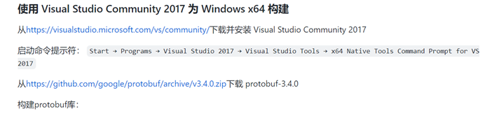

1--cd <protobuf-root-dir>

2--mkdir build

3--cd build

cmake -G"NMake Makefiles" -DCMAKE_BUILD_TYPE=Release -DCMAKE_INSTALL_PREFIX=%cd%/install -Dprotobuf_BUILD_TESTS=OFF -Dprotobuf_MSVC_STATIC_RUNTIME=OFF ../cmake

4--nmake

5--nmake install

 

 

使用Vulkan进行编译NCNN库

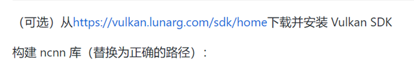

1--cd <ncnn-root-dir>

2--mkdir -p build

3--cd build

cmake -G"NMake Makefiles" -DCMAKE_BUILD_TYPE=Release -DCMAKE_INSTALL_PREFIX=%cd%/install -DProtobuf_INCLUDE_DIR=<protobuf-root-dir>/build/install/include -DProtobuf_LIBRARIES=<protobuf-root-dir>/build/install/lib/libprotobuf.lib -DProtobuf_PROTOC_EXECUTABLE=<protobuf-root-dir>/build/install/bin/protoc.exe -DNCNN_VULKAN=ON ..

4--nmake

5--nmake install

 

 

<protobuf-root-dir>就是前面安装的protobuf安装路径

 

##  ncnn | Windows（VS2019）编译

https://blog.csdn.net/qq_40231159/article/details/111808792

**【ncnn开发记录】ncnn & opencv-mobile &  VS2019的Windows编译**

https://zhuanlan.zhihu.com/p/388427856

 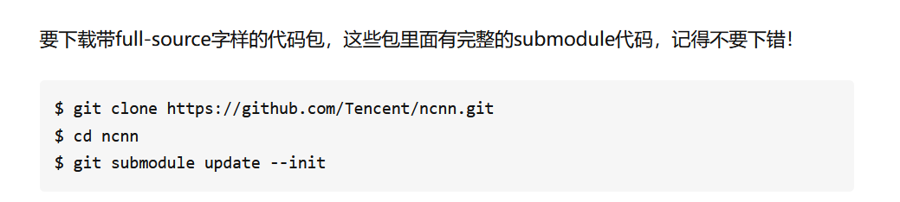

 

## VS-project配置NCNN环境

 

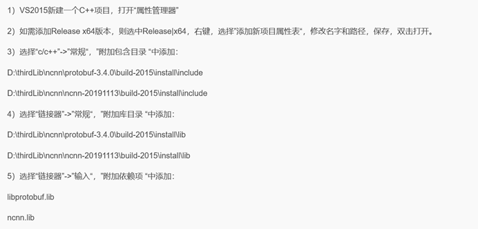

 

 

VS如何导入lib库及.h头文件，

  三步走：

A、添加工程的头文件目录：工程---属性---配置属性---c/c++---常规---附加包含目录：加上头文件存放目录。

 

B、添加文件引用的lib静态库路径：工程---属性---配置属性---链接器---常规---附加库目录：加上lib文件存放目录。

C 然后添加工程引用的lib文件名：工程---属性---配置属性---链接器---输入---附加依赖项：加上lib文件名

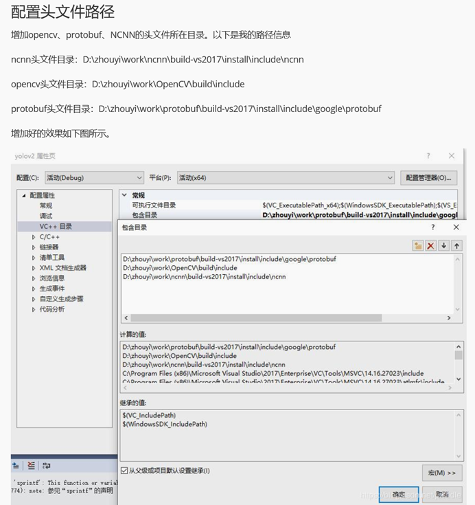

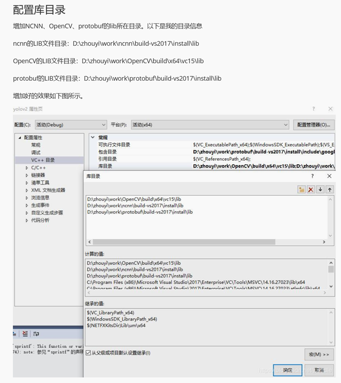

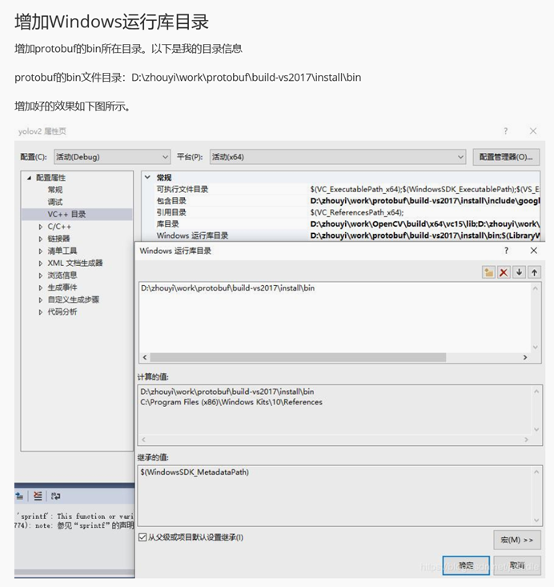

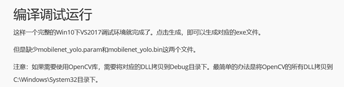

 

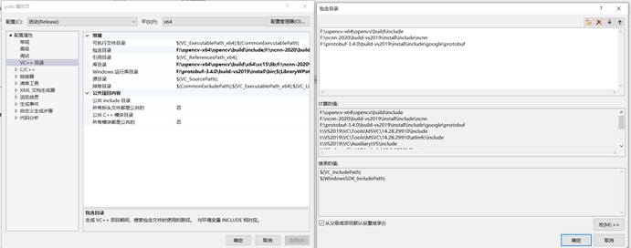

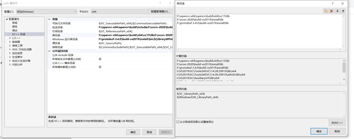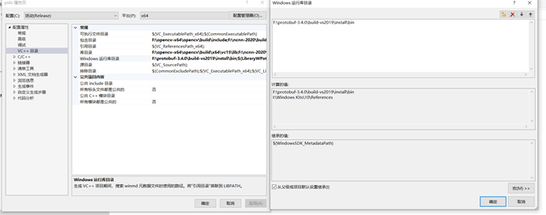

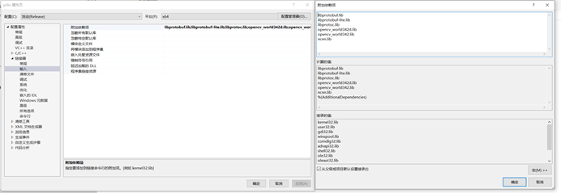


## Android  APP开发使用NCNN

### 以YOLOV5在Android设备部署为例

**1、提前编译好在嵌入式设备支持的so库，比如用protobuf或者使用Vulkan支持编译**

https://github.com/Tencent/ncnn/wiki/how-to-build

​	比如使用了Vulkan支持，编译出两个ARM架构支持的SO库


**2、在Android工程中加入编译好的库**

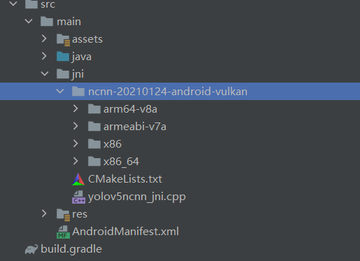

**3、CMakeLists.txt  引入SO库的编译规则**

```
project(yolov5ncnn)

cmake_minimum_required(VERSION 3.4.1)
# ${ANDROID_ABI}就是你编译的手机的cpu架构，比如armeabi、X86、mips64等,编译的时候，它会自动去找libs的对应文件夹
set(ncnn_DIR ${CMAKE_SOURCE_DIR}/ncnn-20210124-android-vulkan/${ANDROID_ABI}/lib/cmake/ncnn)  # 设置NCNN库路径变量 ncnn_DIR ${ANDROID_ABI} ${}取值，把所有的ANDROID_ABI不同架构的包都包含进来
#也就是变量 ncnn_DIR = ${CMAKE_SOURCE_DIR}/ncnn-20210124-android-vulkan/${ANDROID_ABI}/lib/cmake/ncnn
#CMAKE_SOURCE_DIR 这是当前CMake源代码树顶层的完整路径


#REQUIRED可选字段。表示一定要找到包，找不到的话就立即停掉整个cmake
find_package(ncnn REQUIRED) #查找外部项目，并加载其设置，REQUIRED是该函数的参数

# 建立yolov5ncnn.so库
add_library(yolov5ncnn SHARED yolov5ncnn_jni.cpp)

#链接NCNN库

#设置 目标库yolov5ncnn 需要链接库文件ncnn、jnigraphics
target_link_libraries(
        yolov5ncnn  # 目标 yolov5ncnn.so
        ncnn        #  yolov5ncnn.so依赖项目1
        jnigraphics  # yolov5ncnn.so依赖项目2
)
```


**4、app下的build.gradle配置**

```
apply plugin: 'com.android.application'

android {
    compileSdkVersion 29
    buildToolsVersion "29.0.2"

    defaultConfig {
        applicationId "com.tencent.yolov5ncnn"
        archivesBaseName = "$applicationId"

        ndk {
            moduleName "ncnn"
            // 架构支持
            abiFilters "armeabi-v7a", "arm64-v8a","x86","x86_64"
        }
        minSdkVersion 24
    }

    externalNativeBuild {
        cmake {
            version "3.10.2"
            // 添加的so库的编译规则文件路径
            path file('src/main/jni/CMakeLists.txt')
        }
    }
}
```


**5、java调用so库的接口**

更具体看MNN的笔记


## 基本概念

这里需要理解ncnn的几个重要的concept，方便后面解释。

1. Layer

ncnn的layer对应着实际的计算node，比如说conv或者add。

需要注意的是，在转换pytorch或者tf的模型到ncnn中时，除了对于基本graph的翻译之外，ncnn还会插入额外的node，最常见也是最重要的就是split。split node本身的意义是将输入的blob（也就是tensor）浅拷贝一份。ncnn不像tf或者torch，和tflite的结构类似，blob是producer和consumer是严格一一对应的，单一producer只支持单一consumer，不允许一个producer对应多个consumer。

\2. Blob

这个概念在pytorch和tf中并不存在，所以可能广大pythoner比较难以理解。blob的本质是构建一个producer-consumer对，其内容是tensor。在param中的表达是一个blob name，（也就是我们在input和extract中填写的那个）。一个producer 只能对应一个consumer，如果要一对多，需要借助split layer来实行producer的拷贝。

\3. Extractor

ncnn是将网络的结构用blob链接构成一个DAG（有向无环图），给定input以及extract之后，从extract向上查找，找到通往input的路径，让后再顺序路径forward下来。所以流程中对于output不必需要的node不会被计算，同时，如果extract一次之后，再重新extract，重复计算过的node也不会被计算。

那么，有些同学可能要问了，如果ncnn每一层都缓存，会不会占用内存特别大呢？实际上ncnn并不是每一层都会缓存，只有分叉的split，那么ncnn会在分叉的位置缓存blob。


## CPU Runtime中的Extractor

在CPU上比较简单，只需要简单的构建一个生成器，给定输入数据，再extract就行了。

```c
ncnn::Extractor ex = ncnn_net->create_extractor();
ex.input(net_data->net_input_blob_name, input_image);
ex.extract(layers_data[i].blob_name, out_mat);
```

这里的out_mat是网络结构中的浅拷贝，并不需要实际搬运数据。如果存在packing或者使用了低精度的计算，比如说fp16/bf16，那么extractor默认也会还原成无packing的fp32状态。

如果需要在网络中抽取多次，同时这些还原的操作不是必要的，比如说我还需要把得到的结果feed进其他layer里处理，那么可以直接extract不经过还原的mat


```c
ncnn::Extractor ex = ncnn_net->create_extractor();
ex.input(net_data->net_input_blob_name, input_image);
ex.extract(layers_data[i].blob_name, out_mat, 1); //FLAG=1, 需要新版ncnn支持
```

## GPU Runtime中的Extractor

在GPU上，如果你不在意gpu到cpu上的缓存拷贝，那么可以完全参考cpu上的实现，那么这里主要介绍一下，如果我需要实现zero copy的提取gpu上的Vulkan Mat（VkMat)应该怎么做。

```c
ncnn::VkMat vk_out_mat; 
ncnn::VkCompute cmd(ncnn_net->vulkan_device()); 

ncnn::Extractor ex = ncnn_net->create_extractor();
ex.input(net_data->net_input_blob_name, input_image);

ex.extract(gap_layers_data[i].blob_name, gap_tap_mat, cmd);
```


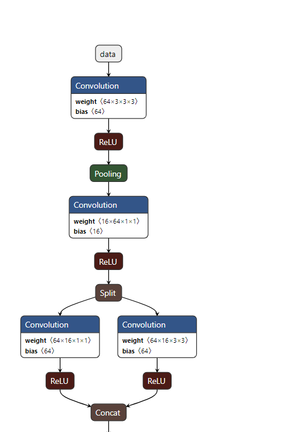

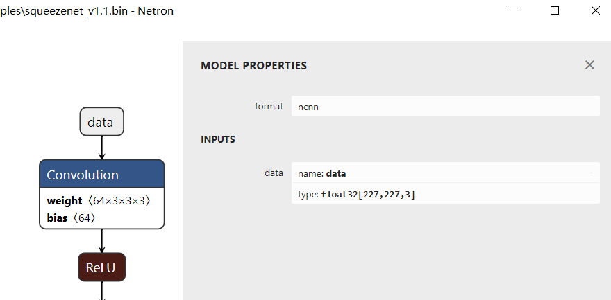

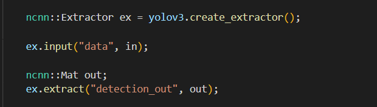

**ex.input()中的data就是 blob.name  也就是神经网络图中的data输入块的名字**


**也就是在ex.input(net_data->net_input_blob_name, input_image);时，net_data->net_input_blob_name的具体名字要按照自己使用的神经网络的blob功能块所设定的名字**


**比如是squeezenet.cpp中使用**   

  **squeezenet.load_param("squeezenet_v1.1.param");**

  **squeezenet.load_model("squeezenet_v1.1.bin");**


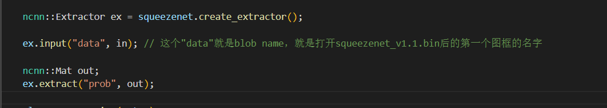


**输入输出的blob名字要和网络模型一致**

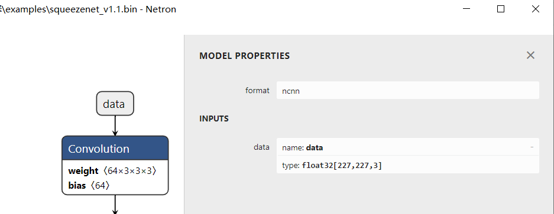


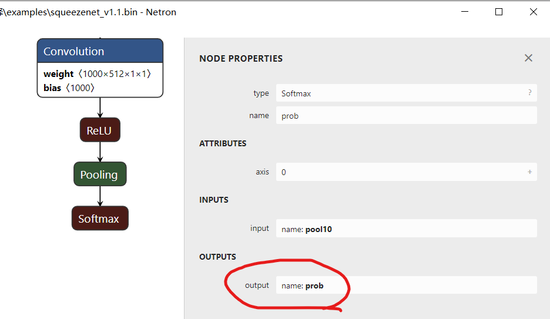


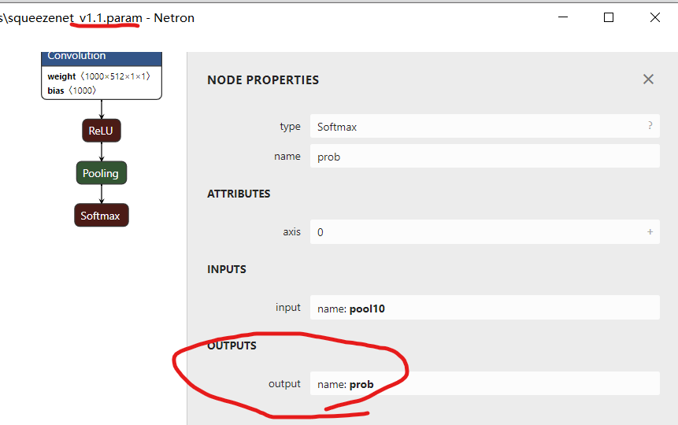


**也就是简单的说，把自己的模型转换成NCNN模型后，就能使用NCNN的生成执行器来进行推理加速，获得加速处理后的神经网络计算结果，这个结果再根据具体的开发需要来进一步处理**

**ncnn中做了三层封装，分别是layer，net，extractor。extractor是最后一道封装，也是实现前向推理流程的部件。**


##  **extract() 的递归流程图**


[ncnn前向计算流程浅析 - 假欢畅 又何妨 无人共享 (polariszhao.github.io)](https://polariszhao.github.io/2020/09/21/ncnn前向计算流程浅析/)


## NCNN 网络支持层

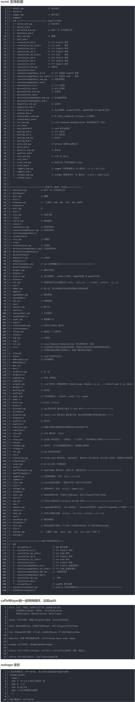

# NCNN是如何加速的？

[如何阅读一个前向推理框架？以NCNN为例。-技术圈 (proginn.com)](https://jishuin.proginn.com/p/763bfbd352a0)

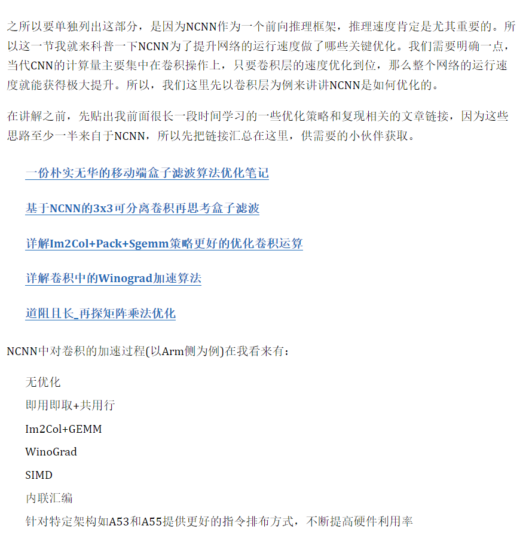


**NCNN中对卷积的加速过程(以Arm侧为例)有：**

- **无优化**
- **即用即取+共用行**
- **Im2Col+GEMM**
- **WinoGrad**
- **SIMD**
- **内联汇编**
- **针对特定架构如A53和A55提供更好的指令排布方式，不断提高硬件利用率**

**后面又加入了Pack策略，更好的改善访存，进一步提升速度。**


##  **算子源码学习（ncnn库，AI方向）**

**ncnn**（https://github.com/Tencent/ncnn/tree/e16b338b136c94805bc7d0ef3756f2dc4bfa3408/src/layer）是腾讯开源，nihui维护的AI推理引擎。2017开源至今，其代码依然保持着组织结构简单、易重用的优点。ncnn实现的算子包含普通实现（无针平台的加速）和针对3种平台（arm/vulkan/x86）的指令集加速实现（注：可能有的算子有普通实现，但没有平台加速实现，毕竟做加速实现还是比较耗费精力的，致敬nihui大大）。

由于Neon实现往往跟循环展开等技巧一起使用，代码往往比较长。我们可以先阅读普通实现的代码实现了解顶层逻辑，再阅读Neon实现的代码。例如，我们希望学习全连接层（innerproduct）的Neon实现，其普通实现的位置在ncnn/src/layer/innerproduct.cpp，对应的Neon加速实现的位置在ncnn/src/layer/arm/innerproduct_arm.cpp。

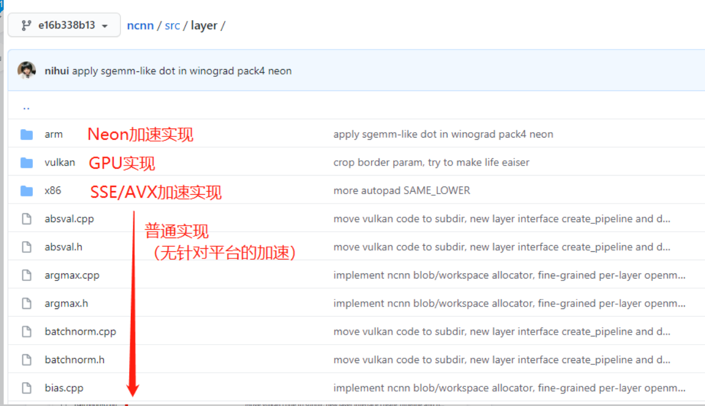


**针对不同架构使用不同的加速体系，比如ARM加速优化用neon，X86使用SSE、AVX等指令集加速，又同时这些加速指令集大部分是c/c++编写的，又在这个基础上针对C、C++的加速即使用openMP进行再次加速**

ncnn的算子代码组织逻辑

注意代码中出现较多的条件编译。原因我们上文提到过，有的intrinsics是较新Aarch64架构下专有的，为了兼容较老的ArmV7a架构，对于不能用的intrinsics只能用多条兼容的intrinsics等效替代。为了保证Aarch64下的性能同时保证对ArmV7a的兼容性，ncnn采用条件编译的方式处理不兼容的intrinsics（条件编译就是编译满足条件的分枝的代码，不满足条件的代码将不出现在最终的二进制文件中）。

如果你只关注Aarch64平台下的实现，下图#else分支的代码跳过不看即可。

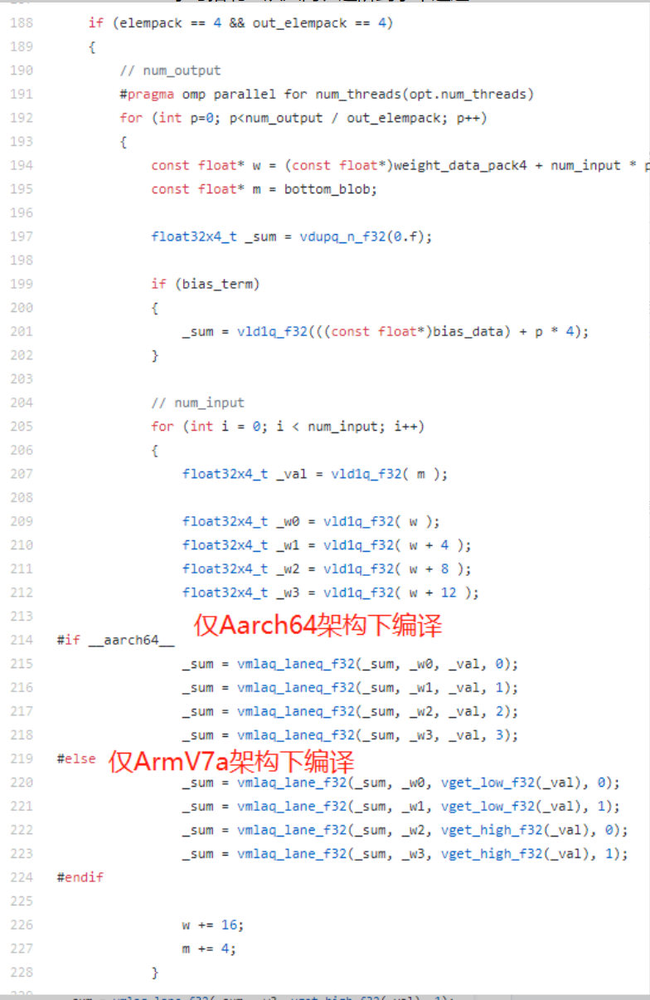

innerproduct_arm代码（部分）


**流行的推理框架（加速器），如[NCNN](https://github.com/Tencent/ncnn)、[NNPACK](https://github.com/Maratyszcza/NNPACK)等，可以看到，对于卷积层，大家不约而同地采用了Winograd快速卷积算法，该算法出自CVPR 2016的一篇 paper：[Fast Algorithms for Convolutional Neural Networks](https://arxiv.org/abs/1509.09308)。**


# Winograd快速卷积算法 

(https://www.cnblogs.com/shine-lee/p/10906535.html)


**Winograd快速卷积算法，该算法出自CVPR 2016的一篇 paper：[Fast Algorithms for Convolutional Neural Networks](https://arxiv.org/abs/1509.09308)。**


**有一个Python工具包可以直接帮我们计算，地址为：`https://github.com/andravin/wincnn`**


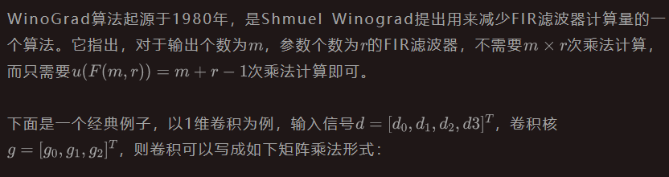


​																				式子1

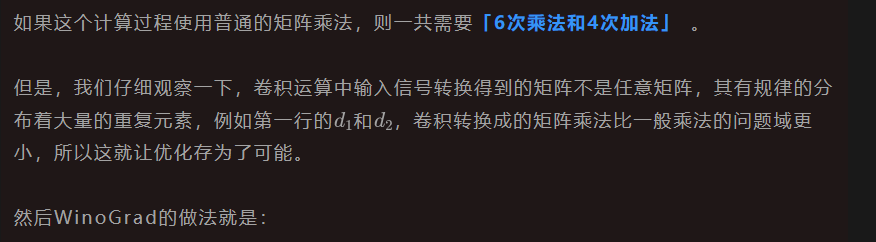


​																							式子2

其中，


​																								等式3

我们知道，在CNN的推理阶段，卷积核上的元素是固定的，所以上式中和

相关的式子可以提前算好，在预测阶段只用计算一次，可以忽略。所以这里一共需要**「4次乘法加4次加法」**。

相比于普通的矩阵乘法，使用WinoGrad算法之后乘法次数减少了，这样就可以达到加速的目的了。

这个例子实际上是**「1D的WinoGrad算法」**，我们将上面的计算过程写成矩阵的形式如下：


​																			式子4

其中，

表示element-wise multiplication（Hadamard product）对应位置相乘。其中，


​																				相关矩阵解释

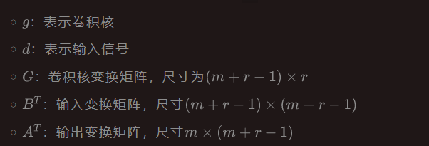

所以整个计算过程可以分为4步：

- 输入变换
- 卷积核变换
- 外积
- 输出变换

然后我们将1D的WinoGrad扩展到2D，就可以实现


卷积的加速了，那么如何从1维扩展到2维呢？公式如下：

式子5

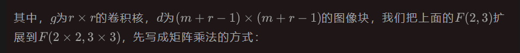

										F(2x2,3x3) 图片来自https://www.cnblogs.com/shine-lee/p/10906535.html

上图表示我们将卷积核的元素拉成了一列，将输入信号每个滑动窗口中的元素拉成了一行。注意图中红线分成的矩阵块，每个矩阵块中重复元素的位置与一维相同，即：

														二维和一维的WinoGrad矩阵关系

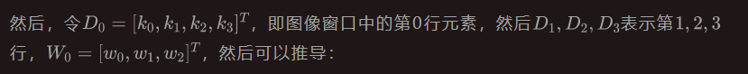

															2D WinoGrad矩阵形式计算推导

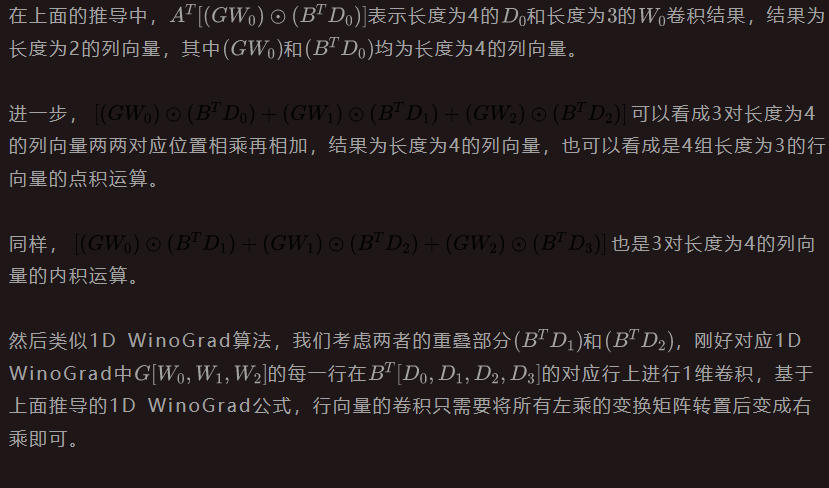

下图表示2D WinoGrad的示意图：

																	2D WinoGrad示意图

这个时候，WinoGrad算法的乘法次数为4x4 =16，而如果直接卷积乘法次数为，**「降低了2.25倍的乘法计算复杂度」**。

 


**算法流程可视化如下，图片出自论文[Sparse Winograd Convolutional neural networks on small-scale systolic arrays](https://www.researchgate.net/publication/328091476_Sparse_Winograd_Convolutional_neural_networks_on_small-scale_systolic_arrays/figures)，与算法对应着仔细推敲还是挺直观的。**


**总结**

- 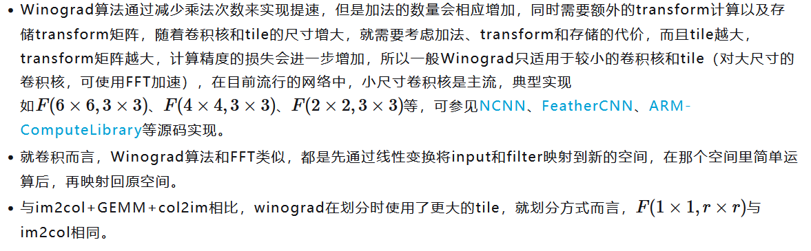


# Winograd变换矩阵生成原理                

https://mp.weixin.qq.com/s?__biz=MzA4MjY4NTk0NQ==&mid=2247485582&idx=1&sn=30407b3ac9e686b084618db9e5aa47dd&scene=21#wechat_redirect


# 基于NCNN的3x3可分离卷积再思考盒子滤波                


https://mp.weixin.qq.com/s?__biz=MzA4MjY4NTk0NQ==&mid=2247488809&idx=1&sn=8fb2c0b60690cf580aadd6c6b7166201&chksm=9f80afbfa8f726a983ced9c1152e00aee0ef16240ed05584281d5bef6c7360e8f704e6823912&scene=178&cur_album_id=1344051679762776064#rd


```
https://github.com/BBuf/ArmNeonOptimization
```


