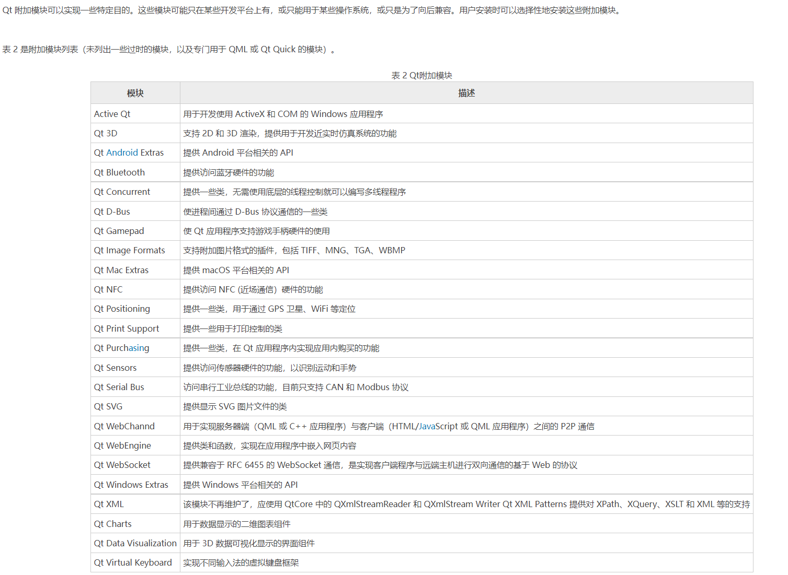

# 2021-11-14

**中文手册**：https://www.qtdoc.cn

## Qt 整体目录结构

以 Qt 5.9.0 为例

注意，~\5.9\ 和 ~\Tools\ 目录下都有 mingw53_32 目录（图中我用红色标出来了），但是两者是有区别的：

- ~\5.9\mingw53_32\ 目录包含的是 Qt 的类库文件，例如头文件、静态库、动态库等，这些类库文件使用 MinGW 工具集编译而成。
- ~\Tools\mingw53_32\ 目录包含的是 MinGW 工具集，例如编译器 g++、链接器 ld、make 工具、打包工具 ar 等。

## Qt 类库目录

[Qt是什么？Qt简介（非常全面） (biancheng.net)](http://c.biancheng.net/view/1792.html)

## Qt模块

[Qt](http://c.biancheng.net/qt/) 类库里大量的类根据功能分为各种模块，这些模块又分为以下几大类：

- Qt 基本模块（Qt Essentials)：提供了 Qt 在所有平台上的基本功能。
- Qt 附加模块（Qt Add-Ons)：实现一些特定功能的提供附加价值的模块。
- 增值模块（Value-AddModules)：单独发布的提供额外价值的模块或工具。
- 技术预览模块（Technology Preview Modules）：一些处于开发阶段，但是可以作为技术预览使用的模块。
- Qt 工具（Qt Tools)：帮助应用程序开发的一些工具。

### Qt基本模块

### Qt附加模块

### 增值模块

除了随 Qt 5 发布的上述这些模块，还有一些模块（见表 3)是单独发布的，这些模块只在商业版许可的 Qt 里才有。

### 技术预览模块

技术预览模块就是一些还处于开发和测试阶段的模块，一般技术预览模块经过几个版本的发布后会变成正式的模块。表 4 是 Qt 5.9 中的技术预览模块

### Qt 工具

Qt 工具（见表 5)在所有支持的平台上都可以使用，用于帮助应用程序的开发和设计。

**Qt编程涉及的术语和名词**

**Project**

- Qt 使用 .pro 文件管理项目；
- VC++ 则使用 .vcproj 作为项目文件。

**Makefile**

qmake 工具， 这样就大量减轻了程序员的负担

**Debug 和 Release**

Debug 即调试，Release 即发行。

**C++11 标准**

时代在变化，C++ 标准也在前进。C++ 正式公布标准有 C++98、C++03、C++11。

**Dynamic Link 和 Static Link**

Dynamic Link 即动态链接，Static Link 即静态链接。

**Explicit Linking 和 Implicit Linking**

Explicit Linking 即显式链接，Implicit Linking 即隐式链接，这两种都是动态链接库的使用方式。

## 什么是 Qt 控件

Qt 控件又称组件或者部件，指用户看到的**所有可视化**界面以及界面中的各个元素，比如按钮、文本框、输入框等。

Qt 中的每个控件都由特定的类表示，每个控件类都包含一些常用的属性和方法，所有的控件类都直接或者间接继承自 QWidget 类。实际开发中，我们可以使用 Qt 提供的这些控件，也可以通过继承某个控件类的方式自定义一个新的控件。

制作应用程序的主窗口可以用 QMainWindow 或者 QWdiget；制作一个提示信息的对话框就用 QDialog 或 QWidget；如果暂时无法决定，后续可能作为窗口，也可能作为控件，就选择 QWidget

## 什么是Qt事件

**QEvent**

简单地理解，Qt 事件指的是应用程序和用户之间的交互过程，例如用户按下某个按钮，点击某个输入框等等。实际上除了用户会与

应用程序进行交互外，操作系统也会与应用程序进行交互，例如当某个定时任务触发时，操作系统会关闭应用程序，这也是一个事

件。

Qt 界面程序的 main() 主函数中首先要创建一个 QApplication 类的对象，函数执行结束前还要调用 QApplication 对象的 exec() 函

数。一个 Qt 界面程序要想接收事件，main() 函数中就必须调用 exec() 函数，它的功能就是使程序能够持续不断地接收各种事件。

Qt 程序可以接收的事件种类有很多，例如鼠标点击事件、鼠标滚轮事件、键盘输入事件、定时事件等。每接收一个事件，Qt 会分

派给相应的事件处理函数来处理。**所谓事件处理函数，本质就是一个普通的类成员函数**，以用户按下某个 QPushButton 按钮为

例，Qt 会分派给 QPushButton 类中的 mousePressEvent() 函数处理。

事件处理函数通常会完成两项任务，分别是：

- 修改控件的某些属性，比如当用户按下按钮时，按钮的背景颜色会发生改变，从而提示用户已经成功地按下了按钮；

- 运用信号和槽机制处理事件。

**1 事件处理器**

众所周知 Qt 是一个基于 C++ 的框架，主要用来开发带窗口的应用程序（不带窗口的也行，但不是主流）。我们使用的基于窗口的应用程序都是基于事件，其目的主要是用来实现回调（因为只有这样程序的效率才是最高的）。所以在 Qt 框架内部为我们提供了一些列的事件处理机制，当窗口事件产生之后，**事件会经过：事件派发 -> 事件过滤->事件分发->事件处理几个阶段**。Qt 窗口中对于产生的一系列事件都有默认的处理动作，如果我们有特殊需求就需要在合适的阶段重写事件的处理动作。

事件（event）是由系统或者 Qt 本身在不同的场景下发出的。当用户按下 / 移动鼠标、敲下键盘，或者是窗口关闭 / 大小发生变化 / 隐藏或显示都会发出一个相应的事件。一些事件在对用户操作做出响应时发出，如鼠标 / 键盘事件等；另一些事件则是由系统自动发出，如计时器事件。

每一个 Qt 应用程序都对应一个唯一的 QApplication 应用程序对象，然后调用这个对象的 exec() 函数，这样 Qt 框架内部的事件检测就开始了（程序将进入事件循环来监听应用程序的事件）。

**Qt 提供的这些事件处理器函数都是回调函数，也就是说作为使用者我们只需要指定函数的处理动作，关于函数的调用是不需要操心的，当某个事件被触发，Qt 框架会调用对应的事件处理器函数。**

**2 事件分发器**

当事件产生被发送到对应的窗口之后，窗口并不会直接处理这个事件，而是对这些事件进行细分，然后根据事件的类型再次进行分发（相当于公司接了个项目，对项目进行查分之后分发给各个职能部门，由各个部门进行模块的开发），对应的事件处理器函数得到这个分发的事件之后就开始处理这个事件。

**3 事件过滤器**   eventFilter

除了使用事件分发器来过滤 Qt 窗口中产生的事件，还可以通过事件过滤器过滤相关的事件。当 Qt 的事件通过应用程序对象发送给相关窗口之后，窗口接收到数据之前这个期间可对事件进行过滤，过滤掉的事件就不能被继续处理了

## 信号和槽

**信号和槽是 Qt 特有的消息传输机制，它能将相互独立的控件关联起来。**

举个简单的例子，按钮和窗口本是两个独立的控件，点击按钮并不会对窗口造成任何影响。通过信号和槽机制，我们可以将按钮和

窗口关联起来，实现“点击按钮会使窗口关闭”的效果。

在 Qt 中，用户和控件的每次交互过程称为一个事件，比如“用户点击按钮”是一个事件，“用户关闭窗口”也是一个事件。每个事件都

会发出一个信号，例如用户点击按钮会发出“按钮被点击”的信号，用户关闭窗口会发出“窗口被关闭”的信号。

Qt 中的所有控件都具有接收信号的能力，一个控件还可以接收多个不同的信号。对于接收到的每个信号，控件都会做出相应的响应

动作。例如，按钮所在的窗口接收到“按钮被点击”的信号后，会做出“关闭自己”的响应动作；再比如输入框自己接收到“输入框被点

击”的信号后，会做出“显示闪烁的光标，等待用户输入数据”的响应动作。

**在 Qt 中，对信号做出的响应动作就称为槽。**

信号和槽机制底层是通过函数间的相互调用实现的。每个信号都可以用函数来表示，称为**信号函数**；每个槽也可以用函数表示，称

为**槽函数**。

例如，**“按钮被按下”这个信号可以用 clicked() 函数表示，“窗口关闭”这个槽可以用 close() 函数表示**，信号和槽机制实

现“点击按钮会关闭窗口”的功能，其实就是 clicked() 函数调用 close() 函数的效果。

信号函数和槽函数通常位于某个类中，和普通的成员函数相比，它们的特别之处在于：

- **信号函数用 signals 关键字修饰，槽函数用 public slots、protected slots 或者 private slots 修饰**。signals 和 slots 是 Qt 在 C++ 的基础上扩展的关键字，专门用来指明信号函数和槽函数；

- **信号函数只需要声明，不需要定义（实现），而槽函数需要定义（实现）。**

**注意**，并非所有的控件之间都能通过信号和槽关联起来，信号和槽机制只适用于满足以下条件的控件：

- 控件类必须直接或者间接继承自 QObject 类。Qt 提供的控件类都满足这一条件

- 控件类中必须包含 private 属性的 Q_OBJECT 宏。

Qt**常用类继承关系**

**将某个信号函数和某个槽函数关联起来，需要借助 QObject 类提供的 connect() 函数。**

### connect()函数实现信号和槽

connect() 是 QObject 类中的一个静态成员函数，专门用来关联指定的信号函数和槽函数。

关联某个信号函数和槽函数，需要搞清楚以下 4 个问题：

- 信号发送者是谁？
- 哪个是信号函数？
- 信号的接收者是谁？
- 哪个是接收信号的槽函数？

一个 connect() 函数只能关联一个信号函数和一个槽函数，程序中可以包含多个 connect() 函数，能实现以下几种效果：

- 关联多个信号函数和多个槽函数；
- 一个信号函数可以关联多个槽函数，当信号发出时，与之关联的槽函数会一个接一个地执行，但它们执行的顺序是随机的，无法人为指定哪个先执行、哪个后执行；
- 多个信号函数可以关联同一个槽函数，无论哪个信号发出，槽函数都会执行。

此外，connect() 函数的 method 参数还可以指定一个信号函数，也就是说，信号之间也可以相互关联，这样当信号发出时，会随之发出另一个信号。

# Qt布局管理详解（5种布局控件）

作为一款成熟的 GUI 框架，Qt 提供了很多摆放控件的辅助工具（又称布局管理器或者布局控件），它们可以完成两件事：

- 自动调整控件的位置，包括控件之间的间距、对齐等；
- 当用户调整窗口大小时，位于布局管理器内的控件也会随之调整大小，从而保持整个界面的美观。

**QVBoxLayout（垂直布局）**    **vertical**

垂直布局指的是将所有控件从上到下（或者从下到上）依次摆放

**QHBoxLayout（水平布局**        **horizontal**

水平布局指的是将所有控件从左到右（或者从右到左）依次摆放

**QGridLayout（网格布局）**       **grid**

网格布局又称格栅布局或者表格布局，指的是将一些控件按照行和列排列在窗口上

**QFormLayout（表单布局）**     **form** 

Qt 提供了很多种输入框控件，包括 QLineEdit 单行输入框、QTextEdit 多行输入框等。通常情况下，每个输入框的旁边都会附带一些文字（又称标签），用来提示用户需要输入的信息。

**QStackedLayout（分组布局）** **stack**

QStackedLayout 布局管理器可以容纳多个控件或者窗口，但每次只显示其中的一个

继承关系如下图所示：

# pro文件中的配置信息

1. 前半部分是关键字，也称配置项，用来指明配置信息的含义；
2. 中间用 +=(追加)、-=(删除)、=(赋值) 等数学符号连接配置项和它对应的值；
3. 后半部分是配置项对应的值，一个配置项可以对应多个值，每个值代表不同的含义。

| 配置项                                          | 含 义                                                        |
| ----------------------------------------------- | ------------------------------------------------------------ |
| QT                                              | 指定项目中用到的所有模块，默认值为 core 和 gui，中间用 += 符号连接。 |
| greaterThan(QT_MAJOR_VERSION, 4): QT += widgets | 如果 QT 版本大于 4（Qt5 或更高版本），则需要添加 widgets 模块，该模块包含所有控件类。 |
| TARGET                                          | 指定程序成功运行后生成的可执行文件的名称，中间用 = 符号连接。 |
| TEMPLATE                                        | 指定如何运行当前程序，默认值为 app，表示当前程序是一个应用程序，可以直接编译、运行。常用的值还有 lib，表示将当前程序编译成库文件。 |
| DEFINES                                         | 在程序中新定义一个指定的宏，比如 DEFINES += xxx，如同在程序中添加了 #define xxx 语句。 |
| SOURCES                                         | 指定项目中包含的所有 .cpp 源文件。                           |
| HEADERS                                         | 指定项目中包含的所有 .h 头文件。                             |
| FORMS                                           | 指定项目中包含的 ui 文件。                                   |
| INCLUDEPATH                                     | 指定头文件的存储路径，例如：INCLUDEPATH += /opt/ros/include  |
| CONFIG                                          | 经常对应的值有：release：以 release 模式编译程序；debug：以 debug 模式编译程序；warn_on：编译器输出尽可能多的警告；c++11：启动 C++11 标准支持。例如 CONFIG += c++11。 |

## QT配置项

前面提到，Qt 根据各个类的功能将它们分到不同的模块，因此程序中要想使用某个类，必须完成两项准备工作：

1. 引入包含该类的头文件，通常情况下，Qt 中每个类的类名和包含它的头文件的名称是相同的，比如 QWiget 窗口类位于`<QWidget>`头文件中；
2. 将该类所属的模块添加到 pro 项目管理文件中。

当程序中用到某个类时，如何知道它属于哪个模块呢？很简单，先将该类所在的头文件中引入到程序中，然后鼠标选中头文件并按`Fn+F1`组合键，打开该头文件的使用手册后就可以看到它所属的模块。

QWidget 窗口类为例，先在程序中添加如下语句：

#include <QWidget>

紧接着，鼠标选中“QWidget”并按`Fn+F1`组合键，打开下图所示的 QWdiget 类使用手册，可以看到该类所属的模块为 widgets。

# Qt自定义信号和槽函数

 Qt 提供的信号函数和槽函数，会经常遇到信号函数的参数类型和个数无法满足实际需求、信号函数和槽函数的参数类型不匹配等

问题。解决此类问题，最简单有效的方式就是：自定义场景需要的信号函数和槽函数。

**所谓信号槽，实际就是观察者模式 (发布 - 订阅模式)。当某个事件发生之后，比如，按钮检测到自己被点击了一下，它就会**

**发出一个信号（signal）。这种发出是没有目的的，类似广播。如果有对象对这个信号感兴趣，它就会使用连接**

**（connect）函数，意思是，将想要处理的信号和自己的一个函数（称为槽（slot））绑定来处理这个信号。也就是说，**

**当信号发出时，被连接的槽函数会自动被回调。这就类似观察者模式：当发生了感兴趣的事件，某一个操作就会被自动触**

**发。**

**信号是由于用户对窗口或控件进行了某些操作，导致窗口或控件产生了某个特定事件，这时候 Qt 对应的窗口类会发出某个信号，以此对用户的挑选做出反应。**

## 自定义信号函数

信号函数指的是符合以下条件的函数：

- 定义在某个类中，该类直接或间接继承自 QObject 类；
- 用 signals 关键字修饰；
- 函数只需要声明，不需要定义（实现）；
- 函数的返回值类型为 void，参数的类型和个数不限。

我们自定义了一个继承自 QWidget 的 MyWidget 类，QWidget 是 QObject 的子类，所以 MyWidget 间接继承自 QObject 类。MyWidget 类中自定义了名为 MySignal 的信号函数（可以简称 MySignal 信号），它用 signals 关键字修饰，没有返回值，也没有定义（实现），仅有 1 个参数。

对于 MySignal() 信号函数，程序中不会直接调用它，而是借助 connect() 连接某个槽函数，实现的语法格式是：

MyWidget myWidget;

QObject::connect(&myWidget,&MyWidget::MySignal,信号接收者,槽函数);

**一旦确定了信号接收者和槽函数，当 MySignal 信号发出后，与之相连的槽函数就会执行。那么，程序中如何发出 MySignal 信号呢？**

对于 Qt 提供给我们的信号函数，其底层已经设置好了信号发出的时机，例如按下鼠标时、点击 Enter 回车键时等等。对于自定义的信号，我们需要自己指定信号发出的时机，这就需要用到 emit 关键字。emit 中文意思为“发出、射出”，是 Qt 在 C++ 基础上扩展的一个关键字，专门用来发射信号。

我们为 MyWidget 类新增了一个 emitSignal() 方法和一个 message 属性，emitSignal() 方法中的`emit MySignal(message);`语

句就表示发射 MySignal 信号。当程序中执行 emitSingal() 函数时，就会发出 MySignal 信号，message 属性的值也会随信号一同

发出，对应的槽函数可以接收到 message 的值。

**对于每一个自定义的信号函数，程序中都应该提供发射该信号的方法（函数），而且这样的方法（函数）可以有多个。**

**在 Qt 中槽函数是一类特殊的功能的函数，在编码过程中也可以作为类的普通成员函数来使用。之所以称之为槽函数是因为它们还有一个职责就是对 Qt 框架中产生的信号进行处理。**

## 自定义槽函数

**Qt5 中，槽函数既可以是普通的全局函数、也可以是类的成员函数、静态成员函数、友元函数、虚函数，还可以用 lambda 表达式表示。**

和信号函数不同，槽函数必须手动定义（实现）。槽函数可以在程序中直接调用，但主要用来响应某个信号。自定义一个槽函数时，需要注意以下几点：

- 槽函数的返回值必须和信号函数相同，由于信号函数的返回值一定是 void，所以槽函数的返回值也必须为 void；
- 对于带参的信号函数，槽函数可以选择接收所有参数，则参数的类型、顺序、个数都必须与信号函数相同；也可以选择接收前几个参数，这些参数的类型、顺序都必须与信号函数相同；还可以选择不接受任何参数。
- 槽函数的参数个数只能比信号函数少，不能比信号函数多；
- 槽函数的参数**不能有默认值**。

程序中，重点关注 recSlot1()、recSlot2()、recSlot3() 这 3 个函数：

- recSlot1() 是 MyWidget 类内部的 public 成员函数，可以当做槽函数使用；
- recSlot2() 位于 MyWidget 类的内部，修饰它的关键字是 `public slots`。slots 和 emit 一样，是 Qt 扩展的一个关键字，专门用来修饰槽函数。也就是说，recSlot2() 是 MyWidget 类中的槽函数。
- recSlot3() 是全局函数，可以当做槽函数使用。

slots 关键字可以和 public、protected、private 搭配使用，它们的区别是：

- public slots：该关键字修饰的槽函数，既可以在当前类及其子类的成员函数中调用，也可以在类外部的其它函数（比如 main() 函数）中调用；
- protected slots：该关键字修饰的槽函数，仅允许在当前类及其子类的成员函数内调用，不能在类外部的其它函数内调用；
- private slots：该关键字修饰的槽函数，只允许在当前类的成员函数内调用，不能在子类中调用，也不能在类外部的其它函数内调用。

**通常情况下，槽函数使用 public slots 修饰。**

**很多读者会问，既然 public 修饰的成员函数可以当做槽函数，为什么还要提供 slots 关键字呢？笔者认为，“兼容旧的 Qt 版本”是其中的一个原因。Qt4 中的槽函数只能是 slots 修饰的类成员函数，Qt5 中取消了这一限制，但考虑到要兼容旧的 Qt 版本，Qt5 保留了旧版本中 connect() 函数的语法格式，也保留了 slots 关键字。**

**如果需要在这个任务中使用 Qt 的信号槽机制进行数据的传递就必须继承 QObject 这个类**

##  信号和槽的关系--connect()函数

**在 Qt 中信号和槽函数都是独立的个体，本身没有任何联系，但是由于某种特性需求我们可以将二者连接到一起，好比牛郎和织女想要相会必须要有喜鹊为他们搭桥一样。在 Qt 中我们需要使用 QOjbect类中的 connect 函数进二者的关联。**

连接信号和槽的 connect() 函数原型如下，其中 PointerToMemberFunction 是一个指向函数地址的指针

**[信号发送者，信号，接收者，槽]**

**QByteArray**

在 Qt 中 **QByteArray** 可以看做是 c 语言中 char* 的升级版本。我们在使用这种类型的时候可通过这个类的构造函数申请一块动态内存，用于存储我们需要处理的字符串数据。

# QT多线程

学习资料参考：

**https://subingwen.cn/qt/**

析构函数(**destructor**) 与构造函数(**constructor**)相反，当对象结束其[生命周期](https://baike.baidu.com/item/生命周期)，如对象所在的[函数](https://baike.baidu.com/item/函数/301912)已[调用](https://baike.baidu.com/item/调用/3351318)完毕时，系统自动执行

析构函数。析构函数往往用来做“清理善后” 的工作（例如在建立对象时用new开辟了一片内存空间，delete会自动调用析构函数后释放[内存](https://baike.baidu.com/item/内存/103614)）。

多线程、线程池

1. 线程池的原理
我们使用线程的时候就去创建一个线程，这样实现起来非常简便，但是就会有一个问题：如果并发的线程数量很多，并且每个线程都是执行一个时间很短的任务就结束了，这样频繁创建线程就会大大降低系统的效率，因为频繁创建线程和销毁线程需要时间。

那么有没有一种办法使得**线程可以复用**，就是执行完一个任务，并不被销毁，而是可以继续执行其他的任务呢？

线程池是一种多线程处理形式，处理过程中将任务添加到队列，然后在创建线程后自动启动这些任务。线程池线程都是后台线程。每个线程都使用默认的堆栈大小，以默认的优先级运行，并处于多线程单元中。如果某个线程在托管代码中空闲（如正在等待某个事件）, 则线程池将插入另一个辅助线程来使所有处理器保持繁忙。如果所有线程池线程都始终保持繁忙，但队列中包含挂起的工作，则线程池将在一段时间后创建另一个辅助线程但线程的数目永远不会超过最大值。超过最大值的线程可以排队，但他们要等到其他线程完成后才启动。

在各个编程语言的语种中都有线程池的概念，并且很多语言中直接提供了线程池，作为程序猿直接使用就可以了，下面给大家介绍一下线程池的实现原理：

线程池的组成主要分为 3 个部分，这三部分配合工作就可以得到一个完整的线程池：

1任务队列，存储需要处理的任务，由工作的线程来处理这些任务
通过线程池提供的 API 函数，将一个待处理的任务添加到任务队列，或者从任务队列中删除
已处理的任务会被从任务队列中删除
线程池的使用者，也就是调用线程池函数往任务队列中添加任务的线程就是生产者线程
2工作的线程（任务队列任务的消费者） ，N 个
线程池中维护了一定数量的工作线程，他们的作用是是不停的读任务队列，从里边取出任务并处理
工作的线程相当于是任务队列的消费者角色，
如果任务队列为空，工作的线程将会被阻塞 (使用条件变量 / 信号量阻塞)
如果阻塞之后有了新的任务，由生产者将阻塞解除，工作线程开始工作
3管理者线程（不处理任务队列中的任务），1 个
它的任务是周期性的对任务队列中的任务数量以及处于忙状态的工作线程个数进行检测
当任务过多的时候，可以适当的创建一些新的工作线程
当任务过少的时候，可以适当的销毁一些工作的线程

# 2021-11-15

## Lambda 表达式&&匿名方法计算符号

Lambda 表达式是 C++ 11 最重要也是最常用的特性之一

**语法格式**

Lambda 表达式就是一个匿名函数， 语法格式如下：

**[c**apture] (params)  opt -> ret {body;};**
    **- capture: 捕获列表**
    **- params: 参数列表**
    **- opt: 函数选项**
    **- ret: 返回值类型**

    - body: 函数体**

**语法定义如下：**
 **[capture] (parameters)  mutable ->return-type{statement}**

各个参数说明：

**1.[capture]：捕捉列表。捕捉列表总是出现在Lambda函数的开始处。实际上，[]是Lambda引出符。编译器根据该引出符判断接下来的代码是否是Lambda函数。捕捉列表能够捕捉上下文中的变量以供Lambda函数使用;**

**2.(parameters)：参数列表。与普通函数的参数列表一致。如果不需要参数传递，则可以连同括号“()”一起省略;**

**3.mutable：mutable修饰符。默认情况下，Lambda函数总是一个const函数，mutable可以取消其常量性。在使用该修饰符时，参数列表不可省略（即使参数为空）;**

**4.->return-type：返回类型。用追踪返回类型形式声明函数的返回类型。我们可以在不需要返回值的时候也可以连同符号”->”一起省略。此外，在返回类型明确的情况下，也可以省略该部分，让编译器对返回类型进行推导;**

**5.{statement}：函数体。内容与普通函数一样，不过除了可以使用参数之外，还可以使用所有捕获的变量。**

① **函数对象参数**

**② 操作符重载函数参数**

​		标识重载的()操作符的参数，没有参数时，这部分可以省略。参数可以通过按值（如：(a,b)）和按引用（如：(&a,&b)）两种方式进行传递。

**③ 可修改标示符**

**④ 错误抛出标示符**

exception声明，这部分也可以省略。exception声明用于指定函数抛出的异常，如抛出整数类型的异常，可以使用throw(int)

**⑤ 函数返回值**

返回值类型，标识函数返回值的类型，当返回值为void，或者函数体中只有一处return的地方（此时编译器可以自动推断出返回值类型）时，这部分可以省略

**⑥ 是函数体**

{}，标识函数的实现，这部分不能省略，但函数体可以为空。

**与普通函数最大的区别是，除了可以使用参数以外，Lambda函数还可以通过捕获列表访问一些上下文中的数据。**

具体地，捕捉列表描述了上下文中哪些数据可以被Lambda使用，以及使用方式（以值传递的方式或引用传递的方式）。语法上，

在“[]”包括起来的是捕捉列表，捕捉列表由多个捕捉项组成，并以逗号分隔。捕捉列表有以下几种形式：

 **1.[var]表示值传递方式捕捉变量var；**

 **2.[=]表示值传递方式捕捉所有父作用域的变量（包括this）；**

 **3.[&var]表示引用传递捕捉变量var   指针方式；**

 **4.[&]表示引用传递方式捕捉所有父作用域的变量（包括this）；**

 **5.[this]表示值传递方式捕捉当前的this指针。**

上面提到了一个父作用域，也就是包含Lambda函数的语句块，说通俗点就是包含Lambda的“{}”代码块。上面的捕捉列表还可以进行组合，例如：

 **1.[=,&a,&b]表示以引用传递的方式捕捉变量a和b，以值传递方式捕捉其它所有变量;**

 **2.[&,a,this]表示以值传递的方式捕捉变量a和this，引用传递方式捕捉其它所有变量。**

**不过值得注意的是，捕捉列表不允许变量重复传递。下面一些例子就是典型的重复，会导致编译时期的错误。例如：**

 **3.[=,a]这里已经以值传递方式捕捉了所有变量，但是重复捕捉a了，会报错的;**

 **4.[&,&this]这里&已经以引用传递方式捕捉了所有变量，再捕捉this也是一种重复。**

    //Qt不传递参数lambda
    connect(this,&lambdaTest::testSingal,this,[=]{
        qDebug()<<QString("test");
    });
    //Qt带传递参数lambda
    connect(this,&lambdaTest::testSingal,this,[=](QString path){
        qDebug()<<path;
    });

# Qt控件

### 1. 按钮基类 QAbstractButton

https://subingwen.cn/qt/qt-buttons/

这些按钮控件之间的继承关系如下图

### 2.Qt中容器类型的控件

**Qt 中常用的容器控件，包括:**

* **Widget,**

这个类是所有窗口类的父类，可以作为独立窗口使用，也可以内嵌到其它窗口中使用。Qt 中的所有控件都属于窗口类， 因此这个类也是所有控件类的基类。

* **Frame,**

QFrame 就是一个升级版的 QWidget, 它继承了 QWidget 的属性，并且做了拓展，这种类型的容器窗口可以提供边框，并且可以设置边框的样式、宽度以及边框的阴影。

* **Group Box,**

  QGroupBox 类的基类是 QWidget, 在这种类型的窗口中可以绘制边框、给窗口指定标题，并且还支持显示复选框。

  

*  **Scroll Area,** 

QScrollArea 这种类型的容器，里边可以放置一些窗口控件，当放置的窗口控件大于当前区域导致无法全部显示的时候, 滚动区域容器会自动添加相应的滚动条(水平方向或者垂直方向), 保证放置到该区域中的所有窗口内容都可以正常显示出来。对于使用者不需要做太多事情，只需要把需要显示的窗口放到滚动区域中就行了。

* **Tool Box,** 

QToolBox 工具箱控件，可以存储多个子窗口，该控件可以实现类似 QQ 的抽屉效果，每一个抽屉都可以设置图标和标题，并且对应一个子窗口，通过抽屉按钮就可以实现各个子窗口显示的切换。

* **Tab Widget,** 

QTabWidget 的一种带标签页的窗口，在这种类型的窗口中可以存储多个子窗口，每个子窗口的显示可以通过对应的标签进行切换。

* **Stacked Widget。**

QStackedWidget 栈类型窗口，在这种类型的窗口中可以存储多个子窗口，但是只有其中某一个可以被显示出来，至于是哪个子窗口被显示，需要在程序中进行控制，在这种类型的窗口中没有直接切换子窗口的按钮或者标签。

# 基于Qt的局域网即时通信系统设计与实现

## LAN、WAN、WLAN、WiFi之间的区别

LAN，全称  **Local Area Network**，中文名叫做**局域网**。

顾名思义，LAN是指在某一区域内由多台计算机互联成的计算机组。一般是方圆几千米以内。局域网可以实现文件管理、应用软件共享、打印机共享、工作组内的日程安排、电子邮件和传真通信服务等功能。局域网是封闭型的，可以由办公室内的两台计算机组成，也可以由一个公司内的上千台计算机组成。

### LAN

互联网服务提供商（Internet Service Provider），简称ISP，指的是面向公众提供下列信息服务的经营者

一是接入服务，即帮助用户接入Internet；

二是导航服务，即帮助用户在Internet上找到所需要的信息；

三是信息服务，即建立数据服务系统，收集、加工、存储信息，定期维护更新，并通过网络向用户提供信息内容服务。

具体到路由器，我们一般组网，都是组建的LAN网络，用户在局域网里通信、传输文件。

其获取到的是内部IP，LAN 内部是交换机。我们可以不连接 WAN 口，把路由器当做普通交换机来使用。

一般用到的LAN的场景：

1，接电脑的网线，需要插到路由器的LAN口。

2，二级路由，一般都是从上级路由的LAN口接线。

### WAN

 

1. 1

   WAN，全称  **Wide Area Network**，中文名叫做广域网。

   WAN是一种跨越大的、地域性的计算机网络的集合。通常跨越省、市，甚至一个国家。广域网包括大大小小不同的子网，子网可以是局域网，也可以是小型的广域网。

WAN：接外部 IP 地址用，通常指的是出口，转发来自内部 LAN 接口的 IP 数据包。

基本每个路由器都有WAN口，当然也有路由猫这种特例。

WAN的应用场景：

1，从猫引出的来网线，要插到路由器的WAN口。

2，二级路由，上级网线插到二级路由的WAN口。

一般路由器都会有一个WAN口，也有多个WAN口的路由。

### WLAN

WLAN，全称   **Wireless LAN**, 无线局域网。

和LAN不同，WLAN的数据通过电磁波传输，也就是常说的空气传输。WLAN 利用电磁波在空气中发送和接受数据，而无需线缆介质。

WLAN 使用 ISM (Industrial、Scientific、Medical) 无线电广播频段通信。WLAN 的 802.11a 标准使用 5 GHz 频段，支持的最大速度为 54 Mbps，而 802.11b 和 802.11g 标准使用 2.4 GHz 频段，分别支持最大 11 Mbps 和 54 Mbps 的速度。最新的11AC已经达到竟然的1.3Gbps。

### WiFi

Wireless Fidelity 基于IEEE 802.11b标准的无线局域网, 简单来说就是wlan的一部分，但随着WiFi的普及，很多人也把WiFi与WLAN等同。

## 套接字-Socket

**https://subingwen.cn/linux/socket/**

所谓套接字(Socket)，就是对网络中不同主机上的应用进程之间进行双向通信的端点的抽象。一个套接字就是网络上进程通信的一端，提供了应用层进程利用网络协议交换数据的机制。从所处的地位来讲，套接字上联应用进程，下联网络协议栈，是应用程序通过网络协议进行通信的接口，是应用程序与网络协议栈进行交互的接口

**socket:插座**

**插头与插座：**

**插头： 客户端   -- 接入**

**插座： 服务器   -- 提供接入服务**

**插座有多插孔： 可以提供多接入服务**

**文件描述符**：

**文件描述符是非负整数**。打开现存文件或新建文件时，内核会返回一个文件描述符。读写文件也需要使用文件描述符来指定待读写的文件。

文件描述符在形式上是一个非负整数。实际上，它是一个索引值，指向[内核](https://zh.wikipedia.org/wiki/内核)为每一个[进程](https://zh.wikipedia.org/wiki/进程)所维护的该进程打开文件的记录表。当程序打开一个现有文件或者创建一个新文件时，内核向进程返回一个文件描述符

**端口**

端口的作用是定位到主机上的某一个进程，通过这个端口进程就可以接受到对应的网络数据了。

端口也是一个整形数 unsigned short ，一个 16 位整形数，有效端口的取值范围是：0 ~ 65535(0 ~ 216-1)

提问：计算机中所有的进程都需要关联一个端口吗，一个端口可以被重复使用吗？

    不需要，如果这个进程不需要网络通信，那么这个进程就不需要绑定端口的
    
    一个端口只能给某一个进程使用，多个进程不能同时使用同一个端口

**OSI/ISO 网络分层模型**

OSI（Open System Interconnect），即开放式系统互联。 一般都叫 OSI 参考模型，是 ISO（国际标准化组织组织）在 1985 年研究的网络互联模型

 **网络协议**

网络协议指的是计算机网络中互相通信的对等实体之间交换信息时所必须遵守的规则的集合

**数据的封装**

在网络通信的时候，程序猿需要负责的应用层数据的处理 (最上层)

    1应用层的数据可以使用某些协议进行封装，也可以不封装
    
    2程序猿需要调用发送数据的接口函数，将数据发送出去
    
    3程序猿调用的 API 做底层数据处理
        （1 传输层使用传输层协议打包数据
        （2 网络层使用网络层协议打包数据
        （3 网络接口层使用网络接口层协议打包数据
        （4 数据被发送到 internet
    
    接收端接收到发送端的数据
       1 程序猿调用接收数据的函数接收数据
       2 调用的 API 做相关的底层处理:
           （1 网络接口层拆包 ==> 网络层的包
           （2 网络层拆包 ==> 网络层的包
           （3 传输层拆包 ==> 传输层数据
        如果应用层也使用了协议对数据进行了封装，数据的包的解析需要程序猿做

### socket 编程

Socket 套接字由远景研究规划局（Advanced Research Projects Agency, ARPA）资助加里福尼亚大学伯克利分校的一个研究组研发。其目的是将 TCP/IP 协议相关软件移植到 UNIX 类系统中。设计者开发了一个接口，以便应用程序能简单地调用该接口通信。这个接口不断完善，最终形成了 Socket 套接字。Linux 系统采用了 Socket 套接字，因此，Socket 接口就被广泛使用，到现在已经成为事实上的标准。与套接字相关的函数被包含在头文件 sys/socket.h 中（Linux）。

套接字对应程序猿来说就是一套网络通信的接口，使用这套接口就可以完成网络通信。网络通信的主体主要分为两部分：客户端和服务器端。在客户端和服务器通信的时候需要频繁提到三个概念：IP、端口、通信数据

**3.1 字节序**

字节序，顾名思义字节的顺序，就是大于一个字节类型的数据在内存中的存放顺序，也就是说对于单字符来说是没有字节序问题的，字符串是单字符的集合，因此字符串也没有字节序问题。

目前在各种体系的计算机中通常采用的字节存储机制主要有两种：Big-Endian 和 Little-Endian

**Little-Endian -> 主机字节序 (小端)**

    数据的低位字节存储到内存的低地址位 , 数据的高位字节存储到内存的高地址位
    我们使用的 PC 机，数据的存储默认使用的是小端

**Big-Endian -> 网络字节序 (大端)**

    据的低位字节存储到内存的高地址位 , 数据的高位字节存储到内存的低地址位
    套接字通信过程中操作的数据都是大端存储的，包括：接收/发送的数据、IP地址、端口。

**3.2 IP 地址转换**

虽然 IP 地址本质是一个整形数，但是在使用的过程中都是通过一个字符串来描述，下面的函数描述了如何将一个字符串类型的 IP 地址进行大小端转换：

**3.3 sockaddr 数据结构**

**// 在写数据的时候不好用，使用不方便**

// socket 插头的IP信息

**struct sockaddr {**
	**sa_family_t sa_family;       // 地址族协议, ipv4还是IPV6**
	**char        sa_data[14];     // 端口(2字节) + IP地址(4字节) + 填充(8字节)**
**}**

**typedef unsigned short  uint16_t;**
**typedef unsigned int    uint32_t;**
**typedef uint16_t in_port_t;**
**typedef uint32_t in_addr_t;**
**typedef unsigned short int sa_family_t;**
**#define __SOCKADDR_COMMON_SIZE (sizeof (unsigned short int))**

**struct in_addr**
**{**
    **in_addr_t s_addr;**
**};**  

**// sizeof(struct sockaddr) == sizeof(struct sockaddr_in)**

**struct sockaddr_in**
**{**
    **sa_family_t sin_family;		/* 地址族协议: AF_INET */
    in_port_t sin_port;         /* 端口, 2字节-> 大端  */
    struct in_addr sin_addr;    /* IP地址, 4字节 -> 大端  */
    /* 填充 8字节 */**
    **unsigned char sin_zero[sizeof (struct sockaddr) - sizeof(sin_family) -**
               **sizeof (in_port_t) - sizeof (struct in_addr)];**
**};**  

**3.4 套接字函数**

**// 创建一个套接字**

**int socket(  int domain,       int type,       int protocol);**

    参数:
        domain: 使用的地址族协议
            AF_INET: 使用 IPv4 格式的 ip 地址
            AF_INET6: 使用 IPv4 格式的 ip 地址
        type:
            SOCK_STREAM: 使用流式的传输协议
            SOCK_DGRAM: 使用报式 (报文) 的传输协议
        protocol: 一般写 0 即可，使用默认的协议
            SOCK_STREAM: 流式传输默认使用的是 tcp
            SOCK_DGRAM: 报式传输默认使用的 udp
    返回值:
        成功：可用于套接字通信的文件描述符
        失败: -1

**函数的返回值是一个文件描述符**，通过这个文件描述符可以操作内核中的某一块内存，网络通信是基于这个文件描述符来完成的。

### **TCP 通信流程**

**Transmission Control Protocol，传输控制协议**

**Internet Protocol   网际协议**

TCP 是一个面向连接的，安全的，流式传输协议，这个协议是一个传输层协议。

    面向连接：是一个双向连接，通过三次握手完成，断开连接需要通过四次挥手完成。
    安全：tcp 通信过程中，会对发送的每一数据包都会进行校验，如果发现数据丢失，会自动重传
    流式传输：发送端和接收端处理数据的速度，数据的量都可以不一致

4.1 服务器端通信流程

1、创建用于监听的套接字，这个套接字是一个文件描述符

//  服务端创建提供服务的接入--socket插座

​			int lfd = socket();

2、将得到的监听的文件描述符和本地的 IP 端口进行绑定

// 这个插座连接到哪的？

​			bind();

3、设置监听 (成功之后开始监听，监听的是客户端的连接)

//  给插座设置监听，监听是否有需要接入到这个插座的

// 使用监听的文件描述符

​			listen();

4、等待并接受客户端的连接请求，建立新的连接，会得到一个新的文件描述符 (通信的)，没有新连接请求就阻塞

//  接收来之监听器的接入请求，这个请求就是个接入的socket插头

​		int cfd = accept();

5、通信，读写操作默认都是阻塞的

// 使用  通信的文件描述符

​		// 接收数据
​		read(); / recv();

​		// 发送数据
​		write(); / send();

6、断开连接，关闭套接字

​			close();

**在 tcp 的服务器端，有两类文件描述符**

    1--监听的文件描述符
        只需要有一个
        不负责和客户端通信，负责检测客户端的连接请求，检测到之后调用 accept 就可以建立新的连接

网络IO，就是数据的读写操作
        
    2--通信的文件描述符
        负责和建立连接的客户端通信
        如果有 N 个客户端和服务器建立了新的连接，通信的文件描述符就有 N 个，每个客户端和服务器都对应一个通信的文件描述符

**LFD  ： listening file  description**

**CFD :   communication  file description**

    文件描述符对应的内存结构：
        一个文件文件描述符对应两块内核内存, 一块内核内存是读缓冲区, 一块内核内存是写缓冲区
        读数据: 通过文件描述符将内存中的数据读出, 这块内存称之为读缓冲区  readbuffer
        写数据: 通过文件描述符将数据写入到某块内存中, 这块内存称之为写缓冲区 writebuffer

​    
​    
​    监听的文件描述符:
​        客户端的连接请求会发送到服务器端监听的文件描述符的读缓冲区中
​        读缓冲区中有数据，说明有新的客户端连接
​        调用 accept () 函数，这个函数会检测监听**文件描述符的读缓冲区**
​            检测不到数据，该函数阻塞
​            如果检测到数据，解除阻塞，新的连接建立

​    
​    
​    通信的文件描述符:
​        客户端和服务器端都有通信的文件描述符
​        发送数据：调用函数 write () /send ()，数据进入到内核中
​            数据并没有被发送出去，而是将数据写入到了通信的文件描述符对应的写缓冲区中
​            内核检测到通信的文件描述符写缓冲区中有数据，内核会将数据发送到网络中
​        接收数据：调用的函数 read () /recv (), 从内核读数据
​            数据如何进入到内核程序猿不需要处理，数据进入到通信的文件描述符的读缓冲区中
​            数据进入到内核，必须使用通信的文件描述符，将数据从读缓冲区中读出即可

​	

### 多并发通信

**使用多线程实现**
**使用多进程实现**
**使用 IO 多路转接（复用）实现**
**使用 IO 多路转接 + 多线程实现**

、

# 2021-11-26

# 网络通信协议

**网络通信协议是一种网络通用语言，为连接不同[操作系统](https://baike.baidu.com/item/操作系统/192)和不同硬件[体系结构](https://baike.baidu.com/item/体系结构/8174145)的[互联网络](https://baike.baidu.com/item/互联网络/6908194)提供通信支持，是一种网络通用语言。**

**三要素**

网络通信协议由三个要素组成。

- **语义**，解释控制信息每个部分的意义。它规定了需要发出何种控制信息，以及完成的动作与做出什么样的响应。
- **语法**，用户数据与控制信息的结构与格式，以及数据出现的顺序。
- **时序**，对事件发生顺序的详细说明。

可以形象地把这三个要素描述为：语义表示要做什么，语法表示要怎么做，时序表示做的顺序。

## TCP/IP分层协议

TCP/IP参考模型是首先由ARPANET所使用的网络体系结构，共分为四层：网络接口层（又称链路层）、网络层（又称互联层）、传输层和应用层，每一层都呼叫它的下一层所提供的网络来完成自己的需求。

每一层对应的协议有：

- **网络接口层协议**：Ethernet 802.3、Token Ring 802.5、X.25、Frame relay、HDLC、PPP ATM等。
- **网络层协议**：IP（Internet Protocol，英特网协议）、ICMP（Internet Control Message Protocol，控制报文协议）、ARP（Address Resolution Protocol，地址转换协议）、RARP（Reverse ARP，反向地址转换协议）。
- **传输层协议**： TCP（Transmission Control Protocol，传输控制协议）和UDP（User Datagram protocol，用户数据报协议）。
- **应用层协议**：FTP（File Transfer Protocol，文件传输协议）、TELNET（用户远程登录服务协议）、DNS（Domain Name Service，是域名解析服务）、**[SMTP](https://baike.baidu.com/item/SMTP)**（Simple Mail Transfer Protocol，[简单邮件传输协议](https://baike.baidu.com/item/简单邮件传输协议)）、NFS（Network File System，网络文件系统）、**[HTTP](https://baike.baidu.com/item/HTTP)**（Hypertext Transfer Protocol，[超文本](https://baike.baidu.com/item/超文本)[传输协议](https://baike.baidu.com/item/传输协议)）。

## HTTP

HTTP协议是Hyper Text Transfer Protocol（超文本传输协议）的缩写,是用于从万维网（WWW:World Wide Web ）服务器传输超文本到本地浏览器的传送协议。

HTTP是一个基于TCP/IP通信协议来传递数据（HTML 文件, 图片文件, 查询结果等）。

HTTP是一个属于应用层的面向对象的协议，由于其简捷、快速的方式，适用于分布式超媒体信息系统。它于1990年提出，经过几年的使用与发展，得到不断地完善和扩展。目前在WWW中使用的是HTTP/1.0的第六版，HTTP/1.1的规范化工作正在进行之中，而且HTTP-NG(Next Generation of HTTP)的建议已经提出。

HTTP协议工作于客户端-服务端架构为上。浏览器作为HTTP客户端通过URL向HTTP服务端即WEB服务器发送所有请求。Web服务器根据接收到的请求后，向客户端发送响应信息。

## HTTP之URL

HTTP使用统一资源标识符（Uniform Resource Identifiers, URI）来传输数据和建立连接。URL是一种特殊类型的URI，包含了用于查找某个资源的足够的信息

URL,全称是UniformResourceLocator, 中文叫统一资源定位符,是互联网上用来标识某一处资源的地址。以下面这个URL为例，介绍下普通URL的各部分组成：

**http://www.aspxfans.com:8080/news/index.asp?boardID=5&ID=24618&page=1#name**

从上面的URL可以看出，一个完整的URL包括以下几部分：
**1.协议部分：**

​		**该URL的协议部分为“http：”，这代表网页使用的是HTTP协议。在Internet中可以使用多种协议，如HTTP，FTP等等本例中使用的是HTTP协议。在"HTTP"后面的“//”为分隔符**

**2.域名部分：**

​		**该URL的域名部分为“www.aspxfans.com”。一个URL中，也可以使用IP地址作为域名使用**

**3.端口部分：**

​		**跟在域名后面的是端口，域名和端口之间使用“:”作为分隔符。端口不是一个URL必须的部分，如果省略端口部分，将采用默认端口**

**4.虚拟目录部分：**

​		**从域名后的第一个“/”开始到最后一个“/”为止，是虚拟目录部分。虚拟目录也不是一个URL必须的部分。本例中的虚拟目录是“/news/”**

**5.文件名部分：**

​		**从域名后的最后一个“/”开始到“？”为止，是文件名部分，如果没有“?”,则是从域名后的最后一个“/”开始到“#”为止，是文件部分，如果没有“？”和“#”，那么从域名后的最后一个“/”开始到结束，都是文件名部分。本例中的文件名是“index.asp”。文件名部分也不是一个URL必须的部分，如果省略该部分，则使用默认的文件名**

**6.锚部分：**

​		**从“#”开始到最后，都是锚部分。本例中的锚部分是“name”。锚部分也不是一个URL必须的部分**

**7.参数部分：	**

​		**从“？”开始到“#”为止之间的部分为参数部分，又称搜索部分、查询部分。本例中的参数部分为“boardID=5&ID=24618&page=1”。参数可以允许有多个参数，参数与参数之间用“&”作为分隔符。**

**URI和URL的区别**

URI，是uniform resource identifier，统一资源标识符，用来唯一的标识一个资源。

Web上可用的每种资源如HTML文档、图像、视频片段、程序等都是一个来URI来定位的
URI一般由三部组成：
①访问资源的命名机制
②存放资源的主机名
③资源自身的名称，由路径表示，着重强调于资源。

URL是uniform resource locator，统一资源定位器，它是一种具体的URI，即URL可以用来标识一个资源，而且还指明了如何locate这个资源。

URL是Internet上用来描述信息资源的字符串，主要用在各种WWW客户程序和服务器程序上，特别是著名的Mosaic。
采用URL可以用一种统一的格式来描述各种信息资源，包括文件、服务器的地址和目录等。URL一般由三部组成：
①协议(或称为服务方式)
②存有该资源的主机IP地址(有时也包括端口号)
③主机资源的具体地址。如目录和文件名等

**URN，uniform resource name，统一资源命名，是通过名字来标识资源，比如mailto:java-net@java.sun.com。**

URI是以一种抽象的，高层次概念定义统一资源标识，而URL和URN则是具体的资源标识的方式。URL和URN都是一种URI。笼统地说，每个 URL 都是 URI，但不一定每个 URI 都是 URL。这是因为 URI 还包括一个子类，即统一资源名称 (URN)，它命名资源但不指定如何定位资源。上面的 mailto、news 和 isbn URI 都是 URN 的示例。

在Java的URI中，一个URI实例可以代表绝对的，也可以是相对的，只要它符合URI的语法规则。而URL类则不仅符合语义，还包含了定位该资源的信息，因此它不能是相对的。
在Java类库中，URI类不包含任何访问资源的方法，它唯一的作用就是解析。
相反的是，URL类可以打开一个到达资源的流。

## **路由协议**

首先通过IP协议来判断两台主机是否在同一个[子网](https://baike.baidu.com/item/子网/1186929)中，如果在同一个子网，就通过ARP协议查询对应的MAC地址，然后以广播的形

式向该子网内的主机发送数据包；如果不在同一个子网，以太网会将该数据包转发给本子网的网关进行路由。[网关](https://baike.baidu.com/item/网关/98992)是[互联网](https://baike.baidu.com/item/互联网/199186)上子网

与子网之间的桥梁，所以网关会进行多次转发，最终将该数据包转发到目标IP所在的子网中，然后再通过ARP获取目标机MAC，最

终也是通过广播形式将数据包发送给接收方。而完成这个路由协议的物理设备就是[路由器](https://baike.baidu.com/item/路由器/108294)，路由器扮演着交通枢纽的角色，它会根

据信道情况，选择并设定路由，以最佳路径来转发数据包

# 2021-11-27

# Qt界面UI控件以及逻辑实现方法

**给一个控件添加槽函数**

**1、选择控件-> 右键**

**2、转到槽**

**3、可以在相应的cpp中生成对应的槽函数**  

​		**on: 处于这个状态    setlisten: 在ui中给控件设置的名字   clicked: 当被点击**

**也就是当该按钮控被点击时就会调用该函数，可以在该函数的方法体内添加开发者自己需要完成的逻辑任务。**

