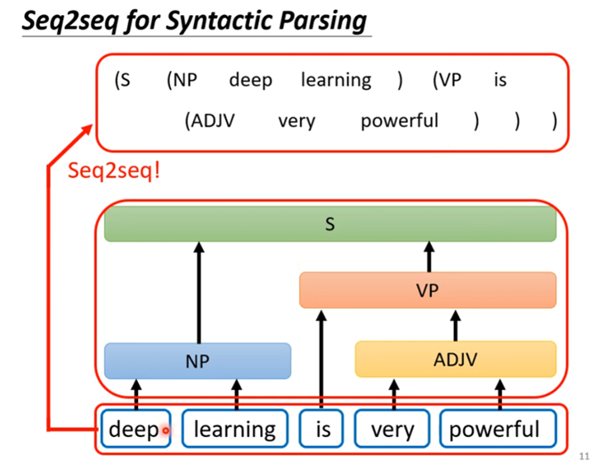

# 2022-02-12

# **Transformer**变形金刚

Transformer 其实就是Sequence-to-Sequence（Seq2Seq）架构的model，就是输入一堆向量，输出一堆向量，输出的向量数量由机器自己决定。

 

 

 

聊天机器人

 

**文法剖析**

**多标签分类**

 

**目标检测**

**用seq2seq硬解**

****

 

 

**如何做Seq2Seq**

****

 

## 编码器 Encoder

输入一排向量，输出另一排向量

 

 

 

 

 

 

 

 

 

 

 

 

 

 

 

 

 

 

 

 

 

 

## Decoder

计算b2是只考虑a1，a2,不考虑a3,a4，现有a1才有a2,有了a1,a2才有a3…

 

**Encoder****的输出长度到底是多少？**

 

 

 

 

 

 

 

 

 

 

## Token 词元化

****

**自动学会停止**

## NAT

****

****

**怎么决定输入begin的长度呢？可以用一个**classifier分类器来预处理

 

**NAT**

****

**Encoder****与decoder之间传递数据信息**

****

 

 

 

 

**Cross-attention**

 

 

**Train**

 

# 理解TensorFlow之基础概念：数据流图、张量、操作、会话、优化器

**https://zhuanlan.zhihu.com/p/70877190**

**前言**

本文梳理了TensorFlow的基本概念：数据流图、Tensor、Operation、Variable、Placeholder、Session、Optimizer、minimize。并对每个概念进行了详细的讲解和扩展。

阅读本文需要对深度学习有一定了解，并知道tensorflow是做什么的。

**一****.** **编程范式：数据流图**

**声明式编程和命令式编程**：

声明式编程：做什么
 命令式编程：怎么做

TensorFlow采用了声明式编程范式。

声明式编程的优点：
 1.代码可读性强：以目标而非过程为导向。
 2.支持引用透明：函数的调用语句可以由它的返回值取代。
 3.提供预编译优化能力：先构建出数据流图，无依赖逻辑的并行化计算、无效逻辑去除、公共逻辑提取等。

**tensorflow****数据流图：**

数据流图**定义**：用节点和有向边描述数学运算的有向无环图。

数据流图中的节点代表各类操作，包括数学运算、数据填充、结果输出和变量读写等等，每个节点的操作都需要分配到具体的物理设备（cpu、gpu）上执行。有向边描述了节点间的输入输出关系。

**1.****节点**

前向图中的节点有：

- 数学函数或表达式
- 存储模型参数的变量(variable)
- 占位符(placeholder)

后向图中的节点有：

- 梯度值
- 更新模型参数的操作
- 更新后的模型参数

**2.****有向边**

多数用来传输数据，少数用来控制依赖。

**3.****执行原理**

数据流图执行顺序的实现参考了**拓扑排序**的设计思想。
 当我们使用tensorflow执行指定数据流图时，其执行过程可分为以下**4个步骤**：

- a.以节点名称作为关键字，其所依赖的个数为值，创建一个散列表，将所有节点放入这个散列表。
- b.为此数据流图创建一个可执行队列，将三列表中依赖个数为0的节点加入队列，并在散列表中删除它们。
- c.一次执行队列中的每个一节点，执行成功后将此节点输出项的节点的依赖数减1，更新散列表。
- d.重复b和c，直到执行队列为空。

**二****.** **数据载体：张量**

在tensorflow中，张量（Tensor）是数据流图上的数据载体，通常是多维数组。还有一种叫SpareseTensor，存放稀疏数据（0的数量远多于非0元素），旨在减少稀疏数据的内存占用。
 在物理实现时，它含有指向张量数据的内存缓冲区的指针，当它不被任何操作依赖时，会释放该内存缓冲区。

**1.****创建**

一般tensor都不是直接创建的，而是定义常量和代数计算操作而间接创建的。

**import** tensorflow **as** tf

a **=** tf**.**constant(1, name**=**"a", dtype**=**tf**.**int32)

b **=** tf**.**constant(2, name**=**"b", dtype**=**tf**.**int32)

c **=** tf**.**add(a, b, name**=**"c")

print(a)

print(b)

print(c)

Tensor("a:0", shape**=**(), dtype**=**int32)

Tensor("b:0", shape**=**(), dtype**=**int32)

Tensor("c:0", shape**=**(), dtype**=**int32)

**2.****求解**

如果想要求解某个张量的值，则需要创建会话，然后执行张量的eval方法或会话的run方法。

with tf.Session() as sess:

  print(c.eval())

  print(sess.run(c))

3

3

**3.****成员方法**

张量公共成员方法：

import tensorflow as tf

a = tf.constant(1, name="a", dtype=tf.int32)

b = tf.constant(2, name="b", dtype=tf.int32)

c = tf.add(a, b, name="c")

 

print(a.consumers())

[<tf.Operation 'c' type=Add>] # 可以看出'c'这个操作依赖tensor'a'

**4.****操作**

tensorflow提供了大量操作，以便构建数据流图，实现算法模型。

**三****.** **模型载体：操作**

数据流图由节点和邮箱边组成，每个节点代表一种操作，因此操作是模型功能的实际载体。数据流图中的节点按功能不同可以分为以下三种：

1. 计算节点：计算或控制操作。
2. 存储节点：变量，一般用来存储模型参数。
3. 数据节点：占位符操作，描述待输入数据的属性。

**计算节点：****Operation**

计算操作的基本属性：

并不需要直接定义计算节点，只要你用了类似tf.add这种操作，它就自动构造了Operation实例。下面整理了TensorFlow Python API提供的典型操作：

**存储节点：****Variable**

作用：多次执行数据流图时存储特定的参数。

构建变量时必须给定一个值。
 变量值要初始化tf.global_variables_initializer()之后才能看到。

\# 清空图

import tensorflow as tf

aa = tf.Variable([1,2,3], name="aa")

print(aa.dtype) # 输出其数据类型

print(aa.initial_value) # 输出初始化值

with tf.Session() as sess:

  sess.run(tf.global_variables_initializer())

  print(sess.run(aa)) # 输出初始化之后的变量值

<dtype: 'int32_ref'>

Tensor("aa/initial_value:0", shape=(3,), dtype=int32)

[1 2 3]

**数据节点：****Placeholder**

数据流图在填充数据之前不会执行任何计算，通常，我们在定义模型之前就已经明确了输入数据的**类型和形状**等属性，而模型的第一步计算很可能就要用到这些输入数据。数据节点Placeholder的作用就是**定义好待输入数据的类型和形状**，先完成模型的构建，最后数据流图**要执行的时候**再把数据**填充(feed)**到Placehoder中来。

import tensorflow as tf

a = tf.constant([[1,2],[3,4]], dtype=tf.int32, name="a")

b = tf.placeholder(shape=[2,2], dtype=tf.int32, name="b")

c = a + b

with tf.Session() as sess:

  print(sess.run(c, feed_dict={b:[[1,1],[1,1]]}))

[[2 3]

 [4 5]]

**四****.** **运行环境：会话**

tensorflow数据流图描述了要计算的拓扑结构和所需的数据属性，但它仅仅是个壳。还需要向图中填充数据、选择待求解的张量、执行各种操作才能得到结果。而tensorflow的会话提供了这个计算过程的运行环境，它的本质是维护一段运行时间的上下文。
 会话通过提取和切分数据流图、调度并执行操作节点，来将数据流图在计算机上执行。

流程：创建会话、运行会话、关闭会话。

sess = tf.Session() # 创建会话

sess.run(...)    # 运行会话

sess.close()    # 关闭会话

 

\# 或者：

with tf.Session() as sess：# 自动关闭

  sess.run(...)

**target**在执行单机任务时不用管它。
 **graph**指向默认图，当有多个数据流图时需要显式指定。
 **config**描述会话的配置信息。
 配置的内容可以包括并行线程数、GPU分配策略、运算超时时间等参数，最常用的几个参数：

用法：

\# minimize的参数：

minimize(self, loss, global_step=None, var_list=None,

​     gate_gradients=GATE_OP, aggregation_method=None,

​     colocate_gradients_with_ops=False, name=None,

​     grad_loss=None)

**五****.** **训练工具：优化器**

优化器是tensorflow实现优化算法的载体，它实现了自动求梯度并更新参数的功能。优化器根据模型结构和损失函数，利用链式求导法则求出每个参数的梯度并更新它们，以完成一次完整的训练。
 tensorflow提供了很多种Optimizer，定义在[tf.train](http://link.zhihu.com/?target=https%3A//www.tensorflow.org/api_docs/python/tf/train/Optimizer%3Fhl%3Dzh-cn)中。

使用**minimize**方法训练模型

\# minimize的参数：

minimize(self, loss, global_step=None, var_list=None,

​     gate_gradients=GATE_OP, aggregation_method=None,

​     colocate_gradients_with_ops=False, name=None,

​     grad_loss=None)

实现原理参见 [源码：tensorflow/python/training/optimizer.py](http://link.zhihu.com/?target=https%3A//github.com/tensorflow/tensorflow/blob/r1.12/tensorflow/python/training/optimizer.py)
 其中常用的参数：

训练模型实例：

\# 定义模型

...

\# 定义损失函数

loss = ...

\# 优化器

optimizer = tf.train.GradientDescentOptimizer(learning_rate=0.01) # 选择优化方法，给定学习率

golbal_step = tf.Variable(0, name='global_step', trainable=False)

train = optimizer.minimize(loss, global_step=global_step)

 

with tf.Session() as sess:

  sess.run(global_variables_initializer()) # 初始化参数

  for step in 10000:

​    sess.run(train, feed_dict={...}) # 一步训练

**References:**

[1] 深入理解TensorFlow框架设计与实现原理 第三章

 

# 损失函数

 

 

 

 

 

 

**交叉熵在loss函数中使用**

交叉熵（cross entropy）是深度学习中常用的一个概念，一般用来求目标与预测值之间的差距。

### 1 信息量

首先是信息量。假设我们听到了两件事，分别如下：

事件A：巴西队进入了2018世界杯决赛圈。

事件B：中国队进入了2018世界杯决赛圈。

仅凭直觉来说，显而易见事件B的信息量比事件A的信息量要大。究其原因，是因为事件A发生的概率很大，事件B发生的概率很小。所以当越不可能的事件发生了，我们获取到的信息量就越大。越可能发生的事件发生了，我们获取到的信息量就越小。那么信息量应该和事件发生的概率有关。

假设X是一个离散型随机变量，其取值集合为χ,概率分布函数p(x)=Pr(X=x),x∈χ,则定义事件X=x0的信息量为：

I(x0)=−log(p(x0))

### 2 熵

考虑另一个问题，对于某个事件，有*n*种可能性，每一种可能性都有一个概率*p*(*x**i*) 
 这样就可以计算出某一种可能性的信息量。

我们现在有了信息量的定义，而熵用来表示所有信息量的期望，即：

*H*(*X*)=−∑*p*(*x**i*)*log*(*p*(*x**i*))

其中n代表所有的n种可能性，所以上面的问题结果就是 

*H*(*X*)=−[*p*(*A*)*log*(*p*(*A*))+*p*(*B*)*log*(*p*(*B*))+*p*(*C*))*log*(*p*(*C*))]0.7×0.36+0.2×1.61+0.1×2.300.804

然而有一类比较特殊的问题，比如投掷硬币只有两种可能，字朝上或花朝上。买彩票只有两种可能，中奖或不中奖。我们称之为0-1分布问题（二项分布的特例），

对于这类问题，熵的计算方法可以简化为如下算式：

### 3 相对熵（KL散度）

相对熵又称KL散度,如果我们对于同一个随机变量 x 有两个单独的概率分布 P(x) 和 Q(x)，我们可以使用 KL 散度（Kullback-Leibler (KL) divergence）来衡量这两个分布的差异

在机器学习中，P往往用来表示样本的真实分布，比如[1,0,0]表示当前样本属于第一类。Q用来表示模型所预测的分布，比如[0.7,0.2,0.1]

直观的理解就是如果用P来描述样本，那么就非常完美。而用Q来描述样本，虽然可以大致描述，但是不是那么的完美，信息量不足，需要额外的一些“信息增量”才能达到和P一样完美的描述。如果我们的Q通过反复训练，也能完美的描述样本，那么就不再需要额外的“信息增量”，Q等价于P。

 

KL散度的计算公式：

n为事件的所有可能性。

DKL的值越小，表示q分布和p分布越接近

### 4 交叉熵

在机器学习中，我们需要评估label和predicts之间的差距，使用KL散度刚刚好，即*D**KL*(*y*||*y*^)，由于KL散度中的前一部分−*H*(*y*)不变，故在优化过程中，只需要关注交叉熵就可以了。所以一般在机器学习中直接用用交叉熵做loss，评估模型。    

 

 

 

 

 

 

 

 

## 似然

**“****似然”是对likelihood 的一种较为贴近文言文的翻译，“似然”用现代的中文来说即“可能性”**

设总体X服从分布P(x；θ)（当X是[连续型随机变量](https://baike.baidu.com/item/连续型随机变量/3318213)时为概率密度，当X为离散型随机变量时为概率分布），θ为待估参数，X1,X2,…Xn是来自于总体X的样本，x1,x2…xn为样本X1,X2,…Xn的一个观察值，则样本的联合分布（当X是连续型随机变量时为概率密度，当X为离散型随机变量时为概率分布）　L（θ）=L（x1,x2,…,xn；θ）=ΠP（xi；θ）称为似然函数，其中θ是一个列向量。

 

真实情况已发生（观察样本），一种符合描述已发生的真实情况的模型，最大使然就是在众多可描述当前情况的模型中最符合描述当前情况的模型。而通过一些待估参数的引入，进一步确定最大似然模型。

<video src="C:/Users/intel/Videos/Captures/Seq2seq+Attention模型最通俗易懂的讲解 - 知乎 和另外 14 个页面 - 个人 - Microsoft Edge 2022-02-12 22-02-11.mp4"></video>

 

# 2022-02-13

# RNN

## Seq-to-Seq

https://discourse.world/h/2020/01/29/Visualizing-neural-machine-translation(seq2seq-models-with-attention-mechanism)

https://www.youtube.com/watch?v=0QFDNLdQ6_w

**循环神经网络的可视化示例**

RNN 是各种神经网络，旨在处理顺序数据。数据的顺序或顺序很重要的数据可以称为顺序数据。文本、语音和时间序列数据是序列数据的几个例子。

https://www.analyticsvidhya.com/blog/2021/06/a-visual-guide-to-recurrent-neural-networks/

https://towardsdatascience.com/illustrated-guide-to-recurrent-neural-networks-79e5eb8049c9

上面的评价文本序列 Reviews ,对于输入的序列进行编码，对句子的各个词汇编码

对于句子 1 *‘Delightful place to have dinner’*，我们看到Text（句子中单词或标记的总数）=5。

对于句子 2（*‘Food was nice but service wasn’t’*），我们可以看到*Tx=6。*但是我们的 DNN 架构中的输入层是固定的。我们可以看到没有直接的方法将数据输入网络。

好吧，你可能会问为什么我们不通过添加零将每个句子的长度转换为与最大长度的句子相同的长度。这可能会解决输入长度不同的问题，但会出现另一个问题。我们的参数数量变得非常高。

假设句子的最大长度是 20，这对于大多数可用数据集来说都非常小。

让语料库中的单词数= 20k（考虑一个非常小的语料库）

然后每个输入将变为 400k 维，并且隐藏层中只有 10 个神经元，我们的参数数量变为 400 万！拥有一个合适的网络意味着拥有数十亿个参数。为了克服这个问题，我们需要一个具有权重共享功能的网络。

现在我们知道需要一种新的架构。让我们看看 RNN 是如何解决这个问题的。

### **可视化 RNN**

**展开RNN在时间上**

**循环意味着重复**，RNN 中的想法是让层在一段时间内重复。在给定一个句子的 RNN 中，我们首先对句子的每个单词进行标记化和热编码。然后我们随着时间的推移将每个令牌输入到 RNN

我们可以在上图中看到 RNN 随着时间的推移展开。**展开意味着我们在每个时间点使用相同的 RNN 块**，并且前一个时间步的输出成为当前时间步的输入。让我们可视化单个时间步长的 RNN 块的样子……

.gif)

隐藏状态以加权方式存储有关所有先前输入的信息。最近的输入获得较高的值，而较旧的输入获得较低的值。前一个时间步的隐藏状态与当前时间步的输入相连接，并输入到 tanh 激活中。tanh 激活将 -1 到 1 之间的所有值缩放，这成为当前时间步的隐藏状态。如果我们想预测每一步的输出，基于 RNN 的类型，这个隐藏状态被输入到 softmax 层，我们得到当前时间步的输出。当前隐藏状态成为下一个时间步的 RNN 块的输入。这个过程一直持续到句子结束。

.gif)

现在我们在每个时间步都有一个预测。我们将其与实际标签进行比较，并计算每个时间步的损失。这结束了 RNN 中的单个前向传播步骤。

RNN 的反向传播以与前向传播完全相反的方式发生。

这个想法的关键是在所有时间步中都使用相同的权重，因此参数的数量与输入长度无关，并且每个权重都会在反向传播期间随着时间的推移而更新。

**将句子分解成单词序列**

第一步是将“what”输入 RNN。RNN 对“what”进行编码并产生输出。

下一步，我们输入“time”这个词和上一步的隐藏状态。RNN 现在拥有关于“what”和“time”这两个词的信息。

我们重复这个过程，直到最后一步。您可以通过最后一步看到，RNN 已经对前面步骤中所有单词的信息进行了编码。

由于最终输出是从序列的其余部分创建的，因此我们应该能够获取最终输出并将其传递给前馈层以对意图进行分类。

隐藏状态中颜色的奇怪分布。这是为了说明 RNN 的一个被称为**短期记忆的问题**。

​																					**RNN 的最终隐藏状态**

## 双向RNN-Bidirectional RNN

**假设当前t的输出不仅仅和之前的序列有关，并且 还与之后的序列有关，例如：预测一个语句中缺失的词语那么需要根据上下文进 行预测；**

**个人见解： 若是利用RNN在围棋的棋谱纠错中，纠正错误的棋谱就要考虑前后的落子，所以双向RNN是一个需要留意的技术**

