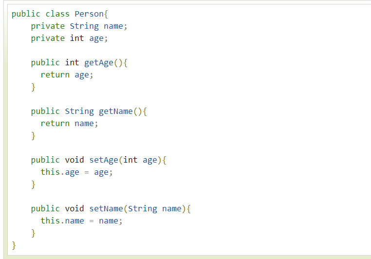
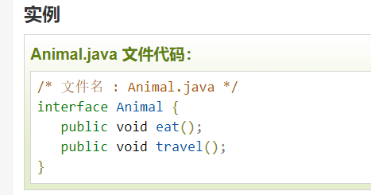

# 2021-11-08

# 基础


使用 static 修饰符修饰的属性（成员变量）称为静态变量，也可以称为类变量，常量称为静态常量，方法称为静态方法或类方法，它们统称为静态成员，归整个类所有。

静态成员不依赖于类的特定实例，被类的所有实例共享，就是说 static 修饰的方法或者变量不需要依赖于对象来进行访问，只要这个类被加载，[Java](http://c.biancheng.net/java/) 虚拟机就可以根据类名找到它们。


**java的static关键字和C++的又不一样，C++中被它修饰的全局变量和函数只能在本模块中使用。**

static 关键字

静态变量

静态方法

静态代码块

**静态代码块指 Java 类中的 static{ } 代码块**，主要用于初始化类，为类的静态变量赋初始值，提升程序性能。

​    **static** {

​		// 编写正常的代码语句

​		System.out.println("静态代码块1" );

​    }


## Java修饰符

Java可以使用修饰符来修饰类中方法和属性。修饰符用来定义类、方法或者变量，通常放在语句的最前端。主要有两类修饰符：

- **访问控制修饰符 :** default, public , protected, private
- **非访问控制修饰符** : final, abstract, static, synchronized

### 1-访问控制修饰符

- **default** (即默认，什么也不写）: 在同一包内可见，不使用任何修饰符。使用对象：类、接口、变量、方法。

  public 公开，对外部访问不做限制，任何“人”都能使用、访问它

- **private** : 在同一类内可见。使用对象：变量、方法。 **注意：不能修饰类（外部类）**

  ​	属于同一个类内部的可以访问、使用，出了这个类的范围，任何“人”不可访问、使用

  **为什么不能用private修饰Java外部类？**

  ​	因为如果使用private修饰Java外部类，那么这个类不能创建实例，这个类的属性和方法不能被访问，那么创建这个类毫无意义，所以不能使用private修饰Java外部类。

- **public** : 对所有类可见。使用对象：类、接口、变量、方法

  ​	公共的，既然是公共的，那就是任何“人”都可访问、使用

- **protected** : 对同一包内的类和所有子类可见。使用对象：变量、方法。 **注意：不能修饰类（外部类）**。

  ​	受到保护的，能用，但是不是所有“人”能用，没有像private那样独享，是在一个特定的圈子里，大家公共所有，出了圈就不能访问了。

​    protected保护，只对子类和同一个包下的类公开。

​	**为什么不能用protected修饰Java外部类？**   [Java的外部类为什么不能使用private、protected进行修饰 - Dennis、Cui - 博客园 (cnblogs.com)](https://www.cnblogs.com/AleiCui/p/12792565.html)


- 也就是说，我想要这个类的属性和方法可以被任何子类继承（同一个包package中），我就用**protected**
- 想要这个类的属性和方法不能被任何子类继承，我就用**private**
- 想要这个类必须被继承，我就用**abstract**
- 不想这个类被继承，我就用**final**


对于顶级类(外部类)来说，只有两种修饰符：public和默认(default)。因为外部类的上一单元是包，所以外部类只有两个作用域：同包或者任何位置。


就是针对一个类内部的成员函数、成员变量可以别其他使用者使用的权限


**以上访问级别只适用于类和类的成员，不适用于局部变量。**

**成员变量、成员方法、构造方法都可以使用上面的四种访问级别。**


**内-外部类**

 内部类就是将一个类A定义在类B里边，里边的那个类A称为内部类，

外边的类B称为外部类

    成员内部类定义格式：
    class 外部类{
               class 内部类{
                     		}
    			}
```java
class A{
    class B{ // B就是内部类
      }
  }
```

|   修饰符    | 同类中 | 同一个包中(子类和无关类) | 不同包(子类) | 不同包(无关类) |
| :---------: | :----: | :----------------------: | :----------: | :------------: |
|   public    |   ✔️    |            ✔️             |      ✔️       |       ✔️        |
|  protected  |   ✔️    |            ✔️             |      ✔️       |       ✘        |
| default默认 |   ✔️    |            ✔️             |      ✘       |       ✘        |
|   private   |   ✔️    |            ✘             |      ✘       |       ✘        |


##### 私有访问修饰符-private

私有访问修饰符是**最严格的访问级别**，所以被声明为 **private** 的方法、变量和构造方法**只能被所属类访问**，并且类和接口不能声明为 **private**。

**private不能修饰类，当修饰类，私有类？怎么解释，谁的私有类，Java是“面向对象”，那么这个私有类总该有个归属，没有私有类的说法，所以private不能用于修饰类；**

**接口也是，接口本来就是给“别人”和类进行交流的，私有了怎么进行交流。**


声明为私有访问类型的变量只能通过类中公共的 getter 方法被外部类访问。

Private 访问修饰符的使用主要用来隐藏类的实现细节和保护类的数据。


##### 公有访问修饰符-public

被声明为 public 的类、方法、构造方法和接口能够被任何其他类访问。

如果几个相互访问的 public 类分布在不同的包中，则需要导入相应 public 类所在的包。由于类的继承性，类所有的公有方法和变量都能被其子类继承。

##### 受保护的访问修饰符-protected

protected 需要从以下两个点来分析说明：

- **子类与基类在同一包中**：被声明为 protected 的变量、方法和构造器能被**同一个包中**的任何其他类访问；
- **子类与基类不在同一包中**：那么在子类中，子类实例可以访问其从基类继承而来的 protected 方法，而不能访问基类实例的protected方法。

protected 可以修饰数据成员，构造方法，方法成员，**不能修饰类（内部类除外）**。

#### 访问控制和继承

请注意以下方法继承的规则：

老子的东西，到了儿子那，权限要么不变，要么变低，不能高于老子。

- 父类中声明为 public 的方法在子类中也必须为 public。
- 父类中声明为 protected 的方法在子类中要么声明为 protected，要么声明为 public，不能声明为 private。
- **父类中声明为 private 的方法，不能够被继承。**

### 2-非访问修饰符

static 修饰符，用来修饰类方法和类变量。

final 修饰符，用来修饰类、方法和变量，final 修饰的类不能够被继承，修饰的方法不能被继承类重新定义，修饰的变量为常量，是不可修改的。

abstract 修饰符，用来创建抽象类和抽象方法。

synchronized 和 volatile 修饰符，主要用于线程的编程。

#### static 修饰符

**所有static关键字修饰的都是`类相关的`，`类级别`**

- **静态变量--类变量：**

  static 关键字用来声明**独立于对象**的静态变量，无论一个类实例化多少对象，它的静态变量只有一份拷贝。 静态变量也被称为类变量。

  局部变量（方法体内变量）不能被声明为 static 变量。

1. **静态变量（或称为类变量），指被 static 修饰的成员变量。**

- 运行时，Java 虚拟机**只**为静态变量分配一次内存，在加载类的过程中完成静态变量的内存分配。
- 在类的内部，可以在任何方法内直接访问静态变量。
- 在其他类中，可以通过类名访问该类中的静态变量。


**区别：**

1. 实例变量，指没有被 static 修饰的成员变量。

- 每创建一个实例，Java 虚拟机就会为实例变量分配一次内存。
- 在类的内部，可以在非静态方法中直接访问实例变量。
- 在本类的静态方法或其他类中则需要通过类的实例对象进行访问实例变量。


- **静态方法：**

  static 关键字用来声明**独立于对象**的静态方法。静态方法不能使用类的非静态变量。静态方法从参数列表得到数据，然后计算这些数据。

对类变量和方法的访问可以直接使用 **classname.variablename** 和 **classname.methodname** 的方式访问。


**静态**  Java 虚拟机只为静态变量分配一次内存，在加载类的过程中完成静态变量的内存分配。

分配一次内存，形成“固定”资产，可以直接访问，无序二次分配内存


#### Java里的static关键字

**有些类的成员并不需要实例化就可以使用,  那么这种成员就是静态成员, 肯定是用static修饰的.**


	class B{
		int i = 1;
		int f(){
			System.out.printf("i is %d\n", i);
			return 0;
		}
		//1个静态成员j, 1个静态函数g(); 
	static int j = 1;
	static int g(){
		System.out.printf("j is %d\n", j);
		return 0;
	}
	}
	
	public class A{
		public static void main(String[] args){
			B.j += 1;
			B.g();
			B b;
			b = new B();
			b.i = 10;
			b.j += 1;
			b.f();
			b.g();
		}
	}
**1 static 成员不需实例化就可以使用.**

  上面入口函数中直接使用了类B的静态成员j 和 静态函数g() 

```java
B.j += 1;
B.g();
```

**这种情况其实就是把 成员j的内存分配在了java的 数据区中, 而不是heap区, 这个内存地址在程序执行时是 不变的. 而且在代码区的类定义代码里保留了这个地址**

**2 多个不同的对象共享1个static 成员**.
如上面的例子, 当执行B.j += 1后,  j的值变成2.  然后再实例1个对象b, 执行b.j += 1, 那么输出对象b的成员的值j就是3了.

其实因为对象b里面的静态成员j指针还是指向static 区的同1个内存地址.

也就是说类B的多个不同对象实际上共享同1个静态成员.

那么java里实例化1个具有静态成员的对象时, 会同时把 静态成员的地址放入栈区.

**3 静态函数不允许使用非静态成员.**
这个也不难理解, 看上图, 静态函数g()是可以在实例化之前使用的, 但是如果g() 引用了非静态成员i. 那么当没有实例化对象b调用g()时, 就会找不到成员i的地址.

因为成员i必须在实例化之后才会被分配内存啊.

这个就是java不允许静态函数调用非静态成员的原因! 


 **静态函数和非静态函数的区别.**

 的确, 静态函数与非静态函数的2进制代码都是存放在代码区里面..

```java
class B{
	int i = 10;
	int f(){
	System.out.printf("i is %d\n", i);
	return 0;
	}
}
```

看看上面里的例子.

 非静态函数f() 是不带参数的.. 而且里面的成员i 也不带参数.

**其实在java里面, 非静态函数已经隐藏了1个自带参数"this".**
因为上面说过了, 所有不同的实例化后的对象里面的成员内存都是不同的, 但是它们的函数都是指向代码区同1个函数.

那么调用这个函数时, 这个函数必须知道到底是哪个对象调用它, 在这里就是到底要输出哪个对象的成员i.
在底层里, 我任务非静态函数自带参数"this"这个隐藏指针.


**但是静态函数不同, 因为它不允许使用非静态成员. 就无需"this"了.**


#### final 修饰符

**final 变量：**   **终极的**

final 表示**"最后的、最终的"**含义，**变量一旦赋值后，不能被重新赋值。被 final 修饰的实例变量必须显式指定初始值**。

final 修饰符通常和 static 修饰符一起使用来创建类常量。

**final 方法**

父类中的 final 方法可以被子类继承，但是不能被子类重写。

声明 final 方法的主要目的是防止该方法的内容被修改。


#### abstract 修饰符

**抽象类：**

​	**抽象类不能用来实例化对象，声明抽象类的唯一目的是为了将来对该类进行扩充。**

一个类不能同时被 abstract 和 final 修饰。如果一个类包含抽象方法，那么该类一定要声明为抽象类，否则将出现编译错误。

因为《final》表示是不可修改了，而《abstract》是可以被未来的操作扩充，两者在一起就矛盾了


**抽象类可以包含抽象方法和非抽象方法。**

抽象，告诉你一个东西，这个东西大体有什么东西，但是每个具体的细节是没有的；


**抽象方法**

抽象方法是一种没有任何实现的方法，该方法的具体实现由子类提供。

抽象方法不能被声明成 final 和 static。  

​	不能用static修饰抽象方法，因为static是静态的只分配一次内存空间，而抽象方法会随不同的子类继承来实现同样的方法而不同的细节，就要分配不同的内存空间。

任何继承抽象类的子类必须实现父类的所有抽象方法，除非该子类也是抽象类。

如果一个类包含若干个抽象方法，那么该类必须声明为抽象类。抽象类可以不包含抽象方法。

抽象方法的声明以分号结尾，例如：**public abstract sample();**

**总结就是老子负责画蓝图，儿子来实现，把目标定了，但不实现，由继承人实现**


#### synchronized 修饰符

 同步的、同步进行的

synchronized 关键字声明的方法**同一时间只能被一个线程访问**。synchronized 修饰符可以应用于四个访问修饰符。

#### transient 修饰符

序列化的对象包含被 transient 修饰的实例变量时，java 虚拟机(JVM)跳过该特定的变量。

该修饰符包含在定义变量的语句中，用来预处理类和变量的数据类型。


#### volatile 修饰符

volatile ：易变的；无定性的；无常性的；可能急剧波动的

**被用来修饰会被不同线程访问和修改的变量。**

volatile 修饰的成员变量在每次被线程访问时，都强制从共享内存中重新读取该成员变量的值。而且，当成员变量发生变化时，会强

制线程将变化值回写到共享内存。这样在任何时刻，两个不同的线程总是看到某个成员变量的同一个值。

**1.保证可见性，不保证原子性**   （原子一般是具有不可再分割的特性，所以原子性就是说这个不可以被改变（当前情况下））

 （1）当写一个volatile变量时，JMM会把该线程本地内存中的变量强制刷新到主内存中去；

 （2）这个写会操作会导致其他线程中的volatile变量缓存无效。

 **2.禁止指令重排**

  重排序是指编译器和处理器为了优化程序性能而对指令序列进行排序的一种手段。重排序需要遵守一定规则：

 （1）重排序操作不会对存在数据依赖关系的操作进行重排序。

 比如：a=1;b=a; 这个指令序列，由于第二个操作依赖于第一个操作，所以在编译时和处理器运行时这两个操作不会被重排序。

 （2）重排序是为了优化性能，但是不管怎么重排序，单线程下程序的执行结果不能被改变

 比如：a=1;b=2;c=a+b这三个操作，第一步（a=1)和第二步(b=2)由于不存在数据依赖关系， 所以可能会发生重排序，但是c=a+b这个操作是不会被重排序的，因为需要保证最终的结果一定是c=a+b=3。

 使用volatile关键字修饰共享变量便可以禁止这种重排序。若用volatile修饰共享变量，在编译时，会在指令序列中插入内存屏障来禁止特定类型的处理器重排序,volatile禁止指令重排序也有一些规则：

  a.当程序执行到volatile变量的读操作或者写操作时，在其前面的操作的更改肯定全部已经进行，且结果已经对后面的操作可见；在其后面的操作肯定还没有进行；

 b.在进行指令优化时，不能将对volatile变量访问的语句放在其后面执行，也不能把volatile变量后面的语句放到其前面执行。

 即执行到volatile变量时，其前面的所有语句都执行完，后面所有语句都未执行。且前面语句的结果对volatile变量及其后面语句可见。


**通俗点讲就是说一个变量如果用volatile修饰了，则Java可以确保所有线程看到这个变量的值是一致的，如果某个线程对volatile修饰的共享变量进行更新，那么其他线程可以立马看到这个更新，这就是所谓的线程可见性。**


### **由 synchronized 、volatile 引发的java同步机制**

volatile是Java提供的一种轻量级的同步机制。Java 语言包含两种内在的同步机制：同步块（或方法）和 volatile 变量，相比于synchronized（synchronized通常称为重量级锁），volatile更轻量级，因为它不会引起线程上下文的切换和调度。但是volatile 变量的同步性较差（有时它更简单并且开销更低），而且其使用也更容易出错。


#### 并发编程的3个基本概念

**1.原子性**
     定义： 即一个操作或者多个操作 要么全部执行并且执行的过程不会被任何因素打断，要么就都不执行。

**原子性是拒绝多线程操作的**，不论是多核还是单核，**具有原子性的量，同一时刻只能有一个线程来对它进行操作**。简而言之，

在**整个操作过程中不会被线程调度器中断的操作**，都可认为是原子性。例如 a=1是原子性操作，但是a++和a +=1就不是原子性操作。

Java中的原子性操作包括：

（1）基本类型的读取和赋值操作，且赋值必须是值赋给变量，变量之间的相互赋值不是原子性操作。

（2）所有引用reference的赋值操作

（3）java.concurrent.Atomic.* 包中所有类的一切操作

**2.可见性**
   **定义：指当多个线程访问同一个变量时，一个线程修改了这个变量的值，其他线程能够立即看得到修改的值。**

**可见性是指多个线程访问同一个变量时，其中一个线程修改了该变量的值，其它线程能够立即看到修改的值。**

   在多线程环境下，一个线程对共享变量的操作对其他线程是不可见的。**Java提供了volatile来保证可见性**，当一个变量被

volatile修饰后，表示着线程本地内存无效，**当一个线程修改共享变量后他会立即被更新到主内存中**，其他线程读取共享变量

时，会直接从主内存中读取。当然，synchronize和Lock都可以保证可见性。synchronized和Lock能保证同一时刻只有一个线程获取

锁然后执行同步代码，并且在释放锁之前会将对变量的修改刷新到主存当中。因此可以保证可见性。

**3.有序性**
   定义：即程序执行的顺序按照代码的先后顺序执行。

   Java内存模型中的有序性可以总结为：如果在本线程内观察，所有操作都是有序的；如果在一个线程中观察另一个线程，所有操

作都是无序的。前半句是指“线程内表现为串行语义”，后半句是指“指令重排序”现象和“工作内存主主内存同步延迟”现象。

   在Java内存模型中，为了效率是允许编译器和处理器对**指令进行重排序，**当然重排序不会影响单线程的运行结果，但是对多线程

会有影响。**Java提供volatile来保证一定的有序性。**最著名的例子就是单例模式里面的DCL（双重检查锁）。另外，可以通过

synchronized和Lock来保证有序性，synchronized和Lock保证每个时刻是有一个线程执行同步代码，相当于是让线程顺序执行同步

代码，自然就保证了有序性。


#### 锁的互斥和可见性

   锁提供了两种主要特性：互斥（mutual exclusion） 和可见性（visibility）。

（1）**互斥**即一次只允许一个线程持有某个特定的锁，一次就只有一个线程能够使用该共享数据。

（2）**可见性**要更加复杂一些，它必须确保释放锁之前对共享数据做出的更改对于随后获得该锁的另一个线程是可见的。也即当一

条线程修改了共享变量的值，新值对于其他线程来说是可以立即得知的。如果没有**同步机制提供的这种可见性保证**，线程看到的共

享变量可能是修改前的值或不一致的值，这将引发许多严重问题。要使 volatile 变量提供理想的线程安全，必须同时满足下面两个条件：

a.对变量的写操作不依赖于当前值。

b.该变量没有包含在具有其他变量的不变式中。

  实际上，这些条件表明，可以被写入 volatile 变量的这些有效值独立于任何程序的状态，包括变量的当前状态。事实上就是保证操作是原子性操作，才能保证使用volatile关键字的程序在并发时能够正确执行。


#### Java的内存模型JMM以及共享变量的可见性

 JMM决定一个线程对共享变量的写入何时对另一个线程可见，JMM定义了线程和主内存之间的抽象关系：共享变量存储在主内存

(Main Memory)中，每个线程都有一个私有的本地内存（Local Memory），本地内存保存了被该线程使用到的主内存的副本拷贝，

线程对变量的所有操作都必须在工作内存中进行，而不能直接读写主内存中的变量。


 对于普通的共享变量来讲，线程A将其修改为某个值发生在线程A的本地内存中，此时还未同步到主内存中去；而线程B已经缓存了

该变量的旧值，**所以就导致了共享变量值的不一致**。解决这种共享变量在多线程模型中的不可见性问题，较粗暴的方式自然就是加

锁，但是此处使用synchronized或者Lock这些方式太重量级了，比较合理的方式其实就是volatile。

  需要注意的是，JMM是个抽象的内存模型，所以所谓的本地内存，主内存都是抽象概念，并不一定就真实的对应cpu缓存和物理内存

**线程可见性原理
**

用volatile修饰的变量，线程在每次使用变量的时候，都会读取变量修改后的最新的值。volatile很容易被误用，用来进行原子性操作。

如果要深入了解volatile关键字的作用，就必须先来了解一下JVM在运行时候的内存分配过程。

在 java 垃圾回收整理一文中，描述了jvm运行时刻内存的分配。其中有一个内存区域是jvm虚拟机栈，每一个线程运行时都有一个线程栈，

线程栈保存了线程运行时候变量值信息。当线程访问某一个对象时候值的时候，首先通过对象的引用找到对应在堆内存的变量的值，然后把堆内存

变量的具体值load到线程本地内存中，建立一个变量副本，之后线程就不再和对象在堆内存变量值有任何关系，而是直接修改副本变量的值，

在修改完之后的某一个时刻（线程退出之前），自动把线程变量副本的值回写到对象在堆中变量。这样在堆中的对象的值就产生变化了。下面一幅图


## Java 变量

Java 中主要有如下几种类型的变量

- **局部变量**（方法体内变量）：在方法、构造方法或者语句块中定义的变量被称为局部变量。变量声明和初始化都是在方法中，方法结束后，变量就会自动销毁。

- **类变量（静态变量）**类变量也声明在类中，方法体之外，但必须声明为 static 类型。

  - 运行时，Java 虚拟机只为静态变量分配一次内存，在加载类的过程中完成静态变量的内存分配。
  - 在类的内部，可以在任何方法内直接访问静态变量。
  - 在其他类中，可以通过类名访问该类中的静态变量。

  静态变量可以被类的所有实例共享，因此静态变量可以作为实例之间的共享数据，增加实例之间的交互性。

  如果类的所有实例都包含一个相同的常量属性，则可以把这个属性定义为静态常量类型，从而节省内存空间。

- **成员变量**（类变量的非静态变量，又称实例变量）：成员变量是定义在类中，方法体之外的变量。这种变量在创建对象的时候实例化。成员变量可以被类中方法、构造方法和特定类的语句块访问。

- 每创建一个实例，Java 虚拟机就会为实例变量分配一次内存。

- 在类的内部，可以在非静态方法中直接访问实例变量。

- 在本类的静态方法或其他类中则需要通过类的实例对象进行访问


变量根据`声明的位置`进行划分：

1. 在方法体中声明的变量叫做：`局部变量`。
2. 在方法体外声明的变量叫做：`成员变量`

`成员变量`又可以分为：

1. **实例变量**---（没有被static修饰）
2. **静态变量**---（有被static修饰）

https://blog.csdn.net/qq_44715943/article/details/115603616

**eg1.**

以下**实例的**，都是**对象相关的**，访问时采用 “`引用.`” 的方式访问。需要先new对象。

实例相关的，必须先有对象，才能访问，`可能`会出现空指针异常。


**eg2.**

以下**静态的**，都是**类相关的**，访问时采用 “`类名.`” 的方式访问。不需要new对象。

不需要对象的参与即可访问。`没有`空指针异常的发生。


### 什么时候变量声明为实例的，什么时候声明为静态的？

如果这个类型的所有对象的某个属性值都是一样的，不建议定义为实例变量，浪费内存空间。
 建议定义为类级别特征，定义为[静态变量](https://so.csdn.net/so/search?q=静态变量&spm=1001.2101.3001.7020)，在方法区中只保留一份，节省内存开销。

-  **一个对象一份的是实例变量。**
- **所有对象一份的是静态变量。**

1. 静态变量在`类加载时初始化`，不需要new对象，静态变量的空间就开出来了。
2. 静态变量存储在`方法区`。


### 什么时候定义为实例方法？什么时候定义为静态方法？

**1.思想角度：**

如果说该行为必须  **`由对象去触发`**。那么该方法定义为实例方法。

**2.代码角度**

当这个方法体当中，**`直接访问了实例变量`**，这个方法一定是实例方法。


我们以后开发中，大部分情况下，如果是工具类的话，工具类当中的方法
 一般都是静态的。(静态方法有一个优点，是不需要new对象，直接采用类名
 调用，极其方便。工具类就是为了方便，所以工具类中的方法一般都是static的。)


## Java 关键字

| 类别                 | 关键字                         | 说明                 |
| :------------------- | :----------------------------- | :------------------- |
| 访问控制             | private                        | 私有的               |
| protected            | 受保护的                       |                      |
| public               | 公共的                         |                      |
| default              | 默认                           |                      |
| 类、方法和变量修饰符 | abstract                       | 声明抽象             |
| class                | 类                             |                      |
| extends              | 扩充,继承                      |                      |
| final                | 最终值,不可改变的              |                      |
| implements           | 实现（接口）                   |                      |
| interface            | 接口                           |                      |
| native               | 本地，原生方法（非 Java 实现） |                      |
| new                  | 新,创建                        |                      |
| static               | 静态                           |                      |
| strictfp             | 严格,精准                      |                      |
| synchronized         | 线程,同步                      |                      |
| transient            | 短暂                           |                      |
| volatile             | 易失                           |                      |
| 程序控制语句         | break                          | 跳出循环             |
| case                 | 定义一个值以供 switch 选择     |                      |
| continue             | 继续                           |                      |
| default              | 默认                           |                      |
| do                   | 运行                           |                      |
| else                 | 否则                           |                      |
| for                  | 循环                           |                      |
| if                   | 如果                           |                      |
| instanceof           | 实例                           |                      |
| return               | 返回                           |                      |
| switch               | 根据值选择执行                 |                      |
| while                | 循环                           |                      |
| 错误处理             | assert                         | 断言表达式是否为真   |
| catch                | 捕捉异常                       |                      |
| finally              | 有没有异常都执行               |                      |
| throw                | 抛出一个异常对象               |                      |
| throws               | 声明一个异常可能被抛出         |                      |
| try                  | 捕获异常                       |                      |
| 包相关               | import                         | 引入                 |
| package              | 包                             |                      |
| 基本类型             | boolean                        | 布尔型               |
| byte                 | 字节型                         |                      |
| char                 | 字符型                         |                      |
| double               | 双精度浮点                     |                      |
| float                | 单精度浮点                     |                      |
| int                  | 整型                           |                      |
| long                 | 长整型                         |                      |
| short                | 短整型                         |                      |
| 变量引用             | super                          | 父类,超类            |
| this                 | 本类                           |                      |
| void                 | 无返回值                       |                      |
| 保留关键字           | goto                           | 是关键字，但不能使用 |
| const                | 是关键字，但不能使用           |                      |

**注意：**Java 的 null 不是关键字，类似于 true 和 false，它是一个字面常量，不允许作为标识符使用。


下面分别解释一下每个关键字的含义。

private		 一种访问控制方式：私用模式
protected	一种访问控制方式：保护模式
public		   一种访问控制方式：共用模式
abstract	  表明类或者成员方法具有抽象属性
class			类
extends		表明一个类型是另一个类型的子类型，这里常见的类型有类和接口
final			 用来说明最终属性，表明一个类不能派生出子类，或者成员方法不能被覆盖，或者成员域的值不能被改变
implements	表明一个类实现了给定的接口
interface	接口
native	用来声明一个方法是由与计算机相关的语言（如C/C++/FORTRAN语言）实现的
new	用来创建新实例对象
static	表明具有静态属性
strictfp	用来声明FP_strict（单精度或双精度浮点数）表达式遵循IEEE 754算术规范
synchronized	表明一段代码需要同步执行
transient	声明不用序列化的成员域
volatile	表明两个或者多个变量必须同步地发生变化
break	提前跳出一个块
continue	回到一个块的开始处
return	从成员方法中返回数据
do	用在do-while循环结构中
while	用在循环结构中 
if	条件语句的引导词
else	用在条件语句中，表明当条件不成立时的分支
for	一种循环结构的引导词
instanceof	用来测试一个对象是否是指定类型的实例对象
switch	分支语句结构的引导词
case	用在switch语句之中，表示其中的一个分支
default	默认，例如，用在switch语句中，表明一个默认的分支
try	尝试一个可能抛出异常的程序块
catch	用在异常处理中，用来捕捉异常
throw	抛出一个异常
throws	声明在当前定义的成员方法中所有需要抛出的异常
import	表明要访问指定的类或包
package	包
boolean	基本数据类型之一，布尔类型
byte	基本数据类型之一，字节类型
char	基本数据类型之一，字符类型
double	基本数据类型之一，双精度浮点数类型
float	基本数据类型之一，单精度浮点数类型
int	基本数据类型之一，整数类型
long	基本数据类型之一，长整数类型
short	基本数据类型之一,短整数类型
super	表明当前对象的父类型的引用或者父类型的构造方法
this	指向当前实例对象的引用
void	声明当前成员方法没有返回值
goto	保留关键字，没有具体含义
const	保留关键字，没有具体含义


**Java作为一种面向对象语言。支持以下基本概念：**

- **多态**
- **继承**
- **封装**
- **抽象**
- **类**
- **对象**
- **实例**
- **方法**
- **重载**


## 构造方法

在创建一个对象的时候，至少要调用一个构造方法。**构造方法的名称必须与类同名**，一个类可以有多个构造方法。

使用 new 创建对象时，会调用构造方法初始化对象。


# 面向对象语言的四大特性 

​	**封装,抽象,继承,多态**

# 2021-11-09

# Java面向对象

## Java 继承

extends 关键字可以申明一个类是从另外一个类继承而来的

### 继承类型

**需要注意的是 Java 不支持多继承，但支持多重继承。**


区分开 多继承   与   多重继承


### 继承的特性

- 子类拥有父类**非 private** 的属性、方法。

- 子类可以拥有自己的属性和方法，即子类可以对父类进行扩展。

- 子类可以用自己的方式实现父类的方法。

- Java 的继承是单继承，但是可以多重继承，单继承就是一个子类只能继承一个父类，多重继承就是，例如 B 类继承 A 类，C 类继承 B 类，所以按照关系就是 B 类是 C 类的父类，A 类是 B 类的父类，这是 Java 继承区别于 C++ 继承的一个特性。

- 提高了类之间的耦合性（继承的缺点，耦合度高就会造成代码之间的联系越紧密，代码独立性越差）。

  ​	耦合性(Coupling)，也叫耦合度，是对模块间关联程度的度量。耦合的强弱取决于模块间接口的复杂性、调用模块的方式以及通过界面传送数据的多少。模块间的耦合度是指模块之间的依赖关系，包括控制关系、调用关系、数据传递关系。模块间联系越多，其耦合性越强，同时表明其独立性越差( 降低耦合性，可以提高其独立性)。

### 继承关键字

继承可以使用 extends 和 implements 这两个关键字来实现继承，而且所有的类都是继承于 java.lang.Object，当一个类没有继承的两个关键字，则默认继承object（这个类在 **java.lang** 包中，所以不需要 **import**）祖先类。

**extends关键字**

extends:   延伸,  作为某个东西的延续

在 Java 中，类的继承是单一继承，也就是说，一个子类只能拥有一个父类，所以 extends 只能继承一个类。


**implements关键字**

 implements ：实施， 实行某个功能

使用 implements 关键字可以**变相的使java具有多继承的特性**，使用范围为类继承接口的情况，可以同时**继承多个接口**（接口跟接口之间采用逗号分隔）。


**super 与 this 关键字**

super关键字：我们可以通过super关键字来实现对父类成员的访问，**用来引用当前对象的父类**。

用于**引用直接父类对象**。 每当创建子类的实例时，父类的实例被隐式创建，由**super**关键字引用变量引用

- `super`可以用来引用直接父类的实例变量。
- `super`可以用来调用直接父类方法。
- `super()`可以用于调用直接父类构造函数。


this关键字：指向**自己的引用**。


**final关键字**

final 关键字声明类可以把类定义为不能继承的，即最终类；或者用于修饰方法，该方法不能被子类重写：


## Java 重写(Override)与重载(Overload)


重写是子类对父类的允许访问的方法的实现过程进行重新编写, 返回值和形参都不能改变。**即外壳不变，核心重写！**


### 方法的重写规则

- 参数列表与被重写方法的参数列表必须完全相同。
- 返回类型与被重写方法的返回类型可以不相同，但是必须是父类返回值的派生类（java5 及更早版本返回类型要一样，java7 及更高版本可以不同）。
- 访问权限不能比父类中被重写的方法的访问权限更低。例如：如果父类的一个方法被声明为 public，那么在子类中重写该方法就不能声明为 protected。
- 父类的成员方法只能被它的子类重写。
- 声明为 final 的方法不能被重写。
- 声明为 static 的方法不能被重写，但是能够被再次声明。
- 子类和父类在同一个包中，那么子类可以重写父类所有方法，除了声明为 private 和 final 的方法。
- 子类和父类不在同一个包中，那么子类只能够重写父类的声明为 public 和 protected 的非 final 方法。
- 重写的方法能够抛出任何非强制异常，无论被重写的方法是否抛出异常。但是，重写的方法不能抛出新的强制性异常，或者比被重写方法声明的更广泛的强制性异常，反之则可以。
- 构造方法不能被重写。
- 如果不能继承一个类，则不能重写该类的方法。


**Super 关键字的使用**

当需要在子类中调用父类的被重写方法时，要使用 super 关键字。


### 重载(Overload)

重载(overloading) 是在一个类里面，**方法名字相同，而参数不同**。返回类型可以相同也可以不同。

每个重载的方法（或者构造函数）都必须有一个独一无二的参数类型列表。

最常用的地方就是构造器的重载。


**重载规则:**

- 被重载的方法必须改变参数列表(参数个数或类型不一样)；

- 被重载的方法**可以**改变返回类型；

  只通过改变方法的返回类型来实现方法重载是不可能的，因为这样具有模糊性；

  也就是不能只是单单改变函数的返回值类型，比如  int add(){}    改成   float add(){}  其他什么都没变，就返回值类型变了，这种过于偷懒的修改是会有歧义的

- 被重载的方法**可以**改变访问修饰符；

- 被重载的方法**可以**声明新的或更广的检查异常；

- 方法能够在同一个类中或者在一个子类中被重载。

- 无法以返回值类型作为重载函数的区分标准。

可以重载java main()方法吗？

这是完全可以的。 可以通过方法重载在类中有任意数量的`main`方法。 但是JVM调用`main()`方法，它只接收字符串数组作为参数。 让我们来看一个简单的例子：

```
class TestOverloading4{  
    public static void main(String[] args){System.out.println("main with String[]");}  
    public static void main(String args){System.out.println("main with String");}  
    public static void main(){System.out.println("main without args");}  
}
Java
上面代码执行后，输出结果如下 -
main with String[]
```


### 重写与重载之间的区别

| 区别点   | 重载方法 | 重写方法                                       |
| :------- | :------- | :--------------------------------------------- |
| 参数列表 | 必须修改 | 一定不能修改                                   |
| 返回类型 | 可以修改 | 一定不能修改                                   |
| 异常     | 可以修改 | 可以减少或删除，一定不能抛出新的或者更广的异常 |
| 访问     | 可以修改 | 一定不能做更严格的限制（可以降低限制）         |

### 总结

方法的重写(Overriding)和重载(Overloading)是java多态性的不同表现，重写是父类与子类之间多态性的一种表现，重载可以理解成多态的具体表现形式。

- (1)方法重载是一个类中定义了多个方法名相同,而他们的参数的数量不同或数量相同而类型和次序不同,则称为方法的重载(Overloading)。
- (2)方法重写是在子类存在方法与父类的方法的名字相同,而且参数的个数与类型一样,返回值也一样的方法,就称为重写(Overriding)。
- (3)方法重载是一个类的多态性表现,而方法重写是子类与父类的一种多态性表现。


## Java 多态


多态是同一个行为具有多个不同表现形式或形态的能力。

多态就是同一个接口，使用不同的实例而执行不同操作，如图所示：


### 多态存在的三个必要条件

- 继承
- 重写
- 父类引用指向子类对象：**Parent p = new Child();**

### 虚函数

虚函数的存在是为了多态。

Java 中其实没有虚函数的概念，它的普通函数就相当于 C++ 的虚函数，动态绑定是Java的默认行为。如果 Java 中不希望某个函数具有虚函数特性，可以加上 final 关键字变成非虚函数。


## 多态的实现方式

### 方式一：重写：

这个内容已经在上一章节详细讲过，就不再阐述，详细可访问：[Java 重写(Override)与重载(Overload)](https://www.runoob.com/java/java-override-overload.html)。


### 方式二：接口

- \1. 生活中的接口最具代表性的就是插座，例如一个三接头的插头都能接在三孔插座中，因为这个是每个国家都有各自规定的接口规则，有可能到国外就不行，那是因为国外自己定义的接口类型。
- \2. java中的接口类似于生活中的接口，就是一些方法特征的集合，但没有方法的实现。具体可以看 [java接口](https://www.runoob.com/java/java-interfaces.html) 这一章节的内容。


java中的接口是类的蓝图。 它有静态常量和抽象方法。java中的接口是一种实现抽象的机制。 接口中只有抽象方法而不是方法体。接口用于在Java中实现抽象和多重继承。 //更多请阅读：https://www.yiibai.com/java/interface-in-java.html 

**类和接口之间的关系**

一个类扩展了另一个类，一个接口扩展了另一个接口，一个类实现了一个接口。


```
interface printable {  // 定义一个接口
    void print();// 接口里面的细节，当然可以有很多细节函数
}

class A6 implements printable { // 这个类要实现这个接口，就要implementS它
	// 完成接口中的同名接口功能函数
    public void print() {
        System.out.println("Hello, Interface");
    }

    public static void main(String args[]) {
        A6 obj = new A6();
        obj.print();
    }
}


//更多请阅读：https://www.yiibai.com/java/interface-in-java.html
```


**Java多继承接口**

如果一个类实现了多个接口，或者一个接口扩展了多个接口，即被称为多重继承


```
interface Printable {
    void print();
}

interface Showable {
    void show();
}

class A7 implements Printable, Showable {
    public void print() {
        System.out.println("Hello");
    }

    public void show() {
        System.out.println("Welcome");
    }

    public static void main(String args[]) {
        A7 obj = new A7();
        obj.print();
        obj.show();
    }
}
//更多请阅读：https://www.yiibai.com/java/interface-in-java.html
```


### 方式三：抽象类和抽象方法

详情请看 [Java抽象类](https://www.runoob.com/java/java-abstraction.html) 章节。

## Java 抽象类

在面向对象的概念中，所有的对象都是通过类来描绘的，但是反过来，并不是所有的类都是用来描绘对象的，如果一个类中没有包含足够的信息来描绘一个具体的对象，这样的类就是抽象类。

在 Java 中抽象类表示的是一种继承关系，一个类只能继承一个抽象类，而一个类却可以实现多个接口。

### 抽象方法

如果你想设计这样一个类，该类包含一个特别的成员方法，该方法的具体实现由它的子类确定，那么你可以在父类中声明该方法为抽象方法。

Abstract 关键字同样可以用来声明抽象方法，抽象方法只包含一个方法名，而没有方法体。

抽象方法没有定义，方法名后面直接跟一个分号，而不是花括号。


**声明抽象方法会造成以下两个结果：**

- **如果一个类包含抽象方法，那么该类必须是抽象类。**
- **任何子类必须重写父类的抽象方法，或者声明自身为抽象类。**


**继承抽象方法的子类必须重写该方法。否则，该子类也必须声明为抽象类。最终，必须有子类实现该抽象方法，否则，从**

**最初的父类到最终的子类都不能用来实例化对象。**


### 抽象类总结规定

- \1. 抽象类不能被实例化(初学者很容易犯的错)，如果被实例化，就会报错，编译无法通过。只有抽象类的非抽象子类可以创建对象。
- \2. 抽象类中不一定包含抽象方法，但是有抽象方法的类必定是抽象类。
- \3. 抽象类中的抽象方法只是声明，不包含方法体，就是不给出方法的具体实现也就是方法的具体功能。
- \4. 构造方法，类方法（用 static 修饰的方法）不能声明为抽象方法。
- \5. 抽象类的子类必须给出抽象类中的抽象方法的具体实现，除非该子类也是抽象类。


**抽象类和接口都用于实现抽象，可以声明抽象方法。抽象类和接口都不能被实例化**


## Java 封装

在面向对象程式设计方法中，封装（英语：Encapsulation）是指一种将抽象性函式接口的实现细节部分包装、隐藏起来的方法。

封装可以被认为是一个保护屏障，防止该类的代码和数据被外部类定义的代码随机访问。

要访问该类的代码和数据，必须通过严格的接口控制。

封装最主要的功能在于我们能修改自己的实现代码，而不用修改那些调用我们代码的程序片段。

适当的封装可以让程式码更容易理解与维护，也加强了程式码的安全性。


**将类的所有数据成员设为`private`，以在java中创建一个完全封装的类。**

现在我们可以使用`setter`和`getter`方法来设置和获取其中的数据。创建一对赋取值方法，用于对私有属性的访问

`setter`方法内写入逻辑。


**实现Java封装的步骤**

\1. 修改属性的可见性来限制对属性的访问（一般限制为private）

public class Person {  

  private String name;

​    private int age; 

}

将 **name** 和 **age** 属性设置为私有的，只能本类才能访问，其他类都访问不了，如此就对信息进行了隐藏。

\2. 对每个值属性提供对外的公共方法访问，也就是创建一对赋取值方法，用于对私有属性的访问



采用 **this** 关键字是为了解决实例变量（private String name）和局部变量（setName(String name)中的name变量）之间发生的同名的冲突。


**总结：   就是对于一个类自己的private或者说是外部不能直接访问，但是由于开发需要，外部要访问这些高权限的属性、方法，那么处于安全性考察，就给外部留出一个可以间接访问高权限信息的接口，外部只能通过这个接口获得信息，但信息的组成无法访问**


## Java 接口

接口（英文：Interface），在JAVA编程语言中是一个抽象类型，是抽象方法的集合，接口通常以interface来声明。一个类通过继承接口的方式，从而来继承接口的抽象方法。

**接口并不是类，编写接口的方式和类很相似，但是它们属于不同的概念。**类描述对象的属性和方法。

**接口则包含类要实现的方法。**

除非实现接口的类是抽象类，否则该类要定义接口中的所有方法。

接口无法被实例化，但是可以被实现。一个实现接口的类，必须实现接口内所描述的所有方法，否则就必须声明为抽象类。另外，在 Java 中，接口类型可用来声明一个变量，他们可以成为一个空指针，或是被绑定在一个以此接口实现的对象。


**接口就是一种公共的规范，只要遵守设计规范，大家都能使用；就像USB这种标准，如USB键盘，usu鼠标，可是它们是不同厂商生产的，为何它们都能插到电脑上使用，就是因为它们的连接方式都是使用规范化的标准接口 --USB，符合规范就能使用；**


**Java上 接口就是对行为的抽象；**就比如 USB接口可以充电、数据传输，但USB标准只给出能这么做，具体怎么做就看各大厂商自己按照标准再设计具体行为。

**一个接口只有方法的特征没有方法的实现，因此这些方法可以在不同的地方被不同的类实现，而这些实现可以具有不同的行为（功能）**。

### 接口与类 相似点：

- 一个接口可以有多个方法。
- 接口文件保存在 .java 结尾的文件中，**文件名使用接口名**。
- 接口的字节码文件保存在 .class 结尾的文件中。
- 接口相应的字节码文件必须在与包名称相匹配的目录结构中。

### 接口与类的区别：

- 接口不能用于实例化对象。
- 接口没有构造方法。
- **接口中所有的方法必须是抽象方法**，Java 8 之后 接口中可以使用 default 关键字修饰的非抽象方法。
- 接口不能包含成员变量，除了 static 和 final 变量。
- 接口不是被类继承了，而是要被类实现。
- 接口支持多继承。

### 接口特性

- 接口中每一个方法也是隐式抽象的,**接口中的方法会被隐式的指定为** **public abstract**（只能是 public abstract，其他修饰符都会报错）。
- 接口中可以含有变量，**但是接口中的变量会被隐式的指定为** **public static final** 变量（并且只能是 public，用 private 修饰会报编译错误）。
- **接口中的方法是不能在接口中实现的**，只能由实现接口的类来实现接口中的方法。

### 抽象类和接口的区别

- \1. 抽象类中的方法可以有方法体，就是能实现方法的具体功能，但是接口中的方法不行。
- \2. 抽象类中的成员变量可以是各种类型的，而接口中的成员变量只能是 **public static final** 类型的。
- \3. 接口中不能含有静态代码块以及静态方法(用 static 修饰的方法)，而抽象类是可以有静态代码块和静态方法。
- \4. 一个类只能继承一个抽象类，而一个类却可以实现多个接口。


### 接口的声明

[访问权限、可见度] interface 接口名称 [extends 其他的接口名] {    

​    // 声明变量      

  // 抽象方法 

}



### 接口的实现

当类实现接口的时候，类要实现接口中所有的方法。否则，类必须声明为抽象的类。

类使用implements关键字实现接口。在类声明中，Implements关键字放在class声明后面。


**...implements   接口名称    [, 其他接口名称, 其他接口名称..., ...] ...**


在实现接口的时候，也要注意一些规则：

- 一个类可以同时实现多个接口。
- 一个类只能继承一个类，但是能实现多个接口。
- 一个接口能继承另一个接口，这和类之间的继承比较相似。


### 接口的继承

一个接口能继承另一个接口，和类之间的继承方式比较相似。接口的继承使用extends关键字，子接口继承父接口的方法。


### 接口的多继承

在Java中，类的多继承是不合法，但接口允许多继承。

在接口的多继承中extends关键字只需要使用一次，在其后跟着继承接口。 如下所示：

public interface Hockey extends Sports, Event

以上的程序片段是合法定义的子接口，与类不同的是，接口允许多继承，而 Sports及 Event 可以定义或是继承相同的方法


**自己总结：**

  1·就像一个类一样，一个接口也能够拥有方法和属性，但是在接口中声明的方法默认是抽象的。（即只有方法标识符，而没有方法体）。

2·接口指明了一个类必须要做什么和不能做什么，相当于类的蓝图。

 3· 接口的作用就是告诉类，你要实现我这种接口代表的功能，你就必须实现某些方法，我才能承认你确实拥有该接口代表的某种能力。

4·比如声明一个USB接口，那么具体的USB设备就必须实现USB接口里面的方法，才能承认该设备具有USB这种接口的某种能力。

5·抽象方法只能存在于抽象类或者接口中，但抽象类中却能存在非抽象方法，即有方法体的方法。接口是百分之百的抽象类

6·接口能继承接口

7·一个类可以同时实现多个接口


USB就可以看做是一种标准，一种接口，只要实现了USB标准的设备我就认为你已经拥有了USB这种功能

例如：

先声明USB接口：其中规定了要实现USB接口就必须实现接口规定实现的read( )和write( )这两个方法


**interface USB {**

**void read();**

 **void write();**

 **}**

然后在写一个U盘类和一个键盘类，这两个类都去实现USB接口。（实现其中的方法）

这是U盘的具体实现。


**class YouPan implements USB {**
    **@Override**
    **public void read() {**
        **System.out.println("U盘正在通过USB功能读取数据");**
    **}**
    **@Override**
    **public void write() {**
        **System.out.println("U盘正在通过USB功能写入数据");**
    **}**
**}**

这是键盘的具体实现。

**class JianPan implements USB {**
    **@Override**
    **public void read() {**
        **System.out.println("键盘正在通过USB功能读取数据");**
    **}**
    **@Override**
    **public void write() {**
        **System.out.println("键盘正在通过USB功能写入数据");**
    **}**
**}**

**现在U盘和键盘都实现了USB功能，也就是说U盘和键盘都能够调用USB接口中规定的方法，并且他们实现的方式都不一样。**


具体的实现

**你说你是USB设备，那么你就必须实现USB接口规定的功能方法，才承认你是USB设备，具备sub功能**

**public class Main {**
    **public static void main(String[] args) {**
        **//生成一个实现可USB接口（标准）的U盘对象**
        **YouPan youPan = new YouPan();**
        **//调用U盘的read( )方法读取数据**
        **youPan.read();**
        **//调用U盘的write( )方法写入数据**
        **youPan.write();**
        **//生成一个实现可USB接口（标准）的键盘对象**
        **JianPan jianPan = new JianPan();**
        **//调用键盘的read( )方法读取数据**
        **jianPan.read();**
        **//调用键盘的write( )方法写入数据**
        **jianPan.write();**
    **}**
**}**


# Java的类


# Java设计模式

2022-09-08

设计模式（Design pattern）代表了最佳的实践，通常被有经验的面向对象的软件开发人员所采用。设计模式是软件开发人员在软件开发过程中面临的一般问题的解决方案。这些解决方案是众多软件开发人员经过相当长的一段时间的试验和错误总结出来的。

**设计模式 - 可复用的面向对象软件元素**

### 1-创建型模式

#### 工厂模式


**主要解决：**主要解决接口选择的问题。

**何时使用：**我们明确地计划不同条件下创建不同实例时。

**如何解决：**让其子类实现工厂接口，返回的也是一个抽象的产品。

**关键代码：**创建过程在其子类执行。

工厂模式（Factory Pattern）是 Java 中最常用的设计模式之一。这种类型的设计模式属于创建型模式，它提供了一种创建对象的最佳方式。在工厂模式中，我们在创建对象时不会对客户端暴露创建逻辑，并且是通过使用一个共同的接口来指向新创建的对象。

**应用实例：** 1、您需要一辆汽车，可以直接从工厂里面提货，而不用去管这辆汽车是怎么做出来的，以及这个汽车里面的具体实现。 2、Hibernate 换数据库只需换方言和驱动就可以。

**优点：** 1、一个调用者想创建一个对象，只要知道其名称就可以了。 2、扩展性高，如果想增加一个产品，只要扩展一个工厂类就可以。 3、屏蔽产品的具体实现，调用者只关心产品的接口。

**缺点：**每次增加一个产品时，都需要增加一个具体类和对象实现工厂，使得系统中类的个数成倍增加，在一定程度上增加了系统的复杂度，同时也增加了系统具体类的依赖。这并不是什么好事。

**使用场景：** 1、日志记录器：记录可能记录到本地硬盘、系统事件、远程服务器等，用户可以选择记录日志到什么地方。 2、数据库访问，当用户不知道最后系统采用哪一类数据库，以及数据库可能有变化时。 3、设计一个连接服务器的框架，需要三个协议，"POP3"、"IMAP"、"HTTP"，可以把这三个作为产品类，共同实现一个接口。


 **在工厂模式中，我们在创建对象时不会对客户端暴露创建逻辑，并且是通过使用一个共同的接口来指向新创建的对象。 意图： 定义一个创建对象的接口，让其子类自己决定实例化哪一个工厂类，工厂模式使其创建过程延迟到子类进行。**

定义了一个创建对象的接口，但由子类决定要实例化的类是哪一个，工厂方法让类把实例化推迟到了子类。


工厂类ShapeFactory负责将生成需要交由具体的生产线，不同的生产线生产同一类商品的不同形式

要想新增同一类的不同形式的产品，只需要再拓展这个类的子类


```
步骤 1
创建一个接口:

public interface Shape {
   void draw();
}
步骤 2
创建实现接口的实体类。
public class Rectangle implements Shape {
 
   @Override
   public void draw() {
      System.out.println("Inside Rectangle::draw() method.");
   }
}

public class Square implements Shape {
 
   @Override
   public void draw() {
      System.out.println("Inside Square::draw() method.");
   }
}
public class Circle implements Shape {
 
   @Override
   public void draw() {
      System.out.println("Inside Circle::draw() method.");
   }
}
步骤 3
创建一个工厂，生成基于给定信息的实体类的对象。
public class ShapeFactory {
    
   //使用 getShape 方法获取形状类型的对象
   public Shape getShape(String shapeType){
      if(shapeType == null){
         return null;
      }        
      if(shapeType.equalsIgnoreCase("CIRCLE")){
         return new Circle();
      } else if(shapeType.equalsIgnoreCase("RECTANGLE")){
         return new Rectangle();
      } else if(shapeType.equalsIgnoreCase("SQUARE")){
         return new Square();
      }
      return null;
   }
}

步骤 4
使用该工厂，通过传递类型信息来获取实体类的对象。
public class FactoryPatternDemo {
 
   public static void main(String[] args) {
      ShapeFactory shapeFactory = new ShapeFactory();
 
      //获取 Circle 的对象，并调用它的 draw 方法
      Shape shape1 = shapeFactory.getShape("CIRCLE");
 
      //调用 Circle 的 draw 方法
      shape1.draw();
 
      //获取 Rectangle 的对象，并调用它的 draw 方法
      Shape shape2 = shapeFactory.getShape("RECTANGLE");
 
      //调用 Rectangle 的 draw 方法
      shape2.draw();
 
      //获取 Square 的对象，并调用它的 draw 方法
      Shape shape3 = shapeFactory.getShape("SQUARE");
 
      //调用 Square 的 draw 方法
      shape3.draw();
   }
}


```


#### 单例模式

单例模式（Singleton Pattern）是 Java 中最简单的设计模式之一。这种类型的设计模式属于创建型模式，它提供了一种创建对象的最佳方式。

这种模式涉及到一个单一的类，该类负责创建自己的对象，同时确保只有单个对象被创建。这个类提供了一种访问其唯一的对象的方式，可以直接访问，不需要实例化该类的对象。

**意图：**保证一个类仅有一个实例，并提供一个访问它的全局访问点。

**主要解决：**一个全局使用的类频繁地创建与销毁。

**何时使用：**当您想控制实例数目，节省系统资源的时候。

**如何解决：**判断系统是否已经有这个单例，如果有则返回，如果没有则创建。

**关键代码： **                                          **构造函数是私有的**

**注意：**

- 1、单例类只能有一个实例。
- 2、单例类必须自己创建自己的唯一实例。
- 3、单例类必须给所有其他对象提供这一实例。

**应用实例：**

- 1、一个班级只有一个班主任。
- 2、Windows 是多进程多线程的，在操作一个文件的时候，就不可避免地出现多个进程或线程同时操作一个文件的现象，所以所有文件的处理必须通过唯一的实例来进行。
- 3、一些设备管理器常常设计为单例模式，比如一个电脑有两台打印机，在输出的时候就要处理不能两台打印机打印同一个文件。

**优点：**

- 1、在内存里只有一个实例，减少了内存的开销，尤其是频繁的创建和销毁实例（比如管理学院首页页面缓存）。
- 2、避免对资源的多重占用（比如写文件操作）。

**缺点：**没有接口，不能继承，与单一职责原则冲突，一个类应该只关心内部逻辑，而不关心外面怎么样来实例化。

**使用场景：**

- 1、要求生产唯一序列号。
- 2、WEB 中的计数器，不用每次刷新都在数据库里加一次，用单例先缓存起来。
- 3、创建的一个对象需要消耗的资源过多，比如 I/O 与数据库的连接等。


**创建一个 Singleton 类。**

SingleObject.java


```
public class SingleObject {

// 创建 SingleObject 的一个对象，自己构造自己的类实例对象
private static SingleObject instance = new SingleObject();

// 让构造函数为 private，这样该类就不会被实例化；私有化了自己的构造方法，外部就没法通过构造方法了进行实例化
private SingleObject(){}

// 获取唯一可用的对象，想要获得一个实例对象，只能是通过类内部对外的接口
// 声明为static 静态方法，外部无需实例化就能调用该方法
public static SingleObject getInstance(){
	return instance;
	}

public void showMessage()
    {
    System.out.println("Hello World!");
    }
}
```

**从 singleton 类获取唯一的对象。**

```
public class SingletonPatternDemo {
	public static void main(String[] args) {

    // 不合法的构造函数
    // 编译时错误：构造函数 SingleObject() 是不可见的
    // SingleObject object = new SingleObject();

    // 获取唯一可用的对象，调用单例类的static静态方法来获取
    // 无需实例化，也不能在类外部进行单例类的实例化
    SingleObject object = SingleObject.getInstance();

    // 显示消息
    object.showMessage();
    }
}
```


### 2-结构型模式


### 3- 行为型模式


### 4--J2EE 模式

# Java 泛型


Java 泛型（generics）是 JDK 5 中引入的一个新特性, 泛型提供了编译时类型安全检测机制，该机制允许程序员在编译时检测到非法的类型。

泛型的本质是参数化类型，也就是说所操作的数据类型被指定为一个参数。


假定我们有这样一个需求：写一个排序方法，能够对整型数组、字符串数组甚至其他任何类型的数组进行排序，该如何实现？

答案是可以使用 **Java 泛型**。

使用 Java 泛型的概念，我们可以写一个泛型方法来对一个对象数组排序。然后，调用该泛型方法来对整型数组、浮点数数组、字符串数组等进行排序。


## 泛型方法

你可以写一个泛型方法，该方法在调用时可以**接收不同类型的参数**。**根据传递给泛型方法的参数类型，编译器适当地处理每一个方法调用。**

下面是定义泛型方法的规则：

- 所有泛型方法声明都有一个类型**参数声明部分（由尖括号分隔）**，该类型参数声明部分在方法返回类型之前（在下面例子中的 **< E>**）。
- 每一个类型参数声明部分包含一个或多个类型参数，参数间用逗号隔开。一个泛型参数，也被称为一个类型变量，是用于指定一个泛型类型名称的标识符。
- 类型参数能被用来声明返回值类型，并且能作为泛型方法得到的实际参数类型的占位符。
- 泛型方法体的声明和其他方法一样。注意类型参数只能代表引用型类型，不能是原始类型（像 **int、double、char** 等）。


# JAVA  虚拟机的内存模型


在Java中，[内存](https://so.csdn.net/so/search?q=内存&spm=1001.2101.3001.7020)分为两种，一种是**栈内存**，另一种就是**堆内存**。


**堆内存**是是Java内存中的一种，它的作用是用于存储Java中的对象和数组，当我们new一个对象或者创建一个数组的时候，就会在堆内存中开辟一段空间给它，用于存放。

第一点：堆其实可以类似的看做是管道，或者说是平时去排队买票的的情况差不多，所以堆内存的特点就是：先进先出，后进后出，也就是你先排队，好，你先买票。

第二点：堆可以动态地分配内存大小，生存期也不必事先告诉编译器，因为它是在运行时动态分配内存的，但缺点是，由于要在运行时动态分配内存，存取速度较慢。
由Java虚拟机的自动垃圾回收器来管理


**栈内存**是Java的另一种内存，主要是用来执行程序用的，比如：基本类型的变量和对象的引用变量

第一点：栈内存就好像一个矿泉水瓶，像里面放入东西，那么先放入的沉入底部，所以它的特点是：先进后出，后进先出

第二点：存取速度比堆要快，仅次于寄存器，栈数据可以共享，但缺点是，存在栈中的数据大小与生存期必须是确定的，缺乏灵活性


**栈内存可以称为一级缓存，由垃圾回收器自动回收**


**栈 stack 8种基础数据类型**    这个去一般存放的是 “静态”的东西

**堆 heap **   存放“动态”的东西

**方法区 method**


**分析： Person p =new Person()//声明一个new Person的对象** 

**2)  就会在JVM内存的heap中有个一new Person的对象（这个对象就可以说是“动态的”），并相应的heap的地址**

**3)  在JVM的stack栈中就会有一个单元(具体的栈地址单元)存放着new Person对象在heap中的地址P（这个指向内存的地址就可以说是“静态的”）**

**简而言之：就是 如Person p =new Person()声明了一个对象 new Person(), p并不是真正的对象，p只是Person类声明的对象叫new Person这个对象的代言人、标签，p指向了new person这个对象，在JVM虚拟内存的表现形式就是，p存放在stack栈中，有相应的地址，地址里面的内容是new person这个真正的对象在heap所在中堆的地址，而这个地址里面的内容就是new person对象的真身**


**先从main入口出发， int a=0; 系统就会给 int a这个基本数据类型在stack栈中分配一个内存空间，比如 a 的 stack地址为 0X0000_1000,那么0x0000_1000的内容就是a的值：1；当执行到swap(a),那么就会调用swap（int i）,会为 int i的i分配一个stack 地址空间，比如 为0x0000_2000，i--->0x0000_2000，执行swap(a)，就是把a的值复制给i,此时理论i的值应该和a的值一样都为1，当执行到swap方法内部的指令，i=6,就是把i所在地址的内容的值又赋值成6，i=6；所以输出的值就是6**


**1、DataSwap ds = new DataSwap(),** **把new DataSwap存到了堆内存中，假设地址be2500,**

**2、ds引用对象存到栈中，地址就是AD9500，值就是new DataSwap()对象在堆的地址be2500**

**3、调用swap方法，给ds1对象保存到栈中，地址是AD9600，存的值来源于实参ds,也就是ds的栈中存的值，这个值实际上就是new DataSwap()对象在堆内存中的地址，ds也好ds1也好，其实都指向了同一个对象，这个对象在堆内存中地址是be2500上保存的对象。**

**引用对象，存的是对象实际在堆中的地址。**

**最后的结果是，本例子中ds 和ds1操作的是同一个对象**


# 2022-01-25

# Java语言程序所占内存的大概结构


**Java 作为C/C++ 发展出来的语言, 最大的区别就是对程序员管理屏蔽了内存管理的部分.  也就是说<<<<Java没有了指针这个概念>>>-. 所有动态内存的分配和释放都在Java底层里自动完成.**


但是正因为从根本上避免了内存泄漏等内存操作容易产生的错误, 所以Java编写的程序的健壮性会很好, 也就是Java比C语言更适合大型项目的原因.


**java的程序会把其占用的内存大概分成4个部分.**

**Stack --栈 区: 跟c一样, 存放局部变量, 也就是函数内定义的变量.**

**Heap--堆 区: 跟c一样, 存放动态分配内存的变量, 只不过动态分配内存的方式跟c不同**

**数据区:    相当于c的static区, 存放静态(static)变量和字符串常量**

**代码区:    跟c一样, 存放2进制代码.**

##  Java内存的静态分配和动态分配.

 跟C一样, Java的变量的内存分配也可以分成**静态分配内存**和  **动态分配**  两种, 只不过形式上跟c语言可以讲存在很大的差别. 


 **Java静态分配内存**

上面提到了, c语言静态分配的内存(非static 修饰)可以分成两种:  全局变量和局部变量.  

其中全局变量在函数外定义, 内存分配在static区.    而局部变量在函数内定义, 内存分配在stuck区.

**而Java 里是不存在全局变量这玩意的.  因为Java是1个完全面向对象的语言**,  


**一旦1个变量不是在函数里定义, 那么他就是在类里面定义, 就是1个类的成员了.**


**全局变量相对局部变量,是指在程序中任一位置都可以读/写的变量.**


一**般是在面向过程语言中使用,java作为面向对象语言是没有全局变量的概念的**.

而static变量只是静态变量,如果声明为非public则不能在任意位置使用;

同时其与类绑定,**不加载类则不存在这个变量**,所以也谈不上是全局变量.


1、Java中的变量可以分为成员变量和局部变量。

2、成员变量就是就是在类中定义的变量。

2.1、**静态成员变量**属于成员变量中的一种，可以直接使用类名调用，也叫做类变量。

2.2、**非静态成员变量**，只能使用类的实例调用，也叫做实例变量或者对象变量。

3、局部变量就是在方法中定义的变量，它的生命周期只存在方法中，方法结束后就会被回收。

4、Java中**没有所谓的全局变量**。


    public class A{
    	int j;
     
    	int f(){
    		int i = 0;
    		return i;
    	}
    }


其中, 变量j是A的1个成员, 而不是全局变量.

而变量i 跟c语言一样, 是属于函数f的1个局部变量.

java里局部变量的内存方式跟c语言是一样的, 都是属于静态分配,  内存被分配在stack区.

那么其生命周期就也会随函数执行完成而结束


 **Java动态分配内存**
我们看回上面那个例子.

Class A里面的变量 j 其实就是A的一个成员,  而Java里1个类里面的 **所有非Static修饰的成员都是动态分配内存的.**
也就是讲, 其实那个变量j是动态分配内存的, 内存被分配在heap区里. 


**c语言里具有类的雏形---> 结构体. 其本质就是让不同的数据类型集合存储.** 

**Java 是完全面向对象语言, 所以任何东西都必须用类来描述.**


**java里的类动态分配.**

 Java 是完全面向对象语言, 所以任何东西都必须用类来描述.  而Java的类实际上是由c语言的结构体扩展而来的.  而上面说过, 生产环境中的类往往非常复杂.

 **所以  Java 里的类都是动态分配内存的.**

 new B()  这个作用就是在heap区动态分配1个类B的内存，其实就是相当于ｃ语言里的 (B *)malloc(sizeof(B))啦.

**只不过在Java里,  java把 malloc分配内存的动作隐藏在new这个语句里面.**  


 **在函数外定义的非static变量不是全局变量,  而是类的成员, 它们是动态分配的.**


**new出来的东西是动态分配, 那么就需要手动释放?  java里有自动释放的机制, 所以不必程序猿手动释放了.**


heap  ---动  

stack --- 静static


[【java】jvm内存模型全面解析_哔哩哔哩_bilibili](https://www.bilibili.com/video/BV12t411u726?from=search&seid=15219094305907498368&spm_id_from=333.337.0.0)


## 栈和堆的区别

JVM是基于堆栈的虚拟机.JVM为每个新创建的线程都分配一个堆栈.也就是说,对于一个Java程序来说，它的运行就是通过对堆栈的操作来完成的。堆栈以帧为单位保存线程的状态。JVM对堆栈只进行两种操作:以帧为单位的压栈和出栈操作

**差异**

1.堆内存用来存放由new创建的对象和数组。
2.栈内存用来存放方法或者局部变量等
3.堆是先进先出，后进后出
4.栈是后进先出，先进后出

 5.共享性的不同：

	栈内存是线程私有的
	堆内存是所有线程共有的

​    6.栈内存用来存储局部变量和方法调用的引用“地址” 

7. 堆内存用存储Java中的对象；无论是成员变量、局部变量、还是类变量他们指向的对象都存储在堆内存中


怎么理解呢？ 我们在学单片机时知道，当查询进行中断时，当前运行状态就需要被保存下来，这样完成中断就能回来中断前的状态，而能实现这种状态管理的就是栈结构，所以栈内存就可以成为程序内存；

而那些需要时才分配内存空间的数据放在堆内存


**相同**

1.都是属于Java内存的一种
2.系统都会自动去回收它，但是对于堆内存一般开发人员会自动回收它


# GC:内存垃圾回收机制


# java中Static内存图解

[java中Static内存图解_Bin_E的博客-CSDN博客](https://blog.csdn.net/yibin18566767255/article/details/79763791)


