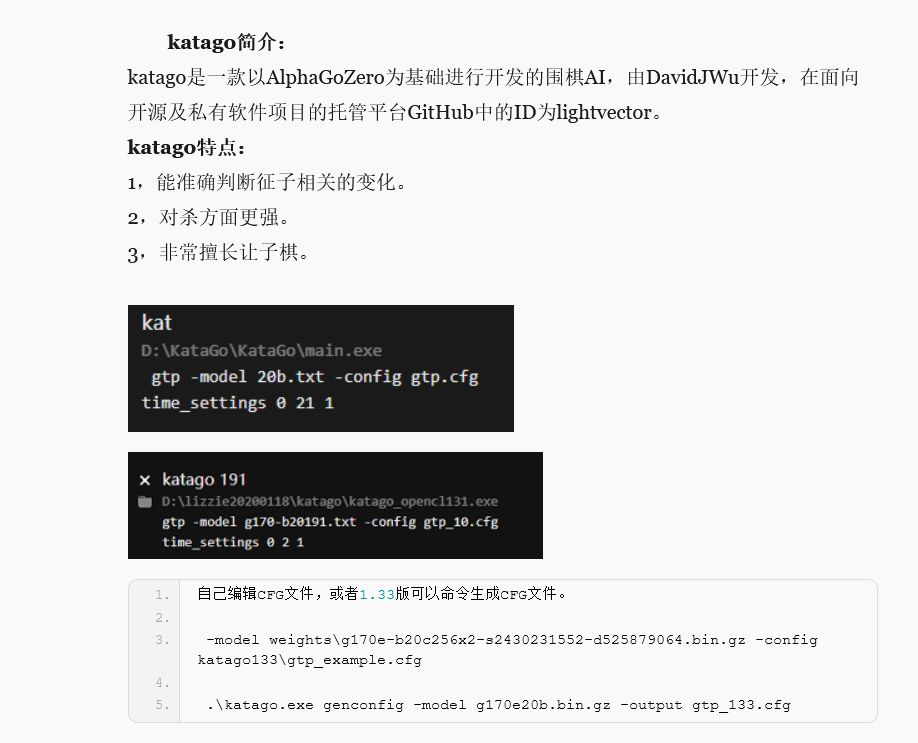
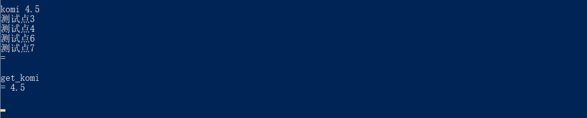
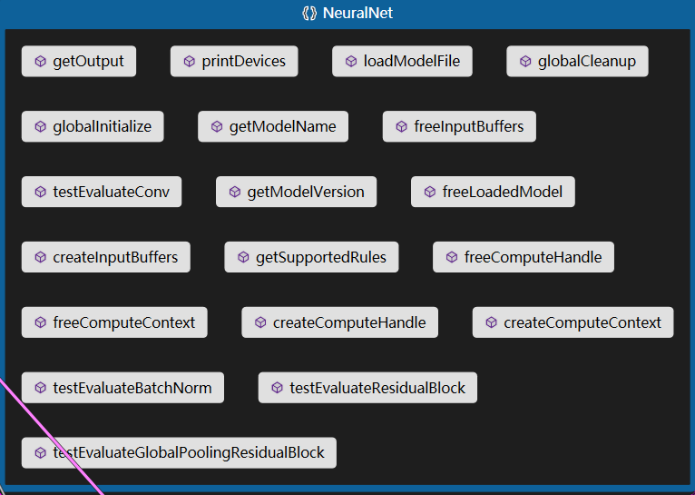
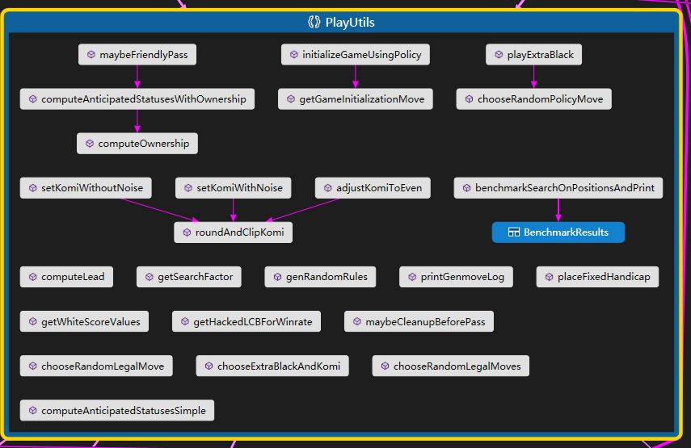
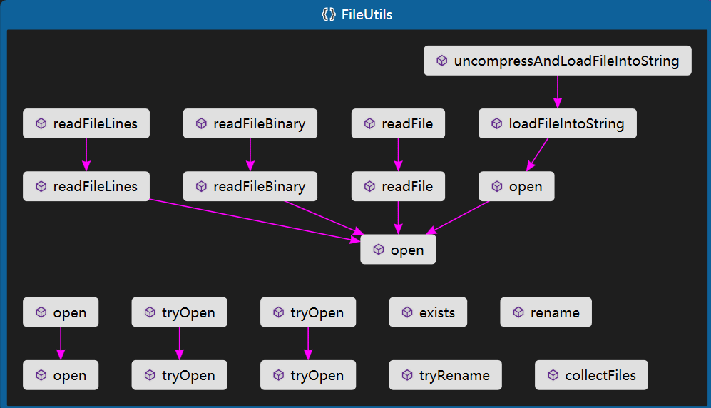

**围棋最强开源AI-KataGo在Windows系统下的编译全集教程**

[围棋最强开源AI-KataGo在Windows系统下的编译全集教程 - 知乎 (zhihu.com)](https://zhuanlan.zhihu.com/p/360413217)


https://githubmemory.com/repo/lihaochen910/KataGo


**ScoreValue 命名空间**


**FinishedGameData* GameRunner::runGame(）**


 **GTPEngine()**


 **//Stores the params we want to be using during genmoves or analysis**

 //存储我们希望在genmoves或分析过程中使用的参数。

 **SearchParams params;**


 **AsyncBot* bot;  机器人**


**int64_t numVisits; // numVisits代表节点被访问的次数。**


**float PlayUtils::computeLead(）**

**getNaiveEvenKomiHelper（）**

 **evalKomi()**


> In an **even** game, 7 points (komi) are added to the white players territory.

- 在分先对局中，白方的地的数量额外加 7。


**pieces（名词, 复数） ：棋子**


**描述。**

   **运行KataGo主GTP引擎，用于玩游戏或休闲分析。**

**使用方法。**

   **gtp [-config < FILE>] [-model < FILE>] [...其他标志...] 。**


**其中。**

   **-config < FILE>**
     **要使用的配置文件(见 gtp_example.cfg 或 configs/gtp_example.cfg)。**
     **默认为: (包含 katago.exe 的目录)/default_gtp.cfg**

   **-model <FILE**
     **神经网络模型文件。默认为：（包含**
     **katago.exe）/default_model.bin.gz的文件。**

   **-override-config < KEYVALUEPAIRS> (接受多次)**
     **覆盖配置参数。格式。"key=value, key=value,..."**

   **-覆盖-版本 < VERSION>**
     **强制KataGo在响应gtp版本命令时说一个特定的值**

   **--, --ignore_rest**
     **忽略此标志后面的其余标注参数。**

   **-版本**
     **显示版本信息并退出。**

   **-h, -help**
     **显示使用信息并退出。**


**.\katago.exe  gtp -config  default_gtp.cfg -model b30.bin.gz**





**Uncaught exception: Could not open file default_gtp.cfg - does not exist or invalid permissions?**


**playouts简称po**
**一般可以简单翻译为计算量（次数），或模拟量（次数）。**
**1po即软件不经过推演验证的第一选点，或者说第一感觉。1po是计算量的最小单位。如果你给软件的计算时间小于计算1po的时间，软件就不能完成对局**
**1v=1po，visits=playout+搜索树剩余次数**


**在引入深度学习之前的mcts方法中，如早期的Zen，一个playout指从当前盘面开始，经过一次快速模拟走子直到终局，获得一个胜负结果的过程。**
**在引入深度学习方法后的早期阶段，如AlphaGo Fan和AlphaGo Lee架构，一个playout指从当前盘面开始，经过一次对神经网络中的价值网络访问获得一个局面评估值，及从该盘面进行1000次快速模拟走子（称为rollout）获取统计结果，并将上两项加权相加，得出该盘面最终评估的过程。**
**在后续的深度学习方法，如AlphaGo Zero和Alpha Zero架构，一个playout指从当前盘面，获得一个神经网络的value端（价值网络）评估输出值的过程。**
**一般可以简单翻译为计算量（次数），或模拟量（次数）。**

**1v等同于1po，但10v不一定等同于10po.关键是要理解软件计算存在这样一个特点，如果对手下出软件预计之内的棋，软件就会把上一步的计算数据继承到下一步，如果对手下出意料之外的棋，软件就会重新从零开始计算**

**假设固定10po下棋，当对手下出意料之内的棋的时候，软件下一步就可能不进行计算而秒拍。但如果固定10v下棋，软件就会每一步都思考10v，也就是无论对手的应法是否在意料之内，软件都会匀速的走下一步棋。**

**play out基本解释**
**逐渐发生；展开；结束；使精疲力竭**
**例：**
**This has yet to play out on the mainland .这出戏正在大陆上演。**

**–heatmap 代表显示下一步棋可能选点的热图。如果你不希望显示热图，可以去掉该参数。**
**–playouts 大致可以理解成演算的深度，数字越低则AI的水平也较低，需要配合noponder参数一起使用。**
**–noponder  代表不占用对手的时间进行思考。**

**40b这里的b是blocks 神经网络的层数**
**Best Network Hash**


**非矩形棋盘**


**矩形棋盘**


 **"set_position",  // 给棋盘的某个位置放置一个白子或者黑子**


 **"komi",  // 设置让子数**



 **"undo",  // 撤销 悔棋**


**// 落子指导**

 **"genmove",  // 生成一手指导棋，并在棋盘上自动落子**


 **"genmove_debug", // 生成一手指导棋并自动落在棋盘，并会打印自动搜索的落子调试信息**


 **"search_debug",  // 使用引擎帮助搜索，给出搜索结果，提示最大胜率选择，但是不会自定落子，因为有各个候选，交由使用者自行决断**


 **"clear_cache", // 清空cache缓存，相当于清楚历史缓存，让神经网络重新思考**

**可以看出同样是使用神经外科帮助，但清理cache后的结果有所不同**


**"fixed_handicap",  // 直译：固定手势  作用就是提前把那几个称为天元、星的位置放置不可落子标识，标识禁用这些位置 fixed_handicap 4 禁用4个星位  fixed_handicap 9 星位和天元位禁用**


**// 必须是空棋盘下才能设置，也就是在开局设置**


 **"place_free_handicap",  // 在开局空棋盘状态下，随机生成几个禁止落子点  place_free_handicap  2  place_free_handicap 5 等place_free_handicap  n(位置点数)**


 **"set_free_handicap",  // 在开局空棋盘状态下，人工设定具体的禁止落子点**


`**time_settings`：表示配置时间限定（time_settings是GTP协议中的命令）**

**`0 10 1`：`0`表示引擎立即启动， `10`表示每步的时间限制为10秒， `1`表示 一步棋下一个棋子**


 **"lz-genmove_analyze",  // 使用lz网络模型进行分析**


显示原始神经网的评估结果

**kata-raw-nn all**     

**kata-raw-nn  0~7**


## **katago调试必要文件**


## 卡塔戈并行分析引擎

KataGo 包含一个引擎，可用于并行分析大量位置（整个游戏或多个游戏）。如果正确配置并与可以处理大批量的现代 GPU 一起使用，由于能够利用交叉位置批处理，并且希望具有更好的 API，因此该引擎可以比使用 GTP 引擎和 更快。分析引擎主要用于编写工具的人 - 例如，作为分析服务器或网站的后端运行。`kata-analyze`

该引擎可以通过以下方式运行：

```
./katago analysis -config CONFIG_FILE -model MODEL_FILE
```

中提供了一个示例配置文件。建议调整此配置，例如，根据您拥有的 RAM 量进行调整（在同一位置同时运行的 MCTS 线程数）和（将同时分析的位置数，*每个*位置将使用多个搜索线程）。`cpp/configs/analysis_example.cfg``nnCacheSizePowerOfTwo``numSearchThreadsPerAnalysisThread``numAnalysisThreads``numSearchThreadsPerAnalysisThread`

有关如何调整这些参数的相当详细的讨论，请参阅[示例分析配置](https://github.com/lightvector/KataGo/blob/master/cpp/configs/analysis_example.cfg#L60)。

### 协议

引擎接受对 stdin 的查询，并在 stdout 上输出结果。每个查询和每个结果都应该是一行。该协议是完全异步的 - stdin上的新请求可以随时接受，并且每当这些分析完成时，结果将显示在stdout上，并且可能与提供的请求的顺序不同。如下所述，每个查询可以指定要分析的*多个*位置，因此可能会生成*多个*结果。

如果 stdin 已关闭，则引擎将在退出之前完成所有排队查询的分析，除非在初始命令行上提供了，在这种情况下，它将尝试停止所有线程并仍然干净地退出，但不一定完成对当时打开的任何查询的分析。`-quit-without-waiting`

#### 查询

写入 stdin 的每个查询行都应该是具有特定字段的 JSON 字典。再次注意，每个查询都必须是*单行*- 不支持多行 JSON 查询。示例查询是：

```
{"id":"foo","initialStones":[["B","Q4"],["B","C4"]],"moves":[["W","P5"],["B","P6"]],"rules":"tromp-taylor","komi":7.5,"boardXSize":19,"boardYSize":19,"analyzeTurns":[0,1,2]}
```

<details style="box-sizing: border-box; display: block; margin-top: 0px; margin-bottom: 16px; color: rgb(36, 41, 47); font-family: -apple-system, BlinkMacSystemFont, &quot;Segoe UI&quot;, Helvetica, Arial, sans-serif, &quot;Apple Color Emoji&quot;, &quot;Segoe UI Emoji&quot;; font-size: 16px; font-style: normal; font-variant-ligatures: normal; font-variant-caps: normal; font-weight: 400; letter-spacing: normal; orphans: 2; text-align: start; text-indent: 0px; text-transform: none; white-space: normal; widows: 2; word-spacing: 0px; -webkit-text-stroke-width: 0px; background-color: rgb(255, 255, 255); text-decoration-thickness: initial; text-decoration-style: initial; text-decoration-color: initial;"><summary _msthash="1127256" _msttexthash="439857743" style="box-sizing: border-box; display: list-item; cursor: pointer;">请参阅格式化查询以了解可读性（但请注意，这不是 KataGo 的有效输入，因为它跨越多行）。</summary></details>

此示例查询指定具有特定属性的 2 石差点游戏记录，并请求对游戏的回合 0、1、2 进行分析，这将产生三个结果。

字段说明（包括上述查询中不存在的一些可选字段）：

- `id (string)`：必需。查询的任意字符串标识符。

- ```
  moves (list of [player string, location string] tuples)
  ```

  ：必需。游戏中播放的动作，按其播放顺序排列。

  - `player string`应为 或 。`"B"``"W"`
  - `location`字符串应与[GTP 协议](http://www.lysator.liu.se/~gunnar/gtp/gtp2-spec-draft2/gtp2-spec.html#SECTION000311000000000000000)中的字符串相同。KataGo 还支持扩展的列坐标位置，例如 、 、 、 ...或者，也可以指定字符串，例如显式给出整数 X 和 Y 坐标。`"C4"``"Z"``"AA"``"AB"``"AC"``"(0,13)"`
  - 如果您有一个没有移动历史记录的初始位置，则将此数组留空（不要编造任意或"假"的移动顺序）。

- ```
  initialStones (list of [player string, location string] tuples)
  ```

  ：可选。指定游戏开始时棋盘上已有的石头。例如，这些可能是障碍石。或者，您可以使用它来指定没有移动历史记录的游戏中期位置或全板tsumego。

  - 如果你知道到达某个位置的真实游戏移动，使用通常比在这里指定所有石头而留下一个空数组更好，因为使用确保了正确的ko / superko处理，并且神经网络也可能在其未来的预测中考虑移动历史。`moves``moves``moves`

- `initialPlayer (player string)`：可选。指定用于分析游戏的第一个回合（回合 0）的玩家，如果是空列表，则可能很有用。`moves`

- ```
  rules (string or JSON)
  ```

  ：必需。使用速记字符串或完整的 JSON 对象指定游戏规则。

  - 有关受支持规则的说明，请参阅[GTP 扩展](https://github.com/lightvector/KataGo/blob/master/docs/GTP_Extensions.md)和 中的文档。`kata-get-rules``kata-set-rules`
  - 一些较旧的神经网络版本的KataGo不支持某些规则选项。如果是这种情况，则将发出警告，并将规则自动转换为神经网络支持的最接近的规则。

- `komi (integer or half-integer)`：可选，但强烈推荐。指定游戏的 komi。如果未指定，KataGo 将猜测默认值，区域评分通常为 7.5，但如果使用区域评分，则为 6.5，如果使用按钮进行区域评分，则为 7.0。不支持 [-150，150] 以外的 komi 值。

- `whiteHandicapBonus (0|N|N-1)`：可选。请参阅[GTP 扩展，](https://github.com/lightvector/KataGo/blob/master/docs/GTP_Extensions.md)了解这些扩展的含义。可用于覆盖差点奖金的处理，优先于 .例如，如果您想要规则，但对差点宝石的补偿与中国规则通常使用的不同。您也可以始终将其指定为 0，并通过报告适当的 .`kata-get-rules``rules``chinese``komi`

- `boardXSize (integer)`：必需。主板的宽度。不支持大小> 19，除非已编译为支持 KataGo（cpp/game/board.h，MAX_LEN = 19）。KataGo的官方神经网络也没有接受过大型电路板的训练，但对于稍大的电路板（21，23，25）应该可以正常工作。

- `boardYSize (integer)`：必需。电路板的高度。不支持大小> 19，除非已编译为支持 KataGo（cpp/game/board.h，MAX_LEN = 19）。KataGo的官方神经网络也没有接受过大型电路板的训练，但对于稍大的电路板（21，23，25）应该可以正常工作。

- `analyzeTurns (list of integers)`：可选。游戏的哪个回合要分析。0 是初始位置，1 是之后的位置，2 是之后的位置，依此类推。如果未指定此字段，则默认仅分析最后一个转弯，即完成所有指定后的位置。`moves[0]``moves[1]``moves`

- `maxVisits (integer)`：可选。要使用的最大访问次数。如果未指定，则默认为分析配置文件中的值。如果指定，则覆盖它。

- `rootPolicyTemperature (float)`：可选。将此值设置为> 1 的值，以使 KataGo 执行更广泛的搜索。

- `rootFpuReductionMax (float)`：可选。将此设置为 0，使 KataGo 更愿意尝试各种招式。

- `includeOwnership (boolean)`：可选。如果为 true，则报告所有权预测结果。将使内存使用量增加一倍并略微降低性能。

- `includeOwnershipStdev (boolean)`：可选。如果为 true，则报告整个搜索中所有权预测的标准差。

- `includeMovesOwnership (boolean)`：可选。如果为真，也报告每个单独移动的所有权预测。

- `includeMovesOwnershipStdev (boolean)`：可选。如果为真，也报告每个单独移动的所有权预测标准。

- `includePolicy (boolean)`：可选。如果为 true，则报告神经网络原始策略作为结果。不会显著影响性能。

- `includePVVisits (boolean)`：可选。如果为 true，请报告任何报告的 pv 中每次移动的访问次数。

- ```
  avoidMoves (list of dicts)
  ```

  ：可选。禁止搜索探索指定玩家的指定移动，直到搜索深度达到一定数量的层数。每个字典必须包含以下字段：

  - `player`- 玩家禁止，或.`"B"``"W"`
  - `moves`- 要禁止的移动位置数组，例如`["C3","Q4","pass"]`
  - `untilDepth`- 一个正整数，表示在该层之前禁止移动的层。
  - 多个字典可以为不同的移动集指定不同的命令。如果多次使用不同的 指定移动，则行为未指定。`untilDepth``untilDepth`

- `allowMoves (list of dicts)`：可选。与"相同"禁止除指定移动之外的所有移动。目前，字典列表的长度也必须为 1。`avoidMoves`

- `overrideSettings (object)`：可选。在此对象中指定任意数量的条目，以覆盖此查询命令行中的这些参数。大多数搜索参数都可以被覆盖：、、等。`paramName:value``CONFIG_FILE``cpuctExploration``winLossUtilityFactor`

- `reportDuringSearchEvery (float)`：可选。指定秒数，以便在搜索此位置时，KataGo 将每隔几秒报告一次部分分析。

- `priority (int)`：可选。分析线程将更喜欢处理具有最高优先级的查询，除非已在另一个任务上启动，从而打破了关系以支持较早的查询。如果未指定，则默认为 0。

- `priorities (list of integers)`：可选。使用 analyzeTurns 时，可以使用此选项，而不是希望每圈具有不同的优先级。长度必须与 是 的优先级相同，是 的优先级，等等。`priority``analyzeTurns``priorities[0]``analyzeTurns[0]``priorities[1]``analyzeTurns[1]`

#### 反应

出现错误或警告时，响应将具有以下格式之一：

```
# General error
{"error":"ERROR_MESSAGE"}
# Parsing error for a particular query field
{"error":"ERROR_MESSAGE","field":"name of the query field","id":"The id string for the query with the error"}
# Parsing warning for a particular query field
{"warning":"WARNING_MESSAGE","field":"name of the query field","id":"The id string for the query with the error"}
```

如果出现警告，查询仍将继续生成分析响应。

成功的分析响应示例可以是：

```
{"id":"foo","isDuringSearch":false,"moveInfos":[{"lcb":0.8740855166489953,"move":"Q5","order":0,"prior":0.8934692740440369,"pv":["Q5","R5","Q6","P4","O5","O4","R6","S5","N4","N5","N3"],"scoreLead":8.18535151076558,"scoreMean":8.18535151076558,"scoreSelfplay":10.414442461570038,"scoreStdev":23.987067985850913,"utility":0.7509536097709347,"utilityLcb":0.7717092488727239,"visits":495,"winrate":0.8666727883983563},{"lcb":1.936558574438095,"move":"D4","order":1,"prior":0.021620146930217743,"pv":["D4","Q5"],"scoreLead":12.300520420074463,"scoreMean":12.300520420074463,"scoreSelfplay":15.386500358581543,"scoreStdev":24.661467510313432,"utility":0.9287495791972984,"utilityLcb":2.8000000000000003,"visits":2,"winrate":0.9365585744380951},{"lcb":1.9393062554299831,"move":"Q16","order":2,"prior":0.006689758971333504,"pv":["Q16"],"scoreLead":12.97426986694336,"scoreMean":12.97426986694336,"scoreSelfplay":16.423904418945313,"scoreStdev":25.34494674587838,"utility":0.9410896213959669,"utilityLcb":2.8000000000000003,"visits":1,"winrate":0.9393062554299831},{"lcb":1.9348860532045364,"move":"D16","order":3,"prior":0.0064553022384643555,"pv":["D16"],"scoreLead":12.066888809204102,"scoreMean":12.066888809204102,"scoreSelfplay":15.591397285461426,"scoreStdev":25.65390196745236,"utility":0.9256971928661066,"utilityLcb":2.8000000000000003,"visits":1,"winrate":0.9348860532045364}],"rootInfo":{"currentPlayer":"B","lcb":0.8672585456293346,"scoreLead":8.219540952281882,"scoreSelfplay":10.456476293719811,"scoreStdev":23.99829921716391,"symHash":"1D25038E8FC8C26C456B8DF2DBF70C02","thisHash":"F8FAEDA0E0C89DDC5AA5CCBB5E7B859D","utility":0.7524437705003542,"visits":500,"winrate":0.8672585456293346},"turnNumber":2}
```

<details style="box-sizing: border-box; display: block; margin-top: 0px; margin-bottom: 16px; color: rgb(36, 41, 47); font-family: -apple-system, BlinkMacSystemFont, &quot;Segoe UI&quot;, Helvetica, Arial, sans-serif, &quot;Apple Color Emoji&quot;, &quot;Segoe UI Emoji&quot;; font-size: 16px; font-style: normal; font-variant-ligatures: normal; font-variant-caps: normal; font-weight: 400; letter-spacing: normal; orphans: 2; text-align: start; text-indent: 0px; text-transform: none; white-space: normal; widows: 2; word-spacing: 0px; -webkit-text-stroke-width: 0px; background-color: rgb(255, 255, 255); text-decoration-thickness: initial; text-decoration-style: initial; text-decoration-color: initial;"><summary _msthash="1127581" _msttexthash="36607077" style="box-sizing: border-box; display: list-item; cursor: pointer;">请参阅格式化的响应。</summary></details>

**所有值都将从`报表分析的角度进行分析赢得分析`配置文件中指定的值。**

此数据的使用者应尝试在将来可能添加新的顶级字段以及 向 或 中添加字段时保持稳健。`moveInfos``rootInfo`

当前字段包括：

- `id`：在查询中提供的相同 id 字符串。

- `isDuringSearch`：通常为假。如果提供，则在搜索完成之前，在搜索过程中的报告将为真。当搜索完成时，搜索的每个位置仍将始终以一个最终响应结束，其中此字段为 false。`reportDuringSearchEvery`

- `turnNumber`：正在分析的转弯编号。

- ```
  moveInfos
  ```

  ：JSON 字典列表，KataGo 考虑的每个移动一个，其中字段指示分析结果。当前字段包括：

  - `move`- 正在分析的移动。
  - `visits`- 投入到搬迁中的访问次数。
  - `winrate`- 移动的胜率，作为 [0，1] 中的浮点数。
  - `scoreMean`- 与分数铅相同。"Mean"是一个轻微的用词不当，但此字段的存在是为了保持与现有工具的兼容性。
  - `scoreStdev`- 此移动后游戏最终得分的预测标准偏差，以分数为单位。（注意：由于MCTS的机制，该值目前将**明显偏高**，尽管它仍然可以作为*相对*指标提供信息）。
  - `scoreLead`- 当前球队领先的预测平均得分（少了这么多分，这将是一场势均力敌的比赛）。
  - `scoreSelfplay`- 在自玩期间移动后游戏最终得分的预测平均值，以分数为单位。（注意：用户通常应该更喜欢scoreLead，因为ScoreSelfplay可能会因为KataGo没有完全最大化分数而产生偏见）。
  - `prior`- 移动之前的策略，作为 [0，1] 中的浮点数。
  - `utility`- 移动的效用，结合胜率和分数，作为[-C，C]中的浮点，其中C是最大可能的效用。
  - `lcb`- 移动胜率的[LCB。](https://github.com/leela-zero/leela-zero/issues/2282)具有与 winrate 相同的单位，但可能位于 [0，1] 之外，因为当前实现并不严格考虑 0-1 边界。
  - `utilityLcb`- 移动效用的LCB。
  - `order`- 卡塔戈的举动排名。0 是最好的，1 是次好的，依此类推。
  - `isSymmetryOf`- 另一个合法的举动。如果 KataGo 配置为避免由于对称性 （） 而搜索某些移动，则可能存在此情况。如果存在，则此移动实际上未被搜索，并且其所有统计信息和PV都是从另一个移动对称复制的。`rootSymmetryPruning=true`
  - `pv`- 此移动后的主要变化。长度可变，甚至为空。
  - `pvVisits`- 每次移动的访问次数。仅当为 true 时才存在。`pv``includePVVisits`
  - `ownership`- 如果为真，则将包含此字段。它是一个长度为 JSON 的数组，其值从 -1 到 1 表示此移动后的预测所有权。值按行主序排列，从电路板的左上角（例如 A19）开始，一直到右下角（例如 T1）。`includeMovesOwnership``boardYSize * boardXSize`
  - `ownershipStdev`- 如果为真，则将包含此字段。它是一个长度为 JSON 的数组，其值介于 0 到 1 之间，指示此移动后搜索树中预测所有权的每个位置的标准偏差。值按行主序排列，从电路板的左上角（例如 A19）开始，一直到右下角（例如 T1）。`includeMovesOwnershipStdev``boardYSize * boardXSize`

- ```
  rootInfo
  ```

  ：一个 JSON 字典，其字段包含所请求的回合本身的总体统计信息，其计算方式与下一步操作的计算方式相同。当前字段为： 、 、 、 、 。以及其他字段：

  ```
  winrate
  ```

  ```
  scoreLead
  ```

  ```
  scoreSelfplay
  ```

  ```
  utility
  ```

  ```
  visits
  ```

  - `thisHash`- 一个字符串，对于每个不同的（棋盘位置，玩家移动，简单的ko ban）组合，概率极高。
  - `symHash`- 喜欢除了字符串将在对称等价的位置之间相同。不一定考虑超级子。`thisHash`
  - `currentPlayer`- 正在分析其可能的移动选择的当前玩家，或 。`"B"``"W"`

- `ownership`- 如果为真，则将包含此字段。它是一个长度为 JSON 的数组，其值从 -1 到 1 表示预测的所有权。值按行主序排列，从电路板的左上角（例如 A19）开始，一直到右下角（例如 T1）。`includeOwnership``boardYSize * boardXSize`

- `ownershipStdev`- 如果为真，则将包含此字段。它是一个长度为 JSON 的数组，其值从 0 到 1 表示搜索树中预测所有权的每个位置的标准差。值按行主序排列，从电路板的左上角（例如 A19）开始，一直到右下角（例如 T1）。`includeOwnershipStdev``boardYSize * boardXSize`

- `policy`- 如果为真，则将包含此字段。它是一个长度为正值的 JSON 数组，其总和为 1 表示神经网络在任何搜索之前对最佳移动的预测，并指示非法移动。值按行主序排列，从电路板的左上角（例如 A19）开始，一直到右下角（例如 T1）。数组中的最后一个值是要传递的策略值。`includePolicy``boardYSize * boardXSize + 1``-1`

#### 特殊操作查询

目前，支持一些特殊操作查询，这些查询指示分析引擎执行一些操作，而不是将新位置或一组位置排队进行分析。特殊操作查询也作为 JSON 对象发送，但根据查询的不同，具有一组不同的字段。

##### query_version

请求 KataGo 报告其当前版本。必填项：

- `id (string)`：必需。此查询的任意字符串标识符。
- `action (string)`：必需。应该是字符串 。`query_version`

例：

```
{"id":"foo","action":"query_version"}
```

对此查询的响应是回显具有完全相同的数据和查询字段的 json 对象，但具有两个附加字段：

- `version (string)`：一个字符串，指示此版本是其后代的最新 KataGo 发行版本，例如 。`1.6.1`
- `git_hash (string)`：编译此 KataGo 版本的精确 git 哈希，或者如果 KataGo 是独立于其存储库编译的，或者没有 Git 支持，则字符串。`<omitted>`

例：

```
{"action":"query_version","git_hash":"0b0c29750fd351a8364440a2c9c83dc50195c05b","id":"foo","version":"1.6.1"}
```

##### clear_cache

请求 KataGo 清空其神经网络缓存。必填项：

- `id (string)`：必需。此查询的任意字符串标识符。
- `action (string)`：必需。应该是字符串 。`clear_cache`

例：

```
{"id":"foo","action":"clear_cache"}
```

对此查询的响应是简单地回显具有完全相同的数据和查询字段的 json 对象。此响应将在缓存成功清除后发送。如果当时还存在任何正在进行的分析查询，则即使正在发送响应，这些查询当然也会同时重新填充缓存。

说明：KataGo使用神经网络查询结果的缓存来跳过查询神经网络，当它在其搜索树中遇到一个位置，其石头配置，玩家移动，ko状态，komi，规则和其他相关选项都与以前见过的位置相同。例如，如果某些查询的搜索树由于位于同一游戏的附近移动而重叠，则可能会发生这种情况，或者如果搜索探索导致相同位置的不同移动顺序（通常，大约 20% 的搜索树节点由于转换为移动顺序而命中缓存），则即使在单个分析查询中也可能发生这种情况。 尽管根据位置和搜索深度，它可能会高得多或更低）。想要清除缓存的原因可能包括：

- 释放 RAM 使用量 - 清空缓存应释放用于缓存结果的内存，这通常是 KataGo 中最大的内存使用量。随着缓存的重新填充，内存使用量当然会再次上升。
- 测试或研究KataGo搜索结果在给定访问次数下的可变性。在缓存清除后再次分析某个位置将对该位置进行"新鲜"的外观，该位置与 KataGo 可能返回的各种可能结果更匹配，类似于分析引擎是否完全重新启动。每个查询将重新随机化用于该查询的神经网络的对称性，而不是使用缓存的结果，从而给出新的、更多样化的意见。

##### 终止

请求 KataGo 终止零个或多个分析查询，而不等待它们正常完成。当查询终止时，引擎将尽最大努力尽快停止其分析，并报告到目前为止执行的任何访问次数的结果。必填项：

- `id (string)`：必需。此查询的任意字符串标识符。
- `action (string)`：必需。应该是字符串 。`terminate`
- `terminateId (string)`：必需。终止使用此字段提交的查询，而不对其进行分析或完成分析。`id`
- `turnNumbers (array of ints)`：可选。如果提供，则限制为仅终止具有该 ID 的查询，这些查询用于这些轮次编号。

例：

```
{"id":"bar","action":"terminate","terminateId":"foo","turnNumbers":[1,2]}
```

如果在终止之前根本没有执行任何分析，则对已终止查询的响应可能会缺少其数据字段。在这种情况下，唯一保证位于响应上的字段是 and 和（将始终为 false），以及一个特定于根本没有分析的已终止查询所特有的附加布尔字段（这将始终为 true）。例：`id``turnNumber``isDuringSearch``noResults`

```
{"id":"foo","isDuringSearch":false,"noResults":true,"turnNumber":2}
```

终止查询本身也将导致响应，以确认操作的接收和处理。响应包括使用查询的完全相同的字段和数据回显 json 对象。

响应通常不会等待操作的所有影响发生 - 正在进行的搜索可能需要少量的额外时间才能实际终止并报告其部分结果。想要等待所有终止的查询完成的此 API 的客户端应自行跟踪它已发送以供分析的查询集，并等待所有这些查询都已完成。这可以通过依赖以下属性来完成：每个分析查询（无论是否终止，也无论是否终止）都将以一个回复结束 - 因此，此类回复可以用作分析查询已完成的标记。（除非在发动机关闭期间（如果已指定）。）。`reportDuringSearchEvery``isDuringSearch``false``-quit-without-waiting`


## [cpp](https://github.com/lightvector/KataGo/tree/master/cpp)/[配置](https://github.com/lightvector/KataGo/tree/master/cpp/configs)/**analysis_example.cfg**

| #C++（非 python）gtp 机器人的配置示例 |                                                              |
| ------------------------------------- | ------------------------------------------------------------ |
|                                       |                                                              |
|                                       | #请参阅gtp_example.cfg中有关性能和内存使用情况的说明         |
|                                       | #请参阅下面的有关numSearchThreads和其他重要参数的注释！      |
|                                       |                                                              |
|                                       | #日志------------------------------------------------------------------------------------ |
|                                       |                                                              |
|                                       | #在哪里输出日志？                                            |
|                                       | logDir = analysis_logs  #每次运行 KataGo 都会记录到此目录中的单独文件中 |
|                                       | # logFile = analysis.log # 使用此文件而不是 logDir 直接指定单个文件 |
|                                       | # logToStderr = true # 将所有内容输出到日志文件的回显到 stderr 以及 |
|                                       | # logAllRequests = false # 记录接收到分析引擎的所有输入行。  |
|                                       | # logAllResponses = false # 将所有行输出从分析引擎记录到 stdout。 |
|                                       | # logSearchInfo = false # 记录执行的每次搜索的调试信息       |
|                                       |                                                              |
|                                       | #分析------------------------------------------------------------------------------------ |
|                                       |                                                              |
|                                       | #控制变体中第一次移动后的移动次数。                          |
|                                       | #分析PVLen = 15                                              |
|                                       |                                                              |
|                                       | #将分析的胜率报告为 （黑色\|白色\|SIDETOMOVE）。             |
|                                       | 报告分析获胜As = 黑色                                        |
|                                       |                                                              |
|                                       | #较大的值将使KataGo探索顶部移动的深度和准确性降低，          |
|                                       | #但探索并评估更多种类的举动。                                |
|                                       | #像1这样的极端值会在棋盘上的每个动作中分配许多播放，甚至是非常糟糕的动作。 |
|                                       | #注意：默认为 0.04，前提是假定分析引擎将主要用于分析。       |
|                                       | #如果您打算使用分析引擎来玩游戏，并且想要最大化游戏强度，    |
|                                       | #在此配置或覆盖中将此值设置为 0.0。                          |
|                                       | #宽根噪声 = 0.04                                             |
|                                       |                                                              |
|                                       | #机器人行为--------------------------------------------------------------------------------------- |
|                                       |                                                              |
|                                       | #让分盘-------------                                         |
|                                       |                                                              |
|                                       | #假设如果布莱克在游戏开始时连续移动了许多动作，那么游戏就是一个让分盘游戏。 |
|                                       | #这在某些服务器和某些 GUI 上是必需的，并且在从许多 SGF 文件进行初始化时也是必需的，这些文件可能会 |
|                                       | #使用重复的GTP"播放"命令而不是GTP"place_free_handicap"命令设置差点游戏。 |
|                                       | #但是，如果使用whiteHandicapBonus并且服务器不使用，也可能导致对komi的错误理解 |
|                                       | #有这样的做法。                                              |
|                                       | #默认为 true！取消注释并设置为 false 以禁用此行为。          |
|                                       | #假设MultipleStartingBlackMovesAreHandicap = true            |
|                                       |                                                              |
|                                       | #传递和清理-------------                                     |
|                                       |                                                              |
|                                       | #让机器人永远不要假设它的传球会结束游戏，即使传球会结束，并在Tromp-Taylor规则下"获胜"。 |
|                                       | #通常，当将其用于分析或在服务器上播放时，这是一个好主意，在这些服务器上，得分可以非tromp-taylorly实现。 |
|                                       | #默认为 true！取消注释并设置为 false 以禁用此功能。          |
|                                       | #保守通票 = 真                                               |
|                                       |                                                              |
|                                       | #使用区域得分时，通过特殊清理，自玩游戏会持续超过两次传球    |
|                                       | #可能使人类玩家感到困惑的规则。此选项可防止特殊清理阶段      |
|                                       | #使用机器人进行GTP播放时可以访问。                           |
|                                       | #默认为 true！取消注释并设置为 false，如果您希望 KataGo 能够进入特殊清理。 |
|                                       | #例如，如果您正在针对自身或针对已精确实现规则的其他机器人对其进行测试 |
|                                       | #记录于 https://lightvector.github.io/KataGo/rules.html      |
|                                       | #防止清洁阶段 = 真                                           |
|                                       |                                                              |
|                                       | #搜索限制----------------------------------------------------------------------------------- |
|                                       |                                                              |
|                                       | #默认情况下，如果未在单个请求中指定，请将每次搜索的最大根访问次数限制为 |
|                                       | 最大访问量= 500                                              |
|                                       | #如果提供，请将搜索时间限制在这几秒                          |
|                                       | #最大时间 = 60                                               |
|                                       |                                                              |
|                                       | #搜索线程、批处理、GPU-------------------------------------------------------------------------- |
|                                       |                                                              |
|                                       | #如果您只期望引擎一次处理几个查询，并且您希望                |
|                                       | #单个查询返回速度更快，并且结果质量较低，整体                |
|                                       | #查询的峰值吞吐量要低。                                      |
|                                       | 数字分析线程= 2                                              |
|                                       | numSearchThreadsPerAnalysisThread = 16                       |
|                                       |                                                              |
|                                       | #如果您希望一次发送大量查询，并希望最大化，请尝试这样的配置  |
|                                       | #总吞吐量以及所有查询的评估质量，您永远不关心响应延迟        |
|                                       | 的单个查询，仅吞吐量作为一个整体。                           |
|                                       | #数字分析线程 = 32                                           |
|                                       | # numSearchThreadsPerAnalysisThread = 1                      |
|                                       |                                                              |
|                                       | #如果您拥有功能强大的GPU，您将需要增加一个或两个数字，如果您拥有强大的GPU，则可能会减少一个或两个数字 |
|                                       | #具有非常弱的GPU，并根据您的用例在它们之间取得平衡。         |
|                                       | #请阅读以下说明，了解如何设置这些参数：                      |
|                                       |                                                              |
|                                       | #解释：                                                      |
|                                       | # numAnalysisThreads：能够并行搜索的职位数量。               |
|                                       | # numSearchThreadsPerAnalysisThread：在树中搜索每个位置时要使用的线程数。 |
|                                       | #（较旧的分析配置可能只有"numSearchThreads"，这是"numSearchThreadsPerAnalysisThreads"的别名） |
|                                       |                                                              |
|                                       | #因此，在给定时间可能处于活动状态的搜索线程总数可能与产品一样大： |
|                                       | # numAnalysisThreads * numSearchThreadsPerAnalysisThread     |
|                                       |                                                              |
|                                       | #并行搜索更多位置更有效，因为不同的线程不会与每个线程冲突    |
|                                       | #同一 MCTS 搜索树上的其他。在同一搜索中使用多个线程都会使事情变慢 |
|                                       | #并削弱搜索（保持播放固定），因为节点上的统计数据过时和次优探索， |
|                                       | #尽管成本对于仅2，4，8线程很小。                             |
|                                       |                                                              |
|                                       | #因此，与GTP不同，GTP一次只搜索一个位置，因此您不妨在其中进行 |
|                                       | # numSearchThreads 尽可能大，在你经常想要的分析引擎中，你经常希望保持numSearchThreads的小， |
|                                       | #并改为跨位置并行化，因此您可以减少线程之间的冲突并提高整体吞吐量 |
|                                       | #和搜索强度。                                                |
|                                       |                                                              |
|                                       | #但显然，只有当实际有很多仓位时，您才能获得跨仓位并行化的好处。 |
|                                       | #您一次查询的 # ！例如，如果您只发送一个或两个，则将 numAnalysisThreads 设置为 8 是无用的。 |
|                                       | #一次查询！                                                  |
|                                       |                                                              |
|                                       | #因此：                                                      |
|                                       | # * 如果您计划仅将分析引擎用于批量处理大量仓位，             |
|                                       | #最好是 numSearchThreadsPerAnalysisThread 只使用少量（例如 1，2，4），并使用更高的 numAnalysisThreads。 |
|                                       | # * 但是，如果您有时计划查询分析引擎中的单个仓位，或者以较小的数量查询 |
|                                       | #比 -num-analysis-threads，或者如果您计划进行用户交互，使得响应时间在某些个体上 |
|                                       | #分析请求很重要，要保持低，然后将numSearchThreadsPerAnalysisThread设置为更大的数量并使用 |
|                                       | #一个较低的数字分析线程。这样，由于每个搜索上都有更多线程，因此单个搜索可以更快地完成。 |
|                                       |                                                              |
|                                       | #对于 19x19 的开发板，较弱的 GPU 可能需要线程总数（numAnalysisThreads * numSearchThreadsPerAnalysisThread） |
|                                       | #介于 4 和 32 之间。中端 GPU 可能介于 16 到 64 之间。强大的GPU可能在32到256之间。 |
|                                       | #但是，没有任何东西可以替代实验，看看什么最适合您的硬件和用例。 |
|                                       |                                                              |
|                                       | #请记住，您想要的线程数并不一定与您拥有多少内核有很大关系    |
|                                       | #系统。最优可能很容易超过内核数！GPU 批处理（通常）是主要考虑因素。 |
|                                       |                                                              |
|                                       | # -------------                                              |
|                                       |                                                              |
|                                       | # nnMaxBatchSize 是一次发送到单个 GPU 的最大位置数。通常，情况应该是： |
|                                       | # （您将使用的 GPU 数量 * nnMaxBatchSize） >= （numSearchThreads * num-analysis-threads） |
|                                       | #这样，当每个线程尝试请求 GPU 评估时，跨 GPU 的总和批大小足以处理它们。 |
|                                       | #一次全部。但是，如果您受 GPU 内存限制，则将其设置得稍小一点是明智的， |
|                                       | #如果 GPU 没有足够的内存，则数字过大可能会失败。             |
|                                       | nnMaxBatchSize = 64                                          |
|                                       |                                                              |
|                                       | #取消注释并设置这些较小的，如果您要将分析引擎专门用于较小的板（或计划 |
|                                       | #运行多个实例，有些实例只处理较小的电路板）。它应该提高性能。 |
|                                       | #这也可能意味着您可以有利可图地使用更多线程。                |
|                                       | # maxBoardXSizeForNNBuffer = 19                              |
|                                       | # maxBoardYSizeForNNBuffer = 19                              |
|                                       |                                                              |
|                                       | #取消注释并将其设置为 true，如果您要专门用于板大小的分析引擎 |
|                                       | #由 maxBoardXSizeForNNBuffer 和 maxBoardYSizeForNNBuffer 指定。它可能会略微提高某些 GPU 的性能。 |
|                                       | # requireMaxBoardSize = true                                 |
|                                       |                                                              |
|                                       | #要使用多个 GPU，请执行以下操作：                            |
|                                       | #取消注释并将其设置为您拥有和/或想要使用的GPU数量...         |
|                                       | #如果超过 1，请取消注释下面的相应 CUDA 或 OpenCL 部分。      |
|                                       | # numNNServerThreadsPerModel = 1                             |
|                                       |                                                              |
|                                       | #其他常规 GPU 设置------------------------------------------------------------------------------- |
|                                       |                                                              |
|                                       | #缓存多达2 **这么多神经网络评估，以防树中的转置。            |
|                                       | nncacheSizePowerOfTwo = 23                                   |
|                                       | #用于 nnCache 的互斥体池的大小为 2 ** 此                     |
|                                       | nnMutexPoolSizePowerOfTwo = 17                               |
|                                       | #在运行神经网络评估时随机化电路板方向？                      |
|                                       | nnRandomize = true                                           |
|                                       |                                                              |
|                                       |                                                              |
|                                       | # TENSORRT GPU settings-------------------------------------- |
|                                       | # These only apply when using the TENSORRT version of KataGo. |
|                                       |                                                              |
|                                       | # IF USING ONE GPU: optionally uncomment and change this if the GPU you want to use turns out to be not device 0 |
|                                       | # trtDeviceToUse = 0                                         |
|                                       |                                                              |
|                                       | # IF USING TWO GPUS: Uncomment these two lines (AND set numNNServerThreadsPerModel above): |
|                                       | # trtDeviceToUseThread0 = 0  # change this if the first GPU you want to use turns out to be not device 0 |
|                                       | # trtDeviceToUseThread1 = 1  # change this if the second GPU you want to use turns out to be not device 1 |
|                                       |                                                              |
|                                       | # IF USING THREE GPUS: Uncomment these three lines (AND set numNNServerThreadsPerModel above): |
|                                       | # trtDeviceToUseThread0 = 0  # change this if the first GPU you want to use turns out to be not device 0 |
|                                       | # trtDeviceToUseThread1 = 1  # change this if the second GPU you want to use turns out to be not device 1 |
|                                       | # trtDeviceToUseThread2 = 2  # change this if the third GPU you want to use turns out to be not device 2 |
|                                       |                                                              |
|                                       | # You can probably guess the pattern if you have four, five, etc. GPUs. |
|                                       |                                                              |
|                                       |                                                              |
|                                       | # CUDA-specific GPU settings-------------------------------------- |
|                                       | # These only apply when using the CUDA version of KataGo.    |
|                                       |                                                              |
|                                       | # IF USING ONE GPU: optionally uncomment and change this if the GPU you want to use turns out to be not device 0 |
|                                       | # cudaDeviceToUse = 0                                        |
|                                       |                                                              |
|                                       | # IF USING TWO GPUS: Uncomment these two lines (AND set numNNServerThreadsPerModel above): |
|                                       | # cudaDeviceToUseThread0 = 0  # change this if the first GPU you want to use turns out to be not device 0 |
|                                       | # cudaDeviceToUseThread1 = 1  # change this if the second GPU you want to use turns out to be not device 1 |
|                                       |                                                              |
|                                       | # IF USING THREE GPUS: Uncomment these three lines (AND set numNNServerThreadsPerModel above): |
|                                       | # cudaDeviceToUseThread0 = 0  # change this if the first GPU you want to use turns out to be not device 0 |
|                                       | # cudaDeviceToUseThread1 = 1  # change this if the second GPU you want to use turns out to be not device 1 |
|                                       | # cudaDeviceToUseThread2 = 2  # change this if the third GPU you want to use turns out to be not device 2 |
|                                       |                                                              |
|                                       | # You can probably guess the pattern if you have four, five, etc. GPUs. |
|                                       |                                                              |
|                                       | # KataGo will automatically use FP16 or not based on the compute capability of your NVIDIA GPU. If you |
|                                       | # want to try to force a particular behavior though you can uncomment these lines and change them |
|                                       | # to "true" or "false". E.g. it's using FP16 but on your card that's giving an error, or it's not using |
|                                       | # FP16 but you think it should.                              |
|                                       | # cudaUseFP16 = auto                                         |
|                                       | # cudaUseNHWC = auto                                         |
|                                       |                                                              |
|                                       |                                                              |
|                                       | # OpenCL-specific GPU settings-------------------------------------- |
|                                       | # These only apply when using the OpenCL version of KataGo.  |
|                                       |                                                              |
|                                       | # Uncomment to tune OpenCL for every board size separately, rather than only the largest possible size |
|                                       | # openclReTunePerBoardSize = true                            |
|                                       |                                                              |
|                                       | # IF USING ONE GPU: optionally uncomment and change this if the best device to use is guessed incorrectly. |
|                                       | # The default behavior tries to guess the 'best' GPU or device on your system to use, usually it will be a good guess. |
|                                       | # openclDeviceToUse = 0                                      |
|                                       |                                                              |
|                                       | # IF USING TWO GPUS: Uncomment these two lines and replace X and Y with the device ids of the devices you want to use. |
|                                       | # It might NOT be 0 and 1, some computers will have many OpenCL devices. You can see what the devices are when |
|                                       | # KataGo starts up - it should print or log all the devices it finds. |
|                                       | # (AND also set numNNServerThreadsPerModel above)            |
|                                       | # openclDeviceToUseThread0 = X                               |
|                                       | # openclDeviceToUseThread1 = Y                               |
|                                       |                                                              |
|                                       | # IF USING THREE GPUS: Uncomment these three lines and replace X and Y and Z with the device ids of the devices you want to use. |
|                                       | # It might NOT be 0 and 1 and 2, some computers will have many OpenCL devices. You can see what the devices are when |
|                                       | # KataGo starts up - it should print or log all the devices it finds. |
|                                       | # (AND also set numNNServerThreadsPerModel above)            |
|                                       | # openclDeviceToUseThread0 = X                               |
|                                       | # openclDeviceToUseThread1 = Y                               |
|                                       | # openclDeviceToUseThread2 = Z                               |
|                                       |                                                              |
|                                       | # You can probably guess the pattern if you have four, five, etc. GPUs. |
|                                       |                                                              |
|                                       | # KataGo will automatically use FP16 or not based on testing your GPU during tuning. If you |
|                                       | # want to try to force a particular behavior though you can uncomment this lines and change it |
|                                       | # to "true" or "false". This is a fairly blunt setting - more detailed settings are testable |
|                                       | # by rerunning the tuner with various arguments.             |
|                                       | # openclUseFP16 = auto                                       |
|                                       |                                                              |
|                                       |                                                              |
|                                       | # Eigen-specific settings-------------------------------------- |
|                                       | # These only apply when using the Eigen (pure CPU) version of KataGo. |
|                                       |                                                              |
|                                       | # This is the number of CPU threads for evaluating the neural net on the Eigen backend. |
|                                       | # It defaults to min(numAnalysisThreads * numSearchThreadsPerAnalysisThread, numCPUCores). |
|                                       | # numEigenThreadsPerModel = X                                |
|                                       |                                                              |
|                                       |                                                              |
|                                       | # Misc Behavior --------------------                         |
|                                       |                                                              |
|                                       | # If the board is symmetric, search only one copy of each equivalent move. Attempts to also account for ko/superko, will not theoretically perfect for superko. |
|                                       | # Uncomment and set to false to disable this.                |
|                                       | # rootSymmetryPruning = true                                 |
|                                       |                                                              |
|                                       | # Uncomment and set to true to make KataGo avoid a particular joseki that some KataGo nets misevaluate, |
|                                       | # and also to improve opening diversity versus some particular other bots that like to play it all the time. |
|                                       | # avoidMYTDaggerHack = false                                 |
|                                       |                                                              |
|                                       | # Have KataGo mildly prefer to avoid playing the same joseki in every corner of the board. |
|                                       | # Uncomment to set to a specific value. A small value like 0.005 should produce already a noticeable behavior change. |
|                                       | # avoidRepeatedPatternUtility = 0.0                          |
|                                       |                                                              |
|                                       |                                                              |
|                                       | # Root move selection and biases------------------------------------------------------------------------------ |
|                                       | # Uncomment and edit any of the below values to change them from their default. |
|                                       | # Not all of these parameters are applicable to analysis, some are only used for actual play |
|                                       |                                                              |
|                                       | # Temperature for the early game, randomize between chosen moves with this temperature |
|                                       | # chosenMoveTemperatureEarly = 0.5                           |
|                                       | # Decay temperature for the early game by 0.5 every this many moves, scaled with board size. |
|                                       | # chosenMoveTemperatureHalflife = 19                         |
|                                       | # At the end of search after the early game, randomize between chosen moves with this temperature |
|                                       | # chosenMoveTemperature = 0.10                               |
|                                       | # Subtract this many visits from each move prior to applying chosenMoveTemperature |
|                                       | # (unless all moves have too few visits) to downweight unlikely moves |
|                                       | # chosenMoveSubtract = 0                                     |
|                                       | #与 selectedMoveSubtract 相同，但仅修剪低于阈值的移动，不会影响高于阈值的移动 |
|                                       | #已选择移动普鲁恩 = 1                                        |
|                                       |                                                              |
|                                       | #采样对称性（无替换）和根部平均值                            |
|                                       | #根数对称到样本 = 1                                          |
|                                       |                                                              |
|                                       | #使用 LCB 进行移动选择？                                     |
|                                       | # useLcbForSelection = true                                  |
|                                       | #对于LCB选择，一个移动需要比另一个移动好多少个stdev          |
|                                       | # lcbStdevs = 5.0                                            |
|                                       | #仅当移动将此访问比例作为顶部移动时，才使用 LCB 覆盖         |
|                                       | # minVisitPropForLCB = 0.15                                  |
|                                       |                                                              |
|                                       | #内部参数------------------------------------------------------------------------------ |
|                                       | #取消注释并编辑以下任何值以将其从默认值更改为默认值。        |
|                                       |                                                              |
|                                       | #扩展赢/输的效用                                             |
|                                       | # winLossUtilityFactor = 1.0                                 |
|                                       | #扩展实用程序以尝试最大化分数                                |
|                                       | # staticScoreUtilityFactor = 0.10                            |
|                                       | # dynamicScoreUtilityFactor = 0.30                           |
|                                       | #调整动态分数以此比例居中，趋向于零，上限为合理。            |
|                                       | # dynamicScoreCenterZeroWeight = 0.20                        |
|                                       | # dynamicScoreCenterScale = 0.75                             |
|                                       | #由于三重ko或其他长周期在非superko规则集中（-1到1）而获得"无结果"的效用 |
|                                       | # noResultUtilityForWhite = 0.0                              |
|                                       | #对于白色，平局计为的胜利次数。（0 至 1）                    |
|                                       | #抽奖等价WinsForWhite = 0.5                                  |
|                                       |                                                              |
|                                       | #mcts 的探索常数                                             |
|                                       | # cpuctExploration = 1.0                                     |
|                                       | # cpuctExplorationLog = 0.45                                 |
|                                       |                                                              |
|                                       | #控制在波动位置中探索更多，在稳定位置探索较少的参数。        |
|                                       | # cpuctUtilityStdevPrior = 0.40                              |
|                                       | # cpuctUtilityStdevPriorWeight = 2.0                         |
|                                       | # cpuctUtilityStdevScale = 0.85                              |
|                                       |                                                              |
|                                       | #微积分的 FPU 还原常数                                       |
|                                       | # fpuReductionMax = 0.2                                      |
|                                       | # rootFpuReductionMax = 0.1                                  |
|                                       |                                                              |
|                                       | #根据网络自身自我报告的不确定性控制评估权重的参数。          |
|                                       | # useUncertainty = true                                      |
|                                       | #不确定性指数 = 1.0                                          |
|                                       | #不确定度系数 = 0.25                                         |
|                                       |                                                              |
|                                       | #对相对于好值非常差的儿童进行减重的金额                      |
|                                       | #值权重开销 = 0.5                                            |
|                                       |                                                              |
|                                       | #轻微的激励机器人在最后通过时表现得像人类一样，填满了女士，  |
|                                       | #不浪费时间在自己的领土上玩，等等，不玩在以下方面等效的动作  |
|                                       | #点，但对人类更不友好。                                      |
|                                       | # rootEndingBonusPoints = 0.5                                |
|                                       |                                                              |
|                                       | #让机器人修剪无用的动作，这些动作只会延长游戏时间，以避免失败 |
|                                       | # rootPruneUselessMoves = true                               |
|                                       |                                                              |
|                                       | #基于局部模式键应用偏差校正                                  |
|                                       | #子树值参数因子 = 0.35                                       |
|                                       | #子树值偏权重指数 = 0.8                                      |
|                                       |                                                              |
|                                       | #使用于搜索同步的互斥体池有多大                              |
|                                       | #互斥池大小 = 8192                                           |
|                                       | #当线程通过节点下降时要添加多少虚拟损失                      |
|                                       | # numVirtualLossesPerThread = 1                              |
|                                       |                                                              |
|                                       | #提高重度多线程下的评估质量                                  |
|                                       | # useNoisePruning = true                                     |
|                                       |                                                              |
|                                       |                                                              |
|                                       | #避免 SGF 模式------------------------------------------------------------------------------ |
|                                       | #本节中的参数提供了一种自定义 KataGo 的强大方法，以避免遵循特定模式的移动 |
|                                       | #基于启动时加载的一组提供的 SGF 文件。取消注释以使用此功能。 |
|                                       | #此外，如果 SGF 文件在移动注释中包含字符串 %SKIP%，则出于此目的，将忽略该移动。 |
|                                       |                                                              |
|                                       | #引擎启动时从此目录加载 sgf 文件（仅在启动时，除非重新启动引擎，否则不会重新加载） |
|                                       | # avoidSgfPatternDirs = path/to/directory/with/sgfs/         |
|                                       |                                                              |
|                                       | #每次匹配移动都会惩罚这么多的效用。                          |
|                                       | #如果您想让KataGo偏爱SGF模式而不是惩罚它，请设置此负数！     |
|                                       | #这个数字不需要很大，即使0.001也会有所作为。值过大可能会导致游戏失败。 |
|                                       | # avoidSgfPatternUtility = 0.001                             |
|                                       |                                                              |
|                                       | #可选 - 仅加载最新的这么多文件                               |
|                                       | # avoidSgfPatternMaxFiles = 20                               |
|                                       |                                                              |
|                                       | #可选 - 每个较旧的 SGF 文件的惩罚乘以此值，因此旧的 sgf 文件比较新的文件更重要。 |
|                                       | # avoidSgfPatternLambda = 0.90                               |
|                                       |                                                              |
|                                       | #可选 - 仅注意具有此名称的玩家所做的动作。                   |
|                                       | #例如，可以将其设置为机器人过去的游戏将显示为 SGF 中的名称，以便机器人只能避免重复 |
|                                       | #自己在过去游戏中做出的举动，而不是对手做出的举动。          |
|                                       | # avoidSgfPatternAllowedNames = my-ogs-bot-name1，my-ogs-bot-name2 |
|                                       |                                                              |
|                                       | #可选 - 忽略在此轮次编号之前发生的 SGF 文件中的任何移动。    |
|                                       | # avoidSgfPatternMinTurnNumber = 0                           |
|                                       |                                                              |
|                                       | #有关更多避免模式的信息：                                    |
|                                       | #您还可以通过编号 2，3，4 来指定第二组参数以及第三组、第四组参数等,... |
|                                       | # avoidSgf2PatternDirs = ...                                 |
|                                       | # avoidSgf2PatternUtility = ...                              |
|                                       | # avoidSgf2PatternMaxFiles = ...                             |
|                                       | # avoidSgf2PatternLambda = ...                               |
|                                       | # avoidSgf2PatternAllowedNames = ...                         |
|                                       | # avoidSgf2PatternMinTurnNumber = ...                        |


## [cpp](https://github.com/lightvector/KataGo/tree/v1.9.0/cpp)/[配置](https://github.com/lightvector/KataGo/tree/v1.9.0/cpp/configs)/**gtp_example.cfg**

| #Config for C++ （non-python） gtp bot |                                                              |
| -------------------------------------- | ------------------------------------------------------------ |
|                                        |                                                              |
|                                        | #在在线服务器上运行或在真实锦标赛或比赛中运行：              |
|                                        | #如果您打算这样做，您可能需要通读"规则"部分                  |
|                                        | #请仔细处理komi和差点游戏以及游戏结束清理                    |
|                                        | #和其他各种细节。                                            |
|                                        |                                                              |
|                                        | #有关性能和内存使用情况的说明：                              |
|                                        | #您可能希望调整以下一项或多项内容：                          |
|                                        | #                                                            |
|                                        | # numSearchThreads：                                         |
|                                        | #要使用的 CPU 线程数。如果您的GPU功能强大，它实际上可以比    |
|                                        | #处理器上的内核数，因为您需要许多线程才能提供足够大的内核数  |
|                                        | #批处理以充分利用 GPU。                                      |
|                                        | #                                                            |
|                                        | #"./katago 基准测试"命令可以帮助您调整此参数，以及测试效果   |
|                                        | 对以下任何其他参数的更改次数！                               |
|                                        | #                                                            |
|                                        | # nncacheSizePowerOfTwo：                                    |
|                                        | #这将控制 NN 缓存大小，这是主要的 RAM/内存使用量。           |
|                                        | #如果您不介意内存使用，并且希望获得更好的搜索性能，请增加此值 |
|                                        | #数以万计的访问量或更多。如果要限制内存使用量，请降低此值。  |
|                                        | #                                                            |
|                                        | #如果你是一个乐于做一些数学运算的人 - 每个神经网络条目都需要非常 |
|                                        | #大约 1.5KB，除非使用全板所有权/区域可视化，每个             |
|                                        | #条目大约需要3KB。条目数为 （2 ** nnCacheSizePowerOfTwo），  |
|                                        | #例如 2 ** 18 = 262144。                                     |
|                                        | #                                                            |
|                                        | #其他注意事项：                                              |
|                                        | #如果您有多个 GPU，请查看下面的"OpenCL GPU 设置"或"CUDA GPU 设置"。 |
|                                        | #                                                            |
|                                        | #如果使用OpenCL，您将需要验证KataGo是否正在拾取正确的设备！  |
|                                        | #（例如，如果KataGo似乎选择，某些系统可能同时具有Intel CPU OpenCL和GPU OpenCL |
|                                        | #错误的一个，你通过在下面指定"openclGpuToUse"来纠正这一点）。 |
|                                        | #                                                            |
|                                        | #您可能还想调整"maxVisits"，"ponderingEnable"，"resignThreshold"，以及可能 |
|                                        | #其他参数取决于您的预期用途。                                |
|                                        | #                                                            |
|                                        | # ---------------------------------------------------------------------------------------- |
|                                        |                                                              |
|                                        | #对于"katago gtp"命令，如果需要，可以通过以下所有值进行设置或覆盖 |
|                                        | #命令行参数：                                                |
|                                        | # -override-config KEY=VALUE，KEY=VALUE,...                  |
|                                        |                                                              |
|                                        | #日志和文件-------------------------------------------------------------------------- |
|                                        |                                                              |
|                                        | #在哪里输出日志？                                            |
|                                        | logDir = gtp_logs  #每次运行 KataGo 都会记录到此目录中的单独文件中 |
|                                        | # logFile = gtp.log # 使用此文件而不是 logDir 直接指定单个文件 |
|                                        |                                                              |
|                                        | #日志记录选项                                                |
|                                        | logAllGTPCommunication = true                                |
|                                        | logSearchInfo = true                                         |
|                                        | logToStderr = false                                          |
|                                        |                                                              |
|                                        | #KataGo将在GTP启动时向stderr显示一些信息                     |
|                                        | #取消注释以压制它并保持沉默                                  |
|                                        | # startupPrintMessageToStderr = false                        |
|                                        |                                                              |
|                                        | #向 stderr 聊一些东西，用于像 malkovich chat to OGS 这样的事情。 |
|                                        | # ogsChatToStderr = true                                     |
|                                        |                                                              |
|                                        | #（可选）覆盖 KataGo 将尝试保存 openCLTuner 文件和其他缓存数据等内容的位置。 |
|                                        | # homeDataDir = DIRECTORY                                    |
|                                        |                                                              |
|                                        | #分析------------------------------------------------------------------------------------ |
|                                        |                                                              |
|                                        | #配置lz-analyze等位置打印出来的最大分析长度。                |
|                                        | #控制变体中第一次移动后的移动次数。                          |
|                                        | #分析PVLen = 15                                              |
|                                        |                                                              |
|                                        | #将聊天和分析的胜率报告为 （BLACK\|白色\|SIDETOMOVE）。      |
|                                        | #默认值为SIDETOMOVE，这是使用LZ的工具可能也期望的            |
|                                        | # reportAnalysisWinratesAs = SIDETOMOVE                      |
|                                        |                                                              |
|                                        | #较大的值将使KataGo探索顶部移动的深度和准确性降低，          |
|                                        | #但探索并评估更多种类的动作，以进行分析（不影响游戏）。      |
|                                        | # Defaults to 0.04.                                          |
|                                        | # An extreme value like 1 will distribute many playouts across every move on the board, even very bad moves. |
|                                        | # analysisWideRootNoise = 0.04                               |
|                                        |                                                              |
|                                        |                                                              |
|                                        | # Default rules------------------------------------------------------------------------------------ |
|                                        | # See https://lightvector.github.io/KataGo/rules.html for a description of the rules. |
|                                        | # These rules are defaults and can be changed mid-run by several custom GTP commands. |
|                                        | # See https://github.com/lightvector/KataGo/blob/master/docs/GTP_Extensions.md for those commands. |
|                                        |                                                              |
|                                        | # Some other legal values are: "chinese", "japanese", "korean", "aga", "chinese-ogs", "new-zealand". |
|                                        | # KataGo does not claim to exactly match any particular human ruleset, but KataGo will try to behave |
|                                        | # as closely as possible given the rules it has implemented. |
|                                        | rules = tromp-taylor                                         |
|                                        |                                                              |
|                                        | # Use the below instead to specify an arbitrary combination of individual rules. |
|                                        |                                                              |
|                                        | # koRule = SIMPLE       # Simple ko rules (triple ko = no result) |
|                                        | # koRule = POSITIONAL   # Positional superko                 |
|                                        | # koRule = SITUATIONAL  # Situational superko                |
|                                        |                                                              |
|                                        | # scoringRule = AREA       # Area scoring                    |
|                                        | # scoringRule = TERRITORY  # Territory scoring (uses a sort of special computer-friendly territory ruleset) |
|                                        |                                                              |
|                                        | # taxRule = NONE  # All surrounded empty points are scored   |
|                                        | # taxRule = SEKI  # Eyes in seki do NOT count as points      |
|                                        | # taxRule = ALL   # All groups are taxed up to 2 points for the two eyes needed to live |
|                                        |                                                              |
|                                        | # multiStoneSuicideLegal = true  # Is multiple-stone suicide legal? (Single-stone suicide is always illegal). |
|                                        |                                                              |
|                                        | # hasButton = false # Set to true when area scoring to award 0.5 points to the first pass. |
|                                        |                                                              |
|                                        | # friendlyPassOk = true  # Set to true except for computer rulesets that requires capturing all stones before passing. |
|                                        |                                                              |
|                                        | # whiteHandicapBonus = 0    # In handicap games, give white no compensation for black's handicap stones (Tromp-taylor, NZ, JP) |
|                                        | # whiteHandicapBonus = N-1  # In handicap games, give white N-1 points for black's handicap stones (AGA) |
|                                        | # whiteHandicapBonus = N    # In handicap games, give white N points for black's handicap stones (Chinese) |
|                                        |                                                              |
|                                        | # Uncomment and change to adjust what board size KataGo uses upon startup by default if GTP doesn't specify. |
|                                        | # defaultBoardSize = 19                                      |
|                                        | # Specify this to force a particular komi, EVEN if the GUI or GTP controller tries to set a different one |
|                                        | # ignoreGTPAndForceKomi = 7                                  |
|                                        |                                                              |
|                                        | # Bot behavior--------------------------------------------------------------------------------------- |
|                                        |                                                              |
|                                        | # Resignation -------------                                  |
|                                        |                                                              |
|                                        | # Resignation occurs if for at least resignConsecTurns in a row, |
|                                        | # the winLossUtility (which is on a [-1,1] scale) is below resignThreshold. |
|                                        | allowResignation = true                                      |
|                                        | resignThreshold = -0.90                                      |
|                                        | resignConsecTurns = 3                                        |
|                                        | # Uncomment to make katago not resign close games, behind by fewer than this many points |
|                                        | # resignMinScoreDifference = 10                              |
|                                        |                                                              |
|                                        | # Handicap -------------                                     |
|                                        |                                                              |
|                                        | # Assume that if black makes many moves in a row right at the start of the game, then the game is a handicap game. |
|                                        | # This is necessary on some servers and for some GUIs and also when initializing from many SGF files, which may |
|                                        | # set up a handicap game using repeated GTP "play" commands for black rather than GTP "place_free_handicap" commands. |
|                                        | # However, it may also lead to incorrect understanding of komi if whiteHandicapBonus is used and a server does NOT |
|                                        | # have such a practice.                                      |
|                                        | # Defaults to true! Uncomment and set to false to disable this behavior. |
|                                        | # assumeMultipleStartingBlackMovesAreHandicap = true         |
|                                        |                                                              |
|                                        | # Makes katago dynamically adjust in handicap or altered-komi games to assume based on those game settings that it |
|                                        | # must be stronger or weaker than the opponent and to play accordingly. Greatly improves handicap |
|                                        | # strength by biasing winrates and scores to favor appropriate safe/aggressive play. |
|                                        | # Does NOT affect analysis (lz-analyze, kata-analyze, used by programs like Lizzie) so analysis remains unbiased. |
|                                        | # Uncomment and set this to 0 to disable this and make KataGo play the same always. |
|                                        | # dynamicPlayoutDoublingAdvantageCapPerOppLead = 0.045       |
|                                        |                                                              |
|                                        | # Instead of a dynamic level, you can uncomment this and set this to a value from -3.0 to 3.0 to set KataGo's aggression to a FIXED level. |
|                                        | # DOES affect analysis tools (lz-analyze, kata-analyze, used by programs like Lizzie). |
|                                        | # Negative makes KataGo behave as if it is much weaker than the opponent, preferring to play defensively. |
|                                        | # Positive makes KataGo behave as if it is much stronger than the opponent, prefering to play aggressively or even overplay slightly. |
|                                        | # If this and "dynamicPlayoutDoublingAdvantageCapPerOppLead" are BOTH set then dynamic will be used for all games and this fixed |
|                                        | # value will be used for analysis tools.                     |
|                                        | # playoutDoublingAdvantage = 0.0                             |
|                                        |                                                              |
|                                        | # Uncommenting one of these will enforce that the FIXED playoutDoublingAdvantage will only apply when KataGo plays the specified color |
|                                        | # and will be negated when playing the opposite color.       |
|                                        | # playoutDoublingAdvantagePla = BLACK                        |
|                                        | # playoutDoublingAdvantagePla = WHITE                        |
|                                        |                                                              |
|                                        | # Passing and cleanup -------------                          |
|                                        |                                                              |
|                                        | # Make the bot never assume that its pass will end the game, even if passing would end and "win" under Tromp-Taylor rules. |
|                                        | # Usually this is a good idea when using it for analysis or playing on servers where scoring may be implemented non-tromp-taylorly. |
|                                        | # Defaults to true! Uncomment and set to false to disable this. |
|                                        | # conservativePass = true                                    |
|                                        |                                                              |
|                                        | # When using territory scoring, self-play games continue beyond two passes with special cleanup |
|                                        | # rules that may be confusing for human players. This option prevents the special cleanup phases from being |
|                                        | # reachable when using the bot for GTP play.                 |
|                                        | # Defaults to true! Uncomment and set to false if you want KataGo to be able to enter special cleanup. |
|                                        | # For example, if you are testing it against itself, or against another bot that has precisely implemented the rules |
|                                        | # documented at https://lightvector.github.io/KataGo/rules.html |
|                                        | # preventCleanupPhase = true                                 |
|                                        |                                                              |
|                                        | # Misc Behavior --------------------                         |
|                                        |                                                              |
|                                        | # If the board is symmetric, search only one copy of each equivalent move. Attempts to also account for ko/superko, will not theoretically perfect for superko. |
|                                        | # Uncomment and set to false to disable this.                |
|                                        | # rootSymmetryPruning = true                                 |
|                                        |                                                              |
|                                        | # Uncomment and set to true to make KataGo avoid a particular joseki that some KataGo nets misevaluate, |
|                                        | # and also to improve opening diversity versus some particular other bots that like to play it all the time. |
|                                        | # avoidMYTDaggerHack = false                                 |
|                                        |                                                              |
|                                        | # Have KataGo mildly prefer to avoid playing the same joseki in every corner of the board. |
|                                        | # Uncomment to set to a specific value. Otherwise, defaults to 0 in even games, and to 0.005 in handicap games. |
|                                        | # See also the Avoid SGF mechanism at the bottom of this config. |
|                                        | # avoidRepeatedPatternUtility = 0.0                          |
|                                        |                                                              |
|                                        | # Experimental logic to make KataGo fight a bit against mirror Go even with unfavorable komi. |
|                                        | # Disabled by default, uncomment and set to true to enable it. |
|                                        | # antiMirror = false                                         |
|                                        |                                                              |
|                                        | # Search limits----------------------------------------------------------------------------------- |
|                                        |                                                              |
|                                        | # For all of "maxVisits", "maxPlayouts", "maxTime", search will still try to follow GTP time controls and may make a move |
|                                        | # faster than the specified max if GTP tells it that it is playing under a clock as well in the current game. |
|                                        |                                                              |
|                                        | # If provided, limit maximum number of root visits per search to this much. (With tree reuse, visits do count earlier search) |
|                                        | maxVisits = 500                                              |
|                                        | # If provided, limit maximum number of new playouts per search to this much. (With tree reuse, playouts do not count earlier search) |
|                                        | # maxPlayouts = 300                                          |
|                                        | # If provided, cap search time at this many seconds.         |
|                                        | # maxTime = 10                                               |
|                                        |                                                              |
|                                        | # Ponder on the opponent's turn?                             |
|                                        | ponderingEnabled = false                                     |
|                                        | maxTimePondering = 60  # Maximum time to ponder, in seconds. Comment out to make unlimited. |
|                                        | # Note: you can set "maxVisitsPondering" or "maxPlayoutsPondering" too. |
|                                        |                                                              |
|                                        | # Approx number of seconds to buffer for lag for GTP time controls - will move a bit faster assuming there is this much lag per move. |
|                                        | lagBuffer = 1.0                                              |
|                                        |                                                              |
|                                        | # Number of threads to use in search                         |
|                                        | numSearchThreads = 6                                         |
|                                        |                                                              |
|                                        | # Play a little faster if the opponent is passing, for friendliness |
|                                        | searchFactorAfterOnePass = 0.50                              |
|                                        | searchFactorAfterTwoPass = 0.25                              |
|                                        | # Play a little faster if super-winning, for friendliness    |
|                                        | searchFactorWhenWinning = 0.40                               |
|                                        | searchFactorWhenWinningThreshold = 0.95                      |
|                                        |                                                              |
|                                        | # GPU Settings------------------------------------------------------------------------------- |
|                                        |                                                              |
|                                        | # Maximum number of positions to send to a single GPU at once. |
|                                        | # The default value here is roughly equal to numSearchThreads, but you can specify it manually |
|                                        | # if you are running out of memory, or if you are using multiple GPUs that expect to split |
|                                        | # up the work.                                               |
|                                        | # nnMaxBatchSize = <integer>                                 |
|                                        |                                                              |
|                                        | # Cache up to (2 ** this) many neural net evaluations in case of transpositions in the tree. |
|                                        | # Uncomment and edit to change if you want to adjust a major component of KataGo's RAM usage. |
|                                        | # nnCacheSizePowerOfTwo = 20                                 |
|                                        |                                                              |
|                                        | # Size of mutex pool for nnCache is (2 ** this).             |
|                                        | # nnMutexPoolSizePowerOfTwo = 16                             |
|                                        |                                                              |
|                                        | # Randomize board orientation when running neural net evals? Uncomment and set to false to disable. |
|                                        | # nnRandomize = true                                         |
|                                        | # If provided, force usage of a specific seed for nnRandomize instead of randomizing. |
|                                        | # nnRandSeed = abcdefg                                       |
|                                        |                                                              |
|                                        | # TO USE MULTIPLE GPUS:                                      |
|                                        | # Set this to the number of GPUs you have and/or would like to use. |
|                                        | # **AND** if it is more than 1, uncomment the appropriate CUDA or OpenCL section below. |
|                                        | # numNNServerThreadsPerModel = 1                             |
|                                        |                                                              |
|                                        |                                                              |
|                                        | # CUDA GPU settings--------------------------------------    |
|                                        | # These only apply when using the CUDA version of KataGo.    |
|                                        |                                                              |
|                                        | # IF USING ONE GPU: optionally uncomment and change this if the GPU you want to use turns out to be not device 0 |
|                                        | # cudaDeviceToUse = 0                                        |
|                                        |                                                              |
|                                        | # IF USING TWO GPUS: Uncomment these two lines (AND set numNNServerThreadsPerModel above): |
|                                        | # cudaDeviceToUseThread0 = 0  # change this if the first GPU you want to use turns out to be not device 0 |
|                                        | # cudaDeviceToUseThread1 = 1  # change this if the second GPU you want to use turns out to be not device 1 |
|                                        |                                                              |
|                                        | # IF USING THREE GPUS: Uncomment these three lines (AND set numNNServerThreadsPerModel above): |
|                                        | # cudaDeviceToUseThread0 = 0  # change this if the first GPU you want to use turns out to be not device 0 |
|                                        | # cudaDeviceToUseThread1 = 1  # change this if the second GPU you want to use turns out to be not device 1 |
|                                        | # cudaDeviceToUseThread2 = 2  # change this if the third GPU you want to use turns out to be not device 2 |
|                                        |                                                              |
|                                        | # You can probably guess the pattern if you have four, five, etc. GPUs. |
|                                        |                                                              |
|                                        | # KataGo will automatically use FP16 or not based on the compute capability of your NVIDIA GPU. If you |
|                                        | # want to try to force a particular behavior though you can uncomment these lines and change them |
|                                        | # to "true" or "false". E.g. it's using FP16 but on your card that's giving an error, or it's not using |
|                                        | # FP16 but you think it should.                              |
|                                        | # cudaUseFP16 = auto                                         |
|                                        | # cudaUseNHWC = auto                                         |
|                                        |                                                              |
|                                        |                                                              |
|                                        | # OpenCL GPU settings--------------------------------------  |
|                                        | # These only apply when using the OpenCL version of KataGo.  |
|                                        |                                                              |
|                                        | # Uncomment to tune OpenCL for every board size separately, rather than only the largest possible size |
|                                        | # openclReTunePerBoardSize = true                            |
|                                        |                                                              |
|                                        | # IF USING ONE GPU: optionally uncomment and change this if the best device to use is guessed incorrectly. |
|                                        | # The default behavior tries to guess the 'best' GPU or device on your system to use, usually it will be a good guess. |
|                                        | # openclDeviceToUse = 0                                      |
|                                        |                                                              |
|                                        | # IF USING TWO GPUS: Uncomment these two lines and replace X and Y with the device ids of the devices you want to use. |
|                                        | # It might NOT be 0 and 1, some computers will have many OpenCL devices. You can see what the devices are when |
|                                        | # KataGo starts up - it should print or log all the devices it finds. |
|                                        | # (AND also set numNNServerThreadsPerModel above)            |
|                                        | # openclDeviceToUseThread0 = X                               |
|                                        | # openclDeviceToUseThread1 = Y                               |
|                                        |                                                              |
|                                        | # IF USING THREE GPUS: Uncomment these three lines and replace X and Y and Z with the device ids of the devices you want to use. |
|                                        | # It might NOT be 0 and 1 and 2, some computers will have many OpenCL devices. You can see what the devices are when |
|                                        | # KataGo starts up - it should print or log all the devices it finds. |
|                                        | # (AND also set numNNServerThreadsPerModel above)            |
|                                        | # openclDeviceToUseThread0 = X                               |
|                                        | # openclDeviceToUseThread1 = Y                               |
|                                        | # openclDeviceToUseThread2 = Z                               |
|                                        |                                                              |
|                                        | # You can probably guess the pattern if you have four, five, etc. GPUs. |
|                                        |                                                              |
|                                        | # KataGo will automatically use FP16 or not based on testing your GPU during tuning. If you |
|                                        | # want to try to force a particular behavior though you can uncomment this lines and change it |
|                                        | # to "true" or "false". This is a fairly blunt setting - more detailed settings are testable |
|                                        | # by rerunning the tuner with various arguments.             |
|                                        | # openclUseFP16 = auto                                       |
|                                        |                                                              |
|                                        |                                                              |
|                                        | # Eigen-specific settings-------------------------------------- |
|                                        | # These only apply when using the Eigen (pure CPU) version of KataGo. |
|                                        |                                                              |
|                                        | # This is the number of CPU threads for evaluating the neural net on the Eigen backend. |
|                                        | # It defaults to numSearchThreads.                           |
|                                        | # numEigenThreadsPerModel = X                                |
|                                        |                                                              |
|                                        |                                                              |
|                                        | # Root move selection and biases------------------------------------------------------------------------------ |
|                                        | # Uncomment and edit any of the below values to change them from their default. |
|                                        |                                                              |
|                                        | # If provided, force usage of a specific seed for various things in the search instead of randomizing |
|                                        | # searchRandSeed = hijklmn                                   |
|                                        |                                                              |
|                                        | #早期游戏的温度，在此温度下在所选移动之间随机化              |
|                                        | #选择移动温度每年 = 0.5                                      |
|                                        | #游戏早期的衰减温度每移动0.5次，按棋盘大小缩放。             |
|                                        | #选择移动温度半衰期 = 19                                     |
|                                        | #在游戏开始后搜索结束时，以此温度随机分配所选移动            |
|                                        | #选择运动温度 = 0.10                                         |
|                                        | #在应用所选运动温度之前，从每次移动中减去这么多访问          |
|                                        | # （除非所有移动的访问次数太少）以减重不太可能的移动         |
|                                        | #已选择移动减量 = 0                                          |
|                                        | #与 selectedMoveSubtract 相同，但仅修剪低于阈值的移动，不会影响高于阈值的移动 |
|                                        | #已选择移动普鲁恩 = 1                                        |
|                                        |                                                              |
|                                        | #采样对称性（无替换）和根部平均值                            |
|                                        | #根数对称到样本 = 1                                          |
|                                        |                                                              |
|                                        | #使用 LCB 进行移动选择？                                     |
|                                        | # useLcbForSelection = true                                  |
|                                        | #对于LCB选择，一个移动需要比另一个移动好多少个stdev          |
|                                        | # lcbStdevs = 5.0                                            |
|                                        | #仅当移动将此访问比例作为顶部移动时，才使用 LCB 覆盖         |
|                                        | # minVisitPropForLCB = 0.15                                  |
|                                        |                                                              |
|                                        | #内部参数------------------------------------------------------------------------------ |
|                                        | #取消注释并编辑以下任何值以将其从默认值更改为默认值。        |
|                                        |                                                              |
|                                        | #扩展赢/输的效用                                             |
|                                        | # winLossUtilityFactor = 1.0                                 |
|                                        | #扩展实用程序以尝试最大化分数                                |
|                                        | # staticScoreUtilityFactor = 0.10                            |
|                                        | # dynamicScoreUtilityFactor = 0.30                           |
|                                        | #调整动态分数以此比例居中，趋向于零，上限为合理。            |
|                                        | # dynamicScoreCenterZeroWeight = 0.20                        |
|                                        | # dynamicScoreCenterScale = 0.75                             |
|                                        | #由于三重ko或其他长周期在非superko规则集中（-1到1）而获得"无结果"的效用 |
|                                        | # noResultUtilityForWhite = 0.0                              |
|                                        | #对于白色，平局计为的胜利次数。（0 至 1）                    |
|                                        | #抽奖等价WinsForWhite = 0.5                                  |
|                                        |                                                              |
|                                        | #mcts 的探索常数                                             |
|                                        | # cpuctExploration = 1.0                                     |
|                                        | # cpuctExplorationLog = 0.45                                 |
|                                        |                                                              |
|                                        | #控制在波动位置中探索更多，在稳定位置探索较少的参数。        |
|                                        | # cpuctUtilityStdevPrior = 0.40                              |
|                                        | # cpuctUtilityStdevPriorWeight = 2.0                         |
|                                        | # cpuctUtilityStdevScale = 0.85                              |
|                                        |                                                              |
|                                        | #微积分的 FPU 还原常数                                       |
|                                        | # fpuReductionMax = 0.2                                      |
|                                        | # rootFpuReductionMax = 0.1                                  |
|                                        |                                                              |
|                                        | #根据网络自身自我报告的不确定性控制评估权重的参数。          |
|                                        | # useUncertainty = true                                      |
|                                        | #不确定性指数 = 1.0                                          |
|                                        | #不确定度系数 = 0.25                                         |
|                                        |                                                              |
|                                        | #对相对于好值非常差的儿童进行减重的金额                      |
|                                        | #值权重开销 = 0.5                                            |
|                                        |                                                              |
|                                        | #轻微的激励机器人在最后通过时表现得像人类一样，填满了女士，  |
|                                        | #不浪费时间在自己的领土上玩，等等，不玩在以下方面等效的动作  |
|                                        | #点，但对人类更不友好。                                      |
|                                        | # rootEndingBonusPoints = 0.5                                |
|                                        |                                                              |
|                                        | #让机器人修剪无用的动作，这些动作只会延长游戏时间，以避免失败 |
|                                        | # rootPruneUselessMoves = true                               |
|                                        |                                                              |
|                                        | #基于局部模式键应用偏差校正                                  |
|                                        | #子树值参数因子 = 0.35                                       |
|                                        | #子树值偏权重指数 = 0.8                                      |
|                                        |                                                              |
|                                        | #使用于搜索同步的互斥体池有多大                              |
|                                        | #互斥池大小 = 16384                                          |
|                                        | #当线程通过节点下降时要添加多少虚拟损失                      |
|                                        | # numVirtualLossesPerThread = 1                              |
|                                        |                                                              |
|                                        | #提高重度多线程下的评估质量                                  |
|                                        | # useNoisePruning = true                                     |
|                                        |                                                              |
|                                        |                                                              |
|                                        | #避免 SGF 模式------------------------------------------------------------------------------ |
|                                        | #本节中的参数提供了一种自定义 KataGo 的强大方法，以避免遵循特定模式的移动 |
|                                        | #基于启动时加载的一组提供的 SGF 文件。取消注释以使用此功能。 |
|                                        | #此外，如果 SGF 文件在移动注释中包含字符串 %SKIP%，则出于此目的，将忽略该移动。 |
|                                        |                                                              |
|                                        | #引擎启动时从此目录加载 sgf 文件（仅在启动时，除非重新启动引擎，否则不会重新加载） |
|                                        | # avoidSgfPatternDirs = path/to/directory/with/sgfs/         |
|                                        |                                                              |
|                                        | #每次匹配移动都会惩罚这么多的效用。                          |
|                                        | #如果您想让KataGo偏爱SGF模式而不是惩罚它，请设置此负数！     |
|                                        | #这个数字不需要很大，即使0.001也会有所作为。值过大可能会导致游戏失败。 |
|                                        | # avoidSgfPatternUtility = 0.001                             |
|                                        |                                                              |
|                                        | #可选 - 仅加载最新的这么多文件                               |
|                                        | # avoidSgfPatternMaxFiles = 20                               |
|                                        |                                                              |
|                                        | #可选 - 每个较旧的 SGF 文件的惩罚乘以此值，因此旧的 sgf 文件比较新的文件更重要。 |
|                                        | # avoidSgfPatternLambda = 0.90                               |
|                                        |                                                              |
|                                        | #可选 - 仅注意具有此名称的玩家所做的动作。                   |
|                                        | #例如，可以将其设置为机器人过去的游戏将显示为 SGF 中的名称，以便机器人只能避免重复 |
|                                        | #自己在过去游戏中做出的举动，而不是对手做出的举动。          |
|                                        | # avoidSgfPatternAllowedNames = my-ogs-bot-name1，my-ogs-bot-name2 |
|                                        |                                                              |
|                                        | #可选 - 忽略在此轮次编号之前发生的 SGF 文件中的任何移动。    |
|                                        | # avoidSgfPatternMinTurnNumber = 0                           |
|                                        |                                                              |
|                                        | #有关更多避免模式的信息：                                    |
|                                        | #您还可以通过编号 2，3，4 来指定第二组参数以及第三组、第四组参数等,... |
|                                        | # avoidSgf2PatternDirs = ...                                 |
|                                        | # avoidSgf2PatternUtility = ...                              |
|                                        | # avoidSgf2PatternMaxFiles = ...                             |
|                                        | # avoidSgf2PatternLambda = ...                               |
|                                        | # avoidSgf2PatternAllowedNames = ...                         |
|                                        | # avoidSgf2PatternMinTurnNumber = ...                        |











不插sim卡，连接wifi启动，系统时间在2~3分钟之后才会同步到最新时间。

NITZ和NTP机制
在解决这个问题之前，让我们来学习一下NITZ和NTP的相关知识
NITZ：Network Identity and Time Zone（网络标识和时区），是一种用于自动配置本地的时间和日期的机制，需要运营商支持，可从运营商获取时间和时区具体信息。NITZ是自从PHASE 2+ RELEASE 96 的GSM中的可选功能，经常被用来自动更新移动电话的系统时钟。NITZ需要运营商网络支持（通过CS网络），目前国内电信、移动都支持NITZ方式更新时间日期，而联通目前不支持。
NTP：Network Time Protocol（网络时间协议），用来同步网络中各个计算机的时间的协议。在手机中，NTP更新时间的方式是通过GPRS或wifi向特定服务器获取时间信息(不包含时区信息)。


**围棋： Even    even game：分先**


**在引入深度学习之前的mcts方法中，如早期的Zen，一个playout指从当前盘面开始，经过一次快速模拟走子直到终局，获得一个胜负结果的过程。**
**在引入深度学习方法后的早期阶段，如AlphaGo Fan和AlphaGo  Lee架构，一个playout指从当前盘面开始，经过一次对神经网络中的价值网络访问获得一个局面评估值，及从该盘面进行1000次快速模拟走子（称为rollout）获取统计结果，并将上两项加权相加，得出该盘面最终评估的过程。**
**在后续的深度学习方法，如AlphaGo Zero和Alpha Zero架构，一个playout指从当前盘面，获得一个神经网络的value端（价值网络）评估输出值的过程。**
**一般可以简单翻译为计算量（次数），或模拟量（次数）。**


## 围棋术语 seki  双活


无眼双活：如图，黑五子，被白棋包围，没有眼；白五子被黑棋包围，也没有眼。黑棋和白棋之间有2口气，黑棋下在a位，白棋在b位提；同样道理，白棋若下在a位，黑棋b位提，因此双方谁也不能吃对方，黑五子与白五子称为”双活“。


有眼双活：如图，被白棋包围的黑棋只有一只眼，被黑棋包围的白棋也只有一只眼，黑棋下在a位，被白棋提了；反之，白棋下在a位，被黑棋提了。因此黑、白双方谁都不能吃谁，与上图不同的是，本图黑棋、白棋各有一眼，所以称为”有眼双活“。


三活：如图，被围的两块白棋各有一只眼，而中间的两个黑子没有眼，但a、b2口气黑、白双方都不能下子，这种现象称为”三活“。


## Ownership

```
Ownership就是神经网络预测的棋盘上每个点的黑白归属
可以拿来作为形势判断用
是一个-1到1之间的值，-1是黑的，1是白的，0就是黑白可能性各半
```


### 二、常用的几个复合符号

《Kotlin 实战》小人系列，的这本书里 画的图很清晰了，我又重画了一遍。

#### 2.1、 `?.`安全调用符


?. 代表着如果该类型为空的话就返回null不做后续的操作，如果不为空的话才会去访问对应的方法或者属性


#### 2.2、 `?:`

?:符号会在符号左边为空的情况才会进行下面的处理，不为空则不会有任何操作


#### 2.3、 `as?`


#### 2.4、 `!!`


#### 2.5、 `？`


**？. let{}**


假设现在轮到你下围棋，你需要从两个维度思考：首先你要先想一下有哪些位置可以下，我们把这种思考叫做**思考的广度b**；其次我们要想一下我们下了某一步之后局面会怎么变化，对方会怎么下，我们又怎么接着对方的棋往下下，我们把这种思考叫做**思考的深度d**；如果我们希望能下出“神之一手”，那么最理想的情况就是我们既考虑了广度又考虑了深度，即我们进行b^d次思考。显然由于状态空间过大，这是不合理的。

​	

那我们应该通过什么方法可以即减少我们思考的状态空间复杂度，又可以保证我们思考的完美呢？AlphaGo从两方面出发。首先对于我们思考的**广度**，我们使用策略分布P(a|s)（策略分布指的是在某个局面s下，可能采取走的位置a）来随机采样下一步走的位置，也就是我们希望下一步走的地方是那些**高概率**的地方，而不是随便走。其次对于思考的**深度**，AlphaGo提出通过**棋局评估**来降低，也就是通过一个近似的值来评估某个棋局的好坏而不用去思考这步棋下完之后的棋局演化，输或者赢。我们只要通过我们近似出来的值函数V，将当前的棋局s代入，就能知道这步棋下的有多好了V(s)。	


AlphaGo的总体结构可以分为下图的四个部分：


使用人类专家的棋谱进行训练的监督学习的策略网络Pσ对于预测

快速走棋的策略网络对预测人类专家下棋

强化学习训练的不断自我对弈的策略网络

概括一下整个过程：

1、我们首先构建一个监督学习的策略网络Pσ，使用人类专家的棋谱数据进行训练，训练目的是学会人类在一些棋局下的走法。

2、同时本文也会训练一个**快速走棋策略网络（Rollout policy）**Pπ，这个快速走棋的策略网络牺牲了走棋的质量来获得更快的走棋时间，类似于我们下棋时候的第一感觉，虽然没那么准但还是有参考意义。

3、接下来会训练一个强化学习策略网络Pp，这个网络以刚才监督学习的策略网络为基础，不断和**自己对弈**，在监督学习的基础上调整优化目标，这里的优化目标是赢棋，而原始监督学习的目标是下出和专家一样的棋。

4、同时在不断自我对弈的过程中也会产生**新的数据集**。紧接着会训练一个价值网络，用于从全局**预测某个棋面下赢棋的概率**。最后我们会把以上训练好的几个网络**用蒙特卡洛搜索树组装在一起**，就是我们AlphaGo的全部结构。


**AlphaGo将策略和价值网络结合到了蒙特卡洛树搜索算法中**


**policy net怎么学习的，学啥？**

首先，policy net是一个模型。它的输入时当前的棋局（19*19的棋盘，每个位置有3种状态，黑，白，空），输出是最可能（最优）的着法，每个空位都有一个概率（可能性）。幸运的是，着法不像形势判断那么无迹可寻。我们人已经下了千年的棋。policy net先向职业选手学习，她从KGS围棋服务器，学习了3000万个局面的下一步怎么走。也就是说，大概职业选手怎么走， AlphaGo她已经了然于胸。学习的目的是，她不是单纯的记住这个局面，而是相似的局面也会了。当学习的局面足够多时，几乎所有局面她都会了。这种学习我们叫做“监督学习”（supervised learning）。以前的职业棋手的棋谱，就是她的老师（监督）。 


就是拿人类棋谱样本，每一个当前状态就是一个样本，就像分类网络那样，预测下一个的落点已否和label的一样，比如当前状态Si,棋谱样本中下一步的label是A5，那么训练网络来预测，网络输出是A5的概率，就是分类是这个类别的概率是多少。

所以policy net其实就可以认为是个分类网络，下一步下在哪是数据的label，得到输入状态，判别对应的类别，就看他能不能判别正确


粗俗来说，policy net就是给一个输入state，啪，网络算出几个可能的落子位置，就像个数学式子，输入一个数，输出计算结果

policy net不管下这个位置是好是坏，是赢是输，反正网络的计算输出就是这样，也不会说对落子进行模拟rollout


通过自己下自己，找到更好的policy。比如说，她从监督学习学到了一个policy，P0。AlphaGo会例外做一个模型P1。P1一开始和P0一样（模型参数相同）。稍微改变P1的参数，然后让P1和P0下，比如，黑用P1，白用P0选点，直到下完（终局）。模拟多次后，如果P1比P0强（赢的多），则P1就用新参数，否则，重新再原来基础上改变参数。我们会得到比P0强一点点的P1。注意，选点是按照policy的概率的，所以每次模拟是不同的。多次学习后AlphaGo会不断超越自己，越来越强。这种学习我们叫做增强学习（reinforcement learning）。它没有直接的监督信息，而是把模型发在环境中（下棋），通过和环境的互相作用，环境对模型完成任务的好坏给于反馈（赢棋还是输），从而模型改变自己（更新参数），更好的完成任务（赢棋）


强化学习策略网络Pp（以下简称RL策略网络）通过自我对弈可以为我们的AlphaGo提供更多更高质量的样本

RL策略网络结构和SL网络结构一致，其权重也是用SL网络权重进行初始化，即RL策略网络是以SL网络为基础训练的。

**RL策略网络训练过程**

1. 随机选择前面某个迭代周期得到的SL网络，然后使用当前的RL策略网络和其对弈，目标是战胜选择的SL网络。**随机的从一系列不同迭代周期的监督学习策略网络Pσ中选择对手是为了防止过拟合。**
2. 在前面的思考中提过，我们之前完全没考虑到棋局的胜负。所以这里将棋局和棋局的胜负都考虑进来，**用强化学习算法Poliicy Gradient以最大化赢的期望的目标更新参数**。Policy Gradient算法简单来说就是如果在当前棋局下某步棋导致最后奖励变多（赢了），那就加大在这个棋局下下这步的概率，反之亦然，

 3.每隔m步就复制现在的参数进入我们的对手阵营中供第二步使用。

- **在这里规定赢棋奖励就是1，输棋就是-1，和棋或者没下完奖励就是0**。在每局中有很多时间步t, 每个时间步对应一个t时刻的棋面St，不断使用前一轮训练的强化学习策略网络进行自我对弈，一直到时间步T决出了该局的胜负奖励r(ST)。此时进行神经网络参数更新，也就是回过头将该胜负标签r(ST)贴到该局前面每个时间步对应的棋面St的标签上。


**强化学习价值网络（Reinforcement Learning of Value Networks）**

RL价值网络可以判断当前棋面下双方的胜率。

RL价值网络的结构和RL策略网络结构近似，但是RL策略网络结构的输出是某一棋面下下棋动作的概率分布，用来下棋；但是RL价值网络的输出则是某个**棋面下是否赢棋的预测值**。


**RL-VN 训练过程** 

- RL价值网络的训练很直接，就是直接使用一个棋局的胜负进行回归训练，以最小化均方误差为目标进行随机梯度下降。
- 这里要注意，如果我们直接从人类完整棋局中学习价值网络会导致过拟合。因为不同的棋面之间存在很强的相关性，有的甚至只有一个落子不同，导致价值网络学习时直接记住最后的输赢，对同一对局而言输入稍有不同而输出都相同，而不能泛化到新的棋局。
- **所以RL价值网络训练使用的三千万棋面来自三千万局棋，即每局棋我们只取其中一个棋面进行训练，有效防止过拟合**。
- RL价值网络的训练数据也不是单纯由强化学习自我对弈而来，在每局对弈的过程中先使用SL网络下子，然后随机下子，最后再使用RL策略网络下子，**充分保障了数据的多样性**。


**value net怎么工作的**

先看看定性看看value的结果。如图，这是AlphaGo用value net预测的走下一步，她赢的概率。空的地方都被蓝色标示了，越深说明AlphaGo赢的概率越高


通过policy net 得到value net。有了policy，value就不是那么难以捉摸了，死结打开了。AlphaGo可以模拟（自己和自己下，黑白都用最强的policy，至此至终都是用的同一个policy net网络），直到终局。注意，这里的模拟和最初说的模拟有点不同。最初的模拟是AlphaGo在下棋（线上）中用的，用来预测。这里的模拟是她还在学习（线下）呢。终局时V*（谁赢）就比较容易判断了。当然，对机器来说也不是那么容易的，但相对于中局来说是天渊之别

value net也是一个监督的深度学习的模型。多次的模拟的结果（谁赢）为它提供监督信息。它的模型结构和policy net相似，但是学的目标不同。policy是下步走哪里，value是走这后赢的概率。


**蒙特卡洛搜索树（MCTS）**

对这四个网络已经有了深刻的认识，但是以上的几个网络都没有解决我们思考中提出的一点：**如何进行棋局推演？**这个答案就是用MCTS蒙特卡洛搜索树将这几个网络作为部件组合在一起

**MCTS蒙特卡洛搜索树将这四个部分结合在了一起，在能进行棋局推演的同时，策略网络减少了思考的广度，价值网络减少了思考的深度**


**核心要素**

- MCTS的核心要素包括两点，节点和边。
- MCTS中的每个节点就是一个棋面s，在每个棋面下完一步棋就变成下一个棋面，也就是变成当前节点的子节点。
- MCTS中的每条边就是在当前节点（棋面）s下的一步棋（动作）a，其中还保存了该动作的**效益值**Q(s,a), 访问次数N(s,a), 和先验概率P(s,a)。

**MCTS搜索模拟过程**


- MCTS搜索模拟过程分为四步，分别是Selection选择，Expansion扩展，Evaluation评估，Backup反馈更新。

1. Selection选择：从根节点也就是初始棋面出发，选择在这个棋面s下最好的下法a。那什么叫好呢？这里有一个公式：我们提倡选择动作效益值Q(s,a)加奖励μ最大的动作


- 其中μ(st,a)正比于：


- 我们可以看到，奖励正比于该动作的先验概率，反比于这个动作的访问次数。这说明我们的**MCTS鼓励探索那些看起来还行（先验概率P高）而且还没怎么尝试过的下棋方法（访问次数低）**。

1. Expansion扩展：当L时刻我们遍历到了一个叶子节点SL，**而这个叶子节点的访问次数又超过一定阈值后**，我们进行扩展。（如果一遇到叶子节点就扩展，计算量太大，而且等于你什么情况都要考虑，没必要）我们把要扩展的这个棋面输入到我们的SL网络中，会返回各个棋子位置的概率，我们把下一步各个棋子的位置变成当前棋面的子棋面，而各个棋子的概率存进我们新扩展边里面（即先验概率P(s,a)）。
2. Evaluation评估：对上述叶子节点进行胜率的评估，判断当前棋面的局势。这里我们使用两种方法进行评估，**一种则是我们前面介绍的价值网络预测胜率，得到Vθ(SL)；第二种则是通过快速走子策略，从叶子节点出发，快速行棋至最后，每一次行棋结束后都会有个输赢结果，因为速度很快所以可以进行多轮行棋，然后综合统计得出该策略网络预测的胜率zL**。通过综合这两个指标，得到这个叶子节点的胜率评估值V(sL)


1. Backup反馈更新：上述对叶子节点评估完，代表着1次模拟结束。此时反向更新在此次模拟过程中到达上述叶子节点所经过的边的动作效益值Q(s,a)以及访问次数N(s,a)。n次模拟后，每条边累积的Q(s,a)值更新量和访问次数更新量如下：


- 其中（）1（s,a,i）表示在第i次模拟中，是否经过这条边。其中第二条公式也体现出为啥这种搜索叫做蒙特卡洛搜索（平均回报）。

1. 经过n次模拟搜索后，算法从根节点（当前棋面）**选择访问次数最多的边对应的动作作为最终决策**。

**细节**

- 前面提到扩展使用的是SL策略网络而不是RL策略网络。因为人类选择的是a diverse beam of promising moves，即人类下的棋比较有多样性，这点利于MCTS的扩展；而RL学的是当前步的最优下法（whereas RL optimizes for the single best move），不利于扩展。
- 前面我们一直没提到快速走子网络的用处，在这里终于体现了：用来评估某个棋面的胜率。这里读者可能会想，RL价值网络不是已经可以很好地预测局面了吗，为什么还要通过快速走子网络来预测胜率？按我理解这就是思考中不同纬度的融合。RL价值网络考察到目前为止的形势判断， 快速走子网络模拟到终局的形势判断，二者综合起来性能更优。


