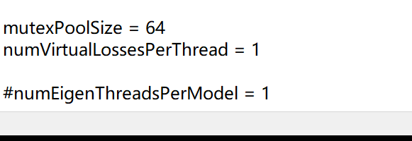
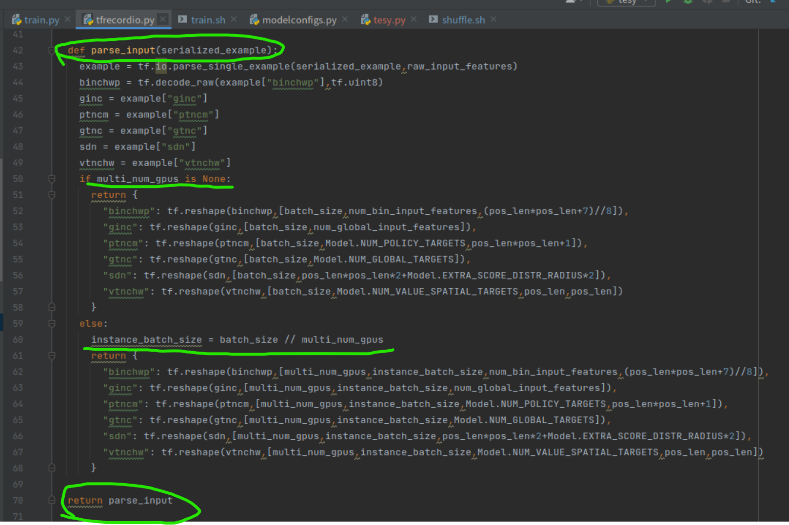

# 


在AlphaGo中，数据集还是需要从sgf数据中来，需要data和label，还要进行棋局编码

编码就是把棋局状态表示成一个个矩阵，而后来的AI中将这个过程简化在MCTS的游戏数据生成中，也就是使用MCTS自我对弈生成的数据样本数据集就是一个个包含了棋局状态信息的特征数据数据 features planes,而不再需要输入sgf，再对sgf编码，输入网络的信息就是特征数据信息，不再想传统的数据集那样分成 train-data和data-label。

输入的features planes就包含数据和label信息

**KataGo并不像AlphaZero那样只使用围棋棋盘的原始表示，而是包括一些更高层次的特征。神经网络的输入由两个张量组成，其中一个是由22个二进制空间特征组成的19x19x22张量，另一个是由14个全局浮点值组成的一维张量，表示与任何特定棋盘位置无关的游戏状态属性。**


**BETTER COMPUTER GO PLAYER WITH NEURAL NETWORK AND LONG-TERM PREDICTION**  论文


 


# 第一步-selfplay

第一步应该是去生成game数据


## 注意


**numEigenThreadsPerModel 没有就要自己添加**




**生成的npz文件最大保存rows数，每个npz不会超过25000行数据**，当然也不会说必须写满25000行才保存，可能在模拟到完成局面结束就保存了，比如正好模拟30局结束时，有5000行数据，也可能就保存为一个npz文件了，新的数据就写到新的下一个npz文件中

**一行就是一步棋，也就是一个文件能存多少步棋谱数据**


PS D:\KataGo\source_katago\build1219\Release> .\katago.exe selfplay -config selfplay1.cfg -models-dir data1 -output-dir data2  -max-games-total 50

就比如上面模拟50局游戏，如果在maxRowPerTrainFile=25000 下，一个npz文件都没法保存下所有的落子row信息，就会保存到新的一个npz文件里


 当前total_num     6218
 当前curRows     6218
 调用trainingwrite.cpp的writeGame
当前cmd---->>> TrainingWriteBuffers::writeToZipFile
2022-04-01 16:36:13+0800: Data write loop finishing for neural net: random
2022-04-01 16:36:13+0800: Final cleanup of net: /dev/null
2022-04-01 16:36:13+0800: Final NN rows: 0
2022-04-01 16:36:13+0800: Final NN batches: 0
2022-04-01 16:36:13+0800: Final NN avg batch size: -nan(ind)
2022-04-01 16:36:13+0800: GPU -1 finishing, processed 0 rows 0 batches
2022-04-01 16:36:13+0800: Data write loop cleaned up and terminating for random
2022-04-01 16:36:13+0800: All cleaned up, quitting

上面表示模拟了50局游戏，产生了6218手数据，就是6218行数据，具体每局有多少行数据是不确定的

**一手棋产生的数据信息就有：**

**['binaryInputNCHWPacked', 'globalInputNC', 'policyTargetsNCMove', 'globalTargetsNC', 'scoreDistrN', 'valueTargetsNCHW']**

**6种数据信息**


**因为开发者自己编译出的katago.exe是使用 cpu做后端，就需要这个关键字**

**官方的给的cfg中就没有这个关键字，应该是官方用的是别的后端**


**官方解释**

这是在Eigen后端评估神经网的CPU线程数。  使用Eigen的katago.exe  进行selfplay 来生成数据就要添加该关键字

它默认为numSearchThreads。


**上面就是katago.exe selfplay 自我博弈生成并保存数据为 npz格式的基本代码路径**


## Linux下


## 使用神经网络来输出训练数据

使用没有修改的源码，没法用神经网络来输出

自行修改

需要修改一些文件目录名

源码自带的modelName = "random";

你也可是把存放模型文件的目录改名为random

还有就是

"/model.bin.gz"

"/model.txt.gz";

"/model.bin";

"/model.txt";

这几个也要改，不然模型文件后缀对不上

比如用b30.bin.gz

要把model改为model

"/b30.bin.gz"

"/b30.txt.gz";

"/b30.bin";

"/b30.txt";


**selfplay.cpp可以不用改，主要是loadmodel.cpp**

**注意每次改完要重新编码出katago可执行文件**     make


./katagob60 selfplay -config selfplay2.cfg -models-dir model_dir -output-dir selfplay_data/b60 -max-games-total 5000

./katagob40 selfplay -config selfplay2.cfg -models-dir model_dir -output-dir selfplay_data/b40 -max-games-total 5000


# 大天坑

**1、要是用random随机自己输出棋谱数据，在训练时非常难提高预测准确率**

**下面是用随机游戏数据训练神经网络，看到pacc1和pacc4都特别小，都训练超一千万的数据都没打提高准确率**


**2、用神经网络去selfplay输出的数据却能快速训练高准确率的网络**


**早期就是一直按照github的readme去selfplay输出训练数据集，这个一个坑，因为作者没有说明白用神经网络来生成数据集，而源码的本意是用随机模拟的方法去生成数据集，就造成了训练时特别难提高预测准确率，除非给大量资源和时间去训练，或许就可以在随机数据集的情况下提高训练准确率。**

**而使用已有的神经网络去约束，用神经网络去模拟下棋来生成数据集，这样的数据集就能快速训练出效果，预测准确率很快就能提高了**


# 第二步-shuffled


**数据集打乱操作**


把第一步生成的数据集拷贝

注意，我是在Windows10下生成数据集，在Linux下执行shuffled打乱操作

自己新建一个文件夹，注意这个文件夹位置，因为后续很多操作需要这个文件夹


## 注意

注意，我把第一步数据集的文件夹名字改了，这是必须的，因为>>>>


**必须改，不然不对，要么就是改脚本，避免不必要的麻烦，还是该文件名**

$BASEDIR  就是哪个自己创建的testRun ，在运行脚本是要全路径


根据脚本参数需求输入运行参数

#./shuffle.sh 

/home/tiger/nvme_data/xjc_chess/gitkatago/KataGo/python/testRun   #就是自己创建的用来存放了game数据的目录

/home/tiger/nvme_data/xjc_chess/gitkatago/KataGo/python/testRun  # 临时目录

32  #  线程数

128 # batch-size

**运行状态**


数据量不足就会退出，所以在使用katago.exe  selfplay 时最后生成足够多的数据，或者在

 **./shuffle.sh** 

**/home/tiger/nvme_data/xjc_chess/gitkatago/KataGo/python/testRun /home/tiger/nvme_data/xjc_chess/gitkatago/KataGo/python/testRun** 

**32** 

**128** 

-min-rows 200  指定参数大小，默认是250000，这个参数是用来过滤数据集的，默认250000可能太小，所以要自己往大的改


表示制作一个tfrecord数据集需要最小数据量，训练结果的npz中可能会有很多rows数据，需要多少就设置参数


**正确情况下**


**正确下的目录及目录下内容**


**outtrain.txt**

**记录的是在执行shuffle.py脚本的过程信息**


**train.json**

记录数据集的采样范围，比如前面设置了采样1000000个样本，那个就会在可用范围内采样

Total rows found: 6284073 (1000000 usable)
Desired num rows: 1000000 / 6284073

根据上面两行outtrain.txt信息可以知道，总共有6284073，而本次shuffle采样其中1000000个，脚本默认是从最后往前采样

5284073~6284073正好就是1000000个样本

**{"range": [5284073, 6284073]}**


# 第三步-train


**#./train.sh **

**/home/tiger/nvme_data/xjc_chess/gitkatago/KataGo/python/testRun **  # 这个就是前面的目录

**trainruning **  # 文件名前缀，目前结果看，就是在testRun目录下创建train目录再在该目录下创建trainruning目录，训练的结果文件就存在这个目录里面

**b2c16 **

**128 **

**main**


**Shuffled data train.json file does not exist**


**不知道这个JSON是在前面的步骤中自己生成还是要自己写，先复制一个进入解决眼前的问题**


**解决：这个是因为第二步shuffled中的min_rows这个参数所导致的，解决了就没有这个问题了**

## 注意   

**train时的batch-size要与shuffle时的batch-size一致，不然报错**


**train的batch-size要和shuffle时候的一致**


**tf.estimator.Runconfig()的参数log_step_count_stpes =100 ,所以每100个step输出一次训练结果信息**

**每训练一个batch，step就加1，也就是说每训练100batch就打印一次训练log**


# 第四步-export-model

- Exporter (python - `python/export_model.py`) - scans a directory of saved models and converts from Tensorflow's format to the format that all the C++ uses, exporting to some directory.

扫描一个保存模型的目录，并从Tensorflow的格式转换为所有C++使用的格式，导出到某个目录。


就是将第三步中训练的模型文件转换为c++引擎所需要的，就是在katago.exe 引擎所能解析的网络模型文件格式

 **./export_model_for_selfplay.sh 20220304 /home/tiger/nvme_data/xjc_chess/gitkatago/KataGo/python/testRun 1**


./export_model_for_selfplay.sh     参数1：NAMEPREFIX    参数2：BASEDIR   参数3： USEGATING (0或1)

```
NAMEPREFIX="$1"  # 名字前缀
shift # 左移
BASEDIR="$1"  # 根目录
shift
USEGATING="$1"  # 是否使用 gatekeeper 1或0   use gating 使用门控
shift
```

 


# 第五步-gatekeeper


守门员

- Gatekeeper (C++ - `cpp/katago gatekeeper`) - polls a directory of newly exported models, plays games against the latest model in an accepted models directory, and if the new model passes, moves it to the accepted models directory. OPTIONAL, it is also possible to train just accepting every new model.

**守门员 (C++ - cpp/katago gatekeeper) - 轮询一个新导出模型的目录，与接受模型目录中的最新模型进行博弈，如果新模型通过，则将其移至接受模型目录中。可选的，也可以只训练接受每个新模型。**


**意思就是"强者胜出"，将最新的训练模型导出成c++下格式后，使用gatekeeper.cpp 脚本与上一个次新的网络模型进行相互对弈，以获得更强的结果，强的网络就保存，用来和下一个最新网络来对弈，打擂台决出强者**


**./katago.exe  gatekeeper**  

**-test-models-dir   #放置了对弈双方模型文件的目录**

**-sgf-output-dir  # 保存对弈的sgf文件**

**-accepted-models-dir # 保存对弈双方的强者的网络模型文件路径**

**-rejected-models-dir  # 保存对弈双方的弱者的网络模型文件路径**

**-selfplay-dir  # 保存对弈信息，当一个模型选择pass**


暂时这么理解


# 第六  训练错误记录

Building model
Traceback (most recent call last):
  File "/home/tiger/.conda/envs/katago/lib/python3.6/site-packages/tensorflow_core/python/framework/ops.py", line 1607, in _create_c_op
    c_op = c_api.TF_FinishOperation(op_desc)
**tensorflow.python.framework.errors_impl.InvalidArgumentError: Dimensions must be equal, but are 46 and 8 for 'BitwiseAnd' (op: 'BitwiseAnd') with inputapes: [?,32,22,1,46], [1,1,1,8].**

During handling of the above exception, another exception occurred:

Traceback (most recent call last):
  File "/home/tiger/nvme_data/katago/gitkatago/KataGo/python/raw_train0430.py", line 812, in <module>
    tf.estimator.export.build_raw_serving_input_receiver_fn(raw_input_feature_placeholders)
  File "/home/tiger/.conda/envs/katago/lib/python3.6/site-packages/tensorflow_estimator/python/estimator/estimator.py", line 735, in export_saved_model
    strip_default_attrs=True)
  File "/home/tiger/.conda/envs/katago/lib/python3.6/site-packages/tensorflow_estimator/python/estimator/estimator.py", line 859, in _export_all_saved_els
    strip_default_attrs=strip_default_attrs)
  File "/home/tiger/.conda/envs/katago/lib/python3.6/site-packages/tensorflow_estimator/python/estimator/estimator.py", line 932, in _add_meta_graph_foode
    config=self.config)
  File "/home/tiger/.conda/envs/katago/lib/python3.6/site-packages/tensorflow_estimator/python/estimator/estimator.py", line 1149, in _call_model_fn
    model_fn_results = self._model_fn(features=features, **kwargs)
  File "/home/tiger/nvme_data/katago/gitkatago/KataGo/python/raw_train0430.py", line 247, in model_fn
    built = ModelUtils.build_model_from_tfrecords_features(features,mode,print_model,trainlog,model_config,pos_len,batch_size,lr_scale_to_use,gnorm_clicale,num_gpus_used)
  File "/home/tiger/nvme_data/katago/gitkatago/KataGo/python/raw_model0430.py", line 1674, in build_model_from_tfrecords_features
    binchw = tf.reshape(tf.bitwise.bitwise_and(tf.expand_dims(binchwp,axis=3),bitmasks),[-1,num_bin_input_features,((pos_len*pos_len+7)//8)*8])
  File "/home/tiger/.conda/envs/katago/lib/python3.6/site-packages/tensorflow_core/python/ops/gen_bitwise_ops.py", line 92, in bitwise_and
    "BitwiseAnd", x=x, y=y, name=name)
  File "/home/tiger/.conda/envs/katago/lib/python3.6/site-packages/tensorflow_core/python/framework/op_def_library.py", line 794, in _apply_op_helper
    op_def=op_def)
  File "/home/tiger/.conda/envs/katago/lib/python3.6/site-packages/tensorflow_core/python/util/deprecation.py", line 507, in new_func
    return func(*args, **kwargs)
  File "/home/tiger/.conda/envs/katago/lib/python3.6/site-packages/tensorflow_core/python/framework/ops.py", line 3357, in create_op
    attrs, op_def, compute_device)
  File "/home/tiger/.conda/envs/katago/lib/python3.6/site-packages/tensorflow_core/python/framework/ops.py", line 3426, in _create_op_internal
    op_def=op_def)
  File "/home/tiger/.conda/envs/katago/lib/python3.6/site-packages/tensorflow_core/python/framework/ops.py", line 1770, in __init__
    control_input_ops)
  File "/home/tiger/.conda/envs/katago/lib/python3.6/site-packages/tensorflow_core/python/framework/ops.py", line 1610, in _create_c_op
    **raise ValueError(str(e))**
**ValueError: Dimensions must be equal, but are 46 and 8 for 'BitwiseAnd' (op: 'BitwiseAnd') with input shapes: [?,32,22,1,46], [1,1,1,8].**


# KataGo的使用方法

**围棋最强开源AI-KataGo在Windows系统下的编译全集教程**

[围棋最强开源AI-KataGo在Windows系统下的编译全集教程 - 知乎 (zhihu.com)](https://


BUILD_DISTRIBUTED

EIGEN3_INCLUDE_DIRS

Eigen3_DIR

NO_GIT_REVISION

CMAKE_CONFIGURATION_TYPES

CMAKE_INSTALL_PREFIX

LIB_EAY_DEBUG

LIB_EAY_RELEASE

LIBZIP_INCLUDE_DIR_ZIP

LIBZIP_INCLUDE_DIR_ZIPCONF

LIBZIP_LIBRARY

OPENSSL_APPLINK_SOURCE

SSL_EAY_DEBUG

SSL_EAY_RELEASE

ZLIB_LIBRAY_DEBUG

ZLIB_LIBRAY_RELEASE


### Linux 下查找安装包

1、locate + 包名

2、缺少某个包 error while loading shared libraries: libz[.so](https://www.jb51.cc/tag/so/).1: cannot open shared object file: No such file or directory

我们首先知道的是缺少libz[.so](https://www.jb51.cc/tag/so/).1这个库[文件](https://www.jb51.cc/tag/wenjian/)。

[解决方法](https://www.jb51.cc/tag/jiejuefangfa/)：很明显就是安装这个库所在包，可是我们怎么这知道 libz[.so](https://www.jb51.cc/tag/so/).1在哪个包呢？

使用apt-file search 查找你的库所在包

​	 使用apt-file search命令来查找某个命令或某[一个](https://www.jb51.cc/tag/yige/)库所在的包，具体[用法](https://www.jb51.cc/tag/yongfa/)如下：

​	 ~$ apt-file search libz[.so](https://www.jb51.cc/tag/so/).1

 运行命令[显示](https://www.jb51.cc/tag/xianshi/)如下：

 lib32z1: /usr/lib32/libz[.so](https://www.jb51.cc/tag/so/).1

 lib32z1: /usr/lib32/libz[.so](https://www.jb51.cc/tag/so/).1.2.3.3

 lib32z1-dev: /usr/lib32/libz[.so](https://www.jb51.cc/tag/so/)

 lsb-build-base3: /usr/lib/lsb3/libz[.so](https://www.jb51.cc/tag/so/)

 zlib1g: /lib/libz[.so](https://www.jb51.cc/tag/so/).1

 zlib1g: /lib/libz[.so](https://www.jb51.cc/tag/so/).1.2.3.3

 zlib1g-dbg: /usr/lib/debug/lib/libz[.so](https://www.jb51.cc/tag/so/).1.2.3.3

 zlib1g-dbg: /usr/lib/debug/usr/lib32/libz[.so](https://www.jb51.cc/tag/so/).1.2.3.3

 zlib1g-dev: /usr/lib/libz[.so](https://www.jb51.cc/tag/so/)


 使用apt-file search 查找你的库所在包就行了，右边的是匹配你的库，左边的是你查的库所在的包

我们会发现与libz[.so](https://www.jb51.cc/tag/so/).1相对应的是左边名字叫：lib32z1的包，所以安装这个lib32z1包即可。 sudo apt-get install lib32z1


**window10下的一些问题**


**把编译出来的zlibs.dll库放进去**


**解决：**


**解决：**


https://blog.csdn.net/LostSpeed/article/details/112417341


# 关于训练模式下的数据解析

**基于TF1.15下，TF2下的dataset接口API变了，结果不一样**





**代码测试验证：**


**1--关于 num_gpus_used 参数的结果**

**num_gpus_used =1**

<DatasetV1Adapter shapes: {binchwp: (**256**, 22, 46), ginc: (256, 19), ptncm: (256, 2, 362), gtnc: (256, 64), sdn: (256, 842), vtnchw: (256, 5, 19, 19)}, types: {binchwp: tf.uint8, ginc: tf.float32, ptncm: tf.float32, gtnc: tf.float32, sdn: tf.float32, vtnchw: tf.float32}>


**num_gpus_used  = 1  dataset的制作就会从输入的tfrecord文件中，一次取出256条样本sample做为一个批数据，**

**原来一条样本应该是 {binchwp: ( 22, 46), ginc: (19), ptncm: (2, 362), gtnc: (64), sdn: (842), vtnchw: (5, 19, 19)}**

**但现在一次多拿很多条数据，形成批量数据**


**num_gpus_used =4**    > 1

<DatasetV1Adapter shapes: {binchwp: (**4, 64**, 22, 46), ginc: (4, 64, 19), ptncm: (4, 64, 2, 362), gtnc: (4, 64, 64), sdn: (4, 64, 842), vtnchw: (4, 64, 5, 19, 19)}, types: {binchwp: tf.uint8, ginc: tf.float32, ptncm: tf.float32, gtnc: tf.float32, sdn: tf.float32, vtnchw: tf.float32}>


**而当 num_gpus_used   > 1  时，dataset又会将原来的batch分成num_gpus_used   个小的batch，每个小batch数据量就是batch-size / num_gpus_used**   


**2--dataset.prefetch(n)**

​	**num_gpus_used =1**

<DatasetV1Adapter shapes: {binchwp: (256, 22, 46), ginc: (256, 19), ptncm: (256, 2, 362), gtnc: (256, 64), sdn: (256, 842), vtnchw: (256, 5, 19, 19)}, types: {binchwp: tf.uint8, ginc: tf.float32, ptncm: tf.float32, gtnc: tf.float32, sdn: tf.float32, vtnchw: tf.float32}>

​	**num_gpus_used =4**    > 1

<DatasetV1Adapter shapes: {binchwp: (**4, 64**, 22, 46), ginc: (4, 64, 19), ptncm: (4, 64, 2, 362), gtnc: (4, 64, 64), sdn: (4, 64, 842), vtnchw: (4, 64, 5, 19, 19)}, types: {binchwp: tf.uint8, ginc: tf.float32, ptncm: tf.float32, gtnc: tf.float32, sdn: tf.float32, vtnchw: tf.float32}>

**3--dataset.unbatch()**

​	**num_gpus_used =4**    > 1

<_UnbatchDataset shapes: {binchwp: (64, 22, 46), ginc: (64, 19), ptncm: (64, 2, 362), gtnc: (64, 64), sdn: (64, 842), vtnchw: (64, 5, 19, 19)}, types: {binchwp: tf.uint8, ginc: tf.float32, ptncm: tf.float32, gtnc: tf.float32, sdn: tf.float32, vtnchw: tf.float32}>


```python
ds = { ['a', 'b', 'c'], ['a', 'b'], ['a', 'b', 'c', 'd'] }

ds.unbatch() == {'a', 'b', 'c', 'a', 'b', 'a', 'b', 'c', 'd'}
```

**if num_gpus_used > 1:**
    **dataset = dataset.unbatch()**
**dataset = dataset.unbatch()**
**print(dataset)**


**unbatch 简单理解就是给数据去一个 [ ] , 降维，将数据降维并顺序拼接**


**一个完整训练下的dataset输出**

 ./train.sh /home/tiger/nvme_data/katago/gitkatago/KataGo/python/data trainging0412 b6c96 1024 main

**batch-size等于多少，就返回多少条样本数据**

**num_gpus_used 就是对batch再做一次小的拆分**


# 在Ubuntu服务器上编译-运行katago

当然在编译前需要在设备中安装好各个所需的包和环境


## 编译


查看cuda与cudnn版本

**import torch**
**print(torch.version)**

**print(torch.version.cuda)**
**print(torch.backends.cudnn.version())**


## 


**编译成功就会多三个文件**


## 运行

**运行前需要提前把网络模型文件和对应模式下的cfg配置文件准备好**


./katago gtp -model b6.txt.gz -config default_gtp.cfg


# 神奇


python/play.py使用

用来调试用的

这里没有使用是来，因为play.py是很多是基于TF1的，后来我把网络改成TF2所以跑不起来

model.config.json要和model文件匹配，比如用b6c96，就要是b6c96的json文件，

这个文件可以自己写（前提得知道写什么），不会就去自己的训练模型中复制，比如你训练了b6c96模型，就去对应的train目录中找


**新建目录，把模型和配置文件放一起**


# trainingwrite.cpp 代码解读笔记


**因为在训练样本数据中，binaryInputNCHWPacked这个棋局特征数据的储存方式是以字节的形式存储的，所以在训练时就要把361个位置特征信息复原**


# 全局步长 global_step()


https://zhuanlan.zhihu.com/p/41548924

https://blog.csdn.net/brucewong0516/article/details/78801065?spm=1001.2101.3001.6650.9&utm_medium=distribute.pc_relevant.none-task-blog-2%7Edefault%7ECTRLIST%7ERate-9.pc_relevant_default&depth_1-utm_source=distribute.pc_relevant.none-task-blog-2%7Edefault%7ECTRLIST%7ERate-9.pc_relevant_default&utm_relevant_index=15

global_step在滑动平均、优化器、指数衰减学习率等方面都有用到，这个变量的实际意义非常好理解：代表全局步数，比如在多少步该进行什么操作，现在神经网络训练到多少轮等等，类似于一个钟表。


global_step: 个人理解就是会在一个批次内进行一次网络权重优化，那么本批次优化，global_step就加1，下一次批内优化再加1


输出：
gl before run: 0
0.10717734
gl after run: 1

gl before run: 1
0.11486983
gl after run: 2

gl before run: 2
0.123114444
gl after run: 3

gl before run: 3
0.1319508
gl after run: 4

gl before run: 4
0.14142136
gl after run: 5

gl before run: 5
0.15157166
gl after run: 6

gl before run: 6
0.16245048
gl after run: 7

gl before run: 7
0.17411011
gl after run: 8

gl before run: 8
0.1866066
gl after run: 9

gl before run: 9
0.2
gl after run: 1


**从上面结果，就是每进行一次优化，global_step加1，就相当于记录了进行了多少次优化操作，学习速率第一次训练开始变化，global_steps每次自动加1，也是学习率变化过程的记录**


AlphaGo 深度学习资料

https://www.jianshu.com/p/b3a6f8de5645


# Tensorflow-各种优化器总结与比较

https://blog.51cto.com/u_15307704/3135487


**使用动量(Momentum)的SGD**


**带有动量的SGD本质：使用指数加权平均之后的梯度代替原梯度进行参数更新。**因为每个指数加权平均后的梯度含有之前梯度的信息，动量梯度下降法因此得名。

**在实践中，动量参数 α 的一般取值为0.5、0.9、0.99，分别对应着最大速度2倍，10倍，100倍于SGD算法。**

动量的超参数视为

![[公式]](https://www.zhihu.com/equation?tex=%5Cfrac%7B1%7D%7B1-%5Calpha%7D)

**带有动量的SGD优点：**

（1）可以通过局部极小点；

（2）加快收敛速度；

（3）抑制梯度下降时上下震荡的情况。

# katago--model.py解析

## 1-class Model


## 2-class Target_vars

\# 目标变量

## 3-class Metrics

\# 性能指标

## 4-class ModelUtils

工具函数


# 单机多卡分布式训练

gpus = tf.config.experimental.list_physical_devices(device_type='GPU')

tf.config.experimental.set_visible_devices(devices=gpus[0], device_type='GPU')

Python代码中设置环境变量，指定GPU

import os
os.environ["CUDA_VISIBLE_DEVICES"] = "2"  # 多卡的第3个


### 单机多卡示意图


从输入到损失不必多说，最后compute_gradients,再apply_grandients.一般1.x版本的书上或者教程上都是用的二者合并的接口optimizer.minimize(total_loss)。但是单机多卡的时候得拆开用，下面是单机多卡、模型并行的示意图(假设是3块gpu)：


**总结来说就是：每块gpu上都有个同样的模型net，他们权重变量共享，在图中表示为(var0,var1,...,varn)，tf在每块gpu上各自求gradients，然后对每块gpu上的每个var的gradients求和求平均，最后apply_gradients.**


# TensorFlow模型的保存与加载

# 1-checkpoint模式

目前来看，Tensorflow的模型保存方式按照生成的主要文件的格式基本可以分为三种：（1）***checkpoint模式***；（2） ***pb模式***；（3）***saved_model模式***。


**checkpoint模式**是最常见的一种保存方式，其特点是**将网络结构和变量数据分开保存**，该方式保存的模型基本**只能使用TensorFlow来重载**


**保存好的模型的文件结构如下：**

|--checkpoint_dir
|    |--checkpoint
|    |--test-model-550.meta
|    |--test-model-550.data-00000-of-00001
|    |--test-model-550.index


checkpoint_dir就是保存时我们指定的路径，该路径下会生成4个文件**（文件中的550是指该模型训练了550个step）**。

**其中.meta文件（本质是pb格式文件）用来保存模型的网络结构**；

**.data和.index文件用来保存模型中的各种变量。**


尽可能多地保存模型能帮助我们不错过效果最好的模型，但是实际操作也要考虑内存大小和运行效率。

工程师的通用做法是每训练多少步后就在验证集上计算一次准确率，如果本次结果比上次好则保存新的模型。

最常见的做法是直接每训练多少步就直接保存一次模型，实际上TensorFlow的API也提供了在模型文件名提供添加训练step后缀的方式。


**注意，其中checkpoint是文本文件，在训练过程中多次保存模型时只要保存路径不变，该文件将只有一份**


## 一、保存模型

### **1、创建Saver对象**

​			**saver = tf.train.Saver(max_to_keep=3)**

在创建这个Saver对象的时候，经常会用到max_to_keep 参数来设置保存模型的个数，默认max_to_keep=5，即保存最新的5个模型。

max_to_keep是指本次训练在checkpoint_dir这个路径下最多保存多少个模型文件，新模型会覆盖旧模型以节省空间。


如果想每训练一代（epoch)就想保存一次模型，则可以将 max_to_keep设置为None或者0，但是这样做除了多占用硬盘，并没有实际多大的用处，不推荐设置。


### **2、检查保存路径**

保存模型必然需要**先检查下保存路径是否存在**，一段可以检查Python路径的代码如下：

ckpt_file_path = "./model/"
path = os.path.abspath(ckpt_file_path)
if os.path.exists(path) is False:
    os.makedirs(path)

保存路径中及其所在的绝对路径中**最好不要有中文路径**，容易出错

### **3、生成模型文件**

sess = tf.Session() # 创建tf会话
tf.train.Saver().save(sess, ckpt_file_path,global_step=step,write_meta_graph=True)


其中第1个参数是创建的tf会话，tf会话中加载有计算图graph对象，可以通过此获取当前要保存的计算图模型；

第2个参数是模型保存的文件路径及其文件名；

第3个参数是训练的次数，该API会自动将训练的次数作为后缀加入到模型名字中；

第4个参数是是否生成.meta文件，该文件包含了模型的网络结构。


**该API正常执行后程序会生成并保存如下4类文件:**


## 二、加载模型

### 1、加载模型结构

加载模型结构有两种方式：1. 加载.meta文件中的结构， 2. 手动重新写一遍原样结构。

第2种方式适合在有[源码](https://so.csdn.net/so/search?q=源码&spm=1001.2101.3001.7020)的情况下进行生成，第1种方式则是在没有源码的情况下生成的，其主要是加载**.meta**文件


**saver = tf.train.import_meta_graph('./model/dog-cat.ckpt-9975.meta')# 加载模型结构**


### 2、加载模型参数

加载模型参数就是加载模型的变量，主要方法是用***\*saver.restore()\****方法恢复变量：

#加载网络模型

sess = tf.Session() # 创建tf会话

saver.restore(sess, './model/dog-cat.ckpt-9975')# 指定特定模型

saver.restore(sess, tf.train.latest_checkpoint('./model/'))# 使用最新模型
sess.run(tf.global_variables_initializer()) # 重新初始化模型变量

该API中第1个参数是创建的tf会话，加载的模型将会保存到该会话中；

第2个参数是模型保存的路径，**不需要提供模型的名字**。


### 3、获取Tensor变量

在上述获得模型结构及其参数后，就可以使用该模型了，现在模型已经被加载到sess中，我们可以获取此时对应的计算图，通过图获取其中的Tensor变量，注意这里获取的Tensor变量名必须在保存时有定义。

graph = tf.get_default_graph() # 获取计算图
self.x = graph.get_tensor_by_name("x:0")
self.y_true = graph.get_tensor_by_name("y_true:0")
self.y_pred = graph.get_tensor_by_name("y_pred:0")

**其中x是节点名称，x:0是表述节点的输出的第一个张量**


# TFrecord数据文件


关于tensorflow读取数据，官网给出了三种方法：
1、供给数据：在tensorflow程序运行的每一步，让python代码来供给数据
2、从文件读取数据：建立输入管线从文件中读取数据
3、预加载数据：如果数据量不太大，可以在程序中定义常量或者变量来保存所有的数据。


**一种比较通用、高效的数据读取方法，就是tensorflow官方推荐的标准格式：tfrecord。**


tfrecord数据文件是一种将图像数据和标签统一存储的二进制文件，能更好的利用内存，在tensorflow中快速的复制，移动，读取，存储等。
tfrecord文件包含了tf.train.Example 协议缓冲区(protocol buffer，协议缓冲区包含了特征 Features)。你可以写一段代码获取你的数据， 将数据填入到Example协议缓冲区(protocol buffer)，将协议缓冲区序列化为一个字符串， 并且通过tf.python_io.TFRecordWriter class写入到TFRecords文件。tensorflow/g3doc/how_tos/reading_data/convert_to_records.py就是这样的一个例子。


[(55条消息) tensorflow读取数据-tfrecord格式_AcceptedLin的博客-CSDN博客_tensorflow 读取tfrecord](https://blog.csdn.net/u013185349/article/details/87072465)

## 1-将数据保存为tfrecord格式


## 2-读取tfrecord数据


# 滑动平均处理

[理解滑动平均(exponential moving average) - wuliytTaotao - 博客园 (cnblogs.com)](https://www.cnblogs.com/wuliytTaotao/p/9479958.html)


# Stochastic Weight Averaging(SWA)

**SWA是使用修正后的学习率策略对SGD(或任何随机优化器)遍历的权重进行平均，从而可以得到更好的收敛效果。**


随机梯度下降(SGD)在测试集上，趋向于收敛至损失相对低的地方，但却很难收敛至最低点，如上述**左图**中，经过几个epoch的训练，得到了W1,W2,W3三个权重，但无法收敛至最低点。如果使用SWA可以将三个权重加权平均，从而可能收敛至相对SGD更小的损失。


**从上面图中，可以发现，SGD在训练集收敛得比较好，但是在测试集效果并不如SWA。而SWA虽然在训练集收敛得不如SGD，但是在测试集上表现得更加好**

下面得这张曲线图也可以看出两者的差异。


**SWA大致的使用流程**


先使用恒定学习率进行训练，接着线性衰减学习率，最后在恒定学习率上，累加它们的权重（SWA）。在使用SWA之前，可以配合任意的优化器使用，如SGD、Adam等，直到训练到一定周期，开始记录训练的权重，当训练完成后，再将记录的权重进行加权平均。注意：在训练的过程中是不进行预测的


**Asymmetric**
MCTS 执行一种非对称的树的适应搜索空间拓扑结构的增长。这个算法会更频繁地访问更加有趣的节点，并聚焦其搜索时间在更加相关的树的部分。


非对称的增长
 这使得 MCTS 更加适合那些有着更大的分支因子的博弈游戏，比如说 19X19 的围棋。这么大的组合空间会给标准的基于深度或者宽度的搜索方法带来问题，所以 MCTS 的适应性说明它（最终）可以找到那些更加优化的行动，并将搜索的工作聚焦在这些部分。


**AlphaGo = Human Data + Supervised Learning + Policy Gradient + Self-play + MCTS + Async**


# CNN和Move Prediction

之前我们说了MCTS回避了局面估值的问题，但是人类下围棋显然不是这样的，所以真正要下好围棋，如此从模仿人类的角度来说，这个问题是绕不过去的。人类是怎么学习出不同局面的细微区别的呢？当然不能由人来提取特征或者需要人来编写估值函数，否则还是回到之前的老路上了。我们的机器能自动学习而不需要领域的专家手工编写特征或者规则来实现估值函数呢？

眼下最火热的深度学习也许可以给我们一条路径（当然可能还有其它路径，但深度学习目前看起来解决feature的自动学习是最promising的方法之一）。

## 深度学习和CNN简介

在机器学习流行之前，都是基于规则的系统，因此做语音的需要了解语音学，做NLP的需要很多语言学知识，做深蓝需要很多国际象棋大师。

而到后来统计方法成为主流之后，领域知识就不再那么重要，但是我们还是需要一些领域知识或者经验来提取合适的feature，feature的好坏往往决定了机器学习算法的成败。对于NLP来说，feature还相对比较好提取，因为语言本身就是高度的抽象；而对于Speech或者Image来说，我们人类自己也很难描述我们是怎么提取feature的。比如我们识别一只猫，我们隐隐约约觉得猫有两个眼睛一个鼻子有个长尾巴，而且它们之间有一定的空间约束关系，比如两种眼睛到鼻子的距离可能差不多。但怎么用像素来定义”眼睛“呢？如果仔细想一下就会发现很难。当然我们有很多特征提取的方法，比如提取边缘轮廓等等。

但是人类学习似乎不需要这么复杂，我们只要给几张猫的照片给人看，他就能学习到什么是猫。人似乎能自动”学习“出feature来，你给他看了几张猫的照片，然后问题猫有什么特征，他可能会隐隐预约的告诉你猫有什么特征，甚至是猫特有的特征，这些特征豹子或者老虎没有。

深度学习为什么最近这么火，其中一个重要的原因就是不需要（太多）提取feature。

从机器学习的使用者来说，我们以前做的大部分事情是feature engineering，然后调一些参数，一般是为了防止过拟合。而有了深度学习之后，如果我们不需要实现一个CNN或者LSTM，那么我们似乎什么也不用干。


###### Deep Neural Network能自动学习出层次化的feature

CNN最早是Yann Lecun提出用来解决图像识别的问题的一种深度神经网络。由Yann LeCun提出，通过卷积来发现位置无关的feature，而且这些feature的参数是相同的，从而与全连接的神经网络相比大大减少了参数的数量。


**CNN深度神经网络**

因此CNN非常适合围棋这种feature很难提取问题，比如图像识别。用CNN来尝试围棋的局面评估似乎也是很自然的想法。

## Move Prediction using CNN

之前也分析过了，围棋搜索如果不到游戏结束，深的局面并不比浅的容易评估，所以我们不需要展开搜索树，而可以直接评估一个局面下不同走法的好坏。这样做的好处是很容易获得训练数据。我们有大量人类围棋高手的对局（海量中等水平的对局），每一个局面下“好”的走法直接就能够从高手对局库里得到，认为他们的对局都是“好”的走法。但是要得到一个局面的“绝对”得分却很难，因为我们只知道一盘对局最终的结果。一盘游戏最终的胜负可能是因为布局就下得很好，也可能是因为最后的官子阶段下得好，中间具体某个局面的好坏是很难判断的（当然强化学习试图解决这个问题，但是还是很难的，下面在讨论AlphaGo的时候会有涉及）。对于一个局面，如果能知道这个局面下最好的走法（或者几个走法），那么我们对弈时就直接选择这个走法（当然这个最好的走法可能得分也很差，比如败局已定的情况下怎么走都是输）。

所以大部分研究都是用CNN来预测一个局面下最好的走法。【预测走法比估值一个局面容易，如果我们能够准确估值局面，那么最佳走法就是从走之后的局面中选择对自己最有利的走法。或者用我们做问答系统常用的比喻，预测走法是搜索引擎，局面评估是问答系统。搜索引擎只要把好的排前面就行了（甚至不一定要求排在第一，排在第一页也就差不多了），而问答不仅要把好的排前面，而且还要知道这个最“好”的结果是否足够“好”，因为排序的好是相对“好”，问答的好必须是绝对的“好”，是唯一正确答案】。

### Van Der Werf等（2003）

最早用CNN（当然还有用其它机器学习方法）来预测走法是2003年Van Der Werf等人的工作，他们用了很多手工构造的feature和预处理方法，他们取得了25%的预测准确率。没有细看论文，在2006年Deep Learning火之前，所以估计网络的层次很浅。

### Sutskever & Nair（2008）

之后在2008年，这个时候Deep的神经网络已经逐渐流行了。Sutskever & Nair用来2层的CNN，第一层有15个7*7的filter，第二层用了5*5的filter，最后用了一个softmax层，输出19*19，表示每个可能走法的概率（当然需要后处理去掉不合法或者不合理的走法，比如违反棋规的打劫局面立即提回，或者在自己的眼里下棋）。他们得到了34%的预测准确率。不过有一点问题就是他们出来使用当前局面，还用了上一步走法（这个走子导致了当前局面，也就是对手的上一步走子），这个可能是有问题的，因为实际对局时对手的水平是不能确定的，用这个feature当然能提高“数字”上的准确率，但是对于下棋水平是否有负面影响是很难说的。

### Clark & Storkey（2015）

到了2015年，计算机的计算能力更强，深度神经网络的层次也越来越深，在围棋领域也能看到这种趋势。Clark & Storkey使用了8层的CNN，用的特征包括最原始的棋子（用了3个feature plane，表示361个点是黑棋/白棋/空白），ko（劫）的约束，一个group（块）的气。包括使用很多trick来保证symmetries（因为围棋的局面旋转90/180/270/360度后以及做180度的镜像之后应该是一样的）。他们在GoGoD数据上的预测准确率达到了41.1%，在KGS数据上的准确率达到44.4%。GoGoD上大部分是职业选手的对局，而KGS数据有很多业余高手的对局。

### Maddison等（2015）

光是预测准确率，并不能说明下棋的水平。因此Maddison等人的工作把Move Prediction用到了实际的对弈当中。

他们的CNN增加到了12层，feature也有所增加，下面是他们使用的feature。


- 第一组feature是棋子（Stone）的颜色，和之前一样。
- 第二组是棋子（所在group）的气，用4个plane来表示，分别是1，2，3 >=4口气。
- 第三组是走了这步棋之后的气，用了6个plane，代表1，2，3，4，5，>=6口气。
- 第四组表示这个走法在当前局面是否合法。
- 第五组表示这个棋子距离当前局面的轮次，比如上一步对手走的就是1，上上一步自己走的就是2。因为围棋很多都是局部的战役，所以这个feature应该是有用的。
- 第六组就是表示走这这后能吃对方多少个棋子。
- 第七组表示走这能否征子成功。
- 第八组feature比较有趣，按照作者的说法就是因为KGS的对弈水平参差不齐，如果只留下高手的对局数据太少，所以用这个feature。

他们在KGS数据上的预测准确率达到55%。相对于Clark等人的工作，Maddison的工作除了增加了CNN的层次（8到12），增加的feature应该是很有帮助的，比如Turns Since，Capture Size和Ladder Move。尤其是Ladder Move，下过围棋的都知道征子能否成功对应是否要走这步棋已经局部的计算非常重要。

根据他们的使用，人类6d的预测准确率也只有52%，所以从预测走法的角度来说，CNN的水平已经达到了6d的水平。

另外他们还做了实验，证明Clark那些用来保证symmetry的tricky并没有什么卵用，直接简单粗暴的把数据做symmetric变换后训练就行了。

完全不用搜索直接用Move Prediction的结果下棋，能97%的比率战胜GnuGo（这个是完全基于alpha-beta搜索的），作者并没有说明只用Move Prediction的绝对水平，而只是和很差的GnuGo比较，所以应该水平不怎么样。

加上MCTS之后他们的水平能达到主流MCTS的开源软件如Pachi何Fuego的水平。当然CNN的预测相对于Simulation来说是很慢的，他们的GPU（4个GeForce GTX Titan Black）评估128个局面需要0.15s，而CPU（16 Intel Xeon E52643 v2 3.5GHz）每秒可以simulation 47,000个局面。所以他们使用了异步的策略，先用先验知识给出一个节点的N(v),Q(v)，先搜索着，等GPU运算完了再用CNN预测的胜率更新这些统计量。因此CPU和GPU的速度需要能大致匹配。

### Yuandong Tian & Yan Zhu（2015）

和Google DeepMind进行围棋竞赛的主要就是Facebook Tian yuandong他们了。在Google宣布文章在Nature发表的前一天，他们在arxiv上发表了自己的[工作](https://www.zhihu.com/topic/20038840)。

下面我们来看看他们的工作（《Better Computer Go Player with Neural Network and Long-Term Prediction》）。

使用的feature：


除了使用之前工作的标准feature之外，他们增加了一些feature，比如是否边界，距离中心的远近，是否靠近自己与对手的领土（不清楚怎么定义领土的归属的）。此外对于之前的feature也进行了压缩，之前都把特征分成黑棋或者白棋，现在直接变成己方和对手，这样把模型从两个变成了一个（之前需要给黑棋和白棋分别训练一个模型）。此外的一个不同地方就是类似于Multi-task的learning，同时预测未来3步棋的走法（而不是1步棋走法）。 


为了与Maddison的工作比较，这里只用了标准的features，比较的也是未来1步棋的准确率，可以发现这个方法还是有效的（不过我个人觉得作者应该自己复现Maddison的结果而不是直接用他的结果）

只使用DCNN的围棋软件（不用MCTS搜索）

1. darkforest: 标准的feature，一步的预测，使用KGS数据
2. darkforest1：扩展的feature，三步预测，使用GoGoD数据
3. darkforest2：基于darkforest1，fine-tuning了一下参数。

把它们放到KGS上比赛，darkforest能到1k-1d的水平，darkforest1能到2d的水平，darkforest2能到3d的水平【注：KGS的3d应该到不了实际的业余3段】，下面是具体的情况。

因此作者认为加入3步预测的训练是有效的。

#### MCTS+DCNN

Tree Policy: 走法首先通过DCNN排序，然后按顺序选择，除非累计的概率超过0.8或者超过一定次数的top走法。Expansion使用的UCT算法。

Default Policy:参考的Pachi的tree policy，有3*3的pattern，对手打吃的点（opponent atari point），点眼的检测（detection of nakade points）等。

这个版本的软件叫darkforest3，在KGS上能到5d的水平。

#### 弱点

- DCNN预测的top3/5的走法可能不包含局部战役的一个关键点，所以它的局部作战能力还比较弱。
- 对于一些打劫点即使没用，DCNN还是会给高分。
- 当局面不好的情况下，它会越走越差（这是MCTS的弱点，因为没有好的走法，模拟出来都是输棋，一些比较顽强的抵抗的走法不能走出来）。

从上面的分析可以看出：DCNN给出的走法大局观还是不错的，这正是传统的方法很难解决的问题。局部的作战更多靠计算，MCTS会有帮助。但是我个人觉得MCTS搜索到结束，没有必要。一个局部的计算也许可以用传统的alpha-beta搜索来解决，比如征子的计算，要看6线有没有对手的棋子，另外即使有对手的棋子，也要看位置的高低，这样的计算DCNN是没法解决的，需要靠计算。

# AlphaGo

终于轮到主角上阵了，您可能不耐烦了。不过有了前面的基础，理解AlphaGo就容易多了，这里我们主要分析AlphaGo的创新点。

## Policy Network & Value Network


上图是AlphaGo所使用的两个网络以及训练过程。和之前的工作比，除了Policy Network之外，AlphaGo多了一个Value Network。

Policy Network我们通过之前的介绍以及了解到了，它的作用是Tree Policy时候的Node Selection。（rollout阶段不能使用Policy Network，因为DCNN的计算速度相对于Simulation来说太慢，所以AlphaGo又训练了一个简单的Rollout Policy，它基于一些local的pattern之类的feature训练了一个线性的softmax）。

那么Value Network又是做什么用的呢？这个Value Network就是我们之前说的很多工作都“回避”的问题——给一个局面打分，就是之前在象棋和minimax部分讨论的局面的估值函数，只不过AlphaGo是使用深度强化学习(deep reinforcment learning)学习出来，而不是像Deep Blue或者其它象棋程序那样是人工提取的feature甚至手工调整权重（当然Deep Blue是很多年前的工作了，现在也有用深度强化学习来搞国际象棋的，比如这篇论文《Giraffe: Using Deep Reinforcement Learning to Play Chess》）。

前面在讨论Tian等人的工作时我们也分析过了，光用Move Prediction的软件大局观还不错，但是局部的战术就比较差，因为局部的战术更多靠计算，人类也是这样。围棋由于估值函数比较困难，所以大都是用MCTS搜索到游戏结束。但是MCTS如果盲目搜索（使用随机的default policy去rollout/playout）肯定不好，使用各种领域知识来缩小rollout的范围就非常重要。前面我们也看到，传统的MCTS只能到2d的水平，而用DCNN的tree policy的MCTS就能到5d的水平（如果default policy如果能用DCNN指导肯定更好，可惜DCNN的速度太慢）。

## SL Policy Network & Rollout Policy的训练

这个和之前介绍的差不了太多。AlphaGo相比之前多了Rollout Policy，之前的Rollout Policy大多是使用手工编制的pattern，而AlphaGo用训练Policy Network相同的数据训练了一个简单的模型来做Rollout。

训练数据来自3千万的KGS的数据，使用了13层的CNN，预测准确率是57%，这和之前Tian等人的工作是差不多的。

## RL Policy Network & Value Network的训练

之前训练的SL Policy Network优化的目标是预测走法，作者认为人类的走法会在很多promising的走法里选择，这不一定能提高AlphaGo的下棋水平。为什么？文中没有解释，我个人认为可能是一个局面（尤其是优势）的情况下有很多走法，有保守一点但是保证能赢一点点的走法，也有激进但需要算度准确的但能赢很多的走法。这取决于个人的能力（比如官子能力怎么样）和当时的情况（包括时间是否宽裕等等）。

所以AlphaGo使用强化学习通过自己跟自己对弈来调整参数学习更适合自己的Policy。


具体的做法是当前版本跟之前的某一个版本（把之前所有版本都保留和不是用最近的一个可以避免overfitting）对弈，对弈的走法是根据Policy Network来选择的，然后根据结果调整参数。这个公式用自然语言来描述就是最终得分z_t(获胜或者失败)，在t时刻局面是s_t我选择了走法a_t，P(a_t|s_t)表示局面s_t时选择走法a_t的概率，就像神经网络的反向传播算法一样，损失z_t(或者收益)是要由这个走法来负责的。我们调整参数的目的就是让这个概率变小。再通俗一点说就是，比如第一步我们的模型说必须走马(概率是1)，那么如果最终输棋，我们复盘时可能会觉得下次走马的概率应该少一点，所以我们调整参数让走马的概率小一点（就是这个梯度）。

RL Policy Network的初始参数就是SL Policy Network的参数。最后学到的RL Policy Network与SL Policy Network对弈，胜率超过80%。

另外RL Policy Network与开源的Pachi对弈（这个能到2d也就是业余两段的水平），Pachi每步做100,000次Simulation，RL Policy Network的胜率超过85%，这说明不用搜索只用Move Prediction能超过2d的水平。这和Tian等人的工作的结论是一致的，他们的darkforest2也只用Move Prediction在KGS上也能到3d的水平。

## Value Network的强化学习训练


一个局面在policy p下的估值公式。用通俗的话说就是：在t时刻的局面是s，然后我们用p来下棋直到游戏结束，我们重复很多次，然后求平均的得分。当然，最理想的情况是我们能知道双方都是最优策略下的得分，可惜我们并不知道，所以只能用我们之前学到的SL Policy Network或者RL Policy Network来估计一个局面的得分，然后训练一个Value Network V(s)。前面我们也讨论过了，RL Policy Network胜率更高，而我们学出来的Value Network是用于rollout阶段作为先验概率的，所以AlphaGo使用了RL Policy Network的局面评估来训练V(s)。

V(s)的输入时一个局面，输出是一个局面的好坏得分，这是一个回归问题。AlphaGo使用了和Policy Network相同的参数，不过输出是一个值而不是361个值（用softmax归一化成概率）。


上面的公式说明：V(s)的参数theta就是简单的用梯度下降来训练

不过用一盘对局的所有(s,v(s))训练是有问题的，因为同一盘对局的相邻的局面是非常相关的，相邻的局面只差一个棋子，所有非常容易overfitting，导致模型“记住”了局面而不是学习到重要的feature。作者用这样的数据训练了一个模型，在训练数据上的MSE只有0.19，而在测试数据上是0.37，这明显overfitting了。为了解决这个问题，作者用RL Policy Network自己跟自己对局了3千万次，然后每个对局随机选择一个局面，这样得到的模型在训练数据和测试数据上的MSE是0.226和0.234，从而解决了overfitting的问题。

## MCTS + Policy & Value Networks

上面花了大力气训练了SL Policy Network,Rollout Policy和Value Network，那么怎么把它们融合到MCTS中呢？

一次MCTS的Simulation可以用上图来说明，下文加黑的地方是这三个模型被用到的地方。

首先每个节点表示一个局面，每一条边表示局面+一个合法的走法(s,a)。每条边保存Q(s,a)，表示MCTS当前累计的reward，N(s,a)表示这条边的访问次数，P(s,a)表示先验概率。

## Selection

每次Simulation使用如下的公式从根节点开始一直选择边直到叶子节点（也就是这条边对于的局面还没有expand）。


Q(s_t,a)就是exploit term，而u(s_t,a)就是explore term，而且是于先验概率P(s,a)相关的，优先探索SL Policy Network认为好的走法。

### Evaluation

对于叶子节点，AlphaGo不仅仅使用Rollout(使用Rollout Policy)计算得分，而且也使用Value Network打分，最终把两个分数融合起来：


### Backup


n次Simulation之后更新统计量（从而影响Selection），为什么是n次，这涉及到多线程并行搜索以及运行与GPU的Policy Network与Value Network与CPU主搜索线程通信的问题

### Expansion

一个边的访问次数超过一定阈值后展开这个边对应的下一个局面。阈值会动态调整以是的CPU和GPU的速度能匹配，具体下一节我们讨论AlphaGo的实现细节再说明

## AlphaGo的水平


a图是用分布式的AlphaGo，单机版的AlphaGo，CrazyStone等主流围棋软件进行比赛，然后使用的是Elo Rating的打分。

作者认为AlphaGo的水平超过了FanHui（2p)，因此AlphaGo的水平应该达到了2p（不过很多人认为目前Fanhui的水平可能到不了2p）。

b图说明了Policy Network Value Network和Rollout的作用，做了一些实验，去掉一些的情况下棋力的变化，结论当然是三个都很重要。

c图说明了搜索线程数以及分布式搜索对棋力的提升，这些细节我们会在下一节再讨论，包括AlphaGO的架构能不能再scalable到更多机器的集群从而提升棋力。

## AlphaGo的真实棋力

因为3月份AlphaGo要挑战李世石，所以大家都很关心AlphaGo到底到了什么水平。当然它的真实水平只有作者才能知道，我这里都是根据一些新闻的推测。而且从文章提交Nature审稿到3月份比赛还有一段不短的时间，AlphaGo能不能还有提高也是非常关键。这里我只是推测一下在文章提交Nature时候AlphaGo的棋力。至于AlphaGo棋力能否提高，我们下一节分析实现细节时再讨论（假设整体架构不变，系统能不能通过增加机器来提高棋力）。

网上很多文章试图通过AlphaGo与fanhui的对局来估计AlphaGo的棋力，我本人不敢发表意见。我只是搜索了一些相关的资料，主要是在弈城上一个叫DeepMind的账号的对局信息来分析的。

比如这篇《[金灿佑分析deepmind棋谱认为99%与谷歌团队相关](http://www.eweiqi.com/news_detail.asp?id=22624)》。作者认为这个账号就是AlphaGo。如果猜测正确的话，AlphaGo当时的棋力在弈城8d-9d直接，换成我们常用的ranking system的话大概也就是6d-7d（业余6段到7段）的水平，如果发挥得好，最多也许能到1p的水平，战胜fanhui也有一定合理性（很多人认为fanhui目前实际水平可能已经没有2p了，那算1p的话也差不多）。

知乎上也有[很多讨论](https://www.zhihu.com/topic/20038840)，以及这篇《[陈经：谷歌围棋算法存在缺陷](http://sports.sina.cn/others/qipai/2016-02-01/detail-ifxnzanm3922928.d.html)》，都可以参考。

## AlphaGo的实现细节

### Search Algorithm

和之前类似，搜索树的每个状态是s，它包含了所有合法走法(s,a)，每条边包含如下的一些统计量：


P(s,a)是局面s下走a的先验概率。Wv(s,a)是simulation时value network的打分，Wr(s,a)是simulation时rollout的打分。Nv(s,a)和Nr(s,a)分别是simulation时value network和rollout经过边(s,a)的次数。Q(s,a)是最终融合了value network打分和rollout打分的最终得分。

rollout会模拟一个节点多次这比较好理解。为什么value network会给同一个节点打分多次呢？而且对于一个DCNN来说，给定一个固定的输入(s,a) P(a|s)不应该是相同的值吗，计算多次有什么意义吗？

我刚开始看了半天也没明白，后来看到Symmetries那部分才明白。原来AlphaGo没有像之前的工作那样除了对称的问题，对于APV-MCTS（Asynchronous Policy and Value MCTS)算法，每次经过一个需要rollout的(s,a)时，会随机的选择8个对称方向中的一个，然后计算p(a|s)，因此需要平均这些value。计算Policy Network的机器会缓存这些值，所以Nv(s,a)应该小于等于8。


还是这个图。

### Selection(图a)

从根节点开始使用下面的公式选择a直到叶子节点。


Q(s,a)初始值为0，后面Backup部分会讲怎么更新Q(s,a)。

现在我们先看这个公式，第一部分Q(s,a)是exploit term，第二部分是explore term。这个公式开始会同时考虑value高的和探索次数少的走法，但随着N(s,a)的增加而更倾向于value高的走法。

### Evaluation(图c)

叶子节点sL被加到一个队列中等到value network计算得分（异步的），然后从sL开始使用rollout policy模拟对局到游戏结束。

### Backup(图d)

在Simulation开始之前，把从根一直到sL的所有的(s,a)增加virtual loss，这样可以防止（准确的说应该是尽量不要，原文用的词语是discourage，当然如果其它走法也都有线程在模拟，那也是可以的）其它搜索线程探索相同的路径。


上面的给(s,a)增加virtual 的loss，那么根据上面选择的公式，就不太会选中它了。

当模拟结束了，需要把这个virtual loss去掉，同时加上这次Simulation的得分。


此外，当GPU算完value的得分后也要更新：


最终算出Q(s,a):


### Expansion(图b)

当一条边(s,a)的访问次数Nr(s,a)【提个小问题，为什么是Nr(s,a)而不是Nv(s,a)？】超过一个阈值Nthr时会把这条边的局面（其实就是走一下这个走法）s’=f(s,a)加到搜索树里。

初始化统计量：Nv(s’,a)=0, Nr(s’,a)=0, Wv(s’,a)=0, Wr(s’,a)=0, P(s’,a)=P(a|s’)

由于计算P(a|s’)需要在GPU中利用SL Policy Network计算，比较慢，所以先给它一个place-holder的值，等到GPU那边算完了再更新。

这个place-holder的值使用和rollout policy类似的一个tree policy计算出来的（用的模型了rollout policy一样，不过特征稍微丰富一些，后面会在表格中看到），在GPU算出真的P(a|s’)之前的selection都是先用这个place-holder值，所以也不能估计的太差。因此AlphaGO用了一个比rollout feature多一些的模型。

Expansion的阈值Nthr会动态调整，目的是使得计算Policy Network的GPU能够跟上CPU的速度。

### Distributed APV-MCTS算法

一台Master机器执行主搜索（搜索树的部分），一个CPU集群进行rollout的异步计算，一个GPU集群进行Policy和Value Network的异步计算。

整个搜索树都存在Master上，它只负责Selection和Place-Holder先验的计算以及各种统计量的更新。叶子节点发到CPU集群进行rollout计算，发到GPU集群进行Policy和Value Network的计算。

最终，AlphaGo选择访问次数最多的走法而不是得分最高的，因为后者对野点(outlier)比较敏感。走完一步之后，之前搜索过的这部分的子树的统计量直接用到下一轮的搜索中，不属于这步走法的子树直接扔掉。另外AlphaGo也实现了Ponder，也就是对手在思考的时候它也进行思考。它思考选择的走法是比较“可疑”的点——最大访问次数不是最高得分的走法。AlphaGo的时间控制会把思考时间尽量留在中局，此外AlphaGo也会投降——当它发现赢的概率低于10%，也就是 MAXaQ(s,a) < -0.8。

AlphaGo并没有想常见的围棋那样使用AMAF或者RAVE启发，因为这些策略并没有什么用处，此外也没有使用开局库，动态贴目(dynamic komi)等。

### Rollout Policy

使用了两大类pattern，一种是response的pattern，也就是上一步走法附近的pattern（一般围棋很多走法都是为了“应付”对手的走子）；另一种就是非response的pattern，也就是将要走的那个走法附近的pattern。具体使用的特征见下表。Rollout Policy比较简单，每个CPU线程每秒可以从空的局面（开局）模拟1000个对局。


横线之上的feature用来rollout，所有的feature用来计算place-holder先验概率。

### Symmetries

前面在讲Search Algorithm讲过了。

### SL Policy Network

SL Policy Network使用了29.4 million局面来训练，这些局面来自KGS 6d-9d 的16万个对局。使用了前1million用来测试，后面的28.4million用来训练。此外进行了旋转和镜像，把一个局面变成8个局面。使用随机梯度下降算法训练，训练的mini-batch大小是16。使用了50个GPU的DistBelief（并没有使用最新的Tensorflow），花了3周的时间来训练了340million次训练步骤（每个mini-batch算一个步骤？）

### RL Policy Network

每次用并行的进行n个游戏，使用当前版本(参数)的Policy Network和之前的某一个版本的Policy Network。当前版本的初始值来自SL Policy Network。然后用 Policy Gradient来更新参数，这算一次迭代，经过500次迭代之后，就认为得到一个新的版本把它加到Pool里用来和当前版本对弈。使用这种方法训练，使用50个GPU，n=128，10,000次对弈，一天可以训练完成RL Policy Network。

### Value Network

前面说了，训练的关键是要自己模拟对弈然后随机选择局面而不是直接使用KGS的对局库来避免overfitting。

AlphaGo生成了3千万局面，也就是3千万次模拟对弈，模拟的方法如下：

- 随机选择一个time-step U~unif{1,450}
- 根据SL Policy Network走1，2，… , U-1步棋
- 然后第U步棋从合法的走法中随机选择
- 然后用RL Policy Network模拟对弈到游戏结束


被作为一个训练数据加到训练集合里。

这个数据是


的一个无偏估计。

最后这个Value Network使用了50个GPU训练了一周，使用的mini-batch大小是32。

### Policy/Value Network使用的Features


其实和前面Tian的差不太多，多了两个征子相关的feature，另外增加了一个常量1和常量0的plane。

最后一个feature 是value network用的，因为判断局面得分时要知道是谁走的，这个很关键。

## 神经网络结构

### Policy Network

13层从CNN，输入时19*19*48，第一个hidden层把输入用零把输入padding成23*23，然后用k个5*5的filter，stride是1。

2到12层首先用零把输入padding成21*21，然后使用k个5*5的filter，stride依然是1。

最后一层用一个1*1的filter，然后用一个softmax。

比赛用的k=192，文章也做了一些实验对比k=128,256,384的情况。

### Value Network

14层的CNN，前面12层和Policy Network一样，第13层是一个filter的卷积层，第14层是全连接的Relu激活，然后输出层是全连接的tanh单元。


不同分布式版本的水平比较，使用的是Elo rating标准。

# 总结

从上面的细节来看，神经网络的训练其实用的时间和机器不多，真正非资源的还是在搜索阶段。

最强的AlphaGo使用了64个搜索线程，1920个CPU的集群和280个GPU的机器（其实也就二十多台机器）

之前我们讨论过分布式MCTS时说过，MCTS很难在多机上并行，所以AlphaGo还是在一台机器上实现的LockFree的多线程并行，只不过Rollout和神经网络计算是在CPU和GPU集群上进行的。Google的财力肯定不只二三十台机器，所以分布式MCTS的搜索才是最大的瓶颈。如果这个能突破，把机器堆到成百上千台应该还是能提高不少棋力的。

我个人估计在3月与李世石的对弈中这个架构可能还很难有突破，可以增强的是RL Policy的自对弈学习，不过这个提升也有限（否则不会只训练一天就停止了，估计也收敛的差不多了）

所以我个人的观点是3月份要战胜李世石还是难度比较大的。


# policy network 的运作--走近 AlphaGo


[像阿老师一样下围棋，体验 policy network 的运作【走近 AlphaGo (7.3)】 - 知乎 (zhihu.com)](https://zhuanlan.zhihu.com/p/28424619)

## **1. 局面**

看一个相对简单的局面，来自于AlphaGo与柯洁的第2局对局的第27手。图中带红点的Q15是刚下的一手，来自于持黑的AlphaGo。


如果读者对于围棋的基本规则有了解，此时持黑的AlphaGo在叫吃白方的P17 P16 Q16这3子，因为这3子此时只有1口气了，如果白置之不理，黑再走P15就会把它们彻底围起来，吃掉。

弃这3个子的代价太大，所以持白的柯洁的下一手可以说只有2种选择：

- 要么走P15，逃出3子。如果黑再走O15叫吃，则白可走P14成功逃出。
- 要么走R15，把黑的R16吃掉，也可以暂时解除威胁。但黑一定会再走P15叫吃，则白必须走R16连回，然后黑可走O18把自己连上，于是白有“一团棋被封在右边”的感觉。

柯洁最终的选择是P15。让我们看策略网络对此有何看法。


## **2. 最简化的策略网络**

前文讲了将使用的8个特征层（见：[走近 AlphaGo 系列 (7.1) ：从围棋盘看卷积神经网络CNN的具体工作过程 (上)](https://zhuanlan.zhihu.com/p/27807838)），于是有最简化的策略网络模型：

**【注：如果不懂这里的内容，可以直接跳过看后面，后面有例子，会容易理解】**

> 8个特征层 => 3*3卷积（只有1个神经元） => SoftMax => 输出

确实简单得不能再简单了，整个网络只有1个神经元，接近于一个Logistic回归模型。关于卷积请看：[走近 AlphaGo (7.2) ：教你快速理解卷积和卷积神经网络（图像篇）](https://zhuanlan.zhihu.com/p/27897220)。

这个网络，对于人类高手棋谱，平均可以实现16.49%的预测准确率。

这是什么概念？

整盘棋下来，棋盘上平均有一百多个点可以走，柯洁会选择其中一个，所以乱猜猜对的可能性只有一百多分之一。

**现在你用下面的特别傻的方法，只要做一点加法（乘法都不用做了！），竟然可以有16.49%的概率和柯洁的选择一模一样**（实际来说，由于柯洁的棋力强，预测准确率会略低一些）**。**


## **3. 特征层：本方棋子（白棋）**

第一个特征层，是本方棋子。它对应的卷积核，以及解释：


看图（为了清晰，只展示右上角）。特征层，特征层单独显示，以及特征层在卷积和SoftMax后的效果：


说说这是什么意思。**策略网络是给每个点打分，分数越高就代表越应该走在这里。**

上面左边和中间是先把本方棋子（白棋）标记出来。然后在此基础上做“卷积”，就可以给每个点打分。打的分数在上面的右图展示，分数越高就蓝色越深。

“卷积”具体怎么做，就是：

- 每个点的初始分数为 0 分。
- 每颗白子给自己所在的点贡献 -2.47 分。
- 每颗白子给自己上下左右邻近的4个点贡献 0.55 分。
- 每颗白子给自己斜位的4个点（可以叫肩位）贡献 0.47 分。

看几个例子：

- L15 R19这样的点，周围没有白子，所以分数为0。
- L19，它收到斜位的白子（M18）的影响，所以分数为0.47。
- O18，它收到N18（直接接触，贡献为 0.55）和 N17 P17（斜位接触，贡献都为 0.47）的影响，所以分数为 0.55 + 0.47 + 0.47 = 1.49分，分数很高啊，所以在右图的颜色很深。
- O17的分数更高，是 0.55+0.55+0.47+0.47=2.04分！等一下！这个地方已经有棋子了！怎么可以走在现有的棋子上面！没关系，后面有修正的办法。
- M18的分数是多少？首先它本身是白子，白子自己给自己所在的点贡献 -2.47，然后它的两个白子邻居给它贡献 0.47+0.55，最后分数是 -1.45分，低于正常值，确实不适合走。
- 读者会问，为什么不干脆让白子自己给自己所在的点共享负无穷大分？这样就肯定不会走在自己上面了！这是因为我们这里的贡献值都是训练出来的，后面会看到 -2.47 其实已经足够小了，网络在这种情况下会“没有什么动力”再去缩小这个值。

最后我们把结果美化一下，显示出来就是上面的右图。


## **4. 特征层：对方棋子（黑棋）**

卷积核及解释：


看图：


和前面一样：

- 每个点的初始分数为 0 分。
- 每颗黑子给自己所在的点贡献 -2.27 分。
- 每颗黑子给自己上下左右邻近的4个点贡献 0.49 分。
- 每颗黑子给自己斜位的4个点（可以叫肩位）贡献 0.23 分。

例如 P17 的得分很高，因为它周围都是黑子，而且自己不是黑子。等一下，这里好像也已经有棋子了吧！

说明一下，总共有8个特征层，最后会把8个特征层的分数加起来，加起来之后就会发现这个会得到解决。


## **5. 特征层：空点**


这个来解决问题了。由于空点给自己所在的位置贡献5.78分，因此非空点的位置就享受不到这5.78分，这意味着什么？这意味着我们会非常偏向于选择空点。

策略网络最后是看哪个点的分数相对最大（SoftMax是负责这个），所以“给空点加5.78分”，其实等价于“给非空点减5.78分”。

上面右边的输出很有意思，我们发现，它避开有棋子的地方，避开拥挤的空点（如P15 R15），也避开棋盘最外圈（一路），因为最外圈周围的空点不够多。

不信就算一下：

- L15是空点，附近8个点也是空点，所以它的分数是 5.78+0.09+0.09+0.09+0.09+0.41+0.41+0.41+0.41=7.78分。
- T19是空点，但是因为在角落，所以附近的空点只有S19 S18 T18。所以它的分数是5.78+0.09+0.09+0.41=6.37分，确实低了一些，低了整整1.41分。
- 说明一下，如果两个点的分数差X，选择的概率就差e^X倍。所以，如果差1.41分，选择的概率是差e^1.41=4.10倍！

那么，请看将前3个特征平面的打分相加后的结果：


震惊了。颜色最蓝的，分数最高的，是O18 R15这样的与双方棋子都有直接接触的空点。这两个地方确实有重要性，鉴于我们的方法如此简单，真是令人惊讶地准确。

其实很久以前的围棋程序就是类似这样写的（例如“手谈”）。但是当时的计算机处理能力太低，也没有人收集这么多的高手棋谱，没有人拿这么多的棋谱去训练，所以当时的开发者只能去手工一个个实验各种参数（就是像这里的具体要加多少分数），无疑是很低效率和效果差的过程。

这就是数据的威力。**深度学习的威力，很大程度上是数据的威力。**


## **6. 特征层：剩下的几个**

只有1气的棋子：


可见，倾向于走在它们的旁边。另外，如前所述，P16在加起来的时候会消失。

==========================

只有2气的棋子：


由于这里最高分数的点也只有0.42分（是L17 N17 M18 M16这四个点），所以周围普通点（它们的分数显然为0）的蓝色相对没有显得很浅，看上去差别不是很明显。

==========================

只有3气的棋子：


由于P16的分数达到0.80分（0.41+0.41-0.02=0.80），所以把普通点的分数拉开了差距，让它们显得浅了。

==========================

有4气及以上的棋子：


可以看到“避免直接接触”的效应（如M17）。

==========================

最后一手的位置：


在卷积后，基本只剩下最后一手的附近棋子。


## **7. 最终结果**

最终，将8个特征平面的打分相加后的结果：


成功地将目标锁定在了P15和R15。可见“最后一手”的效应非常强，其它地方的蓝色都已经看不到了（所以这个网络本身其实没有棋力，因为它只会靠着你走，预测准确率要达到30%才开始有一点棋力，达到50%就下得颇为不错）。

这是浅层网络的局限性，如果我们用更加复杂的网络，“最后一手”的效应会减少到正常的程度。然而，复杂的网络需要做的加法和乘法太多，这里写不下了！需要想想该怎么写。

如果去掉“最后一手”的特征层呢？结果如图：


可见此时最起关键作用的是“走在只有1气的棋子的旁边”。读者可以把这里的过程写成代码，实验更多的局面看效果。

此外，由于这里的卷积核只有3*3，而且只有1层网络，所以这个网络会特别喜欢走在现有棋子的附近。通过使用多层网络可以解决这个问题。


## **8. 总结**

之前知乎有问题问“AlphaGo真的会下围棋吗？”，看完这个过程，读者也许会有自己的答案。

通过多个不同的卷积和，计算不同特征通道信息的有用的特征数据，将各部分的特征信息融合在一起来做出正确决策


# 人生的棋

之前我们讨论的都是完全信息的两人的零和博弈游戏。用的minimax也是假设对手都是走最优的走法，但实际比赛中可能并非如此。

比如为了争胜，我们可能走一些冒险的策略，这个策略下如果对手走到最佳的走法我们可能会输。但是由于局面复杂，稍有不慎可能就会走错，那么我们的目的就达到了。

还有就是多人的博弈，比如斗地主，我们可能还得对多个对手或者队友建模。比如地主最后一张牌是否要炸，还得看队友的接牌能力。

又比如你陪领导玩斗地主，另外一个人明显目的是来给领导送钱的，那么你的策略可能也需要调整。

这可能就是现实世界和人工智能的差别了。有些事情，机器永远也不会懂，比如人生。

对于人生，每个人都像一颗棋子，那么谁是下棋者呢，他又是和谁在下棋呢？

我们在下棋的时候更多的考虑是全局的利益，比如用一个兵卒换一个马炮我们会非常开心，但是作为要牺牲的兵卒来说呢？一将功成万骨枯。

人生如棋，落子无悔。等到游戏结束的时候我们来复盘，才能发现当年犯下的错误，不过毕竟于事无补，只能给后人一些经验教训罢了。

### 参考文献

[1] D. Silver, A. Huang, C. J. Maddison, A. Guez, L. Sifre, G. Van Den Driessche, J. Schrittwieser, I. Antonoglou, V. Panneershelvam, M. Lanctot, S. Dieleman, D. Grewe, J. Nham, N. Kalchbrenner, I. Sutskever, T. Lillicrap, M. Leach, K. Kavukcuoglu, T. Graepel, and D. Hassabis, Mastering the game of Go with deep neural networks and tree search, Nature, 2016 
[2] M. Lai, Giraffe: Using Deep Reinforcement Learning to Play Chess, arXiv. 2015 
[3] Reinforcement Learning: An Introduction. Richard S. Sutton and Andrew G. Barto MIT Press, Cambridge, MA, 1998 A Bradford Book 
[4] C. Browne , E. Powley , D. Whitehouse , S. Lucas , P. Cowling , P. Rohlfshagen , S. Tavener , D. Perez , S. Samothrakis and S. Colton, “A survey of Monte Carlo tree search methods”, IEEE Trans. Comput. Intell. AI Games, vol. 4, no. 1, pp. 1-43, 2012 
[5] H. Baier and P. D. Drake, “The power of forgetting: Improving the last-good-reply policy in Monte Carlo Go”, IEEE Trans. Comput. Intell. AI Games, vol. 2, no. 4, pp. 303-309, 2010 
[6] A. Bourki , G. M. J.-B. Chaslot , M. Coulm , V. Danjean , H. Doghmen , J.-B. Hoock , T. Hérault , A. Rimmel , F. Teytaud , O. Teytaud , P. Vayssière and Z. Yu, “Scalability and parallelization of Monte-Carlo tree search”, Proc. Int. Conf. Comput. Games, pp. 48-58, 2010 
[7] M. Enzenberger , M. Müller , B. Arneson and R. B. Segal, “Fuego—An open-source framework for board games and Go engine based on Monte Carlo tree search”, IEEE Trans. Comput. Intell. AI Games, vol. 2, no. 4, pp. 259-270, 2010 
[8] M. Enzenberger and M. Müller, “A lock-free multithreaded Monte-Carlo tree search algorithm”, Proc. Adv. Comput. Games, vol. 6048, pp. 14-20, 2010 
[9] L. Kocsis and C. Szepesvári, “Bandit based Monte-Carlo planning”, Proc. Eur. Conf. Mach. Learn., pp. 282-293, 2006 
[10] Baudis, P. & Gailly, J.-L. Pachi: State of the art open source Go program. In ˇ Advances in Computer Games, 24–38 (Springer, 2012). 
[11] Sutskever, I. & Nair, V. Mimicking Go experts with convolutional neural networks. In International Conference on Artificial Neural Networks, 101–110 (2008). 
[12] G. M. J.-B. Chaslot , C. Fiter , J.-B. Hoock , A. Rimmel and O. Teytaud, “Adding expert knowledge and exploration in Monte-Carlo tree search”, Proc. Adv. Comput. Games, vol. 6048, pp. 1-13, 2010 
[13] R. Coquelin , Pierre-Arnaud and Munos, “Bandit algorithms for tree search”, Proc. Conf. Uncertainty Artif. Intell., pp. 67-74, 2007 
[14] [https://en.wikipedia.org/wiki/Minimax ](https://en.wikipedia.org/wiki/Minimax)
[15] [https://en.wikipedia.org/wiki/Branching_factor ](https://en.wikipedia.org/wiki/Branching_factor)
[16] [https://en.wikipedia.org/wiki/Go_ranks_and_ratings#Kyu_and_dan_ranks ](https://en.wikipedia.org/wiki/Go_ranks_and_ratings#Kyu_and_dan_ranks)
[17] [https://en.wikipedia.org/wiki/Alpha–beta_pruning ](https://en.wikipedia.org/wiki/Alpha–beta_pruning)
[18] [https://www.zhihu.com/topic/20038840 ](https://www.zhihu.com/topic/20038840)
[19] [http://sports.sina.cn/others/qipai/2016-02-01/detail-ifxnzanm3922928.d.html?vt=4&wm=4007&cid=69557&node_id=77160 ](http://sports.sina.cn/others/qipai/2016-02-01/detail-ifxnzanm3922928.d.html?vt=4&wm=4007&cid=69557&node_id=77160)
[20] Better Computer Go Player with Neural Network and Long-term Prediction. Yuandong Tian, Yan Zhu. arXiv. 2015 
[21] Sutskever, I. & Nair, V. Mimicking Go experts with convolutional neural networks. In International Conference on Artificial Neural Networks, 101–110 (2008). 
[22] Maddison, C. J., Huang, A., Sutskever, I. & Silver, D. Move evaluation in Go using deep convolutional neural networks. 3rd International Conference on Learning Representations (2015). 
[23] Clark, C. & Storkey, A. J. Training deep convolutional neural networks to play go. In 32nd International Conference on Machine Learning, 1766–1774 (2015). 
[24] Sutton, R., McAllester, D., Singh, S. & Mansour, Y. Policy gradient methods for reinforcement learning with function approximation. In Advances in Neural Information Processing Systems,1057–1063 (2000).

##################binaryInputNCHWPacked:           (15587, 22, 46)
##################binaryInputNCHWPacked:           [[255 255 255 ... 255 255 128]
 [137 176  71 ...  28 128   0]
 [ 38   4  40 ...  98  19 128]
 ...
 [ 38   4  40 ...  98  19 128]
 [  0   0   0 ...   0   0   0]
 [  0   0   0 ...   0   0   0]]
##################globalInputNC:           (15587, 19)
##################globalInputNC:           [ 0.          0.          0.          0.          0.          0.3238806

  0.          0.          1.          0.          0.          0.
  0.          0.          0.          0.          0.          0.
 -0.47761202]
##################policyTargetsNCMove:           (15587, 2, 362)
##################policyTargetsNCMove:           [[ 0. 18.  0.  1.  0.  0.  0.  0.  0.  3.  0.  0.  1.  0.  0.  0.  2.  0.
   0.  0.  0.  0.  0.  0.  0.  0.  0.  0. 19.  2.  0.  0.  0.  0.  0.  0.
   0.  7.  0.  0.  4.  0.  1.  0.  2.  0.  0.  0.  0.  1.  0.  3.  0.  1.
   6.  0.  1.  0.  0.  0.  0.  3.  0.  0.  0.  0.  0.  3.  0.  7.  2.  0.
   0.  2.  0.  0.  0.  0.  0.  0.  0.  1.  0.  0.  0.  0.  0.  5.  4.  0.
   0.  1.  3.  0.  1.  0.  0. 10.  0.  0.  4.  0.  0.  0.  0.  1.  0.  0.
   0.  0.  0.  0.  0.  2.  1.  0.  0.  8.  0.  0.  0.  0.  0.  0.  3.  0.
   0.  1.  1.  4.  0.  1.  0.  0.  0.  0.  0.  0.  0.  0.  0.  0.  2.  0.
   4.  3.  2.  0.  0.  0.  0.  0.  0.  0.  0.  0.  0.  0.  0.  1.  1.  0.
   0.  0.  0.  6.  0.  0.  0.  0.  0.  0.  0.  0.  1.  0.  1.  0.  4.  1.
   3.  0.  8.  1.  0.  0.  2.  0.  0.  0.  0.  0.  0.  0.  0.  0.  6.  0.
   0.  0.  0.  0.  0.  7.  0. 14.  0.  0.  4.  0.  0.  0.  0.  1.  3.  0.
   0.  0.  0.  0.  0. 50.  0.  0.  0.  0.  0.  0.  0.  0.  0.  0.  0.  0.
   3.  0.  0.  0.  0.  0.  3.  1.  0.  0.  3.  0.  0.  0.  0.  0.  1.  0.
   1.  1.  0.  0.  0.  0.  0.  2.  0.  0.  9.  0.  0.  6.  0.  0.  0.  0.
   0.  4.  3.  0.  9.  4.  0.  2.  0.  3.  5.  0.  0.  0.  0.  0. 30.  0.
   0.  0.  5.  0.  0.  4.  0.  1.  1.  0.  0.  0.  3.  7.  0.  0.  3.  0.
   0.  4.  1.  0.  0.  0.  0.  0.  1.  5.  0.  1.  0.  1.  0.  0.  0.  6.
   0.  0.  0.  0.  5.  0.  2.  0.  0.  0.  0.  2.  4.  2.  3.  0.  1.  2.
   0.  0.  2.  0.  0.  0.  0.  0.  0.  9.  0.  3.  0.  0.  2.  0.  0.  0.
   0.  0.]
 [ 0.  0.  0.  0.  0.  0.  0.  0.  0.  0.  0.  0. 13.  0.  0.  0.  0.  0.
   0.  0.  0.  0.  0.  0.  0. 44.  0.  0.  0.  0.  0.  0.  0.  0.  0.  0.
   0.  0.  0.  0.  0.  0.  0.  0.  0.  0.  0.  0.  0.  0.  0.  0.  0.  0.
   0.  0.  0.  0.  0.  0.  0.  0.  0.  0.  0.  0.  0.  0.  0.  0.  0.  0.
   0.  0.  0.  0.  0.  0.  0.  0.  0.  0.  0.  0.  0.  0.  0.  6.  0.  0.
   0.  0.  0.  0.  0.  0.  0.  0.  0.  0.  0.  0.  0.  0.  0.  1.  0.  0.
   0.  0.  0.  0.  0.  1.  0.  0.  0.  0.  0.  0.  0.  0.  0.  0.  0.  0.
   0.  0.  0.  3.  0.  0.  0.  0.  0.  0.  0.  0.  0.  0.  0.  0.  0.  0.
   0.  0.  0.  0.  0.  0.  0.  0.  0.  0.  0.  0.  0.  0.  0.  0.  0.  0.
   0.  0.  0.  0.  0.  0.  0.  0.  0.  2.  0.  0.  0.  0.  0.  0.  1.  0.
   0.  0.  0.  1.  0.  0.  0.  0.  0.  0.  0.  0.  0.  0.  0.  0.  0.  0.
   0.  0.  0.  0.  0.  0.  0.  0.  0.  0.  0.  0.  0.  0.  0.  0.  1.  0.
   0.  0.  0.  0.  0.  0.  0.  0.  0.  0.  0.  0.  0.  0.  0.  0.  0.  0.
   8.  0.  0.  0.  0.  0.  0.  0.  0.  0.  0.  0.  0.  0.  0.  0.  0.  0.
   0.  2.  0.  0.  0.  0.  0.  6.  0.  0.  0.  0.  0.  0.  0.  0.  0.  0.
   0.  0.  0.  0.  0.  0.  0.  0.  0.  0.  0.  0.  0.  0.  0.  0.  0.  0.
   0.  0.  0.  0.  0.  0.  0.  0.  0.  0.  0.  0.  0.  0.  0.  0.  0.  0.
   0.  0.  0.  0.  0.  0.  0.  0.  0.  0.  0.  0.  0.  0.  0.  0.  0.  2.
   0.  0.  0.  0.  0.  0.  0.  0.  0.  0.  0.  0.  0.  0.  0.  0.  0.  0.
   0.  0.  0.  0.  0.  0.  0.  0.  0.  0.  0.  0.  0.  0.  0.  0.  0.  0.
   0.  0.]]
##################globalTargetsNC:           (15587, 64)
##################globalTargetsNC:           [ 1.0000000e+00  0.0000000e+00  0.0000000e+00  2.0477612e+01

    3.7261200e-01  3.1408894e-01  3.1329906e-01  1.2033434e+00
    3.3390185e-01  3.3338958e-01  3.3270857e-01  3.8275536e-02
    3.3421132e-01  3.3385259e-01  3.3193609e-01  4.1809004e-02
    3.3543950e-01  3.3734190e-01  3.2721856e-01 -2.2202547e-01
    2.0477612e+01  0.0000000e+00  1.3996242e+02  0.0000000e+00
    0.0000000e+00  1.0000000e+00  1.0000000e+00  1.0000000e+00
    1.0000000e+00  0.0000000e+00  0.0000000e+00  0.0000000e+00
    0.0000000e+00  1.0000000e+00  1.0000000e+00  0.0000000e+00
    1.0000000e+00  1.0000000e+00  1.0000000e+00  1.0000000e+00
    1.0000000e+00  1.9996540e+06  3.7372850e+06  3.8131800e+05
    1.5712540e+06  7.5833300e+05  9.5618400e+05  6.4776120e+00
    1.0000000e+00  0.0000000e+00  0.0000000e+00  2.3800000e+02
    0.0000000e+00  2.2000000e+01  0.0000000e+00  0.0000000e+00
    0.0000000e+00 -1.1103213e-02 -2.3874218e+00  4.5055265e+00
    6.0000000e+02  0.0000000e+00  0.0000000e+00  1.0000000e+00]
##################scoreDistrN:           (15587, 842)
##################scoreDistrN:           [ 0.  0.  0.  0.  0.  0.  0.  0.  0.  0.  0.  0.  0.  0.  0.  0.  0.  0.
  0.  0.  0.  0.  0.  0.  0.  0.  0.  0.  0.  0.  0.  0.  0.  0.  0.  0.
  0.  0.  0.  0.  0.  0.  0.  0.  0.  0.  0.  0.  0.  0.  0.  0.  0.  0.
  0.  0.  0.  0.  0.  0.  0.  0.  0.  0.  0.  0.  0.  0.  0.  0.  0.  0.
  0.  0.  0.  0.  0.  0.  0.  0.  0.  0.  0.  0.  0.  0.  0.  0.  0.  0.
  0.  0.  0.  0.  0.  0.  0.  0.  0.  0.  0.  0.  0.  0.  0.  0.  0.  0.
  0.  0.  0.  0.  0.  0.  0.  0.  0.  0.  0.  0.  0.  0.  0.  0.  0.  0.
  0.  0.  0.  0.  0.  0.  0.  0.  0.  0.  0.  0.  0.  0.  0.  0.  0.  0.
  0.  0.  0.  0.  0.  0.  0.  0.  0.  0.  0.  0.  0.  0.  0.  0.  0.  0.
  0.  0.  0.  0.  0.  0.  0.  0.  0.  0.  0.  0.  0.  0.  0.  0.  0.  0.
  0.  0.  0.  0.  0.  0.  0.  0.  0.  0.  0.  0.  0.  0.  0.  0.  0.  0.
  0.  0.  0.  0.  0.  0.  0.  0.  0.  0.  0.  0.  0.  0.  0.  0.  0.  0.
  0.  0.  0.  0.  0.  0.  0.  0.  0.  0.  0.  0.  0.  0.  0.  0.  0.  0.
  0.  0.  0.  0.  0.  0.  0.  0.  0.  0.  0.  0.  0.  0.  0.  0.  0.  0.
  0.  0.  0.  0.  0.  0.  0.  0.  0.  0.  0.  0.  0.  0.  0.  0.  0.  0.
  0.  0.  0.  0.  0.  0.  0.  0.  0.  0.  0.  0.  0.  0.  0.  0.  0.  0.
  0.  0.  0.  0.  0.  0.  0.  0.  0.  0.  0.  0.  0.  0.  0.  0.  0.  0.
  0.  0.  0.  0.  0.  0.  0.  0.  0.  0.  0.  0.  0.  0.  0.  0.  0.  0.
  0.  0.  0.  0.  0.  0.  0.  0.  0.  0.  0.  0.  0.  0.  0.  0.  0.  0.
  0.  0.  0.  0.  0.  0.  0.  0.  0.  0.  0.  0.  0.  0.  0.  0.  0.  0.
  0.  0.  0.  0.  0.  0.  0.  0.  0.  0.  0.  0.  0.  0.  0.  0.  0.  0.
  0.  0.  0.  0.  0.  0.  0.  0.  0.  0.  0.  0.  0.  0.  0.  0.  0.  0.
  0.  0.  0.  0.  0.  0.  0.  0.  0.  0.  0.  0.  0.  0.  0.  0.  0.  0.
  0.  0.  0.  0.  0.  0.  0.  0.  0.  0.  0.  0.  0.  0.  0.  0.  0.  0.
  0.  0.  0.  0.  0.  0.  0.  0.  2. 98.  0.  0.  0.  0.  0.  0.  0.  0.
  0.  0.  0.  0.  0.  0.  0.  0.  0.  0.  0.  0.  0.  0.  0.  0.  0.  0.
  0.  0.  0.  0.  0.  0.  0.  0.  0.  0.  0.  0.  0.  0.  0.  0.  0.  0.
  0.  0.  0.  0.  0.  0.  0.  0.  0.  0.  0.  0.  0.  0.  0.  0.  0.  0.
  0.  0.  0.  0.  0.  0.  0.  0.  0.  0.  0.  0.  0.  0.  0.  0.  0.  0.
  0.  0.  0.  0.  0.  0.  0.  0.  0.  0.  0.  0.  0.  0.  0.  0.  0.  0.
  0.  0.  0.  0.  0.  0.  0.  0.  0.  0.  0.  0.  0.  0.  0.  0.  0.  0.
  0.  0.  0.  0.  0.  0.  0.  0.  0.  0.  0.  0.  0.  0.  0.  0.  0.  0.
  0.  0.  0.  0.  0.  0.  0.  0.  0.  0.  0.  0.  0.  0.  0.  0.  0.  0.
  0.  0.  0.  0.  0.  0.  0.  0.  0.  0.  0.  0.  0.  0.  0.  0.  0.  0.
  0.  0.  0.  0.  0.  0.  0.  0.  0.  0.  0.  0.  0.  0.  0.  0.  0.  0.
  0.  0.  0.  0.  0.  0.  0.  0.  0.  0.  0.  0.  0.  0.  0.  0.  0.  0.
  0.  0.  0.  0.  0.  0.  0.  0.  0.  0.  0.  0.  0.  0.  0.  0.  0.  0.
  0.  0.  0.  0.  0.  0.  0.  0.  0.  0.  0.  0.  0.  0.  0.  0.  0.  0.
  0.  0.  0.  0.  0.  0.  0.  0.  0.  0.  0.  0.  0.  0.  0.  0.  0.  0.
  0.  0.  0.  0.  0.  0.  0.  0.  0.  0.  0.  0.  0.  0.  0.  0.  0.  0.
  0.  0.  0.  0.  0.  0.  0.  0.  0.  0.  0.  0.  0.  0.  0.  0.  0.  0.
  0.  0.  0.  0.  0.  0.  0.  0.  0.  0.  0.  0.  0.  0.  0.  0.  0.  0.
  0.  0.  0.  0.  0.  0.  0.  0.  0.  0.  0.  0.  0.  0.  0.  0.  0.  0.
  0.  0.  0.  0.  0.  0.  0.  0.  0.  0.  0.  0.  0.  0.  0.  0.  0.  0.
  0.  0.  0.  0.  0.  0.  0.  0.  0.  0.  0.  0.  0.  0.  0.  0.  0.  0.
  0.  0.  0.  0.  0.  0.  0.  0.  0.  0.  0.  0.  0.  0.  0.  0.  0.  0.
  0.  0.  0.  0.  0.  0.  0.  0.  0.  0.  0.  0.  0.  0.]Finished: Merging in 26.765256643295288 seconds
Mumber of rows by output file:
[('./../testRun2/shuffleddata/20220314-100250/train/data0.tfrecord', 15360)]

##################valueTargetsNCHW:           (15587, 5, 19, 19)
##################valueTargetsNCHW:           [[[   1.    1.    1. ...   -1.    1.    1.]
  [   1.    1.    1. ...   -1.    1.    1.]
  [   1.    1.    1. ...   -1.   -1.    1.]
  ...
  [  -1.   -1.   -1. ...    1.    1.    1.]
  [  -1.   -1.   -1. ...    1.    1.    0.]
  [  -1.   -1.   -1. ...    1.   -1.   -1.]]

 [[   0.    0.    0. ...    0.    0.    0.]
  [   0.    0.    0. ...    0.    0.    0.]
  [   0.    0.    0. ...    0.    0.    0.]
  ...
  [   0.    0.    0. ...    0.    0.    0.]
  [   0.    0.    0. ...    0.    0.    0.]
  [   0.    0.    0. ...    0.    0.    0.]]

 [[   1.    0.   -1. ...    0.    1.   -1.]
  [   0.   -1.    1. ...   -1.    1.    0.]
  [   1.   -1.    0. ...    0.   -1.    0.]
  ...
  [   0.   -1.    1. ...    1.   -1.    1.]
  [   0.    1.   -1. ...    1.    0.    0.]
  [   0.    1.    0. ...   -1.   -1.   -1.]]

 [[   1.    0.   -1. ...    0.    1.   -1.]
  [   0.   -1.    1. ...   -1.    1.    0.]
  [   1.   -1.    0. ...    0.   -1.    0.]
  ...
  [   0.   -1.    1. ...    1.   -1.    1.]
  [  -1.    1.   -1. ...    1.    0.    0.]
  [  -1.    1.    0. ...   -1.   -1.   -1.]]

 [[ 120.  120.  120. ... -120.  120.  120.]
  [ 120.  120.  120. ... -120.  120.  120.]
  [ 120.  120.  120. ... -120. -120.  120.]
  ...
  [-120. -120. -120. ...  120.  120.  120.]
  [-120. -120. -120. ...  120.  120.    0.]
  [-120. -120. -120. ...  120. -120. -120.]]]
Cleaning up tmp dir: ./../testRun2/train/tmp.shuf0
***********2022*******

real    0m33.980s
user    0m30.062s
sys     0m7.252s
Cleaning up any old dirs
Finished shuffle at 2022-03-14 10:03:34


**Auxiliary Ownership and Score Targets**   

ownership and score prediction targets.

所有权（占领权、领域）得分预测目标。

ownership ： 理解为黑白棋根据棋局局面所能控制的可能领地

Score Belief： 

分数信念--对于每一个可能的最终分数差异，预测游戏以该分数差异结束的概率。准确地以该分数差结束。

belief： 信度函数


Model version: 10
Model variable: conv1/w:0, 19008 parameters
Model variable: ginputw:0, 1824 parameters
Model variable: rconv1/norm1/beta:0, 96 parameters
Model variable: rconv1/w1:0, 82944 parameters
Model variable: rconv1/norm2/gamma:0, 96 parameters
Model variable: rconv1/norm2/beta:0, 96 parameters
Model variable: rconv1/w2:0, 82944 parameters
Model variable: rconv2/norm1/beta:0, 96 parameters
Model variable: rconv2/w1:0, 82944 parameters
Model variable: rconv2/norm2/gamma:0, 96 parameters
Model variable: rconv2/norm2/beta:0, 96 parameters
Model variable: rconv2/w2:0, 82944 parameters
Model variable: rconv3/norm1/beta:0, 96 parameters
Model variable: rconv3/w1a:0, 55296 parameters
Model variable: rconv3/w1b:0, 27648 parameters
Model variable: rconv3/norm1b/beta:0, 32 parameters
Model variable: rconv3/w1r:0, 6144 parameters
Model variable: rconv3/norm2/gamma:0, 64 parameters
Model variable: rconv3/norm2/beta:0, 64 parameters
Model variable: rconv3/w2:0, 55296 parameters
Model variable: rconv4/norm1/beta:0, 96 parameters
Model variable: rconv4/w1:0, 82944 parameters
Model variable: rconv4/norm2/gamma:0, 96 parameters
Model variable: rconv4/norm2/beta:0, 96 parameters
Model variable: rconv4/w2:0, 82944 parameters
Model variable: rconv5/norm1/beta:0, 96 parameters
Model variable: rconv5/w1a:0, 55296 parameters
Model variable: rconv5/w1b:0, 27648 parameters
Model variable: rconv5/norm1b/beta:0, 32 parameters
Model variable: rconv5/w1r:0, 6144 parameters
Model variable: rconv5/norm2/gamma:0, 64 parameters
Model variable: rconv5/norm2/beta:0, 64 parameters
Model variable: rconv5/w2:0, 55296 parameters
Model variable: rconv6/norm1/beta:0, 96 parameters
Model variable: rconv6/w1:0, 82944 parameters
Model variable: rconv6/norm2/gamma:0, 96 parameters
Model variable: rconv6/norm2/beta:0, 96 parameters
Model variable: rconv6/w2:0, 82944 parameters
Model variable: trunk/norm/beta:0, 96 parameters
Model variable: p1/intermediate_conv/w:0, 3072 parameters
Model variable: g1/w:0, 3072 parameters
Model variable: g1/norm/beta:0, 32 parameters
Model variable: matmulg2w:0, 3072 parameters
Model variable: p1/norm/beta:0, 32 parameters
Model variable: p2/w:0, 64 parameters
Model variable: matmulpass:0, 192 parameters
Model variable: v1/w:0, 3072 parameters
Model variable: v1/norm/beta:0, 32 parameters
Model variable: v2/w:0, 6144 parameters
Model variable: v2/b:0, 64 parameters
Model variable: v3/w:0, 192 parameters
Model variable: v3/b:0, 3 parameters
Model variable: mv3/w:0, 640 parameters
Model variable: mv3/b:0, 10 parameters
Model variable: mmv3/w:0, 512 parameters
Model variable: mmv3/b:0, 8 parameters
Model variable: sb2/w:0, 4608 parameters
Model variable: sb2/b:0, 48 parameters
Model variable: sb2_offset/w:0, 48 parameters
Model variable: sb2_parity/w:0, 48 parameters
Model variable: sbscale2/w:0, 4608 parameters
Model variable: sbscale2/b:0, 48 parameters
Model variable: sb3/w:0, 48 parameters
Model variable: sbscale3/w:0, 48 parameters
Model variable: vownership/w:0, 32 parameters
Model variable: vscoring/w:0, 32 parameters
Model variable: futurepos/w:0, 192 parameters
Model variable: seki/w:0, 384 parameters
Model: 1005269 total parameters
Supporting japanese rules: True
INFO:tensorflow:Done calling model_fn.
INFO:tensorflow:Create CheckpointSaverHook.
INFO:tensorflow:Graph was finalized.


INFO:tensorflow:esstloss = 1.3235098, evstloss = 0.05819473, exgnorm = 808.8728, fploss = 2.8281872, gnorm = 3308.8728, leadloss = 0.0004228946, nsamp = 0, oloss = 0.9566349, p0loss = 5.6693273, p1loss = 0.7447355, pacc1 = 0.00390625, pslr = 1e-05, ptentr = 2.659424, rloss = 0.00065833854, rscloss = 7.027237e-07, rsdloss = 8.882097, sbcdfloss = 1.9537333, sbpdfloss = 0.12195556, skloss = 0.8055204, skw = 0.68333447, sloss = 0.8217164, smloss = 1.9242524, tdsloss = 0.09679346, tdvloss = 0.31298113, vloss = 1.4932564, vtimeloss = 2.9462574, wsum = 0.0


