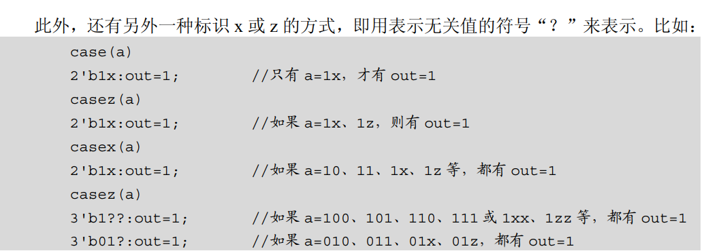

# vivado安装细节

**1-vivado关联sublime**

D:\Microsoft VS Code\Code.exe [file name] -[line number]

绝对路径 + 空格 + [file name] + 空格 + -[line number]

往往因为空格没打上而链接失败

把sublime添加到环境变量中

**2-Vivado关联Modelsim进行仿真**

[(57条消息) Vivado关联Modelsim进行仿真_正直的阿康的博客-CSDN博客_vivado关联modelsim](https://blog.csdn.net/weixin_42837669/article/details/107829499)


# ILA ---集成逻辑分析器

**Integrated Logic Analyzer**


**使用ILA探针分析**

[(57条消息) vivado ILA在线逻辑仪使用_Jay丶ke的博客-CSDN博客_vivado的ila](https://blog.csdn.net/qq_39541098/article/details/107125878)


**然后进行例化，注意这里clk就是用来采样的时钟。这里务必使用与待观测信号同步的时钟。**


# Verilog中 reg和wire 用法和区别以及always和assign的区别

**2022-03-14**


1、从仿真角度来说，HDL语言面对的是编译器，相当于使用软件思路，此时：

  wire对应于连续赋值，如assign；

  reg对应于过程赋值，如always，initial；


2、从综合角度，HDL语言面对的是综合器，相当于从电路角度来思考，此时：

     wire型变量综合出来一般情况下是一根导线。
    
     reg变量在always中有两种情况：
    
         （1）always @（a or b or c）形式的，即不带时钟边沿的，综合出来还是组合逻辑；
    
         （2）always @（posedge clk）形式的，即带有边沿的，综合出来一般是时序逻辑，会包含触发器（Flip-Flop）


3、设计中，输入信号一般来说不能判断出上一级是寄存器输出还是组合逻辑输出，对于本级来说，就当成一根导线，即wire型。而输出信号则由自己来决定是reg时序逻辑还是组合逻辑输出，wire和reg型都可以。但一般的，整个设计的外部输出（即最顶层模块的输出），要求是reg输出，这比较稳定、扇出能力好。


 **wire为无逻辑连线，wire本身不带逻辑性，所以输入什么就的输出什么。所以如果用always语句对wire变量赋值，对不起，编译器报错。**


那么你可能会问， assign  c = a & b;  不是对wire的赋值吗？

并非如此，综合时是将 a & b综合成 a、b经过一个与门，而c是连接到与门输出线，真正综合出来的是与门&，不是c。


5、何时用reg、何时用wire？

   大体来说，reg和wire类似于C、C++的变量，但若此变量要放在begin...end之内，则该变量只能是reg型；在begin...end之外，则用wire型；


使用wire型时，必须搭配assign；reg型可以不用。


input、output、inout预设值都是wire型。


**在Verilog中使用reg型，并不表示综合出来就是暂存器register：在组合电路中使用reg，组合后只是net；在时序电路中使用reg，合成后才是以Flip-Flop形式表示的register触发器。**


**6、reg和wire的区别：**

     reg型数据保持最后一次的赋值，而wire型数据需要持续的驱动。wire用在连续赋值语句assign中；reg用于always过程赋值语句中。
    
    在连续赋值语句assign中，表达式右侧的计算结果可以立即更新到表达式的左侧，可以理解为逻辑之后直接连接了一条线，这个逻辑对应于表达式的右侧，这条线对应于wire；


在过程赋值语句中，表达式右侧的计算结果在某种条件的触发下放到一个变量当中，这个变量可以声明成reg型，根据触发条件的不同，过程语句可以建模不同的硬件结构：

（1）如果这个条件是时钟上升沿或下降沿，那硬件模型就是一个**触发器**，只有是指定了always@（posedge or negedge）才是触发器。

 （2）如果这个条件是某一信号的高低电平，那这个硬件模型就是一个**锁存器**。

（3）如果这个条件是赋值语句右侧任意操作数的变化，那这个硬件模型就是一个组合逻辑。


**7、过程赋值语句always@和连续赋值语句assign的区别：**

（1）wire型用于assign的赋值，always@块下的信号用reg型。这里的reg并不是真正的触发器，只有**敏感列表**内的为上升沿或下降沿触发时才综合为触发器。


 （2）另一个区别，举例：

          wire     a;
    
          reg      b;
    
         assign     a = 1'b0;
    
         always@(*)
    
                 b = 1'b0;
    
         上面例子仿真时a将会是0，但是b的状态是不确定的。因为Verilog规定，always@（*）中的*指的是该always块内的所有输入信号的变化为敏感列表，就是说只有当always@（*）块内输入信号发生变化，该块内描述的信号才会发生变化。
    
        像always@（*）  b= 1'b0; 中由于1‘b0是个常数，一直没有变化，由于b的足组合逻辑输出，所有复位时没有明确的值--即不确定状态，又因为always@（*）块内没有敏感信号变化，此时b信号一直保持不变，即不确定是啥，取决于b的初始状态。
| **保留字**   | **说明**           | **output**          | **输出**           |
| ------------ | ------------------ | ------------------- | ------------------ |
| **always**   | 语句重复执行       | parameter           | 参数               |
| and          | 逻辑与实例         | pmos                | MOS原语            |
| **assign**   | 过程化持续赋值     | posedge             | 上升沿             |
| automatic    | 递归调用修饰词     | primitive           | 原语               |
| **begin**    | 顺序执行语句组开始 | pull0               | 强度               |
| buf          | 缓冲器             | pull1               | 强度               |
| bufif0       | 低电平是能缓冲器   | pulldown            | 强度               |
| bufif1       | 高电平是能缓冲器   | pullup              | 强度               |
| case         | 分支语句           | pulsestyle_ondetect | specify语句        |
| casex        | 分支语句           | pulsestyle_onevent  | specify语句        |
| casez        | 分支语句           | rcmos               | MOS原语            |
| cell         |                    | real                | 实数               |
| cmos         | 门级原语           | realtime            | 实数               |
| config       | 配置               | **reg**             | 变量               |
| deassign     | 停止过程化语句赋值 | release             | force release      |
| default      | 分支语句其他选项   | repeat              | 重复               |
| defparam     | 重写参数值         | rnmos               | 门级MOS            |
| design       | 配置               | rpmos               | 门级MOS            |
| disable      | 中止运行           | rtran               | 门级双向通道       |
| edge         | 边沿               | rtranif0            | 门级双向通道       |
| else         | 条件语句           | rtranif1            | 门级双向通道       |
| **end**      | begin语句结束      | scalared            | 类型修饰符         |
| endcase      | 分支语句结束       | showcancelled       | specify语句        |
| endconfig    | 配置结束           | signed              | 类型修饰符         |
| endfunction  | 函数结束           | small               | 强度               |
| endgenerate  | 生成结束           | specify             |                    |
| endmodule    | 模块结束           | specparam           | 指定参数           |
| endprimitive | 原语结束           | strong0             | 强度               |
| endspecify   |                    | strong1             | 强度               |
| endtable     | 真值表结束         | supply0             | 强度               |
| endtask      | 任务结束           | supply1             | 强度               |
| event        | 事件               | table               | 真值表             |
| for          | for循环            | task                | 任务               |
| force        | 过程化持续赋值     | time                | 时间类型           |
| forever      | 永久执行           | tran                | 门级双向通道       |
| **fork**     | 同步执行语句       | tranif0             | 门级双向通道带控制 |
| function     | 函数               | tranif1             | 门级双向通道带控制 |
| generate     | 生成               | tri                 | 网络数据类型       |
| genvar       | generate循环       | tri0                | 网络数据类型       |
| highz0       | 高阻0              | tri1                | 网络数据类型       |
| highz1       | 高阻1              | triand              | 网络数据类型       |
| **if**       | if语句             | trior               | 网络数据类型       |
| ifnone       | specify语句        | trireg              | 网络数据类型       |
| initial      | 初始化             | use                 | 配置语句           |
| **inout**    | 双向               | vectored            | 网络数据类型修饰符 |
| **input**    | 输入               | wait                | 等待               |
| instance     | 实例               | wand                | 网络数据类型       |
| integer      | 整型               | weak0               | 强度               |
| **join**     | fork-join语句      | weak1               | 强度               |
| large        | 强度               | while               | while循环          |
| liblist      | 库列表             | **wire**            | 网络数据类型       |
| localparam   | 本地参数           | wor                 | 网络数据类型       |
| macromodule  | 模块               | xnor                | 逻辑或非           |
| medium       | 强度               | xor                 | 逻辑或             |
| module       | 模块               | noshowcancelled     | specify语句        |
| nand         | 逻辑与非           | not                 | 逻辑非             |
| negedge      | 下降沿             | notif0              | 低电平使能非门     |
| nmos         | 门级MOS            | notif1              | 高电平使能非门     |
| nor          | 逻辑或非           | or                  | 逻辑或             |


#  数据类型（Data Type）

**连线型（Net Type）**

连线型数据相当于硬件电路中的物理连接，其特点是输出的值紧跟输入值的变化。对连线型有两种驱动方式，一种方式是在结构描述中将其连接到一个逻辑门或模块的输出端；另一种方式是用持续赋值语句assign对其进行赋值


用法：

**wire c;**

**wire [3:0] d; // wire型向量**


**2** **寄存器型（Resister Type）**

寄存器变量对应的是具有状态保持作用的电路元件，如触发器、寄存器等

另外，在always、initial等过程块中，**被赋值的每一个信号都必须定义成寄存器型。**

**4种寄存器型变量：**


例如：

**reg a,b;**

**reg [7:0] q; // reg型向量**


**3** **参数型（Parameter）**


在Verilog中用parameter来**定义符号常量**，即用parameter来定义一个标志符代表一个常量。

例如：

**parameter sel = 8, code = 8’ha3;**

**parameter datawidth = 8, addrwidth = datawidth * 2;**


**4** **存储器类型（Memories）**


**若干个相同宽度的向量构成数据（array），就是存储器。**


reg [7:0] mem0 [1023:0];

上面定义了一个深度为1024，宽度为8bit的存储器。


# Verilog行为语句


Verilog 中的多数过程模块都从属于以下两种过程语句：  initial  always 


**在一个模块（module）中，使用 initial 和 always 语句的次数是不受限制的。initial 语 句常用于仿真中的初始化，initial 过程块中的语句只执行一次；always 块内的语句则是不断 重复执行的。always 过程语句是可综合的**


**敏感信号表达式“event-expression”**

所谓敏感信号表达式又称事件表达式或敏感信号列表，即当该表达式中变量的值改变 时，就会引发块内语句的执行。


**敏感信号可以分为两种类型：一种为边沿敏感型，另一种为电平敏感型，每一个 always 过程最好只由一种类型的敏感信号来触发，避免将边沿敏感型和电平敏感型信号列在一起**


**initial 过程语句**


initial 语句不带触发条件，initial 过程中的块语句**沿时间轴只执行一次**。initial 语句通 常用于仿真模块中对激励向量的描述，或用于给寄存器变量赋初值，它是面向模拟仿真的 过程语句，通常不能被逻辑综合工具支持。


2-**块 语 句**


**串行块 begin-end**

begin-end 串行块中的语句按串行方式顺序执行。


由于 begin-end 块内的语句顺序执行，在最后，将 regb、regc 的值都更新为 rega 的值， 该 begin-end 块执行完后，regb、regc 的值是相同的。

 在仿真时，begin-end 块中的每条语句前面的延时都是相对于前一条语句执行结束的相 对时间。

 **并行块 fork-join**


由于 fork-join 并行块中的语句是同时执行的，在上面的块语句执行完后，regb 更新为 rega 的值，而 regc 的值更新为没有改变前的 regb 的值，故执行完后，regb 与 regc 的值是 不同的。


**在进行仿真时，fork-join 并行块中的每条语句前面的延时都是相对于该并行块的起始 执行时间的。**


**3-赋 值 语 句**

Verilog 有以下两种赋值方式和赋值语句


**1．持续赋值语句（Continuous Assignments）**


assign 为持续赋值语句，主要用于对 wire 型变量的赋值。 比如：

 **assign c=a&b;**

 在上面的赋值中，a、b、c 三个变量皆为 wire 型变量，**a 和 b 信号的任何变化，都将随 时反映到 c 上来**


**2．过程赋值语句（Procedural Assignments）**

过程赋值语句多用于对 reg 型变量进行赋值。过程赋值有阻塞赋值和非阻塞赋值两种方式。

**（1）非阻塞（non_blocking）赋值方式**

赋值符号为“<=”，如：


非阻塞赋值在整个过程块结束时才完成赋值操作，即 b 的值并不是立刻就改变的。


（2）阻塞（blocking）赋值方式

赋值符号为“=”，如：


**阻塞赋值在该语句结束时就立即完成赋值操作，即 b 的值在该条语句结束后立刻改变。** 如果在一个块语句中，有多条阻塞赋

值语句，那么在前面的赋值语句没有完成之前，后面 的语句就不能被执行，仿佛被阻塞了（blocking）一样，因此称为阻塞赋值方

式。

**阻塞赋值与非阻塞赋值**

阻塞赋值方式和非阻塞赋值方式的区别常给设计人员带来问题。问题主要是对 always 模块内的 reg 型变量的赋值不易把握。为区分非阻塞赋值与阻塞赋值的区别


**4 -条 件 语 句** 

条件语句有 if-else 语句和 case 语句两种，都属于顺序语句，应放在 always 块内。

**if-else 语句**


上述方式中，“表达式”一般为逻辑表达式或关系表达式，也可能是 1 位的变量。 系统对表达式的值进行判断，若为 0，x，z，则按“假”处理；若为 1，则按“真”处理， 执行指定语句。语句可是单句，也可是多句，多句时用 begin-end 块语句括起来。if 语句 也可以多重嵌套，对于 if 语句的嵌套，若不清楚 if 和 else 的匹配，最好用 begin-end 语句 括起来。


**case 语句**


当敏感表达式的值为值 1 时，执行语句 1；为值 2 时，执行语句 2；依此类推；若敏感 表达式的值与上面列出的值都不符，则执行 default 后面的语句。若前面已列出了敏感表达 式所有可能的取值，则 default 语句可以省略。

**casez 与 casex 语句**

case 语句中，敏感表达式与值 1～n 之间的比较是一种**全等比较**，**必须保证两者的对应位全等**。casez 与 casex 语句是 case 语句的两种变体，在 casez 语句中，如果分支表达式**某些位的值**为高阻 z，那么对这些位的比较就不予考虑，因此只需关注其他位的比较结果。 而在 casex 语句中，则把这种处理方式进一步扩展到对 x 的处理，即如果比较的双方有一 方的某些位的值是 x 或 z，那么这些位的比较就都不予考虑





**5- 循 环 语 句**


四种类型的循环语句，用来控制语句的执行次数


**for 语句**


**repeat 语句**


## --任务（task）

利用任务和函数可以把一个很大的程序模块分解成许多较小的任务和函数便于理解和调试。

定义任务的语法如下：

```verilog
task <任务名>;  // 任务第一行不能列出端口名称，要在第一行后，第一行只有任务名
     <端口及数据类型声明语句>
     <语句1>
     <语句2>
     .....
     <语句n>
endtask
```


**这些声明语句的语法与模块定义中的对应声明语句的语法是一致的。**

2) 任务的调用及变量的传递

启动任务并传递输入输出变量的声明语句的语法如下：

任务的调用：

```verilog
<任务名>(端口1，端口2，...，端口n);
```


**例子说明**

```verilog
task my_task;
    input a, b;
    inout c;
    output d, e;
    …
    <语句> //执行任务工作相应的语句
    …
    c = foo1; //赋初始值
    d = foo2; //对任务的输出变量赋值t
    e = foo3;
endtask
```

 任务调用：

```verilog
my_task(v,w,x,y,z);
```

**任务调用变量(v,w,x,y,z)和任务定义的I/O变量(a,b,c,d,e)之间是一一对应的。当任务启动时，由v,w,和x.传入的变量赋给了a,b,和c，而当任务完成后的输出又通过c,d和e赋给了x,y和z。**

```verilog
module traffic_lights;
    reg clock, red, amber, green;
    parameter on=1, off=0, red_tics=350,
              amber_tics=30,green_tics=200;
     //交通灯初始化
     initial red=off;
     initial amber=off;
     initial green=off;
     //交通灯控制时序
    always
    begin
        red=on; //开红灯
        light(red,red_tics); //调用等待任务
        green=on; //开绿灯
        light(green,green_tics); //等待
        amber=on; //开黄灯
        light(amber,amber_tics); //等待
    end

    //定义交通灯开启时间的任务
    task light（color,tics);
        output color;
        input[31:0] tics;
        begin
            repeat(tics) @(posedge clock);//等待tics个时钟的上升沿
            color=off;//关灯
        end
    endtask
//产生时钟脉冲的always块
    always
    begin
        #100 clock=0;
        #100 clock=1;
    end
endmodule
这个例子描述了一个简单的交通灯的时序控制，并且该交通灯有它自己的时钟产生器。
```


**任务定义时需注意以下事项：**

（1）在第一行“task”语句中不能列出端口名列表。

（2）任务中可以有延时语句、敏感事件控制语句等事件控制语句。

（3）任务可以没有或可以有一个或多个输入、输出和双向端口。

（4）任务可以没有返回值，也可以通过输出端口或双向端口返回一个或多个返回值。

（5）任务可以调用其它的任务或函数，也可以调用该任务本身。

（6）任务定义结构内不允许出现过程块（initial或always过程块）。

（7）任务定义结构内可以出现disable终止语句，这条语句的执行将中断正在执行的任务。在任务被中断后，程序流程将返回到调用任务的地方继续向下执行


**task比always低一个等级，即task必须在always里面调用，task可以定义task，但不能调用module**

**task语句可以综合，但是其中不能包含always语句，因此只能实现组合逻辑**


## --function （函数）

函数定义是嵌入在关键字function和endfunction之间的，其中关键词function标志着一个函数定义结构的开端，endfunction标志着一个函数定义结构的结束


**函数的目的是返回一个用于表达式的值。**

```verilog
function <返回值的类型或范围> (函数名);
<端口说明语句>
<变量类型说明语句>

begin
<语句>
........
end
endfunction
```

**请注意<返回值的类型或范围>这一项是可选项，如缺省则返回值为一位寄存器类型数据**

例：统计输入数据中“0”的个数

```verilog
	function[3:0] out0;
	input[7:0] x;
	reg[3:0] count;
	integer i;
	begin
		count=0;
		for(i=0;i<=7;i=i+1)
			if(x[i]==1’b0)	 count=count+1;
		out0=count;
	end
	endfunction
```


# Verilog---generate语句

**2022-03-31**

**为什么要generate?**

在设计中，很多情况下，需要编写很多结构相同而参数不同的赋值语句或者逻辑语句，如果参数量很大的情况下，原本的列举就会显得心有余而力不足。c语言中常用for语句来解决此类问题，[verilog](https://so.csdn.net/so/search?q=verilog&spm=1001.2101.3001.7020)则为我们提供了generate语句。

[FPGA之道（74）Verilog生成语句-云社区-华为云 (huaweicloud.com)](https://bbs.huaweicloud.com/blogs/detail/282896)

**generate语句的最主要功能就是对module,reg,assign,always,task等语句或者模块进行复制。**

**generate语句有generate_for,generate_if,generate_case三种语句**

**循环生成**

关于循环生成，举例如下：

```python
genvar ;
generate
for (=0; < ; =+1)
begin:

end
endgenerate
```

关于以上语法有四点注意：
1、循环生成中for语句使用的变量必须用genvar关键字定义，genvar关键字可以写在generate语句外面，也可以写在generate语句里面，只要先于for语句声明即可；
2、必须给循环段起一个名字。这是一个强制规定，并且也是利用循环生成语句生成多个实例的时候分配名字所必须的；
3、for语句的内容必须加begin-end，即使只有一条语句也不能省略。这也是一个强制规定，而且给循环起名字也离不开begin关键字；
4、可以是实例化语句也可以是连续赋值语句。

关于循环生成，举例如下：

```python
input [3:0] a,b;
output [3:0] c,d;

generate
genvar i;
	for (i=0; i < 4; i=i+1) 
	begin : genExample
		myAnd insAnd (.a(a[i]), .b(b[i]), .c(c[i]));
		assign d[i] = a[i];
	end
endgenerate
```

利用循环生成语句生成的实例名称不能像数组例化那样用方括号表示，否则会报错。那么，你可能会疑惑上例中实例的名字，其实，上述实例化展开来类似：

```python
myAnd genExample(0).insAnd (.a(a[0]), .b(b[0]), .c(c[0]));
myAnd genExample(1).insAnd (.a(a[1]), .b(b[1]), .c(c[1]));
myAnd genExample(2).insAnd (.a(a[2]), .b(b[2]), .c(c[2]));
myAnd genExample(3).insAnd (.a(a[3]), .b(b[3]), .c(c[3]));
```

这也是为什么循环生成语句必须要有个名字。从上例我们还可以看出，当循环语句用作实例化时，所表述的功能跟数组实例化语句其实是类似的。
最后，循环生成语句是支持嵌套的，例如二重循环生成语法如下：

```python
genvar <var1>, <var2>;
generate 
for (<var1>=0; <var1> < <limit>; <var1>=<var1>+1) 
begin: <label_1> 
    for (<var2>=0; <var2> < <limit>; <var2>=<var2>+1) 
    begin: <label_2>
        <code> 
    end 
end
endgenerate	
```

**条件生成**

条件生成的目的是为了左右编译器的行为，类似于C语言中的条件选择宏定义，根据一些初始参数来决定载入哪部分代码来进行编译。Verilog中共提供了两种条件生成语句，一种是generate-if语句，一种是generate-case语句，两者的功能几乎相同，只是书写形式不一样而已，分别介绍如下：

**generate-if语句**

该语句的语法如下：

```python
generate
	if (<condition>) begin: <label_1>
		<code>;
	end else if (<condition>) begin: <label_2>
		<code>;
	end else begin: <label_3>
		<code>;
	end
endgenerate
```

关于该语法有三点注意：

> 1、必须是常量比较，例如一些参数，这样编译器才可以在编译前确定需要使用的代码；
> 2、if语句的内容中，begin-end只有在 < code > 有多条语句时才是必须的；
> 3、每一个条件分支的名称是可选的，这点不像循环生成语句那么严格。

```python
wire c, d0, d1, d2;
parameter sel = 1;

generate
	if (sel == 0)
		assign c = d0;
	else if (sel == 1)
		assign c = d1;
	else
		assign c = d2;
endgenerate
```

该例子表示编译器会根据参数sel的值，来确定到底是让d0~d2中哪个变量和c连通。但是注意，一旦连通，那么要想更改必须修改参数后重新编译，如果需要动态选择，可以写成如下这样，但是资源上却都需要一个多路复用器来实现。

```python
assign c = (sel == 0) ? d0 : (sel == 1) ? d1 : d2;
```


**generate-case语句**

该语句的语法如下：

```python
generate
		case (<constant_expression>) <value>:
        begin: <label_1> 
            <code> 
        end 
            <value>: 
        begin: <label_2>
				<code> 
        end …… 
        default: 
            begin: <label_N>
				<code>
			end 
        endcase 
endgenerate
```

关于该语法也有三点注意，和generate-if类似：
1、<constant_expression>必须是常量比较，例如一些参数，这样编译器才可以在编译前确定需要使用的代码；
2、case语句的内容中，begin-end只有在< code >有多条语句时才是必须的；
3、每一个条件分支的名称是可选的，这点不像循环生成语句那么严格。


# verilog 状态机

**状态机（State Machine）**

 	有限状态机（Finite State Machine，简称FSM）
 	
 	在有限个状态之间按一定规律转换的时序电路。


## Mealy 状态机

**Mealy 型状态机的输出，不仅与当前状态有关，还取决于当前的输入信号。**

**Mealy 型状态机的输出是在输入信号变化以后立刻发生变化，且输入变化可能出现在任何状态的时钟周期内。**

次态= f（现态，输入）

输出= f(现状，输入)


状态寄存器由一组触发器组成，用来记忆状态机当前所处的状态，状态的改变只发生在时钟的跳变沿。

状态是否改变、如何改变，取决于组合逻辑F的输出，F是当前状态和输入信号的函数

状态机的输出是由输出组合逻辑G提供的，G也是当前状态和输入信号的函数。


## Moore 状态机

**Moore 型状态机的输出只与当前状态有关，与当前输入无关。**

**输出会在一个完整的时钟周期内保持稳定，即使此时输入信号有变化，输出也不会变化。输入对输出的影响要到下一个时钟周期才能反映出来。这也是 Moore 型状态机的一个重要特点：输入与输出是隔离开来的。**

次态 = f(现状，输入)

输出 = f(现状)


**状态机设计四段论**


**1-状态空间（状态空间编码）**

**2-状态跳转**    			 **时序逻辑**     非阻塞赋值

**3-状态切换判断**  	   **组合逻辑**      阻塞赋值

**4-具体状态下动作**


# Verilog 程序框架

Verilog 的基本设计单元是“模块”（block）。

一个模块是由两部分组成的，一部分描述接口，另一部分描述逻辑功能


每个Verilog程序包括4个主要的部分：

 端口定义、IO说明、内部信号声明、功能定义。


功能定义部分有三种方法：

1、assign语句

 描述组合逻辑

2、always语句

 描述组合/时序逻辑

3、例化实例元件

 如：*and #2 u1(**q,a,b**);*

上述三种逻辑功能是并行的

注意：

在always块中，逻辑是顺序执行的。

而多个always块之间是并行的。


**锁存器（latch）**：

存器（latch）：我听过的最多的就是它是电平触发的，呵呵。锁存器是电平触发的存储单元，数据存储的动作取决于输入时钟（或者使能）信号的电平值，当锁存器处于使能状态时，输出才会随着数据输入发生变化。（简单地说，它有两个输入，分别是一个有效信号EN,一个输入数据信号DATA_IN，它有一个输出Q，它的功能就是在EN有效的时候把DATA_IN的值传给Q，也就是锁存的过程）。

应用场合：数据有效迟后于时钟信号有效。这意味着时钟信号先到，数据信号后到。在某些运算器电路中有时采用锁存器作为数据暂存器。

缺点：时序分析较困难。

不要锁存器的原因有二：1、锁存器容易产生毛刺，2、锁存器在ASIC设计中应该说比ff要简单，但是在FPGA的资源中，大部分器件没有锁存器这个东西，所以需要用一个逻辑门和ff来组成锁存器，这样就浪费了资源。

**触发器（flip-flop）：**

触发器（Flip-Flop，简写为 FF），也叫双稳态门，又称双稳态触发器。是一种可以在两种状态下运行的数字逻辑电路。触发器一直保持它们的状态，直到它们收到输入脉冲，又称为触发。当收到输入脉冲时，触发器输出就会根据规则改变状态，然后保持这种状态直到收到另一个触发。

**寄存器（register）：**

寄存器（register）：用来存放数据的一些小型存储区域，用来暂时存放参与运算的数据和运算结果，它被广泛的用于各类数字系统和计算机中。其实寄存器就是一种常用的时序逻辑电路，但这种时序逻辑电路只包含存储电路。寄存器的存储电路是由锁存器或触发器构成的，因为一个锁存器或触发器能存储1位二进制数，所以由N个锁存器或触发器可以构成N位寄存器。 工程中的寄存器一般按计算机中字节的位数设计，所以一般有8位寄存器、16位寄存器等。


# 锁存器与触发器的区别

锁存器和触发器是具有记忆功能的二进制存贮器件，是组成各种时序逻辑电路的基本器件之一。区别为：latch同其所有的输入信号相关，当输入信号变化时latch就变化，**没有时钟端；**

**flip-flop受时钟控制**，只有在时钟触发时才采样当前的输入，产生输出。当然因为latch和flip-flop二者都是时序逻辑，所以输出不但同当前的输入相关还同上一时间的输出相关。

**在绝大多数设计中避免产生锁存器。锁存器最大的危害在于不能过滤毛刺 （使能信号有效时，输出状态可能随输入多次变化，产生空翻）** 


**在if语句和case不全很容易产生latch **： 意思就是 使用if-else这样完整的条件语句，不要只有一个if没有else配对

case语句中把有的情况写全，最后的default不能确实，不然容易出现锁存器，导致有"毛刺"

**在基于 always 的组合逻辑描述语句中容易综合出锁存器的地方：1：if 语句的使用中缺少 else 语句（前提是不是始终边沿触发）；2：case 语句中没有给出全部的情况。**


**latch最大的危害在于不能过滤毛刺。这对于下一级电路是极其危险的。所以，只要能用D触发器的地方，就不用latch。**


# RAM

**2022-03-31**

Random Access Memory，即随机存取存储器，它可以随时把数据**写入任一指定地址**的存储单元，也可以随时**从任一指定地址中读出数据**，其读写速度是由时钟频率决定的。RAM主要用来存放程序及程序执行过程中产生的中间数据、运算结果等。

**RAM通常是作为操作系统或其他正在运行程序的临时存储介质，也就是运行内存**

**RAM** 有两大类，一种称为静态RAM（Static RAM/SRAM）SRAM速度非常快，是目前读写最快的存储设备了，但是它也非常昂贵，所以只在要求很苛刻的地方使用，譬如CPU的一级缓冲，二级缓冲。；另一种称为动态RAM（Dynamic RAM/DRAM），DRAM是通过在电容器中积累电荷来保存数据的存储元件，电容器中充电状态是1，放电状态是0，由于电容器中的电荷在一点时间后会衰减，所以DRAM需要定期重新写入数据的Refrash操作，**DRAM**保留数据的时间很短，速度也比SRAM慢，不过它还是比任何的ROM都要快

存数据-读数据


**单端口：**只有一个端口，读写数据不能同时进行，共用数据通道。

**伪双端口：**拥有两个数据通道，一个用来写一个用来读。 不能同时

**真双端口：**拥有两个数据通道，一个用来写一个用来读     可以同时


# FIFO

**2022-03-31**

**FIFO  可分为同步FIFO和异步FIFO，其区别主要是，读写的时钟是否为同一时钟，如使用一个时钟则为同步FIFO，读写时钟分开则为异步FIFO。**

 **二、用途**

**（1）跨时钟域多bit数据传输**

   解决一个系统多个时钟，所带来的问题：异步时钟之间的接口电路。异步FIFO是解决这个问题的一种便捷简单的方案，使用异步FIFO可以在两个不同时钟系统之间快速方便地传输实时数据。

**（2）达到数据匹配问题**

   对于不同宽度的数据接口也可以使用FIFO，例如单片机的8位输出而DSP可能是16位输入，在单片机与DSP连接时就可以使用FIFO来达到数据匹配的目的。

**使用场景有多种，其中主要如下所示：**

　　(1) 数据的缓冲。如模型图所示，如果数据的写入速率高，但间隔大，且会有突发;读出速率小，但相对均匀。则通过设置相应深度的FIFO，可以起到数据暂存的功能，且能够使后续处理流程平滑，避免前级突发时，后级来不及处理而丢弃数据。

　　(2) 时钟域的隔离。对于不同时钟域的数据传递，则数据可以通过FIFO进行隔离，避免跨时钟域的数据传输带来的设计与约束上的复杂度。比如FIFO的一端是AD采集的数据，另一端是计算机的PCI总线，假设AD采集的速率是16位 100K SPS，那么每秒的数据量为100K*16bit=1.6Mbps。而PCI总线的速度为33MHz，总线宽度为32位，则其最大传输速率为33M*32=1.056Gbps，在两个不同的时钟域间就可以采用FIFO来作为数据缓冲。

　　(3)用于不同宽度的数据接口。例如单片机8位数据输出，而DSP是16位数据输入，在单片机和DSP连接时就可以使用FIFO来达到数据匹配的目的。


**The WIDTH**: 

FIFO的宽度是FIFO一次读写操作的数据位宽，就像MCU有8位和16位，ARM有32位等。*FIFO*的宽度在单片成品*IC*中是固定的，也有可选择的，如果用*FPGA*自己实现一个*FIFO*，其数据位，也就是宽度是可以自己定义的。

**The Deepth**:

指FIFO可存储多少个N位的数据（N指数据宽度）


**写端**


**读端**


FIFO 的读写方式如下图所示：


注意的问题：

1. 读写指针都是独立的。
2. 读写指针都是循环的，满 16 归零。
3. 当读写指针都在 0 位置的时候，要注意区分满和空这两种截然不同的状态。

# DDR扫盲——关于Prefetch与Burst

[DDR扫盲——DDR中的名词解析-Felix-电子技术应用-AET-中国科技核心期刊-最丰富的电子设计资源平台 (chinaaet.com)](http://blog.chinaaet.com/justlxy/p/5100051913)

**全称为Double Data Rate SDRAM，中文名为“双倍数据流SDRAM”。DDR SDRAM在原有的SDRAM的基础上改进而来。CLK与CLK#（时钟上升与下降沿）的交叉点都有数据传输因此称之为DDR。**


**逻辑Bank**

SDRAM的内部是一个存储阵列，要想准确地找到所需的存储单元就先指定一个（row）,再指定一个列（Column）,这就是内存芯片寻址的基本原理。

**它就是逻辑Bank（Logical Bank，简称L-Bank）**


**位宽：**是指内存一次数据传输的数据量就是位宽，以位为单位。


SDRAM的内部结构:

  SDRAM相当于一个excel，一个工作溥中有几个工作表，每个工作表里有行列。

  SDRAM中的一个bank就相当于excel中的一个工作表, SDRAM中的行(Row)与列(Column)相当于工作于中的行与列，我们对内存的读写就是根据bank号 Row、Column 来准确的找到所需要的单元格(存储阵列)。

  由于技术、成本等原因，不可能只做一个全容量的Bank,而且最重要的是，由于SDRAM的工作原理限制，单一的Bank将会造成非常严重的寻址冲突，大大降低了内存的效率，所以把SDRAM内部分割成多个Bank,


DDR SDRAM 中的**突发长度**是指什么......

DDR1 的突发长度为 2
DDR2 的突发长度为 4
DDR3 的突发长度为 8


它指示当给出写入或读取命令以及行和 coloumn 地址时，从 DDR sdram 读取多少个数据字节。


突发长度是指将读/写命令呈现给 DDR/SDRAM/QSDRAM 后读/写的数据量.....控制器。

这有效地减少了r / w操作

的延迟与较旧的DRAM不同，
假设我们需要从内存
中获取8个单词 在正常dram中，在给定读取命令后，数据获取时间为1ns，因此需要8ns和8个读取命令才能完成操作

但是对于SDRAM，第一个命令将接受1 ns，进一步的读取不需要读取命令，因为它被提及为8个突发，它将以.5ns的速度读取剩余的7个单词，每个单词，最后我们有8个数据在4.5ns，只有一个读取操作

所以突发操作减少了访问连续内存位置时的延迟
，其他突发大小为1的突发大小就像正常的r / w操作一样


**突发（Burst）**是指在同一行中相邻的存储单元连续进行数据传输的方式，连续传输的周期数就是突发长度（Burst Lengths，简称BL）。

  **在进行突发传输时，只要指定起始列地址与突发长度，内存就会依次地自动对后面相应数量的存储单元进行读/写操作而不再需要控制器连续地提供列地址（SDRAM与DDR  SDRAM的突发传输对列寻址的操作数量有所不同）。这样，除了第一笔数据的传输需要若干个周期（主要是之前的延迟，一般的是tRCD+CL）外，其后每个数据只需一个周期的即可获得**


只要指定起始列地址与突发长度，后续的寻址与数据的读取自动进行，而只要控制好两段突发读取命令的间隔周期（与BL相同）即可做到连续的突发传输。

使用了突发传输模式以后只要指定列起始地址和BL，内存就会自动依次读取后续相应数量的存储单元而且并不需要一直提供列地址


# 正点原子DDR3

**2022-03-18**


## DDR3 IP接口


# FPGA 时钟资源

**2022-03-31**

ug472_7series 数据手册 


​	7系列FPGA拥有丰富的时钟资源。各种缓冲器类型、时钟输入管脚和时钟连接，可以满足许多不同的应用需求。选择合适的时钟资源可以改善[布线](http://www.hqpcb.com/)、性能和一般FPGA资源利用率。BUFGCTRL（最常用作BUFG）是最常用的时钟布线资源。这些真正的全局时钟可以连接到器件的任何位置。但是在某些情况下，出于性能、功能或时钟资源可用性的原因，使用备用时钟缓冲器更为有利。最好在以下情况下使用BUFG：

​	设计或设计的一部分可以覆盖整个器件的大面积区域，功能的本地化是不可能的。

​	硬件功能块，如块[RAM](http://www.elecfans.com/tags/ram/)、[DSP](http://www.elecfans.com/tags/dsp/)或集成IP，跨越多个时钟区域，级联或需要连接到不在附近的CLB。


# testbench测试代码的编写

https://vlab.ustc.edu.cn/guide/doc_testbench.html

https://blog.csdn.net/zhaogoudan/article/details/111933722


https://blog.csdn.net/weixin_44056198/article/details/107733963

**2022-03-22**


测试代码其实就是通过代码模拟产生测试的环境，然后测试自己编写的模块代码是否正确。这可以指导我们在编写代码过程中决定某一些控制信号该如何产生，比如用于控制产生测试信号的控制信号，可以在一个 initial 模块里去改变这个值，而测试信号中的控制信号，应该在时钟下产生。


1、 将测试代码模块命名为xxx(模块名)， 并且不需要任何输入信号。

```javascript
module tb_xxx();
```

2、 定义变量类型
     一般将输入信号定义为reg类型的；将输出信号定义为wire类型的；


3、例化模块，并将输入输出的信号和 2 中定义的变量进行关联。


4、 产生时钟模块。
     根据需要产生一个或多个时钟。一般可以产生一个系统时钟即可，其他时钟由这个时钟分频产生即可


5、 时钟控制和reset信号的控制
     一般放在initial模块里，跟据具体需要对reset信号进行编辑；并注意时钟信号的初始化，否则无法产生正常的时钟信号（若不初始化，clk可能默认为x状态，~x状态仍为x，即不会产生时钟驱动）。


**2 基本的testbench结构**

1-module test_bench；

// 通常testbench没有输入与输出端口

2-信号或变量定义声明

3-使用initial或always语句来产生激励波形

4-例化设计模块

5-监控和比较输出响应

6-endmodule


**测试代码示例**


​	
	`timescale 1ns/1ps // 定义了`timescale 指令。 `timescale 仿真单位/仿真精度
	
	module tb_ddr3_ctrl_top (); /* 定义了测试平台模块名称。请注意，通常， testbench 模块的端口列表中不列出端口。
		this is automatically generated */ 
	
		// clock
		reg clk;  // 定义为 reg 数据类型，因为它将用于提供激励。它连接到被测试（tutorial）的实例化设备
		reg srstb_n;


​	
	// verilog中testbench仿真时钟的生成 方法  https://blog.csdn.net/qq_39507748/article/details/108748212
	
	// 方法1   initial 方式产生占空比50%的时钟
	/*initial 
	begin
	    CLK=0;  // 一定要给时钟赋初始值，因为信号的缺省值为z，如果不赋初值，则反相后还是z，时钟就一直处于高阻z状态。
	    #delay;
	    forever
	        #(period/2) CLK = ~CLK;
	end
	*/
	
	// 方法2 always 方式
	/* initial 
	    CLK=0;
	always
	    #(period/2) CLK=~CLK;
	*/
	// always后面没有@！没有@的时候always代表永远循环执行begin end之间的语句


​	
​	
	// 方法3 使用repeat产生确定数目的时钟脉冲
	/*initial 
	begin
	    CLK =0;
	    repeat(6) // 脉冲数量
	        #(period/2) CLK = ~CLK;
	end
	*/
	
	// 方法4 产生占空比非50﹪的时钟
	/*initial
	    CLK=0;
	always
	begin
	    #3 CLK=~CLK;
	    #2 CLK=~CLK;
	end
	*/


​	
​	
	// 产生复位信号
	// 1 异步复位
	/*initial 
	begin
	    Rst =1;
	    #100;
	    Rst =0;
	    #500;
	    Rst =1;
	end
	*/
	
	// 2 同步复位(法1)
	/*initial 
	begin  
	    Rst=1;
	    @(negedge CLK); //等待时钟下降沿  
	    Rst=0;
	    #30;
	    @(negedge CLK); //等待时钟下降沿 
	    Rst =1;
	end
	*/


​	
	// 3 同步复位（法2）
	/*initial 
	begin
	    Rst =1;
	    @(negedge CLK); //等待时钟下降沿 
	    repeat(3)  @(negedge CLK); //经过3个时钟下降沿  
	    Rst =1
	end
	*/


​	
​	
	// testbench在运行起来之后，第一个进入初始化语句，并且只执行一次停在最后一句，
	// 然后才是后面的语句。由于begin end里面的语句是串行执行的


​	
		initial begin //initial 过程描述来定义激励  code that executes only once      
			clk = 0;
			forever #(10) clk = ~clk; // 停在此处，一直产生clk信号
		end
	
		// synchronous reset reset信号的控制
		initial begin
			srstb_n <= 0;
			#200   // 延时语句——#n; 代表延时n个时间轴单位  200 n秒
			repeat(5)@(posedge clk);
			srstb_n <= 1;
		end
	
	// ddr3_model.sv  sv: standard Verilog 标志仿真
	// ddr3_model_parameters.vh  仿真参数  vhdl


​	
		// (*NOTE*) replace reset, clock, others
	   //将输出信号定义为wire类型
		wire[15:0] ddr3_dq;
		wire [1:0] ddr3_dqs_n;
		wire [1:0] ddr3_dqs_p;
		wire[13:0] ddr3_addr;
		wire [2:0] ddr3_ba;
		wire       ddr3_ras_n;
		wire       ddr3_cas_n;
		wire       ddr3_we_n;
		wire       ddr3_reset_n;
		wire [0:0] ddr3_ck_p;
		wire [0:0] ddr3_ck_n;
		wire [0:0] ddr3_cke;
		wire [0:0] ddr3_cs_n;
		wire [1:0] ddr3_dm;
		wire [0:0] ddr3_odt;


​	
​	
​	
	/*例化被测试模块，并将输入输出的信号和 上面中定义的变量进行关联。
	例化被测模块的目的是把被测模块和激励模块实例化起来，
	并且把被测模块的端口与激励模块的端口进行相应的连接，
	使得激励可以输入到被测模块。如果被测模块是由多个模块组成的，
	激励模块中只需要例化多个模块的顶层模块
	*/
		ddr3_ctrl_top inst_ddr3_ctrl_top
			(
				// 端口映射 - 主端口和信号/寄存器之间的连接		
				// port map - connection between master ports and signals/registers 
				// .xxx 被测模块端口       (yyy)提供激励信号端口
				 // 左侧带“ .” 的信号为被测模块模块定义的端口信号，右侧括号内的信号为激励模块中定义的信号
				.ddr3_dq      (ddr3_dq),
				.ddr3_dqs_n   (ddr3_dqs_n),
				.ddr3_dqs_p   (ddr3_dqs_p),
				.ddr3_addr    (ddr3_addr),
				.ddr3_ba      (ddr3_ba),
				.ddr3_ras_n   (ddr3_ras_n),
				.ddr3_cas_n   (ddr3_cas_n),
				.ddr3_we_n    (ddr3_we_n),
				.ddr3_reset_n (ddr3_reset_n),
				.ddr3_ck_p    (ddr3_ck_p),
				.ddr3_ck_n    (ddr3_ck_n),
				.ddr3_cke     (ddr3_cke),
				.ddr3_cs_n    (ddr3_cs_n),
				.ddr3_dm      (ddr3_dm),
				.ddr3_odt     (ddr3_odt),
				.sys_clk_i    (clk),
				.sys_rst      (srstb_n)
			);


​	
	/*
	ddr3_model.sv ddr3_model.sv 是我们在例化ddr3 IP核时，编译器自定生成的ddr3官方仿真模型，
	利用官方的发展模型来提供激励测试自己的设计模型
	ddr3_model.sv 文件，该文件即为我们的仿真模型文件，将该文件添加到 Vivado 工程的 simulation sources 内，
	然后将仿真模型 ddr3_model.sv 实例化到 tb 文件
	使用ddr3_model.sv 的ddr3仿真模型来实例化测试自己设计的ddr3----inst_ddr3_ctrl_top
	*/
	
	//u_comp_ddr3仿真输出各种信号连接到自己的ddr3模块
	
	// 产生模拟激励（波形）； 用存在的仿真模型来输出激励
	
	      ddr3_model u_comp_ddr3
	
	          (
			// 将产生的激励加入到被测试模块并观察其输出响应；
	           .rst_n   (ddr3_reset_n),
	           .ck      (ddr3_ck_p),
	           .ck_n    (ddr3_ck_n),
	           .cke     (ddr3_cke),
	           .cs_n    (ddr3_cs_n),
	           .ras_n   (ddr3_ras_n),
	           .cas_n   (ddr3_cas_n),
	           .we_n    (ddr3_we_n),
	           .dm_tdqs ({ddr3_dm[1],ddr3_dm[0]}),
	           .ba      (ddr3_ba),
	           .addr    (ddr3_addr),
	           .dq      (ddr3_dq[15:0]),
	           .dqs     ({ddr3_dqs_p[1],ddr3_dqs_p[0]}),
	           .dqs_n   ({ddr3_dqs_n[1],ddr3_dqs_n[0]}),
	           .tdqs_n  (),
	           .odt     (ddr3_odt)
	
	           );


​	
​	
	    // //创建一个记录文件 
	    // initial  
	    //     Out_file =$fopen("results.txt");
	    
	    // //在文件中保存监控信息  
	    // always@(posedge Clock)
	    // begin
	    //     if(Detect == 1'b1)
	    //         $fwrite(Out_file,"At time %t, Detect out is 1\n",$time);
	    // end


​	
	// 在实例化被测模块后，以endmodule结束。
	endmodule


​	


​	


​	

# 时序分析与时序约束	

2022-04-15	


**Tclk1 + Tco + Tdata <= Tclk + Tclk2 -Tsu**


## 最高时钟频率


