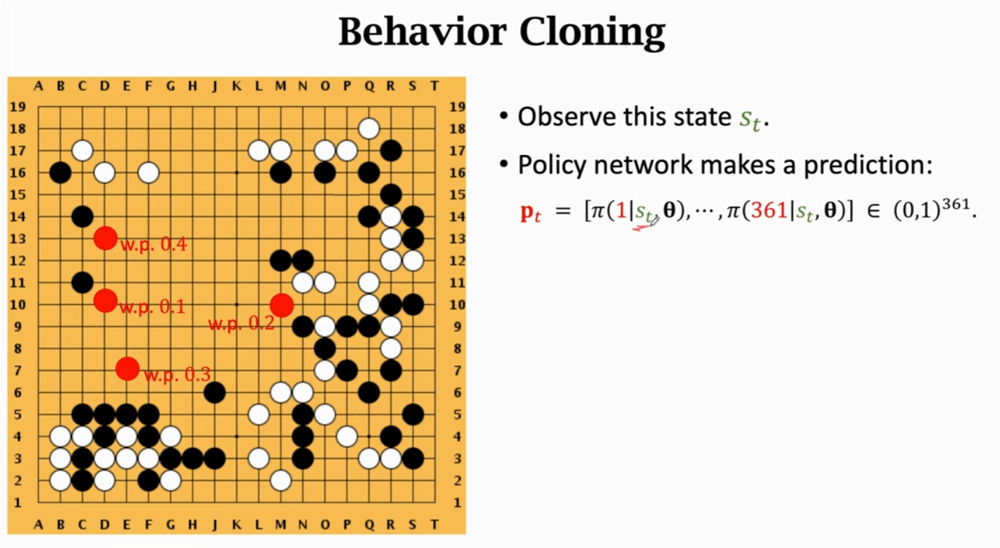
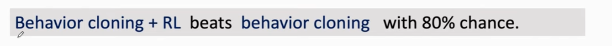
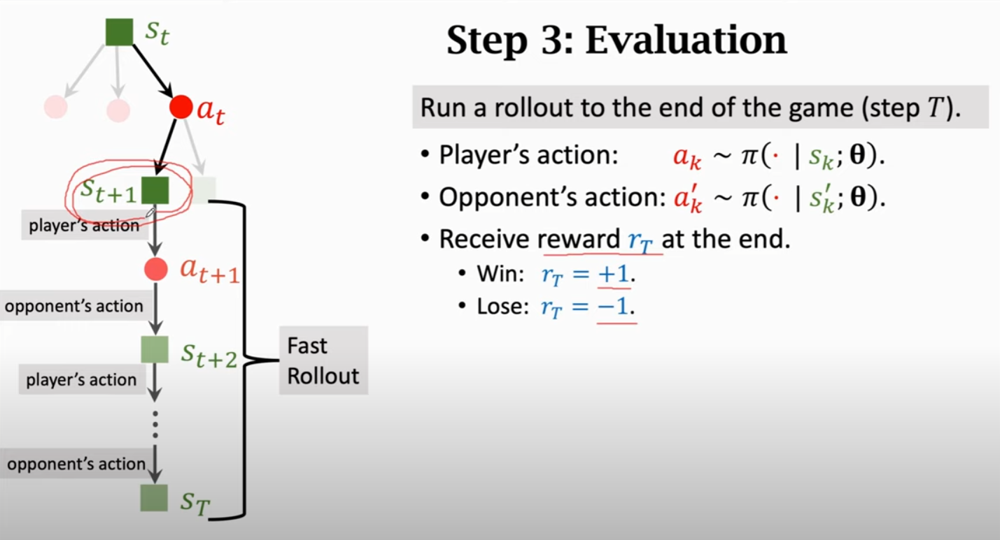

### AlphaGo的”大脑“是怎样的


**Rollout 算法**

Rollout 算法的基本思想就是 在未来有限的k步之内采用直接优化的方法

度神经网络是AlphaGo的”大脑“，我们先把它当做一个黑匣子，有输入端，也有输出端，中间具体怎么处理先不考虑。那么AlphaGo的”大脑“实际上分成了四大部分：

    Rollout Policy 快速感知”脑“：用于快速的感知围棋的盘面，获取较优的下棋选择，类似于人观察盘面获得的第一反应，准确度不高
    SL Policy Network 深度模仿”脑“：通过人类6-9段高手的棋局来进行模仿学习得到的脑区。这个深度模仿“脑”能够根据盘面产生类似人类棋手的走法。
    RL Policy Network 自学成长“脑”：以深度模仿“脑”为基础，通过不断的与之前的“自己”训练提高下棋的水平。
    Value Network 全局分析“脑”：利用自学成长“脑”学习对整个盘面的赢面判断，实现从全局分析整个棋局。

所以，AlphaGo的“大脑”实际上有四个脑区，每个脑区的功能不一样，但对比一下发现这些能力基本对于人类棋手下棋所需的不同思维，既包含局部的计算，也包含全局的分析。其中的Policy Network用于具体每一步棋的优劣判断，而Value Network则对整个棋局进行形势的判断。


**利用路径积分和深层行动者-批评者强化学习，通过政策改进掌握持续规划**

摘要-- 构建具有规划能力的代理一直是追求人工智能的主要挑战之一。
长期以来一直是人工智能领域的主要挑战之一。
智能的主要挑战之一。从AlphaGo到Muzero，基于树的规划方法在离散领域取得了巨大成功。
Muzero都在离散领域取得了巨大的成功，例如
如国际象棋和围棋。不幸的是，在现实世界的应用中
如机器人控制和倒立摆，其行动空间
通常是连续的，这些基于树的规划技术
将陷入困境。为了解决这些限制，在本文中，我们提出了一个新的基于模型的强化学习
框架，该框架结合了轨迹优化、深层行为学的好处，并在此基础上建立了一个名为Critic PI2的框架。
它结合了轨迹优化、深度行动者批判性学习和
基于模型的强化学习。我们的方法被评估为
我们的方法被评估为适用于倒立摆模型，并适用于许多
连续控制系统。大量的实验表明
Critic PI2在一系列具有挑战性的连续领域中达到了新的技术水平。
在一系列具有挑战性的连续领域中达到了新的技术水平。此外，我们表明
用批判者进行规划，显著提高了样本
效率和实时性能。我们的工作开辟了一个新的
我们的工作开辟了一个新的方向，即学习基于模型的
规划系统的组成部分以及如何使用它们。

深度强化学习（DRL）方法已经显示出
最近在模拟机器人系统的连续控制任务上取得了成功[1] [2] [3]。强化学习（RL）
算法通常分为两类：无模式技术，它学习从状态到行动的直接映射。
和基于模型的方法，它建立一个环境的预测模型，并从中推导出一个控制器。
的控制器。无模型方法已经显示出作为一种通用工具的前景，可以从原始状态学习复杂的策略。
输入[4] [5] [6]，这些方法在应用时不使用系统的先验知识，导致
这些方法在应用时没有使用系统的先验知识，导致了有问题的样本复杂性，因此训练时间很长。然而，当
处理现实世界中的物理系统时，数据的收集可能是一个艰难的过程。
采集是一个艰巨的过程，无模型方法
由于样本的复杂性，无模型的方法变得举步维艰，而基于模型的方法则由于其相对的
快速的学习。不幸的是，模型的准确性是政策质量的一个瓶颈，经常导致基于模型的方法
渐进地比无模型的对应方法表现得更差。更糟糕的是，对于这些产生的控制策略的稳定性或稳健性，几乎没有任何说法。
的稳定性或稳健性，即使有更多传统的基于模型的最优控制方案存在。
这些相同的系统存在着传统的基于模型的最优控制解决方案。
这些相同的系统存在更多传统的基于模型的最优控制解决方案。

与传统的RL不同，基于路径积分的RL。
与传统的RL不同，在随机最优控制的框架内，诸如用路径积分改进策略（PI2）等
在随机最优控制的框架内，需要的迭代次数要少得多。
迭代次数少得多，并保证了优化和可靠的训练收敛性[7] [8] [9]。事实上，当
使用近似的动力学训练传统的RL。
而不是所研究的实际系统的真实动态。
这就造成了一个近似误差。不幸的是。
这种不准确往往会降低系统的性能。
因此需要认真解决。受此启发
基于模型的李亚普诺夫方法，它可以确保非线性系统的稳健性和稳定性，甚至是
稳健性和稳定性。
在各种不确定因素存在的情况下，也能确保非线性系统的稳健性和稳定性。
在原有的基于模型的RL中引入了这种方法来解决一系列的控制问题。
问题。一个类似的基于模型的RL方法可以
在[10]中提出了一种类似的基于模型的RL方法，可以明显地提高学习速度。
然而，其应用范围仅限于视频游戏。
在本文中，我们研究如何最有效地
结合深层角色批判学习、策略优化和基于模型的强化学习的优势。
连续领域的优势。具体来说，我们首先将基于PathIntegrals的轨迹优化算法引入到基于模型的强化学习中，从而得到深度PI2
(DPI2)算法，该算法使代理能够在连续空间中进行规划
在连续空间中进行规划。然而，使用深度PI2的模型近似所造成的模型预测误差
由使用深度神经网络的模型近似造成的
阻碍了性能的进一步提高。为了
突破这一限制，我们从无模型的强化学习中汲取灵感，引入了深层演员批判模型。
强化学习的见解，在我们的DPI2框架中引入了 "深层演员批判性学习"（Deep Actor-Critic
学习到我们的DPI2框架中，从而得到Critic
PI2算法（总结于图1），该算法引入了一个
该算法引入了一个批判者来帮助规划者，从而减少模型近似误差的影响。
模型近似误差的影响。
我们的核心贡献是一个实用的框架，称为Critic
PI2的实用框架，它可以将预测性动态模型的负担减轻一步。
它可以通过一步推理减轻预测性动态模型的负担，同时提高规划的有效性。
同时提高规划算法的有效性
同时，通过使用基于路径积分的新型轨迹优化算法，提高规划算法的有效性。实验结果可以支持这样的结论
实验结果可以支持这样的结论：使用批评家来协助预测模型
可以有效地缓解不正确的预测模型的误导。
模型的误导，从而保证了良好的性能。
本文的其余部分组织如下。在第二节中，我们介绍了一些先前的工作。
第二节，我们介绍了一些相关领域的前期工作。
在第三节中，将介绍我们算法的一些初步情况。
介绍。第四节将提出关于整个框架的更多细节，并进行充分的模拟实验。
第五节将展示所提出的算法的合理分析和可信的结果。


基于无模型的强化学习算法
Qlearning[11][12][13]、行为批评法[14][15]
[16]和政策梯度[17][18]，如Deep Deterministic
政策梯度（DDPG）已被证明可以在高维状态空间中学习非常复杂的技能。
在高维状态空间中学习非常复杂的技能，包括
模拟机器人的运动、驾驶、视频游戏。
和导航。然而，纯粹的无模型算法的高样本复杂性
纯粹的无模型算法的高样本复杂度使它们难以在现实世界中实施。
在现实世界中实施，因为在现实世界中，样本的收集受到实时操作的限制。
受限于实时操作的限制。
一般来说，基于模型的算法在样本复杂度方面要优于无模型学习者[19]。
并且在实践中已经成功地应用于控制
在实践中，已经成功地应用于模拟和现实世界中的机器人系统，如
如摆锤[20]、腿部机器人[21]、游泳者[22]和
机械手[23]。然而，最有效的基于模型的
算法使用了相对简单的函数近似器，如高斯过程[24] [25]、时变的
线性模型[26][27]和高斯的混合物[28]，并且
由近似引起的模型误差往往会削弱
基于模型的方法的性能，这也被称为
这也被称为 "模型偏差"。正如之前所发现的，即使是一个小的
小的模型误差也会严重降低多步骤展开的效果
因为模型误差会随着步骤的增加而增加。
因此，预测的状态将离开模型具有高准确性的区域。
几步之后，模型就会离开具有高精确度的区域。
以前的一些工作已经被提出来，以减轻
以不同的方式减轻模型误差复合化的影响。例如
例如，一些工作[29]将基于模型的算法和无模型的算法混合在一起，通过将无模型学习器与基于模型的算法初始化
基于模型的算法，如模型预测控制（MPC）。

然而，混合算法只能以更高的样本复杂度为代价来实现更好的最终性能。
性能的代价是更高的样本复杂性。尽管这类方法中基于模型的部分
[29]在采样方面的效率要高得多，而且比用无模型强化学习的特定任务策略更加灵活。
任务特定的策略，但它们的渐进性能却比无模型强化学习的
学习，但其渐进性能通常比
由于模型偏差的影响，它们的渐进性能通常比无模型学习者差。


playouts简称po
一般可以简单翻译为计算量（次数），或模拟量（次数）。
1po即软件不经过推演验证的第一选点，或者说第一感觉。1po是计算量的最小单位。如果你给软件的计算时间小于计算1po的时间，软件就不能完成对局
1v=1po，visits=playout+搜索树剩余次数


KataGo 是一个强大的开源程序，实现了一系列超越基准阿尔法零算法（MCTS+deep residual convnet+reinforcement learning loop）的功能和技术。这包括若干新颖和原创的技术，以及更多的与机器学习广阔的文献中尚未公开研究或尝试于围棋的想法所相似的技术。它还包括若干明确聚焦于帮助围棋界和成为一个对用户有用的工具的功能和技术，而不是为了强度去竞争。

主要算法技术：

- auxiliary value,
- policy,
- ownership,
- score training targets,
- playout cap randomization,
- global pooling layers,
- policy surprise weighting,
- policy target pruning,
- shaped dirichlet noise,
- 等。
- 辅助价值。
- 策略。
- 所有权（领域）。
- 分数训练目标。
- 下棋上限随机化（随机改变不同回合的下棋次数）。
- 全局池化层。
- 政策惊喜加权。
- 政策目标修剪（一种新的方法，可以通过强制下棋来改进探索。）。
- 整形狄利克雷噪声。

主要面向用户的功能：

- 预测分析分数和地空，
- 处理多个规则和贴目值，包括古老的"还棋头"规则，
- 同一网络能够在从7x7到19x19的所有棋盘里下棋，
- 特殊的不对称训练以提高让子游戏发挥。


一图解密AlphaGo Zero（附Pytorch实践）

https://zhuanlan.zhihu.com/p/41133862


**playouts**

在引入深度学习之前的mcts方法中，如早期的Zen，一个playout指从当前盘面开始，经过一次快速模拟走子直到终局，获得一个胜负结果的过程。
在引入深度学习方法后的早期阶段，如AlphaGo Fan和AlphaGo Lee架构，一个playout指从当前盘面开始，经过一次对神经网络中的价值网络访问获得一个局面评估值，及从该盘面进行1000次快速模拟走子（称为rollout）(CS相关论文中，**一般rollout表示一次试验，一条轨迹**。就比如我们我们用MC仿真出了一个episode，这个episode就是一个rollout) 获取统计结果，并将上两项加权相加，得出该盘面最终评估的过程。
在后续的深度学习方法，如AlphaGo Zero和Alpha Zero架构，一个playout指从当前盘面，获得一个神经网络的value端（价值网络）评估输出值的过程。
一般可以简单翻译为计算量（次数），或模拟量（次数）。

1v等同于1po，但10v不一定等同于10po.关键是要理解软件计算存在这样一个特点，如果对手下出软件预计之内的棋，软件就会把上一步的计算数据继承到下一步，如果对手下出意料之外的棋，软件就会重新从零开始计算

假设固定10po下棋，当对手下出意料之内的棋的时候，软件下一步就可能不进行计算而秒拍。但如果固定10v下棋，软件就会每一步都思考10v，也就是无论对手的应法是否在意料之内，软件都会匀速的走下一步棋。

play out基本解释
逐渐发生；展开；结束；使精疲力竭
例：
This has yet to play out on the mainland .这出戏正在大陆上演。

–heatmap 代表显示下一步棋可能选点的热图。如果你不希望显示热图，可以去掉该参数。
–playouts 大致可以理解成演算的深度，数字越低则AI的水平也较低，需要配合noponder参数一起使用。
–noponder  代表不占用对手的时间进行思考。

40b这里的b是blocks 神经网络的层数
Best Network Hash


## 蒙特卡洛树


 


## Asymmetric

MCTS 执行一种非对称的树的适应搜索空间拓扑结构的增长。这个算法会更频繁地访问更加有趣的节点，并聚焦其搜索时间在更加相关的树的部分。


非对称的增长


这使得 MCTS 更加适合那些有着更大的分支因子的博弈游戏，比如说 19X19 的围棋。这么大的组合空间会给标准的基于深度或者宽度的搜索方法带来问题，所以 MCTS 的适应性说明它（最终）可以找到那些更加优化的行动，并将搜索的工作聚焦在这些部分。


作者：知乎用户
链接：https://www.zhihu.com/question/39916945/answer/247549008
来源：知乎
著作权归作者所有。商业转载请联系作者获得授权，非商业转载请注明出处。


**AlphaGo**


状态编码 8+8+1   8：当前落子与前7步落子         1： 落白子还是黑子


**策略网络**

就是怎么下棋


2016时的策略网络版本设计 策略网络的棋盘编码是48层


**用behavior cloning来训练策略网络π**    模仿学习来模仿人类下棋



**人类真实选择动作**


**behavior cloning就是个多分类，用behavior cloning来训练策略网络就是对361个类别的概率预测，而人类真实动作就是标签，就像图片分类，围棋就是对361的坐标的分类**


**继续用强化学习来训练策略网络**


**当状态st出现在behavior cloning的训练样本中出现过，那么网络就会非常好的能处理这种情况。但是当面临的st没有出现过在训练样本中，那么网络的决策是否还能非常强，在高段位棋手面前可能就会落败。所以单纯使用behavior cloning来训练策略网络是不够强大的。**





**用梯度策略网络来训练**   强化学习

新的代理策略网络和旧的代理策略网络对弈，去提高新的代理网络的能力


**强化学习依靠奖励reward来更新模型参数**


奖励定义：

agent的奖励值：


**赢了就是每一步都奖励值1，输了就是-1，比如执白在下完第108步后，执黑认输了，那么就认为执白的从开始到结束这些所有落子动作都是好棋，就奖励1。**


**策略梯度网络 ** policy gradient 


v(s:θ) w.r.t θ   状态价值函数V关于θ的梯度

Qπ(st,at) ：动作价值函数

quality：质量 Q  动作的质量高不高


Qπ(st,at) = E[ Ut|st,at ]  动作集合价值的均值

用Qπ(st,at) 替代观察到的ut

梯度策略的近似计算


**概括训练过程**

训练轨迹 trajectory 


**使用策略梯度进行强化训练后，网络已经加强了，但是还是不够稳定会犯错而导致落败，策略网络训练后是强，但还不够强，有引入蒙特卡洛树搜索算法进一步加强。**


**要使用蒙特卡洛树搜索，还需要引入一个价值网络，一个给状态价值V(st:θ)的近似**

**Vπ(s)**:


v(s;w) w:神经网络权重    用状态价值网络v(s;w) 近似价值网络 Vπ(s)，

价值网络评判当前形式好不好，胜算大不大  


两个网络共享卷积层，策略网络来告诉下一步怎么走，价值网络来给动作打分


**蒙特卡洛树搜索**


**人类下棋思考，当我这一步这么走了，那么对手下一步会怎么走，对手这么走了，我又该怎么走...依次思考，但是无法全部思考到全部情况**


围棋无法做到穷举所有情况，就要子蒙特卡洛树搜素前使用策略函数来根据好的情况来模拟搜索，计算那种情况下的价值高


**蒙特卡洛搜索步骤**


selection： 先选择一个动作a1(一个模拟的动作，不是真实落子棋盘的动作)

expansion: 让对手做出一个动作a2（也是基于前一步的模拟动作）

evaluation：评估（己方）做出动作的分数v，并在做出这个动作后使用策略网络去模拟对弈，直达结束，这样就会得到基于做出

a1/a2后这个局面的终局对弈结果，是白赢还是黑赢，就会给a1动作方一个奖励来对这个动作好坏的评估。


在st状态下会有很多可以选择的动作，选择哪一个就要用分数函数进行打分，选择得分高的，Q(a)就是一个表，π(a|st:θ)就是策略函数的得分


有策略网络模拟对手的动作at


状态转移  p(st+1|st,at),用策略函数替代状态转移函数


在状态st+1开始，使用策略网络进行自我博弈，直到分出胜负为止，称为 fast rollout，要是赢了就增加st+1的奖励评分，反之降低评分   reward

通过自我博弈和价值网络来计算出两个得分来给状态打分




除了奖励来评价，还用价值网络来评估st+1


at下可以有很多的模拟路径，有很多的模拟记录

用第三步计算的结果更新分数


Q(at)就是所有搜索路径下记录的V's价值的平均


Q(a)越大表示被选中的次数就越大，越有价值，N(a)也就越大


一次蒙特卡洛树搜索都要进行4个步骤，蒙特卡洛可以进行成千上万次模拟搜索，就会有不同搜索路径下的Q(a)和N(a)值，在真正下棋是，神经网络就会选择最大的N(a)值的动作


**1、用棋谱数据训练一个策略网络来模仿人类下棋**

**2、用策略梯度进一步训练策略网络，自我博弈，用游戏胜负来更新策略网络**

**3、训练价值网络用来评估状态的好坏，这一步用策略网络做自我博弈，用胜负结果作为target，用价值网络来拟合这个target，训练价值网络其实就是在做regulation回归**


**更好的选择是加入蒙特卡洛树**


**AlphaGo对比AlphaGo zero**


zero在训练时就没使用棋谱（也就是人类经验）

zero在训练时就用了蒙特卡洛树


## 策略网络   policy network


用策略网络控制指导agent执行动作


策略函数，用神经网络近似策略函数

policy  function  π(a | s)  是个概率密度函数

策略函数输入的当前状态S

输出是概率分布，给每个动作a一个概率值

让agent在分布里面随机选择一个动作


超级玛丽游戏动作举例


用神经网络去近似策略函数π(a | s)

用神经网络的策略π( a| s; θ) 去近似拟合真的策略函数π(a | s)

θ就是神经网络可训练的参数


**状态价值函数**


折扣回报

t时刻开始未来奖励的加权求和，每个奖励Rt都是来之前一个的动作a和状态s,

动作的随机性来之策略函数π，状态的随机性来之状态转移函数P

Ut的随机性就来之未来的动作at和状态st


**动作价值函数Qπ()   是 Ut的条件期望**


Qπ() 只依赖当前的st和at以及策略函数π，不同的策略π得到的Q 就不一样

Qπ(st,at)评价当前在状态st下做出动作at的好坏程度 


**状态价值函数Vπ()**


Vπ(st)化简后,只与当前状态st和使用的策略函数π有关，和动作无关

Vπ(st)评价当前状态的好坏，越大表明当前胜算越大，越有利

给定状态s,Vπ()就可以评价策略π的好坏，因为Vπ()越大证明π策略网络越好


**用神经网络去近似Vπ()**


策略学习   policy-based reinforcement learning


目标函数J(θ)  = 状态价值函数的期望  期望越大越好


怎么样提高J(θ)   策略梯度上升  policy gradient ascent


更新梯度策略  θ  <--- θ  + β* αV(s；θ)/αθ


V函数关于神经网络参数θ的导数


**举例**


**蒙特卡洛近似**


**2021-11-23**


我们在阅读文章的时候，经常看到backbone head neck 这一类的术语，但是我们可能并不知道是什么意思，这篇文章就是对这些术语进行解释：


**backbone：**

翻译为主干网络的意思，既然说是主干网络，就代表其是网络的一部分，那么是哪部分呢？这个主干网络大多时候指的是提取特征的网络，其作用就是提取图片中的信息，共后面的网络使用。这些网络经常使用的是resnet、VGG等，而不是我们自己设计的网络，因为这些网络已经证明了在分类等问题上的特征提取能力是很强的。在用这些网络作为backbone的时候，都是直接加载官方已经训练好的模型参数，后面接着我们自己的网络。让网络的这两个部分同时进行训练，因为加载的backbone模型已经具有提取特征的能力了，在我们的训练过程中，会对他进行微调，使得其更适合于我们自己的任务。


**head：**

head是获取网络输出内容的网络，利用之前提取的特征，head利用这些特征，做出预测。


**neck:**

是放在backbone和head之间的，是为了更好的利用backbone提取的特征。


**bottleneck:**

瓶颈的意思，通常指的是网网络输入的数据维度和输出的维度不同，输出的维度比输入的小了许多，就像脖子一样，变细了。经常设置的参数 bottle_num=256，指的是网络输出的数据的维度是256 ，可是输入进来的可能是1024维度的。


**GAP：**

在设计的网络中经常能够看到gap这个层，我之前不知道是干啥的，后了解了，就是Global Average Pool全局平均池化，就是将某个通道的特征取平均值，经常使用AdaptativeAvgpoold(1),在pytorch中，这个代表自适应性全局平均池化，说人话就是将某个通道的特征取平均值。

```text
 self.gap = nn.AdaptiveAvgPool2d(1)
```


**Embedding**:

深度学习方法都是利用使用线性和非线性转换对复杂的数据进行自动特征抽取，并将特征表示为“向量”（vector），这一过程一般也称为“嵌入”（embedding）


**pretext task和downstream task：**
用于预训练的任务被称为前置/代理任务(pretext task)，用于微调的任务被称为下游任务(downstream task)


**temperature parameters**

在论文中经常能看到这个温度参数的身影，那么他都有什么用处呢？比如经常看到下面这样的式子：


里面的beta就是temperature parameter，他在运算的时候起到什么作用呢？是这样的，他可以起到平滑softmax输出结果的作用，举例子如下：

**热身Warm up**

Warm up指的是用一个小的学习率先训练几个epoch，这是因为网络的参数是随机初始化的，一开始就采用较大的学习率容易数值不稳定。

**end to end**

在论文中经常能遇到end to end这样的描述，那么到底什么是端到端呢？其实就是给了一个输入，我们就给出一个输出，不管其中的过程多么复杂，但只要给了一个输入，机会对应一个输出。比如分类问题，你输入了一张图片，肯呢个网络有特征提取，全链接分类，概率计算什么的，但是跳出算法问题，单从结果来看，就是给了一张输入，输出了一个预测结果。End-To-End的方案，即输入一张图，输出最终想要的结果，算法细节和学习过程全部丢给了神经网络。


**domain adaptation 和domain generalization 域适应和域泛化**
域适应中，常见的设置是源域D_S完全已知，目标域D_T有或无标签。域适应方法试着将源域知识迁移到目标域。第二种场景可以视为domain generalization域泛化。这种更常见因为将模型应用到完全未知的领域，正因为没有见过，所以没有任何模型更新和微调。这种泛化问题就是一种开集问题，由于所需预测类别较多，所以比较头疼 。

